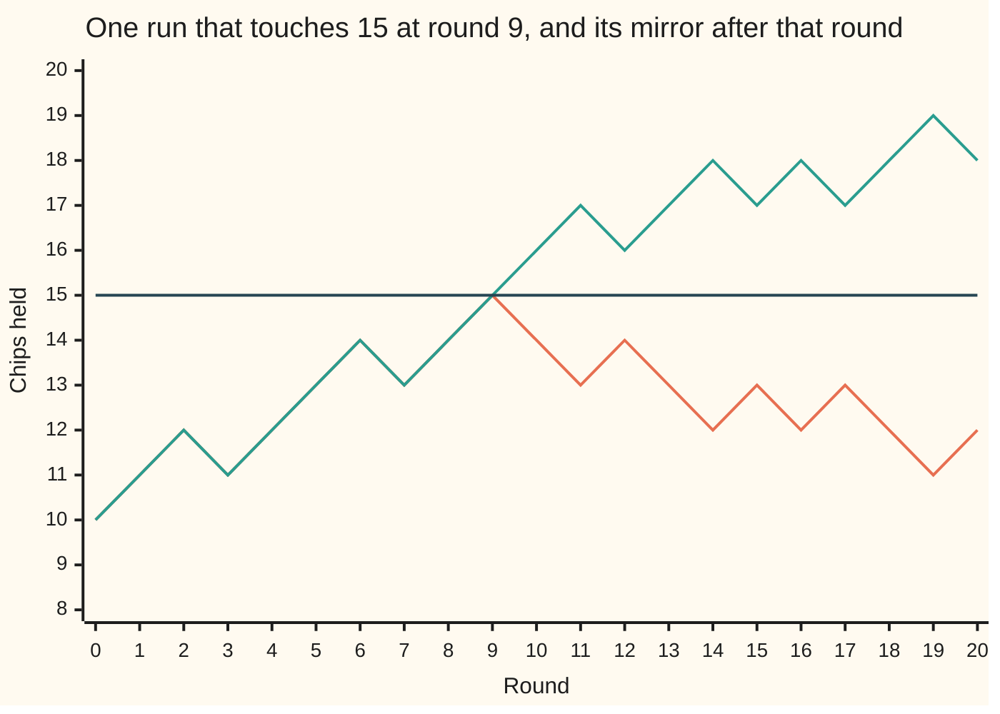
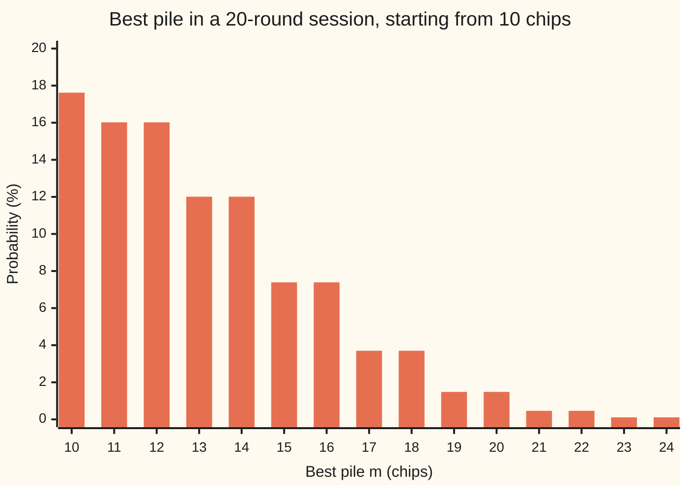
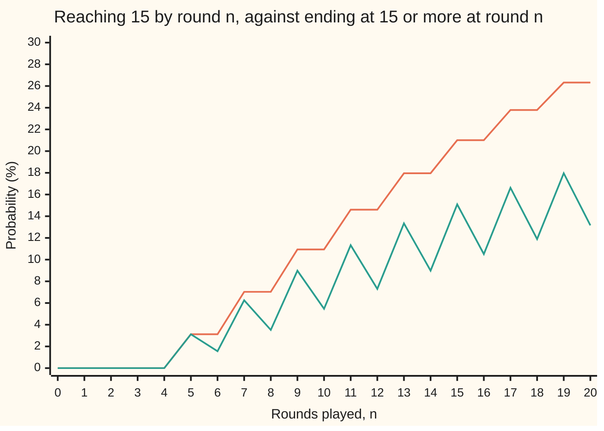

# Reflection principle: counting paths that touch a level

[Syllabus](../../../SYLLABUS.md) → [Stochastic processes and calculus](../../../SYLLABUS.md#w11) → [Random Walks and Filtrations](../../../SYLLABUS.md#w11-s01) → Reflection principle

---

## General Overview

A gambler sits down with 10 chips. Each round a fair coin is tossed: heads wins one chip, tails loses one. The gambler plans to leave the moment the pile reaches 15 chips, and will play at most 20 rounds. What is the chance of leaving with 15?

The question is about the whole session, not its last round. A pile can climb to 15 at round 9 and slide back to 12 by round 20, so reaching 15 is more likely than ending at 15 or more. The question is how much more.

Here it is exactly twice as likely: 0.263 against 0.132, about 1 in 4 against 1 in 8. The reason is a mirror. Flip every round of a run after its first touch of 15, wins to losses and losses to wins, and a run that fell back to 12 becomes one that ends at 18. In a fair game the two are equally likely, so the runs that fall back are exactly as likely as the runs that end above 15.

**For a fair walk moving one step at a time, the chance of touching a level within a fixed number of rounds is the chance of ending at or above it plus the chance of ending strictly above it, because the mirror pairs the runs that touch and fall back with the runs that end above.**

**What kind of fact this is:** a theorem, proved on this card in Why it works, with the full proof in a folded callout; the law of the best pile and the ballot form of first arrival follow from it on the same card.

### The picture: one run and its mirror



Orange: one fixed run of 20 rounds, chosen by hand, not simulated. It first reaches 15 at round 9 and ends at 12. Green: the same run with every round after round 9 flipped; it ends at 18. Dark: the target, 15 chips. Before round 9 the two lines are one line. After it, each is the other's reflection in the target line.

---

## The formula

Notation first, in words. The wing writes a process as $X_n$, read "the value at time n" ([Stochastic processes](01-processes-and-paths.md)). Here $X_n$ is the gambler's pile after round $n$, time is counted in rounds, and one session's sequence of piles is a **path**, the run drawn against time. The pile starts at $x_0$ = 10 chips. The target is $\ell$ = 15 chips, a gap of $a$ = 5 above the start. The **best pile so far**, $M_n$, is the largest of $X_0, X_1, \ldots, X_n$; probabilists call it the **running maximum**. Reaching 15 by round $n$ is the same event as $M_n \ge \ell$.

$$P(M_n \ge \ell) = P(X_n \ge \ell) + P(X_n > \ell), \qquad \ell \ge x_0$$

**Read it aloud:** the chance the pile has touched the target by round n is the chance it ends at or above the target, plus the chance it ends strictly above.

It rests on one exchange, the reflection principle proper. For any ending pile $b$ at or below the target,

$$P(M_n \ge \ell, X_n = b) = P(X_n = 2\ell - b), \qquad b \le \ell$$

**Read it aloud:** touching the target and ending at b is exactly as likely as ending at b's mirror image, as far above the target as b is below.

Two consequences carry the rest of the card. The law of the best pile, for any pile $m$ from the start upward:

$$P(M_n = m) = P(X_n = m) + P(X_n = m + 1), \qquad m \ge x_0$$

And the ballot form of first arrival. Write $\tau$ for the first round at which the pile reaches the target. Then

$$P(\tau = n) = \frac{a}{n}\, P(X_n = \ell), \qquad a \ge 1,\ n \ge 1$$

**Read it aloud:** of all the ways to stand at the target after round n, the share that arrive there for the first time at round n is the gap over the number of rounds.

Every probability here counts paths. Each of the $2^n$ win-loss sequences of n rounds has chance $1/2^n$, and $h$ wins leave the pile at $x_0 + 2h - n$, which happens in $C(n, h)$ of them, read "n choose h" ([Simple random walk](02-simple-random-walk.md)).

| Symbol | Plain meaning | In our example | Push it up and the answer… |
| --- | --- | --- | --- |
| $X_n$, $X_0$ | the pile after round n; $X_0$ is the start | an even number of chips at round 20 | — |
| $n$ | rounds played, the unit of time | 20 | rises: more rounds, more chances to touch |
| $x_0$ | the starting pile | 10 chips | rises, target fixed: less ground to cover |
| $\ell$ | the target level | 15 chips | falls: further to climb |
| $a$ | the gap, $\ell - x_0$ | 5 chips | falls |
| $M_n$, $M_{20}$ | the best pile so far, largest of $X_0$ to $X_n$ | 15 or more on about 1 run in 4 | — |
| $b$ | a possible ending pile at or below the target | 12 | its mirror $2\ell - b$ falls |
| $m$ | a possible best pile | 10 to 30 | its chance falls, in pairs |
| $\tau$ | the first round at which the pile reaches $\ell$ | round 9 on the pictured run | — |
| $h$ | the number of winning rounds | 13 or more to end at 15 or above | the pile ends higher |
| $C(n, h)$, $k$ | ways to choose which h of n rounds were wins; in the Detailed proof, k = (n + a)/2 is the number of wins that leaves the pile at the target | $C(20, 14)$ = 38760 | — |
| $A_b$, $B_b$ | in the proof: runs that touch $\ell$ and end at b; runs that end at $2\ell - b$ | 38760 each at b = 12 | — |

After 20 rounds the pile is even, so nobody ends at exactly 15: the two terms of the sum are equal, and the answer is twice $P(X_{20} \ge 15)$. At a target the pile can end on, 14 say, doubling is wrong (What breaks, below).

### When it holds

- **A fair game.** Swapping wins and losses keeps a path's chance only if the two are equally likely. At roulette's red bet a win comes 18 times in 38, and the formula gives 0.175 where the truth is 0.199.
- **Steps of exactly one chip.** A path moving by one cannot pass 15 without standing on it, so there is a first touch to mirror from. A bet of 3 chips can jump from 14 to 17 without ever sitting at 15.
- **Nothing else stops play before the deadline.** A broke gambler leaves. Within 20 rounds that never matters: 10 losses to go broke and 15 wins to climb from 0 to 15 take 25 rounds. Over 100 rounds it does: 0.617 by the mirror, 0.606 with the floor at 0.
- **A deadline fixed in advance.** The flip changes the rounds after the first touch. If play could also stop on something those rounds do, such as falling back to 12, the flipped run would play on where the original stopped, and the pairing fails.

---

## Why it works

### Step 0: after the first touch, the future is a fresh fair game

The first time the pile stands at 15, what happens next is a new run of fair tosses starting at 15. A fair run and its mirror image, every win swapped for a loss, are equally likely: each sequence of n rounds has chance $1/2^n$. So from the first touch on, ending 3 below 15 and ending 3 above are equally likely. Counting runs that touch 15 becomes counting runs by where they end, and those counts are binomial coefficients.

The counting version of this mirror, with votes instead of chips, is proved on [The reflection principle](../../04-Combinatorics%20and%20graphs/06-Lattice%20Paths%20and%20Catalan%20Numbers/02-reflection-principle-and-ballot-problem.md). This card spends its effort on what the mirror says about the process: its best pile, and when it first arrives.

### Step 1: the mirror is a one-for-one pairing

Take a run that touches 15 and ends at $b$ = 12. Flip every round after the first touch. The pile after the touch now moves the opposite way each round, so it ends at $15 + (15 - 12)$ = 18.

Go the other way. A run ending at 18 started below 15 and moves one chip at a time, so it stood on 15; flip everything after its first touch and it ends at 12. The two flips undo each other, so the two kinds of run are equally many: 38760 each, out of 1048576. The check counts both over all 2^20 runs and finds them equal at every ending pile from 0 to 14.

### Step 2: add up over the ending piles

A run touching 15 by round 20 ends either at 15 or above, or below 15. The first group is every run that ends at 15 or above: such a run touched 15 on its way up. The second group, by Step 1, is as likely as the runs ending above 15, pile by pile. Adding the two groups gives the formula.

<details>
<summary>Detailed proof</summary>

Fix a starting pile $x_0$, a target $\ell > x_0$ and a number of rounds $n$. The sample space is the $2^n$ win-loss sequences, each with probability $2^{-n}$ ([Simple random walk](02-simple-random-walk.md)).

**The map.** Let $b < \ell$. Let $A_b$ be the sequences whose path reaches $\ell$ at some round and ends at $b$, and $B_b$ the sequences whose path ends at $2\ell - b$. For a sequence in $A_b$, let $\tau$ be its first round at $\ell$, and flip every step after round $\tau$. The path up to $\tau$ is unchanged. After $\tau$ each step is negated, so the new path at round $j \ge \tau$ is $2\ell - X_j$. It ends at $2\ell - b$: the image lies in $B_b$.

**The inverse.** A path in $B_b$ starts below $\ell$, ends above it and moves by one, so it visits $\ell$; let $\tau'$ be the first visit. Flip every step after $\tau'$. The prefix is unchanged, so $\tau'$ is still the first visit, and the path ends at $2\ell - (2\ell - b) = b$: the image lies in $A_b$. Neither flip moves the first visit, so the two maps undo each other. So $A_b$ and $B_b$ have the same size, and with equal weights $P(A_b) = P(B_b)$: the reflection principle.

**The sum.** The event $M_n \ge \ell$ splits into $X_n \ge \ell$ (a path ending at or above $\ell$ passed through $\ell$) and the disjoint union of the $A_b$ over $b < \ell$. Summing, $P(M_n \ge \ell) = P(X_n \ge \ell) + \sum_{b < \ell} P(X_n = 2\ell - b) = P(X_n \ge \ell) + P(X_n > \ell)$. At $\ell = x_0$ the formula still holds: the walk is symmetric about its start, so $P(X_n > x_0) = P(X_n < x_0)$ and the right side is 1.

**The best pile.** For $m \ge x_0$, $P(M_n = m) = P(M_n \ge m) - P(M_n \ge m + 1)$. Substituting the formula at $m$ and at $m + 1$, the terms $P(X_n \ge m + 1)$ cancel and $P(X_n = m) + P(X_n = m + 1)$ is left.

**First arrival.** $P(\tau = n) = P(M_n \ge \ell) - P(M_{n-1} \ge \ell)$. Write $u(y)$ for $P(X_{n-1} = y)$. One more fair round gives $P(X_n \ge y) = \tfrac12 P(X_{n-1} \ge y - 1) + \tfrac12 P(X_{n-1} \ge y + 1)$. Put this into the formula at $n$, subtract the formula at $n - 1$, and everything cancels except $\tfrac12\,[u(\ell - 1) - u(\ell + 1)]$. With $k = (n + a)/2$ wins needed, $u(\ell - 1) = C(n-1, k-1)/2^{n-1}$ and $u(\ell + 1) = C(n-1, k)/2^{n-1}$. Since $C(n-1, k-1) = \tfrac{k}{n} C(n, k)$ and $C(n-1, k) = \tfrac{n-k}{n} C(n, k)$, the difference is $\tfrac{2k - n}{n} C(n, k)/2^{n-1} = \tfrac{a}{n} C(n, k)/2^{n-1}$. Halving gives $P(\tau = n) = \tfrac{a}{n}\, C(n, k)/2^n = \tfrac{a}{n} P(X_n = \ell)$.

</details>

### Step 3: the law of the best pile

Asking "touched 15?" for every level at once gives the whole law of $M_{20}$, the best pile of the session: subtract the formula at $m + 1$ from the formula at $m$. Of the two terms left, only one is ever non-zero, since the pile after 20 rounds is even. So each even ending pile above 10 lends its chance to two best piles, itself and the odd pile just below: $P(M_{20} = 11)$ and $P(M_{20} = 12)$ both equal $P(X_{20} = 12)$, 16.02%. The chart shows the pairs.



Bars: $P(M_{20} = m)$ in percent, from the formula; the count over all 2^20 runs prints the same fifteen values. The tallest bar, 17.62% at 10 chips, is the chance the pile never rises above its start. Piles above 24 are rarer still and left off.

Turned around, the formula says when the pile never reaches the target. The walk is symmetric about its start, so ending above 15 is as likely as ending below 5. Hence $P(M_{20} < 15) = P(5 \le X_{20} \le 14)$ = 0.7368: never reaching 15 has exactly the chance of ending between 5 and 14 chips. As the rounds grow the ending pile spreads like $\sqrt{n}$, that window holds less and less of it, and reaching 15 becomes certain for a walk with no floor.

### Step 4: first arrival, and the ballot theorem

The first arrival $\tau$ is at round n exactly when the best pile first reaches 15 at round n. Subtracting the formula at $n - 1$ from the formula at $n$ gives the first-arrival law of The formula (Detailed proof, last paragraph). This is the ballot theorem in walk form. Read a first-arrival path backwards from round n and track how far below 15 each earlier pile was: that distance starts at 0, stays above 0, and ends at 5. That is the ballot condition, with rounds as votes. At 19 rounds, 50388 paths stand at 15, and 13260 of them are there for the first time: five in nineteen, the gap over the rounds.

Arrival happens only at odd rounds, since the gap is odd: 0.031250 at round 5, 0.039062 at rounds 7 and 9, falling to 0.025291 at round 19. They add to 0.263176, the answer again. The check prints each twice, counted and from the formula.

Another route to the same numbers is a recursion: carry the chance of each pile forward one round at a time, removing whatever reaches 15. The code does this as its fourth road. It gives numbers, not a formula, but it survives unfair games and floors where the mirror fails.

---

## Worked numbers, by hand

Gambler with 10 chips, target 15, 20 rounds, fair coin.

| Step | Arithmetic | Value |
| --- | --- | --- |
| the gap $a$ | 15 − 10 | 5 |
| wins needed to end at 15 or more | $10 + 2h - 20 \ge 15$, so $h \ge 12.5$ | 13 |
| runs ending at 15 or more | $C(20, 13) + \cdots + C(20, 20)$ | 137980 |
| all runs | $2^{20}$ | 1048576 |
| $P(X_{20} \ge 15)$ | 137980 / 1048576 | 0.1316 |
| $P(X_{20} > 15)$ | the pile is even, so above 15 means 16 or more: 13 wins again | 0.1316 |
| mirror pairs, one example | touch 15 and end at 12, against end at 18 | 38760 = 38760 |
| **$P(M_{20} \ge 15)$** | 0.1316 + 0.1316 | **0.2632** |

The gambler leaves with 15 chips in about 1 session in 4. In the other 73.7% it never stands on 15. That share equals the chance of ending between 5 and 14 chips, though the two are different sets of runs: a run that never reaches 15 can still end at 3. The expected final pile is still 10: the sessions that reach 15 are paid for by the ones that drift down.

The chance grows with the length of the session, in steps, because arrival happens only at odd rounds:



Orange: reaching 15 by round n; it never falls, since a touch cannot be undone. Green: standing at 15 or more at round n; it zigzags, since after an even number of rounds the pile is even. At round 20 orange is exactly twice green. Each step up in orange is a first-arrival chance: 3.12% to 7.03% from round 5 to round 7 is the 0.039062 of first arriving at round 7.

### What breaks if you drop a piece

| Mistake | Comes out at | What went wrong |
| --- | --- | --- |
| Count only the runs that end at 15 or more | 0.1316 (right: 0.2632) | Half the touching runs fall back before round 20 |
| Target 14, gap 4: double $P(X_{20} \ge 14)$ | 0.5034 (right: 0.3833) | Ending at exactly 14 is possible; those runs are counted twice |
| Roulette red, a win 18 times in 38: use the mirror | 0.1750 (right: 0.1990) | A flipped run no longer has the same chance; the recursion gives the truth |
| 100 rounds, ignoring that a broke gambler leaves | 0.6173 (right: 0.6057) | Runs that hit 0 and climb back are counted, though play stopped at 0 |

The roulette row has a direction. Each run ending above 15 has more wins than the fall-back run it is paired with, and at roulette wins are the rarer outcome, so the mirror *understates* the fall-back runs. With the bias the other way it would overstate them.

---

## Code, from first principles, and it actually runs

Four roads to the answer. Road 1 is the reflection formula, from binomial counts. Road 2 walks out all 1048576 runs of 20 rounds, recording each one's first touch, best pile and end, and counts the mirror pairs pile by pile. Road 3 simulates 200000 sessions with a SplitMix64 generator written out, seed 20260929, and prints its standard error. Road 4 carries the chance forward round by round with a floor at 0, and prices the what-breaks cases where the mirror fails. The asserts test the formula against the counts at an odd and an even gap, the law of the best pile and the ballot formula against the counts, and the simulation against the formula within four standard errors.

### Python

```python
# Reflection principle for the fair walk -- the check behind the card.  Standard library only.
# A gambler holds 10 chips and bets 1 chip a round at fair odds.  Does the pile reach 15 within 20 rounds?
# Road 1: the reflection formula, from binomial counts.  Road 2: all 2^20 paths, walked out one by one.
# Road 3: a seeded simulation (SplitMix64, written out).  Road 4: a round-by-round recursion, which also
# prices the cases where the mirror does not apply.
from math import comb, sqrt

N, X0, L = 20, 10, 15                   # rounds, starting chips, target
A = L - X0                              # gap to the target: 5 chips

def tail(n, x, p=0.5):                  # P(X_n >= x), counting wins h: X_n = X0 + 2h - n
    return sum(comb(n, h) * p ** h * (1 - p) ** (n - h) for h in range(n + 1) if X0 + 2 * h - n >= x)
def p_end(n, x):                        # P(X_n = x) for the fair walk
    h2 = x - X0 + n
    return comb(n, h2 // 2) / 2 ** n if h2 % 2 == 0 and 0 <= h2 <= 2 * n else 0.0
def reach(n, level, p=0.5):             # the reflection principle: P(M_n >= level) = P(X_n >= level) + P(X_n > level)
    return tail(n, level, p) + tail(n, level + 1, p)
def recursion(n, level, p=0.5, floor=None):   # carry the chance forward a round at a time; stop at level (and floor)
    lo = X0 - n - 1 if floor is None else floor
    w = [0.0] * (level - lo + 1); w[X0 - lo] = 1.0; hit = 0.0
    for _ in range(n):
        new = [0.0] * len(w)
        for i in range(1, len(w) - 1):
            new[i + 1] += p * w[i]; new[i - 1] += (1 - p) * w[i]
        hit += new[-1]; new[-1] = 0.0; new[0] = 0.0
        w = new
    return hit

# ---- road 2: every path.  Bit i of w set = the gambler wins round i+1 ----
first = [0] * (N + 1)                   # first[t]: paths whose first visit to 15 is round t
touched_end, end_count, max_count = {}, {}, {}
for w in range(1 << N):
    x, top, t = X0, X0, 0
    for i in range(N):
        x += 1 if w >> i & 1 else -1
        if x > top: top = x
        if x == L and not t: t = i + 1
    end_count[x] = end_count.get(x, 0) + 1
    max_count[top] = max_count.get(top, 0) + 1
    if t:
        first[t] += 1
        touched_end[x] = touched_end.get(x, 0) + 1
reach_count = sum(first)
mirror_levels = [b for b in range(0, L) if touched_end.get(b, 0) == end_count.get(2 * L - b, 0)]

# ---- road 3: simulation.  One 64-bit draw per game; its top 20 bits are the 20 rounds ----
MASK = (1 << 64) - 1
state, games, hits = 20260929, 200000, 0
for _ in range(games):
    state = (state + 0x9E3779B97F4A7C15) & MASK
    z = state
    z = ((z ^ (z >> 30)) * 0xBF58476D1CE4E5B9) & MASK
    z = ((z ^ (z >> 27)) * 0x94D049BB133111EB) & MASK
    z ^= z >> 31
    x = X0
    for i in range(N):
        x += 1 if z >> (63 - i) & 1 else -1
        if x == L: hits += 1; break
p_sim = hits / games
se = sqrt(p_sim * (1 - p_sim) / games)

p_form = reach(N, L)
rows = [
    ("paths in 20 rounds", 2 ** N), ("paths ending at 15 or more", sum(comb(N, h) for h in range(13, N + 1))),
    ("paths touching 15, counted", reach_count),
    ("paths touching 15, 2 x C(20,13..20)", 2 * sum(comb(N, h) for h in range(13, N + 1))),
]
for name, v in rows: print(f"{name:<40} {v:>12d}")
rows = [
    ("1 reflection formula", p_form), ("2 all paths", reach_count / 2 ** N),
    ("3 simulation, 200000 games", p_sim), ("  standard error", se),
    ("4 recursion, broke at 0 ends play", recursion(N, L, floor=0)),
    ("P(5 <= X_20 <= 14), by counting ends", sum(p_end(N, x) for x in range(X0 - A, L))),
    ("wrong: count only ends >= 15", tail(N, L)),
    ("wrong: gap 4, 2 x P(X_20 >= 14)", 2 * tail(N, 14)), ("  right, gap 4", reach(N, 14)),
    ("wrong: mirror at p = 18/38", reach(N, L, 18 / 38)), ("  right, recursion at p = 18/38", recursion(N, L, 18 / 38)),
    ("wrong: mirror, 100 rounds, no floor", reach(100, L)), ("  right, 100 rounds, broke at 0", recursion(100, L, floor=0)),
    ("try: target 11", reach(N, 11)), ("try: target 20", reach(N, 20)), ("try: 24 rounds", reach(24, L)),
]
for name, v in rows: print(f"{name:<40} {v:>12.6f}")
print(f"mirror check: touch 15 and end at b, versus end at 30 - b: equal at {len(mirror_levels)} of 15 ends b = 0..14")
print(f"end b = 12: {touched_end[12]} paths touch 15 and end at 12; {end_count[18]} paths end at 18")
print("first passage  round   all paths   (5/n) P(X_n = 15)")
for n in range(A, N, 2):
    print(f"{'':<15}{n:>5}   {first[n] / 2 ** N:.6f}    {A / n * p_end(n, L):.6f}")
print(f"ballot, 19 rounds: {comb(19, 12)} paths end at 15, {first[19] // 2} first reach it at round 19")
ms = range(X0, X0 + 15)
print("chart, best pile m      " + " ".join(f"{m:>6d}" for m in ms))
print("chart, P(M_20 = m) %    " + " ".join(f"{100 * (p_end(N, m) + p_end(N, m + 1)):6.2f}" for m in ms))
print("chart, counted %        " + " ".join(f"{100 * max_count.get(m, 0) / 2 ** N:6.2f}" for m in ms))
print("chart, rounds n         " + " ".join(f"{n:>6d}" for n in range(N + 1)))
print("chart, P(M_n >= 15) %   " + " ".join(f"{100 * reach(n, L):6.2f}" for n in range(N + 1)))
print("chart, counted %        " + " ".join(f"{100 * sum(first[:n + 1]) / 2 ** N:6.2f}" for n in range(N + 1)))
print("chart, P(X_n >= 15) %   " + " ".join(f"{100 * tail(n, L):6.2f}" for n in range(N + 1)))
steps = "WWLWWWLWWLLWLLWLWLLW"          # one fixed path: first reaches 15 at round 9, ends at 12
path = [X0]
for s in steps: path.append(path[-1] + (1 if s == "W" else -1))
t9 = path.index(L)
print("figure, path            " + " ".join(f"{v:>3d}" for v in path))
print("figure, mirrored        " + " ".join(f"{v if i <= t9 else 2 * L - v:>3d}" for i, v in enumerate(path)))

assert reach_count == 2 * sum(comb(N, h) for h in range(13, N + 1)), "every path, counted, vs the mirror count"
assert len(mirror_levels) == L, "touch-and-end-at-b must match end-at-30-b at every b"
assert abs(reach(N, 14) - sum(c for m, c in max_count.items() if m >= 14) / 2 ** N) < 1e-12, "formula, even gap"
assert all(max_count.get(m, 0) == 2 ** N * (p_end(N, m) + p_end(N, m + 1)) for m in range(X0, X0 + N + 1)), "max law"
assert all(abs(first[n] / 2 ** N - A / n * p_end(n, L)) < 1e-15 for n in range(1, N + 1)), "ballot form of first passage"
assert abs(sum(p_end(N, x) for x in range(X0 - A, L)) - (1 - p_form)) < 1e-12, "never reaching 15 = ending 5..14"
assert abs(recursion(N, L, floor=0) - p_form) < 1e-12, "recursion, with ruin at 0, vs the formula"
assert abs(p_sim - p_form) < 4 * se, "simulation within four standard errors"
print("ALL CHECKS PASS")
```

**Ran 2026-09-29 on macOS, Python 3.14.6, standard library only. All checks passed. Output, pasted from the run:**

```
paths in 20 rounds                            1048576
paths ending at 15 or more                     137980
paths touching 15, counted                     275960
paths touching 15, 2 x C(20,13..20)            275960
1 reflection formula                         0.263176
2 all paths                                  0.263176
3 simulation, 200000 games                   0.264205
  standard error                             0.000986
4 recursion, broke at 0 ends play            0.263176
P(5 <= X_20 <= 14), by counting ends         0.736824
wrong: count only ends >= 15                 0.131588
wrong: gap 4, 2 x P(X_20 >= 14)              0.503445
  right, gap 4                               0.383310
wrong: mirror at p = 18/38                   0.174956
  right, recursion at p = 18/38              0.199032
wrong: mirror, 100 rounds, no floor          0.617299
  right, 100 rounds, broke at 0              0.605675
try: target 11                               0.823803
try: target 20                               0.026604
try: 24 rounds                               0.307456
mirror check: touch 15 and end at b, versus end at 30 - b: equal at 15 of 15 ends b = 0..14
end b = 12: 38760 paths touch 15 and end at 12; 38760 paths end at 18
first passage  round   all paths   (5/n) P(X_n = 15)
                   5   0.031250    0.031250
                   7   0.039062    0.039062
                   9   0.039062    0.039062
                  11   0.036621    0.036621
                  13   0.033569    0.033569
                  15   0.030548    0.030548
                  17   0.027771    0.027771
                  19   0.025291    0.025291
ballot, 19 rounds: 50388 paths end at 15, 13260 first reach it at round 19
chart, best pile m          10     11     12     13     14     15     16     17     18     19     20     21     22     23     24
chart, P(M_20 = m) %     17.62  16.02  16.02  12.01  12.01   7.39   7.39   3.70   3.70   1.48   1.48   0.46   0.46   0.11   0.11
chart, counted %         17.62  16.02  16.02  12.01  12.01   7.39   7.39   3.70   3.70   1.48   1.48   0.46   0.46   0.11   0.11
chart, rounds n              0      1      2      3      4      5      6      7      8      9     10     11     12     13     14     15     16     17     18     19     20
chart, P(M_n >= 15) %     0.00   0.00   0.00   0.00   0.00   3.12   3.12   7.03   7.03  10.94  10.94  14.60  14.60  17.96  17.96  21.01  21.01  23.79  23.79  26.32  26.32
chart, counted %          0.00   0.00   0.00   0.00   0.00   3.12   3.12   7.03   7.03  10.94  10.94  14.60  14.60  17.96  17.96  21.01  21.01  23.79  23.79  26.32  26.32
chart, P(X_n >= 15) %     0.00   0.00   0.00   0.00   0.00   3.12   1.56   6.25   3.52   8.98   5.47  11.33   7.30  13.34   8.98  15.09  10.51  16.62  11.89  17.96  13.16
figure, path             10  11  12  11  12  13  14  13  14  15  14  13  14  13  12  13  12  13  12  11  12
figure, mirrored         10  11  12  11  12  13  14  13  14  15  16  17  16  17  18  17  18  17  18  19  18
ALL CHECKS PASS
```

### Rust

```rust
// Reflection principle for the fair walk -- the same check as reflection_principle_for_walks_check.py.
// Standard library only, no crates.  A gambler holds 10 chips and bets 1 chip a round at fair odds.
// Road 1: the reflection formula.  Road 2: all 2^20 paths.  Road 3: a seeded SplitMix64 simulation.
// Road 4: a round-by-round recursion, which also prices the cases where the mirror does not apply.
use std::collections::HashMap;

const N: usize = 20;
const X0: i64 = 10;
const L: i64 = 15;
const A: i64 = L - X0;

fn comb(n: usize, k: usize) -> u128 {                // exact, as Python's comb; u128 holds C(100, 50)
    if k > n { return 0; }
    let mut c = 1u128;
    for i in 0..k { c = c * (n - i) as u128 / (i + 1) as u128; }
    c
}
fn tail(n: usize, x: i64, p: f64) -> f64 {           // P(X_n >= x), counting wins h
    (0..=n).filter(|&h| X0 + 2 * h as i64 - n as i64 >= x)
        .map(|h| comb(n, h) as f64 * p.powi(h as i32) * (1.0 - p).powi((n - h) as i32)).fold(0.0, |s, v| s + v)
}
fn p_end(n: usize, x: i64) -> f64 {                  // P(X_n = x), fair walk
    let h2 = x - X0 + n as i64;
    if h2 % 2 == 0 && h2 >= 0 && h2 <= 2 * n as i64 { comb(n, (h2 / 2) as usize) as f64 / 2f64.powi(n as i32) } else { 0.0 }
}
fn reach(n: usize, level: i64, p: f64) -> f64 { tail(n, level, p) + tail(n, level + 1, p) }
fn recursion(n: usize, level: i64, p: f64, floor: Option<i64>) -> f64 {
    let lo = floor.unwrap_or(X0 - n as i64 - 1);
    let mut w = vec![0.0f64; (level - lo + 1) as usize];
    w[(X0 - lo) as usize] = 1.0;
    let mut hit = 0.0;
    for _ in 0..n {
        let mut new = vec![0.0f64; w.len()];
        for i in 1..w.len() - 1 { new[i + 1] += p * w[i]; new[i - 1] += (1.0 - p) * w[i]; }
        let last = new.len() - 1;
        hit += new[last]; new[last] = 0.0; new[0] = 0.0;
        w = new;
    }
    hit
}
fn join<T, F: Fn(T) -> String>(it: impl Iterator<Item = T>, f: F) -> String { it.map(f).collect::<Vec<_>>().join(" ") }

fn main() {
    let total = 1u64 << N;
    let tot = total as f64;
    // ---- road 2: every path.  Bit i of w set = the gambler wins round i+1 ----
    let mut first = vec![0u64; N + 1];
    let (mut touched_end, mut end_count, mut max_count) = (HashMap::new(), HashMap::new(), HashMap::new());
    for w in 0..total {
        let (mut x, mut top, mut t) = (X0, X0, 0usize);
        for i in 0..N {
            x += if w >> i & 1 == 1 { 1 } else { -1 };
            if x > top { top = x; }
            if x == L && t == 0 { t = i + 1; }
        }
        *end_count.entry(x).or_insert(0u64) += 1;
        *max_count.entry(top).or_insert(0u64) += 1;
        if t > 0 { first[t] += 1; *touched_end.entry(x).or_insert(0u64) += 1; }
    }
    let get = |m: &HashMap<i64, u64>, k: i64| *m.get(&k).unwrap_or(&0);
    let reach_count: u64 = first.iter().sum();
    let mirror_levels = (0..L).filter(|&b| get(&touched_end, b) == get(&end_count, 2 * L - b)).count();

    // ---- road 3: simulation.  One 64-bit draw per game; its top 20 bits are the 20 rounds ----
    let (mut state, games, mut hits) = (20260929u64, 200000u64, 0u64);
    for _ in 0..games {
        state = state.wrapping_add(0x9E3779B97F4A7C15);
        let mut z = state;
        z = (z ^ (z >> 30)).wrapping_mul(0xBF58476D1CE4E5B9);
        z = (z ^ (z >> 27)).wrapping_mul(0x94D049BB133111EB);
        z ^= z >> 31;
        let mut x = X0;
        for i in 0..N {
            x += if z >> (63 - i) & 1 == 1 { 1 } else { -1 };
            if x == L { hits += 1; break; }
        }
    }
    let p_sim = hits as f64 / games as f64;
    let se = (p_sim * (1.0 - p_sim) / games as f64).sqrt();

    let p_form = reach(N, L, 0.5);
    let never = (X0 - A..L).map(|x| p_end(N, x)).fold(0.0, |s, v| s + v);
    let mirror_count = 2 * (13..=N).map(|h| comb(N, h)).sum::<u128>() as u64;
    for (name, v) in [("paths in 20 rounds", total), ("paths ending at 15 or more", mirror_count / 2),
                      ("paths touching 15, counted", reach_count), ("paths touching 15, 2 x C(20,13..20)", mirror_count)] {
        println!("{:<40} {:>12}", name, v);
    }
    let r = 18.0 / 38.0;
    let rows: Vec<(&str, f64)> = vec![
        ("1 reflection formula", p_form), ("2 all paths", reach_count as f64 / tot),
        ("3 simulation, 200000 games", p_sim), ("  standard error", se),
        ("4 recursion, broke at 0 ends play", recursion(N, L, 0.5, Some(0))),
        ("P(5 <= X_20 <= 14), by counting ends", never),
        ("wrong: count only ends >= 15", tail(N, L, 0.5)),
        ("wrong: gap 4, 2 x P(X_20 >= 14)", 2.0 * tail(N, 14, 0.5)), ("  right, gap 4", reach(N, 14, 0.5)),
        ("wrong: mirror at p = 18/38", reach(N, L, r)), ("  right, recursion at p = 18/38", recursion(N, L, r, None)),
        ("wrong: mirror, 100 rounds, no floor", reach(100, L, 0.5)), ("  right, 100 rounds, broke at 0", recursion(100, L, 0.5, Some(0))),
        ("try: target 11", reach(N, 11, 0.5)), ("try: target 20", reach(N, 20, 0.5)), ("try: 24 rounds", reach(24, L, 0.5)),
    ];
    for (name, v) in &rows { println!("{:<40} {:>12.6}", name, v); }
    println!("mirror check: touch 15 and end at b, versus end at 30 - b: equal at {} of 15 ends b = 0..14", mirror_levels);
    println!("end b = 12: {} paths touch 15 and end at 12; {} paths end at 18", get(&touched_end, 12), get(&end_count, 18));
    println!("first passage  round   all paths   (5/n) P(X_n = 15)");
    for n in (A as usize..N).step_by(2) {
        println!("{:<15}{:>5}   {:.6}    {:.6}", "", n, first[n] as f64 / tot, A as f64 / n as f64 * p_end(n, L));
    }
    println!("ballot, 19 rounds: {} paths end at 15, {} first reach it at round 19", comb(19, 12), first[19] / 2);
    println!("chart, best pile m      {}", join(X0..X0 + 15, |m| format!("{:>6}", m)));
    println!("chart, P(M_20 = m) %    {}", join(X0..X0 + 15, |m| format!("{:6.2}", 100.0 * (p_end(N, m) + p_end(N, m + 1)))));
    println!("chart, counted %        {}", join(X0..X0 + 15, |m| format!("{:6.2}", 100.0 * get(&max_count, m) as f64 / tot)));
    println!("chart, rounds n         {}", join(0..=N, |n| format!("{:>6}", n)));
    println!("chart, P(M_n >= 15) %   {}", join(0..=N, |n| format!("{:6.2}", 100.0 * reach(n, L, 0.5))));
    println!("chart, counted %        {}", join(0..=N, |n| format!("{:6.2}", 100.0 * first[..=n].iter().sum::<u64>() as f64 / tot)));
    println!("chart, P(X_n >= 15) %   {}", join(0..=N, |n| format!("{:6.2}", 100.0 * tail(n, L, 0.5))));
    let mut path = vec![X0];                          // one fixed path: first reaches 15 at round 9, ends at 12
    for c in "WWLWWWLWWLLWLLWLWLLW".chars() { let last = *path.last().unwrap(); path.push(last + if c == 'W' { 1 } else { -1 }); }
    let t9 = path.iter().position(|&v| v == L).unwrap();
    println!("figure, path            {}", join(path.iter(), |v| format!("{:>3}", v)));
    println!("figure, mirrored        {}", join(path.iter().enumerate(), |(i, v)| format!("{:>3}", if i <= t9 { *v } else { 2 * L - v })));

    assert_eq!(reach_count, mirror_count, "every path, counted, vs the mirror count");
    assert_eq!(mirror_levels, L as usize, "touch-and-end-at-b must match end-at-30-b at every b");
    assert!((reach(N, 14, 0.5) - max_count.iter().filter(|(m, _)| **m >= 14).map(|(_, c)| *c).sum::<u64>() as f64 / tot).abs() < 1e-12, "formula, even gap");
    assert!((X0..=X0 + N as i64).all(|m| get(&max_count, m) as f64 == tot * (p_end(N, m) + p_end(N, m + 1))), "max law");
    assert!((1..=N).all(|n| (first[n] as f64 / tot - A as f64 / n as f64 * p_end(n, L)).abs() < 1e-15), "ballot form of first passage");
    assert!((never - (1.0 - p_form)).abs() < 1e-12, "never reaching 15 = ending 5..14");
    assert!((recursion(N, L, 0.5, Some(0)) - p_form).abs() < 1e-12, "recursion, with ruin at 0, vs the formula");
    assert!((p_sim - p_form).abs() < 4.0 * se, "simulation within four standard errors");
    println!("ALL CHECKS PASS");
}
```

**Ran 2026-09-29 on macOS, rustc 1.98.1, no crates. All checks passed. Output, pasted from the run:**

```
paths in 20 rounds                            1048576
paths ending at 15 or more                     137980
paths touching 15, counted                     275960
paths touching 15, 2 x C(20,13..20)            275960
1 reflection formula                         0.263176
2 all paths                                  0.263176
3 simulation, 200000 games                   0.264205
  standard error                             0.000986
4 recursion, broke at 0 ends play            0.263176
P(5 <= X_20 <= 14), by counting ends         0.736824
wrong: count only ends >= 15                 0.131588
wrong: gap 4, 2 x P(X_20 >= 14)              0.503445
  right, gap 4                               0.383310
wrong: mirror at p = 18/38                   0.174956
  right, recursion at p = 18/38              0.199032
wrong: mirror, 100 rounds, no floor          0.617299
  right, 100 rounds, broke at 0              0.605675
try: target 11                               0.823803
try: target 20                               0.026604
try: 24 rounds                               0.307456
mirror check: touch 15 and end at b, versus end at 30 - b: equal at 15 of 15 ends b = 0..14
end b = 12: 38760 paths touch 15 and end at 12; 38760 paths end at 18
first passage  round   all paths   (5/n) P(X_n = 15)
                   5   0.031250    0.031250
                   7   0.039062    0.039062
                   9   0.039062    0.039062
                  11   0.036621    0.036621
                  13   0.033569    0.033569
                  15   0.030548    0.030548
                  17   0.027771    0.027771
                  19   0.025291    0.025291
ballot, 19 rounds: 50388 paths end at 15, 13260 first reach it at round 19
chart, best pile m          10     11     12     13     14     15     16     17     18     19     20     21     22     23     24
chart, P(M_20 = m) %     17.62  16.02  16.02  12.01  12.01   7.39   7.39   3.70   3.70   1.48   1.48   0.46   0.46   0.11   0.11
chart, counted %         17.62  16.02  16.02  12.01  12.01   7.39   7.39   3.70   3.70   1.48   1.48   0.46   0.46   0.11   0.11
chart, rounds n              0      1      2      3      4      5      6      7      8      9     10     11     12     13     14     15     16     17     18     19     20
chart, P(M_n >= 15) %     0.00   0.00   0.00   0.00   0.00   3.12   3.12   7.03   7.03  10.94  10.94  14.60  14.60  17.96  17.96  21.01  21.01  23.79  23.79  26.32  26.32
chart, counted %          0.00   0.00   0.00   0.00   0.00   3.12   3.12   7.03   7.03  10.94  10.94  14.60  14.60  17.96  17.96  21.01  21.01  23.79  23.79  26.32  26.32
chart, P(X_n >= 15) %     0.00   0.00   0.00   0.00   0.00   3.12   1.56   6.25   3.52   8.98   5.47  11.33   7.30  13.34   8.98  15.09  10.51  16.62  11.89  17.96  13.16
figure, path             10  11  12  11  12  13  14  13  14  15  14  13  14  13  12  13  12  13  12  11  12
figure, mirrored         10  11  12  11  12  13  14  13  14  15  16  17  16  17  18  17  18  17  18  19  18
ALL CHECKS PASS
```

The two outputs agree line for line, the simulation included, because both languages run the same generator from the same seed.

> [!TIP]
> **Try changing**
> Guess first; the `try:` rows of the output hold the answers, from the same `reach` function.
> - **A target one chip up, 11.** Touching it has chance **0.8238**; the pile stays at or below 10 all session in about 1 run in 6.
> - **A target twice as far, 20.** The chance falls to **0.0266**, about 1 in 38. Doubling the gap cuts it about tenfold, not in half: the walk spreads like the square root of the rounds.
> - **Four more rounds, 24 in all.** The chance rises from 0.2632 to **0.3075**. Going broke still cannot interfere: 10 losses and then 15 wins need 25 rounds.

---

## The usual mistake

> [!warning]
> **Treating "reaches 15" as "ends at 15 or more".** The final pile forgets the path: a session can stand at 15 at round 9 and end at 12. The ending pile gives 0.1316, half the right answer, and it always comes out too low.
>
> Three smaller traps:
> - **"Twice the tail" as the rule.** It holds only when the pile cannot end exactly on the target. For target 14, doubling gives 0.5034 against 0.3833.
> - **Mirroring an unfair game.** At 18 wins in 38 the formula gives 0.1750 against 0.1990. Unfair games need the recursion.
> - **Reading "fair game" as "cannot get ahead".** Fair means the expected final pile is 10. The pile still reaches 15 in about a quarter of sessions; the sessions that never reach it end below 10 on average, by just enough to balance.

---

## Where you meet it in real life

- **Quit-while-ahead rules.** "Leave when up 5" succeeds about twice as often as "end at least 5 up", and leaves the expected result of a fair game unchanged.
- **Peeking at a running experiment.** A tally stopped the first time it crosses a line crosses it far more often than one read once at the end; the mirror measures the inflation.
- **Counting votes.** The chance the winner leads throughout the count is the ballot theorem: [The reflection principle](../../04-Combinatorics%20and%20graphs/06-Lattice%20Paths%20and%20Catalan%20Numbers/02-reflection-principle-and-ballot-problem.md).
- **Going broke first.** With a floor at 0, a ceiling at 15 and no deadline, the question is the gambler's ruin: [Gambler's ruin](04-gamblers-ruin.md).
- **Barrier contracts.** The continuous version prices contracts that pay only if a share price touches a level before a date: [Reflection principle](../05-Brownian%20Motion/04-reflection-principle-and-running-maximum.md).

> **Say it back**
> Flip a fair walk after its first touch of a level, and a run that fell back becomes one that ends as far above. The flip pairs the two kinds of run, and in a fair game they are equally likely. So touching the level by round n has the chance of ending at or above it plus the chance of ending above it: 0.2632 for 10 chips reaching 15 in 20 rounds. Subtracting gives the law of the best pile and the first-arrival chance, a/n times the chance of standing at the level. It needs fair steps of one and a fixed deadline.

---

## What this builds on

- [Simple random walk](02-simple-random-walk.md): the fair walk with steps of one, its $2^n$ equally likely paths, and the binomial law of where it ends.
- [The reflection principle](../../04-Combinatorics%20and%20graphs/06-Lattice%20Paths%20and%20Catalan%20Numbers/02-reflection-principle-and-ballot-problem.md): the mirror as a counting argument, and the ballot theorem for votes. This card reads both as statements about a process in time.

## Where this goes next

- [Hitting times](06-first-passage-and-hitting-times.md): the first-arrival round as a random time in its own right: why it comes for sure without a deadline, why its average is infinite, and the return time to the start.
- [Reflection principle](../05-Brownian%20Motion/04-reflection-principle-and-running-maximum.md): the same mirror for Brownian motion, where the ending value can never sit exactly on the level and "twice the tail" becomes exact.

What this card leaves open: once the deadline is gone, the pile reaches 15 for sure, but how many rounds does that take on average?

---

## Sources

Verified 2026-09-30: every link below resolves to the publisher's page naming the cited work.

- Feller, William. *An Introduction to Probability Theory and Its Applications*, Volume 1, 3rd ed. Wiley, 1968. [Publisher page](https://www.wiley.com/en-us/An+Introduction+to+Probability+Theory+and+Its+Applications%2C+Volume+1%2C+3rd+Edition-p-9780471257080). Chapter III, on fluctuations in coin tossing: the reflection principle, the ballot theorem, maxima and first passages, the source of this card's shape.
- van der Hofstad, Remco, and Michael Keane. "An Elementary Proof of the Hitting Time Theorem." *The American Mathematical Monthly* 115, no. 8 (2008): 753–756. [doi:10.1080/00029890.2008.11920588](https://doi.org/10.1080/00029890.2008.11920588). The first-arrival formula a/n times the chance of standing at the level, given a short elementary proof that does not use the mirror.
- Addario-Berry, Louigi, and Bruce A. Reed. "Ballot Theorems, Old and New." In *Horizons of Combinatorics*, Bolyai Society Mathematical Studies. Springer, 2008: 9–35. [doi:10.1007/978-3-540-77200-2_1](https://doi.org/10.1007/978-3-540-77200-2_1). A survey of the ballot theorem from Bertrand and André onward, including its random-walk forms.
