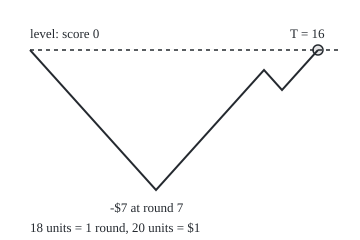
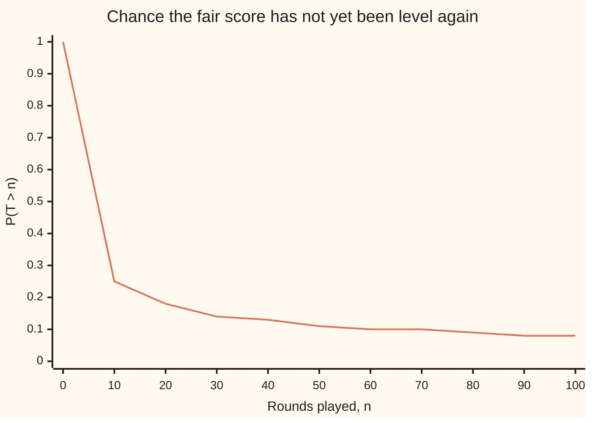
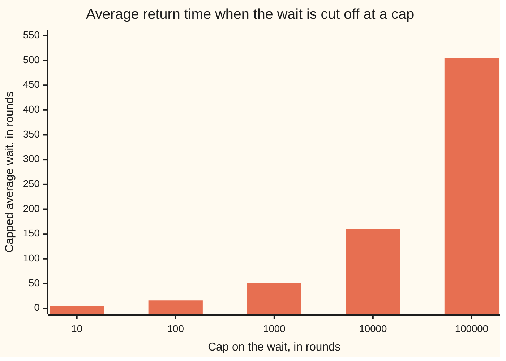

# Hitting times: when a walk first reaches a level, and why the wait can have infinite mean

[Syllabus](../../../SYLLABUS.md) → [Stochastic processes and calculus](../../../SYLLABUS.md#w11) → [Random Walks and Filtrations](../../../SYLLABUS.md#w11-s01) → Hitting times

---

## General Overview

Ana and Ben toss a fair coin once a round. The winner of each toss takes $1 from the other. They start level, and nobody runs out of money: the match goes on as long as it must. Time is counted in rounds.

When is the score level again? Half the time at round 2. About 1 time in 4 it is still not level after 10 rounds; about 1 time in 40, after 1,000 rounds.

The score comes back to level with probability 1. Yet the average wait is infinite. No contradiction: the very long waits are rare, but not rare enough, and they drag the average up without limit.

The first round on which a walk reaches a chosen level is its **hitting time**, or **first passage time**; for the starting level it is the **return time**. Two questions: does it arrive, and how long does it take.

**The fair walk reaches every level, and comes back to its start, with probability 1; but the average wait for either is infinite, because the chance of still waiting after n rounds shrinks only like one over the square root of n.**

**What kind of fact this is:** a theorem, proved on this card in Why it works; the complete arguments sit in folded Detailed proof callouts.

### The picture: one match, and the round it comes back level

<p align="center"></p>

One sample match from the seeded generator in the code (seed 7, the first match whose return falls in rounds 10 to 24), one step per round, drawn to scale. The score is Ana's winnings. Ben pulls $7 ahead by round 7; Ana wins it back, and the score is level at round 16, the return time.

---

## The formula

Notation first, in words. The score after n rounds is written $S_n$: Ana's total winnings in dollars, the simple random walk of [Simple random walk](02-simple-random-walk.md). Each round it moves up one dollar with probability $p$ and down one dollar with probability $q = 1 - p$. The Greek letter tau, $\tau_a$, is the first round on which the score equals the level $a$. The return time $T$ is the first round, after round 0, on which the score is level again.

$$\tau_a = \min\{\,n \ge 1 : S_n = a\,\}, \qquad T = \tau_0, \qquad \tau_a = \infty \text{ if the score never gets there.}$$

**Read it aloud:** the hitting time of a level is the first round the score stands on it; if that never happens, the hitting time is infinite.

Whether it arrives, for a target $a$ of 1 or more:

$$P(\tau_a < \infty) = \begin{cases} 1 & p \ge \tfrac12 \\ (p/q)^a & p < \tfrac12 \end{cases} \qquad\qquad P(T < \infty) = 1 - \lvert p - q \rvert.$$

**Read it aloud:** a fair walk, or one tilted towards the target, gets there for sure; one tilted away loses a factor p over q per level; and the chance of ever coming back is one minus the gap between p and q.

How long, for the fair coin:

$$P(T > 2n) = u_{2n} = \binom{2n}{n}\frac{1}{2^{2n}}, \qquad E[T] = \infty.$$

**Read it aloud:** the chance of no return in 2n rounds equals the chance of a tie at round 2n; and the average return time is infinite.

The binomial coefficient $\binom{2n}{n}$ counts the ways to choose which n of 2n rounds Ana wins. The return time is always even: a tie needs as many wins as losses.

| Symbol | Plain meaning | In our example | Push it up and the answer… |
| --- | --- | --- | --- |
| $S_n$, $S_{2n}$ | the score after n rounds: Ana's winnings in dollars | starts at 0 | — |
| $n$ | rounds played: the clock | 10, 100, 1,000 | fewer matches still waiting |
| $p$ | chance Ana wins a round | 0.5; tilted: 0.4, 0.6 | upward targets come sooner |
| $q$ | chance Ben wins a round, 1 − p | 0.5 | upward targets may be missed |
| $a$ | the target level, in dollars | +1, +3 | a tilted-away walk arrives less often |
| $\tau_a$, $\tau_1$ | hitting time: first round the score equals a | at least 1 round | — |
| $T$ | return time: first round after 0 with the score level | 16 in the picture | — |
| $b$ | depth of a temporary floor at −b dollars | 10, 100, 1,000 | the capped wait grows with it |
| $h$ | chance the score ever climbs one level | 1 when fair; 0.666667 at p = 0.4 | — |
| $u_{2n}$, $u_0$, $u_2$, $u_4$, $u_6$, $u_8$, $u_{10}$ | chance of a tie at round 2n, and of no return by then | $u_{10}$ = 0.246094 | — |
| $N$ | half the cap: the wait is cut off at 2N rounds | cap 10: N = 5 | capped average grows like √N |
| $k$ | a whole-number counter inside steps and proofs: a round, a number of returns, half a final score, or a factor's place | — | — |
| $M(j)$ | in the reflection proof: the number of (2n − 1)-round matches whose net change is j | $M(1)$, half of $\binom{2n}{n}$ | — |
| $s$ | the dial of the generating function: the chance of a first return at round 2n is weighted by s to the power 2n | s = 1 adds up the chances themselves | — |

### When it holds

- **Steps of exactly one dollar.** The score cannot jump a level, so reaching +3 means reaching +1, +2, +3 in turn. With larger steps it can leap past, and the power $(p/q)^a$ is wrong.
- **Independent rounds with the same p.** After each hit the game restarts afresh, which the first-step equations use. If the chance drifts from round to round, the formulas do not apply.
- **Exact fairness, for the sure return and the infinite mean.** At p = 0.4 or 0.6 the chance of ever being level again drops to 0.8. At p = 0.6 the wait to reach +1 has a finite average of 5 rounds.
- **No floor and no deadline.** A gambler with 10 chips who stops at 0 or 11 plays 10 rounds on average. The infinite mean needs unlimited credit and time.
- **One dimension.** Pólya proved in 1921 that a walk on a street grid also returns for sure in two dimensions, but not in three. This card proves only the line.

---

## Why it works

### Step 0: a hitting time is decided by the past, and the game restarts after it

Watching round by round, anyone can say whether the level has been reached yet, without seeing future tosses. Such a time is a stopping time ([Stopping times](../02-Martingales/03-stopping-times-and-optional-stopping.md)); the hitting time is its first example.

The tosses after a hit are new coins, untouched by it, so the game restarts afresh at every hit. That fresh start turns "does it arrive" into a short equation. A temporary floor, moved further and further down, ties the endless game to the finite one solved in [Gambler's ruin](04-gamblers-ruin.md).

### Step 1: the chance of ever climbing one level solves a quadratic

Let $h$ be the chance that the score ever reaches +1. With chance p Ana wins round 1 and is there. With chance q she loses it; from −1 the score must climb two levels, each a fresh copy of the first, with chance h times h.

$$h = p + q\,h^2.$$

It factors as $(h - 1)(q\,h - p) = 0$, so h is 1 or p/q. The equation cannot choose; a floor can. Ask for +1 before a floor at −b: that is gambler's ruin, with answer b/(b + 1) for the fair coin. A match that reaches +1 dips only so far first, so a deep enough floor never interferes. Hence h is the limit as b grows: 1 for the fair coin, p/q when p is below one half (0.666667 at p = 0.4).

Reaching +a is a climbs of one level in a row, so $P(\tau_a < \infty) = h^a$. At p = 0.4 the chance of ever being $3 ahead is 0.296296.

<details>
<summary>Detailed proof: the fresh start and the moving floor</summary>

**Fresh start.** Whether the first hit of +1 is at round k is decided by tosses 1 to k. Later tosses are independent of those, with the same law. Summing over k, the chance of reaching +1 and then climbing once more is the sum of P(first hit at k) times h, that is h times h. Downward climbs work the same way.

**First step.** Condition on round 1 (total probability, wing 09): up gives chance 1, down needs two fresh climbs, chance $h^2$. Hence $h = p + q\,h^2$.

**Moving floor.** Let E(b) be the event that the score reaches +1 before −b. Steps are ±1, so to reach −(b + 1) the score must first touch −b; hence E(b) is contained in E(b + 1). A match with $\tau_1 = k$ has a lowest score on rounds 0 to k; any floor −b below that puts the match in E(b). So the union of the events E(b) is the event that $\tau_1$ is finite, and continuity of probability along an increasing sequence (wing 10) gives $P(\tau_1 < \infty) = \lim_b P(E(b))$.

**The limit.** [Gambler's ruin](04-gamblers-ruin.md) gives P(E(b)) = b/(b + 1) when p = q, and $(1 - (q/p)^b)/(1 - (q/p)^{b+1})$ otherwise. Fair: the limit is 1. When p > q, q/p is below 1, its powers shrink to 0, and the limit is 1. When p < q, divide top and bottom by $(q/p)^{b+1}$: the limit is p/q. Then $P(\tau_a < \infty) = h^a$, by a fresh climbs in a row.

</details>

### Step 2: the chance of ever coming back is one minus the gap between p and q

After round 1 the score is +1 (chance p) or −1 (chance q). From +1, getting back is one level downward: Step 1 with p and q swapped gives chance 1 if q ≥ p, else q/p. From −1 it is 1 if p ≥ q, else p/q. So

$$P(T < \infty) = p\cdot\min(1, q/p) + q\cdot\min(1, p/q) = 2\min(p, q) = 1 - \lvert p - q\rvert.$$

using p + q = 1. For the fair coin it is 1: the walk is **recurrent**, meaning it comes back for sure. Each return restarts the game, so it comes back again and again, infinitely often. At p = 0.4 the chance is 0.8, and at least k returns has chance 0.8 to the power k: after a few returns the walk leaves for good, which is called **transient**.

Inside walls at +b and −b, the fair score is level again before a wall with chance 1 − 1/b: 0.9, 0.99, 0.999 for b = 10, 100, 1,000. It climbs towards 1 and reaches it only with no walls.

### Step 3: the chance of still waiting after 2n rounds is the chance of a tie at 2n

The reflection principle of [Reflection principle](05-reflection-principle-for-walks.md) gives the law. Count the 2n-round matches in which Ana stays strictly ahead. Reflection turns the count into a telescoping sum, which collapses to half the ways to tie at round 2n. Adding the mirror case, Ben ahead, gives $\binom{2n}{n}$ of the $2^{2n}$ matches never level after the start:

$$P(T > 2n) = u_{2n}.$$

Differences give the first-return chances, $P(T = 2n) = u_{2n-2} - u_{2n}$: 1/2, 1/8, 1/16 and 5/128 for rounds 2, 4, 6 and 8.

The wait for +1 has the same law, one round earlier. The return time is round 1 plus a one-level wait back to 0, which by the mirror has the law of $\tau_1$. So $P(\tau_1 = 2n - 1) = P(T = 2n)$: 1/2, 1/8, 1/16 and 5/128 for rounds 1, 3, 5 and 7. The code confirms both laws on all 65,536 matches of 16 rounds.



The line is the chance of no return yet, at every tenth round, to two places. It drops fast, then crawls: 0.25 at round 10, 0.08 at round 100. By [Stirling's approximation](../../06-Calculus%20and%20analysis/06-Series/09-stirlings-approximation.md), $u_{2n}$ is close to one over the square root of π n: at round 1,000, so n = 500, that gives 0.025231 against the true 0.025225.

<details>
<summary>Detailed proof: the reflection count, and the first-return law</summary>

Call a match of 2n rounds **Ana-ahead** if the score is positive on every round 1 to 2n. Such a match wins round 1 and then runs 2n − 1 rounds from +1 without touching 0. Fix its final score 2k, with k from 1 to n. Write $M(j)$ for the number of (2n − 1)-round matches whose net change is j.

Matches from +1 to 2k: $M(2k - 1)$ of them. Those that touch 0: reflect the part before the first touch in the level 0. That swaps them one for one with matches from −1 to 2k, of which there are $M(2k + 1)$ (the reflection principle). So Ana-ahead matches ending at 2k number $M(2k - 1) - M(2k + 1)$.

Sum over k from 1 to n. Each negative term cancels the next positive one, and $M(2n + 1) = 0$, leaving $M(1)$: matches of 2n − 1 rounds with n wins and n − 1 losses, which is $\binom{2n-1}{n}$, half of $\binom{2n}{n}$. Adding the mirror Ben-ahead matches gives $\binom{2n}{n}$ matches never level after the start, and dividing by $2^{2n}$ gives $P(T > 2n) = u_{2n}$.

T is even, so $P(T = 2n) = P(T > 2n - 2) - P(T > 2n) = u_{2n-2} - u_{2n}$. With $u_0$ = 1 and each $u_{2n}$ equal to the one before times (2n − 1)/(2n), this gives 1/2, 1/8, 1/16, 5/128.

</details>

### Step 4: the average wait is infinite, by two roads

**Road one: a floor only shortens the wait.** Reaching +1 or −b, whichever comes first, never takes longer than reaching +1. By [Gambler's ruin](04-gamblers-ruin.md), a fair game starting 1 below the top and b above the floor lasts 1 × b rounds on average. So the average wait for +1 is at least b, for every b, and $E[\tau_1] = \infty$. The return time is one round plus a wait of this kind, so $E[T] = \infty$ too.

The house example is b = 10: a gambler with 10 chips who stops at 0 or 11 reaches 11 with chance 0.909091 and plays 10 rounds on average. Without the floor the wait only grows.

**Road two: add up the chances of still waiting.** A count's average is the sum of the chances that it exceeds 0, 1, 2 and so on (wing 09). Cut the wait off at 2N rounds; T is even, so each $u_{2n}$ appears twice:

$$E[\min(T, 2N)] = 2\sum_{n=0}^{N-1} u_{2n} = 2(2N - 1)\,u_{2N-2} \;\ge\; \sqrt{N}.$$

The capped average grows like the square root of the cap, so the uncapped average is infinite.



Each bar is the exact capped average for one cap, to two places. It never settles.

<details>
<summary>Detailed proof: the tail sum, the square-root floor and the closed form</summary>

**Tail sum.** A count X equals the number of k ≥ 0 with k < X; averaging, E[X] is the sum of P(X > k). For min(T, 2N), T even gives P(T > 2n + 1) = P(T > 2n) = $u_{2n}$.

**Square-root floor.** $u_{2n}$ is the product of the factors (2k − 1)/(2k) for k = 1 to n. For k ≥ 2, $(2k-1)^2 = 4k^2 - 4k + 1 > (2k)(2k - 2)$, so (2k − 1)/(2k) exceeds (2k − 2)/(2k − 1). Write $u_{2n}^2$ as the product times itself. In the second copy keep the factor 1/2 for k = 1 and shrink each later factor to (2k − 2)/(2k − 1). Pairing factor k of the first copy with the shrunk one leaves (2k − 2)/(2k) = (k − 1)/k, and those telescope to 1/n. So $u_{2n}^2 \ge \tfrac12 \cdot \tfrac12 \cdot \tfrac1n$ and $u_{2n} \ge 1/(2\sqrt{n})$. Then the capped average is at least 2 plus the sum of $1/\sqrt{n}$ for n = 1 to N − 1, which is at least the sum for n = 1 to N, which is at least N times $1/\sqrt{N}$, that is √N.

**Closed form.** By induction, $u_0 + u_2 + \dots + u_{2m} = (2m + 1)\,u_{2m}$: true at m = 0, and adding $u_{2m+2}$ to $(2m + 1)u_{2m} = (2m + 2)u_{2m+2}$ gives $(2m + 3)u_{2m+2}$.

**Road one, in full.** On every match, $\min(\tau_1, \tau_{-b}) \le \tau_1$, allowing the value ∞. Averages of variables that are never negative keep that order (monotonicity of the integral, wing 10), so $E[\tau_1] \ge b$. After round 1 the score is ±1 and the remaining wait is a copy of $\tau_1$ or its mirror, so $E[T] = 1 + E[\tau_1] = \infty$.

</details>

### The other door: generating functions

The classical route packs the first-return chances into one power series in s, the generating function, equal to $1 - \sqrt{1 - s^2}$. At s = 1 it is 1: sure return. Its slope there is infinite: infinite mean. Feller, under Sources, takes this door.

---

## Worked numbers, by hand

Fair coin; cap the wait at 10 rounds, so N = 5.

| Step | Arithmetic | Value |
| --- | --- | --- |
| $u_2$, no tie yet after 2 rounds | 1/2 | 0.5 |
| $u_4$ | 0.5 × 3/4 | 0.375 |
| $u_6$ | 0.375 × 5/6 | 0.3125 |
| $u_8$ | 0.3125 × 7/8 | 0.273438 |
| $u_{10}$, still waiting after 10 rounds | 0.273438 × 9/10 | 0.246094 |
| P(T = 8), level first at round 8 | $u_6 - u_8$ = 0.3125 − 0.273438 | 5/128 |
| capped average, E[min(T, 10)] | 2 × (1 + 0.5 + 0.375 + 0.3125 + 0.273438) | 4.921875 |
| same, closed form | 2 × 9 × $u_8$ | 4.921875 |
| square-root floor, √N | √5 | 2.236068 |
| **house cross-check: 10 chips, stop at 0 or 11** | chance of 11 is 10/11; rounds on average 10 × 1 | **0.909091 and 10 rounds** |

Half of all fair matches are level after 2 rounds, yet about 1 in 4 is still waiting after 10, and the average wait capped at 10 rounds is already 4.92 rounds.

### What breaks if you drop a piece

| Mistake | Comes out at | What went wrong |
| --- | --- | --- |
| Tilt the coin to p = 0.4 and still expect a sure return | 0.8 chance of ever being level again | fairness is a hypothesis: 1 match in 5 never returns |
| Assume every sure hit has an infinite mean | at p = 0.6 the wait for +1 averages 5 rounds | the tilt towards the target makes the mean finite |
| Treat "sure to return" as a deadline | 0.025225 chance of still waiting after 1,000 rounds | probability 1 bounds nothing; about 1 in 40 matches waits longer |
| Report a capped average as the mean | 50.45 at cap 1,000; 504.63 at cap 100,000 | the capped average tracks the cap, not a fixed number |

---

## Code, from first principles, and it actually runs

Every number on this card is reached by at least two independent roads. Road 1: the formula, built as a product. Road 2: all 65,536 matches of 16 rounds listed, first returns and first passages to +1 counted in exact fractions. Road 3: probability pushed forward round by round for 1,000 rounds, the level absorbing whatever reaches it, checked against the formula at every round. Road 4: first-step equations with a floor, solved by elimination. Road 5: a seeded simulation of 20,000 matches, each cut off at 10,000 rounds, with standard errors, from a SplitMix64 generator written out in both languages.

### Python

```python
# Hitting times of the simple random walk -- the check behind the card.  Standard library only.
# Roads: the formula; every path of 16 rounds enumerated; probability pushed along every path
# round by round; first-step equations solved by elimination; a seeded simulation with its
# standard error.  Nothing imported knows the answer.
from fractions import Fraction
from math import sqrt, pi

M64 = (1 << 64) - 1
class SplitMix64:                                  # the small generator, written out
    def __init__(self, seed): self.s = seed
    def next(self):
        self.s = (self.s + 0x9E3779B97F4A7C15) & M64
        z = self.s
        z = ((z ^ (z >> 30)) * 0xBF58476D1CE4E5B9) & M64
        z = ((z ^ (z >> 27)) * 0x94D049BB133111EB) & M64
        return z ^ (z >> 31)
    def step(self): return 1 if self.next() >> 63 else -1   # top bit: +1 or -1, each half the time

def u(two_n, x=1.0):                               # formula: P(S_2n = 0) = C(2n, n) / 2^(2n), as a product
    for k in range(1, two_n // 2 + 1): x = x * (2 * k - 1) / (2 * k)
    return x

def first_step(lo, hi, p, start, top, bottom, cost):
    # h_k = cost + p h_(k+1) + (1 - p) h_(k-1) for lo < k < hi, h_lo = bottom, h_hi = top.
    q, n = 1.0 - p, hi - lo - 1
    b, c, d = [1.0] * n, [-p] * n, [cost] * n
    d[0] += q * bottom; d[-1] += p * top
    for i in range(1, n):                          # eliminate downwards
        m = -q / b[i - 1]; b[i] -= m * c[i - 1]; d[i] -= m * d[i - 1]
    h = [0.0] * n; h[-1] = d[-1] / b[-1]
    for i in range(n - 2, -1, -1): h[i] = (d[i] - c[i] * h[i + 1]) / b[i]
    return h[start - lo - 1]

def row(name, *vals): print(f"{name:<40}" + "".join(f"{v:>12.6f}" for v in vals))
def row_eq(name, got, want): row(name, got, want); assert abs(got - want) < 1e-9, name

# ---- road 2: every one of the 2^16 paths of 16 rounds, first return to level recorded ----
L = 16
first, hit1, never = [0] * (L + 1), [0] * (L + 1), 0
for w in range(1 << L):
    s, back, up = 0, 0, 0
    for i in range(L):
        s += 1 if (w >> i) & 1 else -1
        if s == 0 and not back: first[i + 1] += 1; back = 1
        if s == 1 and not up: hit1[i + 1] += 1; up = 1
    never += not back
print(f"{'first return T, all 65536 paths of 16':<40}{'enumerated':>12}{'formula':>12}")
for t in (2, 4, 6, 8):
    e, f = Fraction(first[t], 1 << L), u(t - 2, Fraction(1)) - u(t, Fraction(1))
    print(f"{'  P(T = ' + str(t) + ')':<40}{str(e):>12}{str(f):>12}")
    assert e == f, "enumerated first-return law vs u(2n-2) - u(2n)"
e16 = Fraction(never, 1 << L)
print(f"{'  P(T > 16)':<40}{str(e16):>12}{str(u(16, Fraction(1))):>12}")
assert e16 == u(16, Fraction(1)), "no return in 16 rounds vs P(S_16 = 0)"
for t in (1, 3, 5, 7):                             # first passage to +1 at round t = 2n - 1 has P(T = 2n)
    e, f = Fraction(hit1[t], 1 << L), u(t - 1, Fraction(1)) - u(t + 1, Fraction(1))
    print(f"{'  P(tau_1 = ' + str(t) + ')':<40}{str(e):>12}{str(f):>12}")
    assert e == f, "enumerated first passage to +1 vs P(T = t + 1)"

# ---- road 3: push probability along every path, level absorbs; survival to 1000 rounds ----
N = 1000
dist = {0: 1.0}; surv = [1.0]
for k in range(1, N + 1):
    new = {}
    for x, pr in dist.items():
        for y in (x - 1, x + 1):
            if y != 0: new[y] = new.get(y, 0.0) + pr / 2
    dist = new; surv.append(sum(dist.values()))
print(f"{'still waiting, P(T > n)':<40}{'pushed':>12}{'formula':>12}")
for n in range(N + 1):                             # every n checked; a few printed
    if n in (0, 2, 4, 6, 8, 10, 20, 40, 60, 80, 100, 1000): row(f"  n = {n}", surv[n], u(n))
    assert abs(surv[n] - u(n)) < 1e-12, "pushed survival vs C(n, n/2) / 2^n"
row("  1 / sqrt(pi * 500), estimate at 1000", 1 / sqrt(pi * 500))
print("chart, P(T > n), n = 0 to 100 by 10:", " ".join(f"{surv[n]:.2f}" for n in range(0, 101, 10)))

# ---- the mean: capped averages E[min(T, cap)] grow without limit ----
print(f"{'capped mean E[min(T, cap)]':<40}{'tail sum':>12}{'closed':>12}{'sqrt(cap/2)':>12}")
run, tail, capped = 1.0, 0.0, {}
for n in range(0, 50000):                          # tail sum: E[min(T, 2N)] = 2 * sum of u(2n), n < N
    tail += 2 * run
    if 2 * (n + 1) in (10, 100, 1000, 10000, 100000):
        cap = 2 * (n + 1); capped[cap] = tail
        row(f"  cap = {cap}", tail, 2 * (cap - 1) * u(cap - 2), sqrt(cap / 2))
        assert abs(tail - 2 * (cap - 1) * u(cap - 2)) < 1e-9 * cap, "tail sum vs closed form"
        assert tail >= sqrt(cap / 2), "capped mean at least sqrt(cap/2), from u(2n) >= 1/(2 sqrt n)"
    run *= (2 * n + 1) / (2 * n + 2)
print("chart, capped mean, caps 10 to 100000:", " ".join(f"{capped[c]:.2f}" for c in sorted(capped)))
assert abs(sum(surv[:1000]) - capped[1000]) < 1e-9, "pushed survival summed vs formula tail sum"

# ---- road 4: first-step equations with a floor at -b; the wait for +1 is at least b ----
print(f"{'first-step equations':<40}{'solved':>12}{'formula':>12}")
row_eq("  10 chips, stop at 0 or 11: P(reach 11)", first_step(-10, 1, 0.5, 0, 1.0, 0.0, 0.0), 10 / 11)
for b in (10, 100, 1000):
    m = first_step(-b, 1, 0.5, 0, 0.0, 0.0, 1.0)
    row(f"  fair, mean rounds to +1 or -{b}", m, b * 1.0)
    assert abs(m - b) < 1e-6 * b, "first-step duration vs b * 1 from gambler's ruin"
for b in (10, 100, 1000):
    row_eq(f"  fair, P(level again before +-{b})", first_step(0, b, 0.5, 1, 0.0, 1.0, 0.0), 1 - 1 / b)
for p in (0.4, 0.6):
    q = 1 - p
    up = first_step(-400, 1, p, 0, 1.0, 0.0, 0.0)
    back = p * first_step(0, 400, p, 1, 0.0, 1.0, 0.0) + q * first_step(-400, 0, p, -1, 1.0, 0.0, 0.0)
    row_eq(f"  p = {p}: P(ever reach +1)", up, min(1.0, p / q))
    row_eq(f"  p = {p}: P(ever level again)", back, 1 - abs(p - q))
row_eq("  p = 0.4: P(ever reach +3)", first_step(-400, 3, 0.4, 0, 1.0, 0.0, 0.0), (0.4 / 0.6) ** 3)
row_eq("  p = 0.6: mean rounds to reach +1", first_step(-400, 1, 0.6, 0, 0.0, 0.0, 1.0), 1 / (0.6 - 0.4))

# ---- road 5: seeded simulation, 20000 matches, each capped at 10000 rounds ----
rng, NS, CAP = SplitMix64(20260929), 20000, 10000
t2 = over100 = 0; tot = tot2 = 0.0
for _ in range(NS):
    s, t = rng.step(), 1
    while s != 0 and t < CAP: s += rng.step(); t += 1
    t2 += t == 2; over100 += t > 100; tot += t; tot2 += t * t
mean = tot / NS; se = sqrt((tot2 / NS - mean * mean) / NS)
for name, k, f in (("P(T = 2)", t2, 0.5), ("P(T > 100)", over100, u(100))):
    ph = k / NS; sep = sqrt(ph * (1 - ph) / NS)
    print(f"sim {name:<36}{ph:>12.6f} +- {sep:.6f}  formula {f:.6f}")
    assert abs(ph - f) < 4 * sep, "simulated chance within 4 standard errors"
print(f"sim E[min(T, 10000)]{'':<20}{mean:>12.6f} +- {se:.6f}  formula {capped[10000]:.6f}")
assert abs(mean - capped[10000]) < 4 * se, "simulated capped mean within 4 standard errors"

# ---- the picture: one sample match, seed 7, the first whose return comes in rounds 10 to 24 ----
g = SplitMix64(7)
while True:
    path = [0]
    while len(path) < 25 and (len(path) == 1 or path[-1] != 0): path.append(path[-1] + g.step())
    if path[-1] == 0 and len(path) >= 11: break
print("figure, T =", len(path) - 1, "scores:", " ".join(str(x) for x in path))
print("figure, svg points:", " ".join(f"{30 + 18 * i},{50 - 20 * x}" for i, x in enumerate(path)))
print("ALL CHECKS PASS")
```

**Ran 2026-09-30 on macOS, Python 3.14.6, standard library only. All checks passed. Output, pasted from the run:**

```
first return T, all 65536 paths of 16     enumerated     formula
  P(T = 2)                                       1/2         1/2
  P(T = 4)                                       1/8         1/8
  P(T = 6)                                      1/16        1/16
  P(T = 8)                                     5/128       5/128
  P(T > 16)                               6435/32768  6435/32768
  P(tau_1 = 1)                                   1/2         1/2
  P(tau_1 = 3)                                   1/8         1/8
  P(tau_1 = 5)                                  1/16        1/16
  P(tau_1 = 7)                                 5/128       5/128
still waiting, P(T > n)                       pushed     formula
  n = 0                                     1.000000    1.000000
  n = 2                                     0.500000    0.500000
  n = 4                                     0.375000    0.375000
  n = 6                                     0.312500    0.312500
  n = 8                                     0.273438    0.273438
  n = 10                                    0.246094    0.246094
  n = 20                                    0.176197    0.176197
  n = 40                                    0.125371    0.125371
  n = 60                                    0.102578    0.102578
  n = 80                                    0.088928    0.088928
  n = 100                                   0.079589    0.079589
  n = 1000                                  0.025225    0.025225
  1 / sqrt(pi * 500), estimate at 1000      0.025231
chart, P(T > n), n = 0 to 100 by 10: 1.00 0.25 0.18 0.14 0.13 0.11 0.10 0.10 0.09 0.08 0.08
capped mean E[min(T, cap)]                  tail sum      closed sqrt(cap/2)
  cap = 10                                  4.921875    4.921875    2.236068
  cap = 100                                15.917847   15.917847    7.071068
  cap = 1000                               50.450036   50.450036   22.360680
  cap = 10000                             159.572923  159.572923   70.710678
  cap = 100000                            504.625243  504.625243  223.606798
chart, capped mean, caps 10 to 100000: 4.92 15.92 50.45 159.57 504.63
first-step equations                          solved     formula
  10 chips, stop at 0 or 11: P(reach 11)    0.909091    0.909091
  fair, mean rounds to +1 or -10           10.000000   10.000000
  fair, mean rounds to +1 or -100         100.000000  100.000000
  fair, mean rounds to +1 or -1000       1000.000000 1000.000000
  fair, P(level again before +-10)          0.900000    0.900000
  fair, P(level again before +-100)         0.990000    0.990000
  fair, P(level again before +-1000)        0.999000    0.999000
  p = 0.4: P(ever reach +1)                 0.666667    0.666667
  p = 0.4: P(ever level again)              0.800000    0.800000
  p = 0.6: P(ever reach +1)                 1.000000    1.000000
  p = 0.6: P(ever level again)              0.800000    0.800000
  p = 0.4: P(ever reach +3)                 0.296296    0.296296
  p = 0.6: mean rounds to reach +1          5.000000    5.000000
sim P(T = 2)                                0.492700 +- 0.003535  formula 0.500000
sim P(T > 100)                              0.078500 +- 0.001902  formula 0.079589
sim E[min(T, 10000)]                      161.691900 +- 7.373439  formula 159.572923
figure, T = 16 scores: 0 -1 -2 -3 -4 -5 -6 -7 -6 -5 -4 -3 -2 -1 -2 -1 0
figure, svg points: 30,50 48,70 66,90 84,110 102,130 120,150 138,170 156,190 174,170 192,150 210,130 228,110 246,90 264,70 282,90 300,70 318,50
ALL CHECKS PASS
```

### Rust

```rust
// Hitting times of the simple random walk -- the same check as first_passage_and_hitting_times_check.py.
// Std only, no crates.  Roads: the formula; every path of 16 rounds enumerated; probability pushed
// along every path round by round; first-step equations solved by elimination; a seeded simulation
// with its standard error.  Exact fractions are kept as u128 numerator over a power of 4.
// Compile: rustc --edition 2021 -O first_passage_and_hitting_times_check.rs -o /tmp/<dir>/chk
use std::f64::consts::PI;

struct SplitMix64 { s: u64 }                       // the small generator, written out
impl SplitMix64 {
    fn next(&mut self) -> u64 {
        self.s = self.s.wrapping_add(0x9E3779B97F4A7C15);
        let mut z = self.s;
        z = (z ^ (z >> 30)).wrapping_mul(0xBF58476D1CE4E5B9);
        z = (z ^ (z >> 27)).wrapping_mul(0x94D049BB133111EB);
        z ^ (z >> 31)
    }
    fn step(&mut self) -> i64 { if self.next() >> 63 == 1 { 1 } else { -1 } }
}

fn u(two_n: usize) -> f64 {                        // formula: P(S_2n = 0) = C(2n, n) / 2^(2n), as a product
    let mut x = 1.0;
    for k in 1..=two_n / 2 { x = x * (2 * k - 1) as f64 / (2 * k) as f64; }
    x
}
fn central(two_n: u128) -> u128 {                  // C(2n, n) exactly
    let mut c: u128 = 1;
    for k in 0..two_n / 2 { c = c * (two_n - k) / (k + 1); }
    c
}
fn gcd(a: u128, b: u128) -> u128 { if b == 0 { a } else { gcd(b, a % b) } }
fn frac(num: u128, den: u128) -> String { let g = gcd(num, den); format!("{}/{}", num / g, den / g) }

fn first_step(lo: i64, hi: i64, p: f64, start: i64, top: f64, bottom: f64, cost: f64) -> f64 {
    // h_k = cost + p h_(k+1) + (1 - p) h_(k-1) for lo < k < hi, h_lo = bottom, h_hi = top.
    let (q, n) = (1.0 - p, (hi - lo - 1) as usize);
    let (mut b, c, mut d) = (vec![1.0; n], vec![-p; n], vec![cost; n]);
    d[0] += q * bottom; d[n - 1] += p * top;
    for i in 1..n {                                // eliminate downwards
        let m = -q / b[i - 1]; b[i] -= m * c[i - 1]; d[i] -= m * d[i - 1];
    }
    let mut h = vec![0.0; n]; h[n - 1] = d[n - 1] / b[n - 1];   // then substitute back upwards
    for i in (0..n - 1).rev() { h[i] = (d[i] - c[i] * h[i + 1]) / b[i]; }
    h[(start - lo - 1) as usize]
}

fn row(name: &str, vals: &[f64]) { println!("{:<40}{}", name, vals.iter().map(|v| format!("{:>12.6}", v)).collect::<String>()); }
fn row_eq(name: &str, got: f64, want: f64) { row(name, &[got, want]); assert!((got - want).abs() < 1e-9, "{}", name); }

fn main() {
    // ---- road 2: every one of the 2^16 paths of 16 rounds, first return to level recorded ----
    const L: usize = 16;
    let (mut first, mut hit1, mut never) = ([0u128; L + 1], [0u128; L + 1], 0u128);
    for w in 0u32..(1 << L) {
        let (mut s, mut back, mut up) = (0i64, false, false);
        for i in 0..L {
            s += if (w >> i) & 1 == 1 { 1 } else { -1 };
            if s == 0 && !back { first[i + 1] += 1; back = true; }
            if s == 1 && !up { hit1[i + 1] += 1; up = true; }
        }
        if !back { never += 1; }
    }
    println!("{:<40}{:>12}{:>12}", "first return T, all 65536 paths of 16", "enumerated", "formula");
    for t in [2u128, 4, 6, 8] {
        let den = 1u128 << t;                      // u(t-2) - u(t) over the common denominator 2^t
        let f_num = 4 * central(t - 2) - central(t);
        println!("{:<40}{:>12}{:>12}", format!("  P(T = {})", t), frac(first[t as usize], 1 << L), frac(f_num, den));
        assert!(first[t as usize] * den == f_num * (1u128 << L), "enumerated first-return law vs u(2n-2) - u(2n)");
    }
    println!("{:<40}{:>12}{:>12}", "  P(T > 16)", frac(never, 1 << L), frac(central(16), 1 << 16));
    assert!(never == central(16), "no return in 16 rounds vs P(S_16 = 0)");
    for t in [1u128, 3, 5, 7] {                    // first passage to +1 at round t = 2n - 1 has P(T = 2n)
        let (den, f_num) = (1u128 << (t + 1), 4 * central(t - 1) - central(t + 1));
        println!("{:<40}{:>12}{:>12}", format!("  P(tau_1 = {})", t), frac(hit1[t as usize], 1 << L), frac(f_num, den));
        assert!(hit1[t as usize] * den == f_num * (1u128 << L), "enumerated first passage to +1 vs P(T = t + 1)");
    }

    // ---- road 3: push probability along every path, level absorbs; survival to 1000 rounds ----
    const N: usize = 1000;
    let off = N + 1;
    let (mut dist, mut surv) = (vec![0.0f64; 2 * off + 1], vec![1.0f64]); dist[off] = 1.0;
    for _ in 1..=N {
        let mut new = vec![0.0f64; dist.len()];
        for i in 1..dist.len() - 1 {
            if dist[i] != 0.0 { new[i - 1] += dist[i] / 2.0; new[i + 1] += dist[i] / 2.0; }
        }
        new[off] = 0.0; surv.push(new.iter().sum()); dist = new;
    }
    println!("{:<40}{:>12}{:>12}", "still waiting, P(T > n)", "pushed", "formula");
    for n in 0..=N {                               // every n checked; a few printed
        if [0, 2, 4, 6, 8, 10, 20, 40, 60, 80, 100, 1000].contains(&n) { row(&format!("  n = {}", n), &[surv[n], u(n)]); }
        assert!((surv[n] - u(n)).abs() < 1e-12, "pushed survival vs C(n, n/2) / 2^n");
    }
    row("  1 / sqrt(pi * 500), estimate at 1000", &[1.0 / (PI * 500.0).sqrt()]);
    let pts: Vec<String> = (0..=100).step_by(10).map(|n| format!("{:.2}", surv[n])).collect();
    println!("chart, P(T > n), n = 0 to 100 by 10: {}", pts.join(" "));

    // ---- the mean: capped averages E[min(T, cap)] grow without limit ----
    println!("{:<40}{:>12}{:>12}{:>12}", "capped mean E[min(T, cap)]", "tail sum", "closed", "sqrt(cap/2)");
    let (mut run, mut tail) = (1.0f64, 0.0f64);
    let mut capped: Vec<f64> = Vec::new();
    for n in 0..50000usize {                       // tail sum: E[min(T, 2N)] = 2 * sum of u(2n), n < N
        tail += 2.0 * run;
        let cap = 2 * (n + 1);
        if [10, 100, 1000, 10000, 100000].contains(&cap) {
            let closed = 2.0 * (cap - 1) as f64 * u(cap - 2);
            row(&format!("  cap = {}", cap), &[tail, closed, (cap as f64 / 2.0).sqrt()]);
            assert!((tail - closed).abs() < 1e-9 * cap as f64, "tail sum vs closed form");
            assert!(tail >= (cap as f64 / 2.0).sqrt(), "capped mean at least sqrt(cap/2)");
            capped.push(tail);
        }
        run *= (2 * n + 1) as f64 / (2 * n + 2) as f64;
    }
    let pts: Vec<String> = capped.iter().map(|c| format!("{:.2}", c)).collect();
    println!("chart, capped mean, caps 10 to 100000: {}", pts.join(" "));
    assert!((surv[..1000].iter().sum::<f64>() - capped[2]).abs() < 1e-9, "pushed survival summed vs formula tail sum");

    // ---- road 4: first-step equations with a floor at -b; the wait for +1 is at least b ----
    println!("{:<40}{:>12}{:>12}", "first-step equations", "solved", "formula");
    row_eq("  10 chips, stop at 0 or 11: P(reach 11)", first_step(-10, 1, 0.5, 0, 1.0, 0.0, 0.0), 10.0 / 11.0);
    for b in [10i64, 100, 1000] {
        let m = first_step(-b, 1, 0.5, 0, 0.0, 0.0, 1.0);
        row(&format!("  fair, mean rounds to +1 or -{}", b), &[m, b as f64]);
        assert!((m - b as f64).abs() < 1e-6 * b as f64, "first-step duration vs b * 1 from gambler's ruin");
    }
    for b in [10i64, 100, 1000] {
        row_eq(&format!("  fair, P(level again before +-{})", b), first_step(0, b, 0.5, 1, 0.0, 1.0, 0.0), 1.0 - 1.0 / b as f64);
    }
    for p in [0.4f64, 0.6] {
        let q = 1.0 - p;
        let up = first_step(-400, 1, p, 0, 1.0, 0.0, 0.0);
        let back = p * first_step(0, 400, p, 1, 0.0, 1.0, 0.0) + q * first_step(-400, 0, p, -1, 1.0, 0.0, 0.0);
        row_eq(&format!("  p = {}: P(ever reach +1)", p), up, (p / q).min(1.0));
        row_eq(&format!("  p = {}: P(ever level again)", p), back, 1.0 - (p - q).abs());
    }
    row_eq("  p = 0.4: P(ever reach +3)", first_step(-400, 3, 0.4, 0, 1.0, 0.0, 0.0), (0.4f64 / 0.6).powi(3));
    row_eq("  p = 0.6: mean rounds to reach +1", first_step(-400, 1, 0.6, 0, 0.0, 0.0, 1.0), 1.0 / (0.6 - 0.4));

    // ---- road 5: seeded simulation, 20000 matches, each capped at 10000 rounds ----
    let (mut rng, ns, cap) = (SplitMix64 { s: 20260929 }, 20000usize, 10000u64);
    let (mut t2, mut over100, mut tot, mut tot2) = (0usize, 0usize, 0.0f64, 0.0f64);
    for _ in 0..ns {
        let (mut s, mut t) = (rng.step(), 1u64);
        while s != 0 && t < cap { s += rng.step(); t += 1; }
        if t == 2 { t2 += 1; } else if t > 100 { over100 += 1; }
        tot += t as f64; tot2 += (t * t) as f64;
    }
    let nsf = ns as f64; let mean = tot / nsf; let se = ((tot2 / nsf - mean * mean) / nsf).sqrt();
    for (name, k, f) in [("P(T = 2)", t2, 0.5), ("P(T > 100)", over100, u(100))] {
        let ph = k as f64 / nsf; let sep = (ph * (1.0 - ph) / nsf).sqrt();
        println!("sim {:<36}{:>12.6} +- {:.6}  formula {:.6}", name, ph, sep, f);
        assert!((ph - f).abs() < 4.0 * sep, "simulated chance within 4 standard errors");
    }
    println!("sim E[min(T, 10000)]{:<20}{:>12.6} +- {:.6}  formula {:.6}", "", mean, se, capped[3]);
    assert!((mean - capped[3]).abs() < 4.0 * se, "simulated capped mean within 4 standard errors");

    // ---- the picture: one sample match, seed 7, the first whose return comes in rounds 10 to 24 ----
    let mut g = SplitMix64 { s: 7 };
    let path = loop {
        let mut path = vec![0i64];
        while path.len() < 25 && (path.len() == 1 || *path.last().unwrap() != 0) {
            let next = path.last().unwrap() + g.step(); path.push(next);
        }
        if *path.last().unwrap() == 0 && path.len() >= 11 { break path; }
    };
    println!("figure, T = {} scores: {}", path.len() - 1, path.iter().map(|x| x.to_string()).collect::<Vec<_>>().join(" "));
    let pts: Vec<String> = path.iter().enumerate().map(|(i, x)| format!("{},{}", 30 + 18 * i as i64, 50 - 20 * x)).collect();
    println!("figure, svg points: {}", pts.join(" "));
    println!("ALL CHECKS PASS");
}
```

**Ran 2026-09-30 on macOS, rustc 1.98.1, no crates. All checks passed. Output, pasted from the run:**

```
first return T, all 65536 paths of 16     enumerated     formula
  P(T = 2)                                       1/2         1/2
  P(T = 4)                                       1/8         1/8
  P(T = 6)                                      1/16        1/16
  P(T = 8)                                     5/128       5/128
  P(T > 16)                               6435/32768  6435/32768
  P(tau_1 = 1)                                   1/2         1/2
  P(tau_1 = 3)                                   1/8         1/8
  P(tau_1 = 5)                                  1/16        1/16
  P(tau_1 = 7)                                 5/128       5/128
still waiting, P(T > n)                       pushed     formula
  n = 0                                     1.000000    1.000000
  n = 2                                     0.500000    0.500000
  n = 4                                     0.375000    0.375000
  n = 6                                     0.312500    0.312500
  n = 8                                     0.273438    0.273438
  n = 10                                    0.246094    0.246094
  n = 20                                    0.176197    0.176197
  n = 40                                    0.125371    0.125371
  n = 60                                    0.102578    0.102578
  n = 80                                    0.088928    0.088928
  n = 100                                   0.079589    0.079589
  n = 1000                                  0.025225    0.025225
  1 / sqrt(pi * 500), estimate at 1000      0.025231
chart, P(T > n), n = 0 to 100 by 10: 1.00 0.25 0.18 0.14 0.13 0.11 0.10 0.10 0.09 0.08 0.08
capped mean E[min(T, cap)]                  tail sum      closed sqrt(cap/2)
  cap = 10                                  4.921875    4.921875    2.236068
  cap = 100                                15.917847   15.917847    7.071068
  cap = 1000                               50.450036   50.450036   22.360680
  cap = 10000                             159.572923  159.572923   70.710678
  cap = 100000                            504.625243  504.625243  223.606798
chart, capped mean, caps 10 to 100000: 4.92 15.92 50.45 159.57 504.63
first-step equations                          solved     formula
  10 chips, stop at 0 or 11: P(reach 11)    0.909091    0.909091
  fair, mean rounds to +1 or -10           10.000000   10.000000
  fair, mean rounds to +1 or -100         100.000000  100.000000
  fair, mean rounds to +1 or -1000       1000.000000 1000.000000
  fair, P(level again before +-10)          0.900000    0.900000
  fair, P(level again before +-100)         0.990000    0.990000
  fair, P(level again before +-1000)        0.999000    0.999000
  p = 0.4: P(ever reach +1)                 0.666667    0.666667
  p = 0.4: P(ever level again)              0.800000    0.800000
  p = 0.6: P(ever reach +1)                 1.000000    1.000000
  p = 0.6: P(ever level again)              0.800000    0.800000
  p = 0.4: P(ever reach +3)                 0.296296    0.296296
  p = 0.6: mean rounds to reach +1          5.000000    5.000000
sim P(T = 2)                                0.492700 +- 0.003535  formula 0.500000
sim P(T > 100)                              0.078500 +- 0.001902  formula 0.079589
sim E[min(T, 10000)]                      161.691900 +- 7.373439  formula 159.572923
figure, T = 16 scores: 0 -1 -2 -3 -4 -5 -6 -7 -6 -5 -4 -3 -2 -1 -2 -1 0
figure, svg points: 30,50 48,70 66,90 84,110 102,130 120,150 138,170 156,190 174,170 192,150 210,130 228,110 246,90 264,70 282,90 300,70 318,50
ALL CHECKS PASS
```

The two outputs agree line for line. The simulation lands within about two standard errors of the formula: 0.492700 against 0.5, 0.078500 against 0.079589, and 161.691900 ± 7.373439 against 159.572923.

> [!TIP]
> **Try changing**
> Guess first, then run.
> - **Deepen the floor.** In road 4, add 10000 to the first list of floors, `(10, 100, 1000)`. The new row gives an average wait for +1 or −10,000 of 10,000 rounds: it equals the floor's depth, with no ceiling.
> - **Change the seed.** Replace `20260929` with another number. The three simulated lines move, typically by about one standard error, and stay near their formulas; the exact roads do not move at all.
> - **Tilt towards the target.** In the last line of road 4, change 0.6 to 0.55 and 0.4 to 0.45. The wait for +1 then averages 10 rounds, against 5 at p = 0.6: it is 1/(p − q), and as p falls to 0.5 it grows without bound.

---

## The usual mistake

> [!warning]
> **Reading "probability 1" as "soon on average".** The fair score is level again for sure, half the time within 2 rounds, yet the average wait is infinite. Rare long waits carry the average: 1 match in 40 still waits after 1,000 rounds.
>
> - **Counting from round 0.** With n ≥ 0 in the definition the return time would be 0, since the score starts level.
> - **"Wait until ahead" beats a fair game.** Stopping when Ana is first $1 ahead wins $1 for sure. The stopping time has no bound and needs unlimited credit; [Stopping times](../02-Martingales/03-stopping-times-and-optional-stopping.md) shows where the fair-game theorem stops applying.
> - **Carrying fair answers to a tilted coin.** At p = 0.4 the chance of ever being $3 ahead is 0.296296, not 1.

---

## Where you meet it in real life

- **Waiting to get back to even.** A position held "until it comes back" on a fair random walk gets there for sure in the model, after an infinite average wait and with no bound on the credit needed.
- **Long leads in fair contests.** The chance of no tie in the first 100 rounds of a fair match is 0.079589, about 1 in 13.
- **Default as a first passage.** Structural credit models call a firm in default the first time its assets hit a barrier: [Black-Cox](../../12-Financial%20mathematics/43-Structural%20Models%20-%20Default%20from%20the%20Balance%20Sheet/05-black-cox-first-passage-default.md).
- **Wandering particles.** A molecule hopping on a line or a flat grid returns for sure; on a three-dimensional grid it may never return (Pólya).
- **Any Markov chain.** Recurrent and transient are the words for every chain: [Classifying states](../03-Markov%20Chains/03-classifying-states.md).

> **Say it back**
> A hitting time is the first round a walk stands on a chosen level; the return time is the first round back at the start. The chance of ever climbing one level solves a quadratic, and a floor moved away picks the root: 1 when fair, p/q when tilted away. The chance of ever returning is one minus the gap between p and q, so only the fair walk surely comes back. For it, the chance of still waiting after 2n rounds equals the chance of a tie at 2n, shrinking like one over the square root of n. That is too slow for a finite average: return is certain, and the mean wait is infinite.

---

## What this builds on

- [Gambler's ruin](04-gamblers-ruin.md): the chance of the top before the floor, and the average duration b × 1, which this card pushes to an infinite floor.
- [Reflection principle](05-reflection-principle-for-walks.md): the path swap that turns "never level" into "level at the end".

## Where this goes next

- [Stopping times](../02-Martingales/03-stopping-times-and-optional-stopping.md): the hitting time as the model stopping time, and "wait until ahead" as the unbounded counterexample.
- [Stopping without a bound](../02-Martingales/06-uniform-integrability-and-unbounded-stopping.md): the extra condition under which an unbounded hitting time is safe to stop at.
- [Classifying states](../03-Markov%20Chains/03-classifying-states.md): recurrence and transience for any chain.
- [Absorption](../03-Markov%20Chains/06-absorption-and-first-step-analysis.md): Step 1's first-step equation, solved on any finite chain.
- [Reflection principle](../05-Brownian%20Motion/04-reflection-principle-and-running-maximum.md): the same hitting times for the walk seen from far away, Brownian motion.

What this card leaves open: when stopping a fair game at such an unbounded time keeps it fair.

---

## Sources

Verified 2026-09-30: every link below resolves to the publisher's page.

- Feller, William. *An Introduction to Probability Theory and Its Applications*, Volume 1, 3rd ed. Wiley, 1968. [Publisher page](https://www.wiley.com/en-us/An+Introduction+to+Probability+Theory+and+Its+Applications%2C+Volume+1%2C+3rd+Edition-p-9780471257080). Chapter III proves that no return by round 2n has the chance of a tie at 2n; the later chapters on generating functions take the other door.
- Norris, J. R. *Markov Chains*. Cambridge University Press, 1997. [Publisher page](https://www.cambridge.org/core/books/markov-chains/A3F966B10633A32C8F06F37158031739). Hitting probabilities as the smallest solution of the first-step equations, and recurrence of the simple walk.
- Pólya, Georg. "Über eine Aufgabe der Wahrscheinlichkeitsrechnung betreffend die Irrfahrt im Straßennetz." *Mathematische Annalen* 84 (1921): 149–160. [doi:10.1007/BF01458701](https://doi.org/10.1007/BF01458701). The original: sure return on the line and the plane, not in space.
