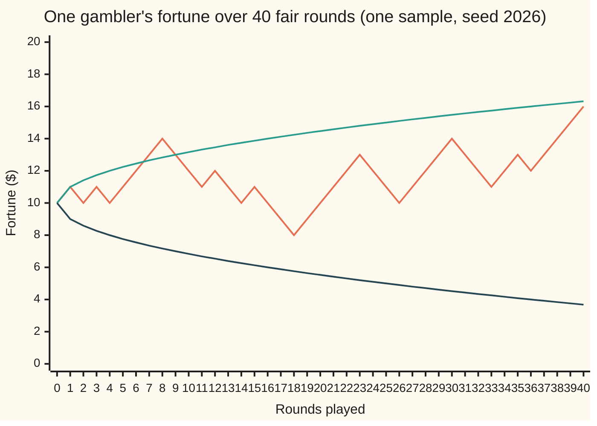
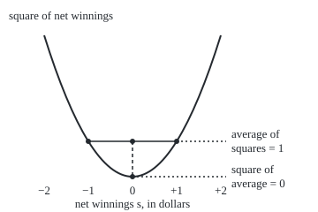

# Martingales: a process whose best forecast is its current value

Stochastic processes and calculus → Martingales → Fair games in time → Martingales

---

## General Overview

A gambler sits down with $10. Each round a fair coin is tossed. Heads, the house pays $1; tails, the gambler pays $1. No commission. The gambler plays on credit, so the fortune may dip below zero. Time is counted in rounds.

Over 40 rounds the fortune wanders. It climbs to $14, falls to $8, and at round 40 stands at $16. Yet at every moment one thing stays fixed. Whatever has happened so far, the best forecast of the fortune one round later is the fortune now. At $12, the next round ends at $13 or $11, equally likely, and the two average to $12. The history of wins and losses sets where the gambler is, never where the gambler is heading.

A process with that property is a **martingale**: a fair game, in which the best forecast of tomorrow is today. The measure wing already defines it ([filtrations-and-martingales](../../10-Measure%20and%20integration/09-Conditional%20Expectation/06-filtrations-and-martingales.md)). This card takes it into time. It shows that the fortune is a martingale, that its square is not until one round's worth of spread is subtracted each round, and what happens to the fortune at roulette odds, where the game tilts against the player.

**A martingale is a process whose forecast of any later value, given everything seen so far, is its present value; a fair gambler's fortune is one, and so is its square minus the number of rounds played.**

**What kind of fact this is:** a definition, with two small theorems proved on this card in Why it works: the fair fortune and the fortune squared minus the rounds are martingales.

### The picture: one gambler, 40 rounds



The first line is one simulated gambler, a single sample drawn from a seeded generator, one point per round. The second and third lines are $10 plus and minus the square root of the rounds played: one standard deviation either side of the start. The path has no pull back towards $10 and no push away from it. Only the spread grows, like the square root of the rounds, and the second martingale on this card makes that exact.

---

## The formula

Notation first, in words. A process written $(X_n)$ is a list of random quantities, one per round, read "the value after round $n$". Here $X_n$ is the fortune after $n$ rounds, with $X_0 = 10$. The filtration $\mathcal F_n$ is what is known after $n$ rounds: the full record of the first $n$ tosses ([filtrations-and-information](../01-Random%20Walks%20and%20Filtrations/03-filtrations-and-information.md)). $E[\,\cdot \mid \mathcal F_n]$ is the best forecast given that record: an average over every future still possible, each weighted by its chance ([conditional-expectation-in-tables](../../09-Probability%20and%20statistics/02-Random%20Variables/05-conditional-expectation-in-tables.md)).

A process $(X_n)$ is a **martingale** with respect to $(\mathcal F_n)$ when three things hold: each $X_n$ can be read off the record at round $n$ (it is **adapted**); each has a finite average size, $E\lvert X_n\rvert < \infty$; and

$$E[X_{n+1} \mid \mathcal F_n] = X_n \quad \text{for every round } n .$$

**Read it aloud:** given everything seen after round $n$, the forecast of the next value is the present value.

Change the equals sign and the name changes with it:

$$E[X_{n+1} \mid \mathcal F_n] \le X_n \ \ \text{(supermartingale)}, \qquad E[X_{n+1} \mid \mathcal F_n] \ge X_n \ \ \text{(submartingale)} .$$

**Read it aloud:** a supermartingale is a game tilted against the holder, its forecast falling or level; a submartingale is tilted in the holder's favour.

The two facts this card proves, for the fair gambler:

$$E[X_{n+1} \mid \mathcal F_n] = X_n , \qquad E[X_{n+1}^2 - (n+1) \mid \mathcal F_n] = X_n^2 - n .$$

**Read them aloud:** the fortune is a martingale; the squared fortune is not, since its forecast rises by exactly 1 each round, but subtract the rounds played and what is left is a martingale.

| Symbol | Plain meaning | In our example | Push it up and the answer… |
| --- | --- | --- | --- |
| $n$, $m$ | rounds played so far; a later round | 0 to 100 | more spread in the fortune |
| $X_n$, $X_0$ | the fortune after $n$ rounds; the starting fortune | $10 at the start, $16 after 40 rounds on the path above | a higher start shifts every forecast equally |
| $\mathcal F_n$ | the filtration: the record of the first $n$ tosses | 1024 possible records after 10 rounds | sharper forecasts |
| $E[\,\cdot \mid \mathcal F_n]$ | the forecast given the record: an average over the futures still possible | from $12, the average of $13 and $11 | — |
| $\xi_n$ | the result of round $n$: +1 for a win, −1 for a loss | +1 or −1, each with chance 0.5 | — |
| $p$ | the chance of winning a round | 0.5 fair; 18/37 on red at roulette | above 0.5 the fortune is a submartingale |
| $\mu$ | the average gain per round, $2p - 1$ | 0 fair; −1/37 at roulette | the fortune drifts by $\mu$ a round |
| $Y_n$ | the squared fortune minus the rounds, $X_n^2 - n$ | 100 at the start | — |
| $A_n$ | the part of a submartingale that rises by a known amount each round | $n$ for the squared fortune | — |
| $s$ | net winnings, $X_n - 10$, used in the figure | −1, 0 or +1 | — |
| $W_t$, $t$ | Brownian motion, the random walk seen from far away; $t$ is time | met on shelf 05 | — |
| $M_n$, $Z_n$, $\varphi$, $r$ | the detailed proof's general martingale, general process, bent function, and ratio $(1-p)/p$ | $r$ = 19/18 at roulette | — |

### When it holds

A definition has no hypotheses: it names a property, relative to a stated filtration and a stated probability. The two theorems need four things.

- **Rounds independent of the past.** The next toss must not depend on the record. A coin that tends to repeat its last face breaks the argument: after a win, the forecast of the next fortune would sit above the present one.
- **Fair odds.** Win chance exactly 0.5. At roulette, with 18 winning pockets of 37, the forecast drops by $1/37 a round and the fortune is a supermartingale.
- **The gambler's own record as the filtration.** Relative to a record that includes the next toss, nothing random is left to average, and the forecast is the next fortune itself, never the present one.
- **Fixed rounds.** Both theorems speak of fixed rounds $n$ and $m$. Stopping at a round chosen by watching the path, "quit when ahead", needs the extra conditions of [stopping-times-and-optional-stopping](03-stopping-times-and-optional-stopping.md).

Integrability is automatic here: after $n$ rounds the fortune lies between $10 - n$ and $10 + n$.

---

## Why it works

### Step 0: the next toss ignores the record

The next toss is independent of the record, and it averages zero: $0.5 \times (+1) + 0.5 \times (-1) = 0$. Conditioning on the record cannot change the average of something that ignores it. Every forecast below is the present value plus that zero, or something built from it.

### Step 1: the fortune is a martingale

Write the next fortune as the present fortune plus the next toss: $X_{n+1} = X_n + \xi_{n+1}$. Two rules of conditional expectation, from [rules-of-conditional-expectation](../../10-Measure%20and%20integration/09-Conditional%20Expectation/04-rules-of-conditional-expectation.md), do the rest. The present fortune is known at round $n$, so it comes out of the forecast unchanged: "taking out what is known". The next toss is independent of the record, so its forecast is its plain average: "independence drops the condition". Hence

$$E[X_{n+1} \mid \mathcal F_n] = X_n + E[\xi_{n+1}] = X_n + 0 = X_n .$$

From $12 the next fortune is $13 or $11; each has chance 0.5; the average is $12.

### Step 2: the square gains exactly 1 a round

Square the same split: $X_{n+1}^2 = X_n^2 + 2X_n \xi_{n+1} + \xi_{n+1}^2$. Forecast each piece. The first is known. The middle one is a known number times the next toss, so its forecast is $2X_n \times 0 = 0$. The last is always 1, since $(+1)^2 = (-1)^2 = 1$. So

$$E[X_{n+1}^2 \mid \mathcal F_n] = X_n^2 + 1 .$$

From $12, the squares are 169 and 121, averaging 145, which is 144 + 1. The square rises by exactly 1 in forecast, every round, from every history. Subtract $n + 1$ from both sides and the rise disappears: $Y_n = X_n^2 - n$ is a martingale.

### The picture: why squaring adds 1

<p align="center"></p>

The curve is the square of net winnings, $s$ times itself, to scale. From $s = 0$ one round leads to −1 or +1. Their squares, both 1, average to the point on the chord: height 1. The square of their average, 0, is the bottom of the curve. The dashed gap is 1 wherever the gambler stands, because the curve bends the same amount everywhere. That gap is the spread one round adds, and $-n$ is the bill for it.

### Step 3: sub and super, from the same computation

Step 2 already shows that $X_n^2$ on its own is a submartingale: its forecast rises by 1. That is no accident of squares. Any function that bends upwards, applied to a martingale, gives a submartingale, by the conditional form of Jensen's inequality ([rules-of-conditional-expectation](../../10-Measure%20and%20integration/09-Conditional%20Expectation/04-rules-of-conditional-expectation.md); the plain form is [jensens-inequality](../../09-Probability%20and%20statistics/02-Random%20Variables/06-jensens-inequality.md)): the average of the bent values sits above the bent average, exactly the chord in the picture.

Now tilt the game. On red at European roulette, with one green zero, the gambler wins with chance $p = 18/37$ and loses with chance $19/37$. The average gain per round is $\mu = 2p - 1 = -1/37$. Step 1 goes through word for word, with that average in place of zero:

$$E[X_{n+1} \mid \mathcal F_n] = X_n - \tfrac{1}{37} .$$

From $12 the forecast is $11.9730. The fortune is a supermartingale. Add back what the house takes and the martingale returns: $X_n + n/37$ is one.

A bent function can also straighten a tilted game. Raise $19/18$ to the power of the roulette fortune. Its forecast one round ahead multiplies it by $\tfrac{18}{37} \cdot \tfrac{19}{18} + \tfrac{19}{37} \cdot \tfrac{18}{19} = \tfrac{19}{37} + \tfrac{18}{37} = 1$, so it is a martingale, although the fortune itself is not. That trick is the engine of ruin probabilities ([ruin-theory-and-lundberg](../../12-Financial%20mathematics/51-Insurance%20and%20Actuarial%20Mathematics/06-ruin-theory-and-lundberg.md)).

### Step 4: forecasts reach every later round

The definition speaks of one round ahead. The tower rule, forecasting a forecast gives the forecast, stretches it to any later round $m$: forecast round $m$ from round $m - 1$, then that from round $m - 2$, and so on back to $n$. Each step returns the present value, so

$$E[X_m \mid \mathcal F_n] = X_n , \qquad E[X_m^2 - m \mid \mathcal F_n] = X_n^2 - n .$$

Subtract the square of the first from the second. Given the record at round $n$, the spread of the fortune at round $m$ is $m - n$. From the start, the variance after 100 rounds is 100, a standard deviation of $10: the whole stake. That is where the square-root band in the first picture comes from.

So $X_n^2 = (X_n^2 - n) + n$: a martingale plus a part that rises by an amount known one round ahead. Every submartingale splits this way, into a martingale plus such a rising part $A_n$: the **Doob decomposition**, proved in the fold below.

<details>
<summary>Detailed proof</summary>

**Setting.** $\xi_1, \xi_2, \dots$ independent, each +1 with chance $p$ and −1 with chance $1 - p$. $X_n = X_0 + \xi_1 + \dots + \xi_n$ with $X_0 = 10$, and $\mathcal F_n$ the sigma-algebra generated by $\xi_1, \dots, \xi_n$, with $\mathcal F_0$ trivial. Each $X_n$ is a function of $\xi_1, \dots, \xi_n$, so it is $\mathcal F_n$-measurable: adapted. $\lvert X_n\rvert \le 10 + n$, so it is integrable.

**Theorem 1 (fair fortune).** Let $p = 0.5$. $\xi_{n+1}$ is independent of $\mathcal F_n$, so $E[\xi_{n+1} \mid \mathcal F_n] = E[\xi_{n+1}] = 0$ a.s. $X_n$ is $\mathcal F_n$-measurable and integrable, so $E[X_n \mid \mathcal F_n] = X_n$. By linearity, $E[X_{n+1} \mid \mathcal F_n] = X_n + 0 = X_n$ a.s.

**Theorem 2 (square minus rounds).** $X_{n+1}^2 = X_n^2 + 2X_n\xi_{n+1} + 1$, since $\xi_{n+1}^2 = 1$. Every term is bounded, so integrable. Taking out what is known, $E[X_n \xi_{n+1} \mid \mathcal F_n] = X_n E[\xi_{n+1} \mid \mathcal F_n] = 0$. So $E[X_{n+1}^2 \mid \mathcal F_n] = X_n^2 + 1$, and subtracting the constant $n + 1$ gives $E[Y_{n+1} \mid \mathcal F_n] = Y_n$ with $Y_n = X_n^2 - n$, which is adapted and integrable.

**Theorem 3 (tilted fortune).** For general $p$, $E[\xi_{n+1}] = \mu = 2p - 1$, and the same lines give $E[X_{n+1} \mid \mathcal F_n] = X_n + \mu$. So $X_n$ is a supermartingale when $\mu \le 0$, a submartingale when $\mu \ge 0$, and $X_n - n\mu$ is a martingale. With $r = (1 - p)/p$ and $0 < p < 1$, $E[r^{X_{n+1}} \mid \mathcal F_n] = r^{X_n}\,(p r + (1 - p)/r) = r^{X_n}\,((1 - p) + p) = r^{X_n}$: a martingale.

**Theorem 4 (later rounds).** If $(M_n)$ is a martingale and $m \ge n$, then $E[M_m \mid \mathcal F_n] = M_n$. For $m = n$ this is measurability. If it holds for $m$, the tower rule with $\mathcal F_n \subseteq \mathcal F_m$ gives $E[M_{m+1} \mid \mathcal F_n] = E[E[M_{m+1} \mid \mathcal F_m] \mid \mathcal F_n] = E[M_m \mid \mathcal F_n] = M_n$. Induction finishes it. Applied to the fortune and to $Y_n$: $E[X_m^2 \mid \mathcal F_n] - (E[X_m \mid \mathcal F_n])^2 = X_n^2 - n + m - X_n^2 = m - n$.

**Theorem 5 (sub from convex).** If $(M_n)$ is a martingale, $\varphi(x)$ is a convex function (one that bends upwards), and $\varphi(M_n)$ is integrable, then the conditional Jensen inequality gives $E[\varphi(M_{n+1}) \mid \mathcal F_n] \ge \varphi(E[M_{n+1} \mid \mathcal F_n]) = \varphi(M_n)$: a submartingale.

**Theorem 6 (Doob decomposition).** Let $(Z_n)$ be adapted and integrable. Put $A_0 = 0$ and $A_n = \sum_{k=1}^{n} E[Z_k - Z_{k-1} \mid \mathcal F_{k-1}]$, and $M_n = Z_n - A_n$. Each term of $A_n$ is $\mathcal F_{k-1}$-measurable, so $A_n$ is known at round $n - 1$ ("predictable"). And $E[M_{n+1} - M_n \mid \mathcal F_n] = E[Z_{n+1} - Z_n \mid \mathcal F_n] - (A_{n+1} - A_n) = 0$, so $(M_n)$ is a martingale. If $(Z_n)$ is a submartingale each term of $A_n$ is nonnegative, so $A_n$ rises. For $Z_n = X_n^2$ on the fair game, each term is 1, so $A_n = n$.

</details>

A second road, for a fixed horizon: the fortune after round $n$ is the forecast of the fortune at any fixed final round, $X_n = E[X_{100} \mid \mathcal F_n]$ for $n \le 100$, and a forecast of a fixed result, updated as information arrives, is always a martingale. That theorem is proved on [filtrations-and-martingales](../../10-Measure%20and%20integration/09-Conditional%20Expectation/06-filtrations-and-martingales.md).

---

## Worked numbers, by hand

| Step | Arithmetic | Value |
| --- | --- | --- |
| the start | $X_0$ | $10 |
| from $12, the next fortune | $13 or $11, each with chance 0.5 | average **$12** |
| its square | 169 or 121, averaging | 145 = 144 + 1 |
| square minus rounds, round $n$ to $n + 1$ | $(144 - n)$ against $(145 - (n + 1))$ | unchanged |
| all 1024 records of 10 rounds | average of $X_{10}^2$ | 110 |
| spread after 10 rounds | 110 − 10 × 10 | variance 10 |
| spread after 100 rounds | variance = rounds | 100, standard deviation **$10** |
| roulette, one round from $10 | 10 − 1/37 | $9.9730 |
| roulette, 100 rounds from $10 | 10 − 100/37 | **$7.2973** |

A fair gambler's fortune after 100 rounds averages exactly the $10 it started with, yet its standard deviation is $10: fair describes the average, not the ride. At roulette the same 100 rounds leave $7.2973 on average: the house's cut of a thirty-seventh of a dollar a round adds up.

### What breaks if you drop a piece

| Mistake | Comes out at | What went wrong |
| --- | --- | --- |
| Roulette odds taken as fair | forecast $9.9730 after one round from $10; $7.2973 after 100 | $p = 18/37$: the fortune is a supermartingale |
| The squared fortune taken as a martingale | forecast of $X_{100}^2$ is 200, not 100; simulated 199.6236, standard error 1.7211 | the square gains 1 a round; subtract $n$ |
| An insider who sees the next toss | the forecast differs from the present fortune on 1024 of 1024 records | relative to that filtration nothing is left to average |

The code prints every entry.

---

## Code, from first principles, and it actually runs

Nothing is imported except the square root. The two theorems are reached by three roads. Road 1 is the one-round forecast by formula. Road 2 lists all 1024 records of 10 rounds and, for every record at every round $n$ and every later round $m$, sums the fortune over the records that extend it, in exact integers. That is 4083 checks each of the fortune, the square minus the rounds, the square's rise, and the roulette drift, weighted by powers of 18 and 19. Road 3 simulates 20000 gamblers for 100 rounds each with SplitMix64, a short random-number generator written out in both languages, seed 2026, and prints every average with its standard error. The code checks these finite cases; the proof covers every round.

### Python

```python
# Martingales -- the check behind the card.  Standard library only.
# A gambler starts with $10 and bets $1 a round on a fair coin.  The fortune
# X_n and the process X_n^2 - n are checked to be martingales three ways: the
# one-step forecast by formula, every history of 10 rounds enumerated in exact
# integers, and 20000 simulated gamblers drawn from SplitMix64, seed 2026.
# Roulette odds (red wins 18 times in 37) give the supermartingale.
from math import sqrt

X0, N, G, R = 10, 10, 20000, 100
P_RED = 18 / 37
MASK = (1 << 64) - 1
state = 2026

def draw():                                  # SplitMix64, written out
    global state
    state = (state + 0x9E3779B97F4A7C15) & MASK
    z = state
    z = ((z ^ (z >> 30)) * 0xBF58476D1CE4E5B9) & MASK
    z = ((z ^ (z >> 27)) * 0x94D049BB133111EB) & MASK
    return z ^ (z >> 31)

def uniform():                               # 53 random bits in [0, 1)
    return (draw() >> 11) / 9007199254740992.0

# ---- road 1: the one-step forecast, by formula, from a fortune of x ----
def fair_next(x):    return 0.5 * (x + 1) + 0.5 * (x - 1)
def fair_next_sq(x): return 0.5 * (x + 1) ** 2 + 0.5 * (x - 1) ** 2
def red_next(x):     return P_RED * (x + 1) + (1 - P_RED) * (x - 1)

# ---- road 2: every history of N rounds, exact integer sums ----
# path p: bit k (first round = highest bit) is 1 for a win.  X[p][m] = fortune after m rounds.
X = []
for p in range(1 << N):
    row = [X0]
    for k in range(N):
        row.append(row[-1] + (1 if (p >> (N - 1 - k)) & 1 else -1))
    X.append(row)
wins = [bin(p).count("1") for p in range(1 << N)]
w_red = [18 ** wins[p] * 19 ** (N - wins[p]) for p in range(1 << N)]   # roulette weights, total 37^N

checks = fair_ok = sq_ok = sub_ok = red_ok = steps = agree = 0
for n in range(N + 1):
    size = 1 << (N - n)                      # paths sharing one history of n rounds
    for cell in range(1 << n):
        paths = range(cell * size, (cell + 1) * size)
        xn = X[cell * size][n]
        wsum = sum(w_red[p] for p in paths)
        for m in range(n, N + 1):
            checks += 1
            sx = sum(X[p][m] for p in paths)
            sq = sum(X[p][m] ** 2 for p in paths)
            fair_ok += sx == size * xn                                   # E[X_m | F_n] = X_n
            sq_ok += sq - size * m == size * (xn * xn - n)               # X^2 - n keeps its forecast
            sub_ok += sq - size * xn * xn == size * (m - n)              # X^2 alone rises by m - n
            swx = sum(w_red[p] * X[p][m] for p in paths)
            red_ok += 37 * swx == 37 * wsum * xn - (m - n) * wsum        # roulette: drops 1/37 a round
            if m == n + 1:                                               # road 1 against road 2
                steps += 1
                agree += abs(sx / size - fair_next(xn)) < 1e-12 and abs(swx / wsum - red_next(xn)) < 1e-12
mean_sq_10 = sum(X[p][N] ** 2 for p in range(1 << N)) / (1 << N)
half = 1 << (N - 1)                      # the insider knows toss 1 at round 0: two cells of 512 paths
ins_sum = [sum(X[q][1] for q in range(c * half, (c + 1) * half)) for c in (0, 1)]   # 512 E[X_1 | toss 1]
insider_off = sum(1 for p in range(1 << N) if ins_sum[p >> (N - 1)] != half * X[p][0])   # forecast vs X_0

# ---- road 3: simulated gamblers ----
path0 = []
s1 = s2 = s3 = s4 = 0.0
c14 = c14_next = c14_next_sq = 0
for g in range(G):
    x = X0
    for r in range(1, R + 1):
        x += 1 if draw() >> 63 else -1
        if g == 0 and r <= 40: path0.append(x)
        if r == 50: x50 = x
        if r == 51 and x50 == 14:
            c14 += 1; c14_next += x; c14_next_sq += x * x
    y = x * x - R
    s1 += x; s2 += x * x; s3 += y; s4 += y * y
red_s1 = red_s2 = 0.0
for g in range(G):
    x = X0
    for r in range(R):
        x += 1 if uniform() < P_RED else -1
    red_s1 += x; red_s2 += x * x

def mean_se(s, ss, k):
    m = s / k
    return m, sqrt((ss - k * m * m) / (k - 1) / k)

mx, sex = mean_se(s1, s2, G)
my, sey = mean_se(s3, s4, G)
m51, se51 = mean_se(c14_next, c14_next_sq, c14)
mred, sered = mean_se(red_s1, red_s2, G)
exact_red = X0 - R / 37

print(f"road 1, from $12 the next fortune is 13 or 11, averaging {fair_next(12):.4f}")
print(f"road 1, its square is 169 or 121, averaging {fair_next_sq(12):.4f}  (= 144 + 1)")
print(f"road 1, forecast of the next fortune from $12, roulette:  {red_next(12):.4f}  (= 12 - 1/37)")
print(f"road 2, {1 << N} histories, {checks} (cell, later time) pairs checked")
print(f"  E[X_m | F_n] = X_n held:            {fair_ok} of {checks}")
print(f"  E[X_m^2 - m | F_n] = X_n^2 - n held: {sq_ok} of {checks}")
print(f"  X^2 forecast rose by exactly m - n:  {sub_ok} of {checks}")
print(f"  roulette forecast fell by (m - n)/37: {red_ok} of {checks}")
print(f"  one-round cell averages equal road 1: {agree} of {steps}")
print(f"  E[X_10^2] = {mean_sq_10:.4f}, so Var(X_10) = {mean_sq_10 - X0 * X0:.4f}")
print(f"road 3, {G} gamblers, {R} rounds each, seed 2026")
print(f"  mean X_100          {mx:.4f}  se {sex:.4f}  (exact 10)")
print(f"  mean X_100^2 - 100  {my:.4f}  se {sey:.4f}  (exact 100)")
print(f"  mean X_100^2        {my + R:.4f}  se {sey:.4f}  (exact 200, so Var = 100, sd 10)")
print(f"  {c14} gamblers at $14 after round 50: mean X_51 {m51:.4f}  se {se51:.4f}")
print(f"roulette, mean X_100  {mred:.4f}  se {sered:.4f}  (exact {exact_red:.4f})")
print(f"roulette, one-round forecast factor of (19/18)^X: {P_RED * 19 / 18 + (1 - P_RED) * 18 / 19:.12f}")
print("what breaks:")
print(f"  house edge, forecast after one round from $10: {red_next(10):.4f}; after 100 rounds {exact_red:.4f}")
print(f"  squared fortune without the -n: E[X_100^2] = {X0 * X0 + R}, not {X0 * X0}")
print(f"  insider who sees the next toss: forecast differs from X_0 on {insider_off} of {1 << N} paths")
print("figure, path of gambler 0, rounds 0 to 40:", ", ".join(str(v) for v in [X0] + path0))
print("figure, upper band 10 + sqrt(n):", ", ".join(f"{X0 + sqrt(n):.2f}" for n in range(41)))
print("figure, lower band 10 - sqrt(n):", ", ".join(f"{X0 - sqrt(n):.2f}" for n in range(41)))
print("figure, parabola s^2 from s = -2 to 2: M 50 40 Q 150 360 250 40; s = -1, 0, 1 at (100,160) (150,200) (200,160); chord midpoint (150,160); gap 1 = 40 px")

assert fair_ok == checks                                          # the fortune: enumeration vs X_n
assert sq_ok == checks                                            # X^2 - n: enumeration vs X_n^2 - n
assert sub_ok == checks                                           # X^2 rises by exactly m - n
assert red_ok == checks                                           # roulette drops by exactly 1/37
assert agree == steps                                             # road 1 against road 2
assert mean_sq_10 == X0 * X0 + N                                  # E[X_10^2] against 100 + 10
assert abs(mx - X0) < 4 * sex                                     # road 3 against exact values
assert abs(my - X0 * X0) < 4 * sey
assert abs(m51 - 14) < 4 * se51
assert abs(mred - exact_red) < 4 * sered
print("ALL CHECKS PASS")
```

**Ran 2026-10-07 on macOS, Python 3.14.6, standard library only. All checks passed. Output, pasted from the run:**

```
road 1, from $12 the next fortune is 13 or 11, averaging 12.0000
road 1, its square is 169 or 121, averaging 145.0000  (= 144 + 1)
road 1, forecast of the next fortune from $12, roulette:  11.9730  (= 12 - 1/37)
road 2, 1024 histories, 4083 (cell, later time) pairs checked
  E[X_m | F_n] = X_n held:            4083 of 4083
  E[X_m^2 - m | F_n] = X_n^2 - n held: 4083 of 4083
  X^2 forecast rose by exactly m - n:  4083 of 4083
  roulette forecast fell by (m - n)/37: 4083 of 4083
  one-round cell averages equal road 1: 1023 of 1023
  E[X_10^2] = 110.0000, so Var(X_10) = 10.0000
road 3, 20000 gamblers, 100 rounds each, seed 2026
  mean X_100          10.0744  se 0.0700  (exact 10)
  mean X_100^2 - 100  99.6236  se 1.7211  (exact 100)
  mean X_100^2        199.6236  se 1.7211  (exact 200, so Var = 100, sd 10)
  1951 gamblers at $14 after round 50: mean X_51 13.9995  se 0.0226
roulette, mean X_100  7.3637  se 0.0702  (exact 7.2973)
roulette, one-round forecast factor of (19/18)^X: 1.000000000000
what breaks:
  house edge, forecast after one round from $10: 9.9730; after 100 rounds 7.2973
  squared fortune without the -n: E[X_100^2] = 200, not 100
  insider who sees the next toss: forecast differs from X_0 on 1024 of 1024 paths
figure, path of gambler 0, rounds 0 to 40: 10, 11, 10, 11, 10, 11, 12, 13, 14, 13, 12, 11, 12, 11, 10, 11, 10, 9, 8, 9, 10, 11, 12, 13, 12, 11, 10, 11, 12, 13, 14, 13, 12, 11, 12, 13, 12, 13, 14, 15, 16
figure, upper band 10 + sqrt(n): 10.00, 11.00, 11.41, 11.73, 12.00, 12.24, 12.45, 12.65, 12.83, 13.00, 13.16, 13.32, 13.46, 13.61, 13.74, 13.87, 14.00, 14.12, 14.24, 14.36, 14.47, 14.58, 14.69, 14.80, 14.90, 15.00, 15.10, 15.20, 15.29, 15.39, 15.48, 15.57, 15.66, 15.74, 15.83, 15.92, 16.00, 16.08, 16.16, 16.24, 16.32
figure, lower band 10 - sqrt(n): 10.00, 9.00, 8.59, 8.27, 8.00, 7.76, 7.55, 7.35, 7.17, 7.00, 6.84, 6.68, 6.54, 6.39, 6.26, 6.13, 6.00, 5.88, 5.76, 5.64, 5.53, 5.42, 5.31, 5.20, 5.10, 5.00, 4.90, 4.80, 4.71, 4.61, 4.52, 4.43, 4.34, 4.26, 4.17, 4.08, 4.00, 3.92, 3.84, 3.76, 3.68
figure, parabola s^2 from s = -2 to 2: M 50 40 Q 150 360 250 40; s = -1, 0, 1 at (100,160) (150,200) (200,160); chord midpoint (150,160); gap 1 = 40 px
ALL CHECKS PASS
```

### Rust

Same numbers, same labels, built with `rustc --edition 2021 -O`.

```rust
// Martingales -- the same check as the Python, in Rust.  No crates.
// A gambler starts with $10 and bets $1 a round on a fair coin.  The fortune
// X_n and the process X_n^2 - n are checked to be martingales three ways: the
// one-step forecast by formula, every history of 10 rounds enumerated in exact
// integers, and 20000 simulated gamblers drawn from SplitMix64, seed 2026.
// Roulette odds (red wins 18 times in 37) give the supermartingale.
const X0: i64 = 10;
const N: usize = 10;
const G: usize = 20000;
const R: usize = 100;
const P_RED: f64 = 18.0 / 37.0;

struct SplitMix(u64);
impl SplitMix {
    fn draw(&mut self) -> u64 {                          // SplitMix64, written out
        self.0 = self.0.wrapping_add(0x9E3779B97F4A7C15);
        let mut z = self.0;
        z = (z ^ (z >> 30)).wrapping_mul(0xBF58476D1CE4E5B9);
        z = (z ^ (z >> 27)).wrapping_mul(0x94D049BB133111EB);
        z ^ (z >> 31)
    }
    fn uniform(&mut self) -> f64 { (self.draw() >> 11) as f64 / 9007199254740992.0 }
}

// ---- road 1: the one-step forecast, by formula, from a fortune of x ----
fn fair_next(x: f64) -> f64 { 0.5 * (x + 1.0) + 0.5 * (x - 1.0) }
fn fair_next_sq(x: f64) -> f64 { 0.5 * (x + 1.0).powi(2) + 0.5 * (x - 1.0).powi(2) }
fn red_next(x: f64) -> f64 { P_RED * (x + 1.0) + (1.0 - P_RED) * (x - 1.0) }

fn mean_se(s: f64, ss: f64, k: usize) -> (f64, f64) {
    let kf = k as f64;
    let m = s / kf;
    (m, ((ss - kf * m * m) / (kf - 1.0) / kf).sqrt())
}

fn join<T: std::fmt::Display>(v: &[T]) -> String {
    v.iter().map(|x| x.to_string()).collect::<Vec<_>>().join(", ")
}

fn main() {
    // ---- road 2: every history of N rounds, exact integer sums ----
    // path p: bit k (first round = highest bit) is 1 for a win.  x[p][m] = fortune after m rounds.
    let np = 1usize << N;
    let mut x: Vec<Vec<i64>> = Vec::new();
    let mut w_red: Vec<i128> = Vec::new();            // roulette weights, total 37^N
    for p in 0..np {
        let mut row = vec![X0];
        for k in 0..N {
            let step = if (p >> (N - 1 - k)) & 1 == 1 { 1 } else { -1 };
            row.push(row[k] + step);
        }
        x.push(row);
        let wins = p.count_ones();
        w_red.push(18i128.pow(wins) * 19i128.pow(N as u32 - wins));
    }
    let (mut checks, mut fair_ok, mut sq_ok, mut sub_ok, mut red_ok, mut steps, mut agree) = (0, 0, 0, 0, 0, 0, 0);
    for n in 0..=N {
        let size = 1usize << (N - n);                 // paths sharing one history of n rounds
        for cell in 0..(1usize << n) {
            let paths = cell * size..(cell + 1) * size;
            let xn = x[cell * size][n];
            let (s, xi) = (size as i64, xn as i128);
            let wsum: i128 = paths.clone().map(|p| w_red[p]).sum();
            for m in n..=N {
                checks += 1;
                let sx: i64 = paths.clone().map(|p| x[p][m]).sum();
                let sq: i64 = paths.clone().map(|p| x[p][m] * x[p][m]).sum();
                if sx == s * xn { fair_ok += 1 }                                   // E[X_m | F_n] = X_n
                if sq - s * m as i64 == s * (xn * xn - n as i64) { sq_ok += 1 }    // X^2 - n keeps its forecast
                if sq - s * xn * xn == s * (m - n) as i64 { sub_ok += 1 }          // X^2 alone rises by m - n
                let swx: i128 = paths.clone().map(|p| w_red[p] * x[p][m] as i128).sum();
                if 37 * swx == 37 * wsum * xi - (m - n) as i128 * wsum { red_ok += 1 }
                if m == n + 1 {                                                    // road 1 against road 2
                    steps += 1;
                    let a = (sx as f64 / s as f64 - fair_next(xn as f64)).abs() < 1e-12;
                    let b = (swx as f64 / wsum as f64 - red_next(xn as f64)).abs() < 1e-12;
                    if a && b { agree += 1 }
                }
            }
        }
    }
    let mean_sq_10 = (0..np).map(|p| x[p][N] * x[p][N]).sum::<i64>() as f64 / np as f64;
    let half = 1usize << (N - 1);              // the insider knows toss 1 at round 0: two cells of 512 paths
    let ins_sum: Vec<i64> = (0..2).map(|c| (c * half..(c + 1) * half).map(|q| x[q][1]).sum()).collect();   // 512 E[X_1 | toss 1]
    let insider_off = (0..np).filter(|&p| ins_sum[p >> (N - 1)] != half as i64 * x[p][0]).count();   // forecast vs X_0

    // ---- road 3: simulated gamblers ----
    let mut rng = SplitMix(2026);
    let mut path0: Vec<i64> = vec![X0];
    let (mut s1, mut s2, mut s3, mut s4) = (0.0f64, 0.0f64, 0.0f64, 0.0f64);
    let (mut c14, mut c14n, mut c14nsq) = (0usize, 0.0f64, 0.0f64);
    for g in 0..G {
        let (mut xv, mut x50) = (X0, 0);
        for r in 1..=R {
            xv += if rng.draw() >> 63 == 1 { 1 } else { -1 };
            if g == 0 && r <= 40 { path0.push(xv) }
            if r == 50 { x50 = xv }
            if r == 51 && x50 == 14 { c14 += 1; c14n += xv as f64; c14nsq += (xv * xv) as f64 }
        }
        let y = xv * xv - R as i64;
        s1 += xv as f64; s2 += (xv * xv) as f64; s3 += y as f64; s4 += (y * y) as f64;
    }
    let (mut red_s1, mut red_s2) = (0.0f64, 0.0f64);
    for _ in 0..G {
        let mut xv = X0;
        for _ in 0..R { xv += if rng.uniform() < P_RED { 1 } else { -1 } }
        red_s1 += xv as f64; red_s2 += (xv * xv) as f64;
    }
    let (mx, sex) = mean_se(s1, s2, G);
    let (my, sey) = mean_se(s3, s4, G);
    let (m51, se51) = mean_se(c14n, c14nsq, c14);
    let (mred, sered) = mean_se(red_s1, red_s2, G);
    let exact_red = X0 as f64 - R as f64 / 37.0;

    println!("road 1, from $12 the next fortune is 13 or 11, averaging {:.4}", fair_next(12.0));
    println!("road 1, its square is 169 or 121, averaging {:.4}  (= 144 + 1)", fair_next_sq(12.0));
    println!("road 1, forecast of the next fortune from $12, roulette:  {:.4}  (= 12 - 1/37)", red_next(12.0));
    println!("road 2, {} histories, {} (cell, later time) pairs checked", np, checks);
    println!("  E[X_m | F_n] = X_n held:            {} of {}", fair_ok, checks);
    println!("  E[X_m^2 - m | F_n] = X_n^2 - n held: {} of {}", sq_ok, checks);
    println!("  X^2 forecast rose by exactly m - n:  {} of {}", sub_ok, checks);
    println!("  roulette forecast fell by (m - n)/37: {} of {}", red_ok, checks);
    println!("  one-round cell averages equal road 1: {} of {}", agree, steps);
    println!("  E[X_10^2] = {:.4}, so Var(X_10) = {:.4}", mean_sq_10, mean_sq_10 - (X0 * X0) as f64);
    println!("road 3, {} gamblers, {} rounds each, seed 2026", G, R);
    println!("  mean X_100          {:.4}  se {:.4}  (exact 10)", mx, sex);
    println!("  mean X_100^2 - 100  {:.4}  se {:.4}  (exact 100)", my, sey);
    println!("  mean X_100^2        {:.4}  se {:.4}  (exact 200, so Var = 100, sd 10)", my + R as f64, sey);
    println!("  {} gamblers at $14 after round 50: mean X_51 {:.4}  se {:.4}", c14, m51, se51);
    println!("roulette, mean X_100  {:.4}  se {:.4}  (exact {:.4})", mred, sered, exact_red);
    println!("roulette, one-round forecast factor of (19/18)^X: {:.12}", P_RED * 19.0 / 18.0 + (1.0 - P_RED) * 18.0 / 19.0);
    println!("what breaks:");
    println!("  house edge, forecast after one round from $10: {:.4}; after 100 rounds {:.4}", red_next(10.0), exact_red);
    println!("  squared fortune without the -n: E[X_100^2] = {}, not {}", X0 * X0 + R as i64, X0 * X0);
    println!("  insider who sees the next toss: forecast differs from X_0 on {} of {} paths", insider_off, np);
    println!("figure, path of gambler 0, rounds 0 to 40: {}", join(&path0));
    let up: Vec<String> = (0..41).map(|n| format!("{:.2}", X0 as f64 + (n as f64).sqrt())).collect();
    let lo: Vec<String> = (0..41).map(|n| format!("{:.2}", X0 as f64 - (n as f64).sqrt())).collect();
    println!("figure, upper band 10 + sqrt(n): {}", join(&up));
    println!("figure, lower band 10 - sqrt(n): {}", join(&lo));
    println!("figure, parabola s^2 from s = -2 to 2: M 50 40 Q 150 360 250 40; s = -1, 0, 1 at (100,160) (150,200) (200,160); chord midpoint (150,160); gap 1 = 40 px");

    assert!(fair_ok == checks);                                        // the fortune: enumeration vs X_n
    assert!(sq_ok == checks);                                          // X^2 - n: enumeration vs X_n^2 - n
    assert!(sub_ok == checks);                                         // X^2 rises by exactly m - n
    assert!(red_ok == checks);                                         // roulette drops by exactly 1/37
    assert!(agree == steps);                                           // road 1 against road 2
    assert!(mean_sq_10 == (X0 * X0) as f64 + N as f64);                // E[X_10^2] against 100 + 10
    assert!((mx - X0 as f64).abs() < 4.0 * sex);                       // road 3 against exact values
    assert!((my - (X0 * X0) as f64).abs() < 4.0 * sey);
    assert!((m51 - 14.0).abs() < 4.0 * se51);
    assert!((mred - exact_red).abs() < 4.0 * sered);
    println!("ALL CHECKS PASS");
}
```

**Ran 2026-10-07 on macOS, rustc 1.98.1, no crates. All checks passed. Output, pasted from the run:**

```
road 1, from $12 the next fortune is 13 or 11, averaging 12.0000
road 1, its square is 169 or 121, averaging 145.0000  (= 144 + 1)
road 1, forecast of the next fortune from $12, roulette:  11.9730  (= 12 - 1/37)
road 2, 1024 histories, 4083 (cell, later time) pairs checked
  E[X_m | F_n] = X_n held:            4083 of 4083
  E[X_m^2 - m | F_n] = X_n^2 - n held: 4083 of 4083
  X^2 forecast rose by exactly m - n:  4083 of 4083
  roulette forecast fell by (m - n)/37: 4083 of 4083
  one-round cell averages equal road 1: 1023 of 1023
  E[X_10^2] = 110.0000, so Var(X_10) = 10.0000
road 3, 20000 gamblers, 100 rounds each, seed 2026
  mean X_100          10.0744  se 0.0700  (exact 10)
  mean X_100^2 - 100  99.6236  se 1.7211  (exact 100)
  mean X_100^2        199.6236  se 1.7211  (exact 200, so Var = 100, sd 10)
  1951 gamblers at $14 after round 50: mean X_51 13.9995  se 0.0226
roulette, mean X_100  7.3637  se 0.0702  (exact 7.2973)
roulette, one-round forecast factor of (19/18)^X: 1.000000000000
what breaks:
  house edge, forecast after one round from $10: 9.9730; after 100 rounds 7.2973
  squared fortune without the -n: E[X_100^2] = 200, not 100
  insider who sees the next toss: forecast differs from X_0 on 1024 of 1024 paths
figure, path of gambler 0, rounds 0 to 40: 10, 11, 10, 11, 10, 11, 12, 13, 14, 13, 12, 11, 12, 11, 10, 11, 10, 9, 8, 9, 10, 11, 12, 13, 12, 11, 10, 11, 12, 13, 14, 13, 12, 11, 12, 13, 12, 13, 14, 15, 16
figure, upper band 10 + sqrt(n): 10.00, 11.00, 11.41, 11.73, 12.00, 12.24, 12.45, 12.65, 12.83, 13.00, 13.16, 13.32, 13.46, 13.61, 13.74, 13.87, 14.00, 14.12, 14.24, 14.36, 14.47, 14.58, 14.69, 14.80, 14.90, 15.00, 15.10, 15.20, 15.29, 15.39, 15.48, 15.57, 15.66, 15.74, 15.83, 15.92, 16.00, 16.08, 16.16, 16.24, 16.32
figure, lower band 10 - sqrt(n): 10.00, 9.00, 8.59, 8.27, 8.00, 7.76, 7.55, 7.35, 7.17, 7.00, 6.84, 6.68, 6.54, 6.39, 6.26, 6.13, 6.00, 5.88, 5.76, 5.64, 5.53, 5.42, 5.31, 5.20, 5.10, 5.00, 4.90, 4.80, 4.71, 4.61, 4.52, 4.43, 4.34, 4.26, 4.17, 4.08, 4.00, 3.92, 3.84, 3.76, 3.68
figure, parabola s^2 from s = -2 to 2: M 50 40 Q 150 360 250 40; s = -1, 0, 1 at (100,160) (150,200) (200,160); chord midpoint (150,160); gap 1 = 40 px
ALL CHECKS PASS
```

The two outputs match line for line. Each simulated average sits within about one standard error of its exact value: 10.0744 against 10, standard error 0.0700; 13.9995 for the 1951 gamblers holding $14 after round 50; 7.3637 against 7.2973 at roulette.

> [!TIP]
> **Try changing**
> Guess first, then run it.
> - **Tilt the forecast formula.** In `fair_next`, weight the win by 0.6 and the loss by 0.4. Road 1 now says the fortune drifts up, road 2 finds no cell where it does, the count of agreeing cells falls to zero and the fifth assert stops the run.
> - **Forget the minus $n$.** In road 2, test whether the squared fortune alone keeps its forecast. Only the trivial pairs, where the later round is the same round, still pass, and the second assert stops the run.
> - **Fair roulette.** Set `P_RED` to 0.5. The simulated roulette mean moves to about $10, but road 2 still weights wins and losses 18 to 19, so road 1's roulette forecast no longer matches it and the fifth assert stops the run.
> - **Another seed.** Set the seed to 7. Every simulated average moves, by a few standard errors at most, and all asserts still pass; the label still reads 2026, since it is fixed text.

---

## The usual mistake

> [!warning]
> **Reading "fair" as "cannot win" or "stays put".** A martingale's forecast is its present value; its path is free. The fair gambler above reached $16 in 40 rounds, and after 100 rounds the fortune has a standard deviation of $10. Fair says the average gain is zero, not that gains are small, and not that a winner must give the winnings back.
>
> - **Reading "fair" as "even chances".** Fair means the next step averages zero. A step of +$1 with chance 2/3 and −$2 with chance 1/3 averages zero too, so that fortune is also a martingale.
> - **Dropping the condition.** $E[X_{n+1}] = X_n$ compares a number with a random quantity. The definition conditions on the record; a constant average alone is weaker and does not make a martingale.
> - **Swapping sub and super.** At roulette the fortune is a *super*martingale, forecast $9.9730 from $10. "Super": the present sits above the forecast of the future; "sub": below it.
> - **Forgetting whose information.** Martingale is relative to a filtration. Against a record that includes the next toss the fortune is no martingale: its forecast is off on every one of the 1024 records.
> - **Stopping at a chosen moment.** "Quit when ahead by $1" is not a fixed round, and the theorems here say nothing about it; the doubling strategy of [uniform-integrability-and-unbounded-stopping](06-uniform-integrability-and-unbounded-stopping.md) shows what can go wrong.

---

## Where you meet it in real life

- **Casinos.** Roulette, craps and slot machines are supermartingales for the player and submartingales for the house, which needs only the tilt per round: $1/37 per dollar on red.
- **Betting systems.** No rule for choosing stakes from past results gives fair bets a positive forecast at a fixed round; the stake just multiplies a toss that averages zero. The proof is [predictable-bets-and-the-martingale-transform](02-predictable-bets-and-the-martingale-transform.md).
- **Measuring spread.** $X_n^2 - n$ is the discrete ancestor of $W_t^2 - t$ for Brownian motion, $W_t$ the random walk seen from far away: [brownian-martingales-and-exponential-martingale](../05-Brownian%20Motion/06-brownian-martingales-and-exponential-martingale.md).
- **Insurance ruin.** An insurer's surplus, a tilted game in its favour, is turned into a martingale by exponentiating, as Step 3 did with 19/18: [ruin-theory-and-lundberg](../../12-Financial%20mathematics/51-Insurance%20and%20Actuarial%20Mathematics/06-ruin-theory-and-lundberg.md).

> **Say it back**
> A martingale is a process whose best forecast of the next value, given everything seen so far, is the present value. A fair gambler's fortune is one, because the next toss averages zero whatever has happened. The squared fortune gains exactly 1 in forecast each round, so the square minus the rounds played is a martingale, and the spread after $n$ rounds is $n$. Tilt the odds against the gambler and the fortune becomes a supermartingale, falling $1/37 a round at roulette. All of this holds at fixed rounds and relative to the gambler's own record.

---

## What this builds on

- [filtrations-and-information](../01-Random%20Walks%20and%20Filtrations/03-filtrations-and-information.md): the filtration of a random walk, the record of tosses that every forecast here conditions on.
- [conditional-expectation-in-tables](../../09-Probability%20and%20statistics/02-Random%20Variables/05-conditional-expectation-in-tables.md): a forecast as an average over the rows still possible.
- [filtrations-and-martingales](../../10-Measure%20and%20integration/09-Conditional%20Expectation/06-filtrations-and-martingales.md): the definition on a measure space, the tower rule, and forecasts of a fixed result as martingales.

## Where this goes next

- [predictable-bets-and-the-martingale-transform](02-predictable-bets-and-the-martingale-transform.md): stakes chosen from the record, and why they cannot tilt a fair game.
- [brownian-martingales-and-exponential-martingale](../05-Brownian%20Motion/06-brownian-martingales-and-exponential-martingale.md): $W_t$, $W_t^2 - t$ and the exponential martingale, the continuous-time versions of this card's three.
- [feynman-kac-formula](../07-Changing%20Measure/06-feynman-kac-formula.md): a martingale built from a function of a diffusion, turning an expectation into a differential equation.
- [ruin-theory-and-lundberg](../../12-Financial%20mathematics/51-Insurance%20and%20Actuarial%20Mathematics/06-ruin-theory-and-lundberg.md): the exponential martingale of a tilted game, bounding the chance of ruin.

Every result here holds at fixed rounds; whether a gambler who picks the moment to stop, by watching the path, can beat a fair game is the question [stopping-times-and-optional-stopping](03-stopping-times-and-optional-stopping.md) answers.

---

## Sources

Verified 2026-09-30: every link below opens a page naming the cited work.

- Williams, David. *Probability with Martingales*. Cambridge University Press, 1991. [Publisher page](https://www.cambridge.org/core/books/probability-with-martingales/B4CFCE0D08930FB46C6E93E775503926). Chapter 10: filtrations, the definition, the fair-game reading, and the random walk examples used here.
- Durrett, Rick. *Probability: Theory and Examples*, 5th ed. Cambridge University Press, 2019. [Publisher page](https://doi.org/10.1017/9781108591034). Chapter 4: martingales, the random walk and its square, the Doob decomposition.
- Ville, Jean. *Étude critique de la notion de collectif*. Gauthier-Villars, 1939. [Numdam record](https://www.numdam.org/item/THESE_1939__218__1_0/). The thesis that named the martingale, in a critique of gambling systems.
