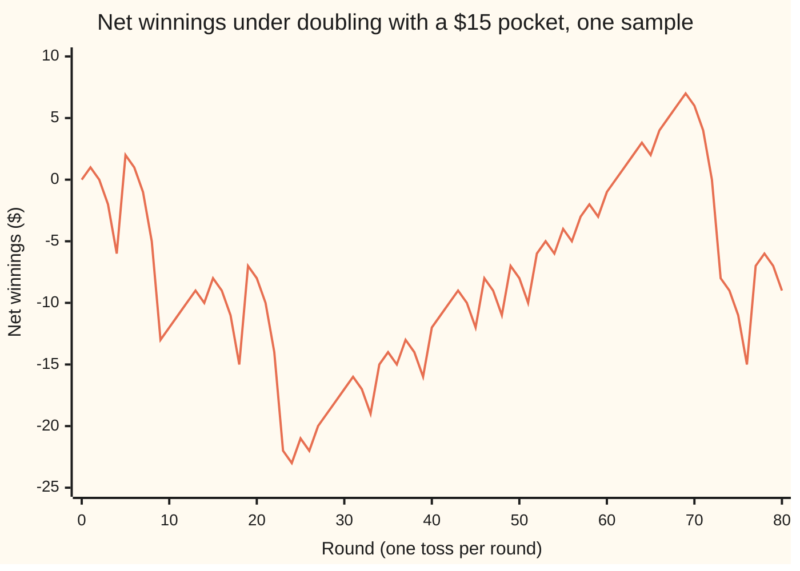
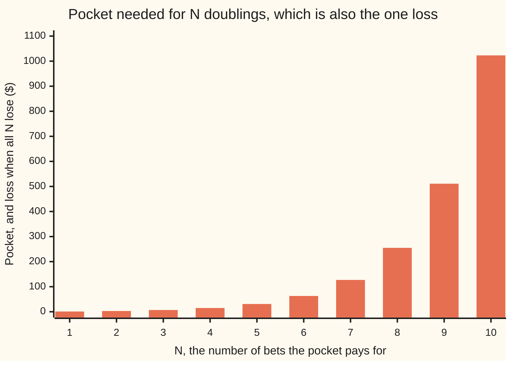

# Betting on a martingale: any predictable strategy leaves a martingale

[Syllabus](../../../SYLLABUS.md) → [Stochastic processes and calculus](../README.md) → [Martingales](../README.md#s02) → Betting on a martingale

---

## General Overview

A gambler sits at a fair coin game. Heads pays the stake; tails takes it. The gambler brings $15 and one rule: bet $1, double the bet after every loss, stop at the first win.

The rule looks unbeatable. Lose $1, then win $2: $1 ahead. Lose $1 and $2, then win $4: still $1 ahead. Any win repays every earlier loss and leaves exactly $1. The $15 pays for four bets, $1 + $2 + $4 + $8, so the gambler goes home $1 ahead unless all four tosses are tails. That happens once in 16 sessions, and then all $15 is gone.

Fifteen sessions in 16 end $1 ahead; one ends $15 behind. The average is exactly zero. This card shows that zero is no accident of the numbers. Any rule for choosing stakes, however clever, gives an average gain of zero on a fair game, provided the stake is fixed before the toss and cannot grow without limit. The rule is called a **strategy**; the running gain it produces is called the **martingale transform** of the game.

**A stake fixed before each fair round turns a fair game into another fair game, so no bounded strategy has an edge; doubling looks like one only because, uncapped, it needs unlimited money and time.**

**What kind of fact this is:** a theorem, proved on this card in Why it works; the cost of uncapped doubling is a second theorem, proved in Step 4.

### The picture: one gambler, eighty tosses



One line: the gambler's net winnings after each toss, playing session after session with a fresh $15 each time the pocket empties. It is one sample, drawn from the seeded generator in the code (SplitMix64, seed 20260929). The path climbs a dollar per session and falls $15 at each run of four tails: at rounds 9, 23 and 73. The slow climbs and the sudden falls balance on average.

---

## The formula

Notation first, in words. The fair game is a **martingale** ([Martingales](01-martingales.md)): $M_n$ is what $1 bet on every round would have won after $n$ rounds, and the best forecast of tomorrow's value, given everything known today, is today's value. The information known after round $k - 1$ is written $\mathcal F_{k-1}$, read "what is known by time $k - 1$": here, the first $k - 1$ tosses.

A stake $H_k$ for round $k$ is **predictable** when it is fixed by $\mathcal F_{k-1}$: it may use every toss already seen, never the toss it is betting on. The gain from round $k$ is the stake times what $1 won on that round, $\Delta M_k = M_k - M_{k-1}$. Adding the rounds gives the **martingale transform**:

$$G_n = \sum_{k=1}^{n} H_k\,\Delta M_k = \sum_{k=1}^{n} H_k\,(M_k - M_{k-1}), \qquad G_0 = 0.$$

**Read it aloud:** the gambler's net gain after $n$ rounds is each round's stake times that round's result, added up.

The theorem is one line. If $M$ is a martingale and every $H_k$ is predictable and bounded, then $G$ is a martingale, and so

$$E[G_n] = 0 \quad \text{for every } n.$$

**Read it aloud:** a fair game stays fair under any stake-choosing rule that cannot see the future, so the average gain is zero at every round.

Many books write $G_n$ as $(H \cdot M)_n$, "H dotted into M", because it is a sum of products like a dot product. The same sum with continuous time and a random walk seen from far away becomes the Ito integral.

| Symbol | Plain meaning | In our example | Push it up and the answer… |
| --- | --- | --- | --- |
| $M$, $M_n$ | the fair game: what $1 a round would have won by round $n$ | goes up or down $1 each toss | — |
| $\Delta M_k$ | the result of round $k$ for a $1 stake, $M_k - M_{k-1}$ | +1 on heads, −1 on tails | — |
| $\mathcal F_{k-1}$ | what is known after round $k - 1$: the tosses so far | the first $k - 1$ tosses | more to base the stake on; the mean stays 0 |
| $H_k$, $H_n$ | the stake on round $k$ (or $n$), fixed by $\mathcal F_{k-1}$ | $1, $2, $4, $8 while losing, then 0 | a bigger swing either way; the mean stays 0 |
| $G$, $G_n$, $G_k$ | the gambler's net gain after $n$ rounds | +1 in 15 of 16 sessions, −15 in 1 | — |
| $n$, $k$ | a round count, and the round being bet on | $n$ runs to 4 | — |
| $N$ | the most rounds the pocket pays for; the pocket is $2^N - 1$ dollars | 4, pocket $15 | the chance of finishing ahead nears 1; the worst loss about doubles |
| $c$, $c_k$ | a fixed bound on every stake (on round $k$) | $8 | — |
| $B$ | an event already decided by round $k - 1$, used in the proof | "the first toss was tails" | — |
| $\mathbf 1_B$ | 1 if $B$ happened, else 0: the stake in the converse | 1 when the first toss was tails | — |
| $p$ | the chance the gambler wins a round | 0.5; roulette red 18/37 | above 0.5 the game favours the gambler |
| $A_n$ | the drift of an unfair game: the predictable part of its movement | $-n/37$ after $n$ rounds of $1 on red | — |

### When it holds

- **The stake is fixed before the toss.** Let the stake peek: stake +$1 on heads and −$1 on tails, betting on the answer already seen, and every one of the 16 sequences of four tosses wins $4.
- **The game underneath is fair.** On an unfair game the transform inherits the drift. Doubling on roulette red, which wins with chance 18/37, loses about 11 cents a session: −0.112570 dollars.
- **Stakes are bounded and the horizon is fixed.** Doubling with no cap on time or money finishes $1 ahead with probability 1, yet the money it needs has an infinite average. The theorem holds at every fixed round; the average does not survive the limit.

---

## Why it works

### Step 0: a known number times a fair bet is still a fair bet

Before round $k$ the stake is already settled. Given what is known, it is a fixed number. A fair round multiplied by a fixed number is still fair: $8 on a fair coin has average gain zero, just as $1 does. Choosing the number by looking at the past changes which fixed number is used, never the fairness.

### Step 1: one round averages to zero

Stand just before round $k$. The information $\mathcal F_{k-1}$ fixes the stake $H_k$, so the stake comes outside the conditional average, the "taking out what is known" rule from [The rules of conditional expectation](../../10-Measure%20and%20integration/09-Conditional%20Expectation/04-rules-of-conditional-expectation.md):

$$E[H_k\,\Delta M_k \mid \mathcal F_{k-1}] = H_k\,E[\Delta M_k \mid \mathcal F_{k-1}] = H_k \times 0 = 0.$$

The zero is the martingale property of $M$: the next round's result averages to nothing, whatever has happened.

### Step 2: add the rounds

$G_k = G_{k-1} + H_k\,\Delta M_k$, and $G_{k-1}$ is already known before round $k$. So the best forecast of $G_k$ is $G_{k-1}$, which is the martingale property for $G$. Averaging over what is known (the tower rule) gives $E[G_k] = E[G_{k-1}]$, and stepping back to $G_0 = 0$ gives $E[G_n] = 0$.

### Step 3: why the stakes must be bounded

Step 1 multiplies inside an average, and an average must exist before it can be zero. With $\lvert H_k \rvert \le c$, the round's gain is at most $c$ times the size of the move, so its average exists. Doubling capped at four rounds has stakes at most $8, bounded. The full argument, with integrability, adaptedness and a converse, is in the callout.

<details>
<summary>Detailed proof</summary>

**Setting.** A probability space with a filtration $\mathcal F_0 \subseteq \mathcal F_1 \subseteq \dots$; $M$ is a martingale for it: each $M_n$ is integrable, fixed by $\mathcal F_n$, and $E[M_n \mid \mathcal F_{n-1}] = M_{n-1}$. Each $H_k$ is fixed by $\mathcal F_{k-1}$ and $\lvert H_k \rvert \le c_k$ for constants $c_k$.

**Integrable.** $\lvert H_k\,\Delta M_k \rvert \le c_k(\lvert M_k \rvert + \lvert M_{k-1} \rvert)$, which is integrable. A finite sum of integrable terms is integrable, so each $G_n$ has a finite average.

**Adapted.** $H_k$ is fixed by $\mathcal F_{k-1} \subseteq \mathcal F_k$, and $\Delta M_k$ by $\mathcal F_k$, so their product is fixed by $\mathcal F_k$; so is every earlier term, so $G_n$ is fixed by $\mathcal F_n$.

**Fair.** $E[G_n \mid \mathcal F_{n-1}] = G_{n-1} + E[H_n\,\Delta M_n \mid \mathcal F_{n-1}]$, since $G_{n-1}$ is known. Taking out what is known (allowed because $H_n$ is bounded and $\Delta M_n$ integrable) gives $H_n\,E[\Delta M_n \mid \mathcal F_{n-1}] = H_n (E[M_n \mid \mathcal F_{n-1}] - M_{n-1}) = 0$. So $G$ is a martingale, and the tower rule gives $E[G_n] = E[G_0] = 0$.

**No sure win.** If $G_n \ge 0$ on every outcome, then $G_n = 0$ almost surely: a gain that is never negative and positive with positive chance would have a positive average, not 0.

**Converse.** Suppose an adapted integrable $M$ has $E[G_n] = 0$ for every bounded predictable strategy. Fix $k$ and an event $B$ in $\mathcal F_{k-1}$, and stake $1 on round $k$ only when $B$ has happened, nothing otherwise. Then $0 = E[G_k] = E[\mathbf 1_B\,\Delta M_k]$ for every such $B$, which is the defining property of $E[\Delta M_k \mid \mathcal F_{k-1}] = 0$. So $M$ is a martingale. Being fair and being unbeatable by predictable bets are the same property.

**Unfair games.** If $M$ is a supermartingale (it drifts down on average, $E[M_n \mid \mathcal F_{n-1}] \le M_{n-1}$) and every $H_k \ge 0$, the same computation gives $E[H_n\,\Delta M_n \mid \mathcal F_{n-1}] \le 0$: $G$ is a supermartingale and $E[G_n] \le 0$. Betting only on the gambler's side of an unfavourable game cannot make it favourable.

</details>

### Step 4: doubling, capped and uncapped

With a pocket of $2^N - 1$ dollars the gambler can bet $1, 2, 4, …, 2^{N-1}$. The first win at round $k$ comes with chance $2^{-k}$ and leaves $1 ahead, since the earlier losses total $2^{k-1} - 1$. All $N$ tosses are tails with chance $2^{-N}$, a loss of $2^N - 1$. The average is

$$(1 - 2^{-N}) \times 1 - 2^{-N}\,(2^N - 1) = 1 - 2^{-N} - 1 + 2^{-N} = 0,$$

as Step 2 promised. Now the money. The deepest debt, the most the gambler is ever down during a session, is $2^{k-1} - 1$ when the first win comes at round $k$, and $2^N - 1$ if it never comes. Its average is

$$\sum_{k=1}^{N} 2^{-k}(2^{k-1} - 1) + 2^{-N}(2^N - 1) = \Big(\frac{N}{2} - 1 + 2^{-N}\Big) + \big(1 - 2^{-N}\big) = \frac{N}{2}.$$

Each extra doubling allowed adds 50 cents to the average debt, without end. Remove the cap and two things happen. The gambler finishes $1 ahead with probability 1, since a run of tails that never ends has chance zero. And the average debt along the way is infinite. For each fixed round $n$ the average gain is still exactly 0; the probability-1 gain of $1 appears only in the limit, and averages need not pass to limits. When they may is the subject of [Stopping without a bound](06-uniform-integrability-and-unbounded-stopping.md).

### Step 5: an unfair game passes its drift through

Roulette red wins with chance $p = 18/37$. The result of a $1 bet averages $2p - 1 = -1/37$ dollars, so the game is not a martingale. Split each round's result into a fair part and a known drift, $\Delta M_k = (\Delta M_k + 1/37) - 1/37$: the first part averages zero, the second is fixed in advance. That split, a martingale plus a predictable drift $A_n$, is the Doob decomposition ([Martingales](01-martingales.md) proves it). The fair part contributes nothing by Step 2, so

$$E[G_n] = -\tfrac{1}{37}\,E\Big[\sum_{k=1}^{n} H_k\Big].$$

**Every dollar staked costs 2.7 cents on average, whatever the pattern of staking.** Doubling with the $15 pocket stakes $4.165104 on average, so it loses $0.112570 a session. A strategy can move the house edge around; it cannot remove it.

Stopping is a bet too: stake $1 each round until the chosen moment, then nothing. That strategy is predictable exactly when the moment can be recognised without seeing the future, and this card's theorem then gives optional stopping for bounded times, in [Stopping times](03-stopping-times-and-optional-stopping.md).

---

## Worked numbers, by hand

The $15 pocket, a fair coin, doubling after each loss. Every sequence of four tosses is equally likely, 16 in all; they sort by when the first head comes.

| Step | Arithmetic | Value |
| --- | --- | --- |
| first win at round 1 | chance 1/2; stake $1 won | +$1, 0.500000 |
| first win at round 2 | chance 1/4; −1 + 2 | +$1, 0.250000 |
| first win at round 3 | chance 1/8; −1 − 2 + 4 | +$1, 0.125000 |
| first win at round 4 | chance 1/16; −1 − 2 − 4 + 8 | +$1, 0.062500 |
| no win in 4 rounds | chance 1/16; −1 − 2 − 4 − 8 | −$15, 0.062500 |
| chance of finishing ahead | 1/2 + 1/4 + 1/8 + 1/16 | 0.937500 |
| average gain | 0.9375 × 1 − 0.0625 × 15 | **$0** |
| average money staked | 1 + 2 × 1/2 + 4 × 1/4 + 8 × 1/8 | $4 |
| average deepest debt | 0 × 1/2 + 1 × 1/4 + 3 × 1/8 + 7 × 1/16 + 15 × 1/16 | $2 = N/2 |

Holding the $1,023 needed for 10 doublings pushes the chance of a winning session to 0.999023, while the one loss in 1,024 grows to $1,023.

### What breaks if you drop a piece

| Mistake | Comes out at | What went wrong |
| --- | --- | --- |
| Stake chosen after seeing the toss | +$4 on all 16 sequences | not predictable: the stake uses the result it bets on |
| Same random stakes, allowed to see the toss | average not zero for 989 of 1000 strategies | the same break, found without designing it |
| Doubling on roulette red | −$0.112570 a session | the game is unfair: a drift of −1/37 per dollar staked |
| Doubling with no cap | ahead with probability 1; sample averages of the deepest debt of $21.704, $8.990, $9.058, $76.077 | unbounded stakes: the debt's true average is infinite, so the sample average never settles |

The code prints all four.

### The money doubling needs



Bars: the pocket $2^N - 1$, which is also the loss when every toss is tails. Over the same range the chance of a winning session climbs only from 0.500000 to 0.999023, and the average deepest debt from $0.50 to $5: the gain is always $1, the risk doubles with each step.

---

## Code, from first principles, and it actually runs

Nothing is imported. The code reaches doubling's numbers by three roads: the formula; exact enumeration of every toss sequence in whole numbers, for pockets of 1 to 10 doublings and for red with weights 18 and 19 over 37; and a seeded simulation (SplitMix64, written out) of 200,000 sessions, each average printed with its standard error. It also checks 1,000 random predictable strategies exactly, lets the same stakes see the toss, draws the sample path, and samples uncapped doubling. For uncapped doubling the +/- column is printed only to show that it never settles: with an infinite mean there is no standard error.

### Python

```python
# Betting on a martingale -- the check behind the card.  Nothing is imported.
# A coin pays the stake on heads and takes it on tails.  Doubling bets $1,
# doubles after each loss and stops at the first win; a pocket of 2^N - 1
# dollars pays for at most N rounds.  Three roads: the formula, exact
# enumeration of every coin sequence, and a seeded simulation (SplitMix64).
MASK = (1 << 64) - 1

class SplitMix64:
    def __init__(self, seed): self.s = seed
    def next(self):
        self.s = (self.s + 0x9E3779B97F4A7C15) & MASK
        z = self.s
        z = ((z ^ (z >> 30)) * 0xBF58476D1CE4E5B9) & MASK
        z = ((z ^ (z >> 27)) * 0x94D049BB133111EB) & MASK
        return z ^ (z >> 31)
    def uniform(self): return (self.next() >> 11) * 2.0 ** -53

def doubling(past):                        # stake for the next round, from the past only
    stake = 1
    for x in past:
        if x == 1: return 0                # already won: stop betting
        stake *= 2
    return stake

def play(tosses, rule, peek=False):        # tosses: +1 heads, -1 tails
    gain, low, staked = 0, 0, 0
    for k in range(len(tosses)):
        h = rule(tosses[:k + 1] if peek else tosses[:k])
        gain += h * tosses[k]; staked += abs(h); low = min(low, gain)
    return gain, -low, staked

def sequences(n):
    return [[1 if (i >> (n - 1 - k)) & 1 else -1 for k in range(n)] for i in range(2 ** n)]

def exact(n, up, down, rule, peek=False):  # numerators over (up + down)^n
    tot = [0, 0, 0, 0]                     # mean gain, P(ahead), deepest debt, total staked
    for w in sequences(n):
        wt = up ** w.count(1) * down ** w.count(-1)
        g, debt, staked = play(w, rule, peek)
        for i, v in enumerate((g, int(g > 0), debt, staked)): tot[i] += wt * v
    return tot

def session(rng, n, heads):                # one capped doubling session, simulated
    gain, stake, low = 0, 1, 0
    for _ in range(n):
        if heads(rng): return gain + stake, -low
        gain -= stake; low = gain; stake *= 2
    return gain, -low

def mean_se(total, total_sq, n):
    m = total / n
    return m, ((total_sq / n - m * m) * n / (n - 1)) ** 0.5 / n ** 0.5

N, RED = 4, 18 / 37
fair = lambda r: r.next() >> 63 == 1
red = lambda r: r.uniform() < RED
rng = SplitMix64(20260929)
e = exact(N, 1, 1, doubling)
den = 2 ** N
print(f"fair coin, pocket ${2 ** N - 1}, at most {N} rounds, {den} sequences")
print(f"formula:    P(ahead) = 1 - 2^-{N} = {1 - 2 ** -N:.6f}, P(all lose) = {2 ** -N:.6f}, loss ${2 ** N - 1}, mean gain = 0")
for k in list(range(1, N + 1)) + [0]:                                   # group sequences by first win
    ws = [w for w in sequences(N) if (w.index(1) + 1 if 1 in w else 0) == k]
    (g, debt), = {play(w, doubling)[:2] for w in ws}                    # one outcome per group
    label = f"first win at round {k}" if k else f"no win in {N} rounds"
    print(f"{label}: probability {len(ws) / den:.6f}, "
          f"stakes {[2 ** j for j in range(k or N)]}, gain {g}, deepest debt {debt}")
print(f"enumerated: P(ahead) = {e[1] / den:.6f}, mean gain = {e[0] / den:.6f}, "
      f"mean deepest debt = {e[2] / den:.6f}, mean staked = {e[3] / den:.6f}")
print("cap N, worst loss, all lose 1 in, P(ahead), mean deepest debt (enumerated), N/2")
for n in range(1, 11):
    t = exact(n, 1, 1, doubling)
    assert 2 * t[2] == n * 2 ** n and t[1] == 2 ** n - 1 and t[0] == 0   # enumeration vs formula
    print(f"table, {n}, {2 ** n - 1}, {2 ** n}, {t[1] / 2 ** n:.6f}, {t[2] / 2 ** n:.6f}, {n / 2:.6f}")
r = exact(N, 18, 19, doubling)
doob = -sum(38 ** (k - 1) * 37 ** (N - k) for k in range(1, N + 1))  # edge -1/37 per dollar staked
print(f"roulette red, 18/37: enumerated mean gain = {r[0] / 37 ** N:.6f}, P(ahead) = {r[1] / 37 ** N:.6f}")
print(f"roulette red, Doob road: edge {-1 / 37:.6f} per dollar x mean staked {r[3] / 37 ** N:.6f} = {doob / 37 ** N:.6f}")
assert r[0] == doob and 37 * r[0] == -r[3]                            # two roads to the house edge
assert r[1] == 37 ** N - 19 ** N                                        # P(ahead) = 1 - (19/37)^N
path, fortune, stake = [0], 0, 1                                        # one sample path, 80 rounds
for _ in range(80):
    if fair(rng): fortune += stake; stake = 1
    else:
        fortune -= stake; stake *= 2
        if stake > 2 ** (N - 1): stake = 1                              # pocket empty: start again
    path.append(fortune)
for i in range(0, 81, 27): print(f"path, rounds {i}-{min(i + 26, 80)}: {path[i:i + 27]}")
table = []                                                              # 32 stakes per strategy, -5..5
def coded(past):                                                        # stake looked up by history
    c = 1
    for x in past: c = 2 * c + (x == 1)
    return table[c]
fair_ok, peek_wins = 0, 0
for trial in range(1000):
    table = [rng.next() % 11 - 5 for _ in range(2 ** (N + 1))]
    fair_ok += exact(N, 1, 1, coded)[0] == 0
    peek_wins += exact(N, 1, 1, coded, peek=True)[0] != 0
print(f"1000 random predictable strategies: mean gain exactly 0 in {fair_ok}")
print(f"same stakes allowed to see the toss: mean gain not 0 in {peek_wins}")
hind = [play(w, lambda past: past[-1], peek=True)[0] for w in sequences(N)]
print(f"hindsight stake = the toss itself: gain on the {den} sequences = {sorted(set(hind))}")
assert fair_ok == 1000 and peek_wins > 900 and set(hind) == {N}
for name, heads, exact_mean in (("fair", fair, 0.0), ("roulette", red, r[0] / 37 ** N)):
    s = s2 = 0
    for _ in range(200000):
        g, _d = session(rng, N, heads); s += g; s2 += g * g
    m, se = mean_se(s, s2, 200000)
    print(f"simulated, {name}, 200000 sessions: mean gain {m:.4f} +/- {se:.4f} (exact {exact_mean:.4f})")
    assert abs(m - exact_mean) < 4 * se                                # simulation vs exact
s = s2 = plays = 0
print("no cap: every play ends $1 ahead; sample mean of the deepest debt")
for target in (10 ** 3, 10 ** 4, 10 ** 5, 10 ** 6):
    while plays < target:
        k = 1
        while not fair(rng): k += 1
        d = 2 ** (k - 1) - 1; s += d; s2 += d * d; plays += 1
    m, se = mean_se(s, s2, plays)
    print(f"uncapped, {plays} plays: mean deepest debt {m:.3f} +/- {se:.3f}")
print("ALL CHECKS PASS")
```

**Ran 2026-09-29 on macOS, Python 3.14.6, standard library only. All checks passed. Output, pasted from the run:**

```
fair coin, pocket $15, at most 4 rounds, 16 sequences
formula:    P(ahead) = 1 - 2^-4 = 0.937500, P(all lose) = 0.062500, loss $15, mean gain = 0
first win at round 1: probability 0.500000, stakes [1], gain 1, deepest debt 0
first win at round 2: probability 0.250000, stakes [1, 2], gain 1, deepest debt 1
first win at round 3: probability 0.125000, stakes [1, 2, 4], gain 1, deepest debt 3
first win at round 4: probability 0.062500, stakes [1, 2, 4, 8], gain 1, deepest debt 7
no win in 4 rounds: probability 0.062500, stakes [1, 2, 4, 8], gain -15, deepest debt 15
enumerated: P(ahead) = 0.937500, mean gain = 0.000000, mean deepest debt = 2.000000, mean staked = 4.000000
cap N, worst loss, all lose 1 in, P(ahead), mean deepest debt (enumerated), N/2
table, 1, 1, 2, 0.500000, 0.500000, 0.500000
table, 2, 3, 4, 0.750000, 1.000000, 1.000000
table, 3, 7, 8, 0.875000, 1.500000, 1.500000
table, 4, 15, 16, 0.937500, 2.000000, 2.000000
table, 5, 31, 32, 0.968750, 2.500000, 2.500000
table, 6, 63, 64, 0.984375, 3.000000, 3.000000
table, 7, 127, 128, 0.992188, 3.500000, 3.500000
table, 8, 255, 256, 0.996094, 4.000000, 4.000000
table, 9, 511, 512, 0.998047, 4.500000, 4.500000
table, 10, 1023, 1024, 0.999023, 5.000000, 5.000000
roulette red, 18/37: enumerated mean gain = -0.112570, P(ahead) = 0.930464
roulette red, Doob road: edge -0.027027 per dollar x mean staked 4.165104 = -0.112570
path, rounds 0-26: [0, 1, 0, -2, -6, 2, 1, -1, -5, -13, -12, -11, -10, -9, -10, -8, -9, -11, -15, -7, -8, -10, -14, -22, -23, -21, -22]
path, rounds 27-53: [-20, -19, -18, -17, -16, -17, -19, -15, -14, -15, -13, -14, -16, -12, -11, -10, -9, -10, -12, -8, -9, -11, -7, -8, -10, -6, -5]
path, rounds 54-80: [-6, -4, -5, -3, -2, -3, -1, 0, 1, 2, 3, 2, 4, 5, 6, 7, 6, 4, 0, -8, -9, -11, -15, -7, -6, -7, -9]
1000 random predictable strategies: mean gain exactly 0 in 1000
same stakes allowed to see the toss: mean gain not 0 in 989
hindsight stake = the toss itself: gain on the 16 sequences = [4]
simulated, fair, 200000 sessions: mean gain -0.0106 +/- 0.0087 (exact 0.0000)
simulated, roulette, 200000 sessions: mean gain -0.1219 +/- 0.0091 (exact -0.1126)
no cap: every play ends $1 ahead; sample mean of the deepest debt
uncapped, 1000 plays: mean deepest debt 21.704 +/- 16.425
uncapped, 10000 plays: mean deepest debt 8.990 +/- 2.008
uncapped, 100000 plays: mean deepest debt 9.058 +/- 1.552
uncapped, 1000000 plays: mean deepest debt 76.077 +/- 67.111
ALL CHECKS PASS
```

### Rust

Same numbers, same labels, built with `rustc --edition 2021 -O`.

```rust
// Betting on a martingale -- the same check as the Python, in Rust.  No crates.
// A coin pays the stake on heads and takes it on tails.  Doubling bets $1,
// doubles after each loss and stops at the first win; a pocket of 2^N - 1
// dollars pays for at most N rounds.  Three roads: the formula, exact
// enumeration of every coin sequence, and a seeded simulation (SplitMix64).
struct SplitMix64 { s: u64 }

impl SplitMix64 {
    fn next(&mut self) -> u64 {
        self.s = self.s.wrapping_add(0x9E3779B97F4A7C15);
        let mut z = self.s;
        z = (z ^ (z >> 30)).wrapping_mul(0xBF58476D1CE4E5B9);
        z = (z ^ (z >> 27)).wrapping_mul(0x94D049BB133111EB);
        z ^ (z >> 31)
    }
    fn uniform(&mut self) -> f64 { (self.next() >> 11) as f64 * 2f64.powi(-53) }
}

fn doubling(past: &[i64]) -> i64 {                  // stake for the next round, from the past only
    let mut stake = 1;
    for &x in past {
        if x == 1 { return 0 }                      // already won: stop betting
        stake *= 2;
    }
    stake
}

fn play(tosses: &[i64], rule: &dyn Fn(&[i64]) -> i64, peek: bool) -> (i64, i64, i64) {
    let (mut gain, mut low, mut staked) = (0i64, 0i64, 0i64);
    for k in 0..tosses.len() {
        let h = rule(if peek { &tosses[..k + 1] } else { &tosses[..k] });
        gain += h * tosses[k]; staked += h.abs(); low = low.min(gain);
    }
    (gain, -low, staked)
}

fn sequences(n: usize) -> Vec<Vec<i64>> {
    (0..1usize << n).map(|i| (0..n).map(|k| if (i >> (n - 1 - k)) & 1 == 1 { 1 } else { -1 }).collect()).collect()
}

fn exact(n: usize, up: i128, down: i128, rule: &dyn Fn(&[i64]) -> i64, peek: bool) -> [i128; 4] {
    let mut tot = [0i128; 4];                       // mean gain, P(ahead), deepest debt, total staked
    for w in sequences(n) {
        let heads = w.iter().filter(|&&x| x == 1).count() as u32;
        let wt = up.pow(heads) * down.pow(n as u32 - heads);
        let (g, debt, staked) = play(&w, rule, peek);
        for (i, v) in [g, (g > 0) as i64, debt, staked].iter().enumerate() { tot[i] += wt * *v as i128 }
    }
    tot
}

fn session(rng: &mut SplitMix64, n: usize, heads: &dyn Fn(&mut SplitMix64) -> bool) -> (i64, i64) {
    let (mut gain, mut stake, mut low) = (0i64, 1i64, 0i64);
    for _ in 0..n {
        if heads(rng) { return (gain + stake, -low) }
        gain -= stake; low = gain; stake *= 2;
    }
    (gain, -low)
}

fn mean_se(total: f64, total_sq: f64, n: f64) -> (f64, f64) {
    let m = total / n;
    (m, ((total_sq / n - m * m) * n / (n - 1.0)).powf(0.5) / n.powf(0.5))
}

fn main() {
    const N: usize = 4;
    let red_p = 18.0 / 37.0;
    let fair = |r: &mut SplitMix64| r.next() >> 63 == 1;
    let red = move |r: &mut SplitMix64| r.uniform() < red_p;
    let mut rng = SplitMix64 { s: 20260929 };
    let e = exact(N, 1, 1, &doubling, false);
    let den = (1i128 << N) as f64;
    println!("fair coin, pocket ${}, at most {} rounds, {} sequences", (1 << N) - 1, N, 1 << N);
    println!("formula:    P(ahead) = 1 - 2^-{} = {:.6}, P(all lose) = {:.6}, loss ${}, mean gain = 0",
             N, 1.0 - 2f64.powi(-(N as i32)), 2f64.powi(-(N as i32)), (1 << N) - 1);
    for k in (1..=N).chain(0..1) {                                         // group sequences by first win
        let ws: Vec<Vec<i64>> = sequences(N).into_iter()
            .filter(|w| w.iter().position(|&x| x == 1).map_or(0, |i| i + 1) == k).collect();
        let mut outs: Vec<(i64, i64)> = ws.iter().map(|w| { let p = play(w, &doubling, false); (p.0, p.1) }).collect();
        outs.dedup(); assert!(outs.len() == 1);                            // one outcome per group
        let stakes: Vec<i64> = (0..if k == 0 { N } else { k }).map(|j| 1i64 << j).collect();
        let label = if k == 0 { format!("no win in {} rounds", N) } else { format!("first win at round {}", k) };
        println!("{}: probability {:.6}, stakes {:?}, gain {}, deepest debt {}", label, ws.len() as f64 / den, stakes, outs[0].0, outs[0].1);
    }
    println!("enumerated: P(ahead) = {:.6}, mean gain = {:.6}, mean deepest debt = {:.6}, mean staked = {:.6}",
             e[1] as f64 / den, e[0] as f64 / den, e[2] as f64 / den, e[3] as f64 / den);
    println!("cap N, worst loss, all lose 1 in, P(ahead), mean deepest debt (enumerated), N/2");
    for n in 1..=10usize {
        let t = exact(n, 1, 1, &doubling, false);
        let d = (1i128 << n) as f64;
        assert!(2 * t[2] == n as i128 * (1i128 << n) && t[1] == (1i128 << n) - 1 && t[0] == 0);
        println!("table, {}, {}, {}, {:.6}, {:.6}, {:.6}", n, (1i128 << n) - 1, 1i128 << n, t[1] as f64 / d, t[2] as f64 / d, n as f64 / 2.0);
    }
    let r = exact(N, 18, 19, &doubling, false);
    let d37 = 37i128.pow(N as u32) as f64;
    let doob: i128 = -(1..=N as u32).map(|k| 38i128.pow(k - 1) * 37i128.pow(N as u32 - k)).sum::<i128>();
    println!("roulette red, 18/37: enumerated mean gain = {:.6}, P(ahead) = {:.6}", r[0] as f64 / d37, r[1] as f64 / d37);
    println!("roulette red, Doob road: edge {:.6} per dollar x mean staked {:.6} = {:.6}", -1.0 / 37.0, r[3] as f64 / d37, doob as f64 / d37);
    assert!(r[0] == doob && 37 * r[0] == -r[3]);                          // two roads to the house edge
    assert!(r[1] == 37i128.pow(N as u32) - 19i128.pow(N as u32));          // P(ahead) = 1 - (19/37)^N
    let (mut path, mut fortune, mut stake) = (vec![0i64], 0i64, 1i64);     // one sample path, 80 rounds
    for _ in 0..80 {
        if fair(&mut rng) { fortune += stake; stake = 1 } else {
            fortune -= stake; stake *= 2;
            if stake > 1 << (N - 1) { stake = 1 }                          // pocket empty: start again
        }
        path.push(fortune);
    }
    for i in (0..81).step_by(27) { println!("path, rounds {}-{}: {:?}", i, (i + 26).min(80), &path[i..(i + 27).min(81)]) }
    let (mut fair_ok, mut peek_wins) = (0, 0);
    for _ in 0..1000 {
        let table: Vec<i64> = (0..1 << (N + 1)).map(|_| (rng.next() % 11) as i64 - 5).collect();
        let coded = |past: &[i64]| {                                       // stake looked up by history
            let mut c = 1usize;
            for &x in past { c = 2 * c + (x == 1) as usize }
            table[c]
        };
        fair_ok += (exact(N, 1, 1, &coded, false)[0] == 0) as i32;
        peek_wins += (exact(N, 1, 1, &coded, true)[0] != 0) as i32;
    }
    println!("1000 random predictable strategies: mean gain exactly 0 in {}", fair_ok);
    println!("same stakes allowed to see the toss: mean gain not 0 in {}", peek_wins);
    let mut hind: Vec<i64> = sequences(N).iter().map(|w| play(w, &|past: &[i64]| past[past.len() - 1], true).0).collect();
    hind.sort(); hind.dedup();
    println!("hindsight stake = the toss itself: gain on the {} sequences = {:?}", 1 << N, hind);
    assert!(fair_ok == 1000 && peek_wins > 900 && hind == vec![N as i64]);
    let games: [(&str, &dyn Fn(&mut SplitMix64) -> bool, f64); 2] = [("fair", &fair, 0.0), ("roulette", &red, r[0] as f64 / d37)];
    for (name, heads, exact_mean) in games {
        let (mut s, mut s2) = (0i64, 0i64);
        for _ in 0..200000 { let (g, _d) = session(&mut rng, N, heads); s += g; s2 += g * g }
        let (m, se) = mean_se(s as f64, s2 as f64, 200000.0);
        println!("simulated, {}, 200000 sessions: mean gain {:.4} +/- {:.4} (exact {:.4})", name, m, se, exact_mean);
        assert!((m - exact_mean).abs() < 4.0 * se);                        // simulation vs exact
    }
    let (mut s, mut s2, mut plays) = (0u128, 0u128, 0u64);
    println!("no cap: every play ends $1 ahead; sample mean of the deepest debt");
    for target in [1000u64, 10000, 100000, 1000000] {
        while plays < target {
            let mut k = 1u32;
            while !fair(&mut rng) { k += 1 }
            let d = (1u128 << (k - 1)) - 1; s += d; s2 += d * d; plays += 1;
        }
        let (m, se) = mean_se(s as f64, s2 as f64, plays as f64);
        println!("uncapped, {} plays: mean deepest debt {:.3} +/- {:.3}", plays, m, se);
    }
    println!("ALL CHECKS PASS");
}
```

**Ran 2026-09-29 on macOS, rustc 1.98.1, no crates. All checks passed. Output, pasted from the run:**

```
fair coin, pocket $15, at most 4 rounds, 16 sequences
formula:    P(ahead) = 1 - 2^-4 = 0.937500, P(all lose) = 0.062500, loss $15, mean gain = 0
first win at round 1: probability 0.500000, stakes [1], gain 1, deepest debt 0
first win at round 2: probability 0.250000, stakes [1, 2], gain 1, deepest debt 1
first win at round 3: probability 0.125000, stakes [1, 2, 4], gain 1, deepest debt 3
first win at round 4: probability 0.062500, stakes [1, 2, 4, 8], gain 1, deepest debt 7
no win in 4 rounds: probability 0.062500, stakes [1, 2, 4, 8], gain -15, deepest debt 15
enumerated: P(ahead) = 0.937500, mean gain = 0.000000, mean deepest debt = 2.000000, mean staked = 4.000000
cap N, worst loss, all lose 1 in, P(ahead), mean deepest debt (enumerated), N/2
table, 1, 1, 2, 0.500000, 0.500000, 0.500000
table, 2, 3, 4, 0.750000, 1.000000, 1.000000
table, 3, 7, 8, 0.875000, 1.500000, 1.500000
table, 4, 15, 16, 0.937500, 2.000000, 2.000000
table, 5, 31, 32, 0.968750, 2.500000, 2.500000
table, 6, 63, 64, 0.984375, 3.000000, 3.000000
table, 7, 127, 128, 0.992188, 3.500000, 3.500000
table, 8, 255, 256, 0.996094, 4.000000, 4.000000
table, 9, 511, 512, 0.998047, 4.500000, 4.500000
table, 10, 1023, 1024, 0.999023, 5.000000, 5.000000
roulette red, 18/37: enumerated mean gain = -0.112570, P(ahead) = 0.930464
roulette red, Doob road: edge -0.027027 per dollar x mean staked 4.165104 = -0.112570
path, rounds 0-26: [0, 1, 0, -2, -6, 2, 1, -1, -5, -13, -12, -11, -10, -9, -10, -8, -9, -11, -15, -7, -8, -10, -14, -22, -23, -21, -22]
path, rounds 27-53: [-20, -19, -18, -17, -16, -17, -19, -15, -14, -15, -13, -14, -16, -12, -11, -10, -9, -10, -12, -8, -9, -11, -7, -8, -10, -6, -5]
path, rounds 54-80: [-6, -4, -5, -3, -2, -3, -1, 0, 1, 2, 3, 2, 4, 5, 6, 7, 6, 4, 0, -8, -9, -11, -15, -7, -6, -7, -9]
1000 random predictable strategies: mean gain exactly 0 in 1000
same stakes allowed to see the toss: mean gain not 0 in 989
hindsight stake = the toss itself: gain on the 16 sequences = [4]
simulated, fair, 200000 sessions: mean gain -0.0106 +/- 0.0087 (exact 0.0000)
simulated, roulette, 200000 sessions: mean gain -0.1219 +/- 0.0091 (exact -0.1126)
no cap: every play ends $1 ahead; sample mean of the deepest debt
uncapped, 1000 plays: mean deepest debt 21.704 +/- 16.425
uncapped, 10000 plays: mean deepest debt 8.990 +/- 2.008
uncapped, 100000 plays: mean deepest debt 9.058 +/- 1.552
uncapped, 1000000 plays: mean deepest debt 76.077 +/- 67.111
ALL CHECKS PASS
```

The two outputs match line for line.

> [!TIP]
> **Try changing**
> Guess first, then run it.
> - **A bigger pocket.** Set `N` to 6: the chance of finishing ahead rises to 0.984375 and the loss to $63. The fair simulation's mean still sits within a few standard errors of 0, and the standard error about doubles, because the rare loss is bigger. Every assert still passes.
> - **Tripling instead of doubling.** Change `stake *= 2` to `stake *= 3` inside `doubling` only: a win on round 2 now leaves $2, the average deepest debt is no longer N/2, and the assert in the table loop stops the run at its second row. The average gain would still be 0: tripling is predictable too.
> - **A fair game dressed as roulette.** Set `RED` to `18 / 36` and change `exact(N, 18, 19, doubling)` to `exact(N, 18, 18, doubling)`: the enumerated mean becomes 0, and the Doob road's assert stops the run, since it still charges 1/37 per dollar.
> - **Take the peek away.** Delete `, peek=True` from the `peek_wins` line: the stakes can no longer see the toss, the count of strategies with an edge falls from 989 to 0, and the assert stops the run.

---

## The usual mistake

> [!warning]
> **"It wins 15 times in 16, so it has an edge."** Winning often and winning on average are different things. Doubling sells frequent small wins for rare large losses, at a price the arithmetic fixes exactly: 15 wins of $1 against one loss of $15. Fair does not mean the gambler cannot finish ahead; it means the average is zero.
>
> - **Reading a simulation as a verdict.** The fair simulation averaged −$0.0106 with a standard error of $0.0087: a gap from zero that chance alone produces routinely. A simulation this size cannot separate a fair game from a slightly unfair one; the exact enumeration can.
> - **Taking the uncapped limit inside the average.** Uncapped doubling ends $1 ahead with probability 1, but $E[G_n] = 0$ at every round. The $1 lives only in the limit, paid for by a debt whose average is infinite.
> - **Quitting while ahead.** Stopping is a stake of zero from then on, so a stopping rule is a strategy and gets no edge either, as long as it must stop by a fixed round.

---

## Where you meet it in real life

- **The casino doubling system.** Gamblers called doubling after a loss a martingale long before probability took the word for fair games. Table limits cap the stake, which caps the number of doublings, which is exactly the bounded case on this card.
- **Trading.** A portfolio holding $H_k$ shares over day $k$ gains $H_k$ times the day's price change: a martingale transform. Where prices, measured against the bank account, form a martingale, no trading rule has an average edge; that is the engine of [Replication](../../12-Financial%20mathematics/03-Contracts%20and%20No-Arbitrage/06-replication-and-self-financing.md).
- **Card counting.** A blackjack counter bets more when the remaining deck favours the player. That works because, given the count, the next hand is not a fair game: the hypothesis that the game underneath is fair fails. No staking pattern alone would do it.

> **Say it back**
> A strategy chooses each round's stake from the rounds already played. The gain it produces is the martingale transform: each stake times its round's result, added up. A stake fixed before a fair round is a known number times a fair bet, so every round averages zero, and the total is a fair game again. Doubling wins often and still averages zero on any capped horizon. Uncapped, it wins $1 with certainty, but only by needing a debt whose average is infinite.

---

## What this builds on

- [Martingales](01-martingales.md): the fair game, $E[M_{n+1} \mid \mathcal F_n] = M_n$, and the filtration that says what is known when.

## Where this goes next

- [Stopping times](03-stopping-times-and-optional-stopping.md): stopping is a strategy of stakes 1 then 0, so this card's theorem proves quitting cannot help by a fixed deadline.
- [Representing a martingale](07-martingale-representation-in-discrete-time.md): the reverse direction. On a coin-toss tree every martingale is a martingale transform of the coin, so every fair payoff is some strategy's gain.
- [The Ito integral](../06-Ito%20Calculus/01-ito-integral.md): the same sum of stake times move, with rounds shrunk to nothing and the coin replaced by Brownian motion.
- [Replication](../../12-Financial%20mathematics/03-Contracts%20and%20No-Arbitrage/06-replication-and-self-financing.md): the finance use, where the stake is a holding of shares and the gain is a self-financing portfolio's profit.

No predictable strategy beats a fair game by a fixed round, a stop with a deadline included; what this card leaves open is a stop with no deadline, and when the average may pass to that limit, the question optional stopping raises and [Stopping without a bound](06-uniform-integrability-and-unbounded-stopping.md) answers.

---

## Sources

Verified 30 Sep 2026: every link below resolves to the publisher's page.

- Burkholder, D. L. "Martingale Transforms." *The Annals of Mathematical Statistics* 37, no. 6 (1966): 1494–1504. [doi:10.1214/aoms/1177699141](https://doi.org/10.1214/aoms/1177699141). The paper that named the transform and bounded its size.
- Williams, David. *Probability with Martingales*. Cambridge University Press, 1991. [Publisher page](https://www.cambridge.org/core/books/probability-with-martingales/B4CFCE0D08930FB46C6E93E775503926). Section 10.6, "You can't beat the system!": the theorem and its supermartingale form; the Doob decomposition is Section 12.11.
- Shreve, Steven E. *Stochastic Calculus for Finance I: The Binomial Asset Pricing Model*. Springer, 2004. [doi:10.1007/978-0-387-22527-2](https://doi.org/10.1007/978-0-387-22527-2). The transform as a trading gain on a coin-toss tree.
