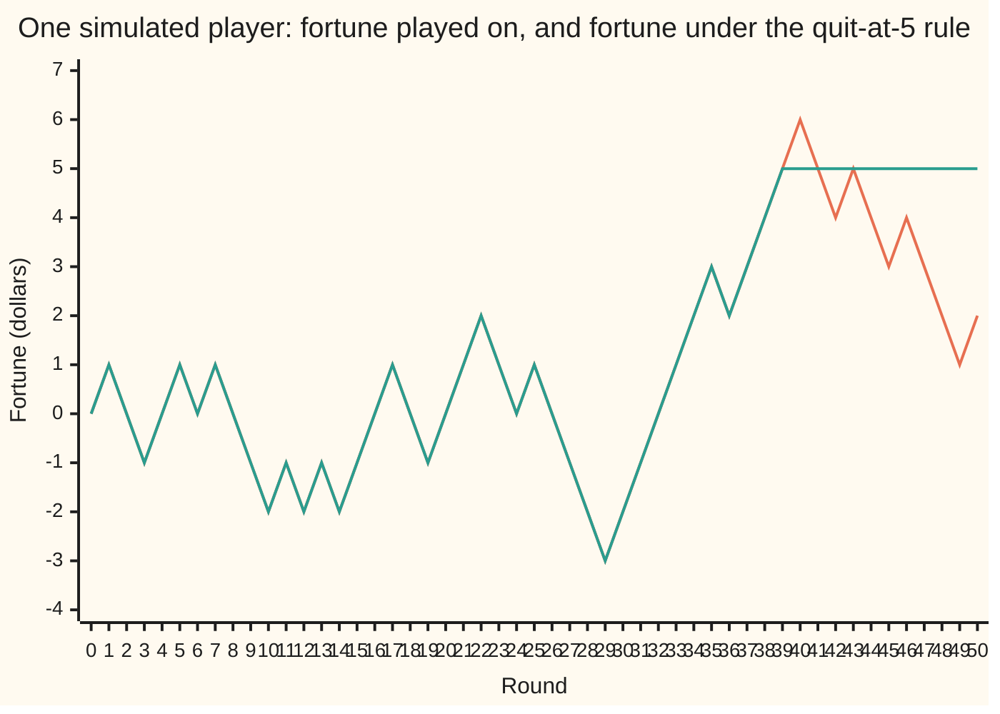
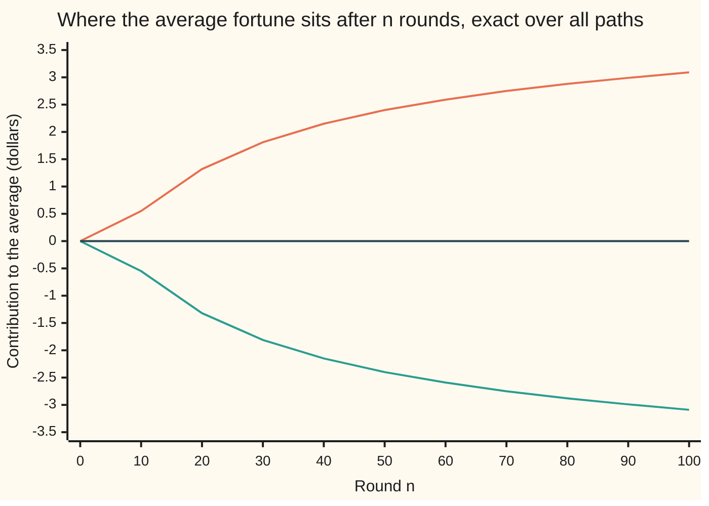

# Stopping times: rules that use only the past, and the theorem that quitting does not help

[Syllabus](../../../SYLLABUS.md) → [Stochastic processes and calculus](../../../SYLLABUS.md#w11) → [Martingales](../../../SYLLABUS.md#w11-s02) → Stopping times

---

## General Overview

A fair coin is tossed once a round. Heads wins 1 dollar, tails loses 1 dollar. A player starts at zero and follows one rule: **quit the first time 5 dollars ahead.** The table closes after round 100, so anyone still playing then stops where they stand.

The rule feels like a system. Every run that reaches 5 dollars ahead is cashed in, and nobody walks away from a win. Exact counting over every possible run of 100 tosses gives the split. 61.7% of players reach 5 dollars ahead and leave with it. The other 38.3% are still at the table at round 100, on average 8.07 dollars down.

Now average everyone. The quitters bring 0.617 × 5 = 3.09 dollars. The rest bring 0.383 × (−8.07) = −3.09 dollars. The total is exactly zero. The rule changed who wins and how often. It left the average where it started.

A quitting rule that decides at each round from the rounds already played is a **stopping time**: think of a referee who may call time but may not see the next toss. The result this card proves is the **optional stopping theorem**: a fair game stopped at a stopping time that is sure to come by a fixed round is still fair on average. Drop the deadline and it can fail. With no round 100 the same rule reaches 5 dollars with probability 1, so it averages 5; at every finite deadline the average is still 0, carried by ever rarer, ever deeper losers.

**A quitting rule that looks only at the past cannot change the average result of a fair game, provided play is sure to end by a fixed round.**

**What kind of fact this is:** a theorem, proved on this card in Why it works; the stopping time it rests on is a definition.

### The picture: one player, frozen at the stop



One sample path from the code's seeded simulation (seed 20260929), on a grid of whole rounds: player 3, the first to quit between rounds 20 and 40. The lines agree until round 39, when the fortune first reaches 5 dollars. Then the flat line is the fortune under the rule; the moving line is the fortune played on, back to 2 dollars by round 50. Here quitting helped. On other paths it hurt, and the theorem says the two balance exactly.

---

## The formula

Notation first, in words. The fortune after n rounds is $S_n$, in dollars, with $S_0 = 0$: the process notation from the first shelf of this wing, read "the value at round n". The symbol $\mathcal{F}_n$ is what is known after round n, here the first n tosses: the filtration, from the same shelf. A **martingale** $M_n$ is a fair game ([Martingales](01-martingales.md)): given $\mathcal{F}_n$, the best forecast of the next value is the current one. The fortune $S_n$ is one.

A stopping time is a random round $\tau$ (Greek "tau"). It must meet one condition:

$$\{\tau \le n\} \in \mathcal{F}_n \quad \text{for every round } n.$$

**Read it aloud:** after any round, the tosses seen so far are enough to say whether the stop has already happened.

The quit-at-5 rule passes: the first n tosses show whether the fortune has touched 5 yet. "Quit at the highest point of the 100 rounds" fails: at round 40 nobody can tell whether a higher point is still to come.

Write $n \wedge \tau$ for the smaller of n and $\tau$, read "n or tau, whichever comes first". The **stopped process** $M_{n \wedge \tau}$ follows the game until the stop and then stays frozen, as the flat line in the picture does. The theorem:

$$\text{if } \tau \le N \text{ on every path, then } E[M_\tau] = E[M_0].$$

**Read it aloud:** stop a fair game at a stopping time that never runs past round N, and the average value at the stop equals the value at the start.

The proof gives more: the frozen process $M_{n \wedge \tau}$ is itself a martingale, with or without a deadline. The deadline is needed only to make the frozen value at round N the value at the stop.

In the example, $M_n = S_n$, the deadline is $N = 100$, and $\tau$ is the first round the fortune reaches the target $a = 5$, or 100 if it never does. The theorem says $E[S_\tau] = 0$.

| Symbol | Plain meaning | In our example | Push it up and the answer… |
| --- | --- | --- | --- |
| $n$, $k$ | round numbers; n = 0 is the start | 0 to 100 | — |
| $S_n$, $S_{100}$ | the fortune after round n, in dollars; after round 100 | −1 after round 3 of the sample path | — |
| $M_n$ | any fair game (martingale) at round n | $S_n$ | — |
| $\mathcal{F}_n$ | what is known after round n | the first n tosses | more is known, so more rules qualify as stopping times |
| $\tau$ | the stopping time: the round play stops | 39 on the sample path | — |
| $N$ | the deadline: a round $\tau$ never passes | 100 | more players quit 5 up, those left sink deeper; the average stays 0 |
| $a$ | the target | 5 dollars | fewer players reach it; the average stays 0 |
| $n \wedge \tau$ | the smaller of n and $\tau$ | 39 at round 45 of the sample path | — |
| $M_{n \wedge \tau}$ | the stopped game, frozen at the stop | 5 dollars at round 45 of the sample path | — |
| $E$ | the average over all paths, weighted by probability | $E[S_\tau] = 0$ | — |
| $p$ | the chance of quitting a dollars up by round N (not the chance of winning a round, which is 0.5 here) | 0.617299 | — |
| $s$ | a fortune in dollars: before a toss in Step 5, at round 100 in the mirror count | a path ending at s mirrors to one ending at 10 − s | — |
| $b$, $c$ | the two walls: stop at the first touch of +b or −c dollars | not used in the main example | a higher c makes +b likelier to come first, c/(b + c) |
| $j$ | in the detailed proof, a round before n at which the stop came | 39 on the sample path | — |
| $\mathbf{1}_{\{\tau \ge k\}}$ | 1 if still playing at round k, otherwise 0 | 1 up to round 39 on the sample path, then 0 | — |

### When it holds

- **A fair game.** Each round must average zero given the past. With a coin that favours the house, no stopped fortune averages above zero; no stopping time rescues it.
- **A rule that uses only the past.** "Stop just before the first loss" needs the next toss. It averages about 1 dollar of profit, not 0.
- **A fixed deadline.** With no round 100, the quit-at-5 rule ends with probability 1, always at 5 dollars, so it averages 5. Weaker conditions can stand in for the deadline; they are the subject of [Stopping without a bound](06-uniform-integrability-and-unbounded-stopping.md).
- **A finite average at each round.** Each $M_n$ needs a finite average; here the fortune after n rounds is within n dollars of the start.

---

## Why it works

### Step 0: quitting is a bet of zero

Playing round k is a stake of 1 dollar on its toss; quitting is a stake of 0 on every later round. A stopping time fixes each stake before its toss. [Betting on a martingale](02-predictable-bets-and-the-martingale-transform.md) proved that bounded stakes chosen from the past cannot change a fair game's average. The theorem is that result, applied to stakes of 1 and then 0.

### Step 1: write the frozen fortune as a sum of bets

$$M_{n \wedge \tau} = M_0 + \sum_{k=1}^{n} \mathbf{1}_{\{\tau \ge k\}}\,(M_k - M_{k-1}).$$

The factor $\mathbf{1}_{\{\tau \ge k\}}$ is 1 while the player is still in at round k and 0 after the stop. On the sample path at round 45, the terms for rounds 1 to 39 carry the tosses, which add to 5 dollars. The terms for rounds 40 to 45 are multiplied by 0. The sum is 5, the frozen value.

### Step 2: the stake is known before the toss

$$\{\tau \ge k\} \text{ is the complement of } \{\tau \le k-1\}, \text{ which lies in } \mathcal{F}_{k-1}.$$

This is the one place the definition of a stopping time is used. Whether the player sits down for round k is settled by rounds 1 to k − 1. The peek rule fails exactly here: it plays round k only if round k is a win, so its stake depends on the toss it is staked on.

### Step 3: every bet averages zero, at every round

Given what is known after round k − 1, the stake is fixed and the next change in a fair game averages zero. So each term of the sum averages zero, and the frozen game's average never moves: $E[M_{n \wedge \tau}] = E[M_0]$ at every round n. No deadline is needed for this step.

The exact counts show it round by round. After n rounds, the quitters contribute 5 dollars times their share, the players still in contribute their average fortune times their share, and the two cancel; the code checks all 101 rounds exactly.



Top line: the quitters' contribution, 5 dollars times the share who have quit, rising to 3.09 at round 100. Bottom line: the contribution of those still playing, falling to −3.09. Middle line: their sum, the average of the frozen fortune, at 0 throughout.

### Step 4: the deadline turns "every round" into "at the stop"

At round N, the smaller of N and $\tau$ is $\tau$, because $\tau$ never passes N. So $E[M_\tau] = E[M_{N \wedge \tau}] = E[M_0]$. In the example, $E[S_\tau] = 0$.

<details>
<summary>Detailed proof: optional stopping for a bounded stopping time</summary>

**Setting.** A probability space with a filtration $\mathcal{F}_0 \subseteq \mathcal{F}_1 \subseteq \dots$. A martingale $M_0, M_1, \dots$: each $M_n$ is determined by $\mathcal{F}_n$ (adapted), has $E|M_n| < \infty$ (integrable), and $E[M_k \mid \mathcal{F}_{k-1}] = M_{k-1}$ almost surely. A random time $\tau$ with values in $\{0, 1, 2, \dots\} \cup \{\infty\}$ and $\{\tau \le n\} \in \mathcal{F}_n$ for every n. No deadline is assumed until the last line: $\tau$ may be unbounded, or infinite on some paths.

**The frozen game is adapted and integrable.** Split by when the stop happened: $M_{n \wedge \tau} = \sum_{j=0}^{n-1} M_j \mathbf{1}_{\{\tau = j\}} + M_n \mathbf{1}_{\{\tau \ge n\}}$. The event $\{\tau = j\}$ is $\{\tau \le j\}$ minus $\{\tau \le j-1\}$, so it lies in $\mathcal{F}_j \subseteq \mathcal{F}_n$. The event $\{\tau \ge n\}$ is the complement of $\{\tau \le n-1\}$, in $\mathcal{F}_{n-1}$. Each term is therefore determined by $\mathcal{F}_n$. And $|M_{n \wedge \tau}| \le |M_0| + \dots + |M_n|$, a sum of finitely many integrable variables.

**Each step of the frozen game is a predictable bet.** For every $k \ge 1$: if $\tau \ge k$, then $M_{k \wedge \tau} - M_{(k-1) \wedge \tau} = M_k - M_{k-1}$; if $\tau \le k-1$, both indices equal $\tau$ and the difference is 0. So the step is $\mathbf{1}_{\{\tau \ge k\}}(M_k - M_{k-1})$.

**Each step has conditional mean zero.** The factor $\mathbf{1}_{\{\tau \ge k\}}$ is bounded and determined by $\mathcal{F}_{k-1}$. Taking out what is known (wing 10's rules for conditional expectation) gives $E[\mathbf{1}_{\{\tau \ge k\}}(M_k - M_{k-1}) \mid \mathcal{F}_{k-1}] = \mathbf{1}_{\{\tau \ge k\}}\,E[M_k - M_{k-1} \mid \mathcal{F}_{k-1}] = 0$ almost surely. With adaptedness and integrability, $M_{n \wedge \tau}$ is a martingale.

**Averages.** The tower property turns a zero conditional mean into a zero mean: $E[M_{k \wedge \tau}] = E[M_{(k-1) \wedge \tau}]$ for each k. Chaining from $k = 1$ to n gives $E[M_{n \wedge \tau}] = E[M_0]$ for every n, with or without a deadline. Now add the deadline: if $\tau \le N$ on every path, then $N \wedge \tau = \tau$, so $E[M_\tau] = E[M_0]$.

**Where each hypothesis entered.** Fairness gave the zero conditional mean. The stopping-time condition made the factor known a round early. The deadline appeared only in the last line.

</details>

### Step 5: the same theorem, run a second time, measures the wait

The square of the fortune minus the round number, $S_n^2 - n$, is also a fair game. From fortune s, the next square is $(s+1)^2$ or $(s-1)^2$, which average $s^2 + 1$, and the round count also rises by 1. Optional stopping applied to it gives $E[S_\tau^2] = E[\tau]$. The code computes the left side from where players end up and the right side from how long they stay: both come to 58.130538. A player sits through 58.13 of the 100 rounds on average.

### A second road: the mirror count

Counting paths reaches the answer with no martingale in sight. Flip every toss after a path's first touch of 5, and a path ending at s becomes one ending at 10 − s: the reflection principle from the path-counting wing ([The reflection principle](../../04-Combinatorics%20and%20graphs/06-Lattice%20Paths%20and%20Catalan%20Numbers/02-reflection-principle-and-ballot-problem.md)). It gives the chance of reaching 5 by round 100 as twice the chance that $S_{100}$ is 6 or more: 0.617299. Subtracting mirrored paths from all paths gives the losers' final fortunes, and the total again comes to exactly 0. The mirror shows the cancellation for this one rule. The theorem says why it must happen for every stopping time with a deadline.

---

## Worked numbers, by hand

| Step | Arithmetic | Value |
| --- | --- | --- |
| share who quit 5 up by round 100 | twice the chance that $S_{100}$ is 6 or more | 0.617299 |
| share still playing at round 100 | 1 − 0.617299 | 0.382701 |
| average fortune of those still playing | from the exact path counts | −8.07 dollars |
| quitters' contribution | 5 × 0.617299 | 3.09 dollars |
| players' contribution | 0.382701 × (−8.07) | −3.09 dollars |
| **average result of the rule** | 3.09 − 3.09 | **0 dollars** |
| average rounds played | the average of $S_\tau^2$ | 58.13 |

A player using the rule usually walks away 5 dollars up, and still breaks even on average, because the rest lose more than 5.

### What breaks if you drop a piece

| Mistake | Comes out at | What went wrong |
| --- | --- | --- |
| No deadline: quit at +5 whenever that comes | +5 dollars with probability 1 | $\tau$ has no bound; the losses sit in ever rarer, ever deeper losers (table below) |
| Peek: stop just before the first loss | +1 dollar (exact 1.000000; simulated 0.9918, standard error 0.0044) | not a stopping time: it plays a round only if that round is a win |
| Doubling with no cap: stake 1, 2, 4, … until a win | +1 dollar with probability 1 | stakes and waiting both unbounded; capped at 10 rounds it wins 1 with chance 0.999023 and loses 1023 with chance 0.000977 (1 in 1024), average 0 |
| Averaging only the quitters | +5 dollars | drops the 38.3% still playing, 8.07 dollars down on average |

The doubling strategy is this shelf's house example, taken apart as a betting system in [Betting on a martingale](02-predictable-bets-and-the-martingale-transform.md).

### Dropping the deadline, in numbers

Keep the rule and move the deadline out. Mirror count throughout; at 1000 rounds also by path weights:

| Deadline N (rounds) | Share who quit 5 up | Average fortune of those still playing | Average overall |
| --- | --- | --- | --- |
| 100 | 0.617299 | −8.07 dollars | 0 |
| 1000 | 0.874377 | −34.80 dollars | 0 |
| 10000 | 0.960123 | −120.38 dollars | 0 |
| 100000 | 0.987385 | −391.35 dollars | 0 |

The quitters' share climbs toward 1. Those still playing shrink toward none, but their average loss grows without bound, and share times loss stays exactly −5 times the quitters' share. With no deadline at all, the losers have probability zero and the average is 5. The average at every deadline is 0; the average at the limit is 5. Swapping "take the limit" and "take the average" is the step that fails, and [Stopping without a bound](06-uniform-integrability-and-unbounded-stopping.md) gives the condition that makes it safe.

---

## Code, from first principles, and it actually runs

Three independent roads reach the average at the stop. Road 1 carries the weight of every path still playing from round to round, in exact integers (128-bit in Rust). Road 2 is the mirror count, from binomial coefficients. Road 3 simulates 100,000 players with a SplitMix64 generator written out, with standard errors. The code also checks the frozen average at all 101 rounds, $E[\tau] = E[S_\tau^2]$, the no-deadline table, the peek rule and capped doubling.

### Python

```python
# Stopping times and optional stopping -- the check behind the card.  Standard library only.
# A fair game at 1 dollar a round.  The rule: quit the first time 5 dollars ahead,
# and stop at round 100 whatever happens.  Three roads to the answer: exact path
# counts carried round by round, the reflection principle, a seeded simulation.
from math import comb, log, exp, sqrt

A, N = 5, 100                                  # target in dollars, deadline in rounds
MASK = (1 << 64) - 1

def splitmix(s):                               # SplitMix64: new state and 64 random bits
    s = (s + 0x9E3779B97F4A7C15) & MASK
    z = ((s ^ (s >> 30)) * 0xBF58476D1CE4E5B9) & MASK
    z = ((z ^ (z >> 27)) * 0x94D049BB133111EB) & MASK
    return s, z ^ (z >> 31)

def dp(N, one, half):
    # Road 1: carry the weight of every path still playing; fortune f sits at index f + N + 1.
    w = [0 * one] * (N + A + 3); w[N + 1] = one
    hit, hits, possum, alive = 0 * one, [], [], []
    for n in range(N + 1):
        if n > 0:
            w = [0 * one] + [half(w[i - 1] + w[i + 1]) for i in range(1, N + A + 2)] + [0 * one]
            hit += w[N + A + 1]; w[N + A + 1] = 0 * one        # reached +A: quits, leaves the board
        hits.append(hit)
        possum.append(sum((i - N - 1) * w[i] for i in range(N + A + 3)))
        alive.append(sum(w))
    sq = A * A * hit + sum((i - N - 1) ** 2 * w[i] for i in range(N + A + 3))
    return hits, possum, alive, sq

def reflect(N):
    # Road 2: a path that touched +A and ends at s mirrors to one ending at 2A - s.
    end = lambda s: comb(N, (N + s) // 2) if (N + s) % 2 == 0 and -N <= s <= N else 0
    hit = sum((2 if s > A else 1) * end(s) for s in range(A, N + 1))
    lose = [(s, end(s) - end(2 * A - s)) for s in range(-N, A)]
    return hit, sum(s * c for s, c in lose), sum(s * s * c for s, c in lose)

def reflect_float(N):                          # the same mirror, in floating point, for long games
    lc, pmf = 0.0, []
    for k in range(N + 1):
        pmf.append(exp(lc - N * log(2.0)))
        if k < N: lc += log(N - k) - log(k + 1)
    end = lambda s: pmf[(N + s) // 2] if (N + s) % 2 == 0 and -N <= s <= N else 0.0
    p = sum((2.0 if s > A else 1.0) * end(s) for s in range(A, N + 1))
    return p, sum(s * (end(s) - end(2 * A - s)) for s in range(-N, A))

T = 1 << N
hits, possum, alive, sq = dp(N, T, lambda x: x // 2)
h2, lsum2, lsq2 = reflect(N)
assert hits[N] == h2                                           # road 1 = road 2, exact integers
assert all(A * hits[n] + possum[n] == 0 for n in range(N + 1))  # E[S at min(n, tau)] = 0 at every n
assert A * h2 + lsum2 == 0                                      # E[S_tau] = 0 by the mirror count
assert sum(alive[:N]) == A * A * h2 + lsq2                     # E[tau] = E[S_tau^2]
assert sq == A * A * h2 + lsq2                                  # road 1 = road 2 for E[S_tau^2]
p = hits[N] / T
print(f"rule: quit at +{A} dollars, deadline {N} rounds, 1 dollar a round")
print(f"P(quit {A} up)  exact path counts   {p:.6f}")
print(f"P(quit {A} up)  reflection          {h2 / T:.6f}")
print(f"E[S_tau]  exact path counts       {(A * hits[N] + possum[N]) / T:.6f}")
print(f"E[S_tau]  reflection              {(A * h2 + lsum2) / T:.6f}")
print(f"E[S_min(n,tau)] = 0 at rounds 0..{N}: {sum(A * hits[n] + possum[n] == 0 for n in range(N + 1))} of {N + 1}")
print(f"P(still playing at round {N})     {alive[N] / T:.6f}")
print(f"losers' mean at round {N}          {possum[N] / alive[N]:.6f}")
print(f"E[tau] rounds, from survival       {sum(alive[:N]) / T:.6f}")
print(f"E[S_tau^2], from final fortunes    {sq / T:.6f}")
print("chart, round       " + " ".join(f"{n:6d}" for n in range(0, N + 1, 10)))
print("chart, quitters    " + " ".join(f"{A * hits[n] / T:6.2f}" for n in range(0, N + 1, 10)))
print("chart, players     " + " ".join(f"{possum[n] / T:6.2f}" for n in range(0, N + 1, 10)))

# Road 3: simulation.  Player j draws 128 bits; bit n-1 is round n (1 = win a dollar).
P, seed = 100000, 20260929
s, g, g2, nh, pk, pk2, fig = seed, 0, 0, 0, 0, 0, None
for j in range(P):
    s, b1 = splitmix(s); s, b2 = splitmix(s)
    bits, x, y, tau, lead, path, free = b1 | (b2 << 64), 0, 0, N, N, [0], [0]
    for n in range(1, N + 1):
        up = (bits >> (n - 1)) & 1
        if not up and lead == N: lead = n - 1                # peek rule: stop before the first loss
        y += 1 if up else -1
        if tau == N and x != A: x = y
        if x == A and tau == N: tau = n
        path.append(x); free.append(y)
    g += x; g2 += x * x; nh += x == A; pk += lead; pk2 += lead * lead
    if fig is None and 20 <= tau <= 40: fig = (j, tau, path[:51], free[:51])
m, ph, mp = g / P, nh / P, pk / P
se, seh, sep = sqrt((g2 / P - m * m) / P), sqrt(ph * (1 - ph) / P), sqrt((pk2 / P - mp * mp) / P)
assert abs(m) < 4 * se
assert abs(ph - p) < 4 * seh
print(f"simulation, {P} players, seed {seed}")
print(f"P(quit {A} up)  simulated           {ph:.6f}  se {seh:.6f}")
print(f"E[S_tau]  simulated               {m:.6f}  se {se:.6f}")

print(f"no deadline: N, P(quit {A} up by N), losers' mean, theorem's -{A}p/(1-p)")
for M in (100, 1000, 10000, 100000):
    pf, lf = reflect_float(M)
    assert abs(lf / (1 - pf) + A * pf / (1 - pf)) < 1e-9 * (1 + A * pf / (1 - pf))
    print(f"  {M:6d}  {pf:.6f}  {lf / (1 - pf):11.4f}  {-A * pf / (1 - pf):11.4f}")
hf, pf_, af, _ = dp(1000, 1.0, lambda x: 0.5 * x)
assert abs(hf[1000] - reflect_float(1000)[0]) < 1e-12
print(f"  1000 by path weights: P(quit {A} up) {hf[1000]:.6f}, losers' mean {pf_[1000] / af[1000]:.4f}")

exact_peek = 1 - 2.0 ** -N
assert abs(mp - exact_peek) < 4 * sep
print(f"peek rule (quit before the first loss): simulated {mp:.6f} se {sep:.6f}, exact {exact_peek:.6f}")
K, tot, ruin = 10, 0, 0                         # doubling, stakes 1, 2, 4, ... for at most K rounds
for mask in range(1 << K):
    gain, stake = 0, 1
    for n in range(K):
        if (mask >> n) & 1: gain += stake; break
        gain -= stake; stake *= 2
    tot += gain; ruin += gain < 0
assert tot == 0                                 # capped doubling: mean gain 0
assert ruin == 1
print(f"doubling, {K} rounds: P(win 1) {1 - ruin / 2 ** K:.6f}, P(lose {2 ** K - 1}) {ruin / 2 ** K:.6f} (1 in {2 ** K}), mean {tot / 2 ** K:.6f}")
print(f"figure, player {fig[0]} quits at round {fig[1]}")
print("figure, fortune  " + " ".join(str(v) for v in fig[3]))
print("figure, stopped  " + " ".join(str(v) for v in fig[2]))
```

**Ran 2026-09-30 on macOS, Python 3.14.6, standard library only. All checks passed. Output, pasted from the run:**

```
rule: quit at +5 dollars, deadline 100 rounds, 1 dollar a round
P(quit 5 up)  exact path counts   0.617299
P(quit 5 up)  reflection          0.617299
E[S_tau]  exact path counts       0.000000
E[S_tau]  reflection              0.000000
E[S_min(n,tau)] = 0 at rounds 0..100: 101 of 101
P(still playing at round 100)     0.382701
losers' mean at round 100          -8.065044
E[tau] rounds, from survival       58.130538
E[S_tau^2], from final fortunes    58.130538
chart, round            0     10     20     30     40     50     60     70     80     90    100
chart, quitters      0.00   0.55   1.32   1.81   2.15   2.40   2.59   2.75   2.88   2.99   3.09
chart, players       0.00  -0.55  -1.32  -1.81  -2.15  -2.40  -2.59  -2.75  -2.88  -2.99  -3.09
simulation, 100000 players, seed 20260929
P(quit 5 up)  simulated           0.620690  se 0.001534
E[S_tau]  simulated               0.050750  se 0.024066
no deadline: N, P(quit 5 up by N), losers' mean, theorem's -5p/(1-p)
     100  0.617299      -8.0650      -8.0650
    1000  0.874377     -34.8017     -34.8017
   10000  0.960123    -120.3847    -120.3847
  100000  0.987385    -391.3495    -391.3495
  1000 by path weights: P(quit 5 up) 0.874377, losers' mean -34.8017
peek rule (quit before the first loss): simulated 0.991810 se 0.004434, exact 1.000000
doubling, 10 rounds: P(win 1) 0.999023, P(lose 1023) 0.000977 (1 in 1024), mean 0.000000
figure, player 3 quits at round 39
figure, fortune  0 1 0 -1 0 1 0 1 0 -1 -2 -1 -2 -1 -2 -1 0 1 0 -1 0 1 2 1 0 1 0 -1 -2 -3 -2 -1 0 1 2 3 2 3 4 5 6 5 4 5 4 3 4 3 2 1 2
figure, stopped  0 1 0 -1 0 1 0 1 0 -1 -2 -1 -2 -1 -2 -1 0 1 0 -1 0 1 2 1 0 1 0 -1 -2 -3 -2 -1 0 1 2 3 2 3 4 5 5 5 5 5 5 5 5 5 5 5 5
```

### Rust

```rust
// Stopping times and optional stopping -- the check behind the card.  Rust std only.
// A fair game at 1 dollar a round.  The rule: quit the first time 5 dollars ahead,
// and stop at round 100 whatever happens.  Three roads to the answer: exact path
// counts carried round by round, the reflection principle, a seeded simulation.
use std::ops::{Add, Mul};

const A: i64 = 5;
const N: usize = 100;

fn splitmix(s: &mut u64) -> u64 {
    *s = s.wrapping_add(0x9E3779B97F4A7C15);
    let mut z = (*s ^ (*s >> 30)).wrapping_mul(0xBF58476D1CE4E5B9);
    z = (z ^ (z >> 27)).wrapping_mul(0x94D049BB133111EB);
    z ^ (z >> 31)
}

// Road 1: carry the weight of every path still playing; fortune f sits at index f + n + 1.
fn dp<T: Copy + Add<Output = T> + Mul<Output = T> + From<i32>>(
    n_max: usize, one: T, half: impl Fn(T) -> T,
) -> (Vec<T>, Vec<T>, Vec<T>, T) {
    let a = A as usize;
    let zero = T::from(0);
    let pos = |i: usize| T::from(i as i32 - n_max as i32 - 1);
    let mut w = vec![zero; n_max + a + 3];
    w[n_max + 1] = one;
    let (mut hit, mut hits, mut possum, mut alive) = (zero, vec![], vec![], vec![]);
    for n in 0..=n_max {
        if n > 0 {
            let mut nw = vec![zero; n_max + a + 3];
            for i in 1..n_max + a + 2 { nw[i] = half(w[i - 1] + w[i + 1]); }
            w = nw;
            hit = hit + w[n_max + a + 1];
            w[n_max + a + 1] = zero; // reached +A: quits, leaves the board
        }
        hits.push(hit);
        possum.push((0..w.len()).fold(zero, |acc, i| acc + pos(i) * w[i]));
        alive.push(w.iter().fold(zero, |acc, &x| acc + x));
    }
    let sq = (0..w.len()).fold(T::from((A * A) as i32) * hit, |acc, i| acc + pos(i) * pos(i) * w[i]);
    (hits, possum, alive, sq)
}

fn comb(n: i64, k: i64) -> i128 {
    let mut c: i128 = 1;
    for i in 0..k { c = c * (n - i) as i128 / (i + 1) as i128; }
    c
}

// Road 2: a path that touched +A and ends at s mirrors to one ending at 2A - s.
fn reflect(n: i64) -> (i128, i128, i128) {
    let end = |s: i64| if (n + s) % 2 == 0 && -n <= s && s <= n { comb(n, (n + s) / 2) } else { 0 };
    let hit: i128 = (A..=n).map(|s| (if s > A { 2 } else { 1 }) * end(s)).sum();
    let lose: Vec<(i128, i128)> = (-n..A).map(|s| (s as i128, end(s) - end(2 * A - s))).collect();
    (hit, lose.iter().map(|&(s, c)| s * c).sum(), lose.iter().map(|&(s, c)| s * s * c).sum())
}

fn reflect_float(n: i64) -> (f64, f64) {
    let (mut lc, mut pmf) = (0.0f64, vec![]);
    for k in 0..=n {
        pmf.push((lc - n as f64 * 2.0f64.ln()).exp());
        if k < n { lc += ((n - k) as f64).ln() - ((k + 1) as f64).ln(); }
    }
    let end = |s: i64| if (n + s) % 2 == 0 && -n <= s && s <= n { pmf[((n + s) / 2) as usize] } else { 0.0 };
    let p = (A..=n).fold(0.0, |acc, s| acc + (if s > A { 2.0 } else { 1.0 }) * end(s));
    (p, (-n..A).fold(0.0, |acc, s| acc + s as f64 * (end(s) - end(2 * A - s))))
}

fn main() {
    let t: i128 = 1 << N;
    let tf = t as f64;
    let (hits, possum, alive, sq) = dp(N, t, |x: i128| x / 2);
    let (h2, lsum2, lsq2) = reflect(N as i64);
    let a = A as i128;
    assert_eq!(hits[N], h2); // road 1 = road 2, exact integers
    assert!((0..=N).all(|n| a * hits[n] + possum[n] == 0)); // E[S at min(n, tau)] = 0 at every n
    assert_eq!(a * h2 + lsum2, 0); // E[S_tau] = 0 by the mirror count
    assert_eq!(alive[..N].iter().sum::<i128>(), a * a * h2 + lsq2); // E[tau] = E[S_tau^2]
    assert_eq!(sq, a * a * h2 + lsq2); // road 1 = road 2 for E[S_tau^2]
    let p = hits[N] as f64 / tf;
    let row = |v: Vec<String>| v.join(" ");
    println!("rule: quit at +{} dollars, deadline {} rounds, 1 dollar a round", A, N);
    println!("P(quit {} up)  exact path counts   {:.6}", A, p);
    println!("P(quit {} up)  reflection          {:.6}", A, h2 as f64 / tf);
    println!("E[S_tau]  exact path counts       {:.6}", (a * hits[N] + possum[N]) as f64 / tf);
    println!("E[S_tau]  reflection              {:.6}", (a * h2 + lsum2) as f64 / tf);
    println!("E[S_min(n,tau)] = 0 at rounds 0..{}: {} of {}", N, (0..=N).filter(|&n| a * hits[n] + possum[n] == 0).count(), N + 1);
    println!("P(still playing at round {})     {:.6}", N, alive[N] as f64 / tf);
    println!("losers' mean at round {}          {:.6}", N, possum[N] as f64 / alive[N] as f64);
    println!("E[tau] rounds, from survival       {:.6}", alive[..N].iter().sum::<i128>() as f64 / tf);
    println!("E[S_tau^2], from final fortunes    {:.6}", sq as f64 / tf);
    let grid: Vec<usize> = (0..=N).step_by(10).collect();
    println!("chart, round       {}", row(grid.iter().map(|n| format!("{:6}", n)).collect()));
    println!("chart, quitters    {}", row(grid.iter().map(|&n| format!("{:6.2}", (a * hits[n]) as f64 / tf)).collect()));
    println!("chart, players     {}", row(grid.iter().map(|&n| format!("{:6.2}", possum[n] as f64 / tf)).collect()));

    // Road 3: simulation.  Player j draws 128 bits; bit n-1 is round n (1 = win a dollar).
    let (pl, seed) = (100000usize, 20260929u64);
    let mut s = seed;
    let (mut g, mut g2, mut nh, mut pk, mut pk2) = (0i64, 0i64, 0i64, 0i64, 0i64);
    let mut fig: Option<(usize, usize, Vec<i64>, Vec<i64>)> = None;
    for j in 0..pl {
        let b1 = splitmix(&mut s) as u128;
        let b2 = splitmix(&mut s) as u128;
        let bits = b1 | (b2 << 64);
        let (mut x, mut y, mut tau, mut lead) = (0i64, 0i64, N, N as i64);
        let (mut path, mut free) = (vec![0i64], vec![0i64]);
        for n in 1..=N {
            let up = (bits >> (n - 1)) & 1 == 1;
            if !up && lead == N as i64 { lead = n as i64 - 1; } // peek rule: stop before the first loss
            y += if up { 1 } else { -1 };
            if tau == N && x != A { x = y; }
            if x == A && tau == N { tau = n; }
            path.push(x);
            free.push(y);
        }
        g += x; g2 += x * x; nh += (x == A) as i64; pk += lead; pk2 += lead * lead;
        if fig.is_none() && (20..=40).contains(&tau) { fig = Some((j, tau, path[..51].to_vec(), free[..51].to_vec())); }
    }
    let pf64 = pl as f64;
    let (m, ph, mp) = (g as f64 / pf64, nh as f64 / pf64, pk as f64 / pf64);
    let se = ((g2 as f64 / pf64 - m * m) / pf64).sqrt();
    let seh = (ph * (1.0 - ph) / pf64).sqrt();
    let sep = ((pk2 as f64 / pf64 - mp * mp) / pf64).sqrt();
    assert!(m.abs() < 4.0 * se);
    assert!((ph - p).abs() < 4.0 * seh);
    println!("simulation, {} players, seed {}", pl, seed);
    println!("P(quit {} up)  simulated           {:.6}  se {:.6}", A, ph, seh);
    println!("E[S_tau]  simulated               {:.6}  se {:.6}", m, se);

    println!("no deadline: N, P(quit {} up by N), losers' mean, theorem's -{}p/(1-p)", A, A);
    let af = A as f64;
    for mm in [100i64, 1000, 10000, 100000] {
        let (pf, lf) = reflect_float(mm);
        assert!((lf / (1.0 - pf) + af * pf / (1.0 - pf)).abs() < 1e-9 * (1.0 + af * pf / (1.0 - pf)));
        println!("  {:6}  {:.6}  {:11.4}  {:11.4}", mm, pf, lf / (1.0 - pf), -af * pf / (1.0 - pf));
    }
    let (hf, pf_, alf, _) = dp(1000, 1.0f64, |x: f64| 0.5 * x);
    assert!((hf[1000] - reflect_float(1000).0).abs() < 1e-12);
    println!("  1000 by path weights: P(quit {} up) {:.6}, losers' mean {:.4}", A, hf[1000], pf_[1000] / alf[1000]);

    let exact_peek = 1.0 - 2.0f64.powi(-(N as i32));
    assert!((mp - exact_peek).abs() < 4.0 * sep);
    println!("peek rule (quit before the first loss): simulated {:.6} se {:.6}, exact {:.6}", mp, sep, exact_peek);
    let k = 10u32; // doubling, stakes 1, 2, 4, ... for at most k rounds
    let (mut tot, mut ruin) = (0i64, 0i64);
    for mask in 0..(1u32 << k) {
        let (mut gain, mut stake) = (0i64, 1i64);
        for n in 0..k {
            if (mask >> n) & 1 == 1 { gain += stake; break; }
            gain -= stake;
            stake *= 2;
        }
        tot += gain;
        ruin += (gain < 0) as i64;
    }
    assert_eq!(tot, 0); // capped doubling: mean gain 0
    assert_eq!(ruin, 1);
    let k2 = (1i64 << k) as f64;
    println!("doubling, {} rounds: P(win 1) {:.6}, P(lose {}) {:.6} (1 in {}), mean {:.6}", k, 1.0 - ruin as f64 / k2, (1i64 << k) - 1, ruin as f64 / k2, 1i64 << k, tot as f64 / k2);
    let (fj, ft, fpath, ffree) = fig.unwrap();
    println!("figure, player {} quits at round {}", fj, ft);
    println!("figure, fortune  {}", row(ffree.iter().map(|v| v.to_string()).collect()));
    println!("figure, stopped  {}", row(fpath.iter().map(|v| v.to_string()).collect()));
}
```

**Ran 2026-09-30 on macOS, rustc 1.98.1, no crates. All checks passed. Output, pasted from the run:**

```
rule: quit at +5 dollars, deadline 100 rounds, 1 dollar a round
P(quit 5 up)  exact path counts   0.617299
P(quit 5 up)  reflection          0.617299
E[S_tau]  exact path counts       0.000000
E[S_tau]  reflection              0.000000
E[S_min(n,tau)] = 0 at rounds 0..100: 101 of 101
P(still playing at round 100)     0.382701
losers' mean at round 100          -8.065044
E[tau] rounds, from survival       58.130538
E[S_tau^2], from final fortunes    58.130538
chart, round            0     10     20     30     40     50     60     70     80     90    100
chart, quitters      0.00   0.55   1.32   1.81   2.15   2.40   2.59   2.75   2.88   2.99   3.09
chart, players       0.00  -0.55  -1.32  -1.81  -2.15  -2.40  -2.59  -2.75  -2.88  -2.99  -3.09
simulation, 100000 players, seed 20260929
P(quit 5 up)  simulated           0.620690  se 0.001534
E[S_tau]  simulated               0.050750  se 0.024066
no deadline: N, P(quit 5 up by N), losers' mean, theorem's -5p/(1-p)
     100  0.617299      -8.0650      -8.0650
    1000  0.874377     -34.8017     -34.8017
   10000  0.960123    -120.3847    -120.3847
  100000  0.987385    -391.3495    -391.3495
  1000 by path weights: P(quit 5 up) 0.874377, losers' mean -34.8017
peek rule (quit before the first loss): simulated 0.991810 se 0.004434, exact 1.000000
doubling, 10 rounds: P(win 1) 0.999023, P(lose 1023) 0.000977 (1 in 1024), mean 0.000000
figure, player 3 quits at round 39
figure, fortune  0 1 0 -1 0 1 0 1 0 -1 -2 -1 -2 -1 -2 -1 0 1 0 -1 0 1 2 1 0 1 0 -1 -2 -3 -2 -1 0 1 2 3 2 3 4 5 6 5 4 5 4 3 4 3 2 1 2
figure, stopped  0 1 0 -1 0 1 0 1 0 -1 -2 -1 -2 -1 -2 -1 0 1 0 -1 0 1 2 1 0 1 0 -1 -2 -3 -2 -1 0 1 2 3 2 3 4 5 5 5 5 5 5 5 5 5 5 5 5
```

The two outputs are identical line for line.

> [!TIP]
> **Try changing**
> Guess first, then run it.
> - **A nearer target.** Set `A, N = 3, 100`. More players quit, those left sink deeper, the average stays 0.000000, and every assert passes.
> - **A different seed.** Change `seed` to 7. The simulated rows move by about their standard errors; the exact rows do not move.
> - **Forget to take quitters off the board.** In `dp`, delete `w[N + A + 1] = 0 * one`, keeping the `hit +=` before it. The exact counts stop matching the mirror, and the first assert stops the run.

---

## The usual mistake

> [!warning]
> **Reading "fair on average" as "cannot win".** A stopping rule can make winning likely: 61.7% of players walk away 5 dollars up. What it cannot change is the average. A higher chance of a small win is paid for by a smaller chance of a larger loss, 8.07 dollars here.
>
> - **Leaving out the players still at the table.** Averaging only those who quit gives +5 dollars instead of 0.
> - **Treating "sure to happen eventually" as a deadline.** Without round 100 the fortune reaches 5 with probability 1, yet the average wait is infinite and the theorem does not apply: the average becomes 5.
> - **Rules that peek.** "Sell at the top" and "stop just before the first loss" are not stopping times; the second averages 1 dollar, and no real player can follow it.
> - **Taking a finite average wait as enough by itself.** It is enough when every step is bounded, as here, but not for every fair game; the exact conditions are on [Stopping without a bound](06-uniform-integrability-and-unbounded-stopping.md).

---

## Where you meet it in real life

- **Casino systems.** "Quit while ahead" on a game with a house edge still averages a loss; the rule reshapes the losses without removing them.
- **Two walls.** Stop at the first touch of +b or −c dollars. The fortune stays between the walls, which lets the deadline go ([Stopping without a bound](06-uniform-integrability-and-unbounded-stopping.md)), so the average at the stop is 0. That forces the chance of reaching +b first to be c divided by b + c: gambler's ruin in one line.
- **Peeking at experiments.** Stopping a trial or an A/B test the moment results look good is a stopping time on a noisy running total. Tests designed for repeated looks bound the error with martingale inequalities, as in [Doob's inequalities](05-doob-inequalities.md).
- **When to act.** Exercising an American option or selling a house at a good offer is a choice of stopping time. Choosing the best one is [Optimal stopping](../08-Generators%2C%20Densities%20and%20Simulation/07-optimal-stopping-and-snell-envelope.md).

> **Say it back**
> A stopping time is a rule for when to stop that can be checked from what has already happened. Stopping is a bet of 1 until the stop and 0 after, decided before each toss, so the frozen game is still fair. With a fixed deadline, the frozen value at the deadline is the value at the stop, so its average is the starting value. Quitting a fair coin game at 5 dollars ahead by round 100 wins 61.7% of the time and averages exactly 0. Without the deadline it averages 5, because the losses retreat into rarer, deeper losers.

---

## What this builds on

- [Betting on a martingale](02-predictable-bets-and-the-martingale-transform.md): stakes fixed from the past cannot change a fair game's average; a quitting rule is the stake 1, then 0.
- [The rules of conditional expectation](../../10-Measure%20and%20integration/09-Conditional%20Expectation/04-rules-of-conditional-expectation.md): taking out what is known and the tower property, both used in the detailed proof.

## Where this goes next

- [Martingale convergence](04-martingale-convergence.md): the stopped game at ever later rounds, and when a fair game settles to a limit.
- [Stopping without a bound](06-uniform-integrability-and-unbounded-stopping.md): the conditions that let the deadline go.
- [Optimal stopping](../08-Generators%2C%20Densities%20and%20Simulation/07-optimal-stopping-and-snell-envelope.md): when the game is not fair, the best stopping time and its value.

This card leaves one question open: the quit-at-5 average jumps from 0 to 5 when the deadline goes, so which unbounded stopping times keep the game fair, and why?

---

## Sources

Verified 2026-09-29: every link below resolves to the publisher's page.

- Doob, J. L. *Stochastic Processes*. Wiley, 1953; Wiley Classics reprint 1990. [Publisher page](https://www.wiley.com/en-us/Stochastic+Processes-p-9780471523697). The book that set out martingale theory and optional stopping.
- Williams, David. *Probability with Martingales*. Cambridge University Press, 1991. [doi:10.1017/CBO9780511813658](https://doi.org/10.1017/CBO9780511813658). The discrete-time proof by stopped processes used here, with the hypotheses that let the deadline go.
- Durrett, Rick. *Probability: Theory and Examples*, 5th ed. Cambridge University Press, 2019. [doi:10.1017/9781108591034](https://doi.org/10.1017/9781108591034). Stopping times and the optional stopping theorems in the martingale chapter.
- Feller, William. *An Introduction to Probability Theory and Its Applications*, Volume 1, 3rd ed. Wiley, 1968. [Publisher page](https://www.wiley.com/en-us/An+Introduction+to+Probability+Theory+and+Its+Applications%2C+Volume+1%2C+3rd+Edition-p-9780471257080). The reflection principle for coin tossing, the mirror count in road 2.
