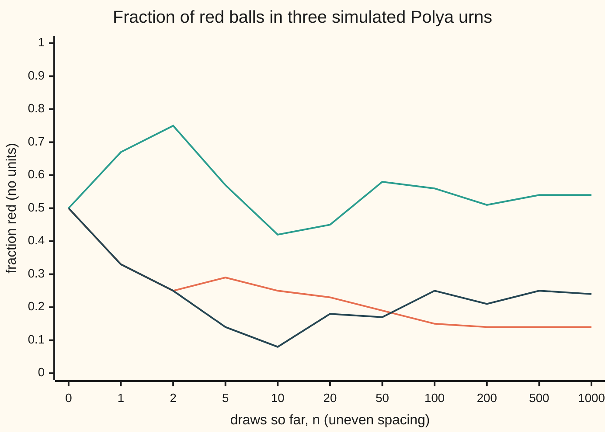
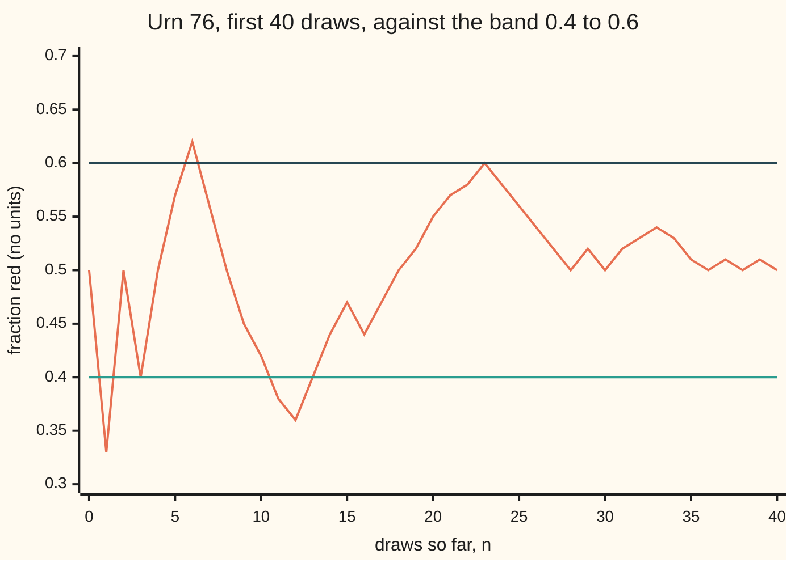
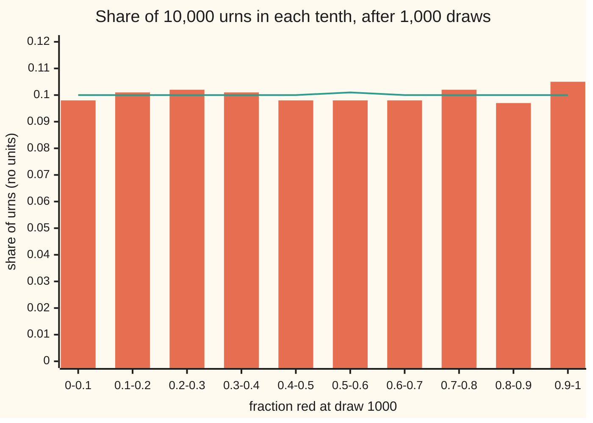

# Martingale convergence: a bounded martingale settles down

[Syllabus](../../../SYLLABUS.md) → [Stochastic processes and calculus](../../../SYLLABUS.md#w11) → [Martingales](../../../SYLLABUS.md#w11-s02) → Martingale convergence

---

## General Overview

An urn holds one red ball and one blue ball. Draw a ball at random and put it back with one more ball of its colour. Repeat. After n draws the urn holds n + 2 balls. This is **Pólya's urn**, a 1923 model of contagion by Florian Eggenberger and George Pólya.

The fraction of red balls starts at 1/2. The first draw moves it to 2/3 or 1/3. By draw 100 one new ball joins 101, and the fraction barely moves. In three simulated urns the fraction after 1,000 draws is 0.14, 0.54 and 0.24. Each urn settles, each somewhere different.

Two facts force the settling. The fraction is a fair game: its best forecast is its current value. And it stays between 0 and 1. A path that keeps moving without running off must cross some band, low to high, infinitely often. Each crossing is a trip a trader could profit from, and a fair game allows no profit on average. So the crossings stop.

**A martingale whose average size stays below a fixed ceiling converges: with probability 1 each path settles to a finite limit, and different paths may settle to different limits.**

**What kind of fact this is:** a theorem, Doob's martingale convergence theorem, proved on this card in Why it works, with every step in the Detailed proof; the upcrossing inequality it rests on is proved there too.

### The picture: three urns, each settling to its own level



Orange, green and dark blue: the first three urns of a seeded simulation (SplitMix64, seed 20260929), each one sample path, read at the draw counts on the axis. The early draws do the moving; from draw 200 to draw 1,000 the three go from 0.14 to 0.14, 0.51 to 0.54 and 0.21 to 0.24.

---

## The formula

Notation first, in words. After n draws the urn holds $R_n$ red balls, and the fraction red is $M_n$. The filtration $\mathcal F_n$ is what is known after n draws: the colours so far ([Filtrations and martingales](../../10-Measure%20and%20integration/09-Conditional%20Expectation/06-filtrations-and-martingales.md)). A martingale is a fair game: the best forecast of tomorrow, given today, is today ([Martingales](01-martingales.md)).

$$M_n = \frac{R_n}{n+2}, \qquad E[M_{n+1} \mid \mathcal F_n] = M_n$$

**Read it aloud:** the fraction red is reds over balls, and its forecast for the next draw is its value now.

Now take any martingale $X_n$ and a band from a low level $a$ to a high level $b$. An **upcrossing** is one completed trip from at or below a to at or above b; $U_n[a,b]$ counts those completed by time n. The **negative part** $x^-$ of a number x is how far it falls below zero: $-x$ if x < 0, else 0.

**The upcrossing inequality** (Doob, 1953):

$$(b - a)\, E\big[U_n[a,b]\big] \;\le\; E\big[(X_n - a)^-\big]$$

**Read it aloud:** the band's width times the expected number of upcrossings is at most the expected shortfall below the low level at the end.

**The convergence theorem.** Write $\sup_n E|X_n|$ for the smallest number at least as big as every $E|X_n|$: the ceiling on the average size. A martingale with a finite ceiling is **bounded in mean** (also called bounded in L1).

$$\sup_n E|X_n| = K < \infty \quad\Longrightarrow\quad X_n \to X_\infty \text{ almost surely, with } E|X_\infty| \le K$$

**Read it aloud:** if a martingale's average size never exceeds K, then with probability 1 its path settles to a limit whose average size is at most K too.

For the urn K is 1/2: the fraction is never negative, so its average size is its average, which stays at 1/2 (Step 1). The limit $M_\infty$ turns out to be spread evenly over 0 to 1.

| Symbol | Plain meaning | In our example | Push it up and the answer… |
| --- | --- | --- | --- |
| $n$, $m$, $k$ | draws (or rounds) so far, and a later draw count; a step, or a count of reds | 0 to 1000 | less movement still to come |
| $R_n$ | red balls after $n$ draws | 1 at the start | — |
| $M_n$, $M_\infty$ | fraction red, $R_n/(n+2)$; the level it settles to | 1/2 at the start; 0.14 for urn 1 | — |
| $\mathcal F_n$ | what is known after $n$ draws | the colours so far | sharper forecasts |
| $X_n$, $X_\infty$, $x_n$ | any martingale; its limit; a plain sequence of numbers | the urn fraction, a gambler's fortune | — |
| $\liminf x_n$, $\limsup x_n$ | the lowest and highest levels a sequence keeps coming back near, in the long run | equal on every urn path, since each settles | — |
| $(\Omega, \mathcal F, P)$ | the probability space: every possible run, the events, and their chances | all infinite sequences of urn draws | — |
| $a$, $b$ | the band's low and high levels | 0.4 and 0.6 | a wider band, fewer upcrossings |
| $U_n[a,b]$ | upcrossings completed by time $n$ | on average 0.154096 by draw 16 | grows with $n$, its average stays capped |
| $(x)^-$ | negative part: $-x$ if $x < 0$, else 0 | $(M_n - 0.4)^-$ averages 0.073203 at draw 16 | — |
| $K$ | the ceiling $\sup_n E\lvert X_n\rvert$ | 1/2 for the urn | a looser cap on upcrossings |
| $H_k$, $G_n$ | the stake on step $k$, fixed before it; total gain | hold 1 unit from 0.4 up to 0.6 | — |
| $\sigma_j$, $\tau_j$ | the j-th buy time and sell time | buy at or below 0.4, sell at or above 0.6 | — |
| $S_n$ | a fair $1 game's total, with unlimited credit | $E\lvert S_n\rvert$ = 7.9589 after 100 rounds | — |

### When it holds

- **A martingale or a supermartingale** (a game fair or tilted against the player). Without fairness, boundedness is not enough: a sequence alternating between 0.4 and 0.6 never settles.
- **A ceiling on the average size.** A fair $1 game with unlimited credit has $E|S_n|$ = 7.9589 after 100 rounds and 25.2250 after 1,000, and moves a dollar every round: it settles nowhere.
- **Discrete time.** The continuous-time version needs right-continuous paths; this card does not prove it.
- **Convergence of paths, not of averages.** The doubling strategy has average 0 at every round and still settles at +1 on almost every path.

---

## Why it works

### Step 0: a path that never settles runs off or crosses some band infinitely often

If a sequence does not settle at a finite level, either it runs off to infinity, which Step 5 rules out, or its lowest and highest long-run levels differ. In the second case pick a and b strictly between them. The path keeps returning below a and keeps returning above b, so it completes infinitely many upcrossings. Besides Step 5, it is therefore enough to show that every band is crossed only finitely often, with probability 1.

### Step 1: the fraction red is a fair game

With r red balls out of n + 2, the next draw is red with chance r/(n + 2), making the fraction (r + 1)/(n + 3); otherwise it becomes r/(n + 3). The forecast is

$$\frac{r}{n+2}\cdot\frac{r+1}{n+3} + \frac{n+2-r}{n+2}\cdot\frac{r}{n+3} \;=\; \frac{r\,(n+3)}{(n+2)(n+3)} \;=\; \frac{r}{n+2}.$$

So $M_n$ is a martingale, and its average stays at 1/2. The code checks this exactly for every n up to 20.

### Step 2: buy low, sell high

Treat the martingale as a price. Wait until it is at or below a; buy one unit; hold until it is at or above b; sell; repeat. The stake $H_k$ is 1 while holding and 0 while waiting, decided by prices up to step k − 1; the buy and sell moments are stopping times ([Stopping times](03-stopping-times-and-optional-stopping.md)).

Each completed round trip gained at least b − a. A unit still held at time n was bought at a or lower, so it has lost at most $(X_n - a)^-$. So the total gain $G_n$ satisfies

$$G_n \;\ge\; (b - a)\,U_n[a,b] \;-\; (X_n - a)^-.$$

### Step 3: a fair game gives no profit on average

Stakes fixed in advance, between 0 and 1, applied to a martingale give gains that form a martingale starting at 0 ([Betting on a martingale](02-predictable-bets-and-the-martingale-transform.md)). So $E[G_n] = 0$. Averaging Step 2 gives the upcrossing inequality.

For the urn at draw 16 and the band 0.4 to 0.6, the right side is 0.073203, so the bound on expected upcrossings is 0.366013. The true value, found two ways in the code, is 0.154096. The bound only has to be finite.

### The picture: one urn crossing the band twice



Orange: one sample path, the first of 10,000 simulated urns to finish two upcrossings within 40 draws, so busier than a typical urn. Green: the low level 0.4. Dark blue: the high level 0.6. The path drops to 0.33, climbs past 0.6 to 0.62 (upcrossing one), sinks to 0.36, and climbs back to 0.60 (upcrossing two). Then it hugs 0.50.

### Step 4: a ceiling on the average size caps the upcrossings

The shortfall below a is at most $|a| + |X_n|$, so the inequality gives an average of at most $(|a| + K)/(b - a)$ upcrossings by every time n. The count only grows with n, so by monotone convergence ([The monotone convergence theorem](../../10-Measure%20and%20integration/04-The%20Lebesgue%20Integral/03-monotone-convergence-theorem.md)) the total number ever has the same finite average. A count with a finite average is finite with probability 1, as in the first Borel-Cantelli lemma ([The Borel-Cantelli lemmas](../../10-Measure%20and%20integration/10-The%20Limit%20Theorems%2C%20Proved/01-borel-cantelli-lemmas.md)).

For the urn and the band 0.4 to 0.6, the ceiling K = 1/2 caps the average at (0.4 + 0.5)/0.2 = 4.5 upcrossings. The urn's own shortfall does better. It is a bowl-shaped function of a fair game, so by Jensen's inequality its average only rises with n, toward $0.4^2/2$ = 0.08 for the even limit of Step 6. The cap over all time is 0.08/0.2 = 0.4000. The exact average by draw 1,000 is 0.1893; the simulation gives 0.1857 ± 0.0040.

### Step 5: countably many bands, and a finite limit

A band with rational ends fits between any two different levels, and there are countably many. Each is crossed infinitely often only on a set of probability 0, and countably many such sets together have probability 0. So the path settles with probability 1. Fatou's lemma ([Fatou's lemma](../../10-Measure%20and%20integration/05-Swapping%20Limits%20and%20Integrals/01-fatous-lemma.md)) gives $E|X_\infty| \le K$, so the limit is finite with probability 1.

### Step 6: where the urn settles

The theorem says the urn settles, not where. One order of draws with k reds and n − k blues has chance k!(n − k)!/(n + 1)!, whatever the order: the i-th red drawn meets i reds, the i-th blue meets i blues, and the t-th draw meets t + 1 balls. Times the "n choose k" orders, every count of reds from 0 to n has chance exactly 1/(n + 1): each of the n + 1 levels is equally likely.

The paths converge, so their law converges too ([Modes of convergence](../../10-Measure%20and%20integration/05-Swapping%20Limits%20and%20Integrals/04-modes-of-convergence.md)), and evenly spaced levels become the even spread on 0 to 1: the chance that $M_\infty$ lands below a level x is x. Among 10,000 simulated urns, each tenth of the range holds between 0.097 and 0.105 of them at draw 1,000, against an exact 0.100 or 0.101.

### The picture: where 10,000 urns stand after 1,000 draws



Bars: simulated shares, each within four standard errors of the exact value, as the code asserts. Line: the exact shares at draw 1,000. Flat, not a hump at 1/2: the urn keeps its early luck for ever.

<details>
<summary>How much movement is left after n draws</summary>

A martingale's future steps are uncorrelated with its present, so the average squared move from draw n to a later draw m is $E[M_m^2] - E[M_n^2]$. The even law gives $E[M_n^2] = (2n+3)/(6(n+2))$, rising to 1/3, so the average squared travel left after n draws is $1/(6(n+2))$. Its square root is 0.2887 at the start, 0.1179 after 10 draws, 0.0404 after 100 and 0.0129 after 1,000. From draw 100 to draw 1,000 the average squared move is 1/612 − 1/6012 = 0.001468; the simulation gives 0.001461 ± 0.000024.

</details>

<details>
<summary>Detailed proof</summary>

Throughout, $(\Omega, \mathcal{F}, P)$ is a probability space with a filtration $\mathcal F_0 \subseteq \mathcal F_1 \subseteq \dots$, and $X_n$ is a martingale: $X_n$ is known at time n, $E|X_n| < \infty$, and $E[X_{n+1} \mid \mathcal F_n] = X_n$.

**Lemma 1 (non-convergence means infinitely many upcrossings).** If real numbers $x_n$ have $\liminf x_n < \limsup x_n$, choose rationals $a < b$ strictly between. Then $x_n < a$ for infinitely many n and $x_n > b$ for infinitely many n, so the sequence completes infinitely many upcrossings of $[a, b]$.

**Lemma 2 (upcrossing inequality).** Fix $a < b$. Let $\sigma_1 = \min\{k \ge 0 : X_k \le a\}$, $\tau_1 = \min\{k > \sigma_1 : X_k \ge b\}$, and in turn $\sigma_{j+1} = \min\{k > \tau_j : X_k \le a\}$, $\tau_{j+1} = \min\{k > \sigma_{j+1} : X_k \ge b\}$, the minimum of an empty set being infinity. These are stopping times, and $U_n[a,b]$ is the number of j with $\tau_j \le n$. Put $H_k = 1$ if $\sigma_j < k \le \tau_j$ for some j, else 0, decided by $X_0, \dots, X_{k-1}$. Let $G_n = \sum_{k=1}^{n} H_k (X_k - X_{k-1})$. Each completed block from $\sigma_j$ to $\tau_j \le n$ contributes $X_{\tau_j} - X_{\sigma_j} \ge b - a$. At most one block is open at time n, from some $\sigma_j < n$; it contributes $X_n - X_{\sigma_j} \ge X_n - a \ge -(X_n - a)^-$. So $G_n \ge (b-a)\,U_n[a,b] - (X_n - a)^-$. Taking out what is known, $E[H_k (X_k - X_{k-1}) \mid \mathcal F_{k-1}] = H_k\,(E[X_k \mid \mathcal F_{k-1}] - X_{k-1}) = 0$, and the tower rule gives $E[G_n] = 0$. Averaging, $(b-a)\,E[U_n[a,b]] \le E[(X_n - a)^-]$. For a supermartingale $E[G_n] \le 0$ and the same inequality follows.

**Theorem 3 (convergence).** Suppose $\sup_n E|X_n| = K < \infty$. For rationals $a < b$, since $(X_n - a)^- \le |X_n| + |a|$, Lemma 2 gives $E[U_n[a,b]] \le (K + |a|)/(b-a)$ for all n. The counts rise with n to $U_\infty[a,b]$, and monotone convergence gives $E[U_\infty[a,b]] \le (K + |a|)/(b-a)$, so $P(U_\infty[a,b] = \infty) = 0$. By Lemma 1, $\{\liminf X_n < \limsup X_n\}$ lies inside the union over rational $a < b$ of $\{U_\infty[a,b] = \infty\}$, a countable union of null sets, so it is null. Off it, $X_n$ has a limit $X_\infty$ in $[-\infty, \infty]$. Fatou's lemma applied to $|X_n|$ gives $E|X_\infty| \le \liminf E|X_n| \le K$, so $X_\infty$ is finite almost surely and integrable.

**Corollary 4 (non-negative martingales).** If $X_n \ge 0$ then $E|X_n| = E[X_n] = E[X_0]$, so Theorem 3 applies with $K = E[X_0]$.

**Proposition 5 (the urn).** By Step 1 and $0 \le M_n \le 1$, Corollary 4 applies with $K = E[M_0] = 1/2$, so $M_n \to M_\infty$ almost surely. By Step 6, $P(M_n \le x)$ is the number of levels $j/(n+2)$, $1 \le j \le n+1$, at or below x, divided by n + 1; that number is within 1 of $x(n+2)$, so $P(M_n \le x) \to x$. Almost sure convergence implies convergence in law at continuity points of the limit, so $P(M_\infty \le x) = x$: the limit is uniform on [0, 1]. Dominated convergence, with $|M_n| \le 1$, gives $E[M_\infty] = 1/2$.

</details>

A second road avoids martingales: the urn behaves exactly like tosses of a coin whose chance of red was drawn evenly from 0 to 1, and the strong law sends the fraction to that hidden chance (de Finetti's theorem; the updating side is the beta-binomial model, [Beta-binomial](../../09-Probability%20and%20statistics/10-Bayesian%20Inference/02-beta-binomial.md)).

---

## Worked numbers, by hand

| Step | Arithmetic | Value |
| --- | --- | --- |
| start | 1 red of 2 balls | 1/2 |
| after one draw | red (chance 1/2) gives 2 of 3; blue gives 1 of 3 | 2/3 or 1/3 |
| forecast | 1/2 × 2/3 + 1/2 × 1/3 | **1/2**: fair |
| order red, red, blue | 1/2 × 2/3 × 1/4 | 1/12 |
| orders RBR and BRR | 1/2 × 1/3 × 2/4, and 1/2 × 1/3 × 2/4 | 1/12 each |
| 3 reds of 5 after 3 draws | 3 × 1/12 | 1/4, like every other count |
| average shortfall below 0.4 at draw 16 | 0.4 minus each level j/18 below it, averaged over all 17 levels | 56/765 = 0.073203 |
| upcrossing bound | 0.073203 / (0.6 − 0.4) | 0.366013 |
| exact expected upcrossings, draw 16 | dynamic program; every sequence listed | **0.154096** |
| distance still to travel after 100 draws | 1/sqrt(612) | 0.0404 |

The fraction is fair at every step, equally likely to stand at any level, and crosses the band far less often than the bound allows.

### What breaks if you drop a piece

| Mistake | Comes out at | What went wrong |
| --- | --- | --- |
| Drop the ceiling: a fair $1 game with credit, $S_n$ | $E\lvert S_n\rvert$ = 7.9589 at 100 rounds, 25.2250 at 1,000; the path never settles | the average size is unbounded, and so is the upcrossing bound |
| Convergence taken for convergence of averages: doubling | settles at +1 (won by round 10 with chance 0.999023), averages 0 every round; $E\lvert X_n\rvert$ = 1.998047 | paths converge; averages need more |
| Expect the limit to be the start, 1/2 | 0.098 of urns sit below 0.1 at draw 1,000; each tenth holds about 0.100 | the limit is random and evenly spread |
| Read the bound as an estimate | bound 0.366013, true 0.154096 at draw 16 | an inequality, used only to show finiteness |

The code prints every number in this table.

---

## Code, from first principles, and it actually runs

Four roads. The urn's law is stepped forward in exact integers against the formula 1/(n + 1). Expected upcrossings at draw 16 come from a dynamic program over (reds, waiting or holding) and from listing all 65,536 draw sequences; the fractions match. A SplitMix64 generator, written out with seed 20260929, simulates 10,000 urns of 1,000 draws, each average asserted within four standard errors. Last, the house example: the fortune stopped at $0 against the reflection principle, and the doubling strategy enumerated.

### Python

```python
# Martingale convergence -- the check behind the card.  Standard library only.
# Polya's urn: 1 red and 1 blue ball; draw one at random, put it back with one
# more of its colour.  R reds after n draws; M_n = R/(n+2) is the fraction red.
# Roads: exact integer dynamic programming, listing every draw sequence, closed
# formulas, and a seeded SplitMix64 simulation printed with standard errors.
from math import gcd, factorial, sqrt, prod

def fr(p, q):                            # a fraction p/q, reduced, as text
    g = gcd(p, q)
    return f"{p // g}/{q // g}"
def law(n):                              # road 1: P(R = r) * (n+1)!, stepping the urn
    w = {1: 1}
    for t in range(n):                   # t+2 balls; red drawn with chance r/(t+2)
        nxt = {}
        for r, p in w.items():
            nxt[r + 1] = nxt.get(r + 1, 0) + p * r
            nxt[r] = nxt.get(r, 0) + p * (t + 2 - r)
        w = nxt
    return w
print("exact law of the reds R after n draws; road 2 is the formula P(R = r) = 1/(n+1)")
for n in range(1, 21):
    w, den = law(n), factorial(n + 1)
    assert sorted(w) == list(range(1, n + 2)) and all(p * (n + 1) == den for p in w.values())
    assert 2 * sum(r * p for r, p in w.items()) == (n + 2) * den      # E[M_n] = 1/2
    if n <= 3: print(f"n={n}: " + "  ".join(f"P(R={r}) = {fr(w[r], den)}" for r in sorted(w)))
print(f"by hand: M_1 = {fr(2, 3)} or {fr(1, 3)}, chance 1/2 each, average {fr(2 + 1, 6)}; 3 draws, 2 reds, each order: " + " ".join(
    f"{q} {fr(prod(1 + q[:t].count(c) for t, c in enumerate(q)), prod(range(2, 5)))}" for q in ("RRB", "RBR", "BRR")))
print("E[M_n] = 1/2 and every P(R = r) = 1/(n+1), n = 1..20: both roads agree")
def lo(r, t): return 5 * r <= 2 * (t + 2)   # M_t <= a = 0.4
def hi(r, t): return 5 * r >= 3 * (t + 2)   # M_t >= b = 0.6
def up_dp(n, one):                       # road 1: E[U_n], carrying (reds, armed) forward
    w, eu = {(1, False): one}, 0 * one   # weights stay exact when one = 1 (over (t+1)!)
    for t in range(n):
        nxt, c = {}, 0 * one
        for (r, armed), p in w.items():
            for r2, q in ((r + 1, r), (r, t + 2 - r)):
                up = armed and hi(r2, t + 1)     # an upcrossing completes
                if up: c += p * q
                key = (r2, not up and (armed or lo(r2, t + 1)))
                nxt[key] = nxt.get(key, 0 * one) + p * q
        if type(one) is int:             # integer weights over (t+2)!: rescale to (n+1)!
            eu += c * (factorial(n + 1) // factorial(t + 2))
            w = nxt
        else:
            eu += c / (t + 2)
            w = {k: v / (t + 2) for k, v in nxt.items()}
    return eu
def up_list(n):                          # road 2: every draw sequence, weighted
    total = 0
    for mask in range(1 << n):
        r, armed, u = 1, False, 0
        for t in range(n):
            r += mask >> t & 1
            up = armed and hi(r, t + 1)          # an upcrossing completes
            u, armed = u + up, not up and (armed or lo(r, t + 1))
        total += u * factorial(r - 1) * factorial(n - r + 1)  # k = r-1 reds: chance k!(n-k)!/(n+1)!
    return total
n, den = 16, factorial(17)
e1, e2 = up_dp(n, 1), up_list(n)
bnum = sum(max(2 * (n + 2) - 5 * j, 0) for j in range(1, n + 2))  # E[(M_n - a)^-] * 5(n+2)(n+1)
bden = 5 * (n + 2) * (n + 1)
assert e1 == e2                          # two roads to E[U]
assert e1 * bden < 5 * bnum * den        # E[U] under the bound; 1/(b - a) = 5
print(f"upcrossings of [0.4, 0.6] in {n} draws: E[U] by DP {fr(e1, den)} = {e1 / den:.6f}")
print(f"  by listing all {1 << n} draw sequences {fr(e2, den)} = {e2 / den:.6f}")
print(f"  E[(M_n - 0.4)^-] = {fr(bnum, bden)} = {bnum / bden:.6f}; bound E[(M_n - a)^-]/(b - a) = {5 * bnum / bden:.6f}")
eu1000 = up_dp(1000, 1.0)
print(f"E[U] in 1000 draws by DP {eu1000:.4f}; bound {5 * sum(max(0.4 - j / 1002, 0) for j in range(1, 1002)) / 1001:.4f}; limit bound (a^2/2)/(b-a) = {0.08 / 0.2:.4f}")
state = 20260929                         # SplitMix64, written out
def nxt64():
    global state
    state = (state + 0x9E3779B97F4A7C15) & (2 ** 64 - 1)
    z = ((state ^ (state >> 30)) * 0xBF58476D1CE4E5B9) & (2 ** 64 - 1)
    z = ((z ^ (z >> 27)) * 0x94D049BB133111EB) & (2 ** 64 - 1)
    return z ^ (z >> 31)
URNS, N, MARKS = 10000, 1000, (0, 1, 2, 5, 10, 20, 50, 100, 200, 500, 1000)
bins, ups, fin, gap, paths, early = [0] * 10, [], [], [], [], []
for i in range(URNS):
    r, armed, u, seen, f40 = 1, False, 0, {0: 0.5}, [0.5]
    for t in range(N):
        r += nxt64() % (t + 2) < r      # red with chance r/(t+2)
        if armed and hi(r, t + 1):
            u, armed = u + 1, False
        elif lo(r, t + 1):
            armed = True
        if t + 1 in MARKS: seen[t + 1] = r / (t + 3)
        if t < 40: f40.append(r / (t + 3))
        if t == 39 and u >= 2 and not early: early = [i + 1, f40]
    bins[min(int(10 * seen[N]), 9)] += 1
    ups.append(u); fin.append(seen[N]); gap.append((seen[N] - seen[100]) ** 2)
    if i < 3: paths.append(seen)
def mse(xs):
    m = sum(xs) / len(xs)
    return m, sqrt(sum((x - m) ** 2 for x in xs) / (len(xs) - 1) / len(xs))
print(f"simulation: {URNS} urns, {N} draws each, SplitMix64 seed 20260929")
for k in range(3):
    print(f"urn {k + 1}, M_n at n = 0 1 2 5 10 20 50 100 200 500 1000: " + " ".join(f"{paths[k][m]:.2f}" for m in MARKS))
print(f"urn {early[0]}, first with 2 upcrossings by draw 40, M_n for n = 0..40:")
print(" ".join(f"{x:.2f}" for x in early[1]))
exact_bin = [sum(1 for j in range(1, N + 2) if min(int(10 * j / (N + 2)), 9) == b) / (N + 1) for b in range(10)]
print("share of M_1000 in tenths 0-0.1 ... 0.9-1: " + " ".join(f"{b / URNS:.3f}" for b in bins))
print("  exact from the law, each tenth:           " + " ".join(f"{e:.3f}" for e in exact_bin))
assert all(abs(b / URNS - e) < 4 * sqrt(0.09 / URNS) for b, e in zip(bins, exact_bin))
(mf, sf), (mu, su), (mg, sg) = mse(fin), mse(ups), mse(gap)
g_exact = 1 / (6 * 102) - 1 / (6 * 1002)
print(f"mean M_1000 {mf:.4f} +- {sf:.4f} (exact 0.5000)")
print(f"mean upcrossings of [0.4, 0.6] {mu:.4f} +- {su:.4f} (exact {eu1000:.4f})")
print(f"mean (M_1000 - M_100)^2 {mg:.6f} +- {sg:.6f} (exact 1/612 - 1/6012 = {g_exact:.6f})")
assert abs(mf - 0.5) < 4 * sf
assert abs(mu - eu1000) < 4 * su
assert abs(mg - g_exact) < 4 * sg
print("RMS movement still to come after n draws, 1/sqrt(6(n+2)): " + " ".join(f"n={m} {1 / sqrt(6 * (m + 2)):.4f}" for m in (0, 10, 100, 1000)))
print("house example: a fair $1 game.  Without credit, from $10; with credit, S_n from 0")
w = [0.0] * 10 + [1.0] + [0.0] * 1001      # chance of each fortune, stopped at $0
for t in range(1, 1001):
    w = [w[0] + 0.5 * w[1], 0.5 * w[2]] + [0.5 * (w[x - 1] + w[x + 1]) for x in range(2, 1011)] + [0.0]
    if t in (100, 1000):
        p = [0.5 ** t]                    # road 2: reflection, P(-10 < S_t <= 10), binomial
        for j in range(t): p.append(p[-1] * (t - j) / (j + 1))
        refl = sum(q for j, q in enumerate(p) if -10 < 2 * j - t <= 10)
        mean = sum(x * q for x, q in enumerate(w))
        e_abs = sum(abs(2 * j - t) * q for j, q in enumerate(p))
        p0 = prod((2 * k - 1) / (2 * k) for k in range(1, t // 2 + 1))
        assert abs((1 - w[0]) - refl) < 1e-9 and abs(mean - 10) < 1e-9
        assert abs(e_abs - t * p0) < 1e-9 # E|S_t| = t P(S_t = 0) for even t
        print(f"n={t}: still playing {1 - w[0]:.4f} (reflection {refl:.4f}), mean fortune {mean:.4f}; E|S_n| {e_abs:.4f} (n P(S_n=0) {t * p0:.4f})")
n = 10                                    # doubling: stake 1, 2, 4, ... until the first win
e_x = e_abs = won = 0                     # sums over all 2^n equally likely coin sequences
for mask in range(1 << n):
    x, stake = 0, 1
    for t in range(n):
        if x == 1: break                  # won: stop betting
        if mask >> t & 1: x += stake
        else: x, stake = x - stake, 2 * stake
    e_x, e_abs, won = e_x + x, e_abs + abs(x), won + (x == 1)
assert e_x == 0                           # a fair game: average 0 at round n
assert e_abs * 2 ** (n - 1) == 2 ** (2 * n) - 2 ** n   # formula E|X| = 2 - 2^(1-n)
assert won == 2 ** n - 1                  # formula P(X = +1) = 1 - 2^(-n)
print(f"doubling, n={n}: E[X] = {e_x}, E|X| = {fr(e_abs, 2 ** n)} = {e_abs / 2 ** n:.6f}, P(won, X = +1) = {fr(won, 2 ** n)} = {1 - 0.5 ** n:.6f}")
```

**Ran 2026-09-30 on macOS, Python 3.14.6, standard library only. All checks passed. Output, pasted from the run:**

```
exact law of the reds R after n draws; road 2 is the formula P(R = r) = 1/(n+1)
n=1: P(R=1) = 1/2  P(R=2) = 1/2
n=2: P(R=1) = 1/3  P(R=2) = 1/3  P(R=3) = 1/3
n=3: P(R=1) = 1/4  P(R=2) = 1/4  P(R=3) = 1/4  P(R=4) = 1/4
by hand: M_1 = 2/3 or 1/3, chance 1/2 each, average 1/2; 3 draws, 2 reds, each order: RRB 1/12 RBR 1/12 BRR 1/12
E[M_n] = 1/2 and every P(R = r) = 1/(n+1), n = 1..20: both roads agree
upcrossings of [0.4, 0.6] in 16 draws: E[U] by DP 236003/1531530 = 0.154096
  by listing all 65536 draw sequences 236003/1531530 = 0.154096
  E[(M_n - 0.4)^-] = 56/765 = 0.073203; bound E[(M_n - a)^-]/(b - a) = 0.366013
E[U] in 1000 draws by DP 0.1893; bound 0.3994; limit bound (a^2/2)/(b-a) = 0.4000
simulation: 10000 urns, 1000 draws each, SplitMix64 seed 20260929
urn 1, M_n at n = 0 1 2 5 10 20 50 100 200 500 1000: 0.50 0.33 0.25 0.29 0.25 0.23 0.19 0.15 0.14 0.14 0.14
urn 2, M_n at n = 0 1 2 5 10 20 50 100 200 500 1000: 0.50 0.67 0.75 0.57 0.42 0.45 0.58 0.56 0.51 0.54 0.54
urn 3, M_n at n = 0 1 2 5 10 20 50 100 200 500 1000: 0.50 0.33 0.25 0.14 0.08 0.18 0.17 0.25 0.21 0.25 0.24
urn 76, first with 2 upcrossings by draw 40, M_n for n = 0..40:
0.50 0.33 0.50 0.40 0.50 0.57 0.62 0.56 0.50 0.45 0.42 0.38 0.36 0.40 0.44 0.47 0.44 0.47 0.50 0.52 0.55 0.57 0.58 0.60 0.58 0.56 0.54 0.52 0.50 0.52 0.50 0.52 0.53 0.54 0.53 0.51 0.50 0.51 0.50 0.51 0.50
share of M_1000 in tenths 0-0.1 ... 0.9-1: 0.098 0.101 0.102 0.101 0.098 0.098 0.098 0.102 0.097 0.105
  exact from the law, each tenth:           0.100 0.100 0.100 0.100 0.100 0.101 0.100 0.100 0.100 0.100
mean M_1000 0.5009 +- 0.0029 (exact 0.5000)
mean upcrossings of [0.4, 0.6] 0.1857 +- 0.0040 (exact 0.1893)
mean (M_1000 - M_100)^2 0.001461 +- 0.000024 (exact 1/612 - 1/6012 = 0.001468)
RMS movement still to come after n draws, 1/sqrt(6(n+2)): n=0 0.2887 n=10 0.1179 n=100 0.0404 n=1000 0.0129
house example: a fair $1 game.  Without credit, from $10; with credit, S_n from 0
n=100: still playing 0.6803 (reflection 0.6803), mean fortune 10.0000; E|S_n| 7.9589 (n P(S_n=0) 7.9589)
n=1000: still playing 0.2480 (reflection 0.2480), mean fortune 10.0000; E|S_n| 25.2250 (n P(S_n=0) 25.2250)
doubling, n=10: E[X] = 0, E|X| = 1023/512 = 1.998047, P(won, X = +1) = 1023/1024 = 0.999023
```

### Rust

```rust
// Martingale convergence -- the check behind the card.  Rust std only.
// Polya's urn: 1 red and 1 blue ball; draw one at random, put it back with one
// more of its colour.  R reds after n draws; M_n = R/(n+2) is the fraction red.
// Roads: exact integer dynamic programming, listing every draw sequence, closed
// formulas, and a seeded SplitMix64 simulation printed with standard errors.
fn gcd(a: u128, b: u128) -> u128 { if b == 0 { a } else { gcd(b, a % b) } }
fn fr(p: u128, q: u128) -> String { let g = gcd(p, q); format!("{}/{}", p / g, q / g) }
fn fact(n: u128) -> u128 { (1..=n).product() }
fn lo(r: u64, t: u64) -> bool { 5 * r <= 2 * (t + 2) } // M_t <= a = 0.4
fn hi(r: u64, t: u64) -> bool { 5 * r >= 3 * (t + 2) } // M_t >= b = 0.6
// road 1: P(R = r) * (n+1)!, stepping the urn; t+2 balls, red with chance r/(t+2)
fn law(n: usize) -> Vec<u128> {
    let mut w = vec![0u128; n + 3]; w[1] = 1;
    for t in 0..n {
        let mut nxt = vec![0u128; n + 3];
        for r in 1..=t + 1 {
            nxt[r + 1] += w[r] * r as u128;
            nxt[r] += w[r] * (t + 2 - r) as u128;
        }
        w = nxt;
    }
    w
}
// road 1: E[U_n], carrying (reds, armed) forward.  Exact: numerators over (t+2)!,
// rescaled to (n+1)!, in u128; float (for long runs): probabilities in f64.
fn up_dp(n: usize, exact: bool) -> (u128, f64) {
    let (mut wi, mut wf) = (vec![ [0u128; 2]; n + 3], vec![ [0f64; 2]; n + 3]);
    wi[1][0] = 1; wf[1][0] = 1.0;
    let (mut eui, mut euf) = (0u128, 0f64);
    for t in 0..n {
        let (mut ni, mut nf, mut ci, mut cf) = (vec![ [0u128; 2]; n + 3], vec![ [0f64; 2]; n + 3], 0u128, 0f64);
        for r in 1..=t + 1 { for a in 0..2 { for (r2, q) in [(r + 1, r), (r, t + 2 - r)] {
            let (pi, pf) = (if exact { wi[r][a] * q as u128 } else { 0 }, wf[r][a] * q as f64);
            let a2 = if a == 1 && hi(r2 as u64, t as u64 + 1) { ci += pi; cf += pf; 0 }
                     else if a == 1 || lo(r2 as u64, t as u64 + 1) { 1 } else { 0 };
            ni[r2][a2] += pi; nf[r2][a2] += pf;
        } } }
        if exact { eui += ci * (fact(n as u128 + 1) / fact(t as u128 + 2)); }
        euf += cf / (t + 2) as f64;
        wi = ni;
        wf = nf.iter().map(|v| [v[0] / (t + 2) as f64, v[1] / (t + 2) as f64]).collect();
    }
    (eui, euf)
}
// road 2: every draw sequence, weighted; k reds has chance k!(n-k)!/(n+1)!
fn up_list(n: u64) -> u128 {
    let mut total = 0u128;
    for mask in 0u64..(1 << n) {
        let (mut r, mut armed, mut u) = (1u64, false, 0u128);
        for t in 0..n {
            r += mask >> t & 1;
            if armed && hi(r, t + 1) { u += 1; armed = false; } else if lo(r, t + 1) { armed = true; }
        }
        let k = (r - 1) as u128;
        total += u * fact(k) * fact(n as u128 - k);
    }
    total
}
fn next(s: &mut u64) -> u64 { // SplitMix64, written out
    *s = s.wrapping_add(0x9E3779B97F4A7C15);
    let mut z = (*s ^ (*s >> 30)).wrapping_mul(0xBF58476D1CE4E5B9);
    z = (z ^ (z >> 27)).wrapping_mul(0x94D049BB133111EB);
    z ^ (z >> 31)
}
fn mse(xs: &[f64]) -> (f64, f64) {
    let n = xs.len() as f64;
    let m = xs.iter().sum::<f64>() / n;
    (m, (xs.iter().map(|x| (x - m).powi(2)).sum::<f64>() / (n - 1.0) / n).sqrt())
}
fn join(xs: &[f64], d: usize) -> String { xs.iter().map(|x| format!("{:.*}", d, x)).collect::<Vec<_>>().join(" ") }
fn main() {
    println!("exact law of the reds R after n draws; road 2 is the formula P(R = r) = 1/(n+1)");
    for n in 1..=20usize {
        let (w, den) = (law(n), fact(n as u128 + 1));
        assert!((1..=n + 1).all(|r| w[r] * (n as u128 + 1) == den) && w[0] == 0 && w[n + 2] == 0);
        assert!(2 * (1..=n + 1).map(|r| r as u128 * w[r]).sum::<u128>() == (n as u128 + 2) * den); // E[M_n] = 1/2
        if n <= 3 {
            let s: Vec<String> = (1..=n + 1).map(|r| format!("P(R={}) = {}", r, fr(w[r], den))).collect();
            println!("n={}: {}", n, s.join("  "));
        }
    }
    let order = |q: &str| -> u128 { let v: Vec<char> = q.chars().collect(); (0..3).map(|t| 1 + v[..t].iter().filter(|&&c| c == v[t]).count() as u128).product() };
    let ords: Vec<String> = ["RRB", "RBR", "BRR"].iter().map(|q| format!("{} {}", q, fr(order(q), 2 * 3 * 4))).collect();
    println!("by hand: M_1 = {} or {}, chance 1/2 each, average {}; 3 draws, 2 reds, each order: {}", fr(2, 3), fr(1, 3), fr(2 + 1, 6), ords.join(" "));
    println!("E[M_n] = 1/2 and every P(R = r) = 1/(n+1), n = 1..20: both roads agree");
    let (n, den) = (16u128, fact(17));
    let (e1, e2) = (up_dp(16, true).0, up_list(16));
    let bnum: u128 = (1..=n + 1).map(|j| (2 * (n + 2)).saturating_sub(5 * j)).sum(); // E[(M_n - a)^-] * 5(n+2)(n+1)
    let bden = 5 * (n + 2) * (n + 1);
    assert!(e1 == e2); // two roads to E[U]
    assert!(e1 * bden < 5 * bnum * den); // E[U] under the bound; 1/(b - a) = 5
    println!("upcrossings of [0.4, 0.6] in {} draws: E[U] by DP {} = {:.6}", n, fr(e1, den), e1 as f64 / den as f64);
    println!("  by listing all {} draw sequences {} = {:.6}", 1u64 << 16, fr(e2, den), e2 as f64 / den as f64);
    println!("  E[(M_n - 0.4)^-] = {} = {:.6}; bound E[(M_n - a)^-]/(b - a) = {:.6}", fr(bnum, bden), bnum as f64 / bden as f64, 5.0 * bnum as f64 / bden as f64);
    let eu1000 = up_dp(1000, false).1;
    let b1000: f64 = (1..1002).map(|j| (0.4 - j as f64 / 1002.0).max(0.0)).sum();
    println!("E[U] in 1000 draws by DP {:.4}; bound {:.4}; limit bound (a^2/2)/(b-a) = {:.4}", eu1000, 5.0 * b1000 / 1001.0, 0.08 / 0.2);
    let mut rng = 20260929u64;
    let (urns, nn) = (10000usize, 1000u64);
    let marks = [0u64, 1, 2, 5, 10, 20, 50, 100, 200, 500, 1000];
    let (mut bins, mut ups, mut fin, mut gap) = (vec![0usize; 10], vec![], vec![], vec![]);
    let (mut paths, mut early): (Vec<Vec<f64>>, Option<(usize, Vec<f64>)>) = (vec![], None);
    for i in 0..urns {
        let (mut r, mut armed, mut u, mut seen, mut f40, mut m100) = (1u64, false, 0u32, vec![0.5], vec![0.5], 0.0);
        for t in 0..nn {
            if next(&mut rng) % (t + 2) < r { r += 1; } // red with chance r/(t+2)
            if armed && hi(r, t + 1) { u += 1; armed = false; } else if lo(r, t + 1) { armed = true; }
            let m = r as f64 / (t + 3) as f64;
            if marks.contains(&(t + 1)) { seen.push(m); }
            if t + 1 == 100 { m100 = m; }
            if t < 40 { f40.push(m); }
            if t == 39 && u >= 2 && early.is_none() { early = Some((i + 1, f40.clone())); }
        }
        let last = seen[seen.len() - 1];
        bins[((10.0 * last) as usize).min(9)] += 1;
        ups.push(u as f64); fin.push(last); gap.push((last - m100).powi(2));
        if i < 3 { paths.push(seen); }
    }
    println!("simulation: {} urns, {} draws each, SplitMix64 seed 20260929", urns, nn);
    for k in 0..3 { println!("urn {}, M_n at n = 0 1 2 5 10 20 50 100 200 500 1000: {}", k + 1, join(&paths[k], 2)); }
    let (ei, ef) = early.unwrap();
    println!("urn {}, first with 2 upcrossings by draw 40, M_n for n = 0..40:", ei);
    println!("{}", join(&ef, 2));
    let exact_bin: Vec<f64> = (0..10).map(|b| (1..nn + 2).filter(|&j| (((10 * j) as f64 / (nn + 2) as f64) as usize).min(9) == b).count() as f64 / (nn + 1) as f64).collect();
    let shares: Vec<f64> = bins.iter().map(|&b| b as f64 / urns as f64).collect();
    println!("share of M_1000 in tenths 0-0.1 ... 0.9-1: {}", join(&shares, 3));
    println!("  exact from the law, each tenth:           {}", join(&exact_bin, 3));
    assert!(shares.iter().zip(&exact_bin).all(|(s, e)| (s - e).abs() < 4.0 * (0.09 / urns as f64).sqrt()));
    let ((mf, sf), (mu, su), (mg, sg)) = (mse(&fin), mse(&ups), mse(&gap));
    let g_exact = 1.0 / (6.0 * 102.0) - 1.0 / (6.0 * 1002.0);
    println!("mean M_1000 {:.4} +- {:.4} (exact 0.5000)", mf, sf);
    println!("mean upcrossings of [0.4, 0.6] {:.4} +- {:.4} (exact {:.4})", mu, su, eu1000);
    println!("mean (M_1000 - M_100)^2 {:.6} +- {:.6} (exact 1/612 - 1/6012 = {:.6})", mg, sg, g_exact);
    assert!((mf - 0.5).abs() < 4.0 * sf);
    assert!((mu - eu1000).abs() < 4.0 * su);
    assert!((mg - g_exact).abs() < 4.0 * sg);
    let rms: Vec<String> = [0.0f64, 10.0, 100.0, 1000.0].iter().map(|m| format!("n={} {:.4}", m, 1.0 / (6.0 * (m + 2.0)).sqrt())).collect();
    println!("RMS movement still to come after n draws, 1/sqrt(6(n+2)): {}", rms.join(" "));
    println!("house example: a fair $1 game.  Without credit, from $10; with credit, S_n from 0");
    let mut w = vec![0f64; 1012]; w[10] = 1.0; // chance of each fortune, stopped at $0
    for t in 1..=1000i64 {
        let mut nw = vec![0f64; 1012];
        nw[0] = w[0] + 0.5 * w[1];
        nw[1] = 0.5 * w[2];
        for x in 2..1011 { nw[x] = 0.5 * (w[x - 1] + w[x + 1]); }
        w = nw;
        if t == 100 || t == 1000 {
            let mut p = vec![0.5f64.powi(t as i32)]; // road 2: reflection, P(-10 < S_t <= 10), binomial
            for j in 0..t { let last = p[p.len() - 1]; p.push(last * (t - j) as f64 / (j + 1) as f64); }
            let refl: f64 = p.iter().enumerate().filter(|(j, _)| { let s = 2 * *j as i64 - t; -10 < s && s <= 10 }).map(|(_, q)| q).sum();
            let mean: f64 = w.iter().enumerate().map(|(x, q)| x as f64 * q).sum();
            let e_abs: f64 = p.iter().enumerate().map(|(j, q)| (2 * j as i64 - t).abs() as f64 * q).sum();
            let p0: f64 = (1..=t / 2).map(|k| (2 * k - 1) as f64 / (2 * k) as f64).product();
            assert!(((1.0 - w[0]) - refl).abs() < 1e-9 && (mean - 10.0).abs() < 1e-9);
            assert!((e_abs - t as f64 * p0).abs() < 1e-9); // E|S_t| = t P(S_t = 0) for even t
            println!("n={}: still playing {:.4} (reflection {:.4}), mean fortune {:.4}; E|S_n| {:.4} (n P(S_n=0) {:.4})", t, 1.0 - w[0], refl, mean, e_abs, t as f64 * p0);
        }
    }
    let n = 10u32; // doubling: stake 1, 2, 4, ... until the first win
    let (mut e_x, mut e_abs, mut won) = (0i64, 0i64, 0i64); // sums over all 2^n equally likely coin sequences
    for mask in 0u32..(1 << n) {
        let (mut x, mut stake) = (0i64, 1i64);
        for t in 0..n { if x == 1 { break; } if mask >> t & 1 == 1 { x += stake; } else { x -= stake; stake *= 2; } } // stop once won
        e_x += x; e_abs += x.abs(); won += (x == 1) as i64;
    }
    assert!(e_x == 0); // a fair game: average 0 at round n
    assert!(e_abs * (1i64 << (n - 1)) == (1i64 << (2 * n)) - (1i64 << n)); // formula E|X| = 2 - 2^(1-n)
    assert!(won == (1i64 << n) - 1); // formula P(X = +1) = 1 - 2^(-n)
    println!("doubling, n={}: E[X] = {}, E|X| = {} = {:.6}, P(won, X = +1) = {} = {:.6}", n, e_x, fr(e_abs as u128, 1 << n), e_abs as f64 / 1024.0, fr(won as u128, 1 << n), 1.0 - 0.5f64.powi(n as i32));
}
```

**Ran 2026-09-30 on macOS, rustc 1.98.1, no crates. All checks passed. Output, pasted from the run:**

```
exact law of the reds R after n draws; road 2 is the formula P(R = r) = 1/(n+1)
n=1: P(R=1) = 1/2  P(R=2) = 1/2
n=2: P(R=1) = 1/3  P(R=2) = 1/3  P(R=3) = 1/3
n=3: P(R=1) = 1/4  P(R=2) = 1/4  P(R=3) = 1/4  P(R=4) = 1/4
by hand: M_1 = 2/3 or 1/3, chance 1/2 each, average 1/2; 3 draws, 2 reds, each order: RRB 1/12 RBR 1/12 BRR 1/12
E[M_n] = 1/2 and every P(R = r) = 1/(n+1), n = 1..20: both roads agree
upcrossings of [0.4, 0.6] in 16 draws: E[U] by DP 236003/1531530 = 0.154096
  by listing all 65536 draw sequences 236003/1531530 = 0.154096
  E[(M_n - 0.4)^-] = 56/765 = 0.073203; bound E[(M_n - a)^-]/(b - a) = 0.366013
E[U] in 1000 draws by DP 0.1893; bound 0.3994; limit bound (a^2/2)/(b-a) = 0.4000
simulation: 10000 urns, 1000 draws each, SplitMix64 seed 20260929
urn 1, M_n at n = 0 1 2 5 10 20 50 100 200 500 1000: 0.50 0.33 0.25 0.29 0.25 0.23 0.19 0.15 0.14 0.14 0.14
urn 2, M_n at n = 0 1 2 5 10 20 50 100 200 500 1000: 0.50 0.67 0.75 0.57 0.42 0.45 0.58 0.56 0.51 0.54 0.54
urn 3, M_n at n = 0 1 2 5 10 20 50 100 200 500 1000: 0.50 0.33 0.25 0.14 0.08 0.18 0.17 0.25 0.21 0.25 0.24
urn 76, first with 2 upcrossings by draw 40, M_n for n = 0..40:
0.50 0.33 0.50 0.40 0.50 0.57 0.62 0.56 0.50 0.45 0.42 0.38 0.36 0.40 0.44 0.47 0.44 0.47 0.50 0.52 0.55 0.57 0.58 0.60 0.58 0.56 0.54 0.52 0.50 0.52 0.50 0.52 0.53 0.54 0.53 0.51 0.50 0.51 0.50 0.51 0.50
share of M_1000 in tenths 0-0.1 ... 0.9-1: 0.098 0.101 0.102 0.101 0.098 0.098 0.098 0.102 0.097 0.105
  exact from the law, each tenth:           0.100 0.100 0.100 0.100 0.100 0.101 0.100 0.100 0.100 0.100
mean M_1000 0.5009 +- 0.0029 (exact 0.5000)
mean upcrossings of [0.4, 0.6] 0.1857 +- 0.0040 (exact 0.1893)
mean (M_1000 - M_100)^2 0.001461 +- 0.000024 (exact 1/612 - 1/6012 = 0.001468)
RMS movement still to come after n draws, 1/sqrt(6(n+2)): n=0 0.2887 n=10 0.1179 n=100 0.0404 n=1000 0.0129
house example: a fair $1 game.  Without credit, from $10; with credit, S_n from 0
n=100: still playing 0.6803 (reflection 0.6803), mean fortune 10.0000; E|S_n| 7.9589 (n P(S_n=0) 7.9589)
n=1000: still playing 0.2480 (reflection 0.2480), mean fortune 10.0000; E|S_n| 25.2250 (n P(S_n=0) 25.2250)
doubling, n=10: E[X] = 0, E|X| = 1023/512 = 1.998047, P(won, X = +1) = 1023/1024 = 0.999023
```

The two outputs agree line for line.

> [!TIP]
> **Try changing**
> - **Start with 2 red balls and 1 blue** (on paper: the code's law asserts test the flat law, so `w = {2: 1}` in `law` stops the run). Guess first: flat again? No: the limit leans red, with average two-thirds, the starting fraction, and the fraction still settles.
> - **Add two balls of the drawn colour instead of one.** Guess first: does it still settle? Yes: the fraction is still a fair game between 0 and 1; only the limit's law changes.
> - **Narrow the band to 0.45 to 0.55.** Guess first: more or fewer upcrossings? More, since b − a shrinks, but the average stays finite.
> - **Give the gambler credit.** Guess first: does the fortune settle? No: the ceiling is gone, $E|S_n|$ grows like the square root of n, and the path moves a dollar a round.

---

## The usual mistake

> [!warning]
> **"The martingale converges, so its average converges to the limit's average."** A gambler with $10, no credit and a fair $1 game has a non-negative fortune, so it converges; moving a dollar a round, it can settle only at $0. Yet the average fortune is 10.0000 at rounds 100 and 1,000. After 1,000 rounds the gambler still plays with chance 0.2480, and that shrinking group carries the whole average. Carrying averages to the limit needs the condition in [Stopping without a bound](06-uniform-integrability-and-unbounded-stopping.md).
>
> - **Small steps taken for a ceiling.** The fair game with credit moves exactly $1 a round, yet $E|S_n|$ reaches 25.2250 by round 1,000.
> - **The limit taken as a fixed number.** The urn's limit is random: 0.14 for one urn, 0.54 for another. Only its average is fixed.
> - **"Fair game" read as "cannot win".** The doubler wins $1 on almost every path; the average of 0 is held up by rare losses of 2^n − 1 dollars.
> - **Convergence read as a speed.** The theorem gives no rate. The urn's remaining travel is 0.0404 after 100 draws and 0.0129 after 1,000, shrinking like one over the square root of n.

---

## Where you meet it in real life

- **Learning from data.** The urn's fraction, (reds drawn + 1)/(draws + 2), is Laplace's rule of succession: the estimate of a coin's unknown chance of heads from a flat starting belief. Such estimates are bounded martingales, so they settle as data arrive ([Beta-binomial](../../09-Probability%20and%20statistics/10-Bayesian%20Inference/02-beta-binomial.md)).
- **Rich-get-richer growth.** Shares that grow in proportion to their size behave like urns: early luck is locked in.
- **Branching populations.** A generation's size over its expected size is a non-negative martingale, so it converges; the limit is 0 where the family dies out.
- **Gambling without credit.** From $10 with no credit, a fair game ends in ruin with probability 1: a non-negative martingale moving by whole dollars can only settle at $0 ([Gambler's ruin](../01-Random%20Walks%20and%20Filtrations/04-gamblers-ruin.md)).

> **Say it back**
> A path that never settles crosses some band from low to high infinitely often. Buying low and selling high turns each crossing into profit, and a fair game allows none on average, so expected crossings are at most the expected shortfall below the band over its width. If the martingale's average size has a ceiling, that shortfall is bounded, the crossings are finite, and the path settles to a finite limit. Pólya's urn stays between 0 and 1, so each urn's fraction of red settles at its own level, spread evenly over 0 to 1.

---

## What this builds on

- [Stopping times](03-stopping-times-and-optional-stopping.md): the buy and sell moments are stopping times, and a stopped martingale is still a martingale, as for the gambler without credit.
- [The Borel-Cantelli lemmas](../../10-Measure%20and%20integration/10-The%20Limit%20Theorems%2C%20Proved/01-borel-cantelli-lemmas.md): a count with a finite average is finite with probability 1, and countably many null sets make a null set.

## Where this goes next

- [Doob's inequalities](05-doob-inequalities.md): the next card; bounds on the largest value a martingale reaches on the way.
- [Optimal stopping](../08-Generators%2C%20Densities%20and%20Simulation/07-optimal-stopping-and-snell-envelope.md): the best stopping rule's value is a supermartingale, whose long run this theorem governs.

The theorem settles each path but can lose the average on the way, as the gambler without credit shows; when the limit keeps the starting average is the question [Stopping without a bound](06-uniform-integrability-and-unbounded-stopping.md) answers.

---

## Sources

Verified 2026-09-30: every link below resolves to the publisher's or author's page, or for the 1923 paper to its DOI record.

- Williams, David. *Probability with Martingales*. Cambridge University Press, 1991. Chapter 11. [Publisher page](https://www.cambridge.org/core/books/probability-with-martingales/B4CFCE0D08930FB46C6E93E775503926). The upcrossing lemma by the buy-low, sell-high strategy, and the theorem.
- Durrett, Rick. *Probability: Theory and Examples*, 5th ed. [Author's page with the full text](https://services.math.duke.edu/~rtd/PTE/pte.html). Section 4.2, "Martingales, Almost Sure Convergence", proves the upcrossing inequality and the theorem.
- Doob, J. L. *Stochastic Processes*. Wiley, 1953; Wiley Classics reprint 1990. [Publisher page](https://www.wiley.com/en-us/Stochastic+Processes-p-9780471523697). Where the upcrossing inequality and the theorem first appeared.
- Eggenberger, F., and G. Pólya. "Über die Statistik verketteter Vorgänge." *Zeitschrift für Angewandte Mathematik und Mechanik* 3 (1923): 279–289. [DOI](https://doi.org/10.1002/zamm.19230030407). The urn, as a model of contagion.
