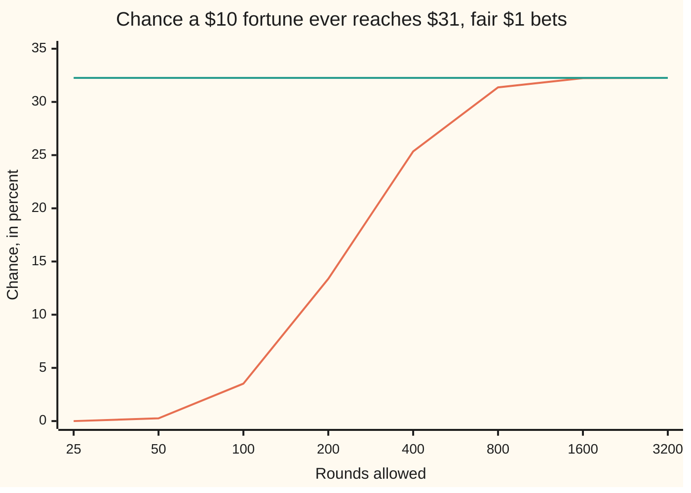
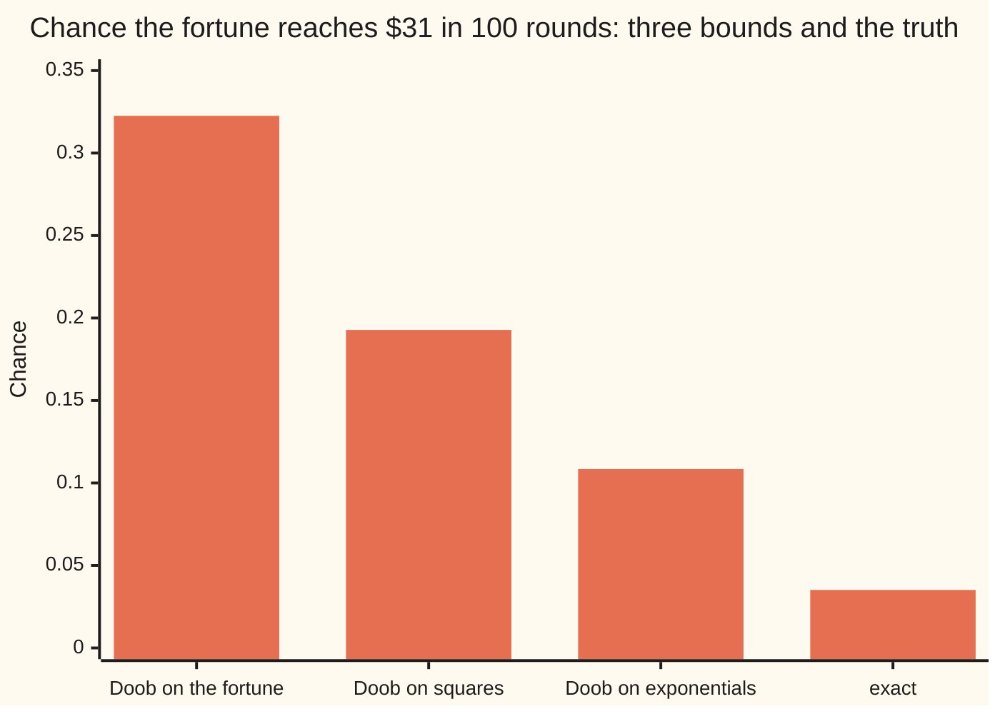

# Doob's inequalities: the maximum of a martingale is controlled by its endpoint

Stochastic processes and calculus → Martingales → The peak of a fair game → Doob's inequalities

---

## General Overview

A gambler sits down with $10. Each round she bets $1 on a fair coin: heads she gains a dollar, tails she loses one. She plays 100 rounds, unless she hits $0 first, in which case she must stop. The question is about her best moment, not her last one: what is the chance that at some round her fortune stands above $30, that is, at $31 or more?

Two facts about her are easy. The game is fair, so her fortune after 100 rounds averages $10, whatever happened in between. And her fortune is never negative. From those two facts alone, with no path counting and no simulation, Doob's maximal inequality says the chance of ever touching $31 is at most 10 divided by 31: 0.3226, about 1 in 3.1.

The true chance, counted exactly over every sequence of 100 tosses, is 0.035168, about 1 in 28.4. The bound is loose after 100 rounds. Give her more rounds and the true chance climbs toward 0.3226 and meets it: the bound cannot be improved using only the average. A second inequality, Doob's L2 inequality (L2: measured by averages of squares), does the same for sizes rather than chances: the average of the squared peak is at most four times the average of the squared final fortune.

**For a fair game that cannot go negative, the chance its running peak ever reaches a level is at most the average final value divided by that level; and for any fair game, the average squared peak is at most four times the average squared final value.**

**What kind of fact this is:** a theorem, proved on this card in Why it works, with the complete argument in the folded Detailed proof.

### The picture: the exact chance climbs to Doob's bound



The rising line is the exact chance, in percent, computed by both checks for each number of rounds. The flat line is Doob's bound, 10/31 or 32.26 percent, the same for every number of rounds because the average final fortune stays at $10. The rounds are not evenly spaced: each step doubles them.

---

## The formula

Notation first, in words. The fortune after round n is $X_n$, so $X_0$ is the starting $10. Reminder from [martingales](01-martingales.md): $\mathcal F_n$ is what is known after round n, and a martingale is a fair game, $E[X_{n+1} \mid \mathcal F_n] = X_n$. A submartingale is a game tilted in the player's favour or fair: $E[X_{n+1} \mid \mathcal F_n] \ge X_n$. The running peak is the highest value seen so far, written with a star: $X^*_N = \max_{0 \le n \le N} X_n$. A semicolon inside an average means "counted only on this event": $E[X_N;\, X^*_N \ge \lambda]$ is the average of $X_N \mathbf 1\{X^*_N \ge \lambda\}$, where the indicator $\mathbf 1\{\cdot\}$ is 1 when the event happens and 0 when it does not.

Doob's maximal inequality. For a submartingale that is never negative, any level $\lambda > 0$ and any number of rounds $N$:

$$\lambda \, P\big(X^*_N \ge \lambda\big) \;\le\; E\big[X_N;\ X^*_N \ge \lambda\big] \;\le\; E[X_N]$$

**Read it aloud:** the level times the chance of reaching it is at most the final fortune averaged over the paths that reached it, which is at most the final fortune averaged over all paths.

Doob's L2 inequality. For a martingale, with the peak taken of the size $\lvert X_n\rvert$:

$$E\Big[\big(\max_{0 \le n \le N} \lvert X_n\rvert\big)^2\Big] \;\le\; 4\,E\big[X_N^2\big]$$

**Read it aloud:** the average squared peak is at most four times the average squared endpoint.

| Symbol | Plain meaning | In our example | Push it up and the answer… |
| --- | --- | --- | --- |
| $X_n$, $X_N$, $X_k$ | the fortune after round n; $X_N$ is the final one | dollars, 0 or more | a bigger average final fortune loosens the bound |
| $X_0$ | the starting fortune | $10 | the bound grows in proportion |
| $N$ | the number of rounds allowed | 100 | the true chance rises toward the bound; the bound stays put |
| $\lambda$ | the level the peak is tested against | $31 | the bound falls as 1 over the level |
| $X^*_N$ | the running peak: the highest fortune in rounds 0 to N | at least $10 | — |
| $\mathcal F_n$ | what is known after round n: the first n tosses | — | — |
| $\tau$ | the first round at which the fortune reaches $\lambda$; a stopping time | round 21 at the earliest | — |
| $E[X_N;\ \cdot\,]$, $\mathbf 1$ | an average counted only on an event; the indicator of the event | $1.090209 on the peak event | — |
| $M_n$, $M_N$ | net winnings, $X_n - 10$; can be negative | $0 on average | — |
| $\theta$ | the tilt in the exponential bound | 0.213171 | past the best tilt the bound worsens again |
| $\cosh$, $\tanh$ | hyperbolic cosine: the average of $e^{\theta}$ and $e^{-\theta}$; hyperbolic tangent: half their difference over their average (atanh undoes it) | $\tanh\theta = 21/100$ at the best tilt | — |
| $k$ | a whole-number level, used in the layer-cake sum | 1 to 110 | — |

### When it holds

- **Never negative, or take the size.** The maximal inequality needs a submartingale that is 0 or more. Net winnings $M_n$ go negative; applied to them, the bound reads 0 while the true chance is 0.035168. For a martingale that can go negative, apply it to $\lvert M_n\rvert$ or to the positive part $\max(M_n, 0)$ instead.
- **Fair or favourable, not unfavourable.** A game tilted against the player (a supermartingale) needs the starting value in place of the final one. The house edge lowers the final average, so a bound built on it would be too small.
- **A fixed number of rounds.** $N$ is fixed in advance. Letting $N$ grow is allowed and keeps the bound as long as the averages $E[X_N]$ stay bounded, which is how the chart's flat line holds for every horizon.
- **L2 needs a finite average square, and the constant 4.** With constant 1 in place of 4 the inequality is false here: the average squared peak is 339.38, the average squared final fortune 185.01. No smaller constant than 4 works for every martingale. No constant works for the peak itself against the average final fortune; the square, or any power above 1, is what makes the argument close.

---

## Why it works

### Step 0: stop the first time the fortune reaches the level

Watch each path and stop the clock at the first round it touches $31. At that moment it holds $31. The game is fair from there on, so the fortune it will hold at round 100 averages at least $31 across those paths. Every path that reached the level therefore brings, on average, at least $31 to the final count. The final count has only $10 per path in total, so not too many paths can have reached the level: at most 10 in 31.

### Step 1: the peak event is a stopping-time event

Let $\tau$ be the first round $n \le N$ with $X_n \ge \lambda$. Whether $\tau = k$ is decided by the first k tosses, so $\tau$ is a stopping time ([stopping-times-and-optional-stopping](03-stopping-times-and-optional-stopping.md)). The peak reaches $\lambda$ exactly when $\tau \le N$. So the event "the peak reached the level" splits into the pieces "it first did so at round k", for k = 0 to N, and nothing is counted twice.

### Step 2: on each piece, the end is worth at least the level

Fix one k. On the piece $\{\tau = k\}$ the fortune at round k is at least $\lambda$. The piece is known at round k, and from round k to round N the game is fair or favourable. So the final fortune, averaged over this piece, is at least the round-k fortune averaged over it, which is at least $\lambda$ times the chance of the piece. In symbols, $E[X_N \mathbf 1\{\tau = k\}] \ge E[X_k \mathbf 1\{\tau = k\}] \ge \lambda\, P(\tau = k)$.

### Step 3: add the pieces, then use non-negativity

Summing over k gives the left inequality: $\lambda \, P(X^*_N \ge \lambda) \le E[X_N;\ X^*_N \ge \lambda]$. The paths that never reached the level still hold money at round N, and that money is 0 or more. Adding it can only raise the total, which gives $E[X_N]$ on the right. This is where non-negativity is used, and only here.

Our gambler shows both steps in numbers. The paths that touched $31 end with $1.090209 of the $10 average, which is exactly 31 × 0.035168: after touching $31, a fair game keeps $31 on average, so Step 2 holds with equality here. The other $8.909791 is held by paths that never got there. That $8.91 is the whole of the slack between 0.035168 and 0.3226.

### Step 4: the L2 inequality from the maximal one

Take the peak of the sizes $\lvert X_n\rvert$; the fortune is never negative, so here it is $X^*_N$. Three moves finish it. First, the average of a square can be counted in layers: for a whole-number peak, the squared peak averages to the sum over each level $k$ of $(2k - 1)$ times the chance the peak reaches $k$ (the layer-cake identity). The checks compute 339.382291 both ways. Second, bound each layer's chance by Step 3's middle term. Third, the layers add up to at most twice the average of final fortune times peak, and the Cauchy–Schwarz inequality splits that product into square roots: the root of the average squared peak is at most twice the root of the average squared final fortune. Squaring gives the 4. Here 339.38 against 4 × 185.01 = 740.05: the ratio is 1.83, well inside 4.

<details>
<summary>Detailed proof</summary>

**Setting.** $(X_n)$ for n = 0 to N is adapted to the filtration $(\mathcal F_n)$, integrable, and a submartingale: $E[X_N \mid \mathcal F_k] \ge X_k$ for every k ≤ N, which follows from the one-step property by the tower rule for conditional expectation (wing 10).

**Maximal inequality.** Assume $X_n \ge 0$. Let $\tau = \min\{n \le N : X_n \ge \lambda\}$, with $\tau = \infty$ if there is no such n. The event $\{\tau = k\}$ is in $\mathcal F_k$, and on it $X_k \ge \lambda$. The events for k = 0 to N are disjoint and their union is $\{X^*_N \ge \lambda\}$. For each k, by the defining property of conditional expectation and the submartingale property,
$$E[X_N \mathbf 1\{\tau = k\}] = E\big[E[X_N \mid \mathcal F_k]\,\mathbf 1\{\tau = k\}\big] \ge E[X_k \mathbf 1\{\tau = k\}] \ge \lambda\, P(\tau = k).$$
Sum over k to get $\lambda P(X^*_N \ge \lambda) \le E[X_N;\ X^*_N \ge \lambda]$. Since $X_N \ge 0$, this is at most $E[X_N]$.

**The size of a martingale is a submartingale.** If $(X_n)$ is a martingale, conditional Jensen with the convex function $\lvert x\rvert$ gives $E[\lvert X_{n+1}\rvert \mid \mathcal F_n] \ge \lvert E[X_{n+1} \mid \mathcal F_n]\rvert = \lvert X_n\rvert$. The same holds for $x^2$ and $e^{\theta x}$ whenever they are integrable, and for the positive part $\max(x, 0)$. So the maximal inequality applies to $\lvert X_n\rvert$.

**L2 inequality.** Let $Y = \max_{n \le N} \lvert X_n\rvert$ and assume $E[X_N^2] < \infty$. Each $E[X_n^2] \le E[X_N^2]$ by Jensen, and $Y^2 \le \sum_n X_n^2$, so $E[Y^2]$ is finite. For any non-negative variable, $E[Y^2] = \int_0^\infty 2\lambda\, P(Y \ge \lambda)\, d\lambda$ (Tonelli's theorem applied to $Y^2 = \int_0^Y 2\lambda\, d\lambda$). By the maximal inequality for $\lvert X_n\rvert$,
$$E[Y^2] \le \int_0^\infty 2\, E\big[\lvert X_N\rvert\, \mathbf 1\{Y \ge \lambda\}\big]\, d\lambda = 2\, E\big[\lvert X_N\rvert\, Y\big] \le 2\,\sqrt{E[X_N^2]}\,\sqrt{E[Y^2]},$$
the equality by Tonelli again and the last step by Cauchy–Schwarz. If $E[Y^2] = 0$ there is nothing to prove; otherwise divide by $\sqrt{E[Y^2]}$ and square: $E[Y^2] \le 4 E[X_N^2]$.

**The same argument for p > 1.** Replacing $2\lambda$ by $p\lambda^{p-1}$ and Cauchy–Schwarz by Hölder's inequality gives $E[Y^p] \le (p/(p-1))^p E[\lvert X_N\rvert^p]$. At p = 1 the constant is infinite, and no inequality of this form holds.

</details>

### Step 5: sharper bounds from the same theorem

The maximal inequality applies to any non-negative submartingale, and a convex function of a martingale is one (conditional Jensen, in the proof above). Choosing the function well tightens the bound for the same question.

- **Squares.** Net winnings $M_n = X_n - 10$ form a martingale, so $M_n^2$ is a submartingale. The fortune reaches $31 only if $M_n^2$ reaches $21^2 = 441$. The bound is the average of $M_N^2$ over 441. That average equals the mean number of rounds actually played, 85.013575, because $M_n^2$ minus the rounds played is itself a martingale. The bound is 0.192775; without the stop at $0 the average would be all 100 rounds, giving 0.226757. For sums of independent steps this is Kolmogorov's inequality, a standard route to the strong law of large numbers.
- **Exponentials.** Drop the stop at $0 for a moment and let the walk run into debt. Every path on which the stopped fortune reaches $31 is a path on which the free walk gains $21, since the two agree until ruin. For the free walk, $e^{\theta M_n}$ is a submartingale with average $\cosh(\theta)^{100}$ after 100 rounds: each ±1 step multiplies it by $e^{\theta}$ or $e^{-\theta}$, and the average of those two is the hyperbolic cosine $\cosh\theta$ ([hyperbolic-functions](../../06-Calculus%20and%20analysis/02-Derivatives/07-hyperbolic-functions.md)). So the chance of gaining $21 is at most $\cosh(\theta)^{100} e^{-21\theta}$ for every tilt $\theta > 0$. Setting the slope in $\theta$ to zero gives $\tanh\theta = 21/100$, where the hyperbolic tangent tanh is half the difference of $e^{\theta}$ and $e^{-\theta}$ over their average; undoing it (atanh) gives $\theta = 0.213171$. The bound is 0.108446.



Each bar left of the last is Doob's maximal inequality applied to a different submartingale built from the same game. The last bar is the exact chance.

### The other road: count the paths

For the simple walk the peak's exact law comes from the reflection principle ([reflection-principle-for-walks](../01-Random%20Walks%20and%20Filtrations/05-reflection-principle-for-walks.md)), and with the floor at $0 added, from reflecting in both walls in turn (the method of images). The checks use that as an independent road to 0.035168. Path counting needs the steps to be plus or minus one with known odds. Doob's inequality needs only the martingale property and one average, so it still works when the bets change size, depend on the past, or come from an unknown source.

---

## Worked numbers, by hand

The gambler: $10 to start, $1 fair bets, stops at $0, 100 rounds, level $31.

| Step | Arithmetic | Value |
| --- | --- | --- |
| average final fortune | fair game, stopped at $0: $E[X_{100}] = X_0$ | 10.000000 |
| Doob's bound | 10 / 31 | 0.322581 |
| exact chance of touching $31 | every path, counted three ways | 0.035168 |
| final fortune on the peak event | 31 × 0.035168 | 1.090209 |
| final fortune off it (the slack) | 10 − 1.090209 | 8.909791 |
| squares bound | 85.013575 / 441 | 0.192775 |
| exponential bound | $\cosh(0.213171)^{100} e^{-21 \times 0.213171}$ | 0.108446 |
| average squared peak | layer-cake sum over the exact law | 339.382291 |
| L2 bound | 4 × 185.013575 | 740.054302 |
| **chance the fortune ever exceeds $30** | exact | **0.035168** |

About 1 in 28.4 gamblers see $31 at some point in the 100 rounds. Doob's bound, 1 in 3.1, uses nothing but the $10 average; it is the right answer for a gambler with no time limit.

### What breaks if you drop a piece

| Mistake | Comes out at | What went wrong |
| --- | --- | --- |
| Apply the maximal inequality to net winnings $M_n$ | 0.000000 (truth 0.035168) | $M_n$ goes negative; the losers' debts cancel the winners' gains in the average. The valid version uses the positive part: 0.185605. |
| Use the end instead of the peak: chance the final fortune is $31 or more | 0.017584 | About half the paths that touch $31 drift back below it by round 100. |
| L2 with constant 1: bound the squared peak by the squared end | 185.013575 (truth 339.382291) | The peak is never below the end and is often well above it; the 4 pays for that. |

---

## Code, from first principles, and it actually runs

The code computes Doob's bound from the exact average, then reaches the chance four independent ways: an exact dynamic program over the fortune and its running peak; a second dynamic program with walls at $0 and $31; exact path counting by the method of images in whole numbers; and a seeded simulation of 100,000 gamblers, printed with its standard error. It also checks the layer-cake identity, the L2 inequality on the exact law, the fact that the average squared winnings equal the mean rounds played, and the best exponential tilt found two ways: by calculus and by a golden-section search. Random bits come from SplitMix64 with seed 20260929, one 64-bit word per 64 tosses, written out in both languages.

### Python

```python
# Doob's inequalities -- the check behind the card.  Standard library only.
# A gambler starts with $10, bets $1 a round on a fair coin, and must stop when broke.
# Question: the chance her fortune ever exceeds $30 (touches $31) within 100 rounds.
# Roads: Doob's bound; exact dynamic programming; path counting by images; simulation.
from math import sqrt, exp, log, comb
from fractions import Fraction

X0, LAM, N = 10, 31, 100
TOP = X0 + N  # the highest fortune reachable in N rounds

def joint_law(n):  # exact law of (fortune x after n rounds, peak m so far), stopped at 0
    law = [[0.0] * (TOP + 1) for _ in range(TOP + 1)]; law[X0][X0] = 1.0
    for _ in range(n):
        new = [[0.0] * (TOP + 1) for _ in range(TOP + 1)]
        for x in range(TOP + 1):
            for m in range(x, TOP + 1):
                pr = law[x][m]
                if pr == 0.0: continue
                if x == 0: new[0][m] += pr; continue
                new[x - 1][m] += 0.5 * pr; new[x + 1][max(m, x + 1)] += 0.5 * pr
        law = new
    return law

def hit_by(n):  # chance of touching LAM by round n; the walk dies at 0 and at LAM
    v = [0.0] * (LAM + 1); v[X0] = 1.0; hit = 0.0
    for _ in range(n):
        w = [0.0] * (LAM + 1)
        for x in range(1, LAM):
            w[x - 1] += 0.5 * v[x]; w[x + 1] += 0.5 * v[x]
        hit += w[LAM]; w[LAM] = 0.0; w[0] = 0.0; v = w
    return hit

def rounds_played(n):  # mean number of rounds actually bet: sum over rounds of P(still solvent)
    v = [0.0] * (TOP + 2); v[X0] = 1.0; total = 0.0
    for _ in range(n):
        total += sum(v[1:]); w = [0.0] * (TOP + 2); w[0] = v[0]
        for x in range(1, TOP + 1):
            w[x - 1] += 0.5 * v[x]; w[x + 1] += 0.5 * v[x]
        v = w
    return total

def hit_by_images(n):  # count paths 10 -> 30 inside (0, 31), then one step up
    total = Fraction(0)
    for s in range(1, n + 1):
        k = s - 1; c = 0
        for j in range(-3, 4):
            for d, sign in ((LAM - 1 - X0 + 2 * j * LAM, 1), (LAM - 1 + X0 + 2 * j * LAM, -1)):
                if abs(d) <= k and (k + d) % 2 == 0: c += sign * comb(k, (k + d) // 2)
        total += Fraction(c, 2 ** s)
    return float(total)

M64 = (1 << 64) - 1
def splitmix(state):  # SplitMix64: one 64-bit word per call, 64 coin tosses
    state = (state + 0x9E3779B97F4A7C15) & M64
    z = ((state ^ (state >> 30)) * 0xBF58476D1CE4E5B9) & M64
    z = ((z ^ (z >> 27)) * 0x94D049BB133111EB) & M64
    return state, z ^ (z >> 31)

def simulate(paths, seed):
    st = seed; hits = 0; s = [0.0, 0.0, 0.0, 0.0]
    for _ in range(paths):
        st, w1 = splitmix(st); st, w2 = splitmix(st)
        x = X0; m = X0
        for i in range(N):
            if x == 0: break
            bit = (w1 >> i) & 1 if i < 64 else (w2 >> (i - 64)) & 1
            x += 1 if bit else -1
            if x > m: m = x
        hits += m >= LAM; s[0] += m * m; s[1] += m ** 4; s[2] += x * x; s[3] += x ** 4
    p = hits / paths; pk = s[0] / paths; en = s[2] / paths
    return (p, sqrt(p * (1 - p) / paths), pk, sqrt((s[1] / paths - pk * pk) / paths),
            en, sqrt((s[3] / paths - en * en) / paths))

law = joint_law(N)
def avg(f):  # exact average of f(x, m) over the joint law, summed in a fixed order
    return sum(f(x, m) * law[x][m] for x in range(TOP + 1) for m in range(x, TOP + 1))
p_joint = avg(lambda x, m: m >= LAM)
end_hit, end_miss = avg(lambda x, m: x * (m >= LAM)), avg(lambda x, m: x * (m < LAM))
end_mean, end_sq, peak_sq = avg(lambda x, m: x), avg(lambda x, m: x * x), avg(lambda x, m: m * m)
layer = sum((2 * k - 1) * avg(lambda x, m: m >= k) for k in range(1, TOP + 1))
end_above = avg(lambda x, m: x >= LAM)
wins_sq, wins_pos = avg(lambda x, m: (x - X0) ** 2), avg(lambda x, m: max(x - X0, 0))
p_dp, p_img, played = hit_by(N), hit_by_images(N), rounds_played(N)
doob, kolm = end_mean / LAM, wins_sq / (LAM - X0) ** 2
a, lo, hi = (LAM - X0) / N, 0.0, 2.0
theta = 0.5 * log((1 + a) / (1 - a))  # tanh(theta) = 21/100 minimises the exponential bound
def chern(t): return exp(N * log((exp(t) + exp(-t)) / 2) - (LAM - X0) * t)
for _ in range(200):  # golden-section search for the best exponent, a second road to theta
    g1, g2 = hi - 0.618034 * (hi - lo), lo + 0.618034 * (hi - lo)
    if chern(g1) < chern(g2): hi = g2
    else: lo = g1
p_sim, se_p, pk_sim, se_pk, en_sim, se_en = simulate(100000, 20260929)
rows = [
    ("start X0, level lambda, rounds N", f"{X0} {LAM} {N}"),
    ("E[X_N] (fair game keeps the mean)", f"{end_mean:.6f}"),
    ("Doob bound  E[X_N]/lambda", f"{doob:.6f}"),
    ("  Doob bound as 1 in", f"{1 / doob:.1f}"),
    ("exact p, peak DP", f"{p_joint:.6f}"),
    ("exact p, two-barrier DP", f"{p_dp:.6f}"),
    ("exact p, counting by images", f"{p_img:.6f}"),
    ("  exact p as 1 in", f"{1 / p_img:.1f}"),
    ("simulated p (100000 paths)", f"{p_sim:.6f} +- {se_p:.6f}"),
    ("E[X_N ; peak >= 31]", f"{end_hit:.6f}"),
    ("  31 * p", f"{LAM * p_joint:.6f}"),
    ("E[X_N ; peak < 31]  (the slack)", f"{end_miss:.6f}"),
    ("E[X_N^2]", f"{end_sq:.6f}"),
    ("  simulated E[X_N^2]", f"{en_sim:.4f} +- {se_en:.4f}"),
    ("E[peak^2]", f"{peak_sq:.6f}"),
    ("  sum (2k-1) P(peak >= k)", f"{layer:.6f}"),
    ("  simulated E[peak^2]", f"{pk_sim:.4f} +- {se_pk:.4f}"),
    ("L2 bound  4 E[X_N^2]", f"{4 * end_sq:.6f}"),
    ("ratio E[peak^2] / E[X_N^2]", f"{peak_sq / end_sq:.6f}"),
    ("bound on squares  E[(X_N-10)^2]/21^2", f"{kolm:.6f}"),
    ("  E[(X_N-10)^2]", f"{wins_sq:.6f}"),
    ("  mean rounds played", f"{played:.6f}"),
    ("  unstopped walk  100/21^2", f"{N / (LAM - X0) ** 2:.6f}"),
    ("theta = atanh(21/100)", f"{theta:.6f}"),
    ("  theta by golden-section search", f"{(lo + hi) / 2:.6f}"),
    ("exponential bound  cosh^100 e^-21theta", f"{chern(theta):.6f}"),
    ("wrong: net winnings, E[M_N]/21", f"{abs(end_mean - X0) / (LAM - X0):.6f}"),
    ("  right: E[M_N^+]/21", f"{wins_pos / (LAM - X0):.6f}"),
    ("wrong: endpoint P(X_N >= 31)", f"{end_above:.6f}"),
]
for name, v in rows: print(f"{name:<40} {v}")
print()
print("chart, rounds   exact p %   Doob bound %")
for n in (25, 50, 100, 200, 400, 800, 1600, 3200):
    print(f"chart, {n:>6}   {100 * hit_by(n):9.2f}   {100 * doob:12.2f}")

assert abs(end_mean - X0) < 1e-9, "the stopped fair game keeps its mean"
assert abs(p_joint - p_img) < 1e-12, "peak DP vs path counting by images"
assert abs(p_dp - p_img) < 1e-12, "two-barrier DP vs path counting by images"
assert abs(p_sim - p_img) < 4 * se_p, "simulation within 4 standard errors"
assert p_img < chern(theta) < kolm < doob, "the ladder of bounds sits above the truth"
assert abs(end_hit - LAM * p_img) < 1e-12, "on the peak event the fortune ends at 31 on average"
assert abs(layer - peak_sq) < 1e-9, "layer-cake identity: two ways to average the squared peak"
assert peak_sq <= 4 * end_sq, "Doob's L2 inequality on the exact law"
assert abs(wins_sq - played) < 1e-9, "squared winnings minus rounds played is a martingale"
assert abs(theta - (lo + hi) / 2) < 1e-6, "calculus optimum vs searched optimum"
print("ALL CHECKS PASS")
```

**Ran 2026-09-29 on macOS, Python 3.14.6, standard library only. All checks passed. Output, pasted from the run:**

```
start X0, level lambda, rounds N         10 31 100
E[X_N] (fair game keeps the mean)        10.000000
Doob bound  E[X_N]/lambda                0.322581
  Doob bound as 1 in                     3.1
exact p, peak DP                         0.035168
exact p, two-barrier DP                  0.035168
exact p, counting by images              0.035168
  exact p as 1 in                        28.4
simulated p (100000 paths)               0.036140 +- 0.000590
E[X_N ; peak >= 31]                      1.090209
  31 * p                                 1.090209
E[X_N ; peak < 31]  (the slack)          8.909791
E[X_N^2]                                 185.013575
  simulated E[X_N^2]                     186.1421 +- 0.7945
E[peak^2]                                339.382291
  sum (2k-1) P(peak >= k)                339.382291
  simulated E[peak^2]                    340.6839 +- 0.8013
L2 bound  4 E[X_N^2]                     740.054302
ratio E[peak^2] / E[X_N^2]               1.834364
bound on squares  E[(X_N-10)^2]/21^2     0.192775
  E[(X_N-10)^2]                          85.013575
  mean rounds played                     85.013575
  unstopped walk  100/21^2               0.226757
theta = atanh(21/100)                    0.213171
  theta by golden-section search         0.213171
exponential bound  cosh^100 e^-21theta   0.108446
wrong: net winnings, E[M_N]/21           0.000000
  right: E[M_N^+]/21                     0.185605
wrong: endpoint P(X_N >= 31)             0.017584

chart, rounds   exact p %   Doob bound %
chart,     25        0.00          32.26
chart,     50        0.26          32.26
chart,    100        3.52          32.26
chart,    200       13.37          32.26
chart,    400       25.35          32.26
chart,    800       31.37          32.26
chart,   1600       32.24          32.26
chart,   3200       32.26          32.26
ALL CHECKS PASS
```

The three exact roads agree to twelve decimals, as the asserts demand. The simulation lands 1.6 standard errors above the exact value.

### Rust

```rust
// Doob's inequalities -- the same check as doob_inequalities_check.py, in Rust.  std only.
// A gambler starts with $10, bets $1 a round on a fair coin, and must stop when broke.
// The chance her fortune ever exceeds $30 (touches $31) within 100 rounds, by four roads.
const X0: usize = 10; const LAM: usize = 31; const N: usize = 100;
const TOP: usize = X0 + N; // the highest fortune reachable in N rounds

fn joint_law(n: usize) -> Vec<Vec<f64>> {
    // exact law of (fortune x after n rounds, peak m so far), stopped at 0
    let mut law = vec![vec![0.0f64; TOP + 1]; TOP + 1]; law[X0][X0] = 1.0;
    for _ in 0..n {
        let mut new = vec![vec![0.0f64; TOP + 1]; TOP + 1];
        for x in 0..=TOP {
            for m in x..=TOP {
                let pr = law[x][m];
                if pr == 0.0 { continue; }
                if x == 0 { new[0][m] += pr; continue; }
                new[x - 1][m] += 0.5 * pr; new[x + 1][m.max(x + 1)] += 0.5 * pr;
            }
        }
        law = new;
    }
    law
}

fn hit_by(n: usize) -> f64 {
    // chance of touching LAM by round n; the walk dies at 0 and at LAM
    let mut v = vec![0.0f64; LAM + 1]; v[X0] = 1.0; let mut hit = 0.0;
    for _ in 0..n {
        let mut w = vec![0.0f64; LAM + 1];
        for x in 1..LAM { w[x - 1] += 0.5 * v[x]; w[x + 1] += 0.5 * v[x]; }
        hit += w[LAM]; w[LAM] = 0.0; w[0] = 0.0; v = w;
    }
    hit
}

fn rounds_played(n: usize) -> f64 {
    // mean number of rounds actually bet: sum over rounds of P(still solvent)
    let mut v = vec![0.0f64; TOP + 2]; v[X0] = 1.0; let mut total = 0.0;
    for _ in 0..n {
        total += v[1..].iter().sum::<f64>();
        let mut w = vec![0.0f64; TOP + 2]; w[0] = v[0];
        for x in 1..=TOP { w[x - 1] += 0.5 * v[x]; w[x + 1] += 0.5 * v[x]; }
        v = w;
    }
    total
}

fn binom(k: i64, r: i64) -> i128 {
    let mut c: u128 = 1;
    for i in 0..r { c = c * (k - i) as u128 / (i + 1) as u128; }
    c as i128
}

fn hit_by_images(n: usize) -> f64 {
    // count paths 10 -> 30 inside (0, 31), then one step up
    let (l, a) = (LAM as i64, X0 as i64);
    let mut total = 0.0f64;
    for s in 1..=n as i64 {
        let (k, mut c) = (s - 1, 0i128);
        for j in -3..4i64 {
            for (d, sign) in [(l - 1 - a + 2 * j * l, 1i128), (l - 1 + a + 2 * j * l, -1i128)] {
                if d.abs() <= k && (k + d) % 2 == 0 { c += sign * binom(k, (k + d) / 2); }
            }
        }
        total += c as f64 / 2f64.powi(s as i32);
    }
    total
}

fn splitmix(state: &mut u64) -> u64 {
    // SplitMix64: one 64-bit word per call, 64 coin tosses
    *state = state.wrapping_add(0x9E3779B97F4A7C15);
    let mut z = *state;
    z = (z ^ (z >> 30)).wrapping_mul(0xBF58476D1CE4E5B9);
    z = (z ^ (z >> 27)).wrapping_mul(0x94D049BB133111EB);
    z ^ (z >> 31)
}

fn simulate(paths: usize, seed: u64) -> (f64, f64, f64, f64, f64, f64) {
    let (mut st, mut hits, mut s) = (seed, 0usize, [0.0f64; 4]);
    for _ in 0..paths {
        let (w1, w2) = (splitmix(&mut st), splitmix(&mut st));
        let (mut x, mut m) = (X0 as i64, X0 as i64);
        for i in 0..N {
            if x == 0 { break; }
            let bit = if i < 64 { (w1 >> i) & 1 } else { (w2 >> (i - 64)) & 1 };
            x += if bit == 1 { 1 } else { -1 };
            if x > m { m = x; }
        }
        if m >= LAM as i64 { hits += 1; }
        s[0] += (m * m) as f64; s[1] += (m * m * m * m) as f64; s[2] += (x * x) as f64; s[3] += (x * x * x * x) as f64;
    }
    let pf = paths as f64; let (p, pk, en) = (hits as f64 / pf, s[0] / pf, s[2] / pf);
    (p, (p * (1.0 - p) / pf).sqrt(), pk, ((s[1] / pf - pk * pk) / pf).sqrt(),
     en, ((s[3] / pf - en * en) / pf).sqrt())
}

fn main() {
    let law = joint_law(N);
    let avg = |f: &dyn Fn(f64, f64) -> f64| -> f64 {
        let mut t = 0.0;
        for x in 0..=TOP { for m in x..=TOP { t += f(x as f64, m as f64) * law[x][m]; } }
        t
    };
    let (lam, x0, nf) = (LAM as f64, X0 as f64, N as f64); let b = |c: bool| if c { 1.0 } else { 0.0 };
    let p_joint = avg(&|_x, m| b(m >= lam));
    let (end_hit, end_miss) = (avg(&|x, m| x * b(m >= lam)), avg(&|x, m| x * b(m < lam)));
    let (end_mean, end_sq, peak_sq) = (avg(&|x, _m| x), avg(&|x, _m| x * x), avg(&|_x, m| m * m));
    let mut layer = 0.0; for k in 1..=TOP { let kf = k as f64; layer += (2.0 * kf - 1.0) * avg(&|_x, m| b(m >= kf)); }
    let (wins_sq, wins_pos) = (avg(&|x, _m| (x - x0) * (x - x0)), avg(&|x, _m| (x - x0).max(0.0)));
    let end_above = avg(&|x, _m| b(x >= lam));
    let (p_dp, p_img, played) = (hit_by(N), hit_by_images(N), rounds_played(N));
    let (doob, kolm, a) = (end_mean / lam, wins_sq / ((lam - x0) * (lam - x0)), (lam - x0) / nf);
    let theta = 0.5 * ((1.0 + a) / (1.0 - a)).ln(); // tanh(theta) = 21/100 minimises the bound
    let chern = |t: f64| (nf * ((t.exp() + (-t).exp()) / 2.0).ln() - (lam - x0) * t).exp();
    let (mut lo, mut hi) = (0.0f64, 2.0f64);
    for _ in 0..200 { // golden-section search for the best exponent, a second road to theta
        let (g1, g2) = (hi - 0.618034 * (hi - lo), lo + 0.618034 * (hi - lo));
        if chern(g1) < chern(g2) { hi = g2; } else { lo = g1; }
    }
    let (p_sim, se_p, pk_sim, se_pk, en_sim, se_en) = simulate(100000, 20260929);
    let rows: Vec<(&str, String)> = vec![
        ("start X0, level lambda, rounds N", format!("{} {} {}", X0, LAM, N)),
        ("E[X_N] (fair game keeps the mean)", format!("{:.6}", end_mean)),
        ("Doob bound  E[X_N]/lambda", format!("{:.6}", doob)),
        ("  Doob bound as 1 in", format!("{:.1}", 1.0 / doob)),
        ("exact p, peak DP", format!("{:.6}", p_joint)),
        ("exact p, two-barrier DP", format!("{:.6}", p_dp)),
        ("exact p, counting by images", format!("{:.6}", p_img)),
        ("  exact p as 1 in", format!("{:.1}", 1.0 / p_img)),
        ("simulated p (100000 paths)", format!("{:.6} +- {:.6}", p_sim, se_p)),
        ("E[X_N ; peak >= 31]", format!("{:.6}", end_hit)),
        ("  31 * p", format!("{:.6}", lam * p_joint)),
        ("E[X_N ; peak < 31]  (the slack)", format!("{:.6}", end_miss)),
        ("E[X_N^2]", format!("{:.6}", end_sq)),
        ("  simulated E[X_N^2]", format!("{:.4} +- {:.4}", en_sim, se_en)),
        ("E[peak^2]", format!("{:.6}", peak_sq)),
        ("  sum (2k-1) P(peak >= k)", format!("{:.6}", layer)),
        ("  simulated E[peak^2]", format!("{:.4} +- {:.4}", pk_sim, se_pk)),
        ("L2 bound  4 E[X_N^2]", format!("{:.6}", 4.0 * end_sq)),
        ("ratio E[peak^2] / E[X_N^2]", format!("{:.6}", peak_sq / end_sq)),
        ("bound on squares  E[(X_N-10)^2]/21^2", format!("{:.6}", kolm)),
        ("  E[(X_N-10)^2]", format!("{:.6}", wins_sq)),
        ("  mean rounds played", format!("{:.6}", played)),
        ("  unstopped walk  100/21^2", format!("{:.6}", nf / ((lam - x0) * (lam - x0)))),
        ("theta = atanh(21/100)", format!("{:.6}", theta)),
        ("  theta by golden-section search", format!("{:.6}", (lo + hi) / 2.0)),
        ("exponential bound  cosh^100 e^-21theta", format!("{:.6}", chern(theta))),
        ("wrong: net winnings, E[M_N]/21", format!("{:.6}", ((end_mean - x0) / (lam - x0)).abs())),
        ("  right: E[M_N^+]/21", format!("{:.6}", wins_pos / (lam - x0))),
        ("wrong: endpoint P(X_N >= 31)", format!("{:.6}", end_above)),
    ];
    for (name, v) in &rows { println!("{:<40} {}", name, v); }
    println!("\nchart, rounds   exact p %   Doob bound %");
    for n in [25usize, 50, 100, 200, 400, 800, 1600, 3200] {
        println!("chart, {:>6}   {:9.2}   {:12.2}", n, 100.0 * hit_by(n), 100.0 * doob);
    }

    assert!((end_mean - x0).abs() < 1e-9, "the stopped fair game keeps its mean");
    assert!((p_joint - p_img).abs() < 1e-12, "peak DP vs path counting by images");
    assert!((p_dp - p_img).abs() < 1e-12, "two-barrier DP vs path counting by images");
    assert!((p_sim - p_img).abs() < 4.0 * se_p, "simulation within 4 standard errors");
    assert!(p_img < chern(theta) && chern(theta) < kolm && kolm < doob, "the ladder of bounds");
    assert!((end_hit - lam * p_img).abs() < 1e-12, "on the peak event the fortune ends at 31 on average");
    assert!((layer - peak_sq).abs() < 1e-9, "layer-cake identity: two ways to average the squared peak");
    assert!(peak_sq <= 4.0 * end_sq, "Doob's L2 inequality on the exact law");
    assert!((wins_sq - played).abs() < 1e-9, "squared winnings minus rounds played is a martingale");
    assert!((theta - (lo + hi) / 2.0).abs() < 1e-6, "calculus optimum vs searched optimum");
    println!("ALL CHECKS PASS");
}
```

**Ran 2026-09-29 on macOS, rustc 1.98.1, no crates. All checks passed. Output, pasted from the run:**

```
start X0, level lambda, rounds N         10 31 100
E[X_N] (fair game keeps the mean)        10.000000
Doob bound  E[X_N]/lambda                0.322581
  Doob bound as 1 in                     3.1
exact p, peak DP                         0.035168
exact p, two-barrier DP                  0.035168
exact p, counting by images              0.035168
  exact p as 1 in                        28.4
simulated p (100000 paths)               0.036140 +- 0.000590
E[X_N ; peak >= 31]                      1.090209
  31 * p                                 1.090209
E[X_N ; peak < 31]  (the slack)          8.909791
E[X_N^2]                                 185.013575
  simulated E[X_N^2]                     186.1421 +- 0.7945
E[peak^2]                                339.382291
  sum (2k-1) P(peak >= k)                339.382291
  simulated E[peak^2]                    340.6839 +- 0.8013
L2 bound  4 E[X_N^2]                     740.054302
ratio E[peak^2] / E[X_N^2]               1.834364
bound on squares  E[(X_N-10)^2]/21^2     0.192775
  E[(X_N-10)^2]                          85.013575
  mean rounds played                     85.013575
  unstopped walk  100/21^2               0.226757
theta = atanh(21/100)                    0.213171
  theta by golden-section search         0.213171
exponential bound  cosh^100 e^-21theta   0.108446
wrong: net winnings, E[M_N]/21           0.000000
  right: E[M_N^+]/21                     0.185605
wrong: endpoint P(X_N >= 31)             0.017584

chart, rounds   exact p %   Doob bound %
chart,     25        0.00          32.26
chart,     50        0.26          32.26
chart,    100        3.52          32.26
chart,    200       13.37          32.26
chart,    400       25.35          32.26
chart,    800       31.37          32.26
chart,   1600       32.24          32.26
chart,   3200       32.26          32.26
ALL CHECKS PASS
```

The two outputs agree line for line. The Rust path count uses 128-bit whole numbers where Python uses exact fractions; they differ only far below the printed digits.

> [!TIP]
> **Try changing**
> Guess first, then run.
> - **Give her no time limit.** The chart's last point, 3,200 rounds, already reads 32.26 percent, equal to the bound at the printed precision. With no limit the chance is exactly 10/31, the gambler's-ruin answer ([gamblers-ruin](../01-Random%20Walks%20and%20Filtrations/04-gamblers-ruin.md)), so Doob's bound is as tight as a bound from the average can be.
> - **Tilt the coin.** In `hit_by`, send 0.51 of the mass up and 0.49 down. The two-barrier program now disagrees with the path count, which assumes a fair coin, and the assert comparing them stops the run.
> - **Change the seed.** The simulated chance moves by about one standard error, 0.00059; the three exact roads do not move at all.

---

## The usual mistake

> [!warning]
> **Reading Doob's bound as an estimate of the chance.** It is a ceiling that holds for every fair game with the same average, including the gambler who plays for ever. For 100 rounds it says 0.3226 where the truth is 0.035168; a bound is used to rule risk out, not to price it.
>
> - **Ending above is not reaching.** The chance the final fortune is $31 or more is 0.017584, about half the chance of touching $31 at some point.
> - **A game that can go negative.** Applied to net winnings the bound says 0.000000, which is false; use the size or the positive part.
> - **Dropping the 4.** The squared peak averages 339.38, far above the squared end's 185.01.
> - **A simulated chance without its error.** 0.036140 alone looks wrong against 0.035168; with its standard error of 0.000590 it is 1.6 errors off, which is normal.

---

## Where you meet it in real life

- **Risk limits.** A desk whose running profit is a martingale can bound the chance it ever breaches a loss limit during the day from the end-of-day spread alone, by applying the maximal inequality to its size or square.
- **Tests that may stop at any time.** A trial that watches a non-negative martingale built from its data, and stops as soon as the martingale is large, keeps its false-alarm rate controlled by the maximal inequality; the version for an unlimited number of looks is Ville's inequality.
- **The Ito integral.** The L2 inequality controls the whole path of a stochastic integral by its end, which is how the integral is built as a continuous path: [ito-integral](../06-Ito%20Calculus/01-ito-integral.md).
- **Brownian peaks.** The same inequalities bound how far a pollen grain wanders within a time limit, alongside the exact answer from [reflection-principle-and-running-maximum](../05-Brownian%20Motion/04-reflection-principle-and-running-maximum.md).

> **Say it back**
> The best moment of a fair game is controlled by its last moment. For a fair game that never goes negative, the chance the running peak reaches a level is at most the average final value over the level, because every path that reaches it must carry at least that level on average to the end. For any fair game, the average squared peak is at most four times the average squared end. The gambler with $10 reaches $31 in 100 rounds with chance 0.035168; Doob says at most 0.3226, and with no time limit that is exactly the answer.

---

## What this builds on

- [martingale-convergence](04-martingale-convergence.md): a martingale bounded on average settles down; this card bounds how high it climbs on the way.
- [stopping-times-and-optional-stopping](03-stopping-times-and-optional-stopping.md): the first round at the level is a stopping time, and a fair game stays fair from a stopping time to a fixed end.
- [predictable-bets-and-the-martingale-transform](02-predictable-bets-and-the-martingale-transform.md): betting $1 until broke and nothing after is a predictable strategy, so the stopped fortune is still a martingale.

## Where this goes next

- [uniform-integrability-and-unbounded-stopping](06-uniform-integrability-and-unbounded-stopping.md): when a game may run with no fixed end, and why a start-over-goal ratio such as 10/31 comes out of a single line.
- [martingale-representation-in-discrete-time](07-martingale-representation-in-discrete-time.md): every martingale on a coin tree written as a bet on the coin.
- [brownian-martingales-and-exponential-martingale](../05-Brownian%20Motion/06-brownian-martingales-and-exponential-martingale.md): the exponential submartingale of Step 5, for Brownian motion.
- [ito-integral](../06-Ito%20Calculus/01-ito-integral.md): the L2 inequality holding a whole stochastic integral path in place.

Doob's bound is reached only when the game has no time limit, and stopping a fair game at an unbounded time can break fairness altogether; when it is safe is the question [uniform-integrability-and-unbounded-stopping](06-uniform-integrability-and-unbounded-stopping.md) answers.

---

## Sources

Verified 2026-09-30: every link below resolves to the publisher's page.

- Doob, J. L. *Stochastic Processes*. Wiley, 1953; Wiley Classics Library edition. [Publisher page](https://www.wiley.com/en-us/Stochastic+Processes-p-9780471523697). The original statement of the maximal and Lp inequalities.
- Williams, David. *Probability with Martingales*. Cambridge University Press, 1991. [Publisher page](https://www.cambridge.org/core/books/probability-with-martingales/B4CFCE0D08930FB46C6E93E775503926). Doob's submartingale inequality and the L2 inequality, proved on the same stopping-time split.
- Durrett, Rick. *Probability: Theory and Examples*, 5th ed. Cambridge University Press, 2019. [doi:10.1017/9781108591034](https://doi.org/10.1017/9781108591034). Doob's inequality, convergence of averages of powers, and Kolmogorov's inequality as a special case.
