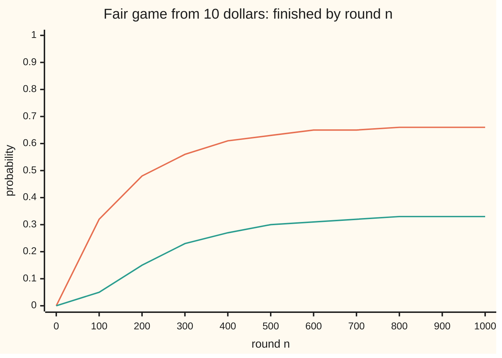
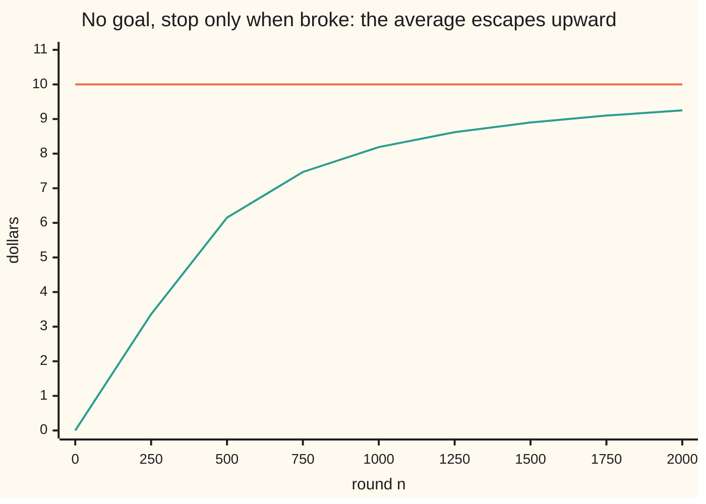

# Stopping without a bound: the uniform integrability that makes it safe

[Syllabus](../../../SYLLABUS.md) → [Stochastic processes and calculus](../README.md) → [Martingales](../README.md#s02) → Stopping without a bound

---

## General Overview

A gambler walks in with 10 dollars. Each round she stakes 1 dollar on a fair coin: heads she gains a dollar, tails she loses one. She leaves when she reaches 30 dollars or when she is broke. Nobody sets a closing time. The game might be over quickly, or run for a very long time.

What is the chance she leaves with 30? There is a one-line answer. Her fortune is a fair game, so its average never moves from 10. At the end she holds 30 or 0. The only split of those two amounts that averages 10 is 30 with probability one third. So she reaches 30 about 1 time in 3 and is ruined about 2 times in 3.

That line uses optional stopping: the average of a fair game, read at a time chosen by watching the game, equals its starting value. The theorem on [Stopping times](03-stopping-times-and-optional-stopping.md) proves it only when the stopping time has a fixed ceiling, such as "by round 500 at the latest". This gambler's game has none. And the same line applied to the doubling strategy, where each loss doubles the next stake, gives a wrong answer: the doubler always ends one dollar up, not zero. Something separates the two games. It is **uniform integrability**: the rare, extreme values of the stopped fortune must carry a vanishing share of its average, all at once, however long the game has run.

**Optional stopping holds for a stopping time with no ceiling, provided the game ends with certainty and its stopped values are uniformly integrable; bounded fortunes qualify, so the gambler's ruin odds follow in one line.**

**What kind of fact this is:** a theorem, proved on this card in Why it works; the ruin odds and the game's average length are corollaries.

### The picture: where the probability goes, round by round



Orange: the chance she is broke by round n. Green: the chance she has reached 30 by round n. Both come from the exact law of her fortune, pushed forward one round at a time, not from a simulation. They settle at 0.666667 and 0.333333. By round 1000 the chance she is still playing is 0.0045.

---

## The formula

Notation from earlier cards, in one line each. $X_n$ is her fortune after round n, the process read "the value at time n". $\mathcal{F}_n$ is what is known after round n: the results of the first n tosses. A **martingale** is a process whose best forecast of the next value, given $\mathcal{F}_n$, is today's value ([Martingales](01-martingales.md)). A **stopping time** $\tau$ is a round you recognise when it arrives, without seeing the future. New notation: $\tau \wedge n$, read "tau capped at n", is the smaller of $\tau$ and n. The capped process $M_{\tau \wedge n}$ is the game frozen at $\tau$, and read at round n if $\tau$ has not arrived.

The theorem. Let $M_n$ be a martingale and $\tau$ a stopping time with $P(\tau < \infty) = 1$. If the family of capped values is uniformly integrable,

$$\lim_{K \to \infty}\ \sup_{n \ge 0}\ E\big[\,|M_{\tau\wedge n}|\,\mathbf{1}_{\{|M_{\tau\wedge n}| > K\}}\big] = 0.$$

Here $\mathbf{1}_{\{\ldots\}}$ is 1 on the runs where the event holds and 0 elsewhere, so the average counts only values above K.

Then $M_\tau$ is integrable and

$$E[M_\tau] = E[M_0].$$

**Read it aloud:** if, for a high enough cutoff, the part of the average above that cutoff is small at every cap at once, the fair game's average survives stopping at a time with no ceiling.

Two tests make the condition easy to check. **Bounded:** $|M_{\tau\wedge n}| \le C$ for every n; above the cutoff C there is nothing. **Enveloped:** each step moves $M_n$ by at most a constant c and $E[\tau] < \infty$; then $|M_{\tau\wedge n}| \le |M_0| + c\,\tau$, one integrable ceiling for every n.

The corollary this card is named for. With a goal b and a start a, where the game ends at 0 or b,

$$P(\text{reach } b) = \frac{a}{b}, \qquad E[\tau] = a\,(b - a).$$

**Read it aloud:** the chance of reaching the goal is the start divided by the goal, and the average length in rounds is the start times the distance to the goal.

For a coin that wins with probability p and loses with probability q = 1 − p, the fortune is no longer fair, but $(q/p)^{X_n}$ is. The same line gives

$$P(\text{reach } b) = \frac{(q/p)^a - 1}{(q/p)^b - 1}.$$

| Symbol | Plain meaning | In our example | Push it up and the answer… |
| --- | --- | --- | --- |
| $X_n$ | her fortune after round n, in dollars | starts at 10 | — |
| $n$ | the round count, one stake per round | 0, 100, … 1000 | a later cap freezes more games |
| $a$, $b$ | the starting fortune and the goal | 10 and 30 | a higher a raises a/b; a higher b lowers it |
| $\tau$ | the stopping time: the round she hits 0 or 30 | averages 200 rounds | — |
| $\tau \wedge n$ | tau capped at n: the smaller of the two | at n = 100, most games are still running | — |
| $M_n$ | any martingale: a fair game's running value | $X_n$, or $(q/p)^{X_n}$, or $X_n^2 - n$ | — |
| $\mathcal{F}_n$ | what is known after round n | the first n tosses | — |
| $p$, $q$ | chance of winning and of losing one round | 0.5 and 0.5; roulette red 18/38 and 20/38 | a lower p crushes the chance of the goal |
| $K$ | the cutoff in the uniform-integrability test | K = 30 leaves no tail at all here | smaller tails |
| $C$, $c$ | a bound on the capped values; a bound on one step | C = 30; c = 1 | — |
| $w$ | the chance of reaching the goal | 0.333333; roulette 0.082691 | — |
| $r$ | the ratio q/p, the base of the fair function $r^{X_n}$ | roulette 20/18 = 1.111111 | a worse wheel: the chance of the goal falls |
| $h(x)$, $x$ | the second road: the chance of reaching 30 from a fortune of x dollars | h(0) = 0, h(10) = 0.333333, h(30) = 1 | a higher x, a higher chance |
| $G_n$ | the doubler's gain after n tosses | 1 once she wins, 1 − 2^n if all n are lost | — |

### When it holds

- **The game ends with certainty.** $P(\tau < \infty) = 1$, or $M_\tau$ is undefined on the runs that never stop. Two barriers force an end here; Step 1 proves it.
- **The capped values are uniformly integrable.** Without it the average can leak away: the doubler's capped gains average 0 at every cap yet end at 1 on every run.
- **A finite average duration is not enough by itself.** The doubler's first win comes after 2 tosses on average, yet stakes of 2^n break the envelope test. It needs bounded steps as well.
- **The process must be a martingale.** On a roulette wheel the fortune drifts down, and a/b gives 0.333333 where the truth is 0.082691. Use a function of the fortune that is fair, such as $(q/p)^{X_n}$.

---

## Why it works

### Step 0: stopping at every cap is already safe; the question is the limit

Cap the game at any round n. The capped fortune is the start plus the steps taken while the game is still on. Step k counts only if $\tau \ge k$, which the first k − 1 tosses decide, and a fair step multiplied by something known before it is taken still averages zero. So the capped fortune averages 10 dollars: the earlier card's theorem, and Lemma 1 below. The code prints that average at every hundredth round up to 1000: 10.000000 each time. Stopping is a betting rule that stakes 1 until $\tau$ and 0 after ([Betting on a martingale](02-predictable-bets-and-the-martingale-transform.md)).

As n grows, the capped fortune becomes the final fortune, run by run. So the whole question is whether an average passes to the limit along with the values. That is exactly what uniform integrability controls ([Uniform integrability](../../10-Measure%20and%20integration/05-Swapping%20Limits%20and%20Integrals/05-uniform-integrability.md)).

### Step 1: the game ends, and on average quickly

From any fortune short of the goal, a run of b = 30 straight wins reaches it. Cut the rounds into blocks of b. Each block, independently of the past, is all wins with probability $p^b$. So the chance the game survives k blocks is at most $(1 - p^b)^k$, which falls to zero. The game ends with certainty.

The same bound gives a finite average length. The average of a count is the sum of the chances that it exceeds 0, 1, 2 and so on, and those chances fall geometrically. The printed answer is 200 rounds.

### Step 2: uniform integrability passes the average to the limit

Once n passes $\tau$, the capped value equals $M_\tau$, so $M_{\tau\wedge n} \to M_\tau$ on every run that ends: almost surely, hence in probability. Vitali's theorem says convergence in probability plus uniform integrability gives convergence in mean, $E|M_{\tau\wedge n} - M_\tau| \to 0$. Averages differ by at most that mean distance. So $E[M_\tau]$ is the limit of the capped averages, each of which is $E[M_0]$.

For the gambler the test is the bounded one. Her fortune never leaves 0 to 30, so above the cutoff K = 30 there is nothing, at every cap. The code prints that tail as 0.

Two earlier cards meet the condition from other sides. A martingale bounded in a power above 1 has a running peak with a finite average, by Doob's inequality ([Doob's inequalities](05-doob-inequalities.md)), and that peak is one envelope for every cap. And uniform integrability is what [Martingale convergence](04-martingale-convergence.md) lacked for averages: a uniformly integrable martingale converges in mean as well as run by run, and each of its values is the best forecast of its limit, which is optional stopping at time infinity. This card states the second fact without proof; Williams proves it in chapter 14.

### Step 3: the ruin odds in one line

At the end, $X_\tau$ is 30 with probability w and 0 otherwise. Optional stopping says its average is the start:

$$30\,w + 0\,(1 - w) = 10, \qquad w = \tfrac{10}{30}.$$

She reaches 30 with probability 0.333333, and is ruined with probability 0.666667. Nothing about paths, tosses or time entered. The first-step equations, the pushed law and 10000 simulated games all agree; the code shows it.

### Step 4: roulette, where the fortune is not fair

A 1-dollar bet on red at American roulette wins with p = 18/38, about 47.4%, and loses with q = 20/38. Her fortune drifts down: optional stopping on $X_n$ itself does not apply.

Look for a fair function instead. With r = q/p, the value $r^{X_n}$ moves to $r^{X_n}\,r$ with probability p and to $r^{X_n}/r$ with probability q. Its average next value is $r^{X_n}(p\,r + q/r) = r^{X_n}(q + p) = r^{X_n}$. It is a martingale. Between 0 and 30 dollars it stays between 1 and $r^{30}$, so it is bounded, and Step 2 applies:

$$w\,r^{30} + (1 - w) = r^{10}, \qquad w = \frac{r^{10} - 1}{r^{30} - 1} = 0.082691.$$

The house edge of about 5 cents a round cuts her chance of reaching 30 from about 1 in 3 to about 1 in 12.

### Step 5: how long it takes, from a second martingale

For the fair coin, $X_n^2 - n$ is a martingale: from fortune x the next square averages $\tfrac12(x+1)^2 + \tfrac12(x-1)^2 = x^2 + 1$, and subtracting the round count removes the 1. This one is not bounded, since $n$ grows, so the bounded test fails. The envelope works: $|X_{\tau\wedge n}^2 - \tau\wedge n| \le 900 + \tau$, and $\tau$ has a finite average by Step 1. Optional stopping gives

$$E[X_\tau^2] - E[\tau] = 10^2, \qquad E[\tau] = 900 \times 0.333333 - 100 = 200.$$

That is a(b − a) = 10 × 20. On roulette, $X_n + (q - p)\,n$ is the fair version, with steps of at most $1 + (q - p)$, and the same argument gives $E[\tau] = (a - b\,w)/(q - p)$ = 142.866 rounds.

### Step 6: where the average leaks away

**Doubling.** Stake 1 dollar, double after each loss, stop at the first win. After a win the gain is 1. If all n tosses are lost, the gain is $1 - 2^n$, with probability $2^{-n}$. Every cap averages 0. Yet the first win comes with certainty, after 2 tosses on average, and the final gain is 1. Above the cutoff K = 100, the capped gain's tail is $1 - 2^{-n}$ once $2^n - 1$ exceeds 100: 0.992188 at 7 tosses, 0.999023 at 10. The worst tail stays at 1 for every K. The average size $E|G_n|$ never exceeds 2, so a bounded average is not enough either. Not uniformly integrable, and optional stopping fails by exactly 1 dollar.

**No goal.** Remove the 30-dollar exit: she plays until broke. Ruin is certain, because it is at least as likely as ruin before any goal b, which is 1 − a/b: 0.90 at b = 100, 0.990 at b = 1000. So $X_\tau = 0$ on every run, while every capped average is 10. The average has not vanished; it has moved to the rare survivors with large fortunes. The part of the capped average above 30 dollars climbs toward 10: 9.25 by round 2000.



Orange: the average capped fortune, 10 dollars at every round. Green: the part of that average carried by fortunes above 30 dollars. Both come from the exact law, pushed forward round by round. By round 2000 she is broke with probability 0.823114, and the few still playing hold almost the whole 10-dollar average between them.

<details>
<summary>Detailed proof</summary>

**Setting.** A probability space with filtration $\mathcal{F}_n$; $M_n$ an integrable martingale; $\tau$ a stopping time, so $\{\tau \le n\}$ is in $\mathcal{F}_n$ for each n, with $P(\tau < \infty) = 1$. Put $M_\tau = M_j$ on $\{\tau = j\}$ and 0 on the null event $\{\tau = \infty\}$.

**Lemma 1 (capped stopping).** For every n, $E[M_{\tau\wedge n}] = E[M_0]$. *Proof.* $M_{\tau\wedge n} = M_0 + \sum_{k=1}^{n} \mathbf{1}_{\{\tau \ge k\}}(M_k - M_{k-1})$, checked run by run. The event $\{\tau \ge k\}$ is the complement of $\{\tau \le k-1\}$, so it is in $\mathcal{F}_{k-1}$, and its indicator is bounded. Taking out what is known, $E[\mathbf{1}_{\{\tau \ge k\}}(M_k - M_{k-1})] = E[\mathbf{1}_{\{\tau \ge k\}}\,E[M_k - M_{k-1} \mid \mathcal{F}_{k-1}]] = 0$. Sum the n terms.

**Theorem.** If $\{M_{\tau\wedge n}\}$ is uniformly integrable, then $M_\tau \in L^1$ and $E[M_\tau] = E[M_0]$. *Proof.* On $\{\tau < \infty\}$, $M_{\tau\wedge n} = M_\tau$ for all $n \ge \tau$, so $M_{\tau\wedge n} \to M_\tau$ almost surely, hence in probability. Vitali's theorem, proved on the uniform-integrability card, gives $M_\tau \in L^1$ and $E|M_{\tau\wedge n} - M_\tau| \to 0$. Then $|E[M_{\tau\wedge n}] - E[M_\tau]| \le E|M_{\tau\wedge n} - M_\tau| \to 0$, and Lemma 1 makes every $E[M_{\tau\wedge n}]$ equal $E[M_0]$.

**Corollary (two tests).** (a) If $|M_{\tau\wedge n}| \le C$ for all n, the family is dominated by the constant C, so uniformly integrable. (b) If $|M_k - M_{k-1}| \le c$ whenever $k \le \tau$, and $E[\tau] < \infty$, then $|M_{\tau\wedge n}| \le |M_0| + c\,\tau$, an integrable envelope, so the family is uniformly integrable. Both use the dominated-family test from the uniform-integrability card.

**Lemma 2 (two barriers end the game).** Take integers $0 < a < b$ and independent steps of +1 with probability $p > 0$ and −1 otherwise; $\tau$ the first round at 0 or b. From any fortune strictly between, b straight wins reach b. The events "rounds $jb+1$ to $jb+b$ are all wins", for $j = 0, 1, \ldots$, are independent, each of probability $p^b$, and $\tau > kb$ forces all of the first k to fail. So $P(\tau > kb) \le (1 - p^b)^k$. Hence $P(\tau = \infty) = 0$, and $E[\tau] = \sum_{m \ge 0} P(\tau > m) \le b \sum_{k \ge 0} (1 - p^b)^k = b\,p^{-b} < \infty$.

**Gambler's ruin.** Fair coin: $X_{\tau\wedge n} \in [0, b]$, test (a), so $E[X_\tau] = a$; as $X_\tau \in \{0, b\}$, $b\,w = a$. For the length, $E[X_{n+1}^2 - (n+1) \mid \mathcal{F}_n] = X_n^2 + 1 - (n+1)$, a martingale with $|X^2_{\tau\wedge n} - \tau\wedge n| \le b^2 + \tau$, integrable by Lemma 2, so the family is dominated and uniformly integrable: $E[X_\tau^2] - E[\tau] = a^2$, and $E[X_\tau^2] = b^2 w = ab$ gives $E[\tau] = a(b - a)$. Biased coin, $r = q/p$: $E[r^{X_{n+1}} \mid \mathcal{F}_n] = r^{X_n}(p r + q/r) = r^{X_n}$, bounded on $[0, b]$ between $\min(1, r^b)$ and $\max(1, r^b)$, so $w\,r^b + (1 - w) = r^a$. And $X_n + (q - p)n$ is a martingale with steps at most $1 + |q - p|$, so test (b) gives $a = b\,w + (q - p)\,E[\tau]$.

**Failure 1, doubling.** $G_n = 1$ if a head has appeared by toss n, else $1 - 2^n$, with probability $2^{-n}$. $E[G_n] = (1 - 2^{-n}) + 2^{-n}(1 - 2^n) = 0$. The first head comes with probability 1, so $G_\tau = 1$. For $K \ge 1$ and n with $2^n - 1 > K$, the only value above K in size is the loss: tail $= 2^{-n}(2^n - 1) = 1 - 2^{-n}$, supremum 1. Not uniformly integrable.

**Failure 2, no goal.** Let $\tau$ be the first visit to 0 from a. For every $b > a$, ruin before b has probability $1 - a/b$ by the fair case, so $P(\tau < \infty) = 1$ and $X_\tau = 0$. Each capped value is at least 0 with average a. On $\{X_{\tau\wedge n} \le K\}$ the value is at most K and positive only if $\tau > n$, so $E[X_{\tau\wedge n}\mathbf{1}_{\{X_{\tau\wedge n} \le K\}}] \le K\,P(\tau > n) \to 0$. The tail above K therefore tends to a for every K. Not uniformly integrable, and $E[\tau] = \infty$: it is at least the two-barrier average a(b − a) for every goal b.

</details>

A second road skips martingales entirely: write down, for each fortune x, the chance h(x) of reaching 30 from there. One round later it is at x + 1 or x − 1, so h(x) = ½ h(x + 1) + ½ h(x − 1), with h(0) = 0 and h(30) = 1. The code solves those equations as a linear system. The martingale is the shortcut; the equations are the check. This road is worked in full, biased coin and average length included, on [Gambler's ruin](../01-Random%20Walks%20and%20Filtrations/04-gamblers-ruin.md).

---

## Worked numbers, by hand

| Step | Arithmetic | Value |
| --- | --- | --- |
| capped average at every round | Lemma 1 | 10 dollars |
| where the game ends | 0 or the goal | 0 or 30 |
| optional stopping, bounded test | 30 w + 0 (1 − w) = 10 | w = 10/30 |
| chance of reaching 30 | 10 ÷ 30 | **0.333333** |
| chance of ruin | 1 − 0.333333 | **0.666667** |
| $X^2 - n$ at the end | 900 × 0.333333 | 300 |
| average length | 300 − 10^2 | **200 rounds** |
| roulette, r = q/p | 20/18 | 1.111111 |
| r^10 and r^30 | repeated multiplication | 2.867972 and 23.589825 |
| roulette chance of 30 | (2.867972 − 1) ÷ (23.589825 − 1) | **0.082691** |
| roulette length | (10 − 30 × 0.082691) ÷ 0.052632 = 7.519274 ÷ 0.052632 | **142.866 rounds** |

On a fair coin she turns her 10 dollars into 30 about 1 time in 3, after 200 rounds on average. At roulette the same plan succeeds about 1 time in 12, and ends sooner, after about 143 rounds, mostly in ruin.

### What breaks if you drop a piece

| Mistake | Comes out at | What went wrong |
| --- | --- | --- |
| Doubling, optional stopping applied | claims 0; the gain is 1 on every run | Losses of $2^n - 1$ at chance $2^{-n}$: the tail above 100 is 0.999023 by toss 10 |
| No goal, optional stopping applied | claims an average of 10; it is 0 | Ruin is certain; the part of the average above 30 dollars is 9.25 by round 2000 |
| Fair formula a/b on roulette | 0.333333 against 0.082691 | The fortune drifts down; only $(q/p)^{X_n}$ is fair |

All three are printed by the code.

---

## Code, from first principles, and it actually runs

The code reaches the ruin chance by four roads that share no working. It uses the martingale formula; it solves the first-step equations as a linear system with no martingale in sight; it pushes the exact law of the capped fortune forward 20000 rounds; and it simulates 10000 games with a SplitMix64 generator written out, printed with its standard error. The average length and the roulette case take the same roads. Then it enumerates every coin sequence for the doubler and pushes the law of the no-goal game, checking that game's ruin chances against the reflection principle, counted over paths.

### Python

```python
# Stopping without a bound -- the check behind the card.  Nothing is imported
# except math.  A gambler starts with a = 10 dollars, stakes 1 dollar a round,
# and stops at 0 (ruin) or at the goal b = 30.  Ruin odds are reached four
# ways: the martingale in one line, first-step equations solved as a linear
# system, the exact law of the stopped fortune pushed forward round by round,
# and a seeded simulation.  Then two games where optional stopping fails.
import math
A, B, M64 = 10, 30, (1 << 64) - 1

class SplitMix64:                              # the wing's generator, written out
    def __init__(self, seed): self.s = seed
    def unit(self):                            # a uniform draw in [0, 1)
        self.s = (self.s + 0x9E3779B97F4A7C15) & M64
        z = self.s
        z = ((z ^ (z >> 30)) * 0xBF58476D1CE4E5B9) & M64
        z = ((z ^ (z >> 27)) * 0x94D049BB133111EB) & M64
        return ((z ^ (z >> 31)) >> 11) * 2.0 ** -53

def first_step(p, rhs):          # solve -q h(x-1) + h(x) - p h(x+1) = rhs(x), 0 < x < B
    q, n = 1 - p, B - 1          # h(0) = 0, h(B) = 0; Thomas algorithm, no martingale
    c, d = [0.0] * n, [0.0] * n
    for i in range(n):
        piv = 1.0 - (-q) * (c[i - 1] if i else 0.0)
        c[i] = -p / piv
        d[i] = (rhs(i + 1) + q * (d[i - 1] if i else 0.0)) / piv
    h = [0.0] * (B + 1)
    for i in range(n - 1, -1, -1):
        h[i + 1] = d[i] - c[i] * h[i + 2]
    return h[A]

def push_law(p, rounds, marks):  # exact law of the stopped fortune, round by round
    law, alive_sum, rows = [0.0] * (B + 1), 0.0, {}
    law[A] = 1.0
    for n in range(rounds + 1):
        if n in marks:
            rows[n] = (law[0], law[B], sum(law[1:B]), sum(x * law[x] for x in range(B + 1)), alive_sum)
        alive_sum += sum(law[1:B])            # adds P(tau > n): builds E[min(tau, n)]
        new = [0.0] * (B + 1)
        new[0], new[B] = law[0], law[B]
        for x in range(1, B):
            new[x + 1] += p * law[x]
            new[x - 1] += (1 - p) * law[x]
        law = new
    return rows

def simulate(p, games, seed):
    g, wins, steps, steps2 = SplitMix64(seed), 0, 0, 0
    for _ in range(games):
        x, t = A, 0
        while 0 < x < B:
            x, t = (x + 1, t + 1) if g.unit() < p else (x - 1, t + 1)
        wins += x == B
        steps, steps2 = steps + t, steps2 + t * t
    w, m = wins / games, steps / games
    return w, math.sqrt(w * (1 - w) / games), m, math.sqrt((steps2 / games - m * m) / games)

print(f"fair game: start a = {A}, goal b = {B}, stake $1 a round, win chance 0.5")
w_mart = A / B
w_fs = first_step(0.5, lambda x: 0.5 if x == B - 1 else 0.0)
d_fs = first_step(0.5, lambda x: 1.0)
marks = [0, 100, 200, 300, 400, 500, 600, 700, 800, 900, 1000, 20000]
law = push_law(0.5, 20000, set(marks))
print(f"road 1, martingale in one line: P(reach 30) = a/b = {w_mart:.6f}, P(ruin) = {1 - w_mart:.6f}")
print(f"road 2, first-step equations:   P(reach 30) = {w_fs:.6f}, P(ruin) = {1 - w_fs:.6f}")
print(f"road 3, law pushed 20000 rounds: P(reach 30) = {law[20000][1]:.6f}, P(ruin) = {law[20000][0]:.6f}")
ws, wse, ds, dse = simulate(0.5, 10000, 2026)
print(f"road 4, 10000 games, seed 2026:  P(reach 30) = {ws:.4f} (se {wse:.4f})")
print("chart, by round n: n, P(ruined by n), P(reached 30 by n), P(still playing), E[X at min(tau, n)]")
for n in marks[:-1]:
    r0, r1, al, mean, _ = law[n]
    print(f"  {n:5d}  {r0:.2f}  {r1:.2f}  {al:.4f}  {mean:.6f}")
print(f"bounded test: |X at min(tau, n)| never exceeds {B}, so its tail above K = {B} is 0 for every n")
print(f"duration, E[tau] in rounds: a(b - a) = {A * (B - A)}, first-step = {d_fs:.3f}, "
      f"law = {law[20000][4]:.3f}, simulated = {ds:.1f} (se {dse:.1f})")
print(f"duration by X^2 - n: X^2 <= b^2 = {B * B}, E[X_tau^2] = b^2 P(reach 30) = {B * B * w_mart:.3f}, "
      f"E[tau] = that - a^2 = {B * B * w_mart - A * A:.3f}")
p = 18 / 38                                   # roulette: $1 on red wins 18 times in 38
r = (1 - p) / p
w_rm = (r ** A - 1) / (r ** B - 1)
w_rf = first_step(p, lambda x: p if x == B - 1 else 0.0)
d_rf = first_step(p, lambda x: 1.0)
d_rm = (A - B * w_rm) / ((1 - p) - p)
rs, rse, rds, rdse = simulate(p, 10000, 38)
print(f"roulette, p = 18/38 = {p:.6f}, martingale (q/p)^X with q/p = {r:.6f}")
print(f"  by hand: (q/p)^10 = {r ** A:.6f}, (q/p)^30 = {r ** B:.6f}, q - p = {1 - 2 * p:.6f}, a - b P(reach 30) = {A - B * w_rm:.6f}")
print(f"  P(reach 30): martingale = {w_rm:.6f}, first-step = {w_rf:.6f}, simulated = {rs:.4f} (se {rse:.4f})")
print(f"  E[tau]: martingale X + n(q - p) = {d_rm:.3f}, first-step = {d_rf:.3f}, "
      f"simulated = {rds:.1f} (se {rdse:.1f})")
print("doubling, every coin word enumerated: n, E[G_n], E|G_n - 1|, tail of |G_n| above K = 100")
dbl = {}
for n in (1, 4, 7, 10):
    mean = err = tail = 0.0
    for word in range(1 << n):                 # bit j set = toss j+1 is a head
        stake, gain = 1, 0
        for j in range(n):
            if gain == 1: break                # already won, stopped
            if word >> j & 1: gain += stake
            else: gain, stake = gain - stake, 2 * stake
        mean += gain / (1 << n); err += abs(gain - 1) / (1 << n)
        tail += abs(gain) / (1 << n) if abs(gain) > 100 else 0.0
    dbl[n] = (mean, err, tail)
    print(f"  {n:2d}  {mean:.6f}  {err:.6f}  {tail:.6f}")
e_tau = sum(2.0 ** -n for n in range(60))
print(f"doubling: stopped gain G_tau = 1 on every run, E[tau] = {e_tau:.6f} tosses, yet E[G_n] = 0 at every cap")
print("no goal, stop only at 0: n, P(ruined by n) pushed (chart), by reflection, E[X at min(tau, n)], tail above 30")
N, law1 = 2000, [0.0] * (A + 2002)
law1[A] = 1.0
one = {}
for n in range(N + 1):
    if n % 250 == 0:
        k_lo, k_hi = (n - A) / 2, (n + A) / 2      # reflection: P(tau > n) = P(-a < S_n <= a)
        refl = sum(math.exp(sum(math.log((n - k + i) / i) for i in range(1, k + 1)) - n * math.log(2))
                   for k in range(n + 1) if k_lo < k <= k_hi)
        one[n] = (law1[0], 1 - refl, sum(x * law1[x] for x in range(len(law1))),
                  sum(x * law1[x] for x in range(B + 1, len(law1))))
        print(f"  {n:5d}  {one[n][0]:.2f}  {one[n][1]:.6f}  {one[n][2]:.6f}  {one[n][3]:.2f}")
    new = [0.0] * len(law1)
    new[0] = law1[0]
    for x in range(1, A + n + 1):
        new[x + 1] += 0.5 * law1[x]; new[x - 1] += 0.5 * law1[x]
    law1 = new
print(f"mistake 1, doubling: optional stopping claims E[G_tau] = 0; it is 1")
print(f"no goal as the limit of goal b: P(ruin) = 1 - a/b = {1 - A / 100:.2f} at b = 100, {1 - A / 1000:.3f} at b = 1000")
print(f"mistake 2, no goal: optional stopping claims E[X_tau] = {A}; X_tau = 0 on every run, since ruin is certain")
print(f"mistake 3, fair formula a/b on roulette: {w_mart:.6f} against the true {w_rm:.6f}")
assert abs(w_fs - w_mart) < 1e-12 and abs(law[20000][1] - w_mart) < 1e-12   # three roads agree
assert abs(ws - w_mart) < 4 * wse and abs(rs - w_rm) < 4 * rse                 # simulation within 4 se
assert abs(d_fs - A * (B - A)) < 1e-9 and abs(law[20000][4] - d_fs) < 1e-6 and abs(ds - d_fs) < 4 * dse
assert abs(w_rf - w_rm) < 1e-12 and abs(d_rf - d_rm) < 1e-9 and abs(rds - d_rm) < 4 * rdse
assert abs(one[N][0] - one[N][1]) < 1e-9 and one[N][0] > 0.8 and abs(one[N][2] - A) < 1e-9
assert all(abs(dbl[n][0]) < 1e-12 and abs(dbl[n][1] - 1) < 1e-12 for n in dbl)
print("ALL CHECKS PASS")
```

**Ran 2026-09-29 on macOS, Python 3.14.6, standard library only. All checks passed. Output, pasted from the run:**

```
fair game: start a = 10, goal b = 30, stake $1 a round, win chance 0.5
road 1, martingale in one line: P(reach 30) = a/b = 0.333333, P(ruin) = 0.666667
road 2, first-step equations:   P(reach 30) = 0.333333, P(ruin) = 0.666667
road 3, law pushed 20000 rounds: P(reach 30) = 0.333333, P(ruin) = 0.666667
road 4, 10000 games, seed 2026:  P(reach 30) = 0.3278 (se 0.0047)
chart, by round n: n, P(ruined by n), P(reached 30 by n), P(still playing), E[X at min(tau, n)]
      0  0.00  0.00  1.0000  10.000000
    100  0.32  0.05  0.6343  10.000000
    200  0.48  0.15  0.3662  10.000000
    300  0.56  0.23  0.2114  10.000000
    400  0.61  0.27  0.1221  10.000000
    500  0.63  0.30  0.0705  10.000000
    600  0.65  0.31  0.0407  10.000000
    700  0.65  0.32  0.0235  10.000000
    800  0.66  0.33  0.0136  10.000000
    900  0.66  0.33  0.0078  10.000000
   1000  0.66  0.33  0.0045  10.000000
bounded test: |X at min(tau, n)| never exceeds 30, so its tail above K = 30 is 0 for every n
duration, E[tau] in rounds: a(b - a) = 200, first-step = 200.000, law = 200.000, simulated = 201.9 (se 1.8)
duration by X^2 - n: X^2 <= b^2 = 900, E[X_tau^2] = b^2 P(reach 30) = 300.000, E[tau] = that - a^2 = 200.000
roulette, p = 18/38 = 0.473684, martingale (q/p)^X with q/p = 1.111111
  by hand: (q/p)^10 = 2.867972, (q/p)^30 = 23.589825, q - p = 0.052632, a - b P(reach 30) = 7.519274
  P(reach 30): martingale = 0.082691, first-step = 0.082691, simulated = 0.0843 (se 0.0028)
  E[tau]: martingale X + n(q - p) = 142.866, first-step = 142.866, simulated = 141.7 (se 1.4)
doubling, every coin word enumerated: n, E[G_n], E|G_n - 1|, tail of |G_n| above K = 100
   1  0.000000  1.000000  0.000000
   4  0.000000  1.000000  0.000000
   7  0.000000  1.000000  0.992188
  10  0.000000  1.000000  0.999023
doubling: stopped gain G_tau = 1 on every run, E[tau] = 2.000000 tosses, yet E[G_n] = 0 at every cap
no goal, stop only at 0: n, P(ruined by n) pushed (chart), by reflection, E[X at min(tau, n)], tail above 30
      0  0.00  0.000000  10.000000  0.00
    250  0.53  0.527997  10.000000  3.36
    500  0.66  0.655086  10.000000  6.15
    750  0.72  0.715208  10.000000  7.47
   1000  0.75  0.751968  10.000000  8.19
   1250  0.78  0.777397  10.000000  8.62
   1500  0.80  0.796330  10.000000  8.90
   1750  0.81  0.811131  10.000000  9.10
   2000  0.82  0.823114  10.000000  9.25
mistake 1, doubling: optional stopping claims E[G_tau] = 0; it is 1
no goal as the limit of goal b: P(ruin) = 1 - a/b = 0.90 at b = 100, 0.990 at b = 1000
mistake 2, no goal: optional stopping claims E[X_tau] = 10; X_tau = 0 on every run, since ruin is certain
mistake 3, fair formula a/b on roulette: 0.333333 against the true 0.082691
ALL CHECKS PASS
```

### Rust

Same numbers, same labels, built with `rustc --edition 2021 -O`.

```rust
// Stopping without a bound -- the same check as the Python, in Rust.  No
// crates.  A gambler starts with a = 10 dollars, stakes 1 dollar a round, and
// stops at 0 (ruin) or at the goal b = 30.  Ruin odds are reached four ways:
// the martingale in one line, first-step equations solved as a linear system,
// the exact law of the stopped fortune pushed forward round by round, and a
// seeded simulation.  Then two games where optional stopping fails.
const A: usize = 10;
const B: usize = 30;

struct SplitMix64 { s: u64 }                  // the wing's generator, written out
impl SplitMix64 {
    fn unit(&mut self) -> f64 {               // a uniform draw in [0, 1)
        self.s = self.s.wrapping_add(0x9E3779B97F4A7C15);
        let mut z = self.s;
        z = (z ^ (z >> 30)).wrapping_mul(0xBF58476D1CE4E5B9);
        z = (z ^ (z >> 27)).wrapping_mul(0x94D049BB133111EB);
        ((z ^ (z >> 31)) >> 11) as f64 * 2f64.powi(-53)
    }
}

fn first_step(p: f64, rhs: &dyn Fn(usize) -> f64) -> f64 {
    // solve -q h(x-1) + h(x) - p h(x+1) = rhs(x), 0 < x < B, h(0) = h(B) = 0
    let (q, n) = (1.0 - p, B - 1);
    let (mut c, mut d) = (vec![0.0; n], vec![0.0; n]);
    for i in 0..n {
        let (cp, dp) = if i > 0 { (c[i - 1], d[i - 1]) } else { (0.0, 0.0) };
        let piv = 1.0 - (-q) * cp;
        c[i] = -p / piv;
        d[i] = (rhs(i + 1) + q * dp) / piv;
    }
    let mut h = vec![0.0; B + 1];
    for i in (0..n).rev() { h[i + 1] = d[i] - c[i] * h[i + 2]; }
    h[A]
}

fn sum(v: &[f64]) -> f64 { v.iter().fold(0.0, |s, x| s + x) }
fn mean_of(law: &[f64], from: usize) -> f64 {
    (from..law.len()).fold(0.0, |s, x| s + x as f64 * law[x])
}

// exact law of the stopped fortune, round by round; rows are
// (ruined, reached goal, still playing, mean fortune, E[min(tau, n)])
fn push_law(p: f64, rounds: usize, marks: &[usize]) -> Vec<(usize, [f64; 5])> {
    let (mut law, mut alive_sum, mut rows) = (vec![0.0; B + 1], 0.0, Vec::new());
    law[A] = 1.0;
    for n in 0..=rounds {
        if marks.contains(&n) {
            rows.push((n, [law[0], law[B], sum(&law[1..B]), mean_of(&law, 0), alive_sum]));
        }
        alive_sum += sum(&law[1..B]);             // adds P(tau > n)
        let mut new = vec![0.0; B + 1];
        (new[0], new[B]) = (law[0], law[B]);
        for x in 1..B {
            new[x + 1] += p * law[x];
            new[x - 1] += (1.0 - p) * law[x];
        }
        law = new;
    }
    rows
}

fn simulate(p: f64, games: usize, seed: u64) -> (f64, f64, f64, f64) {
    let (mut g, mut wins, mut steps, mut steps2) = (SplitMix64 { s: seed }, 0u64, 0u64, 0u64);
    for _ in 0..games {
        let (mut x, mut t) = (A as i64, 0u64);
        while x > 0 && x < B as i64 {
            x += if g.unit() < p { 1 } else { -1 };
            t += 1;
        }
        if x == B as i64 { wins += 1; }
        steps += t;
        steps2 += t * t;
    }
    let gm = games as f64;
    let (w, m) = (wins as f64 / gm, steps as f64 / gm);
    (w, (w * (1.0 - w) / gm).sqrt(), m, ((steps2 as f64 / gm - m * m) / gm).sqrt())
}

fn main() {
    println!("fair game: start a = {}, goal b = {}, stake $1 a round, win chance 0.5", A, B);
    let w_mart = A as f64 / B as f64;
    let w_fs = first_step(0.5, &|x| if x == B - 1 { 0.5 } else { 0.0 });
    let d_fs = first_step(0.5, &|_| 1.0);
    let marks = [0, 100, 200, 300, 400, 500, 600, 700, 800, 900, 1000, 20000];
    let law = push_law(0.5, 20000, &marks);
    let last = law[law.len() - 1].1;
    println!("road 1, martingale in one line: P(reach 30) = a/b = {:.6}, P(ruin) = {:.6}", w_mart, 1.0 - w_mart);
    println!("road 2, first-step equations:   P(reach 30) = {:.6}, P(ruin) = {:.6}", w_fs, 1.0 - w_fs);
    println!("road 3, law pushed 20000 rounds: P(reach 30) = {:.6}, P(ruin) = {:.6}", last[1], last[0]);
    let (ws, wse, ds, dse) = simulate(0.5, 10000, 2026);
    println!("road 4, 10000 games, seed 2026:  P(reach 30) = {:.4} (se {:.4})", ws, wse);
    println!("chart, by round n: n, P(ruined by n), P(reached 30 by n), P(still playing), E[X at min(tau, n)]");
    for (n, r) in &law[..law.len() - 1] {
        println!("  {:5}  {:.2}  {:.2}  {:.4}  {:.6}", n, r[0], r[1], r[2], r[3]);
    }
    println!("bounded test: |X at min(tau, n)| never exceeds {}, so its tail above K = {} is 0 for every n", B, B);
    println!("duration, E[tau] in rounds: a(b - a) = {}, first-step = {:.3}, law = {:.3}, simulated = {:.1} (se {:.1})",
             A * (B - A), d_fs, last[4], ds, dse);
    println!("duration by X^2 - n: X^2 <= b^2 = {}, E[X_tau^2] = b^2 P(reach 30) = {:.3}, E[tau] = that - a^2 = {:.3}",
             B * B, (B * B) as f64 * w_mart, (B * B) as f64 * w_mart - (A * A) as f64);
    let p: f64 = 18.0 / 38.0;                    // roulette: $1 on red wins 18 times in 38
    let r = (1.0 - p) / p;
    let w_rm = (r.powf(A as f64) - 1.0) / (r.powf(B as f64) - 1.0);
    let w_rf = first_step(p, &|x| if x == B - 1 { p } else { 0.0 });
    let d_rf = first_step(p, &|_| 1.0);
    let d_rm = (A as f64 - B as f64 * w_rm) / ((1.0 - p) - p);
    let (rs, rse, rds, rdse) = simulate(p, 10000, 38);
    println!("roulette, p = 18/38 = {:.6}, martingale (q/p)^X with q/p = {:.6}", p, r);
    println!("  by hand: (q/p)^10 = {:.6}, (q/p)^30 = {:.6}, q - p = {:.6}, a - b P(reach 30) = {:.6}",
             r.powf(A as f64), r.powf(B as f64), 1.0 - 2.0 * p, A as f64 - B as f64 * w_rm);
    println!("  P(reach 30): martingale = {:.6}, first-step = {:.6}, simulated = {:.4} (se {:.4})", w_rm, w_rf, rs, rse);
    println!("  E[tau]: martingale X + n(q - p) = {:.3}, first-step = {:.3}, simulated = {:.1} (se {:.1})", d_rm, d_rf, rds, rdse);
    println!("doubling, every coin word enumerated: n, E[G_n], E|G_n - 1|, tail of |G_n| above K = 100");
    let mut dbl = Vec::new();
    for n in [1usize, 4, 7, 10] {
        let (mut mean, mut err, mut tail) = (0.0, 0.0, 0.0);
        let den = (1u64 << n) as f64;
        for word in 0..(1u64 << n) {              // bit j set = toss j+1 is a head
            let (mut stake, mut gain) = (1i64, 0i64);
            for j in 0..n {
                if gain == 1 { break; }           // already won, stopped
                if (word >> j) & 1 == 1 { gain += stake; } else { gain -= stake; stake *= 2; }
            }
            mean += gain as f64 / den;
            err += (gain - 1).abs() as f64 / den;
            if gain.abs() > 100 { tail += gain.abs() as f64 / den; }
        }
        dbl.push((mean, err, tail));
        println!("  {:2}  {:.6}  {:.6}  {:.6}", n, mean, err, tail);
    }
    let e_tau = (0..60).fold(0.0, |s, n| s + 2f64.powi(-n));
    println!("doubling: stopped gain G_tau = 1 on every run, E[tau] = {:.6} tosses, yet E[G_n] = 0 at every cap", e_tau);
    println!("no goal, stop only at 0: n, P(ruined by n) pushed (chart), by reflection, E[X at min(tau, n)], tail above 30");
    let nmax = 2000usize;
    let mut law1 = vec![0.0; A + 2002];
    law1[A] = 1.0;
    let mut one = (0.0, 0.0, 0.0);
    for n in 0..=nmax {
        if n % 250 == 0 {
            let (k_lo, k_hi) = ((n as f64 - A as f64) / 2.0, (n as f64 + A as f64) / 2.0);
            let mut refl = 0.0;                   // reflection: P(tau > n) = P(-a < S_n <= a)
            for k in 0..=n {
                if !(k_lo < k as f64 && k as f64 <= k_hi) { continue; }
                let lc = (1..=k).fold(0.0, |s, i| s + (((n - k + i) as f64) / (i as f64)).ln());
                refl += (lc - n as f64 * 2f64.ln()).exp();
            }
            one = (law1[0], 1.0 - refl, mean_of(&law1, 0));
            println!("  {:5}  {:.2}  {:.6}  {:.6}  {:.2}", n, one.0, one.1, one.2, mean_of(&law1, B + 1));
        }
        let mut new = vec![0.0; law1.len()];
        new[0] = law1[0];
        for x in 1..=(A + n) {
            new[x + 1] += 0.5 * law1[x];
            new[x - 1] += 0.5 * law1[x];
        }
        law1 = new;
    }
    println!("mistake 1, doubling: optional stopping claims E[G_tau] = 0; it is 1");
    println!("no goal as the limit of goal b: P(ruin) = 1 - a/b = {:.2} at b = 100, {:.3} at b = 1000",
             1.0 - A as f64 / 100.0, 1.0 - A as f64 / 1000.0);
    println!("mistake 2, no goal: optional stopping claims E[X_tau] = {}; X_tau = 0 on every run, since ruin is certain", A);
    println!("mistake 3, fair formula a/b on roulette: {:.6} against the true {:.6}", w_mart, w_rm);
    assert!((w_fs - w_mart).abs() < 1e-12 && (last[1] - w_mart).abs() < 1e-12);   // three roads agree
    assert!((ws - w_mart).abs() < 4.0 * wse && (rs - w_rm).abs() < 4.0 * rse);     // simulation within 4 se
    assert!((d_fs - (A * (B - A)) as f64).abs() < 1e-9 && (last[4] - d_fs).abs() < 1e-6 && (ds - d_fs).abs() < 4.0 * dse);
    assert!((w_rf - w_rm).abs() < 1e-12 && (d_rf - d_rm).abs() < 1e-9 && (rds - d_rm).abs() < 4.0 * rdse);
    assert!((one.0 - one.1).abs() < 1e-9 && one.0 > 0.8 && (one.2 - A as f64).abs() < 1e-9);
    assert!(dbl.iter().all(|d| d.0.abs() < 1e-12 && (d.1 - 1.0).abs() < 1e-12));
    println!("ALL CHECKS PASS");
}
```

**Ran 2026-09-29 on macOS, rustc 1.98.1, no crates. All checks passed. Output, pasted from the run:**

```
fair game: start a = 10, goal b = 30, stake $1 a round, win chance 0.5
road 1, martingale in one line: P(reach 30) = a/b = 0.333333, P(ruin) = 0.666667
road 2, first-step equations:   P(reach 30) = 0.333333, P(ruin) = 0.666667
road 3, law pushed 20000 rounds: P(reach 30) = 0.333333, P(ruin) = 0.666667
road 4, 10000 games, seed 2026:  P(reach 30) = 0.3278 (se 0.0047)
chart, by round n: n, P(ruined by n), P(reached 30 by n), P(still playing), E[X at min(tau, n)]
      0  0.00  0.00  1.0000  10.000000
    100  0.32  0.05  0.6343  10.000000
    200  0.48  0.15  0.3662  10.000000
    300  0.56  0.23  0.2114  10.000000
    400  0.61  0.27  0.1221  10.000000
    500  0.63  0.30  0.0705  10.000000
    600  0.65  0.31  0.0407  10.000000
    700  0.65  0.32  0.0235  10.000000
    800  0.66  0.33  0.0136  10.000000
    900  0.66  0.33  0.0078  10.000000
   1000  0.66  0.33  0.0045  10.000000
bounded test: |X at min(tau, n)| never exceeds 30, so its tail above K = 30 is 0 for every n
duration, E[tau] in rounds: a(b - a) = 200, first-step = 200.000, law = 200.000, simulated = 201.9 (se 1.8)
duration by X^2 - n: X^2 <= b^2 = 900, E[X_tau^2] = b^2 P(reach 30) = 300.000, E[tau] = that - a^2 = 200.000
roulette, p = 18/38 = 0.473684, martingale (q/p)^X with q/p = 1.111111
  by hand: (q/p)^10 = 2.867972, (q/p)^30 = 23.589825, q - p = 0.052632, a - b P(reach 30) = 7.519274
  P(reach 30): martingale = 0.082691, first-step = 0.082691, simulated = 0.0843 (se 0.0028)
  E[tau]: martingale X + n(q - p) = 142.866, first-step = 142.866, simulated = 141.7 (se 1.4)
doubling, every coin word enumerated: n, E[G_n], E|G_n - 1|, tail of |G_n| above K = 100
   1  0.000000  1.000000  0.000000
   4  0.000000  1.000000  0.000000
   7  0.000000  1.000000  0.992188
  10  0.000000  1.000000  0.999023
doubling: stopped gain G_tau = 1 on every run, E[tau] = 2.000000 tosses, yet E[G_n] = 0 at every cap
no goal, stop only at 0: n, P(ruined by n) pushed (chart), by reflection, E[X at min(tau, n)], tail above 30
      0  0.00  0.000000  10.000000  0.00
    250  0.53  0.527997  10.000000  3.36
    500  0.66  0.655086  10.000000  6.15
    750  0.72  0.715208  10.000000  7.47
   1000  0.75  0.751968  10.000000  8.19
   1250  0.78  0.777397  10.000000  8.62
   1500  0.80  0.796330  10.000000  8.90
   1750  0.81  0.811131  10.000000  9.10
   2000  0.82  0.823114  10.000000  9.25
mistake 1, doubling: optional stopping claims E[G_tau] = 0; it is 1
no goal as the limit of goal b: P(ruin) = 1 - a/b = 0.90 at b = 100, 0.990 at b = 1000
mistake 2, no goal: optional stopping claims E[X_tau] = 10; X_tau = 0 on every run, since ruin is certain
mistake 3, fair formula a/b on roulette: 0.333333 against the true 0.082691
ALL CHECKS PASS
```

The two outputs match line for line, simulated digits included, because both languages draw the same SplitMix64 numbers.

> [!TIP]
> **Try changing**
> Guess first, then run it.
> - **A farther goal.** Set `B` to 40. The chance of the goal falls to a/b = 10/40, and the average length rises to a(b − a); all four roads follow, and every assert still passes.
> - **A kinder wheel.** Change `18 / 38` to `18 / 37`, the single-zero wheel. The house edge halves, her chance of 30 roughly doubles, and still sits far below the fair a/b.
> - **Another seed.** Change `2026` to 7. The simulated chance moves by a standard error or two; the three exact roads do not move at all.
> - **Break the martingale.** Replace `r = (1 - p) / p` with `r = p / (1 - p)`. The function is no longer fair, the formula no longer matches the simulation or the first-step equations, and the second assert stops the run.

---

## The usual mistake

> [!warning]
> **Believing that a game which ends with certainty keeps its average.** It does not. The doubler stops with certainty, after 2 tosses on average, and every cap averages 0, yet the final gain is 1. The average leaks through rare losses of $2^n - 1$ dollars that grow as fast as their chance shrinks. Certainty of ending is one hypothesis; uniform integrability is the other.
>
> - **Reading "fair" as "cannot win".** The doubler wins 1 dollar with certainty; the price is an unlimited bankroll, which is the missing uniform integrability.
> - **Ruin without a goal read as unlikely.** Playing a fair game until broke, with no exit, ends in ruin with certainty: 0.823114 by round 2000 and rising. The capped average of 10 is carried by a shrinking crowd of large fortunes.
> - **The fair formula on a biased coin.** a/b gives 0.333333 at roulette; the truth, from $(q/p)^{X_n}$, is 0.082691.

---

## Where you meet it in real life

- **Casinos and bankroll limits.** Table limits and finite bankrolls are the bound that restores optional stopping: no betting system turns a losing wheel into a winning one.
- **Sequential testing.** A trial that stops when evidence crosses one of two thresholds uses the same two-barrier argument to fix its error rates in advance.
- **Insurance and ruin.** A company's surplus is a drifting random walk; a fair function of it, like $(q/p)^{X_n}$ here, gives the chance of ruin before a target.
- **Random algorithms.** How long a random search takes to hit one of two ends is $a(b - a)$ steps for the fair walk, from the $X_n^2 - n$ martingale.

> **Say it back**
> Optional stopping is safe at any time with a ceiling. With no ceiling, the game must end with certainty and its capped values must be uniformly integrable, so no share of the average hides in rare extreme values. A fortune held between 0 and 30 is bounded, so the ruin chance is the start over the goal, 10 over 30. The doubler and the gambler with no exit break the condition, and their averages leak away. On a biased coin, a fair function of the fortune gives the ruin odds instead.

---

## What this builds on

- [Stopping times](03-stopping-times-and-optional-stopping.md): stopping times, and optional stopping at a time with a ceiling, which Lemma 1 recalls.
- [Uniform integrability](../../10-Measure%20and%20integration/05-Swapping%20Limits%20and%20Integrals/05-uniform-integrability.md): the definition, the dominated-family test, and Vitali's theorem, which passes the average to the limit.

## Where this goes next

- [Representing a martingale](07-martingale-representation-in-discrete-time.md): every martingale on coin tosses is a betting strategy on those tosses.

Stopping tells what a fair game is worth at the end; which betting strategy produces a given fair game, toss by toss, is the question that martingale-representation-in-discrete-time answers.

---

## Sources

Verified 2026-09-29: every link below resolves to the publisher's or author's page for the book named.

- Williams, David. *Probability with Martingales*. Cambridge University Press, 1991. [Publisher page](https://www.cambridge.org/core/books/probability-with-martingales/B4CFCE0D08930FB46C6E93E775503926). Optional stopping under its several hypotheses, and uniform integrability for martingales.
- Durrett, Rick. *Probability: Theory and Examples*, 5th ed. Cambridge University Press, 2019. [Author's page](https://services.math.duke.edu/~rtd/PTE/pte.html). The martingale chapter proves optional stopping for uniformly integrable stopped processes and applies it to gambler's ruin, fair and biased.
- Feller, William. *An Introduction to Probability Theory and Its Applications*, Vol. 1, 3rd ed. Wiley, 1968. [Publisher page](https://www.wiley.com/en-us/An+Introduction+to+Probability+Theory+and+Its+Applications%2C+Volume+1%2C+3rd+Edition-p-9780471257080). The classical ruin problem and expected duration, by first-step equations.
