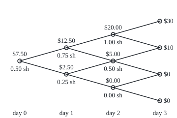

# Representing a martingale: on a binary tree every martingale is a bet on the coin

[Syllabus](../../../SYLLABUS.md) → [Stochastic processes and calculus](../README.md) → [Martingales](../README.md#s02) → Representing a martingale

---

## General Overview

A share trades at $100. Each day for three days a fair coin is tossed: heads, the share gains $10; tails, it loses $10. The bank pays no interest over those three days, so a borrowed dollar is still one dollar at the end. After three days the share sits at $130, $110, $90 or $70, and there are eight possible coin sequences, from HHH to TTT.

A dealer sells a ticket that pays, on day 3, whatever the share stands above $100: $30 after HHH, $10 after any two heads, nothing otherwise. That ticket is a **call** with strike $100. The dealer wants to charge a fair price and then carry no risk. Is there a way to trade the share, day by day, that ends at exactly the ticket's payment on all eight sequences?

There is, and it costs $7.50. Hold half a share on day 1. After a head, hold three quarters of a share on day 2; after a tail, a quarter. On day 3 hold one share after HH, half after HT or TH, none after TT. Borrow whatever the purchases need. Start with $7.50, follow the rule, and the account ends at the ticket's payment on every sequence.

The ticket was not special: every payment that depends on the three tosses has such a rule and such a price. Underneath is a fact about fair games. [Betting on a martingale](02-predictable-bets-and-the-martingale-transform.md) showed that betting on a fair game gives a fair game. This card proves the reverse on a coin-toss tree: every fair game there is some betting rule applied to the coin. The fact is called **martingale representation**.

**On a tree where each day has exactly two outcomes, every martingale equals its starting value plus the gain of one predictable betting strategy on the share, so every payoff is a trading strategy, and the strategy's cost is the payoff's fair price.**

**What kind of fact this is:** a theorem, proved on this card in Why it works, with the full argument in a folded Detailed proof.

### The picture: the call's tree, value above each node, stake below

<p align="center"></p>

Drawn to scale: 95 units a day across, 2.7 units a dollar up, $70 at the bottom to $130 at the top. Above each node, the ticket's fair value there; below, the shares to hold over the next day; at the right edge, the payments. HT and TH are drawn as one node because for this ticket they carry the same value and stake.

---

## The formula

Notation first, in words. Toss $k$ is written $\varepsilon_k$: +1 for heads, −1 for tails. The share price after day $n$ is $S_n$, so $S_n = 100 + 10(\varepsilon_1 + \dots + \varepsilon_n)$. What is known after day $n$ is written $\mathcal F_n$, read "what is known by time $n$": here, the first $n$ tosses. A process $M_n$ is a **martingale** when its best forecast of tomorrow, given $\mathcal F_n$, is its value today ([Martingales](01-martingales.md)). A stake $H_k$ is **predictable** when it is fixed by $\mathcal F_{k-1}$: it may use every toss already seen, never toss $k$ itself ([Betting on a martingale](02-predictable-bets-and-the-martingale-transform.md)).

Standing just before toss $k$, with the earlier tosses known, $M_k$ can take only two values. Write $M_k^{+}$ for the value if toss $k$ is heads and $M_k^{-}$ for the value if tails. Likewise $S_k^{+}$ and $S_k^{-}$ for the share. The theorem:

$$M_n = M_0 + \sum_{k=1}^{n} H_k\,(S_k - S_{k-1}), \qquad H_k = \frac{M_k^{+} - M_k^{-}}{S_k^{+} - S_k^{-}}.$$

**Read it aloud:** a martingale on the coin tree is its starting value plus the gain from holding $H_k$ shares over each day, each holding being the spread of the martingale's two possible next values over the share's.

For a payoff $V$, a number attached to each of the eight sequences, take $M_n = E[V \mid \mathcal F_n]$, the fair value of the ticket once $n$ tosses are known. Then $M_3 = V$ and $M_0 = E[V]$, so the theorem reads

$$V = E[V] + \sum_{k=1}^{3} H_k\,(S_k - S_{k-1}).$$

**Read it aloud:** the payoff is its average plus the gain of a trading strategy; the average is what the strategy costs, and $H$ is the hedge.

| Symbol | Plain meaning | In our example | Push it up and the answer… |
| --- | --- | --- | --- |
| $\varepsilon_k$ | toss $k$: +1 heads, −1 tails | HTH is +1, −1, +1 | — |
| $S_n$, $S_k$, $S$ | share price after day $n$ (or $k$) | $100, then $110 or $90, … | — |
| $\mathcal F_n$ | what is known after day $n$: the first $n$ tosses | after day 1, one toss | — |
| $V$, $E$ | the payoff, one number for each of the 8 sequences; $E$ averages over the coin | call: $30, $10 three times, $0 four times; $E[V] = 7.50$ | the price rises by the average increase |
| $M_n$, $M_0$, $M_k$, $M_1$, $M$ | fair value of the payoff once $n$ tosses are known, $E[V \mid \mathcal F_n]$ | $7.50 at the start | — |
| $M_k^{+}$, $M_k^{-}$, $S_k^{+}$, $S_k^{-}$ | the two values $M_k$ (or $S_k$) can take, heads or tails, given the earlier tosses | $12.50 and $2.50; $110 and $90, on day 1 | a wider value spread needs a larger stake; a wider price spread, a smaller one |
| $H_k$, $H_k'$, $H_1$, $H_2$, $H$ | shares held over day $k$, fixed after day $k - 1$ (a second candidate, in Step 4) | 0.50 on day 1 | — |
| $p$ | chance of heads | 0.5, the only chance that makes ±$10 moves fair | the share drifts up and stops being a martingale |
| $n$, $k$, $N$ | a day count, the day being bet on, and the last day | $N = 3$ | more days, more stakes; still one per node |
| $a$, $b$, $x$, $y$ | Step 1 only: the day's two possible moves of $M$ ($a$, $b$) and of $S$ ($x$, $y$) | +5 and −5; +10 and −10, on day 1 | — |
| $c_\emptyset$, $c_1$, $c_{12}$ | Walsh coefficients: averages of the payoff times a product of signs | $c_\emptyset = 7.50$ for the call | — |
| $A$, $m$, $s$, $q$, $r$ | Detailed proof only: a cell of what is known before a toss, $M$ and $S$ on it, the chance of its heads child, its number of children | node H: $m = 12.50$, $s = 110$, $q = 0.5$, $r = 2$ | $r = 3$ breaks the theorem |

### When it holds

- **Each day has exactly two outcomes.** Add a flat third outcome and the call can no longer be copied: the best hedge misses on all 27 sequences, leaving a spread (standard deviation) of $1.76 against $8.31 unhedged.
- **The share can move on every branch**, $S_k^{+} \ne S_k^{-}$. Otherwise there is nothing to bet with, and the formula divides by zero.
- **The share is a fair game under the chances used to average.** Averaging with a chance 0.6 of heads gives $10.80, while the hedge that pays the ticket costs $7.50.
- **The process represented is a martingale.** The running count of heads drifts upward half a head a day, so a bet started from 0 leaves 1.50 over after three days on every sequence: that 1.50 is its predictable drift. The final count, as a payoff, is still copied exactly, starting from its average, 1.50.
- **Stakes may use the whole history**, $\mathcal F_{k-1}$, not today's price alone: two sequences at the same price can need different stakes.

---

## Why it works

### Step 0: on a two-way fork, all fair bets are the same bet at different sizes

Stand before one toss. A quantity that takes one value on heads, another on tails, and averages zero is fixed by its heads value: the tails value must balance it. So any two such quantities are multiples of each other. The share's move over the day is one of them. The martingale's move is another. The martingale's move is therefore some multiple of the share's move, and that multiple is the stake.

### Step 1: one day

Write the martingale's two possible moves as $a = M_k^{+} - M_{k-1}$ and $b = M_k^{-} - M_{k-1}$, and the share's as $x = S_k^{+} - S_{k-1}$ and $y = S_k^{-} - S_{k-1}$. Fairness of each, with chance $p$ of heads:

$$p\,a + (1-p)\,b = 0, \qquad p\,x + (1-p)\,y = 0.$$

So $b = -\tfrac{p}{1-p}\,a$ and $y = -\tfrac{p}{1-p}\,x$. The share must move, $x \ne y$, so $x \ne 0$. Set $H_k = a / x$. Then $H_k x = a$ on heads, and $H_k y = -\tfrac{p}{1-p}\,a = b$ on tails. Both branches match. Since $a - b$ and $x - y$ are the same multiple, $\tfrac{1}{1-p}$, of $a$ and $x$, the stake is also

$$H_k = \frac{a - b}{x - y} = \frac{M_k^{+} - M_k^{-}}{S_k^{+} - S_k^{-}}.$$

The chance $p$ has dropped out of the stake. It stays inside the values $M$, through the averaging, and nowhere else.

### Step 2: the stake is known in time

$M_k^{+}$, $M_k^{-}$, $S_k^{+}$ and $S_k^{-}$ are all settled once the first $k - 1$ tosses are known: they list what could happen next, not what did. So $H_k$ is fixed by $\mathcal F_{k-1}$. It is predictable, the kind of stake the martingale transform is built from.

### Step 3: add the days

Step 1 gives $M_k - M_{k-1} = H_k (S_k - S_{k-1})$ on every branch of every day. Adding from day 1 to day $n$, the left side telescopes to $M_n - M_0$. That is the formula.

### Step 4: the stake is unique

Suppose two predictable stakes $H_k$ and $H_k'$ both work. On day $k$, $(H_k - H_k')(S_k - S_{k-1}) = 0$ on both branches. The share moves on at least one branch, so $H_k = H_k'$. There is one hedge, not a family of them.

### Step 5: every payoff is a strategy

Given any payoff $V$, the fair values $M_n = E[V \mid \mathcal F_n]$ form a martingale by the tower rule, averaging in stages ([Martingales](01-martingales.md)). Steps 1 to 3 give $V = M_3 = M_0 + \sum H_k (S_k - S_{k-1})$. Read it as a trading account. Start with $M_0$, hold $H_1$ shares, and keep the rest, $M_0 - H_1 S_0$, as cash (negative means borrowed). After day 1 the account is worth $M_1$. Rebalancing to $H_2$ shares is paid from cash, so no money comes in or goes out. After day 3 the account holds exactly $V$: the dealer who charges $M_0$ and trades this way carries no risk.

<details>
<summary>Detailed proof</summary>

**Setting.** A finite probability space with a filtration $\mathcal F_0 \subseteq \mathcal F_1 \subseteq \dots \subseteq \mathcal F_N$, $\mathcal F_0$ trivial. Each $\mathcal F_k$ is generated by a partition of the space into cells (atoms), and every cell $A$ of $\mathcal F_{k-1}$ with positive probability splits into exactly two cells $A^{+}$, $A^{-}$ of $\mathcal F_k$, each with positive probability. $S$ is a martingale for this filtration with $S_k$ taking different values on $A^{+}$ and $A^{-}$ for every such $A$. Everything is finite, so every random quantity is integrable.

**Existence.** Let $M$ be any martingale. Fix $k$ and a cell $A$ of $\mathcal F_{k-1}$. On $A$, the values $M_{k-1}$ and $S_{k-1}$ are constants $m$ and $s$ (they are fixed by $\mathcal F_{k-1}$). On $A^{\pm}$, $M_k$ and $S_k$ are constants $m^{\pm}$, $s^{\pm}$. With $q = P(A^{+})/P(A)$, strictly between 0 and 1, the martingale property on $A$ reads $q\,(m^{+} - m) + (1 - q)(m^{-} - m) = 0$, and likewise for $s$. Define $H_k = (m^{+} - m^{-})/(s^{+} - s^{-})$ on $A$. The computation of Step 1 with $p = q$ gives $M_k - M_{k-1} = H_k (S_k - S_{k-1})$ on $A^{+}$ and on $A^{-}$. Doing this for every cell defines $H_k$ everywhere, constant on the cells of $\mathcal F_{k-1}$, hence predictable. Summing over $k$ gives $M_n = M_0 + \sum_{k \le n} H_k (S_k - S_{k-1})$. Cells of probability zero do not affect any average and may be given $H_k = 0$.

**Uniqueness.** If $H'$ is another predictable process with the same property, then on each cell $A$ of positive probability, $(H_k - H_k')(s^{\pm} - s) = 0$ on both children; since $s^{+} \ne s^{-}$, at least one factor $s^{\pm} - s$ is non-zero, so $H_k = H_k'$ on $A$.

**Payoffs.** For any $V$ fixed by $\mathcal F_N$, $M_n = E[V \mid \mathcal F_n]$ is a martingale by the tower rule, $M_N = V$, and existence applies.

**Why two children is the whole story.** On a cell $A$ with $r$ children, the possible martingale moves are the functions on the $r$ children that average to zero: a space of dimension $r - 1$. The moves a stake can produce, $H_k (S_k - S_{k-1})$ with $H_k$ a single number on $A$, form a space of dimension at most 1. Every martingale is representable exactly when $r - 1 \le 1$ on every cell (with the share moving where $r = 2$). With $r = 3$, a martingale move orthogonal to the share's move exists (its product with the share's move averages to zero), and no stake reaches it. The same count, globally: payoffs on a two-way tree of $N$ days form a space of dimension $2^N$, and strategies have $1 + 1 + 2 + \dots + 2^{N-1} = 2^N$ free numbers, a starting value and a stake at every non-final node.

</details>

### Step 6: the count that makes it possible

A payoff is eight numbers, one per sequence. A strategy is also eight: a starting value, one stake on day 1, two on day 2, four on day 3. Eight equations, eight unknowns, and Steps 1 to 4 show they always have exactly one solution. With three outcomes a day, a payoff is 27 numbers and a strategy only 1 + 1 + 3 + 9 = 14, so most payoffs, the call among them, are out of reach.

A second road reaches the same stakes without working backwards. Any payoff on three coin signs can be written as a sum of products of signs, $c_\emptyset + c_1 \varepsilon_1 + c_2 \varepsilon_2 + c_{12}\varepsilon_1\varepsilon_2 + \dots$, with each coefficient an average of the payoff times a product of signs (the Walsh expansion). Group the terms by the last toss they contain. Terms ending in $\varepsilon_k$ are $\varepsilon_k$ times something fixed by the earlier tosses, and $\varepsilon_k = (S_k - S_{k-1})/10$. That something, divided by 10, is $H_k$. The code takes this road too, and the two stakes agree at every node. The continuous-time version, with the coin replaced by Brownian motion, is [Martingale representation](../07-Changing%20Measure/04-martingale-representation-theorem.md).

---

## Worked numbers, by hand

The call with strike $100, a fair coin, working back from day 3. A node is named by the tosses so far. Each value is the average of the two values after it; each stake is (value after heads − value after tails) ÷ (price after heads − price after tails).

| Step | Arithmetic | Value |
| --- | --- | --- |
| node HH, price 120 | value (30 + 10) ÷ 2; stake (30 − 10) ÷ (130 − 110) | $20.00, 1.00 share |
| node HT or TH, price 100 | value (10 + 0) ÷ 2; stake (10 − 0) ÷ 20 | $5.00, 0.50 share |
| node TT, price 80 | value (0 + 0) ÷ 2; stake 0 ÷ 20 | $0.00, 0.00 share |
| node H, price 110 | value (20 + 5) ÷ 2; stake (20 − 5) ÷ 20 | $12.50, 0.75 share |
| node T, price 90 | value (5 + 0) ÷ 2; stake (5 − 0) ÷ 20 | $2.50, 0.25 share |
| start, price 100 | value (12.50 + 2.50) ÷ 2; stake (12.50 − 2.50) ÷ 20 | **$7.50**, 0.50 share |
| cash at the start | 7.50 − 0.50 × 100 | −$42.50, borrowed |
| replay HTH | 7.50 + 0.50 × 10 − 0.75 × 10 + 0.50 × 10 | $10.00 = payoff |

The dealer charges $7.50, borrows $42.50, buys half a share, and from then on the account tracks the ticket's fair value to the cent. On HTH the share ends at $110 and the account holds exactly the $10 owed.

### What breaks if you drop a piece

A **lookback** ticket pays the highest price reached minus $100: $30, $20, $10, $10, $10, $0, $0, $0 from HHH to TTT, fair price $10.00. After HT the share is at $100 with $10 already locked in, so the stake is 0. After TH it is at $100 with nothing locked in, and the stake is 0.50. A rule that sees only the price must pick one stake for both; the average, 0.25, misses on four sequences.

| Mistake | Comes out at | What went wrong |
| --- | --- | --- |
| Three outcomes a day: up, flat, down | best hedge misses on all 27 sequences; leftover spread $1.76 against $8.31 unhedged | 14 numbers cannot match 27 payments |
| Averaging with a chance 0.6 of heads | $10.80 against a hedge that costs $7.50; its own stakes overshoot by $1.80 to $4.80 | the share is not a fair game under 0.6 |
| Representing the running count of heads, from 0 | 1.50 left over on every sequence | the process is not a martingale; 1.50 is its predictable drift. The final count as a payoff is copied from 1.50 |
| One stake per price on the lookback ticket | misses by ±$2.50 on 4 of 8 sequences | HT and TH share a price, not a history |

---

## Code, from first principles, and it actually runs

Four roads to the call's values and stakes: the backward recursion; a direct average over every way to finish from each node; the Walsh expansion, which never works backwards; and a seeded simulation (SplitMix64, written out) of 100,000 paths with its standard error. The code replays the strategy on all eight sequences, then takes "every payoff" literally: all 256 payoffs of 0 or 1, and 1,000 random payoffs from −$50 to $50, each replicated and matched by the Walsh road. The four failures above are printed at the end.

### Python

```python
# Representing a martingale -- the check behind the card.  Only sqrt is imported.
# A share starts at $100 and moves $10 up (heads, +1) or down (tails, -1) on each
# of 3 days; fair coin, no interest.  Any payoff V on the 8 paths is shown to be
# M_0 + sum of H_k (S_k - S_(k-1)), each stake H_k fixed the day before.  Roads:
# backward recursion, direct averages over completions, the Walsh expansion of V
# in the coin signs, and a seeded simulation (SplitMix64, written out).
from math import sqrt
MASK = (1 << 64) - 1

class SplitMix64:
    def __init__(self, seed): self.s = seed
    def next(self):
        self.s = (self.s + 0x9E3779B97F4A7C15) & MASK
        z = self.s
        z = ((z ^ (z >> 30)) * 0xBF58476D1CE4E5B9) & MASK
        z = ((z ^ (z >> 27)) * 0x94D049BB133111EB) & MASK
        return z ^ (z >> 31)

DAYS, S0, STEP = 3, 100.0, 10.0

def paths(moves, n=DAYS):                  # every sequence of n moves, first move slowest
    out = [()]
    for _ in range(n): out = [w + (m,) for w in out for m in moves]
    return out

def name(w): return "".join("H" if e > 0 else ("T" if e < 0 else "0") for e in w) or "start"
def price(w): return S0 + STEP * sum(w)
def sign(w, S):                            # product of the coin signs picked out by S
    r = 1
    for e, s in zip(w, S): r *= e if s else 1
    return r
W2, W3 = paths((1, -1)), paths((1, 0, -1))

def recurse(V, moves=(1, -1), p=0.5):      # road 1: backward; stake = best fit to the moves
    M, H = dict(V), {}
    wt = {1: p, -1: 1 - p} if len(moves) == 2 else {m: 1 / len(moves) for m in moves}
    for n in range(DAYS - 1, -1, -1):
        for w in paths(moves, n):
            M[w] = sum(wt[m] * M[w + (m,)] for m in moves)
            H[w] = sum(m * (M[w + (m,)] - M[w]) for m in moves) / (STEP * sum(m * m for m in moves))
    return M, H

def direct(V, w):                          # road 2: average V over every way to finish
    ends = [v for x, v in V.items() if x[:len(w)] == w]
    return sum(ends) / len(ends)

def walsh(V):                              # road 3: V = sum over S of c_S x product of signs
    c = {S: sum(V[w] * sign(w, S) for w in W2) / len(W2) for S in paths((0, 1))}
    H = {w: sum(cS * sign(w, S) for S, cS in c.items() if S[n] == 1 and sum(S[n + 1:]) == 0) / STEP
         for n in range(DAYS) for w in paths((1, -1), n)}
    return c[(0,) * DAYS], H

def replay(V, M0, H): return {w: M0 + sum(H[w[:k]] * STEP * w[k] for k in range(DAYS)) for w in V}
call = {w: max(price(w) - 100.0, 0.0) for w in W2}
M, H = recurse(call)
m0, HW = walsh(call)
print(f"share ${S0:.0f}, up or down ${STEP:.0f} a day for {DAYS} days, fair coin, {len(W2)} paths")
print("call, strike 100, payoff: " + ", ".join(f"{name(w)} {call[w]:.0f}" for w in W2))
print("node: price, value M backward | direct average, stake H backward | Walsh")
for n in range(DAYS):
    for w in paths((1, -1), n):
        print(f"node {name(w)}: {price(w):.0f}, M {M[w]:.6f} | {direct(call, w):.6f}, H {H[w]:.6f} | {HW[w]:.6f}")
        assert M[w] == direct(call, w), "backward value vs direct average"
        assert H[w] == HW[w], "backward stake vs Walsh stake"
print(f"cash at the start = M - H x price = {M[()] - H[()] * S0:.6f}; Walsh start value {m0:.6f}")
R = replay(call, M[()], H)
for w in W2:
    g = [H[w[:k]] * STEP * w[k] + 0.0 for k in range(DAYS)]
    print(f"replay {name(w)}: {M[()]:.2f} " + " ".join(f"{x:+.2f}" for x in g) + f" = {R[w]:.2f}, payoff {call[w]:.2f}")
    assert R[w] == call[w], "the strategy must end at the payoff on every path"

look = {w: max(price(w[:k]) for k in range(DAYS + 1)) - 100.0 for w in W2}
LM, LH = recurse(look)
l0, LW = walsh(look)
print("lookback, highest price - 100, payoff: " + ", ".join(f"{name(w)} {look[w]:.0f}" for w in W2))
print(f"lookback: price {LM[()]:.6f} (direct {direct(look, ()):.6f}, Walsh {l0:.6f}); "
      f"stake after HT {LH[(1, -1)]:.6f}, after TH {LH[(-1, 1)]:.6f}")
assert max(abs(replay(look, LM[()], LH)[w] - look[w]) for w in W2) < 1e-12, "lookback replicated"
assert LW == LH, "lookback stakes: Walsh vs backward"
PH = dict(LH)
PH[(1, -1)] = PH[(-1, 1)] = (LH[(1, -1)] + LH[(-1, 1)]) / 2   # one stake per price, not per history
PR = replay(look, LM[()], PH)
print(f"break, lookback with one stake {PH[(1, -1)]:.6f} at price 100 on day 2, error: " + ", ".join(f"{name(w)} {PR[w] - look[w] + 0.0:+.2f}" for w in W2))
assert sorted(round(abs(PR[w] - look[w]), 9) for w in W2) == [0.0] * 4 + [STEP / 4] * 4, "one stake per price misses 4 paths by STEP / 4"

def works(V):
    M, H = recurse(V)
    m0, HW = walsh(V)
    R = replay(V, M[()], H)
    return (max(abs(R[w] - V[w]) for w in W2) < 1e-9, abs(m0 - M[()]) < 1e-12 and max(abs(HW[w] - H[w]) for w in H) < 1e-12)

rng = SplitMix64(20260929)
for label, res in (("every 0/1 payoff, 256", [works({w: float((i >> j) & 1) for j, w in enumerate(W2)}) for i in range(256)]),
                   ("random payoffs -50..50, 1000", [works({w: float(rng.next() % 101) - 50.0 for w in W2}) for _ in range(1000)])):
    print(f"{label}: replicated {sum(a for a, b in res)}, Walsh agrees {sum(b for a, b in res)}")
    assert all(a and b for a, b in res), "every payoff is a strategy, by both roads"

N, s, s2, worst = 100000, 0.0, 0.0, 0.0
for _ in range(N):
    w = tuple(1 if rng.next() >> 63 else -1 for _ in range(DAYS))
    s, s2 = s + call[w], s2 + call[w] * call[w]
    worst = max(worst, abs(R[w] - call[w]))
mean, sd = s / N, sqrt(s2 / N - (s / N) ** 2)
print(f"simulated {N} paths: mean payoff {mean:.4f} +/- {sd / sqrt(N):.4f} (exact {M[()]:.4f})")
print(f"  unhedged seller sd {sd:.4f}; hedged seller worst error {worst:.4f}")
assert abs(mean - M[()]) < 4 * sd / sqrt(N), "simulated mean within 4 standard errors"

BM, BH = recurse(call, p=0.6)
enum = sum(0.6 ** w.count(1) * 0.4 ** w.count(-1) * call[w] for w in W2)
BR = replay(call, BM[()], BH)
bl = [BR[w] - call[w] for w in W2]
print(f"break, averaging with chance 0.6 of an up day: {BM[()]:.6f} (enumerated {enum:.6f})")
print(f"  its own stakes overshoot by {min(bl):.2f} to {max(bl):.2f}; the fair hedge costs {M[()]:.2f}")
assert abs(BM[()] - enum) < 1e-12, "recursion vs weighted enumeration at chance 0.6"
assert min(bl) > 0.1, "averages at 0.6 are no representation against the share"

heads = {w: float(w.count(1)) for n in range(DAYS + 1) for w in paths((1, -1), n)}  # drifts up 0.5 a day
HH = {w: (heads[w + (1,)] - heads[w + (-1,)]) / (2 * STEP) for w in heads if len(w) < DAYS}
HR = replay({w: heads[w] for w in W2}, 0.0, HH)
left = {heads[w] - HR[w] for w in W2}
print(f"break, count of heads: left over after {DAYS} days {min(left):.6f} to {max(left):.6f} (days / 2 = {DAYS / 2:.6f})")
assert left == {DAYS / 2}, "the unrepresented part is the drift, 0.5 a day"

tcall = {w: max(price(w) - 100.0, 0.0) for w in W3}
TM, TH = recurse(tcall, moves=(1, 0, -1))
TR = replay(tcall, TM[()], TH)
err = [TR[w] - tcall[w] for w in W3]
vsd = sqrt(sum((tcall[w] - TM[()]) * (tcall[w] - TM[()]) for w in W3) / len(W3))
esd = sqrt(sum(e * e for e in err) / len(W3))
print(f"break, three moves a day: {len(W3)} paths, {1 + 1 + 3 + 9} numbers to choose; "
      f"price {TM[()]:.6f} (direct {direct(tcall, ()):.6f})")
print(f"  best hedge misses on {sum(abs(e) > 1e-9 for e in err)} paths; leftover sd {esd:.6f} against unhedged {vsd:.6f}")
assert abs(TM[()] - direct(tcall, ())) < 1e-12, "trinomial price by two roads"
assert 0.5 < esd < vsd, "hedging helps but cannot finish the job"

for d in range(DAYS + 1):
    print(f"figure, day {d}, (price) -> (x, y): " + ", ".join(
        f"({S0 + STEP * (d - 2 * j):.0f}) -> ({40 + 95 * d}, {124 - 2.7 * STEP * (d - 2 * j):.0f})" for j in range(d + 1)))
print("ALL CHECKS PASS")
```

**Ran 2026-10-07 on macOS, Python 3.14.6, standard library only. All checks passed. Output, pasted from the run:**

```
share $100, up or down $10 a day for 3 days, fair coin, 8 paths
call, strike 100, payoff: HHH 30, HHT 10, HTH 10, HTT 0, THH 10, THT 0, TTH 0, TTT 0
node: price, value M backward | direct average, stake H backward | Walsh
node start: 100, M 7.500000 | 7.500000, H 0.500000 | 0.500000
node H: 110, M 12.500000 | 12.500000, H 0.750000 | 0.750000
node T: 90, M 2.500000 | 2.500000, H 0.250000 | 0.250000
node HH: 120, M 20.000000 | 20.000000, H 1.000000 | 1.000000
node HT: 100, M 5.000000 | 5.000000, H 0.500000 | 0.500000
node TH: 100, M 5.000000 | 5.000000, H 0.500000 | 0.500000
node TT: 80, M 0.000000 | 0.000000, H 0.000000 | 0.000000
cash at the start = M - H x price = -42.500000; Walsh start value 7.500000
replay HHH: 7.50 +5.00 +7.50 +10.00 = 30.00, payoff 30.00
replay HHT: 7.50 +5.00 +7.50 -10.00 = 10.00, payoff 10.00
replay HTH: 7.50 +5.00 -7.50 +5.00 = 10.00, payoff 10.00
replay HTT: 7.50 +5.00 -7.50 -5.00 = 0.00, payoff 0.00
replay THH: 7.50 -5.00 +2.50 +5.00 = 10.00, payoff 10.00
replay THT: 7.50 -5.00 +2.50 -5.00 = 0.00, payoff 0.00
replay TTH: 7.50 -5.00 -2.50 +0.00 = 0.00, payoff 0.00
replay TTT: 7.50 -5.00 -2.50 +0.00 = 0.00, payoff 0.00
lookback, highest price - 100, payoff: HHH 30, HHT 20, HTH 10, HTT 10, THH 10, THT 0, TTH 0, TTT 0
lookback: price 10.000000 (direct 10.000000, Walsh 10.000000); stake after HT 0.000000, after TH 0.500000
break, lookback with one stake 0.250000 at price 100 on day 2, error: HHH +0.00, HHT +0.00, HTH +2.50, HTT -2.50, THH -2.50, THT +2.50, TTH +0.00, TTT +0.00
every 0/1 payoff, 256: replicated 256, Walsh agrees 256
random payoffs -50..50, 1000: replicated 1000, Walsh agrees 1000
simulated 100000 paths: mean payoff 7.4935 +/- 0.0305 (exact 7.5000)
  unhedged seller sd 9.6596; hedged seller worst error 0.0000
break, averaging with chance 0.6 of an up day: 10.800000 (enumerated 10.800000)
  its own stakes overshoot by 1.80 to 4.80; the fair hedge costs 7.50
break, count of heads: left over after 3 days 1.500000 to 1.500000 (days / 2 = 1.500000)
break, three moves a day: 27 paths, 14 numbers to choose; price 5.555556 (direct 5.555556)
  best hedge misses on 27 paths; leftover sd 1.756821 against unhedged 8.314794
figure, day 0, (price) -> (x, y): (100) -> (40, 124)
figure, day 1, (price) -> (x, y): (110) -> (135, 97), (90) -> (135, 151)
figure, day 2, (price) -> (x, y): (120) -> (230, 70), (100) -> (230, 124), (80) -> (230, 178)
figure, day 3, (price) -> (x, y): (130) -> (325, 43), (110) -> (325, 97), (90) -> (325, 151), (70) -> (325, 205)
ALL CHECKS PASS
```

The simulated mean sits within one standard error of the exact $7.50; the hedged seller's error is zero on every simulated path, because every path is one of the eight already replayed.

### Rust

```rust
// Representing a martingale -- the same check as the Python, in Rust.  No crates.
// A share starts at $100 and moves $10 up (heads, +1) or down (tails, -1) on each
// of 3 days; fair coin, no interest.  Any payoff V on the 8 paths is shown to be
// M_0 + sum of H_k (S_k - S_(k-1)), each stake H_k fixed the day before.  Roads:
// backward recursion, direct averages over completions, the Walsh expansion of V
// in the coin signs, and a seeded simulation (SplitMix64, written out).
use std::collections::HashMap;
type P = Vec<i32>;
type Map = HashMap<P, f64>;
const DAYS: usize = 3; const S0: f64 = 100.0; const STEP: f64 = 10.0;

struct SplitMix64 { s: u64 }
impl SplitMix64 {
    fn next(&mut self) -> u64 {
        self.s = self.s.wrapping_add(0x9E3779B97F4A7C15);
        let mut z = self.s;
        z = (z ^ (z >> 30)).wrapping_mul(0xBF58476D1CE4E5B9);
        z = (z ^ (z >> 27)).wrapping_mul(0x94D049BB133111EB);
        z ^ (z >> 31)
    }
}

fn paths(moves: &[i32], n: usize) -> Vec<P> {      // every sequence of n moves, first move slowest
    let mut out: Vec<P> = vec![vec![]];
    for _ in 0..n { out = out.iter().flat_map(|w| moves.iter().map(move |&m| ext(w, m))).collect(); }
    out
}
fn name(w: &[i32]) -> String {
    if w.is_empty() { "start".to_string() } else { w.iter().map(|&e| if e > 0 { 'H' } else if e < 0 { 'T' } else { '0' }).collect() }
}
fn price(w: &[i32]) -> f64 { S0 + STEP * w.iter().sum::<i32>() as f64 }
fn sign(w: &[i32], s: &[i32]) -> i32 { w.iter().zip(s).map(|(&e, &b)| if b == 1 { e } else { 1 }).product() }
fn ext(w: &[i32], m: i32) -> P { let mut c = w.to_vec(); c.push(m); c }

fn recurse(v: &Map, moves: &[i32], p: f64) -> (Map, Map) {    // road 1: backward
    let (mut m, mut h) = (v.clone(), Map::new());
    for n in (0..DAYS).rev() {
        for w in paths(moves, n) {
            let wt = |mv: i32| if moves.len() == 2 { if mv == 1 { p } else { 1.0 - p } } else { 1.0 / moves.len() as f64 };
            let mw = moves.iter().fold(0.0, |a, &mv| a + wt(mv) * m[&ext(&w, mv)]);
            let hw = moves.iter().fold(0.0, |a, &mv| a + mv as f64 * (m[&ext(&w, mv)] - mw))
                / (STEP * moves.iter().map(|&mv| (mv * mv) as f64).sum::<f64>());
            m.insert(w.clone(), mw); h.insert(w, hw);
        }
    }
    (m, h)
}
fn direct(v: &Map, all: &[P], w: &[i32]) -> f64 {  // road 2: average V over every way to finish
    let ends: Vec<f64> = all.iter().filter(|x| x[..w.len()] == *w).map(|x| v[x]).collect();
    ends.iter().fold(0.0, |a, b| a + b) / ends.len() as f64
}
fn walsh(v: &Map, w2: &[P]) -> (f64, Map) {        // road 3: V = sum over S of c_S x product of signs
    let c: Vec<(P, f64)> = paths(&[0, 1], DAYS).into_iter()
        .map(|s| { let cs = w2.iter().fold(0.0, |a, w| a + v[w] * sign(w, &s) as f64) / w2.len() as f64; (s, cs) }).collect();
    let mut h = Map::new();
    for n in 0..DAYS {
        for w in paths(&[1, -1], n) {
            let t = c.iter().filter(|(s, _)| s[n] == 1 && s[n + 1..].iter().sum::<i32>() == 0)
                .fold(0.0, |a, (s, cs)| a + cs * sign(&w, &s[..n]) as f64);
            h.insert(w, t / STEP);
        }
    }
    (c[0].1, h)
}
fn gains(h: &Map, w: &[i32]) -> Vec<f64> { (0..DAYS).map(|k| h[&w[..k].to_vec()] * STEP * w[k] as f64 + 0.0).collect() }
fn replay(all: &[P], m0: f64, h: &Map) -> Map {
    all.iter().map(|w| (w.clone(), m0 + gains(h, w).iter().fold(0.0, |a, g| a + g))).collect()
}
fn works(v: &Map, w2: &[P]) -> (bool, bool) {
    let (m, h) = recurse(v, &[1, -1], 0.5);
    let ((m0, hw), r) = (walsh(v, w2), replay(w2, m[&vec![]], &h));
    (w2.iter().all(|w| (r[w] - v[w]).abs() < 1e-9),
     (m0 - m[&vec![]]).abs() < 1e-12 && h.iter().all(|(k, x)| (hw[k] - x).abs() < 1e-12))
}

fn main() {
    let (w2, w3) = (paths(&[1, -1], DAYS), paths(&[1, 0, -1], DAYS));
    let call: Map = w2.iter().map(|w| (w.clone(), (price(w) - 100.0).max(0.0))).collect();
    let ((m, h), (m0, hw), root) = (recurse(&call, &[1, -1], 0.5), walsh(&call, &w2), vec![]);
    let list = |v: &Map| w2.iter().map(|w| format!("{} {:.0}", name(w), v[w])).collect::<Vec<_>>().join(", ");
    println!("share ${:.0}, up or down ${:.0} a day for {} days, fair coin, {} paths", S0, STEP, DAYS, w2.len());
    println!("call, strike 100, payoff: {}", list(&call));
    println!("node: price, value M backward | direct average, stake H backward | Walsh");
    for n in 0..DAYS {
        for w in paths(&[1, -1], n) {
            let d = direct(&call, &w2, &w);
            println!("node {}: {:.0}, M {:.6} | {:.6}, H {:.6} | {:.6}", name(&w), price(&w), m[&w], d, h[&w], hw[&w]);
            assert!(m[&w] == d, "backward value vs direct average");
            assert!(h[&w] == hw[&w], "backward stake vs Walsh stake");
        }
    }
    println!("cash at the start = M - H x price = {:.6}; Walsh start value {:.6}", m[&root] - h[&root] * S0, m0);
    let r = replay(&w2, m[&root], &h);
    for w in &w2 {
        let g: Vec<String> = gains(&h, w).iter().map(|x| format!("{:+.2}", x)).collect();
        println!("replay {}: {:.2} {} = {:.2}, payoff {:.2}", name(w), m[&root], g.join(" "), r[w], call[w]);
        assert!(r[w] == call[w], "the strategy must end at the payoff on every path");
    }
    let look: Map = w2.iter().map(|w| (w.clone(), (0..=DAYS).map(|k| price(&w[..k])).fold(f64::MIN, f64::max) - 100.0)).collect();
    let ((lm, lh), (l0, lw), ht, th) = (recurse(&look, &[1, -1], 0.5), walsh(&look, &w2), vec![1, -1], vec![-1, 1]);
    println!("lookback, highest price - 100, payoff: {}", list(&look));
    println!("lookback: price {:.6} (direct {:.6}, Walsh {:.6}); stake after HT {:.6}, after TH {:.6}", lm[&root], direct(&look, &w2, &root), l0, lh[&ht], lh[&th]);
    let lr = replay(&w2, lm[&root], &lh);
    assert!(w2.iter().map(|w| (lr[w] - look[w]).abs()).fold(0.0, f64::max) < 1e-12, "lookback replicated");
    assert!(lw == lh, "lookback stakes: Walsh vs backward");
    let mut ph = lh.clone();
    let avg = (lh[&ht] + lh[&th]) / 2.0;                      // one stake per price, not per history
    ph.insert(ht.clone(), avg); ph.insert(th.clone(), avg);
    let pr = replay(&w2, lm[&root], &ph);
    let e: Vec<String> = w2.iter().map(|w| format!("{} {:+.2}", name(w), pr[w] - look[w] + 0.0)).collect();
    println!("break, lookback with one stake {:.6} at price 100 on day 2, error: {}", avg, e.join(", "));
    let mut miss: Vec<f64> = w2.iter().map(|w| ((pr[w] - look[w]).abs() * 1e9).round() / 1e9).collect();
    miss.sort_by(|x, y| x.partial_cmp(y).unwrap());
    assert!(miss == [vec![0.0; 4], vec![STEP / 4.0; 4]].concat(), "one stake per price misses 4 paths by STEP / 4");
    let mut rng = SplitMix64 { s: 20260929 };
    let zero_one: Vec<(bool, bool)> = (0..256u32).map(|i| works(&w2.iter().enumerate().map(|(j, w)| (w.clone(), ((i >> j) & 1) as f64)).collect(), &w2)).collect();
    let random: Vec<(bool, bool)> = (0..1000).map(|_| works(&w2.iter().map(|w| (w.clone(), (rng.next() % 101) as f64 - 50.0)).collect(), &w2)).collect();
    for (label, res) in [("every 0/1 payoff, 256", &zero_one), ("random payoffs -50..50, 1000", &random)] {
        println!("{}: replicated {}, Walsh agrees {}", label, res.iter().filter(|x| x.0).count(), res.iter().filter(|x| x.1).count());
        assert!(res.iter().all(|x| x.0 && x.1), "every payoff is a strategy, by both roads");
    }
    let (nsim, mut s, mut s2, mut worst) = (100000, 0.0, 0.0, 0.0f64);
    for _ in 0..nsim {
        let w: P = (0..DAYS).map(|_| if rng.next() >> 63 == 1 { 1 } else { -1 }).collect();
        s += call[&w]; s2 += call[&w] * call[&w];
        worst = worst.max((r[&w] - call[&w]).abs());
    }
    let mean = s / nsim as f64;
    let sd = (s2 / nsim as f64 - mean * mean).sqrt();
    let se = sd / (nsim as f64).sqrt();
    println!("simulated {} paths: mean payoff {:.4} +/- {:.4} (exact {:.4})", nsim, mean, se, m[&root]);
    println!("  unhedged seller sd {:.4}; hedged seller worst error {:.4}", sd, worst);
    assert!((mean - m[&root]).abs() < 4.0 * se, "simulated mean within 4 standard errors");
    let (bm, bh) = recurse(&call, &[1, -1], 0.6);
    let cnt = |w: &P, x: i32| w.iter().filter(|&&e| e == x).count() as f64;
    let enumd = w2.iter().fold(0.0, |a, w| a + 0.6f64.powf(cnt(w, 1)) * 0.4f64.powf(cnt(w, -1)) * call[w]);
    let br = replay(&w2, bm[&root], &bh);
    let bl: Vec<f64> = w2.iter().map(|w| br[w] - call[w]).collect();
    let (bmin, bmax) = (bl.iter().cloned().fold(f64::MAX, f64::min), bl.iter().cloned().fold(f64::MIN, f64::max));
    println!("break, averaging with chance 0.6 of an up day: {:.6} (enumerated {:.6})", bm[&root], enumd);
    println!("  its own stakes overshoot by {:.2} to {:.2}; the fair hedge costs {:.2}", bmin, bmax, m[&root]);
    assert!((bm[&root] - enumd).abs() < 1e-12, "recursion vs weighted enumeration at chance 0.6");
    assert!(bmin > 0.1, "averages at 0.6 are no representation against the share");
    let heads = |w: &P| cnt(w, 1);                           // drifts up 0.5 a day
    let hh: Map = (0..DAYS).flat_map(|n| paths(&[1, -1], n)).map(|w| { let d = (heads(&ext(&w, 1)) - heads(&ext(&w, -1))) / (2.0 * STEP); (w, d) }).collect();
    let hr = replay(&w2, 0.0, &hh);
    let left: Vec<f64> = w2.iter().map(|w| heads(w) - hr[w]).collect();
    let (lmin, lmax) = (left.iter().cloned().fold(f64::MAX, f64::min), left.iter().cloned().fold(f64::MIN, f64::max));
    println!("break, count of heads: left over after {} days {:.6} to {:.6} (days / 2 = {:.6})", DAYS, lmin, lmax, DAYS as f64 / 2.0);
    assert!(left.iter().all(|&x| x == DAYS as f64 / 2.0), "the unrepresented part is the drift, 0.5 a day");
    let tcall: Map = w3.iter().map(|w| (w.clone(), (price(w) - 100.0).max(0.0))).collect();
    let (tm, th3) = recurse(&tcall, &[1, 0, -1], 0.5);
    let (tr, td) = (replay(&w3, tm[&root], &th3), direct(&tcall, &w3, &root));
    let err: Vec<f64> = w3.iter().map(|w| tr[w] - tcall[w]).collect();
    let vsd = (w3.iter().fold(0.0, |a, w| a + (tcall[w] - tm[&root]) * (tcall[w] - tm[&root])) / w3.len() as f64).sqrt();
    let esd = (err.iter().fold(0.0, |a, e| a + e * e) / w3.len() as f64).sqrt();
    println!("break, three moves a day: {} paths, {} numbers to choose; price {:.6} (direct {:.6})", w3.len(), 1 + 1 + 3 + 9, tm[&root], td);
    println!("  best hedge misses on {} paths; leftover sd {:.6} against unhedged {:.6}", err.iter().filter(|e| e.abs() > 1e-9).count(), esd, vsd);
    assert!((tm[&root] - td).abs() < 1e-12, "trinomial price by two roads");
    assert!(0.5 < esd && esd < vsd, "hedging helps but cannot finish the job");
    for d in 0..=DAYS as i32 {
        let pts: Vec<String> = (0..=d).map(|j| { let k = (d - 2 * j) as f64;
            format!("({:.0}) -> ({}, {:.0})", S0 + STEP * k, 40 + 95 * d, 124.0 - 2.7 * STEP * k) }).collect();
        println!("figure, day {}, (price) -> (x, y): {}", d, pts.join(", "));
    }
    println!("ALL CHECKS PASS");
}
```

**Ran 2026-10-07 on macOS, rustc 1.98.1, no crates. All checks passed. Output, pasted from the run:**

```
share $100, up or down $10 a day for 3 days, fair coin, 8 paths
call, strike 100, payoff: HHH 30, HHT 10, HTH 10, HTT 0, THH 10, THT 0, TTH 0, TTT 0
node: price, value M backward | direct average, stake H backward | Walsh
node start: 100, M 7.500000 | 7.500000, H 0.500000 | 0.500000
node H: 110, M 12.500000 | 12.500000, H 0.750000 | 0.750000
node T: 90, M 2.500000 | 2.500000, H 0.250000 | 0.250000
node HH: 120, M 20.000000 | 20.000000, H 1.000000 | 1.000000
node HT: 100, M 5.000000 | 5.000000, H 0.500000 | 0.500000
node TH: 100, M 5.000000 | 5.000000, H 0.500000 | 0.500000
node TT: 80, M 0.000000 | 0.000000, H 0.000000 | 0.000000
cash at the start = M - H x price = -42.500000; Walsh start value 7.500000
replay HHH: 7.50 +5.00 +7.50 +10.00 = 30.00, payoff 30.00
replay HHT: 7.50 +5.00 +7.50 -10.00 = 10.00, payoff 10.00
replay HTH: 7.50 +5.00 -7.50 +5.00 = 10.00, payoff 10.00
replay HTT: 7.50 +5.00 -7.50 -5.00 = 0.00, payoff 0.00
replay THH: 7.50 -5.00 +2.50 +5.00 = 10.00, payoff 10.00
replay THT: 7.50 -5.00 +2.50 -5.00 = 0.00, payoff 0.00
replay TTH: 7.50 -5.00 -2.50 +0.00 = 0.00, payoff 0.00
replay TTT: 7.50 -5.00 -2.50 +0.00 = 0.00, payoff 0.00
lookback, highest price - 100, payoff: HHH 30, HHT 20, HTH 10, HTT 10, THH 10, THT 0, TTH 0, TTT 0
lookback: price 10.000000 (direct 10.000000, Walsh 10.000000); stake after HT 0.000000, after TH 0.500000
break, lookback with one stake 0.250000 at price 100 on day 2, error: HHH +0.00, HHT +0.00, HTH +2.50, HTT -2.50, THH -2.50, THT +2.50, TTH +0.00, TTT +0.00
every 0/1 payoff, 256: replicated 256, Walsh agrees 256
random payoffs -50..50, 1000: replicated 1000, Walsh agrees 1000
simulated 100000 paths: mean payoff 7.4935 +/- 0.0305 (exact 7.5000)
  unhedged seller sd 9.6596; hedged seller worst error 0.0000
break, averaging with chance 0.6 of an up day: 10.800000 (enumerated 10.800000)
  its own stakes overshoot by 1.80 to 4.80; the fair hedge costs 7.50
break, count of heads: left over after 3 days 1.500000 to 1.500000 (days / 2 = 1.500000)
break, three moves a day: 27 paths, 14 numbers to choose; price 5.555556 (direct 5.555556)
  best hedge misses on 27 paths; leftover sd 1.756821 against unhedged 8.314794
figure, day 0, (price) -> (x, y): (100) -> (40, 124)
figure, day 1, (price) -> (x, y): (110) -> (135, 97), (90) -> (135, 151)
figure, day 2, (price) -> (x, y): (120) -> (230, 70), (100) -> (230, 124), (80) -> (230, 178)
figure, day 3, (price) -> (x, y): (130) -> (325, 43), (110) -> (325, 97), (90) -> (325, 151), (70) -> (325, 205)
ALL CHECKS PASS
```

The two outputs match line for line.

> [!TIP]
> **Try changing**
> Guess first, then run it.
> - **A higher strike.** Change `- 100.0` to `- 110.0` in the line defining `call`. Only HHH pays now, $20: the price falls to $2.50 and the first stake to 0.25 share. Every assert still passes, since nothing about the theorem cared which payoff it was.
> - **Bigger daily moves.** Set `STEP` to `20.0`. The price rises to $15.00, yet the first stake stays 0.50 share: the value spreads and the price spreads both double, and the stake is their ratio.
> - **Average with the wrong chance.** Change `M, H = recurse(call)` to `M, H = recurse(call, p=0.6)`. The backward road now prices at $10.80 while the direct average still says $7.50, and the first assert stops the run: two roads that disagree about the chances disagree about the price.
> - **Credit a later toss to an earlier stake.** In `walsh`, change `if S[n] == 1 and sum(S[n + 1:]) == 0` to `if S[n] == 1`. Terms that end in a later toss leak into today's stake, and the stake assert stops the run at the start node.

---

## The usual mistake

> [!warning]
> **Pricing with the real chance of an up day.** If the share really rises 60% of the time, the ticket's real average payment is $10.80. Its price is still $7.50, because $7.50 and the hedge produce the payment on every sequence, whatever the chances. A dealer who charged $10.80 and hedged would pocket the difference on all eight. The real chances decide how often each sequence happens, never what the copy costs.
>
> - **Representing a process that is not fair.** The running count of heads, started from 0, leaves 1.50, its drift, after any betting gain. Split off the drift first (the Doob decomposition, [Martingales](01-martingales.md)); the fair part is then representable. The final count as a payoff is no exception to the theorem: it is copied from its average, 1.50.
> - **Stakes keyed to the price, not the history.** On the lookback ticket, HT and TH both stand at $100 but need stakes of 0 and 0.50. One stake of 0.25 for both misses by ±$2.50 on four of the eight sequences.
> - **Expecting one price with three outcomes a day.** With a flat third move, 14 numbers cannot match 27 payments: the best hedge still leaves a spread of $1.76. No strategy copies the call, so no single price is forced.

---

## Where you meet it in real life

- **Option desks.** The binomial tree of Cox, Ross and Rubinstein prices an option by this backward recursion; its stakes are the "delta" a desk holds. The trading account itself is set up in [Replication](../../12-Financial%20mathematics/03-Contracts%20and%20No-Arbitrage/06-replication-and-self-financing.md).
- **Complete markets.** A market where every payoff can be copied by trading is called complete. Harrison and Pliska showed that completeness is the statement that every martingale is a trading gain: this card's theorem, read as a property of the market.
- **More than two moves.** Real prices have many possible moves. The leftover spread in the three-outcome tree is risk no trading removes, so such models give a range of prices instead of one.
- **Functions of bits.** The Walsh expansion, the second road here, is the standard way to split any function of coin flips or bits into parts, in computer science as in probability.

> **Say it back**
> On a coin-toss tree, the next move of any fair game and the next move of the share each take two values and average zero, so one is a multiple of the other. That multiple, the spread of the game's next values over the spread of the share's, is known a day ahead: it is a predictable stake. Adding the days writes the whole game as its starting value plus a betting gain. Applied to the fair value of a payoff, it says every payoff is a trading strategy, costing its average: $7.50 for the call. With three outcomes a day there are more payoffs than strategies, and the theorem fails.

---

## What this builds on

- [Betting on a martingale](02-predictable-bets-and-the-martingale-transform.md): the predictable stake and the martingale transform, the betting gain $\sum H_k (S_k - S_{k-1})$, shown there to be a fair game. This card runs the implication the other way.

## Where this goes next

- [Martingale representation](../07-Changing%20Measure/04-martingale-representation-theorem.md): the same statement with the coin replaced by Brownian motion and the sum by an Ito integral, where the stakes can no longer be read off a two-way fork.

On the tree, the stake is a ratio of two spreads; when the tosses shrink to nothing and the path has no slopes to take a ratio of, whether a stake still exists, and how to find it, is what the continuous theorem answers.

---

## Sources

Verified 2026-09-30: every link below resolves to the publisher's page for the work named.

- Williams, David. *Probability with Martingales*. Cambridge University Press, 1991. [Publisher page](https://www.cambridge.org/core/books/probability-with-martingales/B4CFCE0D08930FB46C6E93E775503926). Chapter 15, Applications: a martingale-representation result on a coin-tossing space, used to price an option.
- Shreve, Steven E. *Stochastic Calculus for Finance I: The Binomial Asset Pricing Model*. Springer, 2004. [doi:10.1007/978-0-387-22527-2](https://doi.org/10.1007/978-0-387-22527-2). Replication by backward induction on the coin-toss tree, and discounted wealth as a martingale.
- Cox, John C., Stephen A. Ross and Mark Rubinstein. "Option pricing: A simplified approach." *Journal of Financial Economics* 7, no. 3 (1979): 229–263. [doi:10.1016/0304-405X(79)90015-1](https://doi.org/10.1016/0304-405X(79)90015-1). The binomial tree and its hedge ratio.
- Harrison, J. Michael, and Stanley R. Pliska. "Martingales and stochastic integrals in the theory of continuous trading." *Stochastic Processes and their Applications* 11, no. 3 (1981): 215–260. [doi:10.1016/0304-4149(81)90026-0](https://doi.org/10.1016/0304-4149(81)90026-0). Complete markets as the martingale representation property.
