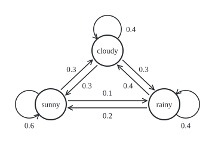
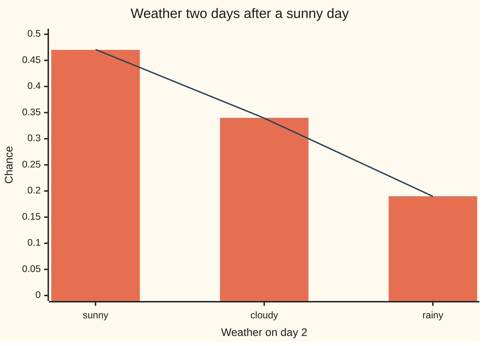

# Markov chains: the future depends on the present only

Stochastic processes and calculus → Markov Chains → One-step memory → Markov chains

---

## General Overview

Each morning a town's weather is one of three kinds: sunny, cloudy or rainy. Its records give a simple rule for tomorrow. After a sunny day, tomorrow is sunny 6 times in 10, cloudy 3 times, rainy once. After a cloudy day the split is 3, 4 and 3. After a rainy day it is 2, 4 and 4.

The rule looks only at today. Once today is known, whether last week was a heatwave or a washout makes no difference. Run the rule forward from a sunny day and it writes out a fortnight such as S S S S C S S S C R R R R C, where S, C and R stand for sunny, cloudy and rainy. That line is one sample, drawn by the seeded simulation in the code; another seed gives another fortnight.

Chances further ahead follow from the rule alone. Two days after a sunny day, rain has chance 0.19, about 1 in 5, by three routes: through a sunny, a cloudy or a rainy middle day.

A process that forgets everything except its present state is a **Markov chain**, named after Andrei Markov, who in 1913 fitted one to real data: the run of vowels and consonants in 20,000 letters of Pushkin's *Eugene Onegin*. The table of next-step chances is its **transition matrix**.

**A Markov chain is a process whose next step depends on the past only through the present state; one table of next-step chances then fixes the chance of every whole path, as a product of one entry per step.**

**What kind of fact this is:** a definition. Its central consequence, that the next-step rule and the product rule for whole paths say the same thing, is a theorem proved on this card in Why it works.

### The picture: the weather rule as a state diagram

Each circle is a **state**, one kind of weather. Each arrow is a move from today to tomorrow, labelled with its chance; the arrows leaving a circle, loop included, add to 1. The layout is free; the numbers are the whole rule.

<p align="center"></p>

Rain turns straight to sun with chance 0.2, sun straight to rain with chance 0.1.

---

## The formula

Notation first, in words. As on [processes-and-paths](../01-Random%20Walks%20and%20Filtrations/01-processes-and-paths.md), $X_n$ is the value at time $n$: here the weather on day $n$, with day 0 today. The states get letters: S, C, R. The chance of moving from state $i$ today to state $j$ tomorrow is written $p_{ij}$, read "p from i to j". Laid out with one row per today and one column per tomorrow, the $p_{ij}$ form a square table $P$, the transition matrix. $P$ alone is the matrix; $P$ followed by brackets is a probability, as in wing 09.

`P = [[0.6, 0.3, 0.1], [0.3, 0.4, 0.3], [0.2, 0.4, 0.4]]`, rows and columns in the order S, C, R.

The definition of a Markov chain is one line:

$$P(X_{n+1} = j \mid X_n = i,\ X_{n-1} = i_{n-1},\ \dots,\ X_0 = i_0) = p_{ij}$$

**Read it aloud:** given any whole history with positive chance, the chance of state j tomorrow is the entry in today's row and tomorrow's column; nothing earlier enters.

Write $\alpha_i$ for the chance that day 0 is in state i: the **start law**. The same fact, written for whole paths, is the **factorisation**:

$$P(X_0 = i_0,\ X_1 = i_1,\ \dots,\ X_n = i_n) = \alpha_{i_0}\, p_{i_0 i_1}\, p_{i_1 i_2} \cdots p_{i_{n-1} i_n}$$

**Read it aloud:** the chance of a whole path is the chance of its first day, times one matrix entry for each step taken.

Summing the factorisation over the middle day gives the two-step chance:

$$P(X_2 = j \mid X_0 = i) = \sum_k p_{ik}\, p_{kj} = (P^2)_{ij}$$

**Read it aloud:** for each possible middle state k, multiply the two steps, then add; the sum is the (i, j) entry of P times P.

| Symbol | Plain meaning | In our example | Push it up and the answer… |
| --- | --- | --- | --- |
| $n$ | the day, counted from today as day 0 | 0, 1, 2 | more steps, more paths to sum |
| $X_n$ | the weather on day $n$: a random state | S on day 0 | — |
| $i$, $j$, $k$ | states: today, tomorrow, a day in between | S, C, R | — |
| $i_0$, $i_n$ | the states on days 0 to $n$ along one path | S, S, C, C, R, R, S | — |
| $p_{ij}$ | chance of state $j$ tomorrow given state $i$ today | sunny to rainy: 0.1 | its row's other entries must fall |
| $P$ | the transition matrix: all the $p_{ij}$, rows summing to 1 | 3 rows of 3 | — |
| $P^2$ | $P$ times $P$: the two-day chances | $(P^2)_{SR}$ = 0.19 | — |
| $\alpha$, $\alpha_i$ | the start law: chance that day 0 is in state $i$ | 1 on S, or the forecast 0.5, 0.3, 0.2 | — |
| $\mathcal{F}_n$ | what is known by day $n$: the weather of days 0 to $n$ | S S on day 1 | — |
| $U$ | a uniform random draw between 0 and 1, used to build the chain | 0.37; the code uses a digit 0 to 9 | — |
| $\prod$ | multiply the terms that follow, one per step | six entries for a seven-day week | — |

A matrix whose entries are at least 0 and whose rows each add to 1 is called **stochastic**. Every transition matrix is one. The columns need not add to 1; here they add to 1.1, 1.1 and 0.8.

### When it holds

This is a definition: it holds for any process that meets it. Whether real weather meets it turns on four things:

- **The state carries all the memory that matters.** On this card's "memory weather", rain follows rain with chance 0.7 when yesterday was rainy too and 0.4 otherwise, so no single rainy row exists. The repair is a bigger state: the pair (yesterday, today), nine states instead of three.
- **The same matrix every day**, called **time homogeneity**. Seasons break it. The product rule survives with a different matrix each day, but $P^2$ with one $P$ is then wrong.
- **Real chances in every row.** No negative entry, and each row adds to 1; otherwise the path chances do not add to 1.
- **A start law.** The matrix does not say where day 0 is; a path's chance needs $\alpha$ as its first factor.

---

## Why it works

### Step 0: one day at a time, one table entry per day

A path's chance is built one day at a time: each day brings its chance given the days before. The Markov property makes each of those factors a single entry of the table, from the row of the day before. Steps 1 to 4 use that one idea forwards, backwards and over two days.

### Step 1: the multiplication rule, for any process

A whole path's chance can be built day by day: the first day's chance, times the second given the first, times the third given the first two, and so on. For any process and any path with positive chance,

$$P(X_0 = i_0, \dots, X_n = i_n) = P(X_0 = i_0) \prod_{m=1}^{n} P(X_m = i_m \mid X_0 = i_0, \dots, X_{m-1} = i_{m-1})$$

The product sign $\prod$ means multiply the terms for m = 1 up to n. This is the multiplication rule of conditional probability; each factor may still look back over the whole history.

### Step 2: the Markov property shortens every factor

The definition replaces the factor for day m by $p_{i_{m-1} i_m}$: the entry in the row of the day before and the column of day m. The first factor is the start law $\alpha_{i_0}$. The product becomes the factorisation in The formula.

For the week S S C C R R S starting from a sunny Monday, that is 0.6 × 0.3 × 0.4 × 0.3 × 0.4 × 0.2 = 0.001728, about 1 in 579. Six steps, six entries.

### Step 3: the product rule gives back the next-step rule

The converse holds too. If every path's chance is the product, divide the chance of a history extended by one day by the chance of the history. Every factor cancels except the last, $p_{i_n j}$. So given any history with positive chance, tomorrow's chances are today's row.

That is the Markov property as a factorisation: a statement about conditional chances and a statement about products are the same statement. The code checks it on all 27 three-day histories from the forecast start law: none has next-day chances that differ from today's row. On the memory weather, 3 of the 27 do: the three whose last two days are rainy.

<details>
<summary>Detailed proof: the next-step rule and the product rule are equivalent</summary>

Fix a start law $\alpha$ and a stochastic matrix $P$ on a finite set of states. Call (A) the statement: for every $n$ and every history $i_0, \dots, i_n$ with positive chance, $P(X_{n+1} = j \mid X_0 = i_0, \dots, X_n = i_n) = p_{i_n j}$, and $P(X_0 = i) = \alpha_i$. Call (B) the statement: for every $n$ and every path, $P(X_0 = i_0, \dots, X_n = i_n) = \alpha_{i_0} p_{i_0 i_1} \cdots p_{i_{n-1} i_n}$.

*(A) gives (B), by induction on n.* For n = 0 both sides are $\alpha_{i_0}$. Suppose (B) holds for paths of length n. Take a path of length n + 1. If its first n + 1 days have positive chance, the multiplication rule and (A) give its chance as (chance of the first n + 1 days) × $p_{i_n i_{n+1}}$, which is the product by the induction hypothesis. If its first n + 1 days have chance 0, the longer path lies inside that event, so its chance is 0; and the product is 0 too, since it contains the shorter product as a factor.

*(B) gives (A).* The start law is (B) at n = 0. For a history with positive chance, (B) applied to the history and to its extension gives the ratio $\alpha_{i_0} p_{i_0 i_1} \cdots p_{i_n j} / (\alpha_{i_0} p_{i_0 i_1} \cdots p_{i_{n-1} i_n}) = p_{i_n j}$.

*The products are a probability table.* Summing the product over the last state multiplies the shorter product by a row sum, which is 1. Repeating down to day 0 leaves $\sum_i \alpha_i = 1$. So the products for different horizons agree with each other, which is what makes (B) a single consistent law rather than one table per horizon.

*In wing 10's language.* With $\mathcal{F}_n$ the information in days 0 to n, (A) says $E[1\{X_{n+1} = j\} \mid \mathcal{F}_n] = p_{X_n j}$ almost surely, where the indicator $1\{X_{n+1} = j\}$ is 1 when tomorrow is j and 0 otherwise. A history with chance 0 has no conditional chance, so (A) is silent there; (B) needs no such exception.

</details>

### Step 4: two days is a sum over the middle day

From sunny today to rainy the day after tomorrow, the path passes through some state tomorrow. The paths S S R, S C R and S R R are different outcomes, so their chances add, and each is a product by Step 2:

$$P(X_2 = R \mid X_0 = S) = p_{SS}\, p_{SR} + p_{SC}\, p_{CR} + p_{SR}\, p_{RR} = 0.06 + 0.09 + 0.04 = 0.19$$

Row times column, summed, is how [matrix-multiplication](../../03-Algebra/04-Matrices/03-matrix-multiplication.md) defines a product, so all nine two-day chances are the entries of $P^2$. The general form, $n$ days as $P^n$, and the splitting rule behind it (Chapman-Kolmogorov) are proved on [multi-step-transitions](02-multi-step-transitions.md).

### Step 5: every matrix and start law has a chain

Any stochastic matrix and start law have a chain, built from uniform draws. Cut the numbers from 0 to 1 into pieces as long as the entries of today's row, draw a uniform number $U$, and move to the state whose piece it hits. On a sunny day, draws below 0.6 give sunny, 0.6 to 0.9 cloudy, above 0.9 rainy. Each day takes a fresh, independent draw, so the Markov property holds by construction. The code uses a random digit 0 to 9 for $U$, since every entry is whole tenths. A chain that runs forever needs its endless draws on one probability space: Kolmogorov's extension theorem, stated on [processes-and-paths](../01-Random%20Walks%20and%20Filtrations/01-processes-and-paths.md) and proved in Durrett's text. This card uses it and does not prove it.

A random walk on a graph, from wing 09 ([random-walks-on-graphs-and-mixing](../../09-Probability%20and%20statistics/14-Random%20Graphs%20and%20the%20Probabilistic%20Method/05-random-walks-on-graphs-and-mixing.md)), is one such chain: each row spreads its chance evenly over a node's neighbours. Which states a chain can reach and return to is sorted out on [classifying-states](03-classifying-states.md).

---

## Worked numbers, by hand

Today is sunny. What are the chances for the day after tomorrow?

| Step | Arithmetic | Value |
| --- | --- | --- |
| path S S R | $p_{SS} \times p_{SR}$ = 0.6 × 0.1 | 0.06 |
| path S C R | $p_{SC} \times p_{CR}$ = 0.3 × 0.3 | 0.09 |
| path S R R | $p_{SR} \times p_{RR}$ = 0.1 × 0.4 | 0.04 |
| rainy on day 2 | 0.06 + 0.09 + 0.04 | **0.19** |
| sunny on day 2 | 0.6 × 0.6 + 0.3 × 0.3 + 0.1 × 0.2 | **0.47** |
| cloudy on day 2 | 0.6 × 0.3 + 0.3 × 0.4 + 0.1 × 0.4 | **0.34** |
| the whole of $P^2$, row by row | same sums from C and from R | S: 0.47, 0.34, 0.19; C: 0.36, 0.37, 0.27; R: 0.32, 0.38, 0.30 |

After a sunny day, the day after tomorrow is rainy about one time in five, nearly twice the one-day chance of 0.1: the middle day gives the weather time to turn. The same matrix every day does not mean the same chances every day; where they end up is [stationary-distributions](04-stationary-distributions.md).



Bars: the exact chances, the first row of $P^2$. Line: the share of 100,000 simulated two-day runs from sunny landing in each state, 0.4708, 0.3394 and 0.1898, each within one standard error (0.0016, 0.0015, 0.0012) of the bar.

### What breaks if you drop a piece

| Mistake | Comes out at | What went wrong |
| --- | --- | --- |
| Using the one-day entry for two days | rain in two days 0.1, not 0.19 | the middle day was skipped: two more routes to rain exist |
| Squaring the one-day entry for sunny to rainy | 0.01, not 0.19 | matrix powers are not entry powers: the square of a table sums over the middle day |
| Taking the days as independent | sunny then sunny from sunny: 0.6 × 0.47 = 0.282, not 0.36 | Markov is not independence: tomorrow's weather moves the day after's |
| Treating memory weather as a chain | rain after rain: 0.7 if yesterday rainy, 0.4 otherwise; 3 of 27 histories break a single row | the state lacks yesterday; the fix is pairs of days as states |

The code prints all four.

---

## Code, from first principles, and it actually runs

Three roads to the two-day chances. Road one multiplies the matrix by itself. Road two lists all 81 four-day paths from the forecast start law 0.5, 0.3, 0.2, weights each by its product, and sums out the other days; the same list tests the factorisation on the chain and on the memory weather. Road three simulates with a SplitMix64 generator written out, seed 20260929: 100,000 two-day runs, then two 300,000-day paths, one for the chain and one for the memory weather, for the conditional frequencies. Each simulated number is printed with its standard error. Exact work is in whole tenths, so roads one and two carry no rounding.

### Python

```python
# Markov chains -- the check behind the card.  Standard library only.
# Weather, one step a day: 0 sunny, 1 cloudy, 2 rainy.  Every chance is held
# as whole tenths, so a path's weight is an exact integer over a power of 10.
# Three roads to the two-day chances: the matrix product; every path listed
# and summed; a seeded simulation (SplitMix64, seed 20260929).
from math import sqrt

P = [[6, 3, 1], [3, 4, 3], [2, 4, 4]]     # tenths: row = today, column = tomorrow
SPELL = [1, 2, 7]                         # memory weather: the row after two rainy days
START = [5, 3, 2]                         # a start law: today's forecast, in tenths
L, NAME = "SCR", ["sunny", "cloudy", "rainy"]
SEED, RUNS, DAYS, M64 = 20260929, 100_000, 300_000, (1 << 64) - 1

def dec(n, places):                       # the exact decimal n / 10^places
    s = str(n).rjust(places + 1, "0")
    return s[:-places] + "." + s[-places:]

state = SEED
def digit():                              # SplitMix64, cut down to one digit 0..9
    global state
    state = (state + 0x9E3779B97F4A7C15) & M64
    z = state
    z = ((z ^ (z >> 30)) * 0xBF58476D1CE4E5B9) & M64
    z = ((z ^ (z >> 27)) * 0x94D049BB133111EB) & M64
    return (z ^ (z >> 31)) % 10

def draw(row):                            # the digit falls in one entry's slice of 0..9
    d, edge = digit(), 0
    for j, w in enumerate(row):
        edge += w
        if d < edge:
            return j

def row_for(memory, yesterday, today):    # the chain ignores yesterday; memory weather does not
    return SPELL if memory and yesterday == 2 and today == 2 else P[today]

def weight(path, memory):                 # start law times one row entry per day
    w = START[path[0]]
    for k in range(1, len(path)):
        w *= row_for(memory, path[k - 2] if k > 1 else -1, path[k - 1])[path[k]]
    return w

def breaks(memory):                       # 3-day histories whose next-day chances differ from today's row
    bad = 0
    for h in [(a, b, c) for a in range(3) for b in range(3) for c in range(3)]:
        ws = [weight(h + (j,), memory) for j in range(3)]
        bad += any(10 * ws[j] != sum(ws) * P[h[2]][j] for j in range(3))
    return bad

# Road 1: the matrix product, in hundredths.
P2 = [[sum(P[i][k] * P[k][j] for k in range(3)) for j in range(3)] for i in range(3)]
# Road 2: all 81 four-day paths from the start law, in ten-thousandths.
paths = [(a, b, c, d) for a in range(3) for b in range(3) for c in range(3) for d in range(3)]
total = sum(weight(p, False) for p in paths)
pair = [[sum(weight(p, False) for p in paths if p[0] == i and p[2] == j) for j in range(3)] for i in range(3)]
routes = [P[0][k] * P[k][2] for k in range(3)]
week = [0, 0, 1, 1, 2, 2, 0]
wk = 1
for a, b in zip(week, week[1:]):
    wk *= P[a][b]
# Road 3: simulate.  A sample fortnight, then 100000 two-day runs from sunny.
x, fortnight = 0, "S"
for _ in range(13):
    x = draw(P[x])
    fortnight += " " + L[x]
end = [0, 0, 0]
for _ in range(RUNS):
    end[draw(P[draw(P[0])])] += 1
def triples(memory):                      # one long path: count (yesterday, today, tomorrow)
    c, y, t = [[[0] * 3 for _ in range(3)] for _ in range(3)], 0, 0
    for _ in range(DAYS):
        n = draw(row_for(memory, y, t))
        c[y][t][n] += 1
        y, t = t, n
    return c
def cond(c, y, t, j):                     # frequency of j after (y, t), with its standard error
    n = sum(c[y][t])
    f = c[y][t][j] / n
    return f, sqrt(f * (1 - f) / n)
chain, mem = triples(False), triples(True)

print("states: S sunny, C cloudy, R rainy; one step is one day")
for i in range(3):
    print(f"P    row {L[i]}: " + " ".join(dec(v, 1) for v in P[i]) + f"   (row sum {dec(sum(P[i]), 1)})")
for i in range(3):
    print(f"P^2  row {L[i]}: " + " ".join(dec(v, 2) for v in P2[i]))
print("sunny to rainy in two days: " + " + ".join(f"S {L[k]} R {dec(routes[k], 2)}" for k in range(3))
      + f" = {dec(sum(routes), 2)}")
print(f"81 four-day paths from start law {' '.join(dec(v, 1) for v in START)}: weights sum to {dec(total, 4)}")
print("P(today i, day after tomorrow j) / P(today i), from the path list:")
for i in range(3):
    print(f"  from {L[i]}: " + " ".join(dec(pair[i][j] // (10 * START[i]), 2) for j in range(3)))
print(f"chain: 3-day histories whose next day differs from today's row: {breaks(False)} of 27")
print(f"week S S C C R R S from a sunny Monday: {dec(wk, 6)}, about 1 in {round(10 ** 6 / wk)}")
print(f"one sample fortnight from sunny: {fortnight}")
se = [sqrt(e / RUNS * (1 - e / RUNS) / RUNS) for e in end]
print(f"simulated day-2 law from sunny, {RUNS} runs: "
      + ", ".join(f"{NAME[j]} {end[j] / RUNS:.4f} +- {se[j]:.4f}" for j in range(3)))
print(f"chain, {DAYS}-day path, P(rainy tomorrow | cloudy today, yesterday y):")
for y in range(3):
    f, s = cond(chain, y, 1, 2)
    print(f"  y = {NAME[y]}: {f:.4f} +- {s:.4f}   (row entry {dec(P[1][2], 1)})")
print(f"memory weather, {DAYS}-day path, P(rainy tomorrow | rainy today, yesterday y):")
for y in range(3):
    f, s = cond(mem, y, 2, 2)
    print(f"  y = {NAME[y]}: {f:.4f} +- {s:.4f}   (rule {dec(row_for(True, y, 2)[2], 1)})")
print(f"memory weather: 3-day histories whose next day differs from today's row: {breaks(True)} of 27")
print(f"mistake, one-day entry for two days: {dec(P[0][2], 1)}, not {dec(P2[0][2], 2)}")
print(f"mistake, squaring the entry: {dec(P[0][2] ** 2, 2)}, not {dec(P2[0][2], 2)}")
print(f"mistake, days taken as independent: P(S then S | S) = {dec(P[0][0], 1)} x {dec(P2[0][0], 2)} = "
      f"{dec(P[0][0] * P2[0][0], 3)}, not {dec(P[0][0] * P[0][0], 2)}")
cols = [sum(P[i][j] for i in range(3)) for j in range(3)]
print("mistake, reading columns as rows: column sums " + " ".join(dec(c, 1) for c in cols))
print("figure, nodes S (85,175) C (180,85) R (275,175), radius 26")
assert all(pair[i][j] == START[i] * P2[i][j] * 10 for i in range(3) for j in range(3))
assert total == 10 ** 4 and breaks(False) == 0 and breaks(True) == 3
assert all(abs(end[j] / RUNS - P2[0][j] / 100) < 4 * se[j] for j in range(3))
assert all(abs(cond(chain, y, 1, 2)[0] - 0.3) < 4 * cond(chain, y, 1, 2)[1] for y in range(3))
f_rr, s_rr = cond(mem, 2, 2, 2)
f_sr, s_sr = cond(mem, 0, 2, 2)
assert f_rr - f_sr > 10 * (s_rr + s_sr)                  # memory shows up in the data
print("ALL CHECKS PASS")
```

**Ran 2026-09-30 on macOS, Python 3.14.6, standard library only. All checks passed. Output, pasted from the run:**

```
states: S sunny, C cloudy, R rainy; one step is one day
P    row S: 0.6 0.3 0.1   (row sum 1.0)
P    row C: 0.3 0.4 0.3   (row sum 1.0)
P    row R: 0.2 0.4 0.4   (row sum 1.0)
P^2  row S: 0.47 0.34 0.19
P^2  row C: 0.36 0.37 0.27
P^2  row R: 0.32 0.38 0.30
sunny to rainy in two days: S S R 0.06 + S C R 0.09 + S R R 0.04 = 0.19
81 four-day paths from start law 0.5 0.3 0.2: weights sum to 1.0000
P(today i, day after tomorrow j) / P(today i), from the path list:
  from S: 0.47 0.34 0.19
  from C: 0.36 0.37 0.27
  from R: 0.32 0.38 0.30
chain: 3-day histories whose next day differs from today's row: 0 of 27
week S S C C R R S from a sunny Monday: 0.001728, about 1 in 579
one sample fortnight from sunny: S S S S C S S S C R R R R C
simulated day-2 law from sunny, 100000 runs: sunny 0.4708 +- 0.0016, cloudy 0.3394 +- 0.0015, rainy 0.1898 +- 0.0012
chain, 300000-day path, P(rainy tomorrow | cloudy today, yesterday y):
  y = sunny: 0.2959 +- 0.0024   (row entry 0.3)
  y = cloudy: 0.3039 +- 0.0022   (row entry 0.3)
  y = rainy: 0.3006 +- 0.0027   (row entry 0.3)
memory weather, 300000-day path, P(rainy tomorrow | rainy today, yesterday y):
  y = sunny: 0.4033 +- 0.0047   (rule 0.4)
  y = cloudy: 0.3954 +- 0.0029   (rule 0.4)
  y = rainy: 0.7033 +- 0.0020   (rule 0.7)
memory weather: 3-day histories whose next day differs from today's row: 3 of 27
mistake, one-day entry for two days: 0.1, not 0.19
mistake, squaring the entry: 0.01, not 0.19
mistake, days taken as independent: P(S then S | S) = 0.6 x 0.47 = 0.282, not 0.36
mistake, reading columns as rows: column sums 1.1 1.1 0.8
figure, nodes S (85,175) C (180,85) R (275,175), radius 26
ALL CHECKS PASS
```

### Rust

Same numbers, same labels, built with `rustc --edition 2021 -O`.

```rust
// Markov chains -- the same check in Rust.  No crates.
// Weather, one step a day: 0 sunny, 1 cloudy, 2 rainy.  Every chance is held
// as whole tenths, so a path's weight is an exact integer over a power of 10.
// Three roads to the two-day chances: the matrix product; every path listed
// and summed; a seeded simulation (SplitMix64, seed 20260929).
const P: [[u64; 3]; 3] = [[6, 3, 1], [3, 4, 3], [2, 4, 4]]; // tenths: row = today, column = tomorrow
const SPELL: [u64; 3] = [1, 2, 7];     // memory weather: the row after two rainy days
const START: [u64; 3] = [5, 3, 2];     // a start law: today's forecast, in tenths
const L: [&str; 3] = ["S", "C", "R"];
const NAME: [&str; 3] = ["sunny", "cloudy", "rainy"];
const RUNS: usize = 100_000;
const DAYS: usize = 300_000;

fn dec(n: u64, places: usize) -> String {  // the exact decimal n / 10^places
    let s = format!("{:0>w$}", n, w = places + 1);
    format!("{}.{}", &s[..s.len() - places], &s[s.len() - places..])
}

struct Rng(u64);
impl Rng {
    fn digit(&mut self) -> usize {          // SplitMix64, cut down to one digit 0..9
        self.0 = self.0.wrapping_add(0x9E3779B97F4A7C15);
        let mut z = self.0;
        z = (z ^ (z >> 30)).wrapping_mul(0xBF58476D1CE4E5B9);
        z = (z ^ (z >> 27)).wrapping_mul(0x94D049BB133111EB);
        ((z ^ (z >> 31)) % 10) as usize
    }
    fn draw(&mut self, row: &[u64; 3]) -> usize { // the digit falls in one entry's slice of 0..9
        let (d, mut edge) = (self.digit() as u64, 0);
        for j in 0..3 {
            edge += row[j];
            if d < edge { return j }
        }
        panic!("row does not cover 0..9")
    }
}

fn row_for(memory: bool, yesterday: usize, today: usize) -> &'static [u64; 3] {
    if memory && yesterday == 2 && today == 2 { &SPELL } else { &P[today] }
}

fn weight(path: &[usize], memory: bool) -> u64 { // start law times one row entry per day
    let mut w = START[path[0]];
    for k in 1..path.len() {
        let y = if k > 1 { path[k - 2] } else { 9 };
        w *= row_for(memory, y, path[k - 1])[path[k]];
    }
    w
}

fn breaks(memory: bool) -> usize {        // 3-day histories whose next-day chances differ from today's row
    let mut bad = 0;
    for a in 0..3 { for b in 0..3 { for c in 0..3 {
        let ws: Vec<u64> = (0..3).map(|j| weight(&[a, b, c, j], memory)).collect();
        let sum: u64 = ws.iter().sum();
        if (0..3).any(|j| 10 * ws[j] != sum * P[c][j]) { bad += 1 }
    }}}
    bad
}

fn triples(rng: &mut Rng, memory: bool) -> [[[u64; 3]; 3]; 3] { // one long path: (yesterday, today, tomorrow)
    let (mut c, mut y, mut t) = ([[[0u64; 3]; 3]; 3], 0, 0);
    for _ in 0..DAYS {
        let n = rng.draw(row_for(memory, y, t));
        c[y][t][n] += 1;
        y = t;
        t = n;
    }
    c
}

fn cond(c: &[[[u64; 3]; 3]; 3], y: usize, t: usize, j: usize) -> (f64, f64) {
    let n = c[y][t].iter().sum::<u64>() as f64;
    let f = c[y][t][j] as f64 / n;
    (f, (f * (1.0 - f) / n).sqrt())
}

fn main() {
    let mut p2 = [[0u64; 3]; 3];                          // road 1: the matrix product, in hundredths
    for i in 0..3 { for j in 0..3 { p2[i][j] = (0..3).map(|k| P[i][k] * P[k][j]).sum() } }
    let (mut total, mut pair) = (0u64, [[0u64; 3]; 3]);   // road 2: all 81 four-day paths
    for a in 0..3 { for b in 0..3 { for c in 0..3 { for d in 0..3 {
        let w = weight(&[a, b, c, d], false);
        total += w;
        pair[a][c] += w;
    }}}}
    let routes: Vec<u64> = (0..3).map(|k| P[0][k] * P[k][2]).collect();
    let week = [0, 0, 1, 1, 2, 2, 0];
    let wk: u64 = week.windows(2).map(|w| P[w[0]][w[1]]).product();
    let mut rng = Rng(20260929);                          // road 3: simulate
    let (mut x, mut fortnight) = (0, String::from("S"));
    for _ in 0..13 {
        x = rng.draw(&P[x]);
        fortnight += &format!(" {}", L[x]);
    }
    let mut end = [0u64; 3];
    for _ in 0..RUNS {
        let first = rng.draw(&P[0]);
        end[rng.draw(&P[first])] += 1;
    }
    let chain = triples(&mut rng, false);
    let mem = triples(&mut rng, true);
    let r = RUNS as f64;

    println!("states: S sunny, C cloudy, R rainy; one step is one day");
    for i in 0..3 {
        let row: Vec<String> = P[i].iter().map(|&v| dec(v, 1)).collect();
        println!("P    row {}: {}   (row sum {})", L[i], row.join(" "), dec(P[i].iter().sum(), 1));
    }
    for i in 0..3 {
        let row: Vec<String> = p2[i].iter().map(|&v| dec(v, 2)).collect();
        println!("P^2  row {}: {}", L[i], row.join(" "));
    }
    let parts: Vec<String> = (0..3).map(|k| format!("S {} R {}", L[k], dec(routes[k], 2))).collect();
    println!("sunny to rainy in two days: {} = {}", parts.join(" + "), dec(routes.iter().sum(), 2));
    let st: Vec<String> = START.iter().map(|&v| dec(v, 1)).collect();
    println!("81 four-day paths from start law {}: weights sum to {}", st.join(" "), dec(total, 4));
    println!("P(today i, day after tomorrow j) / P(today i), from the path list:");
    for i in 0..3 {
        let row: Vec<String> = (0..3).map(|j| dec(pair[i][j] / (10 * START[i]), 2)).collect();
        println!("  from {}: {}", L[i], row.join(" "));
    }
    println!("chain: 3-day histories whose next day differs from today's row: {} of 27", breaks(false));
    println!("week S S C C R R S from a sunny Monday: {}, about 1 in {}", dec(wk, 6), (1e6 / wk as f64).round());
    println!("one sample fortnight from sunny: {}", fortnight);
    let se: Vec<f64> = end.iter().map(|&e| (e as f64 / r * (1.0 - e as f64 / r) / r).sqrt()).collect();
    let sim: Vec<String> = (0..3).map(|j| format!("{} {:.4} +- {:.4}", NAME[j], end[j] as f64 / r, se[j])).collect();
    println!("simulated day-2 law from sunny, {} runs: {}", RUNS, sim.join(", "));
    println!("chain, {}-day path, P(rainy tomorrow | cloudy today, yesterday y):", DAYS);
    for y in 0..3 {
        let (f, s) = cond(&chain, y, 1, 2);
        println!("  y = {}: {:.4} +- {:.4}   (row entry {})", NAME[y], f, s, dec(P[1][2], 1));
    }
    println!("memory weather, {}-day path, P(rainy tomorrow | rainy today, yesterday y):", DAYS);
    for y in 0..3 {
        let (f, s) = cond(&mem, y, 2, 2);
        println!("  y = {}: {:.4} +- {:.4}   (rule {})", NAME[y], f, s, dec(row_for(true, y, 2)[2], 1));
    }
    println!("memory weather: 3-day histories whose next day differs from today's row: {} of 27", breaks(true));
    println!("mistake, one-day entry for two days: {}, not {}", dec(P[0][2], 1), dec(p2[0][2], 2));
    println!("mistake, squaring the entry: {}, not {}", dec(P[0][2] * P[0][2], 2), dec(p2[0][2], 2));
    println!("mistake, days taken as independent: P(S then S | S) = {} x {} = {}, not {}",
             dec(P[0][0], 1), dec(p2[0][0], 2), dec(P[0][0] * p2[0][0], 3), dec(P[0][0] * P[0][0], 2));
    let cols: Vec<String> = (0..3).map(|j| dec((0..3).map(|i| P[i][j]).sum(), 1)).collect();
    println!("mistake, reading columns as rows: column sums {}", cols.join(" "));
    println!("figure, nodes S (85,175) C (180,85) R (275,175), radius 26");
    assert!((0..3).all(|i| (0..3).all(|j| pair[i][j] == START[i] * p2[i][j] * 10)));
    assert!(total == 10u64.pow(4) && breaks(false) == 0 && breaks(true) == 3);
    assert!((0..3).all(|j| (end[j] as f64 / r - p2[0][j] as f64 / 100.0).abs() < 4.0 * se[j]));
    assert!((0..3).all(|y| { let (f, s) = cond(&chain, y, 1, 2); (f - 0.3).abs() < 4.0 * s }));
    let ((f_rr, s_rr), (f_sr, s_sr)) = (cond(&mem, 2, 2, 2), cond(&mem, 0, 2, 2));
    assert!(f_rr - f_sr > 10.0 * (s_rr + s_sr));          // memory shows up in the data
    println!("ALL CHECKS PASS");
}
```

**Ran 2026-09-30 on macOS, rustc 1.98.1, no crates. All checks passed. Output, pasted from the run:**

```
states: S sunny, C cloudy, R rainy; one step is one day
P    row S: 0.6 0.3 0.1   (row sum 1.0)
P    row C: 0.3 0.4 0.3   (row sum 1.0)
P    row R: 0.2 0.4 0.4   (row sum 1.0)
P^2  row S: 0.47 0.34 0.19
P^2  row C: 0.36 0.37 0.27
P^2  row R: 0.32 0.38 0.30
sunny to rainy in two days: S S R 0.06 + S C R 0.09 + S R R 0.04 = 0.19
81 four-day paths from start law 0.5 0.3 0.2: weights sum to 1.0000
P(today i, day after tomorrow j) / P(today i), from the path list:
  from S: 0.47 0.34 0.19
  from C: 0.36 0.37 0.27
  from R: 0.32 0.38 0.30
chain: 3-day histories whose next day differs from today's row: 0 of 27
week S S C C R R S from a sunny Monday: 0.001728, about 1 in 579
one sample fortnight from sunny: S S S S C S S S C R R R R C
simulated day-2 law from sunny, 100000 runs: sunny 0.4708 +- 0.0016, cloudy 0.3394 +- 0.0015, rainy 0.1898 +- 0.0012
chain, 300000-day path, P(rainy tomorrow | cloudy today, yesterday y):
  y = sunny: 0.2959 +- 0.0024   (row entry 0.3)
  y = cloudy: 0.3039 +- 0.0022   (row entry 0.3)
  y = rainy: 0.3006 +- 0.0027   (row entry 0.3)
memory weather, 300000-day path, P(rainy tomorrow | rainy today, yesterday y):
  y = sunny: 0.4033 +- 0.0047   (rule 0.4)
  y = cloudy: 0.3954 +- 0.0029   (rule 0.4)
  y = rainy: 0.7033 +- 0.0020   (rule 0.7)
memory weather: 3-day histories whose next day differs from today's row: 3 of 27
mistake, one-day entry for two days: 0.1, not 0.19
mistake, squaring the entry: 0.01, not 0.19
mistake, days taken as independent: P(S then S | S) = 0.6 x 0.47 = 0.282, not 0.36
mistake, reading columns as rows: column sums 1.1 1.1 0.8
figure, nodes S (85,175) C (180,85) R (275,175), radius 26
ALL CHECKS PASS
```

The two outputs match line for line, simulated digits included, since both draw the same stream.

> [!TIP]
> **Try changing**
> Guess first, then run it.
> - **Give the memory weather no memory.** Set `SPELL` to `[2, 4, 4]`, the ordinary rainy row. Rain after rain then comes out near 0.4 whatever yesterday was, 0 of 27 histories break the row, and the assert that expects 3 stops the run.
> - **Break a row.** Change the sunny row of `P` to `[6, 3, 2]`, which adds to 1.1. The 81 four-day weights add to more than 1, a third of the histories no longer match today's row, and the first assert stops the run.
> - **Start certain of sun.** Set `START` to `[10, 0, 0]`. The run stops with a division by zero at the line that divides by the chance of a cloudy or rainy start: a conditional chance given an event of chance 0 does not exist.

---

## The usual mistake

> [!warning]
> **Reading "memoryless" as "the past tells nothing".** The past does inform the future, through the present. After a sunny day, rain two days later has chance 0.19; after a rainy day it has chance 0.30. What the Markov property says is narrower: once today is known, yesterday adds nothing. On the simulated 300,000 days, the chance of rain after a cloudy day is 0.2959, 0.3039 and 0.3006 for a sunny, cloudy and rainy yesterday, all within two standard errors of the row entry 0.3.
>
> - **Days as independent.** Consecutive days are dependent: sunny then sunny from a sunny start is 0.36, not the 0.282 that multiplying the separate one-day and two-day chances gives.
> - **Rows and columns swapped.** Rows are "from", columns are "to". Each row adds to 1; the columns here add to 1.1, 1.1 and 0.8, so reading a column as a row gives chances adding to more than 1.
> - **Memory the state cannot hold.** Weather with two-day memory forced into three states gives one rainy row where the data need two: 0.7033 and 0.4033 in the simulation.

---

## Where you meet it in real life

- **Weather generators.** Hydrologists simulate wet and dry days as a two-state chain, then attach rainfall to the wet days, to test reservoirs against droughts not yet seen.
- **Credit ratings.** Agencies publish one-year tables of the chance that a bond rated A today is rated A, BBB or in default next year: transition matrices, whose powers give multi-year default chances ([rating-transition-matrix-and-cumulative-default-rates](../../12-Financial%20mathematics/41-Default%2C%20Survival%20and%20the%20Hazard%20Rate/04-rating-transition-matrix-and-cumulative-default-rates.md)).
- **Text.** Markov's first chain was letters, vowel or consonant. Predicting a word from the last few words is a chain whose state is those words together.
- **Board games.** Each snakes-and-ladders square is a state and the die gives its row; the average length of a game is [absorption-and-first-step-analysis](06-absorption-and-first-step-analysis.md).
- **Sampling.** Statisticians build a chain whose long-run visits follow a distribution they cannot sample directly ([markov-chain-monte-carlo](07-markov-chain-monte-carlo.md)).
- **Hidden states.** When only umbrellas are seen, the weather chain sits under noisy observations ([hidden-markov-models](08-hidden-markov-models.md)).

> **Say it back**
> A Markov chain moves between states, and the chances for the next step depend only on the current state. Those chances form a transition matrix whose rows each add to 1. The chance of a whole path is the start chance times one matrix entry per step, and that product rule is the same statement as the next-step rule. Chances two days out come from summing over the middle day, which is multiplying the matrix by itself. When the state leaves out memory that matters, the product rule fails and the state has to grow.

---

## What this builds on

- [processes-and-paths](../01-Random%20Walks%20and%20Filtrations/01-processes-and-paths.md): a process as one random value per time, a sample path, and the law as chances over whole paths, which the factorisation writes down for a chain.
- [matrix-multiplication](../../03-Algebra/04-Matrices/03-matrix-multiplication.md): row times column, summed; here it turns out to be the sum over the middle day.

## Where this goes next

- [multi-step-transitions](02-multi-step-transitions.md): the law on day n as the start law times $P^n$.
- [hidden-markov-models](08-hidden-markov-models.md): a chain that is never seen directly, only through noisy signals.
- [rating-transition-matrix-and-cumulative-default-rates](../../12-Financial%20mathematics/41-Default%2C%20Survival%20and%20the%20Hazard%20Rate/04-rating-transition-matrix-and-cumulative-default-rates.md): ratings as states, default as a state never left.
- markov-decision-processes: a chain whose matrix is chosen by a decision each step.

Two days was one matrix product, $P^2$; a week ahead is the seventh power, and [multi-step-transitions](02-multi-step-transitions.md) shows why powers give the chances for any number of days.

---

## Sources

Verified 30 Sep 2026: every DOI below resolves, and Crossref confirms its title and first author.

- Markov, A. A. "An Example of Statistical Investigation of the Text *Eugene Onegin* Concerning the Connection of Samples in Chains." Translated in *Science in Context* 19, no. 4 (2006). [doi:10.1017/S0269889706001074](https://doi.org/10.1017/S0269889706001074). The 1913 letter count that first put a chain to data.
- Norris, J. R. *Markov Chains*. Cambridge University Press, 1997. [doi:10.1017/CBO9780511810633](https://doi.org/10.1017/CBO9780511810633). Chapter 1 defines a chain by its start law and matrix and proves the product form, as this card does.
- Durrett, Rick. *Probability: Theory and Examples*, 5th ed. Cambridge University Press, 2019. [doi:10.1017/9781108591034](https://doi.org/10.1017/9781108591034). Chapter 5 builds a chain for any matrix and start law on one probability space, the step this card states without proof.
