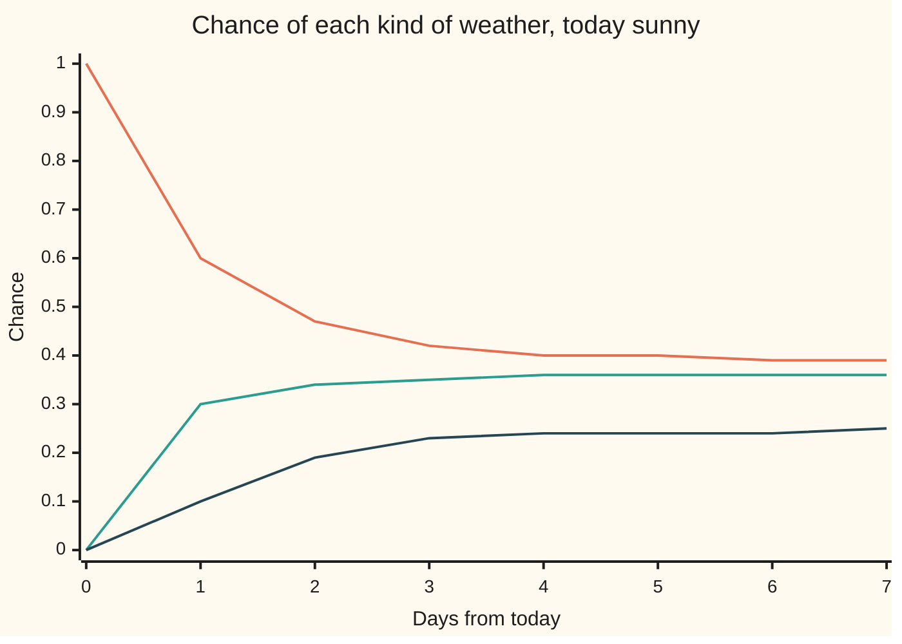

# n-step transitions: matrix powers and Chapman-Kolmogorov

[Syllabus](../../../SYLLABUS.md) → [Stochastic processes and calculus](../../../SYLLABUS.md#w11) → [Markov Chains](../../../SYLLABUS.md#w11-s03) → n-step transitions

---

## General Overview

A town's weather is sunny, cloudy or rainy each day, and its records give a rule for tomorrow that looks only at today. After a sunny day: sunny 6 times in 10, cloudy 3, rainy 1. After a cloudy day: 3, 4, 3. After a rainy day: 2, 4, 4. This is the chain of [Markov chains](01-markov-chains.md), which found rain two days after a sunny day by adding three routes: 0.19.

Today is sunny. What is the chance of rain a week from today? The weather can reach rain on day 7 by thousands of routes, each with its own chance. There are 2187 seven-day paths from a sunny start, and adding them all by hand is hopeless. The answer is 0.2454961, about 1 in 4.

It never has to be done path by path. Feed tomorrow's chances through the one-day rule to get the day after, and repeat: the week-ahead table is the one-day table multiplied by itself seven times. The identity that makes this legal, "a long trip can be split at any day in the middle", is the **Chapman-Kolmogorov equation**.

**The chance of going from state i to state j in n steps is the (i, j) entry of the transition matrix raised to the power n, because a matrix power adds up the chance of every route; the law on day n, its list of chances for each state, is the starting law times that power; and splitting a trip at any fixed day gives the same answer as taking it whole.**

**What kind of fact this is:** a theorem, proved on this card in Why it works, with the complete argument in a folded Detailed proof.

### The picture: the forecast spreading out, day by day



Orange: sunny. Green: cloudy. Dark blue: rainy. On day 0 all the chance sits on sunny. By day 4 the three lines have nearly stopped moving: the forecast has mostly forgotten that today was sunny. Values are rounded to two places; the exact ones are in the code output.

---

## The formula

Notation first, in words. As on [Markov chains](01-markov-chains.md), $X_n$ is the weather on day $n$, with day 0 today; $P$ is the transition matrix, whose entry $p_{ij}$ is the chance of state $j$ tomorrow after state $i$ today; and $\alpha$ is the start law, the chances for day 0. With the states in the order sunny, cloudy, rainy:

$$P = \begin{pmatrix} 0.6 & 0.3 & 0.1 \\ 0.3 & 0.4 & 0.3 \\ 0.2 & 0.4 & 0.4 \end{pmatrix}, \qquad \alpha = (1,\ 0,\ 0).$$

New here. $P^n$ is $P$ multiplied by itself $n$ times, and $P^0 = I$, the identity matrix (1 on the diagonal, 0 elsewhere: zero days leave the weather where it is). The **n-step transition probability** $p^{(n)}_{ij}$ is the chance of state $j$ exactly $n$ days after state $i$. The **law on day n**, $\mu_n$, is the row of three chances for day $n$, one per kind of weather, adding to 1; its entry for state $j$ is $\mu_n(j)$, and $\mu_0 = \alpha$.

The three results:

$$p^{(n)}_{ij} = \left(P^n\right)_{ij}, \qquad \mu_n = \alpha\,P^n, \qquad p^{(m+n)}_{ij} = \sum_{k} p^{(m)}_{ik}\,p^{(n)}_{kj}.$$

**Read it aloud:** the chance of getting from i to j in n days is the (i, j) entry of the n-th power of the one-day matrix; the law on day n is the start law times that power; and the chance of an (m + n)-day trip is the sum, over every state k the weather could be in on day m, of the chance of the first leg times the chance of the second.

The third is the **Chapman-Kolmogorov equation**. In matrix form it reads $P^{m+n} = P^m P^n$. That looks like the law of exponents, and it is proved below by summing paths, not assumed from the notation.

| Symbol | Plain meaning | In our example | Push it up and the answer… |
| --- | --- | --- | --- |
| $X_n$ | the weather on day n | sunny on day 0 | — |
| $n$, $m$ | numbers of days; m is where a trip is split | 7; split 3 + 4 | $\mu_n$ drifts toward the long-run mix |
| $i$, $j$, $k$ | states: where a trip starts, where it ends, where it is in between | sunny, rainy, any of the three | — |
| $P$, $p_{ij}$ | the transition matrix, rows adding to 1; one entry of it | sunny to rainy: 0.1 | shifting chance within a row reweights every route through that step |
| $\alpha$ | the start law: chances for day 0 | (1, 0, 0), certainly sunny | — |
| $P^n$, $I$ | $P$ multiplied by itself n times; $P^0 = I$, the identity | $P^7$ | — |
| $p^{(n)}_{ij}$ | chance of j exactly n days after i: the (i, j) entry of $P^n$ | sunny to rainy in 7 days: 0.2454961 | — |
| $\mu_n$ | the law on day n, a row of three chances; entry $\mu_n(j)$ | day 7: (0.3939966, 0.3605073, 0.2454961) | — |
| $\pi$ | the long-run mix the law settles toward | (24, 22, 15)/61 = (0.3934426, 0.3606557, 0.2459016) | — |
| $\lambda$, $v$ | an eigenvalue of $P$, and its row $v$ with $vP = \lambda v$: one part of the law, shrinking by $\lambda$ each day | 1, 0.3732051, 0.0267949 | bigger means slower forgetting |
| $\mathcal F_m$ | what is known by day m: the weather on days 0 to m | $\mathcal F_3$: the weather on days 0 to 3 | — |
| $S$, $H$, $i_n$ | Detailed proof only: the set of states; one history of days 0 to m; the state on day n along one path | — | — |

### When it holds

- **Tomorrow depends only on today (the Markov property).** If the weather ran in fixed two-day spells, a matrix fitted to one-day changes would predict sun two days after sun half the time; the truth would be never. A power of a matrix is only as good as the Markov assumption behind the matrix.
- **The same matrix every day (time-homogeneous).** If a wetter season takes over after day 3, the week-ahead table is the ordered product of the daily tables. Rain on day 7 is then 0.4478788, not 0.2454961, and 0.2538128 if the two seasons are taken in the wrong order: matrices do not in general commute.
- **Fixed days, not random ones.** The split in Chapman-Kolmogorov is at a fixed day m. Splitting at a random time, such as "the first rainy day", needs the strong Markov property, which holds at stopping times and is a separate result.
- **Finitely many states, each row adding to 1.** With infinitely many states the sums become series; the results still hold, but the matrix picture needs care.

---

## Why it works

### Step 0: split the event by its route

"Rain on day 7" is one event, but it happens along many routes. Two different routes cannot both happen, so their chances add. Along one route the Markov property makes the chance a product, one entry of $P$ per day, as [Markov chains](01-markov-chains.md) proved. So every n-day chance is a sum of products. A matrix product is exactly a sum of products: row i of the first matrix against column j of the second. That is why powers of $P$ appear.

### Step 1: one more day at a time

To reach j on day n + 1, the weather is at some k on day n, then steps to j. Group the routes by that k:

$$p^{(n+1)}_{ij} = \sum_k p^{(n)}_{ik}\,p_{kj}.$$

That is the matrix statement $P^{n+1} = P^n P$, entry by entry. It holds at n = 0 because $P^0 = I$ and $p^{(1)}_{ij} = p_{ij}$. Each further day adds one factor of $P$, so by induction $p^{(n)}_{ij} = (P^n)_{ij}$ for every n. At n = 2 this is the 0.19 of markov-chains.

Unrolled, the same argument says $(P^n)_{ij}$ is the sum, over every sequence of in-between states, of the product of one-day chances along it: for the week, the 2187 paths of the code's second road. The power gets the same total far more cheaply, because routes that meet at the same state on the same day are merged into one number before the next day is added.

### Step 2: Chapman-Kolmogorov, split anywhere

Any trip of m + n days is in some state k on day m. Group all the paths by that k. Each path is a first leg of m days glued to a second leg of n days, and its chance is the first leg's product times the second leg's product. Summing the first legs gives $p^{(m)}_{ik}$, the second legs $p^{(n)}_{kj}$, and the grouping gives

$$p^{(m+n)}_{ij} = \sum_k p^{(m)}_{ik}\,p^{(n)}_{kj}, \qquad P^{m+n} = P^m P^n.$$

For the week, split at day 3. From sunny, day 3 is sunny, cloudy or rainy with chances 0.422, 0.353, 0.225. From each of those, the chance of rain four days later is 0.2381, 0.2493, 0.2534. Row against column: **0.2454961**, the same as seven one-day steps. The code checks all eight splits, from day 0 to day 7.

The split is also what "the chain restarts" means. Whatever happened before day m, the chance of j on day m + n, given everything known by day m, is $p^{(n)}_{X_m j}$: only the state on day m matters. The Detailed proof states this with $\mathcal F_m$, the filtration: what is known by day m.

### Step 3: from a start law

If today is uncertain, $\alpha$ gives today's chances. By the law of total probability, the chance of j on day n averages the rows of $P^n$, weighted by today's chances:

$$\mu_n(j) = \sum_i \alpha(i)\,p^{(n)}_{ij}, \qquad \mu_n = \alpha P^n, \qquad \mu_{n+1} = \mu_n P.$$

The law is a row and multiplies from the left. With $\alpha$ = (1, 0, 0), $\mu_n$ is the sunny row of $P^n$. The last form is the practical one: carry three numbers forward, one day at a time.

### Step 4: what the powers settle to

Powers of a matrix are read most easily through its eigenvalues ([Diagonalisation](../../03-Algebra/07-Eigenvalues%20and%20Symmetric%20Matrices/03-diagonalisation-and-matrix-powers.md)). The law multiplies from the left, so the useful eigenvectors are rows $v$ with $vP = \lambda v$: one day scales them by $\lambda$ and leaves their shape alone.

Every row of $P$ adds to 1, so the eigenvalue 1 is always there. Its row is the long-run mix $\pi$ = (24, 22, 15)/61, and the code checks $\pi P = \pi$ in whole numbers. The other two eigenvalues are the roots of $\lambda^2 - 0.4\lambda + 0.01 = 0$, because the three eigenvalues add to the diagonal sum of $P$, 1.4, and multiply to its determinant, 0.01. The roots are 0.3732051 and 0.0267949.

Today's law splits into three pieces, one along each eigenvector. Each day multiplies each piece by its own eigenvalue. So the rain chance on day n is

$$\mu_n(\text{rainy}) = 0.2459016 - 0.4021612 \times 0.3732051^n + 0.1562596 \times 0.0267949^n.$$

At n = 0 the three terms cancel to 0; as n grows, the last two die away. The gap to the long-run value shrinks by the factor 0.3732051 each day: 0.0010866 on day 6, 0.0004055 on day 7, a ratio of 0.3732. That is why the chart flattens by day 4. Whether every chain settles like this, and how fast, belongs to [Stationary distributions](04-stationary-distributions.md) and [Convergence to equilibrium](05-convergence-to-equilibrium.md).

<details>
<summary>Detailed proof</summary>

**Setting.** $S$ is a finite set of states. $(X_n)_{n \ge 0}$ is a Markov chain with transition matrix $P$ and start law $\alpha$, which by the markov-chains card means that for every $n$ and states $i_0, \dots, i_n$,
$$P(X_0 = i_0, X_1 = i_1, \dots, X_n = i_n) = \alpha(i_0)\,p_{i_0 i_1}\,p_{i_1 i_2} \cdots p_{i_{n-1} i_n}.$$
Define $P^0 = I$ and $P^{n+1} = P^n P$, with $(AB)_{ij} = \sum_k A_{ik} B_{kj}$. Finite sums may be reordered, so matrix products are associative.

**1. Paths.** For $n \ge 1$, $(P^n)_{ij} = \sum_{i_1, \dots, i_{n-1}} p_{i i_1} p_{i_1 i_2} \cdots p_{i_{n-1} j}$. At $n = 1$ the sum has the single term $p_{ij}$. If it holds for $n$, then $(P^{n+1})_{ij} = \sum_k (P^n)_{ik} p_{kj}$; substituting the sum for $(P^n)_{ik}$, with $k$ renamed $i_n$, gives the sum over all paths of length $n + 1$, each exactly once.

**2. n-step chances.** Suppose $\alpha(i) > 0$. The event $\{X_0 = i, X_n = j\}$ is the disjoint union, over in-between states $i_1, \dots, i_{n-1}$, of path events. By the path formula and part 1 its probability is $\alpha(i) (P^n)_{ij}$. Dividing by $\alpha(i)$ gives $P(X_n = j \mid X_0 = i) = (P^n)_{ij}$. At $n = 0$ both sides are 1 if $i = j$ and 0 otherwise. (For a start of chance 0, row $i$ of $P^n$ is still the law of $X_n$ for the chain started at $i$, by the same computation with $\alpha$ replaced by the point mass at $i$.)

**3. The law.** $P(X_n = j) = \sum_i P(X_0 = i, X_n = j) = \sum_i \alpha(i) (P^n)_{ij} = (\alpha P^n)_j$, by part 2; starts of chance 0 contribute 0 on both sides.

**4. Chapman-Kolmogorov.** For $m, n \ge 1$, split each path of length $m + n$ from $i$ to $j$ at its state $k = i_m$. Its product factors as a product over the first $m$ steps times a product over the last $n$. By distributivity and part 1,
$$(P^{m+n})_{ij} = \sum_k \Big(\sum_{\text{first legs } i \to k} \cdots\Big)\Big(\sum_{\text{second legs } k \to j} \cdots\Big) = \sum_k (P^m)_{ik} (P^n)_{kj}.$$
If $m = 0$ or $n = 0$ the identity reads $P^n = I P^n$ or $P^m = P^m I$. With part 2, $p^{(m+n)}_{ij} = \sum_k p^{(m)}_{ik} p^{(n)}_{kj}$.

**5. Rows stay laws.** Every entry of $P^n$ is a sum of products of non-negative numbers, so it is non-negative. By induction, $\sum_j (P^{n+1})_{ij} = \sum_k (P^n)_{ik} \sum_j p_{kj} = \sum_k (P^n)_{ik} = 1$. So each row of $P^n$, and each $\mu_n$, is a law.

**6. Restarting at a fixed day.** Let $\mathcal F_m$ be the sigma-algebra generated by $X_0, \dots, X_m$. It is generated by the finite partition into histories $H = \{X_0 = i_0, \dots, X_m = i_m\}$. Summing the path formula over the extensions of $H$ by $n$ steps that end at $j$ factors out the prefix: $P(H \cap \{X_{m+n} = j\}) = P(H)\,(P^n)_{i_m j}$. So $E[\mathbf 1_H \mathbf 1_{\{X_{m+n} = j\}}] = E[\mathbf 1_H\,(P^n)_{X_m j}]$ for every history, and by finite unions for every event of $\mathcal F_m$. Since $(P^n)_{X_m j}$ is $\mathcal F_m$-measurable, the defining property of conditional expectation gives
$$P(X_{m+n} = j \mid \mathcal F_m) = (P^n)_{X_m j} \quad \text{almost surely}.$$
The day $m$ is fixed. At a random day the same statement needs that day to be a stopping time; that is the strong Markov property.

</details>

**Another road.** A road with no algebra at all is to simulate many weeks and count; the code does that, with a standard error. A chain in continuous time obeys the same Chapman-Kolmogorov identity with one matrix for every length of time; that version belongs to [Continuous-time chains](../04-Poisson%20and%20Jump%20Processes/05-continuous-time-markov-chains-and-queues.md).

---

## Worked numbers, by hand

Carry the law forward one day at a time with $\mu_{n+1} = \mu_n P$. Each new rain chance is 0.1 × (sunny) + 0.3 × (cloudy) + 0.4 × (rainy): the rainy column of $P$ against the day before. The sunny and cloudy chances come the same way from the other two columns.

| Step | Arithmetic | Value |
| --- | --- | --- |
| day 1, from today (1, 0, 0) | the sunny row of $P$ | (0.6, 0.3, 0.1) |
| day 2, rainy | 0.1 × 0.6 + 0.3 × 0.3 + 0.4 × 0.1 | 0.19; law (0.47, 0.34, 0.19) |
| day 3, rainy | 0.1 × 0.47 + 0.3 × 0.34 + 0.4 × 0.19 | 0.225; law (0.422, 0.353, 0.225) |
| day 4, rainy | 0.1 × 0.422 + 0.3 × 0.353 + 0.4 × 0.225 | 0.2381; law (0.4041, 0.3578, 0.2381) |
| day 5, rainy | 0.1 × 0.4041 + 0.3 × 0.3578 + 0.4 × 0.2381 | 0.24299; law (0.39742, 0.35959, 0.24299) |
| day 6, rainy | 0.1 × 0.39742 + 0.3 × 0.35959 + 0.4 × 0.24299 | 0.244815; law (0.394927, 0.360258, 0.244815) |
| day 7, rainy | 0.1 × 0.394927 + 0.3 × 0.360258 + 0.4 × 0.244815 | **0.2454961** |
| day 7, whole law | the three columns | **(0.3939966, 0.3605073, 0.2454961)** |
| check: split at day 3 | (0.422, 0.353, 0.225) against (0.2381, 0.2493, 0.2534) | 0.2454961 |
| uncertain start (0.5, 0.3, 0.2), rainy on day 7 | 0.5 × 0.2454961 + 0.3 × 0.2460783 + 0.2 × 0.2462914: the rain chances of the three rows of $P^7$, averaged | 0.2458298 |

From a sunny day, rain a week later comes about 25 times in 100, already close to the long-run rate 0.2459016: after seven days today's sunshine has almost no say.

### What breaks if you drop a piece

| Mistake | Comes out at | What went wrong |
| --- | --- | --- |
| Apply $P^7$ to today's law as a column | (0.3939966, 0.3932013, 0.3929102), adding to 1.1801081 | That is the sunny column: the chance of sun on day 7 from each start, not a law |
| Same matrix all week when a wetter season starts after day 3 | 0.2454961, against 0.4478788; seasons swapped, 0.2538128 | Time-homogeneity dropped: the ordered product of the daily tables is the answer, and order matters |
| Memory dropped: weather in fixed two-day spells | fitted $P^2$ says 0.5000, truth 0.0000 | Not a Markov chain: yesterday matters as well as today, so squaring the fitted matrix answers the wrong question |

The code prints every row. The wet table is `[[0.4, 0.4, 0.2], [0.2, 0.4, 0.4], [0.1, 0.3, 0.6]]`. The spells run sunny, sunny, rainy, rainy, repeating, from a random start: half of all sunny days are followed by sun, so the fitted matrix is 0.5 everywhere, yet two days after any sunny day it rains.

---

## Code, from first principles, and it actually runs

The code takes five roads to the law on day 7 from a sunny start. Road 1 builds exact powers as $P$ times $P^{n-1}$ and, separately, carries the law forward as $\mu_{n-1} P$; the two orders must agree. It also carries the forecast start (0.5, 0.3, 0.2) forward and checks the result against that start times $P^7$. Road 2 lists all 2187 seven-day paths and adds their products, never forming a matrix. Road 3 checks Chapman-Kolmogorov for every split $P^m P^{7-m}$. Road 4 checks the long-run mix exactly, finds the other two eigenvalues from the quadratic and their eigenvectors by cross products, and evaluates the closed form on days 0 to 7. Road 5 simulates 100000 weeks with a SplitMix64 generator written out, seed 20260929, and prints each chance with its standard error. The exact roads use whole numbers over powers of 10, so they agree digit for digit. The asserts compare road 1 against roads 2 and 3 exactly, against road 4 within 1e-12, and against road 5 within 4 standard errors.

### Python

```python
# n-step transitions -- the check behind the card.  Nothing is imported.
# The weather chain of the markov-chains card, one step = one day, today sunny.
# Five roads to the law 7 days out: matrix powers; every path summed;
# Chapman-Kolmogorov splits; eigenvalues; a seeded simulation.  Exact values are
# whole numbers over 10^n, because every entry of P is a whole number of tenths.
NAMES = ["sunny", "cloudy", "rainy"]
P10 = [[6, 3, 1], [3, 4, 3], [2, 4, 4]]      # P in tenths
WET10 = [[4, 4, 2], [2, 4, 4], [1, 3, 6]]    # a wetter season's table, for What breaks
DAYS, WEEKS, SEED = 7, 100000, 20260929
MASK = (1 << 64) - 1

def mul(a, b):                               # exact matrix product
    return [[sum(a[i][k] * b[k][j] for k in range(len(b))) for j in range(len(b[0]))]
            for i in range(len(a))]

def frac(num, den, places=7):                # num / den rounded half up, fixed decimals
    s = "-" if num < 0 else ""
    v = (abs(num) * 10 ** places * 2 + den) // (2 * den)
    return f"{s}{v // 10 ** places}.{v % 10 ** places:0{places}d}"

def law(row, n):
    return " ".join(frac(x, 10 ** n) for x in row)

def cross(a, b):
    return [a[1] * b[2] - a[2] * b[1], a[2] * b[0] - a[0] * b[2], a[0] * b[1] - a[1] * b[0]]

print("chain: sunny, cloudy, rainy; one step = one day; today sunny")
print("P rows: " + " | ".join(n + " " + " ".join(frac(x, 10, 1) for x in r) for n, r in zip(NAMES, P10)))

# Road 1: powers P^n = P P^(n-1), and the law pushed forward, mu_n = mu_(n-1) P
powers = [[[int(i == j) for j in range(3)] for i in range(3)]]
mu, fc = [[1, 0, 0]], [[5, 3, 2]]            # fc: an uncertain start in tenths, the forecast of markov-chains
for n in range(DAYS):
    powers.append(mul(P10, powers[-1]))
    mu.append(mul([mu[-1]], P10)[0])
    fc.append(mul([fc[-1]], P10)[0])
print("road 1, law by day (sunny cloudy rainy), exact:")
for n in range(DAYS + 1):
    assert mu[n] == powers[n][0] and sum(mu[n]) == 10 ** n
    print(f"  day {n}: {law(mu[n], n)}")
PN = powers[DAYS]
print(f"  P^{DAYS} row cloudy: {law(PN[1], DAYS)}; row rainy: {law(PN[2], DAYS)}")
avg = [sum(fc[0][i] * PN[i][j] for i in range(3)) for j in range(3)]      # start law times P^7: rows averaged
assert fc[DAYS] == avg and sum(avg) == 10 ** (DAYS + 1)
print(f"  forecast start, day {DAYS}: {law(fc[DAYS], DAYS + 1)}; rainy = " + " + ".join(
    f"{frac(w, 10, 1)} x {frac(PN[i][2], 10 ** DAYS)}" for i, w in enumerate(fc[0])) + f" = {frac(avg[2], 10 ** (DAYS + 1))}")

# Road 2: every path from sunny, weighted by the product along it
ends, count = [0, 0, 0], 0
for code in range(3 ** DAYS):
    x, w, c = 0, 1, code
    for _ in range(DAYS):
        y, c = c % 3, c // 3
        w, x = w * P10[x][y], y
    ends[x] += w
    count += 1
assert ends == PN[0]
print(f"road 2, {count} paths summed: {law(ends, DAYS)}")

# Road 3: Chapman-Kolmogorov, P^m P^(n-m) for every split
ok = sum(mul(powers[m], powers[DAYS - m]) == PN for m in range(DAYS + 1))
assert ok == DAYS + 1
col = [powers[DAYS - 3][k][2] for k in range(3)]
print(f"road 3, splits P^m P^({DAYS}-m) equal to P^{DAYS}: {ok} of {DAYS + 1}")
print(f"  split at day 3: P^3 sunny row {law(powers[3][0], 3)} . P^{DAYS - 3} rainy column "
      + law(col, DAYS - 3) + " = " + frac(sum(a * b for a, b in zip(powers[3][0], col)), 10 ** DAYS))

# Road 4: eigenvalues.  pi = (24, 22, 15)/61 exactly; the other two from a quadratic
PI61 = [24, 22, 15]
assert [sum(PI61[i] * P10[i][j] for i in range(3)) for j in range(3)] == [10 * x for x in PI61]
det10 = sum(P10[0][j] * cross(P10[1], P10[2])[j] for j in range(3))
s, d = (P10[0][0] + P10[1][1] + P10[2][2] - 10) / 10, det10 / 1000   # x^2 - s x + d = 0
lams = [1.0, (s + (s * s - 4 * d) ** 0.5) / 2, (s - (s * s - 4 * d) ** 0.5) / 2]
comps = []
for lam in lams:                             # left row v and right column r of P - lam I
    m = [[P10[i][j] / 10 - lam * (i == j) for j in range(3)] for i in range(3)]
    v, r = cross([m[i][0] for i in range(3)], [m[i][1] for i in range(3)]), cross(m[0], m[1])
    c = r[0] / sum(v[i] * r[i] for i in range(3))       # share of today's law (1, 0, 0) on v
    comps.append([c * x for x in v])
assert max(abs(comps[0][j] - PI61[j] / 61) for j in range(3)) < 1e-12
pw = [1.0, 1.0, 1.0]
for n in range(DAYS + 1):
    for j in range(3):
        assert abs(sum(comps[k][j] * pw[k] for k in range(3)) - mu[n][j] / 10 ** n) < 1e-12
    pw = [pw[k] * lams[k] for k in range(3)]
print(f"road 4, eigenvalues 1 and the roots of x^2 - {s:.1f} x + {d:.2f}: {lams[1]:.7f}, {lams[2]:.7f}; "
      + "long run (24 22 15)/61 = " + " ".join(frac(x, 61) for x in PI61))
print(f"  rainy_n = {comps[0][2]:.7f} + ({comps[1][2]:.7f}) x {lams[1]:.7f}^n + ({comps[2][2]:.7f}) x "
      f"{lams[2]:.7f}^n, days 0 to {DAYS} within 1e-12")
gap = [15 * 10 ** n - 61 * mu[n][2] for n in (DAYS - 1, DAYS)]
print(f"  rainy gap to long run, day {DAYS - 1}: {frac(gap[0], 61 * 10 ** (DAYS - 1))}, day {DAYS}: "
      f"{frac(gap[1], 61 * 10 ** DAYS)}, ratio {gap[1] / (10 * gap[0]):.4f}")

# Road 5: simulate WEEKS weeks with SplitMix64, a digit 0..9 picks tomorrow
state = SEED
def draw():
    global state
    state = (state + 0x9E3779B97F4A7C15) & MASK
    z = state
    z = ((z ^ (z >> 30)) * 0xBF58476D1CE4E5B9) & MASK
    z = ((z ^ (z >> 27)) * 0x94D049BB133111EB) & MASK
    z ^= z >> 31
    return ((z >> 32) * 10) >> 32
hits = [0, 0, 0]
for _ in range(WEEKS):
    x = 0
    for _ in range(DAYS):
        d, y = draw(), 0
        while d >= P10[x][y]:
            d, y = d - P10[x][y], y + 1
        x = y
    hits[x] += 1
for j in range(3):
    p = hits[j] / WEEKS
    se = (p * (1 - p) / WEEKS) ** 0.5
    assert abs(p - PN[0][j] / 10 ** DAYS) < 4 * se
    print(f"road 5, {WEEKS} simulated weeks, seed {SEED}, {NAMES[j]} on day {DAYS}: {p:.4f} +/- {se:.4f}")

# Charts: the law by day, rounded to 2 places
for j in range(3):
    print(f"chart, {NAMES[j]}: " + ", ".join(frac(mu[n][j], 10 ** n, 2) for n in range(DAYS + 1)))

# What breaks
colS = [PN[i][0] for i in range(3)]
print(f"break, P^{DAYS} times the start as a column: " + law(colS, DAYS) + ", sum " + frac(sum(colS), 10 ** DAYS))
print("break, wet table rows: " + " | ".join(" ".join(frac(x, 10, 1) for x in r) for r in WET10))
wet = [[int(i == j) for j in range(3)] for i in range(3)]
for _ in range(DAYS - 3):
    wet = mul(wet, WET10)
ordered, backwards = mul([mu[3]], wet)[0], mul(wet[:1], powers[3])[0]
assert ordered != backwards and ordered != PN[0]
print(f"break, 3 days of P then {DAYS - 3} of the wet table, rainy: {frac(ordered[2], 10 ** DAYS)}; "
      f"P^{DAYS} alone {frac(PN[0][2], 10 ** DAYS)}; wet days first {frac(backwards[2], 10 ** DAYS)}")
pat = "SSRR"                                 # two-day spells S S R R S S ..., random start
pairs = [(pat[f], pat[(f + 1) % 4]) for f in range(4)]
fit = {a: sum(1 for p in pairs if p == (a, "S")) / sum(1 for p in pairs if p[0] == a) for a in "SR"}
fit2 = fit["S"] * fit["S"] + (1 - fit["S"]) * fit["R"]
true2 = sum(1 for f in range(4) if pat[f] == "S" and pat[(f + 2) % 4] == "S") / pat.count("S")
assert fit2 != true2
print(f"break, spells of two days: fitted P^2 sunny->sunny {fit2:.4f}, true {true2:.4f}")
```

**Ran 2026-10-07 on macOS, Python 3.14.6, standard library only. All checks passed. Output, pasted from the run:**

```
chain: sunny, cloudy, rainy; one step = one day; today sunny
P rows: sunny 0.6 0.3 0.1 | cloudy 0.3 0.4 0.3 | rainy 0.2 0.4 0.4
road 1, law by day (sunny cloudy rainy), exact:
  day 0: 1.0000000 0.0000000 0.0000000
  day 1: 0.6000000 0.3000000 0.1000000
  day 2: 0.4700000 0.3400000 0.1900000
  day 3: 0.4220000 0.3530000 0.2250000
  day 4: 0.4041000 0.3578000 0.2381000
  day 5: 0.3974200 0.3595900 0.2429900
  day 6: 0.3949270 0.3602580 0.2448150
  day 7: 0.3939966 0.3605073 0.2454961
  P^7 row cloudy: 0.3932013 0.3607204 0.2460783; row rainy: 0.3929102 0.3607984 0.2462914
  forecast start, day 7: 0.3935407 0.3606295 0.2458298; rainy = 0.5 x 0.2454961 + 0.3 x 0.2460783 + 0.2 x 0.2462914 = 0.2458298
road 2, 2187 paths summed: 0.3939966 0.3605073 0.2454961
road 3, splits P^m P^(7-m) equal to P^7: 8 of 8
  split at day 3: P^3 sunny row 0.4220000 0.3530000 0.2250000 . P^4 rainy column 0.2381000 0.2493000 0.2534000 = 0.2454961
road 4, eigenvalues 1 and the roots of x^2 - 0.4 x + 0.01: 0.3732051, 0.0267949; long run (24 22 15)/61 = 0.3934426 0.3606557 0.2459016
  rainy_n = 0.2459016 + (-0.4021612) x 0.3732051^n + (0.1562596) x 0.0267949^n, days 0 to 7 within 1e-12
  rainy gap to long run, day 6: 0.0010866, day 7: 0.0004055, ratio 0.3732
road 5, 100000 simulated weeks, seed 20260929, sunny on day 7: 0.3936 +/- 0.0015
road 5, 100000 simulated weeks, seed 20260929, cloudy on day 7: 0.3600 +/- 0.0015
road 5, 100000 simulated weeks, seed 20260929, rainy on day 7: 0.2465 +/- 0.0014
chart, sunny: 1.00, 0.60, 0.47, 0.42, 0.40, 0.40, 0.39, 0.39
chart, cloudy: 0.00, 0.30, 0.34, 0.35, 0.36, 0.36, 0.36, 0.36
chart, rainy: 0.00, 0.10, 0.19, 0.23, 0.24, 0.24, 0.24, 0.25
break, P^7 times the start as a column: 0.3939966 0.3932013 0.3929102, sum 1.1801081
break, wet table rows: 0.4 0.4 0.2 | 0.2 0.4 0.4 | 0.1 0.3 0.6
break, 3 days of P then 4 of the wet table, rainy: 0.4478788; P^7 alone 0.2454961; wet days first 0.2538128
break, spells of two days: fitted P^2 sunny->sunny 0.5000, true 0.0000
```

### Rust

Same numbers, same labels, built with `rustc --edition 2021 -O`.

```rust
// n-step transitions -- the check behind the card.  std only.
// The weather chain of the markov-chains card, one step = one day, today sunny.
// Five roads to the law 7 days out: matrix powers; every path summed;
// Chapman-Kolmogorov splits; eigenvalues; a seeded simulation.  Exact values are
// whole numbers over 10^n, because every entry of P is a whole number of tenths.
type M = Vec<Vec<i128>>;
const NAMES: [&str; 3] = ["sunny", "cloudy", "rainy"];
const DAYS: usize = 7;
const WEEKS: u64 = 100000;
const SEED: u64 = 20260929;

fn mul(a: &M, b: &M) -> M { // exact matrix product
    (0..a.len()).map(|i| (0..b[0].len()).map(|j| (0..b.len()).map(|k| a[i][k] * b[k][j]).sum()).collect()).collect()
}
fn frac(num: i128, den: i128, places: u32) -> String { // num / den rounded half up, fixed decimals
    let s = if num < 0 { "-" } else { "" };
    let p = 10_i128.pow(places);
    let v = (num.abs() * p * 2 + den) / (2 * den);
    format!("{}{}.{:0w$}", s, v / p, v % p, w = places as usize)
}
fn t(n: usize) -> i128 { 10_i128.pow(n as u32) }
fn law(row: &[i128], n: usize) -> String { row.iter().map(|&x| frac(x, t(n), 7)).collect::<Vec<_>>().join(" ") }
fn cross<T: Copy + std::ops::Mul<Output = T> + std::ops::Sub<Output = T>>(a: &[T], b: &[T]) -> Vec<T> {
    vec![a[1] * b[2] - a[2] * b[1], a[2] * b[0] - a[0] * b[2], a[0] * b[1] - a[1] * b[0]]
}
fn ident() -> M { (0..3).map(|i| (0..3).map(|j| (i == j) as i128).collect()).collect() }

struct SplitMix(u64);
impl SplitMix {
    fn digit(&mut self) -> i128 { // a digit 0..9 from the top 32 bits
        self.0 = self.0.wrapping_add(0x9E3779B97F4A7C15);
        let mut z = self.0;
        z = (z ^ (z >> 30)).wrapping_mul(0xBF58476D1CE4E5B9);
        z = (z ^ (z >> 27)).wrapping_mul(0x94D049BB133111EB);
        z ^= z >> 31;
        (((z >> 32) * 10) >> 32) as i128
    }
}

fn main() {
    let p10: M = vec![vec![6, 3, 1], vec![3, 4, 3], vec![2, 4, 4]]; // P in tenths
    let wet10: M = vec![vec![4, 4, 2], vec![2, 4, 4], vec![1, 3, 6]]; // a wetter season, for What breaks
    println!("chain: sunny, cloudy, rainy; one step = one day; today sunny");
    let rows: Vec<String> = (0..3).map(|i| format!("{} {}", NAMES[i],
        p10[i].iter().map(|&x| frac(x, 10, 1)).collect::<Vec<_>>().join(" "))).collect();
    println!("P rows: {}", rows.join(" | "));

    // Road 1: powers P^n = P P^(n-1), and the law pushed forward, mu_n = mu_(n-1) P
    let (mut powers, mut mu, mut fc): (Vec<M>, M, M) = (vec![ident()], vec![vec![1, 0, 0]], vec![vec![5, 3, 2]]);
    for _ in 0..DAYS {
        let (next, row) = (mul(&p10, &powers[powers.len() - 1]), mul(&vec![mu[mu.len() - 1].clone()], &p10));
        powers.push(next);
        mu.push(row[0].clone());
        fc.push(mul(&vec![fc[fc.len() - 1].clone()], &p10)[0].clone()); // fc: an uncertain start, the forecast of markov-chains
    }
    println!("road 1, law by day (sunny cloudy rainy), exact:");
    for n in 0..=DAYS {
        assert!(mu[n] == powers[n][0] && mu[n].iter().sum::<i128>() == t(n));
        println!("  day {}: {}", n, law(&mu[n], n));
    }
    let pn = powers[DAYS].clone();
    println!("  P^{} row cloudy: {}; row rainy: {}", DAYS, law(&pn[1], DAYS), law(&pn[2], DAYS));
    let avg: Vec<i128> = (0..3).map(|j| (0..3).map(|i| fc[0][i] * pn[i][j]).sum()).collect(); // start law times P^7: rows averaged
    assert!(fc[DAYS] == avg && avg.iter().sum::<i128>() == t(DAYS + 1));
    let terms: Vec<String> = (0..3).map(|i| format!("{} x {}", frac(fc[0][i], 10, 1), frac(pn[i][2], t(DAYS), 7))).collect();
    println!("  forecast start, day {}: {}; rainy = {} = {}", DAYS, law(&fc[DAYS], DAYS + 1), terms.join(" + "), frac(avg[2], t(DAYS + 1), 7));

    // Road 2: every path from sunny, weighted by the product along it
    let (mut ends, mut count) = (vec![0_i128; 3], 0);
    for code in 0..3_usize.pow(DAYS as u32) {
        let (mut x, mut w, mut c) = (0_usize, 1_i128, code);
        for _ in 0..DAYS {
            let y = c % 3;
            (c, w, x) = (c / 3, w * p10[x][y], y);
        }
        (ends[x], count) = (ends[x] + w, count + 1);
    }
    assert_eq!(ends, pn[0]);
    println!("road 2, {} paths summed: {}", count, law(&ends, DAYS));

    // Road 3: Chapman-Kolmogorov, P^m P^(n-m) for every split
    let ok = (0..=DAYS).filter(|&m| mul(&powers[m], &powers[DAYS - m]) == pn).count();
    assert_eq!(ok, DAYS + 1);
    let col: Vec<i128> = (0..3).map(|k| powers[DAYS - 3][k][2]).collect();
    println!("road 3, splits P^m P^({}-m) equal to P^{}: {} of {}", DAYS, DAYS, ok, DAYS + 1);
    let dot: i128 = (0..3).map(|k| powers[3][0][k] * col[k]).sum();
    println!("  split at day 3: P^3 sunny row {} . P^{} rainy column {} = {}", law(&powers[3][0], 3),
             DAYS - 3, law(&col, DAYS - 3), frac(dot, t(DAYS), 7));

    // Road 4: eigenvalues.  pi = (24, 22, 15)/61 exactly; the other two from a quadratic
    let pi61: [i128; 3] = [24, 22, 15];
    assert!((0..3).all(|j| (0..3).map(|i| pi61[i] * p10[i][j]).sum::<i128>() == 10 * pi61[j]));
    let c12 = cross(&p10[1], &p10[2]);
    let det10: i128 = (0..3).map(|j| p10[0][j] * c12[j]).sum();
    let (s, d) = ((p10[0][0] + p10[1][1] + p10[2][2] - 10) as f64 / 10.0, det10 as f64 / 1000.0); // x^2 - s x + d = 0
    let lams = [1.0, (s + (s * s - 4.0 * d).sqrt()) / 2.0, (s - (s * s - 4.0 * d).sqrt()) / 2.0];
    let mut comps: Vec<Vec<f64>> = Vec::new();
    for &lam in lams.iter() { // left row v and right column r of P - lam I
        let m: Vec<Vec<f64>> = (0..3)
            .map(|i| (0..3).map(|j| p10[i][j] as f64 / 10.0 - lam * ((i == j) as i32 as f64)).collect()).collect();
        let v = cross(&[m[0][0], m[1][0], m[2][0]], &[m[0][1], m[1][1], m[2][1]]);
        let r = cross(&m[0], &m[1]);
        let c = r[0] / (0..3).map(|i| v[i] * r[i]).sum::<f64>(); // share of today's law on v
        comps.push(v.iter().map(|x| c * x).collect());
    }
    assert!((0..3).all(|j| (comps[0][j] - pi61[j] as f64 / 61.0).abs() < 1e-12));
    let mut pw = [1.0_f64; 3];
    for n in 0..=DAYS {
        for j in 0..3 {
            let f: f64 = (0..3).map(|k| comps[k][j] * pw[k]).sum();
            assert!((f - mu[n][j] as f64 / t(n) as f64).abs() < 1e-12);
        }
        pw = [pw[0] * lams[0], pw[1] * lams[1], pw[2] * lams[2]];
    }
    let lr: Vec<String> = pi61.iter().map(|&x| frac(x, 61, 7)).collect();
    println!("road 4, eigenvalues 1 and the roots of x^2 - {:.1} x + {:.2}: {:.7}, {:.7}; long run (24 22 15)/61 = {}",
             s, d, lams[1], lams[2], lr.join(" "));
    println!("  rainy_n = {:.7} + ({:.7}) x {:.7}^n + ({:.7}) x {:.7}^n, days 0 to {} within 1e-12",
             comps[0][2], comps[1][2], lams[1], comps[2][2], lams[2], DAYS);
    let gap: Vec<i128> = [DAYS - 1, DAYS].iter().map(|&n| 15 * t(n) - 61 * mu[n][2]).collect();
    println!("  rainy gap to long run, day {}: {}, day {}: {}, ratio {:.4}", DAYS - 1, frac(gap[0], 61 * t(DAYS - 1), 7),
             DAYS, frac(gap[1], 61 * t(DAYS), 7), gap[1] as f64 / (10 * gap[0]) as f64);

    // Road 5: simulate WEEKS weeks with SplitMix64, a digit 0..9 picks tomorrow
    let (mut rng, mut hits) = (SplitMix(SEED), [0_u64; 3]);
    for _ in 0..WEEKS {
        let mut x = 0;
        for _ in 0..DAYS {
            let (mut d, mut y) = (rng.digit(), 0);
            while d >= p10[x][y] { (d, y) = (d - p10[x][y], y + 1); }
            x = y;
        }
        hits[x] += 1;
    }
    for j in 0..3 {
        let p = hits[j] as f64 / WEEKS as f64;
        let se = (p * (1.0 - p) / WEEKS as f64).sqrt();
        assert!((p - pn[0][j] as f64 / t(DAYS) as f64).abs() < 4.0 * se);
        println!("road 5, {} simulated weeks, seed {}, {} on day {}: {:.4} +/- {:.4}", WEEKS, SEED, NAMES[j], DAYS, p, se);
    }

    // Charts: the law by day, rounded to 2 places
    for j in 0..3 {
        let pts: Vec<String> = (0..=DAYS).map(|n| frac(mu[n][j], t(n), 2)).collect();
        println!("chart, {}: {}", NAMES[j], pts.join(", "));
    }

    // What breaks
    let col_s: Vec<i128> = (0..3).map(|i| pn[i][0]).collect();
    println!("break, P^{} times the start as a column: {}, sum {}", DAYS, law(&col_s, DAYS),
             frac(col_s.iter().sum(), t(DAYS), 7));
    let wr: Vec<String> = wet10.iter().map(|r| r.iter().map(|&x| frac(x, 10, 1)).collect::<Vec<_>>().join(" ")).collect();
    println!("break, wet table rows: {}", wr.join(" | "));
    let mut wet = ident();
    for _ in 0..DAYS - 3 { wet = mul(&wet, &wet10); }
    let (ordered, backwards) = (mul(&vec![mu[3].clone()], &wet)[0].clone(), mul(&vec![wet[0].clone()], &powers[3])[0].clone());
    assert!(ordered != backwards && ordered != pn[0]);
    println!("break, 3 days of P then {} of the wet table, rainy: {}; P^{} alone {}; wet days first {}", DAYS - 3,
             frac(ordered[2], t(DAYS), 7), DAYS, frac(pn[0][2], t(DAYS), 7), frac(backwards[2], t(DAYS), 7));
    let pat = ['S', 'S', 'R', 'R']; // two-day spells S S R R S S ..., random start
    let pairs: Vec<(char, char)> = (0..4).map(|f| (pat[f], pat[(f + 1) % 4])).collect();
    let fit = |a: char| {
        pairs.iter().filter(|p| **p == (a, 'S')).count() as f64 / pairs.iter().filter(|p| p.0 == a).count() as f64
    };
    let fit2 = fit('S') * fit('S') + (1.0 - fit('S')) * fit('R');
    let true2 = (0..4).filter(|&f| pat[f] == 'S' && pat[(f + 2) % 4] == 'S').count() as f64
        / pat.iter().filter(|&&c| c == 'S').count() as f64;
    assert!(fit2 != true2);
    println!("break, spells of two days: fitted P^2 sunny->sunny {:.4}, true {:.4}", fit2, true2);
}
```

**Ran 2026-10-07 on macOS, rustc 1.98.1, no crates. All checks passed. Output, pasted from the run:**

```
chain: sunny, cloudy, rainy; one step = one day; today sunny
P rows: sunny 0.6 0.3 0.1 | cloudy 0.3 0.4 0.3 | rainy 0.2 0.4 0.4
road 1, law by day (sunny cloudy rainy), exact:
  day 0: 1.0000000 0.0000000 0.0000000
  day 1: 0.6000000 0.3000000 0.1000000
  day 2: 0.4700000 0.3400000 0.1900000
  day 3: 0.4220000 0.3530000 0.2250000
  day 4: 0.4041000 0.3578000 0.2381000
  day 5: 0.3974200 0.3595900 0.2429900
  day 6: 0.3949270 0.3602580 0.2448150
  day 7: 0.3939966 0.3605073 0.2454961
  P^7 row cloudy: 0.3932013 0.3607204 0.2460783; row rainy: 0.3929102 0.3607984 0.2462914
  forecast start, day 7: 0.3935407 0.3606295 0.2458298; rainy = 0.5 x 0.2454961 + 0.3 x 0.2460783 + 0.2 x 0.2462914 = 0.2458298
road 2, 2187 paths summed: 0.3939966 0.3605073 0.2454961
road 3, splits P^m P^(7-m) equal to P^7: 8 of 8
  split at day 3: P^3 sunny row 0.4220000 0.3530000 0.2250000 . P^4 rainy column 0.2381000 0.2493000 0.2534000 = 0.2454961
road 4, eigenvalues 1 and the roots of x^2 - 0.4 x + 0.01: 0.3732051, 0.0267949; long run (24 22 15)/61 = 0.3934426 0.3606557 0.2459016
  rainy_n = 0.2459016 + (-0.4021612) x 0.3732051^n + (0.1562596) x 0.0267949^n, days 0 to 7 within 1e-12
  rainy gap to long run, day 6: 0.0010866, day 7: 0.0004055, ratio 0.3732
road 5, 100000 simulated weeks, seed 20260929, sunny on day 7: 0.3936 +/- 0.0015
road 5, 100000 simulated weeks, seed 20260929, cloudy on day 7: 0.3600 +/- 0.0015
road 5, 100000 simulated weeks, seed 20260929, rainy on day 7: 0.2465 +/- 0.0014
chart, sunny: 1.00, 0.60, 0.47, 0.42, 0.40, 0.40, 0.39, 0.39
chart, cloudy: 0.00, 0.30, 0.34, 0.35, 0.36, 0.36, 0.36, 0.36
chart, rainy: 0.00, 0.10, 0.19, 0.23, 0.24, 0.24, 0.24, 0.25
break, P^7 times the start as a column: 0.3939966 0.3932013 0.3929102, sum 1.1801081
break, wet table rows: 0.4 0.4 0.2 | 0.2 0.4 0.4 | 0.1 0.3 0.6
break, 3 days of P then 4 of the wet table, rainy: 0.4478788; P^7 alone 0.2454961; wet days first 0.2538128
break, spells of two days: fitted P^2 sunny->sunny 0.5000, true 0.0000
```

The simulation is one run: rain on day 7 at 0.2465 ± 0.0014, within one standard error of the exact 0.2454961.

> [!TIP]
> **Try changing**
> Guess first, then run it.
> - **Look further ahead.** Set `DAYS` to 8. Is rain on day 8 nearer to the long-run 0.2459016 than day 7, or further? Nearer: the gap line shows it shrinking by the same factor 0.3732. Road 2 now sums three times as many paths, which is why path counting stops being practical long before matrix powers do.
> - **Make rain stickier.** Change the rainy row of `P10` to `[1, 2, 7]`. Guess which road objects. Roads 1 to 3 still agree with each other; road 4 stops at its first assert, because the long-run mix (24, 22, 15)/61 belonged to the old matrix.
> - **Break a row.** Change the sunny row to `[6, 3, 2]`, adding to 1.1. The first assert fails at day 1: the law no longer adds to 1.
> - **Change the seed.** Only road 5 moves, by about one or two standard errors; the exact roads do not move at all.

---

## The usual mistake

> [!warning]
> **Trusting the power more than the matrix.** Chapman-Kolmogorov holds for every Markov chain, so the arithmetic of $P^n$ is never wrong. But a matrix estimated from data is only as good as the assumption that tomorrow depends on today alone. For weather in two-day spells, the fitted matrix squared says 0.5000 and the truth is 0.0000. Passing the identity does not prove the assumption either: Feller gives a process that satisfies Chapman-Kolmogorov without being Markov.
>
> - **Multiplying on the wrong side.** The law is a row and goes on the left: $\alpha P^n$. As a column on the right, (1, 0, 0) picks out the sunny column, which adds to 1.1801081.
> - **One matrix for changing conditions.** With a wetter table from day 4, rain on day 7 is 0.4478788, not 0.2454961.
> - **Reading "settles" as "stops".** By day 7 the chances barely move, but the weather itself still changes every day; only the forecast has stopped changing.

---

## Where you meet it in real life

- **Credit ratings.** Rating agencies publish one-year tables of how often a company moves between grades. Multi-year default chances are read off powers of that table, under exactly the time-homogeneous Markov assumption named in When it holds ([Rating transition matrices](../../12-Financial%20mathematics/41-Default%2C%20Survival%20and%20the%20Hazard%20Rate/04-rating-transition-matrix-and-cumulative-default-rates.md)).
- **Web ranking.** PageRank is the law of a random surfer after many clicks, computed as $\alpha P^n$ for large n; the powers settle toward the long-run mix of [Stationary distributions](04-stationary-distributions.md).
- **Board games.** The chance of standing on each square after n turns is a row of $P^n$; the expected length of the game needs [Absorption](06-absorption-and-first-step-analysis.md).
- **Speech and DNA.** The forward pass of [Hidden Markov models](08-hidden-markov-models.md) is one day's step $\mu_n P$, corrected by each observation.
- **Sampling.** [MCMC](07-markov-chain-monte-carlo.md) runs a chain for many steps so that the law of $X_n$ is close to the target.

> **Say it back**
> A chance over several days is a sum over routes, and each route's chance is a product of one-day chances. A matrix product is exactly that sum of products, so the n-day table is the n-th power of the one-day table, and the law on day n is the start law times it. Chapman-Kolmogorov says a trip can be split at any fixed day by summing over where the weather is on that day. From a sunny day, rain a week out has chance 0.2454961 by every road. The eigenvalues say how fast the forecast forgets today.

---

## What this builds on

- [Markov chains](01-markov-chains.md): the transition matrix, the start law, and the path formula every sum here starts from.
- [Diagonalisation](../../03-Algebra/07-Eigenvalues%20and%20Symmetric%20Matrices/03-diagonalisation-and-matrix-powers.md): powers through eigenvalues, used in Step 4 for the closed form.

## Where this goes next

- [Classifying states](03-classifying-states.md): which entries of $P^n$ are ever positive, read as which states can reach which, and the periods that stop the powers settling.
- [Stationary distributions](04-stationary-distributions.md) and [Convergence to equilibrium](05-convergence-to-equilibrium.md): the long-run mix $\pi$, and when $\alpha P^n$ reaches it from any start.

Here the powers settled, with a gap shrinking by 0.3732051 a day; whether they settle for every chain depends first on which states can reach which, and that is [Classifying states](03-classifying-states.md).

---

## Sources

Verified 2026-09-30: every link below opens a page naming the cited work.

- Norris, J. R. *Markov Chains*. Cambridge University Press, 1997. [Publisher page](https://www.cambridge.org/core/books/markov-chains/A3F966B10633A32C8F06F37158031739). Section 1.1: n-step transition probabilities as matrix powers, and the law at time n as the start law times the power.
- Grinstead, Charles M., and J. Laurie Snell. *Introduction to Probability*, 2nd revised ed. American Mathematical Society, 1997. [Full text](https://math.dartmouth.edu/~prob/prob/prob.pdf). Chapter 11 opens with a three-state weather chain and proves the matrix-power theorems at the level of this card.
- Feller, William. *An Introduction to Probability Theory and Its Applications*, Volume 1, 3rd ed. Wiley, 1968. [Publisher page](https://www.wiley.com/en-us/An+Introduction+to+Probability+Theory+and+Its+Applications%2C+Volume+1%2C+3rd+Edition-p-9780471257080). Chapter XV: higher transition probabilities, the Chapman-Kolmogorov identity, and a process that satisfies it without being Markov.
- Levin, David A., and Yuval Peres, with contributions by Elizabeth L. Wilmer. *Markov Chains and Mixing Times*, 2nd ed. American Mathematical Society, 2017. [Authors' page](https://pages.uoregon.edu/dlevin/MARKOV/). Chapter 1: the law at time t as the start law times the t-th power of the matrix; Chapter 12: eigenvalues and how fast the powers settle.
