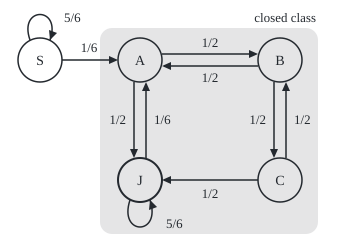
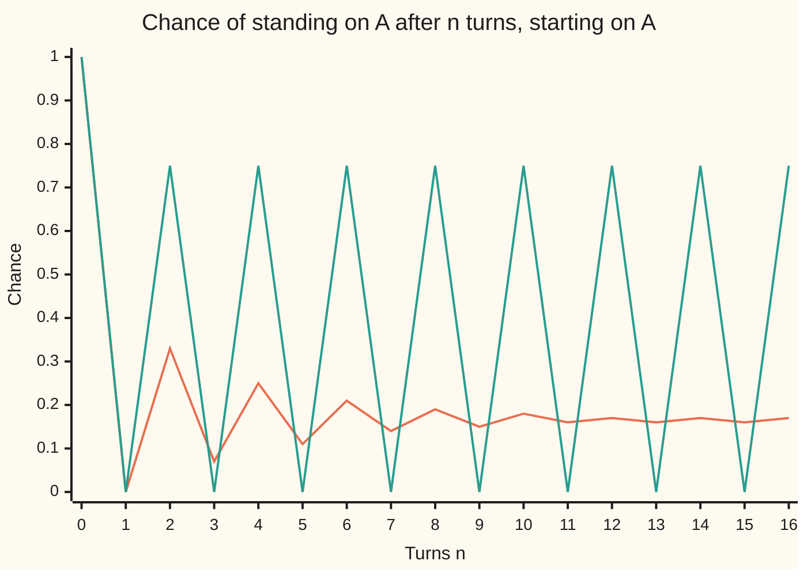

# Classifying states: which states talk to which, which are trapped, and which repeat with a period

[Syllabus](../../../SYLLABUS.md) → [Stochastic processes and calculus](../README.md) → [Markov Chains](../README.md#s03) → Classifying states

---

## General Overview

A board game. A token waits on a start square, S, and enters the board only on a roll of six. The board is a ring of four squares, A, B, C and D. Each turn a coin moves the token one square forward on heads or back on tails. Square D says "go to jail": the token goes to the jail square, J, instead. It leaves jail only on doubles with two dice, one turn in six, and then stands on A.

Three questions need only a look at where the token can go. Which squares can it travel between in both directions? Can it ever get off the ring? Does it come back to a square at irregular times, or in a fixed rhythm?

The start square is left for good once the six comes, after 6 turns on average. The ring and the jail form one group the token never leaves: the trap is the whole board, not the jail. Every square in that group is revisited for ever, and the jail's wait breaks what would be a strict every-other-turn rhythm. Release prisoners at once and the rhythm returns; take away the key and the jail becomes the trap.

**Classifying states sorts them into classes that reach each other, marks the classes with no exit, finds each class's rhythm of return, and splits the states into those revisited for ever and those abandoned; in a finite chain the classes with no exit are exactly the ones revisited for ever.**

**What kind of fact this is:** four definitions (communicating, closed, period, recurrent), and three theorems about them proved on this card in Why it works, with the complete argument in a folded Detailed proof.

### The picture: the board as a chain

<p align="center"></p>

Each circle is a square the token can stand on after a turn, and each arrow carries its chance per turn. Square D never appears: a token sent there stands on J. The shaded region is the only set of squares with no arrow leaving it. Positions are chosen for reading; the code prints the centres.

---

## The formula

Notation first, in words. The square after turn n is $X_n$, with time counted in turns. The chance of moving from square i to square j in one turn is $p_{ij}$; the table of them is the transition matrix $P$ ([Markov chains](01-markov-chains.md)), and $(P^n)_{ij}$ is the chance of going from i to j in exactly n turns ([n-step transitions](02-multi-step-transitions.md)). A chance or an average for a token started on i is written $P_i$ or $E_i$. Four definitions follow, each bringing its own notation.

$$i \to j \iff (P^n)_{ij} > 0 \text{ for some } n \ge 0, \qquad i \leftrightarrow j \iff i \to j \text{ and } j \to i.$$

**Read it aloud:** i leads to j when some number of turns, possibly none, gives a positive chance of getting from i to j; i and j communicate when each leads to the other. A largest group of states that all communicate is a **communicating class**; a chain that is one class is **irreducible**.

$$K \text{ is closed} \iff p_{ij} = 0 \text{ whenever } i \text{ is in } K \text{ and } j \text{ is not.}$$

**Read it aloud:** a set of states is closed when no arrow leaves it, so a token inside stays inside for ever. This is the precise meaning of "trapped".

$$d(i) = \gcd\{\, n \ge 1 : (P^n)_{ii} > 0 \,\}.$$

**Read it aloud:** the period of i is the greatest common divisor, the largest whole number dividing them all, of the turn counts in which a return to i is possible. Period 1 is called **aperiodic**; a state with no possible return has no period.

$$f_i = P_i(T_i < \infty), \qquad E_i[N_i] = \sum_{n \ge 0} (P^n)_{ii} = \frac{1}{1 - f_i}.$$

**Read it aloud:** the return chance of i is the chance that a token started there ever comes back; i is **recurrent** when it is 1 and **transient** when it is less. The average number of visits, the start included, is the sum of the chances of standing on i at each turn, and equals one over the chance of never returning: infinite for a recurrent state.

Here $T_i$ is the first turn n ≥ 1 with the token on i, infinite if there is none: a stopping time, recognised when it arrives.

| Symbol | Plain meaning | In our example | Push it up and the answer… |
| --- | --- | --- | --- |
| $X_n$, $n$, $a$, $b$, $r$ | the square after turn n; counts of turns | $X_0 = S$ | — |
| $i$, $j$, $k$, $m$ | states: squares the token can stand on | S, A, B, C, J | — |
| $P$, $p_{ij}$ | the table of one-turn chances; one entry | $p_{SA} = 1/6$ | a positive entry adds an arrow; its size never changes a class |
| $P^n$ | the n-turn chances | $(P^2)_{AA}$ = 0.33 | — |
| $P_i$, $E_i$ | chance and average for a token started on i | started on S, or on A | — |
| $i \to j$, $i \leftrightarrow j$ | leads to; communicate | S → A, not A → S | — |
| $K$ | a set of states; a class | the ring and jail, A, B, C, J | — |
| $d(i)$ | the period of i | 1 on the ring | 2 if the jail releases at once |
| $T_i$, $R_k$ | the first return turn to i; the turn of the k-th return | $T_S = 1$ with chance 5/6 | — |
| $f_i$ | return chance of i | $f_S = 5/6$, $f_A = 1$ | 1 makes i recurrent |
| $N_i$ | visits to i, the start included | 6 on average for S | infinite once $f_i$ = 1 |

The theorems, for a chain with finitely many states: **all states of a class share one period, and are all recurrent or all transient; a class is recurrent exactly when it is closed; and at least one class is closed.**

### When it holds

- **Finitely many states.** On an unbounded board "closed means recurrent" fails: a walk on all the whole numbers tilted one way is one class with no exit, yet returns to its start with chance below 1 ([Gambler's ruin](../01-Random%20Walks%20and%20Filtrations/04-gamblers-ruin.md) computes the chance of never coming back down).
- **The same chances every turn, and nothing remembered but the square.** Monopoly also frees a prisoner who has waited long enough; that rule needs the jail split into one state per turn served, and the bigger chain is classified the same way.
- **Only the arrows count, not their sizes,** for classes, closed sets, periods and, in a finite chain, recurrence. Sizes matter for the return chance of a transient state and for waiting times.
- **Period needs a return.** A state that can never come back has no period, not period 0.

---

## Why it works

### Step 0: the questions are about arrows, not chances

Replace every positive chance by an arrow and forget the numbers. Whether i leads to j, whether a set has an exit, and which return lengths are possible depend only on those arrows. So a classification is read off the drawing. Make doubles far rarer and nothing on this card's classification changes; only the waiting times do. The code checks this experiment under Try changing.

### Step 1: communicating splits the states into classes

A positive entry of $(P^n)_{ij}$ is a route of n arrows from i to j, each with positive chance ([n-step transitions](02-multi-step-transitions.md)). Routes join end to end, so if i leads to j and j to k, then i leads to k. Every state leads to itself in zero turns. So communicating is an equivalence relation (every state to itself, both ways round, and passed along a chain), and such a relation splits the states into classes that do not overlap. They are the strongly connected pieces of the arrow diagram ([Directed graphs](../../04-Combinatorics%20and%20graphs/09-Graphs%20-%20Dots%20and%20Lines/06-directed-graphs-and-topological-order.md)).

On the board, A → B → C → J → A is a round trip, so A, B, C and J communicate. S leads to A, but no arrow points into S except its own loop: S is a class by itself. The chain has two classes and is not irreducible.

### Step 2: a closed class is a trap

Every arrow out of A, B, C and J lands in A, B, C or J. The set is closed: once on the ring, the token never leaves. The class of S is not closed, because the arrow S → A leaves it.

The jail is not a trap. It holds the token five turns in six, but its other arrow leads out to A. Stickiness is the size of an arrow; being trapped is the absence of one.

Taking the key away changes that: the jail's only arrow then points back to itself, the set containing J alone is closed, and A, B and C form a class of their own that is not.

### Step 3: the period is a class property

Returns to A are possible in 2 turns (A → B → A, or A → J → A) and in 3 turns (A → J → J → A). The greatest common divisor of 2 and 3 is 1, so A is aperiodic. The code lists every possible return length at A up to 8 turns: all of 2 to 8.

Now release the prisoner at once. Colour the ring alternately: A and C one colour, B and D the other, J taking D's. Every coin move changes colour, and so does the release from J to A; only waiting in jail kept the colour. A return to A now needs an even number of turns: period 2.



Orange: the jail as described. The chance swings, then settles near 0.17: it reads 0.1667 after both 200 and 201 turns. Green: release at once. The chance alternates between 0 and 0.75 for ever; period 2 is a rhythm that never fades. Both lines are exact matrix powers, not simulations.

Round trips give every state of a class the same period (Detailed proof, part 2). A self-loop, an arrow from a state to itself, is a return of length 1, so a class containing one is aperiodic. The jail's wait is that self-loop.

<details>
<summary>A second road to the period, used by the code</summary>

Fix a state o of the class and give each state its level: the fewest arrows from o to it. For each arrow u → v inside the class take level(u) + 1 − level(v). Summed along any return route these amounts telescope to the route's length, so their greatest common divisor divides every return length. Conversely, going from o to u, across the arrow to v and back to o, and going from o to v and back the same way, are two returns to o whose lengths differ by exactly that amount, so the period divides it. Each number divides the other: they are equal. On the at-once board every amount is even, the colouring above in arithmetic, and the test for a graph with two sides ([Bipartite graphs](../../04-Combinatorics%20and%20graphs/09-Graphs%20-%20Dots%20and%20Lines/05-bipartite-graphs-and-odd-cycles.md)).

</details>

### Step 4: each return starts the game afresh

Every time the token comes back to i, the future looks as it did at the start, because a chain remembers nothing but the square. So each return is followed by another with the same chance $f_i$, whatever came before, and at least k returns happen with chance $f_i^k$. If $f_i$ = 1 the returns never stop. If $f_i$ < 1 the visits are finitely many, $1/(1 - f_i)$ on average.

At S the token is back next turn with chance 5/6, and once on A it can never return, so $f_S = 5/6$ and the average number of turns on S is 1/(1 − 5/6) = 6.

A second count: the token stands on i at turn n with chance $(P^n)_{ii}$, so the sum of these chances is the average number of visits, finite exactly when i is transient. Up to 1000 turns the sum is 6.0000 at S, where it has stopped growing, and 167.6296 at A, where it still gains about 1/6 a turn.

### Step 5: in a finite chain, closed means recurrent

A class with an exit is transient. Follow an arrow out to a state k. If k led back, it would belong to the class; so from k there is no way back, and the token takes that exit with positive chance.

A closed class is recurrent. A token inside never leaves, so it makes infinitely many visits to finitely many states. Some state then has infinitely many visits on average and is recurrent, and round trips carry recurrence to the whole class.

Some class is closed: leave a class by an exit, then the next, and so on. No class comes round twice, since two classes reachable from each other would be one. With finitely many classes the walk ends in a class with no exit.

<details>
<summary>Detailed proof</summary>

**Setting.** A chain on a finite set E with transition matrix $P$. For a fixed state i, let $T_i$ be the first n ≥ 1 with $X_n$ = i, infinite if none, and $N_i$ the number of n ≥ 0 with $X_n$ = i.

**1. Classes.** Reachability is reflexive ($P^0$ is the identity) and transitive, since $(P^{a+b})_{ik} \ge (P^a)_{ij}(P^b)_{jk}$ by the multiplication rule for powers. Communication is also symmetric by definition, so it is an equivalence relation and its classes partition E.

**2. Period.** Let i ↔ j with i ≠ j, and $(P^a)_{ij} > 0$, $(P^b)_{ji} > 0$. For any r with $(P^r)_{jj} > 0$, $(P^{a+r+b})_{ii} \ge (P^a)_{ij}(P^r)_{jj}(P^b)_{ji} > 0$, and also $(P^{a+b})_{ii} > 0$. So d(i) divides a + b and a + r + b, hence r. Thus d(i) divides d(j); by symmetry they are equal.

**3. Visits.** Let $R_k$ be the turn of the k-th return to i, infinite if there are fewer than k; $R_1 = T_i$. The event $\{R_k = n\}$ is decided by $X_0, \dots, X_n$, and on it $X_n$ = i. By the Markov property at the fixed time n, the chain after n is then a fresh copy started at i, independent of the past, and it returns with chance $f_i$. Summing over n, $P_i(R_{k+1} < \infty) = f_i \, P_i(R_k < \infty)$, so $P_i(N_i \ge k + 1) = P_i(R_k < \infty) = f_i^k$. Hence $E_i[N_i] = \sum_{k \ge 0} f_i^k$, which is $1/(1 - f_i)$ if $f_i$ < 1 and infinite if $f_i$ = 1. Also $N_i$ is the sum over n of the indicator of $\{X_n = i\}$, so by monotone convergence $E_i[N_i] = \sum_n (P^n)_{ii}$. So i is recurrent exactly when that sum is infinite.

**4. Recurrence is shared.** With i ↔ j as in part 2, $(P^{b+n+a})_{jj} \ge (P^b)_{ji}(P^n)_{ii}(P^a)_{ij}$. Summing over n, if the sum for i is infinite, so is the sum for j.

**5. An open class is transient.** Let the class K contain m with $p_{mk} > 0$ and k outside K. If k led to any state of K it would lead to m, and then k ↔ m would put k in K; so from k no state of K can be reached. For i in K take a shortest route of positive arrows from i to m; being shortest, it visits i only at its start. With positive chance a token from i follows that route and then steps to k, without returning to i on the way, and afterwards it never returns. So $1 - f_i > 0$.

**6. A closed class is recurrent.** Let K be closed and finite, i in K. The row sums over K of every power are 1, so the double sum $\sum_{j \in K} \sum_n (P^n)_{ij}$ is infinite and some j in K has $\sum_n (P^n)_{ij}$ infinite. That sum is the average number of visits to j from i, which is the chance of ever reaching j times $E_j[N_j]$, so $E_j[N_j]$ is infinite: j is recurrent by part 3, and every state of K by part 4.

**7. A closed class exists.** Draw an arrow from class to class wherever a transition joins them. These arrows form no cycle, since classes on a cycle would communicate and be one class. A finite diagram with no cycle has a class with no arrow leaving it: that class is closed.

</details>

---

## Worked numbers, by hand

The board as described, then the jail with no key.

| Step | Arithmetic | Value |
| --- | --- | --- |
| arrows into S | only its own loop, 5/6 | nothing else leads to S |
| class of S | S → A, but not A → S | S alone, **open** |
| round trip on the ring | A → B → C → J → A | A, B, C, J communicate |
| exits from A, B, C, J | every arrow lands in A, B, C or J | **closed** |
| returns to A | A → B → A is 2 turns; A → J → J → A is 3 | period gcd(2, 3) = **1** |
| return chance at S | stays with 5/6; from A no way back | **5/6** |
| average turns on S | 1 / (1 − 5/6) | **6** |
| no key: reach A from C | 1/2 to B, then as from B; 1/2 to J, never | half the chance from B |
| no key: reach A from B | 1/2 at once, plus 1/2 × (half the chance from B) | 2/3 from B, 1/3 from C |
| no key: return to A | 1/2 × 2/3 + 1/2 × 0 | **1/3**, 1.5 visits on average |

On the real board the start square is a waiting room left after 6 turns on average, and every other square is revisited for ever. Without a key, a token started on A stands there 1.5 times on average, then ends in jail and stays.

### What breaks if you drop a piece

| Mistake | Comes out at | What went wrong |
| --- | --- | --- |
| Jail releases at once (the wait dropped) | period 2; chance of standing on A after 200 turns 0.7500, after 201 turns 0.0000 | The self-loop was the only move that kept a square's colour; without it the chain never settles |
| Jail with no key | ring squares transient: $f_A = 1/3$, $f_B = 1/2$; J alone closed | The trap moved from the board into the jail |
| Sticky read as trapped | S holds the token 5/6 a turn, like the jail, yet $f_S = 5/6$ and 6 turns in all | Trapped means no exit, whatever the chance of staying |
| Period read off one return | A → B → A takes 2 turns, so "period 2"; true period 1 | A 3-turn return exists; the period is the gcd of all of them |

The code prints each row.

---

## Code, from first principles, and it actually runs

The code classifies the board under three jail rules: doubles, release at once, and no key. Classes come from powers of the arrow table and, separately, from a depth-first search along the arrows. Periods come from the return lengths up to 30 turns and, separately, from the levels of the tip in Step 3. Return chances come three ways: first-step equations solved exactly in fractions, the visit sum up to 1000 turns, and a seeded SplitMix64 simulation printed with standard errors. The asserts compare powers with search, lengths with levels, simulation with the exact chance within 4 standard errors, and each transient state's visit sum with 1/(1 − f); for a recurrent state they check that the sum is still growing. A last assert checks the theorem of Step 5: a state is recurrent exactly when its class is closed. Python uses Fraction for exact arithmetic; Rust writes its own small fraction type.

### Python

```python
# Classifying states -- the check behind the card.  A token needs a six to leave S
# for a ring A, B, C, D; a coin moves it one square either way; D sends it to jail J.
# Fraction is exact arithmetic and knows nothing about chains.
from fractions import Fraction as F
N, S6, H2 = "SABCJ", F(1, 6), F(1, 2)
RULES = {"doubles": [F(1, 6), F(5, 6)], "at once": [F(1), F(0)], "no key": [F(0), F(1)]}
MASK, SEED, RUNS, HORIZON = (1 << 64) - 1, 20260929, 20000, 5000

def chain(rule):                         # rows S, A, B, C, J; the rule sets jail to A, J
    (a, j), z = RULES[rule], F(0)
    return [[1 - S6, S6, z, z, z], [z, z, H2, z, H2], [z, H2, z, H2, z], [z, z, H2, z, H2], [z, a, z, z, j]]

def boolmul(x, y):
    return [[any(x[i][k] and y[k][j] for k in range(5)) for j in range(5)] for i in range(5)]

def reach_powers(p):                     # road one: I or P or ... or P^4
    arrow = [[x > 0 for x in row] for row in p]
    pk = r = [[i == j for j in range(5)] for i in range(5)]
    for _ in range(4):
        pk = boolmul(pk, arrow)
        r = [[r[i][j] or pk[i][j] for j in range(5)] for i in range(5)]
    return r
def reach_search(p):                     # road two: follow arrows, depth first
    out = []
    for i in range(5):
        seen, stack = {i}, [i]
        while stack:
            u = stack.pop()
            for v in range(5):
                if p[u][v] > 0 and v not in seen:
                    seen.add(v); stack.append(v)
        out.append([j in seen for j in range(5)])
    return out

def classes(r):
    cs = []
    for i in range(5):
        c = tuple(j for j in range(5) if r[i][j] and r[j][i])
        if c not in cs: cs.append(c)
    return cs
def gcd(a, b):                           # Euclid
    return gcd(b, a % b) if b else a
def return_lengths(p, i, most):          # every n <= most with P^n(i,i) > 0
    arrow = [[x > 0 for x in row] for row in p]
    pk, out = arrow, []
    for n in range(1, most + 1):
        if pk[i][i]: out.append(n)
        pk = boolmul(pk, arrow)
    return out
def period_levels(p, c):                 # gcd of level jumps along arrows in class c
    lvl, queue = {c[0]: 0}, [c[0]]
    for u in queue:
        for v in c:
            if p[u][v] > 0 and v not in lvl:
                lvl[v] = lvl[u] + 1; queue.append(v)
    g = 0
    for u in c:
        for v in c:
            if p[u][v] > 0: g = gcd(g, abs(lvl[u] + 1 - lvl[v]))
    return g

def return_chance(p, i, reach):          # exact first-step equations for f_i
    ks = [k for k in range(5) if k != i and reach[k][i]]
    m = [[F(a == b) - p[a][b] for b in ks] + [p[a][i]] for a in ks]
    for c in range(len(ks)):             # Gauss-Jordan elimination in fractions
        piv = next(r for r in range(c, len(ks)) if m[r][c] != 0)
        m[c], m[piv] = m[piv], m[c]
        m[c] = [x / m[c][c] for x in m[c]]
        for r in range(len(ks)):
            if r != c: m[r] = [x - m[r][c] * y for x, y in zip(m[r], m[c])]
    h = [m[ks.index(k)][-1] if k in ks else F(0) for k in range(5)]
    return p[i][i] + sum(p[i][k] * h[k] for k in range(5) if k != i), h

def powers_row(p, i, n):                 # row i of P^0 .. P^n, floats
    row, rows = [1.0 if j == i else 0.0 for j in range(5)], []
    for _ in range(n + 1):
        rows.append(row)
        row = [sum(row[k] * float(p[k][j]) for k in range(5)) for j in range(5)]
    return rows

def uniform(s):                          # SplitMix64, the wing's generator
    s = (s + 0x9E3779B97F4A7C15) & MASK
    z = ((s ^ (s >> 30)) * 0xBF58476D1CE4E5B9) & MASK
    z = ((z ^ (z >> 27)) * 0x94D049BB133111EB) & MASK
    return s, ((z ^ (z >> 31)) >> 11) / 9007199254740992.0

def simulate(p, i, reach):               # share of runs back at i within HORIZON turns
    s, back = SEED + i, 0
    for _ in range(RUNS):
        x = i
        for _ in range(HORIZON):         # a run ends early where no arrows lead back
            if not reach[x][i]: break
            s, u = uniform(s)
            acc, y = 0.0, 4
            for j in range(5):
                acc += float(p[x][j])
                if u < acc: y = j; break
            x = y
            if x == i: back += 1; break
    f = back / RUNS
    return f, (f * (1 - f) / RUNS) ** 0.5

print(f"simulation: SplitMix64 seed {SEED}, {RUNS} runs per state, at most {HORIZON} turns a run, "
      "asserts within 4 standard errors; periods from return lengths up to 30 turns")
for rule in RULES:
    p = chain(rule)
    rp, rs = reach_powers(p), reach_search(p)
    assert rp == rs                                              # powers agree with search
    print(f"jail rule '{rule}': classes " + " ".join("{" + ",".join(N[k] for k in c) + "}" for c in classes(rp)))
    shut = {}                                                    # state -> is its class closed?
    for c in classes(rp):
        closed = all(p[i][j] == 0 for i in c for j in range(5) if j not in c)
        d = period_levels(p, c)
        for i in c:
            g = 0
            for n in return_lengths(p, i, 30): g = gcd(g, n)
            assert g == d                                        # return lengths agree with levels
            shut[i] = closed
        print(f"  class {''.join(N[k] for k in c)}: {'closed' if closed else 'open'}, period {d if d else 'none'}")
    for i in range(5):
        f, h = return_chance(p, i, rp)
        rows = powers_row(p, i, 1000)
        v, v500 = sum(r[i] for r in rows), sum(r[i] for r in rows[:501])
        fs, se = simulate(p, i, rp)
        assert abs(fs - float(f)) <= 4 * se + 1e-12              # simulation within 4 standard errors
        assert (f == 1) == shut[i]                               # recurrent exactly when the class is closed
        if f < 1: assert abs(v - 1 / (1 - float(f))) < 1e-9       # visits = 1/(1 - f) when f < 1
        else: assert v > 1.5 * v500                              # visits keep growing when f = 1
        print(f"  {N[i]}: f = {str(f):>3} = {float(f):.4f}, simulated {fs:.4f} +- {se:.4f}, visits to n=1000 {v:9.4f}, "
              + ("recurrent" if f == 1 else "transient"))
        if rule == "no key" and i == 1:
            hs = ", ".join(f"{N[k]} {h[k]}" for k in range(5) if k != i)
            print(f"  worked, 'no key': chance of reaching A from {hs}; f_A = 1/2 x {h[2]} + 1/2 x {h[4]} = {f}")
for rule in ("doubles", "at once"):
    rows = powers_row(chain(rule), 1, 201)
    print(f"figure, P^n(A,A), n = 0..16, '{rule}': " + ", ".join(f"{r[1]:.2f}" for r in rows[:17]))
    print(f"limit, '{rule}': P^200 from A: " + " ".join(f"{N[j]} {rows[200][j]:.4f}" for j in range(5)) + f"; P^201(A,A) = {rows[201][1]:.4f}")
    print(f"return lengths at A up to 8 turns, '{rule}': {', '.join(map(str, return_lengths(chain(rule), 1, 8)))}")
print("figure, node centres: S (40,60) A (140,60) B (280,60) C (280,180) J (140,180), radius 22")
print("ALL CHECKS PASS")
```

**Ran 2026-09-30 on macOS, Python 3.14.6, standard library only. All checks passed. Output, pasted from the run:**

```
simulation: SplitMix64 seed 20260929, 20000 runs per state, at most 5000 turns a run, asserts within 4 standard errors; periods from return lengths up to 30 turns
jail rule 'doubles': classes {S} {A,B,C,J}
  class S: open, period 1
  class ABCJ: closed, period 1
  S: f = 5/6 = 0.8333, simulated 0.8323 +- 0.0026, visits to n=1000    6.0000, transient
  A: f =   1 = 1.0000, simulated 1.0000 +- 0.0000, visits to n=1000  167.6296, recurrent
  B: f =   1 = 1.0000, simulated 1.0000 +- 0.0000, visits to n=1000  112.4568, recurrent
  C: f =   1 = 1.0000, simulated 1.0000 +- 0.0000, visits to n=1000   56.7284, recurrent
  J: f =   1 = 1.0000, simulated 1.0000 +- 0.0000, visits to n=1000  668.0741, recurrent
jail rule 'at once': classes {S} {A,B,C,J}
  class S: open, period 1
  class ABCJ: closed, period 2
  S: f = 5/6 = 0.8333, simulated 0.8323 +- 0.0026, visits to n=1000    6.0000, transient
  A: f =   1 = 1.0000, simulated 1.0000 +- 0.0000, visits to n=1000  376.0000, recurrent
  B: f =   1 = 1.0000, simulated 1.0000 +- 0.0000, visits to n=1000  251.0000, recurrent
  C: f =   1 = 1.0000, simulated 1.0000 +- 0.0000, visits to n=1000  126.0000, recurrent
  J: f =   1 = 1.0000, simulated 1.0000 +- 0.0000, visits to n=1000  251.0000, recurrent
jail rule 'no key': classes {S} {A,B,C} {J}
  class S: open, period 1
  class ABC: open, period 2
  class J: closed, period 1
  S: f = 5/6 = 0.8333, simulated 0.8323 +- 0.0026, visits to n=1000    6.0000, transient
  A: f = 1/3 = 0.3333, simulated 0.3346 +- 0.0033, visits to n=1000    1.5000, transient
  worked, 'no key': chance of reaching A from S 1, B 2/3, C 1/3, J 0; f_A = 1/2 x 2/3 + 1/2 x 0 = 1/3
  B: f = 1/2 = 0.5000, simulated 0.5060 +- 0.0035, visits to n=1000    2.0000, transient
  C: f = 1/3 = 0.3333, simulated 0.3386 +- 0.0033, visits to n=1000    1.5000, transient
  J: f =   1 = 1.0000, simulated 1.0000 +- 0.0000, visits to n=1000 1001.0000, recurrent
figure, P^n(A,A), n = 0..16, 'doubles': 1.00, 0.00, 0.33, 0.07, 0.25, 0.11, 0.21, 0.14, 0.19, 0.15, 0.18, 0.16, 0.17, 0.16, 0.17, 0.16, 0.17
limit, 'doubles': P^200 from A: S 0.0000 A 0.1667 B 0.1111 C 0.0556 J 0.6667; P^201(A,A) = 0.1667
return lengths at A up to 8 turns, 'doubles': 2, 3, 4, 5, 6, 7, 8
figure, P^n(A,A), n = 0..16, 'at once': 1.00, 0.00, 0.75, 0.00, 0.75, 0.00, 0.75, 0.00, 0.75, 0.00, 0.75, 0.00, 0.75, 0.00, 0.75, 0.00, 0.75
limit, 'at once': P^200 from A: S 0.0000 A 0.7500 B 0.0000 C 0.2500 J 0.0000; P^201(A,A) = 0.0000
return lengths at A up to 8 turns, 'at once': 2, 4, 6, 8
figure, node centres: S (40,60) A (140,60) B (280,60) C (280,180) J (140,180), radius 22
ALL CHECKS PASS
```

### Rust

Same numbers, same labels, built with `rustc --edition 2021 -O`.

```rust
// Classifying states -- the same check as the Python, in Rust.  No crates.  A token
// needs a six to leave S for a ring A, B, C, D; a coin moves it one square either
// way; D sends it to jail J.  Q is a small exact fraction type, written out here.
const N: [&str; 5] = ["S", "A", "B", "C", "J"];
const SEED: u64 = 20260929; const RUNS: usize = 20000; const HORIZON: usize = 5000;
#[derive(Clone, Copy, PartialEq)]
struct Q { n: i64, d: i64 }
fn gcd(a: i64, b: i64) -> i64 { if b == 0 { a.abs() } else { gcd(b, a % b) } }  // Euclid
fn q(n: i64, d: i64) -> Q { let g = gcd(n, d).max(1) * d.signum(); Q { n: n / g, d: d / g } }
fn add(a: Q, b: Q) -> Q { q(a.n * b.d + b.n * a.d, a.d * b.d) }
fn sub(a: Q, b: Q) -> Q { q(a.n * b.d - b.n * a.d, a.d * b.d) }
fn mul(a: Q, b: Q) -> Q { q(a.n * b.n, a.d * b.d) }
fn div(a: Q, b: Q) -> Q { q(a.n * b.d, a.d * b.n) }
fn fl(a: Q) -> f64 { a.n as f64 / a.d as f64 }
fn show(a: Q) -> String { if a.d == 1 { format!("{}", a.n) } else { format!("{}/{}", a.n, a.d) } }
type M = Vec<Vec<Q>>; type B = Vec<Vec<bool>>;
fn chain(rule: usize) -> M {                     // rows S, A, B, C, J; the rule sets jail to A, J
    let ((a, j), z, h) = ([(q(1, 6), q(5, 6)), (q(1, 1), q(0, 1)), (q(0, 1), q(1, 1))][rule], q(0, 1), q(1, 2));
    vec![vec![q(5, 6), q(1, 6), z, z, z], vec![z, z, h, z, h], vec![z, h, z, h, z],
         vec![z, z, h, z, h], vec![z, a, z, z, j]]
}
fn arrows(p: &M) -> B { p.iter().map(|r| r.iter().map(|x| x.n > 0).collect()).collect() }
fn boolmul(x: &B, y: &B) -> B { (0..5).map(|i| (0..5).map(|j| (0..5).any(|k| x[i][k] && y[k][j])).collect()).collect() }
fn reach_powers(p: &M) -> B {                    // road one: I or P or ... or P^4
    let a = arrows(p);
    let mut pk: B = (0..5).map(|i| (0..5).map(|j| i == j).collect()).collect();
    let mut r = pk.clone();
    for _ in 0..4 { pk = boolmul(&pk, &a); for i in 0..5 { for j in 0..5 { r[i][j] |= pk[i][j]; } } }
    r
}
fn reach_search(p: &M) -> B {                    // road two: follow arrows, depth first
    (0..5).map(|i| {
        let (mut seen, mut stack): (Vec<bool>, _) = ((0..5).map(|j| j == i).collect(), vec![i]);
        while let Some(u) = stack.pop() {
            for v in 0..5 { if p[u][v].n > 0 && !seen[v] { seen[v] = true; stack.push(v); } }
        }
        seen
    }).collect()
}

fn classes(r: &B) -> Vec<Vec<usize>> {
    let mut cs: Vec<Vec<usize>> = Vec::new();
    for i in 0..5 { let c: Vec<usize> = (0..5).filter(|&j| r[i][j] && r[j][i]).collect(); if !cs.contains(&c) { cs.push(c); } }
    cs
}
fn return_lengths(p: &M, i: usize, most: usize) -> Vec<usize> {  // every n <= most with P^n(i,i) > 0
    let (a, mut out) = (arrows(p), Vec::new());
    let mut pk = a.clone();
    for n in 1..=most { if pk[i][i] { out.push(n); } pk = boolmul(&pk, &a); }
    out
}
fn period_levels(p: &M, c: &[usize]) -> i64 {    // gcd of level jumps along arrows in class c
    let (mut lvl, mut queue, mut k) = ([-1i64; 5], vec![c[0]], 0);
    lvl[c[0]] = 0;
    while k < queue.len() {
        let u = queue[k]; k += 1;
        for &v in c { if p[u][v].n > 0 && lvl[v] < 0 { lvl[v] = lvl[u] + 1; queue.push(v); } }
    }
    let mut g = 0;
    for &u in c { for &v in c { if p[u][v].n > 0 { g = gcd(g, (lvl[u] + 1 - lvl[v]).abs()); } } }
    g
}

fn return_chance(p: &M, i: usize, reach: &B) -> (Q, Vec<Q>) {  // exact first-step equations for f_i
    let ks: Vec<usize> = (0..5).filter(|&k| k != i && reach[k][i]).collect();
    let n = ks.len();
    let mut m: M = ks.iter().map(|&a| {
        let mut row: Vec<Q> = ks.iter().map(|&b| sub(q((a == b) as i64, 1), p[a][b])).collect();
        row.push(p[a][i]); row
    }).collect();
    for c in 0..n {                              // Gauss-Jordan elimination in fractions
        let piv = (c..n).find(|&r| m[r][c].n != 0).unwrap();
        m.swap(c, piv);
        let lead = m[c][c];
        m[c] = m[c].iter().map(|&x| div(x, lead)).collect();
        for r in (0..n).filter(|&r| r != c) { let f = m[r][c]; m[r] = (0..=n).map(|t| sub(m[r][t], mul(f, m[c][t]))).collect(); }
    }
    let h: Vec<Q> = (0..5).map(|k| match ks.iter().position(|&x| x == k) { Some(r) => m[r][n], None => q(0, 1) }).collect();
    let f = (0..5).filter(|&k| k != i).fold(p[i][i], |acc, k| add(acc, mul(p[i][k], h[k])));
    (f, h)
}

fn powers_row(p: &M, i: usize, n: usize) -> Vec<Vec<f64>> {  // row i of P^0 .. P^n, floats
    let (mut row, mut rows): (Vec<f64>, Vec<Vec<f64>>) = ((0..5).map(|j| if j == i { 1.0 } else { 0.0 }).collect(), Vec::new());
    for _ in 0..=n {
        rows.push(row.clone());
        row = (0..5).map(|j| (0..5).fold(0.0, |s, k| s + row[k] * fl(p[k][j]))).collect();
    }
    rows
}

fn uniform(s: &mut u64) -> f64 {                 // SplitMix64, the wing's generator
    *s = s.wrapping_add(0x9E3779B97F4A7C15);
    let mut z = (*s ^ (*s >> 30)).wrapping_mul(0xBF58476D1CE4E5B9);
    z = (z ^ (z >> 27)).wrapping_mul(0x94D049BB133111EB);
    ((z ^ (z >> 31)) >> 11) as f64 / 9007199254740992.0
}

fn simulate(p: &M, i: usize, reach: &B) -> (f64, f64) {  // share of runs back at i within HORIZON turns
    let (mut s, mut back) = (SEED + i as u64, 0);
    for _ in 0..RUNS {
        let mut x = i;
        for _ in 0..HORIZON {                    // a run ends early where no arrows lead back
            if !reach[x][i] { break; }
            let u = uniform(&mut s);
            let (mut acc, mut y) = (0.0, 4);
            for j in 0..5 { acc += fl(p[x][j]); if u < acc { y = j; break; } }
            x = y;
            if x == i { back += 1; break; }
        }
    }
    let f = back as f64 / RUNS as f64;
    (f, (f * (1.0 - f) / RUNS as f64).sqrt())
}

fn main() {
    let names = ["doubles", "at once", "no key"];
    println!("simulation: SplitMix64 seed {}, {} runs per state, at most {} turns a run, \
              asserts within 4 standard errors; periods from return lengths up to 30 turns", SEED, RUNS, HORIZON);
    for rule in 0..3 {
        let p = chain(rule);
        let rp = reach_powers(&p);
        assert!(rp == reach_search(&p));                             // powers agree with search
        let cs = classes(&rp);
        let label = |c: &Vec<usize>| c.iter().map(|&k| N[k]).collect::<Vec<_>>();
        println!("jail rule '{}': classes {}", names[rule],
                 cs.iter().map(|c| format!("{{{}}}", label(c).join(","))).collect::<Vec<_>>().join(" "));
        let mut shut = [false; 5];                                   // state -> is its class closed?
        for c in &cs {
            let closed = c.iter().all(|&i| (0..5).all(|j| c.contains(&j) || p[i][j].n == 0));
            let d = period_levels(&p, c);
            for &i in c {
                let g = return_lengths(&p, i, 30).iter().fold(0, |g, &n| gcd(g, n as i64));
                assert!(g == d);                                     // return lengths agree with levels
                shut[i] = closed;
            }
            let ds = if d > 0 { d.to_string() } else { "none".to_string() };
            println!("  class {}: {}, period {}", label(c).concat(), if closed { "closed" } else { "open" }, ds);
        }
        for i in 0..5 {
            let (f, h) = return_chance(&p, i, &rp);
            let rows = powers_row(&p, i, 1000);
            let v: f64 = rows.iter().fold(0.0, |s, r| s + r[i]);
            let v500: f64 = rows[..501].iter().fold(0.0, |s, r| s + r[i]);
            let (fs, se) = simulate(&p, i, &rp);
            assert!((fs - fl(f)).abs() <= 4.0 * se + 1e-12);         // simulation within 4 standard errors
            assert!((f.n == f.d) == shut[i]);                        // recurrent exactly when the class is closed
            if f.n < f.d { assert!((v - 1.0 / (1.0 - fl(f))).abs() < 1e-9); }  // visits = 1/(1 - f)
            else { assert!(v > 1.5 * v500); }                        // visits keep growing when f = 1
            println!("  {}: f = {:>3} = {:.4}, simulated {:.4} +- {:.4}, visits to n=1000 {:9.4}, {}", N[i], show(f),
                     fl(f), fs, se, v, if f.n == f.d { "recurrent" } else { "transient" });
            if rule == 2 && i == 1 {
                let hs: Vec<String> = (0..5).filter(|&k| k != i).map(|k| format!("{} {}", N[k], show(h[k]))).collect();
                println!("  worked, 'no key': chance of reaching A from {}; f_A = 1/2 x {} + 1/2 x {} = {}",
                         hs.join(", "), show(h[2]), show(h[4]), show(f));
            }
        }
    }
    for rule in 0..2 {
        let rows = powers_row(&chain(rule), 1, 201);
        let pts: Vec<String> = rows[..17].iter().map(|r| format!("{:.2}", r[1])).collect();
        println!("figure, P^n(A,A), n = 0..16, '{}': {}", names[rule], pts.join(", "));
        let lim: Vec<String> = (0..5).map(|j| format!("{} {:.4}", N[j], rows[200][j])).collect();
        println!("limit, '{}': P^200 from A: {}; P^201(A,A) = {:.4}", names[rule], lim.join(" "), rows[201][1]);
        let ls: Vec<String> = return_lengths(&chain(rule), 1, 8).iter().map(|n| n.to_string()).collect();
        println!("return lengths at A up to 8 turns, '{}': {}", names[rule], ls.join(", "));
    }
    println!("figure, node centres: S (40,60) A (140,60) B (280,60) C (280,180) J (140,180), radius 22");
    println!("ALL CHECKS PASS");
}
```

**Ran 2026-09-30 on macOS, rustc 1.98.1, no crates. All checks passed. Output, pasted from the run:**

```
simulation: SplitMix64 seed 20260929, 20000 runs per state, at most 5000 turns a run, asserts within 4 standard errors; periods from return lengths up to 30 turns
jail rule 'doubles': classes {S} {A,B,C,J}
  class S: open, period 1
  class ABCJ: closed, period 1
  S: f = 5/6 = 0.8333, simulated 0.8323 +- 0.0026, visits to n=1000    6.0000, transient
  A: f =   1 = 1.0000, simulated 1.0000 +- 0.0000, visits to n=1000  167.6296, recurrent
  B: f =   1 = 1.0000, simulated 1.0000 +- 0.0000, visits to n=1000  112.4568, recurrent
  C: f =   1 = 1.0000, simulated 1.0000 +- 0.0000, visits to n=1000   56.7284, recurrent
  J: f =   1 = 1.0000, simulated 1.0000 +- 0.0000, visits to n=1000  668.0741, recurrent
jail rule 'at once': classes {S} {A,B,C,J}
  class S: open, period 1
  class ABCJ: closed, period 2
  S: f = 5/6 = 0.8333, simulated 0.8323 +- 0.0026, visits to n=1000    6.0000, transient
  A: f =   1 = 1.0000, simulated 1.0000 +- 0.0000, visits to n=1000  376.0000, recurrent
  B: f =   1 = 1.0000, simulated 1.0000 +- 0.0000, visits to n=1000  251.0000, recurrent
  C: f =   1 = 1.0000, simulated 1.0000 +- 0.0000, visits to n=1000  126.0000, recurrent
  J: f =   1 = 1.0000, simulated 1.0000 +- 0.0000, visits to n=1000  251.0000, recurrent
jail rule 'no key': classes {S} {A,B,C} {J}
  class S: open, period 1
  class ABC: open, period 2
  class J: closed, period 1
  S: f = 5/6 = 0.8333, simulated 0.8323 +- 0.0026, visits to n=1000    6.0000, transient
  A: f = 1/3 = 0.3333, simulated 0.3346 +- 0.0033, visits to n=1000    1.5000, transient
  worked, 'no key': chance of reaching A from S 1, B 2/3, C 1/3, J 0; f_A = 1/2 x 2/3 + 1/2 x 0 = 1/3
  B: f = 1/2 = 0.5000, simulated 0.5060 +- 0.0035, visits to n=1000    2.0000, transient
  C: f = 1/3 = 0.3333, simulated 0.3386 +- 0.0033, visits to n=1000    1.5000, transient
  J: f =   1 = 1.0000, simulated 1.0000 +- 0.0000, visits to n=1000 1001.0000, recurrent
figure, P^n(A,A), n = 0..16, 'doubles': 1.00, 0.00, 0.33, 0.07, 0.25, 0.11, 0.21, 0.14, 0.19, 0.15, 0.18, 0.16, 0.17, 0.16, 0.17, 0.16, 0.17
limit, 'doubles': P^200 from A: S 0.0000 A 0.1667 B 0.1111 C 0.0556 J 0.6667; P^201(A,A) = 0.1667
return lengths at A up to 8 turns, 'doubles': 2, 3, 4, 5, 6, 7, 8
figure, P^n(A,A), n = 0..16, 'at once': 1.00, 0.00, 0.75, 0.00, 0.75, 0.00, 0.75, 0.00, 0.75, 0.00, 0.75, 0.00, 0.75, 0.00, 0.75, 0.00, 0.75
limit, 'at once': P^200 from A: S 0.0000 A 0.7500 B 0.0000 C 0.2500 J 0.0000; P^201(A,A) = 0.0000
return lengths at A up to 8 turns, 'at once': 2, 4, 6, 8
figure, node centres: S (40,60) A (140,60) B (280,60) C (280,180) J (140,180), radius 22
ALL CHECKS PASS
```

Every recurrent state's simulated return share is 1.0000 with standard error 0.0000: all 20000 runs came back within 5000 turns. That is a sample, not a proof; the proof is Step 5.

> [!TIP]
> **Try changing**
> Guess first, then run it.
> - **A rarer key.** In `RULES`, set the doubles rule to `[F(1, 100), F(99, 100)]`. What happens to the classification? Nothing: same classes, same periods, the ring still recurrent. Only the numbers move: A's visit sum falls well below 167.6296, and J's climbs toward 1000.
> - **No wait at the start.** Make the first row of `chain` `[z, F(1), z, z, z]`. S then has no return at all: period none, $f_S = 0$, one visit.
> - **Drop the stay from the return chance.** In `return_chance`, delete `p[i][i] +`. The start square's exact chance becomes 0 while the simulation still returns 0.8323 of the time, and the simulation assert stops the run.
> - **Search every square.** In `reach_search`, drop the test `p[u][v] > 0`. Every square then leads everywhere, and the first assert stops the run.

---

## The usual mistake

> [!warning]
> **Calling the jail the trap.** The jail holds the token five turns in six, but it is not closed: its other arrow leads to A. The closed class is the ring and the jail together. The token stands in jail on about two turns in three because the ring keeps sending it back, not because it cannot leave. Only without a key is the jail alone closed, and then A, B and C are transient.
>
> - **Stickiness for recurrence.** S and J both keep the token 5/6 of the time. S is transient, with 6 turns in all; J is recurrent. Where the exit leads decides it.
> - **"Transient" read as "rare".** Without a key, B is revisited with chance 1/2, visited twice on average counting the start, then never again. Transient means finitely many visits.
> - **Period 2 read as "back every 2 turns".** With release at once, A is never revisited after an odd number of turns, but a return may take 2, 4, 6 or more. The period restricts when a return can happen, not how soon.

---

## Where you meet it in real life

- **Board games.** A full Monopoly board is a chain of this kind, with the jail split by turns served. It has one closed class, so long-run landing frequencies are well defined; that class is also aperiodic, so the chance of standing on a square at turn n settles to that frequency.
- **Credit ratings.** Migration tables move a firm between grades each year. Default is a closed state that every grade can reach, so in that model every other grade is transient, however rarely a top-rated firm defaults.
- **Web search ranking.** The PageRank random surfer follows links; dead ends and link cycles make the chain reducible or periodic. A small chance of jumping to a random page each step makes it irreducible and aperiodic ([Convergence to equilibrium](05-convergence-to-equilibrium.md)).
- **Sampling by simulation.** A Markov chain Monte Carlo sampler must be irreducible, or whole regions go unvisited, and is usually made aperiodic so the law of its current state settles ([MCMC](07-markov-chain-monte-carlo.md)).
- **Population genetics.** When a gene variant can die out or take over, those two outcomes are closed states and every mixed state is transient ([Absorption](06-absorption-and-first-step-analysis.md)).

> **Say it back**
> Draw the chain as arrows and forget the chances. States that can each reach the other form a class, and the classes split the states. A class with no arrow out is closed, a trap; in a finite chain the closed classes are exactly the recurrent ones, revisited for ever, and every other state is transient, visited 1/(1 − f) times on average and then never. The period is the greatest common divisor of the possible return lengths, shared by a whole class, and a single self-loop makes it 1. On the board, the start square is transient, the ring and jail are one closed aperiodic class, and the jail is sticky, not a trap.

---

## What this builds on

- [n-step transitions](02-multi-step-transitions.md): a positive entry of a matrix power is a route of positive arrows.
- [Directed graphs](../../04-Combinatorics%20and%20graphs/09-Graphs%20-%20Dots%20and%20Lines/06-directed-graphs-and-topological-order.md): mutual reachability and strongly connected pieces, the communicating classes seen as a graph.

## Where this goes next

- [Stationary distributions](04-stationary-distributions.md): the long-run share of turns on each square of a closed class, such as the 0.6667 in jail.
- [Absorption](06-absorption-and-first-step-analysis.md): which closed class a token ends in, and how long it takes, from first-step equations like the ones behind $f_A = 1/3$.

The next question, how often a recurrent state is visited in the long run, has a number for an answer: after 200 turns the token stands in jail with chance 0.6667. That number, and why it exists, is [Stationary distributions](04-stationary-distributions.md).

---

## Sources

Verified 2026-09-30: every link below opens a page naming the cited work.

- Norris, J. R. *Markov Chains*. Cambridge University Press, 1997. [Publisher page](https://www.cambridge.org/core/books/markov-chains/A3F966B10633A32C8F06F37158031739). Class structure, recurrence and transience with the visit-count criterion, and periodicity, proved for countable chains.
- Levin, David A., and Yuval Peres, with contributions by Elizabeth L. Wilmer. *Markov Chains and Mixing Times*, 2nd ed. American Mathematical Society, 2017. [Authors' page](https://pages.uoregon.edu/dlevin/MARKOV/). Chapter 1: irreducibility and aperiodicity, with the period as a greatest common divisor of return times.
- Grinstead, Charles M., and J. Laurie Snell. *Introduction to Probability*, 2nd revised ed. American Mathematical Society, 1997. [Full text](https://math.dartmouth.edu/~prob/prob/prob.pdf). Chapter 11: absorbing and ergodic chains at the level of this card.
- Feller, William. *An Introduction to Probability Theory and Its Applications*, Volume 1, 3rd ed. Wiley, 1968. [Publisher page](https://www.wiley.com/en-us/An+Introduction+to+Probability+Theory+and+Its+Applications%2C+Volume+1%2C+3rd+Edition-p-9780471257080). Chapter XV: closed sets, persistent (recurrent) and transient states, and periods.
