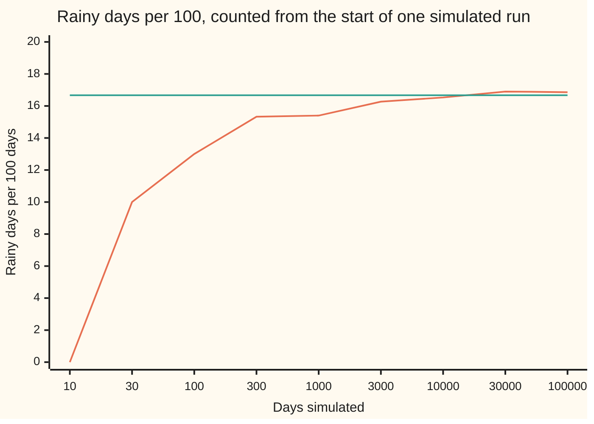
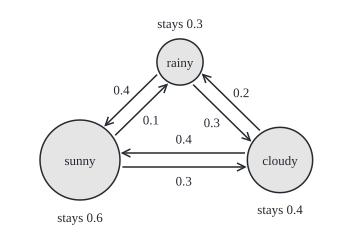
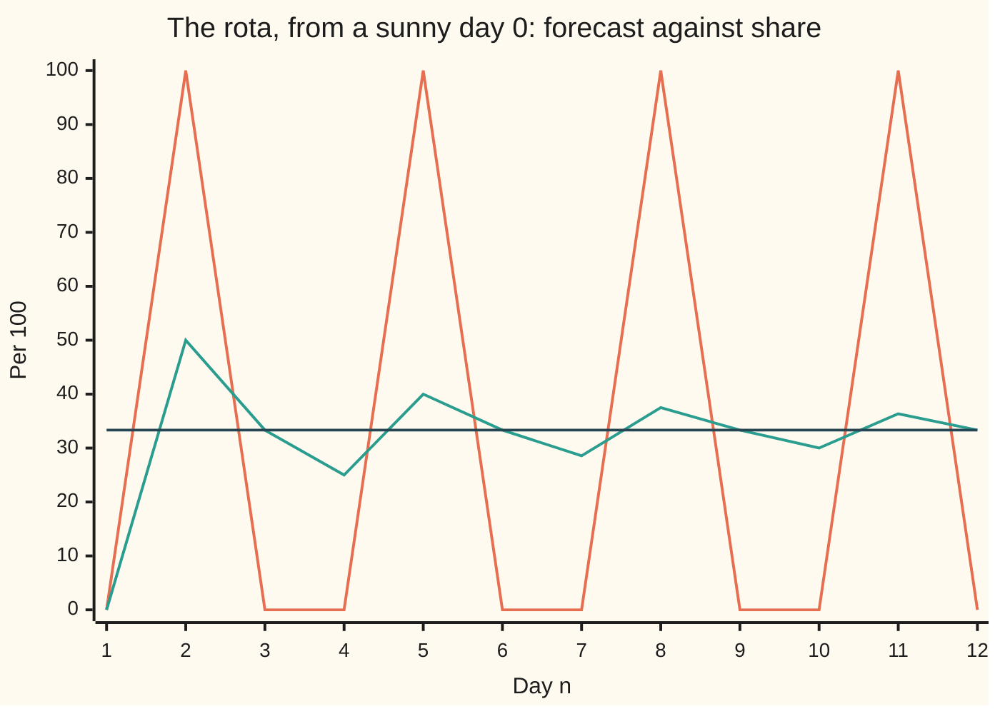

# Stationary distributions: the mix that stays the same under one more step

Stochastic processes and calculus → Markov Chains → Long-run balance → Stationary distributions

---

## General Overview

A town logs its weather once a day as sunny, cloudy or rainy. Years of records show that tomorrow depends on today and on nothing earlier. After a sunny day, tomorrow is sunny 6 times in 10, cloudy 3 times, rainy once. After a cloudy day the chances are 0.4, 0.4 and 0.2. After a rainy day they are 0.4, 0.3 and 0.3. This town is not the one on the earlier cards of this shelf; its numbers are chosen so the answers come out round.

A reservoir engineer wants one number from this: over many years, what fraction of days are rainy? Not the chance of rain tomorrow, which depends on today. The share of all days.

The answer is 1 day in 6. Half of all days are sunny and a third are cloudy. These three shares have a second property, and it is the one that makes them computable. Suppose the only thing known about today is "sunny with chance 1/2, cloudy with 1/3, rainy with 1/6". Push that mix through one night of weather and tomorrow's mix is again 1/2, 1/3, 1/6. The weather still changes every day; the mix of chances does not. A mix with that property is called a **stationary distribution**, the term used from here on.

The card solves for that mix, proves it is the only one, and proves it is also the long-run share of days. One over a share is the average wait between visits: rain comes back every 6 days on average.

**A stationary distribution is a mix of chances over the states that one more step of the chain leaves unchanged; on a finite chain where every state can reach every other there is exactly one, and its entries are the long-run fractions of time spent in each state.**

**What kind of fact this is:** a definition (the balance equations), and three theorems about it — existence, uniqueness, and the long-run time fractions — each proved on this card in Why it works, with the full arguments in a folded Detailed proof.

### The picture: one run of 100,000 days



Orange: the running share of rainy days in one sample, 100,000 days drawn with a SplitMix64 generator, seed 20260929, starting from a sunny day, read at the days marked (not evenly spaced). The first ten days happened to be dry. Green: the stationary share, 1/6, which is 16.67 rainy days per 100. After 100,000 days the sample reads 16.86, a share of 0.1686 with a standard error of 0.0015. Another seed draws another path; almost every path settles on the same line.

---

## The formula

Notation first, in words. The kind of day on day $n$ is written $X_n$, the value of the process at time $n$, with time counted in days ([processes-and-paths](../01-Random%20Walks%20and%20Filtrations/01-processes-and-paths.md)). The chances of one night's change sit in a table $P$, the transition matrix ([markov-chains](01-markov-chains.md)): its entry $p_{ij}$, in row $i$ and column $j$, is the chance tomorrow is $j$ given today is $i$. Each row adds to 1. Rows and columns run sunny, cloudy, rainy:

`P = [[0.6, 0.3, 0.1], [0.4, 0.4, 0.2], [0.4, 0.3, 0.3]]`

A mix of chances over the three kinds of day is written as a row of three numbers. The row $\mu P$, the row times the table, is tomorrow's mix when today's is $\mu$; $\mu P^n$ is the mix $n$ days on ([multi-step-transitions](02-multi-step-transitions.md)).

The Greek letter $\pi$ (here a row of shares, not the circle constant) names the stationary distribution. With $N$ states, here $N = 3$, it is any row with

$$\pi P = \pi, \qquad \pi_j \ge 0 \text{ for every } j, \qquad \pi_1 + \pi_2 + \dots + \pi_N = 1.$$

**Read it aloud:** a mix of chances that one more day of weather hands back unchanged, with no negative entries and a total of 1.

Written out one column at a time, $\pi P = \pi$ is one equation per state, the **balance equations**:

$$\pi_j = \sum_{i} \pi_i \, p_{ij} \quad \text{for every state } j.$$

**Read it aloud:** the share of days that are $j$ equals the sum, over every kind of day $i$, of the share of $i$-days times the chance an $i$-day is followed by a $j$-day.

Subtract $\pi_j p_{jj}$ from both sides and the same equation reads as a flow: days leaving $j$ balance days arriving.

$$\pi_j\,(1 - p_{jj}) = \sum_{i \ne j} \pi_i \, p_{ij}.$$

The mean return time $m_j$ is the average number of days from a $j$-day to the next $j$-day. The third theorem gives it for free:

$$m_j = \frac{1}{\pi_j}.$$

| Symbol | Plain meaning | In our example | Push it up and the answer… |
| --- | --- | --- | --- |
| $X_n$, $n$ | the kind of day on day $n$; days counted from today, day 0 | sunny on day 0 | — |
| $i$, $j$, $k$ | two states, today's and tomorrow's; $k$ a third state, or a count of visits or steps | $i$ sunny, $j$ rainy | — |
| $N$ | the number of states, here kinds of day | 3 | more equations, same method |
| $P$, $p_{ij}$, $I$ | the transition matrix; chance tomorrow is $j$ given today is $i$; the table that changes nothing | 0.1 from sunny to rainy, 0.3 from rainy to rainy | raising a chance into rainy raises $\pi_R$ |
| $\mu$ | a starting mix, a row; $\mu P^n$ is the mix $n$ days later | sunny for certain: (1, 0, 0) | — |
| $\pi$, $\pi_i$, $\pi_j$ | the stationary distribution; its entry for a state | (1/2, 1/3, 1/6) | — |
| $\pi_S$, $\pi_C$, $\pi_R$ | the long-run shares of sunny, cloudy, rainy days | 1/2, 1/3, 1/6 | — |
| $m_j$, $m_R$ | mean days from a $j$-day to the next $j$-day; the same for rain | 2, 3, 6; $m_R$ = 6 | a larger mean wait means a smaller share |
| $V_n$ | the count of $j$-days among days 1 to $n$ | 16,857 rainy in 100,000 | — |
| $v$, $w$, $h$, $\delta$ | in the proofs: a row with $vP = v$; its entries made non-negative; a column with $Ph = h$; a smallest chance of reaching $j$ | — | — |
| $T_j$, $\tau_k$, $\tau_1$, $P_i$, $P_j$, $E_i$ | in the proofs: the first day after day 0 that is $j$; the day of the $k$-th visit; chance and average starting from $i$ | — | — |
| $\nu$, $\nu_i$, $\nu_R$ | in the proofs: expected days of each kind in one stretch between two $j$-days | (3, 2, 1) for $j$ rainy | — |

### The picture: the town's weather as a chain

<p align="center"></p>

Each circle's area is drawn to the scale of its long-run share of days, so the sunny circle has three times the area of the rainy one. Arrows carry the chance of each change overnight; the chance of staying is written beside each circle.

### When it holds

- **Finitely many states.** With a finite list a stationary distribution always exists. On an endless list it can fail to: a walk on all the whole numbers, stepping up or down with chance 1/2, would need every state to hold the same share, and no equal shares of infinitely many states add to 1.
- **Every state reachable from every other**, the chain being **irreducible** ([classifying-states](03-classifying-states.md)). This buys uniqueness and start-free time fractions. Split the town into a dry spell that never rains and a wet spell that never clears, and two different mixes both balance; the long-run share of rain is 0 or 1 depending on the first day. One closed class plus transient states also gives just one: chance only drains out of the transient states, so a mix that never changes gives them 0, and Step 3 applies on the closed class. On the board of classifying-states the start square gets 0 and the jail 2/3, the 0.6667 seen there after 200 turns.
- **The same table every day.** A seasonal climate has a different table each month; one fixed $\pi$ then describes nothing, and the long-run shares come from the year-long cycle instead.
- **Tomorrow depends on today only.** If a third wet day in a row were likelier than a second, the three-state table is the wrong model. Fitted by counting the record's changes, it still gets the share of rainy days right, since counted changes balance as in Step 0; but long wet spells come out too rare, and forecasts two or more days ahead are off.
- **Not needed: settling down.** Neither existence, uniqueness nor the time fractions needs the day-by-day forecasts to converge. That extra property, and the aperiodicity it requires, is the business of [convergence-to-equilibrium](05-convergence-to-equilibrium.md).

---

## Why it works

### Step 0: a long record balances its flows

Count the rainy days in a long record. Each one began either as a change into rain or as rain carrying on, and each one ends by carrying on or by changing out. Over a long record the changes into rain and out of rain differ by at most one. Divide by the length of the record and the share of days that turn rainy equals the share that stop being rainy. That is the flow equation above for rainy, and the same holds for every state. The long-run shares must balance, so they must solve $\pi P = \pi$. The steps below make this exact: a balancing mix exists, it is the only one, and the long-run shares do settle on it.

### Step 1: a stationary start stays stationary

If today's mix is $\pi$, tomorrow's is $\pi P = \pi$, and the day after is $\pi P = \pi$ again. By induction $\pi P^n = \pi$ for every $n$: forecasts of any day ahead are the same mix. More holds. The chance of any run of weather, say sunny then rainy then sunny, starting on day $n$ is $\pi_S\,p_{SR}\,p_{RS}$ whatever $n$ is, because only the first factor could depend on $n$. The whole process, not only each day's mix, looks the same from any starting day. That is what **stationary** means: the statistics stand still while the weather moves.

### Step 2: a balancing mix always exists

Each row of $P$ adds to 1, so $P$ times a column of ones is that column of ones: 1 is an eigenvalue of $P$ ([eigenvalues-and-eigenvectors](../../03-Algebra/07-Eigenvalues%20and%20Symmetric%20Matrices/02-eigenvalues-and-eigenvectors.md)). A square table and its transpose, the table flipped across its diagonal, share eigenvalues, so some row $v$, not all zero, has $vP = v$. It is a left eigenvector: it multiplies from the left.

Its entries could be negative, and a share cannot be. Replace every entry by its size, giving $w$. Each entry of the row $w$ times $P$ is at least the matching entry of $w$, because the size of a sum is at most the sum of the sizes. But both rows have the same total, because every row of $P$ adds to 1. A row that is nowhere smaller and has the same total is equal: $wP = w$. Divide $w$ by its total and it is a stationary distribution. Nothing here used irreducibility: every finite chain has at least one.

### Step 3: irreducible means only one

Take any column $h$ with $Ph = h$. Each entry of $P$ times $h$ is an average of entries of $h$, weighted by a row of $P$. Look at the largest entry of $h$. It is an average of entries none larger than itself, so every entry it averages over, every state reachable in one day, holds the same largest value. In an irreducible chain that spreads to every state. So $h$ is constant: the only columns $P$ leaves unchanged are multiples of the column of ones.

That fixes a count. The solutions of $(P - I)h = 0$, with $I$ the table that changes nothing, form a line, so $P - I$ has rank $N - 1$: the rank, the number of independent rows, and the dimension of the solutions add up to $N$ ([rank-nullity](../../03-Algebra/05-Solving%20Systems/05-rank-nullity.md)). A table and its transpose have the same rank, so the rows with $v(P - I) = 0$ also form a line. Requiring a total of 1 picks one point on it. The stationary distribution is unique.

Every entry is positive, too. Some state $i$ has $\pi_i > 0$; state $j$ is reachable from $i$ in some number of days $n$, so $\pi_j = (\pi P^n)_j \ge \pi_i\,(P^n)_{ij} > 0$.

### Step 4: the stationary share is the long-run time fraction

Fix rainy. Cut one long run of weather at every rainy day. The stretches between consecutive rainy days are **excursions**. Each excursion starts from a rainy day, and from then on the chain forgets everything earlier. So the excursions are independent, and all share one law of length, with mean $m_R$.

By the strong law of large numbers ([strong-law-of-large-numbers](../../10-Measure%20and%20integration/10-The%20Limit%20Theorems%2C%20Proved/04-strong-law-of-large-numbers.md)), $k$ excursions take about $k\,m_R$ days, with probability 1. So among $n$ days about $n / m_R$ are rainy: the fraction of rainy days tends to $1/m_R$ on almost every path, whatever the first day.

It remains to see that $1/m_R$ is $\pi_R$. Let $\nu_i$ be the expected number of $i$-days in one excursion, counting its opening rainy day. Then $\nu_R = 1$, and the $\nu_i$ add to $m_R$, the excursion's mean length. One more day moves each excursion's days one place along: its opening rainy day drops off the front and the rainy day that closes it arrives at the back. So $\nu P = \nu$. By Step 3, $\nu / m_R$ is $\pi$, and its rainy entry is $1/m_R$. Here $\nu$ = (3, 2, 1): an excursion from rain averages 3 sunny days, 2 cloudy and the 1 rainy day, 6 in all.

### Step 5: stationary is not the same as settling

Replace the weather by a rota: sunny, then cloudy, then rainy, then sunny again, for certain. Every state reaches every other, so Steps 2 to 4 apply. The stationary distribution is (1/3, 1/3, 1/3), and a third of days are rainy.

Now forecast from a sunny day. The chance of rain on day $n$ is 0, 1, 0, 0, 1, 0, …: it never settles. The rota is **periodic**: it returns to each state only in multiples of 3 days.



Orange: the chance, per 100, that day $n$ is rainy; it jumps between 0 and 100 forever. Green: rainy days per 100 up to day $n$, closing in on 33.33. Dark: the stationary share. A stationary distribution, a settling forecast and a time fraction are three different things; the town has all three, the rota only the first and third.

<details>
<summary>Detailed proof</summary>

**Setting.** A chain on the states 1 to $N$ with transition matrix $P$: $p_{ij} \ge 0$ and $\sum_j p_{ij} = 1$ for each $i$. Write $\mathbf{1}$ for the column of ones and $P_i$, $E_i$ for chance and average when $X_0 = i$.

**1. Existence (any finite chain).** $P\mathbf{1} = \mathbf{1}$, so $P - I$ is singular, so is its transpose, and some row $v \ne 0$ has $vP = v$. Let $w_j = \lvert v_j\rvert$. Then $w_j = \lvert\sum_i v_i p_{ij}\rvert \le \sum_i w_i p_{ij} = (wP)_j$. Summing over $j$, $\sum_j (wP)_j = \sum_i w_i \sum_j p_{ij} = \sum_i w_i$. So the non-negative differences $(wP)_j - w_j$ add to 0 and all vanish: $wP = w$, and $\pi = w / \sum_i w_i$ is stationary.

**2. Uniqueness and positivity (irreducible).** Let $Ph = h$ and let $h_i = \max_k h_k$. Then $0 = \sum_k p_{ik}(h_i - h_k)$, a sum of non-negative terms, so $h_k = h_i$ whenever $p_{ik} > 0$. Repeating along a path from $i$ to any state, which irreducibility provides, $h$ is constant. So the null space of $P - I$ is spanned by $\mathbf{1}$, its rank is $N - 1$, the left null space has dimension $N - (N - 1) = 1$, and at most one row in it has entries adding to 1. With part 1, exactly one does. Positivity is Step 3's inequality.

**3. Finite mean return time.** Irreducibility gives, for each start $i$, a path to $j$ of at most $N$ days with positive chance; let $\delta > 0$ be the smallest of these $N$ chances. Let $T_j$ be the first day $n \ge 1$ with $X_n = j$. From any state, $j$ is reached within the next $N$ days with chance at least $\delta$, so by the Markov property $P_i(T_j > kN) \le (1 - \delta)^k$ and $E_i T_j = \sum_{n \ge 0} P_i(T_j > n) \le N/\delta < \infty$. Write $m_j = E_j T_j$.

**4. Time fractions.** Let $\tau_1 < \tau_2 < \dots$ be the successive days $n \ge 1$ with $X_n = j$; each is finite with probability 1 by part 3, and each is a stopping time (the day can be recognised when it arrives). By the strong Markov property, the gaps $\tau_{k+1} - \tau_k$ are independent, each with the law of $T_j$ under $P_j$, and independent of $\tau_1$. The strong law gives $\tau_k / k \to m_j$ almost surely. With $V_n$ the number of $j$-days among days 1 to $n$, $\tau_{V_n} \le n < \tau_{V_n + 1}$, so $V_n/n \to 1/m_j$ almost surely, from any start.

**5. Kac's formula, $\pi_j = 1/m_j$.** Let $\nu_i = E_j \sum_{k=0}^{T_j - 1} \mathbf{1}\{X_k = i\} = \sum_{k \ge 0} P_j(X_k = i,\ k < T_j)$. Then $\nu_j = 1$ and $\sum_i \nu_i = E_j T_j = m_j$. The event $\{k < T_j\}$ is decided by $X_0, \dots, X_k$, so the Markov property gives $\sum_i P_j(X_k = i, k < T_j)\,p_{il} = P_j(X_{k+1} = l, k + 1 \le T_j)$. Summing over $k \ge 0$: $(\nu P)_l = E_j \sum_{k=1}^{T_j} \mathbf{1}\{X_k = l\}$. Since $X_0 = X_{T_j} = j$, shifting the window from days $0, \dots, T_j - 1$ to days $1, \dots, T_j$ changes no count, and $(\nu P)_l = \nu_l$. So $\nu / m_j$ is stationary; by part 2 it is $\pi$, and $\pi_j = \nu_j / m_j = 1/m_j$. With part 4, the fraction of $j$-days tends to $\pi_j$.

</details>

**Another road.** When every change is matched by its reverse, $\pi_i p_{ij} = \pi_j p_{ji}$ for every pair, the flows balance link by link, and summing over $i$ gives $\pi P = \pi$ at once. This **detailed balance** is how [random-walks-on-graphs-and-mixing](../../09-Probability%20and%20statistics/14-Random%20Graphs%20and%20the%20Probabilistic%20Method/05-random-walks-on-graphs-and-mixing.md) finds a random walk's stationary distribution, proportional to each page's number of links, and how [markov-chain-monte-carlo](07-markov-chain-monte-carlo.md) builds a chain with a chosen $\pi$. The town's weather does not have it: $\pi_S p_{SR}$ = 0.05 but $\pi_R p_{RS}$ = 0.0667, so fewer days go straight from sunny to rainy than from rainy to sunny. A net drift round the loop sunny, cloudy, rainy makes up the difference.

---

## Worked numbers, by hand

Solve the flow equations for the town. The sunny equation first, then the rainy one.

| Step | Arithmetic | Value |
| --- | --- | --- |
| sunny: out = in | $0.4\,\pi_S = 0.4\,\pi_C + 0.4\,\pi_R$ | $\pi_S = \pi_C + \pi_R$ |
| shares add to 1 | $\pi_S + (\pi_C + \pi_R) = 2\,\pi_S = 1$ | $\pi_S$ = 1/2 |
| rainy: out = in | $0.7\,\pi_R = 0.1 \times \tfrac12 + 0.2\,\pi_C$ | — |
| use $\pi_C = \tfrac12 - \pi_R$ | $0.7\,\pi_R = 0.05 + 0.1 - 0.2\,\pi_R$, so $0.9\,\pi_R = 0.15$ | **$\pi_R$ = 1/6** |
| cloudy | $1 - \tfrac12 - \tfrac16$ | $\pi_C$ = 1/3 |
| check the spare equation, cloudy | $\tfrac12(0.3) + \tfrac13(0.4) + \tfrac16(0.3) = 0.15 + 0.1333 + 0.05$ | 1/3 |
| flow out of rainy, per day | $\tfrac16 \times 0.7$ | 7/60 |
| flow into rainy, per day | $\tfrac12 \times 0.1 + \tfrac13 \times 0.2$ | 7/60 |
| mean return to rain | $1 / \pi_R$ | **6 days** |

One day in six is rainy, about 61 days a year, and a rainy day comes back after 6 days on average. A sunny day recurs every 2 days on average and a cloudy one every 3. The code reaches 2, 3 and 6 a second way, from the first-step equations for the waiting time, knowing nothing of $\pi$.

The three balance equations are one too many: they always add up to "total in = total out", so one is spare, and the total of 1 takes its place. The check row confirms the spare one.

### What breaks if you drop a piece

| Mistake | Comes out at | What went wrong |
| --- | --- | --- |
| Solve $P x = x$, a column, instead of $\pi P = \pi$ | 1/3 rainy, against 1/6 | Every row of $P$ adds to 1, so the column of ones always solves it; the answer is uniform whatever the weather |
| Average the rain column: (0.1 + 0.2 + 0.3)/3 | 1/5 | Weights each kind of today equally; sunny days are three times as common as rainy ones |
| Read rain-after-rain as the share | 3/10 | That is a chance given today is rainy, not a share of all days |
| Drop irreducibility: dry spell and wet spell never meet | 0 or 1, depending on day 0 | Two mixes balance, (1/2, 1/2, 0) and (0, 0, 1), and the record picks one |
| Expect a periodic chain's forecast to reach $\pi$ | forecast 0, 100, 0 per 100 forever | $\pi$ exists and is the time fraction, but the forecast never settles |

The code prints every row.

---

## Code, from first principles, and it actually runs

The code takes three independent roads to the long-run shares. The first solves the balance equations exactly in fractions by elimination, with the spare equation replaced by the total. The second solves the first-step equations for the mean wait until each state returns, exactly, and takes one over each: Kac's formula, reached without ever writing $\pi P = \pi$. The third simulates 100,000 days with a SplitMix64 generator written out, seed 20260929, and prints each share with a standard error from 100 blocks of 1,000 days, since neighbouring days are not independent. It also prints every other number on the card. The asserts tie the roads together, hold the simulated shares to within 4 standard errors, and check the rota, the split climate and the transient start of the classifying-states board.

### Python

```python
# Stationary distributions -- the check behind the card.  Nothing is imported.
# A town's days are sunny, cloudy or rainy; tomorrow depends only on today.
# Three roads to the long-run share of each kind of day: the balance equations
# solved exactly; mean return times from first-step equations (share = 1/return
# time); and 100000 simulated days, with a standard error from blocks of days.
from fractions import Fraction as Fr

NAMES = ("sunny", "cloudy", "rainy")
TENTHS = [[6, 3, 1], [4, 4, 2], [4, 3, 3]]    # row = today, column = tomorrow
P = [[Fr(x, 10) for x in row] for row in TENTHS]
DAYS, BLOCKS, SEED = 100000, 100, 20260929
MASK = (1 << 64) - 1

def solve(A, b):                               # exact Gaussian elimination
    n = len(A)
    M = [A[i][:] + [b[i]] for i in range(n)]
    for c in range(n):
        piv = next(r for r in range(c, n) if M[r][c] != 0)
        M[c], M[piv] = M[piv], M[c]
        for r in range(n):
            if r != c and M[r][c] != 0:
                f = M[r][c] / M[c][c]
                M[r] = [x - f * y for x, y in zip(M[r], M[c])]
    return [M[i][n] / M[i][i] for i in range(n)]

def balance(P, left=True):                     # pi P = pi (left) or P x = x (right), sum 1
    n = len(P)
    A = [[(P[i][j] if left else P[j][i]) - (1 if i == j else 0) for i in range(n)] for j in range(n)]
    A[-1] = [Fr(1)] * n                        # one balance equation is spare: swap in the total
    return solve(A, [Fr(0)] * (n - 1) + [Fr(1)])

def mean_return(P, j):                         # first-step equations for days until j
    others = [i for i in range(len(P)) if i != j]
    A = [[(1 if a == b else 0) - P[a][b] for b in others] for a in others]
    h = dict(zip(others, solve(A, [Fr(1)] * len(others))))
    return 1 + sum(P[j][k] * h[k] for k in others)

def vecmat(v, P):
    return [sum(v[i] * P[i][j] for i in range(len(v))) for j in range(len(P[0]))]

class SplitMix64:
    def __init__(self, seed): self.s = seed & MASK
    def uniform(self):
        self.s = (self.s + 0x9E3779B97F4A7C15) & MASK
        z = self.s
        z = ((z ^ (z >> 30)) * 0xBF58476D1CE4E5B9) & MASK
        z = ((z ^ (z >> 27)) * 0x94D049BB133111EB) & MASK
        return ((z ^ (z >> 31)) >> 11) / 9007199254740992.0

def step(g, today):
    u, acc = g.uniform(), 0
    for j in range(3):
        acc += TENTHS[today][j]
        if u < acc / 10: return j
    return 2

pi = balance(P)
print("table P, rows today sunny, cloudy, rainy: " + "; ".join(", ".join(f"{float(x):.1f}" for x in row) for row in P))
print("road 1, balance equations: " + ", ".join(f"{NAMES[i]} {pi[i]}" for i in range(3)))
m = [mean_return(P, j) for j in range(3)]
print("road 2, mean days between visits: " + ", ".join(f"{NAMES[j]} {m[j]}" for j in range(3)))
print("road 2, one over those: " + ", ".join(f"{NAMES[j]} {1 / m[j]}" for j in range(3)))
assert [1 / x for x in m] == pi                # two exact roads agree
assert vecmat(pi, P) == pi                     # includes the balance equation that was swapped out
print(f"hand, sunny: pi_S = pi_C + pi_R and sum 1 give pi_S = {pi[0]}")
pr = (P[0][2] * pi[0] + P[1][2] * (1 - pi[0])) / (1 - P[2][2] + P[1][2])   # rainy balance, pi_C = 1/2 - pi_R
assert pr == pi[2]                             # the hand route lands on road 1
print(f"hand, rainy: 0.7 pi_R = 0.1 (1/2) + 0.2 (1/2 - pi_R), so 0.9 pi_R = 0.15, pi_R = {pr}")
print(f"hand, spare cloudy equation: {float(pi[0] * P[0][1]):.4f} + {float(pi[1] * P[1][1]):.4f} + {float(pi[2] * P[2][1]):.4f} = {vecmat(pi, P)[1]}")
print(f"rainy days in a 365-day year: {float(365 * pi[2]):.2f}")
print("excursion from rain, expected days of each kind, pi times m_R: " + ", ".join(str(x * m[2]) for x in pi))
print(f"detailed balance fails: pi_S p_SR = {float(pi[0] * P[0][2]):.4f}, pi_R p_RS = {float(pi[2] * P[2][0]):.4f}")
print("flow, out of rainy per day: " + f"{pi[2] * (1 - P[2][2])}; into rainy: {pi[0] * P[0][2] + pi[1] * P[1][2]}")

g, today, counts, blk, cur = SplitMix64(SEED), 0, [0, 0, 0], [], [0, 0, 0]
marks = (10, 30, 100, 300, 1000, 3000, 10000, 30000, 100000)
running = []
for d in range(1, DAYS + 1):                   # day 0 is sunny; count days 1 .. DAYS
    today = step(g, today)
    counts[today] += 1
    cur[today] += 1
    if d % (DAYS // BLOCKS) == 0: blk.append(cur); cur = [0, 0, 0]
    if d in marks: running.append(100 * counts[2] / d)
print("figure, rainy days per 100, running, days " + ", ".join(map(str, marks)) + ": " + ", ".join(f"{x:.2f}" for x in running) + f"; exact {100 * float(pi[2]):.2f}")
frac = [c / DAYS for c in counts]
bs = DAYS // BLOCKS
ses = [(sum((b[i] / bs - frac[i]) ** 2 for b in blk) / (BLOCKS - 1) / BLOCKS) ** 0.5 for i in range(3)]
se = ses[2]
naive = (frac[2] * (1 - frac[2]) / DAYS) ** 0.5
print("road 3, simulated shares of 100000 days: " + ", ".join(f"{NAMES[i]} {frac[i]:.4f} +- {ses[i]:.4f}" for i in range(3)))
print(f"road 3, rainy share {frac[2]:.4f} +- {se:.4f} (100 blocks of 1000 days); naive iid s.e. {naive:.4f}")
print(f"road 3, rainy days {counts[2]}, days per rainy day, simulated: {DAYS / counts[2]:.2f} +- {se / frac[2] ** 2:.2f}; exact mean return {m[2]}")
assert all(abs(frac[i] - float(pi[i])) < 4 * ses[i] for i in range(3))   # simulation against the exact shares

v = [1.0, 0.0, 0.0]
fc = {}
for n in range(1, 61):
    v = vecmat(v, [[float(x) for x in r] for r in P])
    fc[n] = v[2]
print("forecast, chance of rain n days after a sunny day, n = 1, 2, 3, 5, 10: " + ", ".join(f"{fc[n]:.4f}" for n in (1, 2, 3, 5, 10)))
assert abs(fc[60] - float(pi[2])) < 1e-12      # this chain's forecasts settle (next card: why)

print(f"mistake, column convention P x = x: rainy {balance(P, left=False)[2]} (uniform, since rows sum to 1)")
print(f"mistake, average of the rain column: {sum(P[i][2] for i in range(3)) / 3}")
print(f"mistake, rain after rain read as the share: {P[2][2]}")
ROTA = [[Fr(0), Fr(1), Fr(0)], [Fr(0), Fr(0), Fr(1)], [Fr(1), Fr(0), Fr(0)]]
rp = balance(ROTA)
print("rota sunny -> cloudy -> rainy -> sunny: stationary " + ", ".join(str(x) for x in rp))
v, st, seen, fcr, frr = [Fr(1), Fr(0), Fr(0)], 0, 0, [], []
for n in range(1, 13):
    v = vecmat(v, ROTA); st = (st + 1) % 3; seen += st == 2
    fcr.append(100 * v[2]); frr.append(100 * seen / n)
print("figure, rota, chance of rain on day n (per 100), n = 1..12: " + ", ".join(f"{float(x):.2f}" for x in fcr))
print("figure, rota, rainy days per 100 up to day n, n = 1..12: " + ", ".join(f"{x:.2f}" for x in frr))
assert fcr[9] == 0 and fcr[10] == 100         # day 10 dry for sure, day 11 wet for sure: no settling
assert abs(frr[-1] - 100 * float(rp[2])) < 1e-9   # yet the share of rainy days is the stationary 1/3
SPLIT = [[Fr(1, 2), Fr(1, 2), Fr(0)], [Fr(1, 2), Fr(1, 2), Fr(0)], [Fr(0), Fr(0), Fr(1)]]
a, b = [Fr(1, 2), Fr(1, 2), Fr(0)], [Fr(0), Fr(0), Fr(1)]
assert vecmat(a, SPLIT) == a and vecmat(b, SPLIT) == b
print("split climate (rain stays, dry stays dry): stationary (1/2, 1/2, 0) and (0, 0, 1); rainy share 0 or 1")
z, s6, hf = Fr(0), Fr(1, 6), Fr(1, 2)          # classifying-states' board: start S, ring A, B, C, jail J
BOARD = [[1 - s6, s6, z, z, z], [z, z, hf, z, hf], [z, hf, z, hf, z], [z, z, hf, z, hf], [z, s6, z, z, 1 - s6]]
bp = balance(BOARD)
print("one closed class plus a transient start (classifying-states' board, S A B C J): stationary " + ", ".join(str(x) for x in bp))
assert bp[0] == 0                              # the transient start gets share 0
assert vecmat(bp, BOARD) == bp                 # includes the balance equation that was swapped out
TRY = [[Fr(x, 10) for x in row] for row in ([6, 3, 1], [4, 4, 2], [2, 3, 5])]
print("try, rain stays with 0.5 (rainy row 0.2, 0.3, 0.5): " + ", ".join(str(x) for x in balance(TRY)) + f"; rain returns every {mean_return(TRY, 2)} days")
r = [40 * (float(x) / 0.5) ** 0.5 for x in pi]
print("figure, circle radius 40 sqrt(share / 0.5): " + ", ".join(f"{NAMES[i]} {r[i]:.2f}" for i in range(3)) + "; centres (80, 160), (280, 160), (180, 62)")
print("ALL CHECKS PASS")
```

**Ran 2026-10-07 on macOS, Python 3.14.6, standard library only. All checks passed. Output, pasted from the run:**

```
table P, rows today sunny, cloudy, rainy: 0.6, 0.3, 0.1; 0.4, 0.4, 0.2; 0.4, 0.3, 0.3
road 1, balance equations: sunny 1/2, cloudy 1/3, rainy 1/6
road 2, mean days between visits: sunny 2, cloudy 3, rainy 6
road 2, one over those: sunny 1/2, cloudy 1/3, rainy 1/6
hand, sunny: pi_S = pi_C + pi_R and sum 1 give pi_S = 1/2
hand, rainy: 0.7 pi_R = 0.1 (1/2) + 0.2 (1/2 - pi_R), so 0.9 pi_R = 0.15, pi_R = 1/6
hand, spare cloudy equation: 0.1500 + 0.1333 + 0.0500 = 1/3
rainy days in a 365-day year: 60.83
excursion from rain, expected days of each kind, pi times m_R: 3, 2, 1
detailed balance fails: pi_S p_SR = 0.0500, pi_R p_RS = 0.0667
flow, out of rainy per day: 7/60; into rainy: 7/60
figure, rainy days per 100, running, days 10, 30, 100, 300, 1000, 3000, 10000, 30000, 100000: 0.00, 10.00, 13.00, 15.33, 15.40, 16.27, 16.53, 16.90, 16.86; exact 16.67
road 3, simulated shares of 100000 days: sunny 0.4971 +- 0.0018, cloudy 0.3343 +- 0.0016, rainy 0.1686 +- 0.0015
road 3, rainy share 0.1686 +- 0.0015 (100 blocks of 1000 days); naive iid s.e. 0.0012
road 3, rainy days 16857, days per rainy day, simulated: 5.93 +- 0.05; exact mean return 6
forecast, chance of rain n days after a sunny day, n = 1, 2, 3, 5, 10: 0.1000, 0.1500, 0.1630, 0.1665, 0.1667
mistake, column convention P x = x: rainy 1/3 (uniform, since rows sum to 1)
mistake, average of the rain column: 1/5
mistake, rain after rain read as the share: 3/10
rota sunny -> cloudy -> rainy -> sunny: stationary 1/3, 1/3, 1/3
figure, rota, chance of rain on day n (per 100), n = 1..12: 0.00, 100.00, 0.00, 0.00, 100.00, 0.00, 0.00, 100.00, 0.00, 0.00, 100.00, 0.00
figure, rota, rainy days per 100 up to day n, n = 1..12: 0.00, 50.00, 33.33, 25.00, 40.00, 33.33, 28.57, 37.50, 33.33, 30.00, 36.36, 33.33
split climate (rain stays, dry stays dry): stationary (1/2, 1/2, 0) and (0, 0, 1); rainy share 0 or 1
one closed class plus a transient start (classifying-states' board, S A B C J): stationary 0, 1/6, 1/9, 1/18, 2/3
try, rain stays with 0.5 (rainy row 0.2, 0.3, 0.5): 4/9, 1/3, 2/9; rain returns every 9/2 days
figure, circle radius 40 sqrt(share / 0.5): sunny 40.00, cloudy 32.66, rainy 23.09; centres (80, 160), (280, 160), (180, 62)
ALL CHECKS PASS
```

### Rust

```rust
// Stationary distributions -- the check behind the card.  std only.
// A town's days are sunny, cloudy or rainy; tomorrow depends only on today.
// Three roads to the long-run share of each kind of day: the balance equations
// solved exactly; mean return times from first-step equations (share = 1/return
// time); and 100000 simulated days, with a standard error from blocks of days.
use std::fmt;
use std::ops::{Add, Div, Mul, Sub};

#[derive(Clone, Copy, PartialEq, Debug)]
struct Q(i128, i128); // exact fraction, numerator / denominator, kept in lowest terms
fn gcd(a: i128, b: i128) -> i128 { if b == 0 { a.abs() } else { gcd(b, a % b) } }
fn q(n: i128, d: i128) -> Q { let g = gcd(n, d) * d.signum(); Q(n / g, d / g) }
impl Add for Q { type Output = Q; fn add(self, o: Q) -> Q { q(self.0 * o.1 + o.0 * self.1, self.1 * o.1) } }
impl Sub for Q { type Output = Q; fn sub(self, o: Q) -> Q { q(self.0 * o.1 - o.0 * self.1, self.1 * o.1) } }
impl Mul for Q { type Output = Q; fn mul(self, o: Q) -> Q { q(self.0 * o.0, self.1 * o.1) } }
impl Div for Q { type Output = Q; fn div(self, o: Q) -> Q { q(self.0 * o.1, self.1 * o.0) } }
impl fmt::Display for Q {
    fn fmt(&self, f: &mut fmt::Formatter) -> fmt::Result {
        if self.1 == 1 { write!(f, "{}", self.0) } else { write!(f, "{}/{}", self.0, self.1) }
    }
}
fn fl(x: Q) -> f64 { x.0 as f64 / x.1 as f64 }
type M = Vec<Vec<Q>>;
const NAMES: [&str; 3] = ["sunny", "cloudy", "rainy"];
const TENTHS: [[i128; 3]; 3] = [[6, 3, 1], [4, 4, 2], [4, 3, 3]]; // row = today, column = tomorrow

fn solve(a: &M, b: &[Q]) -> Vec<Q> { // exact Gaussian elimination
    let n = a.len();
    let mut m: M = (0..n).map(|i| { let mut r = a[i].clone(); r.push(b[i]); r }).collect();
    for c in 0..n {
        let piv = (c..n).find(|&r| m[r][c].0 != 0).unwrap();
        m.swap(c, piv);
        for r in 0..n {
            if r != c && m[r][c].0 != 0 {
                let f = m[r][c] / m[c][c];
                for k in 0..=n { m[r][k] = m[r][k] - f * m[c][k]; }
            }
        }
    }
    (0..n).map(|i| m[i][n] / m[i][i]).collect()
}
fn eye(i: usize, j: usize) -> Q { if i == j { q(1, 1) } else { q(0, 1) } }
fn balance(p: &M, left: bool) -> Vec<Q> { // pi P = pi (left) or P x = x (right), sum 1
    let n = p.len();
    let mut a: M = (0..n).map(|j| (0..n).map(|i| (if left { p[i][j] } else { p[j][i] }) - eye(i, j)).collect()).collect();
    a[n - 1] = vec![q(1, 1); n]; // one balance equation is spare: swap in the total
    let mut b = vec![q(0, 1); n];
    b[n - 1] = q(1, 1);
    solve(&a, &b)
}
fn mean_return(p: &M, j: usize) -> Q { // first-step equations for days until j
    let others: Vec<usize> = (0..p.len()).filter(|&i| i != j).collect();
    let a: M = others.iter().map(|&x| others.iter().map(|&y| eye(x, y) - p[x][y]).collect()).collect();
    let h = solve(&a, &vec![q(1, 1); others.len()]);
    others.iter().zip(h.iter()).fold(q(1, 1), |s, (&k, &hk)| s + p[j][k] * hk)
}
fn vecmat(v: &[Q], p: &M) -> Vec<Q> {
    (0..p[0].len()).map(|j| (0..v.len()).fold(q(0, 1), |s, i| s + v[i] * p[i][j])).collect()
}
struct SplitMix64(u64);
impl SplitMix64 {
    fn uniform(&mut self) -> f64 {
        self.0 = self.0.wrapping_add(0x9E3779B97F4A7C15);
        let mut z = self.0;
        z = (z ^ (z >> 30)).wrapping_mul(0xBF58476D1CE4E5B9);
        z = (z ^ (z >> 27)).wrapping_mul(0x94D049BB133111EB);
        ((z ^ (z >> 31)) >> 11) as f64 / 9007199254740992.0
    }
}
fn step(g: &mut SplitMix64, today: usize) -> usize {
    let (u, mut acc) = (g.uniform(), 0);
    for j in 0..3 {
        acc += TENTHS[today][j];
        if u < acc as f64 / 10.0 { return j; }
    }
    2
}
fn join<T: fmt::Display>(v: &[T]) -> String { v.iter().map(|x| x.to_string()).collect::<Vec<_>>().join(", ") }
fn f2(v: &[f64]) -> String { v.iter().map(|x| format!("{:.2}", x)).collect::<Vec<_>>().join(", ") }

fn main() {
    let p: M = TENTHS.iter().map(|r| r.iter().map(|&x| q(x, 10)).collect()).collect();
    let (days, blocks, seed) = (100000usize, 100usize, 20260929u64);
    let pi = balance(&p, true);
    println!("table P, rows today sunny, cloudy, rainy: {}", p.iter().map(|r| r.iter().map(|&x| format!("{:.1}", fl(x))).collect::<Vec<_>>().join(", ")).collect::<Vec<_>>().join("; "));
    println!("road 1, balance equations: {}", (0..3).map(|i| format!("{} {}", NAMES[i], pi[i])).collect::<Vec<_>>().join(", "));
    let m: Vec<Q> = (0..3).map(|j| mean_return(&p, j)).collect();
    println!("road 2, mean days between visits: {}", (0..3).map(|j| format!("{} {}", NAMES[j], m[j])).collect::<Vec<_>>().join(", "));
    println!("road 2, one over those: {}", (0..3).map(|j| format!("{} {}", NAMES[j], q(1, 1) / m[j])).collect::<Vec<_>>().join(", "));
    assert!((0..3).all(|j| q(1, 1) / m[j] == pi[j])); // two exact roads agree
    assert_eq!(vecmat(&pi, &p), pi); // includes the balance equation that was swapped out
    println!("hand, sunny: pi_S = pi_C + pi_R and sum 1 give pi_S = {}", pi[0]);
    let pr = (p[0][2] * pi[0] + p[1][2] * (q(1, 1) - pi[0])) / (q(1, 1) - p[2][2] + p[1][2]); // rainy balance, pi_C = 1/2 - pi_R
    assert_eq!(pr, pi[2]); // the hand route lands on road 1
    println!("hand, rainy: 0.7 pi_R = 0.1 (1/2) + 0.2 (1/2 - pi_R), so 0.9 pi_R = 0.15, pi_R = {}", pr);
    println!("hand, spare cloudy equation: {:.4} + {:.4} + {:.4} = {}", fl(pi[0] * p[0][1]), fl(pi[1] * p[1][1]), fl(pi[2] * p[2][1]), vecmat(&pi, &p)[1]);
    println!("rainy days in a 365-day year: {:.2}", fl(q(365, 1) * pi[2]));
    println!("excursion from rain, expected days of each kind, pi times m_R: {}", join(&pi.iter().map(|&x| x * m[2]).collect::<Vec<_>>()));
    println!("detailed balance fails: pi_S p_SR = {:.4}, pi_R p_RS = {:.4}", fl(pi[0] * p[0][2]), fl(pi[2] * p[2][0]));
    println!("flow, out of rainy per day: {}; into rainy: {}", pi[2] * (q(1, 1) - p[2][2]), pi[0] * p[0][2] + pi[1] * p[1][2]);

    let (mut g, mut today, mut counts, mut blk, mut cur) = (SplitMix64(seed), 0usize, [0usize; 3], Vec::new(), [0usize; 3]);
    let marks = [10usize, 30, 100, 300, 1000, 3000, 10000, 30000, 100000];
    let mut running = Vec::new();
    for d in 1..=days { // day 0 is sunny; count days 1 .. days
        today = step(&mut g, today);
        counts[today] += 1;
        cur[today] += 1;
        if d % (days / blocks) == 0 { blk.push(cur); cur = [0; 3]; }
        if marks.contains(&d) { running.push(100.0 * counts[2] as f64 / d as f64); }
    }
    println!("figure, rainy days per 100, running, days {}: {}; exact {:.2}", join(&marks), f2(&running), 100.0 * fl(pi[2]));
    let frac: Vec<f64> = counts.iter().map(|&c| c as f64 / days as f64).collect();
    let bs = (days / blocks) as f64;
    let ses: Vec<f64> = (0..3).map(|i| (blk.iter().map(|b| (b[i] as f64 / bs - frac[i]).powi(2)).sum::<f64>() / (blocks - 1) as f64 / blocks as f64).sqrt()).collect();
    let se = ses[2];
    let naive = (frac[2] * (1.0 - frac[2]) / days as f64).sqrt();
    println!("road 3, simulated shares of 100000 days: {}", (0..3).map(|i| format!("{} {:.4} +- {:.4}", NAMES[i], frac[i], ses[i])).collect::<Vec<_>>().join(", "));
    println!("road 3, rainy share {:.4} +- {:.4} (100 blocks of 1000 days); naive iid s.e. {:.4}", frac[2], se, naive);
    println!("road 3, rainy days {}, days per rainy day, simulated: {:.2} +- {:.2}; exact mean return {}", counts[2], days as f64 / counts[2] as f64, se / frac[2].powi(2), m[2]);
    assert!((0..3).all(|i| (frac[i] - fl(pi[i])).abs() < 4.0 * ses[i])); // simulation against the exact shares

    let pf: Vec<Vec<f64>> = p.iter().map(|r| r.iter().map(|&x| fl(x)).collect()).collect();
    let (mut v, mut fc) = (vec![1.0f64, 0.0, 0.0], vec![0.0f64; 61]);
    for n in 1..=60 {
        v = (0..3).map(|j| (0..3).map(|i| v[i] * pf[i][j]).sum()).collect();
        fc[n] = v[2];
    }
    println!("forecast, chance of rain n days after a sunny day, n = 1, 2, 3, 5, 10: {}", [1, 2, 3, 5, 10].iter().map(|&n| format!("{:.4}", fc[n])).collect::<Vec<_>>().join(", "));
    assert!((fc[60] - fl(pi[2])).abs() < 1e-12); // this chain's forecasts settle (next card: why)

    println!("mistake, column convention P x = x: rainy {} (uniform, since rows sum to 1)", balance(&p, false)[2]);
    println!("mistake, average of the rain column: {}", (p[0][2] + p[1][2] + p[2][2]) / q(3, 1));
    println!("mistake, rain after rain read as the share: {}", p[2][2]);
    let (o, z) = (q(1, 1), q(0, 1));
    let rota: M = vec![vec![z, o, z], vec![z, z, o], vec![o, z, z]];
    let rp = balance(&rota, true);
    println!("rota sunny -> cloudy -> rainy -> sunny: stationary {}", join(&rp));
    let (mut v, mut st, mut seen, mut fcr, mut frr) = (vec![o, z, z], 0usize, 0usize, Vec::new(), Vec::new());
    for n in 1..=12 {
        v = vecmat(&v, &rota);
        st = (st + 1) % 3;
        if st == 2 { seen += 1; }
        fcr.push(100.0 * fl(v[2]));
        frr.push(100.0 * seen as f64 / n as f64);
    }
    println!("figure, rota, chance of rain on day n (per 100), n = 1..12: {}", f2(&fcr));
    println!("figure, rota, rainy days per 100 up to day n, n = 1..12: {}", f2(&frr));
    assert!(fcr[9] == 0.0 && fcr[10] == 100.0); // day 10 dry for sure, day 11 wet for sure: no settling
    assert!((frr[11] - 100.0 * fl(rp[2])).abs() < 1e-9); // yet the share of rainy days is the stationary 1/3
    let h = q(1, 2);
    let split: M = vec![vec![h, h, z], vec![h, h, z], vec![z, z, o]];
    let (a, b) = (vec![h, h, z], vec![z, z, o]);
    assert!(vecmat(&a, &split) == a && vecmat(&b, &split) == b);
    println!("split climate (rain stays, dry stays dry): stationary (1/2, 1/2, 0) and (0, 0, 1); rainy share 0 or 1");
    let s6 = q(1, 6); // classifying-states' board: start S, ring A, B, C, jail J
    let board: M = vec![vec![o - s6, s6, z, z, z], vec![z, z, h, z, h], vec![z, h, z, h, z], vec![z, z, h, z, h], vec![z, s6, z, z, o - s6]];
    let bp = balance(&board, true);
    println!("one closed class plus a transient start (classifying-states' board, S A B C J): stationary {}", join(&bp));
    assert!(bp[0] == z); // the transient start gets share 0
    assert_eq!(vecmat(&bp, &board), bp); // includes the balance equation that was swapped out
    let tr: M = [[6, 3, 1], [4, 4, 2], [2, 3, 5]].iter().map(|r| r.iter().map(|&x| q(x, 10)).collect()).collect();
    println!("try, rain stays with 0.5 (rainy row 0.2, 0.3, 0.5): {}; rain returns every {} days", join(&balance(&tr, true)), mean_return(&tr, 2));
    let r: Vec<f64> = pi.iter().map(|&x| 40.0 * (fl(x) / 0.5).sqrt()).collect();
    println!("figure, circle radius 40 sqrt(share / 0.5): {}; centres (80, 160), (280, 160), (180, 62)", (0..3).map(|i| format!("{} {:.2}", NAMES[i], r[i])).collect::<Vec<_>>().join(", "));
    println!("ALL CHECKS PASS");
}
```

**Ran 2026-10-07 on macOS, rustc 1.98.1, no crates. All checks passed. Output, pasted from the run:**

```
table P, rows today sunny, cloudy, rainy: 0.6, 0.3, 0.1; 0.4, 0.4, 0.2; 0.4, 0.3, 0.3
road 1, balance equations: sunny 1/2, cloudy 1/3, rainy 1/6
road 2, mean days between visits: sunny 2, cloudy 3, rainy 6
road 2, one over those: sunny 1/2, cloudy 1/3, rainy 1/6
hand, sunny: pi_S = pi_C + pi_R and sum 1 give pi_S = 1/2
hand, rainy: 0.7 pi_R = 0.1 (1/2) + 0.2 (1/2 - pi_R), so 0.9 pi_R = 0.15, pi_R = 1/6
hand, spare cloudy equation: 0.1500 + 0.1333 + 0.0500 = 1/3
rainy days in a 365-day year: 60.83
excursion from rain, expected days of each kind, pi times m_R: 3, 2, 1
detailed balance fails: pi_S p_SR = 0.0500, pi_R p_RS = 0.0667
flow, out of rainy per day: 7/60; into rainy: 7/60
figure, rainy days per 100, running, days 10, 30, 100, 300, 1000, 3000, 10000, 30000, 100000: 0.00, 10.00, 13.00, 15.33, 15.40, 16.27, 16.53, 16.90, 16.86; exact 16.67
road 3, simulated shares of 100000 days: sunny 0.4971 +- 0.0018, cloudy 0.3343 +- 0.0016, rainy 0.1686 +- 0.0015
road 3, rainy share 0.1686 +- 0.0015 (100 blocks of 1000 days); naive iid s.e. 0.0012
road 3, rainy days 16857, days per rainy day, simulated: 5.93 +- 0.05; exact mean return 6
forecast, chance of rain n days after a sunny day, n = 1, 2, 3, 5, 10: 0.1000, 0.1500, 0.1630, 0.1665, 0.1667
mistake, column convention P x = x: rainy 1/3 (uniform, since rows sum to 1)
mistake, average of the rain column: 1/5
mistake, rain after rain read as the share: 3/10
rota sunny -> cloudy -> rainy -> sunny: stationary 1/3, 1/3, 1/3
figure, rota, chance of rain on day n (per 100), n = 1..12: 0.00, 100.00, 0.00, 0.00, 100.00, 0.00, 0.00, 100.00, 0.00, 0.00, 100.00, 0.00
figure, rota, rainy days per 100 up to day n, n = 1..12: 0.00, 50.00, 33.33, 25.00, 40.00, 33.33, 28.57, 37.50, 33.33, 30.00, 36.36, 33.33
split climate (rain stays, dry stays dry): stationary (1/2, 1/2, 0) and (0, 0, 1); rainy share 0 or 1
one closed class plus a transient start (classifying-states' board, S A B C J): stationary 0, 1/6, 1/9, 1/18, 2/3
try, rain stays with 0.5 (rainy row 0.2, 0.3, 0.5): 4/9, 1/3, 2/9; rain returns every 9/2 days
figure, circle radius 40 sqrt(share / 0.5): sunny 40.00, cloudy 32.66, rainy 23.09; centres (80, 160), (280, 160), (180, 62)
ALL CHECKS PASS
```

The two outputs agree line for line.

> [!TIP]
> **Try changing**
> - **Make rain stickier.** Change the rainy row to 0.2, 0.3, 0.5. Guess first: does the rainy share pass 1/5? It does: the shares become 4/9, 1/3, 2/9, and rain returns every 9/2 days. The cloudy share stays at 1/3; the cloudy equation happens not to change.
> - **Change the seed.** The path in the first chart changes, and so does the third decimal of the simulated share. Guess first: will it stay within a few standard errors of 1/6? It almost always does; the simulation assert allows four.
> - **Replace the table by the rota.** Guess first: what is the chance of rain on day 12? It is 0, since 12 is a multiple of 3 and day 0 is sunny; yet the rainy days up to day 12 are exactly 33.33 per 100.
> - **Solve with the column convention.** Call `balance(P, left=False)` in road 1. The first assert fails: the answer is 1/3 for every state.

---

## The usual mistake

> [!warning]
> **Taking the stationary distribution to be where the chain ends up.** The weather never stops changing. What stands still is the mix of chances, and the long-run fraction of time. A chain started in its stationary distribution is still sunny one day and rainy the next; only its statistics are the same from day to day. And a chain started elsewhere need not have its forecasts approach $\pi$ at all: the rota's never do, while its time fractions still are $\pi$.
>
> - **Row against column.** $\pi$ multiplies $P$ from the left. Solving $P x = x$ gives the column of ones, 1/3 for each kind of day, whatever the table.
> - **Forgetting the total.** The balance equations alone have a whole line of solutions, including all zeros; only the total of 1 picks the shares.
> - **Independent-days error bars.** Treating 100,000 simulated days as independent gives a standard error of 0.0012; blocks of 1,000 days give 0.0015. Neighbouring days are alike, so a run carries less information than its length suggests.
> - **Share read as return time.** A share of 1/6 means rain returns every 6 days on average, not that it returns every 6 days: excursions from rain vary in length, and only their mean is 6.

---

## Where you meet it in real life

- **Weather generators.** Crop and flood models draw wet and dry days from a Markov chain fitted to a station's record; the fitted chain's stationary share of wet days is checked against the record's long-run share.
- **Web search.** PageRank is the stationary distribution of a surfer clicking links with occasional random jumps (centrality-and-pagerank).
- **Queues and call centres.** The long-run chance that a line holds $k$ callers is the stationary distribution of a chain in continuous time ([continuous-time-markov-chains-and-queues](../04-Poisson%20and%20Jump%20Processes/05-continuous-time-markov-chains-and-queues.md)).
- **Sampling hard distributions.** MCMC turns this card round: choose the $\pi$ to sample, build a chain that has it, and read averages off one long run, the time fractions of Step 4 ([markov-chain-monte-carlo](07-markov-chain-monte-carlo.md)).
- **Credit ratings.** Rating agencies publish tables of yearly moves between grades. Default is a trap, so with it in the table the stationary mix is all default ([absorption-and-first-step-analysis](06-absorption-and-first-step-analysis.md)); with default left out and rows rescaled over surviving bonds, it is the long-run spread of grades, if nothing else changes.

> **Say it back**
> A stationary distribution is a mix of chances over the states that one more step leaves unchanged: $\pi P = \pi$, with non-negative entries adding to 1. Every finite chain has one, and if every state can reach every other it has exactly one, with every entry positive. Its entries are the long-run fractions of time in each state, and one over an entry is the mean time to return. For the town, one day in six is rainy and rain comes back every 6 days on average. None of this needs the forecasts to settle; that is a separate property.

---

## What this builds on

- [classifying-states](03-classifying-states.md): irreducible and periodic chains, the hypotheses that decide uniqueness and settling.
- [eigenvalues-and-eigenvectors](../../03-Algebra/07-Eigenvalues%20and%20Symmetric%20Matrices/02-eigenvalues-and-eigenvectors.md): $\pi$ is a left eigenvector for eigenvalue 1.
- [rank-nullity](../../03-Algebra/05-Solving%20Systems/05-rank-nullity.md): how Step 3 counts the stationary distributions.
- [random-walks-on-graphs-and-mixing](../../09-Probability%20and%20statistics/14-Random%20Graphs%20and%20the%20Probabilistic%20Method/05-random-walks-on-graphs-and-mixing.md): the special case solved by detailed balance, shares in proportion to links.

## Where this goes next

- [convergence-to-equilibrium](05-convergence-to-equilibrium.md): when forecasts from any start approach $\pi$, and how fast.
- [markov-chain-monte-carlo](07-markov-chain-monte-carlo.md): building a chain whose stationary distribution is a target.
- [continuous-time-markov-chains-and-queues](../04-Poisson%20and%20Jump%20Processes/05-continuous-time-markov-chains-and-queues.md): the balance equations with rates in place of chances.
- markov-chain-monte-carlo-for-computation: sampling and counting by running a chain to its stationary distribution.
- centrality-and-pagerank: a stationary distribution as a ranking.
- value-and-policy-iteration: long-run average rewards, weighted by a policy's stationary distribution.

The town's forecasts close in on 1/6 while the rota's never do; why one settles and the other does not, and how fast, is [convergence-to-equilibrium](05-convergence-to-equilibrium.md).

---

## Sources

Verified 30 Sep 2026: every link below resolves to the publisher's page or the authors' own page for the book.

- Norris, J. R. *Markov Chains*. Cambridge University Press, 1997. [Publisher page](https://www.cambridge.org/core/books/markov-chains/A3F966B10633A32C8F06F37158031739). Section 1.7 proves existence and uniqueness of the invariant distribution and $\pi_j = 1/m_j$ by the excursion argument used here; Section 1.10 proves the time fractions.
- Levin, David A., and Yuval Peres, with Elizabeth L. Wilmer. *Markov Chains and Mixing Times*, 2nd ed. American Mathematical Society, 2017. [Authors' page, with the full text](https://pages.uoregon.edu/dlevin/MARKOV/). Chapter 1 builds the stationary distribution from expected visits during an excursion and proves uniqueness from harmonic functions, the two arguments of Steps 3 and 4.
