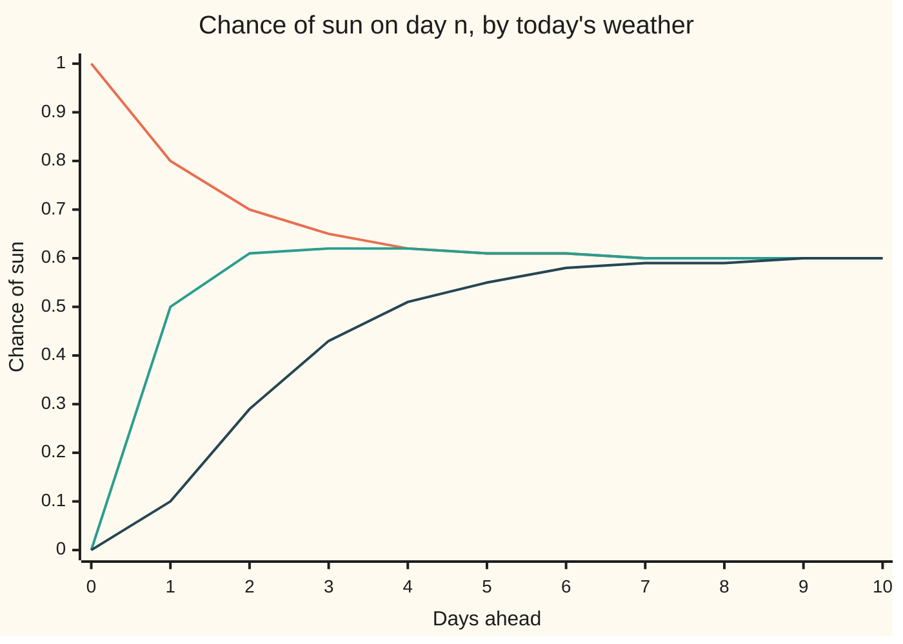

# Convergence to equilibrium: an irreducible aperiodic chain forgets where it started

Stochastic processes and calculus → Markov Chains → Forgetting the start → Convergence to equilibrium

---

## General Overview

A town's weather comes in three kinds: sunny, cloudy, rainy. Each day's weather depends only on the day before. After a sunny day, the next is sunny with chance 0.8, cloudy 0.1, rainy 0.1. After a cloudy day: sunny 0.5, cloudy 0.4, rainy 0.1. After a rainy day: sunny 0.1, cloudy 0.3, rainy 0.6. This is not the town of [stationary-distributions](04-stationary-distributions.md) or of the earlier cards of this shelf; its table is chosen so the rates come out round.

Three forecasters look at that table on three different mornings. One sees sun outside, one sees cloud, one sees rain. Each forecasts the chance of sun some days ahead. Tomorrow they disagree a lot: 0.8, 0.5 and 0.1. A week out they nearly agree: 0.603125, 0.602906, 0.587719. A month out all three say 0.600000 to six decimals. Today's weather has been forgotten. What remains is the town's long-run mix: sunny 60% of days, cloudy 20%, rainy 20%.

This card proves the forgetting and measures its speed. The proof runs two copies of the weather side by side until they meet; once met, they never part, and the chance they have not yet met caps how far apart their forecasts can be.

**A finite chain in which every state can reach every other, and which is not locked into a cycle, forgets its starting state: from any start, the forecast for day n tends to the stationary law, and the distance shrinks at least geometrically, at a rate set by the share every row of the table has in common.**

**What kind of fact this is:** a theorem, proved on this card in Why it works, with the complete argument in a folded Detailed proof.

### The picture: three forecasts of sun, one table



Orange: sunny today. Green: cloudy today. Dark: rainy today. These are exact chances, not simulations. All three lines close on 0.6. The weather itself never settles: it keeps changing every day. Only the forecast settles.

---

## The formula

Notation from earlier cards. The weather on day n is $X_n$, time in days. The table is the transition matrix $P$ ([markov-chains](01-markov-chains.md)): its entry $p_{ij}$ is the chance that tomorrow is state $j$ when today is state $i$. Its power $P^n$ holds the n-day chances ([multi-step-transitions](02-multi-step-transitions.md)). The stationary law $\pi$ is the mix that one day of weather leaves unchanged, $\pi P = \pi$ ([stationary-distributions](04-stationary-distributions.md)). For this table it is 0.6, 0.2, 0.2; the sunny column checks it: 0.6 × 0.8 + 0.2 × 0.5 + 0.2 × 0.1 = 0.6.

One more notion, met on [random-walks-on-graphs-and-mixing](../../09-Probability%20and%20statistics/14-Random%20Graphs%20and%20the%20Probabilistic%20Method/05-random-walks-on-graphs-and-mixing.md) and recalled here: a distance between two forecasts. A forecast is a law $\mu$ on the three states, three chances adding to 1. The **total variation distance** between two laws is half the sum of their gaps, state by state:

$$\operatorname{TV}(\mu, \nu) = \tfrac12 \sum_j \lvert \mu_j - \nu_j \rvert .$$

It equals the largest gap the two forecasts give to any one event, such as "not rainy". It runs from 0 (identical) to 1 (no overlap). The worst-start distance on day n is

$$d(n) = \max_i \operatorname{TV}\bigl(\text{row } i \text{ of } P^n,\ \pi\bigr).$$

The theorem. Suppose that for some block of $r$ days, every row of $P^r$ gives each state $j$ at least $\varepsilon\,\nu_j$, for one fixed law $\nu$ and a number $0 < \varepsilon \le 1$. This shared floor is called a **minorisation** (Doeblin's condition). Then

$$d(n) \;\le\; (1 - \varepsilon)^{\lfloor n / r \rfloor}, \qquad \text{so } (P^n)_{ij} \to \pi_j \text{ for every start } i .$$

The brackets $\lfloor n/r \rfloor$ count complete blocks of $r$ days. Every finite chain that is irreducible (every state can reach every other) and aperiodic (not locked into a cycle) has such a block ([classifying-states](03-classifying-states.md) defines both words).

**Read it aloud:** if every starting day shares a slice of size epsilon of its r-day forecast, then each block of r days removes at least that share of the remaining disagreement, whatever the start.

For the weather, one day is enough, $r = 1$. Every column of $P$ has smallest entry 0.1, so each row holds at least 0.1 of each state: $\varepsilon = 0.3$, spread evenly. The guarantee is $d(n) \le 0.7^n$. The town of stationary-distributions, with rows 0.6, 0.3, 0.1; 0.4, 0.4, 0.2; 0.4, 0.3, 0.3, has column minima 0.4, 0.3 and 0.1, so there $\varepsilon = 0.8$: from any start its forecasts are within $0.2^n$ of its mix 1/2, 1/3, 1/6.

The guarantee is not the true speed. That is read from the eigenvalues of $P$ (the numbers $\lambda$ with $vP = \lambda v$ for some nonzero row $v$). One is always 1. The largest of the others in size, $\lambda_2$, sets the rate:

$$d(n) \approx C\,\lvert\lambda_2\rvert^{\,n}, \qquad \text{here } \lambda_2 = 0.5 .$$

**Read it aloud:** past the first few days, each day cuts the worst disagreement by the factor lambda-two; for this town, it halves.

| Symbol | Plain meaning | In our example | Push it up and the answer… |
| --- | --- | --- | --- |
| $X_n$, $Y_n$, $n$ | the weather on day n in the first and second copy; the day | sunny, rainy on day 0 | — |
| $P$, $p_{ij}$, $P^n$, $i$, $j$ | the table; chance of $j$ tomorrow after $i$ today; the n-day table | 0.8 for sun after sun; 0.29 for sun two days after rain | — |
| $\mu$, $\nu$ | two laws: three chances adding to 1 | a forecast; $\nu$ even, one third each | — |
| $\pi$, $\Pi$ | the stationary law, $\pi P = \pi$; the table with every row $\pi$ | 0.6, 0.2, 0.2 | — |
| $\operatorname{TV}$ | total variation: largest gap on any event | 0.7 between sunny and rainy starts, day 1 | — |
| $d(n)$ | worst-start distance from $\pi$ on day n | 0.5 on day 1, 0.01228 on day 7 | — |
| $\varepsilon$, $r$ | the share every row holds in common; the block length in days | 0.3; 1 | $\varepsilon$ up: guarantee tightens; $r$ up: it loosens |
| $T$ | the first day the two copies agree | 1 with chance 0.3 | — |
| $\lambda$, $\lambda_2$, $\lambda_3$ | an eigenvalue; the other two eigenvalues of $P$ | 0.5 and 0.3 | forgetting slows |
| $A_2$, $A_3$, $I$ | the two fading pieces of $P^n$; the identity table | built from $P$ in Step 6 | — |
| $C$, $a$, $b$ | the constant in front of the rate; the weights on $0.5^n$ and $0.3^n$ from a rainy start | 1.6; −1.6 and 1 | — |
| $K$, $R$ | Detailed proof only: the block table $P^r$; the leftover table once the shared part is taken out | — | — |
| $X$, $Y$, $\nu'$ | Detailed proof only: the two copies; the second copy's starting law | — | — |
| $A$, $B$ | Detailed proof only: the states where $\mu$ gives more than $\nu$; any event | — | — |
| $\rho$, $m$, $k$, $s$ | Detailed proof only: a second stationary law; a number of whole blocks; a number of further blocks; a remainder in a division | — | — |
| $v$, $S$, $g$, $h$, $t$, $q$ | Detailed proof only: a fixed state; the set of return lengths at $v$; two return lengths with $g - h = 1$; a length to be built from them; its quotient by $h$ | — | — |
| $a_i$, $b_j$ | Detailed proof only: the length of a route from $i$ to $v$; of a route from $v$ to $j$ | — | — |

### When it holds

- **Finitely many states.** A random walk on all the whole numbers has no stationary law; its forecasts spread out forever.
- **Irreducible.** With two climates that never meet, a rainy start and a sunny start stay at distance 1.000000 on day 30 and every other day.
- **Aperiodic.** Weather forced round the cycle sunny, cloudy, rainy stays at worst-start distance 0.666667 on days 29 and 30, and on every day.
- **The same table every day.** If the table changes with the season, the target mix moves, and the theorem says nothing about chasing it.

These are sufficient, not necessary. A chain in which rain, once ended, never returns is reducible, yet every start settles on the same mix.

---

## Why it works

### Step 0: two copies that meet never part

Run two copies of the weather, $X_n$ from sunny and $Y_n$ from rainy. Each copy on its own must follow the table; how the two are tied together is free. Tie them so that once they share a day, one draw moves both from then on. Their forecasts can then differ only on paths where they have not yet met. Such a tying is a **coupling**, the word used from here on.

### Step 1: total variation is the largest gap on an event

The event that shows the largest gap is the set of states where $\mu$ gives more than $\nu$. The gaps sum to zero, so its gap is half their total size: hence the $\tfrac12$. Between a sunny and a rainy start on day 1, the rows are 0.8, 0.1, 0.1 and 0.1, 0.3, 0.6: the distance is 0.7, and the event "sunny" shows the whole of it.

### Step 2: the coupling inequality

For any event, the chance it happens to $X_n$ minus the chance it happens to $Y_n$ comes only from paths where $X_n \ne Y_n$: where they agree, the event happens to both or to neither. So

$$\operatorname{TV}\bigl(\text{law of } X_n,\ \text{law of } Y_n\bigr) \le \Pr(X_n \ne Y_n) = \Pr(T > n),$$

where $T$ is the first day the copies agree. The last step holds because met copies stay together.

### Step 3: the common share makes meeting likely

Every row of the table gives at least 0.1 to every state, so 0.3 of each row is the same whatever the day before. Split each day's move in two. With chance 0.3, make one draw from that shared part, one third to each state, and move both copies to it. With chance 0.7, move each copy by the rest of its own row, rescaled to add to 1. Each copy still follows the table: 0.3 times the shared part plus 0.7 times the rest is its row. On every day not yet met, the copies meet with chance at least 0.3. So

$$\Pr(T > n) \le 0.7^{\,n}.$$

The simulation below runs exactly this coupling, 20000 pairs: on day 1 the pairs have not met 0.7049 ± 0.0032 of the time, the exact 0.7 within two standard errors.

### Step 4: start the second copy in equilibrium

Now start $Y_n$ not on a rainy day but with a random day drawn from $\pi$. Because $\pi P = \pi$, the second copy's law is $\pi$ on every day. Steps 2 and 3 give, from any start $i$,

$$\operatorname{TV}\bigl(\text{row } i \text{ of } P^n,\ \pi\bigr) \le 0.7^{\,n}.$$

That is $d(n) \le 0.7^n$: on day 30 at most 2.254e-05. Every chance in $P^n$ is within that of its limit, so each tends to the stationary value.

### Step 5: any irreducible aperiodic chain has a working block

Some chains have a zero in every column of $P$, so no single day shares anything. Irreducibility says each state reaches every other by some route. Aperiodicity says the return times to a state have no common factor above 1. Together, on finitely many states, they give one block length $r$ after which every route length is available at once: every entry of $P^r$ is positive. Take $\nu$ and $\varepsilon$ from the column minima of $P^r$, run Step 3 once per block, and the guarantee becomes $(1 - \varepsilon)^{\lfloor n/r \rfloor}$. The same argument builds $\pi$ from scratch, without assuming it exists.

<details>
<summary>Detailed proof</summary>

**Setting.** A finite state set, a transition matrix $P$ with rows adding to 1, a law $\nu$ and $0 < \varepsilon \le 1$ with $(P^r)_{ij} \ge \varepsilon\,\nu_j$ for all $i, j$. Write $K = P^r$.

**(a) Total variation is the largest event gap.** Let $A$ be the states where $\mu_j > \nu_j$. For any event $B$, $\mu(B) - \nu(B) \le \mu(A) - \nu(A)$, since states outside $A$ add non-positive gaps and states in $A$ add positive ones. The gaps sum to 0, so $\mu(A) - \nu(A) = \tfrac12 \sum_j \lvert\mu_j - \nu_j\rvert$. The same holds with the roles swapped.

**(b) One step never increases the distance.** $\sum_j \lvert \sum_i (\mu_i - \nu_i) p_{ij} \rvert \le \sum_i \lvert \mu_i - \nu_i\rvert \sum_j p_{ij} = \sum_i \lvert \mu_i - \nu_i \rvert$, by the triangle inequality and row sums of 1.

**(c) One block contracts by $1 - \varepsilon$.** If $\varepsilon = 1$, every row of $K$ equals $\nu$, so $\mu K = \nu K$ for all laws and the distance after one block is 0. Otherwise set $R_{ij} = (K_{ij} - \varepsilon\nu_j)/(1 - \varepsilon)$: its entries are non-negative and its rows add to 1. Start copies $X$, $Y$ from laws $\mu$, $\nu'$, equal as often as possible: the overlap $\min(\mu_j, \nu'_j)$ has total $1 - \operatorname{TV}(\mu, \nu')$ by (a), so with that chance draw one state for both from the overlap, rescaled, and otherwise draw each from what its own law has left, rescaled. Each block, while unequal: with chance $\varepsilon$ both jump to one state drawn from $\nu$; otherwise each moves by its own row of $R$. Once equal, one draw from $K$ moves both. Each copy moves by $\varepsilon\nu_j + (1 - \varepsilon)R_{ij} = K_{ij}$, so its law after $m$ blocks is the start times $K^m$. The copies are unequal after $m$ blocks only if they started unequal and every coin failed: chance at most $(1 - \varepsilon)^m \operatorname{TV}(\mu, \nu')$. By the argument of Step 2, which uses only (a), $\operatorname{TV}(\mu K^m, \nu' K^m) \le (1 - \varepsilon)^m \operatorname{TV}(\mu, \nu')$.

**(d) The limit exists and is stationary.** Fix $\mu$ and put $\mu_m = \mu K^m$. Apply (c) to the starts $\mu$ and $\mu K^k$: $\operatorname{TV}(\mu_{m+k}, \mu_m) \le (1 - \varepsilon)^m$ for all $k$. Each coordinate is therefore a Cauchy sequence of real numbers, and converges (completeness of the reals, [supremum-and-completeness](../../06-Calculus%20and%20analysis/01-Limits%20and%20Continuity/02-supremum-and-completeness.md)). The limit $\pi$ has non-negative entries adding to 1. Matrix products are finite sums, so they pass to the limit: $\pi K = \pi$. If $\rho K = \rho$ too, (c) gives $\operatorname{TV}(\pi, \rho) \le (1 - \varepsilon)\operatorname{TV}(\pi, \rho)$, so $\rho = \pi$: the $K$-stationary law is unique. Since $(\pi P)K = (\pi K)P = \pi P$, uniqueness gives $\pi P = \pi$.

**(e) The rate for every day.** Write $n = mr + s$ with $0 \le s < r$. Then $\mu P^n = (\mu K^m) P^s$ and $\pi = \pi K^m P^s$. By (c) and then (b), $\operatorname{TV}(\mu P^n, \pi) \le (1 - \varepsilon)^m$. Taking $\mu$ as a certain start $i$ gives $d(n) \le (1 - \varepsilon)^{\lfloor n/r \rfloor}$.

**(f) Irreducible and aperiodic give a positive power.** Fix a state $v$. The set $S$ of lengths of routes from $v$ back to $v$ is closed under addition (go round twice). Aperiodic means its greatest common divisor is 1; finitely many members already have divisor 1, and Bézout's identity (the greatest common divisor of whole numbers is a whole-number combination of them) writes 1 as a whole-number combination of them. Collect the positive and negative terms: $1 = g - h$ with $g$ and $h$ in $S$, or $h = 0$. If $h = 0$ then $1 \in S$ and every length is a return length. Otherwise take any $t \ge 1$ with $t \ge h(h - 1)$ and write $t = qh + s$ with $0 \le s < h$; then $q \ge h - 1 \ge s$ and $t = s\,g + (q - s)\,h$, a sum of members of $S$. So every length $t \ge \max(1, h(h-1))$ is a return length. Irreducibility gives a route $i \to v$ of some length $a_i$ and $v \to j$ of some length $b_j$. For $r$ at least $\max(1, h(h-1))$ plus the largest $a_i + b_j$, every pair $i, j$ has a route of exactly $r$ days: $i \to v$, a loop at $v$, then $v \to j$. Each route has positive chance, so every entry of $P^r$ is positive. Let $\varepsilon = \sum_j \min_i (P^r)_{ij} > 0$ and $\nu_j = \min_i (P^r)_{ij} / \varepsilon$. Then (a) to (e) apply.

</details>

### Step 6: the true rate is the second eigenvalue

The guarantee 0.7 is a floor on progress; the actual speed is in the eigenvalues. For a 3 by 3 table, one eigenvalue is 1; the other two add to the trace minus 1 and multiply to the determinant. Here they are 0.5 and 0.3. With three different eigenvalues the n-day table splits into three fixed pieces:

$$P^n = \Pi + \lambda_2^{\,n} A_2 + \lambda_3^{\,n} A_3 ,$$

where $\Pi$ has every row equal to $\pi$, and $A_2 = (P - I)(P - \lambda_3 I) / \bigl((\lambda_2 - 1)(\lambda_2 - \lambda_3)\bigr)$, with $I$ the identity table and $A_3$ built the same way. This is Sylvester's formula. [diagonalisation-and-matrix-powers](../../03-Algebra/07-Eigenvalues%20and%20Symmetric%20Matrices/03-diagonalisation-and-matrix-powers.md) splits $P^n$ into fixed pieces times powers of the eigenvalues, and a factor $P - \lambda I$ wipes out the piece at $\lambda$ while scaling each other piece by its eigenvalue minus $\lambda$; so the product in $A_2$ keeps only the piece at $\lambda_2$, scaled by the denominator. The last two pieces fade, and the one at 0.5 fades last. So after a few days the distance halves every day: $d(31)/d(30)$ is 0.5 to six decimals in the check.

The guarantee is loose because it credits the copies with only a 0.3 chance of meeting each day; from most pairs of states they meet more often. For a sunny and a rainy start the coupling itself wastes nothing: computed exactly over the nine pairs of states, its chance of not having met equals the distance on each of days 1 to 6, 0.4100 on day 2. The simulated 0.4111 ± 0.0035 differs from it only by sampling noise.

The other road to the rate goes through the spectral gap $1 - \lvert\lambda_2\rvert$, here 0.5, which for a chain with detailed balance traps $d(n)$ between two multiples of $\lvert\lambda_2\rvert^n$, and through the conductance of a graph, which ties the gap to bottlenecks. It is done properly in expanders-and-mixing.

---

## Worked numbers, by hand

Rainy today. The chance of sun on day n is $0.6 + a\,0.5^n + b\,0.3^n$ for two constants $a$ and $b$, by Step 6. Day 0 gives $a + b = -0.6$; day 1 gives $0.5a + 0.3b = 0.1 - 0.6$. So $b = 1$ and $a = -1.6$.

| Step | Arithmetic | Value |
| --- | --- | --- |
| trace of $P$ | 0.8 + 0.4 + 0.6 | 1.8 |
| other two eigenvalues: sum | 1.8 − 1 | 0.8 |
| other two eigenvalues: product | determinant of $P$ | 0.15 |
| split them | (0.8 ± 0.2) / 2, where 0.2 is the square root of 0.8 × 0.8 − 4 × 0.15 | 0.5 and 0.3 |
| sun on day 1 | 0.6 − 0.8 + 0.3 | 0.1 |
| sun on day 2 | 0.6 − 0.4 + 0.09 | 0.29 |
| sun on day 3 | 0.6 − 0.2 + 0.027 | 0.427 |
| sun on day 7 | 0.6 − 0.0125 + 0.0002187 | 0.5877187 |
| worst-start distance, day 7 | exact, from $P^7$ | 0.01228 |
| guarantee, day 7 | $0.7^7$ | 0.08235 |
| **first day every start is within 0.01 of the mix** | exact $d(n)$ | **day 8** |

From a rainy morning, the forecast a week out gives sun 0.5877 against the long-run 0.6. From day 8 on, whatever today's weather, every event's chance is within 0.01 of its long-run value; on day 30, within 1.490e-09.

### What breaks if you drop a piece

| Mistake | Comes out at | What went wrong |
| --- | --- | --- |
| Weather forced round sunny → cloudy → rainy (period 3) | worst-start distance 0.666667 on day 29 and day 30 | aperiodicity dropped: the forecast from a sunny day is certain on every day |
| Two climates: rain never ends, sun and cloud never bring it | distance 1.000000 between sunny and rainy starts on day 30 | irreducibility dropped: two stationary laws, and today picks one |
| Reading the guarantee 0.7 as the rate | 13 days to reach 0.01 | the true factor is $\lambda_2$ = 0.5; the true answer is 8 days |

---

## Code, from first principles, and it actually runs

Three roads. Road 1 takes exact whole-number powers of $P$ (ten to the n times $P^n$, so nothing is rounded). Road 2 is the eigenvalue formula of Step 6, with eigenvalues from trace and determinant; the two agree on all nine entries for 31 days. Road 3 simulates the coupling of Step 3 with a SplitMix64 generator, seed 20260929, 20000 pairs, and asserts both inequalities to within three standard errors; it also runs the same coupling exactly over the nine pairs of states and asserts that its chance of not having met equals the distance. A month from a rainy start, 20000 runs, must land within four standard errors of 0.6. Other asserts: $\pi P = \pi$ exactly, the guarantee on every day to 31, and $d(31)/d(30)$ against $\lambda_2$ from the quadratic. The by-hand weights $a$, $b$, the exact day 8 and both what-breaks chains are exact and asserted; the bound's days 4 and 13 come from the computed $1 - \varepsilon$, each checked against the closed form $\lceil \log(\text{limit}) / \log(1 - \varepsilon) \rceil$.

### Python

```python
# Convergence to equilibrium -- the check behind the card.  Standard library only.
# Weather in states 0 sunny, 1 cloudy, 2 rainy; one step is one day.
# Road 1: exact matrix powers in whole numbers (10^n P^n).  Road 2: the eigenvalue
# formula P^n = Pi + (1/2)^n A2 + (3/10)^n A3.  Road 3: a seeded simulation of the
# coupling used in the proof, and of a month of weather.
from math import sqrt, log, ceil

P10 = [[8, 1, 1], [5, 4, 1], [1, 3, 6]]      # P in tenths
PI5 = [3, 1, 1]                              # stationary law in fifths: 0.6, 0.2, 0.2

def mat_mul(a, b):
    return [[sum(a[i][k] * b[k][j] for k in range(3)) for j in range(3)] for i in range(3)]

def powers(p, top):                          # exact whole-number powers of p, n = 0..top
    out, a = [], [[int(i == j) for j in range(3)] for i in range(3)]
    for n in range(top + 1):
        out.append(a); a = mat_mul(a, p)
    return out

def tv(u, v):                                # total variation distance between two laws
    return 0.5 * sum(abs(x - y) for x, y in zip(u, v))

def d_exact(a, n, pin, pid):                  # worst-start distance to pi = pin / pid, one exact division
    num = max(sum(abs(pid * a[i][j] - pin[j] * 10 ** n) for j in range(3)) for i in range(3))
    return num / (2 * pid * 10 ** n)

def sci(x): return f"{x:.3e}"

def pw(x, n):                                # x to the n by repeated multiplication
    out = 1.0
    for _ in range(n): out *= x
    return out

# ---- road 1: exact powers ----
A = powers(P10, 31)
assert all(sum(PI5[i] * P10[i][j] for i in range(3)) == 10 * PI5[j] for j in range(3))  # pi P = pi
d = [d_exact(A[n], n, PI5, 5) for n in range(32)]
Pn = lambda n: [[A[n][i][j] / 10 ** n for j in range(3)] for i in range(3)]

# ---- road 2: eigenvalues from trace and determinant, then Sylvester's formula ----
P = [[x / 10 for x in row] for row in P10]
tr = P[0][0] + P[1][1] + P[2][2]
det = (P[0][0] * (P[1][1] * P[2][2] - P[1][2] * P[2][1]) - P[0][1] * (P[1][0] * P[2][2] - P[1][2] * P[2][0])
       + P[0][2] * (P[1][0] * P[2][1] - P[1][1] * P[2][0]))
s, pr = tr - 1.0, det                        # the other two eigenvalues: sum s, product pr
l2 = (s + sqrt(s * s - 4 * pr)) / 2
l3 = (s - sqrt(s * s - 4 * pr)) / 2
I = [[float(i == j) for j in range(3)] for i in range(3)]
def comb(a, b, x, y): return [[x * a[i][j] + y * b[i][j] for j in range(3)] for i in range(3)]
def proj(la, lb, lc):                        # (P - lb I)(P - lc I) / ((la - lb)(la - lc))
    m = mat_mul(comb(P, I, 1, -lb), comb(P, I, 1, -lc))
    return [[x / ((la - lb) * (la - lc)) for x in row] for row in m]
PI, A2, A3 = proj(1.0, l2, l3), proj(l2, 1.0, l3), proj(l3, 1.0, l2)
spec = lambda n: [[PI[i][j] + pw(l2, n) * A2[i][j] + pw(l3, n) * A3[i][j] for j in range(3)] for i in range(3)]
worst = max(abs(spec(n)[i][j] - Pn(n)[i][j]) for n in range(31) for i in range(3) for j in range(3))
assert worst < 1e-12                          # the two roads agree on every entry, 31 days
eps = sum(min(P10[i][j] for i in range(3)) for j in range(3)) / 10   # Doeblin's common part
print(f"eigenvalues from trace {tr:.1f} and determinant {det:.2f}: other two sum {s:.1f}, product {pr:.2f}, root {sqrt(s * s - 4 * pr):.1f}: 1, {l2:.6f}, {l3:.6f}")
print(f"stationary law: sunny {PI[0][0]:.6f} cloudy {PI[0][1]:.6f} rainy {PI[0][2]:.6f}")
print("weather P, rows sunny cloudy rainy: " + " | ".join(" ".join(f"{x / 10:.1f}" for x in row) for row in P10))
print(f"common part of the rows eps = {eps:.1f}; guaranteed factor 1 - eps = {1 - eps:.1f}")
print(f"roads 1 and 2 agree on all 9 entries, days 0..30, to 1e-12: {'yes' if worst < 1e-12 else 'no'}; d(31)/d(30) = {d[31] / d[30]:.6f}; d(30)/0.5^30 = {d[30] / pw(0.5, 30):.4f}")

# ---- the forecasts: chance of sun on day n from each start ----
print("day  sun|sunny  sun|cloudy  sun|rainy   d(n) exact  bound 0.7^n  0.5^n")
for n in list(range(11)) + [14, 30]:
    q = Pn(n)
    print(f"{n:3d}  {q[0][0]:9.6f}  {q[1][0]:10.6f}  {q[2][0]:9.6f}   {sci(d[n])}  {sci(pw(0.7, n))}  {sci(pw(0.5, n))}")
assert all(d[n] <= pw(0.7, n) + 1e-15 for n in range(32))          # the guarantee holds every day
assert abs(d[31] / d[30] - l2) < 1e-6                             # the true rate is lambda2
print(f"by hand, rainy start: sun on day n = 0.6 + a 0.5^n + b 0.3^n, a = {A2[2][0]:.4f}, b = {A3[2][0]:.4f}")
assert abs(A2[2][0] + 1.6) < 1e-9 and abs(A3[2][0] - 1) < 1e-9   # the by-hand weights a, b
for n in (1, 2, 3, 7):
    print(f"  day {n}: a 0.5^n = {A2[2][0] * pw(l2, n):.7f}  b 0.3^n = {A3[2][0] * pw(l3, n):.7f}  sun = {PI[2][0] + A2[2][0] * pw(l2, n) + A3[2][0] * pw(l3, n):.7f}")
first = lambda f, lim: next(n for n in range(200) if f(n) <= lim)
for lim in (0.25, 0.01):
    print(f"first day d(n) <= {lim}: exact {first(lambda n: d[n], lim)}, from bound {first(lambda n: pw(1 - eps, n), lim)}")
    assert first(lambda n: pw(1 - eps, n), lim) == ceil(log(lim) / log(1 - eps))   # the bound's day, two ways
assert first(lambda n: d[n], 0.01) == 8                                            # the exact day, from P^n
print("chart, sun|sunny " + " ".join(f"{Pn(n)[0][0]:.2f}" for n in range(11)))
print("chart, sun|cloudy " + " ".join(f"{Pn(n)[1][0]:.2f}" for n in range(11)))
print("chart, sun|rainy " + " ".join(f"{Pn(n)[2][0]:.2f}" for n in range(11)))

# ---- road 3: simulation, SplitMix64 seed 20260929 ----
state = 20260929
def rand():
    global state
    state = (state + 0x9E3779B97F4A7C15) & 0xFFFFFFFFFFFFFFFF
    z = state
    z = ((z ^ (z >> 30)) * 0xBF58476D1CE4E5B9) & 0xFFFFFFFFFFFFFFFF
    z = ((z ^ (z >> 27)) * 0x94D049BB133111EB) & 0xFFFFFFFFFFFFFFFF
    return ((z ^ (z >> 31)) >> 11) / 9007199254740992.0
def pick(w, u):                               # state drawn from weights w, by one uniform u
    t, acc = u * sum(w), 0
    for j in range(3):
        acc += w[j]
        if t < acc: return j
    return 2
RES = [[P10[i][j] - 1 for j in range(3)] for i in range(3)]      # what is left after the common part
N, DAYS = 20000, 8
alive = [0] * (DAYS + 1)                     # pairs not yet met after n days
for _ in range(N):
    x, y = 0, 2                              # one copy starts sunny, the other rainy
    for n in range(1, DAYS + 1):
        if x == y:
            x = y = pick(P10[x], rand())
        elif rand() < eps:
            x = y = pick([1, 1, 1], rand())  # the shared draw: both land together
        else:
            x, y = pick(RES[x], rand()), pick(RES[y], rand())
        alive[n] += x != y
print(f"coupling, {N} pairs from sunny and rainy: n, P(not met) +- se, bound 0.7^n, exact P(not met), exact TV")
unmet = [[0.0, 0.0, 1.0], [0.0] * 3, [0.0] * 3]  # exact chance on each unmet pair (x, y); day 0 sunny, rainy
for n in range(1, 7):
    p = alive[n] / N
    se = sqrt(p * (1 - p) / N)
    gap = tv(Pn(n)[0], Pn(n)[2])
    unmet = [[0.0 if a == b else sum(unmet[x][y] * (1 - eps) * RES[x][a] * RES[y][b] / (sum(RES[x]) * sum(RES[y])) for x in range(3) for y in range(3)) for b in range(3)] for a in range(3)]
    print(f"  {n}  {p:.4f} +- {se:.4f}  {pw(0.7, n):.4f}  {sum(map(sum, unmet)):.4f}  {gap:.4f}")
    assert gap <= p + 3 * se and p <= pw(0.7, n) + 3 * se           # coupling inequality, Doeblin bound
    assert abs(sum(map(sum, unmet)) - gap) < 1e-12                  # for this pair the coupling is exact
sunny = 0
for _ in range(N):
    x = 2
    for _ in range(30): x = pick(P10[x], rand())
    sunny += x == 0
p = sunny / N
se = sqrt(p * (1 - p) / N)
print(f"month from rainy, {N} runs: sunny on day 30 {p:.4f} +- {se:.4f}, exact {Pn(30)[2][0]:.6f}")
assert abs(p - 0.6) < 4 * se

# ---- what breaks ----
CYC = [[0, 10, 0], [0, 0, 10], [10, 0, 0]]   # sunny -> cloudy -> rainy -> sunny, period 3
C = powers(CYC, 30)
print(f"breaks, cycle: d(29) {d_exact(C[29], 29, [1, 1, 1], 3):.6f}  d(30) {d_exact(C[30], 30, [1, 1, 1], 3):.6f}")
assert all(abs(d_exact(C[n], n, [1, 1, 1], 3) - 2 / 3) < 1e-12 for n in range(31))   # never settles
RED = [[8, 2, 0], [5, 5, 0], [0, 0, 10]]     # rainy never leaves, the others never reach it
R = powers(RED, 30)
print(f"breaks, two climates: TV(start sunny, start rainy) day 30 {tv(R[30][0], R[30][2]) / 10 ** 30:.6f}")
assert all(abs(tv(R[n][0], R[n][2]) / 10 ** n - 1) < 1e-12 for n in range(31))   # the starts never meet
```

**Ran 2026-10-07 on macOS, Python 3.14.6, standard library only. All checks passed. Output, pasted from the run:**

```
eigenvalues from trace 1.8 and determinant 0.15: other two sum 0.8, product 0.15, root 0.2: 1, 0.500000, 0.300000
stationary law: sunny 0.600000 cloudy 0.200000 rainy 0.200000
weather P, rows sunny cloudy rainy: 0.8 0.1 0.1 | 0.5 0.4 0.1 | 0.1 0.3 0.6
common part of the rows eps = 0.3; guaranteed factor 1 - eps = 0.7
roads 1 and 2 agree on all 9 entries, days 0..30, to 1e-12: yes; d(31)/d(30) = 0.500000; d(30)/0.5^30 = 1.6000
day  sun|sunny  sun|cloudy  sun|rainy   d(n) exact  bound 0.7^n  0.5^n
  0   1.000000    0.000000   0.000000   8.000e-01  1.000e+00  1.000e+00
  1   0.800000    0.500000   0.100000   5.000e-01  7.000e-01  5.000e-01
  2   0.700000    0.610000   0.290000   3.100e-01  4.900e-01  2.500e-01
  3   0.650000    0.623000   0.427000   1.730e-01  3.430e-01  1.250e-01
  4   0.625000    0.616900   0.508100   9.190e-02  2.401e-01  6.250e-02
  5   0.612500    0.610070   0.552430   4.757e-02  1.681e-01  3.125e-02
  6   0.606250    0.605521   0.575729   2.427e-02  1.176e-01  1.562e-02
  7   0.603125    0.602906   0.587719   1.228e-02  8.235e-02  7.812e-03
  8   0.601562    0.601497   0.593816   6.184e-03  5.765e-02  3.906e-03
  9   0.600781    0.600762   0.596895   3.105e-03  4.035e-02  1.953e-03
 10   0.600391    0.600385   0.598443   1.557e-03  2.825e-02  9.766e-04
 14   0.600024    0.600024   0.599902   9.761e-05  6.782e-03  6.104e-05
 30   0.600000    0.600000   0.600000   1.490e-09  2.254e-05  9.313e-10
by hand, rainy start: sun on day n = 0.6 + a 0.5^n + b 0.3^n, a = -1.6000, b = 1.0000
  day 1: a 0.5^n = -0.8000000  b 0.3^n = 0.3000000  sun = 0.1000000
  day 2: a 0.5^n = -0.4000000  b 0.3^n = 0.0900000  sun = 0.2900000
  day 3: a 0.5^n = -0.2000000  b 0.3^n = 0.0270000  sun = 0.4270000
  day 7: a 0.5^n = -0.0125000  b 0.3^n = 0.0002187  sun = 0.5877187
first day d(n) <= 0.25: exact 3, from bound 4
first day d(n) <= 0.01: exact 8, from bound 13
chart, sun|sunny 1.00 0.80 0.70 0.65 0.62 0.61 0.61 0.60 0.60 0.60 0.60
chart, sun|cloudy 0.00 0.50 0.61 0.62 0.62 0.61 0.61 0.60 0.60 0.60 0.60
chart, sun|rainy 0.00 0.10 0.29 0.43 0.51 0.55 0.58 0.59 0.59 0.60 0.60
coupling, 20000 pairs from sunny and rainy: n, P(not met) +- se, bound 0.7^n, exact P(not met), exact TV
  1  0.7049 +- 0.0032  0.7000  0.7000  0.7000
  2  0.4111 +- 0.0035  0.4900  0.4100  0.4100
  3  0.2247 +- 0.0030  0.3430  0.2230  0.2230
  4  0.1177 +- 0.0023  0.2401  0.1169  0.1169
  5  0.0607 +- 0.0017  0.1681  0.0601  0.0601
  6  0.0307 +- 0.0012  0.1176  0.0305  0.0305
month from rainy, 20000 runs: sunny on day 30 0.6020 +- 0.0035, exact 0.600000
breaks, cycle: d(29) 0.666667  d(30) 0.666667
breaks, two climates: TV(start sunny, start rainy) day 30 1.000000
```

### Rust

```rust
// Convergence to equilibrium -- the check behind the card.  Rust std only.
// Weather in states 0 sunny, 1 cloudy, 2 rainy; one step is one day.
// Road 1: exact matrix powers in whole numbers (10^n P^n).  Road 2: the eigenvalue
// formula P^n = Pi + (1/2)^n A2 + (3/10)^n A3.  Road 3: a seeded simulation of the
// coupling used in the proof, and of a month of weather.
type M = [[i128; 3]; 3]; // exact whole numbers
type F = [[f64; 3]; 3]; // floating point
const P10: M = [[8, 1, 1], [5, 4, 1], [1, 3, 6]]; // P in tenths
const PI5: [i128; 3] = [3, 1, 1]; // stationary law in fifths: 0.6, 0.2, 0.2

fn mat_mul(a: &M, b: &M) -> M { let mut c = [[0i128; 3]; 3]; for i in 0..3 { for j in 0..3 { for k in 0..3 { c[i][j] += a[i][k] * b[k][j]; } } } c }
fn fmul(a: &F, b: &F) -> F { let mut c = [[0.0f64; 3]; 3]; for i in 0..3 { for j in 0..3 { for k in 0..3 { c[i][j] += a[i][k] * b[k][j]; } } } c }
fn powers(p: &M, top: usize) -> Vec<M> { // exact whole-number powers of p, n = 0..top
    let mut out = Vec::new();
    let mut a: M = [[1, 0, 0], [0, 1, 0], [0, 0, 1]];
    for _ in 0..=top { out.push(a); a = mat_mul(&a, p); }
    out
}
fn ten(n: usize) -> i128 { 10i128.pow(n as u32) }
fn tv(u: &[f64; 3], v: &[f64; 3]) -> f64 { 0.5 * (0..3).map(|j| (u[j] - v[j]).abs()).sum::<f64>() }
fn d_exact(a: &M, n: usize, pin: [i128; 3], pid: i128) -> f64 { // worst-start distance to pi = pin / pid
    let num = (0..3).map(|i| (0..3).map(|j| (pid * a[i][j] - pin[j] * ten(n)).abs()).sum::<i128>()).max().unwrap();
    num as f64 / (2 * pid * ten(n)) as f64
}
fn sci(x: f64) -> String { // Python's {:.3e} layout: two-digit signed exponent
    let s = format!("{:.3e}", x);
    let (m, e) = s.split_once('e').unwrap();
    format!("{}e{}{:0>2}", m, if e.starts_with('-') { '-' } else { '+' }, e.trim_start_matches('-'))
}
fn pw(x: f64, n: usize) -> f64 { let mut out = 1.0; for _ in 0..n { out *= x; } out }
fn pn(a: &M, n: usize) -> F {
    let mut f = [[0.0; 3]; 3];
    for i in 0..3 { for j in 0..3 { f[i][j] = a[i][j] as f64 / ten(n) as f64; } }
    f
}
struct Rng(u64);
impl Rng {
    fn next(&mut self) -> f64 { // SplitMix64, top 53 bits as a uniform in [0, 1)
        self.0 = self.0.wrapping_add(0x9E3779B97F4A7C15);
        let mut z = self.0;
        z = (z ^ (z >> 30)).wrapping_mul(0xBF58476D1CE4E5B9);
        z = (z ^ (z >> 27)).wrapping_mul(0x94D049BB133111EB);
        ((z ^ (z >> 31)) >> 11) as f64 / 9007199254740992.0
    }
}
fn pick(w: &[i128; 3], u: f64) -> usize { // state drawn from weights w, by one uniform u
    let t = u * (w[0] + w[1] + w[2]) as f64;
    let mut acc = 0i128;
    for j in 0..3 { acc += w[j]; if t < acc as f64 { return j; } }
    2
}

fn main() {
    // ---- road 1: exact powers ----
    let a = powers(&P10, 31);
    for j in 0..3 { assert_eq!((0..3).map(|i| PI5[i] * P10[i][j]).sum::<i128>(), 10 * PI5[j]); } // pi P = pi
    let d: Vec<f64> = (0..32).map(|n| d_exact(&a[n], n, PI5, 5)).collect();

    // ---- road 2: eigenvalues from trace and determinant, then Sylvester's formula ----
    let mut p = [[0.0; 3]; 3];
    for i in 0..3 { for j in 0..3 { p[i][j] = P10[i][j] as f64 / 10.0; } }
    let tr = p[0][0] + p[1][1] + p[2][2];
    let det = p[0][0] * (p[1][1] * p[2][2] - p[1][2] * p[2][1]) - p[0][1] * (p[1][0] * p[2][2] - p[1][2] * p[2][0])
        + p[0][2] * (p[1][0] * p[2][1] - p[1][1] * p[2][0]);
    let (s, pr) = (tr - 1.0, det); // the other two eigenvalues: sum s, product pr
    let l2 = (s + (s * s - 4.0 * pr).sqrt()) / 2.0;
    let l3 = (s - (s * s - 4.0 * pr).sqrt()) / 2.0;
    let shift = |lb: f64| { let mut m = p; for i in 0..3 { m[i][i] -= lb; } m };
    let proj = |la: f64, lb: f64, lc: f64| { // (P - lb I)(P - lc I) / ((la - lb)(la - lc))
        let mut m = fmul(&shift(lb), &shift(lc));
        for i in 0..3 { for j in 0..3 { m[i][j] /= (la - lb) * (la - lc); } }
        m
    };
    let (pi, a2, a3) = (proj(1.0, l2, l3), proj(l2, 1.0, l3), proj(l3, 1.0, l2));
    let mut worst: f64 = 0.0;
    for n in 0..31 {
        let q = pn(&a[n], n);
        for i in 0..3 { for j in 0..3 {
            let sp = pi[i][j] + pw(l2, n) * a2[i][j] + pw(l3, n) * a3[i][j];
            worst = worst.max((sp - q[i][j]).abs());
        } }
    }
    assert!(worst < 1e-12); // the two roads agree on every entry, 31 days
    let eps = (0..3).map(|j| (0..3).map(|i| P10[i][j]).min().unwrap()).sum::<i128>() as f64 / 10.0; // Doeblin's common part
    println!("eigenvalues from trace {:.1} and determinant {:.2}: other two sum {:.1}, product {:.2}, root {:.1}: 1, {:.6}, {:.6}", tr, det, s, pr, (s * s - 4.0 * pr).sqrt(), l2, l3);
    println!("stationary law: sunny {:.6} cloudy {:.6} rainy {:.6}", pi[0][0], pi[0][1], pi[0][2]);
    let rows: Vec<String> = P10.iter().map(|r| r.iter().map(|&x| format!("{:.1}", x as f64 / 10.0)).collect::<Vec<_>>().join(" ")).collect();
    println!("weather P, rows sunny cloudy rainy: {}", rows.join(" | "));
    println!("common part of the rows eps = {:.1}; guaranteed factor 1 - eps = {:.1}", eps, 1.0 - eps);
    println!("roads 1 and 2 agree on all 9 entries, days 0..30, to 1e-12: {}; d(31)/d(30) = {:.6}; d(30)/0.5^30 = {:.4}", if worst < 1e-12 { "yes" } else { "no" }, d[31] / d[30], d[30] / pw(0.5, 30));

    // ---- the forecasts: chance of sun on day n from each start ----
    println!("day  sun|sunny  sun|cloudy  sun|rainy   d(n) exact  bound 0.7^n  0.5^n");
    for n in (0..11).chain([14, 30]) {
        let q = pn(&a[n], n);
        println!("{:3}  {:9.6}  {:10.6}  {:9.6}   {}  {}  {}", n, q[0][0], q[1][0], q[2][0], sci(d[n]), sci(pw(0.7, n)), sci(pw(0.5, n)));
    }
    for n in 0..32 { assert!(d[n] <= pw(0.7, n) + 1e-15); } // the guarantee holds every day
    assert!((d[31] / d[30] - l2).abs() < 1e-6); // the true rate is lambda2
    println!("by hand, rainy start: sun on day n = 0.6 + a 0.5^n + b 0.3^n, a = {:.4}, b = {:.4}", a2[2][0], a3[2][0]);
    assert!((a2[2][0] + 1.6).abs() < 1e-9 && (a3[2][0] - 1.0).abs() < 1e-9); // the by-hand weights a, b
    for n in [1, 2, 3, 7] {
        let (t2, t3) = (a2[2][0] * pw(l2, n), a3[2][0] * pw(l3, n));
        println!("  day {}: a 0.5^n = {:.7}  b 0.3^n = {:.7}  sun = {:.7}", n, t2, t3, pi[2][0] + t2 + t3);
    }
    for lim in [0.25, 0.01] {
        let ex = (0..200).find(|&n| d[n.min(31)] <= lim).unwrap();
        let bd = (0..200).find(|&n| pw(1.0 - eps, n) <= lim).unwrap();
        println!("first day d(n) <= {}: exact {}, from bound {}", lim, ex, bd);
        assert!(bd as f64 == (lim.ln() / (1.0 - eps).ln()).ceil()); // the bound's day, two ways
        if lim == 0.01 { assert!(ex == 8); } // the exact day, from P^n
    }
    let row = |f: &dyn Fn(usize) -> f64| (0..11).map(|n| format!("{:.2}", f(n))).collect::<Vec<_>>().join(" ");
    println!("chart, sun|sunny {}", row(&|n| pn(&a[n], n)[0][0]));
    println!("chart, sun|cloudy {}", row(&|n| pn(&a[n], n)[1][0]));
    println!("chart, sun|rainy {}", row(&|n| pn(&a[n], n)[2][0]));

    // ---- road 3: simulation, SplitMix64 seed 20260929 ----
    let mut rng = Rng(20260929);
    let mut res = P10;
    for i in 0..3 { for j in 0..3 { res[i][j] -= 1; } } // what is left after the common part
    let (nn, days) = (20000usize, 8usize);
    let mut alive = vec![0usize; days + 1]; // pairs not yet met after n days
    for _ in 0..nn {
        let (mut x, mut y) = (0usize, 2usize); // one copy starts sunny, the other rainy
        for n in 1..=days {
            if x == y {
                x = pick(&P10[x], rng.next()); y = x;
            } else if rng.next() < eps {
                x = pick(&[1, 1, 1], rng.next()); y = x; // the shared draw: both land together
            } else {
                x = pick(&res[x], rng.next()); y = pick(&res[y], rng.next());
            }
            if x != y { alive[n] += 1; }
        }
    }
    println!("coupling, {} pairs from sunny and rainy: n, P(not met) +- se, bound 0.7^n, exact P(not met), exact TV", nn);
    let mut unmet = [[0.0f64; 3]; 3]; unmet[0][2] = 1.0; // exact chance on each unmet pair (x, y); day 0 sunny, rainy
    for n in 1..7 {
        let pr = alive[n] as f64 / nn as f64;
        let se = (pr * (1.0 - pr) / nn as f64).sqrt();
        let q = pn(&a[n], n);
        let gap = tv(&q[0], &q[2]);
        let mut nx = [[0.0f64; 3]; 3];
        for u in 0..3 { for w in 0..3 { if u != w { for x in 0..3 { for y in 0..3 { nx[u][w] += unmet[x][y] * (1.0 - eps) * res[x][u] as f64 * res[y][w] as f64 / (res[x].iter().sum::<i128>() * res[y].iter().sum::<i128>()) as f64; } } } } }
        unmet = nx;
        let exm = unmet.iter().map(|r| r.iter().sum::<f64>()).sum::<f64>();
        println!("  {}  {:.4} +- {:.4}  {:.4}  {:.4}  {:.4}", n, pr, se, pw(0.7, n), exm, gap);
        assert!(gap <= pr + 3.0 * se && pr <= pw(0.7, n) + 3.0 * se); // coupling inequality, Doeblin bound
        assert!((exm - gap).abs() < 1e-12); // for this pair the coupling is exact
    }
    let mut sunny = 0usize;
    for _ in 0..nn {
        let mut x = 2usize;
        for _ in 0..30 { x = pick(&P10[x], rng.next()); }
        if x == 0 { sunny += 1; }
    }
    let (pr, se) = (sunny as f64 / nn as f64, ((sunny as f64 / nn as f64) * (1.0 - sunny as f64 / nn as f64) / nn as f64).sqrt());
    println!("month from rainy, {} runs: sunny on day 30 {:.4} +- {:.4}, exact {:.6}", nn, pr, se, pn(&a[30], 30)[2][0]);
    assert!((pr - 0.6).abs() < 4.0 * se);

    // ---- what breaks ----
    let c = powers(&[[0, 10, 0], [0, 0, 10], [10, 0, 0]], 30); // sunny -> cloudy -> rainy -> sunny, period 3
    println!("breaks, cycle: d(29) {:.6}  d(30) {:.6}", d_exact(&c[29], 29, [1, 1, 1], 3), d_exact(&c[30], 30, [1, 1, 1], 3));
    for n in 0..31 { assert!((d_exact(&c[n], n, [1, 1, 1], 3) - 2.0 / 3.0).abs() < 1e-12); } // never settles
    let r = powers(&[[8, 2, 0], [5, 5, 0], [0, 0, 10]], 30); // rainy never leaves, the others never reach it
    println!("breaks, two climates: TV(start sunny, start rainy) day 30 {:.6}", tv(&pn(&r[30], 30)[0], &pn(&r[30], 30)[2]));
    for n in 0..31 { assert!((tv(&pn(&r[n], n)[0], &pn(&r[n], n)[2]) - 1.0).abs() < 1e-12); } // the starts never meet
}
```

**Ran 2026-10-07 on macOS, rustc 1.98.1, no crates. All checks passed. Output, pasted from the run:**

```
eigenvalues from trace 1.8 and determinant 0.15: other two sum 0.8, product 0.15, root 0.2: 1, 0.500000, 0.300000
stationary law: sunny 0.600000 cloudy 0.200000 rainy 0.200000
weather P, rows sunny cloudy rainy: 0.8 0.1 0.1 | 0.5 0.4 0.1 | 0.1 0.3 0.6
common part of the rows eps = 0.3; guaranteed factor 1 - eps = 0.7
roads 1 and 2 agree on all 9 entries, days 0..30, to 1e-12: yes; d(31)/d(30) = 0.500000; d(30)/0.5^30 = 1.6000
day  sun|sunny  sun|cloudy  sun|rainy   d(n) exact  bound 0.7^n  0.5^n
  0   1.000000    0.000000   0.000000   8.000e-01  1.000e+00  1.000e+00
  1   0.800000    0.500000   0.100000   5.000e-01  7.000e-01  5.000e-01
  2   0.700000    0.610000   0.290000   3.100e-01  4.900e-01  2.500e-01
  3   0.650000    0.623000   0.427000   1.730e-01  3.430e-01  1.250e-01
  4   0.625000    0.616900   0.508100   9.190e-02  2.401e-01  6.250e-02
  5   0.612500    0.610070   0.552430   4.757e-02  1.681e-01  3.125e-02
  6   0.606250    0.605521   0.575729   2.427e-02  1.176e-01  1.562e-02
  7   0.603125    0.602906   0.587719   1.228e-02  8.235e-02  7.812e-03
  8   0.601562    0.601497   0.593816   6.184e-03  5.765e-02  3.906e-03
  9   0.600781    0.600762   0.596895   3.105e-03  4.035e-02  1.953e-03
 10   0.600391    0.600385   0.598443   1.557e-03  2.825e-02  9.766e-04
 14   0.600024    0.600024   0.599902   9.761e-05  6.782e-03  6.104e-05
 30   0.600000    0.600000   0.600000   1.490e-09  2.254e-05  9.313e-10
by hand, rainy start: sun on day n = 0.6 + a 0.5^n + b 0.3^n, a = -1.6000, b = 1.0000
  day 1: a 0.5^n = -0.8000000  b 0.3^n = 0.3000000  sun = 0.1000000
  day 2: a 0.5^n = -0.4000000  b 0.3^n = 0.0900000  sun = 0.2900000
  day 3: a 0.5^n = -0.2000000  b 0.3^n = 0.0270000  sun = 0.4270000
  day 7: a 0.5^n = -0.0125000  b 0.3^n = 0.0002187  sun = 0.5877187
first day d(n) <= 0.25: exact 3, from bound 4
first day d(n) <= 0.01: exact 8, from bound 13
chart, sun|sunny 1.00 0.80 0.70 0.65 0.62 0.61 0.61 0.60 0.60 0.60 0.60
chart, sun|cloudy 0.00 0.50 0.61 0.62 0.62 0.61 0.61 0.60 0.60 0.60 0.60
chart, sun|rainy 0.00 0.10 0.29 0.43 0.51 0.55 0.58 0.59 0.59 0.60 0.60
coupling, 20000 pairs from sunny and rainy: n, P(not met) +- se, bound 0.7^n, exact P(not met), exact TV
  1  0.7049 +- 0.0032  0.7000  0.7000  0.7000
  2  0.4111 +- 0.0035  0.4900  0.4100  0.4100
  3  0.2247 +- 0.0030  0.3430  0.2230  0.2230
  4  0.1177 +- 0.0023  0.2401  0.1169  0.1169
  5  0.0607 +- 0.0017  0.1681  0.0601  0.0601
  6  0.0307 +- 0.0012  0.1176  0.0305  0.0305
month from rainy, 20000 runs: sunny on day 30 0.6020 +- 0.0035, exact 0.600000
breaks, cycle: d(29) 0.666667  d(30) 0.666667
breaks, two climates: TV(start sunny, start rainy) day 30 1.000000
```

The coupling rows are one seeded sample; another seed moves each estimate by about one standard error, never the exact columns.

> [!TIP]
> **Try changing**
> - **Start the month on a sunny day.** Guess first: does day 30 care? Change `x = 2` to `x = 0` in the month loop. The estimate stays within a few standard errors of 0.6, because $d(30)$ is 1.490e-09.
> - **Claim a bigger common share.** Guess first: what breaks if the coupling branch tests `eps + 0.1`? The copies stop following the table and meet too often; the chance of not having met on day 1 falls below the exact distance 0.7, and the coupling assert stops the run.
> - **Read the guarantee as the forecast.** Guess first: how many days does $0.7^n$ say until 0.25? The check prints 4; the exact answer is 3.

---

## The usual mistake

> [!warning]
> **Believing the weather settles.** Convergence to equilibrium is about forecasts, not about the sky. The chance of sun on day 30 is 0.600000 from any start, yet the weather still changes every day: sunny, then maybe rainy, then cloudy. Stationary means the mix of chances stands still, not the process.
>
> - **Having a stationary law is not converging to it.** The cycle sunny → cloudy → rainy has the stationary law one third each, and no start ever reaches it: distance 0.666667 on day 30.
> - **Treating the guarantee as the rate.** $0.7^n$ says 13 days to within 0.01; the truth is 8. The bound is a promise for every start, not a forecast of the speed.
> - **Using the eigenvalue 0.3 because it is the smaller.** The slowest-fading piece sets the pace: 0.5, not 0.3.

---

## Where you meet it in real life

- **Sampling by simulation.** Markov chain Monte Carlo runs a chain whose stationary law is the distribution wanted and discards the early steps while the start is forgotten; how many is a question about $d(n)$: [markov-chain-monte-carlo](07-markov-chain-monte-carlo.md).
- **Ranking web pages.** PageRank adds a step in which the surfer jumps to a page chosen at random. That jump is a common share in exactly the sense of Step 3, so the ranking converges geometrically from any starting guess.
- **Shuffling cards.** How many riffle shuffles make a deck fair is $d(n)$ for a chain on the deck's orderings.
- **Long-run averages.** The fraction of sunny days over a long record tends to 0.6 from any start; the time-average version is on [stationary-distributions](04-stationary-distributions.md).
- **Chains that do settle.** A chain that stops in an end state, such as a finished board game, settles for a different reason: [absorption-and-first-step-analysis](06-absorption-and-first-step-analysis.md).

> **Say it back**
> Run two copies of a chain, tied so that once they meet they move together. Their forecasts differ by at most the chance they have not met. If every row shares a slice epsilon, they meet with at least that chance each day, so the distance from equilibrium falls at least like (1 − epsilon) to the n. Irreducible aperiodic finite chains always have such a slice after some block of days. The true speed is the second eigenvalue: here the disagreement halves daily.

---

## What this builds on

- [stationary-distributions](04-stationary-distributions.md): the law $\pi$ with $\pi P = \pi$, here 0.6, 0.2, 0.2.
- [multi-step-transitions](02-multi-step-transitions.md): the n-day forecast as $P^n$.
- [classifying-states](03-classifying-states.md): irreducible and aperiodic, the two hypotheses.

## Where this goes next

- [markov-chain-monte-carlo](07-markov-chain-monte-carlo.md): builds a chain with a chosen stationary law and uses this card's convergence to sample from it.
- expanders-and-mixing: the rate from the spectral gap, and graphs on which walks forget their start fast.

This card takes a chain as given and measures how fast it forgets its start; the question it leaves open is the reverse one, how to build a chain that settles on a law someone wants to sample, and how long to run it.

---

## Sources

Verified 30 Sep 2026: every link below resolves to the publisher's page or the authors' own page for the book.

- Levin, David A., Yuval Peres and Elizabeth L. Wilmer. *Markov Chains and Mixing Times*, 2nd ed. American Mathematical Society, 2017. [Authors' page with the full text](https://pages.uoregon.edu/dlevin/MARKOV/). Total variation, coupling, the convergence theorem and mixing times; the standard reference for this card.
- Norris, J. R. *Markov Chains*. Cambridge University Press, 1997. [Publisher page](https://www.cambridge.org/core/books/markov-chains/A3F966B10633A32C8F06F37158031739). Proves convergence to equilibrium by coupling for irreducible aperiodic chains.
