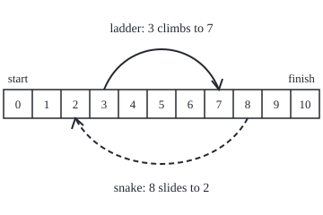
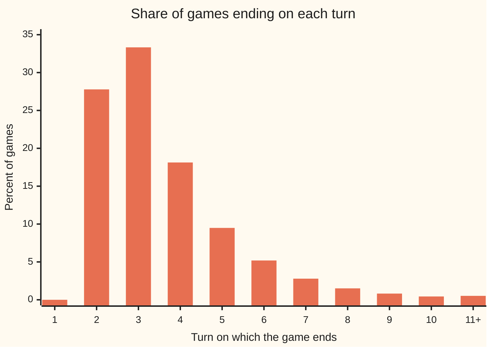

# Absorption: the chance of ending in each trap, and how long it takes

Stochastic processes and calculus → Markov Chains → Traps and waiting times → Absorption

---

## General Overview

A small game of snakes and ladders. The board has squares 1 to 9 and a finish at 10. A player starts off the board, on square 0, and rolls one fair die each turn. A ladder at the foot of square 3 climbs to 7. A snake with its head on square 8 slides back to 2. Reaching or passing 10 ends the game.

Two questions decide what the game is like to play. How many turns does it last, on average? And how likely is the player to meet the snake before finishing?

The answers are 3.5635 turns, exactly 110305/30954, and 0.2359: about 1 game in 4 meets the snake. Both come from one move, **first-step analysis**: the first roll lands the player somewhere new, and the game starts afresh from there. That gives one equation per square, solved exactly.

The finish is a trap: once there, the game never leaves. The standard name is an **absorbing state**, used from here on. For the snake question, the snake's head becomes a second absorbing state, and the question becomes which one catches the player first.

**Each square's expected wait is one turn plus the average wait from where that turn lands. Its chance of ending in a trap is the chance of stepping straight in plus the average chance from where the turn lands. The fundamental matrix counts the expected visits to each square: the board's gives the wait, and a second one, for the board with the snake's head made a trap, gives the snake chance.**

**What kind of fact this is:** a theorem, proved on this card in Why it works, with the complete argument in a folded Detailed proof; the fundamental matrix is a definition that the theorem gives a meaning to.

### The picture: the board, to scale

<p align="center"></p>

Squares are 32 units wide, so the ladder runs from 116 to 244 and the snake from 276 to 84, as the code prints on its `figure,` line. Arc heights are for legibility only.

---

## The formula

Notation first, in words. $X_n$ is the square after turn $n$, with time counted in turns ([processes-and-paths](../01-Random%20Walks%20and%20Filtrations/01-processes-and-paths.md)). The transition matrix $P$ holds $p_{ij}$, the chance that one turn moves square $i$ to square $j$ ([markov-chains](01-markov-chains.md)). A climb or slide happens inside the turn, so a turn never ends on 3 or 8: the chain lives on the eight **resting squares** 0, 1, 2, 4, 5, 6, 7 and 9, plus the finish.

An absorbing state $a$ has $p_{aa} = 1$. The resting squares are **transient**: left for good sooner or later ([classifying-states](03-classifying-states.md)). List them first and the absorbing states last, and $P$ splits into four blocks:

$$P = \begin{pmatrix} Q & R \\ 0 & I \end{pmatrix}$$

$Q$ holds moves between transient squares, with entries $q_{ij}$. $R$ holds moves from a transient square straight into an absorbing state. The zero block says a trap is never left, and the identity block $I$ keeps each trap put. ($Q$ is the standard letter for this block; it is unrelated to the second probability measure $Q$ met later in this wing.) The game ends at turn $\tau$, the first turn in an absorbing state: a stopping time, recognised when it arrives without seeing the future ([stopping-times-and-optional-stopping](../02-Martingales/03-stopping-times-and-optional-stopping.md)).

Write $t_i$ for the expected number of turns until the game ends, starting from transient square $i$. Fix one trap; $h_i$ is the chance of ending there from $i$, and $r_i$ the chance that one turn steps straight into it. The first-step equations, one per transient square $i$, summing over transient squares $j$:

$$t_i = 1 + \sum_j q_{ij}\, t_j, \qquad h_i = r_i + \sum_j q_{ij}\, h_j$$

**Read it aloud:** the expected wait from a square is one turn, plus the average of the expected waits from wherever that turn lands; the chance of ending in a given trap is the chance of stepping straight into it, plus the average of the same chance from wherever the turn lands.

The same equations in matrix form, with $\mathbf{1}$ a column of ones, $N$ the **fundamental matrix** and $B$ the table of chances of ending in each trap:

$$N = (I - Q)^{-1} = I + Q + Q^2 + Q^3 + \cdots, \qquad t = N\,\mathbf{1}, \qquad B = N R$$

**Read it aloud:** the fundamental matrix counts expected visits; a row sum is the expected number of turns, and times the one-step exits it gives the chance of ending in each trap.

| Symbol | Plain meaning | In our example | Push it up and the answer… |
| --- | --- | --- | --- |
| $X_n$, $n$ | the square after turn n; the turn count | square 0 at turn 0 | — |
| $P$, $p_{ij}$, $i$, $j$, $a$ | transition matrix; chance one turn moves square i to j; a an absorbing state | 1/6 from 0 to 7 (roll 3, climb) | — |
| $Q$, $q_{ij}$ | the block of $P$ among the eight resting squares | rows sum below 1 where the game can end | longer waits |
| $R$, $r_i$ | one-step chances from a square into each trap; $r_i$ for the trap in question | from 6: finish 3/6; snake 1/6 once the head is a trap | more games end there |
| $I$, $\mathbf{1}$ | the identity matrix; a column of ones | — | — |
| $N$, $N_{ij}$ | the board's fundamental matrix; expected visits to j before the game ends, from i | 0.5738 visits to 7 from 0 | — |
| $Q'$, $q'_{ij}$, $R'$, $N'$ | the same blocks and fundamental matrix for the second chain, the snake's head a trap and no slide | 0.4204 visits to 7 from 0 | — |
| $B$ | $N R$: chance of ending in each trap; for the snake question, $N' R'$ | snake 0.2359, finish 0.7641 from 0 | — |
| $\tau$ | the turn the game first reaches a trap | at least 2; 3.5635 on average | — |
| $t_i$, $t_j$, $t_s$, $t_0$, $t_2$ | expected turns until the game ends, from a square | 3.5635 from 0 | — |
| $h_i$, $h_s$, $h_0$ | chance of meeting the snake before finishing, from a square | 0.2359 from 0 | — |
| $x$, $s$ | the unknown carried by hand, $t_2$; s a square | 3.2997 | — |
| $\eta$, $m$, $k$, $K$, $v$, $\sigma$ | Steps 1 and 4 and the proof: a floor on the chance of ending within m turns; blocks; a cut-off turn; a difference of two solutions; the first turn meeting snake or finish | 10/36 with m = 2 | faster finish |

### When it holds

- **Finitely many squares.** With infinitely many, the equations can have many solutions; the right one is the smallest non-negative one (Norris, below).
- **Every transient square can reach a trap.** Swap the snake for a pit that holds the player forever, counted as a board square: its row of $I - Q$ is all zeros and the equations have no unique solution.
- **The same die every turn, nothing remembered.** Otherwise the first roll does not restart the game.
- **One turn per roll.** A climb or slide belongs to the turn that caused it; charging it a turn of its own gives 4.2051, not 3.5635.

---

## Why it works

### Step 0: the first roll restarts the game

From square 0 a roll of 3 climbs to 7, and from there the game is the same game started at 7: the die has no memory and the board has not changed. So the wait from 0 is one turn plus the wait from wherever the first roll lands, averaged over six rolls. One question about whole games becomes one question per square.

### Step 1: the game ends, and fast

Before averaging, the game must be known to end. From every resting square the chance of finishing within $m = 2$ turns is at least $\eta = 10/36$. So each two-turn block, whatever came before, ends the game with chance at least 10/36, and the game survives $k$ blocks with chance at most $(1 - 10/36)^k$. The expected wait is the sum, over turns, of the chance the game is still running; adding the block bounds caps it at 2 × 36/10 = 7.2 turns. Crude, about twice the true 3.5635, but finite, which is all the algebra needs.

### Step 2: the first-step equations

Condition on the first roll (the law of total expectation). With chance $q_{ij}$ the turn lands on transient square $j$, and the rest of the game lasts $t_j$ on average; otherwise it ends. Either way one turn has passed:

$$t_i = 1 + \sum_j q_{ij}\, t_j.$$

For the snake question, make the head absorbing. That is a second chain: a roll onto 8 now ends the game instead of sliding to 2, so its block of moves between resting squares, $Q'$, loses the slides. The first roll lands on the head with chance $r_i$, on square $j$ with chance $q'_{ij}$, or on the finish:

$$h_i = r_i + \sum_j q'_{ij}\, h_j.$$

In matrix form, $(I - Q)\,t = \mathbf{1}$ and $(I - Q')\,h = r$: the matrix changes as well as the right-hand side.

### Step 3: powers of Q count the survivors, and N counts visits

Row $i$ of $Q^n$ gives, for each transient square $j$, the chance that the game is still running after $n$ turns and sits on $j$. Summing over turns counts visits: $N_{ij} = \sum_n (Q^n)_{ij}$. From 0 the game visits 7 on 0.5738 turns on average and 2 on 0.5499, mostly after a slide. Every turn starts on some transient square, so a row sum of $N$ is the expected number of turns, $t = N\,\mathbf{1}$. Step 1 makes the series converge, and $(I - Q)(I + Q + \dots + Q^k) = I - Q^{k+1}$ tends to $I$: the series is the inverse ([inverse-matrix](../../03-Algebra/05-Solving%20Systems/03-inverse-matrix.md)).

The same mass pushed forward one turn at a time gives the whole law of $\tau$:



Bars: the exact percent of games ending on each turn (road 2 in the code); the last bar gathers games longer than 10 turns. None ends on turn 1, the most common length is 3, and the tail of games that meet the snake pulls the average up to 3.5635.

### Step 4: only one answer

Two finite solutions of $(I - Q)\,t = \mathbf{1}$ differ by some $v$ with $(I - Q)\,v = 0$; multiply by $N$ and $v = 0$. So the solution is unique, for $t$ and for $h$. With the pit it fails: $t$ at the pit would satisfy "wait = 1 + wait", which no finite number does.

### Step 5: the two questions meet

In the hand solve below, the wait from each square comes out as a number plus a multiple of $x$, the wait from square 2. The multiple is exactly $h$ there: 1/6 at 7, 7/36 at 6, 49/216 at 5, 343/1296 at 4, 2617/7776 at 2. A game from square $s$ either finishes first or meets the snake first; if it meets the snake, with chance $h_s$, it restarts at 2 with $x$ turns to go on average. So $t_s$ is the expected turns until the first of the two, plus $h_s$ times $x$: absorption chances and waiting times are one calculation.

The chance of ending in each trap comes from the second chain's own fundamental matrix, $N' = (I - Q')^{-1}$, with $R'$ its one-step exits into the head and the finish. Row 0 of $N'$ counts 0.4204 visits to 7, not the board's 0.5738, because no slide sends the player back. Then $B = N' R'$: from 0, snake 0.2359, finish 0.7641. The code also solves each column as its own system and gets the same fractions, and the two add to exactly 1, as Step 1 guarantees: every game ends.

<details>
<summary>Detailed proof</summary>

Setting: a finite set of transient squares T, a non-empty set of absorbing states A, transition matrix $P$ constant in time, and from every square in T a path of positive-chance moves into A. Let $\tau$ be the first turn with $X_n$ in A.

**The wait has a geometric tail.** Pick one positive-chance path into A from each square in T; let $m$ be the longest and $\eta$ the smallest path chance. From any square in T, the next $m$ turns reach A with chance at least $\eta$. By the Markov property at the fixed time $k \cdot m$, summed over the finitely many squares the game may occupy then, $P(\tau > (k+1)m) \le (1-\eta)\,P(\tau > km)$. Iterating, $P(\tau > km) \le (1-\eta)^k$. Since $\tau = \sum_{n \ge 0} \mathbf{1}\{\tau > n\}$, monotone convergence (for non-negative terms increasing to a limit, the average of the limit is the limit of the averages; [monotone-convergence-theorem](../../10-Measure%20and%20integration/04-The%20Lebesgue%20Integral/03-monotone-convergence-theorem.md)) gives $E[\tau] = \sum_n P(\tau > n) \le m/\eta$, finite. In particular $\tau$ is finite almost surely.

**The series is the inverse.** By induction on paths, $(Q^n)_{ij}$ is the chance of being at $j$ at turn $n$ with $\tau > n$, so row sums of $Q^n$ are $P_i(\tau > n)$ and the non-negative series $N = \sum_n Q^n$ has row sums $E_i[\tau]$, finite. Every entry is therefore finite. $QN = NQ = N - I$ by shifting the index of a convergent non-negative series, so $(I - Q)N = N(I - Q) = I$. The expected number of turns spent on $j$ is $E_i \sum_n \mathbf{1}\{X_n = j, \tau > n\} = N_{ij}$, again by monotone convergence.

**The first-step equations hold.** Truncate: let $t^{(K)}_i = E_i[\min(\tau, K)]$. Splitting every path of length $K+1$ after its first move, a finite sum, gives $t^{(K+1)}_i = 1 + \sum_j q_{ij}\, t^{(K)}_j$. As $K$ grows, $\min(\tau, K)$ increases to $\tau$, so by monotone convergence both sides converge and $t_i = 1 + \sum_j q_{ij}\, t_j$. For a trap $a$, let $h^{(K)}_i$ be the chance of entering A by turn $K$ and entering it at $a$; the same split gives $h^{(K+1)}_i = r_i + \sum_j q_{ij}\, h^{(K)}_j$, and the events increase to "enter A at $a$", so continuity of probability gives the limit equation.

**Uniqueness.** Both equations are $(I - Q)y = c$ with $I - Q$ invertible, so $y = Nc$ is the only finite solution: $t = N\mathbf{1}$ and $h = Nr$. Summed over all traps, $R\mathbf{1} + Q\mathbf{1} = \mathbf{1}$, so $NR\mathbf{1} = N(I - Q)\mathbf{1} = \mathbf{1}$: the trap chances from each square add to 1.

**Step 5's identity.** Let $\sigma$ be the first turn the game meets the snake or finishes, a stopping time. On meeting the snake the game stands on square 2; the strong Markov property at $\sigma$ (the Markov property at a stopping time: from $\sigma$ on, the game runs afresh from where it stands, whatever happened before) gives $t_s = E_s[\sigma] + h_s\, t_2$. The hand solve recovers this identity numerically.

</details>

A second road runs through martingales: $h(X_n)$ stopped at $\tau$ is a bounded martingale by the first-step equation, and $\tau$ is finite, so optional stopping gives $h_0 = E[h(X_\tau)]$, the chance of stopping at the snake ([stopping-times-and-optional-stopping](../02-Martingales/03-stopping-times-and-optional-stopping.md)). The two-wall version, where the equations become a recurrence with a closed form, is [gamblers-ruin](../01-Random%20Walks%20and%20Filtrations/04-gamblers-ruin.md).

---

## Worked numbers, by hand

**The snake chance, from the top down.** With the head a trap, no move goes backwards, so each square needs only the squares above it; the six landings from each square are the code's `from` lines:

| Step | Arithmetic | Value |
| --- | --- | --- |
| $h$ at 9 | every roll finishes | 0 |
| $h$ at 7 | roll 1 meets the snake: 1/6 | 1/6 |
| $h$ at 6 | (1/6 + 1 + 0) / 6 | 7/36 |
| $h$ at 5 | (7/36 + 1/6 + 1 + 0) / 6 | 49/216 |
| $h$ at 4 | (49/216 + 7/36 + 1/6 + 1 + 0) / 6 | 343/1296 |
| $h$ at 2 | (1/6 + 343/1296 + 49/216 + 7/36 + 1/6 + 1) / 6 | 2617/7776 |
| $h$ at 1 | (2617/7776 + 1/6 + 343/1296 + 49/216 + 7/36 + 1/6) / 6 | 10543/46656 |
| $h$ at 0 | the same, over rolls to 1, 2, 7, 4, 5, 6 | **66025/279936 = 0.2359** |

**The expected turns, carrying one unknown.** The snake sends 8 back to 2, so every wait above 2 depends on the wait from 2. Call it $x$ and carry it:

| Step | Arithmetic | Value |
| --- | --- | --- |
| $t$ at 9 | one turn, then finished | 1 |
| $t$ at 7 | 1 + (x + 1) / 6 | 1.1667 + 0.1667 x |
| $t$ at 6 | 1 + (t at 7 + x + 1) / 6 | 1.3611 + 0.1944 x |
| $t$ at 5 | 1 + (t at 6 + t at 7 + x + 1) / 6 | 1.5880 + 0.2269 x |
| $t$ at 4 | 1 + (t at 5 + t at 6 + t at 7 + x + 1) / 6 | 1.8526 + 0.2647 x |
| $x$, from square 2 | 1 + (2 × t at 7 + t at 4 + t at 5 + t at 6 + x) / 6 | 2.1892 + 0.3365 x |
| solve for $x$ | 2.1892 / (1 − 0.3365) | 17023/5159 = 3.2997 |
| back-substitute | 7, 6, 5, 4 | 1.7166, 2.0027, 2.3365, 2.7259 |
| $t$ at 1 | lands on 2, 7, 4, 5, 6, 7: the same six squares as from 2 | 3.2997 |
| $t$ at 0 | 1 + (3.2997 + 3.2997 + 1.7166 + 2.7259 + 2.3365 + 2.0027) / 6 | **3.5635** |

A game lasts three and a half turns on average, and a little under a quarter of games meet the snake. The multiples of $x$ repeat the first table's chances: Step 5.

### What breaks if you drop a piece

| Mistake | Comes out at | What went wrong |
| --- | --- | --- |
| Leave out the 1 for the turn just played | 0 turns | $t = Qt$ has only the zero solution: no turn is ever counted |
| Board length over the average roll, 10 / 3.5 | 2.8571 turns | ignores the snake, the ladder and the rolls wasted past the finish; the plain board alone takes 3.3237 |
| Spend a turn on each climb or slide | 4.2051 turns | squares 3 and 8 are not places where a turn ends |
| A pit on 8, counted as a board square | row 8 of $I - Q$ is all zeros; no unique solution | the finish cannot be reached from the pit, so $I - Q$ has no inverse |

Treat the pit as a trap instead and the question is sound again: the finish is reached with chance 0.7641, the real board's chance of finishing before the snake. The code prints every row.

---

## Code, from first principles, and it actually runs

Three independent roads. Road 1 solves the first-step equations in exact fractions by Gauss-Jordan elimination, builds the fundamental matrix column by column, and checks $N(I - Q) = I$ exactly; it builds the second chain's $N'$ the same way and checks $B = N'R'$ against the two solved columns. Road 2 solves nothing: it pushes the probability forward for 199 turns and adds up the chance still in play, $E[\tau] = \sum_n P(\tau > n)$. Road 3 plays 100000 games with a SplitMix64 generator, seed 20260929, each average printed with its standard error. Python uses the standard `Fraction`; Rust writes its own fraction type on 128-bit integers, overflow checked. The asserts tie the three roads together and also check the hand table, Step 5's identity and the chart's law.

### Python

```python
# Absorption and first-step analysis -- the check behind the card.  Standard
# library only; Fraction is exact arithmetic, nothing more.  A 10-square
# snakes-and-ladders board, one six-sided die, ladder 3 -> 7, snake 8 -> 2,
# reaching or passing square 10 finishes.  Three roads to the expected turns
# and to the chance of meeting the snake before finishing: the first-step
# equations solved exactly, the chance mass pushed forward turn by turn, and a
# seeded simulation.  Then the fundamental matrix, the hand table, the mistakes.
from fractions import Fraction as Fr
L, SEED, GAMES, MASK = 10, 20260929, 100000, (1 << 64) - 1

def board(jumps, pit=None):              # resting squares and, for each, its six landings
    land = lambda s: L if s >= L else jumps.get(s, s)
    rest = [s for s in range(L) if s not in jumps]
    return rest, {s: ([s] * 6 if s == pit else [land(s + r) for r in range(1, 7)]) for s in rest}

def solve(A, b):                         # Gauss-Jordan elimination in exact fractions
    n = len(A); M = [row[:] + [v] for row, v in zip(A, b)]
    for c in range(n):
        p = next((r for r in range(c, n) if M[r][c] != 0), None)
        if p is None: return None        # singular: no unique answer
        M[c], M[p] = M[p], M[c]
        for r in range(n):
            if r != c and M[r][c] != 0:
                f = M[r][c] / M[c][c]; M[r] = [x - f * y for x, y in zip(M[r], M[c])]
    return [M[i][n] / M[i][i] for i in range(n)]

def first_step(jumps, trap=None, pit=None, one=1):   # road 1: t = one + Q t, or h = r + Q h
    rest, moves = board(jumps, pit)
    live = [s for s in rest if s != trap]; ix = {s: i for i, s in enumerate(live)}
    A = [[Fr(int(i == j)) for j in range(len(live))] for i in range(len(live))]; b = []
    for s in live:
        b.append(Fr(one) if trap is None else Fr(sum(e == trap for e in moves[s]), 6))
        for e in moves[s]:
            if e in ix: A[ix[s]][ix[e]] -= Fr(1, 6)
    return live, A, solve(A, b)

J = {3: 7, 8: 2}                         # the house board
rest, moves = board(J)
print("board: squares 0-9 then finish 10; ladder 3->7, snake 8->2; one die")
for s in rest: print(f"from {s}: rolls 1-6 land on {moves[s]}")
live, IQ, t = first_step(J)              # expected turns to finish
T = dict(zip(live, t))
print(f"road 1, exact: expected turns from 0 = {T[0]} = {float(T[0]):.6f}")
print("t by square " + " ".join(f"{s}:{float(v):.4f}" for s, v in T.items()))
J2 = {3: 7, 8: 8}; hl, A2, h = first_step(J2, trap=8)  # snake head made a trap
H = dict(zip(hl, h))
print(f"road 1, exact: chance of meeting the snake before finishing, from 0 = {H[0]} = {float(H[0]):.6f}")
print("h by square " + " ".join(f"{s}:{v}" for s, v in H.items()))
fin = solve(A2, [Fr(board(J2)[1][s].count(L), 6) for s in hl])[0]   # the finish column, own system
print(f"two traps from 0: snake {float(H[0]):.6f}, finish {float(fin):.6f}, sum {H[0] + fin}")
# fundamental matrix N = (I - Q)^-1, column by column
n = len(live); cols = [solve(IQ, [Fr(int(i == j)) for i in range(n)]) for j in range(n)]
N = [[cols[j][i] for j in range(n)] for i in range(n)]
ok = all(sum(N[i][k] * IQ[k][j] for k in range(n)) == int(i == j) for i in range(n) for j in range(n))
print("N row for square 0 (expected visits) " + " ".join(f"{s}:{float(v):.4f}" for s, v in zip(live, N[0])))
print(f"row sum = {float(sum(N[0])):.6f}; N (I - Q) = I exactly: {'yes' if ok else 'no'}")
N2 = [solve(A2, [Fr(int(i == j)) for i in range(len(hl))]) for j in range(len(hl))]   # N' = (I - Q')^-1, head a trap
B = [sum(N2[k][0] * board(J2)[1][hl[k]].count(e) for k in range(len(hl))) / 6 for e in (8, L)]   # row 0 of B = N' R'
print("N' row for square 0, head a trap (expected visits) " + " ".join(f"{s}:{float(N2[j][0]):.4f}" for j, s in enumerate(hl)) + f"; B = N' R': snake {float(B[0]):.6f}, finish {float(B[1]):.6f}")
snake_from = [Fr(board(J2)[1][s].count(8), 6) for s in live]      # chance one turn ends on the head
slides = sum(N[0][k] * snake_from[k] for k in range(n))
print(f"expected slides per game: N-row . slide chances = {float(slides):.6f}; h0/(1-h2) = {float(H[0] / (1 - H[2])):.6f}")
# hand table: carry x = t(2); each square is a + b x, worked from the top down
ab = {9: (Fr(1), Fr(0)), 2: (Fr(0), Fr(1)), L: (Fr(0), Fr(0))}
for s in (7, 6, 5, 4, 2):
    ab[s if s != 2 else "x"] = (1 + sum(ab[e][0] for e in moves[s]) / 6, sum(ab[e][1] for e in moves[s]) / 6)
x = ab["x"][0] / (1 - ab["x"][1])
for s in (7, 6, 5, 4):
    print(f"hand: t({s}) = {float(ab[s][0]):.4f} + {float(ab[s][1]):.4f} x = {float(ab[s][0] + ab[s][1] * x):.4f}")
print(f"hand: x = {float(ab['x'][0]):.4f} + {float(ab['x'][1]):.4f} x, so x = {x} = {float(x):.4f}")
# road 2: push the chance mass forward one turn at a time
dist, alive, ET, pT, hit = {0: 1.0}, 1.0, 0.0, [], 0.0
for turn in range(1, 200):
    ET += alive; new, done = {}, 0.0
    for s, m in dist.items():
        for e in moves[s]:
            if e == L: done += m / 6
            else: new[e] = new.get(e, 0.0) + m / 6
    pT.append(done); dist = new; alive = sum(new.values())
dist2 = {0: 1.0}
for turn in range(200):
    new = {}
    for s, m in dist2.items():
        for e in board(J2)[1][s]:
            if e == 8: hit += m / 6
            elif e != L: new[e] = new.get(e, 0.0) + m / 6
    dist2 = new
print(f"road 2, mass pushed 199 turns: expected turns {ET:.6f}; snake-first chance {hit:.6f}; mass left {alive:.1e}")
print("chart, percent of games ending on turn 1-10: " + " ".join(f"{100 * p:.2f}" for p in pT[:10]))
print(f"chart, percent ending after turn 10: {100 * sum(pT[10:]):.2f}")
eta = min(sum(1 for e1 in moves[s] for e2 in ([L] * 6 if e1 == L else moves[e1]) if e2 == L) for s in rest)
print(f"finiteness: worst chance of finishing within 2 turns = {eta}/36, so E[turns] <= 2*36/{eta} = {72 / eta:.1f}")
# road 3: seeded simulation, SplitMix64
state = SEED
def roll():
    global state
    state = (state + 0x9E3779B97F4A7C15) & MASK; z = state
    z = ((z ^ (z >> 30)) * 0xBF58476D1CE4E5B9) & MASK; z = ((z ^ (z >> 27)) * 0x94D049BB133111EB) & MASK
    return 1 + (((z ^ (z >> 31)) >> 32) * 6 >> 32)
sT = sT2 = sH = sS = sS2 = 0
for g in range(GAMES):
    pos, turns, met, sl = 0, 0, 0, 0
    while pos < L:
        pos += roll(); turns += 1
        if pos == 8: met, sl = 1, sl + 1
        pos = J.get(pos, pos)
    sT += turns; sT2 += turns * turns; sH += met; sS += sl; sS2 += sl * sl
m = sT / GAMES; se = ((sT2 / GAMES - m * m) / GAMES) ** 0.5; ph = sH / GAMES; seh = (ph * (1 - ph) / GAMES) ** 0.5
ms = sS / GAMES; ses = ((sS2 / GAMES - ms * ms) / GAMES) ** 0.5
print(f"road 3, {GAMES} games, seed {SEED}: turns {m:.4f} +/- {se:.4f}; met snake {ph:.4f} +/- {seh:.4f}")
print(f"road 3, slides per game {ms:.4f} +/- {ses:.4f}")
# mistakes and variations
print(f"mistake, drop the 1 for the turn played: t(0) = {float(first_step(J, one=0)[2][0]):.4f}")
print(f"mistake, 10 squares / 3.5 per roll = {10 / 3.5:.4f}")
pay = {s: ([J[s]] * 6 if s in J else board({})[1][s]) for s in range(L)}
A = [[Fr(int(i == j)) - Fr(pay[i].count(j), 6) for j in range(L)] for i in range(L)]
print(f"mistake, a turn spent on each climb or slide: t(0) = {float(solve(A, [Fr(1)] * L)[0]):.4f}")
pl, pA, pt = first_step({3: 7}, pit=8)
print(f"broken, a pit on 8 instead of the snake: row 8 of I - Q = {' '.join(str(v) for v in pA[pl.index(8)])}; unique solution: {'none' if pt is None else 'yes'}")
fl, _, fh = first_step({3: 7}, trap=8, pit=None)
print(f"broken, pit as a trap: chance of reaching the finish from 0 = {float(1 - dict(zip(fl, fh))[0]):.6f}")
print(f"try, no snake: t(0) = {float(first_step({3: 7})[2][0]):.4f}; no ladder: t(0) = {float(first_step({8: 2})[2][0]):.4f}")
print(f"try, snake 8->0: t(0) = {float(first_step({3: 7, 8: 0})[2][0]):.4f}")
print(f"try, plain board: t(0) = {float(first_step({})[2][0]):.4f}")
print(f"figure, square centres x = 20 + 32 s: ladder 3->7 at {20 + 32 * 3}->{20 + 32 * 7}, snake 8->2 at {20 + 32 * 8}->{20 + 32 * 2}")
assert abs(float(T[0]) - ET) < 1e-12                  # exact solve against mass flow
assert abs(float(H[0]) - hit) < 1e-12                 # the same for the snake chance
assert ok and sum(N[0]) == T[0]                       # N inverts I - Q, and N times ones is t
assert abs(m - float(T[0])) < 4 * se                  # simulation within 4 standard errors
assert abs(ph - float(H[0])) < 4 * seh
assert abs(ms - float(slides)) < 4 * ses
assert H[0] + fin == 1                                # two traps: the chances add to 1
assert B == [H[0], fin]                               # B = N' R' against the two solved systems
assert slides == H[0] / (1 - H[2])                    # two routes to the expected slides
assert pt is None                                     # the pit board has no unique answer
assert x == T[2] and all(ab[s][0] + ab[s][1] * x == T[s] for s in (7, 6, 5, 4))   # hand table = exact solve
assert all(ab[s][1] == H[s] for s in (7, 6, 5, 4)) and ab["x"][1] == H[2]          # Step 5: multiples of x are h
assert abs(sum(pT) - 1) < 1e-12 and abs(sum((k + 1) * p for k, p in enumerate(pT)) - ET) < 1e-9  # chart law
print("ALL CHECKS PASS")
```

**Ran 2026-10-07 on macOS, Python 3.14.6, standard library only. All checks passed. Output, pasted from the run:**

```
board: squares 0-9 then finish 10; ladder 3->7, snake 8->2; one die
from 0: rolls 1-6 land on [1, 2, 7, 4, 5, 6]
from 1: rolls 1-6 land on [2, 7, 4, 5, 6, 7]
from 2: rolls 1-6 land on [7, 4, 5, 6, 7, 2]
from 4: rolls 1-6 land on [5, 6, 7, 2, 9, 10]
from 5: rolls 1-6 land on [6, 7, 2, 9, 10, 10]
from 6: rolls 1-6 land on [7, 2, 9, 10, 10, 10]
from 7: rolls 1-6 land on [2, 9, 10, 10, 10, 10]
from 9: rolls 1-6 land on [10, 10, 10, 10, 10, 10]
road 1, exact: expected turns from 0 = 110305/30954 = 3.563514
t by square 0:3.5635 1:3.2997 2:3.2997 4:2.7259 5:2.3365 6:2.0027 7:1.7166 9:1.0000
road 1, exact: chance of meeting the snake before finishing, from 0 = 66025/279936 = 0.235857
h by square 0:66025/279936 1:10543/46656 2:2617/7776 4:343/1296 5:49/216 6:7/36 7:1/6 9:0
two traps from 0: snake 0.235857, finish 0.764143, sum 1
N row for square 0 (expected visits) 0:1.0000 1:0.1667 2:0.5499 4:0.2861 5:0.3338 6:0.3894 7:0.5738 9:0.2638
row sum = 3.563514; N (I - Q) = I exactly: yes
N' row for square 0, head a trap (expected visits) 0:1.0000 1:0.1667 2:0.1944 4:0.2269 5:0.2647 6:0.3088 7:0.4204 9:0.2035; B = N' R': snake 0.235857, finish 0.764143
expected slides per game: N-row . slide chances = 0.355501; h0/(1-h2) = 0.355501
hand: t(7) = 1.1667 + 0.1667 x = 1.7166
hand: t(6) = 1.3611 + 0.1944 x = 2.0027
hand: t(5) = 1.5880 + 0.2269 x = 2.3365
hand: t(4) = 1.8526 + 0.2647 x = 2.7259
hand: x = 2.1892 + 0.3365 x, so x = 17023/5159 = 3.2997
road 2, mass pushed 199 turns: expected turns 3.563514; snake-first chance 0.235857; mass left 1.4e-53
chart, percent of games ending on turn 1-10: 0.00 27.78 33.33 18.13 9.49 5.19 2.79 1.51 0.82 0.44
chart, percent ending after turn 10: 0.52
finiteness: worst chance of finishing within 2 turns = 10/36, so E[turns] <= 2*36/10 = 7.2
road 3, 100000 games, seed 20260929: turns 3.5683 +/- 0.0053; met snake 0.2368 +/- 0.0013
road 3, slides per game 0.3570 +/- 0.0024
mistake, drop the 1 for the turn played: t(0) = 0.0000
mistake, 10 squares / 3.5 per roll = 2.8571
mistake, a turn spent on each climb or slide: t(0) = 4.2051
broken, a pit on 8 instead of the snake: row 8 of I - Q = 0 0 0 0 0 0 0 0 0; unique solution: none
broken, pit as a trap: chance of reaching the finish from 0 = 0.764143
try, no snake: t(0) = 3.0604; no ladder: t(0) = 3.9978
try, snake 8->0: t(0) = 3.6450
try, plain board: t(0) = 3.3237
figure, square centres x = 20 + 32 s: ladder 3->7 at 116->244, snake 8->2 at 276->84
ALL CHECKS PASS
```

### Rust

```rust
// Absorption and first-step analysis -- the same check as the Python, in Rust.
// std only.  A 10-square snakes-and-ladders board, one six-sided die, ladder
// 3 -> 7, snake 8 -> 2, reaching or passing square 10 finishes.  Road 1 solves
// the first-step equations in exact fractions (i128, overflow checked), road 2
// pushes the chance mass forward, road 3 is a seeded SplitMix64 simulation.
use std::fmt;
const L: usize = 10;

#[derive(Clone, Copy, PartialEq)]
struct Fr { n: i128, d: i128 }
fn gcd(a: i128, b: i128) -> i128 { if b == 0 { a.abs() } else { gcd(b, a % b) } }
fn fr(n: i128, d: i128) -> Fr { let g = gcd(n, d).max(1) * d.signum(); Fr { n: n / g, d: d / g } }
impl Fr {
    fn add(self, o: Fr) -> Fr { fr(self.n.checked_mul(o.d).unwrap().checked_add(o.n.checked_mul(self.d).unwrap()).unwrap(), self.d.checked_mul(o.d).unwrap()) }
    fn sub(self, o: Fr) -> Fr { self.add(Fr { n: -o.n, d: o.d }) }
    fn mul(self, o: Fr) -> Fr { fr(self.n.checked_mul(o.n).unwrap(), self.d.checked_mul(o.d).unwrap()) }
    fn div(self, o: Fr) -> Fr { fr(self.n.checked_mul(o.d).unwrap(), self.d.checked_mul(o.n).unwrap()) }
    fn f(self) -> f64 { self.n as f64 / self.d as f64 }
}
impl fmt::Display for Fr {   // printed as Python prints a Fraction
    fn fmt(&self, w: &mut fmt::Formatter) -> fmt::Result { if self.d == 1 { write!(w, "{}", self.n) } else { write!(w, "{}/{}", self.n, self.d) } } }
fn zero() -> Fr { fr(0, 1) }  fn one() -> Fr { fr(1, 1) }
// resting squares and, for each, its six landings (indexed by square)
fn board(jumps: &[(usize, usize)], pit: Option<usize>) -> (Vec<usize>, Vec<Vec<usize>>) {
    let jump = |s: usize| jumps.iter().find(|j| j.0 == s).map(|j| j.1);
    let land = |s: usize| if s >= L { L } else { jump(s).unwrap_or(s) };
    let rest: Vec<usize> = (0..L).filter(|&s| jump(s).is_none()).collect();
    let moves = (0..L).map(|s| if Some(s) == pit { vec![s; 6] } else { (1..=6).map(|r| land(s + r)).collect() }).collect();
    (rest, moves)
}
fn solve(a: &Vec<Vec<Fr>>, b: &Vec<Fr>) -> Option<Vec<Fr>> {   // Gauss-Jordan, exact
    let n = a.len();
    let mut m: Vec<Vec<Fr>> = a.iter().zip(b).map(|(r, v)| { let mut r = r.clone(); r.push(*v); r }).collect();
    for c in 0..n {
        let p = (c..n).find(|&r| m[r][c].n != 0)?;
        m.swap(c, p);
        for r in 0..n {
            if r != c && m[r][c].n != 0 {
                let (f, row_c) = (m[r][c].div(m[c][c]), m[c].clone());
                for k in 0..=n { m[r][k] = m[r][k].sub(f.mul(row_c[k])); }
            }
        }
    }
    Some((0..n).map(|i| m[i][n].div(m[i][i])).collect())
}
// road 1: t = one + Q t, or with a trap h = r + Q h
fn first_step(jumps: &[(usize, usize)], trap: Option<usize>, pit: Option<usize>, one_: i128) -> (Vec<usize>, Vec<Vec<Fr>>, Option<Vec<Fr>>) {
    let (rest, moves) = board(jumps, pit);
    let live: Vec<usize> = rest.into_iter().filter(|&s| Some(s) != trap).collect();
    let n = live.len();
    let mut a: Vec<Vec<Fr>> = (0..n).map(|i| (0..n).map(|j| fr((i == j) as i128, 1)).collect()).collect();
    let mut b = Vec::new();
    for (i, &s) in live.iter().enumerate() {
        b.push(match trap { None => fr(one_, 1), Some(tr) => fr(moves[s].iter().filter(|&&e| e == tr).count() as i128, 6) });
        for &e in &moves[s] { if let Some(j) = live.iter().position(|&x| x == e) { a[i][j] = a[i][j].sub(fr(1, 6)); } }
    }
    let sol = solve(&a, &b); (live, a, sol)
}
fn t0(jumps: &[(usize, usize)]) -> f64 { first_step(jumps, None, None, 1).2.unwrap()[0].f() }

struct Rng(u64);
impl Rng {
    fn roll(&mut self) -> usize {
        self.0 = self.0.wrapping_add(0x9E3779B97F4A7C15);
        let z = (self.0 ^ (self.0 >> 30)).wrapping_mul(0xBF58476D1CE4E5B9);
        let z = (z ^ (z >> 27)).wrapping_mul(0x94D049BB133111EB);
        1 + ((((z ^ (z >> 31)) >> 32) * 6) >> 32) as usize
    }
}
fn main() {
    let (seed, games) = (20260929u64, 100000usize);
    let (j, j2): (&[(usize, usize)], &[(usize, usize)]) = (&[(3, 7), (8, 2)], &[(3, 7), (8, 8)]);
    let (rest, moves) = board(j, None);
    let moves2 = board(j2, None).1;
    println!("board: squares 0-9 then finish 10; ladder 3->7, snake 8->2; one die");
    for &s in &rest { println!("from {}: rolls 1-6 land on {:?}", s, moves[s]); }
    let (live, iq, t) = first_step(j, None, None, 1); let t = t.unwrap();
    println!("road 1, exact: expected turns from 0 = {} = {:.6}", t[0], t[0].f());
    println!("t by square {}", live.iter().zip(&t).map(|(s, v)| format!("{}:{:.4}", s, v.f())).collect::<Vec<_>>().join(" "));
    let (hl, a2, h) = first_step(j2, Some(8), None, 1); let h = h.unwrap();
    let hs = |s: usize| h[hl.iter().position(|&x| x == s).unwrap()];
    println!("road 1, exact: chance of meeting the snake before finishing, from 0 = {} = {:.6}", h[0], h[0].f());
    println!("h by square {}", hl.iter().zip(&h).map(|(s, v)| format!("{}:{}", s, v)).collect::<Vec<_>>().join(" "));
    let rf: Vec<Fr> = hl.iter().map(|&s| fr(moves2[s].iter().filter(|&&e| e == L).count() as i128, 6)).collect();
    let fin = solve(&a2, &rf).unwrap()[0];
    println!("two traps from 0: snake {:.6}, finish {:.6}, sum {}", h[0].f(), fin.f(), h[0].add(fin));
    // fundamental matrix N = (I - Q)^-1, column by column
    let n = live.len();
    let cols: Vec<Vec<Fr>> = (0..n).map(|c| solve(&iq, &(0..n).map(|i| fr((i == c) as i128, 1)).collect()).unwrap()).collect();
    let nm: Vec<Vec<Fr>> = (0..n).map(|i| (0..n).map(|c| cols[c][i]).collect()).collect();
    let ok = (0..n).all(|i| (0..n).all(|c| (0..n).fold(zero(), |acc, k| acc.add(nm[i][k].mul(iq[k][c]))) == fr((i == c) as i128, 1)));
    let row_sum = nm[0].iter().fold(zero(), |acc, v| acc.add(*v));
    println!("N row for square 0 (expected visits) {}", live.iter().zip(&nm[0]).map(|(s, v)| format!("{}:{:.4}", s, v.f())).collect::<Vec<_>>().join(" "));
    println!("row sum = {:.6}; N (I - Q) = I exactly: {}", row_sum.f(), if ok { "yes" } else { "no" });
    let cols2: Vec<Vec<Fr>> = (0..hl.len()).map(|c| solve(&a2, &(0..hl.len()).map(|i| fr((i == c) as i128, 1)).collect()).unwrap()).collect();   // N' = (I - Q')^-1, head a trap
    let b: Vec<Fr> = [8, L].iter().map(|&e| (0..hl.len()).fold(zero(), |acc, k| acc.add(cols2[k][0].mul(fr(moves2[hl[k]].iter().filter(|&&x| x == e).count() as i128, 6))))).collect();   // row 0 of B = N' R'
    println!("N' row for square 0, head a trap (expected visits) {}; B = N' R': snake {:.6}, finish {:.6}", hl.iter().enumerate().map(|(j, s)| format!("{}:{:.4}", s, cols2[j][0].f())).collect::<Vec<_>>().join(" "), b[0].f(), b[1].f());
    let slides = (0..n).fold(zero(), |acc, k| acc.add(nm[0][k].mul(fr(moves2[live[k]].iter().filter(|&&e| e == 8).count() as i128, 6))));
    let slides2 = hs(0).div(one().sub(hs(2)));
    println!("expected slides per game: N-row . slide chances = {:.6}; h0/(1-h2) = {:.6}", slides.f(), slides2.f());
    // hand table: carry x = t(2); each square is a + b x, worked from the top down
    let mut ab = vec![(zero(), zero()); L + 1]; ab[9] = (one(), zero()); ab[2] = (zero(), one());
    let step = |ab: &Vec<(Fr, Fr)>, s: usize| moves[s].iter().fold((one(), zero()), |acc, &e| (acc.0.add(ab[e].0.div(fr(6, 1))), acc.1.add(ab[e].1.div(fr(6, 1)))));
    for s in [7, 6, 5, 4] { ab[s] = step(&ab, s); }
    let xe = step(&ab, 2); let x = xe.0.div(one().sub(xe.1));
    for s in [7usize, 6, 5, 4] { println!("hand: t({}) = {:.4} + {:.4} x = {:.4}", s, ab[s].0.f(), ab[s].1.f(), ab[s].0.add(ab[s].1.mul(x)).f()); }
    println!("hand: x = {:.4} + {:.4} x, so x = {} = {:.4}", xe.0.f(), xe.1.f(), x, x.f());
    // road 2: push the chance mass forward one turn at a time
    let (mut dist, mut alive, mut et, mut pt, mut hit) = (vec![0.0f64; L], 1.0f64, 0.0f64, Vec::new(), 0.0f64); dist[0] = 1.0;
    for _ in 1..200 {
        et += alive;
        let (mut new, mut done) = (vec![0.0f64; L], 0.0f64);
        for s in 0..L { if dist[s] > 0.0 { for &e in &moves[s] { if e == L { done += dist[s] / 6.0 } else { new[e] += dist[s] / 6.0 } } } }
        pt.push(done); alive = new.iter().sum(); dist = new;
    }
    let mut d2 = vec![0.0f64; L]; d2[0] = 1.0;
    for _ in 0..200 {
        let mut new = vec![0.0f64; L];
        for s in 0..L { if d2[s] > 0.0 { for &e in &moves2[s] { if e == 8 { hit += d2[s] / 6.0 } else if e != L { new[e] += d2[s] / 6.0 } } } }
        d2 = new;
    }
    println!("road 2, mass pushed 199 turns: expected turns {:.6}; snake-first chance {:.6}; mass left {:.1e}", et, hit, alive);
    println!("chart, percent of games ending on turn 1-10: {}", pt[..10].iter().map(|p| format!("{:.2}", 100.0 * p)).collect::<Vec<_>>().join(" "));
    println!("chart, percent ending after turn 10: {:.2}", 100.0 * pt[10..].iter().sum::<f64>());
    let eta = rest.iter().map(|&s| moves[s].iter().map(|&e1| if e1 == L { 6 } else { moves[e1].iter().filter(|&&e2| e2 == L).count() }).sum::<usize>()).min().unwrap();
    println!("finiteness: worst chance of finishing within 2 turns = {}/36, so E[turns] <= 2*36/{} = {:.1}", eta, eta, 72.0 / eta as f64);
    // road 3: seeded simulation, SplitMix64
    let mut rng = Rng(seed);
    let (mut st, mut st2, mut sh, mut ss, mut ss2) = (0u64, 0u64, 0u64, 0u64, 0u64);
    for _ in 0..games {
        let (mut pos, mut turns, mut met, mut sl) = (0usize, 0u64, 0u64, 0u64);
        while pos < L {
            pos += rng.roll(); turns += 1;
            if pos == 8 { met = 1; sl += 1; }
            if let Some(jj) = j.iter().find(|jj| jj.0 == pos) { pos = jj.1; }
        }
        st += turns; st2 += turns * turns; sh += met; ss += sl; ss2 += sl * sl;
    }
    let g = games as f64; let m = st as f64 / g; let se = ((st2 as f64 / g - m * m) / g).sqrt();
    let ph = sh as f64 / g; let seh = (ph * (1.0 - ph) / g).sqrt(); let ms = ss as f64 / g; let ses = ((ss2 as f64 / g - ms * ms) / g).sqrt();
    println!("road 3, {} games, seed {}: turns {:.4} +/- {:.4}; met snake {:.4} +/- {:.4}", games, seed, m, se, ph, seh);
    println!("road 3, slides per game {:.4} +/- {:.4}", ms, ses);
    // mistakes and variations
    println!("mistake, drop the 1 for the turn played: t(0) = {:.4}", first_step(j, None, None, 0).2.unwrap()[0].f());
    println!("mistake, 10 squares / 3.5 per roll = {:.4}", 10.0 / 3.5);
    let pay: Vec<Vec<usize>> = (0..L).map(|s| match j.iter().find(|jj| jj.0 == s) { Some(jj) => vec![jj.1; 6], None => board(&[], None).1[s].clone() }).collect();
    let a: Vec<Vec<Fr>> = (0..L).map(|i| (0..L).map(|c| fr((i == c) as i128, 1).sub(fr(pay[i].iter().filter(|&&e| e == c).count() as i128, 6))).collect()).collect();
    println!("mistake, a turn spent on each climb or slide: t(0) = {:.4}", solve(&a, &vec![one(); L]).unwrap()[0].f());
    let (pl, pa, psol) = first_step(&[(3, 7)], None, Some(8), 1); let prow = &pa[pl.iter().position(|&s| s == 8).unwrap()];
    println!("broken, a pit on 8 instead of the snake: row 8 of I - Q = {}; unique solution: {}", prow.iter().map(|v| v.to_string()).collect::<Vec<_>>().join(" "), if psol.is_none() { "none" } else { "yes" });
    let fh = first_step(&[(3, 7)], Some(8), None, 1).2.unwrap();
    println!("broken, pit as a trap: chance of reaching the finish from 0 = {:.6}", one().sub(fh[0]).f());
    println!("try, no snake: t(0) = {:.4}; no ladder: t(0) = {:.4}", t0(&[(3, 7)]), t0(&[(8, 2)]));
    println!("try, snake 8->0: t(0) = {:.4}", t0(&[(3, 7), (8, 0)]));
    println!("try, plain board: t(0) = {:.4}", t0(&[]));
    println!("figure, square centres x = 20 + 32 s: ladder 3->7 at {}->{}, snake 8->2 at {}->{}", 20 + 32 * 3, 20 + 32 * 7, 20 + 32 * 8, 20 + 32 * 2);
    assert!((t[0].f() - et).abs() < 1e-12);            // exact solve against mass flow
    assert!((h[0].f() - hit).abs() < 1e-12);           // the same for the snake chance
    assert!(ok && row_sum == t[0]);                    // N inverts I - Q, and N times ones is t
    assert!((m - t[0].f()).abs() < 4.0 * se);          // simulation within 4 standard errors
    assert!((ph - h[0].f()).abs() < 4.0 * seh && (ms - slides.f()).abs() < 4.0 * ses);
    assert!(h[0].add(fin) == one());                   // two traps: the chances add to 1
    assert!(b[0] == h[0] && b[1] == fin);              // B = N' R' against the two solved systems
    assert!(slides == slides2);                        // two routes to the expected slides
    assert!(psol.is_none());                           // the pit board has no unique answer
    assert!(x == t[2] && [7usize, 6, 5, 4].iter().all(|&s| ab[s].0.add(ab[s].1.mul(x)) == t[live.iter().position(|&l| l == s).unwrap()]));   // hand table = exact solve
    assert!([7usize, 6, 5, 4].iter().all(|&s| ab[s].1 == hs(s)) && xe.1 == hs(2));   // Step 5: multiples of x are h
    assert!((pt.iter().sum::<f64>() - 1.0).abs() < 1e-12 && (pt.iter().enumerate().map(|(k, p)| (k + 1) as f64 * p).sum::<f64>() - et).abs() < 1e-9);   // chart law
    println!("ALL CHECKS PASS");
}
```

**Ran 2026-10-07 on macOS, rustc 1.98.1, no crates. All checks passed. Output, pasted from the run:**

```
board: squares 0-9 then finish 10; ladder 3->7, snake 8->2; one die
from 0: rolls 1-6 land on [1, 2, 7, 4, 5, 6]
from 1: rolls 1-6 land on [2, 7, 4, 5, 6, 7]
from 2: rolls 1-6 land on [7, 4, 5, 6, 7, 2]
from 4: rolls 1-6 land on [5, 6, 7, 2, 9, 10]
from 5: rolls 1-6 land on [6, 7, 2, 9, 10, 10]
from 6: rolls 1-6 land on [7, 2, 9, 10, 10, 10]
from 7: rolls 1-6 land on [2, 9, 10, 10, 10, 10]
from 9: rolls 1-6 land on [10, 10, 10, 10, 10, 10]
road 1, exact: expected turns from 0 = 110305/30954 = 3.563514
t by square 0:3.5635 1:3.2997 2:3.2997 4:2.7259 5:2.3365 6:2.0027 7:1.7166 9:1.0000
road 1, exact: chance of meeting the snake before finishing, from 0 = 66025/279936 = 0.235857
h by square 0:66025/279936 1:10543/46656 2:2617/7776 4:343/1296 5:49/216 6:7/36 7:1/6 9:0
two traps from 0: snake 0.235857, finish 0.764143, sum 1
N row for square 0 (expected visits) 0:1.0000 1:0.1667 2:0.5499 4:0.2861 5:0.3338 6:0.3894 7:0.5738 9:0.2638
row sum = 3.563514; N (I - Q) = I exactly: yes
N' row for square 0, head a trap (expected visits) 0:1.0000 1:0.1667 2:0.1944 4:0.2269 5:0.2647 6:0.3088 7:0.4204 9:0.2035; B = N' R': snake 0.235857, finish 0.764143
expected slides per game: N-row . slide chances = 0.355501; h0/(1-h2) = 0.355501
hand: t(7) = 1.1667 + 0.1667 x = 1.7166
hand: t(6) = 1.3611 + 0.1944 x = 2.0027
hand: t(5) = 1.5880 + 0.2269 x = 2.3365
hand: t(4) = 1.8526 + 0.2647 x = 2.7259
hand: x = 2.1892 + 0.3365 x, so x = 17023/5159 = 3.2997
road 2, mass pushed 199 turns: expected turns 3.563514; snake-first chance 0.235857; mass left 1.4e-53
chart, percent of games ending on turn 1-10: 0.00 27.78 33.33 18.13 9.49 5.19 2.79 1.51 0.82 0.44
chart, percent ending after turn 10: 0.52
finiteness: worst chance of finishing within 2 turns = 10/36, so E[turns] <= 2*36/10 = 7.2
road 3, 100000 games, seed 20260929: turns 3.5683 +/- 0.0053; met snake 0.2368 +/- 0.0013
road 3, slides per game 0.3570 +/- 0.0024
mistake, drop the 1 for the turn played: t(0) = 0.0000
mistake, 10 squares / 3.5 per roll = 2.8571
mistake, a turn spent on each climb or slide: t(0) = 4.2051
broken, a pit on 8 instead of the snake: row 8 of I - Q = 0 0 0 0 0 0 0 0 0; unique solution: none
broken, pit as a trap: chance of reaching the finish from 0 = 0.764143
try, no snake: t(0) = 3.0604; no ladder: t(0) = 3.9978
try, snake 8->0: t(0) = 3.6450
try, plain board: t(0) = 3.3237
figure, square centres x = 20 + 32 s: ladder 3->7 at 116->244, snake 8->2 at 276->84
ALL CHECKS PASS
```

The outputs match line for line. Road 2 lands on road 1 to six decimals, with 1.4e-53 of the probability left after 199 turns. The simulation gives 3.5683 ± 0.0053 turns and 0.2368 ± 0.0013 for the snake, each within one standard error of the exact value; that is one seeded run, and another seed gives other digits.

> [!TIP]
> **Try changing**
> Guess first. Each answer is a `try` line in the output, computed by `first_step` on the changed board.
> - **Remove the snake.** `{3: 7}`: the game shortens from 3.5635 to 3.0604 turns.
> - **Remove the ladder.** `{8: 2}`: it lengthens to 3.9978 turns. Taking the snake away saves more than taking the ladder away costs.
> - **Send the snake to 0.** `{3: 7, 8: 0}`: 3.6450 turns, barely longer, because from 0 a roll of 3 still takes the ladder.
> - **Plain board.** `{}`: 3.3237 turns. The ladder and snake together add a quarter of a turn.

---

## The usual mistake

> [!warning]
> **Reading the chance of meeting the snake as the number of slides.** The chance is 0.2359 per game. The expected number of slides is 0.3555, because a player who slides lands on 2, where the chance of meeting the snake again is 2617/7776 = 0.3365. The expected slides come out two ways: row 0 of the board's $N$ times the one-turn chance of landing on the head, or $h_0 / (1 - h_2)$ from the second chain. The code gets 0.355501 both ways.
>
> - **Treating the average as a typical game.** No game ends on turn 1, 33.33 percent end on turn 3, and 0.52 percent run past turn 10. The mean 3.5635 is an average over a skewed law, not a deadline.
> - **Leaving the traps inside Q.** $Q$ keeps only transient squares. Put the finish in with its $p_{aa} = 1$ and $I - Q$ gets a zero row, the pit's failure by accident.
> - **Changing the rule at the end without changing the equations.** "Reach or pass" and "land exactly" are different games with different rows in $Q$; the 3.5635 belongs to the first.

---

## Where you meet it in real life

- **Board games.** Althoen, King and Schilling treated the full commercial board as an absorbing chain to find its expected playing time (Sources). Any game with a finish and a die with no memory is one.
- **Gambling and ruin.** A gambler's chips are a chain absorbed at zero or at the target; [gamblers-ruin](../01-Random%20Walks%20and%20Filtrations/04-gamblers-ruin.md) solves the same two equations in closed form.
- **Credit and reliability.** A bond's rating moves between grades until default; a machine between working states until failure. $N$ gives the expected time to the end, and $B$ the chance of each ending.
- **Population genetics.** A gene variant drifts until it disappears or takes over: two absorbing states, each reached with a chance computed as on this card.

> **Say it back**
> An absorbing state is a trap: once reached, never left. The first roll restarts the game, so the expected wait from a square is one turn plus the average wait from where the turn lands, and the chance of ending in a trap is the chance of stepping straight in plus the average chance from where the turn lands. If every square can reach a trap, these equations have exactly one solution, given by the fundamental matrix $N = (I - Q)^{-1}$, whose entries count expected visits. On the small board a game lasts 3.5635 turns on average and meets the snake with chance 0.2359.

---

## What this builds on

- [classifying-states](03-classifying-states.md): absorbing and transient states, and why a finite chain leaves its transient squares for good.
- [inverse-matrix](../../03-Algebra/05-Solving%20Systems/03-inverse-matrix.md): what $(I - Q)^{-1}$ means, and when a square matrix has one.

## Where this goes next

- [markov-chain-monte-carlo](07-markov-chain-monte-carlo.md): designs a chain on purpose so that where it spends its time is a distribution worth sampling.
- [continuous-time-markov-chains-and-queues](../04-Poisson%20and%20Jump%20Processes/05-continuous-time-markov-chains-and-queues.md): the same first-step equations when moves come at random times, with rates in place of chances.
- [kolmogorov-backward-equation](../08-Generators%2C%20Densities%20and%20Simulation/02-kolmogorov-backward-equation.md): first-step analysis for a continuous path, where "one step, then average" becomes an equation in the starting point.

Here every move takes one turn of a die; the question this card leaves open is what the same two equations become when moves come at random times, or when there are no steps at all.

---

## Sources

Verified 30 Sep 2026: every link below opens the cited work.

- Grinstead, Charles M., and J. Laurie Snell. *Introduction to Probability*, 2nd rev. ed. American Mathematical Society, 1997. [Full text, Dartmouth](https://math.dartmouth.edu/~prob/prob/prob.pdf). Section 11.2, Absorbing Markov Chains: the canonical form, the fundamental matrix, $t = N\mathbf{1}$ and $B = NR$.
- Kemeny, John G., and J. Laurie Snell. *Finite Markov Chains*. Springer, 1976. [Publisher page](https://link.springer.com/book/9780387901923). The book that named the fundamental matrix and built the theory of absorbing chains on it.
- Norris, J. R. *Markov Chains*. Cambridge University Press, 1997. [Publisher page](https://www.cambridge.org/core/books/markov-chains/A3F966B10633A32C8F06F37158031739). Section 1.3: hitting probabilities and mean hitting times as minimal non-negative solutions, the version that survives infinite state spaces.
- Althoen, S. C., L. King, and K. Schilling. "How long is a game of snakes and ladders?" *The Mathematical Gazette* 77, no. 478 (1993): 71–76. [doi:10.2307/3619261](https://doi.org/10.2307/3619261). The full board treated as an absorbing chain.
