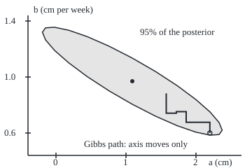
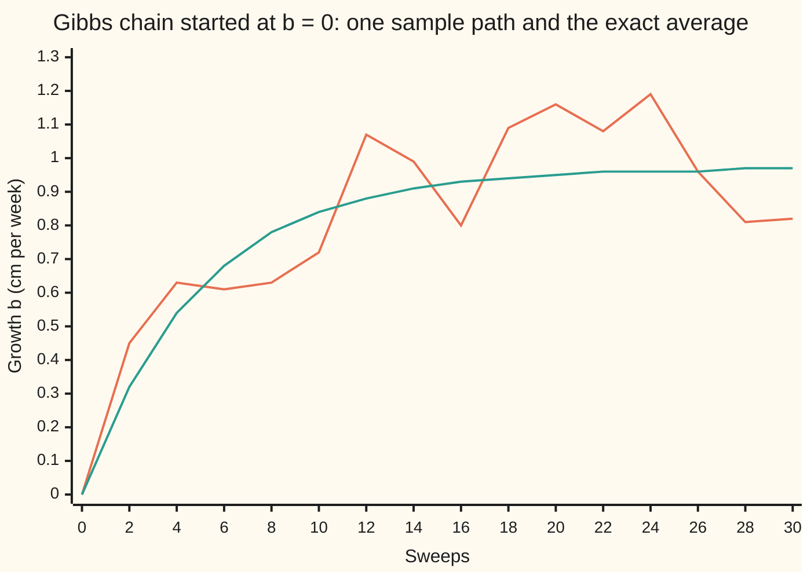

# MCMC: building a chain whose equilibrium is the distribution you want

Stochastic processes and calculus → Markov Chains → Chains built to order → MCMC

---

## General Overview

A seedling is measured once a week for five weeks: 2.1, 2.9, 4.2, 4.8 and 6.0 cm. A straight line fits: a starting height a at week 0, plus b cm of growth a week. Each reading is off by a normal (bell-shaped) random error with a spread (standard deviation) of 0.5 cm.

Neither a nor b is known. Start with no preference between pairs (a flat prior). The **posterior**, the probability law of the unknowns given the data, then puts its weight on a long, thin, tilted cloud of pairs. The tilt is the story: a seedling that started taller must have grown more slowly to reach the same heights, so a and b have correlation −0.9045. The best single guess is a start of 1.0900 cm and a growth of 0.9700 cm a week, and the chance that it grows more than 1 cm a week is 0.4248, a little under a half.

This posterior has an exact formula, so every simulated number here can be graded. Most posteriors have none. For those, a random walk through the pairs that spends its time in proportion to the posterior gives averages instead; that walk on one unknown is in [markov-chain-monte-carlo-in-outline](../../09-Probability%20and%20statistics/10-Bayesian%20Inference/06-markov-chain-monte-carlo-in-outline.md). This card is about why it works. The earlier cards on this shelf start from a chain and ask where it settles. **Markov chain Monte Carlo** (MCMC) starts from the law it wants and designs a chain that settles there.

**Choose the moves so that, in equilibrium, as much probability flows from any state to any other as flows back, and let the chain reach every state without a fixed rhythm; then the wanted law is the chain's equilibrium, the chain converges to it from any start, and averages along one long run estimate its averages, at a cost measured by how slowly the chain forgets.**

**What kind of fact this is:** a method. That the wanted law is the chain's equilibrium is a theorem proved on this card in Why it works; that the chain converges to it is the theorem of [convergence-to-equilibrium](05-convergence-to-equilibrium.md), whose hypotheses are checked here.

### The picture: the posterior cloud, and a sampler that can only move along the axes

<p align="center"></p>

Drawn to scale: 100 units per cm of a across, 200 units per cm a week of b up. The shaded ellipse holds 95% of the posterior; the dot is its centre. The staircase is one seeded run of the Gibbs sampler (Step 3), four sweeps from b = 0.6 at the open circle: sideways moves redraw a with b held, vertical moves redraw b with a held. On a narrow tilted cloud such moves are short, and that is the difficulty this card measures.

---

## The formula

Notation first, in words. A **state** $x$ is one candidate pair (a, b); $y$ is another. $\pi(x)$ (pi) is the wanted law, here the posterior density, as in [stationary-distributions](04-stationary-distributions.md). $f(x)$ is the same thing up to an unknown constant $Z$, so $\pi = f/Z$. $P(x, y)$ is the chain's transition rule: the chance, or density, of moving from $x$ to $y$ in one step. The chain's position after step $t$ is $x_t$; time on this card is counted in steps.

The design rule is **detailed balance**:

$$\pi(x)\,P(x,y) = \pi(y)\,P(y,x) \quad \text{for every pair of states } x \ne y$$

**Read it aloud:** with the chain in equilibrium, the probability flowing from x to y in one step equals the probability flowing back.

**Metropolis–Hastings** builds such a chain from any proposal rule. From $x$, propose $y$ with density $q(x, y)$. Accept it with chance

$$\alpha(x,y) = \min\!\left(1,\; r\right), \qquad r = \frac{f(y)\,q(y,x)}{f(x)\,q(x,y)}$$

and otherwise stay at $x$, recording $x$ again. $Z$ cancels in $r$, so it is never needed.

**Gibbs sampling** needs no acceptance step. It redraws one coordinate at a time from its law given the others: a new a from $\pi(a \mid b)$, then a new b from $\pi(b \mid a)$. One of each is a **sweep**.

The price of correlated steps: if a quantity $g$ has posterior variance $v$, the average $\bar g_N$ of $N$ steps of a chain in equilibrium has, for large $N$,

$$\operatorname{Var}(\bar g_N) \approx \frac{v\,\tau}{N}, \qquad \tau = 1 + 2\sum_{k=1}^{\infty} \rho_k, \qquad N_{\text{eff}} = \frac{N}{\tau}$$

Here $\rho_k$ is the correlation between steps k apart. For g = b under the Gibbs sampler, $\rho_k = \rho^{2k}$, so $\tau = (1 + \rho^2)/(1 - \rho^2) = 10$.

| Symbol | Plain meaning | In our example | Push it up and the answer… |
| --- | --- | --- | --- |
| $w_i$, $h_i$, $n$, $S_w$, $S_{ww}$, $S_h$, $S_{wh}$ | week and height of reading i; number of readings; sums of weeks, squared weeks, heights, week times height | 5 readings; sums 15, 55, 20.0, 69.7 | more weeks: a narrower cloud |
| $D$ | how spread out the weeks are: $n S_{ww} - S_w^2$, n times the summed squared distances of the weeks from their average | 50 | a narrower cloud |
| $\sigma$ | spread of the ruler's error | 0.5 cm | a wider cloud, same tilt |
| $a$, $b$ | start height at week 0; growth per week | means 1.0900 cm, 0.9700 cm a week | — |
| $x$, $y$ | states: candidate pairs (a, b) | (1.09, 0.97) is the centre | — |
| $\pi$, $f$, $Z$ | posterior density; the same without its constant; the constant | $f = e^{-\sum (h_i - a - b w_i)^2 / (2\sigma^2)}$ | — |
| $q$ | proposal density: where a step is suggested | normal steps, sd 0.3 in a, 0.09 in b | fewer accepted |
| $z$, $z_1$, $z_2$ | standard normal draws: average 0, spread 1 | made by Box–Muller in the code | — |
| $r$, $\alpha$ | the Hastings ratio; the chance of accepting | 0.4962 accepted | more moves |
| $P$ | the chain's transition rule | from $q$ and $\alpha$, or the conditionals | — |
| $\rho$, $\phi$ | correlation of a and b; the Gibbs forgetting rate $\rho^2$ | −0.9045; 0.8182 | stronger tilt, slower mixing |
| $t$, $x_t$, $b_t$ | steps or sweeps done; the state and its b then | $b_0 = 0$ in the chart | — |
| $g$, $\bar g_N$, $v$, $N$ | a quantity; its chain average; its posterior variance; steps kept | g = b, v = 0.0250, N = 100,000 | smaller error |
| $\rho_k$, $\tau$, $N_{\text{eff}}$ | correlation at lag k; the inflation factor; effective sample size (ESS) | Gibbs: $\rho_1 = 0.8182$, τ = 10, ESS 10,000 | fewer effective draws |
| $\Phi$ | the standard normal cumulative probability: the chance a standard normal draw falls below a given value | $1 - \Phi((1 - 0.97)/0.1581) = 0.4248$ | a larger chance |
| $e_t$, $s^2$, $V$, $m$ | in the folded proof: one sweep's fresh noise in b; its variance; the equilibrium variance of b; the long-run mean of b | V = 0.0250, m = 0.9700 | — |

### When it holds

- **The proposal ratio is in the acceptance.** Propose b on a multiplied scale without its factor and the chain settles on a different law: mean growth 0.9426, not 0.9700.
- **Every plausible state is reachable (irreducible).** A sampler that moves a only, with b stuck at 0.5, averages a = 2.5027 against the truth 1.0900.
- **No cycling (aperiodic).** A rejection leaves the chain where it is, and a Gibbs sweep can return to its start in one step, so no fixed rhythm exists. A chain with a period never settles, as [classifying-states](03-classifying-states.md) shows.
- **A run long compared with τ, after a burn-in.** From b = 0, the Gibbs chain still has 0.3535 of its probability misplaced after 10 sweeps.
- **The posterior has finite total area.** Otherwise there is no equilibrium to find, and the chain drifts off.

---

## Why it works

### Step 0: turn the usual question round

A **Markov chain** moves by a rule that looks only at the current state ([markov-chains](01-markov-chains.md)). The shelf so far takes a rule $P$ and finds its equilibrium $\pi$. MCMC takes $\pi$ and must invent $P$. Checking the equilibrium equation directly means a sum over every state. Detailed balance is a shortcut: a condition on one pair of states at a time, easy to arrange, that forces the equilibrium.

### Step 1: balanced pairs mean the law stays put

Suppose the chain starts in law $\pi$. The chance of being at $y$ after one step is the sum, over all states $x$, of $\pi(x)P(x, y)$. Detailed balance swaps each term for $\pi(y)P(y, x)$. Summing $P(y, x)$ over $x$ gives 1, since from $y$ the chain must go somewhere, including staying put. So the answer is $\pi(y)$: one step leaves the law unchanged, and $\pi$ is stationary.

$$\sum_x \pi(x)\,P(x,y) \;=\; \sum_x \pi(y)\,P(y,x) \;=\; \pi(y)$$

For a continuous state the sum is an integral. The check puts the seedling posterior on a grid of 141 by 121 pairs and runs a Metropolis chain on it with 24 neighbouring proposals. The largest gap between the two sides of detailed balance, over every pair, is below 1e-15. One step applied to the exact posterior changes no grid probability by more than 1e-15. Detailed balance is sufficient, not necessary: Step 3's full Gibbs sweep keeps $\pi$ without being balanced itself.

### Step 2: deriving Metropolis–Hastings

Propose $y$ from $q(x, y)$, accept with some chance $\alpha(x, y)$. For $y \ne x$, a move needs both, so $P(x, y) = q(x, y)\,\alpha(x, y)$. Detailed balance then asks

$$\pi(x)\,q(x,y)\,\alpha(x,y) = \pi(y)\,q(y,x)\,\alpha(y,x), \qquad \text{that is} \qquad \frac{\alpha(x,y)}{\alpha(y,x)} = r.$$

Any pair of acceptance chances with that ratio works. Accepting as often as possible means setting the larger of the two to 1. If $r \le 1$, that is $\alpha(x, y) = r$ and $\alpha(y, x) = 1$; if $r > 1$, the reverse. Both cases are $\alpha = \min(1, r)$, the formula above. Since $r$ is a ratio of $\pi$ values, $Z$ cancels: the chain never needs the constant that makes the posterior a probability.

When the proposal is symmetric, $q(x, y) = q(y, x)$, the $q$ factors cancel and $r = f(y)/f(x)$: the Metropolis rule of the outline card. The Metropolis run here proposes a normal step of spread 0.3 in a and 0.09 in b. It accepts 0.4962 of proposals (SE 0.0016) and, over 100,000 steps after a burn-in of 1,000, averages b = 0.9701 with a standard error of 0.0032, against the exact 0.9700.

The $q$ factors matter once the proposal is lopsided. Propose the new growth as the old one times $e^{0.1 z}$, with $z$ a standard normal draw. The density of proposing $b'$ from $b$ is then proportional to $1/b'$, so $q(b', b)/q(b, b') = b'/b$, and that factor belongs in $r$. With it, the chain averages 0.9679 (SE 0.0038), within one standard error of 0.9700. Without it, the chain settles on the posterior divided by b, whose exact mean on the grid is 0.9426; the chain gives 0.9403 (SE 0.0038). Running longer never removes the error.

### Step 3: Gibbs sampling is Metropolis–Hastings that always accepts

Take as proposal: keep b, redraw a from its law given b, $\pi(a' \mid b)$. Write the joint law as $\pi(a, b) = \pi(b)\,\pi(a \mid b)$. Then

$$r = \frac{\pi(a', b)\;\pi(a \mid b)}{\pi(a, b)\;\pi(a' \mid b)} = \frac{\pi(b)\,\pi(a' \mid b)\,\pi(a \mid b)}{\pi(b)\,\pi(a \mid b)\,\pi(a' \mid b)} = 1.$$

Every proposal is accepted, and by Step 2 the half-step keeps $\pi$; so does redrawing b given a, and so a sweep keeps $\pi$. The sweep itself is not balanced, since a then b is not the reverse of b then a. On the grid, one exact Gibbs sweep changes no probability by more than 1e-15. That holds by construction; the sweep code is tested in Step 4, where it reproduces the formula's average.

For the seedling the conditionals come straight from the likelihood. With b held, the heights minus b times the week are five noisy readings of a, so a given b is normal about their average, $(20.0 - 15b)/5 = 4 - 3b$, with spread $0.5/\sqrt{5} = 0.2236$. With a held, b given a is the slope through the origin of the heights minus a: normal about $(69.7 - 15a)/55$ with spread $0.5/\sqrt{55} = 0.0674$. These are the staircase's step sizes, against the cloud's spreads of 0.5244 in a and 0.1581 in b: the steps crawl.

### Step 4: the chain forgets its start, and how fast

The chain must also reach its stationary law. [convergence-to-equilibrium](05-convergence-to-equilibrium.md) proves that a finite chain that is irreducible and aperiodic approaches its stationary law from any start, with the distance shrinking geometrically. The grid Gibbs chain qualifies: every conditional probability is positive, so any grid pair is reachable in one sweep, and a chain that can reach everything in one sweep cannot cycle.

Start the grid chain at b = 0 and push its law forward exactly, sweep by sweep, with no random numbers. The **total variation distance**, half the summed gaps between the chain's law and the posterior, is the probability still in the wrong place:

| Sweeps | E[b], exact on the grid | E[b], formula | Distance from the posterior |
| --- | --- | --- | --- |
| 1 | 0.1764 | 0.1764 | 0.9999 |
| 5 | 0.6144 | 0.6144 | 0.8062 |
| 10 | 0.8396 | 0.8396 | 0.3535 |
| 20 | 0.9525 | 0.9525 | 0.0489 |
| 40 | 0.9697 | 0.9697 | 0.0009 |

The formula column chains the two conditional averages of Step 3:

$$E[b_t] - 0.97 = \tfrac{9}{11}\,\bigl(E[b_{t-1}] - 0.97\bigr), \qquad \text{so} \qquad E[b_t] = 0.97\,\bigl(1 - (9/11)^t\bigr) \text{ from } b_0 = 0.$$

The gap shrinks by $\rho^2$ = 9/11 = 0.8182 per sweep: the tighter the tilt, the slower the forgetting. A simulation agrees: 4,000 fresh chains from b = 0, ten sweeps each, average 0.8396 (SE 0.0025).



First line (jagged): one seeded sample path, plotted every second sweep. Second line (smooth): the exact average over all paths. The path leaves its start in about ten sweeps, then wanders around 0.97 with the posterior's own spread. The **burn-in**, the steps thrown away at the start, drops the stretch that still remembers b = 0.

<details>
<summary>Detailed proof: the b-chain is a first-order autoregression with coefficient ρ^2</summary>

Write $S_w = \sum w_i$, $S_{ww} = \sum w_i^2$, $S_h = \sum h_i$ and $S_{wh} = \sum w_i h_i$ for the four sums. A Gibbs sweep draws $a_t = (S_h - b_{t-1} S_w)/n + (\sigma/\sqrt n)\,z_1$, then $b_t = (S_{wh} - a_t S_w)/S_{ww} + (\sigma/\sqrt{S_{ww}})\,z_2$, with $z_1, z_2$ independent standard normals. Substituting,
$$b_t = \frac{S_{wh} - S_w S_h / n}{S_{ww}} + \phi\, b_{t-1} + e_t, \qquad \phi = \frac{S_w^2}{n\, S_{ww}}, \qquad e_t = \frac{\sigma}{\sqrt{S_{ww}}}\Bigl(z_2 - \frac{S_w}{\sqrt{n S_{ww}}}\,z_1\Bigr).$$
The noise term is independent of the past with variance $s^2 = (\sigma^2/S_{ww})(1 + \phi)$. So $b_t$ is a first-order autoregression: tomorrow is a fixed fraction $\phi$ of today plus fresh noise.

**Coefficient.** The posterior variances of a and b are $\sigma^2 S_{ww}/D$ and $\sigma^2 n/D$ and their covariance is $-\sigma^2 S_w/D$, with $D = n S_{ww} - S_w^2$, as in the worked numbers. So $\rho^2 = S_w^2 / (n S_{ww}) = \phi$. Here $\phi = 225/275 = 9/11$.

**Mean.** The fixed point of the average is $m = (n S_{wh} - S_w S_h)/(n S_{ww} - S_w^2)$, the least-squares slope 0.97, and $E[b_t] - m = \phi\,(E[b_{t-1}] - m)$: after $t$ sweeps the gap is $\phi^t$ times the first.

**Variance.** The equilibrium variance V solves $V = \phi^2 V + s^2$, so $V = s^2/(1 - \phi^2) = \sigma^2 / (S_{ww}(1 - \phi))$. The posterior variance of b is $\sigma^2 n/(n S_{ww} - S_w^2)$, which is the same expression. So the law of $b_t$ converges to the posterior marginal of b, both its centre and its spread, geometrically at rate $\phi = \rho^2$ per sweep.

**Autocorrelation.** In equilibrium $\operatorname{Cov}(b_t, b_{t+k}) = \phi^k V$, so $\rho_k = \phi^k$.

</details>

### Step 5: the error of a correlated average

Along one run of an irreducible chain the average converges to the posterior average. For the grid chain this is the time-average theorem of [stationary-distributions](04-stationary-distributions.md), proved there for finite chains; it needs no aperiodicity. The 100,000-step runs are on the continuous posterior, where the same result also needs Harris recurrence (from any start, every region of positive probability is visited again and again). That version is stated here without proof, from Tierney (1994), whose conditions the Metropolis and Gibbs chains here meet. What changes is the error: neighbouring steps overlap in information, so the variance of the average exceeds $v/N$ by the factor $\tau$.

<details>
<summary>Detailed proof: the variance of a correlated average</summary>

Let $g_1, \dots, g_N$ be the chain's values in equilibrium, each with variance $v$ and lag-k correlation $\rho_k$. The variance of a sum is the sum of all covariances:
$$\operatorname{Var}\Bigl(\sum_{t=1}^{N} g_t\Bigr) = \sum_{s=1}^{N}\sum_{t=1}^{N} v\,\rho_{|s-t|} = N v + 2 v \sum_{k=1}^{N-1} (N - k)\,\rho_k,$$
since lag k occurs for $N - k$ ordered pairs, twice. Divide by $N^2$:
$$\operatorname{Var}(\bar g_N) = \frac{v}{N}\Bigl[1 + 2\sum_{k=1}^{N-1}\bigl(1 - \tfrac{k}{N}\bigr)\rho_k\Bigr].$$
When $\sum_k |\rho_k|$ is finite, the bracket tends to $\tau = 1 + 2\sum_{k \ge 1} \rho_k$ by dominated convergence (wing 10), which is the formula. For the Gibbs b-chain, $\rho_k = \phi^k$ and the geometric series gives $\tau = 1 + 2\phi/(1 - \phi) = (1 + \phi)/(1 - \phi) = (20/11)/(2/11) = 10$.

</details>

So 100,000 Gibbs sweeps are worth 10,000 independent draws of b. The run's lag-1 autocorrelation is 0.8173 (SE 0.0019), against the exact 0.8182. **Batch means** cuts the run into 100 batches of 1,000, treats their averages as nearly independent, and reads the standard error off their spread: 0.0014, an ESS of 12,001 and N / ESS = 8.3325 with standard error 1.1843, against the exact 10: an estimate read off 100 batch averages has a relative standard error of √(2/99). The naive spread over the square root of N gives 0.0005.

### Step 6: diagnosing mixing

**Mixing** is how fast a chain moves through its equilibrium. The two samplers, on the same posterior, 100,000 steps each:

| Measure | Gibbs | Metropolis |
| --- | --- | --- |
| lag-1 autocorrelation of b, SE | 0.8173, 0.0019 | 0.9456, 0.0014 |
| N / ESS for b, SE | 8.3325, 1.1843 | 41.3973, 5.8840 |
| mean b, SE | 0.9711, 0.0014 | 0.9701, 0.0032 |
| P(b > 1), SE | 0.4290, 0.0042 | 0.4274, 0.0081 |

Both land within a few standard errors of the exact 0.9700 and 0.4248, and their correlations, −0.9032 (SE 0.0011) and −0.9022 (SE 0.0025), match −0.9045 within two standard errors. Metropolis's ESS is 2416. Neither is fast: both move against the tilt. The usual checks:

- **Trace plots**, like the chart above: a path that climbs, drifts or sticks has not settled.
- **Acceptance rate**, for Metropolis (0.4962 here, SE 0.0016): near 1, steps too small; near 0, steps too big.
- **Autocorrelation and ESS**: what the run is worth. Quote the batch standard error.
- **Several chains from spread-out starts**: disagreement proves trouble; agreement is only evidence.

One a-only chain passes the checks on a: a settled trace, a small standard error. But its b trace is frozen, and chains started at different b disagree, each averaging a near its own 4 − 3b. What can pass all four is a sampler trapped in one of two separated peaks and started in that peak every time: no check on the output sees a region the chain never visits. The cure here is to remove the tilt: count weeks from week 3, so a is the height at week 3; the correlation becomes 0, τ becomes 1, and each sweep is an independent draw. Tools for many correlated unknowns are in markov-chain-monte-carlo-for-computation.

---

## Worked numbers, by hand

| Step | Arithmetic | Value |
| --- | --- | --- |
| sums of weeks, squared weeks, heights, products | 1 + … + 5; 1 + 4 + … + 25; 2.1 + … + 6.0; 2.1 + 5.8 + 12.6 + 19.2 + 30.0 | 15, 55, 20.0, 69.7 |
| D = n S_ww − S_w^2, how spread out the weeks are | 5 × 55 − 15 × 15 | 50 |
| growth b, posterior mean | (5 × 69.7 − 15 × 20.0) / 50 | 0.9700 |
| start a, posterior mean | (20.0 − 15 × 0.97) / 5 | 1.0900 |
| variances of a and b, covariance | 0.25 × 55 / 50; 0.25 × 5 / 50; −0.25 × 15 / 50 | 0.2750, 0.0250, −0.0750 |
| correlation | −0.0750 / √(0.2750 × 0.0250) | −0.9045 |
| P(b > 1) | 1 − Φ((1 − 0.97) / 0.1581) | **0.4248** |
| Gibbs conditional spreads | 0.5 / √5 and 0.5 / √55 | 0.2236, 0.0674 |
| forgetting rate ρ^2 | 15 × 15 / (5 × 55) = 9/11 | 0.8182 |
| inflation τ | (1 + 9/11) / (1 − 9/11) | **10** |
| first sweep from b = 0 | a averages 4; b averages (69.7 − 60) / 55 | 0.1764 |

Φ is the standard normal cumulative probability. The seedling probably started near 1.09 cm and grows about 0.97 cm a week; the chance it grows more than 1 cm a week is about 42%. A Gibbs sampler needs ten sweeps per independent draw's worth of information, and about twenty to forget a bad start.

### What breaks if you drop a piece

| Mistake | Comes out at | What went wrong |
| --- | --- | --- |
| Multiplied proposal on b, no Hastings factor | mean b 0.9403 (SE 0.0038); exact wrong target 0.9426 | Detailed balance fails; the chain settles on the posterior divided by b |
| Propose moves in a only, b stuck at 0.5 | mean a 2.5027 (SE 0.0016); exact 2.5000; truth 1.0900 | Not irreducible: the chain samples a given b = 0.5, a single slice of the cloud |
| Standard error as if steps were independent | 0.0005 instead of 0.0014 | Lag-1 correlation 0.8173; about 12,001 of 100,000 steps count |
| No burn-in: read the chain at sweep 10 from b = 0 | E[b] 0.8396, truth 0.9700 | 0.3535 of the probability is still in the wrong place |

---

## Code, from first principles, and it actually runs

Three independent roads. Road 1: the exact normal posterior by formula, with the normal cumulative probability by Simpson's rule. Road 2: the posterior on a 141-by-121 grid, no randomness; it checks detailed balance for every pair, applies a Metropolis step and a Gibbs sweep to the exact law, and pushes a chain from b = 0 forward. Road 3: simulation with a SplitMix64 generator and Box–Muller normals written out, so both languages draw identical numbers; each simulated number carries a batch-means standard error (for a correlation or an acceptance rate, the spread of its value over the 100 batches), and asserts allow four.

### Python

```python
# MCMC check: a seedling's start height a and weekly growth b, posterior sampled three ways.
# Roads: 1 the exact normal posterior by formula; 2 an exact grid, chains pushed with no randomness;
# 3 seeded simulation (SplitMix64, Box-Muller), every simulated number with a batch-means standard error.
from math import exp, sqrt, log, cos, sin, pi
M64 = (1 << 64) - 1
class Rng:
    def __init__(s, seed): s.s = seed
    def u(s):
        s.s = (s.s + 0x9E3779B97F4A7C15) & M64
        z = s.s
        z = ((z ^ (z >> 30)) * 0xBF58476D1CE4E5B9) & M64
        z = ((z ^ (z >> 27)) * 0x94D049BB133111EB) & M64
        return ((z ^ (z >> 31)) >> 11) * 2.0 ** -53
    def n(s):
        u1 = s.u(); u2 = s.u()
        return sqrt(-2.0 * log(1.0 - u1)) * cos(2.0 * pi * u2)
X = [1.0, 2.0, 3.0, 4.0, 5.0]; Y = [2.1, 2.9, 4.2, 4.8, 6.0]; SIG = 0.5   # weeks, heights (cm), noise sd
n = 5.0; SX = sum(X); SXX = sum(x * x for x in X); SY = sum(Y); SXY = sum(x * y for x, y in zip(X, Y))
def logf(a, b): return -sum((y - a - b * x) ** 2 for x, y in zip(X, Y)) / (2 * SIG * SIG)
def Phi(z):                                   # normal CDF by Simpson's rule on the bell curve
    m = 400; h = abs(z) / m
    s = sum((1 if i in (0, m) else (4 if i % 2 else 2)) * exp(-0.5 * (i * h) ** 2) for i in range(m + 1))
    v = 0.5 + s * h / 3 / sqrt(2 * pi)
    return v if z >= 0 else 1 - v
def out(k, *v, d=4): print(f"{k:<38}" + "".join(f" {x:.{d}f}" for x in v))
# ---- road 1: formula ----
D = n * SXX - SX * SX
bh = (n * SXY - SX * SY) / D; ah = (SY - bh * SX) / n
vA = SIG ** 2 * SXX / D; vB = SIG ** 2 * n / D; cAB = -SIG ** 2 * SX / D
rho = cAB / sqrt(vA * vB); r2 = rho * rho; tau = (1 + r2) / (1 - r2)
pB1 = 1 - Phi((1 - bh) / sqrt(vB))
out("sums w, w^2, h, wh; D", SX, SXX, SY, SXY, D); out("var a, var b, cov(a,b)", vA, vB, cAB)
out("Gibbs conditional sd, a|b and b|a", SIG / sqrt(n), SIG / sqrt(SXX))
for k, v in [("formula mean a", ah), ("formula mean b", bh), ("formula sd a", sqrt(vA)), ("formula sd b", sqrt(vB)),
             ("formula corr(a,b)", rho), ("formula P(b>1)", pB1), ("Gibbs lag-1 autocorr rho^2", r2), ("Gibbs tau = N/ESS", tau)]: out(k, v)
# ---- road 2: exact grid ----
NA, NB = 141, 121; GA = [-2.0 + 0.05 * i for i in range(NA)]; GB = [-0.5 + 0.025 * j for j in range(NB)]
LW = [[logf(GA[i], GB[j]) for j in range(NB)] for i in range(NA)]; W = [[exp(v) for v in r] for r in LW]
T = sum(map(sum, W)); W = [[w / T for w in r] for r in W]
gb = sum(W[i][j] * GB[j] for i in range(NA) for j in range(NB)); ga = sum(W[i][j] * GA[i] for i in range(NA) for j in range(NB))
gp = sum(W[i][j] * (1.0 if j > 60 else 0.5 if j == 60 else 0.0) for i in range(NA) for j in range(NB))
out("grid mean a", ga); out("grid mean b", gb); out("grid P(b>1)", gp)
nb = [(di, dj) for di in range(-2, 3) for dj in range(-2, 3) if (di, dj) != (0, 0)]   # Metropolis on the grid, 24 neighbours
def mv(i, j, k, l): return 0.0 if not (0 <= k < NA and 0 <= l < NB) else min(1.0, exp(LW[k][l] - LW[i][j])) / 24
imb = max(abs(W[i][j] * mv(i, j, i + di, j + dj) - W[i + di][j + dj] * mv(i + di, j + dj, i, j))
          for i in range(NA) for j in range(NB) for di, dj in nb if 0 <= i + di < NA and 0 <= j + dj < NB)
new = [[W[i][j] * (1 - sum(mv(i, j, i + di, j + dj) for di, dj in nb)) for j in range(NB)] for i in range(NA)]
for i in range(NA):
    for j in range(NB):
        for di, dj in nb:
            if 0 <= i + di < NA and 0 <= j + dj < NB: new[i + di][j + dj] += W[i][j] * mv(i, j, i + di, j + dj)
mstat = max(abs(new[i][j] - W[i][j]) for i in range(NA) for j in range(NB))
print(f"{'grid Metropolis balance, max gap':<38} {'below 1e-15' if imb < 1e-15 else imb}")
print(f"{'grid Metropolis one step, max change':<38} {'below 1e-15' if mstat < 1e-15 else mstat}")
colA = [sum(W[i][j] for i in range(NA)) for j in range(NB)]; rowB = [sum(W[i]) for i in range(NA)]
def sweep(mu):                                # Gibbs on the grid: redraw a given b, then b given a
    cm = [sum(mu[i][j] for i in range(NA)) for j in range(NB)]
    mu = [[cm[j] * W[i][j] / colA[j] for j in range(NB)] for i in range(NA)]
    rm = [sum(r) for r in mu]
    return [[rm[i] * W[i][j] / rowB[i] for j in range(NB)] for i in range(NA)]
g1 = sweep(W); gstat = max(abs(g1[i][j] - W[i][j]) for i in range(NA) for j in range(NB))
print(f"{'grid Gibbs sweep, max change':<38} {'below 1e-15' if gstat < 1e-15 else gstat}")
mu = [[1.0 if (i, j) == (0, 20) else 0.0 for j in range(NB)] for i in range(NA)]   # start at b = 0
Eb = {}; TV = {}
for s in range(41):
    Eb[s] = sum(mu[i][j] * GB[j] for i in range(NA) for j in range(NB))
    TV[s] = 0.5 * sum(abs(mu[i][j] - W[i][j]) for i in range(NA) for j in range(NB)); mu = sweep(mu)
for s in (1, 5, 10, 20, 40): out(f"sweep {s}: E[b] grid, formula; TV", Eb[s], bh * (1 - r2 ** s), TV[s])
wr = sum(W[i][j] for i in range(NA) for j in range(NB) if GB[j] > 0) / sum(W[i][j] / GB[j] for i in range(NA) for j in range(NB) if GB[j] > 0)
out("grid mean b, no Hastings factor", wr)
# ---- road 3: simulation ----
def bm(xs, k=100):                            # batch-means standard error and effective sample size
    L = len(xs) // k; m = sum(xs) / len(xs); v = sum((x - m) ** 2 for x in xs) / len(xs)
    bs = [sum(xs[q * L:(q + 1) * L]) / L for q in range(k)]
    se = sqrt(sum((c - m) ** 2 for c in bs) / (k - 1) / k); return m, se, v / se ** 2
def bse(f, *xs, k=100):                       # standard error of any statistic f from its spread over the k batches
    L = len(xs[0]) // k; s = [f(*(x[q * L:(q + 1) * L] for x in xs)) for q in range(k)]; m = sum(s) / k
    return sqrt(sum((c - m) ** 2 for c in s) / (k - 1) / k)
def corr(A, B):
    ma, mb = sum(A) / len(A), sum(B) / len(B); return sum((x - ma) * (y - mb) for x, y in zip(A, B)) / sqrt(sum((x - ma) ** 2 for x in A) * sum((y - mb) ** 2 for y in B))
def lag1(B): mb = sum(B) / len(B); return sum((B[t] - mb) * (B[t + 1] - mb) for t in range(len(B) - 1)) / sum((y - mb) ** 2 for y in B)
def gibbs(r, b):
    a = (SY - b * SX) / n + r.n() * SIG / sqrt(n)
    return a, (SXY - a * SX) / SXX + r.n() * SIG / sqrt(SXX)
def metro(r, a, b, sa, sb, only_a=False, mult=False, hastings=True):
    a2 = a + sa * r.n(); b2 = b if only_a else (b * exp(sb * r.n()) if mult else b + sb * r.n())
    lr = logf(a2, b2) - logf(a, b) + (log(b2 / b) if mult and hastings else 0.0)
    return (a2, b2, 1) if log(1.0 - r.u()) < lr else (a, b, 0)
N, BURN = 100000, 1000
def run(kind, seed, a=1.0, b=1.0, **kw):
    r = Rng(seed); A, B, K = [], [], []
    for t in range(BURN + N):
        if kind == "g": a, b = gibbs(r, b); k = 1
        else: a, b, k = metro(r, a, b, **kw)
        if t >= BURN: A.append(a); B.append(b); K.append(k)
    return A, B, K
for name, (A, B, K) in [("Gibbs", run("g", 7)), ("Metropolis", run("m", 11, sa=0.3, sb=0.09))]:
    ma, sea, _ = bm(A); mb, seb, essb = bm(B); p1, sep, _ = bm([1.0 if x > 1 else 0.0 for x in B])
    c, l1, ac, nt = corr(A, B), lag1(B), sum(K) / N, N / essb; sc, sl, sac = bse(corr, A, B), bse(lag1, B), bse(lambda x: sum(x) / len(x), K)
    snt = nt * sqrt(2 / 99)                   # N / ESS is read off 100 batch averages: relative SE sqrt(2/99)
    for k, v in [("mean a, SE", (ma, sea)), ("mean b, SE", (mb, seb)), ("P(b>1), SE", (p1, sep)), ("corr(a,b), SE", (c, sc)), ("acceptance rate, SE", (ac, sac)),
                 ("lag-1 autocorr of b, SE", (l1, sl)), ("N / ESS, SE", (nt, snt)), ("naive SE of b, sd/sqrt(N)", (sqrt(sum((y - mb) ** 2 for y in B) / N / N),))]:
        out(f"{name} {k}", *v)
    out(f"{name} ESS of b", essb, d=0)
    assert abs(c - rho) < 4 * sc
    if name == "Gibbs":
        assert abs(mb - bh) < 4 * seb and abs(ma - ah) < 4 * sea and abs(p1 - pB1) < 4 * sep
        assert abs(l1 - r2) < 4 * sl and abs(nt - tau) < 4 * snt
    else: assert abs(mb - bh) < 4 * seb and abs(p1 - pB1) < 4 * sep
r = Rng(5); b10 = []                         # 4,000 fresh chains from b = 0, ten sweeps each
for c in range(4000):
    b = 0.0
    for s in range(10): a, b = gibbs(r, b)
    b10.append(b)
m10 = sum(b10) / 4000; se10 = sqrt(sum((x - m10) ** 2 for x in b10) / 3999 / 4000); out("sweep 10: E[b] from 4000 chains, SE", m10, se10)
for name, kw in [("no Hastings factor", dict(mult=True, hastings=False)), ("with Hastings factor", dict(mult=True))]:
    _, B, _ = run("m", 13, sa=0.3, sb=0.1, **kw); mb, seb, _ = bm(B); out(f"{name}: mean b, SE", mb, seb)
    assert abs(mb - (wr if "no" in name else bh)) < 4 * seb
A, B, _ = run("m", 17, b=0.5, sa=0.3, sb=0.0, only_a=True); ma, sea, _ = bm(A); out("a-only from b=0.5: mean a, SE; exact", ma, sea, (SY - 0.5 * SX) / n)
r = Rng(3); b = 0.0; tr = [b]                 # one sample path for the burn-in chart
for s in range(30): a, b = gibbs(r, b); tr.append(b)
print("trace b, sweeps 0,2,..,30:", ", ".join(f"{tr[s]:.2f}" for s in range(0, 31, 2)))
print("E[b],  sweeps 0,2,..,30:", ", ".join(f"{bh * (1 - r2 ** s):.2f}" for s in range(0, 31, 2)))
r = Rng(2); b = 0.6; pts = []                 # figure: a Gibbs staircase over the 95% ellipse
for s in range(4): a, b2 = gibbs(r, b); pts += [(a, b), (a, b2)]; b = b2
px = lambda a, b: (40 + 100 * (a + 0.4), 220 - 200 * (b - 0.45))
L11 = sqrt(vA); L21 = cAB / L11; L22 = sqrt(vB - L21 * L21); R = sqrt(-2 * log(0.05))
ell = [px(ah + R * L11 * cos(2 * pi * k / 24), bh + R * (L21 * cos(2 * pi * k / 24) + L22 * sin(2 * pi * k / 24))) for k in range(24)]
print("figure, ellipse:", " ".join(f"{x:.1f},{y:.1f}" for x, y in ell)); print("figure, centre: %.1f,%.1f" % px(ah, bh))
print("figure, ticks: a=0,1,2 at x=%.0f,%.0f,%.0f; b=0.6,1.0,1.4 at y=%.0f,%.0f,%.0f" % (px(0, 0)[0], px(1, 0)[0], px(2, 0)[0], px(0, 0.6)[1], px(0, 1.0)[1], px(0, 1.4)[1]))
print("figure, staircase from b=0.6:", " ".join(f"{x:.1f},{y:.1f}" for x, y in [px(*p) for p in pts]))
def rho2(xs): return sum(xs) ** 2 / (len(xs) * sum(x * x for x in xs))   # squared corr(a,b) from the weeks alone
c0 = rho2([x - 3 for x in X]); out("try: centred weeks, rho^2 and tau", c0, (1 + c0) / (1 - c0)); r7 = rho2([1.0 * k for k in range(1, 8)])
out("try: 7 weeks, rho^2 and tau", r7, (1 + r7) / (1 - r7))
assert abs(gb - bh) < 1e-6; assert abs(ga - ah) < 1e-6; assert abs(gp - pB1) < 5e-4
assert imb < 1e-15; assert mstat < 1e-15; assert gstat < 1e-15
assert abs(Eb[10] - bh * (1 - r2 ** 10)) < 1e-3; assert TV[40] < 0.01 < TV[10]
assert abs(m10 - bh * (1 - r2 ** 10)) < 4 * se10; assert abs(ma - (SY - 0.5 * SX) / n) < 4 * sea
print("all asserts passed")
```

**Ran 2026-10-07 on macOS, Python 3.14.6, standard library only. All checks passed. Output, pasted from the run:**

```
sums w, w^2, h, wh; D                  15.0000 55.0000 20.0000 69.7000 50.0000
var a, var b, cov(a,b)                 0.2750 0.0250 -0.0750
Gibbs conditional sd, a|b and b|a      0.2236 0.0674
formula mean a                         1.0900
formula mean b                         0.9700
formula sd a                           0.5244
formula sd b                           0.1581
formula corr(a,b)                      -0.9045
formula P(b>1)                         0.4248
Gibbs lag-1 autocorr rho^2             0.8182
Gibbs tau = N/ESS                      10.0000
grid mean a                            1.0900
grid mean b                            0.9700
grid P(b>1)                            0.4249
grid Metropolis balance, max gap       below 1e-15
grid Metropolis one step, max change   below 1e-15
grid Gibbs sweep, max change           below 1e-15
sweep 1: E[b] grid, formula; TV        0.1764 0.1764 0.9999
sweep 5: E[b] grid, formula; TV        0.6144 0.6144 0.8062
sweep 10: E[b] grid, formula; TV       0.8396 0.8396 0.3535
sweep 20: E[b] grid, formula; TV       0.9525 0.9525 0.0489
sweep 40: E[b] grid, formula; TV       0.9697 0.9697 0.0009
grid mean b, no Hastings factor        0.9426
Gibbs mean a, SE                       1.0867 0.0047
Gibbs mean b, SE                       0.9711 0.0014
Gibbs P(b>1), SE                       0.4290 0.0042
Gibbs corr(a,b), SE                    -0.9032 0.0011
Gibbs acceptance rate, SE              1.0000 0.0000
Gibbs lag-1 autocorr of b, SE          0.8173 0.0019
Gibbs N / ESS, SE                      8.3325 1.1843
Gibbs naive SE of b, sd/sqrt(N)        0.0005
Gibbs ESS of b                         12001
Metropolis mean a, SE                  1.0902 0.0108
Metropolis mean b, SE                  0.9701 0.0032
Metropolis P(b>1), SE                  0.4274 0.0081
Metropolis corr(a,b), SE               -0.9022 0.0025
Metropolis acceptance rate, SE         0.4962 0.0016
Metropolis lag-1 autocorr of b, SE     0.9456 0.0014
Metropolis N / ESS, SE                 41.3973 5.8840
Metropolis naive SE of b, sd/sqrt(N)   0.0005
Metropolis ESS of b                    2416
sweep 10: E[b] from 4000 chains, SE    0.8396 0.0025
no Hastings factor: mean b, SE         0.9403 0.0038
with Hastings factor: mean b, SE       0.9679 0.0038
a-only from b=0.5: mean a, SE; exact   2.5027 0.0016 2.5000
trace b, sweeps 0,2,..,30: 0.00, 0.45, 0.63, 0.61, 0.63, 0.72, 1.07, 0.99, 0.80, 1.09, 1.16, 1.08, 1.19, 0.96, 0.81, 0.82
E[b],  sweeps 0,2,..,30: 0.00, 0.32, 0.54, 0.68, 0.78, 0.84, 0.88, 0.91, 0.93, 0.94, 0.95, 0.96, 0.96, 0.96, 0.97, 0.97
figure, ellipse: 317.4,186.0 313.0,175.1 300.2,160.1 279.8,142.2 253.2,122.4 222.2,102.2 189.0,83.0 155.8,66.0 124.8,52.4 98.2,43.2 77.8,38.9 65.0,39.8 60.6,46.0 65.0,56.9 77.8,71.9 98.2,89.8 124.8,109.6 155.8,129.8 189.0,149.0 222.2,166.0 253.2,179.6 279.8,188.8 300.2,193.1 313.0,192.2
figure, centre: 189.0,116.0
figure, ticks: a=0,1,2 at x=80,180,280; b=0.6,1.0,1.4 at y=190,110,30
figure, staircase from b=0.6: 299.8,190.0 299.8,174.7 266.0,174.7 266.0,159.5 251.9,159.5 251.9,161.7 237.5,161.7 237.5,133.4
try: centred weeks, rho^2 and tau      0.0000 1.0000
try: 7 weeks, rho^2 and tau            0.8000 9.0000
all asserts passed
```

### Rust

```rust
// MCMC check: a seedling's start height a and weekly growth b, posterior sampled three ways.
// Roads: 1 the exact normal posterior by formula; 2 an exact grid, chains pushed with no randomness;
// 3 seeded simulation (SplitMix64, Box-Muller), every simulated number with a batch-means standard error.
use std::f64::consts::PI;
struct Rng(u64);
impl Rng {
    fn u(&mut self) -> f64 {
        self.0 = self.0.wrapping_add(0x9E3779B97F4A7C15);
        let mut z = self.0;
        z = (z ^ (z >> 30)).wrapping_mul(0xBF58476D1CE4E5B9);
        z = (z ^ (z >> 27)).wrapping_mul(0x94D049BB133111EB);
        ((z ^ (z >> 31)) >> 11) as f64 * 2f64.powi(-53)
    }
    fn n(&mut self) -> f64 { let u1 = self.u(); let u2 = self.u(); (-2.0 * (1.0 - u1).ln()).sqrt() * (2.0 * PI * u2).cos() }
}
const X: [f64; 5] = [1.0, 2.0, 3.0, 4.0, 5.0];
const Y: [f64; 5] = [2.1, 2.9, 4.2, 4.8, 6.0];
const SIG: f64 = 0.5;
const N_: f64 = 5.0; const SX: f64 = 15.0; const SXX: f64 = 55.0;
fn sy() -> f64 { Y.iter().sum() }
fn sxy() -> f64 { X.iter().zip(Y.iter()).map(|(x, y)| x * y).sum() }
fn logf(a: f64, b: f64) -> f64 { -X.iter().zip(Y.iter()).map(|(x, y)| (y - a - b * x).powi(2)).sum::<f64>() / (2.0 * SIG * SIG) }
fn phi(z: f64) -> f64 {
    let m = 400; let h = z.abs() / m as f64;
    let s: f64 = (0..=m).map(|i| (if i == 0 || i == m { 1.0 } else if i % 2 == 1 { 4.0 } else { 2.0 }) * (-0.5 * (i as f64 * h).powi(2)).exp()).sum();
    let v = 0.5 + s * h / 3.0 / (2.0 * PI).sqrt();
    if z >= 0.0 { v } else { 1.0 - v }
}
fn out(k: &str, v: &[f64], d: usize) { let mut s = format!("{:<38}", k); for x in v { s += &format!(" {:.*}", d, x); } println!("{}", s); }
fn bm(xs: &[f64]) -> (f64, f64, f64) {
    let k = 100; let l = xs.len() / k; let n = xs.len() as f64;
    let m = xs.iter().sum::<f64>() / n; let v = xs.iter().map(|x| (x - m).powi(2)).sum::<f64>() / n;
    let bs: Vec<f64> = (0..k).map(|q| xs[q * l..(q + 1) * l].iter().sum::<f64>() / l as f64).collect();
    let se = (bs.iter().map(|c| (c - m).powi(2)).sum::<f64>() / (k - 1) as f64 / k as f64).sqrt(); (m, se, v / (se * se))
}
// standard error of any statistic f(start, end) from its spread over 100 batches of a run of length n
fn bse(n: usize, f: &dyn Fn(usize, usize) -> f64) -> f64 {
    let k = 100; let l = n / k; let s: Vec<f64> = (0..k).map(|q| f(q * l, (q + 1) * l)).collect(); let m = s.iter().sum::<f64>() / k as f64;
    (s.iter().map(|c| (c - m).powi(2)).sum::<f64>() / (k - 1) as f64 / k as f64).sqrt()
}
fn mean(xs: &[f64]) -> f64 { xs.iter().sum::<f64>() / xs.len() as f64 }
fn corr(a: &[f64], b: &[f64]) -> f64 {
    let (ma, mb) = (mean(a), mean(b)); let sab: f64 = a.iter().zip(b.iter()).map(|(x, y)| (x - ma) * (y - mb)).sum();
    sab / (a.iter().map(|x| (x - ma).powi(2)).sum::<f64>() * b.iter().map(|y| (y - mb).powi(2)).sum::<f64>()).sqrt()
}
fn lag1(b: &[f64]) -> f64 { let mb = mean(b); (0..b.len() - 1).map(|t| (b[t] - mb) * (b[t + 1] - mb)).sum::<f64>() / b.iter().map(|y| (y - mb).powi(2)).sum::<f64>() }
fn gibbs(r: &mut Rng, b: f64) -> (f64, f64) {
    let a = (sy() - b * SX) / N_ + r.n() * SIG / N_.sqrt();
    (a, (sxy() - a * SX) / SXX + r.n() * SIG / SXX.sqrt())
}
// kind: 0 Gibbs, 1 Metropolis; mode: 0 additive, 1 multiplicative on b with Hastings factor, 2 without, 3 move a only
fn run(kind: u8, seed: u64, mut a: f64, mut b: f64, sa: f64, sb: f64, mode: u8) -> (Vec<f64>, Vec<f64>, Vec<f64>) {
    let (nn, burn) = (100000usize, 1000usize);
    let mut r = Rng(seed); let (mut aa, mut bb, mut acc) = (Vec::new(), Vec::new(), Vec::new());
    for t in 0..burn + nn {
        let k;
        if kind == 0 { let g = gibbs(&mut r, b); a = g.0; b = g.1; k = 1.0; } else {
            let a2 = a + sa * r.n();
            let b2 = if mode == 3 { b } else if mode == 1 || mode == 2 { b * (sb * r.n()).exp() } else { b + sb * r.n() };
            let lr = logf(a2, b2) - logf(a, b) + if mode == 1 { (b2 / b).ln() } else { 0.0 };
            if (1.0 - r.u()).ln() < lr { a = a2; b = b2; k = 1.0; } else { k = 0.0; }
        }
        if t >= burn { aa.push(a); bb.push(b); acc.push(k); }
    }
    (aa, bb, acc)
}
fn main() {
    let (sy, sxy) = (sy(), sxy()); let nf = 100000.0;
    let d = N_ * SXX - SX * SX; let bh = (N_ * sxy - SX * sy) / d; let ah = (sy - bh * SX) / N_;
    let va = SIG * SIG * SXX / d; let vb = SIG * SIG * N_ / d; let cab = -SIG * SIG * SX / d;
    let rho = cab / (va * vb).sqrt(); let r2 = rho * rho; let tau = (1.0 + r2) / (1.0 - r2);
    let pb1 = 1.0 - phi((1.0 - bh) / vb.sqrt());
    out("sums w, w^2, h, wh; D", &[SX, SXX, sy, sxy, d], 4); out("var a, var b, cov(a,b)", &[va, vb, cab], 4);
    out("Gibbs conditional sd, a|b and b|a", &[SIG / N_.sqrt(), SIG / SXX.sqrt()], 4);
    for (k, v) in [("formula mean a", ah), ("formula mean b", bh), ("formula sd a", va.sqrt()), ("formula sd b", vb.sqrt()), ("formula corr(a,b)", rho),
                   ("formula P(b>1)", pb1), ("Gibbs lag-1 autocorr rho^2", r2), ("Gibbs tau = N/ESS", tau)] { out(k, &[v], 4); }
    // ---- road 2: exact grid ----
    let (na, nb) = (141usize, 121usize);
    let ga: Vec<f64> = (0..na).map(|i| -2.0 + 0.05 * i as f64).collect(); let gb: Vec<f64> = (0..nb).map(|j| -0.5 + 0.025 * j as f64).collect();
    let lw: Vec<Vec<f64>> = (0..na).map(|i| (0..nb).map(|j| logf(ga[i], gb[j])).collect()).collect();
    let mut w: Vec<Vec<f64>> = lw.iter().map(|r| r.iter().map(|v| v.exp()).collect()).collect();
    let t: f64 = w.iter().map(|r| r.iter().sum::<f64>()).sum(); for r in w.iter_mut() { for x in r.iter_mut() { *x /= t; } }
    let (mut gma, mut gmb, mut gp) = (0.0, 0.0, 0.0);
    for i in 0..na { for j in 0..nb { gma += w[i][j] * ga[i]; gmb += w[i][j] * gb[j]; gp += w[i][j] * if j > 60 { 1.0 } else if j == 60 { 0.5 } else { 0.0 }; } }
    out("grid mean a", &[gma], 4); out("grid mean b", &[gmb], 4); out("grid P(b>1)", &[gp], 4);
    let ok = |k: i64, l: i64| k >= 0 && k < na as i64 && l >= 0 && l < nb as i64;
    let mv = |i: usize, j: usize, k: i64, l: i64| if !ok(k, l) { 0.0 } else { (lw[k as usize][l as usize] - lw[i][j]).exp().min(1.0) / 24.0 };
    let nbr: Vec<(i64, i64)> = (-2..3).flat_map(|di| (-2..3).map(move |dj| (di, dj))).filter(|&p| p != (0, 0)).collect();
    let (mut imb, mut newm) = (0.0f64, vec![vec![0.0; nb]; na]);
    for i in 0..na { for j in 0..nb {
        let mut stay = 1.0;
        for &(di, dj) in &nbr { let (k, l) = (i as i64 + di, j as i64 + dj); stay -= mv(i, j, k, l); if ok(k, l) {
            let f = w[i][j] * mv(i, j, k, l); newm[k as usize][l as usize] += f;
            imb = imb.max((f - w[k as usize][l as usize] * mv(k as usize, l as usize, i as i64, j as i64)).abs()); } }
        newm[i][j] += w[i][j] * stay;
    } }
    let mut mstat = 0.0f64; for i in 0..na { for j in 0..nb { mstat = mstat.max((newm[i][j] - w[i][j]).abs()); } }
    let bl = |x: f64| if x < 1e-15 { "below 1e-15".to_string() } else { format!("{}", x) };
    println!("{:<38} {}", "grid Metropolis balance, max gap", bl(imb)); println!("{:<38} {}", "grid Metropolis one step, max change", bl(mstat));
    let cola: Vec<f64> = (0..nb).map(|j| (0..na).map(|i| w[i][j]).sum()).collect(); let rowb: Vec<f64> = w.iter().map(|r| r.iter().sum()).collect();
    let sweep = |mu: &Vec<Vec<f64>>| -> Vec<Vec<f64>> {
        let cm: Vec<f64> = (0..nb).map(|j| (0..na).map(|i| mu[i][j]).sum()).collect();
        let m1: Vec<Vec<f64>> = (0..na).map(|i| (0..nb).map(|j| cm[j] * w[i][j] / cola[j]).collect()).collect();
        let rm: Vec<f64> = m1.iter().map(|r| r.iter().sum()).collect();
        (0..na).map(|i| (0..nb).map(|j| rm[i] * w[i][j] / rowb[i]).collect()).collect()
    };
    let g1 = sweep(&w); let mut gs = 0.0f64; for i in 0..na { for j in 0..nb { gs = gs.max((g1[i][j] - w[i][j]).abs()); } }
    println!("{:<38} {}", "grid Gibbs sweep, max change", bl(gs));
    let mut mu = vec![vec![0.0; nb]; na]; mu[0][20] = 1.0; let (mut eb, mut tv) = (vec![0.0; 41], vec![0.0; 41]);
    for s in 0..41 {
        let (mut e, mut tt) = (0.0, 0.0); for i in 0..na { for j in 0..nb { e += mu[i][j] * gb[j]; tt += (mu[i][j] - w[i][j]).abs(); } }
        eb[s] = e; tv[s] = 0.5 * tt; mu = sweep(&mu);
    }
    for s in [1usize, 5, 10, 20, 40] { out(&format!("sweep {}: E[b] grid, formula; TV", s), &[eb[s], bh * (1.0 - r2.powi(s as i32)), tv[s]], 4); }
    let (mut n1, mut d1) = (0.0, 0.0); for i in 0..na { for j in 0..nb { if gb[j] > 0.0 { n1 += w[i][j]; d1 += w[i][j] / gb[j]; } } }
    let wr = n1 / d1; out("grid mean b, no Hastings factor", &[wr], 4);
    // ---- road 3: simulation ----
    for (name, (aa, bb, kk)) in [("Gibbs", run(0, 7, 1.0, 1.0, 0.0, 0.0, 0)), ("Metropolis", run(1, 11, 1.0, 1.0, 0.3, 0.09, 0))] {
        let (ma, sea, _) = bm(&aa); let (mb, seb, essb) = bm(&bb);
        let (p1, sep, _) = bm(&bb.iter().map(|&x| if x > 1.0 { 1.0 } else { 0.0 }).collect::<Vec<f64>>());
        let sbb: f64 = bb.iter().map(|y| (y - mb).powi(2)).sum();
        let (c, l1, ac, nt) = (corr(&aa, &bb), lag1(&bb), mean(&kk), nf / essb);
        let (sc, sl, sac) = (bse(aa.len(), &|s, e| corr(&aa[s..e], &bb[s..e])), bse(bb.len(), &|s, e| lag1(&bb[s..e])), bse(kk.len(), &|s, e| mean(&kk[s..e])));
        let snt = nt * (2.0f64 / 99.0).sqrt(); // N / ESS is read off 100 batch averages: relative SE sqrt(2/99)
        for (k, v) in [("mean a, SE", vec![ma, sea]), ("mean b, SE", vec![mb, seb]), ("P(b>1), SE", vec![p1, sep]), ("corr(a,b), SE", vec![c, sc]), ("acceptance rate, SE", vec![ac, sac]),
                       ("lag-1 autocorr of b, SE", vec![l1, sl]), ("N / ESS, SE", vec![nt, snt]), ("naive SE of b, sd/sqrt(N)", vec![(sbb / nf / nf).sqrt()])] {
            out(&format!("{} {}", name, k), &v, 4);
        }
        out(&format!("{} ESS of b", name), &[essb], 0);
        assert!((c - rho).abs() < 4.0 * sc); assert!((mb - bh).abs() < 4.0 * seb); assert!((p1 - pb1).abs() < 4.0 * sep);
        if name == "Gibbs" { assert!((ma - ah).abs() < 4.0 * sea); assert!((l1 - r2).abs() < 4.0 * sl); assert!((nt - tau).abs() < 4.0 * snt); }
    }
    let mut r = Rng(5); let mut b10 = Vec::new();
    for _ in 0..4000 { let mut b = 0.0; for _ in 0..10 { b = gibbs(&mut r, b).1; } b10.push(b); }
    let m10 = b10.iter().sum::<f64>() / 4000.0; let se10 = (b10.iter().map(|x| (x - m10).powi(2)).sum::<f64>() / 3999.0 / 4000.0).sqrt();
    out("sweep 10: E[b] from 4000 chains, SE", &[m10, se10], 4);
    for (name, mode) in [("no Hastings factor", 2u8), ("with Hastings factor", 1u8)] {
        let (_, bb, _) = run(1, 13, 1.0, 1.0, 0.3, 0.1, mode); let (mb, seb, _) = bm(&bb);
        out(&format!("{}: mean b, SE", name), &[mb, seb], 4); assert!((mb - if mode == 2 { wr } else { bh }).abs() < 4.0 * seb);
    }
    let (aa, _, _) = run(1, 17, 1.0, 0.5, 0.3, 0.0, 3); let (ma, sea, _) = bm(&aa);
    out("a-only from b=0.5: mean a, SE; exact", &[ma, sea, (sy - 0.5 * SX) / N_], 4);
    let mut r = Rng(3); let mut b = 0.0; let mut tr = vec![b];
    for _ in 0..30 { b = gibbs(&mut r, b).1; tr.push(b); }
    println!("trace b, sweeps 0,2,..,30: {}", (0..31).step_by(2).map(|s| format!("{:.2}", tr[s])).collect::<Vec<_>>().join(", "));
    println!("E[b],  sweeps 0,2,..,30: {}", (0..31).step_by(2).map(|s| format!("{:.2}", bh * (1.0 - r2.powi(s as i32)))).collect::<Vec<_>>().join(", "));
    let mut r = Rng(2); let mut b = 0.6; let mut pts = Vec::new();
    for _ in 0..4 { let (a, b2) = gibbs(&mut r, b); pts.push((a, b)); pts.push((a, b2)); b = b2; }
    let px = |a: f64, b: f64| (40.0 + 100.0 * (a + 0.4), 220.0 - 200.0 * (b - 0.45));
    let l11 = va.sqrt(); let l21 = cab / l11; let l22 = (vb - l21 * l21).sqrt(); let rr = (-2.0 * 0.05f64.ln()).sqrt();
    let ell: Vec<String> = (0..24).map(|k| { let th = 2.0 * PI * k as f64 / 24.0;
        let (x, y) = px(ah + rr * l11 * th.cos(), bh + rr * (l21 * th.cos() + l22 * th.sin())); format!("{:.1},{:.1}", x, y) }).collect();
    println!("figure, ellipse: {}", ell.join(" ")); let c = px(ah, bh); println!("figure, centre: {:.1},{:.1}", c.0, c.1);
    println!("figure, ticks: a=0,1,2 at x={:.0},{:.0},{:.0}; b=0.6,1.0,1.4 at y={:.0},{:.0},{:.0}", px(0.0, 0.0).0, px(1.0, 0.0).0, px(2.0, 0.0).0, px(0.0, 0.6).1, px(0.0, 1.0).1, px(0.0, 1.4).1);
    println!("figure, staircase from b=0.6: {}", pts.iter().map(|&(a, b)| { let (x, y) = px(a, b); format!("{:.1},{:.1}", x, y) }).collect::<Vec<_>>().join(" "));
    let rho2 = |xs: &[f64]| xs.iter().sum::<f64>().powi(2) / (xs.len() as f64 * xs.iter().map(|x| x * x).sum::<f64>());
    let c0 = rho2(&X.map(|x| x - 3.0)); out("try: centred weeks, rho^2 and tau", &[c0, (1.0 + c0) / (1.0 - c0)], 4); let r7 = rho2(&[1.0, 2.0, 3.0, 4.0, 5.0, 6.0, 7.0]);
    out("try: 7 weeks, rho^2 and tau", &[r7, (1.0 + r7) / (1.0 - r7)], 4);
    assert!((gmb - bh).abs() < 1e-6); assert!((gma - ah).abs() < 1e-6); assert!((gp - pb1).abs() < 5e-4);
    assert!(imb < 1e-15); assert!(mstat < 1e-15); assert!(gs < 1e-15);
    assert!((eb[10] - bh * (1.0 - r2.powi(10))).abs() < 1e-3); assert!(tv[40] < 0.01 && tv[10] > 0.01);
    assert!((m10 - bh * (1.0 - r2.powi(10))).abs() < 4.0 * se10); assert!((ma - (sy - 0.5 * SX) / N_).abs() < 4.0 * sea);
    println!("all asserts passed");
}
```

**Ran 2026-10-07 on macOS, rustc 1.98.1, no crates. All checks passed. Output, pasted from the run:**

```
sums w, w^2, h, wh; D                  15.0000 55.0000 20.0000 69.7000 50.0000
var a, var b, cov(a,b)                 0.2750 0.0250 -0.0750
Gibbs conditional sd, a|b and b|a      0.2236 0.0674
formula mean a                         1.0900
formula mean b                         0.9700
formula sd a                           0.5244
formula sd b                           0.1581
formula corr(a,b)                      -0.9045
formula P(b>1)                         0.4248
Gibbs lag-1 autocorr rho^2             0.8182
Gibbs tau = N/ESS                      10.0000
grid mean a                            1.0900
grid mean b                            0.9700
grid P(b>1)                            0.4249
grid Metropolis balance, max gap       below 1e-15
grid Metropolis one step, max change   below 1e-15
grid Gibbs sweep, max change           below 1e-15
sweep 1: E[b] grid, formula; TV        0.1764 0.1764 0.9999
sweep 5: E[b] grid, formula; TV        0.6144 0.6144 0.8062
sweep 10: E[b] grid, formula; TV       0.8396 0.8396 0.3535
sweep 20: E[b] grid, formula; TV       0.9525 0.9525 0.0489
sweep 40: E[b] grid, formula; TV       0.9697 0.9697 0.0009
grid mean b, no Hastings factor        0.9426
Gibbs mean a, SE                       1.0867 0.0047
Gibbs mean b, SE                       0.9711 0.0014
Gibbs P(b>1), SE                       0.4290 0.0042
Gibbs corr(a,b), SE                    -0.9032 0.0011
Gibbs acceptance rate, SE              1.0000 0.0000
Gibbs lag-1 autocorr of b, SE          0.8173 0.0019
Gibbs N / ESS, SE                      8.3325 1.1843
Gibbs naive SE of b, sd/sqrt(N)        0.0005
Gibbs ESS of b                         12001
Metropolis mean a, SE                  1.0902 0.0108
Metropolis mean b, SE                  0.9701 0.0032
Metropolis P(b>1), SE                  0.4274 0.0081
Metropolis corr(a,b), SE               -0.9022 0.0025
Metropolis acceptance rate, SE         0.4962 0.0016
Metropolis lag-1 autocorr of b, SE     0.9456 0.0014
Metropolis N / ESS, SE                 41.3973 5.8840
Metropolis naive SE of b, sd/sqrt(N)   0.0005
Metropolis ESS of b                    2416
sweep 10: E[b] from 4000 chains, SE    0.8396 0.0025
no Hastings factor: mean b, SE         0.9403 0.0038
with Hastings factor: mean b, SE       0.9679 0.0038
a-only from b=0.5: mean a, SE; exact   2.5027 0.0016 2.5000
trace b, sweeps 0,2,..,30: 0.00, 0.45, 0.63, 0.61, 0.63, 0.72, 1.07, 0.99, 0.80, 1.09, 1.16, 1.08, 1.19, 0.96, 0.81, 0.82
E[b],  sweeps 0,2,..,30: 0.00, 0.32, 0.54, 0.68, 0.78, 0.84, 0.88, 0.91, 0.93, 0.94, 0.95, 0.96, 0.96, 0.96, 0.97, 0.97
figure, ellipse: 317.4,186.0 313.0,175.1 300.2,160.1 279.8,142.2 253.2,122.4 222.2,102.2 189.0,83.0 155.8,66.0 124.8,52.4 98.2,43.2 77.8,38.9 65.0,39.8 60.6,46.0 65.0,56.9 77.8,71.9 98.2,89.8 124.8,109.6 155.8,129.8 189.0,149.0 222.2,166.0 253.2,179.6 279.8,188.8 300.2,193.1 313.0,192.2
figure, centre: 189.0,116.0
figure, ticks: a=0,1,2 at x=80,180,280; b=0.6,1.0,1.4 at y=190,110,30
figure, staircase from b=0.6: 299.8,190.0 299.8,174.7 266.0,174.7 266.0,159.5 251.9,159.5 251.9,161.7 237.5,161.7 237.5,133.4
try: centred weeks, rho^2 and tau      0.0000 1.0000
try: 7 weeks, rho^2 and tau            0.8000 9.0000
all asserts passed
```

The two outputs are identical line for line.

> [!TIP]
> **Try changing**
> - **Centre the weeks** (subtract 3 from each). Guess first: how many sweeps per independent draw? The correlation vanishes: ρ^2 = 0.0000 and τ = 1.0000, so every Gibbs sweep is a fresh independent draw.
> - **Add weeks 6 and 7.** Guess first: does more data untangle a and b? Barely: ρ^2 = 0.8000 and τ = 9.0000. The tilt comes from where the weeks sit, far from week 0, not from how many there are.
> - **Drop the Hastings factor.** Guess first: does a longer run fix it? No: the chain converges, to the wrong law, mean b 0.9426 exactly.

---

## The usual mistake

> [!warning]
> **Trusting the chain's output to say it has explored.** The a-only sampler, stuck at b = 0.5, reports mean a = 2.5027 with standard error 0.0016 and a steady trace of a. The truth is 1.0900. Diagnostics measure how well the chain covered where it went, never where it did not go. Irreducibility is proved from the design, before the run.
>
> - **Dropping the Hastings factor.** A lopsided proposal needs $q(y, x)/q(x, y)$ in the ratio; without it, 0.9426 instead of 0.9700, however long the run.
> - **Quoting the naive standard error.** 0.0005 where the honest figure is 0.0014.
> - **Keeping the burn-in.** From b = 0, the average at sweep 10 is 0.8396, not 0.9700.
> - **Reading high acceptance as health.** Gibbs accepts every proposal and still needs ten sweeps per effective draw.

---

## Where you meet it in real life

- **Bayesian software.** BUGS and JAGS run Gibbs samplers; Stan and PyMC run descendants of Metropolis–Hastings. All report effective sample sizes.
- **Regression.** Centring a predictor before sampling, as in Step 6, is routine advice.
- **Image restoration and physics.** Geman and Geman named the Gibbs sampler in 1984 while cleaning noisy images one pixel at a time; the 1953 Metropolis paper averaged over positions of hard discs.
- **Hidden states.** When the unknowns are a hidden chain's path, as in [hidden-markov-models](08-hidden-markov-models.md), a Gibbs sampler alternates between drawing the path and the model's settings.

> **Say it back**
> MCMC starts from the law it wants and designs a Markov chain with that equilibrium. Detailed balance, equal flow between every pair of states, is enough. The Metropolis–Hastings chance min(1, r) is the most generous rule that achieves it, and Gibbs sampling is the case r = 1; the posterior's constant cancels. The chain converges from any start, here at rate 9/11 per sweep, the squared correlation. Correlated steps shrink 100,000 sweeps to 10,000 effective draws.

---

## What this builds on

- [stationary-distributions](04-stationary-distributions.md): what an equilibrium law is, and the equation detailed balance satisfies pair by pair.
- [convergence-to-equilibrium](05-convergence-to-equilibrium.md): the theorem that an irreducible, aperiodic chain reaches its equilibrium from any start, used in Steps 4 and 5.
- [markov-chain-monte-carlo-in-outline](../../09-Probability%20and%20statistics/10-Bayesian%20Inference/06-markov-chain-monte-carlo-in-outline.md): the Metropolis walk on one unknown, the posterior it samples, and batch means.

## Where this goes next

- markov-chain-monte-carlo-for-computation: MCMC as a working algorithm on many unknowns at once, with gradient-guided proposals, tuning and diagnostics across several chains.

This card graded its samplers against a posterior with an exact answer and a two-line mixing rate; what it leaves open is how to design and tune a chain that mixes fast when the unknowns number in the hundreds and no exact answer exists.

---

## Sources

Verified 2026-10-07: every DOI below checked against Crossref for title and first author.

- Metropolis, Nicholas, Arianna W. Rosenbluth, Marshall N. Rosenbluth, Augusta H. Teller and Edward Teller. "Equation of State Calculations by Fast Computing Machines." *The Journal of Chemical Physics* 21, no. 6 (1953): 1087–1092. [doi:10.1063/1.1699114](https://doi.org/10.1063/1.1699114). The symmetric-proposal rule, designed by detailed balance.
- Hastings, W. K. "Monte Carlo Sampling Methods Using Markov Chains and Their Applications." *Biometrika* 57, no. 1 (1970): 97–109. [doi:10.1093/biomet/57.1.97](https://doi.org/10.1093/biomet/57.1.97). The proposal factor of Step 2.
- Geman, Stuart and Donald Geman. "Stochastic Relaxation, Gibbs Distributions, and the Bayesian Restoration of Images." *IEEE Transactions on Pattern Analysis and Machine Intelligence* PAMI-6, no. 6 (1984): 721–741. [doi:10.1109/TPAMI.1984.4767596](https://doi.org/10.1109/TPAMI.1984.4767596). The Gibbs sampler, one coordinate at a time.
- Gelfand, Alan E. and Adrian F. M. Smith. "Sampling-Based Approaches to Calculating Marginal Densities." *Journal of the American Statistical Association* 85, no. 410 (1990): 398–409. [doi:10.1080/01621459.1990.10476213](https://doi.org/10.1080/01621459.1990.10476213). Gibbs sampling for Bayesian posteriors.
- Tierney, Luke. "Markov Chains for Exploring Posterior Distributions." *The Annals of Statistics* 22, no. 4 (1994): 1701–1728. [doi:10.1214/aos/1176325750](https://doi.org/10.1214/aos/1176325750). Convergence and long-run averages for chains on a continuous state, the version stated in Step 5.
- Geyer, Charles J. "Practical Markov Chain Monte Carlo." *Statistical Science* 7, no. 4 (1992): 473–483. [doi:10.1214/ss/1177011137](https://doi.org/10.1214/ss/1177011137). Autocorrelation time and batch means, Step 5.
