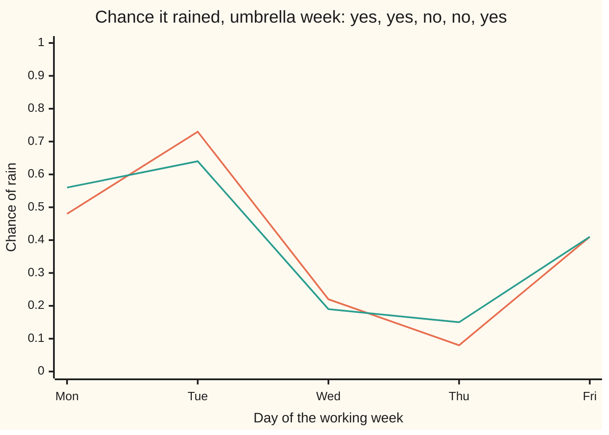
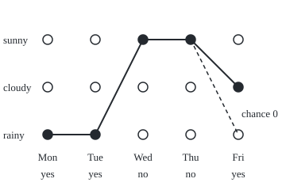

# Hidden Markov models: a chain you cannot see, observed through noise

Stochastic processes and calculus → Markov Chains → Reading a hidden chain → Hidden Markov models

---

## General Overview

An office has no windows. Each morning one worker notes a single fact: whether the first colleague through the door carries an umbrella. The weather outside is never seen. It is sunny, cloudy or rainy, and it has habits. A sunny day is followed by another sunny day 7 times in 10 and never straight by rain: rain arrives through a cloudy day. On a rainy day the colleague carries an umbrella 8 times in 10, on a cloudy day 4 in 10, on a sunny day 1 in 10.

One working week reads: umbrella, umbrella, none, none, umbrella. Three questions about it have exact answers. How likely was that umbrella week at all? About 1.40%. How likely was rain on each day, given the whole week? On Friday, about 41%. Which single week of weather explains the umbrellas best? Rainy, rainy, sunny, sunny, cloudy.

The weather is a Markov chain ([markov-chains](01-markov-chains.md)): tomorrow depends on today alone. It is not that card's town: this rule was chosen so that sun never turns straight to rain. Here the chain is hidden, and each day shows only a noisy signal of its state. A hidden chain read through such signals is a **hidden Markov model**, the term used from here on. Three short recursions answer the questions without listing all 243 possible weeks of weather. The **forward algorithm** adds up over the unseen past one day at a time, and a backward pass does the same over the days still to come. **Viterbi decoding** runs the forward sweep with "take the largest" in place of "add".

**A hidden Markov model is a Markov chain seen only through a noisy signal of each day's state; because the chain forgets everything but today, the chance of the signals and the most likely hidden path can both be built one day at a time from the day before.**

**What kind of fact this is:** a model: the weather is assumed to be a Markov chain and each umbrella to depend on that day's weather alone, which is an assumption, not a law. Inside the model, the forward and Viterbi recursions are methods, proved exact on this card in Why it works.

### The picture: the chance of rain, day by day



The first line is the chance of rain given the umbrellas up to that day: what could be said each evening. The second is the chance given the whole week: what can be said on Friday night, looking back. They agree on Friday and differ before it. Friday's umbrella raises Thursday's chance of rain in hindsight, from 0.08 to 0.15.

---

## The formula

Notation first, in words. Days are numbered $n = 1$ (Monday) to $N = 5$ (Friday). $X_n$ is the weather on day $n$: S, C or R, for sunny, cloudy, rainy. It is hidden. $Y_n$ is the signal on day $n$: 1 for an umbrella, 0 for none; $y_n$ is the value actually seen, here 1, 1, 0, 0, 1. The letters $i$ and $j$ stand for weathers.

The chain's habits are the transition matrix $P$ with entries $p_{ij}$: the chance that tomorrow is $j$ given today is $i$ ([markov-chains](01-markov-chains.md)). Two new ingredients join it. The **start law** $\nu_i$, read "nu", is the chance Monday is $i$, before any umbrella is seen. The **emission chance** $b_i(y)$ is the chance of signal $y$ on a day whose weather is $i$.

| Today | Tomorrow S | Tomorrow C | Tomorrow R | Chance Monday is this, $\nu_i$ | Umbrella chance, $b_i(1)$ |
| --- | --- | --- | --- | --- | --- |
| sunny, S | 0.7 | 0.3 | 0 | 0.5 | 0.1 |
| cloudy, C | 0.3 | 0.3 | 0.4 | 0.3 | 0.4 |
| rainy, R | 0.2 | 0.2 | 0.6 | 0.2 | 0.8 |

No umbrella has the other chance: $b_i(0) = 1 - b_i(1)$.

The model fixes the joint chance of any weather week $x_1, \dots, x_N$ together with any umbrella week:

$$\Pr(X_1 = x_1, \dots, X_N = x_N,\ Y_1 = y_1, \dots, Y_N = y_N) = \nu_{x_1}\, b_{x_1}(y_1) \prod_{n=2}^{N} p_{x_{n-1} x_n}\, b_{x_n}(y_n)$$

**Read it aloud:** the chance of Monday's weather, times Monday's signal given it, then for each later day the chance of moving to that day's weather, times the signal given it.

The forward algorithm builds, for each day and each weather, the chance of the signals so far with today's weather equal to $i$, written $\alpha_n(i)$ and read "alpha":

$$\alpha_1(i) = \nu_i\, b_i(y_1), \qquad \alpha_n(i) = \Big(\sum_{j} \alpha_{n-1}(j)\, p_{ji}\Big)\, b_i(y_n), \qquad L = \sum_{i} \alpha_N(i)$$

**Read it aloud:** to reach weather $i$ today with the signals so far, arrive from each weather $j$ yesterday, add up the ways, then multiply by the chance of today's signal; the chance of the whole signal week is the total over Friday's weathers.

Viterbi decoding keeps, for each day and weather, the chance of the signals so far together with the single best weather path ending there, $\delta_n(i)$ ("delta"), and which weather yesterday it came from, $\psi_n(i)$ ("psi"):

$$\delta_1(i) = \nu_i\, b_i(y_1), \qquad \delta_n(i) = \max_{j} \big(\delta_{n-1}(j)\, p_{ji}\big)\, b_i(y_n), \qquad \psi_n(i) = \text{the } j \text{ that gives that maximum}$$

**Read it aloud:** the best path into weather $i$ today is the best path into some weather yesterday, extended by one step; keep the best and remember where it came from.

The best week ends at the weather with the largest $\delta_N(i)$; the pointers $\psi_n(i)$ read off the rest, backwards.

A third recursion runs from Friday backwards. $\beta_n(i)$, read "beta", is the chance of the signals after day $n$, given weather $i$ on day $n$: $\beta_N(i) = 1$ and $\beta_n(i) = \sum_j p_{ij}\, b_j(y_{n+1})\, \beta_{n+1}(j)$. Then the chance of weather $i$ on day $n$, given the whole week, is $\alpha_n(i)\,\beta_n(i) / L$: the **smoothed** chance, the second line of the picture. The first line, $\alpha_n(i)$ divided by its total over $i$, is the **filtered** chance.

| Symbol | Plain meaning | In our example | Push it up and the answer… |
| --- | --- | --- | --- |
| $n$, $N$ | a day; the number of days seen | Monday is 1, Friday is $N = 5$ | more days, more to add over |
| $X_n$ | the hidden weather on day $n$ | S, C or R | — |
| $Y_n$, $y_n$, $y$ | the signal on day $n$; the value seen; any signal value | 1, 1, 0, 0, 1 | — |
| $i$, $j$ | weathers, used as labels | S, C, R | — |
| $P$, $p_{ij}$ | the transition matrix; the chance tomorrow is $j$ given today is $i$ | sunny to sunny 0.7, sunny to rainy 0 | larger stay-chances make the hidden path smoother |
| $\nu_i$ | the start law: the chance Monday is $i$ | 0.5, 0.3, 0.2 | Monday's reading leans towards $i$ |
| $b_i(y)$ | the emission chance: signal $y$ given weather $i$ | umbrella 0.1, 0.4, 0.8 | signals separate weathers more sharply |
| $\alpha_n(i)$ | forward: chance of signals up to day $n$ and weather $i$ that day | Monday rainy 0.16 | — |
| $\beta_n(i)$ | backward: chance of the signals after day $n$, given weather $i$ on day $n$ | 1 on Friday | — |
| $\delta_n(i)$ | Viterbi: chance of the signals up to day $n$ together with the best single path ending in $i$ that day | Tuesday rainy 0.0768 | — |
| $\psi_n(i)$ | the weather on day $n - 1$ that the best path into $i$ came from | into Friday cloudy: sunny | — |
| $L$ | the chance of the whole signal week | 0.0139810329 | — |

### When it holds

- **Tomorrow's weather depends on today's alone.** If a wet spell tends to last exactly three days, today alone does not settle tomorrow, and the recursions answer for a model that is not the weather. The standard repair enlarges the state, for example to "rainy for the second day".
- **Each signal depends on that day's weather alone.** A colleague who got soaked yesterday and carries an umbrella all week breaks this, and every chance on this card with it.
- **The numbers are known and fixed.** The recursions take the transition matrix, start law and emission chances as given, the same every day. Estimated from records, they carry error into every answer. Fitting them is the Baum-Welch method, named here, not taught.
- **Nothing else.** Given those three, the forward chance, the smoothed chances and the Viterbi week are exact: they equal the brute-force answer over all 243 weeks.

---

## Why it works

### Step 0: one product, added up or maximised, one day at a time

Every question here is about the product in the model. The chance of the umbrella week is that product added over all 243 weather weeks; the best weather week is the one with the largest product. Each factor involves only two neighbouring days, so the sum can be taken over Monday's weather first, then Tuesday's, each time needing only yesterday's partial answers. Multiplication spreads over addition, and over "take the largest" when nothing is negative: that is the whole algorithm.

### Step 1: why the joint chance is that product

The multiplication rule breaks the joint chance into pieces, each the chance of the next item given everything before it. The next weather needs only today's weather, $p_{x_{n-1} x_n}$: the Markov assumption. The next signal needs only its own day's weather, $b_{x_n}(y_n)$: the emission assumption. Multiply the pieces: the formula.

On our week, the weather week rainy, rainy, sunny, sunny, cloudy gives

$0.2 \times 0.8 \times (0.6 \times 0.8) \times (0.2 \times 0.9) \times (0.7 \times 0.9) \times (0.3 \times 0.4) = 0.0010450944.$

### Step 2: the forward algorithm adds over yesterday

The chance of umbrellas on Monday and Tuesday with Tuesday rainy is a sum over Monday's weather. Monday's three values $\alpha_1(i)$ are 0.5 × 0.1 = 0.05 for sunny, 0.3 × 0.4 = 0.12 for cloudy, 0.2 × 0.8 = 0.16 for rainy. Each is multiplied by its chance of moving to rain, the three are added, and the sum is multiplied by the chance of Tuesday's umbrella:

$(0.05 \times 0 + 0.12 \times 0.4 + 0.16 \times 0.6) \times 0.8 = 0.144 \times 0.8 = 0.1152.$

That is $\alpha_2(\text{R})$. Wednesday's values need only Tuesday's three, never Monday's: the whole past is folded into three numbers. Friday's three numbers sum to $L$ = 0.0139810329, the chance of the umbrella week, about 1.40%.

Divide each day's three forward values by their total and Bayes' rule appears ([bayes-rule](../../09-Probability%20and%20statistics/01-Chance%20and%20Events/06-bayes-rule.md)). The forward step is a prediction, "yesterday's belief moved by the chain", followed by an update, "multiplied by the chance of today's signal and rescaled". On Monday the prior 0.5, 0.3, 0.2 meets an umbrella and becomes 0.1515, 0.3636, 0.4848.

### Step 3: backwards, for the whole week

The filtered chance on Monday uses Monday's umbrella only. Tuesday's umbrella is evidence about Monday too, since rain tends to persist. The backward values carry the future to each day, and $\alpha_n(i)\,\beta_n(i)$ is the sum of the products of all weeks that have weather $i$ on day $n$: the past half times the future half. Dividing by $L$ gives the smoothed chance. Monday's chance of rain rises from 0.48 to 0.56 in hindsight.

### Step 4: Viterbi takes the largest instead of the sum

Replace "add over yesterday's weather" by "keep the best of yesterday's weather" and the same sweep finds the best single week. On Tuesday, the best way into rain comes from a rainy Monday: 0.16 × 0.6 = 0.096 beats 0.12 × 0.4 = 0.048, so $\delta_2(\text{R}) = 0.096 \times 0.8 = 0.0768$, with $\psi_2(\text{R})$ = rainy.

Why is keeping only the best enough? Take the best week ending in weather $i$ on day $n$. Its first $n - 1$ days end in some weather $j$. If a better path into $j$ existed, swapping it in would multiply the same remaining factors by a larger number, giving a better path into $i$. So the best path into $i$ is always a best path into some $j$, extended one step, and nothing else needs remembering.

### The picture: five days, three weathers, two readings

<p align="center"></p>

Days run left to right, one per 60 units; the bottom row is the umbrella seen. The solid line and filled dots are the Viterbi week. The dashed branch is where the best weather taken one day at a time goes instead: from a sunny Thursday straight to a rainy Friday, a step of chance 0.

### Step 5: why the recursion is needed, and what it costs

Listing every week costs $3^N$ products. The forward sweep costs 9 multiply-adds a day, one per pairing of yesterday's weather with today's. For 2000 days, $3^{2000}$ is about $10^{954}$; the sweep needs 18000 steps.

Long runs raise a second problem. The chance of 2000 days of signals is about $10^{-549}$, far below the smallest number a standard double-precision float can hold: about $10^{-308}$, or $10^{-324}$ counting the tiny, less precise subnormal numbers. So plain multiplication returns exactly 0. Two repairs work. Rescale each day's forward values to sum to 1 and add the logarithms of the scale factors: the sum is the logarithm of $L$. Or run the recursion on logarithms, where products become sums. The forward step also adds chances: to add two chances known only by their logarithms, factor out the larger, so the log of the sum is the larger log plus log(1 + e^(smaller log − larger log)), and nothing underflows. Viterbi's "largest" survives, since the logarithm keeps order.

<details>
<summary>Detailed proof</summary>

**Setting.** Finitely many weathers; a chain $X_1, X_2, \dots$ with start law $\nu_i$ and transition matrix $P$; signals $Y_1, Y_2, \dots$ taking finitely many values. Assumption M: given the whole past of weather and signals, tomorrow is $j$ with chance $p_{ij}$ when today is $i$. Assumption E: given all weather to date and all earlier signals, today's signal is $y$ with chance $b_i(y)$ when today is $i$. Write $y_{1:n}$ for $y_1, \dots, y_n$.

**Forward.** Let $\alpha_n(i)$ be the chance that $Y_{1:n} = y_{1:n}$ and $X_n = i$. At $n = 1$ the product gives $\nu_i\, b_i(y_1)$. For $n \ge 2$, the law of total probability over yesterday's weather $j$ writes $\alpha_n(i)$ as a sum over $j$ of $\alpha_{n-1}(j)$ times the chance of moving from $j$ to $i$ given the past, times the chance of today's signal given the past. By M and E those are the transition chance from $j$ to $i$ and $b_i(y_n)$. Induction on $n$ finishes it; summing $\alpha_N(i)$ over $i$ gives $L$.

**Backward and smoothing.** Let $\beta_n(i)$ be the chance that $Y_{n+1:N} = y_{n+1:N}$ given $X_n = i$, with $\beta_N(i) = 1$; total probability over tomorrow's weather gives its recursion. The product splits at day $n$ into a factor for the days up to $n$ and a factor for the later days, sharing only day $n$'s weather. Summed over all paths with weather $i$ on day $n$, it gives $\alpha_n(i)\,\beta_n(i)$; dividing by $L$ is Bayes' rule.

**Viterbi.** Let $\delta_n(i)$ be the largest product, cut off at day $n$, over paths with weather $i$ on day $n$. Group those paths by their day $n - 1$ weather $j$. Within a group every product carries the same last factor, moving from $j$ to $i$ and emitting $y_n$, which is at least 0; multiplying by it keeps the group's largest member largest. So $\delta_n(i)$ is the best over $j$ of $\delta_{n-1}(j)$ times that factor, and the traceback follows these choices back from the best final weather. With ties it finds one of the best paths; the code breaks ties towards the first weather listed.

**Rescaling.** Divide each day's forward values by their total, the day's scale factor, before the next step. By induction the rescaled values are the true ones divided by the product of the scale factors so far. On the last day they sum to 1, so $L$ is the product of all $N$ scale factors and $\log L$ is the sum of their logarithms. Each scale factor is the chance of that day's signal given the earlier ones, between 0 and 1, and does not underflow.

</details>

A second road to every answer is brute force: list the 243 weeks, compute each product exactly, add them, pick the largest. The code does it, down to the best path into each weather on each day, and the recursions agree with it to rounding error.

---

## Worked numbers, by hand

| Step | Arithmetic | Value |
| --- | --- | --- |
| Monday forward, S, C, R | 0.5 × 0.1, 0.3 × 0.4, 0.2 × 0.8 | 0.05, 0.12, 0.16 |
| Monday filtered, rain | 0.16 / (0.05 + 0.12 + 0.16) | 0.4848 |
| Tuesday forward, rain | (0.05 × 0 + 0.12 × 0.4 + 0.16 × 0.6) × 0.8 | 0.1152 |
| Tuesday forward, S and C | the same step, into sun and into cloud | 0.0103, 0.0332 |
| Friday forward, S, C, R | the same step three more times | 0.0026587221, 0.0055769604, 0.0057453504 |
| chance of the umbrella week | their sum, $L$ | **0.0139810329** |
| Tuesday Viterbi, rain | max(0, 0.048, 0.096) × 0.8, from rain | 0.0768 |
| Friday Viterbi, S, C, R | the same step three more times | 0.0006096384, 0.0010450944, 0.0007962624 |
| best week | largest is cloudy; trace back | **R R S S C** |
| its chance given the umbrellas | 0.0010450944 / 0.0139810329 | **0.0748** |
| Friday smoothed, S, C, R | forward × backward / $L$ | 0.1902, 0.3989, 0.4109 |

The umbrella week turns up in about 1.40% of weeks. Given it, the best single guess at the weather is right as a whole only about 7.5% of the time: 144 of the 243 weather weeks can produce these umbrellas.

### What breaks if you drop a piece

| Mistake | Comes out at | What went wrong |
| --- | --- | --- |
| Take each day's most likely weather and string them together | R R S S R, a week of chance exactly 0 | A sunny Thursday cannot turn straight to rain; each day's best ignores its neighbours' choices |
| Treat the days as independent, each drawn from Monday's mix | 0.33^3 × 0.67^2 = 0.0161, not 0.0140 | The chain's persistence is thrown away |
| Multiply the forward values plainly over 2000 days | 0.0 | The true chance, about $10^{-549}$, underflows; rescale or use logarithms |

The code prints all three.

---

## Code, from first principles, and it actually runs

Nothing is imported except the logarithm, the exponential, the square root and infinity. The answers are reached by three roads. Road 1 runs the forward, backward and Viterbi recursions in ordinary floating-point numbers. Road 2 lists all 243 weather weeks and computes each product exactly in whole numbers: every chance in the model is a whole number of tenths, so each product is a whole number of units of $10^{-10}$. Road 3 simulates 300000 weeks of weather and umbrellas with SplitMix64, a short random-number generator written out in both languages, seed 2026; among the weeks that happen to show this umbrella pattern, it counts how often the weather was the Viterbi week and how often Friday was rainy, each with its standard error. Then 2000 simulated days test plain products against rescaling and a log-space sweep, and count the days each decoding gets right. That run is one sample, and its standard errors treat the days as independent, which they are not quite.

### Python

```python
# Hidden Markov models -- the check behind the card.  Standard library only.
# Hidden: the weather, a Markov chain on sunny, cloudy, rainy.  Seen: whether
# the first colleague through the office door carries an umbrella.  The week
# seen is umbrella, umbrella, none, none, umbrella.  Three roads: the forward
# and Viterbi recursions in floats; all 243 weather weeks enumerated in exact
# integers (every probability is a whole number of tenths); and 300000 weeks
# simulated with SplitMix64, seed 2026.  Then 2000 simulated days, where plain
# products underflow and logarithms or rescaling take over.
from math import log, exp, sqrt, inf
P = [[7, 3, 0], [3, 3, 4], [2, 2, 6]]    # tenths: row = today, column = tomorrow
NU = [5, 3, 2]                           # tenths: Monday's weather, before any umbrella
B = [1, 4, 8]                            # tenths: chance of an umbrella in each weather
OBS, K, NAME = [1, 1, 0, 0, 1], 3, "SCR"
WEEKS, LONG = 300000, 2000
p, nu = [[x / 10 for x in r] for r in P], [x / 10 for x in NU]
def b(i, y): return (B[i] if y else 10 - B[i]) / 10
def word(path): return "".join(NAME[i] for i in path)
def lg(x): return log(x) if x > 0 else -inf

# ---- road 1: the recursions ----
def forward(obs):                        # alpha_n(i) = P(y_1..y_n, X_n = i)
    a = [[nu[i] * b(i, obs[0]) for i in range(K)]]
    for y in obs[1:]:
        a.append([sum(a[-1][j] * p[j][i] for j in range(K)) * b(i, y) for i in range(K)])
    return a
def backward(obs):                       # beta_n(i) = P(y_n+1..y_N | X_n = i)
    be = [[1.0] * K]
    for y in reversed(obs[1:]):
        be.insert(0, [sum(p[i][j] * b(j, y) * be[0][j] for j in range(K)) for i in range(K)])
    return be
def viterbi(obs, f, op):                 # f, op = identity, times; or log, plus
    d, back = [[op(f(nu[i]), f(b(i, obs[0]))) for i in range(K)]], []
    for y in obs[1:]:
        row, arg = [], []
        for i in range(K):
            j = max(range(K), key=lambda j: (op(d[-1][j], f(p[j][i])), -j))
            arg.append(j); row.append(op(op(d[-1][j], f(p[j][i])), f(b(i, y))))
        d.append(row); back.append(arg)
    path = [max(range(K), key=lambda i: (d[-1][i], -i))]
    for arg in reversed(back): path.insert(0, arg[path[0]])
    return d, back, path
alpha, beta = forward(OBS), backward(OBS)
like = sum(alpha[-1])
post = [[alpha[n][i] * beta[n][i] / like for i in range(K)] for n in range(5)]
filt = [[x / sum(r) for x in r] for r in alpha]
delta, back, vpath = viterbi(OBS, lambda x: x, lambda u, v: u * v)
daywise = [max(range(K), key=lambda i: (post[n][i], -i)) for n in range(5)]

# ---- road 2: every weather week, exact integers in units of 10^-10 ----
def weight(path, obs):
    w = NU[path[0]] * (B[path[0]] if obs[0] else 10 - B[path[0]])
    for n in range(1, len(obs)):
        w *= P[path[n - 1]][path[n]] * (B[path[n]] if obs[n] else 10 - B[path[n]])
    return w
weeks = [[(c // 3 ** (4 - n)) % 3 for n in range(5)] for c in range(3 ** 5)]
ws = [weight(w, OBS) for w in weeks]
total = sum(ws)
best = max(range(len(weeks)), key=lambda c: (ws[c], -c))
epost = [[sum(ws[c] for c in range(len(weeks)) if weeks[c][n] == i) for i in range(K)] for n in range(5)]
vok = sum(abs(max(weight(w[:n + 1], OBS[:n + 1]) for w in weeks if w[n] == i) / 10 ** (2 * n + 2) - delta[n][i]) < 1e-15 for n in range(5) for i in range(K))

# ---- road 3: simulation ----
state = 2026
def draw():                              # SplitMix64, written out
    global state
    state = (state + 0x9E3779B97F4A7C15) & (2 ** 64 - 1)
    z = state
    z = ((z ^ (z >> 30)) * 0xBF58476D1CE4E5B9) & (2 ** 64 - 1)
    z = ((z ^ (z >> 27)) * 0x94D049BB133111EB) & (2 ** 64 - 1)
    return z ^ (z >> 31)
def tenth(): return ((draw() >> 32) * 10) >> 32          # a whole number 0 to 9, each 1 in 10
def pick(row):
    u = tenth()
    for i in range(K):
        if u < row[i]: return i
        u -= row[i]
def run(days):
    x, xs, ys = pick(NU), [], []
    for n in range(days):
        if n: x = pick(P[x])
        xs.append(x); ys.append(1 if tenth() < B[x] else 0)
    return xs, ys
hits = vhits = rain_fri = 0
for _ in range(WEEKS):
    xs, ys = run(5)
    if ys == OBS:
        hits += 1; vhits += xs == vpath; rain_fri += xs[4] == 2
q, qv, qr = hits / WEEKS, vhits / hits, rain_fri / hits
se = lambda f, m: sqrt(f * (1 - f) / m)

# ---- 2000 days: underflow, rescaling, logarithms ----
xs, ys = run(LONG)
plain = sum(forward(ys)[-1])
a, loglik, scaled = [nu[i] * b(i, ys[0]) for i in range(K)], 0.0, []
for n in range(LONG):
    if n: a = [sum(a[j] * p[j][i] for j in range(K)) * b(i, ys[n]) for i in range(K)]
    c = sum(a); loglik += log(c); a = [x / c for x in a]; scaled.append((a, c))
la = [lg(nu[i]) + lg(b(i, ys[0])) for i in range(K)]
for y in ys[1:]:
    la = [lg(b(i, y)) + max(la) + log(sum(exp(la[j] + lg(p[j][i]) - max(la)) for j in range(K))) for i in range(K)]
logroad = max(la) + log(sum(exp(v - max(la)) for v in la))
bh, dayw, sok = [1.0] * K, [0] * LONG, 0
for n in range(LONG - 1, -1, -1):
    g = [scaled[n][0][i] * bh[i] for i in range(K)]; sok += abs(sum(g) - 1) < 1e-9
    dayw[n] = max(range(K), key=lambda i: (g[i], -i))
    bh = [sum(p[i][j] * b(j, ys[n]) * bh[j] for j in range(K)) / scaled[n][1] for i in range(K)]
_, _, lpath = viterbi(ys, lg, lambda u, v: u + v)
acc_v = sum(lpath[n] == xs[n] for n in range(LONG)) / LONG
acc_d = sum(dayw[n] == xs[n] for n in range(LONG)) / LONG
f4, f10 = lambda v: f"{v:.4f}", lambda v: f"{v:.10f}"; m1 = sum(nu[i] * b(i, 1) for i in range(K))   # umbrella chance from Monday's mix
print(f"model: P = {P} tenths; start {NU} tenths; umbrella chance {B} tenths; week seen {OBS}")
print("road 1, forward alpha_n(S, C, R), then filter P(X_n = . | umbrellas to day n):")
for n in range(5): print(f"  day {n + 1}  {' '.join(f10(v) for v in alpha[n])}   {' '.join(f4(v) for v in filt[n])}")
print(f"road 1, chance of this umbrella week, sum of alpha_5: {f10(like)}")
print("road 1, Viterbi delta_n(S, C, R) and best previous weather:")
for n in range(5): print(f"  day {n + 1}  {' '.join(f10(v) for v in delta[n])}   {word(back[n - 1]) if n else '---'}")
print(f"road 1, Viterbi week {word(vpath)}, joint chance {f10(max(delta[4]))}, given the umbrellas {f4(max(delta[4]) / like)}")
print("road 1, smoothed P(X_n = S, C, R | whole week), forward times backward:")
for n in range(5): print(f"  day {n + 1}  {' '.join(f4(v) for v in post[n])}")
print(f"road 2, {len(weeks)} weeks, {sum(w > 0 for w in ws)} possible; exact chance {total} / 10^10")
print(f"road 2, most likely week {word(weeks[best])}, weight {ws[best]} / 10^10; runner-up weight {sorted(ws)[-2]}")
print(f"road 2, largest gap to road 1's smoothed table: {max(abs(epost[n][i] / total - post[n][i]) for n in range(5) for i in range(K)):.1e}; Viterbi table entries equal to the best enumerated path: {vok} of 15")
print(f"road 3, {WEEKS} weeks, seed 2026: {hits} showed this umbrella week")
print(f"  chance of the week   {q:.5f}  se {se(q, WEEKS):.5f}  (exact {like:.5f})")
print(f"  week was {word(vpath)}      {qv:.4f}  se {se(qv, hits):.4f}  (exact {max(delta[4]) / like:.4f})")
print(f"  Friday was rainy     {qr:.4f}  se {se(qr, hits):.4f}  (exact {post[4][2]:.4f})")
print(f"what breaks, best weather day by day: {word(daywise)}, exact weight {weight(daywise, OBS)}")
print(f"what breaks, days treated as independent: {m1:.2f}^3 x {1 - m1:.2f}^2 = {m1 ** 3 * (1 - m1) ** 2:.4f}, not {like:.4f}")
print(f"what breaks, {LONG} days, plain forward products: {plain}")
print(f"  log-likelihood, rescaled forward {loglik:.6f}; log-space forward {logroad:.6f}; rescaled forward x backward sums to 1 on {sok} of {LONG} days")
print(f"  about 10^{loglik / log(10):.1f}; paths 3^{LONG} = 10^{LONG * log(3) / log(10):.1f}; forward steps {LONG * K * K}")
print(f"  days right: Viterbi week {acc_v:.4f}  se {se(acc_v, LONG):.4f}; day by day {acc_d:.4f}  se {se(acc_d, LONG):.4f}")
print(f"figure, trellis x = 60 + 60(n-1), y = 50 (S), 110 (C), 170 (R); Viterbi {[(60 + 60 * n, 50 + 60 * s) for n, s in enumerate(vpath)]}; day by day {[(60 + 60 * n, 50 + 60 * s) for n, s in enumerate(daywise)]}")
print(f"figure, rain filtered {', '.join(f'{r[2]:.2f}' for r in filt)}; rain smoothed {', '.join(f'{r[2]:.2f}' for r in post)}")
assert abs(like - total / 10 ** 10) < 1e-15                     # forward against enumeration
assert vpath == weeks[best] and vok == 15                      # Viterbi table against enumeration
assert max(abs(epost[n][i] / total - post[n][i]) for n in range(5) for i in range(K)) < 1e-12
assert abs(q - total / 10 ** 10) < 4 * se(q, WEEKS) and abs(qv - ws[best] / total) < 4 * se(qv, hits)
assert weight(daywise, OBS) == 0 and plain == 0.0 and abs(loglik - logroad) < 1e-8 and sok == LONG
print("ALL CHECKS PASS")
```

**Ran 2026-10-07 on macOS, Python 3.14.6, standard library only. All checks passed. Output, pasted from the run:**

```
model: P = [[7, 3, 0], [3, 3, 4], [2, 2, 6]] tenths; start [5, 3, 2] tenths; umbrella chance [1, 4, 8] tenths; week seen [1, 1, 0, 0, 1]
road 1, forward alpha_n(S, C, R), then filter P(X_n = . | umbrellas to day n):
  day 1  0.0500000000 0.1200000000 0.1600000000   0.1515 0.3636 0.4848
  day 2  0.0103000000 0.0332000000 0.1152000000   0.0649 0.2092 0.7259
  day 3  0.0361890000 0.0216540000 0.0164800000   0.4869 0.2913 0.2217
  day 4  0.0316120500 0.0123893400 0.0037099200   0.6626 0.2597 0.0778
  day 5  0.0026587221 0.0055769604 0.0057453504   0.1902 0.3989 0.4109
road 1, chance of this umbrella week, sum of alpha_5: 0.0139810329
road 1, Viterbi delta_n(S, C, R) and best previous weather:
  day 1  0.0500000000 0.1200000000 0.1600000000   ---
  day 2  0.0036000000 0.0144000000 0.0768000000   CCR
  day 3  0.0138240000 0.0092160000 0.0092160000   RRR
  day 4  0.0087091200 0.0024883200 0.0011059200   SSR
  day 5  0.0006096384 0.0010450944 0.0007962624   SSC
road 1, Viterbi week RRSSC, joint chance 0.0010450944, given the umbrellas 0.0748
road 1, smoothed P(X_n = S, C, R | whole week), forward times backward:
  day 1  0.0837 0.3593 0.5570
  day 2  0.1190 0.2393 0.6417
  day 3  0.5288 0.2823 0.1888
  day 4  0.4296 0.4165 0.1539
  day 5  0.1902 0.3989 0.4109
road 2, 243 weeks, 144 possible; exact chance 139810329 / 10^10
road 2, most likely week RRSSC, weight 10450944 / 10^10; runner-up weight 7962624
road 2, largest gap to road 1's smoothed table: 1.1e-16; Viterbi table entries equal to the best enumerated path: 15 of 15
road 3, 300000 weeks, seed 2026: 4068 showed this umbrella week
  chance of the week   0.01356  se 0.00021  (exact 0.01398)
  week was RRSSC      0.0792  se 0.0042  (exact 0.0748)
  Friday was rainy     0.4120  se 0.0077  (exact 0.4109)
what breaks, best weather day by day: RRSSR, exact weight 0
what breaks, days treated as independent: 0.33^3 x 0.67^2 = 0.0161, not 0.0140
what breaks, 2000 days, plain forward products: 0.0
  log-likelihood, rescaled forward -1264.335849; log-space forward -1264.335849; rescaled forward x backward sums to 1 on 2000 of 2000 days
  about 10^-549.1; paths 3^2000 = 10^954.2; forward steps 18000
  days right: Viterbi week 0.6300  se 0.0108; day by day 0.6475  se 0.0107
figure, trellis x = 60 + 60(n-1), y = 50 (S), 110 (C), 170 (R); Viterbi [(60, 170), (120, 170), (180, 50), (240, 50), (300, 110)]; day by day [(60, 170), (120, 170), (180, 50), (240, 50), (300, 170)]
figure, rain filtered 0.48, 0.73, 0.22, 0.08, 0.41; rain smoothed 0.56, 0.64, 0.19, 0.15, 0.41
ALL CHECKS PASS
```

### Rust

Same numbers, same labels, built with `rustc --edition 2021 -O`.

```rust
// Hidden Markov models -- the same check as the Python, in Rust.  No crates.
// Same model, same week, same three roads (recursions in floats, all 243 weeks
// in exact integers, 300000 simulated weeks from SplitMix64, seed 2026), then
// the same 2000 simulated days.
const P: [[u64; 3]; 3] = [[7, 3, 0], [3, 3, 4], [2, 2, 6]]; // tenths: row = today
const NU: [u64; 3] = [5, 3, 2]; // tenths: Monday's weather, before any umbrella
const B: [u64; 3] = [1, 4, 8]; // tenths: chance of an umbrella in each weather
const OBS: [u64; 5] = [1, 1, 0, 0, 1];
const K: usize = 3; const WEEKS: usize = 300000; const LONG: usize = 2000; type Row = [f64; 3];
fn p(j: usize, i: usize) -> f64 { P[j][i] as f64 / 10.0 } fn nu(i: usize) -> f64 { NU[i] as f64 / 10.0 }
fn e(i: usize, y: u64) -> u64 { if y == 1 { B[i] } else { 10 - B[i] } }
fn b(i: usize, y: u64) -> f64 { e(i, y) as f64 / 10.0 }
fn word(path: &[usize]) -> String { path.iter().map(|&i| ['S', 'C', 'R'][i]).collect() }
fn lg(x: f64) -> f64 { if x > 0.0 { x.ln() } else { f64::NEG_INFINITY } }
fn argmax(v: &[f64]) -> usize { let mut k = 0; for i in 1..v.len() { if v[i] > v[k] { k = i } } k }
fn sum(v: &Row) -> f64 { v.iter().sum() }
fn se(f: f64, m: usize) -> f64 { (f * (1.0 - f) / m as f64).sqrt() }
fn row(v: &Row, d: usize) -> String { v.iter().map(|x| format!("{:.*}", d, x)).collect::<Vec<_>>().join(" ") }
// ---- road 1: the recursions ----
fn forward(obs: &[u64]) -> Vec<Row> {             // alpha_n(i) = P(y_1..y_n, X_n = i)
    let mut a = vec![ [0.0; 3]];
    for i in 0..K { a[0][i] = nu(i) * b(i, obs[0]) }
    for &y in &obs[1..] {
        let (l, mut r) = (*a.last().unwrap(), [0.0; 3]);
        for i in 0..K { r[i] = (0..K).map(|j| l[j] * p(j, i)).sum::<f64>() * b(i, y) } a.push(r);
    }
    a
}
fn backward(obs: &[u64]) -> Vec<Row> {            // beta_n(i) = P(y_n+1..y_N | X_n = i)
    let mut be = vec![ [1.0; 3]];
    for &y in obs[1..].iter().rev() {
        let (nx, mut r) = (be[0], [0.0; 3]);
        for i in 0..K { r[i] = (0..K).map(|j| p(i, j) * b(j, y) * nx[j]).sum() } be.insert(0, r);
    }
    be
}
fn viterbi(obs: &[u64], f: fn(f64) -> f64, op: fn(f64, f64) -> f64) -> (Vec<Row>, Vec<[usize; 3]>, Vec<usize>) {
    let (mut d, mut back) = (vec![ [0.0; 3]], vec![]);
    for i in 0..K { d[0][i] = op(f(nu(i)), f(b(i, obs[0]))) }
    for &y in &obs[1..] {
        let l = *d.last().unwrap();
        let (mut r, mut arg) = ([0.0; 3], [0usize; 3]);
        for i in 0..K {
            let c: Vec<f64> = (0..K).map(|j| op(l[j], f(p(j, i)))).collect();
            arg[i] = argmax(&c);
            r[i] = op(c[arg[i]], f(b(i, y)));
        }
        d.push(r); back.push(arg);
    }
    let mut path = vec![argmax(d.last().unwrap())];
    for arg in back.iter().rev() { path.insert(0, arg[path[0]]) }
    (d, back, path)
}
// ---- road 3: simulation ----
struct Gen(u64);
impl Gen {
    fn draw(&mut self) -> u64 {                   // SplitMix64, written out
        self.0 = self.0.wrapping_add(0x9E3779B97F4A7C15);
        let mut z = self.0;
        z = (z ^ (z >> 30)).wrapping_mul(0xBF58476D1CE4E5B9);
        z = (z ^ (z >> 27)).wrapping_mul(0x94D049BB133111EB);
        z ^ (z >> 31)
    }
    fn tenth(&mut self) -> u64 { ((self.draw() >> 32) * 10) >> 32 }   // 0 to 9, each 1 in 10
    fn pick(&mut self, w: &[u64; 3]) -> usize {
        let mut u = self.tenth();
        for i in 0..K { if u < w[i] { return i } u -= w[i] }
        K - 1
    }
    fn run(&mut self, days: usize) -> (Vec<usize>, Vec<u64>) {
        let (mut x, mut xs, mut ys) = (self.pick(&NU), vec![], vec![]);
        for n in 0..days {
            if n > 0 { x = self.pick(&P[x]) }
            xs.push(x); ys.push(if self.tenth() < B[x] { 1 } else { 0 });
        }
        (xs, ys)
    }
}

fn main() {
    let (alpha, beta) = (forward(&OBS), backward(&OBS));
    let like = sum(&alpha[4]);
    let post: Vec<Row> = (0..5).map(|n| { let mut r = [0.0; 3]; for i in 0..K { r[i] = alpha[n][i] * beta[n][i] / like } r }).collect();
    let filt: Vec<Row> = alpha.iter().map(|r| { let s = sum(r); [r[0] / s, r[1] / s, r[2] / s] }).collect();
    let (delta, back, vpath) = viterbi(&OBS, |x| x, |u, v| u * v);
    let daywise: Vec<usize> = post.iter().map(|r| argmax(r)).collect();
    // ---- road 2: every weather week, exact integers in units of 10^-10 ----
    let weight = |path: &[usize], obs: &[u64]| -> u64 {
        let mut w = NU[path[0]] * e(path[0], obs[0]);
        for n in 1..obs.len() { w *= P[path[n - 1]][path[n]] * e(path[n], obs[n]) }
        w
    };
    let weeks: Vec<Vec<usize>> = (0..243usize).map(|c| (0..5).map(|n| (c / 3usize.pow(4 - n as u32)) % 3).collect()).collect();
    let ws: Vec<u64> = weeks.iter().map(|w| weight(w, &OBS)).collect();
    let total: u64 = ws.iter().sum();
    let mut best = 0; for c in 1..ws.len() { if ws[c] > ws[best] { best = c } }
    let mut sorted = ws.clone(); sorted.sort();
    let (mut gap, mut vok) = (0.0f64, 0usize);
    for n in 0..5 { for i in 0..K {
        let s: u64 = (0..weeks.len()).filter(|&c| weeks[c][n] == i).map(|c| ws[c]).sum();
        gap = gap.max((s as f64 / total as f64 - post[n][i]).abs());
        let m = weeks.iter().filter(|w| w[n] == i).map(|w| weight(&w[..n + 1], &OBS[..n + 1])).max().unwrap();
        if (m as f64 / 10f64.powi(2 * n as i32 + 2) - delta[n][i]).abs() < 1e-15 { vok += 1 }
    } }
    let mut g = Gen(2026);
    let (mut hits, mut vhits, mut rain_fri) = (0usize, 0usize, 0usize);
    for _ in 0..WEEKS {
        let (xs, ys) = g.run(5); if ys == OBS { hits += 1; vhits += (xs == vpath) as usize; rain_fri += (xs[4] == 2) as usize }
    }
    let (q, qv, qr) = (hits as f64 / WEEKS as f64, vhits as f64 / hits as f64, rain_fri as f64 / hits as f64);
    // ---- 2000 days: underflow, rescaling, logarithms ----
    let (xs, ys) = g.run(LONG);
    let plain = sum(forward(&ys).last().unwrap());
    let mut a = [0.0; 3]; for i in 0..K { a[i] = nu(i) * b(i, ys[0]) }
    let (mut loglik, mut scaled) = (0.0f64, vec![]);
    for n in 0..LONG {
        if n > 0 { let l = a; for i in 0..K { a[i] = (0..K).map(|j| l[j] * p(j, i)).sum::<f64>() * b(i, ys[n]) } }
        let c = sum(&a); loglik += c.ln(); for i in 0..K { a[i] /= c } scaled.push((a, c));
    }
    let mut la = [0.0; 3]; for i in 0..K { la[i] = lg(nu(i)) + lg(b(i, ys[0])) }
    let mx = |v: &Row| v.iter().cloned().fold(f64::NEG_INFINITY, f64::max);
    for &y in &ys[1..] {
        let (l, m) = (la, mx(&la));
        for i in 0..K { la[i] = lg(b(i, y)) + m + (0..K).map(|j| (l[j] + lg(p(j, i)) - m).exp()).sum::<f64>().ln() }
    }
    let logroad = mx(&la) + la.iter().map(|v| (v - mx(&la)).exp()).sum::<f64>().ln();
    let (mut bh, mut dayw, mut sok) = ([1.0f64; 3], vec![0usize; LONG], 0usize);
    for n in (0..LONG).rev() {
        let gg: Vec<f64> = (0..K).map(|i| scaled[n].0[i] * bh[i]).collect();
        dayw[n] = argmax(&gg); if (gg.iter().sum::<f64>() - 1.0).abs() < 1e-9 { sok += 1 }
        let l = bh;
        for i in 0..K { bh[i] = (0..K).map(|j| p(i, j) * b(j, ys[n]) * l[j]).sum::<f64>() / scaled[n].1 }
    }
    let (_, _, lpath) = viterbi(&ys, lg, |u, v| u + v);
    let acc_v = (0..LONG).filter(|&n| lpath[n] == xs[n]).count() as f64 / LONG as f64;
    let acc_d = (0..LONG).filter(|&n| dayw[n] == xs[n]).count() as f64 / LONG as f64;
    let pts = |path: &[usize]| path.iter().enumerate().map(|(n, &s)| format!("({}, {})", 60 + 60 * n, 50 + 60 * s)).collect::<Vec<_>>().join(", ");
    println!("model: P = {:?} tenths; start {:?} tenths; umbrella chance {:?} tenths; week seen {:?}", P, NU, B, OBS);
    println!("road 1, forward alpha_n(S, C, R), then filter P(X_n = . | umbrellas to day n):");
    for n in 0..5 { println!("  day {}  {}   {}", n + 1, row(&alpha[n], 10), row(&filt[n], 4)) }
    println!("road 1, chance of this umbrella week, sum of alpha_5: {:.10}", like);
    println!("road 1, Viterbi delta_n(S, C, R) and best previous weather:");
    for n in 0..5 { println!("  day {}  {}   {}", n + 1, row(&delta[n], 10), if n > 0 { word(&back[n - 1]) } else { "---".to_string() }) }
    let top = mx(&delta[4]); let m1: f64 = (0..K).map(|i| nu(i) * b(i, 1)).sum(); // m1: umbrella chance from Monday's mix
    println!("road 1, Viterbi week {}, joint chance {:.10}, given the umbrellas {:.4}", word(&vpath), top, top / like);
    println!("road 1, smoothed P(X_n = S, C, R | whole week), forward times backward:");
    for n in 0..5 { println!("  day {}  {}", n + 1, row(&post[n], 4)) }
    println!("road 2, {} weeks, {} possible; exact chance {} / 10^10", weeks.len(), ws.iter().filter(|&&w| w > 0).count(), total);
    println!("road 2, most likely week {}, weight {} / 10^10; runner-up weight {}", word(&weeks[best]), ws[best], sorted[sorted.len() - 2]);
    println!("road 2, largest gap to road 1's smoothed table: {:.1e}; Viterbi table entries equal to the best enumerated path: {} of 15", gap, vok);
    println!("road 3, {} weeks, seed 2026: {} showed this umbrella week", WEEKS, hits);
    println!("  chance of the week   {:.5}  se {:.5}  (exact {:.5})", q, se(q, WEEKS), like);
    println!("  week was {}      {:.4}  se {:.4}  (exact {:.4})", word(&vpath), qv, se(qv, hits), top / like);
    println!("  Friday was rainy     {:.4}  se {:.4}  (exact {:.4})", qr, se(qr, hits), post[4][2]);
    println!("what breaks, best weather day by day: {}, exact weight {}", word(&daywise), weight(&daywise, &OBS));
    println!("what breaks, days treated as independent: {:.2}^3 x {:.2}^2 = {:.4}, not {:.4}", m1, 1.0 - m1, m1.powi(3) * (1.0 - m1).powi(2), like);
    println!("what breaks, {} days, plain forward products: {:?}", LONG, plain);
    println!("  log-likelihood, rescaled forward {:.6}; log-space forward {:.6}; rescaled forward x backward sums to 1 on {} of {} days", loglik, logroad, sok, LONG);
    println!("  about 10^{:.1}; paths 3^{} = 10^{:.1}; forward steps {}", loglik / 10f64.ln(), LONG, LONG as f64 * 3f64.ln() / 10f64.ln(), LONG * K * K);
    println!("  days right: Viterbi week {:.4}  se {:.4}; day by day {:.4}  se {:.4}", acc_v, se(acc_v, LONG), acc_d, se(acc_d, LONG));
    println!("figure, trellis x = 60 + 60(n-1), y = 50 (S), 110 (C), 170 (R); Viterbi [{}]; day by day [{}]", pts(&vpath), pts(&daywise));
    let rain = |t: &Vec<Row>| t.iter().map(|r| format!("{:.2}", r[2])).collect::<Vec<_>>().join(", ");
    println!("figure, rain filtered {}; rain smoothed {}", rain(&filt), rain(&post));
    assert!((like - total as f64 / 1e10).abs() < 1e-15);                  // forward against enumeration
    assert!(vpath == weeks[best] && vok == 15);                          // Viterbi table against enumeration
    assert!(gap < 1e-12);
    assert!((q - total as f64 / 1e10).abs() < 4.0 * se(q, WEEKS) && (qv - ws[best] as f64 / total as f64).abs() < 4.0 * se(qv, hits));
    assert!(weight(&daywise, &OBS) == 0 && plain == 0.0 && (loglik - logroad).abs() < 1e-8 && sok == LONG);
    println!("ALL CHECKS PASS");
}
```

**Ran 2026-10-07 on macOS, rustc 1.98.1, no crates. All checks passed. Output, pasted from the run:**

```
model: P = [[7, 3, 0], [3, 3, 4], [2, 2, 6]] tenths; start [5, 3, 2] tenths; umbrella chance [1, 4, 8] tenths; week seen [1, 1, 0, 0, 1]
road 1, forward alpha_n(S, C, R), then filter P(X_n = . | umbrellas to day n):
  day 1  0.0500000000 0.1200000000 0.1600000000   0.1515 0.3636 0.4848
  day 2  0.0103000000 0.0332000000 0.1152000000   0.0649 0.2092 0.7259
  day 3  0.0361890000 0.0216540000 0.0164800000   0.4869 0.2913 0.2217
  day 4  0.0316120500 0.0123893400 0.0037099200   0.6626 0.2597 0.0778
  day 5  0.0026587221 0.0055769604 0.0057453504   0.1902 0.3989 0.4109
road 1, chance of this umbrella week, sum of alpha_5: 0.0139810329
road 1, Viterbi delta_n(S, C, R) and best previous weather:
  day 1  0.0500000000 0.1200000000 0.1600000000   ---
  day 2  0.0036000000 0.0144000000 0.0768000000   CCR
  day 3  0.0138240000 0.0092160000 0.0092160000   RRR
  day 4  0.0087091200 0.0024883200 0.0011059200   SSR
  day 5  0.0006096384 0.0010450944 0.0007962624   SSC
road 1, Viterbi week RRSSC, joint chance 0.0010450944, given the umbrellas 0.0748
road 1, smoothed P(X_n = S, C, R | whole week), forward times backward:
  day 1  0.0837 0.3593 0.5570
  day 2  0.1190 0.2393 0.6417
  day 3  0.5288 0.2823 0.1888
  day 4  0.4296 0.4165 0.1539
  day 5  0.1902 0.3989 0.4109
road 2, 243 weeks, 144 possible; exact chance 139810329 / 10^10
road 2, most likely week RRSSC, weight 10450944 / 10^10; runner-up weight 7962624
road 2, largest gap to road 1's smoothed table: 1.1e-16; Viterbi table entries equal to the best enumerated path: 15 of 15
road 3, 300000 weeks, seed 2026: 4068 showed this umbrella week
  chance of the week   0.01356  se 0.00021  (exact 0.01398)
  week was RRSSC      0.0792  se 0.0042  (exact 0.0748)
  Friday was rainy     0.4120  se 0.0077  (exact 0.4109)
what breaks, best weather day by day: RRSSR, exact weight 0
what breaks, days treated as independent: 0.33^3 x 0.67^2 = 0.0161, not 0.0140
what breaks, 2000 days, plain forward products: 0.0
  log-likelihood, rescaled forward -1264.335849; log-space forward -1264.335849; rescaled forward x backward sums to 1 on 2000 of 2000 days
  about 10^-549.1; paths 3^2000 = 10^954.2; forward steps 18000
  days right: Viterbi week 0.6300  se 0.0108; day by day 0.6475  se 0.0107
figure, trellis x = 60 + 60(n-1), y = 50 (S), 110 (C), 170 (R); Viterbi [(60, 170), (120, 170), (180, 50), (240, 50), (300, 110)]; day by day [(60, 170), (120, 170), (180, 50), (240, 50), (300, 170)]
figure, rain filtered 0.48, 0.73, 0.22, 0.08, 0.41; rain smoothed 0.56, 0.64, 0.19, 0.15, 0.41
ALL CHECKS PASS
```

The two outputs match line for line. The simulated chance of the umbrella week, 0.01356, sits two standard errors below the exact 0.01398; the Viterbi share, 0.0792, one standard error from the exact 0.0748.

> [!TIP]
> **Try changing**
> Guess first, then run it.
> - **Let sun turn straight to rain.** Set the sunny row of `P` to `[6, 3, 1]`. The day-by-day week R R S S R now has a positive chance, so the last assert stops the run; the Viterbi and enumeration roads still agree.
> - **Break the forward step.** In `forward`, use `p[i][j]` in place of `p[j][i]`, moving from today to yesterday. The forward chance no longer matches the enumeration, and the first assert stops the run.
> - **Another seed.** Set the seed to 7 in both languages. The simulated numbers move by a few standard errors at most and all asserts still pass; the label still reads 2026, since it is fixed text.

---

## The usual mistake

> [!warning]
> **The most likely week is not the week of most likely days.** Friday's most likely weather is rain, 0.4109, and Thursday's is sun, 0.4296. Put together, sun then rain has chance 0. The smoothed chances answer "what was the weather on this day?"; Viterbi answers "what was the weather all week?". They are different questions with different best answers. Over 2000 days the day-by-day choice gets more single days right, 0.6475 against 0.6300; Viterbi's week is the only one of the two that is guaranteed to be a possible week.
>
> - **Reading the emission chance as the answer.** An umbrella on rainy days 8 times in 10 does not make rain 0.8 likely after an umbrella. On Monday it is 0.4848: Bayes' rule weighs the prior 0.2 for rain against the other weathers.
> - **Treating the best week as likely.** The Viterbi week carries 0.0748 of the chance given the umbrellas. It is the single best guess, not a probable one.
> - **Mixing filtered and smoothed.** Monday's chance of rain is 0.48 on Monday evening and 0.56 on Friday night. Both are right; they condition on different signals.

---

## Where you meet it in real life

- **Speech recognition.** For decades a spoken word was modelled as a hidden chain of sound states read through noisy acoustic measurements; Rabiner's tutorial below set the notation.
- **Error-correcting codes.** Viterbi's algorithm was invented in 1967 to decode convolutional codes, where the hidden state is the encoder's memory and the signal is a noisy radio bit. Turbo codes, in ldpc-turbo-and-polar-codes-in-outline, are decoded by forward-backward passes of the same kind.
- **Genes and language.** DNA is read as signals from hidden "coding" and "non-coding" states; words, from hidden grammatical classes.
- **Robot location.** A position on a map is the hidden state, noisy sensor readings are the signals, and the forward algorithm keeps the running estimate.
- **Markets.** Regime-switching models treat "calm" and "turbulent" as a hidden chain behind daily returns.

> **Say it back**
> A hidden Markov model is a Markov chain that is never seen, together with a signal each day that depends only on that day's state. The chance of any hidden path together with the signals is one product of start, transition and signal chances. Adding that product over all paths, one day at a time, is the forward algorithm, and gives the chance of the signals and, with a backward pass, the chance of each state on each day. Taking the largest instead of adding is Viterbi decoding, which finds the single most likely path. The best path and the best state on each day answer different questions, and on long records the arithmetic must be rescaled or done in logarithms.

---

## What this builds on

- [markov-chains](01-markov-chains.md): what a weather chain and its transition matrix are, and the rule that tomorrow depends on today alone.
- [bayes-rule](../../09-Probability%20and%20statistics/01-Chance%20and%20Events/06-bayes-rule.md): turning the chance of an umbrella given the weather into the chance of the weather given the umbrella, the update inside every forward step.

## Where this goes next

- [filtering-and-the-kalman-bucy-filter](../09-Beyond%20Brownian/04-filtering-and-the-kalman-bucy-filter.md): the forward step for a hidden number that moves linearly, continuously in time, seen through Gaussian noise; the three forward numbers become a mean and a variance.
- extended-kalman-filter-and-nonlinear-estimation: the same predict-then-update loop when the hidden motion and the sensor are curved, not straight-line, functions.
- ldpc-turbo-and-polar-codes-in-outline: decoding by passing forward and backward chances along a code's structure.

This card took the model's chances as known and its weather as one of three kinds; what it leaves open is how to track a hidden quantity that moves continuously and is seen through continuous noise.

---

## Sources

Verified 2026-09-30: every link below resolves, and the DOI record behind each paper names it.

- Rabiner, Lawrence R. "A tutorial on hidden Markov models and selected applications in speech recognition." *Proceedings of the IEEE* 77, no. 2 (1989): 257–286. [doi:10.1109/5.18626](https://doi.org/10.1109/5.18626). The forward, backward and Viterbi recursions in the notation used here, with the scaling fix.
- Viterbi, Andrew J. "Error bounds for convolutional codes and an asymptotically optimum decoding algorithm." *IEEE Transactions on Information Theory* 13, no. 2 (1967): 260–269. [doi:10.1109/TIT.1967.1054010](https://doi.org/10.1109/TIT.1967.1054010). The decoding algorithm, first posed for codes.
- Baum, Leonard E., and Ted Petrie. "Statistical inference for probabilistic functions of finite state Markov chains." *The Annals of Mathematical Statistics* 37, no. 6 (1966): 1554–1563. [doi:10.1214/aoms/1177699147](https://doi.org/10.1214/aoms/1177699147). The model's founding paper.
- Russell, Stuart, and Peter Norvig. *Artificial Intelligence: A Modern Approach*, 4th ed. [Book site, contents](https://aima.cs.berkeley.edu/contents.html). Chapter 14, "Probabilistic Reasoning over Time": filtering, smoothing and the most likely sequence on an umbrella example.
- Jurafsky, Daniel, and James H. Martin. *Speech and Language Processing*, 3rd ed. draft. [Book site](https://web.stanford.edu/~jurafsky/slp3/). Appendix A, "Hidden Markov Models": the forward and Viterbi algorithms worked on a small example, free.
