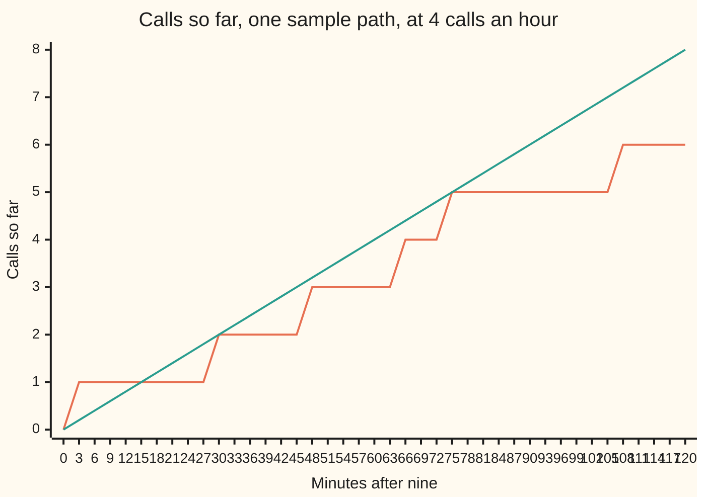
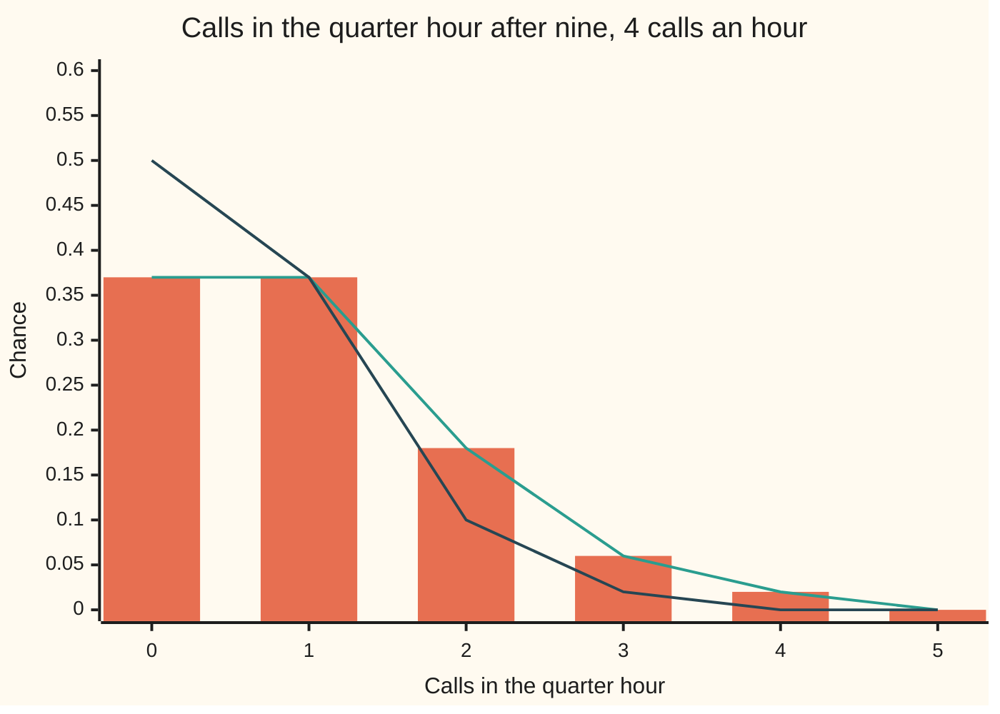

# Poisson process: arrivals with exponential gaps, and counts that are Poisson

[Syllabus](../../../SYLLABUS.md) → [Stochastic processes and calculus](../README.md) → [Poisson and Jump Processes](../README.md#s04) → Poisson process

---

## General Overview

A switchboard takes calls at 4 an hour on average. The callers do not know about each other. It is nine o'clock. How many calls arrive in the next quarter hour?

No call at all about 37% of the time. Exactly one, also about 37%. Two about 18%, three about 6%, four or more about 2%. These are the chances of the Poisson law with mean 1 ([Poisson](../../09-Probability%20and%20statistics/03-Discrete%20Distributions/04-poisson.md)). The same table holds for every quarter hour of the morning, and how busy one quarter hour was says nothing about the next.

Those numbers come from a construction. Draw the wait for the first call from the exponential law with a mean of 15 minutes ([Exponential](../../09-Probability%20and%20statistics/04-Continuous%20Distributions/03-exponential-distribution.md)). Draw each later wait afresh, independently, from the same law. Add up the waits and the call times appear. Count the calls so far: the count sits still between calls and rises by one at each. That count, followed through time, is the **Poisson process**: a process in the sense of [Stochastic processes](../01-Random%20Walks%20and%20Filtrations/01-processes-and-paths.md), one random count for each moment.

**Independent exponential gaps between calls make the count in every window Poisson, with mean rate times length, and make the counts in separate windows independent.**

**What kind of fact this is:** a theorem, proved in full on this card in Why it works. The process built from gaps is a definition. Using it for a real switchboard is a model, and When it holds says where it fails.

### The picture: one morning's calls

One sample path from a seeded simulation (SplitMix64, seed 20260929, written out in the code), read off every 3 minutes for two hours.



Orange: the count on this one morning, with calls at 2.8, 28.9, 45.3, 63.9, 73.5 and 107.3 minutes. The real path jumps by exactly one at each call; the chart joins points 3 minutes apart, so each jump shows as a short ramp. Green: the mean count, 4 an hour times the hours elapsed. This morning ended on 6 calls against a mean of 8: one path is one sample, not the law.

---

## The formula

Notation first, in words. The rate is $\lambda$ (lambda), in calls per hour; time $t$ is in hours after nine. $E_n$ is the $n$-th gap, the wait from call $n-1$ to call $n$, with call 0 meaning nine o'clock. $T_n$ is the time of call $n$. $N(t)$ counts the calls by time $t$, a call exactly at $t$ included. The construction:

$$T_n = E_1 + E_2 + \dots + E_n, \qquad N(t) = \text{the largest } n \text{ with } T_n \le t$$

with $E_1, E_2, \dots$ independent and each exponential with rate $\lambda$: $P(E_n > u) = e^{-\lambda u}$.

The theorem. The count in the window from $s$ to $s+t$ is an **increment** of the process, $N(s+t) - N(s)$, and

$$P\big(N(s+t) - N(s) = k\big) = e^{-\lambda t}\,\frac{(\lambda t)^k}{k!}, \qquad k = 0, 1, 2, \dots$$

**Read it aloud:** the chance of exactly $k$ calls in a window is the Poisson chance with mean rate times length, wherever the window sits.

For back-to-back windows with ends $0 = t_0 < t_1 < \dots < t_q$, the counts $N(t_1) - N(t_0), \dots, N(t_q) - N(t_{q-1})$ are **independent**: the chance of any joint pattern is the product of the separate chances.

| Symbol | Plain meaning | In our example | Push it up and the answer… |
| --- | --- | --- | --- |
| $\lambda$ | the rate: calls per hour on average | 4 | more calls in every window |
| $t$ | a length of time, in hours | 0.25, a quarter hour | more calls, in step |
| $s$ | where a window starts | 0 or 0.25 | nothing changes |
| $E_n$ | the $n$-th gap between calls | exponential, mean 0.25 hour = 15 minutes | — |
| $g_1$ to $g_n$, $x_1$ to $x_n$, $g_i$, $x_i$ | possible values of the gaps and of the call times, the variables of Steps 1 to 3 and the proof; i numbers them | call times 2.8, 28.9, … minutes on the pictured path | — |
| $T_n$ | the time of call $n$; $T_0 = 0$ | first call at 2.8 minutes, pictured path | — |
| $N(t)$ | calls by time $t$ | 6 by 120 minutes on the pictured path | — |
| $n$, $k$, $m$, $j$, $k_1$, $k_2$, $k_j$ | whole numbers: call number, count, total, window number, count in window $j$ | $k$ = 0, 1, 2 calls | — |
| $e^{-\lambda t}$ | chance of no call in a window of length $t$ | $e^{-1}$ = 0.3679 | — |
| $k!$ | $k$ factorial, 1 × 2 × … × $k$; 0! = 1 | 2! = 2 | — |
| $t_j$, $t_q$, $q$ | the ends of $q$ back-to-back windows | 0, 0.25, 0.5 | — |
| $u$, $u_1$ to $u_n$, $h$ | spare time lengths; a slot length | $h$ = 1 minute to 1 second | slots drift from the process |

At 4 calls an hour and a quarter hour, $\lambda t$ = 1: one call expected.

### When it holds

- **A constant rate.** At 8 calls an hour over lunch and 4 in the morning, no single $\lambda$ describes the day.
- **Gaps independent of one another.** Callers who redial after a busy signal bring calls in clumps, and the count spreads more than a Poisson count, whose variance equals its mean.
- **Exponential gaps, not merely the right mean.** Gaps spread evenly between 0 and 30 minutes also average 15 minutes, yet leave the first quarter hour empty half the time, and consecutive quarter hours correlate at −0.2940 ± 0.0022 in simulation instead of 0.
- **One call at a time.** If calls could arrive in pairs, the count would jump by two. That is [Compound Poisson](04-compound-poisson.md).
- **Windows fixed in advance.** The busiest quarter hour of the morning, picked after the fact, does not have the Poisson law with mean 1.

---

## Why it works

### Step 0: at any fixed moment, the process starts again

At a quarter past nine, a quarter hour has gone by. The wait from then to the next call still averages 15 minutes: the simulation gives 14.96 minutes, with a standard error of 0.03. The gap in progress has forgotten how long it has run: the no-memory property proved on [Exponential](../../09-Probability%20and%20statistics/04-Continuous%20Distributions/03-exponential-distribution.md). The gaps after it are fresh draws, untouched by the past.

So what happens after quarter past is a new copy of the same process, independent of what came before. The steps below make this restart precise.

### Step 1: the call times have a flat joint density

The first $n$ gaps have a joint density, a chance per unit of volume in $n$ dimensions, equal to the product of $n$ exponential densities:

$$\lambda e^{-\lambda g_1} \times \dots \times \lambda e^{-\lambda g_n} = \lambda^n e^{-\lambda (g_1 + \dots + g_n)}$$

where $g_1, \dots, g_n$ are the gap values. The sum in the exponent is the time of the last call, a value $x_n$ of $T_n$. Switching from gaps to call times $x_1 < x_2 < \dots < x_n$ slides each coordinate by the ones before it (a shear), which keeps volumes, so the density of the call times is

$$\lambda^n e^{-\lambda x_n} \quad \text{on } 0 < x_1 < x_2 < \dots < x_n.$$

Only the last call time appears. Where the earlier calls sit, in order, does not change the density. Integrating out the earlier ones gives the gamma law for $T_n$, as on [Gamma and beta](../../09-Probability%20and%20statistics/04-Continuous%20Distributions/07-gamma-and-beta-distributions.md).

### Step 2: exactly k calls makes the density constant

Exactly $k$ calls by time $t$ means the first $k$ calls come by $t$ and the next gap outlasts what is left of the window: $E_{k+1} > t - T_k$, which has chance $e^{-\lambda (t - x_k)}$. Multiply:

$$\lambda^k e^{-\lambda x_k} \times e^{-\lambda (t - x_k)} = \lambda^k e^{-\lambda t}.$$

The call times have dropped out. Every arrangement of $k$ calls in the window is equally likely. So the chance of $k$ calls is $\lambda^k e^{-\lambda t}$ times the volume of the set of arrangements, $0 < x_1 < \dots < x_k < t$.

That volume is $t^k / k!$. The cube of all $k$ unordered times has volume $t^k$. It splits into $k!$ equal pieces, one for each order the times can come in, and the ordered set is one of them. So

$$P\big(N(t) = k\big) = \lambda^k e^{-\lambda t} \times \frac{t^k}{k!} = e^{-\lambda t}\frac{(\lambda t)^k}{k!}.$$

For $k$ = 0: no call by $t$ means the first gap outlasts $t$, chance $e^{-\lambda t}$.

### Step 3: several windows at once

Take back-to-back windows ending at $t_1 < \dots < t_q$, and ask for $k_1$ calls in the first, $k_2$ in the second, and so on, $m$ in all. The same cancellation gives the constant density $\lambda^m e^{-\lambda t_q}$. The allowed arrangements put an ordered group of $k_j$ calls inside each window $j$, so their volume is a product of one volume per window. Splitting $e^{-\lambda t_q}$ and $\lambda^m$ window by window gives

$$\prod_{j=1}^{q} e^{-\lambda (t_j - t_{j-1})}\,\frac{\big(\lambda (t_j - t_{j-1})\big)^{k_j}}{k_j!}.$$

A product of Poisson chances, one per window, is exactly what independence means. Each factor depends on its window's length alone, not on where it starts. Taking windows from 0 to $s$ and from $s$ to $s+t$ gives the displayed formula for any start $s$.

### Step 4: the calls never pile up

Could infinitely many calls crowd into one morning? The strong law of large numbers ([The strong law of large numbers](../../10-Measure%20and%20integration/10-The%20Limit%20Theorems%2C%20Proved/04-strong-law-of-large-numbers.md)) says $T_n / n$ settles at the mean gap, 0.25 hour, with probability one. So $T_n$ grows without limit, and only finitely many calls come by any time. On the leftover set of chance zero, define the count to be 0; no probability changes.

<details>
<summary>Detailed proof: every step, with the change of variables written out</summary>

*Gaps to call times.* By independence the gaps $(E_1, \dots, E_n)$ have density $\lambda^n e^{-\lambda(g_1 + \dots + g_n)}$ for positive values. The map $x_i = g_1 + \dots + g_i$ is linear with inverse $g_i = x_i - x_{i-1}$, whose matrix has ones on the diagonal and minus ones just below: determinant 1. The change-of-variables rule gives $(T_1, \dots, T_n)$ the density $\lambda^n e^{-\lambda x_n}$ on $0 < x_1 < \dots < x_n$, and $(T_1, \dots, T_n, E_{n+1})$ the density $\lambda^{n+1} e^{-\lambda(x_n + g_{n+1})}$, with $g_{n+1}$ the value of the next gap.

*One window.* Off a null set, $N(t) = k$ is the event "$T_k \le t$ and $E_{k+1} > t - T_k$". Integrate the next gap from $t - x_k$ to infinity, then the call times over $0 < x_1 < \dots < x_k < t$:
$$P\big(N(t) = k\big) = \int \lambda^k e^{-\lambda x_k}\, e^{-\lambda(t - x_k)}\, dx = \lambda^k e^{-\lambda t} \cdot \frac{t^k}{k!}.$$
The ordered set is one of $k!$ pieces of the cube $(0,t)^k$ obtained by permuting coordinates; permutations keep volume and ties have volume zero.

*Several windows.* For counts $k_1, \dots, k_q$ with total $m \ge 1$, the event puts calls number $k_1 + \dots + k_{j-1} + 1$ to $k_1 + \dots + k_j$ inside window $j$, and needs $E_{m+1} > t_q - T_m$. The allowed set is a product of ordered sets with volume $\prod_j (t_j - t_{j-1})^{k_j} / k_j!$; times $\lambda^m e^{-\lambda t_q}$ this regroups into the product of Poisson chances. For $m = 0$ the chance is $P(E_1 > t_q) = e^{-\lambda t_q}$, the same formula. Summing over any sets of counts, one per window, still factorises, since each Poisson law sums to 1: that is mutual independence. Windows with space between them count the spaces as extra windows, summed out.

*The converse.* A counting process that starts at 0, rises by one at a time and has independent Poisson increments with mean rate times length has independent exponential gaps. For the first gap alone, $P(E_1 > u) = P(N(u) = 0) = e^{-\lambda u}$. For all of them at once, call $n$ has come by time $u$ exactly when $N(u) \ge n$, so $P(T_1 \le u_1, \dots, T_n \le u_n) = P(N(u_1) \ge 1, \dots, N(u_n) \ge n)$, and the right side depends only on the joint law of the counts, which the independent Poisson increments fix. The process built from gaps has those same count laws, so its call times, and with them its gaps, have the same joint law: independent exponentials. Either description therefore defines the same process.

</details>

### Two other roads to the same law

Condition on the first gap $u$: if it ends inside the window, the process restarts there, and $k$ calls by $t$ needs $k - 1$ in the time left. So $P(N(t) = k)$ is the integral over $u$ from 0 to $t$ of $\lambda e^{-\lambda u}$ times $P(N(t-u) = k-1)$, a recursion the code solves on a grid. Or cut time into slots of length $h$, each holding a call with chance $\lambda h$, and let $h$ shrink: the binomial count tends to the Poisson count, as [Poisson](../../09-Probability%20and%20statistics/03-Discrete%20Distributions/04-poisson.md) proves. The code takes both roads.

---

## Worked numbers, by hand

The next quarter hour: $\lambda$ = 4 calls an hour, $t$ = 0.25 hour.

| Step | Arithmetic | Value |
| --- | --- | --- |
| expected calls, $\lambda t$ | 4 × 0.25 | 1 |
| mean gap, $1/\lambda$ | 1/4 hour | 0.25 hour = 15 minutes |
| no call | $e^{-1}$ | 0.3679 |
| exactly one call | $e^{-1} \times 1^1 / 1!$ | 0.3679 |
| exactly two | $e^{-1} / 2$ | 0.1839 |
| exactly three | $e^{-1} / 6$ | 0.0613 |
| four or more | 1 − 0.3679 − 0.3679 − 0.1839 − 0.0613 | 0.0190 |
| one call, then two in the following quarter hour | 0.3679 × 0.1839, by independence | 0.0677 |
| three calls in the half hour | $e^{-2} \times 2^3 / 3!$ | 0.1804 |
| **no call in the next quarter hour** | $e^{-\lambda t}$ | **0.3679** |

More than a third of quarter hours pass with no call at all, although a call is expected every 15 minutes. Running totals, unlike increments, are not independent: the count by half past contains the count by quarter past. Their variances are 1 and 2, their covariance is $\lambda$ times the shorter time, 4 × 0.25 = 1, so they correlate at $1/\sqrt{2}$ = 0.7071.

### The picture: the law of the quarter-hour count



Orange bars: the Poisson law with mean 1. Green: 200,000 simulated quarter hours from exponential gaps, sitting on the bars. Dark blue: 200,000 quarter hours from gaps spread evenly between 0 and 30 minutes, the same mean; empty half the time, rarely busy. The mean gap alone does not fix the law. Every simulated value has a standard error of at most 0.0011.

### What breaks if you drop a piece

| Mistake | Comes out at | What went wrong |
| --- | --- | --- |
| Treating the totals $N(0.25)$ and $N(0.5)$ as independent | chance of 1 by quarter past and 2 by half past: 0.0996, true 0.1353 | the later total contains the earlier one; only the increments are independent |
| Using 1 − $\lambda t$ for the chance of no call | 0 for a quarter hour (true 0.3679); −3 for an hour (true 0.0183) | the short-window approximation stretched to a long window |
| Gaps even between 0 and 30 minutes, same mean | empty first quarter 0.5000; consecutive quarters correlated −0.2940 ± 0.0022, simulated; wait from quarter past 9.75 ± 0.01 minutes, simulated, not 15 | only exponential gaps restart at a fixed time |
| Slots of 1 minute, at most one call each | no call 0.3553, off by up to 0.0128 | two calls in one minute are forbidden; 1-second slots cut the error to 0.0002 |

The code prints every one.

---

## Code, from first principles, and it actually runs

Four roads to the law of the quarter-hour count. Road one is the Poisson formula. Road two never uses it: it solves the first-gap recursion on a grid of 1,000 steps with the trapezoid rule. Road three uses slots of 1 minute, 10 seconds and 1 second. Road four simulates 200,000 half hours from exponential gaps, drawn by inverse transform from a SplitMix64 generator written out, seed 20260929, with a standard error on every simulated number; it also checks independence, the totals' correlation and the restart at quarter past. A second simulation with evenly spread gaps shows what breaks.

### Python

```python
# Poisson process -- the check behind the card.  Standard library only; nothing
# imported holds the answer.  Calls reach a switchboard at 4 an hour.  The process
# is built from independent exponential gaps, and the count in the next quarter
# hour is reached four ways: the Poisson formula; a first-step recursion on the
# first gap, integrated on a grid; time cut into slots of length h, the error
# printed as h shrinks; and a seeded simulation (SplitMix64, seed 20260929).
from math import exp, log, sqrt

LAM, WIN, DAY = 4.0, 0.25, 2.0          # calls per hour; window and plotted span, hours
SEED, RUNS, KMAX = 20260929, 200_000, 5
M64 = (1 << 64) - 1
state = SEED

def uniform():                          # SplitMix64, turned into a number in (0, 1]
    global state
    state = (state + 0x9E3779B97F4A7C15) & M64
    z = state
    z = ((z ^ (z >> 30)) * 0xBF58476D1CE4E5B9) & M64
    z = ((z ^ (z >> 27)) * 0x94D049BB133111EB) & M64
    return (((z ^ (z >> 31)) >> 11) + 1) / 2.0**53

def gap():                              # exponential gap, rate LAM, by inverse transform
    return -log(uniform()) / LAM

def fact(k):
    f = 1
    for i in range(2, k + 1):
        f *= i
    return f

def pois(k, m):                         # Road 1: the Poisson formula
    return exp(-m) * m**k / fact(k)

def by_first_gap(t, kmax, n=1000):      # Road 2: p_k(t) = int_0^t LAM e^(-LAM u) p_(k-1)(t-u) du
    h = t / n
    f = [LAM * exp(-LAM * i * h) for i in range(n + 1)]
    q = [exp(-LAM * i * h) for i in range(n + 1)]     # p_0: the first gap outlasts the time
    out = [q[n]]
    for k in range(1, kmax + 1):
        r = [0.0]
        for i in range(1, n + 1):                     # trapezoid rule over the first gap u
            s = 0.5 * (f[0] * q[i] + f[i] * q[0])
            for j in range(1, i):
                s += f[j] * q[i - j]
            r.append(s * h)
        q = r
        out.append(q[n])
    return out

def by_slots(t, h, k):                  # Road 3: slots of length h, one call each with chance LAM h
    m, p, c = round(t / h), LAM * h, 1
    for i in range(k):
        c = c * (m - i) // (i + 1)
    return c * p**k * (1 - p)**(m - k)

def two_windows(draw):                  # Road 4: counts in the first and second quarter hour
    t, c1, c2 = draw(), 0, 0
    while t <= WIN:
        c1, t = c1 + 1, t + draw()
    w = t - WIN                                       # wait from quarter past to the next call
    while t <= 2 * WIN:
        c2, t = c2 + 1, t + draw()
    return c1, c2, w

def simulate(draw):
    hist, both, s1, s2, s11, s22, s12, s3, s4, sw, sww = [0] * (KMAX + 2), 0, 0, 0, 0, 0, 0, 0, 0, 0.0, 0.0
    for _ in range(RUNS):
        c1, c2, w = two_windows(draw)
        hist[min(c1, KMAX + 1)] += 1
        both += c1 == 1 and c2 == 2
        s1, s2, s11, s22, s12 = s1 + c1, s2 + c2, s11 + c1 * c1, s22 + c2 * c2, s12 + c1 * c2
        s3, s4 = s3 + c1 * c1 * c1, s4 + c1 * c1 * c1 * c1
        sw, sww = sw + w, sww + w * w
    m1, m2 = s1 / RUNS, s2 / RUNS
    v1, v2, cv = s11 / RUNS - m1 * m1, s22 / RUNS - m2 * m2, s12 / RUNS - m1 * m2
    mw, m4 = sw / RUNS, s4 / RUNS - 4 * m1 * s3 / RUNS + 6 * m1 * m1 * s11 / RUNS - 3 * m1 * m1 * m1 * m1
    return (hist, both / RUNS, m1, v1, cv / sqrt(v1 * v2), (v1 + cv) / sqrt(v1 * (v1 + v2 + 2 * cv)),
            mw, sqrt((sww / RUNS - mw * mw) / RUNS), sqrt(v1 / RUNS), sqrt((m4 - v1 * v1) / RUNS))

def se(f):
    return sqrt(f * (1 - f) / RUNS)

path, t = [], gap()                     # one sample path over two hours, for the picture
while t <= DAY:
    path.append(t)
    t += gap()
grid = [3 * i for i in range(41)]                     # minutes
steps = [sum(1 for a in path if 60 * a <= g) for g in grid]

exact = [pois(k, LAM * WIN) for k in range(KMAX + 1)]
rec = by_first_gap(WIN, KMAX)
hist, both, m1, v1, r12, r1t, mw, sew, sem, sev = simulate(gap)
uhist, _, _, _, ur12, _, umw, usew, _, _ = simulate(lambda: 2 * uniform() / LAM)   # the mistake: same mean
pu = max(0.0, 1 - LAM * WIN / 2)                      # its exact chance of an empty first window
freq, ufreq = [c / RUNS for c in hist], [c / RUNS for c in uhist]
rse = 1 / sqrt(RUNS)                                  # standard error of a correlation near 0

print(f"rate {LAM:.0f} calls an hour; window {WIN} hour; mean count LAM t = {LAM * WIN:.4f}")
print("calls in the quarter hour: formula, first-gap recursion, simulated +- se")
for k in range(KMAX + 1):
    print(f"  {k}: {exact[k]:.6f}  {rec[k]:.6f}  {freq[k]:.4f} +- {se(freq[k]):.4f}")
print(f"P(4 or more): formula {1 - sum(exact[:4]):.4f}; simulated {sum(freq[4:]):.4f} +- {se(sum(freq[4:])):.4f}")
print(f"mean and variance of the count, simulated: {m1:.4f} +- {sem:.4f}, {v1:.4f} +- {sev:.4f}")
errs = []
for name, h in (("1 minute", 1 / 60), ("10 seconds", 1 / 360), ("1 second", 1 / 3600)):
    errs.append(max(abs(by_slots(WIN, h, k) - exact[k]) for k in range(KMAX + 1)))
    print(f"slots of {name}: P(0) = {by_slots(WIN, h, 0):.6f}, largest error {errs[-1]:.6f}")
print(f"wait from quarter past to the next call: {60 * mw:.2f} +- {60 * sew:.2f} minutes (mean gap 15)")
print(f"P(1 call, then 2 calls): formula {exact[1] * exact[2]:.4f}; simulated {both:.4f} +- {se(both):.4f}")
print(f"corr(first quarter, second quarter): {r12:.4f} +- {rse:.4f}; formula 0")
print(f"corr(N(0.25), N(0.5)): {r1t:.4f} +- {(1 - r1t * r1t) * rse:.4f}; formula sqrt(1/2) = {sqrt(0.5):.4f}")
print(f"P(N(0.5) = 3) = {pois(3, 2 * LAM * WIN):.4f}; Cov(N(0.25), N(0.5)) = LAM x 0.25 = {LAM * WIN:.4f}")
print(f"mistake, totals as independent: P(N(0.25) = 1 and N(0.5) = 2) = {exact[1] ** 2:.4f}, "
      f"product of the two laws {exact[1] * pois(2, 2 * LAM * WIN):.4f}")
print(f"mistake, 1 - LAM t for no call: quarter hour {1 - LAM * WIN:.4f} vs {exact[0]:.4f}; "
      f"one hour {1 - LAM:.4f} vs {exp(-LAM):.4f}")
print(f"mistake, gaps uniform on 0 to {120 / LAM:.0f} minutes: P(no call in first quarter) exact {pu:.4f}, "
      f"simulated {ufreq[0]:.4f} +- {se(ufreq[0]):.4f}")
print(f"  its corr(first quarter, second quarter): {ur12:.4f} +- {rse:.4f}; "
      f"wait from quarter past: {60 * umw:.2f} +- {60 * usew:.2f} minutes")
print("sample path, arrival minutes: " + ", ".join(f"{60 * a:.1f}" for a in path))
print("chart, minutes: " + ", ".join(str(g) for g in grid))
print("chart, calls so far: " + ", ".join(str(c) for c in steps))
print("chart, mean 4t: " + ", ".join(f"{g / 15:.2f}" for g in grid))
print("chart, formula: " + ", ".join(f"{p:.2f}" for p in exact))
print("chart, simulated exponential gaps: " + ", ".join(f"{p:.2f}" for p in freq[:KMAX + 1]))
print(f"chart, simulated uniform gaps (se at most {max(se(p) for p in ufreq):.4f}): "
      + ", ".join(f"{p:.2f}" for p in ufreq[:KMAX + 1]))

assert max(abs(rec[k] - exact[k]) for k in range(KMAX + 1)) < 1e-6   # recursion against formula
assert errs[0] > errs[1] > errs[2] and errs[2] < 5e-4                # slots close in on the formula
assert all(abs(freq[k] - exact[k]) < 4 * se(exact[k]) for k in range(KMAX + 1)) and abs(m1 - v1) < 4 * sev
assert abs(both - exact[1] * exact[2]) < 4 * se(both)               # increments multiply
assert abs(r12) < 4 * rse and abs(r1t - sqrt(0.5)) < 4 * (1 - r1t * r1t) * rse   # increments vs totals
assert abs(mw - 1 / LAM) < 4 * sew                                     # the restart at a fixed time
assert abs(ufreq[0] - pu) <= 4 * se(pu) and abs(ur12) > 4 * rse      # uniform gaps break it
print("ALL CHECKS PASS")
```

**Ran 2026-09-30 on macOS, Python 3.14.6, standard library only. All checks passed. Output, pasted from the run:**

```
rate 4 calls an hour; window 0.25 hour; mean count LAM t = 1.0000
calls in the quarter hour: formula, first-gap recursion, simulated +- se
  0: 0.367879  0.367879  0.3679 +- 0.0011
  1: 0.367879  0.367879  0.3686 +- 0.0011
  2: 0.183940  0.183940  0.1839 +- 0.0009
  3: 0.061313  0.061313  0.0609 +- 0.0005
  4: 0.015328  0.015328  0.0152 +- 0.0003
  5: 0.003066  0.003066  0.0031 +- 0.0001
P(4 or more): formula 0.0190; simulated 0.0187 +- 0.0003
mean and variance of the count, simulated: 0.9980 +- 0.0022, 0.9933 +- 0.0038
slots of 1 minute: P(0) = 0.355264, largest error 0.012761
slots of 10 seconds: P(0) = 0.365826, largest error 0.002057
slots of 1 second: P(0) = 0.367675, largest error 0.000205
wait from quarter past to the next call: 14.96 +- 0.03 minutes (mean gap 15)
P(1 call, then 2 calls): formula 0.0677; simulated 0.0678 +- 0.0006
corr(first quarter, second quarter): 0.0004 +- 0.0022; formula 0
corr(N(0.25), N(0.5)): 0.7047 +- 0.0011; formula sqrt(1/2) = 0.7071
P(N(0.5) = 3) = 0.1804; Cov(N(0.25), N(0.5)) = LAM x 0.25 = 1.0000
mistake, totals as independent: P(N(0.25) = 1 and N(0.5) = 2) = 0.1353, product of the two laws 0.0996
mistake, 1 - LAM t for no call: quarter hour 0.0000 vs 0.3679; one hour -3.0000 vs 0.0183
mistake, gaps uniform on 0 to 30 minutes: P(no call in first quarter) exact 0.5000, simulated 0.4999 +- 0.0011
  its corr(first quarter, second quarter): -0.2940 +- 0.0022; wait from quarter past: 9.75 +- 0.01 minutes
sample path, arrival minutes: 2.8, 28.9, 45.3, 63.9, 73.5, 107.3
chart, minutes: 0, 3, 6, 9, 12, 15, 18, 21, 24, 27, 30, 33, 36, 39, 42, 45, 48, 51, 54, 57, 60, 63, 66, 69, 72, 75, 78, 81, 84, 87, 90, 93, 96, 99, 102, 105, 108, 111, 114, 117, 120
chart, calls so far: 0, 1, 1, 1, 1, 1, 1, 1, 1, 1, 2, 2, 2, 2, 2, 2, 3, 3, 3, 3, 3, 3, 4, 4, 4, 5, 5, 5, 5, 5, 5, 5, 5, 5, 5, 5, 6, 6, 6, 6, 6
chart, mean 4t: 0.00, 0.20, 0.40, 0.60, 0.80, 1.00, 1.20, 1.40, 1.60, 1.80, 2.00, 2.20, 2.40, 2.60, 2.80, 3.00, 3.20, 3.40, 3.60, 3.80, 4.00, 4.20, 4.40, 4.60, 4.80, 5.00, 5.20, 5.40, 5.60, 5.80, 6.00, 6.20, 6.40, 6.60, 6.80, 7.00, 7.20, 7.40, 7.60, 7.80, 8.00
chart, formula: 0.37, 0.37, 0.18, 0.06, 0.02, 0.00
chart, simulated exponential gaps: 0.37, 0.37, 0.18, 0.06, 0.02, 0.00
chart, simulated uniform gaps (se at most 0.0011): 0.50, 0.37, 0.10, 0.02, 0.00, 0.00
ALL CHECKS PASS
```

The recursion matches the formula to six decimals, and the slot error shrinks in proportion to the slot length.

### Rust

Same roads, same labels, built with `rustc --edition 2021 -O`.

```rust
// Poisson process -- the same check in Rust.  No crates.  Calls reach a
// switchboard at 4 an hour.  The process is built from independent exponential
// gaps, and the count in the next quarter hour is reached four ways: the Poisson
// formula; a first-step recursion on the first gap, integrated on a grid; time
// cut into slots of length h, the error printed as h shrinks; and a seeded
// simulation (SplitMix64, seed 20260929).
const LAM: f64 = 4.0;                   // calls per hour
const WIN: f64 = 0.25;                  // the window, hours
const DAY: f64 = 2.0;                   // the plotted span, hours
const RUNS: usize = 200_000;
const KMAX: usize = 5;

struct Rng(u64);
impl Rng {
    fn uniform(&mut self) -> f64 {      // SplitMix64, turned into a number in (0, 1]
        self.0 = self.0.wrapping_add(0x9E3779B97F4A7C15);
        let mut z = self.0;
        z = (z ^ (z >> 30)).wrapping_mul(0xBF58476D1CE4E5B9);
        z = (z ^ (z >> 27)).wrapping_mul(0x94D049BB133111EB);
        (((z ^ (z >> 31)) >> 11) + 1) as f64 / 2f64.powi(53)
    }
    fn gap(&mut self, uniform_gaps: bool) -> f64 {
        if uniform_gaps { 2.0 * self.uniform() / LAM }  // the mistake: uniform on 0 to 2/LAM, same mean
        else { -self.uniform().ln() / LAM }              // exponential gap, by inverse transform
    }
}

fn fact(k: usize) -> f64 { (2..=k).fold(1u64, |f, i| f * i as u64) as f64 }

fn pois(k: usize, m: f64) -> f64 { (-m).exp() * m.powf(k as f64) / fact(k) }   // Road 1

fn by_first_gap(t: f64, kmax: usize, n: usize) -> Vec<f64> {   // Road 2
    let h = t / n as f64;
    let f: Vec<f64> = (0..=n).map(|i| LAM * (-LAM * i as f64 * h).exp()).collect();
    let mut q: Vec<f64> = (0..=n).map(|i| (-LAM * i as f64 * h).exp()).collect();
    let mut out = vec![q[n]];
    for _ in 1..=kmax {
        let mut r = vec![0.0];
        for i in 1..=n {                                 // trapezoid rule over the first gap u
            let mut s = 0.5 * (f[0] * q[i] + f[i] * q[0]);
            for j in 1..i { s += f[j] * q[i - j] }
            r.push(s * h);
        }
        q = r;
        out.push(q[n]);
    }
    out
}

fn by_slots(t: f64, h: f64, k: usize) -> f64 {  // Road 3: one call per slot, chance LAM h
    let (m, p) = ((t / h).round() as u64, LAM * h);
    let mut c: u64 = 1;
    for i in 0..k as u64 { c = c * (m - i) / (i + 1) }
    c as f64 * p.powf(k as f64) * (1.0 - p).powf((m - k as u64) as f64)
}

fn two_windows(g: &mut Rng, u: bool) -> (u64, u64, f64) {   // Road 4
    let (mut t, mut c1, mut c2) = (g.gap(u), 0u64, 0u64);
    while t <= WIN { c1 += 1; t += g.gap(u) }
    let w = t - WIN;                                     // wait from quarter past to the next call
    while t <= 2.0 * WIN { c2 += 1; t += g.gap(u) }
    (c1, c2, w)
}

fn simulate(g: &mut Rng, u: bool) -> (Vec<u64>, f64, f64, f64, f64, f64, f64, f64, f64, f64) {
    let (mut hist, mut both) = (vec![0u64; KMAX + 2], 0u64);
    let (mut s1, mut s2, mut s11, mut s22, mut s12, mut sw, mut sww) = (0u64, 0u64, 0u64, 0u64, 0u64, 0.0, 0.0);
    let (mut s3, mut s4) = (0u64, 0u64);
    for _ in 0..RUNS {
        let (c1, c2, w) = two_windows(g, u);
        hist[(c1 as usize).min(KMAX + 1)] += 1;
        if c1 == 1 && c2 == 2 { both += 1 }
        s1 += c1; s2 += c2; s11 += c1 * c1; s22 += c2 * c2; s12 += c1 * c2;
        s3 += c1 * c1 * c1; s4 += c1 * c1 * c1 * c1;
        sw += w; sww += w * w;
    }
    let n = RUNS as f64;
    let (m1, m2) = (s1 as f64 / n, s2 as f64 / n);
    let (v1, v2, cv) = (s11 as f64 / n - m1 * m1, s22 as f64 / n - m2 * m2, s12 as f64 / n - m1 * m2);
    let (mw, m4) = (sw / n, s4 as f64 / n - 4.0 * m1 * s3 as f64 / n + 6.0 * m1 * m1 * s11 as f64 / n - 3.0 * m1 * m1 * m1 * m1);
    (hist, both as f64 / n, m1, v1, cv / (v1 * v2).sqrt(), (v1 + cv) / (v1 * (v1 + v2 + 2.0 * cv)).sqrt(),
     mw, ((sww / n - mw * mw) / n).sqrt(), (v1 / n).sqrt(), ((m4 - v1 * v1) / n).sqrt())
}

fn se(f: f64) -> f64 { (f * (1.0 - f) / RUNS as f64).sqrt() }

fn join<T>(v: &[T], f: impl Fn(&T) -> String) -> String { v.iter().map(f).collect::<Vec<_>>().join(", ") }

fn main() {
    let mut g = Rng(20260929);
    let (mut path, mut t) = (vec![], g.gap(false));      // one sample path over two hours
    while t <= DAY { path.push(t); t += g.gap(false) }
    let grid: Vec<u64> = (0..41).map(|i| 3 * i).collect();                  // minutes
    let steps: Vec<usize> = grid.iter().map(|&m| path.iter().filter(|&&a| 60.0 * a <= m as f64).count()).collect();

    let exact: Vec<f64> = (0..=KMAX).map(|k| pois(k, LAM * WIN)).collect();
    let rec = by_first_gap(WIN, KMAX, 1000);
    let (hist, both, m1, v1, r12, r1t, mw, sew, sem, sev) = simulate(&mut g, false);
    let (uhist, _, _, _, ur12, _, umw, usew, _, _) = simulate(&mut g, true);
    let freq: Vec<f64> = hist.iter().map(|&c| c as f64 / RUNS as f64).collect();
    let ufreq: Vec<f64> = uhist.iter().map(|&c| c as f64 / RUNS as f64).collect();
    let rse = 1.0 / (RUNS as f64).sqrt();                // standard error of a correlation near 0
    let pu = (1.0 - LAM * WIN / 2.0).max(0.0);           // uniform gaps: exact chance of an empty first window

    println!("rate {:.0} calls an hour; window {} hour; mean count LAM t = {:.4}", LAM, WIN, LAM * WIN);
    println!("calls in the quarter hour: formula, first-gap recursion, simulated +- se");
    for k in 0..=KMAX {
        println!("  {}: {:.6}  {:.6}  {:.4} +- {:.4}", k, exact[k], rec[k], freq[k], se(freq[k]));
    }
    let f4: f64 = freq[4..].iter().sum();
    println!("P(4 or more): formula {:.4}; simulated {:.4} +- {:.4}", 1.0 - exact[..4].iter().sum::<f64>(), f4, se(f4));
    println!("mean and variance of the count, simulated: {:.4} +- {:.4}, {:.4} +- {:.4}", m1, sem, v1, sev);
    let mut errs = vec![];
    for (name, h) in [("1 minute", 1.0 / 60.0), ("10 seconds", 1.0 / 360.0), ("1 second", 1.0 / 3600.0)] {
        errs.push((0..=KMAX).map(|k| (by_slots(WIN, h, k) - exact[k]).abs()).fold(0.0, f64::max));
        println!("slots of {}: P(0) = {:.6}, largest error {:.6}", name, by_slots(WIN, h, 0), errs[errs.len() - 1]);
    }
    println!("wait from quarter past to the next call: {:.2} +- {:.2} minutes (mean gap 15)", 60.0 * mw, 60.0 * sew);
    println!("P(1 call, then 2 calls): formula {:.4}; simulated {:.4} +- {:.4}", exact[1] * exact[2], both, se(both));
    println!("corr(first quarter, second quarter): {:.4} +- {:.4}; formula 0", r12, rse);
    println!("corr(N(0.25), N(0.5)): {:.4} +- {:.4}; formula sqrt(1/2) = {:.4}", r1t, (1.0 - r1t * r1t) * rse, 0.5f64.sqrt());
    println!("P(N(0.5) = 3) = {:.4}; Cov(N(0.25), N(0.5)) = LAM x 0.25 = {:.4}", pois(3, 2.0 * LAM * WIN), LAM * WIN);
    println!("mistake, totals as independent: P(N(0.25) = 1 and N(0.5) = 2) = {:.4}, product of the two laws {:.4}",
             exact[1].powf(2.0), exact[1] * pois(2, 2.0 * LAM * WIN));
    println!("mistake, 1 - LAM t for no call: quarter hour {:.4} vs {:.4}; one hour {:.4} vs {:.4}",
             1.0 - LAM * WIN, exact[0], 1.0 - LAM, (-LAM).exp());
    println!("mistake, gaps uniform on 0 to {:.0} minutes: P(no call in first quarter) exact {:.4}, simulated {:.4} +- {:.4}",
             120.0 / LAM, pu, ufreq[0], se(ufreq[0]));
    println!("  its corr(first quarter, second quarter): {:.4} +- {:.4}; wait from quarter past: {:.2} +- {:.2} minutes",
             ur12, rse, 60.0 * umw, 60.0 * usew);
    println!("sample path, arrival minutes: {}", join(&path, |a| format!("{:.1}", 60.0 * a)));
    println!("chart, minutes: {}", join(&grid, |m| m.to_string()));
    println!("chart, calls so far: {}", join(&steps, |c| c.to_string()));
    println!("chart, mean 4t: {}", join(&grid, |&m| format!("{:.2}", m as f64 / 15.0)));
    println!("chart, formula: {}", join(&exact, |p| format!("{:.2}", p)));
    println!("chart, simulated exponential gaps: {}", join(&freq[..=KMAX], |p| format!("{:.2}", p)));
    println!("chart, simulated uniform gaps (se at most {:.4}): {}", ufreq.iter().map(|&p| se(p)).fold(0.0, f64::max),
             join(&ufreq[..=KMAX], |p| format!("{:.2}", p)));

    assert!((0..=KMAX).all(|k| (rec[k] - exact[k]).abs() < 1e-6));           // recursion against formula
    assert!(errs[0] > errs[1] && errs[1] > errs[2] && errs[2] < 5e-4);       // slots close in on the formula
    assert!((0..=KMAX).all(|k| (freq[k] - exact[k]).abs() < 4.0 * se(exact[k])) && (m1 - v1).abs() < 4.0 * sev);
    assert!((both - exact[1] * exact[2]).abs() < 4.0 * se(both));           // increments multiply
    assert!(r12.abs() < 4.0 * rse && (r1t - 0.5f64.sqrt()).abs() < 4.0 * (1.0 - r1t * r1t) * rse); // increments vs totals
    assert!((mw - 1.0 / LAM).abs() < 4.0 * sew);                            // the restart at a fixed time
    assert!((ufreq[0] - pu).abs() <= 4.0 * se(pu) && ur12.abs() > 4.0 * rse); // uniform gaps break it
    println!("ALL CHECKS PASS");
}
```

**Ran 2026-09-30 on macOS, rustc 1.98.1, no crates. All checks passed. Output, pasted from the run:**

```
rate 4 calls an hour; window 0.25 hour; mean count LAM t = 1.0000
calls in the quarter hour: formula, first-gap recursion, simulated +- se
  0: 0.367879  0.367879  0.3679 +- 0.0011
  1: 0.367879  0.367879  0.3686 +- 0.0011
  2: 0.183940  0.183940  0.1839 +- 0.0009
  3: 0.061313  0.061313  0.0609 +- 0.0005
  4: 0.015328  0.015328  0.0152 +- 0.0003
  5: 0.003066  0.003066  0.0031 +- 0.0001
P(4 or more): formula 0.0190; simulated 0.0187 +- 0.0003
mean and variance of the count, simulated: 0.9980 +- 0.0022, 0.9933 +- 0.0038
slots of 1 minute: P(0) = 0.355264, largest error 0.012761
slots of 10 seconds: P(0) = 0.365826, largest error 0.002057
slots of 1 second: P(0) = 0.367675, largest error 0.000205
wait from quarter past to the next call: 14.96 +- 0.03 minutes (mean gap 15)
P(1 call, then 2 calls): formula 0.0677; simulated 0.0678 +- 0.0006
corr(first quarter, second quarter): 0.0004 +- 0.0022; formula 0
corr(N(0.25), N(0.5)): 0.7047 +- 0.0011; formula sqrt(1/2) = 0.7071
P(N(0.5) = 3) = 0.1804; Cov(N(0.25), N(0.5)) = LAM x 0.25 = 1.0000
mistake, totals as independent: P(N(0.25) = 1 and N(0.5) = 2) = 0.1353, product of the two laws 0.0996
mistake, 1 - LAM t for no call: quarter hour 0.0000 vs 0.3679; one hour -3.0000 vs 0.0183
mistake, gaps uniform on 0 to 30 minutes: P(no call in first quarter) exact 0.5000, simulated 0.4999 +- 0.0011
  its corr(first quarter, second quarter): -0.2940 +- 0.0022; wait from quarter past: 9.75 +- 0.01 minutes
sample path, arrival minutes: 2.8, 28.9, 45.3, 63.9, 73.5, 107.3
chart, minutes: 0, 3, 6, 9, 12, 15, 18, 21, 24, 27, 30, 33, 36, 39, 42, 45, 48, 51, 54, 57, 60, 63, 66, 69, 72, 75, 78, 81, 84, 87, 90, 93, 96, 99, 102, 105, 108, 111, 114, 117, 120
chart, calls so far: 0, 1, 1, 1, 1, 1, 1, 1, 1, 1, 2, 2, 2, 2, 2, 2, 3, 3, 3, 3, 3, 3, 4, 4, 4, 5, 5, 5, 5, 5, 5, 5, 5, 5, 5, 5, 6, 6, 6, 6, 6
chart, mean 4t: 0.00, 0.20, 0.40, 0.60, 0.80, 1.00, 1.20, 1.40, 1.60, 1.80, 2.00, 2.20, 2.40, 2.60, 2.80, 3.00, 3.20, 3.40, 3.60, 3.80, 4.00, 4.20, 4.40, 4.60, 4.80, 5.00, 5.20, 5.40, 5.60, 5.80, 6.00, 6.20, 6.40, 6.60, 6.80, 7.00, 7.20, 7.40, 7.60, 7.80, 8.00
chart, formula: 0.37, 0.37, 0.18, 0.06, 0.02, 0.00
chart, simulated exponential gaps: 0.37, 0.37, 0.18, 0.06, 0.02, 0.00
chart, simulated uniform gaps (se at most 0.0011): 0.50, 0.37, 0.10, 0.02, 0.00, 0.00
ALL CHECKS PASS
```

The two outputs are identical line for line.

> [!TIP]
> **Try changing**
> Guess first, then run it.
> - **Double the rate, halve the window.** Set `LAM = 8.0` and `WIN = 0.125`. Only $\lambda t$ = 1 enters the law, so the formula column stays at 0.367879 down to 0.003066.
> - **Watch a half hour instead.** Set `WIN = 0.5`. The mean count becomes 2, no call has chance $e^{-2}$ = 0.1353, and exactly three calls 0.1804.
> - **Swap the gap law.** Replace the exponential gap by `0.5 * uniform()`, same 15-minute mean. The asserts fail: the first quarter hour is empty about half the time (exactly 0.5), and consecutive quarters correlate near −0.29.

---

## The usual mistake

> [!warning]
> **Reading independent increments as independent totals.** The calls in 9:00 to 9:15 and in 9:15 to 9:30 are independent. The totals by 9:15 and by 9:30 are not: the second contains the first. Treating them as independent gives 0.0996 for "1 by quarter past, 2 by half past" instead of 0.1353, and misses a correlation of 0.7071.
>
> - **"A call is due."** After a quiet quarter hour, the wait for the next call still averages 15 minutes. Silence does not build up credit.
> - **Right mean, wrong shape.** Evenly spread gaps with the same 15-minute mean leave the first quarter hour empty half the time. Only exponential gaps give the Poisson table.
> - **1 − $\lambda t$ for "no call".** Fine for a few seconds. For a quarter hour it gives 0 instead of 0.3679.
> - **Mixed units.** The rate is per hour, so the window is 0.25, not 15.

---

## Where you meet it in real life

- **Telephone exchanges.** Agner Krarup Erlang, at the Copenhagen Telephone Company, used this model early in the twentieth century to size exchanges. Queues fed by it are on [Continuous-time chains](05-continuous-time-markov-chains-and-queues.md) and Queues.
- **Radioactive decay.** Clicks of a Geiger counter near a long-lived source: each atom decays independently, and the rate barely changes over an afternoon.
- **Insurance claims.** Claims arrive as a Poisson process; attach a random size to each and the total is [Compound Poisson](04-compound-poisson.md), the base of the classical ruin model.
- **Jumps in prices.** Models of sudden price moves place jumps at Poisson times; the general family is [Levy processes](../09-Beyond%20Brownian/01-levy-processes.md).

> **Say it back**
> Add up independent exponential gaps to get call times, and count the calls so far. The exponential forgets how long it has waited, so at any fixed moment the process starts afresh. Given k calls in a window, every ordered arrangement of them is equally likely, and those arrangements fill a share 1/k! of the cube. That makes the count Poisson with mean rate times length. Separate windows get independent counts; running totals share early calls and are correlated.

---

## What this builds on

- [Stochastic processes](../01-Random%20Walks%20and%20Filtrations/01-processes-and-paths.md): a process as one random variable per time, and a path as one outcome followed through time. The staircase of calls is such a path.
- [Exponential](../../09-Probability%20and%20statistics/04-Continuous%20Distributions/03-exponential-distribution.md): the gap law and its lack of memory, which is Step 0.
- [Poisson](../../09-Probability%20and%20statistics/03-Discrete%20Distributions/04-poisson.md): the Poisson law itself, its mean equal to its variance, and the binomial limit behind the slot road.

## Where this goes next

- [Given n arrivals, when did they happen](02-arrival-times-and-order-statistics.md): given k calls in a window, their times are k uniform points put in order, Step 2 read backwards.
- [Splitting and merging](03-splitting-and-superposition.md): sorting one stream into two, and merging two into one.
- [Compound Poisson](04-compound-poisson.md): a random amount attached to each arrival, summed.
- [Continuous-time chains](05-continuous-time-markov-chains-and-queues.md): exponential waits between changes of state, with a rate matrix in place of one rate.
- [Renewal processes](06-renewal-processes-in-outline.md): independent gaps of any law, such as the evenly spread gaps above.
- [Levy processes](../09-Beyond%20Brownian/01-levy-processes.md): independent, stationary increments in general, built from Poisson jumps and Brownian motion.
- Queues: Poisson arrivals meeting a server.

This card fixes how many calls a window holds; where inside the window they sit is what the arrival-times card answers.

---

## Sources

Verified 30 Sep 2026: every link below resolves to the publisher's page.

- Durrett, Rick. *Probability: Theory and Examples*, 5th ed. Cambridge University Press, 2019. [doi:10.1017/9781108591034](https://doi.org/10.1017/9781108591034). Section 3.7 builds the process from exponential gaps, proves the Poisson counts, and gives the short-window definition.
- Last, Günter, and Mathew Penrose. *Lectures on the Poisson Process*. Cambridge University Press, 2017. [doi:10.1017/9781316104477](https://doi.org/10.1017/9781316104477). Poisson points on a general space; calls on a time line are the simplest case.
- Ross, Sheldon M. *Introduction to Probability Models*, 13th ed. Elsevier. [Publisher page](https://shop.elsevier.com/books/introduction-to-probability-models/ross/978-0-443-18761-2). Chapter 5, "The Exponential Distribution and the Poisson Process": the applied route.
