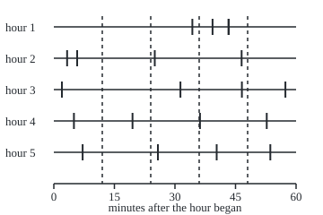
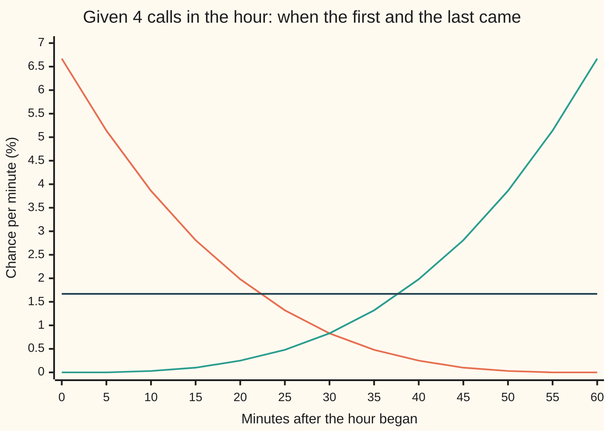
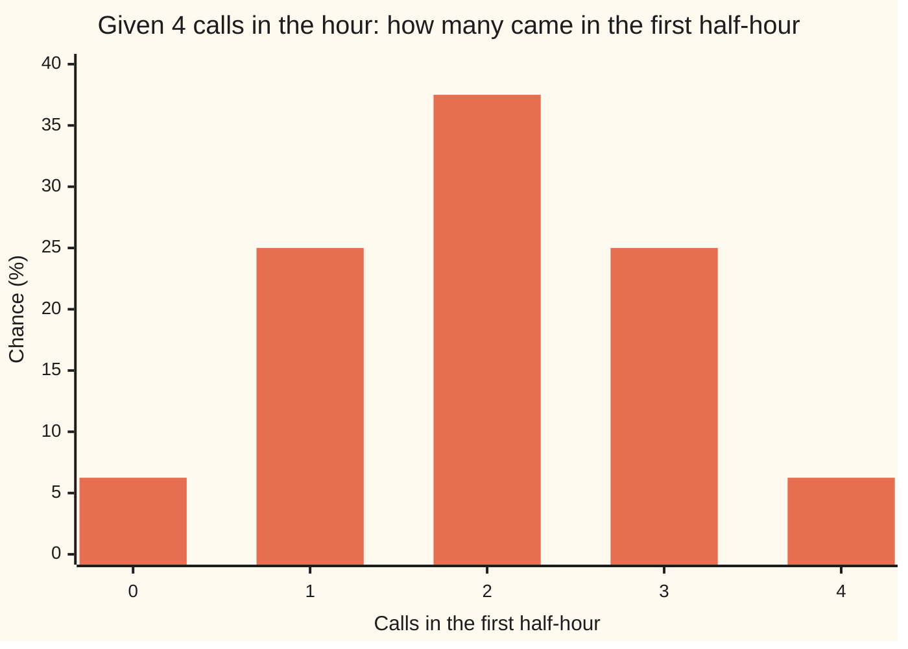

# Given n arrivals, when did they happen: uniform order statistics

[Syllabus](../../../SYLLABUS.md) → [Stochastic processes and calculus](../../../SYLLABUS.md#w11) → [Poisson and Jump Processes](../../../SYLLABUS.md#w11-s04) → Given n arrivals, when did they happen

---

## General Overview

Calls reach a switchboard at random, 4 an hour on average. The log for one hour shows exactly 4 calls, but the times have been lost. When did they most likely come?

The answer does not depend on the rate. Take 4 independent times, each equally likely to fall anywhere in the hour, and sort them from earliest to latest. The 4 calls have exactly the law of those 4 sorted draws. So the first call came on average 12 minutes in, the last 48 minutes in, and the chance that exactly 2 of the 4 came in the first half-hour is 0.375, about 3 in 8.

This does two jobs. It answers questions about a busy hour after the fact. It also gives a second way to simulate the calls: instead of adding up random waiting times one call after another, draw how many calls the hour holds, then scatter that many times uniformly across it and sort them.

**Given that a Poisson process made exactly n arrivals in a window of length t, the arrival times are distributed like n independent uniform draws on the window, sorted into order; the rate drops out.**

**What kind of fact this is:** a theorem, proved on this card in Why it works, with the full proof in a folded callout.

### The picture: five hours that each held 4 calls

<p align="center"></p>

Each row is one simulated hour with exactly 4 calls: the first five such hours from the gap-by-gap simulation in the code, seed 20260929. Each tick is a call, drawn to scale at 4.5 units a minute. The dashed lines mark the average positions, 12, 24, 36 and 48 minutes. In hour 1 two calls came at 43.27 and 43.31 minutes, so their ticks overlap. No row sits on the dashed lines; the average spacing appears only across many hours.

---

## The formula

Notation first, in words. The wing writes $N(t)$ for the number of calls by time $t$, and $\lambda$ for the rate, the average number of calls per unit of time ([Poisson process](01-poisson-process.md)). Time here is in hours, measured from the start of the hour, so the window is $t$ = 1 hour. Write $T_1 < T_2 < \cdots < T_n$ for the times of the first, second, up to the n-th call. Given the event $N(t) = n$, exactly n calls in the window, their joint density at times $s_1 < \cdots < s_n$ is

$$f(s_1, \ldots, s_n \mid N(t) = n) = \frac{n!}{t^n} \quad \text{for } 0 < s_1 < s_2 < \cdots < s_n < t, \text{ and } 0 \text{ otherwise.}$$

**Read it aloud:** every ordered set of n call times inside the window is equally likely, and n! over t to the n is the height that makes the total chance 1. For n = 0 there are no times to place.

Now sort independent uniform draws. Take $U_1, \ldots, U_n$, each uniform on the window, and write $U_{(k)}$ for the k-th smallest, as on [Order statistics](../../09-Probability%20and%20statistics/05-Transformations%20and%20Joint%20Laws/08-order-statistics-and-extremes.md). The theorem says the two lists have the same joint law:

$$\bigl(T_1, \ldots, T_n\bigr) \text{ given } N(t) = n \;\;\overset{d}{=}\;\; \bigl(U_{(1)}, \ldots, U_{(n)}\bigr)$$

**Read it aloud:** given n calls, the call times behave like n uniform draws sorted; the little d over the equals sign means "has the same law as".

Three consequences carry the worked numbers. For $k$ from 1 to n, and a time $s$ inside the window:

$$E\bigl[T_k \mid N(t) = n\bigr] = \frac{k\,t}{n+1}, \qquad P\bigl(T_1 > s \mid N(t) = n\bigr) = \Bigl(1 - \frac{s}{t}\Bigr)^n$$

**Read it aloud:** the n calls split the window into n + 1 gaps that are the same size on average, and the first call comes after s only if all n draws land after s.

For a window from 0 to $a$, a fraction $p$ = a/t of the whole, the number of the n calls that fall in it is binomial:

$$P\bigl(j \text{ of the } n \text{ calls fall before } a \mid N(t) = n\bigr) = \binom{n}{j}\, p^j (1 - p)^{n-j}$$

**Read it aloud:** each of the n uniform draws lands in the window with chance p, independently, and $j$ counts how many do.

| Symbol | Plain meaning | In our example | Push it up and the answer… |
| --- | --- | --- | --- |
| $\lambda$ | the rate: average calls per hour | 4 calls an hour | no change, once the count is known |
| $t$ | the length of the window | 1 hour, 60 minutes | every call time stretches with it |
| $N(t)$ | the number of calls by time t | 4 in the hour | more calls, packed closer |
| $n$ | the count we condition on | 4 | the first call comes sooner: 60/(n + 1) minutes on average |
| $k$ | which call, counted from the earliest | 1 to 4 | a later call |
| $T_k$, $T_1$ | the time of the k-th call; $T_1$ is the first | $T_1$ averages 12 minutes | — |
| $s$, $s_1$ to $s_n$ | possible call times in the window | 15 minutes | — |
| $U_{(k)}$ | the k-th smallest of n uniform draws | $U_{(1)}$ averages 12 minutes | — |
| $a$, $p$ | the end of a sub-window starting at 0, and its share a/t of the window | 30 minutes, 0.5 | more calls fall before a |
| $j$ | the number of the n calls before a | 2 | — |
| $K_1$, $K_2$ | in Step 5: calls before a and after a, count not fixed | Poisson, means 2 and 2 at a = 30 minutes | — |
| $E_i$ | the i-th waiting time between calls, in the proof | averages 15 minutes | — |

### When it holds

- **A constant rate.** If calls come at 2 an hour for the first half-hour and 6 an hour for the second, the 4 calls are no longer uniform: 2 of them fall in the first half-hour with chance 0.2109, not 0.375, and the first call averages 20.20 minutes, not 12.
- **Independent exponential gaps, the Poisson process itself.** If calls are spaced more evenly than that, as when a line is busy for a while after each call, the times are not uniform given the count. That wider family is [Renewal processes](06-renewal-processes-in-outline.md).
- **A window fixed in advance.** If the log is closed at the moment of the 4th call, that call sits at the end by construction. The other 3 are then sorted uniforms before it, but the 4th is not uniform.
- **One call at a time.** If one event can bring several calls at once, the theorem applies to the events, not the calls: given their number, the event times are sorted uniforms, and the calls each brings follow a separate law: [Compound Poisson](04-compound-poisson.md).

---

## Why it works

### Step 0: cut the hour into tiny slots, and the rate cancels

Cut the hour into m equal slots, say 3600 one-second slots. In the discrete picture of a Poisson process, each slot independently holds a call with a small chance, the same for every slot. Now ask about any one particular set of 4 slots holding calls and all the others empty. Its chance is the small chance to the 4th power, times the chance of an empty slot to the power m − 4. That does not depend on which 4 slots were picked. So, given exactly 4 calls, every set of 4 slots is equally likely: the calls sit at 4 slots chosen at random, which is 4 random draws, sorted. The chance per slot cancelled, which is why the rate drops out.

The code counts this exactly for m = 60, 600 and 6000 slots. The mean first-call time comes out at 12.200000, 12.020000 and 12.002000 minutes, an error of 0.200000, 0.020000 and 0.002000: it shrinks tenfold each time the slots shrink tenfold, toward the 12 minutes of the continuous theorem. The steps below prove the continuous version directly.

### Step 1: write down the chance of one precise history

The Poisson process of [Poisson process](01-poisson-process.md) is built from waiting times $E_1, E_2, \ldots$ between calls, independent, each exponential with rate $\lambda$: density $\lambda e^{-\lambda x}$ at a wait of x hours. The k-th call comes at $T_k = E_1 + \cdots + E_k$.

"Calls near $s_1 < s_2 < \cdots < s_n$, and nothing more before t" means: the first wait is near $s_1$, the second near $s_2 - s_1$, and so on, and the wait after the n-th call is longer than $t - s_n$. Multiply the pieces:

$$\lambda e^{-\lambda s_1} \cdot \lambda e^{-\lambda (s_2 - s_1)} \cdots \lambda e^{-\lambda (s_n - s_{n-1})} \cdot e^{-\lambda (t - s_n)} = \lambda^n e^{-\lambda t}$$

The exponents add up to $-\lambda t$ whatever the times were. The density of this history is flat across all ordered times in the window. That flatness is the whole theorem; the rest is bookkeeping.

### Step 2: divide by the chance of the count

Integrating a flat density over the ordered region gives its height times the region's volume. The region $0 < s_1 < \cdots < s_n < t$ has volume $t^n / n!$: the cube of side t splits into n! equal pieces, one for each order of n coordinates. So

$$P\bigl(N(t) = n\bigr) = \lambda^n e^{-\lambda t} \cdot \frac{t^n}{n!} = e^{-\lambda t} \frac{(\lambda t)^n}{n!},$$

the Poisson law, recovered on the way. Conditioning divides the density by this: $\lambda^n e^{-\lambda t}$ over $e^{-\lambda t} (\lambda t)^n / n!$ leaves $n!/t^n$. The rate has cancelled. For the switchboard, n! over t to the n is 24 per hour to the 4th, and the chance of exactly 4 calls was 0.195367, about 1 hour in 5.

### Step 3: sorted uniform draws have the same density

Four independent uniform draws on the hour have joint density 1 per hour to the 4th, flat on the cube. Sorting them folds the cube onto the ordered region. Each ordered point comes from 4! = 24 unsorted points, one for each way to assign the labels. So the sorted draws have density 24 on the ordered region: the same as Step 2. Two random lists with the same joint density have the same law.

The code watches the folding directly. Of the scattered hours that drew 4 times, the fraction already in time order before sorting was 0.043210, standard error 0.001027, against 1/4! = 0.041667.

<details>
<summary>Detailed proof</summary>

Fix $\lambda > 0$, $t > 0$ and $n \ge 1$. Let $E_1, \ldots, E_{n+1}$ be independent exponential waits with rate $\lambda$, and $T_k = E_1 + \cdots + E_k$. The map from $(E_1, \ldots, E_{n+1})$ to $(T_1, \ldots, T_{n+1})$ is linear and triangular with ones on the diagonal, so its Jacobian is 1 and, by the change-of-variables rule for joint densities, $(T_1, \ldots, T_{n+1})$ has density $\lambda^{n+1} e^{-\lambda s_{n+1}}$ on $0 < s_1 < \cdots < s_{n+1}$ and 0 elsewhere.

**The count as an event about the times.** Exactly n calls by time t means the n-th call came by t and the next did not: $\{N(t) = n\} = \{T_n \le t < T_{n+1}\}$.

**The joint chance.** Let S be the ordered region $0 < s_1 < \cdots < s_n < t$ and C any Borel subset of it. Integrating out the last coordinate over $(t, \infty)$,
$$P\bigl((T_1, \ldots, T_n) \in C,\; N(t) = n\bigr) = \int_C \int_t^\infty \lambda^{n+1} e^{-\lambda u}\, du\, ds = \lambda^n e^{-\lambda t}\, \mathrm{Vol}(C).$$
With C = S and $\mathrm{Vol}(S) = t^n/n!$ this is $e^{-\lambda t}(\lambda t)^n/n!$, which is positive, so ordinary conditioning applies, and
$$P\bigl((T_1, \ldots, T_n) \in C \mid N(t) = n\bigr) = \frac{n!}{t^n}\,\mathrm{Vol}(C).$$
For a Borel set D not inside S, intersect with S: under the conditioning the times lie in S almost surely, because $T_n = t$ has chance 0.

**The sorted uniforms.** Let $U_1, \ldots, U_n$ be independent, uniform on $(0, t)$, with density $t^{-n}$ on the cube. Ties have chance 0. The sorted vector lands in C exactly when the unsorted vector lands in one of the n! copies of C obtained by permuting coordinates. These copies are disjoint up to ties, and each permutation preserves volume. So $P\bigl((U_{(1)}, \ldots, U_{(n)}) \in C\bigr) = n!\, t^{-n}\, \mathrm{Vol}(C)$.

**Conclusion.** The two laws agree on every Borel subset of S, and both put all their mass on S, so they are equal. The volume $t^n/n!$ used above follows from the same count: the n! permuted copies of S tile the cube of volume $t^n$ up to a null set.

</details>

### Step 4: read off the averages and the windows

Everything the switchboard asks now reduces to uniform draws.

- **The k-th call.** The k-th smallest of n uniforms averages $k\,t/(n+1)$ ([Order statistics](../../09-Probability%20and%20statistics/05-Transformations%20and%20Joint%20Laws/08-order-statistics-and-extremes.md)). With n = 4 and 60 minutes: 12, 24, 36 and 48 minutes. The last call averages 48 minutes, not 60: the hour does not end on a call.
- **The first call.** It comes after s only if all four draws do: $(1 - s/t)^4$. After 15 minutes that is $(3/4)^4$ = 0.316406.
- **Windows.** Each draw lands in the first half-hour with chance 0.5, so the count there is binomial: 0.062500, 0.250000, 0.375000, 0.250000, 0.062500 for 0 to 4 calls. The two halves' counts are no longer independent: they must add to 4.
- **Gaps.** The 4 calls cut the hour into 5 gaps, counting the one before the first call and the one after the last. All five have the same law, because swapping two gaps moves the ordered times without changing volume, and the density is flat. So the gap from the 2nd call to the 3rd exceeds 20 minutes with chance $(2/3)^4$ = 0.197531, as the first call's wait does.

The code also reaches the averages without uniform draws. $T_k$ is later than s exactly when fewer than k calls came by s, and the counts before and after s are independent Poisson. Integrating that chance over the hour by Simpson's rule gives 12.000000, 24.000000, 36.000000 and 48.000000 minutes. The same counts give the binomial window law, at rate 4 and again at rate 10: identical to six decimals, because the rate cancels.



Orange: the density of the first call's time, given 4 calls, highest at the start of the hour. Green: the last call's, its mirror image. Dark: a single uniform draw, flat at 1.67% a minute. The first call is not "a call at a uniform time": it is the earliest of four, so it crowds toward the start.

### Step 5: two ways to simulate the switchboard

The theorem gives a second recipe for the same process.

- **Recipe A, gap by gap.** Draw an exponential wait, place a call, draw the next wait, and stop when the hour is over.
- **Recipe B, count then scatter.** Draw the number of calls from the Poisson law with mean 4. Then draw that many uniform times in the hour and sort them.

Recipe B produces a Poisson process, not only the right conditional law. Split the hour at a, a fraction p of the way through, and write $K_1$, $K_2$ for the calls before and after. Given n calls in all, $K_1$ is binomial. Averaging over the Poisson count,

$$P(K_1 = k_1, K_2 = k_2) = e^{-\lambda t}\frac{(\lambda t)^{k_1 + k_2}}{(k_1 + k_2)!}\binom{k_1 + k_2}{k_1} p^{k_1}(1-p)^{k_2} = e^{-\lambda t p}\frac{(\lambda t p)^{k_1}}{k_1!}\cdot e^{-\lambda t (1-p)}\frac{(\lambda t (1-p))^{k_2}}{k_2!}$$

The right side factors: the two counts are independent Poisson, with means proportional to the lengths. With more split points the binomial becomes a multinomial, the chance of a given share-out of the calls among several windows, and the same algebra factorises into one independent Poisson count per window. That is the defining property, and the same algebra drives [Splitting and merging](03-splitting-and-superposition.md).

The code runs both recipes for 200000 hours each from one SplitMix64 stream, seed 20260929:

| Statistic | Recipe A, gaps | Recipe B, scatter | Formula |
| --- | --- | --- | --- |
| exactly 4 calls in the hour | 0.194390 ± 0.000885 | 0.196135 ± 0.000888 | 0.195367 |
| no call in the first 15 minutes | 0.368245 ± 0.001079 | 0.367075 ± 0.001078 | 0.367879 |
| exactly 2 calls in the first half-hour | 0.269620 ± 0.000992 | 0.271350 ± 0.000994 | 0.270671 |

Each ± is one standard error. Every simulated number is within two of them of the formula. Recipe A is the real test of the theorem, since it never draws a uniform time: among its 38878 hours with exactly 4 calls, the calls averaged 12.023, 24.067, 36.072 and 48.016 minutes, with standard errors 0.050, 0.061, 0.061 and 0.050, and 2 of the 4 fell in the first half-hour in a share 0.375251, standard error 0.002456.

Recipe B suits a window fixed in advance. Recipe A suits a simulation that runs forward and reacts to each call as it arrives.

---

## Worked numbers, by hand

Switchboard: 4 calls an hour; the log shows exactly 4 calls in one hour.

| Step | Arithmetic | Value |
| --- | --- | --- |
| height of the joint density | 4! / 1^4 | 24 per hour^4 |
| one call in each quarter-hour | 4! × (1/4)^4 = 24/256 | 0.093750 |
| mean time of the first call | 1 × 60 / (4 + 1) | 12 minutes |
| mean time of the last call | 4 × 60 / (4 + 1) | 48 minutes |
| first quarter-hour empty | (1 − 15/60)^4 = (3/4)^4 | 0.316406 |
| gap from call 2 to call 3 over 20 minutes | (1 − 20/60)^4 = (2/3)^4 | 0.197531 |
| **exactly 2 of the 4 in the first half-hour** | C(4, 2) × (1/2)^4 = 6/16 | **0.375000** |

In about 3 of every 8 such hours, the calls split evenly between the two halves. In about 1 hour in 16 all four came in the first half-hour, and in the same share all four came in the second.

In the quarter-hour row, the 24 counts the orders in which four labelled draws can fill the four quarters. The count-based road gets the same 0.093750 from four independent Poisson counts with mean 1.



Bars: the binomial law with 4 draws and chance 0.5, in percent. The counts-based road, at rate 4 and at rate 10, prints the same five values.

### What breaks if you drop a piece

| Mistake | Comes out at | What went wrong |
| --- | --- | --- |
| Treat the first call as one uniform draw: chance it comes after 15 minutes | 0.750000 (right: 0.316406) | The first call is the earliest of four, not any one of them |
| Rate rising from 2 to 6 an hour, times read as uniform: 2 of 4 in the first half | 0.375000 (right: 0.210938) | Given 4 calls, each lands in the first half with chance 1/4, the first half's share of the expected calls |
| Same rising rate: mean first call | 12 minutes (right: 20.203125) | A thin first half-hour pushes every call later |
| Density 1 per hour^4 on the ordered times, forgetting n! | total chance 1/24 = 0.041667 | Only one ordering in 24 of four unsorted draws is already in time order |

The rising-rate numbers come by two roads in the code: Poisson counts with means 1 and 3 in the two halves, and a binomial with chance 1/4; the mean first call by Simpson's rule on the count-based survival chance, and by the closed form. The general rule for a varying rate: given n calls, the times are sorted independent draws whose density is proportional to the rate. A varying rate can be simulated by [Lewis and Shedler's](https://doi.org/10.1002/nav.3800260304) thinning: draw at the peak rate, then keep each call with chance rate now / peak rate.

---

## Code, from first principles, and it actually runs

Four roads. Road 1 is the formula: sorted uniform draws, with their means, window law and densities. Road 2 uses only Poisson counts in disjoint stretches, and integrates the chance that the k-th call is still to come with Simpson's rule written out; it never mentions a uniform draw. Road 3 cuts the hour into 60, 600 and 6000 slots and counts exactly, printing an error that shrinks with the slot size. Road 4 simulates 200000 hours by each recipe with a SplitMix64 generator written out, seed 20260929, and prints every simulated number with its standard error. The asserts test the count-based means and window law against the uniform formula at two rates, the quarter-hour chance against n! times a volume, the shrinking slot error, both recipes against the three formulas within four standard errors, the ordered fraction against 1/4!, and the rising-rate case by two roads.

### Python

```python
# Arrival times given the count -- the check behind the card.  Standard library only.
# Calls reach a switchboard at 4 an hour.  Exactly 4 calls came in one hour: when did they come?
# Road 1: the formula, 4 uniform draws sorted.  Road 2: Poisson counts with independent increments,
# integrated by Simpson's rule written out.  Road 3: the hour cut into m slots, counted exactly.
# Road 4: two seeded simulations (SplitMix64, written out): exponential gaps, and a count scattered.
from math import comb, exp, factorial, log, sqrt

LAM, T, N, H = 4.0, 1.0, 4, 200000       # calls per hour, one hour, calls seen, simulated hours
def pois(mu, j): return exp(-mu) * mu ** j / factorial(j)
def simpson(f, a, b, m=600):
    h = (b - a) / m
    return h / 3 * sum((1 if i in (0, m) else 4 if i % 2 else 2) * f(a + i * h) for i in range(m + 1))
def surv_inc(k, s):                      # road 2: P(T_k > s | N(1) = 4) = P(fewer than k calls by s | 4 in all)
    return sum(pois(LAM * s, j) * pois(LAM * (T - s), N - j) for j in range(k)) / pois(LAM * T, N)
def window_inc(j, a, lam):               # road 2: P(j of the 4 calls come before time a | N(1) = 4), rate lam
    return pois(lam * a, j) * pois(lam * (T - a), N - j) / pois(lam * T, N)
def dens(k, s, n=N):                     # road 1: density of T_k given n calls, per hour
    return factorial(n) / (factorial(k - 1) * factorial(n - k)) * (s / T) ** (k - 1) * (1 - s / T) ** (n - k) / T

MASK, state = (1 << 64) - 1, 20260929
def unif():                              # SplitMix64, top 53 bits, never exactly 0 or 1
    global state
    state = (state + 0x9E3779B97F4A7C15) & MASK
    z = state
    z = ((z ^ (z >> 30)) * 0xBF58476D1CE4E5B9) & MASK
    z = ((z ^ (z >> 27)) * 0x94D049BB133111EB) & MASK
    return (((z ^ (z >> 31)) >> 11) + 0.5) / 2 ** 53
def hour_by_gaps():                      # recipe A: add exponential gaps until the hour is over
    ts, s = [], -log(unif()) / LAM
    while s <= T: ts.append(s); s -= log(unif()) / LAM
    return ts, False
def hour_by_scatter():                   # recipe B: draw the count, then scatter that many uniform times
    u, n, p = unif(), 0, exp(-LAM * T); c = p
    while u > c: n += 1; p *= LAM * T / n; c += p
    raw = [T * unif() for _ in range(n)]
    return sorted(raw), raw == sorted(raw)

print(f"{'density of (T_1..T_4) given 4 calls, 4!/1^4, per hour^4':<58}{factorial(N) / T ** N:>10.6f}")
print(f"{'chance of exactly 4 calls in the hour, e^-4 4^4 / 4!':<58}{pois(LAM * T, N):>10.6f}")
print("mean time of call k given 4 calls, minutes   k   k 60/5     from counts")
mean_inc = [60 * simpson(lambda s: surv_inc(k, s), 0, T) for k in range(1, N + 1)]
for k in range(1, N + 1): print(f"{'':<45}{k}{60 * k / (N + 1):>11.6f}{mean_inc[k - 1]:>14.6f}")
print("calls in the first half-hour, given 4       j   C(4,j)/16  counts, rate 4  counts, rate 10")
for j in range(N + 1):
    print(f"{'':<45}{j}{comb(N, j) / 2 ** N:>11.6f}{window_inc(j, 0.5, 4.0):>14.6f}{window_inc(j, 0.5, 10.0):>15.6f}")
quarters = pois(LAM / 4, 1) ** 4 / pois(LAM, N)
print(f"one call in each quarter-hour: 4! (1/4)^4 = {factorial(N) / 4 ** N:.6f}; from counts {quarters:.6f}")
print(f"first quarter-hour empty, given 4: (3/4)^4 = {0.75 ** N:.6f}; read as one uniform draw {0.75:.6f}")
print("slots m   mean first call, min   error      P(2 of 4 in first half)   error")
slots = []
for m in (60, 600, 6000):
    e1 = 60 * sum(j * comb(m - j, N - 1) for j in range(1, m + 1)) / comb(m, N) / m
    h2 = comb(m // 2, 2) ** 2 / comb(m, N)
    slots.append(e1 - 12); print(f"{m:>7}{e1:>18.6f}{e1 - 12:>13.6f}{h2:>20.6f}{h2 - 0.375:>16.6f}")

stats = {}
for name, recipe in (("gaps", hour_by_gaps), ("scatter", hour_by_scatter)):
    four = empty15 = half2 = inorder = two_first = gap20 = 0; s1 = [0.0] * N; s2 = [0.0] * N; fig = []
    for _ in range(H):
        ts, ordered = recipe()
        four += len(ts) == N; empty15 += not ts or ts[0] > 0.25; half2 += sum(t <= 0.5 for t in ts) == 2
        if len(ts) == N:
            inorder += ordered; two_first += sum(t <= 0.5 for t in ts) == 2; gap20 += ts[2] - ts[1] > 1 / 3
            for k in range(N): s1[k] += 60 * ts[k]; s2[k] += (60 * ts[k]) ** 2
            if len(fig) < 5: fig.append(ts)
    stats[name] = (four, empty15, half2, inorder, two_first, gap20, s1, s2, fig)
se = lambda p, n: sqrt(p * (1 - p) / n)
print(f"simulation, {H} hours each   P(N(1) = 4)    se        P(none by 15 min)  se        P(N(1/2) = 2)  se")
for name in ("gaps", "scatter"):
    f, e, h = (x / H for x in stats[name][:3])
    print(f"  {name:<27}{f:>9.6f}{se(f, H):>10.6f}{e:>15.6f}{se(e, H):>10.6f}{h:>15.6f}{se(h, H):>10.6f}")
print(f"  {'formula':<27}{pois(LAM, N):>9.6f}{'':>10}{exp(-LAM / 4):>15.6f}{'':>10}{pois(LAM / 2, 2):>15.6f}")
four, _, _, _, two_first, gap20, s1, s2, fig = stats["gaps"]
means = [s / four for s in s1]; ses = [sqrt((q / four - mu ** 2) / four) for q, mu in zip(s2, means)]
print(f"gaps, hours with 4 calls: {four}; mean T_1..T_4, minutes " + " ".join(f"{mu:.3f}" for mu in means))
print("  standard errors                                  " + " ".join(f"{x:.3f}" for x in ses))
p2 = two_first / four; pg = gap20 / four
print(f"gaps, given 4: P(2 in first half) {p2:.6f} se {se(p2, four):.6f}; P(gap 2 to 3 > 20 min) {pg:.6f} se {se(pg, four):.6f}")
four_b, inorder = stats["scatter"][0], stats["scatter"][3]
po = inorder / four_b
print(f"scatter, given 4: draws already in time order {po:.6f} se {se(po, four_b):.6f}; 1/4! = {1 / 24:.6f}")
big_l = lambda s: 2 * s if s <= 0.5 else 1 + 6 * (s - 0.5)      # rising rate: 2 an hour, then 6 an hour
rise_counts = pois(1.0, 2) * pois(3.0, 2) / pois(4.0, 4)
rise_e1 = 60 * simpson(lambda s: pois(big_l(s), 0) * pois(4 - big_l(s), 4) / pois(4.0, 4), 0, T)
rise_closed = 60 * (0.4 * (1 - 0.75 ** 5) + 0.75 ** 5 / 7.5)
print(f"rising rate, given 4: P(2 in first half) from counts {rise_counts:.6f}; binomial, p = 1/4 {comb(4, 2) / 16 * 9 / 16:.6f}")
print(f"rising rate, given 4: mean first call, minutes: Simpson {rise_e1:.6f}; closed form {rise_closed:.6f}")
grid = [5 * i for i in range(13)]
print("chart, minute          " + " ".join(f"{g:>5d}" for g in grid))
for k in (1, 4):
    print(f"chart, T_{k} %/min       " + " ".join(f"{100 * dens(k, g / 60) / 60:5.2f}" for g in grid))
print("chart, one call %/min   " + " ".join(f"{100 * dens(1, g / 60, 1) / 60:5.2f}" for g in grid))
print("chart, first half j %   " + " ".join(f"{100 * comb(N, j) / 16:5.2f}" for j in range(N + 1)))
for i, ts in enumerate(fig):             # the first five simulated hours with exactly 4 calls; svg x = 60 + 4.5 m
    print(f"figure, hour {i + 1}, minutes " + " ".join(f"{60 * t:5.2f}" for t in ts) + ";  x " + " ".join(f"{60 + 270 * t:5.1f}" for t in ts))
print(f"try: 8 calls, mean first call {60 / 9:.6f} min; first quarter empty {0.75 ** 8:.6f}; gap 2 to 3 > 20 min, 4 calls {(2 / 3) ** 4:.6f}")

assert all(abs(mean_inc[k - 1] - 60 * k / (N + 1)) < 1e-6 for k in range(1, N + 1)), "means: counts vs sorted uniforms"
assert all(abs(window_inc(j, 0.5, lam) - comb(N, j) / 16) < 1e-12 for j in range(N + 1) for lam in (4.0, 10.0)), "binomial"
assert abs(quarters - factorial(N) / 4 ** N) < 1e-12, "one call per quarter: counts vs n! times the volume"
assert slots[0] > slots[1] > slots[2] > 0 and abs(slots[2]) < 0.003, "slot error shrinks as the slots shrink"
assert abs(means[0] - 12) < 4 * ses[0] and abs(means[3] - 48) < 4 * ses[3], "gap recipe: mean first and last call"
assert abs(p2 - 0.375) < 4 * se(0.375, four) and abs(pg - (2 / 3) ** 4) < 4 * se(pg, four), "gap recipe, given 4"
for name in ("gaps", "scatter"):
    assert abs(stats[name][0] / H - pois(LAM, N)) < 4 * se(pois(LAM, N), H), "P(N = 4), simulated vs formula"
    assert abs(stats[name][1] / H - exp(-LAM / 4)) < 4 * se(exp(-LAM / 4), H), "no call in 15 minutes, simulated vs e^-1"
    assert abs(stats[name][2] / H - pois(LAM / 2, 2)) < 4 * se(pois(LAM / 2, 2), H), "2 calls in the first half-hour"
assert abs(po - 1 / 24) < 4 * se(1 / 24, four_b), "unsorted draws already in order 1 time in 4!"
assert abs(rise_counts - 54 / 256) < 1e-12 and abs(rise_e1 - rise_closed) < 1e-6, "rising rate, two roads"
print("ALL CHECKS PASS")
```

**Ran 2026-10-07 on macOS, Python 3.14.6, standard library only. All checks passed. Output, pasted from the run:**

```
density of (T_1..T_4) given 4 calls, 4!/1^4, per hour^4    24.000000
chance of exactly 4 calls in the hour, e^-4 4^4 / 4!        0.195367
mean time of call k given 4 calls, minutes   k   k 60/5     from counts
                                             1  12.000000     12.000000
                                             2  24.000000     24.000000
                                             3  36.000000     36.000000
                                             4  48.000000     48.000000
calls in the first half-hour, given 4       j   C(4,j)/16  counts, rate 4  counts, rate 10
                                             0   0.062500      0.062500       0.062500
                                             1   0.250000      0.250000       0.250000
                                             2   0.375000      0.375000       0.375000
                                             3   0.250000      0.250000       0.250000
                                             4   0.062500      0.062500       0.062500
one call in each quarter-hour: 4! (1/4)^4 = 0.093750; from counts 0.093750
first quarter-hour empty, given 4: (3/4)^4 = 0.316406; read as one uniform draw 0.750000
slots m   mean first call, min   error      P(2 of 4 in first half)   error
     60         12.200000     0.200000            0.388046        0.013046
    600         12.020000     0.020000            0.376255        0.001255
   6000         12.002000     0.002000            0.375125        0.000125
simulation, 200000 hours each   P(N(1) = 4)    se        P(none by 15 min)  se        P(N(1/2) = 2)  se
  gaps                        0.194390  0.000885       0.368245  0.001079       0.269620  0.000992
  scatter                     0.196135  0.000888       0.367075  0.001078       0.271350  0.000994
  formula                     0.195367                 0.367879                 0.270671
gaps, hours with 4 calls: 38878; mean T_1..T_4, minutes 12.023 24.067 36.072 48.016
  standard errors                                  0.050 0.061 0.061 0.050
gaps, given 4: P(2 in first half) 0.375251 se 0.002456; P(gap 2 to 3 > 20 min) 0.198081 se 0.002021
scatter, given 4: draws already in time order 0.043210 se 0.001027; 1/4! = 0.041667
rising rate, given 4: P(2 in first half) from counts 0.210938; binomial, p = 1/4 0.210938
rising rate, given 4: mean first call, minutes: Simpson 20.203125; closed form 20.203125
chart, minute              0     5    10    15    20    25    30    35    40    45    50    55    60
chart, T_1 %/min        6.67  5.14  3.86  2.81  1.98  1.32  0.83  0.48  0.25  0.10  0.03  0.00  0.00
chart, T_4 %/min        0.00  0.00  0.03  0.10  0.25  0.48  0.83  1.32  1.98  2.81  3.86  5.14  6.67
chart, one call %/min    1.67  1.67  1.67  1.67  1.67  1.67  1.67  1.67  1.67  1.67  1.67  1.67  1.67
chart, first half j %    6.25 25.00 37.50 25.00  6.25
figure, hour 1, minutes 34.32 39.32 43.27 43.31;  x 214.4 236.9 254.7 254.9
figure, hour 2, minutes  3.28  5.79 25.00 46.51;  x  74.8  86.0 172.5 269.3
figure, hour 3, minutes  2.00 31.35 46.58 57.36;  x  69.0 201.1 269.6 318.1
figure, hour 4, minutes  4.97 19.50 36.21 52.73;  x  82.4 147.7 222.9 297.3
figure, hour 5, minutes  7.13 25.77 40.34 53.62;  x  92.1 176.0 241.5 301.3
try: 8 calls, mean first call 6.666667 min; first quarter empty 0.100113; gap 2 to 3 > 20 min, 4 calls 0.197531
ALL CHECKS PASS
```

### Rust

```rust
// Arrival times given the count -- the same check as arrival_times_and_order_statistics_check.py.
// Standard library only, no crates.  Calls reach a switchboard at 4 an hour; exactly 4 came in one hour.
// Road 1: the formula, 4 uniform draws sorted.  Road 2: Poisson counts with independent increments,
// integrated by Simpson's rule.  Road 3: the hour cut into m slots, counted exactly.
// Road 4: two seeded SplitMix64 simulations: exponential gaps, and a Poisson count scattered uniformly.
const LAM: f64 = 4.0;
const T: f64 = 1.0;
const N: usize = 4;
const H: usize = 200000;

fn fact(n: usize) -> f64 { (1..=n).fold(1.0, |a, i| a * i as f64) }
fn comb(n: usize, k: usize) -> u128 {
    if k > n { return 0; }
    let mut c = 1u128;
    for i in 0..k { c = c * (n - i) as u128 / (i + 1) as u128; }
    c
}
fn pois(mu: f64, j: usize) -> f64 { (-mu).exp() * mu.powf(j as f64) / fact(j) }
fn simpson<F: Fn(f64) -> f64>(f: F, a: f64, b: f64) -> f64 {
    let m = 600;
    let h = (b - a) / m as f64;
    h / 3.0 * (0..=m).fold(0.0, |s, i| s + (if i == 0 || i == m { 1.0 } else if i % 2 == 1 { 4.0 } else { 2.0 }) * f(a + i as f64 * h))
}
fn surv_inc(k: usize, s: f64) -> f64 {           // road 2: P(T_k > s | N(1) = 4)
    (0..k).fold(0.0, |a, j| a + pois(LAM * s, j) * pois(LAM * (T - s), N - j)) / pois(LAM * T, N)
}
fn window_inc(j: usize, a: f64, lam: f64) -> f64 { pois(lam * a, j) * pois(lam * (T - a), N - j) / pois(lam * T, N) }
fn dens(k: usize, s: f64, n: usize) -> f64 {     // road 1: density of T_k given n calls, per hour
    fact(n) / (fact(k - 1) * fact(n - k)) * (s / T).powf((k - 1) as f64) * (1.0 - s / T).powf((n - k) as f64) / T
}
struct Rng(u64);
impl Rng {
    fn unif(&mut self) -> f64 {                   // SplitMix64, top 53 bits, never exactly 0 or 1
        self.0 = self.0.wrapping_add(0x9E3779B97F4A7C15);
        let mut z = self.0;
        z = (z ^ (z >> 30)).wrapping_mul(0xBF58476D1CE4E5B9);
        z = (z ^ (z >> 27)).wrapping_mul(0x94D049BB133111EB);
        (((z ^ (z >> 31)) >> 11) as f64 + 0.5) / 2f64.powi(53)
    }
}
fn hour_by_gaps(r: &mut Rng) -> (Vec<f64>, bool) {
    let mut ts = vec![];
    let mut s = -r.unif().ln() / LAM;
    while s <= T { ts.push(s); s -= r.unif().ln() / LAM; }
    (ts, false)
}
fn hour_by_scatter(r: &mut Rng) -> (Vec<f64>, bool) {
    let (u, mut n, mut p) = (r.unif(), 0usize, (-LAM * T).exp());
    let mut c = p;
    while u > c { n += 1; p *= LAM * T / n as f64; c += p; }
    let raw: Vec<f64> = (0..n).map(|_| T * r.unif()).collect();
    let mut sorted = raw.clone();
    sorted.sort_by(|a, b| a.partial_cmp(b).unwrap());
    let ordered = raw == sorted;
    (sorted, ordered)
}
fn se(p: f64, n: usize) -> f64 { (p * (1.0 - p) / n as f64).sqrt() }
fn join<T, F: Fn(T) -> String>(it: impl Iterator<Item = T>, f: F) -> String { it.map(f).collect::<Vec<_>>().join(" ") }

fn main() {
    println!("{:<58}{:>10.6}", "density of (T_1..T_4) given 4 calls, 4!/1^4, per hour^4", fact(N) / T.powf(N as f64));
    println!("{:<58}{:>10.6}", "chance of exactly 4 calls in the hour, e^-4 4^4 / 4!", pois(LAM * T, N));
    println!("mean time of call k given 4 calls, minutes   k   k 60/5     from counts");
    let mean_inc: Vec<f64> = (1..=N).map(|k| 60.0 * simpson(|s| surv_inc(k, s), 0.0, T)).collect();
    for k in 1..=N { println!("{:<45}{}{:>11.6}{:>14.6}", "", k, 60.0 * k as f64 / (N + 1) as f64, mean_inc[k - 1]); }
    println!("calls in the first half-hour, given 4       j   C(4,j)/16  counts, rate 4  counts, rate 10");
    for j in 0..=N {
        println!("{:<45}{}{:>11.6}{:>14.6}{:>15.6}", "", j, comb(N, j) as f64 / 16.0, window_inc(j, 0.5, 4.0), window_inc(j, 0.5, 10.0));
    }
    let quarters = pois(LAM / 4.0, 1).powf(4.0) / pois(LAM, N);
    println!("one call in each quarter-hour: 4! (1/4)^4 = {:.6}; from counts {:.6}", fact(N) / 256.0, quarters);
    println!("first quarter-hour empty, given 4: (3/4)^4 = {:.6}; read as one uniform draw {:.6}", 0.75f64.powf(4.0), 0.75);
    println!("slots m   mean first call, min   error      P(2 of 4 in first half)   error");
    let mut slots = vec![];
    for m in [60usize, 600, 6000] {
        let num: u128 = (1..=m).map(|j| j as u128 * comb(m - j, N - 1)).sum();
        let e1 = (60 * num) as f64 / comb(m, N) as f64 / m as f64;
        let h2 = (comb(m / 2, 2) * comb(m / 2, 2)) as f64 / comb(m, N) as f64;
        slots.push(e1 - 12.0);
        println!("{:>7}{:>18.6}{:>13.6}{:>20.6}{:>16.6}", m, e1, e1 - 12.0, h2, h2 - 0.375);
    }

    let mut rng = Rng(20260929);
    let mut stats = vec![];
    for name in ["gaps", "scatter"] {
        let (mut four, mut empty15, mut half2, mut inorder, mut two_first, mut gap20) = (0usize, 0usize, 0usize, 0usize, 0usize, 0usize);
        let (mut s1, mut s2, mut fig) = (vec![0.0f64; N], vec![0.0f64; N], vec![]);
        for _ in 0..H {
            let (ts, ordered) = if name == "gaps" { hour_by_gaps(&mut rng) } else { hour_by_scatter(&mut rng) };
            let firsthalf = ts.iter().filter(|&&t| t <= 0.5).count();
            four += (ts.len() == N) as usize; empty15 += (ts.is_empty() || ts[0] > 0.25) as usize; half2 += (firsthalf == 2) as usize;
            if ts.len() == N {
                inorder += ordered as usize; two_first += (firsthalf == 2) as usize; gap20 += (ts[2] - ts[1] > 1.0 / 3.0) as usize;
                for k in 0..N { s1[k] += 60.0 * ts[k]; s2[k] += (60.0 * ts[k]).powf(2.0); }
                if fig.len() < 5 { fig.push(ts.clone()); }
            }
        }
        stats.push((four, empty15, half2, inorder, two_first, gap20, s1, s2, fig));
    }
    println!("simulation, {} hours each   P(N(1) = 4)    se        P(none by 15 min)  se        P(N(1/2) = 2)  se", H);
    for (i, name) in ["gaps", "scatter"].iter().enumerate() {
        let (f, e, h) = (stats[i].0 as f64 / H as f64, stats[i].1 as f64 / H as f64, stats[i].2 as f64 / H as f64);
        println!("  {:<27}{:>9.6}{:>10.6}{:>15.6}{:>10.6}{:>15.6}{:>10.6}", name, f, se(f, H), e, se(e, H), h, se(h, H));
    }
    println!("  {:<27}{:>9.6}{:>10}{:>15.6}{:>10}{:>15.6}", "formula", pois(LAM, N), "", (-LAM / 4.0).exp(), "", pois(LAM / 2.0, 2));
    let (four, two_first, gap20) = (stats[0].0, stats[0].4, stats[0].5);
    let means: Vec<f64> = stats[0].6.iter().map(|s| s / four as f64).collect();
    let ses: Vec<f64> = stats[0].7.iter().zip(&means).map(|(q, mu)| ((q / four as f64 - mu.powf(2.0)) / four as f64).sqrt()).collect();
    println!("gaps, hours with 4 calls: {}; mean T_1..T_4, minutes {}", four, join(means.iter(), |m| format!("{:.3}", m)));
    println!("  standard errors                                  {}", join(ses.iter(), |x| format!("{:.3}", x)));
    let (p2, pg) = (two_first as f64 / four as f64, gap20 as f64 / four as f64);
    println!("gaps, given 4: P(2 in first half) {:.6} se {:.6}; P(gap 2 to 3 > 20 min) {:.6} se {:.6}", p2, se(p2, four), pg, se(pg, four));
    let (four_b, inorder) = (stats[1].0, stats[1].3);
    let po = inorder as f64 / four_b as f64;
    println!("scatter, given 4: draws already in time order {:.6} se {:.6}; 1/4! = {:.6}", po, se(po, four_b), 1.0 / 24.0);
    let big_l = |s: f64| if s <= 0.5 { 2.0 * s } else { 1.0 + 6.0 * (s - 0.5) };   // rising rate: 2 an hour, then 6
    let rise_counts = pois(1.0, 2) * pois(3.0, 2) / pois(4.0, 4);
    let rise_e1 = 60.0 * simpson(|s| pois(big_l(s), 0) * pois(4.0 - big_l(s), 4) / pois(4.0, 4), 0.0, T);
    let rise_closed = 60.0 * (0.4 * (1.0 - 0.75f64.powf(5.0)) + 0.75f64.powf(5.0) / 7.5);
    println!("rising rate, given 4: P(2 in first half) from counts {:.6}; binomial, p = 1/4 {:.6}", rise_counts, 6.0 / 16.0 * 9.0 / 16.0);
    println!("rising rate, given 4: mean first call, minutes: Simpson {:.6}; closed form {:.6}", rise_e1, rise_closed);
    let grid: Vec<f64> = (0..13).map(|i| 5.0 * i as f64).collect();
    println!("chart, minute          {}", join(grid.iter(), |g| format!("{:>5}", *g as i64)));
    for k in [1usize, 4] {
        println!("chart, T_{} %/min       {}", k, join(grid.iter(), |g| format!("{:5.2}", 100.0 * dens(k, g / 60.0, N) / 60.0)));
    }
    println!("chart, one call %/min   {}", join(grid.iter(), |g| format!("{:5.2}", 100.0 * dens(1, g / 60.0, 1) / 60.0)));
    println!("chart, first half j %   {}", join(0..=N, |j| format!("{:5.2}", 100.0 * comb(N, j) as f64 / 16.0)));
    for (i, ts) in stats[0].8.iter().enumerate() {   // the first five simulated hours with exactly 4 calls; svg x = 60 + 4.5 m
        println!("figure, hour {}, minutes {};  x {}", i + 1, join(ts.iter(), |t| format!("{:5.2}", 60.0 * t)), join(ts.iter(), |t| format!("{:5.1}", 60.0 + 270.0 * t)));
    }
    println!("try: 8 calls, mean first call {:.6} min; first quarter empty {:.6}; gap 2 to 3 > 20 min, 4 calls {:.6}",
             60.0 / 9.0, 0.75f64.powf(8.0), (2.0f64 / 3.0).powf(4.0));

    assert!((1..=N).all(|k| (mean_inc[k - 1] - 60.0 * k as f64 / (N + 1) as f64).abs() < 1e-6), "means: counts vs sorted uniforms");
    assert!((0..=N).all(|j| [4.0, 10.0].iter().all(|&l| (window_inc(j, 0.5, l) - comb(N, j) as f64 / 16.0).abs() < 1e-12)), "binomial");
    assert!((quarters - fact(N) / 256.0).abs() < 1e-12, "one call per quarter: counts vs n! times the volume");
    assert!(slots[0] > slots[1] && slots[1] > slots[2] && slots[2] > 0.0 && slots[2].abs() < 0.003, "slot error shrinks");
    assert!((means[0] - 12.0).abs() < 4.0 * ses[0] && (means[3] - 48.0).abs() < 4.0 * ses[3], "gap recipe: mean first and last call");
    assert!((p2 - 0.375).abs() < 4.0 * se(0.375, four) && (pg - (2.0f64 / 3.0).powf(4.0)).abs() < 4.0 * se(pg, four), "gap recipe, given 4");
    for s in &stats {
        assert!((s.0 as f64 / H as f64 - pois(LAM, N)).abs() < 4.0 * se(pois(LAM, N), H), "P(N = 4), simulated vs formula");
        assert!((s.1 as f64 / H as f64 - (-LAM / 4.0).exp()).abs() < 4.0 * se((-LAM / 4.0).exp(), H), "no call in 15 minutes vs e^-1");
        assert!((s.2 as f64 / H as f64 - pois(LAM / 2.0, 2)).abs() < 4.0 * se(pois(LAM / 2.0, 2), H), "2 calls in the first half-hour");
    }
    assert!((po - 1.0 / 24.0).abs() < 4.0 * se(1.0 / 24.0, four_b), "unsorted draws already in order 1 time in 4!");
    assert!((rise_counts - 54.0 / 256.0).abs() < 1e-12 && (rise_e1 - rise_closed).abs() < 1e-6, "rising rate, two roads");
    println!("ALL CHECKS PASS");
}
```

**Ran 2026-10-07 on macOS, rustc 1.98.1, no crates. All checks passed. Output, pasted from the run:**

```
density of (T_1..T_4) given 4 calls, 4!/1^4, per hour^4    24.000000
chance of exactly 4 calls in the hour, e^-4 4^4 / 4!        0.195367
mean time of call k given 4 calls, minutes   k   k 60/5     from counts
                                             1  12.000000     12.000000
                                             2  24.000000     24.000000
                                             3  36.000000     36.000000
                                             4  48.000000     48.000000
calls in the first half-hour, given 4       j   C(4,j)/16  counts, rate 4  counts, rate 10
                                             0   0.062500      0.062500       0.062500
                                             1   0.250000      0.250000       0.250000
                                             2   0.375000      0.375000       0.375000
                                             3   0.250000      0.250000       0.250000
                                             4   0.062500      0.062500       0.062500
one call in each quarter-hour: 4! (1/4)^4 = 0.093750; from counts 0.093750
first quarter-hour empty, given 4: (3/4)^4 = 0.316406; read as one uniform draw 0.750000
slots m   mean first call, min   error      P(2 of 4 in first half)   error
     60         12.200000     0.200000            0.388046        0.013046
    600         12.020000     0.020000            0.376255        0.001255
   6000         12.002000     0.002000            0.375125        0.000125
simulation, 200000 hours each   P(N(1) = 4)    se        P(none by 15 min)  se        P(N(1/2) = 2)  se
  gaps                        0.194390  0.000885       0.368245  0.001079       0.269620  0.000992
  scatter                     0.196135  0.000888       0.367075  0.001078       0.271350  0.000994
  formula                     0.195367                 0.367879                 0.270671
gaps, hours with 4 calls: 38878; mean T_1..T_4, minutes 12.023 24.067 36.072 48.016
  standard errors                                  0.050 0.061 0.061 0.050
gaps, given 4: P(2 in first half) 0.375251 se 0.002456; P(gap 2 to 3 > 20 min) 0.198081 se 0.002021
scatter, given 4: draws already in time order 0.043210 se 0.001027; 1/4! = 0.041667
rising rate, given 4: P(2 in first half) from counts 0.210938; binomial, p = 1/4 0.210938
rising rate, given 4: mean first call, minutes: Simpson 20.203125; closed form 20.203125
chart, minute              0     5    10    15    20    25    30    35    40    45    50    55    60
chart, T_1 %/min        6.67  5.14  3.86  2.81  1.98  1.32  0.83  0.48  0.25  0.10  0.03  0.00  0.00
chart, T_4 %/min        0.00  0.00  0.03  0.10  0.25  0.48  0.83  1.32  1.98  2.81  3.86  5.14  6.67
chart, one call %/min    1.67  1.67  1.67  1.67  1.67  1.67  1.67  1.67  1.67  1.67  1.67  1.67  1.67
chart, first half j %    6.25 25.00 37.50 25.00  6.25
figure, hour 1, minutes 34.32 39.32 43.27 43.31;  x 214.4 236.9 254.7 254.9
figure, hour 2, minutes  3.28  5.79 25.00 46.51;  x  74.8  86.0 172.5 269.3
figure, hour 3, minutes  2.00 31.35 46.58 57.36;  x  69.0 201.1 269.6 318.1
figure, hour 4, minutes  4.97 19.50 36.21 52.73;  x  82.4 147.7 222.9 297.3
figure, hour 5, minutes  7.13 25.77 40.34 53.62;  x  92.1 176.0 241.5 301.3
try: 8 calls, mean first call 6.666667 min; first quarter empty 0.100113; gap 2 to 3 > 20 min, 4 calls 0.197531
ALL CHECKS PASS
```

The two outputs agree line for line, the simulations included: both languages run the same generator from the same seed and the same logarithm and exponential.

> [!TIP]
> **Try changing**
> Guess first. The middle item is a setting to change and run. The other two are worked out in advance, because the checks are written for exactly 4 calls: their answers are on the `try:` line of the output and in the tables above.
> - **8 calls in the hour instead of 4.** The first call now averages 60/9 = **6.666667** minutes, and the first quarter-hour is empty with chance **0.100113**, down from 0.316406.
> - **Rate 10 an hour, still 4 calls seen.** Set `LAM = 10.0`. Where the calls sit does not change: the counts-based means stay 12, 24, 36 and 48 minutes, and Recipe A's 3747 hours with exactly 4 calls average 12.066, 23.853, 35.947 and 48.130 minutes, standard errors 0.160 to 0.196. How often an hour holds 4 calls does change, to 0.018917, and every assert still passes.
> - **The gap between the 2nd and 3rd call.** It exceeds 20 minutes with chance **0.197531**, the same as the wait for the first call. Recipe A measured 0.198081, standard error 0.002021.

---

## The usual mistake

> [!warning]
> **Treating each call time as one uniform draw.** Each unlabelled draw is uniform; the first call, the second and so on are not. The first call is the earliest of four draws, so it comes after 15 minutes with chance 0.316406, not 0.750000, and averages 12 minutes, not 30.
>
> Three smaller traps:
> - **Expecting the last call at the end of the window.** It averages 48 minutes, leaving a final gap as long on average as every other gap.
> - **Carrying uniformity over to a varying rate.** With 2 calls an hour then 6, two of four in the first half has chance 0.210938, not 0.375000.
> - **Forgetting n! in the density.** The ordered region is 1/24 of the cube, so a height of 1 gives total chance 0.041667. The factor 24 counts the labelings that sort to the same list.

---

## Where you meet it in real life

- **Checking the Poisson assumption.** Given the count in each hour, the call times should look like sorted uniforms. A test for uniformity on one hour's log, with the count known, is a test of the Poisson model that needs no estimate of the rate.
- **Simulating traffic in a fixed window.** Draw the count, scatter the times, sort: Recipe B. It needs one Poisson draw and n uniform draws.
- **Insurance claims over a year.** Given the number of claims n, their dates are sorted uniforms, so for claims of one fixed size the expected discounted total is n times that size times the discount factor averaged over the year. That is not the discount factor at the average date. The amounts attached to each claim are [Compound Poisson](04-compound-poisson.md).
- **Queues.** Who was waiting when, given how many arrived, is a first step in the queue models of [Continuous-time chains](05-continuous-time-markov-chains-and-queues.md).

> **Say it back**
> Given exactly n calls in a window, a Poisson process places them like n uniform draws, sorted. The reason is one line of algebra: the chance of any precise history of n calls in the window is the same, λ^n e^(−λt), so conditioning leaves a flat density, n!/t^n, and the rate cancels. For 4 calls in an hour, the calls average 12, 24, 36 and 48 minutes in, and 2 of them fall in the first half-hour with chance 0.375. The same fact gives a second simulation: draw the count, scatter the times, sort.

---

## What this builds on

- [Poisson process](01-poisson-process.md): the process built from exponential waits, the rate λ and the count N(t), and independent Poisson counts in disjoint stretches, which is Road 2 of the code.
- [Order statistics](../../09-Probability%20and%20statistics/05-Transformations%20and%20Joint%20Laws/08-order-statistics-and-extremes.md): the law of the k-th smallest of n independent draws, here uniform, and the counting argument behind it.

## Where this goes next

- [Splitting and merging](03-splitting-and-superposition.md): sorting each scattered call into one of two types, and merging two independent streams; the factorisation in Step 5 in its general form.
- [Compound Poisson](04-compound-poisson.md): attaching a random size to each arrival and adding them up.
- [Renewal processes](06-renewal-processes-in-outline.md): waits that are not exponential, where the conditional uniformity fails.

This card fixes the count and asks where the calls sit; the question it leaves open is what happens when each call is sent one of two ways at random, and whether the two streams are still Poisson.

---

## Sources

Verified 2026-09-30: every link below resolves to the publisher's page for the cited work.

- Ross, Sheldon M. *Introduction to Probability Models*, 12th ed. Academic Press, 2019. [Publisher page](https://shop.elsevier.com/books/introduction-to-probability-models/ross/978-0-12-814346-9). Chapter 5, on the Poisson process: the conditional law of the arrival times given the count, stated and proved by the same density argument.
- Durrett, Richard. *Essentials of Stochastic Processes*, 3rd ed. Springer, 2016. [doi:10.1007/978-3-319-45614-0](https://doi.org/10.1007/978-3-319-45614-0). Chapter 2, on Poisson processes: thinning, superposition and conditioning on the count, with worked applications.
- Last, Günter, and Mathew Penrose. *Lectures on the Poisson Process*. Cambridge University Press, 2017. [doi:10.1017/9781316104477](https://doi.org/10.1017/9781316104477). Builds Poisson processes from a Poisson number of independent scattered points, Recipe B in full generality, on any space and not only on a time line.
- Lewis, P. A. W., and G. S. Shedler. "Simulation of Nonhomogeneous Poisson Processes by Thinning." *Naval Research Logistics Quarterly* 26, no. 3 (1979): 403–413. [doi:10.1002/nav.3800260304](https://doi.org/10.1002/nav.3800260304). Simulating arrivals whose rate varies, the case where uniform scattering fails.
