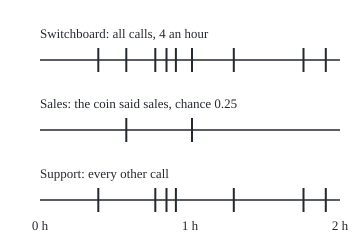
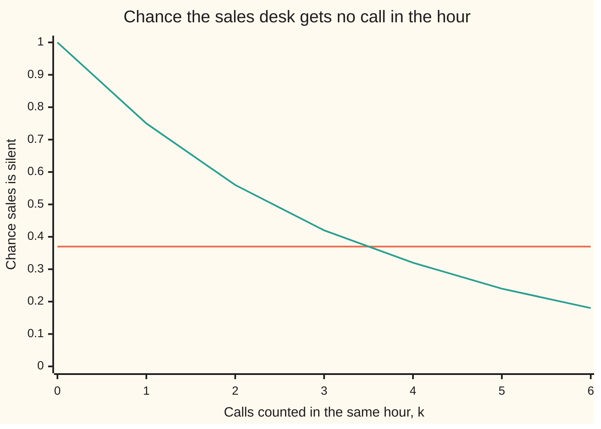

# Splitting and merging: thinning a Poisson process and adding two

Stochastic processes and calculus → Poisson and Jump Processes → Routing and pooling arrivals → Splitting and merging

---

## General Overview

A company's switchboard takes calls at 4 an hour on average, at random moments, one call never affecting the next. A recorded menu sends each caller on: a quarter of them press 1 for sales, the rest press 2 for support. No caller's choice depends on when they rang or on what anyone else chose.

Sales sees 1 call an hour and support 3; that part is arithmetic. The theorem says more: each desk's stream is again the same kind of random stream, and the two desks are independent, so a frantic hour at support says nothing about sales. That sounds wrong, since one switchboard feeds both. The card shows why it is right, and which assumption makes it so.

The reverse also holds. Give sales and support separate numbers, ringing independently at 1 and 3 calls an hour, and route both through one switchboard: it sees the same kind of stream at 4 an hour, and each call on it is a sales call with chance 0.25, whatever came before.

**Labelling each arrival of a Poisson stream by an independent coin splits it into independent Poisson streams whose rates share out the original rate; adding independent Poisson streams gives a Poisson stream whose rate is the sum, and the source of each arrival is an independent coin.**

**What kind of fact this is:** a theorem, proved on this card in Why it works, with the complete argument in a folded Detailed proof.

### The picture: two hours at the switchboard, and where each call went

<p align="center"></p>

One sample: the first two hours of the code's simulation, seed 20260930, with call times drawn exactly as random waits, not on a grid. Each tick sits at 40 + 150 × (hours since the start). The coins sent the calls at 0.575 and 1.013 hours to sales and the other seven to support. Another seed draws other ticks.

---

## The formula

A reminder from [poisson-process](01-poisson-process.md): $N(t)$ counts the calls by time $t$, in hours, and a **Poisson process with rate** $\lambda$ has independent exponential waits between calls, with mean $1/\lambda$. That card proves the counting description this card works with: the process starts at 0, rises one call at a time, its counts in windows that do not overlap are independent, and the count in a window of length $t$ is Poisson with mean $\mu = \lambda t$, so exactly $k$ calls has chance $e^{-\mu}\mu^k/k!$. It states the converse, so either description fixes the process.

Label each call sales with chance $p$, by a fresh coin that ignores the call times and the other labels. Write $N_1(t)$ for the sales calls by time $t$ and $N_2(t)$ for the support calls, so $N_1(t) + N_2(t) = N(t)$.

**Splitting.** $N_1$ and $N_2$ are independent Poisson processes with rates $\lambda_1 = p\lambda$ and $\lambda_2 = (1-p)\lambda$. In one window, with $n = a + b$:

$$P\big(N_1(t) = a,\ N_2(t) = b\big) \;=\; \frac{e^{-\lambda t}(\lambda t)^{n}}{n!}\binom{n}{a}p^{a}(1-p)^{b} \;=\; \frac{e^{-p\lambda t}(p\lambda t)^{a}}{a!}\cdot\frac{e^{-(1-p)\lambda t}\big((1-p)\lambda t\big)^{b}}{b!}.$$

**Read it aloud:** the chance the switchboard takes a + b calls and the coins send a of them to sales equals the chance sales alone gets a calls times the chance support alone gets b.

**Merging.** If $N_1$ and $N_2$ are independent Poisson processes with rates $\lambda_1$ and $\lambda_2$, then

$$N_1(t) + N_2(t) \text{ is a Poisson process with rate } \lambda_1 + \lambda_2,$$

and each call on the merged stream came from the first with chance $\lambda_1/(\lambda_1 + \lambda_2)$, independently of all the others.

**Read it aloud:** independent streams pool into one stream of the same kind, at the summed rate, and the pooled stream's source labels are fresh coins.

| Symbol | Plain meaning | In our example | Push it up and the answer… |
| --- | --- | --- | --- |
| $N(t)$ | calls the switchboard has taken by time t | 9 in the pictured 2 hours | — |
| $t$ | time since the start, in hours | 1 hour | every count grows |
| $\lambda$ | the switchboard's rate: calls per hour on average | 4 | both desks busier |
| $p$ | chance a call's coin says sales | 0.25 | sales busier, support quieter |
| $r$, $p_1$ to $p_r$ | for more than two labels: how many, and each label's chance | here 2 labels, chances 0.25 and 0.75 | — |
| $N_1(t)$, $N_2(t)$ | sales calls and support calls by time t | 1 and 2 in the worked hour | — |
| $\lambda_1$, $\lambda_2$ | the desks' rates, $p\lambda$ and $(1-p)\lambda$ | 1 and 3 an hour | merged rate grows by the same amount |
| $a$, $b$, $n$ | a sales count, a support count, their total | 1, 2, 3 | — |
| $\binom{n}{a}$ | the number of orders in which a of n calls can be sales | 3 | — |
| $k$, $\mu$, $\mu_1$, $\mu_2$ | a count, and a mean in the Poisson chance $e^{-\mu}\mu^k/k!$; the two lines' means | 3 and 4; 1 and 3 | the likeliest count moves up |
| $m$ | slots per hour in the grid of Step 0 and the code | 10 to 10000 | grid answer closer to the formula |
| $s$ | a waiting time, in hours, in Step 4 | the wait for the next merged call | — |
| $L_i$, $K_j$, $\Delta_j$, $r_j$, $j$, $a_j$, $b_j$, $k_j$, $C$, $D$, $M$, $M_1$, $M_2$ | in the Detailed proof only: the i-th coin; the switchboard's count in window j; its length; calls up to its end; the window number; sales, support and total counts in it; events about each desk; the stream that is split and its two parts | — | — |

### When it holds

- **Coins that ignore the stream.** Each label must be independent of the call times and of the other labels. Send every 4th call to sales instead and sales is silent in 19.54% of hours, not 36.79%.
- **A Poisson stream to split.** Calls exactly on the quarter hour, labelled by the same coins, leave sales silent in 31.64% of hours, and the desks' counts always add to 4.
- **Independent streams to merge.** A line merged with a copy of itself never shows a count of 1, where a Poisson count at 2 an hour is 1 in 27.07% of hours.
- **A label chance fixed in advance.** A chance that follows a known clock still gives independent desks with Poisson counts in every window, at rates that change through the day; a chance that reacts to how busy the switchboard has been does not.

---

## Why it works

### Step 0: in a tiny slot of time, the two desks never compete

Cut an hour into $m$ equal slots, the slot road [poisson-process](01-poisson-process.md) also takes. Each slot holds a call with chance about $\lambda/m$, independently of other slots; two calls in one slot become negligible as $m$ grows. Label the call, and the slot holds a sales call with chance $p\lambda/m$ and a support call with chance $(1-p)\lambda/m$.

The only link between the desks is that one slot cannot serve both, a chance of about $p(1-p)\lambda^2/m^2$ per slot, of order $1/m$ over the hour: it vanishes in the limit, leaving two separate streams at rates $p\lambda$ and $(1-p)\lambda$. In the code, the chance of 1 sales and 2 support calls is 0.090699 at 10 slots an hour and 0.082429 at 10000, the error shrinking about tenfold per tenfold refinement towards the formula's 0.082420.

### Step 1: one window, where the factorials cancel

Fix one window of length $t$. To get $a$ sales calls and $b$ support calls, the switchboard must take exactly $n = a + b$ calls, and the coins must send $a$ of them to sales. The coins are independent of the count, so the two chances multiply:

$$\frac{e^{-\lambda t}(\lambda t)^{n}}{n!}\cdot\frac{n!}{a!\,b!}p^{a}(1-p)^{b}.$$

The $n!$ cancels. Split $(\lambda t)^n$ as $(\lambda t)^a(\lambda t)^b$ and $e^{-\lambda t}$ as $e^{-p\lambda t}e^{-(1-p)\lambda t}$. What remains is a sales part in $a$ alone times a support part in $b$ alone: the formula's right side. A joint chance that factors like that for every $a$ and $b$ is independence, and summing over $b$ shows the sales count is Poisson with mean $p\lambda t$.

In the example, one hour: 0.195367 for 3 calls times 0.421875 for the coins gives 0.082420, and so does 0.367879 × 0.224042, the chances of 1 sales call and of 2 support calls taken separately.

More than two labels work the same way. With $r$ labels of chances $p_1$ to $p_r$, the binomial becomes a multinomial, the $n!$ cancels in the same way, and the $r$ streams are independent Poisson processes at rates $p_1\lambda$ to $p_r\lambda$. Step 2 and the Detailed proof run the same way with the multinomial in place of the binomial.

### Step 2: many windows, and whole streams

Take several windows that do not overlap. The switchboard's counts in them are independent, and each window's calls use their own block of coins. So Step 1 applies window by window, and the joint chance of all the desk counts is a product over windows, each a sales part times a support part.

Read one way: each desk's counts in separate windows are independent Poisson counts, so each desk is a Poisson process. Read the other way: every list of sales counts is independent of every list of support counts. Wing 10's π-λ theorem ([pi-systems-and-uniqueness](../../10-Measure%20and%20integration/01-Sets%20You%20Can%20Measure/06-pi-systems-and-uniqueness.md)), which lifts a product rule from simple events to every event about a stream, extends that from finite lists to whole streams, in the Detailed proof.

### Step 3: why a busy support hour says nothing about sales

Two effects cancel. A busy support hour suggests a busy switchboard, which pushes the sales count up; it also says many calls went to support, which leaves fewer for sales. For a Poisson total the two cancel exactly.



Orange: told that support took k calls, the chance sales took none stays at about 37% whatever k is. Green: told that the switchboard took k calls, it falls as 0.75 to the power k, since all k coins must say support. Both lines come from listing every label word, the string of sales-or-support labels on the hour's calls, up to 16 calls; the simulated orange points, from 0.3663 ± 0.0048 at k = 0 to 0.3742 ± 0.0048 at k = 6, sit on the line within four standard errors, the assert's tolerance. The desks are independent until the total is revealed, and tied together after.

### Step 4: merging is splitting run backwards

Split a Poisson stream at $\lambda_1 + \lambda_2$ = 4 calls an hour with coins of chance $\lambda_1/(\lambda_1 + \lambda_2)$ = 0.25. Steps 1 and 2 give two independent Poisson streams at 1 and 3 an hour, which add back to the original. The two separate phone lines are also independent Poisson streams at 1 and 3 an hour. A Poisson process's chances are fixed by its rate, and independence makes a pair's joint chances the product, so the phone lines behave in every respect like the split pair. Their sum therefore behaves like the stream that was split, Poisson at 4 an hour, and the source of each merged call is a fresh coin.

The waits show it too. From any moment, the waits for the next sales call and the next support call are independent exponentials with rates $\lambda_1$ and $\lambda_2$, and the merged stream waits for whichever comes first. That wait exceeds $s$ hours only if both do:

$$P(\text{both waits exceed } s) = e^{-\lambda_1 s}\,e^{-\lambda_2 s} = e^{-(\lambda_1+\lambda_2)s},$$

an exponential wait with rate 4, mean 0.2500 hours. Sales rings first with chance $\lambda_1/(\lambda_1 + \lambda_2)$ = 0.2500. The simulated merged stream gives a mean gap of 0.2503 ± 0.0003 hours and a sales share of 0.2499 ± 0.0005.

<details>
<summary>The algebra behind this, if you want it</summary>

**Merged counts by convolution.** In a window where the lines have means $\mu_1$ and $\mu_2$, the chance of $k$ calls in all sums over how many came from line 1:
$$\sum_{i=0}^{k}\frac{e^{-\mu_1}\mu_1^{i}}{i!}\cdot\frac{e^{-\mu_2}\mu_2^{k-i}}{(k-i)!} = \frac{e^{-(\mu_1+\mu_2)}}{k!}\sum_{i=0}^{k}\binom{k}{i}\mu_1^{i}\mu_2^{k-i} = \frac{e^{-(\mu_1+\mu_2)}(\mu_1+\mu_2)^{k}}{k!},$$
the last step by the binomial theorem. The code checks this sum against the Poisson chance at 4 an hour for k = 0 to 8.

**Which line rang first.** The sales wait has density $\lambda_1 e^{-\lambda_1 s}$; the support wait exceeds $s$ with chance $e^{-\lambda_2 s}$. So
$$P(\text{sales first}) = \int_0^\infty \lambda_1 e^{-\lambda_1 s}e^{-\lambda_2 s}\,ds = \frac{\lambda_1}{\lambda_1+\lambda_2}.$$

</details>

<details>
<summary>Detailed proof</summary>

**Setting.** $N$ is a Poisson process with rate $\lambda > 0$: $N(0) = 0$, its paths rise by jumps of size 1, and for times $0 = t_0 < t_1 < \dots < t_J$ the increments $K_j = N(t_j) - N(t_{j-1})$ are independent, Poisson with means $\lambda\Delta_j$, where $\Delta_j = t_j - t_{j-1}$. The coins $L_1, L_2, \dots$ are independent, each 1 with probability $p$ ($0 \le p \le 1$, reading $0^0$ as 1) and 0 otherwise, and the whole sequence is independent of $N$. Put $N_1(t) = L_1 + \dots + L_{N(t)}$ (0 when $N(t) = 0$) and $N_2 = N - N_1$.

**1. Finite windows.** Fix nonnegative whole numbers $a_j, b_j$ and put $k_j = a_j + b_j$, $r_j = k_1 + \dots + k_j$, $r_0 = 0$. The event that $N_1$ rises by $a_j$ and $N_2$ by $b_j$ over window $j$, for every $j$, equals the event that $K_j = k_j$ for every $j$ and the coins $L_{r_{j-1}+1}, \dots, L_{r_j}$ sum to $a_j$ for every $j$. These blocks of coins are disjoint and fixed once the $k_j$ are, and the coins are independent of $N$, so the chance is
$$\prod_{j}\frac{e^{-\lambda\Delta_j}(\lambda\Delta_j)^{k_j}}{k_j!}\binom{k_j}{a_j}p^{a_j}(1-p)^{b_j} = \prod_{j}\frac{e^{-p\lambda\Delta_j}(p\lambda\Delta_j)^{a_j}}{a_j!}\cdot\frac{e^{-(1-p)\lambda\Delta_j}((1-p)\lambda\Delta_j)^{b_j}}{b_j!},$$
by the algebra of Step 1 in each window. Summing over all $b_j$ shows the increments of $N_1$ are independent Poisson with means $p\lambda\Delta_j$; with $N_1(0) = 0$ and unit jumps (each jump of $N$ goes to exactly one of $N_1$, $N_2$), $N_1$ is a Poisson process with rate $p\lambda$. The same holds for $N_2$ with $(1-p)\lambda$. The product form also shows that the vector of $N_1$'s increments is independent of the vector of $N_2$'s, for any finite list of times.

**2. Whole streams.** Events of the form $\{N_1(s_1) \in A_1, \dots, N_1(s_q) \in A_q\}$, finitely many fixed times and sets of whole numbers, form a π-system (closed under intersection) generating the σ-algebra of $N_1$; likewise for $N_2$. For one such event of each kind, merge the two time lists: both events are determined by the increments over the merged list, which part 1 makes independent, so the chances multiply. Fix the $N_2$ event $D$. The $N_1$ events $C$ with $P(C \cap D) = P(C)P(D)$ contain the whole space, and are closed under complements and countable disjoint unions: a λ-system containing the π-system. By Dynkin's π-λ theorem it contains the whole σ-algebra of $N_1$. Repeating with $C$ fixed and $D$ varying proves the σ-algebras of $N_1$ and $N_2$ independent.

**3. Merging.** Let $N_1'$, $N_2'$ be independent Poisson processes with rates $\lambda_1$, $\lambda_2$, and split a Poisson process $M$ with rate $\lambda_1 + \lambda_2$ by coins with $p = \lambda_1/(\lambda_1+\lambda_2)$ into $M_1$, $M_2$: by parts 1 and 2, independent Poisson processes with rates $\lambda_1$, $\lambda_2$. The finite-dimensional laws of a Poisson process are fixed by its rate, and independence makes a pair's the product, so the two pairs share their finite-dimensional laws, hence by the π-λ theorem their law. Every function of the pair, such as the sum or the record of which one jumped, has the same law too: $N_1' + N_2'$ has the law of $M_1 + M_2 = M$, and its source labels that of the coins.

**4. No two calls at once.** The m-th call of $N_1'$ and the n-th of $N_2'$ are independent and each has a density, so by Fubini they coincide with chance 0; a countable union over m and n is still null.

The argument is complete given the counting description of [poisson-process](01-poisson-process.md) and wing 10's π-λ theorem ([pi-systems-and-uniqueness](../../10-Measure%20and%20integration/01-Sets%20You%20Can%20Measure/06-pi-systems-and-uniqueness.md)) and Fubini ([tonelli-and-fubini](../../10-Measure%20and%20integration/06-Product%20Measures%20and%20Fubini/03-tonelli-and-fubini.md)).

</details>

A third road, used in the code, is the grid of Step 0 taken to its limit: a Poisson stream seen as very many slots, each with a small independent chance of a call, and a coin in each slot.

---

## Worked numbers, by hand

One hour at the switchboard: 4 calls an hour, sales with chance 0.25. The chance of exactly 1 sales call and 2 support calls, two ways.

| Step | Arithmetic | Value |
| --- | --- | --- |
| the desks' rates | 0.25 × 4 and 0.75 × 4 | 1 and 3 an hour |
| switchboard takes exactly 3 | $e^{-4} \times 4^3 / 3!$ | 0.195367 |
| the coins give 1 sales, 2 support | 3 orders × 0.25 × 0.75 × 0.75 | 0.421875 |
| road one: total, then coins | 0.195367 × 0.421875 | **0.082420** |
| sales alone gets exactly 1 | $e^{-1} \times 1^1 / 1!$ | 0.367879 |
| support alone gets exactly 2 | $e^{-3} \times 3^2 / 2!$ | 0.224042 |
| road two: desks separately | 0.367879 × 0.224042 | **0.082420** |
| merged lines, 1 + 3 an hour | $e^{-4} \times 4^3 / 3!$ for 3 calls | 0.195367, as on the switchboard |

About 1 hour in 12 goes exactly this way. The two roads agree for every pair of counts, not just this one, which is the independence.

### What breaks if you drop a piece

| Mistake | Comes out at | What went wrong |
| --- | --- | --- |
| Every 4th call to sales, not a coin | sales silent in 0.1954 of hours, not 0.3679 | Labels depend on the order of calls, so sales calls come evenly spaced |
| Calls on the quarter hour, then coins | sales silent 0.3164; covariance −0.7500 | The total is fixed at 4, not Poisson, so the desks share it out |
| Sales line merged with a copy of itself | 1 call has chance 0.0000, Poisson(2) says 0.2707 | The streams are not independent: every call arrives twice |
| Told the switchboard took 3 calls | sales silent 0.4219, not 0.3679 | Conditioning on the total ties the desks together |

Covariance: the average of (sales count minus its mean) times (support count minus its mean); 0 when neither runs high with the other, negative when they move against each other. The code prints every row.

---

## Code, from first principles, and it actually runs

Four roads to the joint law of the desks: the formula; all 131071 label words for switchboard totals up to 16, weighted and binned, never using the split rates; the grid of Step 0 at 10 to 10000 slots an hour, the error printed as it shrinks; and 200000 simulated hours from a SplitMix64 generator written out, seed 20260930, with exact exponential waits and a standard error on every estimate. Merging gets its own simulation, two lines drawn apart and pooled, set against the Poisson law and the convolution sum. The asserts compare each road with the formula, simulated numbers within 4 standard errors, and the every-4th-call rota against its own exact value.

### Python

```python
# Splitting and merging Poisson streams -- the check behind the card.
# Standard library math only.  A switchboard takes calls at 4 an hour; each
# call is routed to sales with chance 0.25, else to support.  Four roads to
# the joint law of the two desks: the formula; every label word enumerated;
# a grid of m slots an hour as m grows; a seeded simulation, with errors.
from math import exp, log, sqrt

LAM, P, H, SEED, NMAX, ROT = 4.0, 0.25, 200000, 20260930, 16, 4
M64 = (1 << 64) - 1

def fact(n):
    out = 1
    for i in range(2, n + 1):
        out *= i
    return out

def pois(k, mu):                         # Poisson probability of k when the mean is mu
    return exp(-mu) * mu ** k / fact(k)

class SplitMix64:                        # the wing's generator, written out
    def __init__(self, seed):
        self.s = seed
    def uniform(self):                   # a number in [0, 1) with 53 random bits
        self.s = (self.s + 0x9E3779B97F4A7C15) & M64
        z = self.s
        z = ((z ^ (z >> 30)) * 0xBF58476D1CE4E5B9) & M64
        z = ((z ^ (z >> 27)) * 0x94D049BB133111EB) & M64
        return ((z ^ (z >> 31)) >> 11) / 9007199254740992.0
    def wait(self, rate):                # an exponential waiting time, in hours
        return -log(1.0 - self.uniform()) / rate

def freq(hits, n):                       # a simulated share and its standard error
    f = hits / n
    return f, sqrt(f * (1 - f) / n)

l1, l2 = P * LAM, (1 - P) * LAM
print(f"setup: calls at {LAM:.0f} an hour; each call is sales with chance {P}, else support")
print(f"split rates: sales {l1:.1f} an hour, support {l2:.1f} an hour")
pt, words = pois(3, LAM), 3 * P * (1 - P) ** 2
print(f"worked, one hour: P(total 3) = {pt:.6f}; label words for 1 sales in 3 = {words:.6f}; product {pt * words:.6f}")
print(f"worked, one hour: P(sales 1) = {pois(1, l1):.6f}; P(support 2) = {pois(2, l2):.6f}; product {pois(1, l1) * pois(2, l2):.6f}")

# road two: every label word of every length n up to NMAX, weighted and binned
joint = [[0.0] * (NMAX + 1) for _ in range(NMAX + 1)]
for n in range(NMAX + 1):
    for mask in range(1 << n):
        a = bin(mask).count("1")
        joint[a][n - a] += pois(n, LAM) * P ** a * (1 - P) ** (n - a)
gap = max(abs(joint[a][b] - pois(a, l1) * pois(b, l2)) for a in range(NMAX + 1) for b in range(NMAX + 1 - a))
print(f"enumeration: {(1 << (NMAX + 1)) - 1} label words; every cell equals Poisson(1) x Poisson(3) to 1e-15: {'yes' if gap < 1e-15 else 'no'}")
given_support = [joint[0][k] / sum(joint[a][k] for a in range(NMAX + 1 - k)) for k in range(7)]
given_total = [joint[0][k] / pois(k, LAM) for k in range(7)]
print("chart, P(sales silent | support took k), k = 0..6: " + ", ".join(f"{x:.2f}" for x in given_support))
print("chart, P(sales silent | switchboard took k), k = 0..6: " + ", ".join(f"{x:.2f}" for x in given_total))
assert gap < 1e-15                                                    # words against the formula
assert all(abs(x - exp(-l1)) < 1e-4 for x in given_support)          # independence: flat at e^-1

# road three: m slots an hour, each holding one sales call, one support call, or none
target, last = pois(1, l1) * pois(2, l2), 1.0
for m in (10, 100, 1000, 10000):
    grid = m * (m - 1) * (m - 2) / 2 * (l1 / m) * (l2 / m) ** 2 * (1 - LAM / m) ** (m - 3)
    print(f"grid, {m} slots an hour: P(sales 1, support 2) = {grid:.6f}, off by {abs(grid - target):.6f}")
    assert abs(grid - target) < last                                  # the error shrinks with m
    last = abs(grid - target)
assert last < 2e-4

# road four: one long stream of calls, labelled by coin and by a 1-in-ROT rotation
g = SplitMix64(SEED)
sales, support, rota, fig = [0] * H, [0] * H, [0] * H, []
t, calls = g.wait(LAM), 0
while t < H:
    h, calls = int(t), calls + 1
    is_sales = g.uniform() < P
    if is_sales: sales[h] += 1
    else: support[h] += 1
    if calls % ROT == 0: rota[h] += 1
    if t < 2: fig.append(f"{t:.3f}{'S' if is_sales else 'U'} x {40 + 150 * t:.1f}")
    t += g.wait(LAM)
print(f"simulation: {H} hours, seed {SEED}, {calls} calls")
ms, mu = sum(sales) / H, sum(support) / H
ses = sqrt(sum((x - ms) ** 2 for x in sales) / H / H)
seu = sqrt(sum((x - mu) ** 2 for x in support) / H / H)
print(f"simulated calls an hour: sales {ms:.4f} +- {ses:.4f}, support {mu:.4f} +- {seu:.4f}")
f12, se12 = freq(sum(1 for i in range(H) if sales[i] == 1 and support[i] == 2), H)
print(f"simulated P(sales 1, support 2) = {f12:.4f} +- {se12:.4f}, exact {target:.4f}")
prods = [(sales[i] - ms) * (support[i] - mu) for i in range(H)]
cov = sum(prods) / H
secov = sqrt(sum((x - cov) ** 2 for x in prods) / H / H)
print(f"simulated covariance of sales and support counts = {cov:.4f} +- {secov:.4f}, exact 0")
for x, e, s in ((ms, l1, ses), (mu, l2, seu), (f12, target, se12), (cov, 0.0, secov)):
    assert abs(x - e) < 4 * s
for k in range(7):
    nk = sum(1 for x in support if x == k)
    f, se = freq(sum(1 for i in range(H) if support[i] == k and sales[i] == 0), nk)
    print(f"simulated P(sales silent | support took {k}) = {f:.4f} +- {se:.4f} over {nk} hours")
    assert abs(f - exp(-l1)) < 4 * se
print("figure, first 2 hours, time in hours, S sales or U support, x = 40 + 150 t: " + ", ".join(fig))

# merging: a sales line at 1 an hour and a support line at 3, drawn apart, added
merged, t1, t2, prev, ng, sg, sg2, from_sales = [0] * H, g.wait(l1), g.wait(l2), 0.0, 0, 0.0, 0.0, 0
while min(t1, t2) < H:
    if t1 < t2: t, t1, from_sales = t1, t1 + g.wait(l1), from_sales + 1
    else: t, t2 = t2, t2 + g.wait(l2)
    merged[int(t)] += 1
    ng, sg, sg2, prev = ng + 1, sg + (t - prev), sg2 + (t - prev) ** 2, t
for k in range(9):
    conv = sum(pois(i, l1) * pois(k - i, l2) for i in range(k + 1))
    f, se = freq(sum(1 for x in merged if x == k), H)
    print(f"merge, P(merged count = {k}): formula {pois(k, LAM):.6f}, convolution {conv:.6f}, simulated {f:.4f} +- {se:.4f}")
    assert abs(conv - pois(k, LAM)) < 1e-15 and abs(f - conv) < 4 * se
mg = sg / ng
seg = sqrt((sg2 / ng - mg * mg) / ng)
fs, sefs = freq(from_sales, ng)
print(f"merge, gap between merged calls: exact {1 / LAM:.4f} hours, simulated {mg:.4f} +- {seg:.4f} over {ng} gaps")
print(f"merge, share of merged calls from sales: exact {l1 / LAM:.4f}, simulated {fs:.4f} +- {sefs:.4f}")
assert abs(mg - 1 / LAM) < 4 * seg
assert abs(fs - l1 / LAM) < 4 * sefs

# what breaks when a hypothesis is dropped
rr_exact = sum(sum(pois(i, LAM) for i in range(j)) for j in range(1, ROT + 1)) / ROT
frr, serr = freq(sum(1 for x in rota if x == 0), H)
print(f"mistake, every {ROT}th call to sales: P(sales silent an hour) exact {rr_exact:.4f}, simulated {frr:.4f} +- {serr:.4f}, Poisson {exp(-LAM / ROT):.4f}")
assert abs(frr - rr_exact) < 4 * serr
w = [(bin(m).count("1"), P ** bin(m).count("1") * (1 - P) ** (4 - bin(m).count("1"))) for m in range(16)]
p0 = sum(q for a, q in w if a == 0)
cv = sum(q * a * (4 - a) for a, q in w) - sum(q * a for a, q in w) * sum(q * (4 - a) for a, q in w)
print(f"mistake, calls on the quarter hour, then coin labels: P(sales silent) {p0:.4f}, covariance {cv:.4f}")
assert abs(cv + 4 * P * (1 - P)) < 1e-12                               # minus a binomial variance
print(f"mistake, sales line merged with a copy of itself: P(1 call) {sum(pois(j, l1) for j in range(20) if 2 * j == 1):.4f}, "
      f"P(2 calls) {pois(1, l1):.4f}; Poisson(2) says {pois(1, 2 * l1):.4f} and {pois(2, 2 * l1):.4f}")
print(f"mistake, told the switchboard took 3: P(sales silent) {given_total[3]:.4f}, not {exp(-l1):.4f}")
print("ALL CHECKS PASS")
```

**Ran 2026-09-30 on macOS, Python 3.14.6, standard library only. All checks passed. Output, pasted from the run:**

```
setup: calls at 4 an hour; each call is sales with chance 0.25, else support
split rates: sales 1.0 an hour, support 3.0 an hour
worked, one hour: P(total 3) = 0.195367; label words for 1 sales in 3 = 0.421875; product 0.082420
worked, one hour: P(sales 1) = 0.367879; P(support 2) = 0.224042; product 0.082420
enumeration: 131071 label words; every cell equals Poisson(1) x Poisson(3) to 1e-15: yes
chart, P(sales silent | support took k), k = 0..6: 0.37, 0.37, 0.37, 0.37, 0.37, 0.37, 0.37
chart, P(sales silent | switchboard took k), k = 0..6: 1.00, 0.75, 0.56, 0.42, 0.32, 0.24, 0.18
grid, 10 slots an hour: P(sales 1, support 2) = 0.090699, off by 0.008279
grid, 100 slots an hour: P(sales 1, support 2) = 0.083250, off by 0.000829
grid, 1000 slots an hour: P(sales 1, support 2) = 0.082503, off by 0.000082
grid, 10000 slots an hour: P(sales 1, support 2) = 0.082429, off by 0.000008
simulation: 200000 hours, seed 20260930, 798704 calls
simulated calls an hour: sales 0.9979 +- 0.0022, support 2.9956 +- 0.0039
simulated P(sales 1, support 2) = 0.0830 +- 0.0006, exact 0.0824
simulated covariance of sales and support counts = -0.0054 +- 0.0039, exact 0
simulated P(sales silent | support took 0) = 0.3663 +- 0.0048 over 9959 hours
simulated P(sales silent | support took 1) = 0.3647 +- 0.0028 over 30037 hours
simulated P(sales silent | support took 2) = 0.3673 +- 0.0023 over 44820 hours
simulated P(sales silent | support took 3) = 0.3638 +- 0.0023 over 44656 hours
simulated P(sales silent | support took 4) = 0.3744 +- 0.0026 over 33745 hours
simulated P(sales silent | support took 5) = 0.3700 +- 0.0034 over 20137 hours
simulated P(sales silent | support took 6) = 0.3742 +- 0.0048 over 10042 hours
figure, first 2 hours, time in hours, S sales or U support, x = 40 + 150 t: 0.389U x 98.3, 0.575S x 126.3, 0.768U x 155.3, 0.844U x 166.5, 0.906U x 175.9, 1.013S x 192.0, 1.292U x 233.8, 1.757U x 303.5, 1.905U x 325.8
merge, P(merged count = 0): formula 0.018316, convolution 0.018316, simulated 0.0186 +- 0.0003
merge, P(merged count = 1): formula 0.073263, convolution 0.073263, simulated 0.0734 +- 0.0006
merge, P(merged count = 2): formula 0.146525, convolution 0.146525, simulated 0.1466 +- 0.0008
merge, P(merged count = 3): formula 0.195367, convolution 0.195367, simulated 0.1954 +- 0.0009
merge, P(merged count = 4): formula 0.195367, convolution 0.195367, simulated 0.1944 +- 0.0009
merge, P(merged count = 5): formula 0.156293, convolution 0.156293, simulated 0.1576 +- 0.0008
merge, P(merged count = 6): formula 0.104196, convolution 0.104196, simulated 0.1046 +- 0.0007
merge, P(merged count = 7): formula 0.059540, convolution 0.059540, simulated 0.0585 +- 0.0005
merge, P(merged count = 8): formula 0.029770, convolution 0.029770, simulated 0.0304 +- 0.0004
merge, gap between merged calls: exact 0.2500 hours, simulated 0.2503 +- 0.0003 over 799131 gaps
merge, share of merged calls from sales: exact 0.2500, simulated 0.2499 +- 0.0005
mistake, every 4th call to sales: P(sales silent an hour) exact 0.1954, simulated 0.1954 +- 0.0009, Poisson 0.3679
mistake, calls on the quarter hour, then coin labels: P(sales silent) 0.3164, covariance -0.7500
mistake, sales line merged with a copy of itself: P(1 call) 0.0000, P(2 calls) 0.3679; Poisson(2) says 0.2707 and 0.2707
mistake, told the switchboard took 3: P(sales silent) 0.4219, not 0.3679
ALL CHECKS PASS
```

### Rust

Same numbers, same labels, built with `rustc --edition 2021 -O`. The two outputs match line for line, including the simulation, since both languages draw the same numbers from the same generator.

```rust
// Splitting and merging Poisson streams -- the same check as the Python, in Rust.
// No crates.  A switchboard takes calls at 4 an hour; each call is routed to
// sales with chance 0.25, else to support.  Four roads to the joint law of the
// two desks: the formula; every label word enumerated; a grid of m slots an
// hour as m grows; a seeded simulation, with errors.
const LAM: f64 = 4.0;
const P: f64 = 0.25;
const H: usize = 200000;
const SEED: u64 = 20260930;
const NMAX: usize = 16;
const ROT: usize = 4;

fn fact(n: usize) -> f64 { (2..=n).fold(1.0, |acc, i| acc * i as f64) }

fn pois(k: usize, mu: f64) -> f64 { (-mu).exp() * mu.powi(k as i32) / fact(k) }  // Poisson probability of k

struct SplitMix64 { s: u64 }                        // the wing's generator, written out
impl SplitMix64 {
    fn uniform(&mut self) -> f64 {                  // a number in [0, 1) with 53 random bits
        self.s = self.s.wrapping_add(0x9E3779B97F4A7C15);
        let mut z = self.s;
        z = (z ^ (z >> 30)).wrapping_mul(0xBF58476D1CE4E5B9);
        z = (z ^ (z >> 27)).wrapping_mul(0x94D049BB133111EB);
        ((z ^ (z >> 31)) >> 11) as f64 / 9007199254740992.0
    }
    fn wait(&mut self, rate: f64) -> f64 { -(1.0 - self.uniform()).ln() / rate }  // exponential, hours
}

fn freq(hits: usize, n: usize) -> (f64, f64) {      // a simulated share and its standard error
    let f = hits as f64 / n as f64;
    (f, (f * (1.0 - f) / n as f64).sqrt())
}

fn join(v: &[f64]) -> String { v.iter().map(|x| format!("{:.2}", x)).collect::<Vec<_>>().join(", ") }

fn main() {
    let (l1, l2) = (P * LAM, (1.0 - P) * LAM);
    println!("setup: calls at {:.0} an hour; each call is sales with chance {}, else support", LAM, P);
    println!("split rates: sales {:.1} an hour, support {:.1} an hour", l1, l2);
    let (pt, words) = (pois(3, LAM), 3.0 * P * (1.0 - P).powi(2));
    println!("worked, one hour: P(total 3) = {:.6}; label words for 1 sales in 3 = {:.6}; product {:.6}", pt, words, pt * words);
    println!("worked, one hour: P(sales 1) = {:.6}; P(support 2) = {:.6}; product {:.6}",
             pois(1, l1), pois(2, l2), pois(1, l1) * pois(2, l2));

    // road two: every label word of every length n up to NMAX, weighted and binned
    let mut joint = vec![vec![0.0f64; NMAX + 1]; NMAX + 1];
    for n in 0..=NMAX {
        for mask in 0u32..(1u32 << n) {
            let a = mask.count_ones() as usize;
            joint[a][n - a] += pois(n, LAM) * P.powi(a as i32) * (1.0 - P).powi((n - a) as i32);
        }
    }
    let mut gap = 0.0f64;
    for a in 0..=NMAX { for b in 0..=(NMAX - a) { gap = gap.max((joint[a][b] - pois(a, l1) * pois(b, l2)).abs()) } }
    println!("enumeration: {} label words; every cell equals Poisson(1) x Poisson(3) to 1e-15: {}",
             (1usize << (NMAX + 1)) - 1, if gap < 1e-15 { "yes" } else { "no" });
    let given_support: Vec<f64> = (0..7).map(|k| joint[0][k] / (0..=(NMAX - k)).map(|a| joint[a][k]).sum::<f64>()).collect();
    let given_total: Vec<f64> = (0..7).map(|k| joint[0][k] / pois(k, LAM)).collect();
    println!("chart, P(sales silent | support took k), k = 0..6: {}", join(&given_support));
    println!("chart, P(sales silent | switchboard took k), k = 0..6: {}", join(&given_total));
    assert!(gap < 1e-15);                                                         // words against the formula
    assert!(given_support.iter().all(|x| (x - (-l1).exp()).abs() < 1e-4));       // independence: flat at e^-1

    // road three: m slots an hour, each holding one sales call, one support call, or none
    let (target, mut last) = (pois(1, l1) * pois(2, l2), 1.0f64);
    for m in [10.0f64, 100.0, 1000.0, 10000.0] {
        let grid = m * (m - 1.0) * (m - 2.0) / 2.0 * (l1 / m) * (l2 / m).powi(2) * (1.0 - LAM / m).powi(m as i32 - 3);
        println!("grid, {} slots an hour: P(sales 1, support 2) = {:.6}, off by {:.6}", m, grid, (grid - target).abs());
        assert!((grid - target).abs() < last);                                   // the error shrinks with m
        last = (grid - target).abs();
    }
    assert!(last < 2e-4);

    // road four: one long stream of calls, labelled by coin and by a 1-in-ROT rotation
    let mut g = SplitMix64 { s: SEED };
    let (mut sales, mut support, mut rota, mut fig) = (vec![0usize; H], vec![0usize; H], vec![0usize; H], Vec::new());
    let (mut t, mut calls) = (g.wait(LAM), 0usize);
    while t < H as f64 {
        let h = t as usize;
        calls += 1;
        let is_sales = g.uniform() < P;
        if is_sales { sales[h] += 1 } else { support[h] += 1 }
        if calls % ROT == 0 { rota[h] += 1 }
        if t < 2.0 { fig.push(format!("{:.3}{} x {:.1}", t, if is_sales { "S" } else { "U" }, 40.0 + 150.0 * t)) }
        t += g.wait(LAM);
    }
    println!("simulation: {} hours, seed {}, {} calls", H, SEED, calls);
    let hf = H as f64;
    let ms = sales.iter().sum::<usize>() as f64 / hf;
    let mu = support.iter().sum::<usize>() as f64 / hf;
    let ses = (sales.iter().map(|&x| (x as f64 - ms).powi(2)).sum::<f64>() / hf / hf).sqrt();
    let seu = (support.iter().map(|&x| (x as f64 - mu).powi(2)).sum::<f64>() / hf / hf).sqrt();
    println!("simulated calls an hour: sales {:.4} +- {:.4}, support {:.4} +- {:.4}", ms, ses, mu, seu);
    let (f12, se12) = freq((0..H).filter(|&i| sales[i] == 1 && support[i] == 2).count(), H);
    println!("simulated P(sales 1, support 2) = {:.4} +- {:.4}, exact {:.4}", f12, se12, target);
    let prods: Vec<f64> = (0..H).map(|i| (sales[i] as f64 - ms) * (support[i] as f64 - mu)).collect();
    let cov = prods.iter().sum::<f64>() / hf;
    let secov = (prods.iter().map(|x| (x - cov).powi(2)).sum::<f64>() / hf / hf).sqrt();
    println!("simulated covariance of sales and support counts = {:.4} +- {:.4}, exact 0", cov, secov);
    for (x, e, s) in [(ms, l1, ses), (mu, l2, seu), (f12, target, se12), (cov, 0.0, secov)] {
        assert!((x - e).abs() < 4.0 * s);
    }
    for k in 0..7 {
        let nk = support.iter().filter(|&&x| x == k).count();
        let (f, se) = freq((0..H).filter(|&i| support[i] == k && sales[i] == 0).count(), nk);
        println!("simulated P(sales silent | support took {}) = {:.4} +- {:.4} over {} hours", k, f, se, nk);
        assert!((f - (-l1).exp()).abs() < 4.0 * se);
    }
    println!("figure, first 2 hours, time in hours, S sales or U support, x = 40 + 150 t: {}", fig.join(", "));

    // merging: a sales line at 1 an hour and a support line at 3, drawn apart, added
    let mut merged = vec![0usize; H];
    let (mut t1, mut t2) = (g.wait(l1), g.wait(l2));
    let (mut prev, mut ng, mut sg, mut sg2, mut from_sales) = (0.0f64, 0usize, 0.0f64, 0.0f64, 0usize);
    while t1.min(t2) < hf {
        let t;
        if t1 < t2 { t = t1; t1 += g.wait(l1); from_sales += 1 } else { t = t2; t2 += g.wait(l2) }
        merged[t as usize] += 1;
        ng += 1;
        sg += t - prev;
        sg2 += (t - prev).powi(2);
        prev = t;
    }
    for k in 0..9 {
        let conv: f64 = (0..=k).map(|i| pois(i, l1) * pois(k - i, l2)).sum();
        let (f, se) = freq(merged.iter().filter(|&&x| x == k).count(), H);
        println!("merge, P(merged count = {}): formula {:.6}, convolution {:.6}, simulated {:.4} +- {:.4}",
                 k, pois(k, LAM), conv, f, se);
        assert!((conv - pois(k, LAM)).abs() < 1e-15 && (f - conv).abs() < 4.0 * se);
    }
    let mg = sg / ng as f64;
    let seg = ((sg2 / ng as f64 - mg * mg) / ng as f64).sqrt();
    let (fs, sefs) = freq(from_sales, ng);
    println!("merge, gap between merged calls: exact {:.4} hours, simulated {:.4} +- {:.4} over {} gaps", 1.0 / LAM, mg, seg, ng);
    println!("merge, share of merged calls from sales: exact {:.4}, simulated {:.4} +- {:.4}", l1 / LAM, fs, sefs);
    assert!((mg - 1.0 / LAM).abs() < 4.0 * seg);
    assert!((fs - l1 / LAM).abs() < 4.0 * sefs);

    // what breaks when a hypothesis is dropped
    let rr_exact = (1..=ROT).map(|j| (0..j).map(|i| pois(i, LAM)).sum::<f64>()).sum::<f64>() / ROT as f64;
    let (frr, serr) = freq(rota.iter().filter(|&&x| x == 0).count(), H);
    println!("mistake, every {}th call to sales: P(sales silent an hour) exact {:.4}, simulated {:.4} +- {:.4}, Poisson {:.4}", ROT,
             rr_exact, frr, serr, (-LAM / ROT as f64).exp());
    assert!((frr - rr_exact).abs() < 4.0 * serr);
    let w: Vec<(f64, f64)> = (0u32..16).map(|m| { let a = m.count_ones() as i32;
        (a as f64, P.powi(a) * (1.0 - P).powi(4 - a)) }).collect();
    let p0: f64 = w.iter().filter(|(a, _)| *a == 0.0).map(|(_, q)| q).sum();
    let cv = w.iter().map(|(a, q)| q * a * (4.0 - a)).sum::<f64>()
        - w.iter().map(|(a, q)| q * a).sum::<f64>() * w.iter().map(|(a, q)| q * (4.0 - a)).sum::<f64>();
    println!("mistake, calls on the quarter hour, then coin labels: P(sales silent) {:.4}, covariance {:.4}", p0, cv);
    assert!((cv + 4.0 * P * (1.0 - P)).abs() < 1e-12);                            // minus a binomial variance
    let odd = (0..20).filter(|j| 2 * j == 1).map(|j| pois(j, l1)).fold(0.0, |s, x| s + x);
    println!("mistake, sales line merged with a copy of itself: P(1 call) {:.4}, P(2 calls) {:.4}; Poisson(2) says {:.4} and {:.4}",
             odd, pois(1, l1), pois(1, 2.0 * l1), pois(2, 2.0 * l1));
    println!("mistake, told the switchboard took 3: P(sales silent) {:.4}, not {:.4}", given_total[3], (-l1).exp());
    println!("ALL CHECKS PASS");
}
```

**Ran 2026-09-30 on macOS, rustc 1.98.1, no crates. All checks passed. Output, pasted from the run:**

```
setup: calls at 4 an hour; each call is sales with chance 0.25, else support
split rates: sales 1.0 an hour, support 3.0 an hour
worked, one hour: P(total 3) = 0.195367; label words for 1 sales in 3 = 0.421875; product 0.082420
worked, one hour: P(sales 1) = 0.367879; P(support 2) = 0.224042; product 0.082420
enumeration: 131071 label words; every cell equals Poisson(1) x Poisson(3) to 1e-15: yes
chart, P(sales silent | support took k), k = 0..6: 0.37, 0.37, 0.37, 0.37, 0.37, 0.37, 0.37
chart, P(sales silent | switchboard took k), k = 0..6: 1.00, 0.75, 0.56, 0.42, 0.32, 0.24, 0.18
grid, 10 slots an hour: P(sales 1, support 2) = 0.090699, off by 0.008279
grid, 100 slots an hour: P(sales 1, support 2) = 0.083250, off by 0.000829
grid, 1000 slots an hour: P(sales 1, support 2) = 0.082503, off by 0.000082
grid, 10000 slots an hour: P(sales 1, support 2) = 0.082429, off by 0.000008
simulation: 200000 hours, seed 20260930, 798704 calls
simulated calls an hour: sales 0.9979 +- 0.0022, support 2.9956 +- 0.0039
simulated P(sales 1, support 2) = 0.0830 +- 0.0006, exact 0.0824
simulated covariance of sales and support counts = -0.0054 +- 0.0039, exact 0
simulated P(sales silent | support took 0) = 0.3663 +- 0.0048 over 9959 hours
simulated P(sales silent | support took 1) = 0.3647 +- 0.0028 over 30037 hours
simulated P(sales silent | support took 2) = 0.3673 +- 0.0023 over 44820 hours
simulated P(sales silent | support took 3) = 0.3638 +- 0.0023 over 44656 hours
simulated P(sales silent | support took 4) = 0.3744 +- 0.0026 over 33745 hours
simulated P(sales silent | support took 5) = 0.3700 +- 0.0034 over 20137 hours
simulated P(sales silent | support took 6) = 0.3742 +- 0.0048 over 10042 hours
figure, first 2 hours, time in hours, S sales or U support, x = 40 + 150 t: 0.389U x 98.3, 0.575S x 126.3, 0.768U x 155.3, 0.844U x 166.5, 0.906U x 175.9, 1.013S x 192.0, 1.292U x 233.8, 1.757U x 303.5, 1.905U x 325.8
merge, P(merged count = 0): formula 0.018316, convolution 0.018316, simulated 0.0186 +- 0.0003
merge, P(merged count = 1): formula 0.073263, convolution 0.073263, simulated 0.0734 +- 0.0006
merge, P(merged count = 2): formula 0.146525, convolution 0.146525, simulated 0.1466 +- 0.0008
merge, P(merged count = 3): formula 0.195367, convolution 0.195367, simulated 0.1954 +- 0.0009
merge, P(merged count = 4): formula 0.195367, convolution 0.195367, simulated 0.1944 +- 0.0009
merge, P(merged count = 5): formula 0.156293, convolution 0.156293, simulated 0.1576 +- 0.0008
merge, P(merged count = 6): formula 0.104196, convolution 0.104196, simulated 0.1046 +- 0.0007
merge, P(merged count = 7): formula 0.059540, convolution 0.059540, simulated 0.0585 +- 0.0005
merge, P(merged count = 8): formula 0.029770, convolution 0.029770, simulated 0.0304 +- 0.0004
merge, gap between merged calls: exact 0.2500 hours, simulated 0.2503 +- 0.0003 over 799131 gaps
merge, share of merged calls from sales: exact 0.2500, simulated 0.2499 +- 0.0005
mistake, every 4th call to sales: P(sales silent an hour) exact 0.1954, simulated 0.1954 +- 0.0009, Poisson 0.3679
mistake, calls on the quarter hour, then coin labels: P(sales silent) 0.3164, covariance -0.7500
mistake, sales line merged with a copy of itself: P(1 call) 0.0000, P(2 calls) 0.3679; Poisson(2) says 0.2707 and 0.2707
mistake, told the switchboard took 3: P(sales silent) 0.4219, not 0.3679
ALL CHECKS PASS
```

> [!TIP]
> **Try changing**
> Guess first, then run it.
> - **An even split.** Set `P` to `0.5`. Guess: both desks at 2 an hour, the two roads still agree, and the green line of Step 3 halves at each step instead of losing a quarter. All asserts pass.
> - **A faster rotation.** Set `ROT` to `2`, so every 2nd call goes to sales. Guess: sales is silent even less often than a Poisson stream at 2 an hour would be, and the exact value and the simulation still agree, because the rotation's exact chance is computed for any `ROT`.
> - **A busier switchboard.** Set `LAM` to `8.0`. Guess: the grid at 10 slots an hour is now far off, since 8 calls crowd 10 slots, yet the error still shrinks with each refinement and every assert passes.
> - **Break the coins.** Change `g.uniform() < P` to `g.uniform() < 0.3`. The simulation now labels at the wrong chance, and the assert on the mean sales count stops the run.

---

## The usual mistake

> [!warning]
> **Treating the desks as sharing out a fixed number of calls.** That is how they look once the switchboard's total is known: told it took 3 calls, sales is silent 42.19% of the time, and every extra support call is one fewer sales call. Before the total is known, the switchboard's own randomness exactly cancels that competition, and sales is silent 36.79% of the time however busy support was.
>
> - **Adding rates and calling it the theorem.** Means add for any streams; the Poisson form needs independence. A line merged with its own copy has mean 2 an hour, yet a count of 1 never happens, where a Poisson count shows it 27.07% of the time.
> - **A rota for a coin.** Every 4th call to sales gives the right average but leaves sales silent in 19.54% of hours, not 36.79%.
> - **Reading one sample as the law.** The pictured two hours hold 2 sales calls and 7 support calls; the rates, 1 and 3 an hour, show only over many hours.

---

## Where you meet it in real life

- **Call centres.** Routing by caller choice is splitting, which licenses staffing each desk as its own Poisson stream; queues fed this way are in [continuous-time-markov-chains-and-queues](05-continuous-time-markov-chains-and-queues.md).
- **Detectors that miss.** A Geiger counter that registers each particle with a fixed chance sees a thinned stream: still Poisson, at the reduced rate.
- **Networks and roads.** Packets from independent sources pooling at a router, or cars from two side streets joining a main road, are modelled as one Poisson stream at the summed rate.
- **Insurance.** Claims split by type, or pooled from several independent portfolios, stay Poisson in number; attaching a size to each claim is [compound-poisson](04-compound-poisson.md).
- **Simulation.** A rate that changes through the day is simulated by drawing at the peak rate and keeping each call with chance (rate now) / (peak rate).

> **Say it back**
> Label each call of a Poisson stream by an independent coin and each label's calls form a Poisson stream, at the original rate times that label's chance. The labelled streams are independent of each other, because the randomness of the total exactly cancels the competition for calls. Given the total, they are not independent: they share it. Adding independent Poisson streams gives a Poisson stream at the summed rate, which is splitting run backwards. A rota instead of a coin, a stream that is not Poisson, or streams that are not independent each break it.

---

## What this builds on

- [poisson-process](01-poisson-process.md): the definition by independent Poisson counts in windows, and the exponential waits between calls.

## Where this goes next

- [compound-poisson](04-compound-poisson.md): each call carries an amount, and splitting by type becomes splitting by size.
- [continuous-time-markov-chains-and-queues](05-continuous-time-markov-chains-and-queues.md): split and merged streams feeding queues and chains that jump at exponential times.
- [renewal-processes-in-outline](06-renewal-processes-in-outline.md): the rota's sales stream, whose gaps are sums of four exponential waits, is a renewal process, not a Poisson one.

This card counts the calls of each type; the question it leaves open is what the calls add up to when each one carries a random amount, which the next card answers.

---

## Sources

Verified 30 Sep 2026: each link opens a page naming the cited work.

- Gallager, Robert G. *Discrete Stochastic Processes*, course text, MIT OpenCourseWare 6.262, Spring 2011. [Course page and chapters](https://ocw.mit.edu/courses/6-262-discrete-stochastic-processes-spring-2011/). Chapter 2, section 2.3, "Combining and splitting Poisson processes", proves both results from the definition.
- Last, Günter, and Mathew Penrose. *Lectures on the Poisson Process*. Cambridge University Press, 2017. [doi:10.1017/9781316104477](https://doi.org/10.1017/9781316104477). The chapter on mappings, markings and thinnings states the general marking theorem this card specialises.
- Ross, Sheldon M. *Introduction to Probability Models*, 13th ed. Academic Press (Elsevier), 2023. [Publisher page](https://shop.elsevier.com/books/introduction-to-probability-models/ross/978-0-443-18761-2). Chapter 5, "The Exponential Distribution and the Poisson Process", proves splitting by type and the first-arrival race of Step 4.
