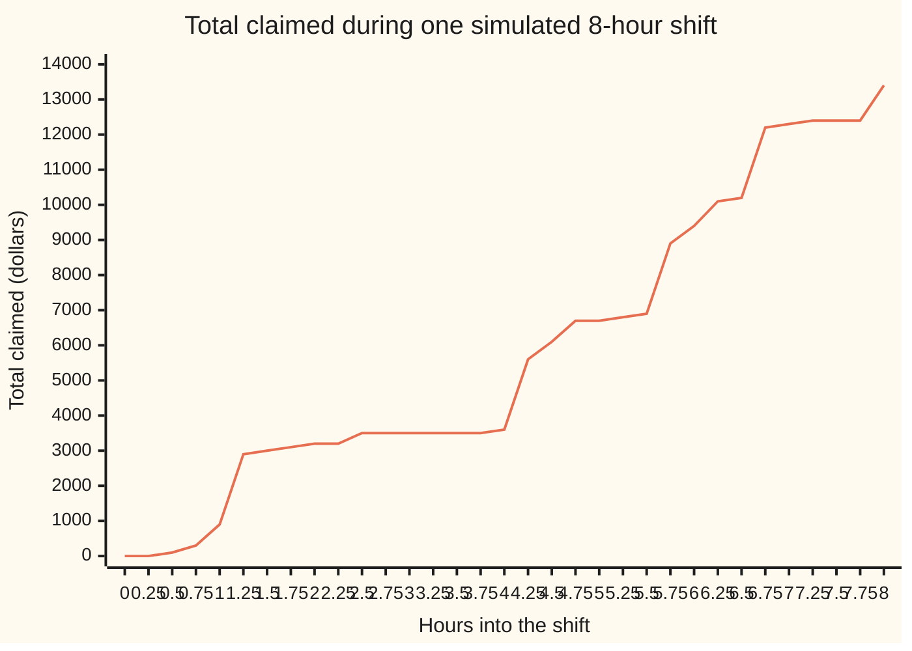
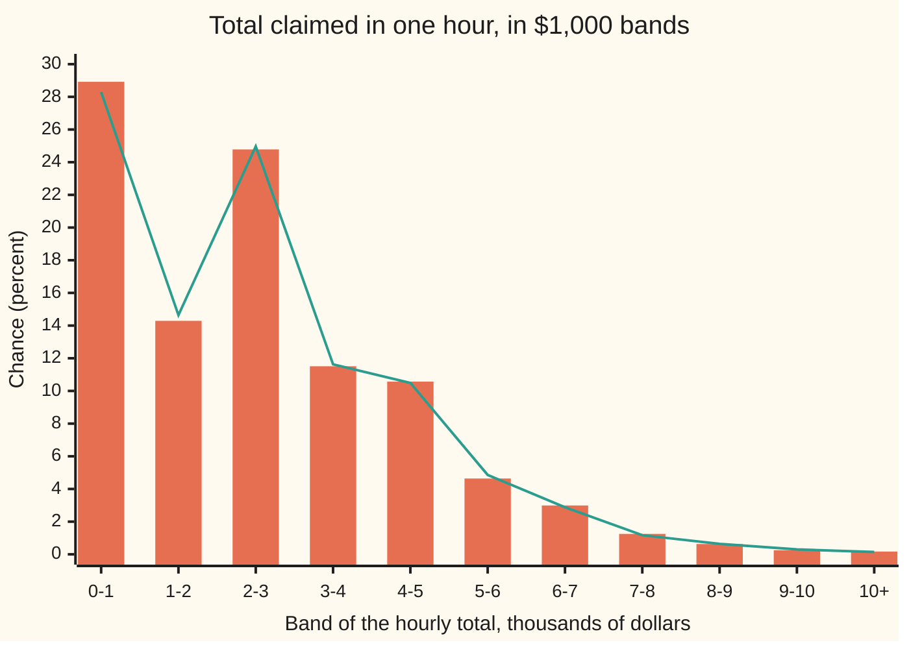

# Compound Poisson: random arrivals with random sizes

[Syllabus](../../../SYLLABUS.md) → [Stochastic processes and calculus](../README.md) → [Poisson and Jump Processes](../README.md#s04) → Compound Poisson

---

## General Overview

A home-contents insurer runs a claims desk. Claims reach it at an average of 4 an hour, at unpredictable moments. Each claim has a size. Half are $100, a cracked phone screen. Three in ten are $500, a ruined sofa. Two in ten are $2,000, a burst pipe. The average claim is $600.

The desk wants the total claimed in an hour, and in an 8-hour shift. The average is easy to guess: 4 claims at $600 is $2,400 an hour. The spread is not. Two things are random at once: how many claims arrive, and how large each one is. An hour can bring no claims at all, about 1 time in 55, or three burst pipes. The standard deviation of the hourly total turns out to be $1,876.17, larger than a guess from either source alone.

A running total built this way, random arrivals each adding a random amount, is a **compound Poisson process**. This card derives its mean, its variance and its moment generating function, which holds every moment at once and bounds the chance of a very bad hour.

**The total of a Poisson stream of independent, identically distributed claims has mean "rate × time × average claim", variance "rate × time × average squared claim", and a moment generating function that is e raised to "rate × time × (the claim's generating function minus 1)".**

**What kind of fact this is:** a theorem, proved on this card in Why it works, with the complete argument in a folded Detailed proof; the process itself is a definition, and using it for a real claims desk is a model.

### The picture: one shift at the claims desk



One line: the running total, a sample path (one run of the process drawn against time). It is one sample, seed 20260929, read on a grid of every 15 minutes, so two claims inside one quarter-hour show as one step. The true path is flat between claims and jumps at each one. This shift brought 30 claims and $13,400, below the 8-hour average of $19,200. Another seed draws another path.

---

## The formula

Notation first, in words. Time $t$ is measured in hours. The claims counted by hour $t$ are $N(t)$, a Poisson process at rate $\lambda$, here 4 an hour ([Poisson process](01-poisson-process.md)); so $N(t)$ follows the Poisson law with mean $\lambda t$ ([Poisson](../../09-Probability%20and%20statistics/03-Discrete%20Distributions/04-poisson.md)). The sizes of the first, second, third claim are $Y_1, Y_2, Y_3, \dots$, drawn independently from one claim law and independently of the arrivals. A generic claim is written $Y$, and the average claim is $\mu = E[Y]$. The total claimed by hour $t$ is

$$S(t) = Y_1 + Y_2 + \dots + Y_{N(t)}, \qquad S(t) = 0 \text{ when } N(t) = 0.$$

The number of terms is itself random. That is the whole difficulty, and the whole idea.

The moment generating function of a claim is $M_Y(s) = E[e^{sY}]$, the average of e raised to the dial times the claim ([Moment generating functions](../../09-Probability%20and%20statistics/02-Random%20Variables/07-moment-generating-functions.md)). That card calls the dial $t$; here $t$ is time, so the dial is $s$, measured per dollar. The three results:

$$E[S(t)] = \lambda t\,\mu, \qquad \operatorname{Var} S(t) = \lambda t\,E[Y^2], \qquad M_{S(t)}(s) = \exp\!\big(\lambda t\,(M_Y(s) - 1)\big).$$

**Read it aloud:** the expected total is the expected number of claims times the average claim; the variance is the expected number of claims times the average *squared* claim; and the generating function of the total is e to the power "expected number of claims times how far the claim's generating function sits above 1".

The claim law here puts chance $p_k$ on size $a_k$: 0.5 on $100, 0.3 on $500, 0.2 on $2,000. So $\mu = \sum_k p_k a_k$ = $600, $E[Y^2] = \sum_k p_k a_k^2$ = 880,000 square dollars, and $M_Y(s) = \sum_k p_k e^{s a_k}$.

| Symbol | Plain meaning | In our example | Push it up and the answer… |
| --- | --- | --- | --- |
| $t$ | time since the desk opened, in hours | 1 hour, or an 8-hour shift | mean, variance and exponent all grow in proportion |
| $\lambda$ | the rate: claims per hour on average | 4 | mean, variance and exponent grow in proportion |
| $N(t)$ | claims that have arrived by hour $t$ | Poisson, mean 4 in an hour | — |
| $Y_i$, $Y$ | the size of claim i; a generic claim | $100, $500 or $2,000 | — |
| $a_k$, $p_k$ | the possible claim sizes and their chances | $100, $500, $2,000; 0.5, 0.3, 0.2 | a bigger large claim moves the variance most |
| $\mu$ | the average claim, $E[Y]$ | $600 | the mean total rises |
| $E[Y^2]$ | the average squared claim | 880,000 | the variance rises |
| $S(t)$ | total claimed by hour $t$ | $2,400 on average in an hour | — |
| $s$ | the dial of a generating function, per dollar | 0.0002 | both generating functions rise, fastest through the largest claim |
| $M_Y(s)$, $M_{S(t)}(s)$ | moment generating functions, $E[e^{sY}]$ and $E[e^{sS(t)}]$ | 1.140017 and 1.750791 | — |
| $\kappa_k$ | the k-th cumulant: k-th derivative at 0 of the log of the generating function; the first two are mean and variance | third, for one hour: 6.5520e9 | — |
| $n$, $S_n$ | a fixed claim count; the sum of the first n claims | 0, 1, 2…; for n = 1, one claim of $100, $500 or $2,000 | — |
| $m$ | slots the hour is cut into | 10 to 10000 | — |
| $x$ | a threshold for the hourly total, in dollars | $10,000 | — |
| $z$, $y$ | shorthand for $M_Y(s)$; the variable of the exponential series, here $\lambda t z$ | $z$ = 1.140017 | — |

The hourly total has the law below: exact bars, simulated line.



Orange bars: the exact law of $S(1)$, computed with no simulation. Green line: the share of 20000 simulated hours in each band, with a standard error of 0.32 percentage points in the first band down to 0.03 in the last, printed by the checks; every band lies within 2 standard errors of its exact bar. The law is lumpy: the $2,000–2,999 band beats the $1,000–1,999 band because one burst pipe alone lands there.

### When it holds

- **Arrivals form a Poisson process at a constant rate.** If the rate itself is random, 2 an hour on calm days and 6 on stormy ones, the mean survives but the variance does not: exactly 4,960,000 against the formula's 3,520,000, because the count now varies more than its mean.
- **Claim sizes independent, with one law, and independent of the arrivals.** A storm that raises both the number and the size of claims ties them together; conditioning on the count then no longer leaves independent sizes, and all three formulas fail.
- **The needed moments exist.** The mean needs $\mu$ finite, the variance $E[Y^2]$ finite, and the generating function needs $M_Y(s)$ finite at the dial used. A heavy-tailed claim law, such as a Pareto law with a finite mean, has $M_Y(s)$ infinite for every $s > 0$: the first formula still holds, the third says nothing.

---

## Why it works

### Step 0: freeze the count, then average over it

For a fixed count of $n$ claims, the total is a plain sum of $n$ independent claims, and sums are easy. The Poisson law then says how often each $n$ happens. Every result below conditions on $N(t)$, then averages over the count's law.

### Step 1: the mean is count times size

Given $N(t) = n$, the total is $Y_1 + \dots + Y_n$, whose mean is $n\mu$. So $E[S(t) \mid N(t)] = N(t)\,\mu$. Averaging over the count,

$$E[S(t)] = E\big[N(t)\,\mu\big] = \lambda t\,\mu.$$

One hour: 4 × $600 = $2,400. One shift: 32 × $600 = $19,200.

### Step 2: the variance has two sources

The law of total variance ([Conditional expectation as a projection](../../10-Measure%20and%20integration/09-Conditional%20Expectation/03-conditional-expectation-as-projection.md)) splits any variance into the average spread given the condition plus the spread of the conditional average:

$$\operatorname{Var} S = E\big[\operatorname{Var}(S \mid N)\big] + \operatorname{Var}\big(E[S \mid N]\big).$$

Given $N = n$, the sizes are independent, so their variances add: $\operatorname{Var}(S \mid N) = N \operatorname{Var} Y$. The conditional mean is $N\mu$, whose variance is $\mu^2 \operatorname{Var} N$. For the Poisson law, $\operatorname{Var} N = E[N] = \lambda t$. So

$$\operatorname{Var} S(t) = \lambda t \operatorname{Var} Y + \lambda t\,\mu^2 = \lambda t\,(\operatorname{Var} Y + \mu^2) = \lambda t\,E[Y^2].$$

The first term is the claims' own spread: 4 × 520,000 = 2,080,000. The second is the count's spread: 4 × 360,000 = 1,440,000. Together, 3,520,000 square dollars, a standard deviation of $1,876.17. The two terms fuse into one only because a Poisson count's variance equals its mean.

### Step 3: the generating function is the Poisson law evaluated at the claim's

Given $N = n$, the total is a sum of $n$ independent claims, so $e^{sS}$ is a product of $n$ independent factors $e^{sY_i}$, and the expectation of a product of independent factors is the product of their expectations:

$$E\big[e^{sS} \mid N = n\big] = M_Y(s)^n.$$

Now average over the Poisson count. Write $z$ for $M_Y(s)$:

$$E[e^{sS}] = \sum_{n=0}^{\infty} e^{-\lambda t}\frac{(\lambda t)^n}{n!}\,z^n = e^{-\lambda t}\,e^{\lambda t z} = e^{\lambda t (z - 1)}.$$

The middle step is the series for the exponential, $\sum_n y^n/n! = e^y$, with $y = \lambda t z$. At $s$ = 0.0002 per dollar: $M_Y(s)$ = 1.140017, the exponent is 4 × 0.140017 = 0.560068, and $M_{S(1)}(s)$ = 1.750791.

### Step 4: every moment falls out, and the shape smooths with time

Take logarithms: $\ln M_{S(t)}(s) = \lambda t\,(M_Y(s) - 1)$. The k-th derivative of $M_Y$ at 0 is $E[Y^k]$ (the generating-function card's main fact). So the k-th derivative of $\ln M_{S(t)}$ at 0, the cumulant $\kappa_k$, is

$$\kappa_k = \lambda t\,E[Y^k].$$

The first two cumulants are the mean and the variance, so Steps 1 and 2 drop out again. The third is the third central moment, $E[(S - E S)^3]$: 4 × 1,638,000,000 = 6.5520e9 for one hour. Divided by the standard deviation cubed, it gives the skewness, a measure of how lopsided the law is: 0.9921 for one hour, a long right side. Every cumulant grows like $t$, so the skewness, a third cumulant over a variance to the power 1.5, falls like $1/\sqrt{t}$: 0.3508 for an 8-hour shift. Over long horizons the total looks more and more bell-shaped.

### Step 5: the continuous clock, as a limit of slots

Cut the hour into $m$ equal slots. In each, let a claim arrive with chance $\lambda/m$, at most one per slot. The generating function is then a product of $m$ independent slot factors:

$$\Big(1 + \frac{\lambda}{m}\,(M_Y(s) - 1)\Big)^m \;\longrightarrow\; e^{\lambda (M_Y(s) - 1)} \quad \text{as } m \to \infty.$$

It is the same limit that turns compound interest into e. The slot variance is $\lambda E[Y^2] - \lambda^2 \mu^2/m$: the slot count has variance $\lambda - \lambda^2/m$, a little below its mean, so the total's variance falls short by exactly $\lambda^2\mu^2/m$. The code prints both errors shrinking tenfold for every tenfold rise in $m$: the variance is short by 576,000 at $m$ = 10 and by 576.00 at $m$ = 10000.

Because the exponent is proportional to $t$, the generating function of a shift is that of one hour raised to the 8th power: $M_{S(8)} = M_{S(1)}^8$, 1.750791^8 = 88.282360. A product of generating functions belongs to a sum of independent pieces: the eight hours of a shift carry independent totals with one shared law.

### Step 6: why the generating function earns its place

Its main practical use is a bound on the chance of a very bad hour. Since $e^{sS} \ge e^{sx}$ whenever $S \ge x$, Markov's inequality ([Markov and Chebyshev](../../09-Probability%20and%20statistics/02-Random%20Variables/08-markov-and-chebyshev-inequalities.md)) gives, for every $s > 0$,

$$P(S \ge x) \le e^{-s x}\,M_S(s).$$

This is the Chernoff bound ([Concentration](../../09-Probability%20and%20statistics/06-Limit%20Theorems%20in%20Practice/06-concentration-inequalities-hoeffding-and-chernoff.md)). At $x$ = $10,000 in one hour, the best dial is $s$ = 0.000856 per dollar, and the bound is 0.016437. The exact chance is 0.001707, about 1 hour in 590. The bound is ten times too cautious, but it needs no simulation, and it falls fast as $x$ grows, as the true tail does. Lundberg's bound on an insurer's chance of ruin is built from the same generating function.

<details>
<summary>Detailed proof</summary>

**Setting.** $N(t)$ is Poisson with mean $\lambda t$. $Y_1, Y_2, \dots$ are independent with a common law, independent of $N(t)$. $S = \sum_{i=1}^{N(t)} Y_i$, with the empty sum 0. Write $S_n = Y_1 + \dots + Y_n$, so $S = S_n$ on $\{N(t) = n\}$.

**1. Mean.** Assume $E|Y| < \infty$. On $\{N = n\}$, $S = S_n$, and $S_n$ is independent of $\{N = n\}$. So $E[|S|] \le \sum_n P(N = n)\,n\,E|Y| = \lambda t\,E|Y| < \infty$, and $E[S] = \sum_n P(N = n)\,E[S_n] = \sum_n P(N = n)\,n\mu = \mu\,E[N] = \lambda t\mu$. The exchange of sum and expectation is justified by the absolute bound (dominated convergence).

**2. Second moment.** Assume $E[Y^2] < \infty$. $E[S_n^2] = \operatorname{Var} S_n + (E S_n)^2 = n \operatorname{Var} Y + n^2\mu^2$, by independence of the $Y_i$. So $E[S^2] = \sum_n P(N = n)(n \operatorname{Var} Y + n^2 \mu^2) = E[N]\operatorname{Var} Y + E[N^2]\mu^2$, every term non-negative, so the rearrangement is justified by monotone convergence. With $E[N] = \lambda t$ and $E[N^2] = \lambda t + (\lambda t)^2$: $\operatorname{Var} S = E[S^2] - (\lambda t \mu)^2 = \lambda t \operatorname{Var} Y + \lambda t \mu^2 = \lambda t E[Y^2]$.

**3. Generating function.** Fix $s$ with $z = M_Y(s) < \infty$. $e^{sS_n} = \prod_{i \le n} e^{sY_i}$, a product of independent non-negative factors, so $E[e^{sS_n}] = z^n$. Summing non-negative terms (monotone convergence), $E[e^{sS}] = \sum_n e^{-\lambda t}(\lambda t)^n z^n / n! = e^{\lambda t(z - 1)}$. If $M_Y(s) = \infty$, the $n = 1$ term alone is infinite, so $M_S(s) = \infty$.

**4. Cumulants.** If $M_Y$ is finite on an interval around 0, it is smooth there with $M_Y^{(k)}(0) = E[Y^k]$ (the generating-function card). Then $\ln M_S(s) = \lambda t(M_Y(s) - 1)$ is smooth near 0, and its k-th derivative at 0 is $\lambda t\,E[Y^k]$.

**5. Chernoff.** For $s > 0$, $\mathbf{1}\{S \ge x\} \le e^{s(S - x)}$ pointwise; take expectations.

</details>

**Another road.** Split the claims by size. The $100 claims, the $500 claims and the $2,000 claims form three independent Poisson processes at rates 2, 1.2 and 0.8 an hour ([Splitting and merging](03-splitting-and-superposition.md)). The total is then $100 N_1 + 500 N_2 + 2000 N_3$, a fixed combination of three independent Poisson counts, and its variance is $100^2 \cdot 2 + 500^2 \cdot 1.2 + 2000^2 \cdot 0.8$ = 20,000 + 300,000 + 3,200,000 = 3,520,000. The same answer, with no conditioning at all, and it shows where the risk sits: the $2,000 claims are a fifth of all claims and 90.9 percent of the variance. Multiplying the three Poisson generating functions gives the third formula the same way.

---

## Worked numbers, by hand

One hour at the desk, $\lambda t$ = 4.

| Step | Arithmetic | Value |
| --- | --- | --- |
| average claim $\mu$ | 0.5 × 100 + 0.3 × 500 + 0.2 × 2,000 | $600 |
| average squared claim | 0.5 × 10,000 + 0.3 × 250,000 + 0.2 × 4,000,000 | 880,000 |
| claim variance | 880,000 − 600^2 | 520,000 |
| **mean total** | 4 × 600 | **$2,400** |
| claims' own spread | 4 × 520,000 | 2,080,000 |
| count's spread | 4 × 600^2 | 1,440,000 |
| **variance of the total** | 2,080,000 + 1,440,000, or 4 × 880,000 | **3,520,000** |
| standard deviation | square root of 3,520,000 | $1,876.17 |
| $M_Y(s)$ at $s$ = 0.0002 | 0.5 e^0.02 + 0.3 e^0.1 + 0.2 e^0.4 | 1.140017 |
| **$M_{S(1)}(s)$** | e^(4 × 0.140017) = e^0.560068 | **1.750791** |
| chance of no claims | e^−4 | 0.018316 |

The desk should expect $2,400 an hour, give or take $1,876.17, and about one hour in 55 with nothing to pay. Over a shift the mean is $19,200 and the standard deviation $5,306.60: eight times the mean, but only the square root of eight times the spread.

### What breaks if you drop a piece

| Mistake | Comes out at | What went wrong |
| --- | --- | --- |
| Variance from the claims' spread only, $\lambda t \operatorname{Var} Y$ | 2,080,000 against 3,520,000 | The count was treated as fixed at 4 |
| Variance from the count only, $\operatorname{Var} N \cdot \mu^2$ | 1,440,000 | Every claim treated as exactly $600 |
| Rate 2 or 6 an hour at random, formula still used | exact variance 4,960,000; no-claim chance 0.068907 against 0.018316 | Poisson arrivals dropped: the count's variance is 8, not 4 |
| Hour cut into 10 slots, one claim at most each | variance 2,944,000 | Two claims in one 6-minute slot were forbidden |

The code prints every row. The third is the one insurers meet: weather makes counts over-dispersed, so a model with the right mean still understates the risk.

---

## Code, from first principles, and it actually runs

Four roads lead to the mean, variance and generating function. The first is the formulas. The second builds the exact law of $S(t)$ on a $100 grid: the claim law added to itself n times, weighted by the Poisson chance of n claims, with every moment read straight off the law. The third cuts the hour into $m$ slots and prints the error shrinking. The fourth simulates 20000 hours from exponential gaps between claims, with a SplitMix64 generator written out (seed 20260930 for the hours, 20260929 for the pictured shift), and prints each estimate with its standard error. The asserts compare the formulas with the exact law, and with the simulation within 4 standard errors. The slot variance is checked against the curvature of the slot generating function's logarithm at 0, and the random-rate row against the two-source variance formula.

### Python

```python
# Compound Poisson -- the check behind the card.  Only math is imported.
# Insurance claims arrive at 4 an hour; each is $100, $500 or $2,000 with
# chances 0.5, 0.3 and 0.2.  S(t) is the total claimed by hour t.  Roads to its
# mean, variance and moment generating function: the formulas; the exact law of
# S(t), built by conditioning on the count and adding claim laws; the hour cut
# into m slots with at most one claim each; and 20000 simulated hours.
import math

LAM, SIZES, PROBS = 4.0, [100, 500, 2000], [0.5, 0.3, 0.2]
SEED, HOURS, DIAL, BIG = 20260929, 20000, 0.0002, 10000
MASK = (1 << 64) - 1

def claim_moment(k):                     # E[Y^k], the claim law's k-th moment
    return sum(p * a ** k for a, p in zip(SIZES, PROBS))

def m_claim(s):                          # M_Y(s) = E[e^(sY)]
    return sum(p * math.exp(s * a) for a, p in zip(SIZES, PROBS))

def m_total(s, lt):                      # the card's formula: exp(lt (M_Y(s) - 1))
    return math.exp(lt * (m_claim(s) - 1))

def exact_law(lt):                       # P(S = 100 x) for x = 0, 1, 2, ...
    nmax = int(lt + 12 * math.sqrt(lt) + 30)
    top = max(SIZES) // 100               # grid steps of $100 in the largest claim
    size = top * (nmax + 1) + 1
    law, conv = [0.0] * size, [0.0] * size
    conv[0], pn, kept = 1.0, math.exp(-lt), 0.0
    for n in range(nmax + 1):            # conv = law of n claims added up
        for x in range(top * n + 1):
            law[x] += pn * conv[x]
        kept += pn
        new = [0.0] * size
        for x in range(top * n + 1):
            for a, p in zip(SIZES, PROBS):
                new[x + a // 100] += conv[x] * p
        conv, pn = new, pn * lt / (n + 1)
    return law, 1.0 - kept

def summary(law):                        # mean, variance, third central moment
    mean = sum(100 * x * q for x, q in enumerate(law))
    var = sum((100 * x - mean) ** 2 * q for x, q in enumerate(law))
    third = sum((100 * x - mean) ** 3 * q for x, q in enumerate(law))
    return mean, var, third

class SplitMix64:                        # the wing's generator, written out
    def __init__(self, seed):
        self.s = seed & MASK
    def uniform(self):
        self.s = (self.s + 0x9E3779B97F4A7C15) & MASK
        z = self.s
        z = ((z ^ (z >> 30)) * 0xBF58476D1CE4E5B9) & MASK
        z = ((z ^ (z >> 27)) * 0x94D049BB133111EB) & MASK
        return ((z ^ (z >> 31)) >> 11) / 9007199254740992.0

def claims_until(g, t):                  # one run: exponential gaps, then sizes
    clock, out = 0.0, []
    while True:
        clock += -math.log(1.0 - g.uniform()) / LAM
        if clock > t:
            return out
        u = g.uniform()
        out.append((clock, 100 if u < 0.5 else (500 if u < 0.8 else 2000)))

mu, m2, m3 = claim_moment(1), claim_moment(2), claim_moment(3)
print(f"claims: {LAM:.0f} an hour, sizes {SIZES} with chances {PROBS}")
print(f"claim law: mean {mu:.2f}, E[Y^2] {m2:.2f}, Var(Y) {m2 - mu * mu:.2f}, E[Y^3] {m3:.0f}")
for a, p in zip(SIZES, PROBS):
    print(f"split stream of ${a} claims: rate {LAM * p:.1f} an hour, adds {a * a * LAM * p:.0f} to the variance,"
          f" {100 * a * a * p / m2:.1f} percent of it")
for t in (1, 8):
    lt = LAM * t
    law, lost = exact_law(lt)
    em, ev, e3 = summary(law)
    mgf_exact = sum(q * math.exp(DIAL * 100 * x) for x, q in enumerate(law))
    print(f"t = {t} h  formula  mean {lt * mu:.2f}  var {lt * m2:.2f}  sd {math.sqrt(lt * m2):.2f}"
          f"  third {lt * m3 / 1e9:.4f}e9  M({DIAL}) {m_total(DIAL, lt):.6f}")
    print(f"t = {t} h  exact    mean {em:.2f}  var {ev:.2f}  sd {math.sqrt(ev):.2f}"
          f"  third {e3 / 1e9:.4f}e9  M({DIAL}) {mgf_exact:.6f}")
    print(f"t = {t} h  skewness {lt * m3 / (lt * m2) ** 1.5:.4f}; P(S = 0) {law[0]:.6f} = e^-{lt:.0f};"
          f" chance left out below 1e-12: {'yes' if lost < 1e-12 else 'no'}")
    assert abs(em - lt * mu) < 1e-6 * lt * mu and abs(ev - lt * m2) < 1e-6 * lt * m2
    assert abs(e3 - lt * m3) < 1e-6 * lt * m3              # third cumulant = lt E[Y^3]
    assert abs(mgf_exact / m_total(DIAL, lt) - 1) < 1e-9
    if t == 1:
        law1 = law
print(f"M_Y({DIAL}) = {m_claim(DIAL):.6f}; exponent {LAM:.0f} x {m_claim(DIAL) - 1:.6f} = {LAM * (m_claim(DIAL) - 1):.6f}")
for m in (10, 100, 1000, 10000):         # the hour in m slots, one claim at most each
    p = LAM / m
    var_m = m * (p * m2 - (p * mu) ** 2)
    mgf_m = math.exp(m * math.log(1 + p * (m_claim(DIAL) - 1)))
    print(f"slots m = {m:5d}: var {var_m:.2f} (short by {LAM * m2 - var_m:.2f}),"
          f" M({DIAL}) {mgf_m:.6f} (short by {m_total(DIAL, LAM) - mgf_m:.6f})")
    lnm = lambda s: m * math.log1p(p * (m_claim(s) - 1))    # ln of the slot MGF
    assert abs((lnm(1e-6) + lnm(-1e-6)) / 1e-12 / var_m - 1) < 1e-5   # its curvature at 0 = variance
assert abs(mgf_m / m_total(DIAL, LAM) - 1) < 1e-4
g, totals = SplitMix64(SEED + 1), []
for _ in range(HOURS):
    totals.append(sum(a for _, a in claims_until(g, 1.0)))
n = len(totals)
sm = sum(totals) / n
c2 = sum((x - sm) ** 2 for x in totals) / n
c4 = sum((x - sm) ** 4 for x in totals) / n
sv = c2 * n / (n - 1)
es = [math.exp(DIAL * x) for x in totals]
se_m, sd_e = (sum(es) / n, math.sqrt(sum((e - sum(es) / n) ** 2 for e in es) / (n - 1)))
zeros = sum(1 for x in totals if x == 0) / n
print(f"simulated {HOURS} hours: mean {sm:.2f} +- {math.sqrt(sv / n):.2f}, var {sv:.0f} +- {math.sqrt((c4 - c2 * c2) / n):.0f},"
      f" M({DIAL}) {se_m:.4f} +- {sd_e / math.sqrt(n):.4f}, P(S = 0) {zeros:.4f} +- {math.sqrt(zeros * (1 - zeros) / n):.4f}")
assert abs(sm - LAM * mu) < 4 * math.sqrt(sv / n) and abs(sv - LAM * m2) < 4 * math.sqrt((c4 - c2 * c2) / n)
assert abs(se_m - m_total(DIAL, LAM)) < 4 * sd_e / math.sqrt(n)
assert abs(zeros - math.exp(-LAM)) < 4 * math.sqrt(zeros * (1 - zeros) / n)
bands = [sum(law1[10 * b:10 * b + 10]) for b in range(10)] + [sum(law1[100:])]
simb = [sum(1 for x in totals if min(x // 1000, 10) == b) / n for b in range(11)]
print(f"figure, exact P(S(1) in $1000 band 0..9, then 10000 up), percent: {', '.join(f'{100 * q:.2f}' for q in bands)}")
print(f"figure, simulated, same bands, percent: {', '.join(f'{100 * q:.2f}' for q in simb)}")
print(f"figure, standard error of each simulated band, percent: {', '.join(f'{100 * math.sqrt(q * (1 - q) / n):.2f}' for q in simb)}")
lo, hi = 0.0, 0.003                      # Chernoff: minimise e^(-s x) M_S(s) over s
for _ in range(200):
    a, b = lo + (hi - lo) / 3, hi - (hi - lo) / 3
    if -a * BIG + LAM * (m_claim(a) - 1) < -b * BIG + LAM * (m_claim(b) - 1):
        hi = b
    else:
        lo = a
bound = math.exp(-lo * BIG + LAM * (m_claim(lo) - 1))
print(f"tail: exact P(S(1) >= {BIG}) {bands[10]:.6f}; MGF bound {bound:.6f} at s = {lo:.6f} per dollar")
assert bands[10] <= bound < 1.0
path = claims_until(SplitMix64(SEED), 8.0)
grid = [sum(a for c, a in path if c <= k / 4) for k in range(33)]
print(f"figure, one simulated shift, total every 15 minutes: {', '.join(str(v) for v in grid)}")
print(f"figure, that shift: {len(path)} claims, total {grid[-1]}, largest claim {max(a for _, a in path)}")
calm, _ = exact_law(2.0)
storm, _ = exact_law(6.0)
mix = [0.5 * (calm[x] if x < len(calm) else 0.0) + 0.5 * storm[x] for x in range(len(storm))]
_, mv, _ = summary(mix)
print(f"mistake, variance from claim spread only, lt Var(Y): {LAM * (m2 - mu * mu):.2f},"
      f" sd {math.sqrt(LAM * (m2 - mu * mu)):.2f}, missing {100 * mu * mu / m2:.1f} percent")
print(f"mistake, variance from the count only, Var(N) mu^2: {LAM * mu * mu:.2f}")
print(f"mistake, rate 2 or 6 an hour at random: exact var {mv:.2f}, P(S = 0) {mix[0]:.6f}; formula at rate 4 says {LAM * m2:.2f}")
assert abs(mv - (4 * (m2 - mu * mu) + 8 * mu * mu)) < 1e-6 * mv        # E[N] Var(Y) + Var(N) mu^2: 4 and 8
print("ALL CHECKS PASS")
```

**Ran 2026-10-07 on macOS, Python 3.14.6, standard library only. All checks passed. Output, pasted from the run:**

```
claims: 4 an hour, sizes [100, 500, 2000] with chances [0.5, 0.3, 0.2]
claim law: mean 600.00, E[Y^2] 880000.00, Var(Y) 520000.00, E[Y^3] 1638000000
split stream of $100 claims: rate 2.0 an hour, adds 20000 to the variance, 0.6 percent of it
split stream of $500 claims: rate 1.2 an hour, adds 300000 to the variance, 8.5 percent of it
split stream of $2000 claims: rate 0.8 an hour, adds 3200000 to the variance, 90.9 percent of it
t = 1 h  formula  mean 2400.00  var 3520000.00  sd 1876.17  third 6.5520e9  M(0.0002) 1.750791
t = 1 h  exact    mean 2400.00  var 3520000.00  sd 1876.17  third 6.5520e9  M(0.0002) 1.750791
t = 1 h  skewness 0.9921; P(S = 0) 0.018316 = e^-4; chance left out below 1e-12: yes
t = 8 h  formula  mean 19200.00  var 28160000.00  sd 5306.60  third 52.4160e9  M(0.0002) 88.282360
t = 8 h  exact    mean 19200.00  var 28160000.00  sd 5306.60  third 52.4160e9  M(0.0002) 88.282360
t = 8 h  skewness 0.3508; P(S = 0) 0.000000 = e^-32; chance left out below 1e-12: yes
M_Y(0.0002) = 1.140017; exponent 4 x 0.140017 = 0.560068
slots m =    10: var 2944000.00 (short by 576000.00), M(0.0002) 1.724515 (short by 0.026276)
slots m =   100: var 3462400.00 (short by 57600.00), M(0.0002) 1.748057 (short by 0.002734)
slots m =  1000: var 3514240.00 (short by 5760.00), M(0.0002) 1.750516 (short by 0.000274)
slots m = 10000: var 3519424.00 (short by 576.00), M(0.0002) 1.750763 (short by 0.000027)
simulated 20000 hours: mean 2408.55 +- 13.19, var 3481926 +- 42697, M(0.0002) 1.7519 +- 0.0059, P(S = 0) 0.0181 +- 0.0009
figure, exact P(S(1) in $1000 band 0..9, then 10000 up), percent: 28.92, 14.29, 24.78, 11.51, 10.57, 4.64, 2.99, 1.25, 0.63, 0.25, 0.17
figure, simulated, same bands, percent: 28.29, 14.64, 24.97, 11.63, 10.49, 4.86, 2.88, 1.17, 0.64, 0.30, 0.14
figure, standard error of each simulated band, percent: 0.32, 0.25, 0.31, 0.23, 0.22, 0.15, 0.12, 0.08, 0.06, 0.04, 0.03
tail: exact P(S(1) >= 10000) 0.001707; MGF bound 0.016437 at s = 0.000856 per dollar
figure, one simulated shift, total every 15 minutes: 0, 0, 100, 300, 900, 2900, 3000, 3100, 3200, 3200, 3500, 3500, 3500, 3500, 3500, 3500, 3600, 5600, 6100, 6700, 6700, 6800, 6900, 8900, 9400, 10100, 10200, 12200, 12300, 12400, 12400, 12400, 13400
figure, that shift: 30 claims, total 13400, largest claim 2000
mistake, variance from claim spread only, lt Var(Y): 2080000.00, sd 1442.22, missing 40.9 percent
mistake, variance from the count only, Var(N) mu^2: 1440000.00
mistake, rate 2 or 6 an hour at random: exact var 4960000.00, P(S = 0) 0.068907; formula at rate 4 says 3520000.00
ALL CHECKS PASS
```

### Rust

Same numbers, same labels, built with `rustc --edition 2021 -O`.

```rust
// Compound Poisson -- the same check as the Python, in Rust.  No crates.
// Insurance claims arrive at 4 an hour; each is $100, $500 or $2,000 with
// chances 0.5, 0.3 and 0.2.  S(t) is the total claimed by hour t.  Roads to its
// mean, variance and moment generating function: the formulas; the exact law of
// S(t), built by conditioning on the count and adding claim laws; the hour cut
// into m slots with at most one claim each; and 20000 simulated hours.
const LAM: f64 = 4.0;
const SIZES: [u64; 3] = [100, 500, 2000];
const PROBS: [f64; 3] = [0.5, 0.3, 0.2];
const SEED: u64 = 20260929;
const HOURS: usize = 20000;
const DIAL: f64 = 0.0002;
const BIG: f64 = 10000.0;

fn claim_moment(k: i32) -> f64 {                    // E[Y^k], the claim law's k-th moment
    (0..3).map(|i| PROBS[i] * (SIZES[i] as f64).powi(k)).sum()
}

fn m_claim(s: f64) -> f64 {                         // M_Y(s) = E[e^(sY)]
    (0..3).map(|i| PROBS[i] * (s * SIZES[i] as f64).exp()).sum()
}

fn m_total(s: f64, lt: f64) -> f64 {                // the card's formula: exp(lt (M_Y(s) - 1))
    (lt * (m_claim(s) - 1.0)).exp()
}

fn exact_law(lt: f64) -> (Vec<f64>, f64) {          // P(S = 100 x) for x = 0, 1, 2, ...
    let nmax = (lt + 12.0 * lt.sqrt() + 30.0) as usize;
    let top = (SIZES[2] / 100) as usize;             // grid steps of $100 in the largest claim
    let size = top * (nmax + 1) + 1;
    let (mut law, mut conv) = (vec![0.0; size], vec![0.0; size]);
    conv[0] = 1.0;
    let (mut pn, mut kept) = ((-lt).exp(), 0.0);
    for n in 0..=nmax {                             // conv = law of n claims added up
        for x in 0..=top * n { law[x] += pn * conv[x] }
        kept += pn;
        let mut new = vec![0.0; size];
        for x in 0..=top * n {
            for i in 0..3 { new[x + (SIZES[i] / 100) as usize] += conv[x] * PROBS[i] }
        }
        conv = new;
        pn = pn * lt / (n + 1) as f64;
    }
    (law, 1.0 - kept)
}

fn summary(law: &[f64]) -> (f64, f64, f64) {        // mean, variance, third central moment
    let mean: f64 = law.iter().enumerate().map(|(x, q)| 100.0 * x as f64 * q).sum();
    let var: f64 = law.iter().enumerate().map(|(x, q)| (100.0 * x as f64 - mean).powi(2) * q).sum();
    let third: f64 = law.iter().enumerate().map(|(x, q)| (100.0 * x as f64 - mean).powi(3) * q).sum();
    (mean, var, third)
}

struct SplitMix64 { s: u64 }                        // the wing's generator, written out
impl SplitMix64 {
    fn uniform(&mut self) -> f64 {
        self.s = self.s.wrapping_add(0x9E3779B97F4A7C15);
        let mut z = self.s;
        z = (z ^ (z >> 30)).wrapping_mul(0xBF58476D1CE4E5B9);
        z = (z ^ (z >> 27)).wrapping_mul(0x94D049BB133111EB);
        ((z ^ (z >> 31)) >> 11) as f64 / 9007199254740992.0
    }
}

fn claims_until(g: &mut SplitMix64, t: f64) -> Vec<(f64, u64)> {  // exponential gaps, then sizes
    let (mut clock, mut out) = (0.0, Vec::new());
    loop {
        clock += -(1.0 - g.uniform()).ln() / LAM;
        if clock > t { return out }
        let u = g.uniform();
        out.push((clock, if u < 0.5 { 100 } else if u < 0.8 { 500 } else { 2000 }));
    }
}

fn join(v: &[f64]) -> String { v.iter().map(|q| format!("{:.2}", 100.0 * q)).collect::<Vec<_>>().join(", ") }

fn main() {
    let (mu, m2, m3) = (claim_moment(1), claim_moment(2), claim_moment(3));
    println!("claims: {:.0} an hour, sizes {:?} with chances {:?}", LAM, SIZES, PROBS);
    println!("claim law: mean {:.2}, E[Y^2] {:.2}, Var(Y) {:.2}, E[Y^3] {:.0}", mu, m2, m2 - mu * mu, m3);
    for i in 0..3 {
        let a = SIZES[i] as f64;
        println!("split stream of ${} claims: rate {:.1} an hour, adds {:.0} to the variance, {:.1} percent of it",
                 SIZES[i], LAM * PROBS[i], a * a * LAM * PROBS[i], 100.0 * a * a * PROBS[i] / m2);
    }
    let mut law1 = Vec::new();
    for t in [1.0f64, 8.0] {
        let lt = LAM * t;
        let (law, lost) = exact_law(lt);
        let (em, ev, e3) = summary(&law);
        let mgf_exact: f64 = law.iter().enumerate().map(|(x, q)| q * (DIAL * 100.0 * x as f64).exp()).sum();
        println!("t = {} h  formula  mean {:.2}  var {:.2}  sd {:.2}  third {:.4}e9  M({}) {:.6}",
                 t, lt * mu, lt * m2, (lt * m2).sqrt(), lt * m3 / 1e9, DIAL, m_total(DIAL, lt));
        println!("t = {} h  exact    mean {:.2}  var {:.2}  sd {:.2}  third {:.4}e9  M({}) {:.6}",
                 t, em, ev, ev.sqrt(), e3 / 1e9, DIAL, mgf_exact);
        println!("t = {} h  skewness {:.4}; P(S = 0) {:.6} = e^-{:.0}; chance left out below 1e-12: {}",
                 t, lt * m3 / (lt * m2).powf(1.5), law[0], lt, if lost < 1e-12 { "yes" } else { "no" });
        assert!((em - lt * mu).abs() < 1e-6 * lt * mu && (ev - lt * m2).abs() < 1e-6 * lt * m2);
        assert!((e3 - lt * m3).abs() < 1e-6 * lt * m3);                // third cumulant = lt E[Y^3]
        assert!((mgf_exact / m_total(DIAL, lt) - 1.0).abs() < 1e-9);
        if t == 1.0 { law1 = law }
    }
    println!("M_Y({}) = {:.6}; exponent {:.0} x {:.6} = {:.6}", DIAL, m_claim(DIAL), LAM, m_claim(DIAL) - 1.0, LAM * (m_claim(DIAL) - 1.0));
    let mut mgf_m = 0.0;
    for m in [10.0f64, 100.0, 1000.0, 10000.0] {        // the hour in m slots, one claim at most each
        let p = LAM / m;
        let var_m = m * (p * m2 - (p * mu).powi(2));
        mgf_m = (m * (1.0 + p * (m_claim(DIAL) - 1.0)).ln()).exp();
        println!("slots m = {:5}: var {:.2} (short by {:.2}), M({}) {:.6} (short by {:.6})",
                 m, var_m, LAM * m2 - var_m, DIAL, mgf_m, m_total(DIAL, LAM) - mgf_m);
        let lnm = |s: f64| m * (p * (m_claim(s) - 1.0)).ln_1p();   // ln of the slot MGF
        assert!(((lnm(1e-6) + lnm(-1e-6)) / 1e-12 / var_m - 1.0).abs() < 1e-5);   // its curvature at 0 = variance
    }
    assert!((mgf_m / m_total(DIAL, LAM) - 1.0).abs() < 1e-4);
    let mut g = SplitMix64 { s: SEED + 1 };
    let totals: Vec<f64> = (0..HOURS).map(|_| claims_until(&mut g, 1.0).iter().map(|c| c.1 as f64).sum()).collect();
    let n = totals.len() as f64;
    let sm = totals.iter().sum::<f64>() / n;
    let c2 = totals.iter().map(|x| (x - sm).powi(2)).sum::<f64>() / n;
    let c4 = totals.iter().map(|x| (x - sm).powi(4)).sum::<f64>() / n;
    let sv = c2 * n / (n - 1.0);
    let es: Vec<f64> = totals.iter().map(|x| (DIAL * x).exp()).collect();
    let se_m = es.iter().sum::<f64>() / n;
    let sd_e = (es.iter().map(|e| (e - se_m).powi(2)).sum::<f64>() / (n - 1.0)).sqrt();
    let zeros = totals.iter().filter(|&&x| x == 0.0).count() as f64 / n;
    println!("simulated {} hours: mean {:.2} +- {:.2}, var {:.0} +- {:.0}, M({}) {:.4} +- {:.4}, P(S = 0) {:.4} +- {:.4}",
             HOURS, sm, (sv / n).sqrt(), sv, ((c4 - c2 * c2) / n).sqrt(), DIAL, se_m, sd_e / n.sqrt(), zeros, (zeros * (1.0 - zeros) / n).sqrt());
    assert!((sm - LAM * mu).abs() < 4.0 * (sv / n).sqrt() && (sv - LAM * m2).abs() < 4.0 * ((c4 - c2 * c2) / n).sqrt());
    assert!((se_m - m_total(DIAL, LAM)).abs() < 4.0 * sd_e / n.sqrt());
    assert!((zeros - (-LAM).exp()).abs() < 4.0 * (zeros * (1.0 - zeros) / n).sqrt());
    let mut bands: Vec<f64> = (0..10).map(|b| law1[10 * b..10 * b + 10].iter().sum()).collect();
    bands.push(law1[100..].iter().sum());
    let simb: Vec<f64> = (0..11).map(|b| totals.iter().filter(|&&x| ((x as u64) / 1000).min(10) == b).count() as f64 / n).collect();
    println!("figure, exact P(S(1) in $1000 band 0..9, then 10000 up), percent: {}", join(&bands));
    println!("figure, simulated, same bands, percent: {}", join(&simb));
    println!("figure, standard error of each simulated band, percent: {}", join(&simb.iter().map(|q| (q * (1.0 - q) / n).sqrt()).collect::<Vec<_>>()));
    let (mut lo, mut hi) = (0.0f64, 0.003f64);          // Chernoff: minimise e^(-s x) M_S(s) over s
    for _ in 0..200 {
        let (a, b) = (lo + (hi - lo) / 3.0, hi - (hi - lo) / 3.0);
        if -a * BIG + LAM * (m_claim(a) - 1.0) < -b * BIG + LAM * (m_claim(b) - 1.0) { hi = b } else { lo = a }
    }
    let bound = (-lo * BIG + LAM * (m_claim(lo) - 1.0)).exp();
    println!("tail: exact P(S(1) >= {}) {:.6}; MGF bound {:.6} at s = {:.6} per dollar", BIG, bands[10], bound, lo);
    assert!(bands[10] <= bound && bound < 1.0);
    let path = claims_until(&mut SplitMix64 { s: SEED }, 8.0);
    let grid: Vec<String> = (0..33).map(|k| path.iter().filter(|c| c.0 <= k as f64 / 4.0).map(|c| c.1).sum::<u64>().to_string()).collect();
    println!("figure, one simulated shift, total every 15 minutes: {}", grid.join(", "));
    println!("figure, that shift: {} claims, total {}, largest claim {}", path.len(), grid[32], path.iter().map(|c| c.1).max().unwrap());
    let (calm, storm) = (exact_law(2.0).0, exact_law(6.0).0);
    let mix: Vec<f64> = (0..storm.len()).map(|x| 0.5 * (if x < calm.len() { calm[x] } else { 0.0 }) + 0.5 * storm[x]).collect();
    let mv = summary(&mix).1;
    println!("mistake, variance from claim spread only, lt Var(Y): {:.2}, sd {:.2}, missing {:.1} percent",
             LAM * (m2 - mu * mu), (LAM * (m2 - mu * mu)).sqrt(), 100.0 * mu * mu / m2);
    println!("mistake, variance from the count only, Var(N) mu^2: {:.2}", LAM * mu * mu);
    println!("mistake, rate 2 or 6 an hour at random: exact var {:.2}, P(S = 0) {:.6}; formula at rate 4 says {:.2}", mv, mix[0], LAM * m2);
    assert!((mv - (4.0 * (m2 - mu * mu) + 8.0 * mu * mu)).abs() < 1e-6 * mv);   // E[N] Var(Y) + Var(N) mu^2: 4 and 8
    println!("ALL CHECKS PASS");
}
```

**Ran 2026-10-07 on macOS, rustc 1.98.1, no crates. All checks passed. Output, pasted from the run:**

```
claims: 4 an hour, sizes [100, 500, 2000] with chances [0.5, 0.3, 0.2]
claim law: mean 600.00, E[Y^2] 880000.00, Var(Y) 520000.00, E[Y^3] 1638000000
split stream of $100 claims: rate 2.0 an hour, adds 20000 to the variance, 0.6 percent of it
split stream of $500 claims: rate 1.2 an hour, adds 300000 to the variance, 8.5 percent of it
split stream of $2000 claims: rate 0.8 an hour, adds 3200000 to the variance, 90.9 percent of it
t = 1 h  formula  mean 2400.00  var 3520000.00  sd 1876.17  third 6.5520e9  M(0.0002) 1.750791
t = 1 h  exact    mean 2400.00  var 3520000.00  sd 1876.17  third 6.5520e9  M(0.0002) 1.750791
t = 1 h  skewness 0.9921; P(S = 0) 0.018316 = e^-4; chance left out below 1e-12: yes
t = 8 h  formula  mean 19200.00  var 28160000.00  sd 5306.60  third 52.4160e9  M(0.0002) 88.282360
t = 8 h  exact    mean 19200.00  var 28160000.00  sd 5306.60  third 52.4160e9  M(0.0002) 88.282360
t = 8 h  skewness 0.3508; P(S = 0) 0.000000 = e^-32; chance left out below 1e-12: yes
M_Y(0.0002) = 1.140017; exponent 4 x 0.140017 = 0.560068
slots m =    10: var 2944000.00 (short by 576000.00), M(0.0002) 1.724515 (short by 0.026276)
slots m =   100: var 3462400.00 (short by 57600.00), M(0.0002) 1.748057 (short by 0.002734)
slots m =  1000: var 3514240.00 (short by 5760.00), M(0.0002) 1.750516 (short by 0.000274)
slots m = 10000: var 3519424.00 (short by 576.00), M(0.0002) 1.750763 (short by 0.000027)
simulated 20000 hours: mean 2408.55 +- 13.19, var 3481926 +- 42697, M(0.0002) 1.7519 +- 0.0059, P(S = 0) 0.0181 +- 0.0009
figure, exact P(S(1) in $1000 band 0..9, then 10000 up), percent: 28.92, 14.29, 24.78, 11.51, 10.57, 4.64, 2.99, 1.25, 0.63, 0.25, 0.17
figure, simulated, same bands, percent: 28.29, 14.64, 24.97, 11.63, 10.49, 4.86, 2.88, 1.17, 0.64, 0.30, 0.14
figure, standard error of each simulated band, percent: 0.32, 0.25, 0.31, 0.23, 0.22, 0.15, 0.12, 0.08, 0.06, 0.04, 0.03
tail: exact P(S(1) >= 10000) 0.001707; MGF bound 0.016437 at s = 0.000856 per dollar
figure, one simulated shift, total every 15 minutes: 0, 0, 100, 300, 900, 2900, 3000, 3100, 3200, 3200, 3500, 3500, 3500, 3500, 3500, 3500, 3600, 5600, 6100, 6700, 6700, 6800, 6900, 8900, 9400, 10100, 10200, 12200, 12300, 12400, 12400, 12400, 13400
figure, that shift: 30 claims, total 13400, largest claim 2000
mistake, variance from claim spread only, lt Var(Y): 2080000.00, sd 1442.22, missing 40.9 percent
mistake, variance from the count only, Var(N) mu^2: 1440000.00
mistake, rate 2 or 6 an hour at random: exact var 4960000.00, P(S = 0) 0.068907; formula at rate 4 says 3520000.00
ALL CHECKS PASS
```

The two outputs match line for line.

> [!TIP]
> **Try changing**
> Guess first, then run it.
> - **Make the burst pipe dearer.** Change 2000 to 4000 in `SIZES` and in `claims_until`. Guess the standard deviation first. The variance becomes 4 × (5,000 + 75,000 + 3,200,000) = 13,120,000, a standard deviation of $3,622.15, nearly double, while the mean rises from $2,400 to $4,000. Every check still passes.
> - **Remove all spread from the claims.** Set all three sizes to 600, in `SIZES` and in `claims_until`. The variance falls to 1,440,000, a standard deviation of $1,200: the count's randomness alone, the second row of What breaks.
> - **Double the rate.** Set `LAM` to 8.0. Mean and variance double to $4,800 and 7,040,000; the standard deviation grows only by the square root of 2, to $2,653.30, and the skewness falls from 0.9921 to 0.7015.
> - **Push the dial too far.** Set `DIAL` to 0.002. The formula gives 5.13 × 10^19; the exact law, kept to hours of at most 58 claims, gives 4.61 × 10^19, and the first generating-function assert stops the run. At that dial the average of $e^{sS}$ is carried by hours so extreme that their chance is below 1 in a trillion: a generating function far from 0 describes the tail, not the typical hour.

---

## The usual mistake

> [!warning]
> **Treating the count as fixed.** Four claims an hour on average is not four claims every hour. With the count frozen at 4, the variance is 4 × 520,000 = 2,080,000, and the standard deviation $1,442.22 instead of $1,876.17. The missing 1,440,000 is the count's own randomness, and it is 40.9 percent of the true variance.
>
> - **Var(Y) where E[Y^2] belongs.** The variance formula uses the average squared claim, 880,000, not the claim variance, 520,000. Only because the Poisson count has variance equal to its mean do the two sources merge into one term.
> - **Adding standard deviations across hours.** Over 8 hours the standard deviation is $5,306.60, not eight times $1,876.17. Independent hours add variances.
> - **Reading the mean as a typical hour.** The hourly law is lumpy and skewed: 28.92 percent of hours fall below $1,000, more than in any other band, while the mean is $2,400.

---

## Where you meet it in real life

- **Insurance.** The collective risk model of an insurer's whole year is this process with a fitted claim law ([Aggregate claims](../../12-Financial%20mathematics/51-Insurance%20and%20Actuarial%20Mathematics/04-collective-risk-and-compound-poisson.md)).
- **Share prices with jumps.** Merton's model adds a compound Poisson stream of jumps to a smooth random drift, so that news can move a price in one step ([Merton jump-diffusion](../../12-Financial%20mathematics/13-Local%20volatility%20and%20jumps/04-merton-jump-diffusion.md)).
- **Work arriving at a server.** Jobs arrive at random, each needing a random amount of processing; the backlog added in a minute is compound Poisson. The M/M/1 queue of [Continuous-time chains](05-continuous-time-markov-chains-and-queues.md) counts the jobs waiting, not the work they bring.
- **Operational losses.** Banks model fraud and system-failure losses as random events with random costs.

> **Say it back**
> A compound Poisson process adds a random amount at each arrival of a Poisson stream. Conditioning on the number of arrivals turns it into a plain sum, then the Poisson law averages the answer. The mean is rate × time × average claim, and the variance is rate × time × average squared claim, because the count's variance equals its mean. The generating function is e to the power rate × time × (the claim's generating function minus 1), and its logarithm hands out every cumulant. At 4 claims an hour averaging $600, an hour costs $2,400 on average with a standard deviation of $1,876.17.

---

## What this builds on

- [Poisson process](01-poisson-process.md): the arrival clock, and the fact that disjoint stretches of time carry independent counts.
- [Moment generating functions](../../09-Probability%20and%20statistics/02-Random%20Variables/07-moment-generating-functions.md): the generating function, and moments as its derivatives at 0.
- [Poisson](../../09-Probability%20and%20statistics/03-Discrete%20Distributions/04-poisson.md): the count's law, with variance equal to mean.

## Where this goes next

- [Merton jump-diffusion](../../12-Financial%20mathematics/13-Local%20volatility%20and%20jumps/04-merton-jump-diffusion.md): compound Poisson jumps inside a share-price model, priced by summing over the jump count.
- [Aggregate claims](../../12-Financial%20mathematics/51-Insurance%20and%20Actuarial%20Mathematics/04-collective-risk-and-compound-poisson.md): the same model fitted to a real book of motor policies, with a heavy-tailed claim law.

The formulas give the mean, the spread and a tail bound, but the exact chance of a bad year came here from brute-force adding; computing that law quickly for a large book is [Panjer's recursion](../../12-Financial%20mathematics/51-Insurance%20and%20Actuarial%20Mathematics/05-panjer-recursion-and-aggregate-claims.md).

---

## Sources

Verified 30 Sep 2026: every link below resolves to the publisher's page.

- Ross, Sheldon M. *Introduction to Probability Models*, 13th ed. Academic Press (Elsevier). [Publisher page](https://shop.elsevier.com/books/introduction-to-probability-models/ross/978-0-443-18761-2). The compound Poisson process in the Poisson chapter, with its mean and variance by conditioning.
- Feller, William. *An Introduction to Probability Theory and Its Applications*, Volume 1, 3rd ed. Wiley. [Publisher page](https://www.wiley.com/en-us/An+Introduction+to+Probability+Theory+and+Its+Applications%2C+Volume+1%2C+3rd+Edition-p-9780471257080). Compound distributions through generating functions, the route of Step 3.
- Klugman, Stuart A., Harry H. Panjer and Gordon E. Willmot. *Loss Models: From Data to Decisions*, 5th ed. Wiley. [Publisher page](https://www.wiley.com/en-us/Loss+Models%3A+From+Data+to+Decisions%2C+5th+Edition-p-9781119523789). Aggregate claims, the splitting road, and why over-dispersed counts break the Poisson variance.
