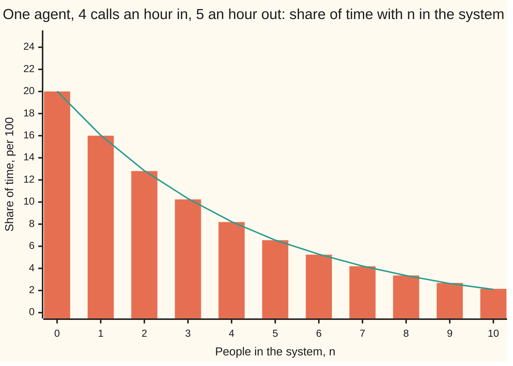
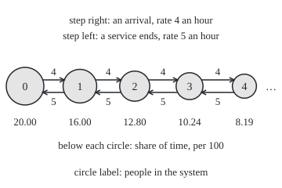
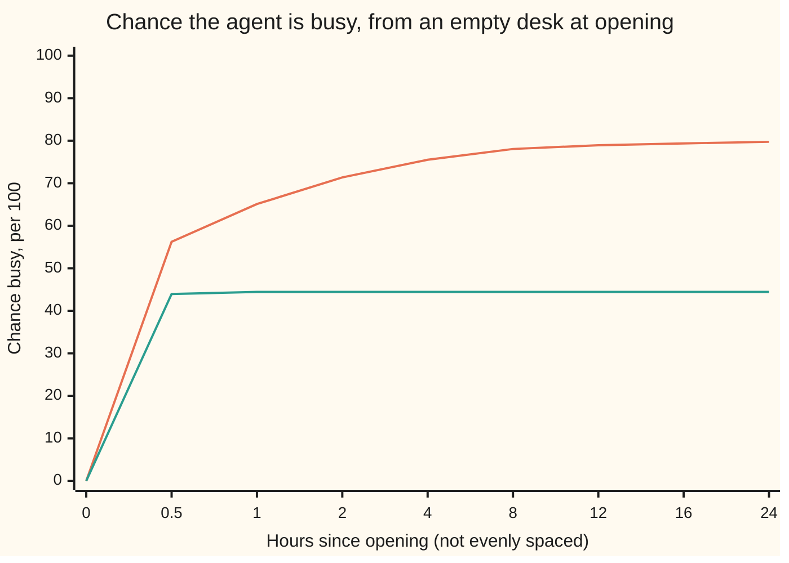

# Continuous-time chains: rates instead of probabilities, and the M/M/1 queue

Stochastic processes and calculus → Poisson and Jump Processes → Chains that jump at random times → Continuous-time chains

---

## General Overview

A help desk has one agent. Calls arrive at random, 4 an hour on average. The agent clears calls at 5 an hour on average while working. Callers who find the agent busy wait on hold, in order. In the long run the agent is busy 80 percent of the time, and on average 4 people are on the line, counting the one being helped.

Nothing here happens on a clock tick: a call can start or end at any instant. So a table of chances for "tomorrow given today" has no step to attach to. What the desk does have is **rates**: 4 arrivals an hour, 5 completions an hour. A chain that jumps between states at random times, driven by rates, is a **continuous-time Markov chain**, the term used from here on.

The card writes the rates as one table, the rate matrix; turns it into chances at any time t through differential equations, the forward equations, solved exactly for a desk with no hold line; and finds the long-run law of the number on the line when callers can wait: the M/M/1 queue.

**A continuous-time Markov chain is described by a rate matrix, whose entries are the rates of jumping from each state to each other; the chances at time t solve a linear differential equation built from it, and the long-run shares solve "rate out equals rate in"; for one server with arrivals at rate 4 and services at rate 5 an hour, the chance of n people in the system is 0.2 × 0.8^n.**

**What kind of fact this is:** a definition (the rate matrix) and a model (exponential gaps between events, an assumption that fits many queues well and some badly), with theorems about it: the forward equations, the two-state solution and the M/M/1 law are proved on this card in Why it works; the long-run time fractions on an endless state space are stated with a named source.

### The picture: how many people are on the line



Bars: the exact long-run share of time with n people in the system, per 100, from the formula on this card. Line: one simulated run of 100,000 hours, drawn with a SplitMix64 generator, seed 20260930, with exact exponential waiting times (no time grid). The two agree to within the run's noise: each simulated share has a block standard error of 0.05 to 0.20 per 100, printed by the checks, and every state lies within about one standard error of its bar. The desk is empty a fifth of the time and holds 10 or more about 1 hour in 9.

---

## The formula

Notation first, in words. The number of people in the system at time t, counted in hours, is $X_t$, the value of the process at time t ([processes-and-paths](../01-Random%20Walks%20and%20Filtrations/01-processes-and-paths.md)). The **rate matrix** of a continuous-time chain, also called its generator (the Q-matrix in Norris), written $G$ in this wing (the letter Q is kept for a second probability measure), is a square table with one row and one column per state. Its entry $g_{ij}$, for two different states $i$ and $j$, is the rate of jumping from $i$ to $j$: in a short time $h$, the chance of that jump is about $g_{ij}\,h$, with an error that shrinks faster than $h$. Each diagonal entry is minus the total rate of leaving, so every row adds to 0:

$$g_{ij} \ge 0 \ (i \ne j), \qquad g_{ii} = -q_i, \qquad q_i = \sum_{j \ne i} g_{ij}.$$

**Read it aloud:** off the diagonal, how fast each jump happens; on the diagonal, minus how fast the chain leaves where it is.

The chances at time t sit in a row $p(t)$, with entry $p_i(t)$ the chance of being in state $i$. They obey the **forward equations**, one linear differential equation for the whole row ([from-one-equation-to-a-system](../../08-Differential%20equations%20and%20dynamics/04-Systems%20and%20the%20Matrix%20Exponential/01-from-one-equation-to-a-system.md)):

$$\frac{d}{dt}\,p(t) = p(t)\,G, \qquad p(t) = p(0)\,e^{tG}.$$

**Read it aloud:** the chances change at the rate "chances now times rate matrix"; the solution is the start times the matrix exponential of t times G.

**The desk with no hold line.** Suppose a caller who finds the agent busy hangs up. The states are idle (0) and busy (1). Idle turns busy at the arrival rate $\lambda$ = 4 an hour; busy turns idle at the service rate $\mu$ = 5 an hour. So `G = [[-4, 4], [5, -5]]`, rows and columns idle then busy. From idle at time 0,

$$p_1(t) = \frac{\lambda}{\lambda + \mu}\left(1 - e^{-(\lambda + \mu)\,t}\right) = \frac{4}{9}\left(1 - e^{-9t}\right).$$

**Read it aloud:** the chance of busy climbs from 0 toward four-ninths, closing the gap at rate 9 an hour.

**The desk with a hold line: M/M/1.** The name: memoryless (exponential) arrival gaps, memoryless service times, one server. The long-run shares $\pi_n$ of time with $n$ people in the system solve $\pi G = 0$, "rate out equals rate in". With $\rho = \lambda / \mu$, the load,

$$\pi_n = (1 - \rho)\,\rho^n \quad (n = 0, 1, 2, \dots), \qquad L = \sum_n n\,\pi_n = \frac{\rho}{1 - \rho}, \qquad \rho < 1.$$

**Read it aloud:** the chance of n people is one minus the load, times the load to the power n; the average number is the load over one minus the load; all of it only if arrivals are slower than services.

| Symbol | Plain meaning | In our example | Push it up and the answer… |
| --- | --- | --- | --- |
| $X_t$, $X_0$, $t$, $h$ | people in the system at time $t$ hours; $h$ a short stretch of time | $X_0$ = 0, the desk opens empty | — |
| $i$, $j$, $n$, $k$ | states; $n$ a number of people; $k$ counts clock ticks in the proofs | 0 idle, 1 busy | — |
| $G$, $g_{ij}$ | rate matrix; rate of jumping from $i$ to $j$, per hour | `[[-4, 4], [5, -5]]` without a hold line | faster jumps, faster settling |
| $q_i$ | total rate of leaving $i$, equal to $-g_{ii}$; the mean stay in $i$ is $1/q_i$ | 4 when idle, 9 when busy with a hold line | shorter stays in $i$ |
| $\lambda$ | arrival rate | 4 an hour | more people waiting, fast |
| $\mu$ | service rate while working | 5 an hour | fewer people waiting |
| $\rho$ | load, $\lambda / \mu$; the share of time busy with a hold line | 0.8 | $L$ blows up as it nears 1 |
| $p(t)$, $p_i(t)$, $P(t)$ | row of chances at time $t$; its entry for state $i$; the table of chances over a stretch $t$, equal to $e^{tG}$ | busy at 15 minutes: 0.3976 | — |
| $\pi$, $\pi_n$, $\pi_i$, $\pi_0$, $\pi_1$ | the stationary distribution: long-run share of time in each state | $\pi_0$ = 0.2, $\pi_1$ = 0.16 | — |
| $L$, $W$ | mean number in the system; mean time a caller spends in it | 4 people; 1 hour | both grow like $1/(1 - \rho)$ |
| $\nu$, $\nu_i$ | the jump chain's stationary distribution: long-run share of visits, not of time | idle in 0.1 of visits | — |
| $C$, $K$, $I$, $J$, $D$, $H$ | a clock rate at least every $q_i$; $K = I + G/C$, a table of chances; $I$ the table that changes nothing; in the proofs, $J$ the jump chain's table, $D$ the leaving rates on a diagonal, $H$ a holding time | $C$ = 9 | — |

### The picture: the M/M/1 chain

<p align="center"></p>

Each state is a number of people. Every arrow to the right is an arrival, at rate 4 an hour; every arrow to the left is a completed call, at rate 5 an hour. Each circle's area is drawn to the scale of its long-run share of time, so each circle has 0.8 of the area of the one before it.

### When it holds

- **Memoryless gaps.** The chance of the next event in the next minute must not depend on how long the chain has sat still. Exponential gaps have it, and they are the only continuous waiting times that do ([exponential-distribution](../../09-Probability%20and%20statistics/04-Continuous%20Distributions/03-exponential-distribution.md)). If every call takes close to the same time, the future depends on how long the current call has run, the number on the line is no longer a Markov chain, and the queue is shorter than M/M/1 says: that is the M/G/1 queue, with general service times, treated in Kleinrock's Chapter 5 (Sources). [renewal-processes-in-outline](06-renewal-processes-in-outline.md) handles arrivals whose gaps are not exponential.
- **Rates that do not change with the clock.** A lunchtime rush that raises the arrival rate for an hour is a different rate matrix for that hour. The formula for $\pi$ then describes no hour of the day.
- **Load below 1, for the long-run law.** With $\lambda > \mu$ the line drifts upward without limit; at $\lambda = \mu$ it keeps emptying but never settles. Either way no stationary distribution exists; the forward equations still hold.
- **Time to settle.** $\pi$ is a long-run statement. From an empty desk at opening, the average number on the line is 3.24 after 8 hours and 3.86 after 24, still short of 4.

---

## Why it works

### Step 0: memoryless waiting turns chances into rates

A continuous-time chain has no step. What it has is a waiting time in each state. If that wait is exponential with rate $q_i$, the chance of leaving within the next $h$ hours is $1 - e^{-q_i h}$, about $q_i\,h$ for short $h$, whatever has happened so far. A chance per unit time that never depends on the past is a rate. That single property, memorylessness, is why a table of rates can replace a table of chances.

### Step 1: build the chain from waits and jumps

A chain on a finite list of states runs like this. In state $i$, wait an exponential time with rate $q_i$. Then jump to $j$ with chance $g_{ij}/q_i$. Repeat. The states visited, ignoring the times, form the **jump chain**, an ordinary Markov chain; the waits are the **holding times**.

Now look at a short stretch $h$. No jump happens with chance $e^{-q_i h} \approx 1 - q_i\,h$. Exactly one jump, to $j$, happens with chance about $q_i\,h \times g_{ij}/q_i = g_{ij}\,h$. Two or more jumps need two exponential events inside $h$, with chance of order $h^2$. So the table of chances over a stretch $h$ is

`P(h) = I + h G + (terms smaller than h)`.

The rate matrix is the slope of the chance table at time 0.

### Step 2: the forward equations

By the Markov property, the move in the next $h$ ignores how the chain reached its state at time $t$. So $p(t + h) = p(t)\,P(h) = p(t) + h\,p(t)\,G$ plus terms smaller than $h$. Subtract $p(t)$, divide by $h$, let $h$ shrink:

$$\frac{d}{dt}\,p(t) = p(t)\,G.$$

Its only solution from $p(0)$ is $p(0)\,e^{tG}$ ([the-matrix-exponential](../../08-Differential%20equations%20and%20dynamics/04-Systems%20and%20the%20Matrix%20Exponential/04-the-matrix-exponential.md)).

### Step 3: the desk with no hold line, solved twice

The busy entry of the forward equations reads $p_1' = \lambda\,p_0 - \mu\,p_1$: chance flows in from idle at rate 4 and out of busy at rate 5. Since $p_0 = 1 - p_1$, this is $p_1' = \lambda - (\lambda + \mu)\,p_1$, a single linear equation. Its solution from $p_1(0) = 0$ is the formula above. The gap to 4/9 halves every 4.62 minutes.

A second road needs no calculus. Run a clock that ticks at rate $C$ = 9 an hour. At each tick, redraw the state from `K = I + G/9 = [[5/9, 4/9], [5/9, 4/9]]`. An idle agent then picks up at 9 × 4/9 = 4 an hour and a busy one finishes at 9 × 5/9 = 5 an hour, the right rates. This is **uniformization**: a chain with bounded rates is a discrete chain run at the ticks of a Poisson clock. Both rows of $K$ are the same, so after the first tick the agent is busy with chance 4/9, whatever came before. At least one tick by time $t$ has chance $1 - e^{-9t}$. Multiply, and $p_1(t) = \tfrac49(1 - e^{-9t})$ again.



Orange: with a hold line (M/M/1), $p(0)\,e^{tG}$ by uniformization, on enough states that the queue cannot outgrow them in 24 hours; it creeps toward 80. Green: no hold line, the formula of Step 3; it reaches 44.44 within the first hour. A hold line keeps the agent busier, and the desk takes many hours to reach its long-run state.

### Step 4: long-run shares balance flows

A row $\pi$ of shares is stationary if starting from it keeps it: $\pi\,e^{tG} = \pi$ for every $t$. Differentiate at $t = 0$ and this gives $\pi G = 0$. Going back, if $\pi G = 0$ then $\pi\,e^{tG} = \pi(I + tG + t^2G^2/2 + \dots) = \pi$. Written out one state at a time, $\pi G = 0$ says

$$\pi_i\,q_i = \sum_{j \ne i} \pi_j\,g_{ji}:$$

the long-run rate of leaving $i$ equals the long-run rate of entering it. This is the balance equation of [stationary-distributions](../03-Markov%20Chains/04-stationary-distributions.md), with rates in place of chances. Stationary does not mean standing still: calls keep arriving and ending, and only the shares stay fixed.

For the desk with no hold line: $4\,\pi_0 = 5\,\pi_1$, so $\pi$ = (5/9, 4/9). The agent is busy 4/9 of the time, about 44 percent. Calls arrive at a rate that ignores the state, so callers see the time shares ("Poisson arrivals see time averages"): about 44 percent hang up, and 2.22 calls an hour are served.

### Step 5: M/M/1, by cutting the line

With a hold line the states are 0, 1, 2, and on without end. Cut the list between $n$ and $n + 1$. The chain crosses that cut upward only by an arrival from $n$, at rate $\lambda$, and downward only by a completion from $n + 1$, at rate $\mu$. Crossings alternate, up then down, so in the long run they happen equally often:

$$\lambda\,\pi_n = \mu\,\pi_{n+1}, \quad \text{so} \quad \pi_{n+1} = \rho\,\pi_n \quad \text{and} \quad \pi_n = \pi_0\,\rho^n.$$

The shares must add to 1. The sum $\pi_0(1 + \rho + \rho^2 + \dots)$ is $\pi_0/(1 - \rho)$ when $\rho < 1$ and endless otherwise. So $\pi_0 = 1 - \rho$ = 0.2, and the agent is busy $1 - \pi_0 = \rho$ = 0.8 of the time. The mean is

$$L = \sum_{n \ge 0} n\,(1 - \rho)\,\rho^n = (1 - \rho)\,\rho\,\frac{1}{(1 - \rho)^2} = \frac{\rho}{1 - \rho},$$

using $\sum n\,\rho^{n-1} = 1/(1-\rho)^2$, the slope of the geometric series. The cut equations are the balance equations of Step 4 rearranged: adding the cuts on either side of $n$ gives rate out of $n$ equals rate in.

### Step 6: shares of time, not of visits

The jump chain visits states; the continuous-time chain spends time in them. A visit to $i$ lasts $1/q_i$ on average. So the share of time in $i$ is the share of visits, weighted by the mean stay and rescaled to add to 1:

$$\pi_i \propto \frac{\nu_i}{q_i}.$$

For the desk with no hold line the jump chain alternates, so each state gets half the visits. Idle spells last longer than busy ones, since the agent leaves idle at rate 4 and busy at rate 5, and weighting by the mean stay turns (1/2, 1/2) into (5/9, 4/9). For M/M/1 the jump chain is idle in only 0.1 of its visits, because each idle spell is followed by a busy period made of many visits; weighted by stays, idle time is 0.2 of the day.

On a chain with bounded rates whose states all reach each other and that has a stationary distribution, the share of time in $i$ up to time $t$ tends to $\pi_i$, on almost every path, from any start. This is the **ergodic theorem** for continuous-time chains. Its proof cuts the path at each return to $i$ and applies the strong law of large numbers, as on [stationary-distributions](../03-Markov%20Chains/04-stationary-distributions.md); for an endless list of states it is stated here, from Norris, Section 3.8. It makes "busy 80 percent of the time" a fact about one long day, not only an average over many desks.

<details>
<summary>Detailed proof</summary>

**What is proved here, and what is cited.** Parts 1 to 4 are complete for a finite list of states. Part 5 is complete for the M/M/1 balance equations; that the chain's long-run time shares equal that solution on the endless list is the ergodic theorem, cited from Norris (Sections 2.6 to 2.8 for the construction and the forward equations with bounded rates, Sections 3.5 and 3.8 for invariant distributions and time averages).

**1. Short-time chances.** From $i$, let $H$ be the holding time, exponential with rate $q_i$, and $H'$ the holding time after a jump to $j$, exponential with the leaving rate of $j$ and independent of $H$. Then $P_i(X_h = i) \ge P(H > h) = e^{-q_i h} = 1 - q_i h + O(h^2)$, where $O(h^2)$ is a term at most a fixed multiple of $h^2$, and, for $j \ne i$, $P_i(X_h = j) \ge P(H \le h)\,\frac{g_{ij}}{q_i}\,P(H' > h) = g_{ij} h + O(h^2)$. The lower bounds add up to $1 - O(h^2)$, and the chances add to 1, so each lower bound is exact up to $O(h^2)$: $P(h) = I + hG + O(h^2)$.

**2. Forward equations.** The Markov property gives $P(t + h) = P(t)\,P(h)$ (Chapman–Kolmogorov). So $\frac{P(t+h) - P(t)}{h} = P(t)\,\frac{P(h) - I}{h} \to P(t)\,G$. The equation $P' = PG$ with $P(0) = I$ is a linear system with constant coefficients; its unique solution is $e^{tG}$. Multiplying by a starting row gives $p(t) = p(0)\,e^{tG}$.

**3. Uniformization.** Let $C \ge \max_i q_i$ and $K = I + G/C$. Its off-diagonal entries are $g_{ij}/C \ge 0$, its diagonal entries $1 - q_i/C \ge 0$, and its rows add to 1: it is a table of chances. Since $I$ and $K$ commute, $e^{tG} = e^{tC(K - I)} = e^{-Ct}\,e^{tCK} = \sum_{k \ge 0} e^{-Ct}\frac{(Ct)^k}{k!}K^k$. The weights are the Poisson chances of $k$ ticks by time $t$. For the two-state desk, $K^k = K$ for $k \ge 1$, so $e^{tG} = e^{-9t} I + (1 - e^{-9t})K$.

**4. Stationary rows.** If $\pi\,e^{tG} = \pi$ for all $t$, the derivative at 0 gives $\pi G = 0$. Conversely $\pi G = 0$ gives $\pi G^m = 0$ for $m \ge 1$, and the series for $e^{tG}$ leaves $\pi$ unchanged. With the jump chain's table $J$, $J_{ij} = g_{ij}/q_i$ for $j \ne i$ and $J_{ii} = 0$, we have $G = D(J - I)$ where $D$ is the diagonal table of the $q_i$. So $\nu J = \nu$ if and only if $(\nu D^{-1})\,G = 0$: the stationary row of the jump chain, divided entry by entry by the leaving rates, is proportional to $\pi$.

**5. M/M/1.** The rate matrix has $g_{n,n+1} = \lambda$, $g_{n+1,n} = \mu$, and $q_0 = \lambda$, $q_n = \lambda + \mu$ for $n \ge 1$. The balance equation at 0 is $\lambda\pi_0 = \mu\pi_1$. At $n \ge 1$ it is $(\lambda + \mu)\pi_n = \lambda\pi_{n-1} + \mu\pi_{n+1}$; subtracting the equation $\lambda\pi_{n-1} = \mu\pi_n$ already found leaves $\lambda\pi_n = \mu\pi_{n+1}$. By induction every cut balances and $\pi_n = \rho^n\pi_0$. For $\rho < 1$ the total fixes $\pi_0 = 1 - \rho$, the only solution. For $\rho \ge 1$ the sum is endless unless $\pi_0 = 0$: no stationary distribution exists.

</details>

**Another road.** Every rate here stays at most 9, so a computer can also step the forward equations forward in time with Euler's method, $p \leftarrow p + h\,p\,G$ ([from-one-equation-to-a-system](../../08-Differential%20equations%20and%20dynamics/04-Systems%20and%20the%20Matrix%20Exponential/01-from-one-equation-to-a-system.md)). The code does, at five step sizes, and prints the error halving with the step.

---

## Worked numbers, by hand

The desk with a hold line, arrivals 4 and services 5 an hour.

| Step | Arithmetic | Value |
| --- | --- | --- |
| load | $\rho = \lambda/\mu$ = 4/5 | 0.8 |
| desk empty | $\pi_0 = 1 - \rho$ | 0.2 |
| one person | $\pi_1 = 0.2 \times 0.8$ | 0.16 |
| two people | $\pi_2 = 0.16 \times 0.8$ | 0.128 |
| 5 or more | $\rho^5$ = 0.8^5 | 0.3277 |
| 10 or more | $\rho^{10}$ = 0.8^10 | 0.1074 |
| mean in system | $L = 0.8 / 0.2$ | **4** |
| mean on hold, not being served | $L - (1 - \pi_0)$ = 4 − 0.8 | 3.2 |
| mean time in system | $W = L/\lambda$ = 4/4 | **1 hour** |

The chance of 5 or more is a sum over every $n$ from 5 up, $(1 - \rho)(\rho^5 + \rho^6 + \dots)$, which the geometric series collapses to $\rho^5$.

A caller spends an hour in the system on average, most of it on hold. The step from $L$ to $W$ is Little's law, $L = \lambda W$, which holds far beyond this queue (queueing-theory-and-littles-law).

The load is the lever. At 4.5, 4.75 and 4.9 arrivals an hour, $\rho$ is 0.90, 0.95 and 0.98, and $L$ is 9.00, 19.00 and 49.00: the line depends on the load through $1/(1 - \rho)$.

### What breaks if you drop a piece

| Mistake | Comes out at | What went wrong |
| --- | --- | --- |
| Read $I + G$ as the chances over one hour | idle row −3.0, 4.0 | Rates are not chances; the one-hour table is $e^{G}$, idle row 0.5556, 0.4444 |
| Use $\rho$ as the busy share with no hold line | 0.8000, against 0.4444 | Callers who hang up never add work; $\rho$ is the busy share only when every caller stays |
| Count visits instead of time | idle 0.1000, against 0.2000 | The jump chain's shares ignore how long each visit lasts |
| Drop $\rho < 1$: 5.5 arrivals an hour | $L$ = −11.00 | No stationary law exists; from empty the true mean is 11.88 at 12 hours and 19.34 at 24, still climbing |

The code prints every row.

---

## Code, from first principles, and it actually runs

The code takes four roads for each desk. No hold line: the closed form; Euler steps at five step sizes, the error printed shrinking; uniformization; and 100,000 simulated mornings read at 15 minutes. M/M/1: the geometric formula; a generic Gaussian-elimination solve of $\pi G = 0$ on 120 states, which knows nothing of cuts; the jump chain reweighted by leaving rates; and one simulated run of 100,000 hours, with standard errors from 100 blocks of 1,000 hours, since neighbouring hours are alike. The M/M/1 desk from empty, at 4 and at 5.5 arrivals an hour, is computed by uniformization and checked against Euler steps of the forward equations on the same 451 states. Random numbers come from SplitMix64, written out, seeds 20260929 and 20260930. The asserts pit each road against an independent one and hold each simulation within 4 standard errors.

### Python

```python
# Continuous-time chains and the M/M/1 queue -- the check behind the card.  Only math primitives.
# One server; calls arrive at 4 an hour; a service ends at rate 5 an hour.  Time is in hours.
# Roads: closed forms; Euler steps; uniformization; a generic solve of pi G = 0; the jump chain
# reweighted by holding times; seeded simulations with standard errors.
from math import exp, log, sqrt
LAM, MU, SEED = 4.0, 5.0, 20260929
RHO, MASK = LAM / MU, (1 << 64) - 1
class SplitMix64:
    def __init__(self, seed): self.s = seed & MASK
    def uniform(self):
        self.s = (self.s + 0x9E3779B97F4A7C15) & MASK
        z = self.s
        z = ((z ^ (z >> 30)) * 0xBF58476D1CE4E5B9) & MASK
        z = ((z ^ (z >> 27)) * 0x94D049BB133111EB) & MASK
        return ((z ^ (z >> 31)) >> 11) / 9007199254740992.0
    def expo(self, rate): return -log(1.0 - self.uniform()) / rate   # a holding time, in hours
def gen(cap, lam=LAM, mu=MU):          # generator G of one server with room for cap in the system
    G = [[0.0] * (cap + 1) for _ in range(cap + 1)]
    for n in range(cap + 1):
        if n < cap: G[n][n + 1] = lam
        if n > 0: G[n][n - 1] = mu
        G[n][n] = -sum(G[n])
    return G
def solve(A, b):                        # Gaussian elimination with partial pivoting
    n = len(A)
    M = [A[i][:] + [b[i]] for i in range(n)]
    for c in range(n):
        piv = max(range(c, n), key=lambda r: abs(M[r][c]))
        M[c], M[piv] = M[piv], M[c]
        for r in range(c + 1, n):
            f = M[r][c] / M[c][c]
            if f != 0.0:
                for k in range(c, n + 1): M[r][k] -= f * M[c][k]
    x = [0.0] * n
    for i in range(n - 1, -1, -1):
        x[i] = (M[i][n] - sum(M[i][k] * x[k] for k in range(i + 1, n))) / M[i][i]
    return x
def stationary(G):                      # pi G = 0, last equation swapped for "shares add to 1"
    n = len(G)
    A = [[G[i][j] for i in range(n)] for j in range(n)]
    A[-1] = [1.0] * n
    return solve(A, [0.0] * (n - 1) + [1.0])
def unif(lam, mu, cap, times, kmax):    # p(t) = sum_k e^(-Ct) (Ct)^k / k! * p(0) K^k, K = I + G/C
    C = lam + mu
    v = [1.0] + [0.0] * cap             # start empty
    w = [exp(-C * t) for t in times]
    out = [[wi * x for x in v] for wi in w]
    for k in range(1, kmax + 1):
        v = [v[n] * (1.0 - (lam if n < cap else 0.0) / C - (mu if n > 0 else 0.0) / C)
             + (v[n - 1] * lam / C if n > 0 else 0.0) + (v[n + 1] * mu / C if n < cap else 0.0) for n in range(cap + 1)]
        for i in range(len(times)):
            w[i] *= C * times[i] / k
            out[i] = [o + w[i] * x for o, x in zip(out[i], v)]
    return out
G2 = gen(1)
exact = lambda t: LAM / (LAM + MU) * (1.0 - exp(-(LAM + MU) * t))
print("two-state G, rows idle, busy: " + "; ".join(", ".join(f"{x:.1f}" for x in r) for r in G2))
print(f"road 1, closed form, busy from idle: 6 min {exact(0.1):.4f}, 15 min {exact(0.25):.4f}, long run 4/9 = {LAM / (LAM + MU):.4f}")
print(f"half-way to 4/9 after ln 2 / 9 hours = {60 * log(2) / (LAM + MU):.2f} min; served per hour {LAM * MU / (LAM + MU):.2f}")
errs = []
for steps in (5, 10, 20, 40, 80):
    h, p = 0.25 / steps, [1.0, 0.0]
    for _ in range(steps): p = [p[0] + h * (p[0] * G2[0][0] + p[1] * G2[1][0]), p[1] + h * (p[0] * G2[0][1] + p[1] * G2[1][1])]
    errs.append(abs(p[1] - exact(0.25)))
    print(f"road 2, Euler step {60 * h:.4f} min: busy at 15 min {p[1]:.6f}, error {errs[-1]:.6f}")
assert errs[-1] < errs[0] / 10          # first-order method, step 16 times smaller
u2 = unif(LAM, MU, 1, [0.25], 40)[0][1]
print(f"road 3, uniformization, busy at 15 min: {u2:.10f}; closed form {exact(0.25):.10f}")
assert abs(u2 - exact(0.25)) < 1e-12
g, R, busy = SplitMix64(SEED), 100000, 0
for _ in range(R):
    t, s = 0.0, 0
    while True:
        t += g.expo(LAM if s == 0 else MU)
        if t > 0.25: break
        s = 1 - s
    busy += s
ph, se = busy / R, sqrt(busy / R * (1 - busy / R) / R)
print(f"road 4, simulated busy at 15 min, {R} runs: {ph:.4f} +- {se:.4f}")
assert abs(ph - exact(0.25)) < 4 * se
nu2 = stationary([[G2[i][j] / -G2[i][i] for j in range(2)] for i in range(2)])
print(f"jump chain of the two-state server, visit shares: {nu2[0]:.4f}, {nu2[1]:.4f}; divided by leaving rates and rescaled: "
      f"{nu2[0] / LAM / (nu2[0] / LAM + nu2[1] / MU):.4f}, {nu2[1] / MU / (nu2[0] / LAM + nu2[1] / MU):.4f}")
CAP, G = 119, gen(119)
pi = stationary(G)
geo = [(1 - RHO) * RHO ** n for n in range(CAP + 1)]
print("figure, road 1, geometric law per 100, n = 0..10: " + ", ".join(f"{100 * x:.2f}" for x in geo[:11]))
print("road 2, generic solve of pi G = 0 on 120 states, per 100: " + ", ".join(f"{100 * x:.2f}" for x in pi[:11]))
assert max(abs(pi[n] - geo[n]) for n in range(CAP + 1)) < 1e-9
q = [-G[i][i] for i in range(CAP + 1)]
nu = stationary([[G[i][j] / q[i] for j in range(CAP + 1)] for i in range(CAP + 1)])
tot = sum(nu[i] / q[i] for i in range(CAP + 1))
print(f"road 3, jump chain: idle share of visits {nu[0]:.4f}, of time after dividing by leaving rates {nu[0] / q[0] / tot:.4f}")
assert abs(nu[0] / q[0] / tot - (1 - RHO)) < 1e-9
L, tail = sum(n * pi[n] for n in range(CAP + 1)), 1 - sum(pi[:10])
print(f"busy {1 - pi[0]:.4f}; mean in system L: formula {RHO / (1 - RHO):.4f}, solve {L:.4f}; waiting (not in service) {L - (1 - pi[0]):.4f}")
print(f"P(X >= 5) {RHO ** 5:.4f}; P(X >= 10): formula {RHO ** 10:.4f}, solve {tail:.4f}; Little: W = L / lam = {L / LAM:.4f} h")
g, n, B, T = SplitMix64(SEED + 1), 0, 100, 1000.0
bb, bl, bt, occ = [], [], [], [[0.0] * 11 for _ in range(B)]
for b in range(B):
    t = sb = sl = st = 0.0
    while True:
        rate = LAM + (MU if n > 0 else 0.0)
        h = g.expo(rate)
        last = h >= T - t
        h = T - t if last else h
        sb, sl, st = sb + (h if n > 0 else 0.0), sl + h * n, st + (h if n >= 10 else 0.0)
        if n <= 10: occ[b][n] += h
        if last: break
        t += h
        n += 1 if n == 0 or g.uniform() < LAM / rate else -1
    bb.append(sb / T); bl.append(sl / T); bt.append(st / T)
def mse(xs):
    m = sum(xs) / len(xs)
    return m, sqrt(sum((x - m) ** 2 for x in xs) / (len(xs) - 1) / len(xs))
(mb, sb), (ml, sl), (mt, st) = mse(bb), mse(bl), mse(bt)
print(f"road 4, simulated {B * T:.0f} hours ({B} blocks of {T:.0f}): busy {mb:.4f} +- {sb:.4f}, L {ml:.3f} +- {sl:.3f}, P(X >= 10) {mt:.4f} +- {st:.4f}")
print("figure, road 4, simulated share of time per 100, n = 0..10: " + ", ".join(f"{100 * sum(o[k] for o in occ) / (B * T):.2f}" for k in range(11)))
print("road 4, block standard error of each share, per 100, n = 0..10: " + ", ".join(f"{100 * mse([o[k] / T for o in occ])[1]:.2f}" for k in range(11)))
assert abs(mb - RHO) < 4 * sb
assert abs(ml - RHO / (1 - RHO)) < 4 * sl
print("push lam to 4.5, 4.75, 4.9: rho " + ", ".join(f"{a / MU:.2f} gives L {a / MU / (1 - a / MU):.2f}" for a in (4.5, 4.75, 4.9)))
times = [0.0, 0.5, 1.0, 2.0, 4.0, 8.0, 12.0, 16.0, 24.0]
tr = unif(LAM, MU, 450, times, 420)
print("figure, M/M/1 from empty, busy per 100 at hours 0, 0.5, 1, 2, 4, 8, 12, 16, 24: " + ", ".join(f"{100 * (1 - p[0]):.2f}" for p in tr))
print("figure, two-state from idle, busy per 100 at the same hours: " + ", ".join(f"{100 * exact(t):.2f}" for t in times))
print(f"M/M/1 from empty, mean in system at 8 h {sum(k * x for k, x in enumerate(tr[5])):.2f}, at 24 h {sum(k * x for k, x in enumerate(tr[8])):.2f}")
un = unif(5.5, MU, 450, [12.0, 24.0], 450)
print(f"mistake, lam 5.5 > mu: formula L = {5.5 / MU / (1 - 5.5 / MU):.2f}; true mean from empty at 12 h {sum(k * x for k, x in enumerate(un[0])):.2f}, at 24 h {sum(k * x for k, x in enumerate(un[1])):.2f}")
for lam, ref, t in ((LAM, tr[5], 8.0), (LAM, tr[8], 24.0), (5.5, un[0], 12.0), (5.5, un[1], 24.0)):   # road 2 for the transient: Euler on the same 451 states
    p = [1.0] + [0.0] * 450
    for _ in range(round(500 * t)): p = [x + 0.002 * ((p[n - 1] * lam if n else 0.0) + (p[n + 1] * MU if n < 450 else 0.0) - x * ((lam if n < 450 else 0.0) + (MU if n else 0.0))) for n, x in enumerate(p)]
    gap, eu = max(abs(x - y) for x, y in zip(p, ref)), sum(k * x for k, x in enumerate(p))
    print(f"road 2 for the transient, Euler step 0.002 h, arrivals {lam:.2f}, empty to {t:.0f} h: mean in system {eu:.2f}, largest gap to uniformization in any state's chance {gap:.6f}")
    assert gap < 1e-4 and abs(eu - sum(k * x for k, x in enumerate(ref))) < 1e-3
print(f"mistake, I + G read as one-hour chances, idle row: {1 + G2[0][0]:.1f}, {G2[0][1]:.1f}; true one-hour row {1 - exact(1.0):.4f}, {exact(1.0):.4f}")
print(f"mistake, rho as the busy share with no waiting room: {RHO:.4f}; true {LAM / (LAM + MU):.4f}")
r = [24 * sqrt(pi[k] / pi[0]) for k in range(5)]
print("figure, circle radius 24 sqrt(pi_n / pi_0), n = 0..4: " + ", ".join(f"{x:.2f}" for x in r) + "; centres x 32, 102, 172, 242, 312, y 110")
print("ALL CHECKS PASS")
```

**Ran 2026-10-07 on macOS, Python 3.14.6, standard library only. All checks passed. Output, pasted from the run:**

```
two-state G, rows idle, busy: -4.0, 4.0; 5.0, -5.0
road 1, closed form, busy from idle: 6 min 0.2637, 15 min 0.3976, long run 4/9 = 0.4444
half-way to 4/9 after ln 2 / 9 hours = 4.62 min; served per hour 2.22
road 2, Euler step 3.0000 min: busy at 15 min 0.422076, error 0.024476
road 2, Euler step 1.5000 min: busy at 15 min 0.409704, error 0.012104
road 2, Euler step 0.7500 min: busy at 15 min 0.403595, error 0.005995
road 2, Euler step 0.3750 min: busy at 15 min 0.400582, error 0.002981
road 2, Euler step 0.1875 min: busy at 15 min 0.399087, error 0.001486
road 3, uniformization, busy at 15 min: 0.3976003446; closed form 0.3976003446
road 4, simulated busy at 15 min, 100000 runs: 0.4007 +- 0.0015
jump chain of the two-state server, visit shares: 0.5000, 0.5000; divided by leaving rates and rescaled: 0.5556, 0.4444
figure, road 1, geometric law per 100, n = 0..10: 20.00, 16.00, 12.80, 10.24, 8.19, 6.55, 5.24, 4.19, 3.36, 2.68, 2.15
road 2, generic solve of pi G = 0 on 120 states, per 100: 20.00, 16.00, 12.80, 10.24, 8.19, 6.55, 5.24, 4.19, 3.36, 2.68, 2.15
road 3, jump chain: idle share of visits 0.1000, of time after dividing by leaving rates 0.2000
busy 0.8000; mean in system L: formula 4.0000, solve 4.0000; waiting (not in service) 3.2000
P(X >= 5) 0.3277; P(X >= 10): formula 0.1074, solve 0.1074; Little: W = L / lam = 1.0000 h
road 4, simulated 100000 hours (100 blocks of 1000): busy 0.7998 +- 0.0020, L 3.977 +- 0.060, P(X >= 10) 0.1056 +- 0.0037
figure, road 4, simulated share of time per 100, n = 0..10: 20.02, 16.04, 12.83, 10.31, 8.22, 6.55, 5.28, 4.21, 3.35, 2.63, 2.10
road 4, block standard error of each share, per 100, n = 0..10: 0.20, 0.13, 0.10, 0.08, 0.06, 0.06, 0.06, 0.06, 0.06, 0.05, 0.05
push lam to 4.5, 4.75, 4.9: rho 0.90 gives L 9.00, 0.95 gives L 19.00, 0.98 gives L 49.00
figure, M/M/1 from empty, busy per 100 at hours 0, 0.5, 1, 2, 4, 8, 12, 16, 24: 0.00, 56.23, 65.10, 71.36, 75.51, 78.05, 78.94, 79.37, 79.74
figure, two-state from idle, busy per 100 at the same hours: 0.00, 43.95, 44.44, 44.44, 44.44, 44.44, 44.44, 44.44, 44.44
M/M/1 from empty, mean in system at 8 h 3.24, at 24 h 3.86
mistake, lam 5.5 > mu: formula L = -11.00; true mean from empty at 12 h 11.88, at 24 h 19.34
road 2 for the transient, Euler step 0.002 h, arrivals 4.00, empty to 8 h: mean in system 3.24, largest gap to uniformization in any state's chance 0.000007
road 2 for the transient, Euler step 0.002 h, arrivals 4.00, empty to 24 h: mean in system 3.86, largest gap to uniformization in any state's chance 0.000001
road 2 for the transient, Euler step 0.002 h, arrivals 5.50, empty to 12 h: mean in system 11.88, largest gap to uniformization in any state's chance 0.000005
road 2 for the transient, Euler step 0.002 h, arrivals 5.50, empty to 24 h: mean in system 19.34, largest gap to uniformization in any state's chance 0.000002
mistake, I + G read as one-hour chances, idle row: -3.0, 4.0; true one-hour row 0.5556, 0.4444
mistake, rho as the busy share with no waiting room: 0.8000; true 0.4444
figure, circle radius 24 sqrt(pi_n / pi_0), n = 0..4: 24.00, 21.47, 19.20, 17.17, 15.36; centres x 32, 102, 172, 242, 312, y 110
ALL CHECKS PASS
```

### Rust

```rust
// Continuous-time chains and the M/M/1 queue -- the check behind the card.  std only.
// One server; calls arrive at 4 an hour; a service ends at rate 5 an hour.  Time is in hours.
// Roads: closed forms; Euler steps; uniformization; a generic solve of pi G = 0; the jump chain
// reweighted by holding times; seeded simulations with standard errors.
const LAM: f64 = 4.0;
const MU: f64 = 5.0;
const SEED: u64 = 20260929;
const RHO: f64 = LAM / MU;
type M = Vec<Vec<f64>>;
struct SplitMix64(u64);
impl SplitMix64 {
    fn uniform(&mut self) -> f64 {
        self.0 = self.0.wrapping_add(0x9E3779B97F4A7C15);
        let mut z = self.0;
        z = (z ^ (z >> 30)).wrapping_mul(0xBF58476D1CE4E5B9);
        z = (z ^ (z >> 27)).wrapping_mul(0x94D049BB133111EB);
        ((z ^ (z >> 31)) >> 11) as f64 / 9007199254740992.0
    }
    fn expo(&mut self, rate: f64) -> f64 { -(1.0 - self.uniform()).ln() / rate } // a holding time, in hours
}
fn gen(cap: usize, lam: f64, mu: f64) -> M { // generator G of one server with room for cap in the system
    let mut g = vec![vec![0.0; cap + 1]; cap + 1];
    for n in 0..=cap {
        if n < cap { g[n][n + 1] = lam; }
        if n > 0 { g[n][n - 1] = mu; }
        g[n][n] = -g[n].iter().fold(0.0, |s, x| s + x);
    }
    g
}
fn solve(a: &M, b: &[f64]) -> Vec<f64> { // Gaussian elimination with partial pivoting
    let n = a.len();
    let mut m: M = (0..n).map(|i| { let mut r = a[i].clone(); r.push(b[i]); r }).collect();
    for c in 0..n {
        let mut piv = c;
        for r in c + 1..n { if m[r][c].abs() > m[piv][c].abs() { piv = r; } }
        m.swap(c, piv);
        for r in c + 1..n {
            let f = m[r][c] / m[c][c];
            if f != 0.0 { for k in c..=n { m[r][k] -= f * m[c][k]; } }
        }
    }
    let mut x = vec![0.0; n];
    for i in (0..n).rev() {
        let s = (i + 1..n).fold(0.0, |s, k| s + m[i][k] * x[k]);
        x[i] = (m[i][n] - s) / m[i][i];
    }
    x
}
fn stationary(g: &M) -> Vec<f64> { // pi G = 0, last equation swapped for "shares add to 1"
    let n = g.len();
    let mut a: M = (0..n).map(|j| (0..n).map(|i| g[i][j]).collect()).collect();
    a[n - 1] = vec![1.0; n];
    let mut b = vec![0.0; n]; b[n - 1] = 1.0;
    solve(&a, &b)
}
fn unif(lam: f64, mu: f64, cap: usize, times: &[f64], kmax: usize) -> M { // sum_k e^(-Ct) (Ct)^k / k! p(0) K^k
    let c = lam + mu;
    let mut v = vec![0.0; cap + 1];
    v[0] = 1.0; // start empty
    let mut w: Vec<f64> = times.iter().map(|t| (-c * t).exp()).collect();
    let mut out: M = w.iter().map(|wi| v.iter().map(|x| wi * x).collect()).collect();
    for k in 1..=kmax {
        v = (0..=cap).map(|n| v[n] * (1.0 - (if n < cap { lam } else { 0.0 }) / c - (if n > 0 { mu } else { 0.0 }) / c)
            + (if n > 0 { v[n - 1] * lam / c } else { 0.0 }) + (if n < cap { v[n + 1] * mu / c } else { 0.0 })).collect();
        for i in 0..times.len() {
            w[i] *= c * times[i] / k as f64;
            for n in 0..=cap { out[i][n] = out[i][n] + w[i] * v[n]; }
        }
    }
    out
}
fn exact(t: f64) -> f64 { LAM / (LAM + MU) * (1.0 - (-(LAM + MU) * t).exp()) }
fn mean(p: &[f64]) -> f64 { p.iter().enumerate().fold(0.0, |s, (k, x)| s + k as f64 * x) }
fn mse(xs: &[f64]) -> (f64, f64) {
    let n = xs.len() as f64;
    let m = xs.iter().fold(0.0, |s, x| s + x) / n;
    (m, (xs.iter().fold(0.0, |s, x| s + (x - m).powi(2)) / (n - 1.0) / n).sqrt())
}
fn j(v: &[f64], scale: f64) -> String { v.iter().map(|x| format!("{:.2}", scale * x)).collect::<Vec<_>>().join(", ") }
fn main() {
    let g2 = gen(1, LAM, MU);
    println!("two-state G, rows idle, busy: {}", g2.iter().map(|r| r.iter().map(|x| format!("{:.1}", x)).collect::<Vec<_>>().join(", ")).collect::<Vec<_>>().join("; "));
    println!("road 1, closed form, busy from idle: 6 min {:.4}, 15 min {:.4}, long run 4/9 = {:.4}", exact(0.1), exact(0.25), LAM / (LAM + MU));
    println!("half-way to 4/9 after ln 2 / 9 hours = {:.2} min; served per hour {:.2}", 60.0 * 2f64.ln() / (LAM + MU), LAM * MU / (LAM + MU));
    let mut errs = Vec::new();
    for steps in [5usize, 10, 20, 40, 80] {
        let (h, mut p) = (0.25 / steps as f64, [1.0, 0.0]);
        for _ in 0..steps { p = [p[0] + h * (p[0] * g2[0][0] + p[1] * g2[1][0]), p[1] + h * (p[0] * g2[0][1] + p[1] * g2[1][1])]; }
        errs.push((p[1] - exact(0.25)).abs());
        println!("road 2, Euler step {:.4} min: busy at 15 min {:.6}, error {:.6}", 60.0 * h, p[1], errs[errs.len() - 1]);
    }
    assert!(errs[4] < errs[0] / 10.0); // first-order method, step 16 times smaller
    let u2 = unif(LAM, MU, 1, &[0.25], 40)[0][1];
    println!("road 3, uniformization, busy at 15 min: {:.10}; closed form {:.10}", u2, exact(0.25));
    assert!((u2 - exact(0.25)).abs() < 1e-12);
    let (mut g, r, mut busy) = (SplitMix64(SEED), 100000usize, 0usize);
    for _ in 0..r {
        let (mut t, mut s) = (0.0, 0usize);
        loop {
            t += g.expo(if s == 0 { LAM } else { MU });
            if t > 0.25 { break; }
            s = 1 - s;
        }
        busy += s;
    }
    let ph = busy as f64 / r as f64;
    let se = (busy as f64 / r as f64 * (1.0 - busy as f64 / r as f64) / r as f64).sqrt();
    println!("road 4, simulated busy at 15 min, {} runs: {:.4} +- {:.4}", r, ph, se);
    assert!((ph - exact(0.25)).abs() < 4.0 * se);
    let nu2 = stationary(&(0..2).map(|i| (0..2).map(|k| g2[i][k] / -g2[i][i]).collect()).collect());
    println!("jump chain of the two-state server, visit shares: {:.4}, {:.4}; divided by leaving rates and rescaled: {:.4}, {:.4}",
        nu2[0], nu2[1], nu2[0] / LAM / (nu2[0] / LAM + nu2[1] / MU), nu2[1] / MU / (nu2[0] / LAM + nu2[1] / MU));
    let (cap, gm) = (119usize, gen(119, LAM, MU));
    let pi = stationary(&gm);
    let geo: Vec<f64> = (0..=cap).map(|n| (1.0 - RHO) * RHO.powf(n as f64)).collect();
    println!("figure, road 1, geometric law per 100, n = 0..10: {}", j(&geo[..11], 100.0));
    println!("road 2, generic solve of pi G = 0 on 120 states, per 100: {}", j(&pi[..11], 100.0));
    assert!((0..=cap).fold(0.0f64, |m, n| m.max((pi[n] - geo[n]).abs())) < 1e-9);
    let q: Vec<f64> = (0..=cap).map(|i| -gm[i][i]).collect();
    let nu = stationary(&(0..=cap).map(|i| (0..=cap).map(|k| gm[i][k] / q[i]).collect()).collect());
    let tot = (0..=cap).fold(0.0, |s, i| s + nu[i] / q[i]);
    println!("road 3, jump chain: idle share of visits {:.4}, of time after dividing by leaving rates {:.4}", nu[0], nu[0] / q[0] / tot);
    assert!((nu[0] / q[0] / tot - (1.0 - RHO)).abs() < 1e-9);
    let (l, tail) = (mean(&pi), 1.0 - pi[..10].iter().fold(0.0, |s, x| s + x));
    println!("busy {:.4}; mean in system L: formula {:.4}, solve {:.4}; waiting (not in service) {:.4}", 1.0 - pi[0], RHO / (1.0 - RHO), l, l - (1.0 - pi[0]));
    println!("P(X >= 5) {:.4}; P(X >= 10): formula {:.4}, solve {:.4}; Little: W = L / lam = {:.4} h", RHO.powf(5.0), RHO.powf(10.0), tail, l / LAM);
    let (mut g, mut n, bn, tt) = (SplitMix64(SEED + 1), 0usize, 100usize, 1000.0);
    let (mut bb, mut bl, mut bt, mut occ) = (Vec::new(), Vec::new(), Vec::new(), (0..bn).map(|_| [0.0f64; 11]).collect::<Vec<_>>());
    for b in 0..bn {
        let (mut t, mut sb, mut sl, mut st) = (0.0, 0.0, 0.0, 0.0);
        loop {
            let rate = LAM + if n > 0 { MU } else { 0.0 };
            let mut h = g.expo(rate);
            let last = h >= tt - t;
            if last { h = tt - t; }
            sb += if n > 0 { h } else { 0.0 }; sl += h * n as f64; st += if n >= 10 { h } else { 0.0 };
            if n <= 10 { occ[b][n] += h; }
            if last { break; }
            t += h;
            if n == 0 || g.uniform() < LAM / rate { n += 1; } else { n -= 1; }
        }
        bb.push(sb / tt); bl.push(sl / tt); bt.push(st / tt);
    }
    let ((mb, sb), (ml, sl), (mt, st)) = (mse(&bb), mse(&bl), mse(&bt));
    println!("road 4, simulated {:.0} hours ({} blocks of {:.0}): busy {:.4} +- {:.4}, L {:.3} +- {:.3}, P(X >= 10) {:.4} +- {:.4}", bn as f64 * tt, bn, tt, mb, sb, ml, sl, mt, st);
    println!("figure, road 4, simulated share of time per 100, n = 0..10: {}", (0..11).map(|k| format!("{:.2}", 100.0 * occ.iter().map(|o| o[k]).sum::<f64>() / (bn as f64 * tt))).collect::<Vec<_>>().join(", "));
    println!("road 4, block standard error of each share, per 100, n = 0..10: {}", j(&(0..11).map(|k| mse(&occ.iter().map(|o| o[k] / tt).collect::<Vec<_>>()).1).collect::<Vec<_>>(), 100.0));
    assert!((mb - RHO).abs() < 4.0 * sb);
    assert!((ml - RHO / (1.0 - RHO)).abs() < 4.0 * sl);
    println!("push lam to 4.5, 4.75, 4.9: rho {}", [4.5, 4.75, 4.9].iter().map(|a| format!("{:.2} gives L {:.2}", a / MU, a / MU / (1.0 - a / MU))).collect::<Vec<_>>().join(", "));
    let times = [0.0, 0.5, 1.0, 2.0, 4.0, 8.0, 12.0, 16.0, 24.0];
    let tr = unif(LAM, MU, 450, &times, 420);
    println!("figure, M/M/1 from empty, busy per 100 at hours 0, 0.5, 1, 2, 4, 8, 12, 16, 24: {}", tr.iter().map(|p| format!("{:.2}", 100.0 * (1.0 - p[0]))).collect::<Vec<_>>().join(", "));
    println!("figure, two-state from idle, busy per 100 at the same hours: {}", times.iter().map(|&t| format!("{:.2}", 100.0 * exact(t))).collect::<Vec<_>>().join(", "));
    println!("M/M/1 from empty, mean in system at 8 h {:.2}, at 24 h {:.2}", mean(&tr[5]), mean(&tr[8]));
    let un = unif(5.5, MU, 450, &[12.0, 24.0], 450);
    println!("mistake, lam 5.5 > mu: formula L = {:.2}; true mean from empty at 12 h {:.2}, at 24 h {:.2}", 5.5 / MU / (1.0 - 5.5 / MU), mean(&un[0]), mean(&un[1]));
    for (lam, refp, t) in [(LAM, &tr[5], 8.0), (LAM, &tr[8], 24.0), (5.5, &un[0], 12.0), (5.5, &un[1], 24.0)] { // road 2 for the transient: Euler on the same 451 states
        let mut p = vec![0.0f64; 451]; p[0] = 1.0;
        for _ in 0..(500.0 * t) as usize { p = (0..451).map(|n| p[n] + 0.002 * ((if n > 0 { p[n - 1] * lam } else { 0.0 }) + (if n < 450 { p[n + 1] * MU } else { 0.0 }) - p[n] * ((if n < 450 { lam } else { 0.0 }) + (if n > 0 { MU } else { 0.0 })))).collect(); }
        let gap = p.iter().zip(refp.iter()).fold(0.0f64, |m, (x, y)| m.max((x - y).abs()));
        println!("road 2 for the transient, Euler step 0.002 h, arrivals {:.2}, empty to {:.0} h: mean in system {:.2}, largest gap to uniformization in any state's chance {:.6}", lam, t, mean(&p), gap);
        assert!(gap < 1e-4 && (mean(&p) - mean(refp)).abs() < 1e-3);
    }
    println!("mistake, I + G read as one-hour chances, idle row: {:.1}, {:.1}; true one-hour row {:.4}, {:.4}", 1.0 + g2[0][0], g2[0][1], 1.0 - exact(1.0), exact(1.0));
    println!("mistake, rho as the busy share with no waiting room: {:.4}; true {:.4}", RHO, LAM / (LAM + MU));
    let rr: Vec<f64> = (0..5).map(|k| 24.0 * (pi[k] / pi[0]).sqrt()).collect();
    println!("figure, circle radius 24 sqrt(pi_n / pi_0), n = 0..4: {}; centres x 32, 102, 172, 242, 312, y 110", j(&rr, 1.0));
    println!("ALL CHECKS PASS");
}
```

**Ran 2026-10-07 on macOS, rustc 1.98.1, no crates. All checks passed. Output, pasted from the run:**

```
two-state G, rows idle, busy: -4.0, 4.0; 5.0, -5.0
road 1, closed form, busy from idle: 6 min 0.2637, 15 min 0.3976, long run 4/9 = 0.4444
half-way to 4/9 after ln 2 / 9 hours = 4.62 min; served per hour 2.22
road 2, Euler step 3.0000 min: busy at 15 min 0.422076, error 0.024476
road 2, Euler step 1.5000 min: busy at 15 min 0.409704, error 0.012104
road 2, Euler step 0.7500 min: busy at 15 min 0.403595, error 0.005995
road 2, Euler step 0.3750 min: busy at 15 min 0.400582, error 0.002981
road 2, Euler step 0.1875 min: busy at 15 min 0.399087, error 0.001486
road 3, uniformization, busy at 15 min: 0.3976003446; closed form 0.3976003446
road 4, simulated busy at 15 min, 100000 runs: 0.4007 +- 0.0015
jump chain of the two-state server, visit shares: 0.5000, 0.5000; divided by leaving rates and rescaled: 0.5556, 0.4444
figure, road 1, geometric law per 100, n = 0..10: 20.00, 16.00, 12.80, 10.24, 8.19, 6.55, 5.24, 4.19, 3.36, 2.68, 2.15
road 2, generic solve of pi G = 0 on 120 states, per 100: 20.00, 16.00, 12.80, 10.24, 8.19, 6.55, 5.24, 4.19, 3.36, 2.68, 2.15
road 3, jump chain: idle share of visits 0.1000, of time after dividing by leaving rates 0.2000
busy 0.8000; mean in system L: formula 4.0000, solve 4.0000; waiting (not in service) 3.2000
P(X >= 5) 0.3277; P(X >= 10): formula 0.1074, solve 0.1074; Little: W = L / lam = 1.0000 h
road 4, simulated 100000 hours (100 blocks of 1000): busy 0.7998 +- 0.0020, L 3.977 +- 0.060, P(X >= 10) 0.1056 +- 0.0037
figure, road 4, simulated share of time per 100, n = 0..10: 20.02, 16.04, 12.83, 10.31, 8.22, 6.55, 5.28, 4.21, 3.35, 2.63, 2.10
road 4, block standard error of each share, per 100, n = 0..10: 0.20, 0.13, 0.10, 0.08, 0.06, 0.06, 0.06, 0.06, 0.06, 0.05, 0.05
push lam to 4.5, 4.75, 4.9: rho 0.90 gives L 9.00, 0.95 gives L 19.00, 0.98 gives L 49.00
figure, M/M/1 from empty, busy per 100 at hours 0, 0.5, 1, 2, 4, 8, 12, 16, 24: 0.00, 56.23, 65.10, 71.36, 75.51, 78.05, 78.94, 79.37, 79.74
figure, two-state from idle, busy per 100 at the same hours: 0.00, 43.95, 44.44, 44.44, 44.44, 44.44, 44.44, 44.44, 44.44
M/M/1 from empty, mean in system at 8 h 3.24, at 24 h 3.86
mistake, lam 5.5 > mu: formula L = -11.00; true mean from empty at 12 h 11.88, at 24 h 19.34
road 2 for the transient, Euler step 0.002 h, arrivals 4.00, empty to 8 h: mean in system 3.24, largest gap to uniformization in any state's chance 0.000007
road 2 for the transient, Euler step 0.002 h, arrivals 4.00, empty to 24 h: mean in system 3.86, largest gap to uniformization in any state's chance 0.000001
road 2 for the transient, Euler step 0.002 h, arrivals 5.50, empty to 12 h: mean in system 11.88, largest gap to uniformization in any state's chance 0.000005
road 2 for the transient, Euler step 0.002 h, arrivals 5.50, empty to 24 h: mean in system 19.34, largest gap to uniformization in any state's chance 0.000002
mistake, I + G read as one-hour chances, idle row: -3.0, 4.0; true one-hour row 0.5556, 0.4444
mistake, rho as the busy share with no waiting room: 0.8000; true 0.4444
figure, circle radius 24 sqrt(pi_n / pi_0), n = 0..4: 24.00, 21.47, 19.20, 17.17, 15.36; centres x 32, 102, 172, 242, 312, y 110
ALL CHECKS PASS
```

The two outputs agree line for line.

> [!TIP]
> **Try changing**
> - **Load the desk.** Guess first: at 4.75 arrivals an hour, does the mean line grow by a fifth, like the arrivals? The `push lam` line says it goes from 4.00 to 19.00. Editing `LAM` itself stops the run at the generic-solve assert, because 120 states are too few to hold a load of 0.95.
> - **Coarsen Euler.** Look at the 3-minute step. Guess first: is the error at 15 minutes near 0.01 or near 0.001? It is 0.024476; halving the step to 1.5 minutes halves it, to 0.012104. Euler's method is first order.
> - **Overload it.** Guess first: at 5.5 arrivals an hour, what does the formula say about the mean line? The `mistake, lam 5.5` line says −11.00, a meaningless number; uniformization shows the mean from empty at 11.88 after 12 hours and 19.34 after 24.

---

## The usual mistake

> [!warning]
> **Treating a rate as a chance.** A rate of 4 an hour is not a chance of 4 per hour, and $I + G$ is not the one-hour table: its idle row reads −3.0, 4.0, which no table of chances can. Rates give chances only over short stretches, about $g_{ij}\,h$ for small $h$, and over any real stretch through $e^{tG}$. The one-hour idle row is 0.5556, 0.4444.
>
> - **Load as utilisation in every system.** $\rho$ = 0.8 is the busy share only when every caller waits. With no hold line the agent is busy 0.4444 of the time.
> - **Visits for time.** The jump chain puts the M/M/1 desk idle in 0.1000 of its visits; the desk is idle 0.2000 of the time.
> - **A long-run law read at opening.** From an empty desk, the mean line is 3.24 after 8 hours, not 4.

---

## Where you meet it in real life

- **Call centres.** Staffing tables come from chains like this one with many agents; the blow-up of $1/(1 - \rho)$ is why centres plan loads well below 1.
- **Computer systems.** A server with one worker is an M/M/1 queue to a first approximation, and the same load curve sets response times. Merged request streams are Poisson again ([splitting-and-superposition](03-splitting-and-superposition.md)).
- **Machines that fail and are repaired.** The two-state chain, with failure and repair rates, gives the share of time a machine is up.
- **Chemistry.** The Gillespie algorithm simulates reacting molecules as the code here simulates the desk: exponential waits, then a jump chosen in proportion to the rates.
- **Credit ratings.** Grades that move at rates form a continuous-time chain; the chance of default by time $t$ is an entry of $e^{tG}$.

> **Say it back**
> A continuous-time Markov chain jumps at random times, and its behaviour is set by a rate matrix: off the diagonal, the rate of each jump; on the diagonal, minus the rate of leaving. The chances at time t solve the forward equations; for a desk with no hold line, the chance of busy climbs to 4/9 at rate 9 an hour. The long-run shares balance rate out against rate in; for one agent with a hold line, cutting between n and n + 1 gives the geometric law 0.2 × 0.8^n, busy 80 percent of the time and 4 people on average. That law needs arrivals slower than services, and it counts time, not visits.

---

## What this builds on

- [poisson-process](01-poisson-process.md): exponential gaps, memorylessness and the Poisson count of ticks, which make rates meaningful and drive uniformization.
- [stationary-distributions](../03-Markov%20Chains/04-stationary-distributions.md): balance equations and long-run time fractions for discrete steps, here rewritten with rates.
- [from-one-equation-to-a-system](../../08-Differential%20equations%20and%20dynamics/04-Systems%20and%20the%20Matrix%20Exponential/01-from-one-equation-to-a-system.md): a linear system x' = Ax, which the forward equations are, with the row of chances as the state.

## Where this goes next

- queueing-theory-and-littles-law: Little's law, $L = \lambda W$, for any queue, and queues with many servers or general service times.
- [renewal-processes-in-outline](06-renewal-processes-in-outline.md), the next card: what survives when the gaps between events are not exponential.

The M/M/1 desk puts a caller in the system for an hour on average, from nothing more than a count of 4 people and an arrival rate of 4 an hour; why that division works for every queue, whatever its gaps, is the question queueing-theory-and-littles-law answers.

---

## Sources

Verified 30 Sep 2026: every link below resolves to the publisher's page.

- Norris, J. R. *Markov Chains*. Cambridge University Press, 1997. [Publisher page](https://www.cambridge.org/core/books/markov-chains/A3F966B10633A32C8F06F37158031739). Chapter 2 builds continuous-time chains from jump chains and holding times and derives the forward and backward equations; Sections 3.5 and 3.8 give invariant distributions and the ergodic theorem cited in Step 6; Section 5.2 treats queues.
- Kleinrock, Leonard. *Queueing Systems, Volume 1: Theory*. Wiley, 1975. [Publisher page](https://www.wiley.com/en-us/Queueing+Systems%2C+Volume+1%3A+Theory-p-9780471491101). Chapter 3 solves birth-and-death queues in equilibrium, M/M/1 first, by the balance argument used here; Chapter 5 treats the M/G/1 queue, with general service times.
