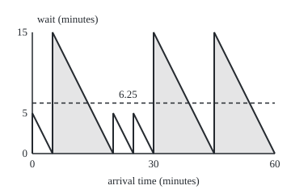
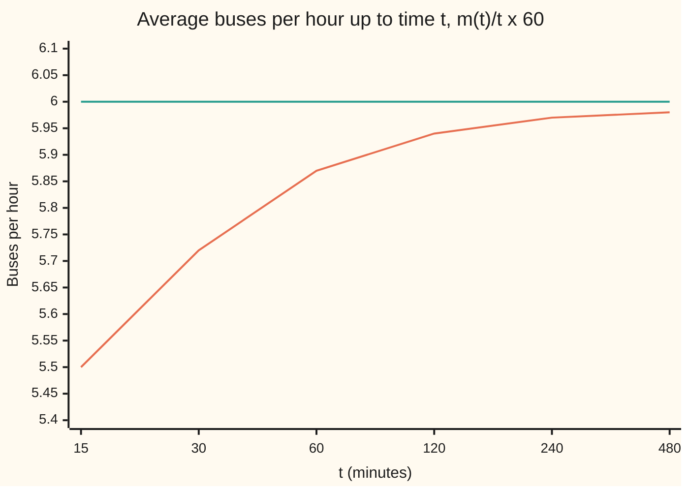

# Renewal processes: arrivals with any gap distribution

[Syllabus](../../../SYLLABUS.md) → [Stochastic processes and calculus](../../../SYLLABUS.md#w11) → [Poisson and Jump Processes](../../../SYLLABUS.md#w11-s04) → Renewal processes

---

## General Overview

A bus stop is served by one route. After each bus leaves, the next one comes either 5 minutes later or 15 minutes later, like a coin toss, and each gap is decided afresh. The average gap is 10 minutes, so over a long day six buses an hour pass the stop.

A passenger who turns up without a timetable waits for the next bus. The natural guess is half the average gap, 5 minutes. The true average is 6.25. A passenger is three times as likely to walk into a 15-minute gap as a 5-minute one, because long gaps cover three quarters of the clock.

Arrivals whose gaps are independent and share one law, any law, form a **renewal process**: each arrival renews the stop, and the future then looks as it did at the start. The Poisson process ([Poisson process](01-poisson-process.md)) is the case with exponential gaps. Two facts hold for every gap law. The **elementary renewal theorem**: in the long run, arrivals come at one per mean gap. The **inspection paradox**: a random moment tends to fall in a long gap, so the wait is at least half the mean gap, and more whenever the gaps vary.

**Over a long time, arrivals come at one per mean gap; but a moment picked at random lands in gaps in proportion to their length, so the average wait is the mean square gap over twice the mean gap.**

**What kind of fact this is:** a theorem, in two parts, both proved on this card in Why it works; a sharper statement about a fixed far-off time is quoted with its source.

### The picture: the wait, minute by minute, over one hour

One hour, to scale, with gaps of 5, 15, 5, 5, 15, 15 minutes, chosen by hand rather than drawn at random so that each length appears as often as its chance says. Height is the wait for a passenger arriving at that minute: it starts at the full gap just after a bus leaves and falls to zero as the next one pulls in. Long gaps are shaded.

<p align="center"></p>

The area under the teeth, divided by the 60 minutes, is the average wait over the hour: 6.25 minutes, the dashed line. A small tooth has area 12.5 and a large one 112.5: nine times the area from three times the gap. Both checks print the coordinates on their `figure,` lines.

---

## The formula

Notation first, in words. The gaps are $X_1, X_2, \dots$: $X_k$ is the time between bus $k-1$ and bus $k$, with bus 0 leaving at time 0. They are independent and all follow the same law, written $X$ for a typical one. The time of bus $n$ is $S_n = X_1 + \dots + X_n$. As on the Poisson card, $N(t)$ counts the arrivals up to time $t$: the number of $n \ge 1$ with $S_n \le t$. Its average is written $m(t) = E[N(t)]$, the **renewal function**.

**Part 1, the elementary renewal theorem.** If the mean gap $\mu = E[X]$ is finite and positive,

$$\lim_{t \to \infty} \frac{N(t)}{t} = \frac{1}{\mu} \ \text{ almost surely}, \qquad \lim_{t \to \infty} \frac{m(t)}{t} = \frac{1}{\mu}.$$

**Read it aloud:** over a long stretch, the number of buses per minute settles at one over the mean gap, on almost every run and on average.

**Part 2, the inspection paradox.** A passenger arrives at a time spread evenly over a long stretch. Let $L$ be the length of the gap the passenger lands in, and $W$ the wait for the next bus. In the long run,

$$P(L = x) = \frac{x \, P(X = x)}{\mu}, \qquad E[W] = \frac{E[X^2]}{2\mu} = \frac{\mu}{2} + \frac{\sigma^2}{2\mu}.$$

**Read it aloud:** each gap length is seen in proportion to its chance times its length; the average wait is half the mean gap plus a penalty that grows with how uneven the gaps are.

For gaps with a density instead of a list of values, replace the chance $P(X = x)$ by the density; nothing else changes.

| Symbol | Plain meaning | In our example | Push it up and the answer… |
| --- | --- | --- | --- |
| $X_k$, $X$ | the gap before bus $k$; a typical gap | 5 or 15 minutes | — |
| $\mu$ | mean gap, $E[X]$ | 10 minutes | rate falls, wait rises |
| $E[X^2]$ | mean of the squared gap | 125 square minutes | wait rises |
| $\sigma^2$ | variance of the gap, $E[X^2] - \mu^2$ | 25 square minutes | wait rises; the rate does not move |
| $S_n$ | time of bus $n$ | bus 2 comes at 10, 20 or 30 | — |
| $t$, $s$ | clock time; $s$ a passenger's arrival time, in minutes | 60 in the hand table | — |
| $N(t)$ | buses after time 0 up to time $t$ | about 6 per hour | — |
| $m(t)$ | average of $N(t)$ | 5.870850 at $t$ = 60 | — |
| $L$ | length of the gap a random passenger lands in | 15 with chance 0.75 | — |
| $W$ | the passenger's wait | 6.25 minutes on average | — |
| $k$, $n$, $a$, $b$, $\mu_b$ | counters; in the proof, a floor $a$ and a cap $b$ on gap length, and $\mu_b$ the capped mean | — | — |
| $T$, $q$ | in the proof: the index of the first bus after $t$, $N(t) + 1$; the chance $P(X \ge a)$ that a gap reaches the floor | — | — |
| $\bar X_k$, $\bar N(t)$, $\bar m(t)$ | in the proof: gap $k$ capped at $b$; the count of buses with capped gaps, and its average | — | — |

### When it holds

- **Independent gaps with one law.** Make every gap copy the first and the average rate is 8 buses an hour, not 6.
- **A finite mean gap.** If $\mu$ is infinite, $N(t)/t$ goes to 0. Part 2 also needs a finite $E[X^2]$; without it the average wait is infinite even when the mean gap is not.
- **Arrival times spread evenly, blind to the buses.** Part 2 averages over arrival times. A passenger who always arrives on a 5-minute mark, the buses' grid, waits 3.75 minutes on average, not 6.25, when a bus that pulls in at that very moment counts as caught, a wait of 0.
- **Gaps off any grid, for claims at a fixed time.** The average number of buses in the minute after a fixed far-off time settles at $1/\mu$ only when the gaps are not all multiples of one step: Blackwell's renewal theorem, stated in Feller's volume II (Sources), not proved here. This card's gaps sit on a 5-minute grid, so it averages over time throughout.

---

## Why it works

### Step 0: each bus restarts the clock

After bus $n$ leaves, the gaps still to come are $X_{n+1}, X_{n+2}, \dots$. They are independent of everything before, with the same law as the original gaps. So the stop, watched from time $S_n$, is a fresh copy of the stop watched from time 0. Every argument below rests on this, together with the strong law of large numbers ([The strong law of large numbers](../../10-Measure%20and%20integration/10-The%20Limit%20Theorems%2C%20Proved/04-strong-law-of-large-numbers.md)): the average of the first $n$ gaps tends to $\mu$ on almost every run.

### Step 1: the count is squeezed between two bus times

At time $t$ exactly $N(t)$ buses have come, so bus $N(t)$ is at or before $t$ and bus $N(t)+1$ is after it:

$$S_{N(t)} \le t < S_{N(t)+1}.$$

At $t$ = 60 minutes, if 5 buses have come, the fifth is at or before minute 60 and the sixth is later.

### Step 2: divide by the count, and the rate appears

Divide the squeeze by $N(t)$. The left side, $S_{N(t)}/N(t)$, is the average of the first $N(t)$ gaps. As $t$ grows, $N(t)$ grows without limit, because each gap is finite. So by the strong law the left side tends to $\mu$. The right side is $S_{N(t)+1}/(N(t)+1)$ times $(N(t)+1)/N(t)$, which tends to $\mu$ times 1. The middle, $t/N(t)$, is trapped between them, so it tends to $\mu$ too, on almost every run. Turn it over: $N(t)/t$ tends to $1/\mu$, one bus per 10 minutes, 6 an hour.

### Step 3: the average count, through Wald's identity

Almost-sure convergence does not by itself carry over to averages, so $m(t)/t$ needs its own argument.

The index $N(t)+1$ is a **stopping time** ([Stopping times](../02-Martingales/03-stopping-times-and-optional-stopping.md)): whether bus $n$ is the first after $t$ is known from the first $n$ gaps. For such an index, **Wald's identity** says the average total of the gaps is the average number of gaps times the mean gap:

$$E[S_{N(t)+1}] = \mu \,\big(m(t) + 1\big).$$

Now take averages in the squeeze. The first bus after $t$ is after $t$, and in this example it is at most 15 minutes after, since no gap exceeds 15. So $t < \mu(m(t)+1) \le t + 15$, which gives

$$\frac{t}{\mu} - 1 < m(t) \le \frac{t + 15}{\mu} - 1.$$

At $t$ = 60 this says the average count lies above 5 and at most 6.5; the exact value is 5.870850. Divide by $t$ and let $t$ grow: both bounds tend to $1/\mu$.

With unbounded gaps the upper bound needs one more move, capping every gap at a level $b$; the folded proof below does it.

<details>
<summary>Detailed proof: Wald's identity, and the elementary renewal theorem for any gap law</summary>

**Wald's identity.** Write $T = N(t)+1$. Then $S_T = \sum_{k \ge 1} X_k \, 1\{T \ge k\}$. The event $T \ge k$ is the event $S_{k-1} \le t$, which depends only on $X_1, \dots, X_{k-1}$, so it is independent of $X_k$. Every term is non-negative, so the sum and the average can be swapped (monotone convergence, wing 10): $E[S_T] = \sum_k E[X_k] \, P(T \ge k) = \mu \sum_k P(T \ge k) = \mu \, E[T]$. The last step is the tail-sum formula for a count: $E[T] = \sum_{k \ge 1} P(T \ge k)$. For $E[T]$ to be finite: the gaps are not all zero, so some $a > 0$ has $P(X \ge a) = q > 0$; the count of gaps up to time $t$ is at most the count of tries until $\lceil t/a \rceil + 1$ gaps of at least $a$ have appeared, whose average is finite.

**Lower bound.** $S_T > t$, so $\mu(m(t)+1) > t$, and $\liminf m(t)/t \ge 1/\mu$. If $\mu$ is infinite this says nothing, and the upper bound alone gives the limit 0.

**Upper bound.** Fix a cap $b$ and let $\bar X_k = \min(X_k, b)$, with mean $\mu_b$. The capped gaps form a renewal process whose buses come no later than the originals, so its count $\bar N(t) \ge N(t)$. Its first bus after $t$ overshoots $t$ by at most $b$, so Wald gives $\mu_b(\bar m(t) + 1) \le t + b$. Hence $m(t)/t \le \bar m(t)/t \le (t+b)/(t\mu_b)$, and $\limsup m(t)/t \le 1/\mu_b$. As $b$ grows, $\mu_b$ rises to $\mu$ by monotone convergence, so $\limsup m(t)/t \le 1/\mu$. With the lower bound, $m(t)/t \to 1/\mu$.

</details>

### Step 4: the wait, as area under a sawtooth

A passenger arriving at time $s$ waits from $s$ to the next bus. Plotted against $s$, that is the sawtooth in the picture: in a gap of length $x$ it falls from $x$ to 0, a triangle of area $x^2/2$.

The average wait over arrivals spread evenly on $[0, t]$ is the area under the sawtooth divided by $t$. Up to the one unfinished tooth at the end, that is

$$\frac{1}{t}\sum_{k=1}^{N(t)} \frac{X_k^2}{2} \;=\; \frac{N(t)}{t} \cdot \frac{1}{N(t)} \sum_{k=1}^{N(t)} \frac{X_k^2}{2}.$$

The first factor tends to $1/\mu$ by Step 2. The second is an average of independent copies of $X^2/2$, so by the strong law it tends to $E[X^2]/2$. The product tends to $E[X^2]/(2\mu)$: 125 over 20, 6.25 minutes. The unfinished tooth, divided by $t$, vanishes when $E[X^2]$ is finite.

This argument, a reward per gap averaged over time, is the **renewal-reward theorem** in outline: long-run reward per minute equals mean reward per gap over mean gap length.

### Step 5: the same answer by length bias

Change the reward to the minutes spent in 15-minute gaps. Per gap it averages 0.5 × 15; over the mean gap of 10 that makes 0.75 of all time, and short gaps take 0.25. So a passenger lands in a long gap with chance 0.75, not 0.5: that is $P(L = x) = x P(X = x)/\mu$.

Within its gap the arrival is spread evenly, so the wait averages half the gap: 2.5 or 7.5 minutes. Together, 0.25 × 2.5 + 0.75 × 7.5 = 6.25 minutes, by a different path. The average gap a passenger finds is $E[X^2]/\mu$ = 12.5 minutes, not 10.

<details>
<summary>Why the variance appears</summary>

Write $E[X^2] = \mu^2 + \sigma^2$. Then $E[X^2]/(2\mu) = \mu/2 + \sigma^2/(2\mu)$. Buses exactly 10 minutes apart have $\sigma^2 = 0$ and a wait of half the gap. Unevenness adds to the wait while leaving the rate alone; here the penalty is 25 over 20, 1.25 minutes.

</details>

### The other door: the Poisson case

With exponential gaps of mean $\mu$, $E[X^2] = 2\mu^2$ and the formula gives a wait of $\mu$: the full mean gap, not half. That is the memoryless property of [Poisson process](01-poisson-process.md). At the shelf's switchboard, with calls at 4 an hour, an operator who looks up at a random moment waits 15 minutes on average for the next call, not 7.5.

---

## Worked numbers, by hand

| Step | Arithmetic | Value |
| --- | --- | --- |
| mean gap $\mu$ | 0.5 × 5 + 0.5 × 15 | 10 minutes |
| rate | 1 / 10 per minute | **6 buses an hour** |
| mean square gap | 0.5 × 25 + 0.5 × 225 | 125 |
| variance | 125 − 10 × 10 | 25 |
| sandwich for $m(60)$ | 60/10 − 1 and 75/10 − 1 | between 5 and 6.5 |
| share of time in 15-minute gaps | 0.5 × 15 / 10 | 0.75 |
| share of time in 5-minute gaps | 0.5 × 5 / 10 | 0.25 |
| wait inside each kind of gap | half the gap | 2.5 and 7.5 minutes |
| **mean wait** | 0.25 × 2.5 + 0.75 × 7.5 | **6.25 minutes** |
| gap a passenger lands in, on average | 125 / 10 | 12.5 minutes |

A passenger who turns up at random waits 6.25 minutes, a quarter longer than half the average gap, and 125 / (2 × 10) agrees.

### How fast the rate settles

The exact average count, from the recursion in the code, divided by the time, in buses per hour:



Rising line: $m(t)/t$ in buses per hour, exact. Flat line: the limit, 6 an hour. By the sandwich the shortfall is under one bus, so it shrinks like one over $t$.

### What breaks if you drop a piece

| Mistake | Comes out at | What went wrong |
| --- | --- | --- |
| Half the mean gap | 5 minutes, not 6.25 | averages over buses, not over the clock: short gaps are counted as often as long ones |
| The gap a passenger finds is the mean gap | 10 minutes, not 12.5 | same slip; long gaps are three quarters of the clock |
| Passenger always arrives on a 5-minute mark | 3.75 minutes, not 6.25 | arrival tied to the buses' grid; a thousandth of a minute later it is 8.749 |
| Every gap equal to the first one | 8 buses an hour, not 6 | gaps not independent: the rate averages a 5-minute stop and a 15-minute stop, not one over the average gap |

The third row is measured at minute 6000, with a bus that pulls in at that minute counted as caught; only the average over a whole 5-minute cell comes to 6.25. In the fourth, with chance 0.5 buses come every 5 minutes forever, else every 15, so $N(t)/t$ has no single limit.

---

## Code, from first principles, and it actually runs

Three roads. **Formulas:** rate and wait. **Exact recursion:** every gap is 1 or 3 five-minute steps, so the average count, the average overshoot past a time and the chance of a bus at each step obey short recursions over every bus pattern, each conditioning on the first gap (Step 0). They give $m(t)$, Wald's identity as two separate computations that must agree, and the exact average wait over arrivals in the first 60, 600 and 6000 minutes. A brute-force count over all 4096 patterns of the first 12 gaps confirms $m(60)$ = 24047/4096 in whole numbers. **Simulation:** SplitMix64, seed 20260929; 40,000 passengers, each on a fresh run of buses, arriving evenly over the first 600 minutes; the switchboard; and one 1,000,000-minute run cut into 100 batches for the rate. Each simulated number carries its standard error, and its assert allows four. The simulated wait is compared with the exact 600-minute value, 6.263021, since a stop that starts with a bus at time 0 has not yet reached the long run.

### Python

```python
# Renewal processes in outline -- the check behind the card.  Standard library
# only.  Buses leave a stop with gaps of 5 or 15 minutes, each with chance 0.5,
# the gaps independent.  Three roads: the formulas; an exact recursion over
# every bus pattern (in steps of 5 minutes, since every gap is a multiple of 5);
# and seeded simulations, each printed with its standard error.
from math import log, sqrt
MASK, SEED = (1 << 64) - 1, 20260929
GAPS, P = (5, 15), (0.5, 0.5)                 # minutes, and their chances

state = SEED
def unif():                                   # SplitMix64 -> a number in [0, 1)
    global state
    state = (state + 0x9E3779B97F4A7C15) & MASK
    z = state
    z = ((z ^ (z >> 30)) * 0xBF58476D1CE4E5B9) & MASK
    z = ((z ^ (z >> 27)) * 0x94D049BB133111EB) & MASK
    return ((z ^ (z >> 31)) >> 11) * 2.0 ** -53
def bus_gap(): return 5.0 if unif() < 0.5 else 15.0
def exp_gap(): return -15.0 * log(1.0 - unif())   # house example: 4 calls an hour

# ---- road 1: the formulas ----
mu = sum(p * x for p, x in zip(P, GAPS))
ex2 = sum(p * x * x for p, x in zip(P, GAPS))
var = ex2 - mu * mu
wait = ex2 / (2 * mu)
long_share = P[1] * GAPS[1] / mu              # length-biased chance of a 15-minute gap
print(f"formula,mean gap mu,{mu:.6f}")
print(f"formula,mean square gap E[X^2],{ex2:.6f}")
print(f"formula,variance of gap,{var:.6f}")
print(f"formula,rate 1/mu per minute,{1 / mu:.6f}")
print(f"formula,rate per hour,{60 / mu:.6f}")
print(f"formula,mean wait E[X^2]/(2 mu),{wait:.6f}")
print(f"formula,mu/2 + var/(2 mu),{mu / 2 + var / (2 * mu):.6f}")
print(f"formula,share of time in 15-min gaps,{long_share:.6f}")
print(f"formula,mean gap a passenger lands in,{ex2 / mu:.6f}")
print(f"hand,share of time in 5-min gaps,{P[0] * GAPS[0] / mu:.6f}")
print(f"hand,mean wait inside a 5-min / 15-min gap,{GAPS[0] / 2:.6f} {GAPS[1] / 2:.6f}")
print(f"hand,extra wait var/(2 mu),{var / (2 * mu):.6f}")
print(f"hand,sandwich at t=60 lower upper,{60 / mu - 1:.6f} {75 / mu - 1:.6f}")
print(f"formula,wait at a 5-minute mark,{5 * sum(p * (x // 5) * (x // 5 - 1) / 2 for p, x in zip(P, GAPS)) / (mu / 5):.6f}")

# ---- road 2: exact recursion, step = 5 minutes, gaps of 1 or 3 steps ----
K = 1200                                      # 6000 minutes
steps = [(x // 5, p) for x, p in zip(GAPS, P)]
m = [0.0] * (K + 2)                           # m[k] = E[N(5k)], buses after time 0 up to 5k
D = [0.0] * (K + 2)                           # D[k] = E[first bus at or after 5k] - 5k, in steps
u = [1.0] + [0.0] * (K + 1)                   # u[k] = chance a bus leaves at exactly 5k
for k in range(1, K + 2):
    m[k] = sum(p * (1 + m[k - s]) for s, p in steps if s <= k)
    D[k] = sum(p * (s - k if s >= k else D[k - s]) for s, p in steps)
    u[k] = sum(p * u[k - s] for s, p in steps if s <= k)
# brute force: all 2**12 patterns of 12 gaps (bit i set: gap i + 1 is 3 steps), buses by step 12, whole numbers
A12 = sum(sum(1 for n in range(1, 13) if sum(1 + 2 * ((b >> i) & 1) for i in range(n)) <= 12) for b in range(4096))
print(f"exact,E[N(60)] by brute force over all 4096 patterns of 12 gaps,{A12}/4096")
print(f"exact,E[N(60)],{m[12]:.6f}")
ok_bounds = all(5 * k / mu - 1 < m[k] <= (5 * k + 15) / mu - 1 for k in range(1, K + 1))
for t in (15, 30, 60, 120, 240, 480, 6000):
    print(f"exact,buses per hour m(t)/t*60 at t={t},{60 * m[t // 5] / t:.6f}")
print("chart,m(t)/t*60 at t=15 30 60 120 240 480," + " ".join(f"{60 * m[t // 5] / t:.2f}" for t in (15, 30, 60, 120, 240, 480)))
wald_l, wald_r = (mu / 5) * (m[K] + 1), K + 1 + D[K + 1]
print(f"exact,Wald mu*(m(t)+1) at t=6000 (steps),{wald_l:.6f}")
print(f"exact,E[time of first bus after t] (steps),{wald_r:.6f}")
for T in (60, 600, 6000):
    k = T // 5
    print(f"exact,mean wait over arrivals in [0 {T}),{5 * sum(D[j + 1] + 0.5 for j in range(k)) / k:.6f}")
ex_share = sum(0.5 * sum(u[i] for i in (j - 2, j - 1, j) if i >= 0) for j in range(120)) / 120
print(f"exact,share of [0 600) in 15-min gaps,{ex_share:.6f}")
print(f"exact,wait arriving exactly at t=6000,{5 * D[K]:.6f}")
print(f"exact,wait arriving at t=6000.001,{5 * D[K + 1] + 5 - 0.001:.6f}")

# ---- road 3: seeded simulation ----
def passengers(n, gap, horizon):              # each passenger gets a fresh bus run
    w = w2 = hit = 0.0
    for _ in range(n):
        s, b = horizon * unif(), 0.0
        while b < s: a, b = b, b + gap()
        w += b - s; w2 += (b - s) ** 2; hit += (b - a) > 10
    mean = w / n
    return mean, sqrt((w2 / n - mean * mean) / (n - 1)), hit / n
NP = 40000
sw, sse, sh = passengers(NP, bus_gap, 600.0)
print(f"sim,mean wait arriving in [0 600),{sw:.6f}")
print(f"sim,standard error,{sse:.6f}")
print(f"sim,share landing in a 15-min gap,{sh:.6f}")
print(f"sim,standard error of share,{sqrt(sh * (1 - sh) / NP):.6f}")
pw, pse, _ = passengers(NP, exp_gap, 600.0)
print(f"sim,house example wait (4 calls/hour),{pw:.6f}")
print(f"sim,house standard error,{pse:.6f}")
print(f"formula,house example wait E[X^2]/(2 mu),{2 * 15.0 ** 2 / (2 * 15.0):.6f}")
b, cnt, batches = 0.0, [0] * 100, 10000.0     # one long run, counted in 100 batches
while True:
    b += bus_gap()
    if b >= 100 * batches: break
    cnt[int(b // batches)] += 1
rates = [60 * c / batches for c in cnt]
rm = sum(rates) / 100
rse = sqrt(sum((r - rm) ** 2 for r in rates) / 99 / 100)
print(f"sim,buses per hour over 1000000 min,{rm:.6f}")
print(f"sim,standard error of rate,{rse:.6f}")

# ---- what breaks ----
print(f"breaks,half the mean gap,{mu / 2:.6f}")
print(f"breaks,mean gap counted per bus,{mu:.6f}")
dep = 0.5 * (6000 // 5) / 6000 * 60 + 0.5 * (6000 // 15) / 6000 * 60
print(f"breaks,every gap = the first gap: buses per hour at t=6000,{dep:.6f}")

for name, g, q in (("even 10 min", (10, 10), (0.5, 0.5)), ("short 0.75", (5, 15), (0.75, 0.25)), ("1 or 19", (1, 19), (0.5, 0.5))):
    m1, m2 = q[0] * g[0] + q[1] * g[1], q[0] * g[0] ** 2 + q[1] * g[1] ** 2
    print(f"try,{name}: mean gap / per hour / wait / half gap,{m1:.6f} {60 / m1:.6f} {m2 / (2 * m1):.6f} {m1 / 2:.6f}")

# ---- figure: the sawtooth over one hour, gaps 5 15 5 5 15 15 ----
fig, x = [], 0
for g in (5, 15, 5, 5, 15, 15):
    fig.append(f"{40 + 5 * x}:{190 - 10 * g}"); x += g
area = sum(g * g / 2 for g in (5, 15, 5, 5, 15, 15))
print("figure,tooth start x:top y," + " ".join(fig) + f",end x {40 + 5 * x},mean line y {190 - 10 * area / 60}")
print(f"figure,tooth areas small large,{5 * 5 / 2:.6f} {15 * 15 / 2:.6f}")
print(f"figure,sawtooth area / 60,{area / 60:.6f}")

assert ok_bounds, "sandwich t/mu - 1 < m(t) <= (t + 15)/mu - 1 failed"
assert abs(60 * m[K] / 6000 - 60 / mu) < 60 * 1.5 / 6000, "elementary renewal theorem"
assert abs(wald_l - wald_r) < 1e-9, "Wald's identity: two recursions disagree"
assert A12 == m[12] * 4096, "brute force over every gap pattern vs recursion"
assert abs(5 * D[K] - 5 * sum(p * (x // 5) * (x // 5 - 1) / 2 for p, x in zip(P, GAPS)) / (mu / 5)) < 1e-6, "wait at a 5-minute mark: exact vs formula"
assert abs(5 * sum(D[j + 1] + 0.5 for j in range(K)) / K - wait) < 0.01, "exact wait vs formula"
assert abs(sw - 5 * sum(D[j + 1] + 0.5 for j in range(120)) / 120) < 4 * sse, "sim wait vs exact"
assert abs(sh - ex_share) < 4 * sqrt(sh * (1 - sh) / NP), "length bias: sim vs exact"
assert abs(sum(0.5 * sum(u[i] for i in (j - 2, j - 1, j) if i >= 0) for j in range(K)) / K - long_share) < 0.01, "length bias: exact vs formula"
assert abs(pw - 15.0) < 4 * pse, "Poisson wait is the full mean gap"
assert abs(rm - 60 / mu) < 4 * rse, "simulated rate"
print("all checks passed")
```

**Ran 2026-10-07 on macOS, Python 3.14.6, standard library only. All checks passed. Output, pasted from the run:**

```
formula,mean gap mu,10.000000
formula,mean square gap E[X^2],125.000000
formula,variance of gap,25.000000
formula,rate 1/mu per minute,0.100000
formula,rate per hour,6.000000
formula,mean wait E[X^2]/(2 mu),6.250000
formula,mu/2 + var/(2 mu),6.250000
formula,share of time in 15-min gaps,0.750000
formula,mean gap a passenger lands in,12.500000
hand,share of time in 5-min gaps,0.250000
hand,mean wait inside a 5-min / 15-min gap,2.500000 7.500000
hand,extra wait var/(2 mu),1.250000
hand,sandwich at t=60 lower upper,5.000000 6.500000
formula,wait at a 5-minute mark,3.750000
exact,E[N(60)] by brute force over all 4096 patterns of 12 gaps,24047/4096
exact,E[N(60)],5.870850
exact,buses per hour m(t)/t*60 at t=15,5.500000
exact,buses per hour m(t)/t*60 at t=30,5.718750
exact,buses per hour m(t)/t*60 at t=60,5.870850
exact,buses per hour m(t)/t*60 at t=120,5.937509
exact,buses per hour m(t)/t*60 at t=240,5.968750
exact,buses per hour m(t)/t*60 at t=480,5.984375
exact,buses per hour m(t)/t*60 at t=6000,5.998750
chart,m(t)/t*60 at t=15 30 60 120 240 480,5.50 5.72 5.87 5.94 5.97 5.98
exact,Wald mu*(m(t)+1) at t=6000 (steps),1201.750000
exact,E[time of first bus after t] (steps),1201.750000
exact,mean wait over arrivals in [0 60),6.382243
exact,mean wait over arrivals in [0 600),6.263021
exact,mean wait over arrivals in [0 6000),6.251302
exact,share of [0 600) in 15-min gaps,0.748437
exact,wait arriving exactly at t=6000,3.750000
exact,wait arriving at t=6000.001,8.749000
sim,mean wait arriving in [0 600),6.279658
sim,standard error,0.022005
sim,share landing in a 15-min gap,0.748200
sim,standard error of share,0.002170
sim,house example wait (4 calls/hour),14.973520
sim,house standard error,0.075258
formula,house example wait E[X^2]/(2 mu),15.000000
sim,buses per hour over 1000000 min,5.998080
sim,standard error of rate,0.008719
breaks,half the mean gap,5.000000
breaks,mean gap counted per bus,10.000000
breaks,every gap = the first gap: buses per hour at t=6000,8.000000
try,even 10 min: mean gap / per hour / wait / half gap,10.000000 6.000000 5.000000 5.000000
try,short 0.75: mean gap / per hour / wait / half gap,7.500000 8.000000 5.000000 3.750000
try,1 or 19: mean gap / per hour / wait / half gap,10.000000 6.000000 9.050000 5.000000
figure,tooth start x:top y,40:140 65:40 140:140 165:140 190:40 265:40,end x 340,mean line y 127.5
figure,tooth areas small large,12.500000 112.500000
figure,sawtooth area / 60,6.250000
all checks passed
```

### Rust

```rust
// Renewal processes in outline -- the check behind the card.  Rust std only.
// Buses leave a stop with gaps of 5 or 15 minutes, each with chance 0.5, the
// gaps independent.  Three roads: the formulas; an exact recursion over every
// bus pattern (in steps of 5 minutes, since every gap is a multiple of 5); and
// seeded simulations, each printed with its standard error.
struct Rng(u64);
impl Rng {
    fn unif(&mut self) -> f64 { // SplitMix64 -> a number in [0, 1)
        self.0 = self.0.wrapping_add(0x9E3779B97F4A7C15);
        let mut z = self.0;
        z = (z ^ (z >> 30)).wrapping_mul(0xBF58476D1CE4E5B9);
        z = (z ^ (z >> 27)).wrapping_mul(0x94D049BB133111EB);
        ((z ^ (z >> 31)) >> 11) as f64 * 2f64.powi(-53)
    }
    fn bus_gap(&mut self) -> f64 { if self.unif() < 0.5 { 5.0 } else { 15.0 } }
    fn exp_gap(&mut self) -> f64 { -15.0 * (1.0 - self.unif()).ln() } // house example: 4 calls an hour
}

fn passengers(r: &mut Rng, n: usize, bus: bool, horizon: f64) -> (f64, f64, f64) {
    let (mut w, mut w2, mut hit) = (0.0, 0.0, 0.0); // each passenger gets a fresh bus run
    for _ in 0..n {
        let s = horizon * r.unif();
        let (mut a, mut b) = (0.0, 0.0);
        while b < s { a = b; b += if bus { r.bus_gap() } else { r.exp_gap() }; }
        w += b - s; w2 += (b - s) * (b - s); if b - a > 10.0 { hit += 1.0; }
    }
    let nf = n as f64; let mean = w / nf;
    (mean, ((w2 / nf - mean * mean) / (nf - 1.0)).sqrt(), hit / nf)
}

fn main() {
    let mut r = Rng(20260929);
    let gaps = [5.0f64, 15.0]; let p = [0.5f64, 0.5];
    // ---- road 1: the formulas ----
    let mu = p[0] * gaps[0] + p[1] * gaps[1];
    let ex2 = p[0] * gaps[0] * gaps[0] + p[1] * gaps[1] * gaps[1];
    let var = ex2 - mu * mu;
    let wait = ex2 / (2.0 * mu);
    let long_share = p[1] * gaps[1] / mu; // length-biased chance of a 15-minute gap
    println!("formula,mean gap mu,{:.6}", mu);
    println!("formula,mean square gap E[X^2],{:.6}", ex2);
    println!("formula,variance of gap,{:.6}", var);
    println!("formula,rate 1/mu per minute,{:.6}", 1.0 / mu);
    println!("formula,rate per hour,{:.6}", 60.0 / mu);
    println!("formula,mean wait E[X^2]/(2 mu),{:.6}", wait);
    println!("formula,mu/2 + var/(2 mu),{:.6}", mu / 2.0 + var / (2.0 * mu));
    println!("formula,share of time in 15-min gaps,{:.6}", long_share);
    println!("formula,mean gap a passenger lands in,{:.6}", ex2 / mu);
    println!("hand,share of time in 5-min gaps,{:.6}", p[0] * gaps[0] / mu);
    println!("hand,mean wait inside a 5-min / 15-min gap,{:.6} {:.6}", gaps[0] / 2.0, gaps[1] / 2.0);
    println!("hand,extra wait var/(2 mu),{:.6}", var / (2.0 * mu));
    println!("hand,sandwich at t=60 lower upper,{:.6} {:.6}", 60.0 / mu - 1.0, 75.0 / mu - 1.0);
    let mut mark = 0.0;
    for i in 0..2 { let l = (gaps[i] / 5.0).floor(); mark += p[i] * l * (l - 1.0) / 2.0; }
    println!("formula,wait at a 5-minute mark,{:.6}", 5.0 * mark / (mu / 5.0));

    // ---- road 2: exact recursion, step = 5 minutes, gaps of 1 or 3 steps ----
    const K: usize = 1200; // 6000 minutes
    let steps = [(1usize, 0.5f64), (3usize, 0.5f64)];
    let mut m = vec![0.0f64; K + 2]; // m[k] = E[N(5k)]
    let mut d = vec![0.0f64; K + 2]; // d[k] = E[first bus at or after 5k] - 5k, in steps
    let mut u = vec![0.0f64; K + 2]; u[0] = 1.0; // chance a bus leaves at exactly 5k
    for k in 1..K + 2 {
        let (mut mk, mut dk, mut uk) = (0.0, 0.0, 0.0);
        for &(s, q) in steps.iter() {
            if s <= k { mk += q * (1.0 + m[k - s]); uk += q * u[k - s]; }
            dk += q * if s >= k { (s - k) as f64 } else { d[k - s] };
        }
        m[k] = mk; d[k] = dk; u[k] = uk;
    }
    // brute force: all 2^12 patterns of 12 gaps (bit i set: gap i + 1 is 3 steps), buses by step 12, whole numbers
    let a12: u64 = (0u64..4096).map(|b| (1..=12u64).filter(|&n| (0..n).map(|i| 1 + 2 * ((b >> i) & 1)).sum::<u64>() <= 12).count() as u64).sum();
    println!("exact,E[N(60)] by brute force over all 4096 patterns of 12 gaps,{}/4096", a12);
    println!("exact,E[N(60)],{:.6}", m[12]);
    let ok_bounds = (1..K + 1).all(|k| 5.0 * k as f64 / mu - 1.0 < m[k] && m[k] <= (5.0 * k as f64 + 15.0) / mu - 1.0);
    for &t in [15usize, 30, 60, 120, 240, 480, 6000].iter() {
        println!("exact,buses per hour m(t)/t*60 at t={},{:.6}", t, 60.0 * m[t / 5] / t as f64);
    }
    let ch: Vec<String> = [15usize, 30, 60, 120, 240, 480].iter().map(|&t| format!("{:.2}", 60.0 * m[t / 5] / t as f64)).collect();
    println!("chart,m(t)/t*60 at t=15 30 60 120 240 480,{}", ch.join(" "));
    let wald_l = (mu / 5.0) * (m[K] + 1.0);
    let wald_r = (K + 1) as f64 + d[K + 1];
    println!("exact,Wald mu*(m(t)+1) at t=6000 (steps),{:.6}", wald_l);
    println!("exact,E[time of first bus after t] (steps),{:.6}", wald_r);
    let window = |k: usize| { let mut s = 0.0; for j in 0..k { s += d[j + 1] + 0.5; } 5.0 * s / k as f64 };
    for &tt in [60usize, 600, 6000].iter() {
        println!("exact,mean wait over arrivals in [0 {}),{:.6}", tt, window(tt / 5));
    }
    let share = |k: usize| {
        let mut s = 0.0;
        for j in 0..k as i64 { let mut c = 0.0; for i in j - 2..=j { if i >= 0 { c += u[i as usize]; } } s += 0.5 * c; }
        s / k as f64
    };
    let ex_share = share(120);
    println!("exact,share of [0 600) in 15-min gaps,{:.6}", ex_share);
    println!("exact,wait arriving exactly at t=6000,{:.6}", 5.0 * d[K]);
    println!("exact,wait arriving at t=6000.001,{:.6}", 5.0 * d[K + 1] + 5.0 - 0.001);

    // ---- road 3: seeded simulation ----
    const NP: usize = 40000;
    let (sw, sse, sh) = passengers(&mut r, NP, true, 600.0);
    let sh_se = (sh * (1.0 - sh) / NP as f64).sqrt();
    println!("sim,mean wait arriving in [0 600),{:.6}", sw);
    println!("sim,standard error,{:.6}", sse);
    println!("sim,share landing in a 15-min gap,{:.6}", sh);
    println!("sim,standard error of share,{:.6}", sh_se);
    let (pw, pse, _) = passengers(&mut r, NP, false, 600.0);
    println!("sim,house example wait (4 calls/hour),{:.6}", pw);
    println!("sim,house standard error,{:.6}", pse);
    println!("formula,house example wait E[X^2]/(2 mu),{:.6}", 2.0 * 15.0f64 * 15.0 / (2.0 * 15.0));
    let batches = 10000.0; // one long run, counted in 100 batches
    let (mut b, mut cnt) = (0.0f64, [0u32; 100]);
    loop {
        b += r.bus_gap();
        if b >= 100.0 * batches { break; }
        cnt[(b / batches).floor() as usize] += 1;
    }
    let rates: Vec<f64> = cnt.iter().map(|&c| 60.0 * c as f64 / batches).collect();
    let rm = rates.iter().fold(0.0, |s, x| s + x) / 100.0;
    let rse = (rates.iter().fold(0.0, |s, x| s + (x - rm) * (x - rm)) / 99.0 / 100.0).sqrt();
    println!("sim,buses per hour over 1000000 min,{:.6}", rm);
    println!("sim,standard error of rate,{:.6}", rse);

    // ---- what breaks ----
    println!("breaks,half the mean gap,{:.6}", mu / 2.0);
    println!("breaks,mean gap counted per bus,{:.6}", mu);
    let dep = 0.5 * (6000 / 5) as f64 / 6000.0 * 60.0 + 0.5 * (6000 / 15) as f64 / 6000.0 * 60.0;
    println!("breaks,every gap = the first gap: buses per hour at t=6000,{:.6}", dep);

    for &(name, g, q) in [("even 10 min", [10.0f64, 10.0], [0.5f64, 0.5]), ("short 0.75", [5.0, 15.0], [0.75, 0.25]), ("1 or 19", [1.0, 19.0], [0.5, 0.5])].iter() {
        let (m1, m2) = (q[0] * g[0] + q[1] * g[1], q[0] * g[0] * g[0] + q[1] * g[1] * g[1]);
        println!("try,{}: mean gap / per hour / wait / half gap,{:.6} {:.6} {:.6} {:.6}", name, m1, 60.0 / m1, m2 / (2.0 * m1), m1 / 2.0);
    }

    // ---- figure: the sawtooth over one hour, gaps 5 15 5 5 15 15 ----
    let (mut fig, mut x, mut area) = (Vec::new(), 0i64, 0.0);
    for &g in [5i64, 15, 5, 5, 15, 15].iter() {
        fig.push(format!("{}:{}", 40 + 5 * x, 190 - 10 * g)); x += g; area += (g * g) as f64 / 2.0;
    }
    println!("figure,tooth start x:top y,{},end x {},mean line y {}", fig.join(" "), 40 + 5 * x, 190.0 - 10.0 * area / 60.0);
    println!("figure,tooth areas small large,{:.6} {:.6}", 5.0 * 5.0 / 2.0, 15.0 * 15.0 / 2.0);
    println!("figure,sawtooth area / 60,{:.6}", area / 60.0);

    assert!(ok_bounds, "sandwich t/mu - 1 < m(t) <= (t + 15)/mu - 1 failed");
    assert!((60.0 * m[K] / 6000.0 - 60.0 / mu).abs() < 60.0 * 1.5 / 6000.0, "elementary renewal theorem");
    assert!((wald_l - wald_r).abs() < 1e-9, "Wald's identity: two recursions disagree");
    assert!(a12 as f64 == m[12] * 4096.0, "brute force over every gap pattern vs recursion");
    assert!((5.0 * d[K] - 5.0 * mark / (mu / 5.0)).abs() < 1e-6, "wait at a 5-minute mark: exact vs formula");
    assert!((window(K) - wait).abs() < 0.01, "exact wait vs formula");
    assert!((sw - window(120)).abs() < 4.0 * sse, "sim wait vs exact");
    assert!((sh - ex_share).abs() < 4.0 * sh_se, "length bias: sim vs exact");
    assert!((share(K) - long_share).abs() < 0.01, "length bias: exact vs formula");
    assert!((pw - 15.0).abs() < 4.0 * pse, "Poisson wait is the full mean gap");
    assert!((rm - 60.0 / mu).abs() < 4.0 * rse, "simulated rate");
    println!("all checks passed");
}
```

**Ran 2026-10-07 on macOS, rustc 1.98.1, no crates. All checks passed. Output, pasted from the run:**

```
formula,mean gap mu,10.000000
formula,mean square gap E[X^2],125.000000
formula,variance of gap,25.000000
formula,rate 1/mu per minute,0.100000
formula,rate per hour,6.000000
formula,mean wait E[X^2]/(2 mu),6.250000
formula,mu/2 + var/(2 mu),6.250000
formula,share of time in 15-min gaps,0.750000
formula,mean gap a passenger lands in,12.500000
hand,share of time in 5-min gaps,0.250000
hand,mean wait inside a 5-min / 15-min gap,2.500000 7.500000
hand,extra wait var/(2 mu),1.250000
hand,sandwich at t=60 lower upper,5.000000 6.500000
formula,wait at a 5-minute mark,3.750000
exact,E[N(60)] by brute force over all 4096 patterns of 12 gaps,24047/4096
exact,E[N(60)],5.870850
exact,buses per hour m(t)/t*60 at t=15,5.500000
exact,buses per hour m(t)/t*60 at t=30,5.718750
exact,buses per hour m(t)/t*60 at t=60,5.870850
exact,buses per hour m(t)/t*60 at t=120,5.937509
exact,buses per hour m(t)/t*60 at t=240,5.968750
exact,buses per hour m(t)/t*60 at t=480,5.984375
exact,buses per hour m(t)/t*60 at t=6000,5.998750
chart,m(t)/t*60 at t=15 30 60 120 240 480,5.50 5.72 5.87 5.94 5.97 5.98
exact,Wald mu*(m(t)+1) at t=6000 (steps),1201.750000
exact,E[time of first bus after t] (steps),1201.750000
exact,mean wait over arrivals in [0 60),6.382243
exact,mean wait over arrivals in [0 600),6.263021
exact,mean wait over arrivals in [0 6000),6.251302
exact,share of [0 600) in 15-min gaps,0.748437
exact,wait arriving exactly at t=6000,3.750000
exact,wait arriving at t=6000.001,8.749000
sim,mean wait arriving in [0 600),6.279658
sim,standard error,0.022005
sim,share landing in a 15-min gap,0.748200
sim,standard error of share,0.002170
sim,house example wait (4 calls/hour),14.973520
sim,house standard error,0.075258
formula,house example wait E[X^2]/(2 mu),15.000000
sim,buses per hour over 1000000 min,5.998080
sim,standard error of rate,0.008719
breaks,half the mean gap,5.000000
breaks,mean gap counted per bus,10.000000
breaks,every gap = the first gap: buses per hour at t=6000,8.000000
try,even 10 min: mean gap / per hour / wait / half gap,10.000000 6.000000 5.000000 5.000000
try,short 0.75: mean gap / per hour / wait / half gap,7.500000 8.000000 5.000000 3.750000
try,1 or 19: mean gap / per hour / wait / half gap,10.000000 6.000000 9.050000 5.000000
figure,tooth start x:top y,40:140 65:40 140:140 165:140 190:40 265:40,end x 340,mean line y 127.5
figure,tooth areas small large,12.500000 112.500000
figure,sawtooth area / 60,6.250000
all checks passed
```

The two outputs are identical line for line.

> [!TIP]
> **Try changing**
> The first three are printed on the `try,` lines, by the formula only; the recursion and simulation are written for the 5-or-15 stop.
> - **Even buses.** Guess first: gaps of exactly 10 minutes. The rate stays at 6 an hour and the mean wait falls to 5, half the gap, since the variance is 0.
> - **Rarer long gaps.** Guess first: short gaps with chance 0.75, long with 0.25. The mean gap is 7.5 minutes, the rate 8 an hour, and the mean wait 5 minutes, while half the mean gap is 3.75.
> - **An extreme gap.** Guess first: gaps of 1 or 19 minutes, half each. The mean gap is still 10 and the rate still 6 an hour; the mean wait is 9.05 minutes, nearly the whole mean gap.
> - **The switchboard.** Guess first: calls at 4 an hour. The simulated wait is 14.973520 with standard error 0.075258, against 15 by the formula: the full gap, not half.

---

## The usual mistake

> [!warning]
> **Averaging over buses when the question is about the clock.** "Half the buses come after 5 minutes and half after 15" is a statement per bus. A passenger does not sample a bus; the passenger samples a moment, and moments sit mostly in long gaps. Counting per bus gives 5 minutes; counting per moment gives 6.25.
>
> - **Thinking the rate depends on the spread.** It does not. Gaps of 5 or 15 minutes and gaps of exactly 10 both give 6 buses an hour; only the wait changes.
> - **Blaming bad luck.** Nothing about the buses is unfair; long gaps hold 0.75 of the time by arithmetic.
> - **Quoting 6.25 for a fixed clock time.** On a 5-minute grid, arriving exactly at minute 6000 gives 3.75, just after gives 8.749; 6.25 is an average over arrival times.
> - **Dropping independence.** If each gap copies the last, the average rate is 8 an hour, not 6.

---

## Where you meet it in real life

- **Waiting for buses, trains and lifts.** Transit agencies report "excess wait time": the passengers' average wait minus half the scheduled gap. When buses keep the scheduled average spacing, that excess is the $\sigma^2/(2\mu)$ term, and bunching raises it.
- **Class sizes.** The average class size per class is smaller than the average class size per student, because large classes hold more students: length bias, with size for length.
- **Replacing parts.** Bulbs replaced on failure form a renewal process: bulbs bought per year is one over the mean life, whatever the spread, and the bulb found burning at a random inspection is on average longer-lived than a typical one.
- **Queues and chains.** The times a continuous-time chain returns to a state are renewal times, and the long-run share of time spent there is the mean stay over the mean return time: [Continuous-time chains](05-continuous-time-markov-chains-and-queues.md).
- **Claims on an insurer.** A claims process with non-exponential gaps between claims is a renewal process; the total paid is then a sum over a renewal count, the non-Poisson cousin of [Compound Poisson](04-compound-poisson.md).

> **Say it back**
> A renewal process is a stream of arrivals with independent gaps sharing one law; each arrival starts it afresh. In the long run arrivals come at one per mean gap, because the count is squeezed between two sums of gaps and the strong law pins both. A random moment lands in a gap with chance proportional to its length, so the wait averages the mean square gap over twice the mean gap. For buses 5 or 15 minutes apart that is 6.25 minutes, not 5; for Poisson arrivals it is the whole mean gap.

---

## What this builds on

- [Poisson process](01-poisson-process.md): the counting process $N(t)$ and the exponential gaps whose memorylessness gives the Poisson case of the paradox.
- [The strong law of large numbers](../../10-Measure%20and%20integration/10-The%20Limit%20Theorems%2C%20Proved/04-strong-law-of-large-numbers.md): pins the average gap and the average squared gap on almost every run.
- [Stopping times](../02-Martingales/03-stopping-times-and-optional-stopping.md): why the index of the first bus after $t$ is a stopping time, the hypothesis Wald's identity needs.

## Where this goes next

- [Daily monitoring](../../12-Financial%20mathematics/16-Barriers%2C%20touches%20and%20lookbacks/03-discrete-monitoring-correction.md): a barrier option checked once a day; its correction rests on this card's mean wait, $E[X^2]/(2\mu)$, read as the mean overshoot of the daily price walk past a far barrier, with the amounts by which the walk beats its previous record as the gaps.

A passenger's wait past a random moment averages $E[X^2]/(2\mu)$; how far a price checked only at the daily close has overshot a barrier when a close is first seen beyond it, and how far that moves the option's price, is the question [Daily monitoring](../../12-Financial%20mathematics/16-Barriers%2C%20touches%20and%20lookbacks/03-discrete-monitoring-correction.md) answers.

---

## Sources

Verified 30 Sep 2026: every link below resolves to the publisher's page.

- Feller, William. "On the Integral Equation of Renewal Theory." *The Annals of Mathematical Statistics* 12, no. 3 (1941): 243–267. [doi:10.1214/aoms/1177731708](https://doi.org/10.1214/aoms/1177731708). The renewal equation, the recursion the code solves, and the long-run rate from it.
- Doob, J. L. "Renewal Theory from the Point of View of the Theory of Probability." *Transactions of the American Mathematical Society* 63, no. 3 (1948): 422–438. [doi:10.1090/S0002-9947-1948-0025098-8](https://doi.org/10.1090/S0002-9947-1948-0025098-8). Renewal limits proved from the strong law, the route of Steps 1 and 2.
- Feller, William. *An Introduction to Probability Theory and Its Applications*, Volume 2, 2nd ed. Wiley, 1971. [Publisher page](https://www.wiley.com/en-us/An+Introduction+to+Probability+Theory+and+Its+Applications%2C+Volume+2%2C+2nd+Edition-p-9780471257097). The waiting-time paradox for Poisson arrivals, and the renewal theorems for gaps off a grid that this card quotes without proof.
- Ross, Sheldon M. *Introduction to Probability Models*, 13th ed. Elsevier, 2023. [Publisher page](https://shop.elsevier.com/books/introduction-to-probability-models/ross/978-0-443-18761-2). The renewal-theory chapter: Wald's identity, renewal-reward processes and the inspection paradox at textbook pace.
