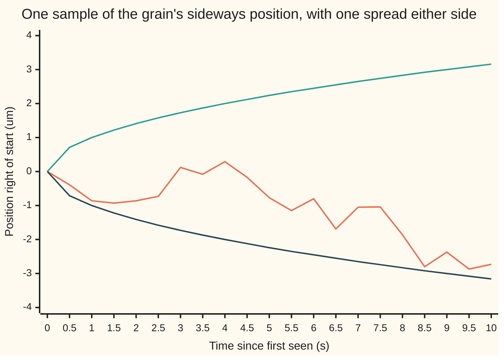
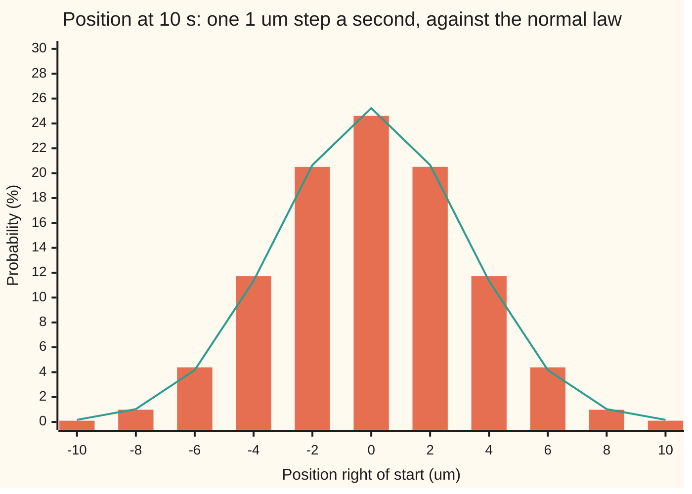
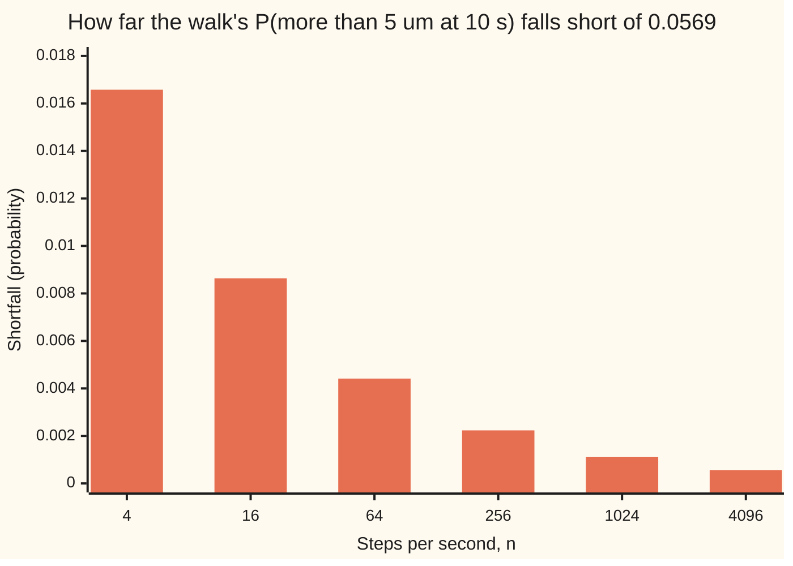

# Brownian motion: the random walk with infinitely small steps

[Syllabus](../../../SYLLABUS.md) → [Stochastic processes and calculus](../../../SYLLABUS.md#w11) → [Brownian Motion](../../../SYLLABUS.md#w11-s05) → Brownian motion

---

## General Overview

A grain of pollen-sized dust floats in a drop of water under a microscope. It never settles. Water molecules hit it from every side, billions of billions of times a second, and each blow is too small to see. What can be seen is the sum: the grain trembles and drifts. Robert Brown watched particles from pollen do this in 1827, and the motion carries his name.

Track one coordinate only: how far the grain sits to the right of where it was first seen, in micrometres (millionths of a metre, written μm). Choose a grain and a liquid in which that sideways position spreads by 1 square micrometre of variance each second. A question with a number for an answer: after 10 seconds, what is the chance the grain is more than 5 μm to the right of its start? The answer is 0.0569, about 1 time in 18.

Three things make that answer computable. The grain starts at 0. What it does in one stretch of time is independent of what it did before: the molecules have no memory. And its displacement over any stretch is a bell curve with variance equal to the stretch's length, because it sums a huge number of tiny independent kicks, and the central limit theorem turns such sums into bell curves. A random walk with very many very small steps, seen from far away, behaves exactly like this. From here on the trembling coordinate is called **Brownian motion**.

**Brownian motion is the random path that starts at zero, moves continuously, and whose moves over separate stretches of time are independent bell curves with variance equal to the time elapsed; a fair random walk with steps of one over root n, taken n times a second, converges to it.**

**What kind of fact this is:** a definition. That a process meeting it exists is a theorem (Wiener, 1923), stated here with its source; that the scaled walk converges to it at any fixed set of times follows from the central limit theorem, as proved on this card in Why it works.

### The picture: one run of the grain

The run below is one sample, drawn by the code on a grid of half a second (the chart joins the points with straight lines; the real path wiggles between them). The outer lines are one spread (standard deviation) either side: the square root of the elapsed time.



Orange: the sampled run, which ends 2.73 μm to the left. Green: plus one spread. Dark blue: minus one spread. The band widens like a square root, fast at first and then slowly; at 10 seconds it reaches 3.16 μm. About 68 runs in 100 finish inside it. This one drifts left and stays inside at every recorded point; the next run from a different seed looks nothing like it.

---

## The formula

Notation first, in words. A process is written $(X_t)$, read "the value at time t" ([Stochastic processes](../01-Random%20Walks%20and%20Filtrations/01-processes-and-paths.md)). Brownian motion gets its own letter, $W_t$, after Norbert Wiener: the grain's position, in μm, t seconds after it was first seen. $N(0, v)$ is the normal law, the bell curve, with mean 0 and variance v ([Normal](../../09-Probability%20and%20statistics/04-Continuous%20Distributions/04-normal-distribution.md)). A **standard Brownian motion** is a process with four properties:

$$W_0 = 0, \qquad W_t - W_s \sim N(0,\; t - s) \ \text{ for } s < t,$$

with increments over non-overlapping stretches of time independent, and every path $t \mapsto W_t$ continuous.

**Read it aloud:** the grain starts at zero; its move between any two times is a bell curve centred on zero with variance equal to the time between them; moves over separate stretches have nothing to do with each other; and the grain never jumps.

The question on this card uses only the second property, with $s = 0$. Write $\Phi(z)$ for the chance that a bell curve with mean 0 and variance 1 lands below z (the standard normal cumulative distribution):

$$P(W_{10} > 5) = 1 - \Phi\!\left(\frac{5}{\sqrt{10}}\right) = 1 - \Phi(1.5811) = 0.0569$$

**Read it aloud:** the position at 10 seconds is a bell curve with spread root 10; 5 μm is 1.5811 spreads out, and the chance of landing beyond that is the bell curve's right tail.

Two consequences of the four properties follow at once. Positions at two times share their past, so they move together:

$$\operatorname{Cov}(W_s, W_t) = \min(s, t)$$

**Read it aloud:** the covariance of two positions is the earlier of the two times. For 4 and 10 seconds it is 4, and the correlation is the square root of 4/10, 0.6325.

And the grain forgets how it got where it is. Given that it sits at 2 μm at 4 seconds, the remaining 6 seconds are a fresh bell curve with variance 6:

$$P(W_{10} > 5 \mid W_4 = 2) = P\big(N(0, 6) > 3\big) = 0.1103$$

| Symbol | Plain meaning | In our example | Push it up and the answer… |
| --- | --- | --- | --- |
| $W_t$, $W_s$, $W_0$, $W_4$, $W_{10}$ | Brownian motion: the grain's position at time t (or 0, 4, 10 s), in μm | 0 at the start; −2.73 at 10 s on the charted run | — |
| $t$, $s$, $t_i$ | times in seconds, s the earlier; $t_i$ one of a list of times | 10 and 4 | more time, wider bell curve, larger tail chance |
| $W_t - W_s$ | the increment: the move between s and t | the move from 4 s to 10 s | — |
| $N(0, v)$ | the normal law with mean 0 and variance v | N(0, 10) for the position at 10 s | — |
| $\sigma$ | spread rate: root of the variance added per second; the standard motion has 1 | 1 μm per root second | every spread scales by it |
| $a$ | the level asked about | 5 μm | tail chance falls |
| $z$ | the level in units of spread, a over root t | 1.5811 | tail chance falls |
| $\Phi$, $\varphi$ | standard normal cumulative chance, and its density (bell-curve height) | Φ(1.5811) = 0.9431 | — |
| $\operatorname{Cov}(W_s, W_t)$ | covariance: how far two positions move together | 4 | — |
| $n$ | steps per second of the approximating walk | 4 up to 4096 | walk gets closer to the limit |
| $\xi_i$ | one step of the walk, +1 or −1 with equal chance | one coin toss | — |
| $S^{(n)}_t$ | the scaled walk: the sum of the first nt steps, divided by root n | its position at 10 s | — |
| $m_i(n)$, $D_i$, $r$, $k$, $\lfloor\cdot\rfloor$ | used only in the Detailed proof: the steps taken by time $t_i$; the walk's i-th increment; the steps in the i-th window; how many times are fixed; the floor, rounding down | 4n steps by 4 s | — |

### When it holds

- **Independent increments.** The molecules must not remember. If each kick tends to repeat the last one, three times in four, the walk still converges to a bell curve, but with variance 30 at 10 seconds instead of 10 (29.96 at 100 steps a second), and the tail chance is 0.1807, not 0.0569.
- **Many small kicks with finite variance.** The bell curve comes from the central limit theorem. Kicks with no finite variance, or rare large jumps, give other limits: [Levy processes](../09-Beyond%20Brownian/01-levy-processes.md).
- **Steps of one over root n.** Any other scaling makes the limit freeze at zero or blow up; the code prints both.
- **No drift and a fixed spread rate.** A current in the water adds a straight-line drift, and a different liquid changes $\sigma$; the position is then $\sigma W_t$ plus the drift, and the variance per second is $\sigma$ squared, not 1.

---

## Why it works

### Step 0: the bell curve is forced, and so is the square root

A displacement over 10 seconds is a sum of an enormous number of independent kicks. The central limit theorem says such a sum is close to a bell curve, whatever each kick looks like ([Central limit theorem](../../09-Probability%20and%20statistics/06-Limit%20Theorems%20in%20Practice/02-central-limit-theorem.md)). Variances of independent pieces add, so the variance grows in proportion to time. Those two facts fix the whole definition. The rest of this section builds the limit from a coin-tossing walk and checks each property.

### Step 1: a walk with n steps a second, each of size one over root n

Start from the simple random walk ([Simple random walk](../01-Random%20Walks%20and%20Filtrations/02-simple-random-walk.md)): steps $\xi_i$ of +1 or −1, fair and independent. Take n steps every second and shrink each to one over root n micrometres. After t seconds the walk has taken nt steps, and its position is

$$S^{(n)}_t = \frac{\xi_1 + \xi_2 + \cdots + \xi_{nt}}{\sqrt{n}}$$

**Read it aloud:** add up the coin tosses so far and divide by the root of the steps per second.

One step has variance 1, so nt steps have variance nt, and dividing by root n divides the variance by n. The variance at time t is t, for every n. The code checks this from the exact law at n = 4 up to 4096: at every n an assert stops the run unless the variance at 10 seconds is 10.

The root is not a choice. Steps of one over n give variance 0.1000 at 10 seconds when n = 100, and the walk freezes; steps of 1 μm taken 100 times a second give 1,000, and the grain flies off. Only the square root keeps the variance at t.

### Step 2: at one time, the central limit theorem gives the bell curve

At a fixed time t, the scaled walk is a sum of nt independent steps, scaled so that its variance is t. The central limit theorem says its law approaches $N(0, t)$ as n grows. Even at one step a second the match is close.

### The picture: ten coin tosses against the bell curve



Orange bars: the exact chance, in percent, of each position after ten fair 1 μm steps, one a second. Green line: the density of $N(0, 10)$ at each position times 2, the gap between neighbouring positions, so that it gives the chance of a 2 μm-wide strip. With only ten steps the two are close everywhere; the largest gap is at 0, 24.61% against 25.23%.

The walk can only stand at even positions after ten steps, so "more than 5" means 6 or more. Its chance is 0.0547, against the limit 0.0569.

### Step 3: separate stretches use separate tosses, so increments are independent

The move from 4 to 10 seconds is built from the tosses numbered 4n + 1 to 10n. The position at 4 seconds is built from the first 4n. No toss is shared, so the two are independent for every n, and they stay independent in the limit. Each increment is again a scaled sum, so the central limit theorem makes it $N(0, t - s)$. That gives the first three properties at any finite list of times.

<details>
<summary>Detailed proof: the scaled walk converges to the Brownian law at any finite set of times</summary>

Fix times $0 = t_0 < t_1 < \cdots < t_k$ and write $m_i(n) = \lfloor n t_i \rfloor$, the number of steps taken by time $t_i$ (the floor rounds down, for times that are not multiples of one over n).

**Increments.** The i-th increment of the scaled walk is $D_i = (\xi_{m_{i-1}+1} + \cdots + \xi_{m_i})/\sqrt{n}$. Its steps are disjoint from those of every other increment, so $D_1, \dots, D_k$ are independent for every n.

**Each one is asymptotically normal.** Let $r = m_i - m_{i-1}$, the number of steps in the i-th window. Then $D_i = \sqrt{r/n}\,(\xi_{m_{i-1}+1} + \cdots + \xi_{m_i})/\sqrt{r}$. As n grows, r grows without bound and $r/n \to t_i - t_{i-1}$. The central limit theorem (wing 09, proved in wing 10 by characteristic functions) sends the second factor to $N(0,1)$ in distribution. A constant tending to a limit times a sequence converging in distribution converges to the product (Slutsky's lemma, wing 10), so $D_i \to N(0, t_i - t_{i-1})$.

**Jointly.** The characteristic function of the vector $(D_1, \dots, D_k)$ is the product of the separate ones, because they are independent. Each factor converges to that of $N(0, t_i - t_{i-1})$, so the product converges to the characteristic function of independent normals with those variances. Lévy's continuity theorem (wing 10) turns this into convergence in distribution of the vector.

**Positions.** The positions are partial sums: $S^{(n)}_{t_j} = D_1 + \cdots + D_j$. Summing is a continuous map, so the vector of positions converges to the vector of partial sums of independent normals. That vector has $W_0 = 0$, independent increments and $W_{t_j} - W_{t_i} \sim N(0, t_j - t_i)$: the first three properties of Brownian motion, at the chosen times.

**Covariance.** For $s \le t$, write $W_t = W_s + (W_t - W_s)$. The increment is independent of $W_s$ and has mean 0, so $\operatorname{Cov}(W_s, W_t) = \operatorname{Var}(W_s) + 0 = s = \min(s, t)$.

**Fresh start.** Given $W_4 = 2$, the event $W_{10} > 5$ is the event $W_{10} - W_4 > 3$. The increment is independent of $W_4$, so conditioning does not change its law, $N(0, 6)$, and the chance is $1 - \Phi(3/\sqrt{6}) = 0.1103$.

</details>

### Step 4: how fast the walk approaches the limit

The code computes the walk's exact chance of "more than 5 μm" at n = 4, 16, 64, 256, 1024 and 4096 steps a second. The error halves each time n is multiplied by 4, so it shrinks like one over root n. Its size is predictable. At these n the level 5 is itself a position the walk can stand on. "More than 5" leaves that point out, while the bell curve, spread smoothly, would count half of it. The point carries chance about the density of $N(0, 10)$ at 5, which is $\varphi(z)/\sqrt{10}$, times the gap between positions, 2 over root n, so the walk falls short by about $\varphi(z)/\sqrt{10}$ over root n. The prediction gives −0.0361 for error times root n; the exact law gives −0.0332, −0.0346, −0.0353, −0.0357, −0.0359 and −0.0360, closing in on it.

### The picture: the walk's shortfall against steps per second



Each bar is the exact walk's error with its sign dropped. Each is very nearly half the one before: four times the steps, half the error.

### Step 5: continuity, and existence, stated with sources

The fourth property, continuous paths, is not a statement about finitely many times, and no finite computation checks it. This card states it with sources. Norbert Wiener built a process with all four properties in 1923. A standard modern route (Durrett, section 7.1) first builds the bell curves at every time that is a fraction with a power of 2 below, then uses Kolmogorov's continuity theorem: because $E[(W_t - W_s)^4] = 3(t - s)^2$, the values at those fractions join up into a continuous path almost surely (with probability 1). Donsker's theorem (Durrett, section 8.1) then says the whole scaled walk, joined by straight lines, converges in distribution to Brownian motion as a random curve, not only at finitely many times. This card has proved the convergence at finitely many times and cites the rest.

What the continuity buys and what it does not: the path never jumps, yet with probability 1 it has no slope anywhere. That roughness is [Brownian paths](02-scaling-and-path-roughness.md), and the fact that its squared moves add up to elapsed time is [Quadratic variation](03-quadratic-variation.md).

A second road to the same object starts from the covariance: a process whose values at any finite set of times are jointly normal with mean 0 and covariance $\min(s, t)$, and whose paths are continuous, is a standard Brownian motion. Independent increments follow, because for jointly normal values zero covariance means independence.

---

## Worked numbers, by hand

The grain at 10 seconds, variance 1 square μm per second.

| Step | Arithmetic | Value |
| --- | --- | --- |
| variance at 10 s | 10 × 1 | 10 |
| spread at 10 s | square root of 10 | 3.16 μm |
| level in spreads | 5 ÷ 3.16 | 1.5811 |
| chance below that | Φ(1.5811) | 0.9431 |
| chance above 5 μm | 1 − 0.9431 | **0.0569** |
| chance within one spread | Φ(1) − Φ(−1) | 0.6827 |
| given 2 μm at 4 s: distance still to go | 5 − 2 | 3 μm |
| variance of the remaining move | 10 − 4 | 6 |
| chance above 5 μm, given 2 μm at 4 s | 1 − Φ(3 ÷ root 6) | **0.1103** |
| covariance of the 4 s and 10 s positions | the earlier time | 4 |

About 6 grains in 100 (1 in 18) end more than 5 μm to the right after 10 seconds. A grain already 2 μm to the right at 4 seconds does so about 1 time in 9: knowing the present doubles the chance, but how it reached 2 μm does not matter.

### What breaks if you drop a piece

| Mistake | Comes out at | What went wrong |
| --- | --- | --- |
| Spread grows like time, not its root | 0.3085 | Spread 10 μm instead of 3.16: variances add, spreads do not |
| Walk steps of one over n instead of one over root n | variance 0.1000, chance 0.0000 at n = 100 | The limit freezes; the grain never moves |
| Position at 4 s ignored once known to be 2 μm | 0.0569; right is 0.1103 | Independent increments read as independent positions |
| Kicks that repeat the last one three times in four | variance 30 (29.96 at n = 100), chance 0.1807 | Independence dropped: the limit is a bell curve with three times the variance |

The repeating walk's variance, 29.96, comes out of its exact law at 100 steps a second and out of the sum of covariances between steps alike. Its exact chance there is 0.1759, a lattice shortfall like Step 4's below the limit 0.1807.

---

## Code, from first principles, and it actually runs

Three independent roads reach the same chance. The formula integrates the bell curve by Simpson's rule, with no library normal function. The exact law of the scaled walk at six step sizes comes from binomial counts through a table of log-factorials, with its error printed shrinking. And 100,000 paths are drawn on a one-second grid from a SplitMix64 generator, seed 2026, with Box-Muller normals, both written out; the increments are exactly normal, so the grid adds no error at the grid times. Every simulated number carries its standard error, and its asserts allow four of them.

### Python

```python
# Brownian motion: a grain's sideways position W_t, in micrometres (um), t seconds
# after it was first seen; its variance grows by 1 square um per second.
# Question: P(W_10 > 5), the chance it is more than 5 um right of its start at 10 s.
# Three roads: the Gaussian formula; the exact law of a walk with n steps a second,
# each +-1/sqrt(n) um; 100,000 seeded paths sampled every second.  Standard library only.
from math import sqrt, exp, log, cos, pi

T, A, M64 = 10, 5.0, (1 << 64) - 1

def phi(x):                                   # standard normal density
    return exp(-x * x / 2) / sqrt(2 * pi)
def Phi(x, m=2000):                           # its CDF: 1/2 plus Simpson's rule on [0, x]
    h = x / m
    s = phi(0.0) + phi(x) + sum((4 if i % 2 else 2) * phi(i * h) for i in range(1, m))
    return 0.5 + s * h / 3
def tail(a, var):                             # P(N(0, var) > a)
    return 1 - Phi(a / sqrt(var))
LF = [0.0]                                    # LF[k] = ln k!
for i in range(1, T * 10000 + 1):
    LF.append(LF[-1] + log(i))
def walk(N, kmin):                            # N fair +-1 steps, height k = 2j - N:
    w = [exp(LF[N] - LF[j] - LF[N - j] - N * log(2)) for j in range(N + 1)]
    p = sum(x for j, x in enumerate(w) if 2 * j - N >= kmin)
    return w, p, sum(x * (2 * j - N) ** 2 for j, x in enumerate(w))
def first_k(N, ok):                           # smallest height k > 0, parity of N, passing ok
    k = 1
    while (k - N) % 2 or not ok(k):
        k += 1
    return k
def persistent(N, r, kmin):                   # each step repeats the last with chance r
    w = [[0.0, 0.0] for _ in range(2 * N + 1)]        # w[k + N][d]: height k, last step d
    w[N + 1][1], w[N - 1][0] = 0.5, 0.5
    for _ in range(N - 1):
        new = [[0.0, 0.0] for _ in range(2 * N + 1)]
        for i in range(1, 2 * N):
            new[i + 1][1] += w[i][1] * r + w[i][0] * (1 - r)
            new[i - 1][0] += w[i][0] * r + w[i][1] * (1 - r)
        w = new
    tot = [a + b for a, b in w]
    return sum(x for i, x in enumerate(tot) if i - N >= kmin), sum(x * (i - N) ** 2 for i, x in enumerate(tot))
seed = 2026
def unif():                                   # SplitMix64, mapped into (0, 1]
    global seed
    seed = (seed + 0x9E3779B97F4A7C15) & M64
    z = ((seed ^ (seed >> 30)) * 0xBF58476D1CE4E5B9) & M64
    z = ((z ^ (z >> 27)) * 0x94D049BB133111EB) & M64
    return (((z ^ (z >> 31)) >> 11) + 1) / 2.0 ** 53
def normal():                                 # Box-Muller, cosine half only
    u, v = unif(), unif()
    return sqrt(-2 * log(u)) * cos(2 * pi * v)
def row(label, x, se=None):
    print(f"{label:<44}{x:>10.4f}" + ("" if se is None else f"   se {se:.4f}"))
def mean_se(xs):
    m = sum(xs) / len(xs)
    return m, sqrt(sum((x - m) ** 2 for x in xs) / (len(xs) - 1) / len(xs))
print("== road one: the Gaussian formula ==")
exact = tail(A, T)
row("z = 5 / sqrt(10)", A / sqrt(T))
row("Phi(z)", Phi(A / sqrt(T)))
row("P(W_10 > 5) = 1 - Phi(z)", exact)
row("P(|W_10| <= sqrt(10))", 2 * Phi(1.0) - 1)
cond = tail(A - 2.0, T - 4)
row("P(W_10 > 5 | W_4 = 2) = P(N(0,6) > 3)", cond)
row("Cov(W_4, W_10) = min(4, 10)", 4.0)
row("correlation sqrt(4/10)", sqrt(4 / T))
print("== road two: exact law of the walk, n steps a second ==")
law1, p1, _ = walk(T, 6)                      # n = 1: one +-1 um step a second
row("n = 1, one 1 um step a second: P(S > 5)", p1)
errs = []
for n in (4, 16, 64, 256, 1024, 4096):
    N = T * n
    k = first_k(N, lambda k: k * k > 25 * n)          # k / sqrt(n) > 5
    _, p, m2 = walk(N, k)
    errs.append(p - exact)
    assert abs(m2 / n - T) < 1e-6, "walk variance is not 10"
    print(f"n = {n:>4}: P(S > 5) = {p:.6f}, error {p - exact:+.6f}, error x sqrt(n) {(p - exact) * sqrt(n):+.4f}")
half_atom = -phi(A / sqrt(T)) / sqrt(T)               # minus half the lattice step 2/sqrt(n) times the density at 5
row("predicted error x sqrt(n): -phi(z)/sqrt(10)", half_atom)
assert all(abs(e * sqrt(n) - half_atom) < 0.004 for e, n in zip(errs[1:], (16, 64, 256, 1024, 4096))), "error is not half an atom"
print("== road three: 100,000 paths sampled every second ==")
path = [0.0]
for _ in range(20):                           # chart path: steps of 0.5 s, sd sqrt(0.5)
    path.append(path[-1] + sqrt(0.5) * normal())
W4, W10 = [], []
for _ in range(100000):
    w = 0.0
    for t in range(1, T + 1):
        w += normal()                         # W_t - W_(t-1) ~ N(0, 1)
        if t == 4: W4.append(w)
    W10.append(w)
R = len(W10)
m, se = mean_se(W10)
row("mean of W_10", m, se)
v = sum((x - m) ** 2 for x in W10) / (R - 1)
vse = sqrt((sum((x - m) ** 4 for x in W10) / R - v * v) / R)
row("variance of W_10", v, vse)
assert abs(v - T) < 4 * vse, "simulated variance is not 10"
ps, pse = mean_se([1.0 if x > A else 0.0 for x in W10])
row("P(W_10 > 5)", ps, pse)
assert abs(ps - exact) < 4 * pse, "simulation disagrees with the formula"
row("P(|W_10| <= sqrt(10))", *mean_se([1.0 if abs(x) <= sqrt(T) else 0.0 for x in W10]))
m4 = sum(W4) / R
cv, cse = mean_se([(a - m4) * (b - m) for a, b in zip(W4, W10)])
row("Cov(W_4, W_10)", cv, cse)
assert abs(cv - 4) < 4 * cse, "simulated covariance is not 4"
row("Cov(W_4, W_10 - W_4)", *mean_se([(a - m4) * (b - a) for a, b in zip(W4, W10)]))
near = [b for a, b in zip(W4, W10) if 1.9 <= a <= 2.1]
pc, pcse = mean_se([1.0 if b > A else 0.0 for b in near])
print(f"paths with 1.9 <= W_4 <= 2.1: {len(near)}")
row("P(W_10 > 5 | W_4 near 2)", pc, pcse)
assert abs(pc - cond) < 4 * pcse, "fresh-start rule fails"
print("== what breaks ==")
_, p, m2 = walk(1000, first_k(1000, lambda k: k > 500))      # steps 1/100 um, 100 a second
row("steps 1/n: n = 100, variance", m2 / 100 ** 2)
row("steps 1/n: n = 100, P(S > 5)", p)
_, p, m2 = walk(1000, first_k(1000, lambda k: k > 5))        # steps 1 um, 100 a second
row("steps 1 um: n = 100, variance", m2)
row("steps 1 um: n = 100, P(S > 5)", p)
row("spread taken as t: P(N(0, 100) > 5)", tail(A, 100.0))
row("W_4 = 2 ignored: P(W_10 > 5)", exact)
pp, pv = persistent(1000, 0.75, first_k(1000, lambda k: k * k > 2500))
pf = 1000 + 2 * sum((1000 - k) * 0.5 ** k for k in range(1, 1000))
assert abs(pv - pf) < 1e-6, "persistent walk: exact law disagrees with the sum"
row("repeating steps: variance, exact law", pv / 100)
row("repeating steps: variance, sum of covariances", pf / 100)
row("repeating steps: P(S > 5), exact law", pp)
row("repeating steps: limit P(N(0, 30) > 5)", tail(A, 30.0))
print("== charts ==")
print("chart, t (s)       " + " ".join(f"{0.5 * i:g}" for i in range(21)))
print("chart, path (um)   " + " ".join(f"{x:.2f}" for x in path))
print("chart, +sqrt(t)    " + " ".join(f"{sqrt(0.5 * i):.2f}" for i in range(21)))
print("chart, -sqrt(t)    " + " ".join(f"{-sqrt(0.5 * i) + 0.0:.2f}" for i in range(21)))
print("chart, k (um)      " + " ".join(str(2 * j - 10) for j in range(11)))
print("chart, walk law (%)    " + " ".join(f"{100 * x:.2f}" for x in law1))
print("chart, 2 x density (%) " + " ".join(f"{200 * phi((2 * j - 10) / sqrt(T)) / sqrt(T):.2f}" for j in range(11)))
print("ALL CHECKS PASS")
```

**Ran 2026-09-30 on macOS, Python 3.14.6, standard library only. All checks passed. Output, pasted from the run:**

```
== road one: the Gaussian formula ==
z = 5 / sqrt(10)                                1.5811
Phi(z)                                          0.9431
P(W_10 > 5) = 1 - Phi(z)                        0.0569
P(|W_10| <= sqrt(10))                           0.6827
P(W_10 > 5 | W_4 = 2) = P(N(0,6) > 3)           0.1103
Cov(W_4, W_10) = min(4, 10)                     4.0000
correlation sqrt(4/10)                          0.6325
== road two: exact law of the walk, n steps a second ==
n = 1, one 1 um step a second: P(S > 5)         0.0547
n =    4: P(S > 5) = 0.040345, error -0.016578, error x sqrt(n) -0.0332
n =   16: P(S > 5) = 0.048285, error -0.008638, error x sqrt(n) -0.0346
n =   64: P(S > 5) = 0.052508, error -0.004415, error x sqrt(n) -0.0353
n =  256: P(S > 5) = 0.054690, error -0.002233, error x sqrt(n) -0.0357
n = 1024: P(S > 5) = 0.055800, error -0.001123, error x sqrt(n) -0.0359
n = 4096: P(S > 5) = 0.056360, error -0.000563, error x sqrt(n) -0.0360
predicted error x sqrt(n): -phi(z)/sqrt(10)    -0.0361
== road three: 100,000 paths sampled every second ==
mean of W_10                                   -0.0033   se 0.0100
variance of W_10                               10.0288   se 0.0448
P(W_10 > 5)                                     0.0570   se 0.0007
P(|W_10| <= sqrt(10))                           0.6816   se 0.0015
Cov(W_4, W_10)                                  4.0228   se 0.0237
Cov(W_4, W_10 - W_4)                            0.0289   se 0.0154
paths with 1.9 <= W_4 <= 2.1: 2415
P(W_10 > 5 | W_4 near 2)                        0.1085   se 0.0063
== what breaks ==
steps 1/n: n = 100, variance                    0.1000
steps 1/n: n = 100, P(S > 5)                    0.0000
steps 1 um: n = 100, variance                1000.0000
steps 1 um: n = 100, P(S > 5)                   0.4372
spread taken as t: P(N(0, 100) > 5)             0.3085
W_4 = 2 ignored: P(W_10 > 5)                    0.0569
repeating steps: variance, exact law           29.9600
repeating steps: variance, sum of covariances   29.9600
repeating steps: P(S > 5), exact law            0.1759
repeating steps: limit P(N(0, 30) > 5)          0.1807
== charts ==
chart, t (s)       0 0.5 1 1.5 2 2.5 3 3.5 4 4.5 5 5.5 6 6.5 7 7.5 8 8.5 9 9.5 10
chart, path (um)   0.00 -0.39 -0.86 -0.93 -0.86 -0.73 0.12 -0.08 0.29 -0.17 -0.77 -1.15 -0.80 -1.69 -1.05 -1.04 -1.86 -2.80 -2.37 -2.87 -2.73
chart, +sqrt(t)    0.00 0.71 1.00 1.22 1.41 1.58 1.73 1.87 2.00 2.12 2.24 2.35 2.45 2.55 2.65 2.74 2.83 2.92 3.00 3.08 3.16
chart, -sqrt(t)    0.00 -0.71 -1.00 -1.22 -1.41 -1.58 -1.73 -1.87 -2.00 -2.12 -2.24 -2.35 -2.45 -2.55 -2.65 -2.74 -2.83 -2.92 -3.00 -3.08 -3.16
chart, k (um)      -10 -8 -6 -4 -2 0 2 4 6 8 10
chart, walk law (%)    0.10 0.98 4.39 11.72 20.51 24.61 20.51 11.72 4.39 0.98 0.10
chart, 2 x density (%) 0.17 1.03 4.17 11.34 20.66 25.23 20.66 11.34 4.17 1.03 0.17
ALL CHECKS PASS
```

The three roads agree. The simulated chance is 0.0570, standard error 0.0007, against 0.0569. The 2,415 paths with $W_4$ between 1.9 and 2.1 give 0.1085, standard error 0.0063, against 0.1103. The covariance of $W_4$ with the later increment, 0.0289, is under two standard errors from 0.

### Rust

The same three roads, std only.

```rust
// Brownian motion: a grain's sideways position W_t, in micrometres (um), t seconds
// after it was first seen; its variance grows by 1 square um per second.
// Question: P(W_10 > 5), the chance it is more than 5 um right of its start at 10 s.
// Three roads: the Gaussian formula; the exact law of a walk with n steps a second,
// each +-1/sqrt(n) um; 100,000 seeded paths sampled every second.  Std only, no crates.
use std::f64::consts::PI;
const T: usize = 10;
const A: f64 = 5.0;

fn phi(x: f64) -> f64 { (-x * x / 2.0).exp() / (2.0 * PI).sqrt() } // standard normal density
fn big_phi(x: f64) -> f64 { // its CDF: 1/2 plus Simpson's rule on [0, x]
    let m = 2000;
    let h = x / m as f64;
    let inner: f64 = (1..m).map(|i| (if i % 2 == 1 { 4.0 } else { 2.0 }) * phi(i as f64 * h)).sum();
    0.5 + (phi(0.0) + phi(x) + inner) * h / 3.0
}
fn tail(a: f64, var: f64) -> f64 { 1.0 - big_phi(a / var.sqrt()) } // P(N(0, var) > a)
// N fair +-1 steps, height k = 2j - N: the law, P(k >= kmin), and the mean of k^2
fn walk(lf: &[f64], n: usize, kmin: i64) -> (Vec<f64>, f64, f64) {
    let w: Vec<f64> = (0..=n).map(|j| (lf[n] - lf[j] - lf[n - j] - n as f64 * 2f64.ln()).exp()).collect();
    let k = |j: usize| 2 * j as i64 - n as i64;
    let p: f64 = w.iter().enumerate().filter(|(j, _)| k(*j) >= kmin).map(|(_, x)| *x).sum();
    let m2: f64 = w.iter().enumerate().map(|(j, x)| x * (k(j) * k(j)) as f64).sum();
    (w, p, m2)
}
fn first_k(n: usize, ok: impl Fn(i64) -> bool) -> i64 { // smallest height k > 0, parity of N, passing ok
    let mut k = 1i64;
    while (k - n as i64) % 2 != 0 || !ok(k) { k += 1; }
    k
}
fn persistent(n: usize, r: f64, kmin: i64) -> (f64, f64) { // each step repeats the last with chance r
    let mut w = [[0.0f64; 2]].repeat(2 * n + 1); // w[k + N][d]: height k, last step d
    w[n + 1][1] = 0.5;
    w[n - 1][0] = 0.5;
    for _ in 0..n - 1 {
        let mut new = [[0.0f64; 2]].repeat(2 * n + 1);
        for i in 1..2 * n {
            new[i + 1][1] += w[i][1] * r + w[i][0] * (1.0 - r);
            new[i - 1][0] += w[i][0] * r + w[i][1] * (1.0 - r);
        }
        w = new;
    }
    let tot: Vec<f64> = w.iter().map(|x| x[0] + x[1]).collect();
    let h = |i: usize| i as i64 - n as i64;
    let p: f64 = tot.iter().enumerate().filter(|(i, _)| h(*i) >= kmin).map(|(_, x)| *x).sum();
    (p, tot.iter().enumerate().map(|(i, x)| x * (h(i) * h(i)) as f64).sum())
}
struct Rng(u64);
impl Rng {
    fn unif(&mut self) -> f64 { // SplitMix64, mapped into (0, 1]
        self.0 = self.0.wrapping_add(0x9E3779B97F4A7C15);
        let mut z = (self.0 ^ (self.0 >> 30)).wrapping_mul(0xBF58476D1CE4E5B9);
        z = (z ^ (z >> 27)).wrapping_mul(0x94D049BB133111EB);
        (((z ^ (z >> 31)) >> 11) + 1) as f64 / 2f64.powi(53)
    }
    fn normal(&mut self) -> f64 { // Box-Muller, cosine half only
        let (u, v) = (self.unif(), self.unif());
        (-2.0 * u.ln()).sqrt() * (2.0 * PI * v).cos()
    }
}
fn row(label: &str, x: f64) { println!("{:<44}{:>10.4}", label, x); }
fn row_se(label: &str, (x, se): (f64, f64)) { println!("{:<44}{:>10.4}   se {:.4}", label, x, se); }
fn mean_se(xs: &[f64]) -> (f64, f64) {
    let m = xs.iter().sum::<f64>() / xs.len() as f64;
    let ss: f64 = xs.iter().map(|x| (x - m) * (x - m)).sum();
    (m, (ss / (xs.len() - 1) as f64 / xs.len() as f64).sqrt())
}
fn join(v: impl Iterator<Item = String>) -> String { v.collect::<Vec<_>>().join(" ") }

fn main() {
    let tf = T as f64;
    let mut lf = vec![0.0f64]; // lf[k] = ln k!
    for i in 1..=T * 10000 { let last = lf[i - 1]; lf.push(last + (i as f64).ln()); }
    println!("== road one: the Gaussian formula ==");
    let exact = tail(A, tf);
    row("z = 5 / sqrt(10)", A / tf.sqrt());
    row("Phi(z)", big_phi(A / tf.sqrt()));
    row("P(W_10 > 5) = 1 - Phi(z)", exact);
    row("P(|W_10| <= sqrt(10))", 2.0 * big_phi(1.0) - 1.0);
    let cond = tail(A - 2.0, tf - 4.0);
    row("P(W_10 > 5 | W_4 = 2) = P(N(0,6) > 3)", cond);
    row("Cov(W_4, W_10) = min(4, 10)", 4.0);
    row("correlation sqrt(4/10)", (4.0 / tf).sqrt());
    println!("== road two: exact law of the walk, n steps a second ==");
    let (law1, p1, _) = walk(&lf, T, 6); // n = 1: one +-1 um step a second
    row("n = 1, one 1 um step a second: P(S > 5)", p1);
    let ns = [4usize, 16, 64, 256, 1024, 4096];
    let mut errs = vec![];
    for &n in &ns {
        let big_n = T * n;
        let k = first_k(big_n, |k| k * k > 25 * n as i64); // k / sqrt(n) > 5
        let (_, p, m2) = walk(&lf, big_n, k);
        errs.push(p - exact);
        assert!((m2 / n as f64 - tf).abs() < 1e-6, "walk variance is not 10");
        println!("n = {:>4}: P(S > 5) = {:.6}, error {:+.6}, error x sqrt(n) {:+.4}", n, p, p - exact, (p - exact) * (n as f64).sqrt());
    }
    let half_atom = -phi(A / tf.sqrt()) / tf.sqrt(); // minus half the lattice step 2/sqrt(n) times the density at 5
    row("predicted error x sqrt(n): -phi(z)/sqrt(10)", half_atom);
    assert!(errs.iter().zip(&ns).skip(1).all(|(e, n)| (e * (*n as f64).sqrt() - half_atom).abs() < 0.004), "error is not half an atom");
    println!("== road three: 100,000 paths sampled every second ==");
    let mut g = Rng(2026);
    let mut path = vec![0.0f64];
    for i in 0..20 { let z = g.normal(); path.push(path[i] + 0.5f64.sqrt() * z); } // chart path: steps of 0.5 s
    let (mut w4, mut w10) = (vec![], vec![]);
    for _ in 0..100000 {
        let mut w = 0.0f64;
        for t in 1..=T {
            w += g.normal(); // W_t - W_(t-1) ~ N(0, 1)
            if t == 4 { w4.push(w); }
        }
        w10.push(w);
    }
    let r = w10.len() as f64;
    let (m, se) = mean_se(&w10);
    row_se("mean of W_10", (m, se));
    let v = w10.iter().map(|x| (x - m) * (x - m)).sum::<f64>() / (r - 1.0);
    let vse = ((w10.iter().map(|x| (x - m).powi(4)).sum::<f64>() / r - v * v) / r).sqrt();
    row_se("variance of W_10", (v, vse));
    assert!((v - tf).abs() < 4.0 * vse, "simulated variance is not 10");
    let ind = |xs: &[f64], f: &dyn Fn(f64) -> bool| -> Vec<f64> { xs.iter().map(|x| if f(*x) { 1.0 } else { 0.0 }).collect() };
    let (ps, pse) = mean_se(&ind(&w10, &|x| x > A));
    row_se("P(W_10 > 5)", (ps, pse));
    assert!((ps - exact).abs() < 4.0 * pse, "simulation disagrees with the formula");
    row_se("P(|W_10| <= sqrt(10))", mean_se(&ind(&w10, &|x| x.abs() <= tf.sqrt())));
    let m4 = w4.iter().sum::<f64>() / r;
    let (cv, cse) = mean_se(&w4.iter().zip(&w10).map(|(a, b)| (a - m4) * (b - m)).collect::<Vec<_>>());
    row_se("Cov(W_4, W_10)", (cv, cse));
    assert!((cv - 4.0).abs() < 4.0 * cse, "simulated covariance is not 4");
    row_se("Cov(W_4, W_10 - W_4)", mean_se(&w4.iter().zip(&w10).map(|(a, b)| (a - m4) * (b - a)).collect::<Vec<_>>()));
    let near: Vec<f64> = w4.iter().zip(&w10).filter(|(a, _)| (1.9..=2.1).contains(*a)).map(|(_, b)| *b).collect();
    let (pc, pcse) = mean_se(&ind(&near, &|b| b > A));
    println!("paths with 1.9 <= W_4 <= 2.1: {}", near.len());
    row_se("P(W_10 > 5 | W_4 near 2)", (pc, pcse));
    assert!((pc - cond).abs() < 4.0 * pcse, "fresh-start rule fails");
    println!("== what breaks ==");
    let (_, p, m2) = walk(&lf, 1000, first_k(1000, |k| k > 500)); // steps 1/100 um, 100 a second
    row("steps 1/n: n = 100, variance", m2 / 100f64.powi(2));
    row("steps 1/n: n = 100, P(S > 5)", p);
    let (_, p, m2) = walk(&lf, 1000, first_k(1000, |k| k > 5)); // steps 1 um, 100 a second
    row("steps 1 um: n = 100, variance", m2);
    row("steps 1 um: n = 100, P(S > 5)", p);
    row("spread taken as t: P(N(0, 100) > 5)", tail(A, 100.0));
    row("W_4 = 2 ignored: P(W_10 > 5)", exact);
    let (pp, pv) = persistent(1000, 0.75, first_k(1000, |k| k * k > 2500));
    let pf = 1000.0 + 2.0 * (1..1000).map(|k| (1000 - k) as f64 * 0.5f64.powi(k)).sum::<f64>();
    assert!((pv - pf).abs() < 1e-6, "persistent walk: exact law disagrees with the sum");
    row("repeating steps: variance, exact law", pv / 100.0);
    row("repeating steps: variance, sum of covariances", pf / 100.0);
    row("repeating steps: P(S > 5), exact law", pp);
    row("repeating steps: limit P(N(0, 30) > 5)", tail(A, 30.0));
    println!("== charts ==");
    println!("chart, t (s)       {}", join((0..21).map(|i| format!("{}", 0.5 * i as f64))));
    println!("chart, path (um)   {}", join(path.iter().map(|x| format!("{:.2}", x))));
    println!("chart, +sqrt(t)    {}", join((0..21).map(|i| format!("{:.2}", (0.5 * i as f64).sqrt()))));
    println!("chart, -sqrt(t)    {}", join((0..21).map(|i| format!("{:.2}", -(0.5 * i as f64).sqrt() + 0.0))));
    println!("chart, k (um)      {}", join((0..11).map(|j| format!("{}", 2 * j - 10))));
    println!("chart, walk law (%)    {}", join(law1.iter().map(|x| format!("{:.2}", 100.0 * x))));
    println!("chart, 2 x density (%) {}", join((0..11).map(|j| format!("{:.2}", 200.0 * phi((2 * j - 10) as f64 / tf.sqrt()) / tf.sqrt()))));
    println!("ALL CHECKS PASS");
}
```

**Ran 2026-09-30 on macOS, rustc 1.98.1, no crates. All checks passed. Output, pasted from the run:**

```
== road one: the Gaussian formula ==
z = 5 / sqrt(10)                                1.5811
Phi(z)                                          0.9431
P(W_10 > 5) = 1 - Phi(z)                        0.0569
P(|W_10| <= sqrt(10))                           0.6827
P(W_10 > 5 | W_4 = 2) = P(N(0,6) > 3)           0.1103
Cov(W_4, W_10) = min(4, 10)                     4.0000
correlation sqrt(4/10)                          0.6325
== road two: exact law of the walk, n steps a second ==
n = 1, one 1 um step a second: P(S > 5)         0.0547
n =    4: P(S > 5) = 0.040345, error -0.016578, error x sqrt(n) -0.0332
n =   16: P(S > 5) = 0.048285, error -0.008638, error x sqrt(n) -0.0346
n =   64: P(S > 5) = 0.052508, error -0.004415, error x sqrt(n) -0.0353
n =  256: P(S > 5) = 0.054690, error -0.002233, error x sqrt(n) -0.0357
n = 1024: P(S > 5) = 0.055800, error -0.001123, error x sqrt(n) -0.0359
n = 4096: P(S > 5) = 0.056360, error -0.000563, error x sqrt(n) -0.0360
predicted error x sqrt(n): -phi(z)/sqrt(10)    -0.0361
== road three: 100,000 paths sampled every second ==
mean of W_10                                   -0.0033   se 0.0100
variance of W_10                               10.0288   se 0.0448
P(W_10 > 5)                                     0.0570   se 0.0007
P(|W_10| <= sqrt(10))                           0.6816   se 0.0015
Cov(W_4, W_10)                                  4.0228   se 0.0237
Cov(W_4, W_10 - W_4)                            0.0289   se 0.0154
paths with 1.9 <= W_4 <= 2.1: 2415
P(W_10 > 5 | W_4 near 2)                        0.1085   se 0.0063
== what breaks ==
steps 1/n: n = 100, variance                    0.1000
steps 1/n: n = 100, P(S > 5)                    0.0000
steps 1 um: n = 100, variance                1000.0000
steps 1 um: n = 100, P(S > 5)                   0.4372
spread taken as t: P(N(0, 100) > 5)             0.3085
W_4 = 2 ignored: P(W_10 > 5)                    0.0569
repeating steps: variance, exact law           29.9600
repeating steps: variance, sum of covariances   29.9600
repeating steps: P(S > 5), exact law            0.1759
repeating steps: limit P(N(0, 30) > 5)          0.1807
== charts ==
chart, t (s)       0 0.5 1 1.5 2 2.5 3 3.5 4 4.5 5 5.5 6 6.5 7 7.5 8 8.5 9 9.5 10
chart, path (um)   0.00 -0.39 -0.86 -0.93 -0.86 -0.73 0.12 -0.08 0.29 -0.17 -0.77 -1.15 -0.80 -1.69 -1.05 -1.04 -1.86 -2.80 -2.37 -2.87 -2.73
chart, +sqrt(t)    0.00 0.71 1.00 1.22 1.41 1.58 1.73 1.87 2.00 2.12 2.24 2.35 2.45 2.55 2.65 2.74 2.83 2.92 3.00 3.08 3.16
chart, -sqrt(t)    0.00 -0.71 -1.00 -1.22 -1.41 -1.58 -1.73 -1.87 -2.00 -2.12 -2.24 -2.35 -2.45 -2.55 -2.65 -2.74 -2.83 -2.92 -3.00 -3.08 -3.16
chart, k (um)      -10 -8 -6 -4 -2 0 2 4 6 8 10
chart, walk law (%)    0.10 0.98 4.39 11.72 20.51 24.61 20.51 11.72 4.39 0.98 0.10
chart, 2 x density (%) 0.17 1.03 4.17 11.34 20.66 25.23 20.66 11.34 4.17 1.03 0.17
ALL CHECKS PASS
```

The two outputs match line for line: the generator is integer arithmetic, and both languages do the floating-point steps in the same order.

> [!TIP]
> **Try changing**
> - **The seed.** Guess first: which rows move if 2026 becomes 7? Only the road-three rows and the charted path, each by about its standard error; the formula and the exact walk use no random numbers.
> - **The Box-Muller factor.** Guess first: replace −2 by −1.6 inside the square root, so every normal is too narrow. Which assert stops the run? The simulated variance falls to about 8 and "simulated variance is not 10" fires.
> - **The repeat chance.** Guess first: steps that repeat the last one half the time. Set `0.75` to `0.5` in the call and the base `0.5` to `0.0` in the sum. Both variance rows print 10.0000: repeating half the time is independence.

---

## The usual mistake

> [!warning]
> **Reading "independent increments" as "independent positions".** The grain's moves over separate stretches are independent; its positions are not. The position at 10 seconds contains the position at 4 seconds, so the two have covariance 4 and correlation 0.6325. Once the grain is seen at 2 μm at 4 seconds, the chance of ending beyond 5 μm is 0.1103, not the unconditional 0.0569.
>
> - **Spread proportional to time.** Ten seconds at 1 μm per root second gives spread 3.16 μm, not 10 μm; the wrong spread gives a chance of 0.3085, more than five times too large.
> - **Scaling the walk's steps with time.** Steps of one over n make the limit freeze: variance 0.1000 at 100 steps a second, and the chance of passing 5 μm is 0.0000.
> - **Taking a simulated path for the path.** The chart shows one sample on a half-second grid. Between grid points the real path keeps moving, and a different seed gives a different run.
> - **Continuous means smooth.** The path never jumps but has no slope at any point; ordinary calculus fails on it, and [Brownian paths](02-scaling-and-path-roughness.md) shows how badly.

---

## Where you meet it in real life

- **Physics of small particles.** Albert Einstein's 1905 paper predicted that a suspended particle's variance grows in proportion to time, at a rate set by temperature, the liquid's thickness and the particle's size. Jean Perrin's measurements of that rate under a microscope (1908) counted molecules and settled that atoms are real.
- **Share prices.** The logarithm of a price is modelled as Brownian motion with a drift. That model is [Geometric Brownian motion](07-geometric-brownian-motion.md), and options that knock out at a price level are priced by [Knock-out and knock-in](../../12-Financial%20mathematics/23-FX%20exotics%20as%20desks%20use%20them%20-%20digitals%2C%20touches%20and%20barriers/02-barrier-options-by-reflection.md).
- **Noise in signals.** Thermal noise in a resistor and the drift of a gyroscope are modelled as the increments of Brownian motion; their power at each frequency is Wiener-Khinchin.
- **Statistics.** The gap between a sample's cumulative histogram and the true one, scaled by root of the sample size, behaves like a Brownian path pinned to zero at both ends: [Brownian bridge](05-brownian-bridge.md).

> **Say it back**
> Brownian motion starts at zero, never jumps, and moves over separate stretches of time by independent bell curves whose variance is the time elapsed. A fair coin-tossing walk, with n steps a second each of size one over root n, converges to it by the central limit theorem; only the square root keeps the variance equal to time. The grain's position at 10 seconds is a bell curve with spread root 10, so the chance it is more than 5 μm right is 0.0569. Positions at different times share their past, with covariance the earlier time, but the future move forgets the past: given 2 μm at 4 seconds, the chance becomes 0.1103. The existence of continuous paths is a theorem of Wiener's, cited here.

---

## What this builds on

- [Simple random walk](../01-Random%20Walks%20and%20Filtrations/02-simple-random-walk.md): the fair ±1 walk, whose variance grows with the number of steps; this card shrinks and speeds it up.
- [Central limit theorem](../../09-Probability%20and%20statistics/06-Limit%20Theorems%20in%20Practice/02-central-limit-theorem.md): sums of many independent pieces are close to a bell curve, which is why the limit is normal.
- [Normal](../../09-Probability%20and%20statistics/04-Continuous%20Distributions/04-normal-distribution.md): the bell curve, its cumulative chance and how to standardise a level into spreads.

---

## Where this goes next

- [Brownian paths](02-scaling-and-path-roughness.md): speeding time up by c stretches space by root c, and the path has no slope anywhere.
- [Reflection principle](04-reflection-principle-and-running-maximum.md): the chance the grain touches 5 μm at some time before 10 seconds, not only at the end.
- [Brownian bridge](05-brownian-bridge.md): the path pinned at both ends.
- [Brownian martingales](06-brownian-martingales-and-exponential-martingale.md): $W_t$, its square minus t, and an exponential of it are fair games.
- [Geometric Brownian motion](07-geometric-brownian-motion.md): the exponential of a drifting Brownian motion, the standard model of a share price.
- [Levy processes](../09-Beyond%20Brownian/01-levy-processes.md): independent increments without the bell curve, allowing jumps.
- [The geometric Asian call](../../12-Financial%20mathematics/17-Averages%2C%20choosers%2C%20compounds%20and%20forward-starts/01-geometric-asian-kemna-vorst.md): an average of Brownian positions is still normal, with variance from the min(s, t) covariance.
- [Knock-out and knock-in](../../12-Financial%20mathematics/23-FX%20exotics%20as%20desks%20use%20them%20-%20digitals%2C%20touches%20and%20barriers/02-barrier-options-by-reflection.md): barrier prices from the reflected Brownian path.
- [Kemna-Vorst](../../12-Financial%20mathematics/27-Averages%20-%20commodity%20swaps%20and%20Asian%20options/02-kemna-vorst-geometric-asian.md): the same covariance, applied to commodity averages.
- Wiener-Khinchin: how a random signal's correlations become its spectrum.

The definition fixes the law at any finite set of times; what one path looks like when zoomed in, and why it has a slope nowhere, is what [Brownian paths](02-scaling-and-path-roughness.md) answers.

---

## Sources

Verified 2026-10-06: every link below resolves to a page naming the cited work.

- Brown, Robert. "A brief account of microscopical observations made in the months of June, July and August 1827, on the particles contained in the pollen of plants; and on the general existence of active molecules in organic and inorganic bodies." *The Philosophical Magazine* 4 (1828): 161–173. [Publisher page](https://doi.org/10.1080/14786442808674769). The observation that gave the motion its name.
- Einstein, Albert. "Über die von der molekularkinetischen Theorie der Wärme geforderte Bewegung von in ruhenden Flüssigkeiten suspendierten Teilchen." *Annalen der Physik* 322 (1905): 549–560. [Publisher page](https://doi.org/10.1002/andp.19053220806). The variance of a suspended particle grows in proportion to time.
- Wiener, Norbert. "Differential-Space." *Journal of Mathematics and Physics* 2 (1923): 131–174. [Publisher page](https://doi.org/10.1002/sapm192321131). The first construction of a process with all four properties.
- Durrett, Rick. *Probability: Theory and Examples*, 5th ed. Cambridge University Press, 2019. [Author's page for the book](https://sites.math.duke.edu/~rtd/PTE/pte.html). Section 7.1: definition and construction, with Kolmogorov's continuity theorem; section 8.1: Donsker's theorem.
