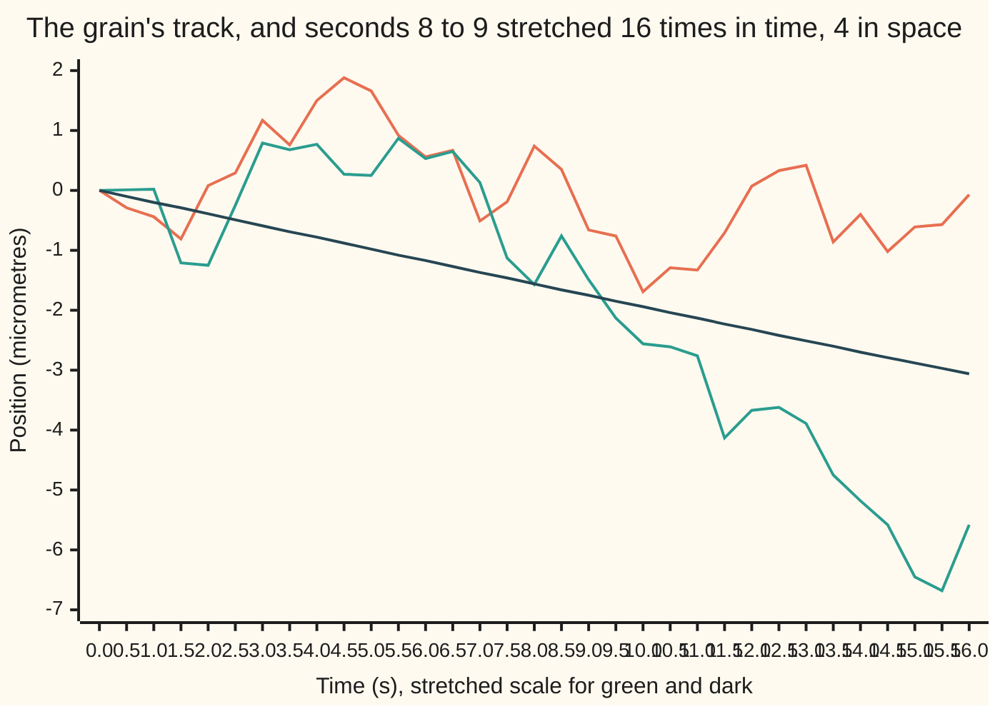
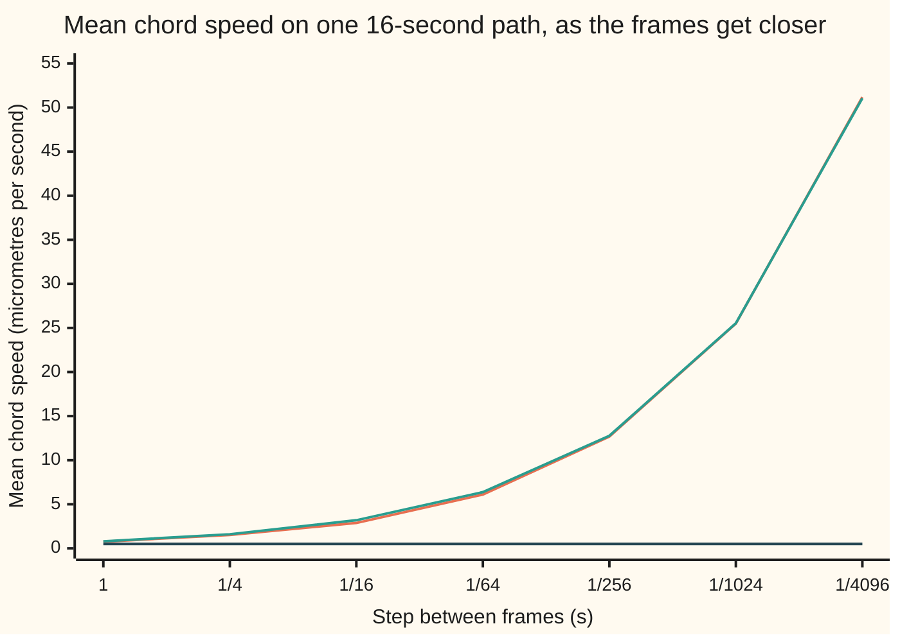

# Brownian paths: scaling by root t, continuous everywhere, smooth nowhere

[Syllabus](../../../SYLLABUS.md) → [Stochastic processes and calculus](../../../SYLLABUS.md#w11) → [Brownian Motion](../../../SYLLABUS.md#w11-s05) → Brownian paths

---

## General Overview

A pollen grain floats in a drop of water under a microscope. A camera records its sideways position once a second for 16 seconds. Water molecules strike it from every side, never quite evenly, so it jitters. Over one second it moves 0.80 micrometres (millionths of a metre) on average, one way or the other.

Now film faster: every quarter second, every sixteenth, down to every 1/4096 of a second. Zoom in on a smooth curve and it straightens into a line. The grain's track does not. Every new frame adds a new zigzag, and the piece from second 8 to second 9, stretched to fill the screen, looks like a fresh copy of the whole track. Zooming in on the grain's path never smooths it.

Two facts sit behind that. **Scaling**: distances grow like the square root of time, so 4 times as long means about 2 times as far. **Roughness**: the average speed read off the film depends on the film. With frames 1 second apart it reads 0.76 micrometres per second; with frames 1/4096 s apart, 51.18. Halve the gap and the reading grows by the square root of 2, forever. The path has no slope at any time.

The model is Brownian motion $W_t$, read "the position at time $t$" ([Brownian motion](01-brownian-motion.md)): it starts at 0, its moves over separate stretches of time are independent, the move over a stretch of length $h$ is normal with mean 0 and variance $h$, and its path is continuous.

**Stretch time by a factor c-squared and position by c, and Brownian motion turns into Brownian motion again; so typical distances grow like root t, every zoom looks as rough as the whole, and with probability one the path has a slope at no time at all.**

**What kind of fact this is:** a theorem, proved in full on this card in Why it works, the slope-at-no-time part in a folded Detailed proof callout. Continuity is part of the definition. Using it for a real grain is a model, and When it holds says where it stops.

### The picture: the whole film, and one second of it blown up

One sample path from a seeded simulation (SplitMix64, seed 20260930, in the code), drawn on a grid with step 1/4096 s and read off at the plotted points.



Orange: the whole 16 seconds, read every half second. Green: the stretch from second 8 to second 9, its time multiplied by 16 and its moves by 4, read every 1/32 s of real time. Dark: a smooth curve, $g$, given the same stretch: nearly a straight line. The green line is as ragged as the orange; it drifts further, which one sample is free to do. Four is the square root of 16: that is the root rule.

---

## The formula

Notation first, in words. A process built from $W_t$ by zooming is written $V_t$. The zoom factor is $c$, any positive number. The sampling step is $h$, in seconds. $Z$ stands for a standard normal number: mean 0, variance 1. $\Phi$ is its cumulative chance, $\Phi(x) = P(Z \le x)$ ([Normal](../../09-Probability%20and%20statistics/04-Continuous%20Distributions/04-normal-distribution.md)). "Has the same law as" is written with the letter d over an equals sign: two random objects with identical chances for every event.

The scaling law:

$$V_t = \frac{1}{c}\,W_{c^2 t} \quad\text{is again a Brownian motion, for every } c > 0.$$

**Read it aloud:** run the clock c-squared times as fast and shrink every distance by c, and the result cannot be told apart from the original.

Taking a single time and $c = \sqrt{t}$ gives the root-t rule:

$$W_t \overset{d}{=} \sqrt{t}\,Z, \qquad E\,\lvert W_t\rvert = \sqrt{2t/\pi}.$$

**Read it aloud:** the position after t seconds is a standard normal number times root t, so the mean distance from the start grows like root t.

The slope of the chord, the straight line joining the path at time $t$ to the path a step $h$ later, has a law that blows up as the step shrinks:

$$\frac{W_{t+h} - W_t}{h} \overset{d}{=} \frac{Z}{\sqrt{h}}, \qquad P\!\left(\left\lvert \frac{W_{t+h} - W_t}{h}\right\rvert > K\right) = 2\big(1 - \Phi(K\sqrt{h})\big) \to 1 \text{ as } h \to 0.$$

**Read it aloud:** the chord's slope is a normal number divided by root h, so for any speed limit K the chance of breaking it climbs to certainty as the frames get closer.

The theorem the card ends on:

$$P\big(\text{the path } t \mapsto W_t \text{ has a finite slope at some time } s\big) = 0.$$

**Read it aloud:** with probability one, there is no time at all at which the path has a slope.

| Symbol | Plain meaning | In our example | Push it up and the answer… |
| --- | --- | --- | --- |
| $W_t$, $W_s$ | Brownian motion: the position at time $t$ or $s$ | grain's sideways position, micrometres | — |
| $t$, $s$ | times, in seconds | up to 16 s; $s$ is a time picked out | the spread grows like root t |
| $c$ | zoom factor | 2 (watch 4 s, shrink by 2); 1/4 for the blow-up | — the law is unchanged, that is the theorem |
| $V_t$, $V_1$ | the zoomed process $W_{c^2t}/c$, and its value at 1 s | $W_{4t}/2$, and $W_4/2$ | — |
| $h$ | step between frames, seconds | 1 down to 1/4096 | chords get flatter; shrink it and they get steeper |
| $Z$ | a standard normal number | — | — |
| $\Phi$ | standard normal cumulative chance | $\Phi(1)$ = 0.841344746 | — |
| $K$ | a speed limit, micrometres per second | 10 in the tables; any whole number in the proof | fewer chords break it |
| $n$ | frames per second in the proof | 4096 up to 16,777,216 | the proof's bound shrinks like one over root n |
| $D$ | a slope the path might have at $s$ | none exists | — |
| $g$ | a smooth curve for contrast, $2\sin(\pi t/8)$ micrometres | slope at 8 s is $-\pi/4$ | — |
| $u$, $j$, $m$, $i$, $B_{n,K}$, $E_{m,K}$ | used only in the proofs: u the stretched clock of Step 2; j and m count events in Step 3; i numbers a frame; $B_{n,K}$ the event that three neighbouring moves are all at most 7K/n; $E_{m,K}$ the event that $B_{n,K}$ happens for every n from m on | u from 0 to 16 s | — |

### When it holds

- **Independent moves with variance proportional to time.** These make c-squared the only zoom that works. If moves stay correlated over arbitrarily long stretches (long memory), the exponent is no longer one half: fractional Brownian motion, in [Rougher than Brownian](../09-Beyond%20Brownian/06-rough-paths-and-fractional-brownian-motion-in-outline.md). Memory that fades fast only changes the spread rate ([Brownian motion](01-brownian-motion.md)).
- **The model, not the grain.** A real particle has mass, so over very short times it coasts. Li and co-workers measured the instantaneous speed of an optically trapped silica bead in 2010. Brownian motion fits at camera speeds, not below the time a particle takes to forget its own push.
- **Continuous paths are assumed.** The definition asks for them, and [Brownian motion](01-brownian-motion.md) cites their construction (Wiener, 1923; Durrett, section 7.1). Without that requirement the laws of the moves say nothing about a single path.
- **With probability one.** The theorems exclude a set of paths of probability zero, and say nothing about a path drawn by hand.

---

## Why it works

### Step 0: no built-in scale except space-squared over time

A smooth curve has a slope, micrometres per second. Zoom both axes by the same factor and the slope stays put, so the curve flattens into its tangent line. Brownian motion carries no such number. Its only fixed ratio is variance per unit time, 1 square micrometre per second here. A zoom that keeps that ratio, c in space and c-squared in time, leaves every defining property untouched. So the zoomed path has the same law at every magnification and never settles into a line, and a line is what a slope is. That is a picture, since equal laws say nothing about one fixed path; Steps 3 to 5 make it a proof.

### Step 1: the scaling law, proved

Fix $c > 0$ and set $V_t = W_{c^2t}/c$. Check the four properties that define Brownian motion.

1. **Start.** $V_0 = W_0/c = 0$.
2. **Independent moves.** For times $0 \le t_0 < t_1 < \dots < t_k$, the moves of the zoomed process are the moves of $W_t$ over the stretches from $c^2 t_{i-1}$ to $c^2 t_i$, each divided by c. Those stretches do not overlap, so those moves are independent, and dividing by a fixed number keeps them so.
3. **Normal moves of the right size.** For $s < t$, the move $V_t - V_s$ is $(W_{c^2t} - W_{c^2s})/c$. The top is normal with mean 0 and variance $c^2(t - s)$. Dividing by c divides the variance by c-squared: mean 0, variance $t - s$.
4. **Continuity.** A continuous path, run on the clock $c^2t$ and divided by c, is still continuous.

All four hold, so $V_t$ is a Brownian motion. The chances of any event about finitely many times are fixed by properties 1 to 3, so the zoomed process and the original share them all. That is the whole proof.

For the grain, take $c = 2$: watch for 4 seconds and halve the distances. The position at 4 s has variance 4; halving divides it by 4, back to 1, so $V_1$ is standard normal. The mean distance after 1, 4 and 16 seconds is 0.7979, 1.5958 and 3.1915 micrometres: each 4 times longer, 2 times further.

### Step 2: the zoom works at any time, not only at the start

The film from second 8 on, measured from where the grain was then, is $W_{8+t} - W_8$. It passes the same four checks: it starts at 0, its moves are moves of the original over later stretches, and its path is continuous. So it is a fresh Brownian motion, and Step 1 applies to it. With $c = 1/4$, the stretched piece $4(W_{8 + u/16} - W_8)$ for u from 0 to 16 is a Brownian motion on 16 seconds. That is the green line: the law of the orange line, cut from another stretch of the same path.

### Step 3: at any time named in advance, there is no slope

Fix a time t, say 8 seconds. The chord's slope over a step h is $(W_{t+h} - W_t)/h$. The top is normal with variance h, so the slope is $Z/\sqrt{h}$: a standard normal number blown up by $1/\sqrt{h}$. Its mean size is $\sqrt{2/(\pi h)}$, which is 0.7979 micrometres per second at h = 1 and 51.0646 at h = 1/4096.

Now fix a speed limit K. The chance that a chord breaks it is $P(\lvert Z\rvert > K\sqrt{h}) = 2(1 - \Phi(K\sqrt{h}))$. As h shrinks, $K\sqrt{h}$ falls to 0 and the chance climbs to 1.

That gives a proof. Take the steps 1/4, 1/16, 1/64 and so on, and call event j "the chord over step 4 to the power −j breaks the limit K". The chance of event j tends to 1. The chance that infinitely many of the events happen is the limit, as m grows, of the chance that at least one from event m on happens ([Continuity and subadditivity](../../10-Measure%20and%20integration/01-Sets%20You%20Can%20Measure/05-continuity-of-measure.md): continuity from above). Each of those chances is at least the chance of event m alone, which tends to 1. So with probability one, chords break the limit K at arbitrarily small steps.

Do that for K = 1, 2, 3 and so on. Countably many events of probability one happen together with probability one. So with probability one the chords at time t are unbounded as h shrinks. A slope $D$ would force them to settle near D. There is none.

### Step 4: almost every time is a time without slope

Step 3 holds for each time separately. The expected total length of the set of times in a second at which a slope exists is the integral over t of the chance of a slope at t ([Tonelli and Fubini](../../10-Measure%20and%20integration/06-Product%20Measures%20and%20Fubini/03-tonelli-and-fubini.md) lets the expectation pass inside). Each chance is 0, so the expected length is 0. With probability one, the times with a slope take up no length at all.

That is not yet the theorem. A set of no length can still hold points, and those points are chosen by the path after it is drawn. Step 3 shows that a time named in advance is bad. It does not show that no good time hides somewhere else in the path.

### Step 5: no slope anywhere, by counting three small moves

Raymond Paley, Norbert Wiener and Antoni Zygmund proved the full statement in 1933. A shorter argument, due to Dvoretzky, Erdős and Kakutani, needs only the normal law.

The shape in words. Suppose the path had a slope at some time $s$ within the first second. Then near s it moves no faster than some whole number K of micrometres per second. Cut the second into n equal frames. Just after s sit three consecutive frames, each within 4/n of s. On each, the path moves at most 7K/n. Each move is normal with variance 1/n, so each lands that close to 0 with chance at most $7K/\sqrt{n}$. The three moves are independent, so all three do with chance at most $(7K/\sqrt{n})^3$. There are n places the trio could sit. Adding over them gives at most $343K^3/\sqrt{n}$, which tends to 0 as the frames shrink.

For K = 1 micrometre per second the bound is 5.3594 at 4096 frames a second and 0.0837 at 16,777,216. The exact three-frame chance, summed over places, is about half: 2.7061 and 0.0425. Both halve each time n is multiplied by 4.

<details>
<summary>Detailed proof: with probability one, no slope at any time</summary>

Extend the path to two seconds so that every frame below exists. For whole numbers K and n, let $B_{n,K}$ be the event that for some i from 1 to n, the three moves of the path over the frames starting at $i/n$, $(i+1)/n$ and $(i+2)/n$ all have size at most $7K/n$.

**Chance of one such event.** Each move is normal with variance $1/n$, so it equals $Z/\sqrt{n}$ in law. Its chance of having size at most $7K/n$ is $P(\lvert Z\rvert \le 7K/\sqrt{n})$. That is an interval of width $14K/\sqrt{n}$ for $Z$, whose density never exceeds $1/\sqrt{2\pi}$, below one half, so the chance is at most $7K/\sqrt{n}$. The three frames do not overlap, so their moves are independent, and all three are small with chance at most $343K^3/n^{3/2}$. Adding over the n starting places: $P(B_{n,K}) \le 343K^3/\sqrt{n}$.

**A slope forces the event.** Suppose the path has a finite slope D at some time s from 0 up to, but not including, 1. Pick a whole number K above $\lvert D\rvert + 1$. Near enough to s, the chord slopes stay within 1 of D, so there is a window to the right of s in which $\lvert W_u - W_s\rvert \le K(u - s)$, for every time u in it. Let n be large enough that $4/n$ lies inside that window, and let i be the first whole number above n times s, so $s < i/n \le s + 1/n$ and $i \le n$. The four grid points $i/n$ up to $(i+3)/n$ lie within $4/n$ to the right of s. For each of the three frames, the move is at most the distance of its far end from $W_s$ plus that of its near end: at most $K \cdot 4/n + K \cdot 3/n = 7K/n$. So $B_{n,K}$ happens for every n large enough.

**The chance is zero.** Let $E_{m,K}$ be the event that $B_{n,K}$ happens for every n from m on. For each n at least m, $E_{m,K}$ sits inside $B_{n,K}$, so its chance is at most $343K^3/\sqrt{n}$ for every such n, which forces it to be 0. The paths with a slope somewhere in the first second sit inside the union of the $E_{m,K}$ over all whole m and K: countably many events of chance 0. That union has chance 0. Running the same argument on each second, s up to 1, 2, 3 and so on, covers every time.

The argument never uses the left side of s and needs only a speed limit near s, so it shows more: no time at which the path is held to a finite speed even from the right.

</details>

### Step 6: continuity is the other half, and it comes with a rate

On this film the largest move between neighbouring frames is 1.4057 micrometres at 1-second frames and 0.0723 at 1/4096 s. It falls a little slower than root h, because the largest of many moves picks the luckiest one; Paul Lévy found the exact rate, proved in Mörters and Peres (Sources). A move over a frame of length h is about root h in size, never about h. Root h shrinks to 0, matching the continuity the definition asks for. Root h divided by h grows without bound, so there is no slope. Continuous everywhere and smooth nowhere are one fact seen from two sides.

A second road to the missing slope adds up squared moves instead of chords. The total stays at the elapsed time however fine the frames, which forces infinite length on every interval and rules out a slope on any interval: [Quadratic variation](03-quadratic-variation.md) does it properly.

---

## Worked numbers, by hand

| Step | Arithmetic | Value |
| --- | --- | --- |
| variance after 4 s | 4 seconds × 1 square micrometre per second | 4 |
| zoom with c = 2 | divide the move by 2, so the variance by 4 | 1, the variance after 1 s |
| mean distance after 1 s | $\sqrt{2/\pi}$ | 0.7979 μm |
| after 4 s, then 16 s | 0.7979 × 2, then × 4 | 1.5958 and 3.1915 μm |
| mean chord speed, 1 s frames | $\sqrt{2/(\pi \cdot 1)}$ | 0.7979 μm per s |
| mean chord speed, 1/4096 s frames | $\sqrt{2 \cdot 4096/\pi}$, 64 times the 1-second value | **51.0646 μm per s** |
| chance a 1/4096 s chord beats 10 μm per s | $K\sqrt{h}$ = 10/64 = 0.15625; then 2(1 − Φ(0.15625)) | **0.8758** |

At camera speed the grain seems to drift at under a micrometre a second. Film it 4096 times faster and the "speed" reads 64 times higher, and about 7 chords in 8 beat 10 micrometres per second. The number measures the camera.

### What breaks if you drop a piece

| Mistake | Comes out at | What went wrong |
| --- | --- | --- |
| Zoom both axes by 4: position at 4t over 4 | variance 0.2461 ± 0.0025 by simulation, formula 0.25, not 1 | Space must shrink by the root of the time factor |
| Stretch time, leave space: position at 4t | variance 3.9375 ± 0.0396, formula 4 | Four times the time is four times the variance |
| Read speed off tracking data | 0.7552 μm per s at 1 s frames, 51.1762 at 1/4096 s | The chord speed grows like one over root h; no limit exists |
| Drop the root-h moves: a smooth curve | smooth curve at 8 s: −0.7854; the path: −1.3947, 0.7740, …, −105.1943 | A slope is the limit of chords; the path's have none |

The code prints every one of them.

---

## Code, from first principles, and it actually runs

Random numbers come from SplitMix64, seed 20260930, made normal by Box-Muller, both written out. Three roads. **Formulas:** the root-t laws, the normal cumulative chance written twice (Simpson's rule and a Taylor series), and the proof's bound. **Exact enumeration:** a coin-flip walk's mean distance, summed over every path, closing on $\sqrt{2/\pi}$ ([Simple random walk](../01-Random%20Walks%20and%20Filtrations/02-simple-random-walk.md)). **Simulation:** one 16-second path by Lévy's midpoint refinement, from 1-second frames to 1/4096 s; each new midpoint is its neighbours' average plus a normal move with a quarter of the old frame's variance. Earlier points never move, so each level is the same path filmed faster. Then 20,000 paths on a 1/8 s grid over 4 seconds test the scaling law; a sum of normal moves is exactly normal at every grid time, so the grid adds no bias. Simulated numbers carry standard errors, and asserts on them allow four.

### Python

```python
# Brownian paths: scaling by root t, continuous everywhere, smooth nowhere.  Std lib only.
# A pollen grain's position W_t in micrometres (um), t in seconds, spread 1 um^2 per s.
# Roads: formulas; exact coin-flip walk; seeded simulation (SplitMix64 20260930, Box-Muller).
from math import sqrt, log, cos, sin, pi, exp

M64 = (1 << 64) - 1
state = 20260930
spare = None

def uniform():                          # SplitMix64 -> a number in (0, 1]
    global state
    state = (state + 0x9E3779B97F4A7C15) & M64
    z = state
    z = ((z ^ (z >> 30)) * 0xBF58476D1CE4E5B9) & M64
    z = ((z ^ (z >> 27)) * 0x94D049BB133111EB) & M64
    return (((z ^ (z >> 31)) >> 11) + 1) / 2.0**53

def normal():                           # Box-Muller, both values of each pair used
    global spare
    if spare is not None:
        z, spare = spare, None
        return z
    r, th = sqrt(-2.0 * log(uniform())), 2.0 * pi * uniform()
    spare = r * sin(th)
    return r * cos(th)

def phi_simpson(x):                     # normal CDF, Simpson's rule on the density
    n, h = 2000, x / 2000
    s = sum((4 if i % 2 else 2) * exp(-(i * h) * (i * h) / 2) for i in range(1, n))
    return 0.5 + (s + 1.0 + exp(-x * x / 2)) * h / 3 / sqrt(2 * pi)

def phi_series(x):                      # normal CDF, Taylor series of the integral
    term, total, n = x, x, 0
    while abs(term) > 1e-17:
        n += 1
        term *= -x * x / (2 * n)
        total += term / (2 * n + 1)
    return 0.5 + total / sqrt(2 * pi)

def g(t):                               # a smooth curve, for contrast, in um
    return 2.0 * sin(pi * t / 8.0)

def mean_se(xs):
    m = sum(xs) / len(xs)
    v = sum((x - m) * (x - m) for x in xs) / (len(xs) - 1)
    return m, sqrt(v / len(xs))

print("grain: W_t in um, t in s, spread 1 um^2 per second; SplitMix64 seed 20260930")
print(f"Phi(1) by Simpson {phi_simpson(1.0):.9f}, by series {phi_series(1.0):.9f}")
assert abs(phi_simpson(1.0) - phi_series(1.0)) < 1e-9, "the two normal CDFs disagree"
print("E|W_t| = sqrt(2t/pi), t = 1, 4, 16 s: " + " ".join(f"{sqrt(2 * t / pi):.4f}" for t in (1, 4, 16)))
print(f"K sqrt(h) for K = 10 um/s, h = 1/4096 s: {10 * sqrt(1 / 4096):.5f}")

# ---- one path over 16 s, refined by midpoints: level k = sampled every 2^-k s ----
w = [0.0]
for i in range(16):
    w.append(w[-1] + normal())
for k in range(1, 13):
    sd, new = sqrt(1.0 / 2 ** (k - 1)) / 2.0, [w[0]]
    for a, b in zip(w, w[1:]):
        new += [(a + b) / 2.0 + sd * normal(), b]
    w = new                             # earlier points never move: the same path, finer
FINE = 4096                             # points per second at level 12

print("level  step(s)  max|step|  mean|slope| +- se   formula   smooth")
lv_rows, mean_slopes = [], []
for k in range(0, 13, 2):
    st, dt = FINE // 2 ** k, 1.0 / 2 ** k
    pts = w[::st]
    slopes = [abs(b - a) / dt for a, b in zip(pts, pts[1:])]
    m, se = mean_se(slopes)
    big = max(abs(b - a) for a, b in zip(pts, pts[1:]))
    sm = sum(abs(g((i + 1) * dt) - g(i * dt)) for i in range(len(slopes))) / dt / len(slopes)
    f = sqrt(2.0 / (pi * dt))
    mean_slopes.append((m, f))
    print(f"{k:5d} {dt:9.6f} {big:9.4f} {m:10.4f} +- {se:6.4f} {f:9.4f} {sm:8.4f}")
    assert abs(m - f) < 4 * se, "mean |slope| off the root-t prediction"
    frac = sum(1 for s in slopes if s > 10.0) / len(slopes)
    p = max(0.0, 2.0 * (1.0 - phi_simpson(10.0 * sqrt(dt))))
    fse = sqrt(frac * (1 - frac) / len(slopes))
    assert abs(frac - p) < 4 * fse + 1.0 / len(slopes), "slope tail off the formula"
    i8, ih = 8 * FINE, 8 * FINE + st
    lv_rows.append((k, frac, fse, p, (w[ih] - w[i8]) / dt, (w[ih] - w[i8]) / sqrt(dt),
                    (g(8 + dt) - g(8)) / dt))
print("level  frac|slope|>10 +- se  formula   chord(8)  chord*sqrt(h)  smooth chord")
for k, frac, fse, p, ch, rch, sch in lv_rows:
    print(f"{k:5d} {frac:10.4f} +- {fse:6.4f} {p:9.4f} {ch:10.4f} {rch:10.4f} {sch:12.4f}")
assert abs(lv_rows[-1][6] + pi / 4) < 1e-6, "smooth chord must settle on its slope -pi/4"

# ---- the scaling law tested on simulated paths: V_t = W(4t)/2 ----
M, STEPS = 20000, 32                    # 32 steps of 1/8 s cover 4 s
w2s, w4s = [], []
for _ in range(M):
    x = 0.0
    for j in range(1, STEPS + 1):
        x += sqrt(1.0 / 8.0) * normal()
        if j == 16:
            w2s.append(x)
    w4s.append(x)
v_half, v_one = [x / 2 for x in w2s], [x / 2 for x in w4s]
print(f"-- scaling, V_t = W(4t)/2, {M} paths on a 1/8 s grid --")
rows = [("Var V_1", [x * x for x in v_one], 1.0),
        ("Cov V_0.5 V_1", [a * b for a, b in zip(v_half, v_one)], 0.5),
        ("P(|V_1| <= 1)", [1.0 if abs(x) <= 1 else 0.0 for x in v_one], 2 * phi_series(1.0) - 1),
        ("E|V_1|", [abs(x) for x in v_one], sqrt(2 / pi)),
        ("wrong: Var W(4t)/4", [(x / 4) * (x / 4) for x in w4s], 0.25),
        ("wrong: Var W(4t)", [x * x for x in w4s], 4.0)]
for label, xs, f in rows:
    m, se = mean_se(xs)
    print(f"{label:<20} sim {m:7.4f} +- {se:6.4f}   formula {f:7.4f}")
    assert abs(m - f) < 4 * se, label

# ---- coin-flip walk, exact over every path: E|S_m| / sqrt(m) ----
vals = []
for mm in (1, 4, 16, 64, 256):
    pmf, tot = 0.5 ** mm, 0.0
    for kk in range(mm + 1):
        tot += pmf * abs(2 * kk - mm)
        pmf *= (mm - kk) / (kk + 1)
    vals.append(tot / sqrt(mm))
print("walk E|S_m|/sqrt(m), m = 1 4 16 64 256: " + " ".join(f"{v:.6f}" for v in vals)
      + f"; limit {sqrt(2 / pi):.6f}")
assert abs(vals[-1] - sqrt(2 / pi)) < 0.002, "walk does not approach the Brownian value"

# ---- the proof's bound, one second, K = 1 um/s ----
print("proof: n P(|Z| <= 7/sqrt n)^3 and 343/sqrt n, n = 2^12 2^16 2^20 2^24:")
for e in (12, 16, 20, 24):
    n = 2.0 ** e
    exact, bound = n * (2 * phi_series(7 / sqrt(n)) - 1) ** 3, 343 / sqrt(n)
    print(f"  2^{e}: {exact:.4f}  {bound:.4f}")
    assert exact <= bound, "the proof's bound fails"

# ---- chart points ----
print("chart, time (s)      " + " ".join(f"{0.5 * i:.1f}" for i in range(33)))
print("chart, whole path    " + " ".join(f"{w[i * FINE // 2]:.2f}" for i in range(33)))
print("chart, zoomed path   " + " ".join(f"{4 * (w[8 * FINE + i * FINE // 32] - w[8 * FINE]):.2f}" for i in range(33)))
print("chart, zoomed smooth " + " ".join(f"{4 * (g(8 + i / 32) - g(8)):.2f}" for i in range(33)))
print("chart, mean slope    " + " ".join(f"{m:.2f}" for m, f in mean_slopes))
print("chart, formula       " + " ".join(f"{f:.2f}" for m, f in mean_slopes))
print("ALL CHECKS PASS")
```

**Ran 2026-10-06 on macOS, Python 3.14.6, standard library only. All checks passed. Output, pasted from the run:**

```
grain: W_t in um, t in s, spread 1 um^2 per second; SplitMix64 seed 20260930
Phi(1) by Simpson 0.841344746, by series 0.841344746
E|W_t| = sqrt(2t/pi), t = 1, 4, 16 s: 0.7979 1.5958 3.1915
K sqrt(h) for K = 10 um/s, h = 1/4096 s: 0.15625
level  step(s)  max|step|  mean|slope| +- se   formula   smooth
    0  1.000000    1.4057     0.7552 +- 0.1085    0.7979   0.5000
    2  0.250000    0.9466     1.5098 +- 0.1261    1.5958   0.5000
    4  0.062500    0.8418     2.8769 +- 0.1447    3.1915   0.5000
    6  0.015625    0.5101     6.0997 +- 0.1524    6.3831   0.5000
    8  0.003906    0.2282    12.6835 +- 0.1520   12.7662   0.5000
   10  0.000977    0.1143    25.4961 +- 0.1520   25.5323   0.5000
   12  0.000244    0.0723    51.1762 +- 0.1512   51.0646   0.5000
level  frac|slope|>10 +- se  formula   chord(8)  chord*sqrt(h)  smooth chord
    0     0.0000 +- 0.0000    0.0000    -1.3947    -1.3947      -0.7654
    2     0.0000 +- 0.0000    0.0000     0.7740     0.3870      -0.7841
    4     0.0078 +- 0.0055    0.0124     0.0997     0.0249      -0.7853
    6     0.1914 +- 0.0123    0.2113     0.6650     0.0831      -0.7854
    8     0.5300 +- 0.0078    0.5320    -8.1023    -0.5064      -0.7854
   10     0.7509 +- 0.0034    0.7547   -26.0585    -0.8143      -0.7854
   12     0.8747 +- 0.0013    0.8758  -105.1943    -1.6437      -0.7854
-- scaling, V_t = W(4t)/2, 20000 paths on a 1/8 s grid --
Var V_1              sim  0.9844 +- 0.0099   formula  1.0000
Cov V_0.5 V_1        sim  0.4927 +- 0.0061   formula  0.5000
P(|V_1| <= 1)        sim  0.6871 +- 0.0033   formula  0.6827
E|V_1|               sim  0.7919 +- 0.0042   formula  0.7979
wrong: Var W(4t)/4   sim  0.2461 +- 0.0025   formula  0.2500
wrong: Var W(4t)     sim  3.9375 +- 0.0396   formula  4.0000
walk E|S_m|/sqrt(m), m = 1 4 16 64 256: 1.000000 0.750000 0.785522 0.794774 0.797106; limit 0.797885
proof: n P(|Z| <= 7/sqrt n)^3 and 343/sqrt n, n = 2^12 2^16 2^20 2^24:
  2^12: 2.7061  5.3594
  2^16: 0.6803  1.3398
  2^20: 0.1701  0.3350
  2^24: 0.0425  0.0837
chart, time (s)      0.0 0.5 1.0 1.5 2.0 2.5 3.0 3.5 4.0 4.5 5.0 5.5 6.0 6.5 7.0 7.5 8.0 8.5 9.0 9.5 10.0 10.5 11.0 11.5 12.0 12.5 13.0 13.5 14.0 14.5 15.0 15.5 16.0
chart, whole path    0.00 -0.29 -0.44 -0.81 0.08 0.29 1.17 0.76 1.50 1.88 1.66 0.92 0.56 0.67 -0.51 -0.19 0.74 0.35 -0.66 -0.76 -1.69 -1.29 -1.33 -0.71 0.07 0.33 0.42 -0.86 -0.40 -1.02 -0.61 -0.57 -0.07
chart, zoomed path   0.00 0.01 0.02 -1.21 -1.25 -0.25 0.79 0.68 0.77 0.27 0.25 0.87 0.53 0.65 0.13 -1.13 -1.57 -0.76 -1.49 -2.13 -2.56 -2.61 -2.76 -4.13 -3.67 -3.62 -3.89 -4.75 -5.18 -5.58 -6.45 -6.68 -5.58
chart, zoomed smooth 0.00 -0.10 -0.20 -0.29 -0.39 -0.49 -0.59 -0.69 -0.78 -0.88 -0.98 -1.08 -1.17 -1.27 -1.37 -1.46 -1.56 -1.66 -1.75 -1.85 -1.94 -2.04 -2.13 -2.23 -2.32 -2.42 -2.51 -2.60 -2.70 -2.79 -2.88 -2.97 -3.06
chart, mean slope    0.76 1.51 2.88 6.10 12.68 25.50 51.18
chart, formula       0.80 1.60 3.19 6.38 12.77 25.53 51.06
ALL CHECKS PASS
```

### Rust

Same numbers, same labels, built with `rustc --edition 2021 -O`.

```rust
// Brownian paths: scaling by root t, continuous everywhere, smooth nowhere.  Std only.
// A pollen grain's position W_t in micrometres (um), t in seconds, spread 1 um^2 per s.
// Roads: formulas; exact coin-flip walk; seeded simulation (SplitMix64 20260930, Box-Muller).
use std::f64::consts::PI;

struct Rng { state: u64, spare: Option<f64> }

impl Rng {
    fn uniform(&mut self) -> f64 {      // SplitMix64 -> a number in (0, 1]
        self.state = self.state.wrapping_add(0x9E3779B97F4A7C15);
        let mut z = self.state;
        z = (z ^ (z >> 30)).wrapping_mul(0xBF58476D1CE4E5B9);
        z = (z ^ (z >> 27)).wrapping_mul(0x94D049BB133111EB);
        (((z ^ (z >> 31)) >> 11) + 1) as f64 / 9007199254740992.0
    }
    fn normal(&mut self) -> f64 {       // Box-Muller, both values of each pair used
        if let Some(z) = self.spare.take() { return z; }
        let r = (-2.0 * self.uniform().ln()).sqrt();
        let th = 2.0 * PI * self.uniform();
        self.spare = Some(r * th.sin());
        r * th.cos()
    }
}

fn phi_simpson(x: f64) -> f64 {         // normal CDF, Simpson's rule on the density
    let (n, h) = (2000, x / 2000.0);
    let mut s = 0.0;
    for i in 1..n {
        let u = i as f64 * h;
        s += (if i % 2 == 1 { 4.0 } else { 2.0 }) * (-u * u / 2.0).exp();
    }
    0.5 + (s + 1.0 + (-x * x / 2.0).exp()) * h / 3.0 / (2.0 * PI).sqrt()
}

fn phi_series(x: f64) -> f64 {          // normal CDF, Taylor series of the integral
    let (mut term, mut total, mut n) = (x, x, 0.0);
    while term.abs() > 1e-17 {
        n += 1.0;
        term *= -x * x / (2.0 * n);
        total += term / (2.0 * n + 1.0);
    }
    0.5 + total / (2.0 * PI).sqrt()
}

fn g(t: f64) -> f64 { 2.0 * (PI * t / 8.0).sin() }   // a smooth curve, for contrast, in um

fn mean_se(xs: &[f64]) -> (f64, f64) {
    let n = xs.len() as f64;
    let m = xs.iter().sum::<f64>() / n;
    let v = xs.iter().map(|x| (x - m) * (x - m)).sum::<f64>() / (n - 1.0);
    (m, (v / n).sqrt())
}

fn join(xs: &[f64], d: usize) -> String {
    xs.iter().map(|x| format!("{:.*}", d, x)).collect::<Vec<_>>().join(" ")
}

fn main() {
    let mut rng = Rng { state: 20260930, spare: None };
    println!("grain: W_t in um, t in s, spread 1 um^2 per second; SplitMix64 seed 20260930");
    println!("Phi(1) by Simpson {:.9}, by series {:.9}", phi_simpson(1.0), phi_series(1.0));
    assert!((phi_simpson(1.0) - phi_series(1.0)).abs() < 1e-9, "the two normal CDFs disagree");
    let ew: Vec<f64> = [1.0f64, 4.0, 16.0].iter().map(|t| (2.0 * t / PI).sqrt()).collect();
    println!("E|W_t| = sqrt(2t/pi), t = 1, 4, 16 s: {}", join(&ew, 4));
    println!("K sqrt(h) for K = 10 um/s, h = 1/4096 s: {:.5}", 10.0 * (1.0f64 / 4096.0).sqrt());

    // ---- one path over 16 s, refined by midpoints: level k = sampled every 2^-k s ----
    let mut w = vec![0.0f64];
    for _ in 0..16 { let last = *w.last().unwrap(); w.push(last + rng.normal()); }
    for k in 1..13 {
        let sd = (1.0 / 2f64.powi(k - 1)).sqrt() / 2.0;
        let mut new = vec![w[0]];
        for i in 0..w.len() - 1 {
            new.push((w[i] + w[i + 1]) / 2.0 + sd * rng.normal());
            new.push(w[i + 1]);
        }
        w = new;                        // earlier points never move: the same path, finer
    }
    let fine = 4096usize;               // points per second at level 12

    println!("level  step(s)  max|step|  mean|slope| +- se   formula   smooth");
    let (mut lv_rows, mut mean_slopes) = (Vec::new(), Vec::new());
    for k in (0..13).step_by(2) {
        let (st, dt) = (fine >> k, 1.0 / 2f64.powi(k as i32));
        let pts: Vec<f64> = w.iter().step_by(st).copied().collect();
        let slopes: Vec<f64> = pts.windows(2).map(|p| (p[1] - p[0]).abs() / dt).collect();
        let (m, se) = mean_se(&slopes);
        let big = pts.windows(2).map(|p| (p[1] - p[0]).abs()).fold(0.0f64, f64::max);
        let sm = (0..slopes.len()).map(|i| (g((i + 1) as f64 * dt) - g(i as f64 * dt)).abs()).sum::<f64>() / dt / slopes.len() as f64;
        let f = (2.0 / (PI * dt)).sqrt();
        mean_slopes.push((m, f));
        println!("{:5} {:9.6} {:9.4} {:10.4} +- {:6.4} {:9.4} {:8.4}", k, dt, big, m, se, f, sm);
        assert!((m - f).abs() < 4.0 * se, "mean |slope| off the root-t prediction");
        let nl = slopes.len() as f64;
        let frac = slopes.iter().filter(|&&s| s > 10.0).count() as f64 / nl;
        let p = (2.0 * (1.0 - phi_simpson(10.0 * dt.sqrt()))).max(0.0);
        let fse = (frac * (1.0 - frac) / nl).sqrt();
        assert!((frac - p).abs() < 4.0 * fse + 1.0 / nl, "slope tail off the formula");
        let (i8, ih) = (8 * fine, 8 * fine + st);
        lv_rows.push((k, frac, fse, p, (w[ih] - w[i8]) / dt, (w[ih] - w[i8]) / dt.sqrt(),
                      (g(8.0 + dt) - g(8.0)) / dt));
    }
    println!("level  frac|slope|>10 +- se  formula   chord(8)  chord*sqrt(h)  smooth chord");
    for &(k, frac, fse, p, ch, rch, sch) in &lv_rows {
        println!("{:5} {:10.4} +- {:6.4} {:9.4} {:10.4} {:10.4} {:12.4}", k, frac, fse, p, ch, rch, sch);
    }
    assert!((lv_rows[lv_rows.len() - 1].6 + PI / 4.0).abs() < 1e-6, "smooth chord must settle on its slope -pi/4");

    // ---- the scaling law tested on simulated paths: V_t = W(4t)/2 ----
    let (m_paths, steps) = (20000usize, 32);   // 32 steps of 1/8 s cover 4 s
    let (mut w2s, mut w4s) = (Vec::new(), Vec::new());
    for _ in 0..m_paths {
        let mut x = 0.0;
        for j in 1..=steps {
            x += (1.0f64 / 8.0).sqrt() * rng.normal();
            if j == 16 { w2s.push(x); }
        }
        w4s.push(x);
    }
    let (v_half, v_one): (Vec<f64>, Vec<f64>) = (w2s.iter().map(|x| x / 2.0).collect(), w4s.iter().map(|x| x / 2.0).collect());
    println!("-- scaling, V_t = W(4t)/2, {} paths on a 1/8 s grid --", m_paths);
    let rows: Vec<(&str, Vec<f64>, f64)> = vec![
        ("Var V_1", v_one.iter().map(|x| x * x).collect(), 1.0),
        ("Cov V_0.5 V_1", v_half.iter().zip(&v_one).map(|(a, b)| a * b).collect(), 0.5),
        ("P(|V_1| <= 1)", v_one.iter().map(|x| if x.abs() <= 1.0 { 1.0 } else { 0.0 }).collect(),
         2.0 * phi_series(1.0) - 1.0),
        ("E|V_1|", v_one.iter().map(|x| x.abs()).collect(), (2.0 / PI).sqrt()),
        ("wrong: Var W(4t)/4", w4s.iter().map(|x| (x / 4.0) * (x / 4.0)).collect(), 0.25),
        ("wrong: Var W(4t)", w4s.iter().map(|x| x * x).collect(), 4.0)];
    for (label, xs, f) in &rows {
        let (m, se) = mean_se(xs);
        println!("{:<20} sim {:7.4} +- {:6.4}   formula {:7.4}", label, m, se, f);
        assert!((m - f).abs() < 4.0 * se, "{}", label);
    }

    // ---- coin-flip walk, exact over every path: E|S_m| / sqrt(m) ----
    let mut vals = Vec::new();
    for &mm in &[1i64, 4, 16, 64, 256] {
        let (mut pmf, mut tot) = (0.5f64.powi(mm as i32), 0.0);
        for kk in 0..=mm {
            tot += pmf * (2 * kk - mm).abs() as f64;
            pmf *= (mm - kk) as f64 / (kk + 1) as f64;
        }
        vals.push(tot / (mm as f64).sqrt());
    }
    println!("walk E|S_m|/sqrt(m), m = 1 4 16 64 256: {}; limit {:.6}", join(&vals, 6), (2.0 / PI).sqrt());
    assert!((vals[vals.len() - 1] - (2.0 / PI).sqrt()).abs() < 0.002, "walk does not approach the Brownian value");

    // ---- the proof's bound, one second, K = 1 um/s ----
    println!("proof: n P(|Z| <= 7/sqrt n)^3 and 343/sqrt n, n = 2^12 2^16 2^20 2^24:");
    for e in [12, 16, 20, 24] {
        let n = 2f64.powi(e);
        let (exact, bound) = (n * (2.0 * phi_series(7.0 / n.sqrt()) - 1.0).powi(3), 343.0 / n.sqrt());
        println!("  2^{}: {:.4}  {:.4}", e, exact, bound);
        assert!(exact <= bound, "the proof's bound fails");
    }

    // ---- chart points ----
    let times: Vec<f64> = (0..33).map(|i| 0.5 * i as f64).collect();
    let whole: Vec<f64> = (0..33).map(|i| w[i * fine / 2]).collect();
    let zoom: Vec<f64> = (0..33).map(|i| 4.0 * (w[8 * fine + i * fine / 32] - w[8 * fine])).collect();
    let smooth: Vec<f64> = (0..33).map(|i| 4.0 * (g(8.0 + i as f64 / 32.0) - g(8.0))).collect();
    println!("chart, time (s)      {}", join(&times, 1));
    println!("chart, whole path    {}", join(&whole, 2));
    println!("chart, zoomed path   {}", join(&zoom, 2));
    println!("chart, zoomed smooth {}", join(&smooth, 2));
    println!("chart, mean slope    {}", join(&mean_slopes.iter().map(|p| p.0).collect::<Vec<_>>(), 2));
    println!("chart, formula       {}", join(&mean_slopes.iter().map(|p| p.1).collect::<Vec<_>>(), 2));
    println!("ALL CHECKS PASS");
}
```

**Ran 2026-10-06 on macOS, rustc 1.98.1, no crates. All checks passed. Output, pasted from the run:**

```
grain: W_t in um, t in s, spread 1 um^2 per second; SplitMix64 seed 20260930
Phi(1) by Simpson 0.841344746, by series 0.841344746
E|W_t| = sqrt(2t/pi), t = 1, 4, 16 s: 0.7979 1.5958 3.1915
K sqrt(h) for K = 10 um/s, h = 1/4096 s: 0.15625
level  step(s)  max|step|  mean|slope| +- se   formula   smooth
    0  1.000000    1.4057     0.7552 +- 0.1085    0.7979   0.5000
    2  0.250000    0.9466     1.5098 +- 0.1261    1.5958   0.5000
    4  0.062500    0.8418     2.8769 +- 0.1447    3.1915   0.5000
    6  0.015625    0.5101     6.0997 +- 0.1524    6.3831   0.5000
    8  0.003906    0.2282    12.6835 +- 0.1520   12.7662   0.5000
   10  0.000977    0.1143    25.4961 +- 0.1520   25.5323   0.5000
   12  0.000244    0.0723    51.1762 +- 0.1512   51.0646   0.5000
level  frac|slope|>10 +- se  formula   chord(8)  chord*sqrt(h)  smooth chord
    0     0.0000 +- 0.0000    0.0000    -1.3947    -1.3947      -0.7654
    2     0.0000 +- 0.0000    0.0000     0.7740     0.3870      -0.7841
    4     0.0078 +- 0.0055    0.0124     0.0997     0.0249      -0.7853
    6     0.1914 +- 0.0123    0.2113     0.6650     0.0831      -0.7854
    8     0.5300 +- 0.0078    0.5320    -8.1023    -0.5064      -0.7854
   10     0.7509 +- 0.0034    0.7547   -26.0585    -0.8143      -0.7854
   12     0.8747 +- 0.0013    0.8758  -105.1943    -1.6437      -0.7854
-- scaling, V_t = W(4t)/2, 20000 paths on a 1/8 s grid --
Var V_1              sim  0.9844 +- 0.0099   formula  1.0000
Cov V_0.5 V_1        sim  0.4927 +- 0.0061   formula  0.5000
P(|V_1| <= 1)        sim  0.6871 +- 0.0033   formula  0.6827
E|V_1|               sim  0.7919 +- 0.0042   formula  0.7979
wrong: Var W(4t)/4   sim  0.2461 +- 0.0025   formula  0.2500
wrong: Var W(4t)     sim  3.9375 +- 0.0396   formula  4.0000
walk E|S_m|/sqrt(m), m = 1 4 16 64 256: 1.000000 0.750000 0.785522 0.794774 0.797106; limit 0.797885
proof: n P(|Z| <= 7/sqrt n)^3 and 343/sqrt n, n = 2^12 2^16 2^20 2^24:
  2^12: 2.7061  5.3594
  2^16: 0.6803  1.3398
  2^20: 0.1701  0.3350
  2^24: 0.0425  0.0837
chart, time (s)      0.0 0.5 1.0 1.5 2.0 2.5 3.0 3.5 4.0 4.5 5.0 5.5 6.0 6.5 7.0 7.5 8.0 8.5 9.0 9.5 10.0 10.5 11.0 11.5 12.0 12.5 13.0 13.5 14.0 14.5 15.0 15.5 16.0
chart, whole path    0.00 -0.29 -0.44 -0.81 0.08 0.29 1.17 0.76 1.50 1.88 1.66 0.92 0.56 0.67 -0.51 -0.19 0.74 0.35 -0.66 -0.76 -1.69 -1.29 -1.33 -0.71 0.07 0.33 0.42 -0.86 -0.40 -1.02 -0.61 -0.57 -0.07
chart, zoomed path   0.00 0.01 0.02 -1.21 -1.25 -0.25 0.79 0.68 0.77 0.27 0.25 0.87 0.53 0.65 0.13 -1.13 -1.57 -0.76 -1.49 -2.13 -2.56 -2.61 -2.76 -4.13 -3.67 -3.62 -3.89 -4.75 -5.18 -5.58 -6.45 -6.68 -5.58
chart, zoomed smooth 0.00 -0.10 -0.20 -0.29 -0.39 -0.49 -0.59 -0.69 -0.78 -0.88 -0.98 -1.08 -1.17 -1.27 -1.37 -1.46 -1.56 -1.66 -1.75 -1.85 -1.94 -2.04 -2.13 -2.23 -2.32 -2.42 -2.51 -2.60 -2.70 -2.79 -2.88 -2.97 -3.06
chart, mean slope    0.76 1.51 2.88 6.10 12.68 25.50 51.18
chart, formula       0.80 1.60 3.19 6.38 12.77 25.53 51.06
ALL CHECKS PASS
```

The two outputs match line for line. Python's `sum` adds floats with a compensated method and Rust's plainly; they agree at the printed precision.

In the first table the mean chord speed sits within three standard errors of $\sqrt{2/(\pi h)}$ at every level, while the smooth curve's stays at 0.5000. In the second, the share of chords beating 10 micrometres per second follows $2(1 - \Phi(10\sqrt{h}))$ up to 0.8758. The chord at 8 s runs away to −105.1943; multiplied by root h it stays the size of a normal number, the scaling law on a single path. The smooth chord settles on −0.7854, its slope $-\pi/4$.

### The picture: mean chord speed against frame step



Orange: the simulated path, one sample. Green: the formula $\sqrt{2/(\pi h)}$. Dark: the smooth curve $g$, flat at 0.50. Each step right divides the frame by 4 and doubles the Brownian readings.

> [!TIP]
> **Try changing**
> Guess first, then run it.
> - **The wrong midpoint spread.** In the refinement, change the divisor `2.0` in the line that sets `sd` to `1.5`. Guess: the finer levels get too rough, and the mean-speed assert stops the run at level 6.
> - **The wrong zoom.** Change `x / 2` in `v_one` to `x / 1.8`. Guess: the variance of $V_1$ moves well past four standard errors and the "Var V_1" assert fires.
> - **Another seed.** Change 20260930 to any other number. Guess: simulated numbers move by about their standard errors, formula columns stay put, and the chord at 8 s still runs away.
> - **A rougher smooth curve.** Add `0.3 * sin(40 * pi * t)` to `g`. Guess: its mean chord speed rises once the frames resolve the wiggle, then settles near 24 as they shrink below it; a smooth curve's readings always settle, however wiggly it is. The last assert then fires: the slope at 8 s is now $12\pi - \pi/4$.

---

## The usual mistake

> [!warning]
> **Reading a speed off a Brownian track.** Distance between frames over time between frames estimates nothing. It grows like one over root h: 0.7552 micrometres per second at 1-second frames, 51.1762 at 1/4096 s, on the same path. Tracking data can measure the spread rate, variance per unit time, the ratio the scaling law leaves alone.
>
> - **Zooming like a smooth curve.** Scaling time and space by the same factor gives variance 0.25 where Brownian motion needs 1. The space factor is the square root of the time factor.
> - **Four times the time, four times the distance.** The mean distance after 4 seconds is 1.5958 micrometres, twice the 0.7979 after 1 second, not four times.
> - **Taking "no slope at any named time" for "no slope anywhere".** Steps 3 and 4 leave a set of no length; only the three-move argument closes it.
> - **Taking the simulated picture for the path.** A simulation joins grid points with lines. Between any two the real path has endless zigzags; 1/4096 s is a stated step, not the limit.

---

## Where you meet it in real life

- **Particle tracking.** Labs follow beads and proteins under a microscope and estimate their spread from the mean squared move against time, a straight line. Frame-to-frame speeds depend on the frame rate.
- **Volatility over horizons.** A share price's random part spreads like root time, so a daily spread becomes yearly by the square root of the trading days. This root-t rule sits inside [Geometric Brownian motion](07-geometric-brownian-motion.md) and the volatility-times-root-time term of [Black–Scholes call](../../12-Financial%20mathematics/08-The%20Black-Scholes%20call%20and%20put/01-black-scholes-call.md).
- **Why stochastic calculus needs its own rules.** A path with no slope cannot be fed to ordinary calculus. The Ito integral, written with dW_t, uses dW_t as shorthand for an integral, never a derivative, for exactly this reason; its foundation is [Quadratic variation](03-quadratic-variation.md).
- **Simulating paths.** Lévy's midpoint refinement fills in a coarse path without moving its points; its pinned pieces are [Brownian bridge](05-brownian-bridge.md).
- **Rough signals.** Some measured signals look rough at every zoom with exponents other than one half: [Rougher than Brownian](../09-Beyond%20Brownian/06-rough-paths-and-fractional-brownian-motion-in-outline.md).

> **Say it back**
> Run Brownian motion's clock c-squared times faster and shrink its distances by c, and it is Brownian motion again. So a grain's typical distance grows like root t, and any stretch of its path, blown up the right way, looks like the whole. The chord over a frame of length h is about root h tall, so its slope, about one over root h, runs away as frames get closer: no slope at any named time. Counting three small moves in a row shows that, with probability one, there is no slope at any time at all. Continuous everywhere and smooth nowhere are the same root-h fact.

---

## What this builds on

- [Brownian motion](01-brownian-motion.md): the four defining properties, checked one by one in Step 1, and the continuous path this card takes as given.

## Where this goes next

- [Quadratic variation](03-quadratic-variation.md): the sum of squared moves, which stays at the elapsed time however fine the frames, and is the quantity Ito calculus is built on.
- [Rougher than Brownian](../09-Beyond%20Brownian/06-rough-paths-and-fractional-brownian-motion-in-outline.md): paths that scale with other exponents, and calculus for paths too rough for ordinary rules.

The chord's slope runs away like one over root h, but its square, divided back by the time, does not: whether a path with no slope still has a measurable roughness that adds up exactly is what [Quadratic variation](03-quadratic-variation.md) answers.

---

## Sources

Verified 6 Oct 2026: every DOI below resolves, and Crossref gives the cited title and first author.

- Mörters, Peter, and Yuval Peres. *Brownian Motion*. Cambridge University Press, 2010. [doi:10.1017/CBO9780511750489](https://doi.org/10.1017/CBO9780511750489). Chapter 1: the scaling invariance, Lévy's midpoint construction, Lévy's modulus of continuity, and nowhere differentiability.
- Durrett, Rick. *Probability: Theory and Examples*, 5th ed. Cambridge University Press, 2019. [doi:10.1017/9781108591034](https://doi.org/10.1017/9781108591034). The Brownian motion chapter proves the scaling relation and that the paths are nowhere Lipschitz by the three-move argument of Dvoretzky, Erdős and Kakutani.
- Paley, R. E. A. C., Norbert Wiener, and Antoni Zygmund. "Notes on Random Functions." *Mathematische Zeitschrift* 37 (1933): 647–668. [doi:10.1007/BF01474606](https://doi.org/10.1007/BF01474606). The first proof that the paths have a slope nowhere.
- Li, Tongcang, Simon Kheifets, David Medellin, and Mark G. Raizen. "Measurement of the Instantaneous Velocity of a Brownian Particle." *Science* 328 (2010): 1673–1675. [doi:10.1126/science.1189403](https://doi.org/10.1126/science.1189403). Where the model and a real particle part: at very short times the particle has a speed.
