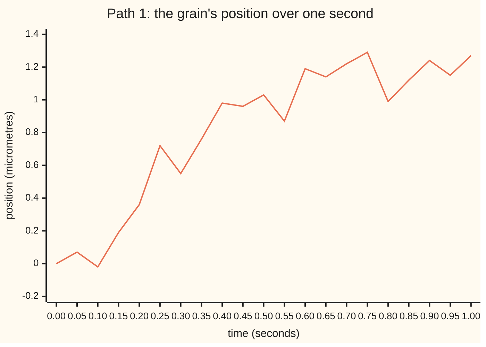
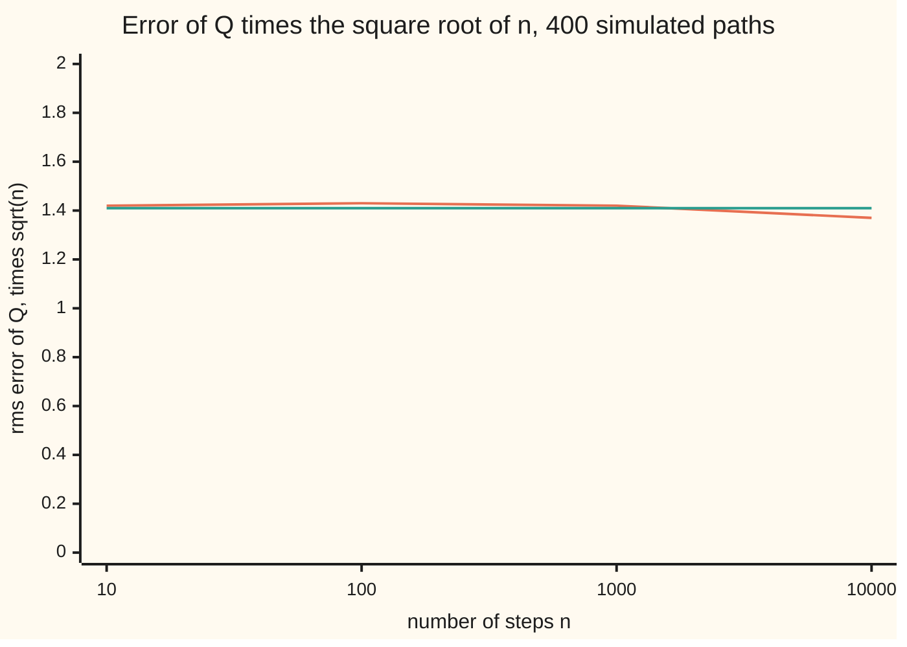
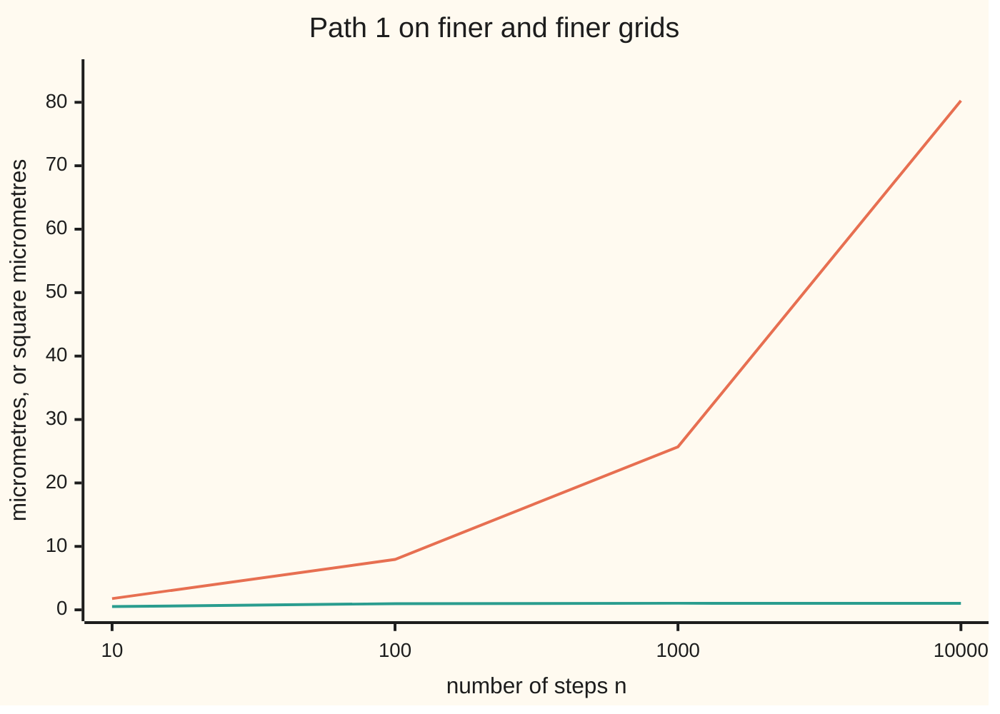

# Quadratic variation: squared increments add up to t

Stochastic processes and calculus → Brownian Motion → Squared steps of a rough path → Quadratic variation

---

## General Overview

A pollen grain sits in a drop of water under a microscope. A camera records its horizontal position, in micrometres, a thousand times in one second: once every millisecond. The grain is knocked about by water molecules, so its position is Brownian motion, the random walk seen from far away ([brownian-motion](01-brownian-motion.md)). The units are chosen so that the spread of its position, measured as variance, grows by one square micrometre per second.

Take the thousand small moves between frames. Add up their sizes, ignoring direction, and one simulated second gives 25.693172 micrometres. Film ten times faster and the same path gives 80.273: the finer the film, the longer the journey, without limit. Now square each move before adding. The thousand squares add to 1.040456. Film ten times faster and the sum is 1.0157. The squares settle on one number, and that number is the elapsed time, one second.

That sum of squared moves is the path's **quadratic variation**, the word used from here on. For a smooth curve it is zero. For Brownian motion it is the clock itself: with probability one, along grids fixed in advance. That one fact is why the ordinary rules of calculus, built for smooth curves, give wrong answers on Brownian paths, and why a new calculus has to be built.

**As the grid of times gets finer, the sum of squared Brownian increments over a stretch of t seconds converges to t itself, not to a random number; so the sum of the increments' sizes runs off to infinity, and any calculus that ignores squared steps misses a term of size t.**

**What kind of fact this is:** quadratic variation is a definition; that it equals t for Brownian motion is a theorem, proved on this card in Why it works, with two sharper facts stated with their source.

### The picture: one simulated second of the grain



One sample path, simulated on a grid of 1,000 steps of one millisecond and drawn every 50th step. The jagged look survives any zoom: each 50-step stretch is as rough as the whole ([scaling-and-path-roughness](02-scaling-and-path-roughness.md)). The grain ends 1.27 micrometres from its start, yet the squares of its 1,000 moves add to 1.040456.

---

## The formula

Notation from earlier cards, one line each. $W_t$ is the grain's position at time t, Brownian motion started at 0: its increments over separate stretches of time are independent, and an increment over a stretch of length h is normal with mean 0 and variance h. Z stands for a standard normal number, mean 0 and variance 1.

New notation, in words first. Cut the stretch from time 0 to time t into n equal steps at the times $t_k = k\,t/n$, so each step lasts $\Delta t = t/n$. The increment over step k is $\Delta W_k = W_{t_k} - W_{t_{k-1}}$. The sum of their squares is $Q_n$, and its limit is written $[W]_t$, read "the quadratic variation of W up to time t". Square brackets around a process always mean this limit.

$$Q_n = \sum_{k=1}^{n} (\Delta W_k)^2, \qquad [W]_t = \lim_{n\to\infty} Q_n = t.$$

**Read it aloud:** chop the time into n steps, square each move, add the squares; as the steps shrink, the total settles on the elapsed time.

The limit holds in mean square: the average squared distance between the sum and t goes to zero, at this exact rate:

$$\mathbb{E}[Q_n] = t, \qquad \mathbb{E}\big[(Q_n - t)^2\big] = \frac{2t^2}{n}.$$

**Read it aloud:** the sum of squares is right on average at every grid, and its typical error is t times the square root of 2/n.

The contrast is the sum of sizes, $V_n = \sum_{k} |\Delta W_k|$, which grows instead of settling:

$$\mathbb{E}[V_n] = \sqrt{\frac{2nt}{\pi}}.$$

**Read it aloud:** the average length of the path, measured on n steps, grows like the square root of n.

| Symbol | Plain meaning | In our example | Push it up and the answer… |
| --- | --- | --- | --- |
| $W_t$ | the grain's position at time t, in micrometres | ends path 1 at 1.27 | — |
| $t$ | the time watched, in seconds | 1 | the quadratic variation grows with it, one for one |
| $n$, $\Delta t$ | the number of equal steps; the length t/n of each | 1,000 steps of 0.001 s | Q gets closer to t; V gets longer |
| $t_k$, $k$ | the k-th grid time, k t/n; the step's number | 0.001 s, 0.002 s, … | — |
| $\Delta W_k$ | the move over step k | at most 0.117547 in size on path 1 | — |
| $Q_n$ | sum of the squared moves | 1.040456 on path 1 | — |
| $[W]_t$ | the quadratic variation: the limit of Q | 1 square micrometre | — |
| $V_n$ | sum of the moves' sizes: the path's length on the grid | 25.693172 on path 1 | — |
| $Z$ | a standard normal number | moments 1, 3 and 0.797885 | — |
| $L_n$, $R_n$ | left-point and right-point sums for the square of W | 0.5602 and 2.6411 on path 1 | — |
| $X_t$, $\mu$, $\sigma$ | a drifting process μt + σW; its drift and its scale | a current of 3 micrometres a second, σ = 1 | drift leaves the limit alone; σ multiplies it by σ^2 |
| $f$ | a smooth comparison path, sin(2πt) | quadratic variation 0, length 4 | — |
| $s_k$, $m$, $h_k$, $r$, $D_k$, $\Pi_j$, $e$, $B$, $T_f$, $Q_f$, $\Delta f_k$, $\varphi$ | used only in the Detailed proof: a partition's cut times and how many steps it has; its k-th step length; an earlier time; one squared move minus its step length; the j-th partition; a small tolerance; a bound on the length; f's total variation, its sum of squares and its k-th move; the bell-curve density | halving grids: $\Pi_j$ has steps t/2^j | — |

### When it holds

- **The grid must get finer.** On a fixed grid the sum is a random number, not t: at 10 steps path 1 gives 0.5179, with typical error 0.4492. Only as the longest step shrinks does the randomness drain out.
- **The cut points must be chosen in advance.** Pick them after seeing the path and the sum can be pushed up: on path 1's grid the best choice of cut points gives 4.0394. Over every possible partition the supremum is infinite.
- **The path must be continuous.** Variance proportional to time is not enough. A Poisson count with rate 1 has the same variance, yet its squared steps add to the number of jumps, which is random.
- **Mean square, or almost surely along good grids.** The mean-square limit holds for any sequence of grids whose longest step goes to 0. Almost sure convergence, path by path, is proved below when the longest steps of the successive grids add to a finite total, as for halving grids.

---

## Why it works

### Step 0: each squared move is right on average, and the errors cancel

One step of length Δt moves the grain by a normal amount with variance Δt. Its square therefore averages exactly Δt. Adding n of them averages n Δt = t. So the sum of squares is unbiased at every grid, however coarse.

What changes with n is the spread. The squared moves are independent, so their random parts partly cancel: n of them, each with spread proportional to Δt, leave a total spread shrinking like one over the square root of n. The sizes have no such luck. Each is about the square root of Δt, far larger than Δt, and n of them add to about the square root of n.

### Step 1: the variance of one squared move

Write a step as $\Delta W_k = \sqrt{\Delta t}\,Z$. Then $(\Delta W_k)^2 = \Delta t\,Z^2$, with average $\Delta t\,\mathbb{E}[Z^2] = \Delta t$ and variance

$$\mathrm{Var}\big((\Delta W_k)^2\big) = \Delta t^2\big(\mathbb{E}[Z^4] - \mathbb{E}[Z^2]^2\big) = \Delta t^2\,(3 - 1) = 2\,\Delta t^2.$$

The fourth moment 3 is the normal's own: integrate the fourth power against the bell curve. The code does that integral by Simpson's rule and gets 3.000000, with $\mathbb{E}[Z^2]$ = 1.000000.

### Step 2: add independent variances

The n squared moves are independent, so their variances add: $\mathrm{Var}(Q_n) = n \cdot 2\,\Delta t^2 = 2t^2/n$. Since $Q_n$ averages t, this is the mean squared error. At n = 1,000 and t = 1 the typical error is the square root of 0.002, which is 0.044721. Path 1's 1.040456 sits 0.9 typical errors above 1.

As n grows the mean squared error goes to 0, which is convergence in mean square. Chebyshev's inequality then gives convergence in probability. That is the theorem.



Orange: the simulated root-mean-square error of Q over 400 paths, multiplied by the square root of n. Green: the formula's value, the square root of 2. A flat line means the error itself shrinks like one over the square root of n: 0.4492, 0.1426, 0.0450 and 0.0137 at the four grids, each within two standard errors of the formula.

### Step 3: finite quadratic variation forces infinite length

The sum of squares is at most the largest move times the sum of sizes, since each square is its own size times itself:

$$Q_n \le \max_k |\Delta W_k| \cdot V_n.$$

A Brownian path is continuous, so as the grid shrinks the largest move goes to 0: on path 1 it is 0.117547 already at 1,000 steps. But $Q_n$ goes to t, which is not 0. The only way the right side can stay above t is for $V_n$ to run off to infinity. So a Brownian path has infinite total variation: the total up-and-down movement of [functions-of-bounded-variation](../../10-Measure%20and%20integration/11-Derivatives%20Meet%20the%20Lebesgue%20Integral/01-functions-of-bounded-variation.md) is infinite on every stretch of time, almost surely.

The same inequality, read for a curve of finite length, says the opposite. If $V_n$ stays below a fixed length and the largest move goes to 0, then $Q_n$ goes to 0. Every smooth path, and every continuous path of bounded variation, has quadratic variation 0. For $f$ = sin(2πt) the code finds n times Q settling on 2π^2 = 19.7392, so Q itself falls like one over n, while the length stays at 4.



Orange: the path's length on the grid, in micrometres. Green: the sum of squares, in square micrometres. One simulated path, coarsened from 10,000 steps. Averaged over 400 paths, each tenfold refinement multiplies the length by about the square root of 10: 2.537, 7.991, 25.272, 79.845. Path 1, one sample, grows by more at the first refinement, then at about the same rate. The squares stay near 1.

### Step 4: why ordinary calculus fails on the square of W

Ordinary calculus says the change in the square of a smooth curve f is the sum of 2f times its small changes: the chain rule. Test it on Brownian motion with an identity that is pure algebra. For each step, $W_{t_k}^2 - W_{t_{k-1}}^2 = 2W_{t_{k-1}}\Delta W_k + (\Delta W_k)^2$. Sum over the steps from 0 to time 1:

$$W_1^2 = \underbrace{\sum_{k} 2\,W_{t_{k-1}}\,\Delta W_k}_{L_n} + Q_n.$$

The chain rule predicts that $L_n$, the left-point sum, approaches $W_1^2$. Instead it misses by $Q_n$, which does not vanish: it goes to 1. On path 1, $W_1^2$ = 1.6006, $L_n$ = 0.5602 and the gap is 1.0405, the path's quadratic variation. Averaged over 400 paths, $L_n$ is 0.0500 with standard error 0.0699: zero, because each $W_{t_{k-1}}$ is known before the step it multiplies, and the step averages 0.

A smooth curve escapes because its Q goes to 0, so the chain rule's sum and the true change agree in the limit. Brownian motion does not escape. Its change in the square is the left-point sum plus the elapsed time:

$$W_1^2 = \lim_{n\to\infty} L_n + 1.$$

That extra 1 is the dt term of the next shelf, and the start of Itô's calculus ([ito-integral](../06-Ito%20Calculus/01-ito-integral.md)).

### Step 5: the endpoint now matters

For a smooth integrator it does not matter where in each step the integrand is read; every choice gives the same limit. That is the Riemann–Stieltjes integral, the limit of sums of integrand times change in integrator, and it needs an integrator of bounded variation. Brownian motion is not one, by Step 3, and the choice now changes the answer. Read W at the right end of each step instead and the sum is $R_n = L_n + 2Q_n$. On path 1 it is 2.6411; over 400 paths it averages 2.0574, against 0.0500 for the left point. The difference is twice the quadratic variation. The average of the two, $(L_n + R_n)/2$, equals $W_1^2$ exactly: averaging the two ends of each step brings the ordinary chain rule back, at the cost of using the value at the step's end, which is not known when the step begins.

The integral against a Brownian path must therefore be defined, not inherited. Itô's choice is the left point: the integrand is fixed before the move, as a bet is placed before the coin lands.

### Step 6: drift is invisible, scale is not

Add a current that carries the grain at 3 micrometres a second: $X_t$ = 3t + $W_t$. Each move gains 3Δt. Squaring adds $(3\,\Delta t)^2$ per step, n of them, $9t^2/n$ in all, plus a cross term $6\,\Delta t\,W_t$ that also vanishes. At 1,000 steps the formula is 1.0090; 400 paths average 1.0128 with standard error 0.0023. As n grows the current's share goes to 0. Scale is different: σ times W has squared moves σ^2 times larger, so its quadratic variation is σ^2 t. Quadratic variation measures how violently a process shakes, not where it is heading.

<details>
<summary>Detailed proof</summary>

**Setting.** W is a Brownian motion: $W_0 = 0$, continuous paths, independent increments, $W_s - W_r$ normal with mean 0 and variance $s - r$. Fix t > 0. A partition of the stretch from 0 to t is a list of times $0 = s_0 < s_1 < \cdots < s_m = t$; its mesh is its longest step. For a partition, $Q = \sum_k (W_{s_k} - W_{s_{k-1}})^2$ and $V = \sum_k |W_{s_k} - W_{s_{k-1}}|$.

**Lemma 1 (moments).** For a standard normal, $\mathbb{E}[Z^2] = 1$ and $\mathbb{E}[Z^4] = 3$. *Proof.* Integrate by parts against the density $\varphi(z) = e^{-z^2/2}/\sqrt{2\pi}$, using $\varphi'(z) = -z\,\varphi(z)$: $\mathbb{E}[Z^4] = \int z^3 \cdot z\varphi(z)\,dz = \int 3z^2\varphi(z)\,dz = 3\,\mathbb{E}[Z^2]$, and the same step gives $\mathbb{E}[Z^2] = \int \varphi = 1$.

**Theorem 1 (mean square).** For partitions with steps $h_k = s_k - s_{k-1}$, $\mathbb{E}[(Q - t)^2] = 2\sum_k h_k^2 \le 2t \cdot \text{mesh}$. Hence $Q \to t$ in mean square, and in probability, along any sequence of partitions whose mesh goes to 0. *Proof.* Write $D_k = (W_{s_k} - W_{s_{k-1}})^2 - h_k$. These terms have mean 0, variance $h_k^2(3 - 1) = 2h_k^2$ by Lemma 1, and are independent because the increments are, so $\mathbb{E}[(\sum_k D_k)^2] = \sum_k 2h_k^2$. And $\sum_k D_k = Q - t$. Finally $\sum_k h_k^2 \le \text{mesh} \cdot \sum_k h_k = \text{mesh} \cdot t$. Chebyshev's inequality turns mean square into probability.

**Theorem 2 (almost surely, when the meshes add up).** If the partitions $\Pi_1, \Pi_2, \ldots$ have meshes whose sum is finite, then $Q(\Pi_j) \to t$ almost surely. *Proof.* For a fixed small number $e > 0$, Chebyshev and Theorem 1 give $P(|Q(\Pi_j) - t| > e) \le 2t\,\text{mesh}(\Pi_j)/e^2$, whose sum over j is finite. By the first Borel–Cantelli lemma, almost surely only finitely many j have $|Q(\Pi_j) - t| > e$. Take e = 1, 1/2, 1/3, … : a countable union of null events is null, so almost surely $Q(\Pi_j) \to t$. The halving grids, with mesh $t/2^j$, qualify.

**Theorem 3 (infinite variation).** Almost surely, the total variation of W on the stretch from 0 to t is infinite. *Proof.* Take the halving grids. For each, $Q \le \max_k |\Delta W_k| \cdot V$. A continuous path is uniformly continuous on a closed stretch, so $\max_k |\Delta W_k| \to 0$ on every path. On the almost-sure event of Theorem 2, $Q \to t > 0$. If V stayed below some bound B along a subsequence, Q would be at most $B \max_k|\Delta W_k| \to 0$ along it, a contradiction. So $V \to \infty$. The total variation is the supremum of V over all partitions, at least each of these, so it is infinite. Repeat this on every stretch with rational endpoints: countably many null sets, and every stretch of time contains one, so the paths have infinite variation on every stretch at once.

**Theorem 4 (paths of bounded variation have zero quadratic variation).** If f is continuous with finite total variation $T_f < \infty$, then $Q_f \le \max_k |\Delta f_k| \cdot T_f \to 0$ as the mesh shrinks, by uniform continuity. Smooth paths are of bounded variation.

**Corollary (the square of W).** For any partition of the stretch from 0 to t, $W_t^2 = \sum_k 2W_{s_{k-1}}\Delta W_k + Q$ and $\sum_k 2W_{s_k}\Delta W_k = \sum_k 2W_{s_{k-1}}\Delta W_k + 2Q$, by expanding $W_{s_k}^2 - W_{s_{k-1}}^2 = (W_{s_k} - W_{s_{k-1}})(W_{s_k} + W_{s_{k-1}})$. By Theorem 1 the left-point sums converge in mean square to $W_t^2 - t$, the right-point sums to $W_t^2 + t$.

**Stated, not proved here.** Along any refining sequence of partitions with mesh going to 0, with no condition on the sum of meshes, the convergence is still almost sure; and the supremum of Q over all partitions is infinite almost surely, so the partitions must be fixed before the path is seen. Both are classical, and treated in Mörters and Peres, chapter 1.

</details>

A second road to the variance skips the integration by parts: Simpson's rule gives the fourth moment as 3.000000 and rebuilds the typical error at 1,000 steps as 0.044721. A third road is the simulation, 400 seeded paths printed with their standard errors.

---

## Worked numbers, by hand

Path 1, one second of the grain, 1,000 steps of 0.001 s.

| Step | Arithmetic | Value |
| --- | --- | --- |
| each step's variance | t/n = 1/1000 | 0.001 square micrometres |
| average of the sum of squares | 1000 × 0.001 | 1 |
| variance of the sum | 2t^2/n = 2/1000 | 0.002 |
| typical error | square root of 0.002 | 0.044721 |
| path 1's sum of squares | from the run | **1.040456** |
| distance from 1, in typical errors | 0.040456 ÷ 0.044721 | 0.9 |
| path 1's length on the grid | from the run; formula √(2000/π) = 25.231 on average | 25.693172 micrometres |
| the square of the end position | from the run | 1.6006 |
| left-point sum | from the run | 0.5602 |
| chain rule's miss | 1.6006 − 0.5602 | **1.0405**, path 1's sum of squares |

The squared moves of one simulated second add to 1.04 square micrometres, within one typical error of the elapsed second; the grain's quadratic variation is its clock. On the house scale, a grain filmed once a second for 1,000 seconds, the same path stretched by the scaling rule gives 1040.456 square micrometres, again the elapsed time.

### What breaks if you drop a piece

| Mistake | Comes out at | What went wrong |
| --- | --- | --- |
| Ordinary chain rule on the square of W | predicts the left sum near 1.0537 on average; it is 0.0500 | the squared steps add 1, the dt term the chain rule drops |
| Reading W at the right end of each step | averages 2.0574 instead of 0.0500 | the endpoint matters by 2Q; the integrator has unbounded variation |
| Adding sizes instead of squares | 25.69 at 1,000 steps, 80.27 at 10,000 | the length has no limit: total variation is infinite |
| Cut points chosen after seeing the path | 4.0394 on path 1's grid, against 1.0405 | the theorem needs partitions fixed in advance |

All four are printed by the code.

---

## Code, from first principles, and it actually runs

Three roads lead to the same numbers: the formulas; Simpson's rule on the bell curve's moments; and a simulation of 400 paths of 10,000 steps, with a SplitMix64 generator and Box–Muller normals written out, seed 20260930. Each path is coarsened to 1,000, 100 and 10 steps by adding consecutive moves, so all four grids describe the same paths. Simulated averages and errors carry standard errors, and asserts allow four of them. The code then checks the smooth path against a closed form, the chain rule on the square of W, the drifting grain, and the best partition chosen with hindsight, found by dynamic programming: the best total up to each grid time is built from the best totals at earlier times.

### Python

```python
# Quadratic variation -- the check behind the card.  Only math is imported.
# A pollen grain's position W_t, in micrometres after t seconds, is Brownian
# motion: a step over dt seconds is normal, mean 0, variance dt square um.
# Road 1: the formulas E[Q_n] = t, Var Q_n = 2 t^2 / n, E[V_n] = sqrt(2 n t / pi).
# Road 2: the normal's moments E[Z^2], E[Z^4], E|Z| by Simpson's rule.
# Road 3: 400 seeded paths of 10000 steps, coarsened to 1000, 100, 10 steps.
import math
M64 = (1 << 64) - 1
SEED, PATHS, FINE, T, MU = 20260930, 400, 10000, 1.0, 3.0
GRIDS = (10, 100, 1000, 10000)

class SplitMix64:                              # the wing's generator, written out
    def __init__(self, seed): self.s = seed
    def unit(self):                            # a uniform draw in [0, 1)
        self.s = (self.s + 0x9E3779B97F4A7C15) & M64
        z = self.s
        z = ((z ^ (z >> 30)) * 0xBF58476D1CE4E5B9) & M64
        z = ((z ^ (z >> 27)) * 0x94D049BB133111EB) & M64
        return ((z ^ (z >> 31)) >> 11) * 2.0 ** -53
    def normals(self, k):                      # Box-Muller, both outputs used
        out = []
        while len(out) < k:
            r = math.sqrt(-2.0 * math.log(1.0 - self.unit()))
            a = 2.0 * math.pi * self.unit()
            out += [r * math.cos(a), r * math.sin(a)]
        return out

def simpson(f, a, b, m=4000):
    h, s = (b - a) / m, f(a) + f(b)
    for i in range(1, m):
        s += (4.0 if i % 2 else 2.0) * f(a + i * h)
    return s * h / 3.0

def coarsen(steps, b):                         # add b consecutive steps into one
    out = []
    for i in range(0, len(steps), b):
        s = 0.0
        for x in steps[i:i + b]: s += x
        out.append(s)
    return out

def sq_abs(steps):                             # sum of squares, sum of sizes
    q = v = 0.0
    for x in steps: q += x * x; v += abs(x)
    return q, v

def mean_se(xs):
    m = 0.0
    for x in xs: m += x
    m /= len(xs)
    s = 0.0
    for x in xs: s += (x - m) * (x - m)
    return m, math.sqrt(s / (len(xs) - 1) / len(xs))

phi = lambda z: math.exp(-0.5 * z * z) / math.sqrt(2.0 * math.pi)
ez2 = simpson(lambda z: z * z * phi(z), -12.0, 12.0)
ez4 = simpson(lambda z: z * z * z * z * phi(z), -12.0, 12.0)
eaz = 2.0 * simpson(lambda z: z * phi(z), 0.0, 12.0)

gen = SplitMix64(SEED)
Q = {n: [] for n in GRIDS}; V = {n: [] for n in GRIDS}
left, right, w2, drift = [], [], [], []
for p in range(PATHS):
    by = {FINE: [z * math.sqrt(T / FINE) for z in gen.normals(FINE)]}
    by[1000] = coarsen(by[FINE], 10); by[100] = coarsen(by[1000], 10); by[10] = coarsen(by[100], 10)
    for n in GRIDS:
        q, v = sq_abs(by[n]); Q[n].append(q); V[n].append(v)
    w, l, r = 0.0, 0.0, 0.0
    path = [0.0]
    for x in by[1000]:
        l += 2.0 * w * x; w += x; r += 2.0 * w * x; path.append(w)
    left.append(l); right.append(r); w2.append(w * w)
    drift.append(sq_abs([MU * T / 1000 + x for x in by[1000]])[0])
    if p == 0: path1, steps1 = path, by[1000]

print(f"seed {SEED}, {PATHS} paths, {FINE} steps each, t = {T:.1f} seconds")
print(f"{'road 2, Simpson: E[Z^2], E[Z^4], E|Z|':<44}{ez2:10.6f}{ez4:10.6f}{eaz:10.6f}")
print(f"{'road 1, formula sd of Q at n = 1000':<44}{math.sqrt(2.0 * T * T / 1000):10.6f}")
print(f"{'road 2, sd from Simpson moments, n = 1000':<44}{math.sqrt((ez4 - ez2 * ez2) / 1000):10.6f}")
q1, v1 = sq_abs(steps1)
print(f"{'path 1, n = 1000: sum of squared steps':<44}{q1:10.6f}")
print(f"{'path 1, n = 1000: sum of step sizes':<44}{v1:10.6f}")
print(f"{'path 1, n = 1000: largest step size':<44}{max(abs(x) for x in steps1):10.6f}")
print(f"{'house scale, 1000 s at one step a second':<44}{1000.0 * q1:10.3f}")
rmss = []
print("     n   Q path1   V path1    mean Q   se    rms err   se    formula   mean V    se    formula")
for n in GRIDS:
    mq, sq = mean_se(Q[n]); mv, sv = mean_se(V[n])
    d = [(x - T) * (x - T) for x in Q[n]]
    md, sd = mean_se(d); rms = math.sqrt(md); rmss.append(rms)
    print(f"{n:>6}{Q[n][0]:10.4f}{V[n][0]:10.3f}{mq:10.4f}{sq:7.4f}{rms:9.4f}{sd / (2.0 * rms):7.4f}"
          f"{T * math.sqrt(2.0 / n):10.4f}{mv:10.3f}{sv:7.3f}{math.sqrt(2.0 * n * T / math.pi):10.3f}")
    assert abs(md - 2.0 * T * T / n) < 4.0 * sd, "variance of Q must match 2 t^2 / n"
    assert abs(mv - math.sqrt(n * T) * eaz) < 4.0 * sv, "mean V must match sqrt(n t) E|Z|"
print("chart, rms err x sqrt(n): " + " ".join(f"{r * math.sqrt(n):.2f}" for r, n in zip(rmss, GRIDS)) + f"   sqrt(2): {math.sqrt(2.0):.2f}")
print("chart, path 1 sizes: " + " ".join(f"{V[n][0]:.2f}" for n in GRIDS) + "   squares: " + " ".join(f"{Q[n][0]:.2f}" for n in GRIDS))
mq, sq = mean_se(Q[1000])
assert abs(mq - T) < 4.0 * sq, "mean of Q at n = 1000 must be t"
assert abs(ez4 - 3.0) < 1e-9, "Simpson's E[Z^4] must be the normal's 3"

print("smooth path sin(2 pi t):  n   Q   n*Q   2n sin^2(pi/n)   V")
for n in GRIDS:
    q, v = sq_abs([math.sin(2 * math.pi * k / n) - math.sin(2 * math.pi * (k - 1) / n) for k in range(1, n + 1)])
    sp = math.sin(math.pi / n); exact = 2.0 * n * sp * sp
    print(f"  {n:>6}{q:12.6f}{n * q:10.4f}{exact:12.6f}{v:10.4f}")
    assert abs(q - exact) < 1e-12, "direct sum must match the closed form"
print(f"{'  limit of n*Q, 2 pi^2':<44}{2.0 * math.pi * math.pi:10.4f}")

ml, sl = mean_se(left); mr, sr = mean_se(right); mw, sw = mean_se(w2)
print(f"{'path 1: W_1^2, left sum, right sum':<44}{w2[0]:10.4f}{left[0]:10.4f}{right[0]:10.4f}")
print(f"{'path 1: W_1^2 - left sum, (right - left)/2':<44}{w2[0] - left[0]:10.4f}{(right[0] - left[0]) / 2:10.4f}")
print(f"{'400 paths: mean W_1^2 (se)':<44}{mw:10.4f}{sw:10.4f}")
print(f"{'400 paths: mean left sum (se)':<44}{ml:10.4f}{sl:10.4f}")
print(f"{'400 paths: mean right sum (se)':<44}{mr:10.4f}{sr:10.4f}")
assert abs(ml) < 4.0 * sl, "the left-point sum must average 0, not W_1^2"
assert abs(mr - 2.0 * T) < 4.0 * sr, "the right-point sum must average 2t"
md, sd = mean_se(drift)
print(f"{f'drift {MU:.1f} um/s, n = 1000: path 1, mean (se)':<44}{drift[0]:10.4f}{md:10.4f}{sd:10.4f}")
print(f"{'  formula t + mu^2 t^2 / n':<44}{T + MU * MU * T * T / 1000:10.4f}")
assert abs(md - (T + MU * MU * T * T / 1000)) < 4.0 * sd, "drift adds only mu^2 t^2 / n"

best = [0.0] * len(path1)                      # cut points chosen after seeing path 1
for j in range(1, len(path1)):
    b = 0.0
    for i in range(j):
        e = path1[j] - path1[i]; c = best[i] + e * e
        if c > b: b = c
    best[j] = b
print(f"{'path 1: best partition of the 1000-step grid':<44}{best[-1]:10.4f}")
print("figure, path 1 at t = 0.00, 0.05, ..., 1.00:")
print(" ".join(f"{path1[k]:.2f}" for k in range(0, 1001, 50)))
print("ALL CHECKS PASS")
```

**Ran 2026-10-06 on macOS, Python 3.14.6, standard library only. All checks passed. Output, pasted from the run:**

```
seed 20260930, 400 paths, 10000 steps each, t = 1.0 seconds
road 2, Simpson: E[Z^2], E[Z^4], E|Z|         1.000000  3.000000  0.797885
road 1, formula sd of Q at n = 1000           0.044721
road 2, sd from Simpson moments, n = 1000     0.044721
path 1, n = 1000: sum of squared steps        1.040456
path 1, n = 1000: sum of step sizes          25.693172
path 1, n = 1000: largest step size           0.117547
house scale, 1000 s at one step a second      1040.456
     n   Q path1   V path1    mean Q   se    rms err   se    formula   mean V    se    formula
    10    0.5179     1.768    1.0128 0.0225   0.4492 0.0195    0.4472     2.537  0.030     2.523
   100    0.9708     7.953    1.0069 0.0071   0.1426 0.0054    0.1414     7.991  0.030     7.979
  1000    1.0405    25.693    1.0037 0.0022   0.0450 0.0017    0.0447    25.272  0.031    25.231
 10000    1.0157    80.273    1.0015 0.0007   0.0137 0.0005    0.0141    79.845  0.030    79.788
chart, rms err x sqrt(n): 1.42 1.43 1.42 1.37   sqrt(2): 1.41
chart, path 1 sizes: 1.77 7.95 25.69 80.27   squares: 0.52 0.97 1.04 1.02
smooth path sin(2 pi t):  n   Q   n*Q   2n sin^2(pi/n)   V
      10    1.909830   19.0983    1.909830    3.8042
     100    0.197327   19.7327    0.197327    4.0000
    1000    0.019739   19.7391    0.019739    4.0000
   10000    0.001974   19.7392    0.001974    4.0000
  limit of n*Q, 2 pi^2                         19.7392
path 1: W_1^2, left sum, right sum              1.6006    0.5602    2.6411
path 1: W_1^2 - left sum, (right - left)/2      1.0405    1.0405
400 paths: mean W_1^2 (se)                      1.0537    0.0701
400 paths: mean left sum (se)                   0.0500    0.0699
400 paths: mean right sum (se)                  2.0574    0.0703
drift 3.0 um/s, n = 1000: path 1, mean (se)     1.0570    1.0128    0.0023
  formula t + mu^2 t^2 / n                      1.0090
path 1: best partition of the 1000-step grid    4.0394
figure, path 1 at t = 0.00, 0.05, ..., 1.00:
0.00 0.07 -0.02 0.19 0.36 0.72 0.55 0.76 0.98 0.96 1.03 0.87 1.19 1.14 1.22 1.29 0.99 1.12 1.24 1.15 1.27
ALL CHECKS PASS
```

### Rust

```rust
// Quadratic variation -- the check behind the card.  Rust std only.
// A pollen grain's position W_t, in micrometres after t seconds, is Brownian
// motion: a step over dt seconds is normal, mean 0, variance dt square um.
// Road 1: the formulas E[Q_n] = t, Var Q_n = 2 t^2 / n, E[V_n] = sqrt(2 n t / pi).
// Road 2: the normal's moments E[Z^2], E[Z^4], E|Z| by Simpson's rule.
// Road 3: 400 seeded paths of 10000 steps, coarsened to 1000, 100, 10 steps.
use std::f64::consts::PI;
const SEED: u64 = 20260930;
const PATHS: usize = 400;
const FINE: usize = 10000;
const T: f64 = 1.0;
const MU: f64 = 3.0;
const GRIDS: [usize; 4] = [10, 100, 1000, 10000];

struct SplitMix64 { s: u64 }
impl SplitMix64 {
    fn unit(&mut self) -> f64 { // a uniform draw in [0, 1)
        self.s = self.s.wrapping_add(0x9E3779B97F4A7C15);
        let mut z = self.s;
        z = (z ^ (z >> 30)).wrapping_mul(0xBF58476D1CE4E5B9);
        z = (z ^ (z >> 27)).wrapping_mul(0x94D049BB133111EB);
        ((z ^ (z >> 31)) >> 11) as f64 * (1.0 / 9007199254740992.0)
    }
    fn normals(&mut self, k: usize) -> Vec<f64> { // Box-Muller, both outputs used
        let mut out = Vec::with_capacity(k);
        while out.len() < k {
            let r = (-2.0 * (1.0 - self.unit()).ln()).sqrt();
            let a = 2.0 * PI * self.unit();
            out.push(r * a.cos());
            out.push(r * a.sin());
        }
        out
    }
}

fn simpson(f: &dyn Fn(f64) -> f64, a: f64, b: f64, m: usize) -> f64 {
    let h = (b - a) / m as f64;
    let mut s = f(a) + f(b);
    for i in 1..m {
        s += (if i % 2 == 1 { 4.0 } else { 2.0 }) * f(a + i as f64 * h);
    }
    s * h / 3.0
}

fn coarsen(steps: &[f64], b: usize) -> Vec<f64> { // add b consecutive steps into one
    steps.chunks(b).map(|c| { let mut s = 0.0; for x in c { s += x; } s }).collect()
}

fn sq_abs(steps: &[f64]) -> (f64, f64) { // sum of squares, sum of sizes
    let (mut q, mut v) = (0.0, 0.0);
    for x in steps { q += x * x; v += x.abs(); }
    (q, v)
}

fn mean_se(xs: &[f64]) -> (f64, f64) {
    let mut m = 0.0;
    for x in xs { m += x; }
    m /= xs.len() as f64;
    let mut s = 0.0;
    for x in xs { s += (x - m) * (x - m); }
    (m, (s / (xs.len() - 1) as f64 / xs.len() as f64).sqrt())
}

fn phi(z: f64) -> f64 { (-0.5 * z * z).exp() / (2.0 * PI).sqrt() }

fn main() {
    let ez2 = simpson(&|z| z * z * phi(z), -12.0, 12.0, 4000);
    let ez4 = simpson(&|z| z * z * z * z * phi(z), -12.0, 12.0, 4000);
    let eaz = 2.0 * simpson(&|z| z * phi(z), 0.0, 12.0, 4000);

    let mut gen = SplitMix64 { s: SEED };
    let mut qs: Vec<Vec<f64>> = vec![Vec::new(); 4];
    let mut vs: Vec<Vec<f64>> = vec![Vec::new(); 4];
    let (mut left, mut right, mut w2, mut drift) = (Vec::new(), Vec::new(), Vec::new(), Vec::new());
    let (mut path1, mut steps1) = (Vec::new(), Vec::new());
    for p in 0..PATHS {
        let fine: Vec<f64> = gen.normals(FINE).iter().map(|z| z * (T / FINE as f64).sqrt()).collect();
        let s1000 = coarsen(&fine, 10);
        let s100 = coarsen(&s1000, 10);
        let s10 = coarsen(&s100, 10);
        for (g, st) in [&s10, &s100, &s1000, &fine].iter().enumerate() {
            let (q, v) = sq_abs(st);
            qs[g].push(q);
            vs[g].push(v);
        }
        let (mut w, mut l, mut r) = (0.0f64, 0.0f64, 0.0f64);
        let mut path = vec![0.0];
        for x in &s1000 {
            l += 2.0 * w * x; w += x; r += 2.0 * w * x; path.push(w);
        }
        left.push(l); right.push(r); w2.push(w * w);
        let ds: Vec<f64> = s1000.iter().map(|x| MU * T / 1000.0 + x).collect();
        drift.push(sq_abs(&ds).0);
        if p == 0 { path1 = path; steps1 = s1000; }
    }

    println!("seed {}, {} paths, {} steps each, t = {:.1} seconds", SEED, PATHS, FINE, T);
    println!("{:<44}{:10.6}{:10.6}{:10.6}", "road 2, Simpson: E[Z^2], E[Z^4], E|Z|", ez2, ez4, eaz);
    println!("{:<44}{:10.6}", "road 1, formula sd of Q at n = 1000", (2.0 * T * T / 1000.0).sqrt());
    println!("{:<44}{:10.6}", "road 2, sd from Simpson moments, n = 1000", ((ez4 - ez2 * ez2) / 1000.0).sqrt());
    let (q1, v1) = sq_abs(&steps1);
    let big = steps1.iter().fold(0.0f64, |m, x| if x.abs() > m { x.abs() } else { m });
    println!("{:<44}{:10.6}", "path 1, n = 1000: sum of squared steps", q1);
    println!("{:<44}{:10.6}", "path 1, n = 1000: sum of step sizes", v1);
    println!("{:<44}{:10.6}", "path 1, n = 1000: largest step size", big);
    println!("{:<44}{:10.3}", "house scale, 1000 s at one step a second", 1000.0 * q1);
    let mut rmss = Vec::new();
    println!("     n   Q path1   V path1    mean Q   se    rms err   se    formula   mean V    se    formula");
    for (g, &n) in GRIDS.iter().enumerate() {
        let nf = n as f64;
        let (mq, sq) = mean_se(&qs[g]);
        let (mv, sv) = mean_se(&vs[g]);
        let d: Vec<f64> = qs[g].iter().map(|x| (x - T) * (x - T)).collect();
        let (md, sd) = mean_se(&d);
        let rms = md.sqrt();
        rmss.push(rms * nf.sqrt());
        println!("{:>6}{:10.4}{:10.3}{:10.4}{:7.4}{:9.4}{:7.4}{:10.4}{:10.3}{:7.3}{:10.3}", n, qs[g][0], vs[g][0], mq, sq, rms,
                 sd / (2.0 * rms), T * (2.0 / nf).sqrt(), mv, sv, (2.0 * nf * T / PI).sqrt());
        assert!((md - 2.0 * T * T / nf).abs() < 4.0 * sd, "variance of Q must match 2 t^2 / n");
        assert!((mv - (nf * T).sqrt() * eaz).abs() < 4.0 * sv, "mean V must match sqrt(n t) E|Z|");
    }
    let j2 = |v: Vec<f64>| v.iter().map(|x| format!("{:.2}", x)).collect::<Vec<_>>().join(" ");
    println!("chart, rms err x sqrt(n): {}   sqrt(2): {:.2}", j2(rmss), 2.0f64.sqrt());
    println!("chart, path 1 sizes: {}   squares: {}", j2(vs.iter().map(|v| v[0]).collect()), j2(qs.iter().map(|q| q[0]).collect()));
    let (mq, sq) = mean_se(&qs[2]);
    assert!((mq - T).abs() < 4.0 * sq, "mean of Q at n = 1000 must be t");
    assert!((ez4 - 3.0).abs() < 1e-9, "Simpson's E[Z^4] must be the normal's 3");

    println!("smooth path sin(2 pi t):  n   Q   n*Q   2n sin^2(pi/n)   V");
    for &n in GRIDS.iter() {
        let nf = n as f64;
        let st: Vec<f64> = (1..=n).map(|k| (2.0 * PI * k as f64 / nf).sin() - (2.0 * PI * (k - 1) as f64 / nf).sin()).collect();
        let (q, v) = sq_abs(&st);
        let sp = (PI / nf).sin();
        let exact = 2.0 * nf * sp * sp;
        println!("  {:>6}{:12.6}{:10.4}{:12.6}{:10.4}", n, q, nf * q, exact, v);
        assert!((q - exact).abs() < 1e-12, "direct sum must match the closed form");
    }
    println!("{:<44}{:10.4}", "  limit of n*Q, 2 pi^2", 2.0 * PI * PI);

    let (ml, sl) = mean_se(&left);
    let (mr, sr) = mean_se(&right);
    let (mw, sw) = mean_se(&w2);
    println!("{:<44}{:10.4}{:10.4}{:10.4}", "path 1: W_1^2, left sum, right sum", w2[0], left[0], right[0]);
    println!("{:<44}{:10.4}{:10.4}", "path 1: W_1^2 - left sum, (right - left)/2", w2[0] - left[0], (right[0] - left[0]) / 2.0);
    println!("{:<44}{:10.4}{:10.4}", "400 paths: mean W_1^2 (se)", mw, sw);
    println!("{:<44}{:10.4}{:10.4}", "400 paths: mean left sum (se)", ml, sl);
    println!("{:<44}{:10.4}{:10.4}", "400 paths: mean right sum (se)", mr, sr);
    assert!(ml.abs() < 4.0 * sl, "the left-point sum must average 0, not W_1^2");
    assert!((mr - 2.0 * T).abs() < 4.0 * sr, "the right-point sum must average 2t");
    let (md, sd) = mean_se(&drift);
    println!("{:<44}{:10.4}{:10.4}{:10.4}", format!("drift {:.1} um/s, n = 1000: path 1, mean (se)", MU), drift[0], md, sd);
    println!("{:<44}{:10.4}", "  formula t + mu^2 t^2 / n", T + MU * MU * T * T / 1000.0);
    assert!((md - (T + MU * MU * T * T / 1000.0)).abs() < 4.0 * sd, "drift adds only mu^2 t^2 / n");

    let mut best = vec![0.0f64; path1.len()]; // cut points chosen after seeing path 1
    for j in 1..path1.len() {
        let mut b = 0.0;
        for i in 0..j {
            let e = path1[j] - path1[i];
            let c = best[i] + e * e;
            if c > b { b = c; }
        }
        best[j] = b;
    }
    println!("{:<44}{:10.4}", "path 1: best partition of the 1000-step grid", best[path1.len() - 1]);
    println!("figure, path 1 at t = 0.00, 0.05, ..., 1.00:");
    println!("{}", j2((0..=1000).step_by(50).map(|k| path1[k]).collect()));
    println!("ALL CHECKS PASS");
}
```

**Ran 2026-10-06 on macOS, rustc 1.98.1, no crates. All checks passed. Output, pasted from the run:**

```
seed 20260930, 400 paths, 10000 steps each, t = 1.0 seconds
road 2, Simpson: E[Z^2], E[Z^4], E|Z|         1.000000  3.000000  0.797885
road 1, formula sd of Q at n = 1000           0.044721
road 2, sd from Simpson moments, n = 1000     0.044721
path 1, n = 1000: sum of squared steps        1.040456
path 1, n = 1000: sum of step sizes          25.693172
path 1, n = 1000: largest step size           0.117547
house scale, 1000 s at one step a second      1040.456
     n   Q path1   V path1    mean Q   se    rms err   se    formula   mean V    se    formula
    10    0.5179     1.768    1.0128 0.0225   0.4492 0.0195    0.4472     2.537  0.030     2.523
   100    0.9708     7.953    1.0069 0.0071   0.1426 0.0054    0.1414     7.991  0.030     7.979
  1000    1.0405    25.693    1.0037 0.0022   0.0450 0.0017    0.0447    25.272  0.031    25.231
 10000    1.0157    80.273    1.0015 0.0007   0.0137 0.0005    0.0141    79.845  0.030    79.788
chart, rms err x sqrt(n): 1.42 1.43 1.42 1.37   sqrt(2): 1.41
chart, path 1 sizes: 1.77 7.95 25.69 80.27   squares: 0.52 0.97 1.04 1.02
smooth path sin(2 pi t):  n   Q   n*Q   2n sin^2(pi/n)   V
      10    1.909830   19.0983    1.909830    3.8042
     100    0.197327   19.7327    0.197327    4.0000
    1000    0.019739   19.7391    0.019739    4.0000
   10000    0.001974   19.7392    0.001974    4.0000
  limit of n*Q, 2 pi^2                         19.7392
path 1: W_1^2, left sum, right sum              1.6006    0.5602    2.6411
path 1: W_1^2 - left sum, (right - left)/2      1.0405    1.0405
400 paths: mean W_1^2 (se)                      1.0537    0.0701
400 paths: mean left sum (se)                   0.0500    0.0699
400 paths: mean right sum (se)                  2.0574    0.0703
drift 3.0 um/s, n = 1000: path 1, mean (se)     1.0570    1.0128    0.0023
  formula t + mu^2 t^2 / n                      1.0090
path 1: best partition of the 1000-step grid    4.0394
figure, path 1 at t = 0.00, 0.05, ..., 1.00:
0.00 0.07 -0.02 0.19 0.36 0.72 0.55 0.76 0.98 0.96 1.03 0.87 1.19 1.14 1.22 1.29 0.99 1.12 1.24 1.15 1.27
ALL CHECKS PASS
```

The two outputs are identical, digit for digit.

> [!TIP]
> **Try changing**
> Guess first, then run it.
> - **A stronger current.** Set `MU` to 30.0. Guess the drifting grain's average first. The formula line becomes 1 + 900/1000 = 1.9000, and 400 paths average 1.9044. The current now adds almost a whole second's worth at 1,000 steps, yet it still shrinks like one over n: drift hides only on fine grids.
> - **Watch for two seconds.** Set `T` to 2.0. Path 1's sum of squares becomes 2.080913, and the 400-path average at 1,000 steps is 2.0074. The typical error doubles to 0.089443, since it is t times the square root of 2/n.
> - **A different seed.** Set `SEED` to 7. Path 1 changes completely, its sum of squares now 0.998197, but every assert still passes: the law of the sum does not depend on the luck of one path.

---

## The usual mistake

> [!warning]
> **Treating a squared Brownian move as negligible, the way a squared small change is in ordinary calculus.** For a smooth curve a step of size Δt changes the value by about Δt, so its square is about Δt^2, and n of them add to t^2/n, which vanishes. A Brownian move over Δt has size about the square root of Δt, so its square is about Δt itself, and n of them add to t. The squares are first-order. Dropping them predicts a left-point sum averaging 1.0537; it averages 0.0500.
>
> - **"The quadratic variation is random, since the path is."** On a fixed grid the sum is random: 0.5179 at 10 steps on path 1. Its limit is not random: along grids fixed in advance, with probability one every path gives t.
> - **"Drift changes the quadratic variation."** It adds 0.009 at 1,000 steps for a current of 3 micrometres a second, and nothing in the limit.
> - **"Any Riemann sum will do for an integral against W."** Left and right sums differ by twice the quadratic variation: 0.0500 against 2.0574 on average. The left point is a choice, and the next shelf builds on it.

---

## Where you meet it in real life

- **Particle tracking in a microscope.** How fast a particle diffuses is estimated by adding squared displacements between frames and dividing by the elapsed time: the quadratic variation of a measured path. A slow flow drops out, as in Step 6.
- **Realised variance in markets.** The sum of squared daily log returns over a year estimates a share's variance, σ^2 times the time, whatever the share's trend. Variance swaps settle on exactly that sum ([realised-variance-from-daily-prices](../../12-Financial%20mathematics/19-Variance%20swaps%2C%20the%20log%20contract%20and%20VIX/01-realised-variance-from-daily-prices.md)).
- **Hedging an option.** A trader who hedges against small moves still earns or loses half the option's curvature times each squared move. Those squared price moves add up to about σ^2 times the squared share price times the time (σ^2 times the time for log moves), which is what the daily time decay pays for ([theta-pays-for-gamma-hedged-pnl](../../12-Financial%20mathematics/09-The%20Greeks%2C%20one%20each/10-theta-pays-for-gamma-hedged-pnl.md)).
- **The minus-half-sigma-squared in share prices.** The average log return of a share modelled as geometric Brownian motion sits below its average return by half the variance, a direct trace of the squared-step term ([geometric-brownian-motion](07-geometric-brownian-motion.md)).
- **A fair game built from the clock.** Because the squared moves add to t, the square of W minus t is a martingale, the fair game of [brownian-martingales-and-exponential-martingale](06-brownian-martingales-and-exponential-martingale.md).

> **Say it back**
> Cut a stretch of time into small steps and square each Brownian move. Each square averages its step's length, and their randomness cancels, so the total converges to the elapsed time t. Because the squares add to something positive while the largest move shrinks to nothing, the moves' sizes add to infinity: a Brownian path has no length. A smooth path has quadratic variation zero, which is why ordinary calculus can ignore squared steps. Brownian motion cannot, and the change in the square of W is the left-point sum plus t.

---

## What this builds on

- [scaling-and-path-roughness](02-scaling-and-path-roughness.md): moves over a step of length Δt have size about its square root, the fact that makes their squares first-order and lets one second's numbers rescale to a thousand seconds.
- [functions-of-bounded-variation](../../10-Measure%20and%20integration/11-Derivatives%20Meet%20the%20Lebesgue%20Integral/01-functions-of-bounded-variation.md): total variation, the sum of every rise and fall, which Step 3 shows is infinite for a Brownian path.
- From wing 09 and wing 10, used by name: independence and the variance of a sum, Chebyshev's inequality, the first Borel–Cantelli lemma, modes of convergence, and the SplitMix64 generator with Box–Muller normals.

---

## Where this goes next

- [ito-integral](../06-Ito%20Calculus/01-ito-integral.md): defines the integral against W as the limit of left-point sums, the choice Step 5 forced, and shows the integral of 2W against W is the square of W minus t.
- [theta-pays-for-gamma-hedged-pnl](../../12-Financial%20mathematics/09-The%20Greeks%2C%20one%20each/10-theta-pays-for-gamma-hedged-pnl.md): a hedged option's daily profit is half its gamma times the squared move, less its theta, and quadratic variation is why the two balance on average.
- [realised-variance-from-daily-prices](../../12-Financial%20mathematics/19-Variance%20swaps%2C%20the%20log%20contract%20and%20VIX/01-realised-variance-from-daily-prices.md): the sum of squared daily returns, measured on real prices, as an estimate of variance and as a contract that pays it.

The squared moves of a Brownian path add up to the clock and cannot be dropped; what an integral against such a path should mean, and what the chain rule becomes once that dt term is kept, is the question the Itô integral answers.

---

## Sources

Verified 2026-10-06: every DOI's title and first author confirmed on Crossref.

- Mörters, Peter and Yuval Peres. *Brownian Motion*. Cambridge University Press, 2010. [Publisher page](https://doi.org/10.1017/CBO9780511750489). Chapter 1 treats the quadratic variation of Brownian paths and their variation over partitions.
- Karatzas, Ioannis and Steven E. Shreve. *Brownian Motion and Stochastic Calculus*, 2nd ed. (1991), Graduate Texts in Mathematics 113. Springer, 1998 printing. [Publisher page](https://link.springer.com/book/10.1007/978-1-4612-0949-2). Quadratic variation of continuous martingales, and its role in building the stochastic integral.
- Lévy, Paul. "Le mouvement brownien plan." *American Journal of Mathematics* 62 (1940), 487–550. [DOI](https://doi.org/10.2307/2371467). The paper in which Lévy proved that the squared increments of a Brownian path add up to the elapsed time.
