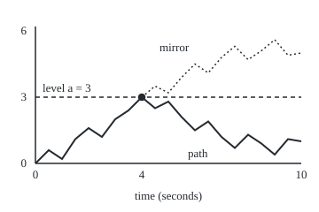
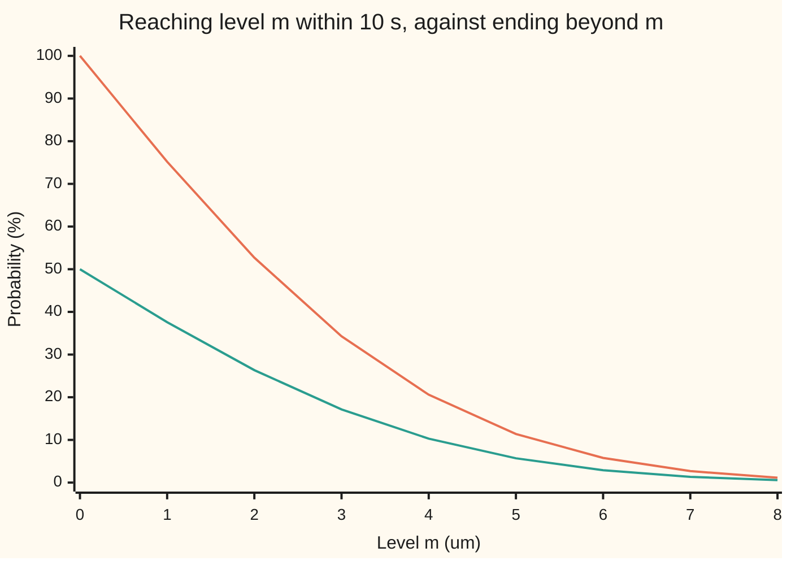
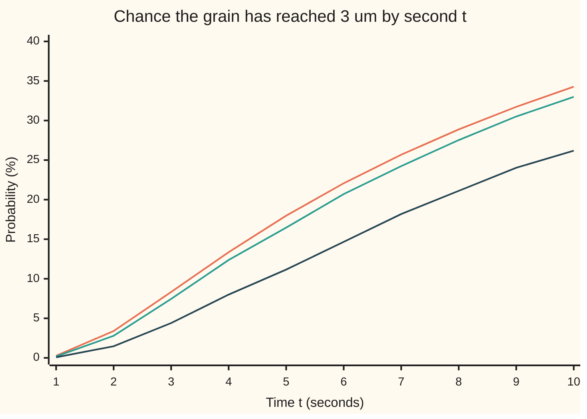

# Reflection principle: the maximum of Brownian motion and the chance of touching a level

[Syllabus](../../../SYLLABUS.md) → [Stochastic processes and calculus](../README.md) → [Brownian Motion](../README.md#s05) → Reflection principle

---

## General Overview

A pollen grain floats in a drop of water under a microscope. Water molecules knock it about, and along one axis it drifts left and right with no preference. Measure its position in micrometres (μm, millionths of a metre) to the right of where it was first seen, in a liquid where that position spreads by 1 square micrometre of variance each second, as on [Brownian motion](01-brownian-motion.md). After 10 seconds its position has a standard deviation of $\sqrt{10}$ = 3.16 μm. A line is drawn on the slide 3 μm to the right of the start. What is the chance the grain touches that line at some moment in the next 10 seconds?

Where the grain sits at second 10 does not answer it. A grain can cross the line at second 4 and drift back to 1 μm by second 10. The chance of ending at 3 μm or beyond is 0.1714. The chance of touching the line on the way is exactly twice that, 0.3428: about 1 in 3, against about 1 in 6. This card reads "wanders 3 μm away" one-sidedly, as a line on one side; wandering 3 μm away on either side has chance 0.6767, worked in What breaks.

The factor of two comes from a mirror. Take any path that touches the line and ends below it, and from its first touch onward reflect it in the line. It becomes a path that ends above the line, as far above as the original ended below. A fair, symmetric motion cannot tell the two apart, so touching and falling back is exactly as likely as ending above. The mirror is the **reflection principle**, the term used from here on.

**For a Brownian motion started at 0 and a level a above it, the chance of touching a by time t is twice the chance of being above a at time t; so the largest value reached by time t has the same law as the distance from the start at time t.**

**What kind of fact this is:** a theorem, proved on this card in Why it works from the strong Markov property, which is stated with its proof's key step and a named source for the full argument.

### The picture: one path and its mirror

<p align="center"></p>

One path, drawn by hand on a half-second grid with straight lines between the points, not simulated. Solid: the grain's path, first at 3 μm at 4 seconds (the dot), ending at 1 μm. Dotted: the same path reflected in the dashed level after 4 seconds, each later point 6 minus the original, ending at 5 μm. Before the dot the two are one line. Drawn to scale: 30 pixels a second, 25 pixels a micrometre; both checks print the coordinates.

---

## The formula

Notation first. The grain's position is $W_t$, a Brownian motion: the random walk seen from far away, with independent steps whose variance grows like the elapsed time ([Brownian motion](01-brownian-motion.md)). Time $t$ is in seconds and $W_0 = 0$. The **running maximum** $M_t$ is the largest position the grain has reached by time $t$, read "the best so far". The **first-passage time** $\tau_a$ is the first moment the grain stands at level $a$, a stopping time: a time recognised when it arrives, without seeing the future. Touching $a$ by time $t$, $\tau_a \le t$, and having a best-so-far of at least $a$, $M_t \ge a$, are the same event, because the path is continuous and cannot reach past $a$ without standing on it. $\Phi$ is the standard normal cumulative distribution: $\Phi(x)$ is the chance a bell-curve draw with mean 0 and variance 1 lands at or below $x$.

$$P(M_t \ge a) \;=\; P(\tau_a \le t) \;=\; 2\,P(W_t \ge a) \;=\; 2\left(1 - \Phi\!\left(\frac{a}{\sqrt{t}}\right)\right), \qquad a > 0$$

**Read it aloud:** the chance the best so far has reached a by time t is twice the chance of standing above a at time t.

The exchange behind it, for an ending position $b$ at or below the level:

$$P(M_t \ge a,\; W_t \le b) \;=\; P(W_t \ge 2a - b), \qquad b \le a$$

**Read it aloud:** touching a and ending at or below b is as likely as ending at or above b's mirror image, as far above a as b is below it.

Turned into the law of the maximum, for any $m \ge 0$:

$$P(M_t \le m) \;=\; 2\,\Phi\!\left(\frac{m}{\sqrt{t}}\right) - 1 \;=\; P(\lvert W_t \rvert \le m)$$

**Read it aloud:** the best so far is spread exactly like the distance from the start at the end. Its average is $\sqrt{2t/\pi}$ and its median is 0.6745 times $\sqrt{t}$.

| Symbol | Plain meaning | In our example | Push it up and the answer… |
| --- | --- | --- | --- |
| $W_t$, $W$, $W_{10}$ | the grain's position at time t, in μm; $W$ is the whole path | the path in the picture ends at 1 | — |
| $t$, $s$, $\Delta t$ | elapsed time in seconds; $s$ a fixed earlier time; $\Delta t$ a sampling step | 10 seconds; samples every 1, 0.1 or 0.01 s | longer: touching more likely, 0.6353 at 40 s |
| $a$ | the level, μm to the right of the start | 3 μm | higher: less likely, 0.0578 at 6 μm |
| $M_t$, $M_{10}$ | the running maximum, best position so far | averages 2.5231 μm over 10 s | — |
| $\tau_a$, $\tau$, $B$ | first time the grain stands at $a$ ($\tau$ for short); $B$ the fresh motion after it | 4 s on the pictured path | — |
| $\mathcal{F}_t$ | the filtration: what is known by time t, the path up to t | the path drawn up to the dot | — |
| $\Phi$, $\varphi$ | normal cumulative chance, and the bell-curve height it adds up | $\Phi(0.9487)$ = 0.8286 | — |
| $b$ | a possible ending position at or below $a$ | 1 μm; its mirror $2a - b$ is 5 | higher: the joint chance rises |
| $m$ | a possible value of the best so far | 0 to 8 μm in the chart | — |
| $h$, $n$, $j$ | the coin walk of road 2: step size, number of steps, steps up to the line | 3/96 μm, 10240 steps, 96 | more steps: closer to the formula |
| $\mu$ | a drift, a steady current pushing the grain | 0.2 μm a second in What breaks | the mirror no longer applies |
| $\beta$ | a grid's blind spot, as a level shift per root second | 0.5826 | — |
| $u$, $k$, $\tilde W$, $Z$, $\tau^{(k)}$, $B^{(k)}$, $\zeta$ | helpers: u a time measured after s or after $\tau_a$; k a whole number (the two-wall series, the proof's grid of $2^{-k}$ s); $\tilde W$ the reflected path; Z a standard normal; $\tau^{(k)}$ the first touch rounded up to that grid and $B^{(k)}$ the motion after it; ζ the Riemann zeta function in β's formula (Sources) | — | — |

The number inside $\Phi$ is $a/\sqrt{t}$: the level measured in the motion's own typical spread at time t. Here $3/\sqrt{10}$ = 0.9487, so the line is a little under one typical spread away.

### When it holds

- **No drift.** The mirror swaps a step for its negative, which keeps the chance only if the motion is symmetric. With a current of 0.2 μm a second toward the line, doubling the drifting grain's chance of ending beyond 3 gives 0.7518; the truth is 0.5649.
- **Watched all the time.** The formula is about the continuous path. A grain recorded once a second can cross 3 and come back between two records. In 10000 simulated paths, the once-a-second record reaches 3 in 0.2619 ± 0.0044 of them, not 0.3428.
- **One level, fixed in advance.** A second wall on the other side needs a mirror in each wall, and mirrors of mirrors. Touching 3 μm on either side has chance 0.6767, not twice 0.3428.
- **A level above the start, $a > 0$.** Below the start the formula breaks: at $a = -3$ it gives 1.6572, more than certainty, because the best so far starts at 0 and is past −3 from the outset. The chance of touching −3 is the formula at $\lvert a \rvert$, 0.3428, by symmetry. At $a = 0$ the touch is immediate and the chance is 1, which the formula also gives.

---

## Why it works

### Step 0: after the first touch, the grain starts afresh from the line

From its first touch, the grain moves as a new Brownian motion started at 3 μm, independent of how it got there, and a Brownian motion and its mirror image have the same law. So ending 2 below the line and ending 2 above are equally likely. For coin tosses this was a count of paths ([Reflection principle](../01-Random%20Walks%20and%20Filtrations/05-reflection-principle-for-walks.md)); here the count is replaced by the strong Markov property and one symmetry.

### Step 1: the strong Markov property, at a stopping time

The ordinary Markov property says: at a fixed time s, the future $W_{s+u} - W_s$, the move over the u seconds after s, is a fresh Brownian motion, independent of $\mathcal{F}_s$, the path up to s. That is the independence of increments from [Brownian motion](01-brownian-motion.md), restated.

The **strong Markov property** says the same at a stopping time such as $\tau_a$: on the event that the grain touches, $W_{\tau_a + u} - W_{\tau_a}$ is a fresh Brownian motion, independent of the path up to $\tau_a$. A stopping time is needed. "The last time before 10 seconds that the grain was at 3" is not one, and after it the grain cannot return to 3, so its future is not fresh.

The key step of the proof rounds $\tau_a$ up to a grid of $2^{-k}$ seconds. The rounded time takes countably many values, at each of which the ordinary Markov property applies; as the grid refines, continuity of the path carries the result down to $\tau_a$. The steps are in the Detailed proof below; the full measure-theoretic argument is in Karatzas and Shreve, Section 2.6 (Sources).

### Step 2: the reflected path is again a Brownian motion

The reflected path equals $W_t$ up to $\tau_a$ and $2a - W_t$ afterwards: $a$ minus the fresh motion instead of $a$ plus it. The fresh motion is independent of the past (Step 1), and minus a Brownian motion is a Brownian motion, since the bell curve is symmetric. The same past glued to a future with the same law gives a path with the same law: the reflected path is a Brownian motion too.

### Step 3: pair the paths

Take a path that touches 3 and ends at or below $b$ = 1. Its reflection ends at or above $2 \times 3 - 1$ = 5. Conversely, a path ending at or above 5 started below 3, so it touched 3; reflecting it after its first touch gives a path that touched 3 and ends at or below 1. The two reflections undo each other, and the reflected path has the same law as the original. So the two events have the same chance:

$$P(M_{10} \ge 3,\; W_{10} \le 1) = P(W_{10} \ge 5) = 0.0569$$

Now set $b = a$. Touching and ending at or below the line is as likely as ending at or above it. Every path that ends above the line touched it. So the touching paths split into two halves of equal chance: those that end above, 0.1714, and those that end below, also 0.1714. The chance of ending exactly on the line is 0, since $W_{10}$ has a density. Adding gives 0.3428, the formula.

<details>
<summary>Detailed proof</summary>

Fix $a > 0$ and $t > 0$, and let $\tau = \tau_a$, the first time $W$ equals $a$. The hitting set $\{s : W_s = a\}$ is closed because the path is continuous, so a finite $\tau$ is attained, and $\{\tau \le s\} = \{M_s \ge a\}$, which is decided by the path at rational times up to s; so $\tau$ is a stopping time.

**Strong Markov property.** Statement: on $\{\tau < \infty\}$, the process $B_u = W_{\tau + u} - W_\tau$ is a Brownian motion independent of $\mathcal{F}_\tau$, the events whose occurrence is known by time $\tau$. Proof sketch. Let $\tau^{(k)} = \lceil 2^k \tau \rceil / 2^k$. For a grid time $s$, the event $\{\tau^{(k)} = s\}$ lies in $\mathcal{F}_s$, and on it the process $W_{s+u} - W_s$ is independent of $\mathcal{F}_s$ with the Brownian law. Summing over the countably many $s$ shows the same for $B^{(k)}_u = W_{\tau^{(k)} + u} - W_{\tau^{(k)}}$ against any event of $\mathcal{F}_\tau$, which lies in every $\mathcal{F}_{\tau^{(k)}}$. As $k \to \infty$, $\tau^{(k)}$ decreases to $\tau$ and continuity gives $B^{(k)}_u \to B_u$ for every u; finite-dimensional laws pass to the limit by bounded convergence, and they determine the law of a continuous process. Full details: Karatzas and Shreve, Section 2.6; Revuz and Yor, Chapter III.

**Reflection.** Let $\tilde W_s = W_s$ for $s \le \tau$ and $\tilde W_s = 2a - W_s$ for $s > \tau$. On $\{\tau < \infty\}$, $W = $ (path to $\tau$) glued to $a + B$, and $\tilde W = $ (same path) glued to $a - B$. Since $B$ and $-B$ are Brownian motions independent of $\mathcal{F}_\tau$, the two glued processes have the same law. On $\{\tau = \infty\}$ they are equal. So $\tilde W$ is a Brownian motion, and its first passage to $a$ is the same $\tau$.

**Joint law.** For $b \le a$: $\{M_t \ge a, W_t \le b\} = \{\tau \le t, \tilde W_t \ge 2a - b\}$. Since $2a - b \ge a$ and $\tilde W$ starts below $a$, $\tilde W_t \ge 2a - b$ forces $\tau \le t$. So $P(M_t \ge a, W_t \le b) = P(\tilde W_t \ge 2a - b) = P(W_t \ge 2a - b)$.

**Maximum.** At $b = a$: $P(M_t \ge a, W_t \le a) = P(W_t \ge a)$. And $P(M_t \ge a, W_t > a) = P(W_t > a)$, since ending above forces a touch. $P(W_t = a) = 0$, so $P(M_t \ge a) = 2P(W_t \ge a) = 2(1 - \Phi(a/\sqrt t))$. Since $P(\lvert W_t \rvert \ge a) = 2P(W_t \ge a)$ by symmetry, $M_t$ and $\lvert W_t \rvert$ have the same law. Differentiating in $a$ gives the density of $M_t$, $2\varphi(m/\sqrt t)/\sqrt t$ for $m \ge 0$; differentiating the joint law in $a$ and $b$ gives the joint density $\frac{2(2m - b)}{\sqrt{2\pi t^3}}\, e^{-(2m-b)^2/(2t)}$ for $m \ge 0$, $b \le m$.

**Mean and median.** $E[M_t] = E\lvert W_t \rvert = \sqrt t\, E\lvert Z \rvert = \sqrt{2t/\pi}$, with $Z$ a standard normal. The median solves $2\Phi(m/\sqrt t) - 1 = 1/2$, so $m = \sqrt t\, \Phi^{-1}(3/4) = 0.6745\sqrt t$.

</details>

### Step 4: the law of the best so far

Ask "touched m?" for every level m at once and the whole law of $M_{10}$ comes out: $P(M_{10} \ge m) = P(\lvert W_{10} \rvert \ge m)$. The best so far over 10 seconds averages $\sqrt{20/\pi}$ = 2.5231 μm, with median 2.1329: in half of all 10-second runs the grain gets at least 2.13 μm to the right of where it started.



Orange: $P(M_{10} \ge m)$, the chance the best so far reaches m. Green: $P(W_{10} \ge m)$, the chance of ending at or beyond m. Orange is twice green at every level, m = 0 included: the grain starts on 0, so it has reached 0 for certain, while it ends to the right of 0 half the time. The exact coin walk with 2560 steps prints the same nine orange values to within 0.01 of a percentage point.

### Step 5: first passage, and why the wait has no average

Read the formula as a function of time and it is the law of the first-passage time: $P(\tau_3 \le t) = 2(1 - \Phi(3/\sqrt t))$. At 40 seconds it is 0.6353, at 1000 seconds 0.9244, and as t grows it tends to 1, because $3/\sqrt t$ tends to 0 and $\Phi(0)$ is one half. The grain touches the line for certain, eventually. Yet the average wait is infinite. The average is the area under the chance of still waiting, and that chance falls only like $1/\sqrt t$, whose area never stops growing. The coin-toss version of this fact is on [Hitting times](../01-Random%20Walks%20and%20Filtrations/06-first-passage-and-hitting-times.md).

A second road to the formula runs through the walk. A fair coin walk with steps of $h$ every $h^2$ seconds obeys its own reflection principle, proved by counting; as the steps shrink, the walk becomes Brownian motion and its touching chance becomes this one. The code does not use the walk's mirror. It computes the walk's chance of touching directly, step by step, and watches it close in.

---

## Worked numbers, by hand

The grain, the line 3 μm to the right, 10 seconds.

| Step | Arithmetic | Value |
| --- | --- | --- |
| typical spread at 10 s | $\sqrt{10}$ | 3.1623 |
| level in spreads, $a/\sqrt t$ | 3 / 3.1623 | 0.9487 |
| $\Phi(0.9487)$ | normal table, or Simpson's rule in the code | 0.8286 |
| ends at 3 or beyond, $P(W_{10} \ge 3)$ | 1 − 0.8286 | 0.1714 |
| touches and falls back | the mirror: same as ending beyond | 0.1714 |
| **touches 3 within 10 s** | 0.1714 + 0.1714 | **0.3428** |
| touches 3 and ends at or below 1 | $P(W_{10} \ge 5)$ | 0.0569 |
| average best so far | $\sqrt{20/\pi}$ | 2.5231 |

About one grain in three touches the line within 10 seconds. Half of those are back on the start side of the line when the 10 seconds end, and a sixth of those touching grains, 0.0569 out of 0.3428, end no more than 1 μm to the right of the start. That 0.0569 is also the chance of ending beyond 5 μm computed on [Brownian motion](01-brownian-motion.md): the mirror turns one into the other.

### The chance builds up over the 10 seconds



Orange: the formula, for the path watched continuously. Green: 10000 simulated paths on a 0.01-second grid. Dark: the same paths recorded once a second, the house example's microscope log. Each simulated value has a standard error of at most 0.47 percentage points. The once-a-second log misses about a quarter of the touches: 26.19% against 34.28% at 10 seconds. A finer grid misses fewer, but every grid misses some.

### What breaks if you drop a piece

| Mistake | Comes out at | What went wrong |
| --- | --- | --- |
| Use where the grain ends | 0.1714 (right: 0.3428) | Half the touching paths are back below 3 by 10 s |
| Read touches off a once-a-second record | 0.2619 ± 0.0044, simulated (right: 0.3428) | The path crosses 3 and returns between records |
| Either side: double the one-sided answer | 0.6856 (right: 0.6767) | Paths touching both +3 and −3 are counted twice |
| Mirror with a current of 0.2 μm/s | 0.7518 (right: 0.5649) | The motion is not symmetric, so a path and its mirror differ in chance |

The either-side truth comes from mirrors in both walls, an alternating sum of normal chances: subtract the paths that touch one wall, add back those that touch both, and so on. The chance of staying strictly between −a and a is $\sum_k (-1)^k\big[\Phi\big((2k+1)a/\sqrt t\big) - \Phi\big((2k-1)a/\sqrt t\big)\big]$, summed over every whole number k, and one minus it is 0.6767 ([Two walls](../../12-Financial%20mathematics/23-FX%20exotics%20as%20desks%20use%20them%20-%20digitals%2C%20touches%20and%20barriers/05-double-barriers-and-double-no-touch.md); Method of images). The drift truth is $1 - \Phi\big((a - \mu t)/\sqrt t\big) + e^{2\mu a}\,\Phi\big((-a - \mu t)/\sqrt t\big)$, which follows from this card's joint law by weighting each path with an exponential martingale: [Brownian martingales](06-brownian-martingales-and-exponential-martingale.md) proves that martingale fair, and [Girsanov](../07-Changing%20Measure/02-girsanov-theorem.md) does the weighting. The coin walk with 10240 steps confirms both: 0.6768 and 0.5649.

---

## Code, from first principles, and it actually runs

Three roads to 0.3428. Road 1: the formula, with $\Phi$ built by Simpson's rule. Road 2, exact and mirror-free: a fair coin walk with steps of $h = 3/j$ μm every $h^2$ seconds, the line exactly $j$ steps up, its touching chance carried forward step by step, for 10 to 10240 steps. Road 3: 10000 simulated paths on a 0.01-second grid, SplitMix64 (seed 20260930) and Box-Muller written out, each read at three grids. A grid sees the level as if raised by $\beta\sqrt{\Delta t}$, $\beta$ = 0.5826 (Broadie, Glasserman and Kou, Sources), so each simulated chance is asserted within four standard errors of that corrected formula. Roads 1 and 2 also price the either-side and drift cases.

### Python

```python
# Reflection principle for Brownian motion -- the check behind the card.  Standard library only.
# A pollen grain's position W_t along one axis, in micrometres, spreading by 1 um^2 of variance a second.
# Does it reach 3 um within 10 seconds?  Road 1: the formula 2(1 - Phi(3/sqrt 10)), with Phi built
# by Simpson's rule.  Road 2: exact coin-flip walks, finer and finer, no mirror used.  Road 3: seeded
# Gaussian paths (SplitMix64 + Box-Muller, written out) on grids of 1, 0.1 and 0.01 seconds.
from math import sqrt, exp, log, cos, sin, pi

A, T = 3.0, 10.0                                  # level (um) and horizon (seconds)
def phi(x): return exp(-0.5 * x * x) / sqrt(2 * pi)
def simpson(f, a, b, n):
    h = (b - a) / n
    s = f(a) + f(b)
    for i in range(1, n): s += (4 if i % 2 else 2) * f(a + i * h)
    return s * h / 3
def Phi(x):                                       # standard normal CDF: half, plus the area from 0 to x
    if x > 12: return 1.0
    if x < -12: return 0.0
    return 0.5 + simpson(phi, 0.0, x, 2000)
def touch(a, t): return 2 * (1 - Phi(a / sqrt(t)))          # the reflection principle: P(M_t >= a)
def drift_touch(a, t, mu):                         # with drift mu (um per second), for the what-breaks row
    return 1 - Phi((a - mu * t) / sqrt(t)) + exp(2 * mu * a) * Phi((-a - mu * t) / sqrt(t))
def either_side(a, t):                             # P(|W| reaches a by t): mirrors in both walls, alternating
    stay = sum((-1) ** k * (Phi((2 * k + 1) * a / sqrt(t)) - Phi((2 * k - 1) * a / sqrt(t))) for k in range(-8, 9))
    return 1 - stay

def walk(n, j, p=0.5, two_sided=False):           # road 2: coin walk, n steps of +-h, h = sqrt(T/n); does it reach j steps?
    lo = -j + 1 if two_sided else -(j + int(12 * sqrt(n)) + 2)
    w = [0.0] * (j - lo); w[-lo] = 1.0; hit = 0.0
    for _ in range(n):
        hit += p * w[-1] + ((1 - p) * w[0] if two_sided else 0.0)
        w = [(p * w[i - 1] if i else 0.0) + ((1 - p) * w[i + 1] if i + 1 < len(w) else 0.0) for i in range(len(w))]
    return hit

MASK = (1 << 64) - 1
state = 20260930
def u01():                                        # SplitMix64, top 53 bits, never exactly 0
    global state
    state = (state + 0x9E3779B97F4A7C15) & MASK
    z = state
    z = ((z ^ (z >> 30)) * 0xBF58476D1CE4E5B9) & MASK
    z = ((z ^ (z >> 27)) * 0x94D049BB133111EB) & MASK
    return (((z ^ (z >> 31)) >> 11) + 0.5) / 9007199254740992.0

PATHS, STEPS = 10000, 1000                        # 1000 steps of 0.01 s; every 10th is the 0.1 s grid, every 100th the 1 s grid
grid_hits = {1: 0, 10: 0, 100: 0}; max_sum = max_sq = 0.0; joint = 0
first_sec = [0] * 11; first_fine = [0] * 11      # first second-mark by which the path has reached 3
for _ in range(PATHS):
    x, top, k, fine_t, sec_t = 0.0, 0.0, 0, 0, 0
    tops = {1: 0.0, 10: 0.0, 100: 0.0}
    while k < STEPS:
        r = sqrt(-2 * log(u01())); th = 2 * pi * u01()
        for z in (r * cos(th), r * sin(th)):
            x += 0.1 * z; k += 1
            for g in (1, 10, 100):
                if k % g == 0 and x > tops[g]: tops[g] = x
            if not fine_t and x >= A: fine_t = (k + 99) // 100
            if not sec_t and k % 100 == 0 and x >= A: sec_t = k // 100
    for g in (1, 10, 100): grid_hits[g] += tops[g] >= A
    max_sum += tops[1]; max_sq += tops[1] ** 2; joint += tops[1] >= A and x <= 1.0
    if fine_t: first_fine[fine_t] += 1
    if sec_t: first_sec[sec_t] += 1
def est(c): p = c / PATHS; return p, sqrt(p * (1 - p) / PATHS)
BETA = 1.4603545088 / sqrt(2 * pi)                 # -zeta(1/2)/sqrt(2 pi): a grid sees the level as if shifted up by BETA*sqrt(dt)

p1 = touch(A, T)
print(f"{'sqrt(t), typical spread at 10 s':<44}{sqrt(T):>11.6f}")
print(f"{'a / sqrt(t)':<44}{A / sqrt(T):>11.6f}")
print(f"{'Phi(a / sqrt(t)), Simpson':<44}{Phi(A / sqrt(T)):>11.6f}")
print(f"{'1 formula 2(1 - Phi)':<44}{p1:>11.6f}")
print(f"{'  ends at or above 3, P(W_10 >= 3)':<44}{1 - Phi(A / sqrt(T)):>11.6f}")
print("2 coin walk, exact      steps n     P(reach)      error")
errs = []
for j in (3, 6, 12, 24, 48, 96):
    n = 10 * j * j // 9; v = walk(n, j); errs.append(abs(v - p1))
    print(f"{'':<24}{n:>7d}   {v:>10.6f}   {v - p1:>+9.6f}")
print(f"{'BETA = -zeta(1/2) / sqrt(2 pi)':<44}{BETA:>11.6f}")
print("3 simulation, 10000 paths   grid      P(reach)   std err   grid-corrected formula")
sims = {}
for g, dt in ((100, 1.0), (10, 0.1), (1, 0.01)):
    p, se = est(grid_hits[g]); sims[g] = (p, se, touch(A + BETA * sqrt(dt), T))
    print(f"{'':<28}{dt:>4.2f} s   {p:>9.4f}   {se:>7.4f}   {sims[g][2]:>9.4f}")
pj, sej = est(joint)
print(f"{'joint: reach 3, end <= 1; P(W_10 >= 5)':<44}{1 - Phi(5 / sqrt(T)):>11.6f}")
print(f"{'  grid-corrected, 0.01 s':<44}{1 - Phi((2 * (A + BETA * 0.1) - 1) / sqrt(T)):>11.6f}")
print(f"{'  simulated, 0.01 s grid, std err':<44}{pj:>11.4f}{sej:>8.4f}")
mean_f = sqrt(2 * T / pi); mean_i = simpson(lambda m: touch(m, T) if m > 0 else 1.0, 0.0, 40.0, 400)
print(f"{'mean of M_10: sqrt(2t/pi)':<44}{mean_f:>11.6f}")
print(f"{'  integral of P(M_10 >= m) dm':<44}{mean_i:>11.6f}")
m_bar = max_sum / PATHS; m_se = sqrt((max_sq / PATHS - m_bar ** 2) / PATHS)
print(f"{'  simulated 0.01 s + BETA sqrt(dt), std err':<44}{m_bar + BETA * 0.1:>11.4f}{m_se:>8.4f}")
lo, hi = 0.0, 10.0
for _ in range(60):
    mid = (lo + hi) / 2
    lo, hi = (mid, hi) if touch(mid, T) > 0.5 else (lo, mid)
print(f"{'median of M_10, bisection':<44}{lo:>11.6f}")
print(f"{'  median / sqrt(t)':<44}{lo / sqrt(T):>11.6f}")
two_dp, drift_dp = walk(10240, 96, two_sided=True), walk(10240, 96, p=0.5 * (1 + 0.2 * 3 / 96))
rows = [("wrong: double for either side", 2 * p1), ("  right, mirrors in both walls", either_side(A, T)),
        ("  right, coin walk n = 10240", two_dp),
        ("wrong: mirror with drift 0.2 / s", touch(A - 0.2 * T, T)), ("  right, drift formula", drift_touch(A, T, 0.2)),
        ("  right, coin walk n = 10240", drift_dp), ("wrong: formula at level -3, below the start", touch(-A, T)),
        ("try: level 6", touch(6.0, T)), ("try: 40 seconds", touch(A, 40.0)), ("try: 1000 seconds", touch(A, 1000.0))]
for name, v in rows: print(f"{name:<44}{v:>11.6f}")
ms = range(9)
print("chart, level m          " + " ".join(f"{m:>6d}" for m in ms))
print("chart, P(M_10 >= m) %   " + " ".join(f"{100 * (touch(m, T) if m else 1.0):6.2f}" for m in ms))
print("chart, coin walk 2560 % " + " ".join(f"{100 * (walk(2560, 16 * m) if m else 1.0):6.2f}" for m in ms))
print("chart, P(W_10 >= m) %   " + " ".join(f"{100 * (1 - Phi(m / sqrt(T))):6.2f}" for m in ms))
print("chart, second t         " + " ".join(f"{t:>6d}" for t in range(1, 11)))
print("chart, P(tau_3 <= t) %  " + " ".join(f"{100 * touch(A, t):6.2f}" for t in range(1, 11)))
print("chart, sim 0.01 s grid %" + " ".join(f"{100 * sum(first_fine[:t + 1]) / PATHS:6.2f}" for t in range(1, 11)))
print("chart, sim every sec %  " + " ".join(f"{100 * sum(first_sec[:t + 1]) / PATHS:6.2f}" for t in range(1, 11)))
path = [0, 0.6, 0.2, 1.1, 1.6, 1.2, 2.0, 2.4, 3.0, 2.5, 2.8, 2.1, 1.5, 1.9, 1.2, 0.7, 1.3, 0.9, 0.4, 1.1, 1.0]
hit = path.index(A)                                # a hand-drawn path on a 0.5 s grid, first at 3 at t = 4 s
print("figure, path            " + " ".join(f"{v:.1f}" for v in path))
print("figure, mirrored        " + " ".join(f"{v if i <= hit else 2 * A - v:.1f}" for i, v in enumerate(path)))
print("figure, x px            " + " ".join(f"{40 + 15 * i}" for i in range(len(path))))
print("figure, y px path       " + " ".join(f"{185 - 25 * v:.1f}" for v in path))
print("figure, y px mirrored   " + " ".join(f"{185 - 25 * (v if i <= hit else 2 * A - v):.1f}" for i, v in enumerate(path)))

assert abs(walk(10240, 96) - p1) < 0.005 and errs[1:] == sorted(errs[1:], reverse=True), "coin walks close in on the formula"
assert all(abs(p - c) < 4 * se for p, se, c in sims.values()), "each grid within 4 std errs of the grid-corrected formula"
assert abs(pj - (1 - Phi((2 * (A + BETA * 0.1) - 1) / sqrt(T)))) < 4 * sej, "joint law: simulation vs grid-corrected mirror"
assert abs(mean_i - mean_f) < 1e-6 and abs(m_bar + BETA * 0.1 - mean_f) < 4 * m_se, "mean of the maximum, three ways"
assert abs(two_dp - either_side(A, T)) < 0.005, "two walls: image series vs coin walk"
assert abs(drift_dp - drift_touch(A, T, 0.2)) < 0.005, "drift: formula vs coin walk"
assert abs(lo - 0.6744897502 * sqrt(T)) < 1e-6, "median of M_10 = median of |W_10|"
print("ALL CHECKS PASS")
```

**Ran 2026-10-07 on macOS, Python 3.14.6, standard library only. All checks passed. Output, pasted from the run:**

```
sqrt(t), typical spread at 10 s                3.162278
a / sqrt(t)                                    0.948683
Phi(a / sqrt(t)), Simpson                      0.828609
1 formula 2(1 - Phi)                           0.342782
  ends at or above 3, P(W_10 >= 3)             0.171391
2 coin walk, exact      steps n     P(reach)      error
                             10     0.343750   +0.000968
                             40     0.348889   +0.006107
                            160     0.344314   +0.001532
                            640     0.343165   +0.000383
                           2560     0.342878   +0.000096
                          10240     0.342806   +0.000024
BETA = -zeta(1/2) / sqrt(2 pi)                 0.582597
3 simulation, 10000 paths   grid      P(reach)   std err   grid-corrected formula
                            1.00 s      0.2619    0.0044      0.2572
                            0.10 s      0.3105    0.0046      0.3140
                            0.01 s      0.3299    0.0047      0.3335
joint: reach 3, end <= 1; P(W_10 >= 5)         0.056923
  grid-corrected, 0.01 s                       0.052833
  simulated, 0.01 s grid, std err                0.0496  0.0022
mean of M_10: sqrt(2t/pi)                      2.523133
  integral of P(M_10 >= m) dm                  2.523133
  simulated 0.01 s + BETA sqrt(dt), std err      2.5166  0.0193
median of M_10, bisection                      2.132924
  median / sqrt(t)                             0.674490
wrong: double for either side                  0.685563
  right, mirrors in both walls                 0.676715
  right, coin walk n = 10240                   0.676763
wrong: mirror with drift 0.2 / s               0.751830
  right, drift formula                         0.564906
  right, coin walk n = 10240                   0.564943
wrong: formula at level -3, below the start    1.657218
try: level 6                                   0.057780
try: 40 seconds                                0.635256
try: 1000 seconds                              0.924419
chart, level m               0      1      2      3      4      5      6      7      8
chart, P(M_10 >= m) %   100.00  75.18  52.71  34.28  20.59  11.38   5.78   2.69   1.14
chart, coin walk 2560 % 100.00  75.19  52.72  34.29  20.60  11.39   5.78   2.69   1.14
chart, P(W_10 >= m) %    50.00  37.59  26.35  17.14  10.30   5.69   2.89   1.34   0.57
chart, second t              1      2      3      4      5      6      7      8      9     10
chart, P(tau_3 <= t) %    0.27   3.39   8.33  13.36  17.97  22.07  25.68  28.88  31.73  34.28
chart, sim 0.01 s grid %  0.19   2.79   7.45  12.37  16.46  20.70  24.24  27.53  30.51  32.99
chart, sim every sec %    0.07   1.47   4.40   8.00  11.16  14.66  18.18  21.11  24.03  26.19
figure, path            0.0 0.6 0.2 1.1 1.6 1.2 2.0 2.4 3.0 2.5 2.8 2.1 1.5 1.9 1.2 0.7 1.3 0.9 0.4 1.1 1.0
figure, mirrored        0.0 0.6 0.2 1.1 1.6 1.2 2.0 2.4 3.0 3.5 3.2 3.9 4.5 4.1 4.8 5.3 4.7 5.1 5.6 4.9 5.0
figure, x px            40 55 70 85 100 115 130 145 160 175 190 205 220 235 250 265 280 295 310 325 340
figure, y px path       185.0 170.0 180.0 157.5 145.0 155.0 135.0 125.0 110.0 122.5 115.0 132.5 147.5 137.5 155.0 167.5 152.5 162.5 175.0 157.5 160.0
figure, y px mirrored   185.0 170.0 180.0 157.5 145.0 155.0 135.0 125.0 110.0 97.5 105.0 87.5 72.5 82.5 65.0 52.5 67.5 57.5 45.0 62.5 60.0
ALL CHECKS PASS
```

From 40 steps on, each fourfold increase in the coin walk's steps cuts its error about fourfold, to 0.000024 at 10240; the 10-step value lands close by lattice luck. The simulation falls short of the formula on every grid, by less as the grid refines, and sits within two standard errors of the grid-corrected formula each time.

### Rust

```rust
// Reflection principle for Brownian motion -- the same check as reflection_principle_and_running_maximum_check.py.
// Standard library only, no crates.  A pollen grain's position W_t along one axis, in um, variance t after t s.
// Road 1: the formula 2(1 - Phi(3/sqrt 10)), Phi by Simpson's rule.  Road 2: exact coin-flip walks, no mirror.
// Road 3: seeded Gaussian paths (SplitMix64 + Box-Muller, written out) on grids of 1, 0.1 and 0.01 seconds.
use std::f64::consts::PI;

const A: f64 = 3.0;
const T: f64 = 10.0;
fn phi(x: f64) -> f64 { (-0.5 * x * x).exp() / (2.0 * PI).sqrt() }
fn simpson<F: Fn(f64) -> f64>(f: F, a: f64, b: f64, n: usize) -> f64 {
    let h = (b - a) / n as f64;
    let mut s = f(a) + f(b);
    for i in 1..n { s += if i % 2 == 1 { 4.0 } else { 2.0 } * f(a + i as f64 * h); }
    s * h / 3.0
}
fn big_phi(x: f64) -> f64 {
    if x > 12.0 { return 1.0; }
    if x < -12.0 { return 0.0; }
    0.5 + simpson(phi, 0.0, x, 2000)
}
fn touch(a: f64, t: f64) -> f64 { 2.0 * (1.0 - big_phi(a / t.sqrt())) }
fn drift_touch(a: f64, t: f64, mu: f64) -> f64 {
    1.0 - big_phi((a - mu * t) / t.sqrt()) + (2.0 * mu * a).exp() * big_phi((-a - mu * t) / t.sqrt())
}
fn either_side(a: f64, t: f64) -> f64 {
    let stay = (-8i32..9).map(|k| (if k % 2 == 0 { 1.0 } else { -1.0 })
        * (big_phi((2 * k + 1) as f64 * a / t.sqrt()) - big_phi((2 * k - 1) as f64 * a / t.sqrt())))
        .fold(0.0, |s, v| s + v);
    1.0 - stay
}
fn walk(n: usize, j: i64, p: f64, two_sided: bool) -> f64 {
    let lo = if two_sided { -j + 1 } else { -(j + (12.0 * (n as f64).sqrt()) as i64 + 2) };
    let len = (j - lo) as usize;
    let mut w = vec![0.0f64; len];
    w[(-lo) as usize] = 1.0;
    let mut hit = 0.0;
    for _ in 0..n {
        hit += p * w[len - 1] + if two_sided { (1.0 - p) * w[0] } else { 0.0 };
        w = (0..len).map(|i| (if i > 0 { p * w[i - 1] } else { 0.0 })
            + (if i + 1 < len { (1.0 - p) * w[i + 1] } else { 0.0 })).collect();
    }
    hit
}
struct Rng(u64);
impl Rng {
    fn u01(&mut self) -> f64 {
        self.0 = self.0.wrapping_add(0x9E3779B97F4A7C15);
        let mut z = self.0;
        z = (z ^ (z >> 30)).wrapping_mul(0xBF58476D1CE4E5B9);
        z = (z ^ (z >> 27)).wrapping_mul(0x94D049BB133111EB);
        (((z ^ (z >> 31)) >> 11) as f64 + 0.5) / 9007199254740992.0
    }
}
fn row(name: &str, v: f64) { println!("{:<44}{:>11.6}", name, v); }
fn join<I: Iterator<Item = String>>(it: I) -> String { it.collect::<Vec<_>>().join(" ") }

fn main() {
    let (paths, steps) = (10000usize, 1000usize);
    let grids = [1usize, 10, 100];
    let mut rng = Rng(20260930);
    let (mut grid_hits, mut max_sum, mut max_sq, mut joint) = ([0usize; 3], 0.0f64, 0.0f64, 0usize);
    let (mut first_sec, mut first_fine) = ([0usize; 11], [0usize; 11]);
    for _ in 0..paths {
        let (mut x, mut k, mut fine_t, mut sec_t) = (0.0f64, 0usize, 0usize, 0usize);
        let mut tops = [0.0f64; 3];
        while k < steps {
            let r = (-2.0 * rng.u01().ln()).sqrt();
            let th = 2.0 * PI * rng.u01();
            for z in [r * th.cos(), r * th.sin()] {
                x += 0.1 * z; k += 1;
                for (gi, g) in grids.iter().enumerate() { if k % g == 0 && x > tops[gi] { tops[gi] = x; } }
                if fine_t == 0 && x >= A { fine_t = (k + 99) / 100; }
                if sec_t == 0 && k % 100 == 0 && x >= A { sec_t = k / 100; }
            }
        }
        for gi in 0..3 { if tops[gi] >= A { grid_hits[gi] += 1; } }
        max_sum += tops[0]; max_sq += tops[0] * tops[0];
        if tops[0] >= A && x <= 1.0 { joint += 1; }
        if fine_t > 0 { first_fine[fine_t] += 1; }
        if sec_t > 0 { first_sec[sec_t] += 1; }
    }
    let est = |c: usize| { let p = c as f64 / paths as f64; (p, (p * (1.0 - p) / paths as f64).sqrt()) };
    let beta = 1.4603545088 / (2.0 * PI).sqrt();

    let p1 = touch(A, T);
    row("sqrt(t), typical spread at 10 s", T.sqrt());
    row("a / sqrt(t)", A / T.sqrt());
    row("Phi(a / sqrt(t)), Simpson", big_phi(A / T.sqrt()));
    row("1 formula 2(1 - Phi)", p1);
    row("  ends at or above 3, P(W_10 >= 3)", 1.0 - big_phi(A / T.sqrt()));
    println!("2 coin walk, exact      steps n     P(reach)      error");
    let mut errs = Vec::new();
    for j in [3i64, 6, 12, 24, 48, 96] {
        let n = (10 * j * j / 9) as usize;
        let v = walk(n, j, 0.5, false);
        errs.push((v - p1).abs());
        println!("{:<24}{:>7}   {:>10.6}   {:>+9.6}", "", n, v, v - p1);
    }
    row("BETA = -zeta(1/2) / sqrt(2 pi)", beta);
    println!("3 simulation, 10000 paths   grid      P(reach)   std err   grid-corrected formula");
    let mut sims = Vec::new();
    for (gi, dt) in [(2usize, 1.0f64), (1, 0.1), (0, 0.01)] {
        let (p, se) = est(grid_hits[gi]);
        let c = touch(A + beta * dt.sqrt(), T);
        sims.push((p, se, c));
        println!("{:<28}{:>4.2} s   {:>9.4}   {:>7.4}   {:>9.4}", "", dt, p, se, c);
    }
    let (pj, sej) = est(joint);
    row("joint: reach 3, end <= 1; P(W_10 >= 5)", 1.0 - big_phi(5.0 / T.sqrt()));
    row("  grid-corrected, 0.01 s", 1.0 - big_phi((2.0 * (A + beta * 0.1) - 1.0) / T.sqrt()));
    println!("{:<44}{:>11.4}{:>8.4}", "  simulated, 0.01 s grid, std err", pj, sej);
    let mean_f = (2.0 * T / PI).sqrt();
    let mean_i = simpson(|m| if m > 0.0 { touch(m, T) } else { 1.0 }, 0.0, 40.0, 400);
    row("mean of M_10: sqrt(2t/pi)", mean_f);
    row("  integral of P(M_10 >= m) dm", mean_i);
    let m_bar = max_sum / paths as f64;
    let m_se = ((max_sq / paths as f64 - m_bar * m_bar) / paths as f64).sqrt();
    println!("{:<44}{:>11.4}{:>8.4}", "  simulated 0.01 s + BETA sqrt(dt), std err", m_bar + beta * 0.1, m_se);
    let (mut lo, mut hi) = (0.0f64, 10.0f64);
    for _ in 0..60 {
        let mid = (lo + hi) / 2.0;
        if touch(mid, T) > 0.5 { lo = mid; } else { hi = mid; }
    }
    row("median of M_10, bisection", lo);
    row("  median / sqrt(t)", lo / T.sqrt());
    let two_dp = walk(10240, 96, 0.5, true);
    let drift_dp = walk(10240, 96, 0.5 * (1.0 + 0.2 * 3.0 / 96.0), false);
    row("wrong: double for either side", 2.0 * p1);
    row("  right, mirrors in both walls", either_side(A, T));
    row("  right, coin walk n = 10240", two_dp);
    row("wrong: mirror with drift 0.2 / s", touch(A - 0.2 * T, T));
    row("  right, drift formula", drift_touch(A, T, 0.2));
    row("  right, coin walk n = 10240", drift_dp);
    row("wrong: formula at level -3, below the start", touch(-A, T));
    row("try: level 6", touch(6.0, T));
    row("try: 40 seconds", touch(A, 40.0));
    row("try: 1000 seconds", touch(A, 1000.0));
    println!("chart, level m          {}", join((0..9).map(|m| format!("{:>6}", m))));
    println!("chart, P(M_10 >= m) %   {}", join((0..9).map(|m| format!("{:6.2}", 100.0 * if m > 0 { touch(m as f64, T) } else { 1.0 }))));
    println!("chart, coin walk 2560 % {}", join((0..9).map(|m| format!("{:6.2}", 100.0 * if m > 0 { walk(2560, 16 * m, 0.5, false) } else { 1.0 }))));
    println!("chart, P(W_10 >= m) %   {}", join((0..9).map(|m| format!("{:6.2}", 100.0 * (1.0 - big_phi(m as f64 / T.sqrt()))))));
    println!("chart, second t         {}", join((1..11).map(|t| format!("{:>6}", t))));
    println!("chart, P(tau_3 <= t) %  {}", join((1..11).map(|t| format!("{:6.2}", 100.0 * touch(A, t as f64)))));
    let cum = |v: &[usize; 11], t: usize| 100.0 * v[..=t].iter().sum::<usize>() as f64 / paths as f64;
    println!("chart, sim 0.01 s grid %{}", join((1..11).map(|t| format!("{:6.2}", cum(&first_fine, t)))));
    println!("chart, sim every sec %  {}", join((1..11).map(|t| format!("{:6.2}", cum(&first_sec, t)))));
    let path = [0.0f64, 0.6, 0.2, 1.1, 1.6, 1.2, 2.0, 2.4, 3.0, 2.5, 2.8, 2.1, 1.5, 1.9, 1.2, 0.7, 1.3, 0.9, 0.4, 1.1, 1.0];
    let hit = path.iter().position(|&v| v == A).unwrap();      // hand-drawn, 0.5 s grid, first at 3 at t = 4 s
    let mir = |i: usize, v: f64| if i <= hit { v } else { 2.0 * A - v };
    println!("figure, path            {}", join(path.iter().map(|v| format!("{:.1}", v))));
    println!("figure, mirrored        {}", join(path.iter().enumerate().map(|(i, &v)| format!("{:.1}", mir(i, v)))));
    println!("figure, x px            {}", join((0..path.len()).map(|i| format!("{}", 40 + 15 * i))));
    println!("figure, y px path       {}", join(path.iter().map(|v| format!("{:.1}", 185.0 - 25.0 * v))));
    println!("figure, y px mirrored   {}", join(path.iter().enumerate().map(|(i, &v)| format!("{:.1}", 185.0 - 25.0 * mir(i, v)))));

    let tail = &errs[1..];
    assert!((walk(10240, 96, 0.5, false) - p1).abs() < 0.005 && tail.windows(2).all(|w| w[0] >= w[1]), "coin walks close in on the formula");
    assert!(sims.iter().all(|&(p, se, c)| (p - c).abs() < 4.0 * se), "each grid within 4 std errs of the grid-corrected formula");
    assert!((pj - (1.0 - big_phi((2.0 * (A + beta * 0.1) - 1.0) / T.sqrt()))).abs() < 4.0 * sej, "joint law: simulation vs grid-corrected mirror");
    assert!((mean_i - mean_f).abs() < 1e-6 && (m_bar + beta * 0.1 - mean_f).abs() < 4.0 * m_se, "mean of the maximum, three ways");
    assert!((two_dp - either_side(A, T)).abs() < 0.005, "two walls: image series vs coin walk");
    assert!((drift_dp - drift_touch(A, T, 0.2)).abs() < 0.005, "drift: formula vs coin walk");
    assert!((lo - 0.6744897502 * T.sqrt()).abs() < 1e-6, "median of M_10 = median of |W_10|");
    println!("ALL CHECKS PASS");
}
```

**Ran 2026-10-07 on macOS, rustc 1.98.1, no crates. All checks passed. Output, pasted from the run:**

```
sqrt(t), typical spread at 10 s                3.162278
a / sqrt(t)                                    0.948683
Phi(a / sqrt(t)), Simpson                      0.828609
1 formula 2(1 - Phi)                           0.342782
  ends at or above 3, P(W_10 >= 3)             0.171391
2 coin walk, exact      steps n     P(reach)      error
                             10     0.343750   +0.000968
                             40     0.348889   +0.006107
                            160     0.344314   +0.001532
                            640     0.343165   +0.000383
                           2560     0.342878   +0.000096
                          10240     0.342806   +0.000024
BETA = -zeta(1/2) / sqrt(2 pi)                 0.582597
3 simulation, 10000 paths   grid      P(reach)   std err   grid-corrected formula
                            1.00 s      0.2619    0.0044      0.2572
                            0.10 s      0.3105    0.0046      0.3140
                            0.01 s      0.3299    0.0047      0.3335
joint: reach 3, end <= 1; P(W_10 >= 5)         0.056923
  grid-corrected, 0.01 s                       0.052833
  simulated, 0.01 s grid, std err                0.0496  0.0022
mean of M_10: sqrt(2t/pi)                      2.523133
  integral of P(M_10 >= m) dm                  2.523133
  simulated 0.01 s + BETA sqrt(dt), std err      2.5166  0.0193
median of M_10, bisection                      2.132924
  median / sqrt(t)                             0.674490
wrong: double for either side                  0.685563
  right, mirrors in both walls                 0.676715
  right, coin walk n = 10240                   0.676763
wrong: mirror with drift 0.2 / s               0.751830
  right, drift formula                         0.564906
  right, coin walk n = 10240                   0.564943
wrong: formula at level -3, below the start    1.657218
try: level 6                                   0.057780
try: 40 seconds                                0.635256
try: 1000 seconds                              0.924419
chart, level m               0      1      2      3      4      5      6      7      8
chart, P(M_10 >= m) %   100.00  75.18  52.71  34.28  20.59  11.38   5.78   2.69   1.14
chart, coin walk 2560 % 100.00  75.19  52.72  34.29  20.60  11.39   5.78   2.69   1.14
chart, P(W_10 >= m) %    50.00  37.59  26.35  17.14  10.30   5.69   2.89   1.34   0.57
chart, second t              1      2      3      4      5      6      7      8      9     10
chart, P(tau_3 <= t) %    0.27   3.39   8.33  13.36  17.97  22.07  25.68  28.88  31.73  34.28
chart, sim 0.01 s grid %  0.19   2.79   7.45  12.37  16.46  20.70  24.24  27.53  30.51  32.99
chart, sim every sec %    0.07   1.47   4.40   8.00  11.16  14.66  18.18  21.11  24.03  26.19
figure, path            0.0 0.6 0.2 1.1 1.6 1.2 2.0 2.4 3.0 2.5 2.8 2.1 1.5 1.9 1.2 0.7 1.3 0.9 0.4 1.1 1.0
figure, mirrored        0.0 0.6 0.2 1.1 1.6 1.2 2.0 2.4 3.0 3.5 3.2 3.9 4.5 4.1 4.8 5.3 4.7 5.1 5.6 4.9 5.0
figure, x px            40 55 70 85 100 115 130 145 160 175 190 205 220 235 250 265 280 295 310 325 340
figure, y px path       185.0 170.0 180.0 157.5 145.0 155.0 135.0 125.0 110.0 122.5 115.0 132.5 147.5 137.5 155.0 167.5 152.5 162.5 175.0 157.5 160.0
figure, y px mirrored   185.0 170.0 180.0 157.5 145.0 155.0 135.0 125.0 110.0 97.5 105.0 87.5 72.5 82.5 65.0 52.5 67.5 57.5 45.0 62.5 60.0
ALL CHECKS PASS
```

The two outputs agree line for line, the simulation included: both languages run the same generator from the same seed, and Box-Muller calls the same system logarithm and cosine.

> [!TIP]
> **Try changing**
> Guess first; the `try:` rows hold the answers, from the same `touch` function.
> - **Move the line to 6 μm.** The chance falls to **0.0578**, about 1 in 17. Doubling the distance cuts the chance about sixfold, because the level enters through $a/\sqrt t$ and the bell curve's tail falls fast.
> - **Wait 40 seconds instead of 10.** The chance rises to **0.6353**. Four times the time is the same as half the distance: $3/\sqrt{40}$ equals $1.5/\sqrt{10}$.
> - **Wait 1000 seconds.** **0.9244**. Certain in the end, but slowly: the chance of still waiting falls like one over the root of the time.
> - **Cut `PATHS` to 2500.** The standard errors double, since they shrink like one over the root of the number of paths, and the once-a-second shortfall stays.

---

## The usual mistake

> [!warning]
> **Treating "touches the level" as "ends beyond the level".** The end position forgets the path. Ending at 3 or beyond has chance 0.1714; touching 3 has chance 0.3428. Any question about "at some point" or "ever" needs the maximum, not the final value.
>
> Smaller traps:
> - **Checking a sampled record against the continuous formula.** Once-a-second records reach 3 in 0.2619 of paths. The gap is the grid, not bad luck: correct the level by $\beta\sqrt{\Delta t}$, or simulate the crossing inside each step.
> - **Doubling for a two-sided band.** "Ever 3 μm from the start, either way" is not 2 × 0.3428 = 0.6856. Paths that touch both sides are counted twice; the truth is 0.6767.
> - **Mirroring a drifting motion.** With any current the two halves of the mirror are no longer equally likely. With 0.2 μm a second toward the line, the naive mirror gives 0.7518 against 0.5649.
> - **Reading "touches for certain" as "touches soon".** The first-passage time is finite for sure and has infinite average; after 1000 seconds about 1 grain in 13 is still waiting.

---

## Where you meet it in real life

- **Barrier contracts.** A payment due only if a share price touches a level before a date is priced by this mirror, applied to the price's logarithm: [One-touch and no-touch](../../12-Financial%20mathematics/16-Barriers%2C%20touches%20and%20lookbacks/05-one-touch-and-no-touch.md).
- **A firm's default.** In first-passage credit models a firm defaults when its assets first touch a floor; the default chance is this formula with drift: [Black-Cox](../../12-Financial%20mathematics/43-Structural%20Models%20-%20Default%20from%20the%20Balance%20Sheet/05-black-cox-first-passage-default.md).
- **Peeking at an experiment.** A running total of pure noise, watched continuously, crosses a fixed threshold about twice as often as when read once at the end, so peeking doubles one-sided false alarms.
- **Heat and electric potential.** The mirror is the image charge of electrostatics, solving the heat equation with a wall: Method of images.
- **Paths pinned at both ends.** Given where the grain ends, the chance it crossed the line follows from this card's joint law: [Brownian bridge](05-brownian-bridge.md).

> **Say it back**
> A grain doing Brownian motion that touches a level is, from that moment, a fresh Brownian motion started on the level: the strong Markov property. Reflect its future in the level and you get another Brownian path, so touching and falling back is as likely as ending beyond. Hence the chance of touching 3 μm in 10 seconds is twice the chance of ending beyond 3, 0.3428 against 0.1714. The best position so far is spread exactly like the distance from the start, average 2.5231 μm. It needs a symmetric motion, a single level and a path watched all the time.

---

## What this builds on

- [Brownian motion](01-brownian-motion.md): the grain's motion itself, its normal increments with variance equal to the elapsed time, their independence, and continuous paths.
- [Reflection principle](../01-Random%20Walks%20and%20Filtrations/05-reflection-principle-for-walks.md): the same mirror for coin tosses, proved by counting paths, with its law of the best pile. This card replaces the count by the strong Markov property and gets "twice the tail" exactly, since the grain can never end exactly on the line.

## Where this goes next

- [Knock-out and knock-in options](../../12-Financial%20mathematics/16-Barriers%2C%20touches%20and%20lookbacks/01-knock-out-and-knock-in-options.md): options that die or come alive at a touch, priced from the joint law of the maximum and the end.
- [One-touch and no-touch](../../12-Financial%20mathematics/16-Barriers%2C%20touches%20and%20lookbacks/05-one-touch-and-no-touch.md): a payment if the level is touched, or if not: this card's formula, discounted, with drift.
- [Lookback options](../../12-Financial%20mathematics/16-Barriers%2C%20touches%20and%20lookbacks/06-lookback-options.md): a payoff on the running maximum itself, priced from its law.
- [Knock-out and knock-in](../../12-Financial%20mathematics/23-FX%20exotics%20as%20desks%20use%20them%20-%20digitals%2C%20touches%20and%20barriers/02-barrier-options-by-reflection.md): the mirror applied to currency barriers.
- [The eight single barriers in one table](../../12-Financial%20mathematics/23-FX%20exotics%20as%20desks%20use%20them%20-%20digitals%2C%20touches%20and%20barriers/03-the-eight-barrier-types.md): up or down, in or out, call or put, each a mirror of another.
- [One-touch and no-touch](../../12-Financial%20mathematics/23-FX%20exotics%20as%20desks%20use%20them%20-%20digitals%2C%20touches%20and%20barriers/04-fx-one-touch-and-no-touch.md): the touch contracts as currency desks quote them.
- [Two walls](../../12-Financial%20mathematics/23-FX%20exotics%20as%20desks%20use%20them%20-%20digitals%2C%20touches%20and%20barriers/05-double-barriers-and-double-no-touch.md): two walls, mirrors of mirrors: the either-side row of What breaks.
- [Black-Cox](../../12-Financial%20mathematics/43-Structural%20Models%20-%20Default%20from%20the%20Balance%20Sheet/05-black-cox-first-passage-default.md): default as the first touch of a floor by the firm's assets.
- Method of images: the mirror as a way to solve heat and Laplace equations with a wall.

The mirror needs a symmetric motion; what happens when the grain drifts, or when the price grows in proportion to itself, is the question the barrier cards answer by changing the measure first and reflecting second.

---

## Sources

Verified 2026-10-06: every link below resolves to the publisher's page or the DOI registry record naming the cited work.

- Karatzas, Ioannis, and Steven E. Shreve. *Brownian Motion and Stochastic Calculus*, 2nd ed. Graduate Texts in Mathematics 113. Springer, 1991; corrected printing 1998. [doi:10.1007/978-1-4612-0949-2](https://doi.org/10.1007/978-1-4612-0949-2). Section 2.6: the strong Markov property proved in full, the reflection principle and the joint law of the maximum and the end.
- Revuz, Daniel, and Marc Yor. *Continuous Martingales and Brownian Motion*, 3rd ed. Grundlehren der mathematischen Wissenschaften 293. Springer, 1999. [doi:10.1007/978-3-662-06400-9](https://doi.org/10.1007/978-3-662-06400-9). Chapter III: the strong Markov property and the reflection principle in the language of Markov processes.
- Broadie, Mark, Paul Glasserman, and Steven Kou. "A Continuity Correction for Discrete Barrier Options." *Mathematical Finance* 7, no. 4 (1997): 325–349. [doi:10.1111/1467-9965.00035](https://doi.org/10.1111/1467-9965.00035). The level shift $\beta\sqrt{\Delta t}$, with $\beta = -\zeta(1/2)/\sqrt{2\pi}$, that turns the continuous formula into the chance a sampled record touches.
- Asmussen, Søren, Peter Glynn, and Jim Pitman. "Discretization Error in Simulation of One-Dimensional Reflecting Brownian Motion." *The Annals of Applied Probability* 5, no. 4 (1995): 875–896. [doi:10.1214/aoap/1177004597](https://doi.org/10.1214/aoap/1177004597). The same constant as the gap between the true maximum and a grid's maximum, used to correct the simulated mean.
