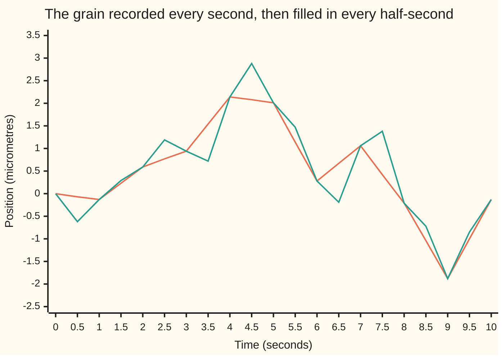
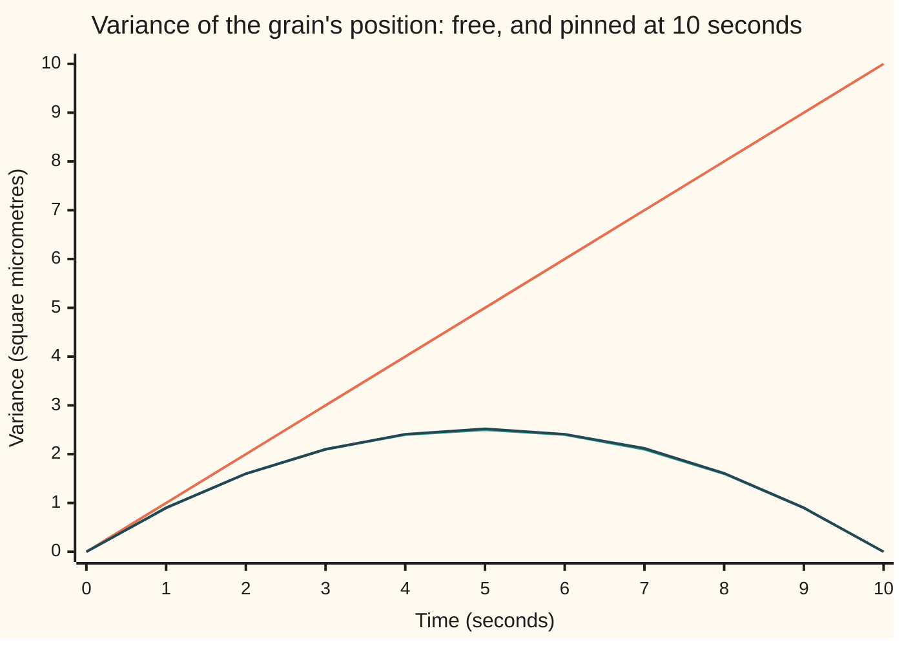

# Brownian bridge: Brownian motion pinned at both ends

[Syllabus](../../../SYLLABUS.md) → [Stochastic processes and calculus](../../../SYLLABUS.md#w11) → [Brownian Motion](../../../SYLLABUS.md#w11-s05) → Brownian bridge

---

## General Overview

A simulation tracks a pollen grain drifting in water. It records the grain's position along one line, in micrometres (μm, millionths of a metre), once a second for 10 seconds. Now a finer picture is wanted, every half-second. Rerunning at the finer step would discard the positions already drawn. The better move keeps them and fills in the gaps.

Filling a gap is not drawing a straight line. A straight line has no wiggle, and the grain's path wiggles at every scale. Filling it with a fresh random step from the left end ignores where the grain is known to be one second later. The right fill-in is random, but pinned: it must start at the left recorded point and finish at the right one. A path pinned like that at both ends is called a Brownian bridge: it spans the gap like a bridge between two fixed piers.

The rule turns out to be short. Halfway between two recorded points one second apart, the grain sits on average at the midpoint of the straight line, with a spread (standard deviation) of 0.5 μm. If the grain was at 1.3 μm at 4 seconds and at 0.5 μm at 5 seconds, its position at 4.5 seconds is a normal draw with mean 0.9 and spread 0.5. Nothing else on the record matters: not the earlier seconds, not the later ones.

**Given Brownian motion's values at two times, its path in between is a Brownian bridge: normal at each time, with mean on the straight line joining the two values, and with variance equal to the time since the left pin times the time to the right pin, over the gap, largest in the middle and zero at both ends; the rest of the record has no say.**

**What kind of fact this is:** a theorem, proved on this card in Why it works, with the full proof in a folded callout.

### The picture: one recorded path, filled in at the half-seconds



Orange: one simulated path, recorded at whole seconds and joined by straight lines. Green: the same path with a bridge draw at every half-second. The two lines agree at every whole second, because the fill-in never moves a recorded point. This is one sample from the code's generator, seed 20260930, on a half-second grid.

---

## The formula

Notation, as [Brownian motion](01-brownian-motion.md) set it up. $W_t$ is the grain's position at time $t$ seconds, in micrometres (μm), starting from $W_0 = 0$. Its steps over separate stretches of time are independent, and the step over a stretch of length $t$ is normal with mean 0 and variance $t$. A vertical bar reads "given": the law of $W_t \mid W_T = b$ is the law of the position at time t among paths that are at $b$ at time $T$.

Pin the path at the start and at time $T$: $W_0 = 0$ and $W_T = b$. For times $s \le t$ between 0 and T:

$$E[W_t \mid W_T = b] = \frac{t}{T}\, b, \qquad \operatorname{Cov}(W_s, W_t \mid W_T = b) = \frac{s\,(T - t)}{T}$$

**Read it aloud:** the average position runs along the straight line from 0 to b, and the shared wobble of two times is the earlier time multiplied by the time left after the later one, divided by the whole span.

With $s = t$ the covariance is the variance, $t(T - t)/T$: zero at both ends, largest at the middle, where it is $T/4$.

The same law between any two pinned points. If the path is at $a$ at time $t_1$ and at b at time $t_2$, then for $t$ between them

$$W_t \mid W_{t_1} = a,\; W_{t_2} = b \;\sim\; N\!\left(a + \frac{t - t_1}{t_2 - t_1}\,(b - a),\;\; \frac{(t - t_1)(t_2 - t)}{t_2 - t_1}\right)$$

**Read it aloud:** go the same fraction of the way from a to b as the time has gone from $t_1$ to $t_2$; the variance is the time since the left pin, times the time to the right pin, over the gap.

Written as a process, the bridge from 0 to b over $[0, T]$ is

$$B_t = W_t - \frac{t}{T}\, W_T + \frac{t}{T}\, b$$

**Read it aloud:** take a free path, subtract the straight line through its own end, and add the straight line to the pin.

| Symbol | Plain meaning | In our example | Push it up and the answer… |
| --- | --- | --- | --- |
| $W$, $W_t$, $W_4$, $W_{10}$, $W_T$, $W_u$ | the grain's path; its position at time t (at 4 s, 10 s, T, u) | $W_4$ has variance 4 when free | — |
| $t$, $s$ | times, in seconds | t = 4, s = 3 | the mean slides along the line; the variance rises then falls |
| $T$ | the time of the far pin | 10 seconds | a wider gap, more room to wander |
| $b$ | where the path is pinned at time T | 2 μm | the whole mean line tilts up; the variance does not change |
| $a$ | where the path is pinned at time $t_1$ | 1.3 μm at 4 seconds | the mean line's left end rises |
| $t_1$, $t_2$ | the times of the left and right pins | 4 and 5 seconds | — |
| $B_t$, $B_3$, $B_7$ | the bridge: the path at time t, pinned at both ends | mean 0.8, variance 2.4 at t = 4 | — |
| $B^0_t$ | the wiggle: the free path minus the straight line through its own end | 0 at both ends | — |
| $\sigma$ | the spread rate: variance per second is $\sigma^2$ | 1 | every variance and covariance scales by $\sigma^2$ |
| $n$, $h$ | in Step 5: coin-flip steps over 10 seconds, and their size | n = 90, h = 1/3 | the walk bridge closes in on the Brownian one |
| $\Phi$ | the chance a standard normal falls below a value | $\Phi(-0.516398)$ = 0.302788 | — |
| $X$, $X_u$ | in the proof: the path minus the straight line between the pins, at time u | variance 0.25 at 4.5 seconds | — |
| $\Delta$, $t_i$, $W_{t_i}$, $W_{t_j}$ | in the proof: the gap's length; the pin times and the pinned values | 1 second | — |
| $D$, $p$, $q$, $u$, $v$, $r$, $m$ | helpers in the proof: D the move across the gap; u and v times inside it, with p and q the fractions of the gap they have gone; r the number of fill-in times and m the number of pins | — | — |

### When it holds

- **Brownian motion underneath: independent, normal steps.** A coin-flip walk pinned at both ends is not normal, and its variance is off. With 10 steps of 1 unit over the 10 seconds, pinned at 2, the variance at 4 seconds is 2.560000, not 2.4. The error shrinks as the steps shrink (Step 5).
- **A known spread rate.** If the grain's variance grows at $\sigma^2$ per second instead of 1, every variance and covariance on the card is multiplied by $\sigma^2$. At $\sigma^2$ = 4 the variance at 4 seconds is 9.600000.
- **Drift does not matter.** A steady push changes how likely the grain is to end at 2, not how it gets there given that it does. The code adds a drift of 0.3 μm per second and finds the same bridge.
- **Pins at fixed times.** Pinning at a time chosen by watching the path, such as the first time the grain reaches 2, gives a different law: before that time the path cannot be above 2.
- **Independent steps make the fill-in local.** For a process with memory, such as a grain with momentum, pins further away also carry information.

---

## Why it works

### Step 0: split the path into where it ends and how it wiggles

Take a free path over 10 seconds. Draw the straight line from its start to its own end. What is left, the path minus that line, is a wiggle that starts and ends at 0. The claim that makes everything work: the wiggle is independent of where the path ended. So pinning the end changes only the straight line. The wiggle keeps its law, and the bridge is the new straight line plus the old wiggle.

For jointly normal quantities, zero covariance already means independent ([Bivariate normal](../../09-Probability%20and%20statistics/05-Transformations%20and%20Joint%20Laws/05-bivariate-normal-and-conditioning.md)).

### Step 1: the position at 4 seconds and at 10 seconds are a bivariate normal pair

$W_4$ is normal with variance 4. $W_{10}$ is normal with variance 10. Both are sums of the same independent normal steps, so the pair is jointly normal. Their covariance is the variance of what they share. Write $W_{10} = W_4 + (W_{10} - W_4)$: the second piece is the step from 4 to 10 seconds, independent of $W_4$. So

$$\operatorname{Cov}(W_4, W_{10}) = \operatorname{Var}(W_4) + \operatorname{Cov}(W_4, W_{10} - W_4) = 4 + 0 = 4.$$

In general $\operatorname{Cov}(W_s, W_t) = \min(s, t)$, the earlier of the two times.

### Step 2: condition one normal on another

The bivariate normal card gives the rule. For a jointly normal pair, given the second, the first is normal. Its mean moves by the covariance over the second's variance, times how far the second is from its mean. Its variance drops by the covariance squared over the second's variance. Here:

$$E[W_4 \mid W_{10} = 2] = \frac{4}{10} \times 2 = 0.8, \qquad \operatorname{Var}(W_4 \mid W_{10} = 2) = 4 - \frac{4^2}{10} = 2.4.$$

With 4 replaced by t and 10 by T, this is $t\,b/T$ and $t - t^2/T = t(T - t)/T$: the formula. The variance does not depend on b. Knowing the end point moves the centre and narrows the spread by the same amount wherever the end point is.

### Step 3: the wiggle is independent of the end, and the covariance follows

Let $B^0_t = W_t - (t/T)\,W_T$, the free path minus the straight line through its own end. Its covariance with the end is

$$\operatorname{Cov}(B^0_t, W_T) = \min(t, T) - \frac{t}{T}\,T = t - t = 0.$$

The wiggle and the end are jointly normal, so zero covariance makes them independent. Pinning $W_T = b$ therefore leaves the wiggle's law alone, and the pinned path is $B_t = B^0_t + (t/T)\,b$. Its covariance at two times $s \le t$ is the wiggle's:

$$\operatorname{Cov}(B_s, B_t) = \min(s,t) - \frac{s\,t}{T} - \frac{t\,s}{T} + \frac{s\,t}{T^2}\,T = s - \frac{s\,t}{T} = \frac{s\,(T - t)}{T}.$$

For the grain, $\operatorname{Cov}(B_3, B_7) = 3 \times 3 / 10 = 0.9$.

The code reaches these numbers two more ways. Road 2 never uses the bridge formula: it writes the free path's covariance matrix from min(s, t) and conditions by Gaussian elimination. It returns 0.900000 for the covariance, and every variance on the arch, equal to the formula to twelve decimals. Road 4b builds 100000 bridges by the recipe above, a free path minus its straight line plus the line to the pin. The simulated covariance of $B_3$ and $B_7$ is 0.908034, standard error 0.007255.



Orange: the free path, variance t, growing without limit. Green: the bridge formula t(10 − t)/10, an arch that peaks at 2.5 in the middle. Dark: the variance of 100000 simulated bridges at each whole second, on the green arch within a few standard errors; the output prints each with its error. Pinning at 10 seconds cuts the uncertainty at 5 seconds from 5 to 2.5 square micrometres.

### Step 4: with many pins, only the two neighbours matter

The recorded path has a pin at every whole second, not just at 10. Given all of them, the position at 4.5 seconds depends only on the pins at 4 and 5 seconds. The steps inside the gap are independent of every step outside it. So the wiggle inside the gap, the path minus the straight line between the 4- and 5-second pins, has zero covariance with all ten pins, and is independent of them. Inside the gap the path is a 1-second bridge between its two pins.

Road 2 checks this without knowing it. Conditioning the position at 4.5 seconds on all ten recorded positions, at 1 to 10 seconds, the linear algebra puts weights 0.500 on the 4-second and 5-second values and 0.000 on the other eight, and leaves variance 0.250000. Fed a record with 1.3 μm at 4 seconds and 0.5 μm at 5, it returns mean 0.900000. That is the bridge formula with a gap of 1 second: $(0.5 \times 0.5)/1$ = 0.25.

<details>
<summary>Detailed proof</summary>

**Claim.** Let $W$ be a Brownian motion with $W_0 = 0$, and let $0 = t_0 < t_1 < \cdots < t_m$ be fixed times. Fix a gap $[t_i, t_{i+1}]$ with $\Delta = t_{i+1} - t_i$, and times $u_1, \ldots, u_r$ inside it. Then, given $W_{t_0}, \ldots, W_{t_m}$, the vector $(W_{u_1}, \ldots, W_{u_r})$ is normal with means $W_{t_i} + \frac{u_j - t_i}{\Delta}(W_{t_{i+1}} - W_{t_i})$ and covariances $\frac{(\min(u_j, u_k) - t_i)(t_{i+1} - \max(u_j, u_k))}{\Delta}$, and it depends on no pin outside the gap. Fill-ins in different gaps are independent given the pins.

**The wiggle.** For u in the gap set $X_u = W_u - W_{t_i} - \frac{u - t_i}{\Delta}(W_{t_{i+1}} - W_{t_i})$. Every $X_u$ and every pin $W_{t_j}$ is linear in the same independent normal increments, so together they are jointly normal.

**Zero covariance with every pin.** For $j \le i$, $W_{t_j}$ is built from increments before $t_i$, which are independent of every increment over the gap, so $\operatorname{Cov}(X_u, W_{t_j}) = 0$. For $j \ge i + 1$ write $W_{t_j} = W_{t_i} + (W_{t_{i+1}} - W_{t_i}) + (W_{t_j} - W_{t_{i+1}})$. The first and third pieces are independent of the gap's increments. For the middle piece, with $D = W_{t_{i+1}} - W_{t_i}$ of variance $\Delta$, $\operatorname{Cov}(W_u - W_{t_i}, D) = u - t_i$, the overlap of the two stretches, so $\operatorname{Cov}(X_u, D) = (u - t_i) - \frac{u - t_i}{\Delta}\,\Delta = 0$.

**Independence.** In a jointly normal vector, uncorrelated blocks are independent: the covariance matrix is block diagonal, so the density factors (wing 09's multivariate normal). So $(X_{u_1}, \ldots, X_{u_r})$ is independent of all the pins, and given the pins it keeps its unconditional law. The conditional mean of $W_u$ is then the straight-line term, which uses only $W_{t_i}$ and $W_{t_{i+1}}$.

**The covariance.** For $t_i \le u \le v \le t_{i+1}$, write $p = (u - t_i)/\Delta$ and $q = (v - t_i)/\Delta$. Using $\operatorname{Cov}(W_u - W_{t_i}, W_v - W_{t_i}) = u - t_i$ and the overlaps with D,
$$\operatorname{Cov}(X_u, X_v) = (u - t_i) - q(u - t_i) - p(v - t_i) + p\,q\,\Delta = (u - t_i)(1 - q) = \frac{(u - t_i)(t_{i+1} - v)}{\Delta}.$$

**Different gaps, and one value.** Wiggles in different gaps use increments over disjoint stretches, so they are independent of each other too. The event $W_T = b$ has chance 0, so "given" means the conditional density, as on the bivariate normal card. With $t_i = 0$ and $t_{i+1} = T$ the claim is this card's single-gap formula.

</details>

### Step 5: the continuous claim, checked on coin-flip walks

A Brownian path is the limit of a coin-flip walk with small steps ([Brownian paths](02-scaling-and-path-roughness.md) shows the scaling). So the bridge should be the limit of a walk pinned at both ends. Road 3 tests that by exact counting, with no simulation. Take n steps of size $h = \sqrt{10/n}$ over 10 seconds, keep only the walks that end at 2, and count every one of them to get the law at 4 seconds.

| Steps n | Step size h | Mean at 4 s | Variance at 4 s | Error against 2.4 |
| --- | --- | --- | --- | --- |
| 10 | 1 | 0.800000 | 2.560000 | 0.160000 |
| 90 | 1/3 | 0.800000 | 2.416180 | 0.016180 |
| 1000 | 1/10 | 0.800000 | 2.401441 | 0.001441 |

The mean is exactly on the straight line at every n: every order of the up and down steps is equally likely, so the first 4 seconds hold their fair share of the rise. The variance error shrinks about tenfold when n grows tenfold, toward the 2.4 of the continuous bridge.

### Step 6: refinement, the job the bridge does in a simulation

The recipe for the half-second picture: for each recorded gap of 1 second, draw the midpoint as the average of its two ends plus 0.5 times a standard normal. Then repeat on the half-second gaps, with spread $\sqrt{0.5/4} = \sqrt{0.125}$, to reach quarter-seconds. By Step 4 each draw has exactly the law of the path given the coarser points, so the refined path is a Brownian path on the finer grid, not an approximation.

Road 4c checks the result on 20000 coarse paths. A Brownian path's steps on a grid of size dt are independent with variance dt, so the squared steps summed over 10 seconds average 10 whatever the grid ([Quadratic variation](03-quadratic-variation.md)). The refined paths give 9.993230 at the half-second level, standard error 0.022371, and 9.999583 at the quarter-second level, standard error 0.015763. Neighbouring quarter-second steps have correlation −0.000945, standard error 0.001132: no trace of the construction remains. Halving forever is Lévy's construction of Brownian motion itself; the proof that it converges to a continuous path is in Mörters and Peres, chapter 1, and is not repeated here.

<details>
<summary>Another road: keep only the paths that happen to end at 2</summary>

Road 4a reads "given" literally. It draws 500000 free pairs of positions at 4 and 10 seconds and keeps the pairs that end within 0.1 of 2. It kept 10234. Among them the position at 4 seconds averaged 0.779976, standard error 0.015418, with variance 2.432814, standard error 0.034011, against 0.8 and 2.4. With a drift of 0.3 μm per second added to every free path, 12043 were kept, and the mean at 4 seconds was 0.794364, standard error 0.014005: the drift moved which paths end at 2, not how they got there. Selection throws away most of its draws, 10234 kept of 500000, which is why the bridge formula is used instead.

</details>

---

## Worked numbers, by hand

The grain is pinned at 0 at time 0 and at 2 μm at 10 seconds. Where was it at 4 seconds?

| Step | Arithmetic | Value |
| --- | --- | --- |
| free variance at 4 s | t | 4 |
| covariance of W_4 and W_10 | min(4, 10) | 4 |
| weight on the end point | 4 / 10 | 0.4 |
| mean at 4 s | 0.4 × 2 | 0.8 |
| variance at 4 s | 4 − 4^2/10 = 4 × 6 / 10 | 2.4 |
| spread at 4 s | √2.4 | 1.549193 |
| standard score of 0 | (0 − 0.8) / 1.549193 | −0.516398 |
| **chance it was below 0 at 4 s** | Φ(−0.516398) | **0.302788** |

About 3 times in 10, a grain that ends 2 μm up was still below its starting point at 4 seconds. The selection road found 0.310827, standard error 0.004575.

The fill-in at the half-second, between 1.3 μm at 4 seconds and 0.5 μm at 5 seconds:

| Step | Arithmetic | Value |
| --- | --- | --- |
| fraction of the gap gone | (4.5 − 4) / (5 − 4) | 0.5 |
| mean | 1.3 + 0.5 × (0.5 − 1.3) | 0.9 |
| variance | (4.5 − 4)(5 − 4.5) / 1 | 0.25 |
| **spread** | √0.25 | **0.5** |

So the simulation draws the 4.5-second position as 0.9 plus 0.5 times a standard normal. The same pair of ends also gives the chance that the path touched 2 μm somewhere inside that second, a consequence of the joint law of the maximum and the end on [Reflection principle](04-reflection-principle-and-running-maximum.md): exp(−2 × 0.7 × 1.5 / 1) = 0.122456, about 1 in 8, although neither recorded point is above 1.3. The reason in one line: that card's joint density, added up over every maximum at or above a level L and divided by the density of the end b, is exp(−2L(L − b)/t) for a path started at 0; here reflecting at the first touch of 2 sends an end at 0.5 to an end at 3.5, and the ratio of the two normal densities for those ends is exactly this exponential.

### What breaks if you drop a piece

| Mistake | Comes out at | What went wrong |
| --- | --- | --- |
| Fill the half-seconds with straight lines | squared steps sum to 4.998190 over 10 s (right: 10) | No wiggle inside the gaps; each refinement halves the sum again, to 2.499095 at quarter-seconds |
| Fill the midpoint with the free half-second variance 0.5 instead of 0.25 | squared steps sum to 15.008369 (right: 10) | The pin at the right end cuts the variance; ignoring it adds wiggle the path does not have |
| Use the free variance 4 at 4 seconds with the pinned mean 0.8 | chance below 0 is 0.344578 (right: 0.302788) | Knowing the end narrows the spread to 2.4, not just shifts the centre |
| Use a coin-flip walk of 10 one-unit steps as if it were Brownian | variance 2.560000 at 4 s (right: 2.4) | The walk is not normal; its pinned variance is off by 2.4 × 0.6/(n − 1), shrinking with n |

The sums are simulated over 20000 paths, standard errors 0.015894 and 0.035488; exact values are 5 and 15. A straight line turns a step d into two steps d/2, and 2 × (d/2)^2 = d^2/2.

---

## Code, from first principles, and it actually runs

Four roads. Road 1 is the bridge formula. Road 2 conditions the free covariance min(s, t) by Gaussian elimination. Road 3 counts every pinned coin-flip walk exactly. Road 4 simulates with a SplitMix64 generator (a small, written-out source of random bits), seed 20260930, and Box-Muller normals: 4a selects, 4b constructs, 4c refines. Every simulated number carries its standard error, and Φ is Simpson's rule on the bell curve. The asserts hold road 2 to road 1 exactly, road 3's mean exactly and its variance converging, and every simulation within four standard errors; a wrong covariance, a wrong fill-in spread or a wrong mean line makes one fail.

### Python

```python
# Brownian bridge -- the check behind the card.  Standard library only.
# A simulated pollen grain: position W_t in micrometres, t in seconds, Var W_t = t.  Pinned at W_0 = 0 and W_10 = 2.
# Road 1: the bridge formulas, mean a + (t - t1)/(t2 - t1) (b - a), covariance (s - t1)(t2 - t)/(t2 - t1).
# Road 2: Gaussian conditioning by linear algebra, Sigma_11 - Sigma_12 Sigma_22^-1 Sigma_21, Cov(W_s, W_t) = min(s, t).
# Road 3: a coin-flip walk pinned at both ends, counted exactly over every path, at three step sizes.
# Road 4: seeded simulations (SplitMix64 and Box-Muller, written out): selection, construction, refinement.
from math import cos, exp, log, pi, sqrt

T, B = 10.0, 2.0
def mean_f(t, a=0.0, b=B, t1=0.0, t2=T): return a + (t - t1) / (t2 - t1) * (b - a)
def cov_f(s, t, t1=0.0, t2=T): return (min(s, t) - t1) * (t2 - max(s, t)) / (t2 - t1)
def phi_cdf(x, m=2000):                  # Simpson's rule on the bell curve from 0 to x
    h = x / m
    return 0.5 + h / 3 * sum((1 if i in (0, m) else 4 if i % 2 else 2) * exp(-(i * h) ** 2 / 2) for i in range(m + 1)) / sqrt(2 * pi)
def solve(A, Y):                         # Gauss-Jordan elimination with partial pivoting; Y lists right-hand sides
    n = len(A); M = [A[i][:] + [y[i] for y in Y] for i in range(n)]
    for c in range(n):
        p = max(range(c, n), key=lambda r: abs(M[r][c])); M[c], M[p] = M[p], M[c]
        for r in range(n):
            if r != c:
                f = M[r][c] / M[c][c]; M[r] = [x - f * y for x, y in zip(M[r], M[c])]
    return [[M[i][n + j] / M[i][i] for i in range(n)] for j in range(len(Y))]
def condition(targets, given):           # road 2: weights on the given values, and the covariance left over
    W = solve([[min(a, b) for b in given] for a in given], [[min(t, g) for g in given] for t in targets])
    return W, [[min(s, t) - sum(w * min(g, t) for w, g in zip(W[i], given)) for t in targets] for i, s in enumerate(targets)]
lf = [0.0]
for i in range(1, 1001): lf.append(lf[-1] + log(i))
def walk_bridge(n):                      # road 3: n coin-flip steps of size sqrt(T/n), pinned to end at 2, looked at t = 4
    h = sqrt(T / n); m = round(B / h); k = 4 * n // 10; u = (n + m) // 2
    ps = {2 * up - k: exp(lf[k] - lf[up] - lf[k - up] + lf[n - k] - lf[u - up] - lf[n - k - u + up] - lf[n] + lf[u] + lf[n - u])
          for up in range(max(0, u - (n - k)), min(k, u) + 1)}
    mu = sum(p * j * h for j, p in ps.items())
    return sum(ps.values()), mu, sum(p * (j * h) ** 2 for j, p in ps.items()) - mu ** 2

MASK, state = (1 << 64) - 1, 20260930
def unif():                              # SplitMix64, top 53 bits, never exactly 0 or 1
    global state
    state = (state + 0x9E3779B97F4A7C15) & MASK
    z = state
    z = ((z ^ (z >> 30)) * 0xBF58476D1CE4E5B9) & MASK
    z = ((z ^ (z >> 27)) * 0x94D049BB133111EB) & MASK
    return (((z ^ (z >> 31)) >> 11) + 0.5) / 2 ** 53
def normal():                            # Box-Muller, one normal from two uniforms
    r = sqrt(-2 * log(unif())); return r * cos(2 * pi * unif())
def select(drift, n=500000, eps=0.1):    # road 4a: draw free paths, keep those that end within eps of 2
    acc = []
    for _ in range(n):
        w4 = 4 * drift + 2 * normal(); w10 = w4 + 6 * drift + sqrt(6) * normal()
        if abs(w10 - B) < eps: acc.append(w4)
    k = len(acc); mu = sum(acc) / k; var = sum((x - mu) ** 2 for x in acc) / (k - 1); lo = sum(x < 0 for x in acc) / k
    return k, mu, sqrt(var / k), var, var * sqrt(2 / (k - 1)), lo, sqrt(lo * (1 - lo) / k)
def refine(path, dt, sd):                # insert a midpoint in every gap: neighbours' average plus sd times a normal
    out = [path[0]]
    for a, b in zip(path, path[1:]): out += [(a + b) / 2 + sd * normal(), b]
    return out
qv = lambda p: sum((y - x) ** 2 for x, y in zip(p, p[1:]))

sd4 = sqrt(cov_f(4, 4))
print(f"pinned W_0 = 0, W_10 = 2, at t = 4: mean (t/T) b {mean_f(4):.6f}  var t(T-t)/T {cov_f(4, 4):.6f}  sd {sd4:.6f}")
W, C = condition([4.0, 3.0, 7.0], [T])
print(f"road 2, given W_10: weight on W_10 {W[0][0]:.6f}, mean {W[0][0] * B:.6f}, var {C[0][0]:.6f}")
print(f"Cov(W_3, W_7 | W_10 = 2): formula s(T-t)/T {cov_f(3, 7):.6f}; road 2 {C[1][2]:.6f}")
z = -mean_f(4) / sd4
print(f"P(W_4 < 0 | W_10 = 2) = Phi({z:.6f}) = {phi_cdf(z):.6f}; wrong var 4: Phi({-mean_f(4) / 2:.6f}) = {phi_cdf(-mean_f(4) / 2):.6f}")
Wf, Cf = condition([4.5], [float(i) for i in range(1, 11)])
print(f"fill 4.5 s between 1.3 at 4 s and 0.5 at 5 s: mean {mean_f(4.5, 1.3, 0.5, 4, 5):.6f} sd {sqrt(cov_f(4.5, 4.5, 4, 5)):.6f}")
rec = [0.4, -0.2, 0.7, 1.3, 0.5, 1.1, -0.6, 0.2, 0.9, 2.0]   # a record with 1.3 at 4 s and 0.5 at 5 s
mf = sum(w * v for w, v in zip(Wf[0], rec))
print("road 2, weights on W_1..W_10 " + " ".join(f"{w:.3f}" for w in Wf[0]) + f"; mean {mf:.6f} var {Cf[0][0]:.6f}")
print(f"chance the path touched 2 inside that second, exp(-2 (2-1.3)(2-0.5)/1) = {exp(-2 * 0.7 * 1.5):.6f}")
print("coin-flip walk pinned at 2, at t = 4    steps n   total chance   mean      var       error")
walk = [walk_bridge(n) for n in (10, 90, 1000)]
for n, (tot, mu, var) in zip((10, 90, 1000), walk): print(f"{'':<40}{n:>7}{tot:>12.6f}{mu:>11.6f}{var:>10.6f}{var - 2.4:>10.6f}")
print("selection, 500000 free paths   kept   mean W_4   se       var W_4   se       P(W_4 < 0)  se")
sel = [select(d) for d in (0.0, 0.3)]
for d, s in zip((0.0, 0.3), sel): print(f"  drift {d:.1f} per second  {s[0]:>11}" + "".join(f"{x:>10.6f}" for x in s[1:]))
NP, s1, s2, s37 = 100000, [0.0] * 11, [0.0] * 11, 0.0
for _ in range(NP):                      # road 4b: a free path minus the straight line through its own end, plus the pin
    w = [0.0]
    for _ in range(10): w.append(w[-1] + normal())
    br = [w[i] - i / T * w[10] + i / T * B for i in range(11)]
    for i in range(11): s1[i] += br[i]; s2[i] += br[i] ** 2
    s37 += br[3] * br[7]
vs = [s2[i] / NP - (s1[i] / NP) ** 2 for i in range(11)]
c37 = s37 / NP - s1[3] * s1[7] / NP ** 2; se37 = sqrt((vs[3] * vs[7] + c37 ** 2) / NP)
print(f"construction, {NP} paths: Cov(B_3, B_7) {c37:.6f} se {se37:.6f}; mean B_4 {s1[4] / NP:.6f} se {sqrt(vs[4] / NP):.6f}")
print(" t   free var t   bridge formula   road 2     simulated   se")
road2 = condition([float(t) for t in range(1, 10)], [T])[1]
for t in range(1, 10): print(f"{t:>2}{t:>12.6f}{cov_f(t, t):>16.6f}{road2[t - 1][t - 1]:>11.6f}{vs[t]:>13.6f}{vs[t] * sqrt(2 / NP):>9.6f}")
NR, tot = 20000, {"bridge, half": [], "bridge, quarter": [], "straight lines, half": [], "straight lines, quarter": [], "free var 0.5, half": []}
lag = cnt = 0.0
for p in range(NR):                      # road 4c: refine a coarse path recorded every second
    w = [0.0]
    for _ in range(10): w.append(w[-1] + normal())
    half = refine(w, 1.0, 0.5); quarter = refine(half, 0.5, sqrt(0.125)); wrong = refine(w, 1.0, sqrt(0.5))
    line_h = refine(w, 1.0, 0.0); line_q = refine(line_h, 0.5, 0.0)
    for key, path in zip(tot, (half, quarter, line_h, line_q, wrong)): tot[key].append(qv(path))
    d = [y - x for x, y in zip(quarter, quarter[1:])]; lag += sum(x * y for x, y in zip(d, d[1:])); cnt += len(d) - 1
    if p == 0: fig = (line_h, half)
print("refinement, 20000 coarse paths   squared steps summed over 10 s   se       exact")
exact = (10.0, 10.0, 5.0, 2.5, 15.0)
for (key, v), ex in zip(tot.items(), exact):
    m = sum(v) / NR; tot[key] = (m, sqrt((sum(x * x for x in v) / NR - m * m) / NR))
    print(f"  {key:<34}{m:>15.6f}{tot[key][1]:>13.6f}{ex:>9.1f}")
rho = lag / cnt / 0.25
print(f"  bridge, quarter: correlation of neighbouring steps {rho:.6f} se {1 / sqrt(cnt):.6f}")
print("chart, time    " + " ".join(f"{i / 2:5.1f}" for i in range(21)))
print("chart, straight" + " ".join(f"{x:6.2f}" for x in fig[0]))
print("chart, filled  " + " ".join(f"{x:6.2f}" for x in fig[1]))
print("chart, var free   " + " ".join(f"{t:5.2f}" for t in range(11)))
print("chart, var bridge " + " ".join(f"{cov_f(t, t):5.2f}" for t in range(11)))
print("chart, var sim    " + " ".join(f"{v:5.2f}" for v in vs))
print(f"try: pin at -3, mean at 4 s {mean_f(4, b=-3.0):.6f} var {cov_f(4, 4):.6f}; midpoint of a 10 s gap sd {sqrt(cov_f(5, 5)):.6f}; var rate 4, var at 4 s {4 * cov_f(4, 4):.6f}")

assert all(abs(road2[t - 1][t - 1] - cov_f(t, t)) < 1e-12 for t in range(1, 10)) and abs(C[1][2] - cov_f(3, 7)) < 1e-12, "road 2 vs formula"
assert abs(Wf[0][3] - 0.5) < 1e-12 and abs(Wf[0][4] - 0.5) < 1e-12 and max(abs(Wf[0][i]) for i in (0, 1, 2, 5, 6, 7, 8, 9)) < 1e-12, "neighbours only"
assert abs(Cf[0][0] - cov_f(4.5, 4.5, 4, 5)) < 1e-12 and abs(mf - mean_f(4.5, 1.3, 0.5, 4, 5)) < 1e-12, "fill-in: linear algebra vs bridge between neighbours"
errs = [v - cov_f(4, 4) for _, _, v in walk]
assert errs[0] > errs[1] > errs[2] > 0 and errs[2] < 0.002 and all(abs(mu - mean_f(4)) < 1e-9 for _, mu, _ in walk), "walk bridge converges"
for k, mu, smu, var, svar, lo, slo in sel:
    assert abs(mu - mean_f(4)) < 4 * smu and abs(var - cov_f(4, 4)) < 4 * svar and abs(lo - phi_cdf(z)) < 4 * slo, "selection vs formula"
assert all(abs(vs[t] - cov_f(t, t)) < 4 * vs[t] * sqrt(2 / NP) for t in range(1, 10)) and abs(c37 - cov_f(3, 7)) < 4 * se37, "construction"
for (m, s), ex in zip(tot.values(), exact): assert abs(m - ex) < 4 * s, "squared steps summed vs exact"
assert abs(rho) < 4 / sqrt(cnt), "refined steps uncorrelated"
print("ALL CHECKS PASS")
```

**Ran 2026-10-07 on macOS, Python 3.14.6, standard library only. All checks passed. Output, pasted from the run:**

```
pinned W_0 = 0, W_10 = 2, at t = 4: mean (t/T) b 0.800000  var t(T-t)/T 2.400000  sd 1.549193
road 2, given W_10: weight on W_10 0.400000, mean 0.800000, var 2.400000
Cov(W_3, W_7 | W_10 = 2): formula s(T-t)/T 0.900000; road 2 0.900000
P(W_4 < 0 | W_10 = 2) = Phi(-0.516398) = 0.302788; wrong var 4: Phi(-0.400000) = 0.344578
fill 4.5 s between 1.3 at 4 s and 0.5 at 5 s: mean 0.900000 sd 0.500000
road 2, weights on W_1..W_10 0.000 0.000 0.000 0.500 0.500 0.000 0.000 0.000 0.000 0.000; mean 0.900000 var 0.250000
chance the path touched 2 inside that second, exp(-2 (2-1.3)(2-0.5)/1) = 0.122456
coin-flip walk pinned at 2, at t = 4    steps n   total chance   mean      var       error
                                             10    1.000000   0.800000  2.560000  0.160000
                                             90    1.000000   0.800000  2.416180  0.016180
                                           1000    1.000000   0.800000  2.401441  0.001441
selection, 500000 free paths   kept   mean W_4   se       var W_4   se       P(W_4 < 0)  se
  drift 0.0 per second        10234  0.779976  0.015418  2.432814  0.034011  0.310827  0.004575
  drift 0.3 per second        12043  0.794364  0.014005  2.362206  0.030443  0.302167  0.004184
construction, 100000 paths: Cov(B_3, B_7) 0.908034 se 0.007255; mean B_4 0.811955 se 0.004909
 t   free var t   bridge formula   road 2     simulated   se
 1    1.000000        0.900000   0.900000     0.898601 0.004019
 2    2.000000        1.600000   1.600000     1.598904 0.007151
 3    3.000000        2.100000   2.100000     2.098385 0.009384
 4    4.000000        2.400000   2.400000     2.410096 0.010778
 5    5.000000        2.500000   2.500000     2.519094 0.011266
 6    6.000000        2.400000   2.400000     2.412939 0.010791
 7    7.000000        2.100000   2.100000     2.115364 0.009460
 8    8.000000        1.600000   1.600000     1.605906 0.007182
 9    9.000000        0.900000   0.900000     0.902581 0.004036
refinement, 20000 coarse paths   squared steps summed over 10 s   se       exact
  bridge, half                             9.993230     0.022371     10.0
  bridge, quarter                          9.999583     0.015763     10.0
  straight lines, half                     4.998190     0.015894      5.0
  straight lines, quarter                  2.499095     0.007947      2.5
  free var 0.5, half                      15.008369     0.035488     15.0
  bridge, quarter: correlation of neighbouring steps -0.000945 se 0.001132
chart, time      0.0   0.5   1.0   1.5   2.0   2.5   3.0   3.5   4.0   4.5   5.0   5.5   6.0   6.5   7.0   7.5   8.0   8.5   9.0   9.5  10.0
chart, straight  0.00  -0.07  -0.13   0.23   0.59   0.77   0.94   1.54   2.14   2.08   2.01   1.14   0.28   0.67   1.06   0.42  -0.21  -1.04  -1.88  -1.00  -0.13
chart, filled    0.00  -0.62  -0.13   0.29   0.59   1.19   0.94   0.72   2.14   2.88   2.01   1.47   0.28  -0.19   1.06   1.38  -0.21  -0.72  -1.88  -0.85  -0.13
chart, var free    0.00  1.00  2.00  3.00  4.00  5.00  6.00  7.00  8.00  9.00 10.00
chart, var bridge  0.00  0.90  1.60  2.10  2.40  2.50  2.40  2.10  1.60  0.90  0.00
chart, var sim     0.00  0.90  1.60  2.10  2.41  2.52  2.41  2.12  1.61  0.90  0.00
try: pin at -3, mean at 4 s -1.200000 var 2.400000; midpoint of a 10 s gap sd 1.581139; var rate 4, var at 4 s 9.600000
ALL CHECKS PASS
```

### Rust

```rust
// Brownian bridge -- the same check as brownian_bridge_check.py.  Standard library only, no crates.
// A simulated pollen grain: position W_t in micrometres, t in seconds, Var W_t = t.  Pinned at W_0 = 0 and W_10 = 2.
// Road 1: the bridge formulas.  Road 2: Gaussian conditioning by linear algebra, Cov(W_s, W_t) = min(s, t).
// Road 3: a coin-flip walk pinned at both ends, counted exactly, at three step sizes.
// Road 4: seeded simulations (SplitMix64 and Box-Muller, written out): selection, construction, refinement.
const T: f64 = 10.0; const B: f64 = 2.0;
fn nsum<I: IntoIterator<Item = f64>>(it: I) -> f64 {     // compensated sum, the rule Python's sum() uses
    let (mut s, mut c) = (0.0f64, 0.0f64);
    for x in it { let t = s + x; c += if s.abs() >= x.abs() { (s - t) + x } else { (x - t) + s }; s = t; }
    if c != 0.0 && c.is_finite() { s + c } else { s }
}
fn mean_f(t: f64, a: f64, b: f64, t1: f64, t2: f64) -> f64 { a + (t - t1) / (t2 - t1) * (b - a) }
fn cov_f(s: f64, t: f64, t1: f64, t2: f64) -> f64 { (s.min(t) - t1) * (t2 - s.max(t)) / (t2 - t1) }
fn m0(t: f64) -> f64 { mean_f(t, 0.0, B, 0.0, T) }
fn c0(s: f64, t: f64) -> f64 { cov_f(s, t, 0.0, T) }
fn phi_cdf(x: f64) -> f64 {                               // Simpson's rule on the bell curve from 0 to x
    let (m, h) = (2000, x / 2000.0);
    0.5 + h / 3.0 * nsum((0..=m).map(|i| (if i == 0 || i == m { 1.0 } else if i % 2 == 1 { 4.0 } else { 2.0 }) * (-(i as f64 * h) * (i as f64 * h) / 2.0).exp())) / (2.0 * std::f64::consts::PI).sqrt()
}
fn solve(a: &Vec<Vec<f64>>, y: &Vec<Vec<f64>>) -> Vec<Vec<f64>> {   // Gauss-Jordan with partial pivoting
    let n = a.len();
    let mut m: Vec<Vec<f64>> = (0..n).map(|i| { let mut r = a[i].clone(); r.extend(y.iter().map(|c| c[i])); r }).collect();
    for c in 0..n {
        let mut p = c;
        for r in c..n { if m[r][c].abs() > m[p][c].abs() { p = r; } } m.swap(c, p);
        for r in 0..n {
            if r != c { let f = m[r][c] / m[c][c]; let pc = m[c].clone(); for (x, yv) in m[r].iter_mut().zip(pc.iter()) { *x = *x - f * yv; } }
        }
    }
    (0..y.len()).map(|j| (0..n).map(|i| m[i][n + j] / m[i][i]).collect()).collect()
}
fn condition(targets: &[f64], given: &[f64]) -> (Vec<Vec<f64>>, Vec<Vec<f64>>) {
    let s22: Vec<Vec<f64>> = given.iter().map(|&a| given.iter().map(|&b| a.min(b)).collect()).collect();
    let s21: Vec<Vec<f64>> = targets.iter().map(|&t| given.iter().map(|&g| t.min(g)).collect()).collect();
    let w = solve(&s22, &s21);
    let c = targets.iter().enumerate().map(|(i, &s)| targets.iter().map(|&t| s.min(t) - nsum(w[i].iter().zip(given).map(|(wv, &g)| wv * g.min(t)))).collect()).collect();
    (w, c)
}
fn walk_bridge(n: usize, lf: &Vec<f64>) -> (f64, f64, f64) {
    let h = (T / n as f64).sqrt(); let m = (B / h).round() as usize; let (k, u) = (4 * n / 10, (n + m) / 2);
    let lo = if u > n - k { u - (n - k) } else { 0 };
    let ps: Vec<(f64, f64)> = (lo..=k.min(u)).map(|up| ((2 * up) as f64 - k as f64,
        (lf[k] - lf[up] - lf[k - up] + lf[n - k] - lf[u - up] - lf[n - k - u + up] - lf[n] + lf[u] + lf[n - u]).exp())).collect();
    let mu = nsum(ps.iter().map(|&(j, p)| p * j * h));
    (nsum(ps.iter().map(|&(_, p)| p)), mu, nsum(ps.iter().map(|&(j, p)| p * ((j * h) * (j * h)))) - mu * mu)
}
struct Rng(u64);
impl Rng {
    fn unif(&mut self) -> f64 {                           // SplitMix64, top 53 bits, never exactly 0 or 1
        self.0 = self.0.wrapping_add(0x9E3779B97F4A7C15);
        let mut z = self.0;
        z = (z ^ (z >> 30)).wrapping_mul(0xBF58476D1CE4E5B9);
        z = (z ^ (z >> 27)).wrapping_mul(0x94D049BB133111EB);
        (((z ^ (z >> 31)) >> 11) as f64 + 0.5) / 2f64.powi(53)
    }
    fn normal(&mut self) -> f64 { let r = (-2.0 * self.unif().ln()).sqrt(); r * (2.0 * std::f64::consts::PI * self.unif()).cos() }
}
fn select(r: &mut Rng, drift: f64) -> [f64; 7] {
    let mut acc = vec![];
    for _ in 0..500000 {
        let w4 = 4.0 * drift + 2.0 * r.normal(); let w10 = w4 + 6.0 * drift + 6f64.sqrt() * r.normal();
        if (w10 - B).abs() < 0.1 { acc.push(w4); }
    }
    let k = acc.len() as f64; let mu = nsum(acc.iter().cloned()) / k;
    let var = nsum(acc.iter().map(|x| (x - mu) * (x - mu))) / (k - 1.0);
    let lo = acc.iter().filter(|&&x| x < 0.0).count() as f64 / k;
    [k, mu, (var / k).sqrt(), var, var * (2.0 / (k - 1.0)).sqrt(), lo, (lo * (1.0 - lo) / k).sqrt()]
}
fn refine(r: &mut Rng, path: &Vec<f64>, sd: f64) -> Vec<f64> {
    let mut out = vec![path[0]];
    for i in 0..path.len() - 1 { out.push((path[i] + path[i + 1]) / 2.0 + sd * r.normal()); out.push(path[i + 1]); } out
}
fn qv(p: &Vec<f64>) -> f64 { nsum((0..p.len() - 1).map(|i| (p[i + 1] - p[i]) * (p[i + 1] - p[i]))) }
fn join(v: &[f64], f: impl Fn(f64) -> String) -> String { v.iter().map(|&x| f(x)).collect::<Vec<_>>().join(" ") }

fn main() {
    let sd4 = c0(4.0, 4.0).sqrt();
    println!("pinned W_0 = 0, W_10 = 2, at t = 4: mean (t/T) b {:.6}  var t(T-t)/T {:.6}  sd {:.6}", m0(4.0), c0(4.0, 4.0), sd4);
    let (w, c) = condition(&[4.0, 3.0, 7.0], &[T]);
    println!("road 2, given W_10: weight on W_10 {:.6}, mean {:.6}, var {:.6}", w[0][0], w[0][0] * B, c[0][0]);
    println!("Cov(W_3, W_7 | W_10 = 2): formula s(T-t)/T {:.6}; road 2 {:.6}", c0(3.0, 7.0), c[1][2]);
    let z = -m0(4.0) / sd4;
    println!("P(W_4 < 0 | W_10 = 2) = Phi({:.6}) = {:.6}; wrong var 4: Phi({:.6}) = {:.6}", z, phi_cdf(z), -m0(4.0) / 2.0, phi_cdf(-m0(4.0) / 2.0));
    let (wf, cf) = condition(&[4.5], &(1..11).map(|i| i as f64).collect::<Vec<_>>());
    println!("fill 4.5 s between 1.3 at 4 s and 0.5 at 5 s: mean {:.6} sd {:.6}", mean_f(4.5, 1.3, 0.5, 4.0, 5.0), cov_f(4.5, 4.5, 4.0, 5.0).sqrt());
    let rec = [0.4, -0.2, 0.7, 1.3, 0.5, 1.1, -0.6, 0.2, 0.9, 2.0];   // a record with 1.3 at 4 s and 0.5 at 5 s
    let mf = nsum(wf[0].iter().zip(rec.iter()).map(|(w, v)| w * v));
    println!("road 2, weights on W_1..W_10 {}; mean {:.6} var {:.6}", join(&wf[0], |x| format!("{:.3}", x)), mf, cf[0][0]);
    println!("chance the path touched 2 inside that second, exp(-2 (2-1.3)(2-0.5)/1) = {:.6}", (-2.0f64 * 0.7 * 1.5).exp());
    println!("coin-flip walk pinned at 2, at t = 4    steps n   total chance   mean      var       error");
    let mut lf = vec![0.0f64]; for i in 1..1001 { let l = lf[i - 1] + (i as f64).ln(); lf.push(l); }
    let walk: Vec<(f64, f64, f64)> = [10usize, 90, 1000].iter().map(|&n| walk_bridge(n, &lf)).collect();
    for (n, &(tot, mu, var)) in [10, 90, 1000].iter().zip(walk.iter()) { println!("{:<40}{:>7}{:>12.6}{:>11.6}{:>10.6}{:>10.6}", "", n, tot, mu, var, var - 2.4); }
    println!("selection, 500000 free paths   kept   mean W_4   se       var W_4   se       P(W_4 < 0)  se");
    let mut rng = Rng(20260930);
    let sel: Vec<[f64; 7]> = [0.0, 0.3].iter().map(|&d| select(&mut rng, d)).collect();
    for (d, s) in [0.0, 0.3].iter().zip(sel.iter()) {
        println!("  drift {:.1} per second  {:>11}{}", d, s[0] as usize, s[1..].iter().map(|x| format!("{:>10.6}", x)).collect::<String>());
    }
    let np = 100000usize;
    let (mut s1, mut s2, mut s37) = (vec![0.0f64; 11], vec![0.0f64; 11], 0.0f64);
    for _ in 0..np {
        let mut w = vec![0.0f64];
        for _ in 0..10 { let x = w[w.len() - 1] + rng.normal(); w.push(x); }
        let br: Vec<f64> = (0..11).map(|i| w[i] - i as f64 / T * w[10] + i as f64 / T * B).collect();
        for i in 0..11 { s1[i] += br[i]; s2[i] += br[i] * br[i]; }
        s37 += br[3] * br[7];
    }
    let npf = np as f64; let vs: Vec<f64> = (0..11).map(|i| s2[i] / npf - (s1[i] / npf) * (s1[i] / npf)).collect();
    let c37 = s37 / npf - s1[3] * s1[7] / (npf * npf); let se37 = ((vs[3] * vs[7] + c37 * c37) / npf).sqrt();
    println!("construction, {} paths: Cov(B_3, B_7) {:.6} se {:.6}; mean B_4 {:.6} se {:.6}", np, c37, se37, s1[4] / npf, (vs[4] / npf).sqrt());
    println!(" t   free var t   bridge formula   road 2     simulated   se");
    let road2 = condition(&(1..10).map(|t| t as f64).collect::<Vec<_>>(), &[T]).1;
    for t in 1..10 {
        let tf = t as f64; println!("{:>2}{:>12.6}{:>16.6}{:>11.6}{:>13.6}{:>9.6}", t, tf, c0(tf, tf), road2[t - 1][t - 1], vs[t], vs[t] * (2.0 / npf).sqrt());
    }
    let nr = 20000usize;
    let keys = ["bridge, half", "bridge, quarter", "straight lines, half", "straight lines, quarter", "free var 0.5, half"];
    let mut tot: Vec<Vec<f64>> = vec![vec![]; 5];
    let (mut lag, mut cnt) = (0.0f64, 0.0f64);
    let mut fig = (vec![], vec![]);
    for p in 0..nr {
        let mut w = vec![0.0f64];
        for _ in 0..10 { let x = w[w.len() - 1] + rng.normal(); w.push(x); }
        let half = refine(&mut rng, &w, 0.5); let quarter = refine(&mut rng, &half, 0.125f64.sqrt());
        let wrong = refine(&mut rng, &w, 0.5f64.sqrt());
        let line_h = refine(&mut rng, &w, 0.0); let line_q = refine(&mut rng, &line_h, 0.0);
        for (i, path) in [&half, &quarter, &line_h, &line_q, &wrong].iter().enumerate() { tot[i].push(qv(path)); }
        let d: Vec<f64> = (0..quarter.len() - 1).map(|i| quarter[i + 1] - quarter[i]).collect();
        lag += nsum((0..d.len() - 1).map(|i| d[i] * d[i + 1])); cnt += (d.len() - 1) as f64;
        if p == 0 { fig = (line_h.clone(), half.clone()); }
    }
    println!("refinement, 20000 coarse paths   squared steps summed over 10 s   se       exact");
    let (exact, nrf, mut ms) = ([10.0, 10.0, 5.0, 2.5, 15.0], nr as f64, vec![]);
    for i in 0..5 {
        let m = nsum(tot[i].iter().cloned()) / nrf;
        let s = ((nsum(tot[i].iter().map(|x| x * x)) / nrf - m * m) / nrf).sqrt();
        ms.push((m, s));
        println!("  {:<34}{:>15.6}{:>13.6}{:>9.1}", keys[i], m, s, exact[i]);
    }
    let rho = lag / cnt / 0.25;
    println!("  bridge, quarter: correlation of neighbouring steps {:.6} se {:.6}", rho, 1.0 / cnt.sqrt());
    println!("chart, time    {}", join(&(0..21).map(|i| i as f64 / 2.0).collect::<Vec<_>>(), |x| format!("{:5.1}", x)));
    println!("chart, straight{}", join(&fig.0, |x| format!("{:6.2}", x)));
    println!("chart, filled  {}", join(&fig.1, |x| format!("{:6.2}", x)));
    println!("chart, var free   {}", join(&(0..11).map(|t| t as f64).collect::<Vec<_>>(), |x| format!("{:5.2}", x)));
    println!("chart, var bridge {}", join(&(0..11).map(|t| c0(t as f64, t as f64)).collect::<Vec<_>>(), |x| format!("{:5.2}", x)));
    println!("chart, var sim    {}", join(&vs, |x| format!("{:5.2}", x)));
    println!("try: pin at -3, mean at 4 s {:.6} var {:.6}; midpoint of a 10 s gap sd {:.6}; var rate 4, var at 4 s {:.6}",
        mean_f(4.0, 0.0, -3.0, 0.0, T), c0(4.0, 4.0), c0(5.0, 5.0).sqrt(), 4.0 * c0(4.0, 4.0));

    assert!((1..10).all(|t| (road2[t - 1][t - 1] - c0(t as f64, t as f64)).abs() < 1e-12) && (c[1][2] - c0(3.0, 7.0)).abs() < 1e-12, "road 2 vs formula");
    assert!((wf[0][3] - 0.5).abs() < 1e-12 && (wf[0][4] - 0.5).abs() < 1e-12 && [0, 1, 2, 5, 6, 7, 8, 9].iter().all(|&i| wf[0][i].abs() < 1e-12), "neighbours only");
    assert!((cf[0][0] - cov_f(4.5, 4.5, 4.0, 5.0)).abs() < 1e-12 && (mf - mean_f(4.5, 1.3, 0.5, 4.0, 5.0)).abs() < 1e-12, "fill-in: linear algebra vs bridge between neighbours");
    let errs: Vec<f64> = walk.iter().map(|w| w.2 - c0(4.0, 4.0)).collect();
    assert!(errs[0] > errs[1] && errs[1] > errs[2] && errs[2] > 0.0 && errs[2] < 0.002 && walk.iter().all(|w| (w.1 - m0(4.0)).abs() < 1e-9), "walk bridge converges");
    for s in &sel {
        assert!((s[1] - m0(4.0)).abs() < 4.0 * s[2] && (s[3] - c0(4.0, 4.0)).abs() < 4.0 * s[4] && (s[5] - phi_cdf(z)).abs() < 4.0 * s[6], "selection vs formula");
    }
    assert!((1..10).all(|t| (vs[t] - c0(t as f64, t as f64)).abs() < 4.0 * vs[t] * (2.0 / npf).sqrt()) && (c37 - c0(3.0, 7.0)).abs() < 4.0 * se37, "construction");
    for i in 0..5 { assert!((ms[i].0 - exact[i]).abs() < 4.0 * ms[i].1, "squared steps summed vs exact"); }
    assert!(rho.abs() < 4.0 / cnt.sqrt(), "refined steps uncorrelated");
    println!("ALL CHECKS PASS");
}
```

**Ran 2026-10-07 on macOS, rustc 1.98.1, no crates. All checks passed. Output, pasted from the run:**

```
pinned W_0 = 0, W_10 = 2, at t = 4: mean (t/T) b 0.800000  var t(T-t)/T 2.400000  sd 1.549193
road 2, given W_10: weight on W_10 0.400000, mean 0.800000, var 2.400000
Cov(W_3, W_7 | W_10 = 2): formula s(T-t)/T 0.900000; road 2 0.900000
P(W_4 < 0 | W_10 = 2) = Phi(-0.516398) = 0.302788; wrong var 4: Phi(-0.400000) = 0.344578
fill 4.5 s between 1.3 at 4 s and 0.5 at 5 s: mean 0.900000 sd 0.500000
road 2, weights on W_1..W_10 0.000 0.000 0.000 0.500 0.500 0.000 0.000 0.000 0.000 0.000; mean 0.900000 var 0.250000
chance the path touched 2 inside that second, exp(-2 (2-1.3)(2-0.5)/1) = 0.122456
coin-flip walk pinned at 2, at t = 4    steps n   total chance   mean      var       error
                                             10    1.000000   0.800000  2.560000  0.160000
                                             90    1.000000   0.800000  2.416180  0.016180
                                           1000    1.000000   0.800000  2.401441  0.001441
selection, 500000 free paths   kept   mean W_4   se       var W_4   se       P(W_4 < 0)  se
  drift 0.0 per second        10234  0.779976  0.015418  2.432814  0.034011  0.310827  0.004575
  drift 0.3 per second        12043  0.794364  0.014005  2.362206  0.030443  0.302167  0.004184
construction, 100000 paths: Cov(B_3, B_7) 0.908034 se 0.007255; mean B_4 0.811955 se 0.004909
 t   free var t   bridge formula   road 2     simulated   se
 1    1.000000        0.900000   0.900000     0.898601 0.004019
 2    2.000000        1.600000   1.600000     1.598904 0.007151
 3    3.000000        2.100000   2.100000     2.098385 0.009384
 4    4.000000        2.400000   2.400000     2.410096 0.010778
 5    5.000000        2.500000   2.500000     2.519094 0.011266
 6    6.000000        2.400000   2.400000     2.412939 0.010791
 7    7.000000        2.100000   2.100000     2.115364 0.009460
 8    8.000000        1.600000   1.600000     1.605906 0.007182
 9    9.000000        0.900000   0.900000     0.902581 0.004036
refinement, 20000 coarse paths   squared steps summed over 10 s   se       exact
  bridge, half                             9.993230     0.022371     10.0
  bridge, quarter                          9.999583     0.015763     10.0
  straight lines, half                     4.998190     0.015894      5.0
  straight lines, quarter                  2.499095     0.007947      2.5
  free var 0.5, half                      15.008369     0.035488     15.0
  bridge, quarter: correlation of neighbouring steps -0.000945 se 0.001132
chart, time      0.0   0.5   1.0   1.5   2.0   2.5   3.0   3.5   4.0   4.5   5.0   5.5   6.0   6.5   7.0   7.5   8.0   8.5   9.0   9.5  10.0
chart, straight  0.00  -0.07  -0.13   0.23   0.59   0.77   0.94   1.54   2.14   2.08   2.01   1.14   0.28   0.67   1.06   0.42  -0.21  -1.04  -1.88  -1.00  -0.13
chart, filled    0.00  -0.62  -0.13   0.29   0.59   1.19   0.94   0.72   2.14   2.88   2.01   1.47   0.28  -0.19   1.06   1.38  -0.21  -0.72  -1.88  -0.85  -0.13
chart, var free    0.00  1.00  2.00  3.00  4.00  5.00  6.00  7.00  8.00  9.00 10.00
chart, var bridge  0.00  0.90  1.60  2.10  2.40  2.50  2.40  2.10  1.60  0.90  0.00
chart, var sim     0.00  0.90  1.60  2.10  2.41  2.52  2.41  2.12  1.61  0.90  0.00
try: pin at -3, mean at 4 s -1.200000 var 2.400000; midpoint of a 10 s gap sd 1.581139; var rate 4, var at 4 s 9.600000
ALL CHECKS PASS
```

The two outputs agree line for line, simulations included: both run the same generator from the same seed, and the Rust adds its sums with the same compensated rule Python's sum() uses.

> [!TIP]
> **Try changing**
> Guess first; the answers are on the `try:` line of the output and in the tables above.
> - **Pin the end at −3 instead of 2.** The mean at 4 seconds becomes **−1.200000**; the variance stays **2.400000**. The pin moves the centre line, never the spread.
> - **Fill the middle of a 10-second gap instead of a 1-second one.** The spread is **1.581139**, the square root of 10/4. The bridge spread grows with the square root of the gap.
> - **A grain that spreads twice as fast, variance rate 4.** The variance at 4 seconds is **9.600000**, four times 2.4.
> - **Add a drift of 0.3 μm per second.** The selected paths still average **0.794364** at 4 seconds, standard error 0.014005, against 0.8 with no drift.

---

## The usual mistake

> [!warning]
> **Filling the gaps between recorded points with straight lines.** It keeps every recorded value but removes the wiggle that is the nature of the path. The refined path's squared steps add up to 4.998190 over 10 seconds instead of 10, and halve again at every refinement. Anything that depends on roughness inside a gap, such as whether the path crossed a level, comes out wrong: the straight segment from 1.3 to 0.5 never touches 2, but the grain's path does, about 1 time in 8.
>
> A smaller trap: **thinking the pins make the path less random everywhere equally.** The variance is zero at the pins and largest in the middle: 2.5 at 5 seconds over a 10-second span, against 0.9 at 1 second.

---

## Where you meet it in real life

- **Refining a simulation.** Draw a coarse path first, then fill in finer times on demand without disturbing what was drawn: the Brownian bridge construction in Glasserman's book.
- **Pricing by quasi-random numbers.** Spending the best random numbers on the far end first, and the bridge on the middle, concentrates the important variation in few coordinates: [Quasi-Monte Carlo](../../12-Financial%20mathematics/06-Numerical%20Methods%20for%20Pricing/03-quasi-monte-carlo-and-brownian-bridge.md).
- **Did the path cross a level between samples?** Given the two ends of a step, the chance of crossing a level in between is a bridge fact, exp(−2(level − x)(level − y)/Δ) for both ends x and y below the level and a step of Δ seconds. Simulations use it so as not to miss crossings between grid points; the hitting law itself is [Reflection principle](04-reflection-principle-and-running-maximum.md).
- **Testing whether data fit a distribution.** The gap between the share of a sample below each value and the share a model predicts, scaled by the square root of the sample size, behaves like a Brownian bridge: both shares start at 0 and end at 1, so the gap is pinned at both ends. The Kolmogorov-Smirnov test reads its largest gap off that bridge.

> **Say it back**
> A Brownian path pinned at two times is a Brownian bridge. In between, each position is normal, centred on the straight line joining the pins, with variance the time since the left pin times the time to the right pin, over the gap. The reason is that the path minus that straight line is uncorrelated with the pins, and for normal variables that means independent. With pins every second, only the two neighbouring pins matter. That is how a simulation fills in finer times: midpoint plus half the square root of the gap times a normal draw, as often as needed.

---

## What this builds on

- [Brownian motion](01-brownian-motion.md): the process $W_t$, its independent normal steps, and the covariance min(s, t) that every road here starts from.
- [Bivariate normal](../../09-Probability%20and%20statistics/05-Transformations%20and%20Joint%20Laws/05-bivariate-normal-and-conditioning.md): the rule for one normal given another, and the fact that uncorrelated jointly normal variables are independent.

## Where this goes next

- [Quasi-Monte Carlo](../../12-Financial%20mathematics/06-Numerical%20Methods%20for%20Pricing/03-quasi-monte-carlo-and-brownian-bridge.md): the bridge used to order the random inputs of a pricing simulation, so that quasi-random points do their best work.
- On this shelf, [Brownian martingales](06-brownian-martingales-and-exponential-martingale.md) turns from the law of a pinned path to the fair games built from a free one.

The bridge says where a path goes between two known points; which quantities of a free path stay fair as time runs, and what they say about when and where the grain leaves an interval, is the question the next card answers.

---

## Sources

Verified 2026-09-30: every link below resolves to the publisher's page for the cited work.

- Mörters, Peter, and Yuval Peres. *Brownian Motion*. Cambridge University Press, 2010. [doi:10.1017/CBO9780511750489](https://doi.org/10.1017/CBO9780511750489). Chapter 1: Lévy's construction of Brownian motion by repeated midpoint fill-ins, with the proof that it converges to a continuous path.
- Karatzas, Ioannis, and Steven E. Shreve. *Brownian Motion and Stochastic Calculus*, 2nd ed. Springer, 1998. [doi:10.1007/978-1-4612-0949-2](https://doi.org/10.1007/978-1-4612-0949-2). The Brownian bridge as a Gaussian process with the covariance on this card, and its conditional construction.
- Glasserman, Paul. *Monte Carlo Methods in Financial Engineering*. Springer, 2003. [doi:10.1007/978-0-387-21617-1](https://doi.org/10.1007/978-0-387-21617-1). Chapter 3: generating Brownian paths, including the Brownian bridge construction used for refinement and for quasi-Monte Carlo.
- Durrett, Rick. *Probability: Theory and Examples*, 5th ed. Cambridge University Press, 2019. [doi:10.1017/9781108591034](https://doi.org/10.1017/9781108591034). Brownian motion and the empirical distribution function, where the Brownian bridge appears as the limit behind the Kolmogorov-Smirnov test.
