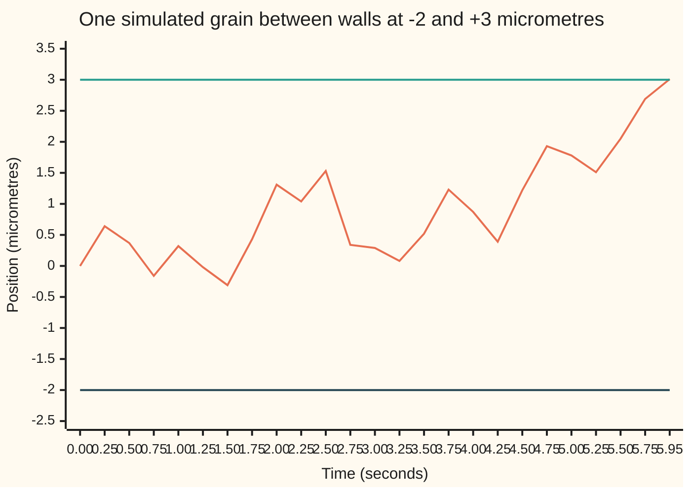

# Brownian martingales: W, W squared minus t, and the exponential martingale

[Syllabus](../../../SYLLABUS.md) → [Stochastic processes and calculus](../../../SYLLABUS.md#w11) → [Brownian Motion](../../../SYLLABUS.md#w11-s05) → Brownian martingales

---

## General Overview

A pollen grain sits in a drop of water under a microscope. Measure its sideways position in micrometres (millionths of a metre) from where it starts, and time in seconds. The field of view runs from 2 micrometres to the left of the start to 3 micrometres to the right. The water's molecules knock the grain about, so it wanders, and sooner or later it leaves the field. Two questions follow. Which edge does it leave by? How long does that take?

The answers are short. It leaves on the right 2 times in 5, a chance of 0.4. It takes 6 seconds on average, which is the product of the two distances, 2 × 3. A third question sounds harder. The software that tracks the grain loses it at random, at a rate of 0.02 per second. What is the chance the grain reaches the right edge before the tracker drops it, if there were no left edge at all? The answer is about 55%, from one exponential: 0.548812.

No path is followed to get these numbers. Each comes from a **martingale**: a quantity whose best forecast of any later value is its value now, a fair game. Brownian motion carries three: the position, the squared position minus the elapsed time, and a clock-corrected exponential of the position. Stopped when the grain leaves, each still averages its starting value. That one equation, written three times, gives the edge, the time and the tracker chance.

**Brownian motion has three fair games built into it, the position, the squared position minus the clock and the clock-corrected exponential of the position, and stopping each at the exit time turns it into a fact about leaving.**

**What kind of fact this is:** three theorems, proved on this card in Why it works from the Gaussian increments alone; the stopping step uses optional stopping in continuous time, proved in a folded callout from the discrete version.

### The picture: one grain, from the start to the edge



The wandering line is one sample path from the code's seeded simulation (seed 20260930), drawn on a time grid of 0.01 seconds and plotted every 0.25 seconds. It is the first simulated grain to leave within half a second of the 6-second average. The flat lines are the right wall at +3 and the left wall at −2. This grain dips left early, drifts right, and crosses +3 at 5.95 seconds, landing at 3.01: a grid can only notice the crossing after it happens.

---

## The formula

Notation first, with one-line reminders. $W_t$ is the grain's position at time $t$, Brownian motion as [Brownian motion](01-brownian-motion.md) built it: it starts at 0, and its move over any later stretch of length $t - s$ is a normal draw with mean 0 and variance $t - s$, independent of the past. The filtration $\mathcal{F}_s$ is what is known by time $s$: the path up to then. A martingale satisfies $E[X_t \mid \mathcal{F}_s] = X_s$ for every $s < t$ ([Martingales](../02-Martingales/01-martingales.md)).

The three martingales:

$$W_t, \qquad W_t^2 - t, \qquad M_t = \exp\!\big(\theta W_t - \tfrac12\theta^2 t\big) \text{ for any fixed number } \theta.$$

**Read it aloud:** the position is fair; the squared position is fair once the clock is taken off; the exponential of θ times the position is fair once the clock times half θ squared is taken off.

The walls sit at $-a$ and $+b$, with $a = 2$ and $b = 3$. The exit time $\tau$ (Greek "tau") is the first time the grain touches either wall. It is a stopping time: at any moment, the path so far shows whether the exit has happened. Stopping each martingale at $\tau$ gives:

$$P(W_\tau = b) = \frac{a}{a+b}, \qquad E[\tau] = ab, \qquad E\big[e^{-\lambda \tau_b}\big] = e^{-b\sqrt{2\lambda}}.$$

**Read it aloud:** the right-exit chance is the left distance over the width; the mean exit time is the product of the distances; the discounted value of reaching level b, with no left wall, is e to the minus b root two lambda.

In the last formula $\tau_b$ is the first time the grain reaches $+b$, with the left wall removed. The number $\lambda$ (Greek "lambda") is a rate per second. Read $E[e^{-\lambda \tau_b}]$ in either of two ways. It is the chance the grain reaches $+b$ before an independent random clock rings, the tracker losing the grain at rate $\lambda$. It is also the price today of 1 dollar paid at the moment of crossing, discounted continuously at rate $\lambda$. The third martingale supplies it with $\theta = \sqrt{2\lambda}$, the value that makes $\tfrac12\theta^2 = \lambda$.

| Symbol | Plain meaning | In our example | Push it up and the answer… |
| --- | --- | --- | --- |
| $W_t$, $W_s$ | the grain's position at time t (or s), in micrometres; Brownian motion | 3.01 at the exit in the picture | — |
| $t$, $s$, $u$, $n$ | times in seconds, with s the earlier one; u a possible value of $\tau_b$ in The other door; n a fixed time that caps a stopping time in Step 4 | — | — |
| $\mathcal{F}_s$ | what is known by time s: the path up to s | — | — |
| $a$, $b$, $c$, $p$ | distance from the start to the left wall, and to the right wall; c = (b − a)/2, the interval's midpoint; p the chance of leaving by the right wall | 2 and 3; c = 0.5; p = 0.4 | a up: right exit likelier, longer wait; b up: right exit less likely, longer wait |
| $\tau$, $\tau_b$ | the exit time, first touch of either wall; and the first time the grain reaches +b with no left wall | 6 seconds on average; $\tau_b$ is finite with probability 1 but has an infinite average | — |
| $\theta$ | the tilt inside the exponential martingale, per micrometre | 0.2 | — |
| $\lambda$ | the tracker-loss rate, or discount rate, per second | 0.02 | the crossing is worth less: 0.548812 falls |
| $M_t$, $M_T$, $X_t$, $X_n$ | the exponential martingale, at time t or a final time T; X is any martingale | M starts at 1 and averages 1 | — |
| $D$, $v$ | the move $W_t - W_s$ after time s: normal, mean 0, variance v = t − s | — | — |
| $\rho$, $\rho_k$ | in the detailed proof: a stopping time no later than n, and it rounded up to a grid of step $2^{-k}$ | — | — |
| $E$, $P$ | average over all paths, and probability | — | — |
| $h$ | the step of the lattice walk in the code, in micrometres; each step takes h^2 seconds | 1 down to 0.0625 | — |

The interval also has its own discounted exit value, from the same martingale used twice. It uses cosh, the hyperbolic cosine: $\cosh x$ is the average of $e^{x}$ and $e^{-x}$.

$$E\big[e^{-\lambda\tau}\big] = \frac{\cosh\big(\theta\,(b-a)/2\big)}{\cosh\big(\theta\,(a+b)/2\big)}, \qquad \theta = \sqrt{2\lambda}.$$

In words: the top uses the start's distance from the interval's midpoint, the bottom uses the half-width. Here it is 0.891257.

### When it holds

- **Independent normal moves with mean 0.** Every proof below uses only that the move after time s is a fresh normal draw with mean 0. A grain pushed by a current (a drift) breaks all three as written: W is no longer fair, and the 0.4, the 6 seconds and the 0.548812 all change.
- **Variance equal to elapsed time.** The clock correction in $W_t^2 - t$ assumes variance 1 per second. With spread $\sigma^2$ per second (σ, "sigma", sets how hard the grain is knocked), the fair game is $W_t^2 - \sigma^2 t$, and the mean exit time becomes $ab/\sigma^2$.
- **A stopping time that is bounded, or a stopped martingale that is bounded.** Inside the interval, stopped W and stopped $M_t$ stay bounded, and $W_t^2 - t$ is handled by monotone convergence, so the averages pass through (Steps 5 to 8). At a single level with no left wall, W stopped at $\tau_b$ has no lower bound, and optional stopping fails: the grain always arrives at +3, so $E[W_{\tau_b}] = 3$, not 0. The exponential survives there because its stopped value never exceeds $e^{\theta b}$.
- **Continuous paths.** The grain lands exactly on the wall at the exit. A path with jumps, or a path watched only on a grid, overshoots, and the 0.4 and 6 seconds become approximations.

---

## Why it works

### Step 0: one fresh normal draw does all the work

From time s on, write $W_t = W_s + D$. The move $D$ is normal, mean 0, variance $t - s$, and independent of $\mathcal{F}_s$. So the average of any function of $W_t$, given the past, is an average over $D$ alone, with $W_s$ held fixed as a known number. Each martingale below is one such average.

### Step 1: the position is fair

$$E[W_t \mid \mathcal{F}_s] = W_s + E[D] = W_s.$$

The average of the known part is itself; the fresh draw averages 0. Each $W_t$ also has a finite average size, at most $\sqrt{t}$, so W is a martingale.

### Step 2: the square grows by the clock, so subtract the clock

$$W_t^2 = W_s^2 + 2W_sD + D^2, \qquad E[W_t^2 \mid \mathcal{F}_s] = W_s^2 + 0 + (t - s).$$

The middle term averages 0 because $W_s$ is known and $D$ averages 0. The last term averages its variance, $t - s$. So the square climbs by exactly the elapsed time, on average. Take the clock off both sides and $E[W_t^2 - t \mid \mathcal{F}_s] = W_s^2 - s$. The same $t$ is the quadratic variation $[W]_t$ of [Quadratic variation](03-quadratic-variation.md): the sum of squared moves along the path, which piles up at rate 1 per second.

### Step 3: the exponential creeps up, so discount the creep

The average of $e^{\theta D}$ for a normal D with variance v is $e^{\theta^2 v/2}$, more than 1. Bending upward ($e^x$ is convex) magnifies up-moves more than it shrinks down-moves.

<details>
<summary>The algebra behind this, if you want it</summary>

With v = t − s, the density of $D$ is $e^{-x^2/(2v)}/\sqrt{2\pi v}$. Then
$$\theta x - \frac{x^2}{2v} = -\frac{(x - \theta v)^2}{2v} + \frac{\theta^2 v}{2}.$$
The first piece, integrated against $1/\sqrt{2\pi v}$, is the area under a bell curve centred at $\theta v$: exactly 1. The second piece is a constant. So $E[e^{\theta D}] = e^{\theta^2 v/2}$.

</details>

Then

$$E\big[e^{\theta W_t} \mid \mathcal{F}_s\big] = e^{\theta W_s}\,E\big[e^{\theta D}\big] = e^{\theta W_s}\,e^{\theta^2 (t-s)/2}.$$

Multiply both sides by $e^{-\theta^2 t/2}$ and $E[M_t \mid \mathcal{F}_s] = M_s$. The correction $-\tfrac12\theta^2 t$ is exactly the creep, priced in advance. The three properties are proved, from Step 0 and nothing else.

### Step 4: stopping a fair game at a bounded time keeps it fair

[Stopping times](../02-Martingales/03-stopping-times-and-optional-stopping.md) proved, for games in whole rounds, that a martingale stopped at a stopping time no later than a fixed round N keeps its starting average. The same holds in continuous time for a continuous martingale and a stopping time no later than a fixed time n: $E[X_{\tau \wedge n}] = E[X_0]$, where $\tau \wedge n$ means whichever of $\tau$ and n comes first. The proof is in the callout.

<details>
<summary>Detailed proof</summary>

Let X be a martingale with continuous paths and $\rho \le n$ a stopping time (here $\rho = \tau \wedge n$). For each k, round $\rho$ up to the grid of step $2^{-k}$: $\rho_k$ is the first grid time strictly after $\rho$, capped at n. Each $\rho_k$ is a stopping time for the grid process $(X_{j2^{-k}})$, since for grid times before n, $\{\rho_k \le j2^{-k}\}$ is $\{\rho < j2^{-k}\}$, known by grid time $j2^{-k}$. It takes finitely many values, all at most n.

1. **Discrete optional stopping on the grid.** The grid process is a martingale in whole steps. By the discrete theorem, $E[X_{\rho_k}] = E[X_0]$. The same theorem, applied to events of the stopped past, gives more: $X_{\rho_k} = E[X_n \mid \mathcal{F}_{\rho_k}]$.
2. **The rounded values are uniformly integrable.** Conditional expectations of one integrable variable $X_n$, over any family of sigma-algebras, are uniformly integrable (wing 10, uniform integrability).
3. **Convergence along paths.** $\rho_k$ decreases to $\rho$, and paths are continuous, so $X_{\rho_k} \to X_\rho$ on every path.
4. **Pass the limit through the average.** Almost-sure convergence plus uniform integrability gives convergence of averages (wing 10, Vitali's theorem). So $E[X_\rho] = \lim E[X_{\rho_k}] = E[X_0]$.

Karatzas and Shreve, chapter 1, give the same argument for right-continuous martingales.

</details>

### Step 5: the exit comes, and its side is 0.4

First, the exit is sure to come. Apply Step 4 to $W^2 - t$ at $\tau \wedge n$: $E[\tau \wedge n] = E[W_{\tau\wedge n}^2]$. Before the exit the grain is within 3 of the start, so the right side is at most 9. Let n grow: $\tau \wedge n$ rises to $\tau$, and monotone convergence (wing 10) gives $E[\tau] \le 9$. A finite average forces $\tau$ to be finite on all but a zero-probability set of paths.

Now apply Step 4 to W: $E[W_{\tau\wedge n}] = 0$. The stopped position stays between −2 and +3, and it converges to $W_\tau$, which is −2 or +3. Bounded convergence passes the limit through: $E[W_\tau] = 0$. Write p for the chance of the right wall:

$$3p - 2(1 - p) = 0, \qquad p = \frac{2}{5} = 0.4.$$

The fair game gives no edge to either wall in average position. The near wall is hit more often (3 times in 5) because a hit there is worth less distance.

### Step 6: the mean exit time is a times b

Return to $E[\tau \wedge n] = E[W_{\tau\wedge n}^2]$ and let n grow. The left side rises to $E[\tau]$ (monotone convergence); the right side is bounded by 9 and converges (bounded convergence). So

$$E[\tau] = E[W_\tau^2] = 0.4 \times 9 + 0.6 \times 4 = 6 \text{ seconds}.$$

In general $\tfrac{a}{a+b}b^2 + \tfrac{b}{a+b}a^2 = ab$. The fair square converts a question about time into a question about where the grain ends.

### Step 7: the exponential prices the crossing of one level

Take away the left wall. First, $\tau_b$ is finite. Reaching +3 before a wall at −a is one way of reaching +3, so the chance of ever reaching +3 is at least $a/(a+3)$ for every a, and therefore 1.

Choose $\theta = \sqrt{2\lambda} = 0.2$, so $M_t = e^{0.2W_t - 0.02t}$. Stopped at $\tau_b \wedge t$, it lies between 0 and $e^{0.2 \times 3}$: the position never passes 3 and the clock term only shrinks it. Step 4 gives $E[M_{\tau_b \wedge t}] = 1$. As t grows, each path's value tends to $e^{0.6 - 0.02\tau_b}$. Bounded convergence:

$$e^{0.6}\,E\big[e^{-0.02\,\tau_b}\big] = 1, \qquad E\big[e^{-0.02\,\tau_b}\big] = e^{-0.6} = 0.548812.$$

So the grain reaches +3 while still tracked about 55% of the time: a random clock at rate λ, independent of the grain, outlasts a time u with chance $e^{-\lambda u}$, and averaging that over $\tau_b$ is the left side.

### Step 8: both walls at once, and the mean time hidden inside

Average $M_t$ with $\theta$ and with $-\theta$, each shifted by the midpoint $c = (b - a)/2 = 0.5$:

$$e^{-\lambda t}\cosh\big(\theta(W_t - c)\big) = \tfrac12 e^{-\theta c} M^{(\theta)}_t + \tfrac12 e^{\theta c} M^{(-\theta)}_t,$$

where $M^{(\pm\theta)}$ is $M_t$ with $\pm\theta$ in place of θ. A sum of martingales is a martingale. At the exit, $W_\tau - c$ is +2.5 or −2.5, and cosh takes the same value at both. Bounded stopping as before:

$$E[e^{-\lambda\tau}]\cosh(2.5\theta) = \cosh(-0.5\theta), \qquad E[e^{-0.02\tau}] = \frac{\cosh 0.1}{\cosh 0.5} = 0.891257.$$

For small λ this is about $1 - \lambda E[\tau]$, so $(1 - E[e^{-\lambda\tau}])/\lambda$ tends to the mean exit time. At λ = 1e-6 the code prints 6.0000. The exponential martingale contains the square one.

### The other door

The reflection principle of [Reflection principle](04-reflection-principle-and-running-maximum.md) gives the law of $\tau_b$ directly, as the density $b\,e^{-b^2/(2u)}/\sqrt{2\pi u^3}$ at time u. Averaging $e^{-\lambda u}$ against it is an integral, with no martingale in sight. The code does it by Simpson's rule and lands on 0.548812 again.

---

## Worked numbers, by hand

Walls at −2 and +3 micrometres, tracker-loss rate λ = 0.02 per second.

| Step | Arithmetic | Value |
| --- | --- | --- |
| right-wall chance, from $E[W_\tau] = 0$ | $3p - 2(1-p) = 0$, so $p = 2/5$ | 0.4 |
| left-wall chance | 1 − 0.4 | 0.6 |
| mean exit time, from $E[W_\tau^2 - \tau] = 0$ | 0.4 × 9 + 0.6 × 4 | 6 seconds |
| tilt for the tracker | $\theta = \sqrt{2 \times 0.02}$ | 0.2 |
| chance of reaching +3 before the tracker drops it | $e^{-3 \times 0.2} = e^{-0.6}$ | 0.548812 |
| interval: midpoint offset and half-width, times θ | 0.2 × 0.5 and 0.2 × 2.5 | 0.1 and 0.5 |
| cosh of each | cosh 0.1 and cosh 0.5 | 1.005004 and 1.127626 |
| **discounted exit value of the interval** | 1.005004 / 1.127626 | **0.891257** |

The grain leaves on the right 2 times in 5, after 6 seconds on average. With the left wall gone, it reaches +3 before the tracker loses it about 55% of the time.

### What breaks if you drop a piece

| Mistake | Comes out at | What went wrong |
| --- | --- | --- |
| Treat $W_t^2$ as fair, as the ordinary chain rule suggests | $E[W_\tau^2] = 0$; the true value is 6.000000 | the square of a wandering point climbs by the clock; the missing −t is the dt term ordinary calculus drops |
| Drop the ½: take $\theta = \sqrt{\lambda}$ | 0.654251 instead of 0.548812 | $M_t$ is fair only when the clock term is exactly half θ squared |
| Optional stopping for W at one level, no left wall | $E[W_{\tau_b}] = 0$ claimed; it is 3 with probability 1. $E[\tau_b] = 9$ claimed; averaging $\tau_b$ over paths that arrive by 100, 10,000 and 1,000,000 seconds (the rest counted as 0) gives 16.01, 230.47, 2384.66, still growing | W stopped at $\tau_b$ has no lower bound, so the limit cannot pass through the average. The mean time is infinite even though every path arrives |
| Swap the sides: right chance b/(a+b) | 0.600000 instead of 0.4 | the far wall is the less likely one, not the more likely |

These partial means track $3\sqrt{2T/\pi} - 9$ for a cut at T seconds: 14.94, 230.37, 2384.65. Pushing the left wall out to −20, −200 and −2000 shows the same thing: mean exit times of 60, 600 and 6000 seconds, while the chance of reaching +3 first climbs to 0.869565, 0.985222, 0.998502. Arrival becomes certain; the wait becomes unbounded.

---

## Code, from first principles, and it actually runs

The code takes four roads. Road 1 is the formulas. Road 2 is a lattice walk, steps of h micrometres every h^2 seconds, whose first-step equations for the side, the time and the discount are solved exactly by the tridiagonal (Thomas) algorithm at five step sizes; the single level gets a far absorbing wall at −100, too far to change the printed digits. Road 3 is Simpson's rule on the reflection-principle density. Road 4 is a seeded simulation of 10,000 grains on time grids of 0.04 and 0.01 seconds, with SplitMix64 random numbers and Box-Muller normals written out. Both grids use the same random numbers, so their difference is the grid, not the luck.

The simulation checks the three martingale identities at the grid exit time, where they hold exactly whatever the step; its exit chance, mean time and discount carry a small grid bias, printed as it shrinks.

### Python

```python
# Brownian martingales -- the check behind the card.  Standard library only.
# A pollen grain starts at 0 between walls at -2 and +3 micrometres.  Time is in
# seconds and W_t has variance t (square micrometres).  Roads: the formulas; exact
# first-step equations on a lattice walk at shrinking steps; Simpson's rule on the
# reflection-principle density; a seeded simulation (SplitMix64 + Box-Muller).
from math import sqrt, exp, log, cos, sin, cosh, pi

A, B, LAM = 2.0, 3.0, 0.02            # left wall at -A, right wall at +B, tracker-loss rate per second
TH = sqrt(2.0 * LAM)                  # theta, chosen so that theta^2 / 2 = lambda
MID, HALF = (B - A) / 2.0, (A + B) / 2.0

def lap(lam):                         # E[exp(-lam tau)] for the interval, from cosh(theta (W - MID))
    th = sqrt(2.0 * lam)
    return cosh(th * MID) / cosh(th * HALF)

# ---- road 1: the formulas ----
p_right, mean_exit = A / (A + B), A * B
lap_int, level = lap(LAM), exp(-B * TH)

# ---- road 2: a lattice walk, steps of h every h*h seconds, first-step equations solved exactly ----
def tridiag(K, c, r, left, right):
    # -(c/2) v[k-1] + v[k] - (c/2) v[k+1] = r for k = 1..K-1, v[0] = left, v[K] = right (Thomas)
    n, s = K - 1, -c / 2.0
    cp, dp = [0.0] * n, [0.0] * n
    for i in range(n):
        d = r - (s * left if i == 0 else 0.0) - (s * right if i == n - 1 else 0.0)
        den = 1.0 - (s * cp[i - 1] if i else 0.0)
        cp[i] = s / den
        dp[i] = (d - (s * dp[i - 1] if i else 0.0)) / den
    v = [0.0] * n
    v[-1] = dp[-1]
    for i in range(n - 2, -1, -1):
        v[i] = dp[i] - cp[i] * v[i + 1]
    return [left] + v + [right]

def lattice(h):
    K, k0, q = round((A + B) / h), round(A / h), exp(-LAM * h * h)
    side = tridiag(K, 1.0, 0.0, 0.0, 1.0)[k0]           # chance of leaving at +3
    time = tridiag(K, 1.0, h * h, 0.0, 0.0)[k0]         # mean seconds to leave
    disc = tridiag(K, q, 0.0, 1.0, 1.0)[k0]             # mean discount exp(-lam tau)
    K1 = round((100.0 + B) / h)                         # one level at +3, far wall at -100
    one = tridiag(K1, q, 0.0, 0.0, 1.0)[round(100.0 / h)]
    return side, time, disc, one

# ---- road 3: Simpson's rule on the first-passage density b / sqrt(2 pi t^3) exp(-b^2 / 2t) ----
def simpson(f, lo, hi, n=4000):
    w = (hi - lo) / n
    return (f(lo) + f(hi) + sum((4 if i % 2 else 2) * f(lo + i * w) for i in range(1, n))) * w / 3.0

def dens_u(u, power):                 # t = e^u; returns t^power * density(t) * dt/du
    t = exp(u)
    return t ** power * B / sqrt(2.0 * pi * t ** 3) * exp(-B * B / (2.0 * t)) * t

quad_level = simpson(lambda u: exp(-LAM * exp(u)) * dens_u(u, 0), -6.0, log(3000.0))
partial = [(T, simpson(lambda u: dens_u(u, 1), -6.0, log(T))) for T in (1e2, 1e4, 1e6)]

# ---- road 4: seeded simulation on a time grid ----
def normals(seed):
    s, M = seed, (1 << 64) - 1
    def u():
        nonlocal s
        s = (s + 0x9E3779B97F4A7C15) & M
        z = ((s ^ (s >> 30)) * 0xBF58476D1CE4E5B9) & M
        z = ((z ^ (z >> 27)) * 0x94D049BB133111EB) & M
        return ((z ^ (z >> 31)) >> 11) * 2.0 ** -53
    while True:
        r, a = sqrt(-2.0 * log(1.0 - u())), 2.0 * pi * u()
        yield r * cos(a)
        yield r * sin(a)

def simulate(dt, paths, seed):
    nx, sd, every = normals(seed).__next__, sqrt(dt), round(0.25 / dt)
    S, Q, pic = [0.0] * 6, [0.0] * 6, None
    for _ in range(paths):
        x, n, trace = 0.0, 0, [0.0]
        while -A < x < B:
            x += sd * nx()
            n += 1
            if n % every == 0: trace.append(x)
        tau = n * dt
        vals = (1.0 if x >= B else 0.0, tau, x, x * x - tau, exp(TH * x - LAM * tau), exp(-LAM * tau))
        for i, v in enumerate(vals):
            S[i] += v
            Q[i] += v * v
        if pic is None and abs(tau - 6.0) <= 0.5: pic = (trace + ([x] if n % every else []), tau)
    m = [s / paths for s in S]
    return m, [sqrt((q / paths - mi * mi) / paths) for q, mi in zip(Q, m)], pic

print(f"walls -{A:.0f} and +{B:.0f} um, lambda {LAM} per s, theta {TH:.4f}")
print(f"formula   P(leave at +3) {p_right:.6f}   E[tau] {mean_exit:.6f}   E[e^-lam tau] {lap_int:.6f}   level price {level:.6f}")
print(f"by hand   theta*{MID} = {TH * MID:.1f}, cosh {cosh(TH * MID):.6f}   theta*{HALF} = {TH * HALF:.1f}, cosh {cosh(TH * HALF):.6f}")
print("lattice   h      P(+3)      E[tau]   E[e^-lam tau]       error  level price       error")
lat = []
for h in (1.0, 0.5, 0.25, 0.125, 0.0625):
    lat.append(lattice(h))
    s1, t1, d1, o1 = lat[-1]
    print(f"lattice {h:6.4f} {s1:10.6f} {t1:10.6f} {d1:12.6f} {d1 - lap_int:+11.7f} {o1:12.6f} {o1 - level:+11.7f}")
print(f"Simpson on the first-passage density: level price {quad_level:.6f}")
for T, m in partial:
    print(f"mean of tau_3 cut at {T:9.0f} s: {m:10.2f}   3 sqrt(2T/pi) - 9 = {B * sqrt(2 * T / pi) - B * B:10.2f}")
print(f"(1 - E[e^-lam tau]) / lam at lam = 1e-6: {(1 - lap(1e-6)) / 1e-6:.4f}")
print(f"wrong theta = sqrt(lam), no 1/2: level price {exp(-B * sqrt(LAM)):.6f}")
print(f"wrong side b/(a+b): {B / (A + B):.6f}")
print(f"E[W_tau^2] = 0.4*9 + 0.6*4 = {p_right * B * B + (1 - p_right) * A * A:.6f}")
for a in (2.0, 20.0, 200.0, 2000.0):
    print(f"left wall at -{a:.0f}: E[tau] = {a * B:.0f} s, P(+3 first) = {a / (a + B):.6f}")
labels = ("P(leave at +3)", "E[tau]", "E[W_tau]", "E[W_tau^2 - tau]", "E[exp(th W - lam tau)]", "E[e^-lam tau]")
for dt, paths in ((0.04, 10000), (0.01, 10000)):
    m, se, pic = simulate(dt, paths, 20260930)
    print(f"simulation dt {dt} s, {paths} paths, seed 20260930")
    for lab, mi, si in zip(labels, m, se):
        print(f"  {lab:<24} {mi:10.4f}  se {si:.4f}")
    assert abs(m[2]) < 4 * se[2], "W is fair at the grid exit time"
    assert abs(m[3]) < 4 * se[3], "W^2 - t is fair at the grid exit time"
    assert abs(m[4] - 1.0) < 4 * se[4], "exponential martingale averages 1 at the grid exit time"
trace, tau = pic                      # first dt = 0.01 path leaving within 0.5 s of 6 s
print("figure, t " + " ".join(f"{min(0.25 * i, tau):.2f}" for i in range(len(trace))))
print("figure, W " + " ".join(f"{w:.2f}" for w in trace))

s5, t5, d5, o5 = lat[-1]
assert abs(s5 - p_right) < 1e-9, "lattice side vs a/(a+b)"
assert abs(t5 - mean_exit) < 1e-9, "lattice time vs ab"
assert abs(d5 - lap_int) < 1e-5, "lattice discount vs cosh formula"
assert abs(lat[0][2] - lap_int) > 100 * abs(d5 - lap_int), "lattice error shrinks like h^2"
assert abs(o5 - level) < 1e-5, "lattice one-level price vs exp(-b sqrt(2 lam))"
assert abs(quad_level - level) < 1e-6, "reflection density vs exponential martingale"
assert abs(partial[-1][1] - (B * sqrt(2 * 1e6 / pi) - B * B)) < 0.1, "partial means grow like sqrt(T)"
print("ALL CHECKS PASS")
```

**Ran 2026-09-30 on macOS, Python 3.14.6, standard library only. All checks passed. Output, pasted from the run:**

```
walls -2 and +3 um, lambda 0.02 per s, theta 0.2000
formula   P(leave at +3) 0.400000   E[tau] 6.000000   E[e^-lam tau] 0.891257   level price 0.548812
by hand   theta*0.5 = 0.1, cosh 1.005004   theta*2.5 = 0.5, cosh 1.127626
lattice   h      P(+3)      E[tau]   E[e^-lam tau]       error  level price       error
lattice 1.0000   0.400000   6.000000     0.890599  -0.0006582     0.547714  -0.0010976
lattice 0.5000   0.400000   6.000000     0.891092  -0.0001643     0.548537  -0.0002744
lattice 0.2500   0.400000   6.000000     0.891216  -0.0000411     0.548743  -0.0000686
lattice 0.1250   0.400000   6.000000     0.891246  -0.0000103     0.548794  -0.0000172
lattice 0.0625   0.400000   6.000000     0.891254  -0.0000026     0.548807  -0.0000043
Simpson on the first-passage density: level price 0.548812
mean of tau_3 cut at       100 s:      16.01   3 sqrt(2T/pi) - 9 =      14.94
mean of tau_3 cut at     10000 s:     230.47   3 sqrt(2T/pi) - 9 =     230.37
mean of tau_3 cut at   1000000 s:    2384.66   3 sqrt(2T/pi) - 9 =    2384.65
(1 - E[e^-lam tau]) / lam at lam = 1e-6: 6.0000
wrong theta = sqrt(lam), no 1/2: level price 0.654251
wrong side b/(a+b): 0.600000
E[W_tau^2] = 0.4*9 + 0.6*4 = 6.000000
left wall at -2: E[tau] = 6 s, P(+3 first) = 0.400000
left wall at -20: E[tau] = 60 s, P(+3 first) = 0.869565
left wall at -200: E[tau] = 600 s, P(+3 first) = 0.985222
left wall at -2000: E[tau] = 6000 s, P(+3 first) = 0.998502
simulation dt 0.04 s, 10000 paths, seed 20260930
  P(leave at +3)               0.4025  se 0.0049
  E[tau]                       6.5503  se 0.0553
  E[W_tau]                    -0.0106  se 0.0257
  E[W_tau^2 - tau]             0.0523  se 0.0578
  E[exp(th W - lam tau)]       0.9995  se 0.0052
  E[e^-lam tau]                0.8822  se 0.0009
simulation dt 0.01 s, 10000 paths, seed 20260930
  P(leave at +3)               0.4028  se 0.0049
  E[tau]                       6.2954  se 0.0531
  E[W_tau]                     0.0034  se 0.0251
  E[W_tau^2 - tau]             0.0094  se 0.0551
  E[exp(th W - lam tau)]       1.0008  se 0.0051
  E[e^-lam tau]                0.8864  se 0.0009
figure, t 0.00 0.25 0.50 0.75 1.00 1.25 1.50 1.75 2.00 2.25 2.50 2.75 3.00 3.25 3.50 3.75 4.00 4.25 4.50 4.75 5.00 5.25 5.50 5.75 5.95
figure, W 0.00 0.64 0.37 -0.16 0.32 -0.02 -0.31 0.43 1.31 1.04 1.53 0.34 0.29 0.08 0.52 1.23 0.87 0.39 1.22 1.93 1.78 1.51 2.05 2.69 3.01
ALL CHECKS PASS
```

Reading the run. The lattice gets 0.4 and 6 seconds exactly at every step. Its discount errors shrink fourfold each time h halves: −0.0006582 to −0.0000026 for the interval, −0.0010976 to −0.0000043 for the single level. Simpson's rule lands on 0.548812. On the 0.01-second grid the three identities pass: $E[W_\tau] = 0.0034$ (standard error 0.0251), $E[W_\tau^2 - \tau] = 0.0094$ (0.0551), and the exponential averages 1.0008 (0.0051). The mean exit time is 6.5503 on the coarse grid and 6.2954 on the fine one, closing on 6: a grid notices the exit late. The same overshoot lowers the discount (0.8822 and 0.8864 against 0.891257). The identities use the grid's own exit, so they stay exact.

### Rust

Same roads, same seed, same labels. No crates.

```rust
// Brownian martingales -- the same check as brownian_martingales_and_exponential_martingale_check.py.
// Std only, no crates.  Walls at -2 and +3 micrometres, time in seconds, W_t has variance t.
// Roads: formulas; exact first-step equations on a lattice walk; Simpson on the
// reflection-principle density; a seeded simulation (SplitMix64 + Box-Muller).
use std::f64::consts::PI;

const A: f64 = 2.0;
const B: f64 = 3.0;
const LAM: f64 = 0.02;

fn lap(lam: f64) -> f64 {
    let th = (2.0 * lam).sqrt();
    (th * (B - A) / 2.0).cosh() / (th * (A + B) / 2.0).cosh()
}

// -(c/2) v[k-1] + v[k] - (c/2) v[k+1] = r for k = 1..K-1, v[0] = left, v[K] = right (Thomas)
fn tridiag(kk: usize, c: f64, r: f64, left: f64, right: f64) -> Vec<f64> {
    let (n, s) = (kk - 1, -c / 2.0);
    let (mut cp, mut dp) = (vec![0.0; n], vec![0.0; n]);
    for i in 0..n {
        let d = r - if i == 0 { s * left } else { 0.0 } - if i == n - 1 { s * right } else { 0.0 };
        let den = 1.0 - if i > 0 { s * cp[i - 1] } else { 0.0 };
        cp[i] = s / den;
        dp[i] = (d - if i > 0 { s * dp[i - 1] } else { 0.0 }) / den;
    }
    let mut v = vec![0.0; n];
    v[n - 1] = dp[n - 1];
    for i in (0..n - 1).rev() { v[i] = dp[i] - cp[i] * v[i + 1]; }
    let mut out = vec![left];
    out.extend(v);
    out.push(right);
    out
}

fn lattice(h: f64) -> (f64, f64, f64, f64) {
    let (kk, k0, q) = (((A + B) / h).round() as usize, (A / h).round() as usize, (-LAM * h * h).exp());
    let side = tridiag(kk, 1.0, 0.0, 0.0, 1.0)[k0];
    let time = tridiag(kk, 1.0, h * h, 0.0, 0.0)[k0];
    let disc = tridiag(kk, q, 0.0, 1.0, 1.0)[k0];
    let k1 = ((100.0 + B) / h).round() as usize;
    let one = tridiag(k1, q, 0.0, 0.0, 1.0)[(100.0 / h).round() as usize];
    (side, time, disc, one)
}

fn simpson<F: Fn(f64) -> f64>(f: F, lo: f64, hi: f64, n: usize) -> f64 {
    let w = (hi - lo) / n as f64;
    let mut s = 0.0;
    for i in 1..n { s += if i % 2 == 1 { 4.0 } else { 2.0 } * f(lo + i as f64 * w); }
    (f(lo) + f(hi) + s) * w / 3.0
}

fn dens_u(u: f64, power: i32) -> f64 {   // t = e^u; t^power * density(t) * dt/du
    let t = u.exp();
    t.powi(power) * B / (2.0 * PI * t.powi(3)).sqrt() * (-B * B / (2.0 * t)).exp() * t
}

struct Rng { s: u64, spare: Option<f64> }
impl Rng {
    fn u(&mut self) -> f64 {
        self.s = self.s.wrapping_add(0x9E3779B97F4A7C15);
        let mut z = (self.s ^ (self.s >> 30)).wrapping_mul(0xBF58476D1CE4E5B9);
        z = (z ^ (z >> 27)).wrapping_mul(0x94D049BB133111EB);
        ((z ^ (z >> 31)) >> 11) as f64 * 2f64.powi(-53)
    }
    fn normal(&mut self) -> f64 {
        if let Some(z) = self.spare.take() { return z; }
        let r = (-2.0 * (1.0 - self.u()).ln()).sqrt();
        let a = 2.0 * PI * self.u();
        self.spare = Some(r * a.sin());
        r * a.cos()
    }
}

fn simulate(dt: f64, paths: usize, seed: u64, th: f64) -> (Vec<f64>, Vec<f64>, Option<(Vec<f64>, f64)>) {
    let mut g = Rng { s: seed, spare: None };
    let (sd, every) = (dt.sqrt(), (0.25 / dt).round() as u64);
    let (mut s, mut q, mut pic) = (vec![0.0; 6], vec![0.0; 6], None);
    for _ in 0..paths {
        let (mut x, mut n, mut trace) = (0.0_f64, 0u64, vec![0.0]);
        while -A < x && x < B {
            x += sd * g.normal();
            n += 1;
            if n % every == 0 { trace.push(x); }
        }
        let tau = n as f64 * dt;
        let vals = [if x >= B { 1.0 } else { 0.0 }, tau, x, x * x - tau, (th * x - LAM * tau).exp(), (-LAM * tau).exp()];
        for i in 0..6 { s[i] += vals[i]; q[i] += vals[i] * vals[i]; }
        if pic.is_none() && (tau - 6.0).abs() <= 0.5 {
            if n % every != 0 { trace.push(x); }
            pic = Some((trace, tau));
        }
    }
    let m: Vec<f64> = s.iter().map(|v| v / paths as f64).collect();
    let se = (0..6).map(|i| ((q[i] / paths as f64 - m[i] * m[i]) / paths as f64).sqrt()).collect();
    (m, se, pic)
}

fn main() {
    let th = (2.0 * LAM).sqrt();
    let (p_right, mean_exit, lap_int, level) = (A / (A + B), A * B, lap(LAM), (-B * th).exp());
    let quad_level = simpson(|u| (-LAM * u.exp()).exp() * dens_u(u, 0), -6.0, 3000f64.ln(), 4000);
    let partial: Vec<(f64, f64)> = [1e2_f64, 1e4, 1e6].iter().map(|&t| (t, simpson(|u| dens_u(u, 1), -6.0, t.ln(), 4000))).collect();

    println!("walls -{:.0} and +{:.0} um, lambda {} per s, theta {:.4}", A, B, LAM, th);
    println!("formula   P(leave at +3) {:.6}   E[tau] {:.6}   E[e^-lam tau] {:.6}   level price {:.6}", p_right, mean_exit, lap_int, level);
    let (mid, half) = ((B - A) / 2.0, (A + B) / 2.0);
    println!("by hand   theta*{} = {:.1}, cosh {:.6}   theta*{} = {:.1}, cosh {:.6}", mid, th * mid, (th * mid).cosh(), half, th * half, (th * half).cosh());
    println!("lattice   h      P(+3)      E[tau]   E[e^-lam tau]       error  level price       error");
    let mut lat = vec![];
    for h in [1.0, 0.5, 0.25, 0.125, 0.0625] {
        let (s1, t1, d1, o1) = lattice(h);
        lat.push((s1, t1, d1, o1));
        println!("lattice {:6.4} {:10.6} {:10.6} {:12.6} {:+11.7} {:12.6} {:+11.7}", h, s1, t1, d1, d1 - lap_int, o1, o1 - level);
    }
    println!("Simpson on the first-passage density: level price {:.6}", quad_level);
    for (t, m) in &partial {
        println!("mean of tau_3 cut at {:9.0} s: {:10.2}   3 sqrt(2T/pi) - 9 = {:10.2}", t, m, B * (2.0 * t / PI).sqrt() - B * B);
    }
    println!("(1 - E[e^-lam tau]) / lam at lam = 1e-6: {:.4}", (1.0 - lap(1e-6)) / 1e-6);
    println!("wrong theta = sqrt(lam), no 1/2: level price {:.6}", (-B * LAM.sqrt()).exp());
    println!("wrong side b/(a+b): {:.6}", B / (A + B));
    println!("E[W_tau^2] = 0.4*9 + 0.6*4 = {:.6}", p_right * B * B + (1.0 - p_right) * A * A);
    for a in [2.0, 20.0, 200.0, 2000.0] {
        println!("left wall at -{:.0}: E[tau] = {:.0} s, P(+3 first) = {:.6}", a, a * B, a / (a + B));
    }
    let labels = ["P(leave at +3)", "E[tau]", "E[W_tau]", "E[W_tau^2 - tau]", "E[exp(th W - lam tau)]", "E[e^-lam tau]"];
    let mut pic = None;
    for (dt, paths) in [(0.04, 10000usize), (0.01, 10000)] {
        let (m, se, p) = simulate(dt, paths, 20260930, th);
        pic = p;
        println!("simulation dt {} s, {} paths, seed 20260930", dt, paths);
        for i in 0..6 { println!("  {:<24} {:10.4}  se {:.4}", labels[i], m[i], se[i]); }
        assert!(m[2].abs() < 4.0 * se[2], "W is fair at the grid exit time");
        assert!(m[3].abs() < 4.0 * se[3], "W^2 - t is fair at the grid exit time");
        assert!((m[4] - 1.0).abs() < 4.0 * se[4], "exponential martingale averages 1 at the grid exit time");
    }
    let (trace, tau) = pic.expect("a path near 6 s");   // first dt = 0.01 path leaving within 0.5 s of 6 s
    let ts: Vec<String> = (0..trace.len()).map(|i| format!("{:.2}", (0.25 * i as f64).min(tau))).collect();
    let ws: Vec<String> = trace.iter().map(|w| format!("{:.2}", w)).collect();
    println!("figure, t {}", ts.join(" "));
    println!("figure, W {}", ws.join(" "));

    let (s5, t5, d5, o5) = lat[4];
    assert!((s5 - p_right).abs() < 1e-9, "lattice side vs a/(a+b)");
    assert!((t5 - mean_exit).abs() < 1e-9, "lattice time vs ab");
    assert!((d5 - lap_int).abs() < 1e-5, "lattice discount vs cosh formula");
    assert!((lat[0].2 - lap_int).abs() > 100.0 * (d5 - lap_int).abs(), "lattice error shrinks like h^2");
    assert!((o5 - level).abs() < 1e-5, "lattice one-level price vs exp(-b sqrt(2 lam))");
    assert!((quad_level - level).abs() < 1e-6, "reflection density vs exponential martingale");
    assert!((partial[2].1 - (B * (2.0 * 1e6 / PI).sqrt() - B * B)).abs() < 0.1, "partial means grow like sqrt(T)");
    println!("ALL CHECKS PASS");
}
```

**Ran 2026-09-30 on macOS, rustc 1.98.1, no crates. All checks passed. Output, pasted from the run:**

```
walls -2 and +3 um, lambda 0.02 per s, theta 0.2000
formula   P(leave at +3) 0.400000   E[tau] 6.000000   E[e^-lam tau] 0.891257   level price 0.548812
by hand   theta*0.5 = 0.1, cosh 1.005004   theta*2.5 = 0.5, cosh 1.127626
lattice   h      P(+3)      E[tau]   E[e^-lam tau]       error  level price       error
lattice 1.0000   0.400000   6.000000     0.890599  -0.0006582     0.547714  -0.0010976
lattice 0.5000   0.400000   6.000000     0.891092  -0.0001643     0.548537  -0.0002744
lattice 0.2500   0.400000   6.000000     0.891216  -0.0000411     0.548743  -0.0000686
lattice 0.1250   0.400000   6.000000     0.891246  -0.0000103     0.548794  -0.0000172
lattice 0.0625   0.400000   6.000000     0.891254  -0.0000026     0.548807  -0.0000043
Simpson on the first-passage density: level price 0.548812
mean of tau_3 cut at       100 s:      16.01   3 sqrt(2T/pi) - 9 =      14.94
mean of tau_3 cut at     10000 s:     230.47   3 sqrt(2T/pi) - 9 =     230.37
mean of tau_3 cut at   1000000 s:    2384.66   3 sqrt(2T/pi) - 9 =    2384.65
(1 - E[e^-lam tau]) / lam at lam = 1e-6: 6.0000
wrong theta = sqrt(lam), no 1/2: level price 0.654251
wrong side b/(a+b): 0.600000
E[W_tau^2] = 0.4*9 + 0.6*4 = 6.000000
left wall at -2: E[tau] = 6 s, P(+3 first) = 0.400000
left wall at -20: E[tau] = 60 s, P(+3 first) = 0.869565
left wall at -200: E[tau] = 600 s, P(+3 first) = 0.985222
left wall at -2000: E[tau] = 6000 s, P(+3 first) = 0.998502
simulation dt 0.04 s, 10000 paths, seed 20260930
  P(leave at +3)               0.4025  se 0.0049
  E[tau]                       6.5503  se 0.0553
  E[W_tau]                    -0.0106  se 0.0257
  E[W_tau^2 - tau]             0.0523  se 0.0578
  E[exp(th W - lam tau)]       0.9995  se 0.0052
  E[e^-lam tau]                0.8822  se 0.0009
simulation dt 0.01 s, 10000 paths, seed 20260930
  P(leave at +3)               0.4028  se 0.0049
  E[tau]                       6.2954  se 0.0531
  E[W_tau]                     0.0034  se 0.0251
  E[W_tau^2 - tau]             0.0094  se 0.0551
  E[exp(th W - lam tau)]       1.0008  se 0.0051
  E[e^-lam tau]                0.8864  se 0.0009
figure, t 0.00 0.25 0.50 0.75 1.00 1.25 1.50 1.75 2.00 2.25 2.50 2.75 3.00 3.25 3.50 3.75 4.00 4.25 4.50 4.75 5.00 5.25 5.50 5.75 5.95
figure, W 0.00 0.64 0.37 -0.16 0.32 -0.02 -0.31 0.43 1.31 1.04 1.53 0.34 0.29 0.08 0.52 1.23 0.87 0.39 1.22 1.93 1.78 1.51 2.05 2.69 3.01
ALL CHECKS PASS
```

The two outputs agree line for line, simulation included: the same generator, the same Box-Muller order and the same sums.

> [!TIP]
> **Try changing**
> Guess first, then run it.
> - **Move the left wall to −20.** Guess the mean exit time and the right-wall chance. The answer: 60 seconds and 0.869565. The mean time is still a times b.
> - **Forget the ½ in θ.** Set the tilt to $\sqrt{\lambda}$. The tracker chance comes out at 0.654251 instead of 0.548812.
> - **Coarsen the grid.** Compare the two simulation blocks. At 0.04 seconds the mean exit time is 6.5503; at 0.01 it is 6.2954. Quartering the step roughly halves the overshoot, as a bias proportional to the square root of the step would.
> - **Shrink λ toward 0.** At λ = 1e-6, $(1 - E[e^{-\lambda\tau}])/\lambda$ prints 6.0000: the discount's slope at zero is the mean exit time.

---

## The usual mistake

> [!warning]
> **Applying optional stopping to an unbounded wait.** Stop W when it first reaches +3, with no left wall, and its stopped value is 3 with probability 1: average 3, not 0. The stopping time has no bound and the stopped process has no floor, so Step 4 does not apply. The same slip "proves" a mean wait of 9 seconds; the true mean is infinite. The exponential martingale is safe at the same time only because its stopped value stays below $e^{\theta b}$.
>
> Smaller traps:
> - **Ordinary calculus on $W_t^2$.** The chain rule says the square's change is 2W times W's change, which averages 0. It misses the variance term: the square climbs by the clock, and the fair game is $W_t^2 - t$.
> - **The exponential without its correction.** $e^{\theta W_t}$ alone averages $e^{\theta^2 t/2}$, so it is not fair. A fair game exponentiated is not a fair game.
> - **"Fair" read as "cannot win".** The grain reaches the right wall 40% of the time and a single level 100% of the time. Fair means the average stopped position is the start, nothing more.
> - **Trusting a grid's exit time.** Monitored every 0.01 seconds, the simulated mean exit is 6.2954, not 6. The grid is late, by an amount that shrinks with the square root of the step.

---

## Where you meet it in real life

- **Particle tracking in microscopes.** The mean time to leave a region, a × b divided by the spread per second, can be turned round to estimate how fast particles diffuse from how long they stay in a field of view.
- **Barrier and one-touch options.** The value $e^{-b\sqrt{2\lambda}}$ is the core of a contract paying 1 dollar when a price first touches a level; with drift and volatility added it becomes the closed-form one-touch price.
- **Sequential testing.** Wald's test stops sampling when evidence crosses an upper or lower boundary; its error rates and expected sample size come from the same two identities, side and time, applied to a random walk.
- **Discrete monitoring.** Barrier contracts checked once a day overshoot like the simulation's grid; Broadie, Glasserman and Kou correct for it by shifting the barrier by a multiple of the step's square root.
- **Gambler's ruin.** The coin-flip version, with chance a/(a+b) and mean duration a × b rounds, is the lattice road of this card at step 1: [Gambler's ruin](../01-Random%20Walks%20and%20Filtrations/04-gamblers-ruin.md).

> **Say it back**
> A Brownian grain's next move is a fresh normal draw with mean 0 and variance equal to the elapsed time. From that alone, three processes are fair: the position, the squared position minus the clock, and the exponential of θ times the position minus half θ squared times the clock. Stopping each at the exit from an interval gives the side (left distance over width, 0.4), the mean time (the product of the distances, 6 seconds) and the discounted exit value. With one level and no floor, the position stops being usable, but the bounded exponential still prices the crossing at $e^{-b\sqrt{2\lambda}}$, 0.548812 here.

---

## What this builds on

- [Brownian motion](01-brownian-motion.md): the process itself, and the one fact used on every line: independent normal moves with variance equal to elapsed time.
- [Martingales](../02-Martingales/01-martingales.md): what a fair game is, conditional on the past, and why its average never moves.
- [Stopping times](../02-Martingales/03-stopping-times-and-optional-stopping.md): optional stopping in whole rounds, which Step 4 carries over to continuous time.

## Where this goes next

- [Changing the measure](../07-Changing%20Measure/01-change-of-measure-and-density-processes.md): $M_T$ is positive with average 1, so it can reweight every path; under the new weights the grain acquires a drift of θ per second.
- [Geometric Brownian motion](07-geometric-brownian-motion.md): the exponential martingale times a steady growth factor is the standard model of a share price.

Every fair game here was built from a grain with no drift; what a positive martingale with average 1 does when it is used to reweight the paths, and why the reweighted grain drifts, is the question [Changing the measure](../07-Changing%20Measure/01-change-of-measure-and-density-processes.md) answers.

---

## Sources

Verified 2026-10-06: every link below resolves to the publisher's page.

- Karatzas, Ioannis, and Steven E. Shreve. *Brownian Motion and Stochastic Calculus*, 2nd ed. Springer, 1998. [doi:10.1007/978-1-4612-0949-2](https://doi.org/10.1007/978-1-4612-0949-2). Optional stopping in continuous time (chapter 1) and the exit-time and first-passage identities for Brownian motion.
- Revuz, Daniel, and Marc Yor. *Continuous Martingales and Brownian Motion*, 3rd ed. Springer, 1999. [doi:10.1007/978-3-662-06400-9](https://doi.org/10.1007/978-3-662-06400-9). The exponential martingale and its use for hitting-time laws.
- Durrett, Rick. *Probability: Theory and Examples*, 5th ed. Cambridge University Press, 2019. [doi:10.1017/9781108591034](https://doi.org/10.1017/9781108591034). The Brownian martingales W, W^2 − t and the exponential, applied to exit times, at textbook pace.
- Broadie, Mark, Paul Glasserman, and Steven Kou. "A Continuity Correction for Discrete Barrier Options." *Mathematical Finance* 7, no. 4 (1997): 325–349. [doi:10.1111/1467-9965.00035](https://doi.org/10.1111/1467-9965.00035). Why a grid notices a crossing late, and by how much.
