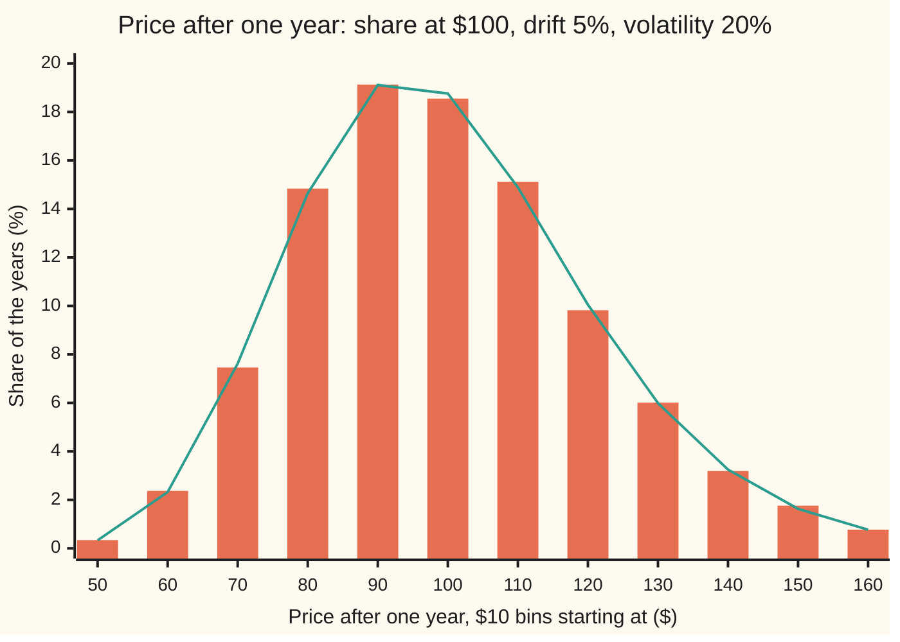
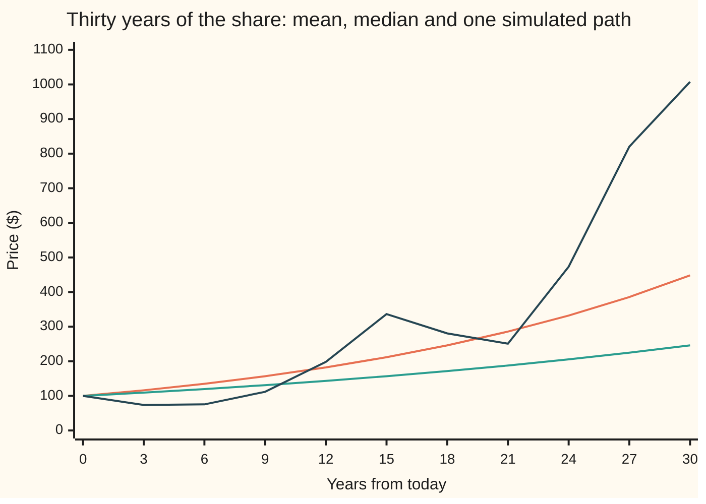

# Geometric Brownian motion: a price whose log is Brownian

[Syllabus](../../../SYLLABUS.md) → [Stochastic processes and calculus](../../../SYLLABUS.md#w11) → [Brownian Motion](../../../SYLLABUS.md#w11-s05) → Geometric Brownian motion

---

## General Overview

A share trades at $100 today. Each trading day its price is multiplied by a number close to 1: up a little one day, down a little the next. Two dials set those daily multipliers. The **drift**, 5 percent a year, is their steady part. The **volatility**, 20 percent a year, sets the size of the random part. Time is counted in years throughout.

A Brownian path, the random walk seen from far away ([Brownian motion](01-brownian-motion.md)), moves by adding. A price moves by multiplying. Taking logarithms turns the multiplying into adding, so the natural model makes the log of the price a Brownian motion with a straight-line trend. That model is **geometric Brownian motion**, GBM from here on.

Follow every way the year can go and two answers to "where does the share end up" come apart. The average ending price is $105.13: 5 percent growth, as the drift promises. The middle ending price, with half the years above it and half below, is $103.05: only 3 percent. About 54 years in 100 end below the average. Stretch the horizon to 30 years and the average is $448.17 while the middle is $245.96; 71 years in 100 then end below the average.

**Under GBM the price is today's price times e raised to a Brownian motion with a straight-line trend; the average grows at the drift, but the middle grows slower by half the volatility squared, because a few very good paths carry the average.**

**What kind of fact this is:** a model, an assumption about how prices move that fits them well enough to compute with; inside it, the solution, the mean, the median and the long-run growth rate are theorems, proved on this card in Why it works.

### The picture: where the year ends, 20,000 times



Bars: 20,000 simulated years, each built from 252 daily multipliers (one sample, seed 20260930); each bar's standard error, printed by the code, is at most 0.28 percentage points. Line: the exact chances from the formula below. The hump sits between $90 and $110 and the right tail runs further than the left: a fall is capped at $100 of loss, a rise is not. That lopsided tail is what pulls the average above the middle.

---

## The formula

Notation first, in words. $S_t$ is the price at time $t$, in years, and $S_0$ the price today. $W_t$ is a standard Brownian motion: it starts at 0, and its value at time $t$ is normal with mean 0 and variance $t$. $\mu$ is the drift and $\sigma$ the volatility, both per year. $E$ is an average over all paths and $\Phi$ the area under the standard bell curve to the left of a point.

$$S_t = S_0\, e^{(\mu - \frac12\sigma^2)\,t + \sigma W_t}$$

**Read it aloud:** the price at time t is today's price times e raised to a straight-line trend plus volatility times a Brownian motion; the trend is the drift less half the variance.

The two summaries this card is about follow from it:

$$E[S_t] = S_0\, e^{\mu t}, \qquad \operatorname{median}(S_t) = S_0\, e^{(\mu - \frac12\sigma^2)\,t}, \qquad P\big(S_t < E[S_t]\big) = \Phi\!\left(\tfrac12\sigma\sqrt{t}\right)$$

**Read it aloud:** the average grows at the drift; the middle grows at the drift less half the variance; the chance of ending below the average is the bell-curve area up to half of one spread.

| Symbol | Plain meaning | In our example | Push it up and the answer… |
| --- | --- | --- | --- |
| $S_t$, $S^{(n)}_t$ | the price at time $t$; $S^{(n)}_t$ the grid price after n multiplying steps | $103.05 in the middle at $t$ = 1 | — |
| $S_0$ | the price today | $100 | every price scales with it |
| $t$, $T$ | time in years; $T$ a fixed horizon | 1 year | mean and median separate further |
| $\mu$ | drift: the average growth rate, per year | 0.05 | mean and median rise together |
| $\sigma$ | volatility: the spread of the log price after one year | 0.20 | mean unchanged, median falls |
| $W_t$, $W_n$, $Z$ | standard Brownian motion, read at time $t$ or at whole year $n$; normal with variance equal to the time; $Z = W_t/\sqrt{t}$, a standard normal | — | — |
| $\Delta t$, $\Delta W$ | one grid step, and the Brownian motion's change over it | 1/252 year; normal, variance 1/252 | — |
| $n$ | number of steps on the grid | 252 a year | grid products close in on the formula |
| $E$ | the average over all paths | $E[S_1]$ = $105.13 | — |
| $\Phi$ | standard bell-curve area left of a point | $\Phi$(0.1) = 0.5398 | — |
| $x_i$, $a$, $b$ | the change over grid step number i; its steady part $\mu\Delta t$ and its random size $\sigma\sqrt{\Delta t}$ | $a$ = 0.05/252 | — |
| $A_n$, $M_n$, $C$, $c$, $\varepsilon$, $r(x)$ | helpers inside the folded proofs, defined where they appear: $\varepsilon$ any small positive number, $r(x)$ the Taylor remainder of $\ln(1 + x)$ | — | — |

The term $\frac12\sigma^2$ is 0.02 here. It is called the **volatility drag**. It is not charged to the average; it is the gap between the average's growth rate and the middle's.

The spread of the price itself comes from the lognormal variance ([Lognormal](../../09-Probability%20and%20statistics/04-Continuous%20Distributions/06-lognormal-distribution.md)): its standard deviation is $E[S_t]\sqrt{e^{\sigma^2 t} - 1}$, $21.24 after one year.

### When it holds

- **Percentage moves with one fixed spread.** If the volatility itself wanders, the year's log return is a blend of normals with fatter tails, and the median and the chance of a loss both shift.
- **Paths are continuous.** A crash of 20 percent in one morning is a jump; GBM gives it almost no chance, and [The Black-Scholes assumptions](../../12-Financial%20mathematics/08-The%20Black-Scholes%20call%20and%20put/09-black-scholes-assumptions-and-failures.md) counts what that costs.
- **Drift and volatility are constants.** With changing values, replace $\mu t$ and $\sigma^2 t$ by their totals over the period; the shape of every formula survives.
- **The price starts above zero.** GBM never reaches zero in finite time, so it cannot model a default by itself.

---

## Why it works

### Step 0: logs turn multiplying into adding, and the squares of the steps do not vanish

A price is a product of many small multipliers. Its log is a sum, which is where Brownian motion lives. The surprise is in the log of one multiplier: $\ln(1 + x)$ is $x - x^2/2$ plus a much smaller remainder. Over a year the $x$ terms add up to the trend plus the noise. The $x^2/2$ terms add up to something that does not shrink as the steps get smaller: the squared Brownian steps add up to the elapsed time, [Quadratic variation](03-quadratic-variation.md). That leftover is the $-\frac12\sigma^2 t$.

### Step 1: the model on a grid

Cut the year into $n$ steps of length $\Delta t = 1/n$. Over each step the price is multiplied by $1 + \mu\Delta t + \sigma\Delta W$, where $\Delta W$ is the Brownian motion's change over that step: normal, mean 0, variance $\Delta t$, independent of every other step. With 252 steps a year that is a tiny steady creep plus a random daily kick many times larger.

That is the whole model. Its limit as the steps shrink is written on shelf 06 of this wing as an equation in dS and dW ([Stochastic differential equations](../06-Ito%20Calculus/04-stochastic-differential-equations.md)); there dW is shorthand for an integral, never a derivative, because a Brownian path has no slope ([Brownian paths](02-scaling-and-path-roughness.md)). This card works with the grid and its limit directly.

### Step 2: the product converges to the formula

Write $x_i = \mu\Delta t + \sigma\Delta W_i$ for the change over step number i. The log of the grid price is the sum of $\ln(1 + x_i)$, which is

$$\sum_i x_i \;-\; \tfrac12 \sum_i x_i^2 \;+\; \text{remainder}.$$

Take the three pieces in turn.

- **The first sum is exact.** The $\mu\Delta t$ parts add to $\mu t$; the $\Delta W$ parts add to $W_t$. So the first sum is $\mu t + \sigma W_t$.
- **The second sum tends to $\sigma^2 t$.** Its main part is $\sigma^2 \sum \Delta W_i^2$. Each $\Delta W_i^2$ has mean $\Delta t$, so the sum has mean $t$, and its variance is $2t\Delta t$, which goes to zero. The cross terms carry an extra $\Delta t$ and vanish.
- **The remainder vanishes.** It is at most the sum of the cubes $\lvert x_i\rvert^3$, which is of size $n\,\Delta t^{3/2} = t\sqrt{\Delta t}$.

Exponentiate: the grid price tends to $S_0 e^{\mu t - \frac12\sigma^2 t + \sigma W_t}$. That is the formula.

The code checks this path by path. For each of the 20,000 simulated years it builds the grid product and the formula from the same Brownian increments and averages the gap. With one step a year the gap is $2.05; with 12, $0.68; with 63, $0.30; with 252, $0.15. The gap falls like $\sqrt{\Delta t}$, the rate the proof's error terms promise: the fourfold cut from 63 to 252 steps halves it. On the first simulated path the squared daily steps add to 1.083, close to the year's length of 1.

<details>
<summary>Detailed proof: the grid product converges in probability</summary>

Fix $t$ and let $\Delta t = t/n$. Let $A_n$ be the event that every $\lvert x_i\rvert \le \frac12$. Off $A_n$ some step is larger than one half; each $x_i$ is normal with spread about $\sigma\sqrt{\Delta t}$, so $P(A_n^c) \le n\,P(\lvert x_1\rvert > \frac12)$, a number times $n e^{-c/\Delta t}$ for a constant $c > 0$, which tends to 0.

On $A_n$, Taylor's theorem with remainder gives $\ln(1 + x) = x - x^2/2 + r(x)$ with $\lvert r(x)\rvert \le \lvert x\rvert^3$ for $\lvert x\rvert \le \frac12$. Then:
- $\sum x_i = \mu t + \sigma W_t$ exactly.
- $\sum x_i^2 - \sigma^2 t = \sigma^2\big(\sum \Delta W_i^2 - t\big) + 2\mu\sigma\Delta t\, W_t + \mu^2 t\,\Delta t$. The first bracket has mean 0 and variance $2t\Delta t$ (each $\Delta W_i^2$ has variance $2\Delta t^2$, and they are independent). The other two terms carry a factor $\Delta t$. So the difference tends to 0 in mean square, hence in probability.
- $E\sum \lvert x_i\rvert^3 \le n\,C\,\Delta t^{3/2} = C\,t\sqrt{\Delta t}$ for a constant $C$, so the remainder tends to 0 in mean, hence in probability (Markov's inequality).

Together, $\ln(S^{(n)}_t / S_0) \to (\mu - \frac12\sigma^2)t + \sigma W_t$ in probability, and since the exponential is continuous, $S^{(n)}_t \to S_t$ in probability. This card proves that convergence. That the limit solves the stochastic differential equation in Itô's sense needs Itô's formula, done on shelf 06 of this wing ([Ito's lemma](../06-Ito%20Calculus/02-itos-lemma.md)); Øksendal proves the formula in chapter 4 and solves this equation with it in chapter 5.

</details>

### Step 3: the mean grows at the drift

Two independent roads.

**From the grid.** The steps are independent and each multiplier has mean $1 + \mu\Delta t$, since $\Delta W$ has mean 0. The mean of a product of independent factors is the product of their means, so the grid price has mean $S_0(1 + \mu\Delta t)^n = S_0(1 + \mu t/n)^n$, which tends to $S_0 e^{\mu t}$, the compound-interest limit.

**From the formula.** $W_t$ is normal with variance $t$, and completing the square gives $E[e^{\sigma W_t}] = e^{\frac12\sigma^2 t}$, the lognormal card's mean. Equivalently, $e^{\sigma W_t - \frac12\sigma^2 t}$ has mean 1 at every time, [Brownian martingales](06-brownian-martingales-and-exponential-martingale.md). Multiply by $S_0 e^{\mu t}$ and the drag cancels: $E[S_t] = S_0 e^{\mu t}$.

For the share: $100 \times e^{0.05} = \$105.13$.

### Step 4: the median grows slower

The exponential only rises, so it keeps order: the middle of $S_t$ is $S_0$ times e raised to the middle of the exponent. $W_t$ is symmetric about 0, so the exponent's middle is its trend, $(\mu - \frac12\sigma^2)t$. The median is $S_0 e^{(\mu - \frac12\sigma^2)t}$.

For the share: $100 \times e^{0.03} = \$103.05$.

A coin-flip version of the grid shows the drag at work in one pair of steps. Replace each normal $\Delta W$ by $+\sqrt{\Delta t}$ or $-\sqrt{\Delta t}$, with chance one half each: the same mean and variance, and the model the code counts exactly. One step up and one step down multiply the price by $(1 + a + b)(1 + a - b) = (1 + a)^2 - b^2$, where $a = \mu\Delta t$ and $b = \sigma\sqrt{\Delta t}$. The $b^2 = \sigma^2\Delta t$ is lost on every up-down pair, whatever the order. The middle path has as many ups as downs, so it holds $n/2$ such pairs and loses about $\frac{n}{2}\sigma^2\Delta t = \frac12\sigma^2 t$ of log growth.

### Step 5: the average is carried by a shrinking minority

$S_t$ ends below its mean exactly when $(\mu - \frac12\sigma^2)t + \sigma W_t < \mu t$, that is when $W_t < \frac12\sigma t$. Writing $W_t = \sqrt{t}\,Z$ with $Z$ standard normal, that is $Z < \frac12\sigma\sqrt{t}$, with chance $\Phi(\frac12\sigma\sqrt{t})$. At one year this is $\Phi(0.1) = 0.5398$. At 100 years it is $\Phi(1) = 0.8413$. The chance rises towards 1 with the horizon, while the mean keeps growing at 5 percent: a smaller and smaller share of very lucky paths holds the average up.

Almost every single path settles at the median's rate. Divide the log price by $t$:

$$\frac{1}{t}\ln\frac{S_t}{S_0} = \mu - \tfrac12\sigma^2 + \sigma\,\frac{W_t}{t}.$$

The last term tends to 0 with probability one, so each path's long-run growth rate is $\mu - \frac12\sigma^2$, 3 percent a year, not 5.

<details>
<summary>Detailed proof: $W_t/t \to 0$ with probability one</summary>

At whole years, $W_n$ is the sum of $n$ independent standard normal increments, so $W_n/n \to 0$ with probability one by the strong law of large numbers (wing 10). Between whole years, let $M_n$ be the largest value of $\lvert W_s - W_n\rvert$ over times s in $[n, n+1]$. By the reflection principle, [Reflection principle](04-reflection-principle-and-running-maximum.md), applied to each sign, $P(M_n > \varepsilon n) \le 4\,P(W_1 > \varepsilon n)$ for any $\varepsilon > 0$. These chances fall faster than any power of $n$, so their sum is finite, and by Borel–Cantelli only finitely many $M_n$ exceed $\varepsilon n$. Hence $M_n/n \to 0$, and for $t$ in $[n, n+1]$, $\lvert W_t\rvert/t \le (\lvert W_n\rvert + M_n)/n \to 0$.

</details>

The other road to the median is the lognormal card's: $S_t/S_0$ is lognormal with log-centre $(\mu - \frac12\sigma^2)t$ and log-variance $\sigma^2 t$, and its median, mean and mode are read off there.

---

## Worked numbers, by hand

Share at $100, drift 0.05, volatility 0.20, one year.

| Step | Arithmetic | Value |
| --- | --- | --- |
| variance per year | 0.20 × 0.20 | 0.04 |
| volatility drag | 0.04 / 2 | 0.02 |
| median's growth rate | 0.05 − 0.02 | 0.03 |
| mean | 100 × e^0.05 = 100 × 1.05127 | $105.13 |
| median | 100 × e^0.03 = 100 × 1.03045 | **$103.05** |
| mean over median | e^0.02 | 1.0202 |
| chance of ending below the mean | Φ(0.20 / 2) = Φ(0.10) | 0.5398 |
| chance of a loss | Φ(−0.03 / 0.20) = Φ(−0.15) | 0.4404 |
| standard deviation of the price | 105.13 × √(e^0.04 − 1) | $21.24 |

The typical year ends at $103.05 and the average year at $105.13. About 54 years in 100 end below the average, and 44 in 100 end below $100.

### What breaks if you drop a piece

| Mistake | Comes out at | What went wrong |
| --- | --- | --- |
| Ordinary chain rule: log price taken to drift at 0.05 | median $105.13 and mean $107.25, not $103.05 and $105.13 | the squared steps were taken to vanish; they add to t |
| Price modelled by adding, 100 + 5t + 20 W_t | chance 0.0122 of a negative price at 25 years | additive noise ignores that moves are percentages; GBM never reaches zero |
| Grid with one step a year | average gap to the formula $2.05, against $0.15 with daily steps | the step was too large for the remainder to vanish |
| Typical 30-year outcome read off the mean | $448.17, while the median is $245.96 | the mean is held up by a minority of paths |

---

## How the gap widens with the horizon

The share did nothing different over a longer stretch. The two summaries separate because the drag compounds. The mean multiplies by $e^{0.05}$ each year, the median by $e^{0.03}$, so the ratio between them is $e^{0.02 t}$.

| Years | Mean | Median | Chance of ending below the mean (formula) | 20,000 draws of the exact lognormal law |
| --- | --- | --- | --- | --- |
| 1 | $105.13 | $103.05 | 0.539828 | 0.539100 ± 0.003525 |
| 10 | $164.87 | $134.99 | 0.624085 | 0.628350 ± 0.003417 |
| 30 | $448.17 | $245.96 | 0.708059 | 0.704500 ± 0.003226 |
| 100 | $14,841.32 | $2,008.55 | 0.841345 | 0.842500 ± 0.002576 |

The ± is one standard error. The last column draws the formula's lognormal law directly, so it checks the normal draws and the bell-curve area, not the grid; the 252-step paths of the code give 0.539500 ± 0.003524 at one year. At 100 years 84 paths in 100 finish below the average.



Orange, the steeper smooth curve: the mean, growing 5 percent a year. Green, the lower smooth curve: the median, growing 3 percent a year. Dark, the jagged line: one simulated path, daily steps, read every three years. This path is one of the lucky 29 in 100 that finish above the mean: it ends at $1,007.57, a growth rate of 0.0770 a year. It is one sample: a single path's 30-year rate is spread widely around 0.03.

---

## Code, from first principles, and it actually runs

The scripts reach the mean and the median by three independent roads. First, the formulas. Second, an exact coin-flip model: each of $n$ steps a year multiplies the price by $1 + a + b$ or $1 + a - b$ with chance one half each, and every one of the $n + 1$ possible end prices is weighted by its exact binomial chance. Third, a simulation of 20,000 years of 252 daily Brownian steps, with SplitMix64 random numbers and Box–Muller normals written out. The bell-curve area is Simpson's rule, also written out. The simulation also measures the gap between the grid product and the formula at four step sizes, and its share of years ending below the mean is asserted against $\Phi(0.1)$; separate draws of the exact lognormal law check that chance at four horizons. Every simulated number carries its standard error, the median's from the sorted years lying half the square root of 20,000 places either side of the middle, and the asserts allow four of them.

### Python

```python
# Geometric Brownian motion -- the check behind the card.  Only math is imported.
# A share at $100, drift mu = 0.05 a year, volatility sigma = 0.20 a year.
# Roads to the mean and median of the price after T years: the formulas; the
# exact law of a coin-flip model, n multiplying steps a year, every path
# counted; and 20000 simulated years of 252 daily steps (SplitMix64, Box-Muller).
import math
S0, MU, SIG, T = 100.0, 0.05, 0.20, 1.0
SEED, PATHS, DAYS = 20260930, 20000, 252
MASK, state = (1 << 64) - 1, SEED
def uniform():                            # SplitMix64, a number in [0, 1)
    global state
    state = (state + 0x9E3779B97F4A7C15) & MASK
    z = state
    z = ((z ^ (z >> 30)) * 0xBF58476D1CE4E5B9) & MASK
    z = ((z ^ (z >> 27)) * 0x94D049BB133111EB) & MASK
    return ((z ^ (z >> 31)) >> 11) / 9007199254740992.0
def normal_pair():                        # Box-Muller: two independent standard normals
    r = math.sqrt(-2.0 * math.log(1.0 - uniform()))
    th = 2.0 * math.pi * uniform()
    return r * math.cos(th), r * math.sin(th)
def phi(x): return math.exp(-0.5 * x * x) / math.sqrt(2.0 * math.pi)
def Phi(x):                               # area under the bell left of x, Simpson's rule
    n, h = 2000, x / 2000
    s = phi(0.0) + phi(x) + sum((4 if i % 2 else 2) * phi(i * h) for i in range(1, n))
    return 0.5 + s * h / 3.0

def mean_f(t): return S0 * math.exp(MU * t)                       # the card's formulas
def median_f(t): return S0 * math.exp((MU - 0.5 * SIG * SIG) * t)

def coin_flips(n, t):                     # n steps, each x(1 + a + b) or x(1 + a - b), chance 1/2
    a, b = MU * t / n, SIG * math.sqrt(t / n)
    lu, ld, lw = math.log(1 + a + b), math.log(1 + a - b), -n * math.log(2.0)
    mean, cum, med = 0.0, 0.0, None
    for k in range(n + 1):                # k up-steps; prices rise with k
        v, w = S0 * math.exp(k * lu + (n - k) * ld), math.exp(lw)
        mean, cum = mean + w * v, cum + w
        if med is None and cum >= 0.5: med = v
        if k < n: lw += math.log(n - k) - math.log(k + 1)
    return mean, med

def increments(days):                     # Brownian increments on a daily grid
    incs = []
    for _ in range(days // 2): incs.extend(math.sqrt(T / DAYS) * z for z in normal_pair())
    return incs

def product(incs, per):                   # steps of x(1 + mu dt + sigma dW), dW summed per step
    s, k = S0, len(incs) // per
    for j in range(k): s *= 1 + MU * len(incs) / DAYS / k + SIG * sum(incs[j * per:(j + 1) * per])
    return s

def avg_se(xs):
    m = sum(xs) / len(xs)
    return m, math.sqrt(sum((x - m) ** 2 for x in xs) / (len(xs) - 1) / len(xs))
def frac_se(flags):
    q = sum(flags) / len(flags)
    return q, math.sqrt(q * (1 - q) / len(flags))
def out(label, v): print(f"{label:<40} {v:>11.6f}")

print("share 100, mu 0.05, sigma 0.20, T 1 year")
out("1 formula: mean S0 e^(mu T)", mean_f(T))
out("1 formula: median S0 e^((mu - s^2/2)T)", median_f(T))
out("  mean / median = e^(s^2 T / 2)", mean_f(T) / median_f(T))
out("  sd of S_T", mean_f(T) * math.sqrt(math.exp(SIG * SIG * T) - 1))
out("  P(S_T < mean) = Phi(s sqrt(T) / 2)", Phi(SIG * math.sqrt(T) / 2))
out("  P(S_T < 100)", Phi(-(MU - 0.5 * SIG * SIG) * math.sqrt(T) / SIG))
print("2 coin flips: steps a year, mean, error, median, error")
cf = {}
for n in (4, 12, 52, 252, 2520):
    m, md = coin_flips(n, T)
    cf[n] = (m - mean_f(T), md - median_f(T))
    print(f"  {n:>5} {m:>11.6f} {cf[n][0]:>+10.6f} {md:>11.6f} {cf[n][1]:>+10.6f}")

blocks = {1: 252, 12: 21, 63: 4, 252: 1}  # steps a year: days per step
ends, logs, gaps = [], [], {k: 0.0 for k in blocks}
for p in range(PATHS):
    incs = increments(DAYS)
    if p == 0: qv = sum(x * x for x in incs)
    exact = median_f(T) * math.exp(SIG * sum(incs))
    for k, per in blocks.items(): gaps[k] += abs(product(incs, per) - exact) / PATHS
    s = product(incs, 1)
    ends.append(s); logs.append(math.log(s / S0))
sim_mean, sim_se = avg_se(ends)
srt = sorted(ends); sim_med = 0.5 * (srt[PATHS // 2 - 1] + srt[PATHS // 2])
rk = round(math.sqrt(PATHS) / 2); med_se = (srt[PATHS // 2 + rk] - srt[PATHS // 2 - 1 - rk]) / 2   # order statistics sqrt(N)/2 ranks either side
below_med, bmd_se = frac_se([x < median_f(T) for x in ends])
below_mean, bmn_se = frac_se([x < mean_f(T) for x in ends])
lg, lg_se = avg_se(logs)
print(f"3 simulation, {PATHS} paths x {DAYS} daily steps, seed {SEED}")
print(f"  mean S_T               {sim_mean:>11.6f}  se {sim_se:.6f}")
print(f"  median S_T             {sim_med:>11.6f}  se {med_se:.6f}")
print(f"  share below median     {below_med:>11.6f}  se {bmd_se:.6f}")
print(f"  share below mean       {below_mean:>11.6f}  se {bmn_se:.6f}")
print(f"  mean ln(S_T / S0)      {lg:>11.6f}  se {lg_se:.6f}")
print(f"  path 1: sum of dW^2    {qv:>11.6f}")
print("  mean |product - exponential| by steps a year")
for k in blocks: print(f"  {k:>5} {gaps[k]:>11.6f}")

print("horizon: years, mean, median, P(below mean) formula, simulated, se")
hz = {}
for t in (1, 10, 30, 100):
    flags = []
    for _ in range(PATHS // 2):
        flags.extend(median_f(t) * math.exp(SIG * math.sqrt(t) * z) < mean_f(t) for z in normal_pair())
    q, se = frac_se(flags)
    hz[t] = (Phi(SIG * math.sqrt(t) / 2), q, se)
    print(f"  {t:>4} {mean_f(t):>10.2f} {median_f(t):>9.2f} {hz[t][0]:>9.6f} {q:>9.6f} {se:.6f}")

out("wrong: ordinary chain rule, median", S0 * math.exp(MU * T))
out("wrong: ordinary chain rule, mean", S0 * math.exp((MU + 0.5 * SIG * SIG) * T))
out("wrong: 100 + 5t + 20 W_t, P(< 0) at 25y", Phi(-(S0 + 5 * 25) / (20 * 5)))
out("try: sigma 0.40, median", S0 * math.exp((MU - 0.08) * T))
out("try: sigma 0.40, P(S_T < 100)", Phi(-(MU - 0.08) / 0.40))
out("try: mu 0.02, median", S0 * math.exp(0.02 - 0.02))

years, incs, path = list(range(0, 31, 3)), increments(30 * DAYS), [S0]
for y in years[1:]: path.append(path[-1] * product(incs[(y - 3) * DAYS:y * DAYS], 1) / S0)
print("chart, years       " + " ".join(f"{y:>7d}" for y in years))
print("chart, mean        " + " ".join(f"{mean_f(y):>7.2f}" for y in years))
print("chart, median      " + " ".join(f"{median_f(y):>7.2f}" for y in years))
print("chart, one path    " + " ".join(f"{v:>7.2f}" for v in path))
out("  that path: ln(S_30 / S0) / 30", math.log(path[-1] / S0) / 30)
edges = list(range(50, 170, 10))
zf = lambda x: (math.log(x / S0) - (MU - 0.5 * SIG * SIG) * T) / (SIG * math.sqrt(T))
sim_pct = [100 * sum(lo <= x < lo + 10 for x in ends) / PATHS for lo in edges]
f_pct = [100 * (Phi(zf(lo + 10)) - Phi(zf(lo))) for lo in edges]
print("chart, bin from    " + " ".join(f"{e:>5d}" for e in edges))
print("chart, simulated % " + " ".join(f"{v:>5.2f}" for v in sim_pct))
print("chart, sim se %    " + " ".join(f"{100 * math.sqrt(v / 100 * (1 - v / 100) / PATHS):>5.2f}" for v in sim_pct))
print("chart, formula %   " + " ".join(f"{v:>5.2f}" for v in f_pct))

assert abs(cf[2520][0]) < 1e-4, "coin-flip mean reaches S0 e^(mu T)"
assert abs(cf[2520][1]) < 1e-4, "coin-flip median reaches S0 e^((mu - sigma^2/2) T)"
assert abs(cf[2520][1]) < abs(cf[252][1]) < abs(cf[52][1]) < abs(cf[12][1]), "error shrinks with the step"
assert abs(sim_mean - mean_f(T)) < 4 * sim_se, "simulated mean within 4 se of S0 e^(mu T)"
assert abs(below_med - 0.5) < 4 * bmd_se, "half the simulated years end below the formula median"
assert abs(below_mean - Phi(SIG * math.sqrt(T) / 2)) < 4 * bmn_se, "252-step paths: share below the mean = Phi(sigma sqrt(T) / 2)"
assert abs(lg - (MU - 0.5 * SIG * SIG) * T) < 4 * lg_se, "log grows at mu - sigma^2 / 2"
assert all(abs(f - q) < 4 * se for f, q, se in hz.values()), "P(below mean) = Phi(sigma sqrt(T) / 2)"
assert gaps[252] < gaps[63] < gaps[12] < gaps[1], "products close in on the exponential"
print("ALL CHECKS PASS")
```

**Ran 2026-10-07 on macOS, Python 3.14.6, standard library only. All checks passed. Output, pasted from the run:**

```
share 100, mu 0.05, sigma 0.20, T 1 year
1 formula: mean S0 e^(mu T)               105.127110
1 formula: median S0 e^((mu - s^2/2)T)    103.045453
  mean / median = e^(s^2 T / 2)             1.020201
  sd of S_T                                21.237439
  P(S_T < mean) = Phi(s sqrt(T) / 2)        0.539828
  P(S_T < 100)                              0.440382
2 coin flips: steps a year, mean, error, median, error
      4  105.094534  -0.032576  103.054221  +0.008768
     12  105.116190  -0.010920  103.048431  +0.002978
     52  105.124584  -0.002525  103.046145  +0.000692
    252  105.126588  -0.000521  103.045596  +0.000143
   2520  105.127057  -0.000052  103.045468  +0.000014
3 simulation, 20000 paths x 252 daily steps, seed 20260930
  mean S_T                105.129212  se 0.150328
  median S_T              103.076360  se 0.207376
  share below median        0.499400  se 0.003536
  share below mean          0.539500  se 0.003524
  mean ln(S_T / S0)         0.029978  se 0.001416
  path 1: sum of dW^2       1.083305
  mean |product - exponential| by steps a year
      1    2.048839
     12    0.679533
     63    0.298279
    252    0.149486
horizon: years, mean, median, P(below mean) formula, simulated, se
     1     105.13    103.05  0.539828  0.539100 0.003525
    10     164.87    134.99  0.624085  0.628350 0.003417
    30     448.17    245.96  0.708059  0.704500 0.003226
   100   14841.32   2008.55  0.841345  0.842500 0.002576
wrong: ordinary chain rule, median        105.127110
wrong: ordinary chain rule, mean          107.250818
wrong: 100 + 5t + 20 W_t, P(< 0) at 25y     0.012224
try: sigma 0.40, median                    97.044553
try: sigma 0.40, P(S_T < 100)               0.529893
try: mu 0.02, median                      100.000000
chart, years             0       3       6       9      12      15      18      21      24      27      30
chart, mean         100.00  116.18  134.99  156.83  182.21  211.70  245.96  285.77  332.01  385.74  448.17
chart, median       100.00  109.42  119.72  131.00  143.33  156.83  171.60  187.76  205.44  224.79  245.96
chart, one path     100.00   73.76   75.41  111.84  198.27  336.38  280.58  250.89  473.29  820.33 1007.57
  that path: ln(S_30 / S0) / 30             0.077004
chart, bin from       50    60    70    80    90   100   110   120   130   140   150   160
chart, simulated %  0.34  2.37  7.46 14.84 19.13 18.55 15.12  9.82  6.01  3.19  1.76  0.77
chart, sim se %     0.04  0.11  0.19  0.25  0.28  0.27  0.25  0.21  0.17  0.12  0.09  0.06
chart, formula %    0.33  2.32  7.62 14.65 19.11 18.76 14.89 10.05  5.99  3.25  1.63  0.77
ALL CHECKS PASS
```

The coin-flip errors fall about tenfold for each tenfold rise in steps. The simulated mean, $105.13 ± 0.15, sits on the formula; 49.94 percent of the simulated years end below the formula's median; the average log return, 0.029978 ± 0.001416, is the median's 3 percent, not the drift's 5.

### Rust

```rust
// Geometric Brownian motion -- the same check as geometric_brownian_motion_check.py.
// Standard library only, no crates.  Same seed, same generator, same rows.
// Compile: rustc --edition 2021 -O geometric_brownian_motion_check.rs -o /tmp/gbm_check
use std::collections::BTreeMap;
use std::f64::consts::PI;

const S0: f64 = 100.0; const MU: f64 = 0.05; const SIG: f64 = 0.20; const T: f64 = 1.0;
const SEED: u64 = 20260930; const PATHS: usize = 20000; const DAYS: usize = 252;
struct Rng { s: u64 }
impl Rng {
    fn uniform(&mut self) -> f64 {                        // SplitMix64, a number in [0, 1)
        self.s = self.s.wrapping_add(0x9E3779B97F4A7C15);
        let mut z = self.s;
        z = (z ^ (z >> 30)).wrapping_mul(0xBF58476D1CE4E5B9);
        z = (z ^ (z >> 27)).wrapping_mul(0x94D049BB133111EB);
        ((z ^ (z >> 31)) >> 11) as f64 / 9007199254740992.0
    }
    fn normal_pair(&mut self) -> [f64; 2] {               // Box-Muller: two standard normals
        let r = (-2.0 * (1.0 - self.uniform()).ln()).sqrt();
        let th = 2.0 * PI * self.uniform();
        [r * th.cos(), r * th.sin()]
    }
    fn increments(&mut self, days: usize) -> Vec<f64> {   // Brownian increments, daily grid
        let mut v = Vec::with_capacity(days);
        for _ in 0..days / 2 { for z in self.normal_pair() { v.push((T / DAYS as f64).sqrt() * z); } }
        v
    }
}
fn phi(x: f64) -> f64 { (-0.5 * x * x).exp() / (2.0 * PI).sqrt() }
fn big_phi(x: f64) -> f64 {                               // area left of x, Simpson's rule
    let (n, h) = (2000, x / 2000.0);
    let mut acc = 0.0;
    for i in 1..n { acc += if i % 2 == 1 { 4.0 } else { 2.0 } * phi(i as f64 * h); }
    0.5 + (phi(0.0) + phi(x) + acc) * h / 3.0
}
fn mean_f(t: f64) -> f64 { S0 * (MU * t).exp() }
fn median_f(t: f64) -> f64 { S0 * ((MU - 0.5 * SIG * SIG) * t).exp() }
fn coin_flips(n: usize, t: f64) -> (f64, f64) {          // exact law, every path counted
    let (a, b) = (MU * t / n as f64, SIG * (t / n as f64).sqrt());
    let (lu, ld) = ((1.0 + a + b).ln(), (1.0 + a - b).ln());
    let mut lw = -(n as f64) * 2.0_f64.ln();
    let (mut mean, mut cum, mut med) = (0.0, 0.0, f64::NAN);
    for k in 0..=n {
        let v = S0 * (k as f64 * lu + (n - k) as f64 * ld).exp();
        let w = lw.exp();
        (mean, cum) = (mean + w * v, cum + w);
        if med.is_nan() && cum >= 0.5 { med = v; }
        if k < n { lw += ((n - k) as f64).ln() - ((k + 1) as f64).ln(); }
    }
    (mean, med)
}
fn product(incs: &[f64], per: usize) -> f64 {            // steps of x(1 + mu dt + sigma dW)
    let k = incs.len() / per;
    let mut s = S0;
    for j in 0..k {
        let mut dw = 0.0;
        for x in &incs[j * per..(j + 1) * per] { dw += x; }
        s *= 1.0 + MU * incs.len() as f64 / DAYS as f64 / k as f64 + SIG * dw;
    }
    s
}
fn avg_se(xs: &[f64]) -> (f64, f64) {
    let n = xs.len() as f64;
    let m = xs.iter().fold(0.0, |a, x| a + x) / n;
    let ss = xs.iter().fold(0.0, |a, x| a + (x - m) * (x - m));
    (m, (ss / (n - 1.0) / n).sqrt())
}
fn frac_se(flags: &[bool]) -> (f64, f64) {
    let q = flags.iter().filter(|&&f| f).count() as f64 / flags.len() as f64;
    (q, (q * (1.0 - q) / flags.len() as f64).sqrt())
}
fn out(label: &str, v: f64) { println!("{:<40} {:>11.6}", label, v); }

fn main() {
    let mut rng = Rng { s: SEED };
    println!("share 100, mu 0.05, sigma 0.20, T 1 year");
    out("1 formula: mean S0 e^(mu T)", mean_f(T));
    out("1 formula: median S0 e^((mu - s^2/2)T)", median_f(T));
    out("  mean / median = e^(s^2 T / 2)", mean_f(T) / median_f(T));
    out("  sd of S_T", mean_f(T) * ((SIG * SIG * T).exp() - 1.0).sqrt());
    out("  P(S_T < mean) = Phi(s sqrt(T) / 2)", big_phi(SIG * T.sqrt() / 2.0));
    out("  P(S_T < 100)", big_phi(-(MU - 0.5 * SIG * SIG) * T.sqrt() / SIG));
    println!("2 coin flips: steps a year, mean, error, median, error");
    let mut cf = BTreeMap::new();
    for n in [4usize, 12, 52, 252, 2520] {
        let (m, md) = coin_flips(n, T);
        let e = (m - mean_f(T), md - median_f(T)); cf.insert(n, e);
        println!("  {:>5} {:>11.6} {:>+10.6} {:>11.6} {:>+10.6}", n, m, e.0, md, e.1);
    }

    let blocks = [(1usize, 252usize), (12, 21), (63, 4), (252, 1)];   // steps a year: days per step
    let (mut ends, mut logs, mut gaps, mut qv) = (Vec::new(), Vec::new(), [0.0f64; 4], 0.0);
    for p in 0..PATHS {
        let incs = rng.increments(DAYS);
        if p == 0 { qv = incs.iter().fold(0.0, |a, x| a + x * x); }
        let w = incs.iter().fold(0.0, |a, x| a + x);
        let exact = median_f(T) * (SIG * w).exp();
        for (i, &(_, per)) in blocks.iter().enumerate() { gaps[i] += (product(&incs, per) - exact).abs() / PATHS as f64; }
        let s = product(&incs, 1);
        ends.push(s); logs.push((s / S0).ln());
    }
    let (sim_mean, sim_se) = avg_se(&ends);
    let mut srt = ends.clone(); srt.sort_by(|a, b| a.partial_cmp(b).unwrap());
    let sim_med = 0.5 * (srt[PATHS / 2 - 1] + srt[PATHS / 2]);
    let rk = ((PATHS as f64).sqrt() / 2.0).round() as usize; let med_se = (srt[PATHS / 2 + rk] - srt[PATHS / 2 - 1 - rk]) / 2.0;
    let (below_med, bmd_se) = frac_se(&ends.iter().map(|&x| x < median_f(T)).collect::<Vec<_>>());
    let (below_mean, bmn_se) = frac_se(&ends.iter().map(|&x| x < mean_f(T)).collect::<Vec<_>>());
    let (lg, lg_se) = avg_se(&logs);
    println!("3 simulation, {} paths x {} daily steps, seed {}", PATHS, DAYS, SEED);
    println!("  mean S_T               {:>11.6}  se {:.6}", sim_mean, sim_se);
    println!("  median S_T             {:>11.6}  se {:.6}", sim_med, med_se);
    println!("  share below median     {:>11.6}  se {:.6}", below_med, bmd_se);
    println!("  share below mean       {:>11.6}  se {:.6}", below_mean, bmn_se);
    println!("  mean ln(S_T / S0)      {:>11.6}  se {:.6}", lg, lg_se);
    println!("  path 1: sum of dW^2    {:>11.6}", qv);
    println!("  mean |product - exponential| by steps a year");
    for (i, &(k, _)) in blocks.iter().enumerate() { println!("  {:>5} {:>11.6}", k, gaps[i]); }

    println!("horizon: years, mean, median, P(below mean) formula, simulated, se");
    let mut hz = Vec::new();
    for t in [1.0f64, 10.0, 30.0, 100.0] {
        let mut flags = Vec::with_capacity(PATHS);
        for _ in 0..PATHS / 2 {
            for z in rng.normal_pair() { flags.push(median_f(t) * (SIG * t.sqrt() * z).exp() < mean_f(t)); }
        }
        let (q, se) = frac_se(&flags);
        let f = big_phi(SIG * t.sqrt() / 2.0); hz.push((f, q, se));
        println!("  {:>4} {:>10.2} {:>9.2} {:>9.6} {:>9.6} {:.6}", t as u32, mean_f(t), median_f(t), f, q, se);
    }

    out("wrong: ordinary chain rule, median", S0 * (MU * T).exp());
    out("wrong: ordinary chain rule, mean", S0 * ((MU + 0.5 * SIG * SIG) * T).exp());
    out("wrong: 100 + 5t + 20 W_t, P(< 0) at 25y", big_phi(-(S0 + 125.0) / 100.0));
    out("try: sigma 0.40, median", S0 * ((MU - 0.08) * T).exp());
    out("try: sigma 0.40, P(S_T < 100)", big_phi(-(MU - 0.08) / 0.40));
    out("try: mu 0.02, median", S0 * (0.02_f64 - 0.02).exp());

    let years: Vec<usize> = (0..=30).step_by(3).collect();
    let incs = rng.increments(30 * DAYS);
    let mut path = vec![S0];
    for &y in &years[1..] {
        let last = *path.last().unwrap();
        path.push(last * product(&incs[(y - 3) * DAYS..y * DAYS], 1) / S0);
    }
    let row = |label: &str, v: Vec<String>| println!("{:<19}{}", label, v.join(" "));
    row("chart, years", years.iter().map(|y| format!("{:>7}", y)).collect());
    row("chart, mean", years.iter().map(|&y| format!("{:>7.2}", mean_f(y as f64))).collect());
    row("chart, median", years.iter().map(|&y| format!("{:>7.2}", median_f(y as f64))).collect());
    row("chart, one path", path.iter().map(|v| format!("{:>7.2}", v)).collect());
    out("  that path: ln(S_30 / S0) / 30", (path[path.len() - 1] / S0).ln() / 30.0);
    let edges: Vec<f64> = (0..12).map(|i| 50.0 + 10.0 * i as f64).collect();
    let zf = |x: f64| ((x / S0).ln() - (MU - 0.5 * SIG * SIG) * T) / (SIG * T.sqrt());
    row("chart, bin from", edges.iter().map(|e| format!("{:>5}", e)).collect());
    let sim_pct: Vec<f64> = edges.iter().map(|&lo| (100 * ends.iter().filter(|&&x| lo <= x && x < lo + 10.0).count()) as f64 / PATHS as f64).collect();
    row("chart, simulated %", sim_pct.iter().map(|v| format!("{:>5.2}", v)).collect());
    row("chart, sim se %", sim_pct.iter().map(|v| format!("{:>5.2}", 100.0 * (v / 100.0 * (1.0 - v / 100.0) / PATHS as f64).sqrt())).collect());
    row("chart, formula %", edges.iter().map(|&lo| format!("{:>5.2}", 100.0 * (big_phi(zf(lo + 10.0)) - big_phi(zf(lo))))).collect());

    let e = |n: usize| cf[&n];
    assert!(e(2520).0.abs() < 1e-4, "coin-flip mean reaches S0 e^(mu T)");
    assert!(e(2520).1.abs() < 1e-4, "coin-flip median reaches S0 e^((mu - sigma^2/2) T)");
    assert!(e(2520).1.abs() < e(252).1.abs() && e(252).1.abs() < e(52).1.abs() && e(52).1.abs() < e(12).1.abs(), "error shrinks with the step");
    assert!((sim_mean - mean_f(T)).abs() < 4.0 * sim_se, "simulated mean within 4 se of S0 e^(mu T)");
    assert!((below_med - 0.5).abs() < 4.0 * bmd_se, "half the simulated years end below the formula median");
    assert!((below_mean - big_phi(SIG * T.sqrt() / 2.0)).abs() < 4.0 * bmn_se, "252-step paths: share below the mean = Phi(sigma sqrt(T) / 2)");
    assert!((lg - (MU - 0.5 * SIG * SIG) * T).abs() < 4.0 * lg_se, "log grows at mu - sigma^2 / 2");
    assert!(hz.iter().all(|&(f, q, se)| (f - q).abs() < 4.0 * se), "P(below mean) = Phi(sigma sqrt(T) / 2)");
    assert!(gaps[3] < gaps[2] && gaps[2] < gaps[1] && gaps[1] < gaps[0], "products close in on the exponential");
    println!("ALL CHECKS PASS");
}
```

**Ran 2026-10-07 on macOS, rustc 1.98.1, no crates. All checks passed. Output, pasted from the run:**

```
share 100, mu 0.05, sigma 0.20, T 1 year
1 formula: mean S0 e^(mu T)               105.127110
1 formula: median S0 e^((mu - s^2/2)T)    103.045453
  mean / median = e^(s^2 T / 2)             1.020201
  sd of S_T                                21.237439
  P(S_T < mean) = Phi(s sqrt(T) / 2)        0.539828
  P(S_T < 100)                              0.440382
2 coin flips: steps a year, mean, error, median, error
      4  105.094534  -0.032576  103.054221  +0.008768
     12  105.116190  -0.010920  103.048431  +0.002978
     52  105.124584  -0.002525  103.046145  +0.000692
    252  105.126588  -0.000521  103.045596  +0.000143
   2520  105.127057  -0.000052  103.045468  +0.000014
3 simulation, 20000 paths x 252 daily steps, seed 20260930
  mean S_T                105.129212  se 0.150328
  median S_T              103.076360  se 0.207376
  share below median        0.499400  se 0.003536
  share below mean          0.539500  se 0.003524
  mean ln(S_T / S0)         0.029978  se 0.001416
  path 1: sum of dW^2       1.083305
  mean |product - exponential| by steps a year
      1    2.048839
     12    0.679533
     63    0.298279
    252    0.149486
horizon: years, mean, median, P(below mean) formula, simulated, se
     1     105.13    103.05  0.539828  0.539100 0.003525
    10     164.87    134.99  0.624085  0.628350 0.003417
    30     448.17    245.96  0.708059  0.704500 0.003226
   100   14841.32   2008.55  0.841345  0.842500 0.002576
wrong: ordinary chain rule, median        105.127110
wrong: ordinary chain rule, mean          107.250818
wrong: 100 + 5t + 20 W_t, P(< 0) at 25y     0.012224
try: sigma 0.40, median                    97.044553
try: sigma 0.40, P(S_T < 100)               0.529893
try: mu 0.02, median                      100.000000
chart, years             0       3       6       9      12      15      18      21      24      27      30
chart, mean         100.00  116.18  134.99  156.83  182.21  211.70  245.96  285.77  332.01  385.74  448.17
chart, median       100.00  109.42  119.72  131.00  143.33  156.83  171.60  187.76  205.44  224.79  245.96
chart, one path     100.00   73.76   75.41  111.84  198.27  336.38  280.58  250.89  473.29  820.33 1007.57
  that path: ln(S_30 / S0) / 30             0.077004
chart, bin from       50    60    70    80    90   100   110   120   130   140   150   160
chart, simulated %  0.34  2.37  7.46 14.84 19.13 18.55 15.12  9.82  6.01  3.19  1.76  0.77
chart, sim se %     0.04  0.11  0.19  0.25  0.28  0.27  0.25  0.21  0.17  0.12  0.09  0.06
chart, formula %    0.33  2.32  7.62 14.65 19.11 18.76 14.89 10.05  5.99  3.25  1.63  0.77
ALL CHECKS PASS
```

The two outputs agree byte for byte: the same generator, the same seed, and the same order of arithmetic.

> [!TIP]
> **Try changing**
> Guess the direction first, then run it.
> - **Double the volatility.** Set `SIG = 0.40` (the scripts print this case on the `try:` rows). The mean stays $105.13. The median drops to **$97.04**, below today's price, and the chance of a loss rises to **0.5299**: most years lose money while the average year gains 5 percent.
> - **Set the drift equal to the drag.** With `MU = 0.02` and `SIG = 0.20`, the median stays at **$100.00** for ever while the mean grows 2 percent a year.
> - **Starve the grid.** The `1` row under "mean |product - exponential|" is one multiplier for the whole year: the grid misses the formula by **$2.05** on average, against $0.15 with daily steps.
> - **Change the seed.** Every simulated number moves, by about its standard error; the formula and coin-flip rows do not move at all.

---

## The usual mistake

> [!warning]
> **Reading the drift as the growth of a typical path.** The drift is the growth of the average over all paths. A typical path grows at the drift less half the variance: 3 percent here, not 5. Over 30 years that is the difference between $245.96 and $448.17, and over long horizons most paths end below the average.
>
> - **Estimating the drift from average log returns.** The average of $\ln(S_1/S_0)$ estimates $\mu - \frac12\sigma^2$, 0.03, not $\mu$. Add back $\frac12\sigma^2$ to recover 0.05.
> - **Applying the ordinary chain rule to the log price.** It drops the squared Brownian steps and gives a median of $105.13 and a mean of $107.25, both wrong.
> - **Scaling volatility with time instead of its square root.** The spread of the log price after $t$ years is $\sigma\sqrt{t}$; ten years carry about three times one year's spread, not ten times.
> - **Calling the drag a cost.** Every path ends at $S_0 e^{(\mu - \frac12\sigma^2)t + \sigma W_t}$, and the average still grows at $\mu$. The drag describes where the middle sits, not money lost by the average.

---

## Where you meet it in real life

- **Option pricing.** The Black–Scholes call takes this card's price model with the drift replaced by the bank rate less the dividend yield: [Black–Scholes call](../../12-Financial%20mathematics/08-The%20Black-Scholes%20call%20and%20put/01-black-scholes-call.md).
- **Currencies.** An exchange rate modelled as GBM, with the foreign interest rate in the drift, gives [Garman-Kohlhagen](../../12-Financial%20mathematics/21-FX%20vanilla%20options%20-%20Garman-Kohlhagen%20and%20the%20desk%20conventions/01-garman-kohlhagen.md).
- **Credit.** A firm's assets modelled as GBM, with default when they fall below the debt, gives the distance to default: [Distance to default](../../12-Financial%20mathematics/43-Structural%20Models%20-%20Default%20from%20the%20Balance%20Sheet/03-distance-to-default-and-expected-default-frequency.md).
- **Investment growth.** A fund's long-run compound return is close to its average yearly return less half the variance; the gap between the mean and the median is why a volatile fund can beat on average and still leave most investors behind.
- **Population and biology.** A population growing at a random rate each season follows the same model; its long-run growth rate is the median's, which can be negative while the mean grows.

> **Say it back**
> Geometric Brownian motion makes the log of a price a Brownian motion with a straight-line trend. The trend is the drift less half the variance, because the squared Brownian steps add up to the elapsed time instead of vanishing. The average price grows at the drift, 5 percent here; the median, and the long-run rate of almost every path, grows at the drift less half the variance, 3 percent. The share at $100 ends the year at $105.13 on average and $103.05 in the middle. The longer the horizon, the larger the share of paths that end below the average.

---

## What this builds on

- [Brownian motion](01-brownian-motion.md): the process in the exponent, with independent normal increments of variance equal to elapsed time.
- [Lognormal](../../09-Probability%20and%20statistics/04-Continuous%20Distributions/06-lognormal-distribution.md): the law of e raised to a normal, with its mean, median, mode and variance proved.

## Where this goes next

- [Prices as geometric Brownian motion](../../12-Financial%20mathematics/05-Black-Scholes%20from%20the%20Ground%20Up/01-geometric-brownian-motion-for-prices.md): the model fitted to share prices, with drift and volatility estimated from data.
- [Black–Scholes call](../../12-Financial%20mathematics/08-The%20Black-Scholes%20call%20and%20put/01-black-scholes-call.md): the price of a call when the share follows this model and the drift is replaced by the bank rate.
- [The Black-Scholes equation](../../12-Financial%20mathematics/08-The%20Black-Scholes%20call%20and%20put/07-black-scholes-equation.md): the hedge argument, written as an equation the option price obeys under this model.
- [The Black-Scholes assumptions](../../12-Financial%20mathematics/08-The%20Black-Scholes%20call%20and%20put/09-black-scholes-assumptions-and-failures.md): where real prices break the assumptions listed under When it holds.
- [Garman-Kohlhagen](../../12-Financial%20mathematics/21-FX%20vanilla%20options%20-%20Garman-Kohlhagen%20and%20the%20desk%20conventions/01-garman-kohlhagen.md): the same model for an exchange rate.
- [Distance to default](../../12-Financial%20mathematics/43-Structural%20Models%20-%20Default%20from%20the%20Balance%20Sheet/03-distance-to-default-and-expected-default-frequency.md): the same model for a firm's assets, and the chance they fall below its debt.

This card gives the model's law at a fixed time under the real-world drift; what a claim on the share is worth today, when the drift cannot be observed and must not matter, is the question [Black–Scholes call](../../12-Financial%20mathematics/08-The%20Black-Scholes%20call%20and%20put/01-black-scholes-call.md) answers.

---

## Sources

Verified 2026-10-06: every link below resolves to the publisher's page.

- Osborne, M. F. M. "Brownian Motion in the Stock Market." *Operations Research* 7, no. 2 (1959): 145–173. [doi:10.1287/opre.7.2.145](https://doi.org/10.1287/opre.7.2.145). The argument that log prices, not prices, move like a Brownian motion.
- Øksendal, Bernt. *Stochastic Differential Equations*, 6th ed. Springer, 2003. [doi:10.1007/978-3-642-14394-6](https://doi.org/10.1007/978-3-642-14394-6). Chapter 5 solves the GBM equation with Itô's formula.
- Karatzas, Ioannis, and Steven E. Shreve. *Brownian Motion and Stochastic Calculus*, 2nd ed. Springer, Graduate Texts in Mathematics, 1991. [doi:10.1007/978-1-4612-0949-2](https://doi.org/10.1007/978-1-4612-0949-2). Quadratic variation, the reflection principle and the law of large numbers for Brownian motion, proved in full.
- Peters, Ole. "The ergodicity problem in economics." *Nature Physics* 15 (2019): 1216–1221. [doi:10.1038/s41567-019-0732-0](https://doi.org/10.1038/s41567-019-0732-0). The gap between the mean's growth rate and a single path's, worked out for GBM.
