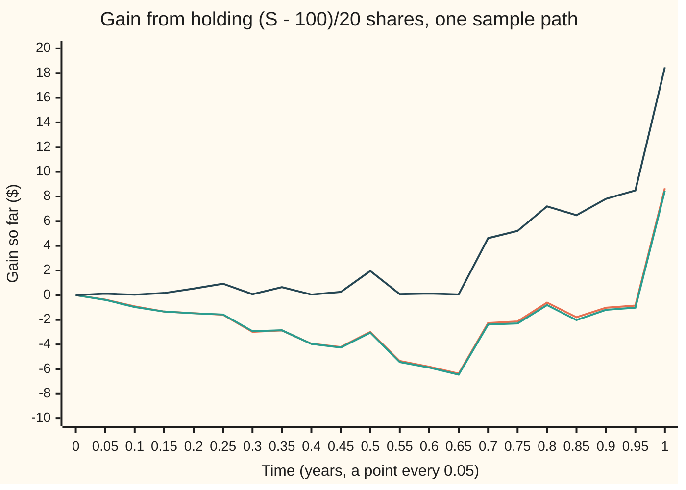
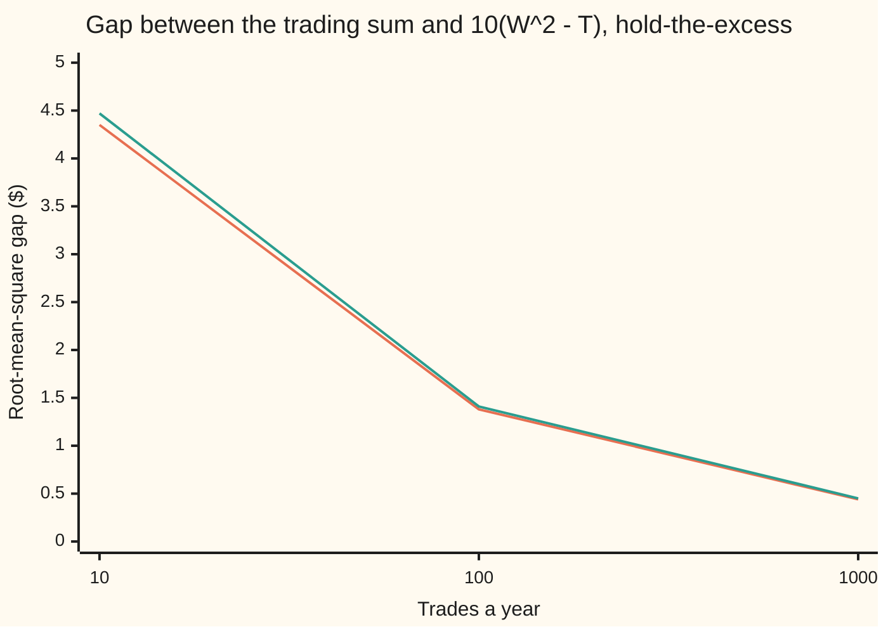

# The Ito integral: integrating a strategy against Brownian motion

Stochastic processes and calculus → Ito Calculus → Gains from continuous trading → The Ito integral

---

## General Overview

A share trades at $100 today. Over the next year its price wanders with no drift; a year from now its standard deviation is $20. A trader holds some number of shares at each moment, changes the holding whenever she likes, and wants one thing: the total gain.

Over a short stretch of time the gain is the holding times the price change. Two shares and a $1.50 rise make $3. Over the year the gain is the sum of those pieces. With trades once a day this is a sum of 252 products, and the [predictable-bets-and-the-martingale-transform](../02-Martingales/02-predictable-bets-and-the-martingale-transform.md) card already knows its main property: if each holding is fixed before the price moves, the average gain is zero. Trade more and more often, and the sum should settle on a limit. That limit is the **Ito integral** of the strategy against the price.

Ordinary calculus has an integral for this, the Stieltjes integral, and it fails here. A wandering price travels an infinite distance in a year, so that theory does not apply, and the sums depend on whether the holding is read at the start or the end of each stretch. For the strategy "hold one share for every $20 the price stands above $100, and go short below", the start gives an average gain of $0 and the end gives $20. Kiyosi Ito chose the start, the reading that matches trading: the holding is chosen first, then the price moves.

**The Ito integral adds up holding times price change over ever finer trading times, with each holding fixed before its price change; for strategies built from finitely many trades it is a fair game whose variance is the average of the squared holding added over time, and that identity, the isometry, extends it to every strategy with a finite such average.**

**What kind of fact this is:** a definition. The isometry and the martingale property are theorems, proved on this card in Why it works for strategies with finitely many trades; the extension to all strategies is a limit, given here in its key steps, with the full argument in the named sources.

### The picture: one year of the hold-the-excess strategy



Three lines, one sample path of the price drawn on a grid of 10,000 steps (seed 20260930 in the code). Orange: the gain from actually trading, added up trade by trade. Green, almost on top of it: the Ito answer $10(W_t^2 - t)$ dollars, from Step 5 below. Dark blue: what ordinary calculus predicts, $10 W_t^2$, which can never go below zero. The share ends the year at $127.18. The trades made $8.66; ordinary calculus claims $18.47. The gap, about $10 a year, is the share's quadratic variation at work.

---

## The formula

Notation first, in words. Brownian motion $W_t$, read "the random walk seen from far away", is the wandering part of the price. The share's price is $S_t = 100 + \sigma W_t$ dollars, with $t$ in years and $\sigma = 20$ dollars per square-root year. What is known by time $t$, the whole price history so far, is written $\mathcal F_t$. A **strategy** $H_t$ is the number of shares held at time $t$.

A **simple strategy** trades at finitely many fixed times $0 = t_0 < t_1 < \dots < t_n = T$. Between $t_k$ and $t_{k+1}$ it holds a fixed number $H_k$ of shares, and $H_k$ may use everything known at $t_k$, nothing later. Its Ito integral is the sum of holding times move:

$$I_T = \int_0^T H_t \, dW_t = \sum_{k=0}^{n-1} H_k \left( W_{t_{k+1}} - W_{t_k} \right).$$

**Read it aloud:** the Ito integral of a strategy is each holding times the price move that follows it, added up.

The trader's gain in dollars is $G_T = \sigma I_T$. The symbol $dW_t$ is shorthand for the sum and its limit, never a derivative: the path has no slope. Stopping the sum at an earlier time $t$ gives $I_t$.

Two theorems hold for every bounded simple strategy. The first is the **isometry** (Greek for "same size"):

$$E\left[ I_T^2 \right] = E\left[ \int_0^T H_t^2 \, dt \right].$$

**Read it aloud:** the variance of the integral is the average of the squared holding, added up over the time it is held. The dollar gain's variance is $\sigma^2$ times that.

The second is the **martingale property**: for any earlier time $s$,

$$E\left[ I_T \mid \mathcal F_s \right] = I_s, \qquad \text{so} \qquad E[I_T] = 0.$$

**Read it aloud:** the best forecast of the final gain, given today's information, is the gain so far; on average, trading on a driftless price makes nothing.

A general strategy $H_t$, fixed by $\mathcal F_t$ at each $t$ with $E[\int_0^T H_t^2\,dt]$ finite, is approached in mean square by simple strategies $H^{(m)}$ (the average squared gap, $E[\int_0^T (H_t - H^{(m)}_t)^2\,dt]$, shrinks to zero), and

$$\int_0^T H_t \, dW_t = \lim_{m \to \infty} \int_0^T H^{(m)}_t \, dW_t,$$

the limit taken in mean square. Both theorems survive it. The pictured strategy, $H_t = W_t$, gives

$$\int_0^T W_t \, dW_t = \frac{W_T^2 - T}{2}.$$

**Read it aloud:** holding as many shares as the walk stands above zero earns half its final square, less half the elapsed time.

| Symbol | Plain meaning | In our example | Push it up and the answer… |
| --- | --- | --- | --- |
| $t$, $s$, $u$, $T$ | time in years; an earlier time; a time inside a stretch, in the proof; the horizon | $T = 1$ year | longer horizon: more variance |
| $W$, $W_t$, $W_T$, $D_k$, $D_j$, $dW_t$ | Brownian motion: the price's wandering part; $D_k$ its move over stretch $k$; $dW_t$ the integral's shorthand | $W_T = 1.3589$ on the pictured path | — |
| $S_t$ | the share price, $100 + \sigma W_t$ dollars | $100 today, $127.18 at year end on the path | — |
| $\sigma$ | dollars of price per unit of $W$ | $20 per square-root year | every gain scales up with it |
| $H$, $K$, $H_t$, $H_k$, $H_j$, $c$, $X$ | strategies; shares held at time $t$, or over stretch $k$; $c$ a bound on the holding; $X$ the product $H_j D_j H_k$ in the proof | 2, then 1 or 0; or $W_t$ | variance grows with its square |
| $t_k$, $k$, $n$, $\Delta t$ | trading times; the stretch number; how many stretches; one stretch's length, $T/n$ | 2 stretches of half a year | finer trading: sums approach the integral |
| $\mathcal F_t$ | what is known by time $t$: the price history so far | the price at the half-year | — |
| $I_t$, $I_s$, $I_T$ | the Ito integral up to time $t$ (or $s$, or $T$), in units of $W$ | $(W_T^2 - T)/2$ for $H = W$ | — |
| $G_T$ | the trader's gain in dollars, $\sigma I_T$ | $8.66 on the pictured path | — |
| $E$ | the average over all price paths | $E[G_T] = 0$ | — |
| $H^{(m)}$, $H^{(l)}$, $m$, $l$ | the $m$-th (or $l$-th) simple strategy approaching $H$ | $W$ read at $m$ equally spaced times | larger $m$: closer to the integral |

### When it holds

- **The holding is fixed before the move it multiplies.** Read the holding at the end of each stretch instead and the hold-the-excess strategy averages $20, not $0. A rule that buys in the second half only when the second half will rise averages $5.64. Neither is a strategy anyone can follow.
- **The integrator is Brownian motion for the information used.** Each future move must be independent of $\mathcal F_t$. A trader who knows tomorrow's news is not trading against Brownian motion for her own information, and the zero mean goes.
- **The strategy's mean square is finite**, $E[\int_0^T H_t^2\,dt] < \infty$. Then the integral exists, the isometry holds and the gain is a fair game. Strategies with only $\int_0^T H_t^2\,dt$ finite on each path still have an integral, built by stopping it before it grows large, but it can fail to be a martingale: continuous-time doubling lives there. This card states that case without proof; Karatzas and Shreve, Chapter 3, Section 2, builds the extension.
- **The holding is read at the left end of each stretch by definition.** Reading it at the midpoint defines a different integral, the Stratonovich integral, with different values: a convention, not an error, but not this one.

---

## Why it works

### Step 0: a known holding times a fresh move is a fair bet

At time $t_k$ the holding $H_k$ is already decided. The move that follows, $W_{t_{k+1}} - W_{t_k}$, is independent of everything known at $t_k$, has mean zero and has variance $t_{k+1} - t_k$. A fixed number times a fair move is fair. Everything on this card comes from that fact, stretch by stretch.

### Step 1: why the ordinary integral fails for a Brownian path

The [riemann-stieltjes-integral](../../06-Calculus%20and%20analysis/08-Multiple%20Integrals/06-riemann-stieltjes-integral.md) card integrates against a function whose total variation is finite: the distance it travels, the sizes of its moves added up, stays bounded as the grid is refined. Then every choice of evaluation point gives the same limit. The [lebesgue-stieltjes-integral](../../10-Measure%20and%20integration/11-Derivatives%20Meet%20the%20Lebesgue%20Integral/05-lebesgue-stieltjes-integral.md) card needs the same thing: a measure built from a monotone function, or a difference of two.

A Brownian path fails both. Its distance travelled, $\sum \lvert W_{t_{k+1}} - W_{t_k} \rvert$, grows without bound as the grid is refined: the [quadratic-variation](../05-Brownian%20Motion/03-quadratic-variation.md) card proves the total variation infinite (its Theorem 3) and shows that the evaluation point then changes the answer (its Step 5). On one path the code measures 2.86 at 10 steps, 7.65 at 100, 24.51 at 1,000 and 79.24 at 10,000, against the average $\sqrt{2n/\pi}$.

The squares behave differently. The [quadratic-variation](../05-Brownian%20Motion/03-quadratic-variation.md) card shows $\sum (W_{t_{k+1}} - W_{t_k})^2 \to T$; on the same path it reads 1.2141, 0.9014, 0.9492 and 0.9808. That finite, nonzero sum is what splits the evaluation points. The right-end sum minus the left-end sum is

$$\sum_k \left( W_{t_{k+1}} - W_{t_k} \right) \left( W_{t_{k+1}} - W_{t_k} \right) = \sum_k \left( W_{t_{k+1}} - W_{t_k} \right)^2 \to T.$$

For $H = W$ the two readings differ by a year's quadratic variation, $20 \times 1 = 20$ dollars, however fine the grid. There is no single limit; trading picks the left end.

### Step 2: the simple integral is a fair game

Take a bounded simple strategy and an earlier time $s$. Insert $s$ into the list of trading times; splitting a stretch in two and holding the same shares on both halves changes no sum. Now every stretch after $s$ has the form $H_k (W_{t_{k+1}} - W_{t_k})$ with $t_k \ge s$. Given $\mathcal F_{t_k}$, the holding is known and comes outside the average, by "taking out what is known" ([rules-of-conditional-expectation](../../10-Measure%20and%20integration/09-Conditional%20Expectation/04-rules-of-conditional-expectation.md)):

$$E\left[ H_k (W_{t_{k+1}} - W_{t_k}) \mid \mathcal F_{t_k} \right] = H_k \, E\left[ W_{t_{k+1}} - W_{t_k} \right] = 0.$$

Averaging further back to $\mathcal F_s$ (the tower rule) keeps it zero. Every stretch after $s$ contributes zero on average, and the stretches before $s$ are known, so $E[I_T \mid \mathcal F_s] = I_s$. This is the discrete martingale transform, with the coin replaced by Brownian moves.

### Step 3: the isometry for simple strategies

Write $D_k = W_{t_{k+1}} - W_{t_k}$. Square the sum:

$$I_T^2 = \sum_k H_k^2 D_k^2 + 2 \sum_{j < k} H_j D_j H_k D_k.$$

**Square terms.** Given $\mathcal F_{t_k}$, $H_k^2$ is known and $D_k^2$ averages $t_{k+1} - t_k$. So $E[H_k^2 D_k^2] = E[H_k^2](t_{k+1} - t_k)$.

**Cross terms.** For $j < k$, everything except $D_k$ is known at $t_k$: $H_j$, $D_j$ and $H_k$. Take it out of the average, and $D_k$ averages zero. Every cross term vanishes.

What is left is $\sum_k E[H_k^2](t_{k+1} - t_k) = E[\int_0^T H_t^2\,dt]$, the isometry. The cross terms die for the same reason as in Step 2: a fresh move is uncorrelated with everything already known.

<details>
<summary>Detailed proof</summary>

**Setting.** A probability space carries a filtration $\mathcal F_t$ and a Brownian motion $W$ for it: $W_t$ is fixed by $\mathcal F_t$, and for $u > t$ the move $W_u - W_t$ is independent of $\mathcal F_t$, normal with mean 0 and variance $u - t$. A simple strategy has times $0 = t_0 < \dots < t_n = T$ and holdings $H_k$ fixed by $\mathcal F_{t_k}$ with $\lvert H_k \rvert \le c$ for one constant $c$.

**Refinement.** Adding a time $u$ inside $(t_k, t_{k+1})$ and holding $H_k$ on both halves leaves the sum unchanged, since $H_k(W_{t_{k+1}} - W_u) + H_k(W_u - W_{t_k}) = H_k(W_{t_{k+1}} - W_{t_k})$; $H_k$ is still fixed by $\mathcal F_u \supseteq \mathcal F_{t_k}$. So any finite set of times, including $s$ and $t$, may be assumed to be trading times.

**Integrable.** $\lvert H_k D_k \rvert \le c \lvert D_k \rvert$ and $(H_k D_k)^2 \le c^2 D_k^2$, both with finite averages. A finite sum of square-integrable terms is square-integrable, so $I_t$ has a finite mean and mean square.

**Adapted.** With $t$ a trading time, $I_t$ is a finite sum of products of quantities fixed by $\mathcal F_t$.

**Martingale.** Let $s < t$ be trading times. $I_t - I_s = \sum_{s \le t_k < t} H_k D_k$. For each such $k$: $E[H_k D_k \mid \mathcal F_{t_k}] = H_k E[D_k \mid \mathcal F_{t_k}] = H_k E[D_k] = 0$, using that $H_k$ is bounded and fixed by $\mathcal F_{t_k}$, then independence. The tower rule with $\mathcal F_s \subseteq \mathcal F_{t_k}$ gives $E[H_k D_k \mid \mathcal F_s] = 0$. Summing, $E[I_t \mid \mathcal F_s] = I_s$. Taking $s = 0$, $E[I_t] = I_0 = 0$.

**Isometry.** $E[H_k^2 D_k^2] = E[H_k^2 E[D_k^2 \mid \mathcal F_{t_k}]] = E[H_k^2](t_{k+1} - t_k)$. For $j < k$, $X = H_j D_j H_k$ is fixed by $\mathcal F_{t_k}$ and integrable (it is bounded by $c^2 \lvert D_j \rvert$), so $E[X D_k] = E[X E[D_k \mid \mathcal F_{t_k}]] = 0$. Expanding the finite square, $E[I_T^2] = \sum_k E[H_k^2](t_{k+1} - t_k) = E[\int_0^T H_t^2\,dt]$, the last step because $H_t^2 = H_k^2$ on the whole stretch.

**Linearity.** For simple $H$ and $K$, put both on a common list of times: the integral of $H - K$ is the integral of $H$ minus the integral of $K$, and constants come outside. Applied to $H - K$, the isometry says $E[(\int H\,dW - \int K\,dW)^2] = E[\int_0^T (H_t - K_t)^2\,dt]$: two strategies close in mean square have integrals close in mean square. Step 4 runs on this.

</details>

### Step 4: extend by limits, in outline

The isometry is a ruler: the root-mean-square gap between two integrals equals the root-mean-square gap between their strategies over time. The extension uses it in four steps. This card gives each step's idea; the complete argument is in Øksendal, Chapter 3, and Karatzas and Shreve, Chapter 3, Section 2.

1. **Approximate.** Every strategy fixed by $\mathcal F_t$ with $E[\int_0^T H_t^2\,dt] < \infty$ is a mean-square limit of bounded simple strategies $H^{(m)}$. For a continuous bounded $H$, freeze it at the left end of each of $m$ equal stretches; the frozen strategy is simple, and continuity makes the gap shrink. Bounded, then general strategies follow by truncation and smoothing.
2. **Cauchy.** By the proof's linearity line, the mean-square gap between the integrals of $H^{(m)}$ and $H^{(l)}$ equals that between the strategies, which shrinks as $m, l$ grow. The integrals crowd together.
3. **Limit.** Random variables with a finite mean square form a complete space (the measure wing's $L^2$), so a crowding sequence converges; the limit is the Ito integral. Another approximating sequence gives the same limit, by the same ruler.
4. **Keep the theorems.** Mean squares and conditional averages are continuous in mean square. The isometry and the martingale property pass from each $H^{(m)}$ to the limit.

One more step, which uses [doob-inequalities](../02-Martingales/05-doob-inequalities.md), makes $t \mapsto I_t$ a continuous path rather than a separate limit for each $t$: Doob's maximal inequality controls the largest gap along the whole year by the gap at the end.

### Step 5: the integral of $W$ against itself

Take the simple strategy that freezes $W$ at the left end of each stretch, $H^{(n)}_t = W_{t_k}$. Each piece obeys an algebra identity that has nothing random in it:

$$W_{t_k} D_k = \tfrac12 \left( W_{t_{k+1}}^2 - W_{t_k}^2 \right) - \tfrac12 D_k^2.$$

Add over $k$. The first part telescopes to $\tfrac12 W_T^2$; the second is half the quadratic variation:

$$\sum_k W_{t_k} D_k = \tfrac12 W_T^2 - \tfrac12 \sum_k D_k^2.$$

The sum of squares has mean $T$ and variance $2T^2/n$, so it tends to $T$ in mean square, and $\int_0^T W_t\,dW_t = (W_T^2 - T)/2$. The gap between the sum and its limit has mean square $T^2/(2n)$; in dollars the root-mean-square gap is $20T/\sqrt{2n}$, which the code checks at three step sizes.

A second road checks the isometry. $W_T$ is normal with variance $T$, so $E[W_T^4] = 3T^2$ and

$$E\left[ \left( \tfrac{W_T^2 - T}{2} \right)^2 \right] = \tfrac14 \left( 3T^2 - 2T^2 + T^2 \right) = \tfrac{T^2}{2} = \int_0^T E[W_t^2]\,dt = \int_0^T t\,dt.$$

The ordinary chain rule would give $\tfrac12 W_T^2$ and drop the $-\tfrac12 T$. That term is the price of the path's roughness, and [itos-lemma](02-itos-lemma.md) turns it into a rule for every smooth function of $W$.

---

## Worked numbers, by hand

The **half-year rule**: hold 2 shares for the first half-year; at the half-year look at the price, and hold 1 share for the second half if it is at least $100, none if it is below. Both holdings are fixed before the move they ride, so this is a simple strategy.

| Step | Arithmetic | Value |
| --- | --- | --- |
| first half: holding squared times time | $2^2 \times 0.5$ | 2 |
| second half: chance the price is at least $100 | symmetry of $W_{1/2}$ about 0 | 0.5 |
| second half: average holding squared times time | $0.5 \times 1^2 \times 0.5$ | 0.25 |
| $E[\int_0^1 H_t^2\,dt]$ | 2 + 0.25 | 2.25 |
| variance of the gain $G_1 = 20 I_1$ | $20^2 \times 2.25$ | 900 |
| typical size of the gain | $\sqrt{900}$ | $30 |
| average gain | martingale property | **$0** |

Read in the world: the rule wins or loses about $30 in a typical year and averages nothing. Looking at the half-year price changes the spread, never the average.

The hold-the-excess strategy, $H_t = W_t$ shares: $E[\int_0^1 W_t^2\,dt] = 0.5$, so the variance of the dollar gain is $400 \times 0.5 = 200$, a typical size of about \$14.14, and the average is \$0. Ordinary calculus promises $10 W_1^2$, which averages \$10 and is never negative.

### What breaks if you drop a piece

| Mistake | Comes out at | What went wrong |
| --- | --- | --- |
| Holding read at the end of each stretch, $H = W$ | mean gain $20 exact; $20.0525 ± 0.0719 simulated | the holding uses the move it multiplies: the sum picks up the quadratic variation |
| Second-half bet placed only when the second half will rise | mean $5.641896 exact; $5.6173 ± 0.0414 simulated | not fixed before the move: it sees the future |
| Ordinary chain rule, $\int W\,dW = \tfrac12 W^2$ | mean gain $10 exact; $10.0575 ± 0.0708 simulated | drops $-\tfrac12 T$: the dt term from the squared moves |
| Stieltjes integral against the path | total variation 2.86, 7.65, 24.51, 79.24 at 10 to 10,000 steps | the path has infinite variation, so no Stieltjes limit exists |

The code prints all four.

### The error as trading gets finer



Orange: the root-mean-square gap between the left-end trading sum and the Ito answer, from 2,000 simulated paths at each step size. Green: the formula $20T/\sqrt{2n}$. Ten times more trades cut the gap by a factor of $\sqrt{10}$.

---

## Code, from first principles, and it actually runs

Three roads. The formulas give the isometry values. Exact enumeration replaces Brownian motion by a coin-toss walk with steps of size $\sqrt{\Delta t}$ and visits every path in whole numbers (up to 65,536), checking the mean, the isometry and a zero future average after every history. The walk is not Brownian motion, but its squared steps are exactly $\Delta t$, so Step 5's identity holds on every path. A seeded simulation of Brownian motion (SplitMix64 and Box-Muller, written out, 40,000 paths of 100 steps) prints every average with its standard error, the error at three step sizes, and the variations and chart of one 10,000-step path.

### Python

```python
# The Ito integral -- the check behind the card.  Only math is imported.
# Price S_t = 100 + 20 W_t dollars, t in years, W a Brownian motion.  A strategy
# holds H_t shares; its gain is 20 times the Ito integral of H against W.
# Three roads: the formulas; exact enumeration of every path of a coin-toss
# walk, in whole numbers; a seeded simulation of Brownian motion (SplitMix64
# and Box-Muller, written out), each average printed with its standard error.
from math import log, cos, pi, sqrt
MASK = (1 << 64) - 1
SIGMA, T = 20.0, 1.0

class SplitMix64:
    def __init__(self, seed): self.s = seed
    def next(self):
        self.s = (self.s + 0x9E3779B97F4A7C15) & MASK
        z = self.s
        z = ((z ^ (z >> 30)) * 0xBF58476D1CE4E5B9) & MASK
        z = ((z ^ (z >> 27)) * 0x94D049BB133111EB) & MASK
        return z ^ (z >> 31)
    def uniform(self): return ((self.next() >> 11) + 0.5) * 2.0 ** -53
    def normal(self):                                   # Box-Muller, cosine branch only
        u, v = self.uniform(), self.uniform()
        return sqrt(-2.0 * log(u)) * cos(2.0 * pi * v)

def walk(code, n):                                      # coin-toss walk X_0..X_n; bit k is step k
    x = [0]
    for k in range(n): x.append(x[-1] + (1 if code >> k & 1 else -1))
    return x

def mean_se(s, s2, m):                                  # sample mean and its standard error
    a = s / m
    return a, sqrt((s2 / m - a * a) * m / (m - 1) / m)

print(f"share S_t = 100 + {SIGMA:.0f} W_t dollars, t in years, horizon T = {T:.0f} year")
# Road 1: the formulas, from the isometry E[I^2] = E[int H^2 dt]
var_half = SIGMA * SIGMA * (2 * 2 * T / 2 + 0.5 * T / 2)   # 2 shares, then 1 share half the time
var_wdw = SIGMA * SIGMA * T * T / 2                      # int_0^T E[W_t^2] dt = T^2 / 2
peek = SIGMA * sqrt(T / 2) / sqrt(2 * pi)                # 20 E[max(dW, 0)] over half a year
print(f"formula, half-year rule: E[int H^2 dt] = 4 x {T / 2:.1f} + 0.5 x {T / 2:.1f} = {var_half / (SIGMA * SIGMA):.6f}; mean gain 0, variance {var_half:.6f}, sd ${sqrt(var_half):.6f}")
print(f"formula, hold W_t shares: E[int W_t^2 dt] = T^2/2 = {T * T / 2:.6f}; mean gain 0, variance {var_wdw:.6f}, sd ${sqrt(var_wdw):.6f}")
print(f"formula, ordinary chain rule mean ${SIGMA * T / 2:.6f}, right endpoint mean ${SIGMA * T:.6f}, peeking rule mean ${peek:.6f}")
# Road 2: every path of a coin-toss walk with steps of size sqrt(dt), dt = T / n
for n in (2, 6, 10, 14):                                # half-year rule; n/2 odd, never at 0 then
    h, s1, s2, up, cond = n // 2, 0, 0, 0, {}
    for code in range(2 ** n):
        x = walk(code, n)
        later = (x[h] > 0) * (x[n] - x[h])              # second-half gain / (20 sqrt(dt))
        b = 2 * x[h] + later
        s1 += b; s2 += b * b; up += x[h] > 0
        key = code & ((1 << h) - 1)                     # the first-half history
        cond[key] = cond.get(key, 0) + later
    assert s1 == 0
    assert 4 * s2 == 9 * n * 2 ** n                     # isometry: E[I^2] = 2 + 1/4
    assert all(v == 0 for v in cond.values())           # martingale: future gain averages 0
    print(f"enumerated, half-year rule, {n} steps, {2 ** n} paths: P(S >= 100 at half-year) {up / 2 ** n:.6f}, "
          f"mean gain {s1 / 2 ** n:.6f}, variance {SIGMA * SIGMA * s2 / (n * 2 ** n):.6f}, {len(cond)} histories with future mean 0")
for n in (4, 8, 16):                                    # hold W_t shares
    s2, cond = 0, {}
    for code in range(2 ** n):
        x = walk(code, n)
        g = [x[k] * (x[k + 1] - x[k]) for k in range(n)]   # each trade's gain / dt
        fut = 0
        for m in range(n - 1, -1, -1):                  # gain after each history of length m
            fut += g[m]
            key = (m, code & ((1 << m) - 1))
            cond[key] = cond.get(key, 0) + fut
        a = fut
        assert 2 * a == x[n] * x[n] - n                 # pathwise: left sum = (W_T^2 - T) / 2
        s2 += a * a
    assert 2 * s2 == 2 ** n * n * (n - 1)               # isometry: sum of E[X_k^2] = n(n-1)/2
    assert all(v == 0 for v in cond.values())
    print(f"enumerated, hold W_t, {n} steps: left sum = (W_T^2 - T)/2 on all {2 ** n} paths, "
          f"E[I^2] {s2 / (n * n * 2 ** n):.6f}, formula (1 - 1/n)/2 = {(1 - 1 / n) / 2:.6f}, {len(cond)} histories with future mean 0")
# Road 3: seeded simulation of Brownian motion on a grid
rng = SplitMix64(20260930)
M, N = 40000, 100
sd = sqrt(T / N)
acc = [[0.0, 0.0, 0.0] for _ in range(5)]
for _ in range(M):
    w = left = right = wh = 0.0
    for k in range(N):
        dw = sd * rng.normal()
        left += w * dw; right += (w + dw) * dw; w += dw
        if k == N // 2 - 1: wh = w
    gains = (2 * wh + (w - wh if wh >= 0 else 0.0), left, right, max(w - wh, 0.0), w * w / 2)
    for a, g in zip(acc, gains):
        g *= SIGMA; a[0] += g; a[1] += g * g; a[2] += (g * g) * (g * g)
names = ("half-year rule", "hold W_t, left endpoint (Ito)", "hold W_t, right endpoint",
         "peeking rule", "ordinary chain rule 10 W_T^2")
exact_mean = (0.0, 0.0, SIGMA * T, peek, SIGMA * T / 2)
print(f"simulated, {M} paths, {N} steps of {T / N:.2f} year, seed 20260930")
for i in range(5):
    m, se = mean_se(acc[i][0], acc[i][1], M)
    assert abs(m - exact_mean[i]) < 4 * se
    print(f"simulated, {names[i]}: mean gain ${m:.4f} +/- {se:.4f} (exact {exact_mean[i]:.4f})")
for i, exact in ((0, var_half), (1, var_wdw * (1 - 1 / N))):
    m, se = mean_se(acc[i][1], acc[i][2], M)
    assert abs(m - exact) < 4 * se
    print(f"simulated, {names[i]}: mean square gain {m:.2f} +/- {se:.2f} (exact on this grid {exact:.2f})")
print("left sum minus (W_T^2 - T)/2, in dollars, 2000 paths per step size")
for n in (10, 100, 1000):
    s = s2 = 0.0
    sdn = sqrt(T / n)
    for _ in range(2000):
        w = left = 0.0
        for k in range(n):
            dw = sdn * rng.normal(); left += w * dw; w += dw
        e = SIGMA * (left - (w * w - T) / 2); s += e * e; s2 += (e * e) * (e * e)
    m, se = mean_se(s, s2, 2000)
    exact = SIGMA * SIGMA * T * T / (2 * n)
    assert abs(m - exact) < 4 * se
    print(f"steps, {n}, rms error ${sqrt(m):.2f}, formula 20 T / sqrt(2n) = ${sqrt(exact):.2f}, mean square {m:.4f} +/- {se:.4f}")
n = 10000                                               # one path, 10000 steps, for variation and the chart
sdn = sqrt(T / n)
path = [0.0]
for _ in range(n): path.append(path[-1] + sdn * rng.normal())
for m in (10, 100, 1000, 10000):
    qv = tv = 0.0
    j = n // m
    for k in range(m):
        d = path[(k + 1) * j] - path[k * j]; qv += d * d; tv += abs(d)
    assert abs(qv - T) < 4 * sqrt(2 / m) * T
    assert abs(tv - sqrt(2 * m * T / pi)) < 4 * sqrt(T * (1 - 2 / pi))
    print(f"one path, {m} steps: quadratic variation {qv:.4f} (limit {T:.4f}), total variation {tv:.4f} (mean sqrt(2n/pi) = {sqrt(2 * m * T / pi):.4f})")
ito, form, naive, left = [0.0], [0.0], [0.0], 0.0
for k in range(n):
    left += path[k] * (path[k + 1] - path[k])
    if (k + 1) % 500 == 0:
        t = (k + 1) * T / n
        ito.append(SIGMA * left); form.append(SIGMA * (path[k + 1] * path[k + 1] - t) / 2)
        naive.append(SIGMA * path[k + 1] * path[k + 1] / 2)
assert abs(ito[-1] - form[-1]) < 4 * SIGMA * T / sqrt(2 * n)
print("chart, t = 0, 0.05, ..., 1 year; W_T = " + f"{path[n]:.4f}, price at year end ${100 + SIGMA * path[n]:.2f}")
print("chart, Ito sum ($): " + ", ".join(f"{v:.2f}" for v in ito))
print("chart, 10 (W_t^2 - t) ($): " + ", ".join(f"{v:.2f}" for v in form))
print("chart, ordinary 10 W_t^2 ($): " + ", ".join(f"{v:.2f}" for v in naive))
print("ALL CHECKS PASS")
```

**Ran 2026-09-30 on macOS, Python 3.14.6, standard library only. All checks passed. Output, pasted from the run:**

```
share S_t = 100 + 20 W_t dollars, t in years, horizon T = 1 year
formula, half-year rule: E[int H^2 dt] = 4 x 0.5 + 0.5 x 0.5 = 2.250000; mean gain 0, variance 900.000000, sd $30.000000
formula, hold W_t shares: E[int W_t^2 dt] = T^2/2 = 0.500000; mean gain 0, variance 200.000000, sd $14.142136
formula, ordinary chain rule mean $10.000000, right endpoint mean $20.000000, peeking rule mean $5.641896
enumerated, half-year rule, 2 steps, 4 paths: P(S >= 100 at half-year) 0.500000, mean gain 0.000000, variance 900.000000, 2 histories with future mean 0
enumerated, half-year rule, 6 steps, 64 paths: P(S >= 100 at half-year) 0.500000, mean gain 0.000000, variance 900.000000, 8 histories with future mean 0
enumerated, half-year rule, 10 steps, 1024 paths: P(S >= 100 at half-year) 0.500000, mean gain 0.000000, variance 900.000000, 32 histories with future mean 0
enumerated, half-year rule, 14 steps, 16384 paths: P(S >= 100 at half-year) 0.500000, mean gain 0.000000, variance 900.000000, 128 histories with future mean 0
enumerated, hold W_t, 4 steps: left sum = (W_T^2 - T)/2 on all 16 paths, E[I^2] 0.375000, formula (1 - 1/n)/2 = 0.375000, 15 histories with future mean 0
enumerated, hold W_t, 8 steps: left sum = (W_T^2 - T)/2 on all 256 paths, E[I^2] 0.437500, formula (1 - 1/n)/2 = 0.437500, 255 histories with future mean 0
enumerated, hold W_t, 16 steps: left sum = (W_T^2 - T)/2 on all 65536 paths, E[I^2] 0.468750, formula (1 - 1/n)/2 = 0.468750, 65535 histories with future mean 0
simulated, 40000 paths, 100 steps of 0.01 year, seed 20260930
simulated, half-year rule: mean gain $-0.0094 +/- 0.1498 (exact 0.0000)
simulated, hold W_t, left endpoint (Ito): mean gain $0.0626 +/- 0.0705 (exact 0.0000)
simulated, hold W_t, right endpoint: mean gain $20.0525 +/- 0.0719 (exact 20.0000)
simulated, peeking rule: mean gain $5.6173 +/- 0.0414 (exact 5.6419)
simulated, ordinary chain rule 10 W_T^2: mean gain $10.0575 +/- 0.0708 (exact 10.0000)
simulated, half-year rule: mean square gain 897.68 +/- 6.37 (exact on this grid 900.00)
simulated, hold W_t, left endpoint (Ito): mean square gain 198.66 +/- 3.54 (exact on this grid 198.00)
left sum minus (W_T^2 - T)/2, in dollars, 2000 paths per step size
steps, 10, rms error $4.35, formula 20 T / sqrt(2n) = $4.47, mean square 18.8818 +/- 0.7268
steps, 100, rms error $1.38, formula 20 T / sqrt(2n) = $1.41, mean square 1.9053 +/- 0.0660
steps, 1000, rms error $0.44, formula 20 T / sqrt(2n) = $0.45, mean square 0.1959 +/- 0.0062
one path, 10 steps: quadratic variation 1.2141 (limit 1.0000), total variation 2.8617 (mean sqrt(2n/pi) = 2.5231)
one path, 100 steps: quadratic variation 0.9014 (limit 1.0000), total variation 7.6525 (mean sqrt(2n/pi) = 7.9788)
one path, 1000 steps: quadratic variation 0.9492 (limit 1.0000), total variation 24.5086 (mean sqrt(2n/pi) = 25.2313)
one path, 10000 steps: quadratic variation 0.9808 (limit 1.0000), total variation 79.2424 (mean sqrt(2n/pi) = 79.7885)
chart, t = 0, 0.05, ..., 1 year; W_T = 1.3589, price at year end $127.18
chart, Ito sum ($): 0.00, -0.36, -0.91, -1.33, -1.46, -1.59, -2.97, -2.86, -3.94, -4.20, -2.98, -5.34, -5.80, -6.36, -2.26, -2.13, -0.60, -1.79, -1.02, -0.84, 8.66
chart, 10 (W_t^2 - t) ($): 0.00, -0.38, -0.96, -1.33, -1.47, -1.57, -2.92, -2.85, -3.95, -4.24, -3.04, -5.42, -5.87, -6.44, -2.38, -2.29, -0.80, -2.02, -1.19, -1.01, 8.47
chart, ordinary 10 W_t^2 ($): 0.00, 0.12, 0.04, 0.17, 0.53, 0.93, 0.08, 0.65, 0.05, 0.26, 1.96, 0.08, 0.13, 0.06, 4.62, 5.21, 7.20, 6.48, 7.81, 8.49, 18.47
ALL CHECKS PASS
```

### Rust

Same numbers, same labels, built with `rustc --edition 2021 -O`.

```rust
// The Ito integral -- the same check as the Python, in Rust.  No crates.
// Price S_t = 100 + 20 W_t dollars, t in years, W a Brownian motion.  A strategy
// holds H_t shares; its gain is 20 times the Ito integral of H against W.
// Three roads: the formulas; exact enumeration of every path of a coin-toss
// walk, in whole numbers; a seeded simulation of Brownian motion (SplitMix64
// and Box-Muller, written out), each average printed with its standard error.
use std::collections::HashMap;
use std::f64::consts::PI;
const SIGMA: f64 = 20.0;
const T: f64 = 1.0;

struct SplitMix64 { s: u64 }

impl SplitMix64 {
    fn next(&mut self) -> u64 {
        self.s = self.s.wrapping_add(0x9E3779B97F4A7C15);
        let mut z = self.s;
        z = (z ^ (z >> 30)).wrapping_mul(0xBF58476D1CE4E5B9);
        z = (z ^ (z >> 27)).wrapping_mul(0x94D049BB133111EB);
        z ^ (z >> 31)
    }
    fn uniform(&mut self) -> f64 { ((self.next() >> 11) as f64 + 0.5) * 2f64.powi(-53) }
    fn normal(&mut self) -> f64 {                       // Box-Muller, cosine branch only
        let (u, v) = (self.uniform(), self.uniform());
        (-2.0 * u.ln()).sqrt() * (2.0 * PI * v).cos()
    }
}

fn walk(code: u64, n: usize) -> Vec<i64> {              // coin-toss walk X_0..X_n; bit k is step k
    let mut x = vec![0i64];
    for k in 0..n { let last = x[k]; x.push(last + if code >> k & 1 == 1 { 1 } else { -1 }) }
    x
}

fn mean_se(s: f64, s2: f64, m: f64) -> (f64, f64) {     // sample mean and its standard error
    let a = s / m;
    (a, ((s2 / m - a * a) * m / (m - 1.0) / m).sqrt())
}

fn main() {
    println!("share S_t = 100 + {:.0} W_t dollars, t in years, horizon T = {:.0} year", SIGMA, T);
    // Road 1: the formulas, from the isometry E[I^2] = E[int H^2 dt]
    let var_half = SIGMA * SIGMA * (2.0 * 2.0 * T / 2.0 + 0.5 * T / 2.0);
    let var_wdw = SIGMA * SIGMA * T * T / 2.0;
    let peek = SIGMA * (T / 2.0).sqrt() / (2.0 * PI).sqrt();
    println!("formula, half-year rule: E[int H^2 dt] = 4 x {:.1} + 0.5 x {:.1} = {:.6}; mean gain 0, variance {:.6}, sd ${:.6}", T / 2.0, T / 2.0, var_half / (SIGMA * SIGMA), var_half, var_half.sqrt());
    println!("formula, hold W_t shares: E[int W_t^2 dt] = T^2/2 = {:.6}; mean gain 0, variance {:.6}, sd ${:.6}", T * T / 2.0, var_wdw, var_wdw.sqrt());
    println!("formula, ordinary chain rule mean ${:.6}, right endpoint mean ${:.6}, peeking rule mean ${:.6}", SIGMA * T / 2.0, SIGMA * T, peek);
    // Road 2: every path of a coin-toss walk with steps of size sqrt(dt), dt = T / n
    for n in [2usize, 6, 10, 14] {                      // half-year rule; n/2 odd, never at 0 then
        let (h, mut s1, mut s2, mut up) = (n / 2, 0i64, 0i64, 0i64);
        let mut cond: HashMap<u64, i64> = HashMap::new();
        for code in 0..1u64 << n {
            let x = walk(code, n);
            let later = if x[h] > 0 { x[n] - x[h] } else { 0 };   // second-half gain / (20 sqrt(dt))
            let b = 2 * x[h] + later;
            s1 += b; s2 += b * b; up += (x[h] > 0) as i64;
            *cond.entry(code & ((1 << h) - 1)).or_insert(0) += later;   // the first-half history
        }
        let paths = 1i64 << n;
        assert!(s1 == 0);
        assert!(4 * s2 == 9 * n as i64 * paths);       // isometry: E[I^2] = 2 + 1/4
        assert!(cond.values().all(|&v| v == 0));        // martingale: future gain averages 0
        println!("enumerated, half-year rule, {} steps, {} paths: P(S >= 100 at half-year) {:.6}, mean gain {:.6}, variance {:.6}, {} histories with future mean 0",
                 n, paths, up as f64 / paths as f64, s1 as f64 / paths as f64, SIGMA * SIGMA * s2 as f64 / (n as i64 * paths) as f64, cond.len());
    }
    for n in [4usize, 8, 16] {                          // hold W_t shares
        let mut s2 = 0i64;
        let mut cond: HashMap<(usize, u64), i64> = HashMap::new();
        for code in 0..1u64 << n {
            let x = walk(code, n);
            let g: Vec<i64> = (0..n).map(|k| x[k] * (x[k + 1] - x[k])).collect();   // each trade's gain / dt
            let mut fut = 0i64;
            for m in (0..n).rev() {                     // gain after each history of length m
                fut += g[m];
                *cond.entry((m, code & ((1 << m) - 1))).or_insert(0) += fut;
            }
            let a = fut;
            assert!(2 * a == x[n] * x[n] - n as i64);   // pathwise: left sum = (W_T^2 - T) / 2
            s2 += a * a;
        }
        let paths = 1i64 << n;
        assert!(2 * s2 == paths * n as i64 * (n as i64 - 1));   // isometry: sum of E[X_k^2] = n(n-1)/2
        assert!(cond.values().all(|&v| v == 0));
        println!("enumerated, hold W_t, {} steps: left sum = (W_T^2 - T)/2 on all {} paths, E[I^2] {:.6}, formula (1 - 1/n)/2 = {:.6}, {} histories with future mean 0",
                 n, paths, s2 as f64 / (n as i64 * n as i64 * paths) as f64, (1.0 - 1.0 / n as f64) / 2.0, cond.len());
    }
    // Road 3: seeded simulation of Brownian motion on a grid
    let mut rng = SplitMix64 { s: 20260930 };
    let (m_paths, steps) = (40000usize, 100usize);
    let sd = (T / steps as f64).sqrt();
    let mut acc = [[0.0f64; 3]; 5];
    for _ in 0..m_paths {
        let (mut w, mut left, mut right, mut wh) = (0.0f64, 0.0f64, 0.0f64, 0.0f64);
        for k in 0..steps {
            let dw = sd * rng.normal();
            left += w * dw; right += (w + dw) * dw; w += dw;
            if k == steps / 2 - 1 { wh = w }
        }
        let gains = [2.0 * wh + if wh >= 0.0 { w - wh } else { 0.0 }, left, right, (w - wh).max(0.0), w * w / 2.0];
        for (a, g0) in acc.iter_mut().zip(gains) {
            let g = g0 * SIGMA; a[0] += g; a[1] += g * g; a[2] += (g * g) * (g * g);
        }
    }
    let names = ["half-year rule", "hold W_t, left endpoint (Ito)", "hold W_t, right endpoint",
                 "peeking rule", "ordinary chain rule 10 W_T^2"];
    let exact_mean = [0.0, 0.0, SIGMA * T, peek, SIGMA * T / 2.0];
    println!("simulated, {} paths, {} steps of {:.2} year, seed 20260930", m_paths, steps, T / steps as f64);
    for i in 0..5 {
        let (m, se) = mean_se(acc[i][0], acc[i][1], m_paths as f64);
        assert!((m - exact_mean[i]).abs() < 4.0 * se);
        println!("simulated, {}: mean gain ${:.4} +/- {:.4} (exact {:.4})", names[i], m, se, exact_mean[i]);
    }
    for (i, exact) in [(0usize, var_half), (1, var_wdw * (1.0 - 1.0 / steps as f64))] {
        let (m, se) = mean_se(acc[i][1], acc[i][2], m_paths as f64);
        assert!((m - exact).abs() < 4.0 * se);
        println!("simulated, {}: mean square gain {:.2} +/- {:.2} (exact on this grid {:.2})", names[i], m, se, exact);
    }
    println!("left sum minus (W_T^2 - T)/2, in dollars, 2000 paths per step size");
    for n in [10usize, 100, 1000] {
        let (mut s, mut s2) = (0.0f64, 0.0f64);
        let sdn = (T / n as f64).sqrt();
        for _ in 0..2000 {
            let (mut w, mut left) = (0.0f64, 0.0f64);
            for _ in 0..n { let dw = sdn * rng.normal(); left += w * dw; w += dw }
            let e = SIGMA * (left - (w * w - T) / 2.0); s += e * e; s2 += (e * e) * (e * e);
        }
        let (m, se) = mean_se(s, s2, 2000.0);
        let exact = SIGMA * SIGMA * T * T / (2.0 * n as f64);
        assert!((m - exact).abs() < 4.0 * se);
        println!("steps, {}, rms error ${:.2}, formula 20 T / sqrt(2n) = ${:.2}, mean square {:.4} +/- {:.4}", n, m.sqrt(), exact.sqrt(), m, se);
    }
    let n = 10000usize;                                 // one path, 10000 steps, for variation and the chart
    let sdn = (T / n as f64).sqrt();
    let mut path = vec![0.0f64];
    for k in 0..n { let next = path[k] + sdn * rng.normal(); path.push(next) }
    for m in [10usize, 100, 1000, 10000] {
        let (mut qv, mut tv) = (0.0f64, 0.0f64);
        let j = n / m;
        for k in 0..m { let d = path[(k + 1) * j] - path[k * j]; qv += d * d; tv += d.abs() }
        let mean_tv = (2.0 * m as f64 * T / PI).sqrt();
        assert!((qv - T).abs() < 4.0 * (2.0 / m as f64).sqrt() * T);
        assert!((tv - mean_tv).abs() < 4.0 * (T * (1.0 - 2.0 / PI)).sqrt());
        println!("one path, {} steps: quadratic variation {:.4} (limit {:.4}), total variation {:.4} (mean sqrt(2n/pi) = {:.4})", m, qv, T, tv, mean_tv);
    }
    let (mut ito, mut form, mut naive, mut left) = (vec![0.0f64], vec![0.0f64], vec![0.0f64], 0.0f64);
    for k in 0..n {
        left += path[k] * (path[k + 1] - path[k]);
        if (k + 1) % 500 == 0 {
            let t = (k + 1) as f64 * T / n as f64;
            ito.push(SIGMA * left); form.push(SIGMA * (path[k + 1] * path[k + 1] - t) / 2.0);
            naive.push(SIGMA * path[k + 1] * path[k + 1] / 2.0);
        }
    }
    assert!((ito[20] - form[20]).abs() < 4.0 * SIGMA * T / (2.0 * n as f64).sqrt());
    let show = |v: &Vec<f64>| v.iter().map(|x| format!("{:.2}", x)).collect::<Vec<_>>().join(", ");
    println!("chart, t = 0, 0.05, ..., 1 year; W_T = {:.4}, price at year end ${:.2}", path[n], 100.0 + SIGMA * path[n]);
    println!("chart, Ito sum ($): {}", show(&ito));
    println!("chart, 10 (W_t^2 - t) ($): {}", show(&form));
    println!("chart, ordinary 10 W_t^2 ($): {}", show(&naive));
    println!("ALL CHECKS PASS");
}
```

**Ran 2026-09-30 on macOS, rustc 1.98.1, no crates. All checks passed. Output, pasted from the run:**

```
share S_t = 100 + 20 W_t dollars, t in years, horizon T = 1 year
formula, half-year rule: E[int H^2 dt] = 4 x 0.5 + 0.5 x 0.5 = 2.250000; mean gain 0, variance 900.000000, sd $30.000000
formula, hold W_t shares: E[int W_t^2 dt] = T^2/2 = 0.500000; mean gain 0, variance 200.000000, sd $14.142136
formula, ordinary chain rule mean $10.000000, right endpoint mean $20.000000, peeking rule mean $5.641896
enumerated, half-year rule, 2 steps, 4 paths: P(S >= 100 at half-year) 0.500000, mean gain 0.000000, variance 900.000000, 2 histories with future mean 0
enumerated, half-year rule, 6 steps, 64 paths: P(S >= 100 at half-year) 0.500000, mean gain 0.000000, variance 900.000000, 8 histories with future mean 0
enumerated, half-year rule, 10 steps, 1024 paths: P(S >= 100 at half-year) 0.500000, mean gain 0.000000, variance 900.000000, 32 histories with future mean 0
enumerated, half-year rule, 14 steps, 16384 paths: P(S >= 100 at half-year) 0.500000, mean gain 0.000000, variance 900.000000, 128 histories with future mean 0
enumerated, hold W_t, 4 steps: left sum = (W_T^2 - T)/2 on all 16 paths, E[I^2] 0.375000, formula (1 - 1/n)/2 = 0.375000, 15 histories with future mean 0
enumerated, hold W_t, 8 steps: left sum = (W_T^2 - T)/2 on all 256 paths, E[I^2] 0.437500, formula (1 - 1/n)/2 = 0.437500, 255 histories with future mean 0
enumerated, hold W_t, 16 steps: left sum = (W_T^2 - T)/2 on all 65536 paths, E[I^2] 0.468750, formula (1 - 1/n)/2 = 0.468750, 65535 histories with future mean 0
simulated, 40000 paths, 100 steps of 0.01 year, seed 20260930
simulated, half-year rule: mean gain $-0.0094 +/- 0.1498 (exact 0.0000)
simulated, hold W_t, left endpoint (Ito): mean gain $0.0626 +/- 0.0705 (exact 0.0000)
simulated, hold W_t, right endpoint: mean gain $20.0525 +/- 0.0719 (exact 20.0000)
simulated, peeking rule: mean gain $5.6173 +/- 0.0414 (exact 5.6419)
simulated, ordinary chain rule 10 W_T^2: mean gain $10.0575 +/- 0.0708 (exact 10.0000)
simulated, half-year rule: mean square gain 897.68 +/- 6.37 (exact on this grid 900.00)
simulated, hold W_t, left endpoint (Ito): mean square gain 198.66 +/- 3.54 (exact on this grid 198.00)
left sum minus (W_T^2 - T)/2, in dollars, 2000 paths per step size
steps, 10, rms error $4.35, formula 20 T / sqrt(2n) = $4.47, mean square 18.8818 +/- 0.7268
steps, 100, rms error $1.38, formula 20 T / sqrt(2n) = $1.41, mean square 1.9053 +/- 0.0660
steps, 1000, rms error $0.44, formula 20 T / sqrt(2n) = $0.45, mean square 0.1959 +/- 0.0062
one path, 10 steps: quadratic variation 1.2141 (limit 1.0000), total variation 2.8617 (mean sqrt(2n/pi) = 2.5231)
one path, 100 steps: quadratic variation 0.9014 (limit 1.0000), total variation 7.6525 (mean sqrt(2n/pi) = 7.9788)
one path, 1000 steps: quadratic variation 0.9492 (limit 1.0000), total variation 24.5086 (mean sqrt(2n/pi) = 25.2313)
one path, 10000 steps: quadratic variation 0.9808 (limit 1.0000), total variation 79.2424 (mean sqrt(2n/pi) = 79.7885)
chart, t = 0, 0.05, ..., 1 year; W_T = 1.3589, price at year end $127.18
chart, Ito sum ($): 0.00, -0.36, -0.91, -1.33, -1.46, -1.59, -2.97, -2.86, -3.94, -4.20, -2.98, -5.34, -5.80, -6.36, -2.26, -2.13, -0.60, -1.79, -1.02, -0.84, 8.66
chart, 10 (W_t^2 - t) ($): 0.00, -0.38, -0.96, -1.33, -1.47, -1.57, -2.92, -2.85, -3.95, -4.24, -3.04, -5.42, -5.87, -6.44, -2.38, -2.29, -0.80, -2.02, -1.19, -1.01, 8.47
chart, ordinary 10 W_t^2 ($): 0.00, 0.12, 0.04, 0.17, 0.53, 0.93, 0.08, 0.65, 0.05, 0.26, 1.96, 0.08, 0.13, 0.06, 4.62, 5.21, 7.20, 6.48, 7.81, 8.49, 18.47
ALL CHECKS PASS
```

The two outputs match line for line.

> [!TIP]
> **Try changing**
> Guess first, then run it.
> - **Peek in the enumeration.** Change `(x[h] > 0)` to `(x[n] > x[h])` in the half-year rule. Guess: the rule now buys only before a rise, so the mean gain is no longer zero, and the first assert stops the run.
> - **Right end instead of left.** In the main simulation loop, change `left += w * dw; right` to `left += (w + dw) * dw; right`. The "left endpoint" mean jumps to about $20, and its assert fails by hundreds of standard errors.
> - **Midpoint.** In the step-size loop, change `rng.normal(); left += w * dw` to `rng.normal(); left += (w + 0.5 * dw) * dw`. That sum equals $\tfrac12 W_T^2$ exactly, the Stratonovich answer, so its gap from the Ito answer is $\tfrac12 T$ and stops shrinking: the step-size assert fails.
> - **Another seed.** Change `SplitMix64(20260930)` to `SplitMix64(42)`. Guess: every simulated number moves by about its standard error, the exact and enumerated lines do not change at all, and every assert still passes.

---

## The usual mistake

> [!warning]
> **"$\int W\,dW = \tfrac12 W^2$, as in ordinary calculus."** The ordinary rule assumes squared small moves vanish. For Brownian motion they add up to the elapsed time, so the Ito integral is $\tfrac12(W_T^2 - T)$. On the pictured path that is $8.66 earned, not $18.47; on average $0, not $10.
>
> - **Reading $dW_t$ as a derivative.** $W$ has no slope, so $\int H\,dW$ is not $\int H\,(dW/dt)\,dt$. The symbol names a limit of sums.
> - **Reading the holding late.** Any evaluation point other than the left end of each stretch gives a different integral. The right end adds \$20 a year on average for $H = W$; the midpoint adds \$10.
> - **Taking the isometry path by path.** It is an identity of averages: $E[I_T^2] = E[\int H_t^2\,dt]$. On one path, $I_T^2$ and $\int_0^T H_t^2\,dt$ are two different random numbers; only their averages agree.
> - **Calling a fair game unwinnable.** The half-year rule makes or loses about $30 in a typical year. Zero mean says nothing about a single year.

---

## Where you meet it in real life

- **Trading gains.** A portfolio's profit from continuous trading is an Ito integral of the holding against the price. Pricing an option by replication, [replication-and-self-financing](../../12-Financial%20mathematics/03-Contracts%20and%20No-Arbitrage/06-replication-and-self-financing.md), is a search for the holding whose integral equals the payoff.
- **Noise in a physical system.** A particle buffeted by molecules, or a circuit with thermal noise, is written as a [stochastic-differential-equations](04-stochastic-differential-equations.md) equation; its noise term is an Ito integral.

> **Say it back**
> A strategy's gain is holding times price move, added up, with each holding fixed before its move. The Ito integral is that sum's limit as trading gets finer. A Brownian path has infinite variation, so the ordinary Stieltjes integral does not exist, and the left-end reading is a choice that matches trading. For finitely many trades the gain is a fair game, and its variance is the average squared holding added over time: the isometry. That identity carries the integral, and both theorems, to every strategy with a finite mean square, and it shows why $\int W\,dW$ is $\tfrac12(W_T^2 - T)$.

---

## What this builds on

- [quadratic-variation](../05-Brownian%20Motion/03-quadratic-variation.md): the squared moves of $W$ add up to $t$; that is the $-\tfrac12 T$ and the left-right gap.
- [predictable-bets-and-the-martingale-transform](../02-Martingales/02-predictable-bets-and-the-martingale-transform.md): stakes fixed before a fair round keep the game fair; the simple Ito integral is that sum with Brownian moves.
- [riemann-integral](../../06-Calculus%20and%20analysis/04-Integrals/01-riemann-integral.md): an integral as the limit of sums over finer grids.
- [riemann-stieltjes-integral](../../06-Calculus%20and%20analysis/08-Multiple%20Integrals/06-riemann-stieltjes-integral.md): integrating against a function of bounded variation, the integral that fails for $W$.
- [lebesgue-stieltjes-integral](../../10-Measure%20and%20integration/11-Derivatives%20Meet%20the%20Lebesgue%20Integral/05-lebesgue-stieltjes-integral.md): integrating against a measure built from a monotone function, which a Brownian path is not.

## Where this goes next

- [itos-lemma](02-itos-lemma.md): the chain rule for a smooth function of $W$, with the extra half-second-derivative term that Step 5 found for $W^2$.
- [martingale-representation-theorem](../07-Changing%20Measure/04-martingale-representation-theorem.md): the converse. Every fair game with a finite mean square, built on one Brownian motion's information, is a constant plus the Ito integral of some strategy.

The integral adds up a strategy's gains; what it leaves open is how a smooth function of the price itself changes, and Ito's lemma answers that with one extra term.

---

## Sources

Verified 2026-10-06: every link below resolves to the publisher's page.

- Itô, Kiyosi. "Stochastic integral." *Proceedings of the Imperial Academy* 20, no. 8 (1944): 519–524. [doi:10.3792/pia/1195572786](https://doi.org/10.3792/pia/1195572786). The paper that defined the integral with the left-end reading.
- Øksendal, Bernt. *Stochastic Differential Equations: An Introduction with Applications*, 6th ed. Springer, 2003. [doi:10.1007/978-3-642-14394-6](https://doi.org/10.1007/978-3-642-14394-6). Chapter 3: the construction from elementary strategies, the isometry and the extension by limits.
- Karatzas, Ioannis, and Steven E. Shreve. *Brownian Motion and Stochastic Calculus*, 2nd ed. Springer, Graduate Texts in Mathematics 113, 1998. [doi:10.1007/978-1-4612-0949-2](https://doi.org/10.1007/978-1-4612-0949-2). Chapter 3, Section 2: the construction in full, the continuous version, and the extension to strategies with $\int_0^T H_t^2\,dt$ finite on each path.
