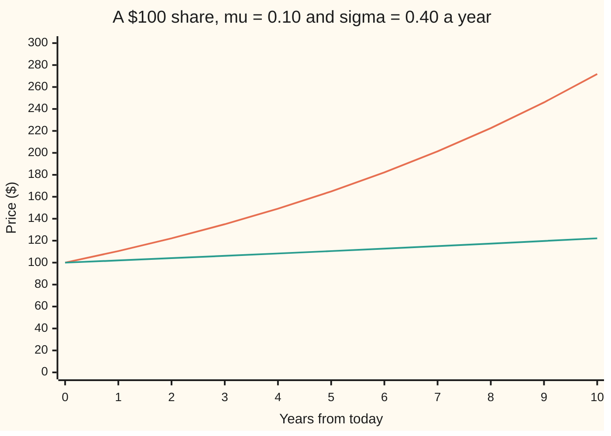
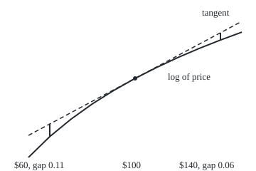
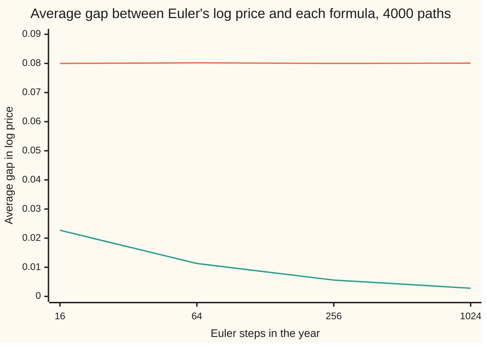

# Ito's lemma: the chain rule with a second-derivative term

Stochastic processes and calculus → Ito Calculus → Change of variables for random paths → Ito's lemma

---

## General Overview

A share trades at $100. Its rule is a rule for small steps: in each short slice of time the price drifts up at 10 percent a year on its current level, and takes a random kick scaled by 40 percent of that level. A typical year moves it about 40 percent up or down.

After a year the average price is $110.52. Yet the middle outcome, with half the runs above and half below, is only $102.02, and about 48 runs in 100 end below $100. Ordinary calculus, applied to the logarithm of the price, predicts a middle outcome of $110.52 and about 40 in 100 below. The difference is not noise. It is one term that ordinary calculus throws away.

The chain rule says how a function of a quantity changes when the quantity changes. On a random path it needs one more piece: half the function's second derivative times the squared size of the kicks. For the share's logarithm that piece is minus half of 0.40 squared, −0.08 a year, which turns a growth rate of 0.10 into 0.02.

**A smooth function of a random path changes by its slope times the step, plus half its curvature times the squared step, and for a random path the squared steps add up to time instead of to nothing.**

**What kind of fact this is:** a theorem, proved on this card in Why it works for a function of Brownian motion (the full argument in a folded Detailed proof), with the general version stated precisely and its proof named in Sources.

### The picture: the average share and the middle share, ten years out



The upper line is the average price, growing at 10 percent a year. The lower line is the middle price, growing at 2 percent a year. Ordinary calculus draws one line for both. After ten years the average is $271.83 and the middle is $122.14: a few runs that soar carry the average, while the typical run lags far behind.

---

## The formula

Reminders first. $W_t$ is Brownian motion, "the random walk seen from far away", with time $t$ in years; $X_t$ is the value at time $t$ of a moving process. The rule $dX_t = a\,dt + b\,dW_t$ says: in each short slice of time, drift by $a$ times the slice and take a kick of $b$ times the Brownian step. Here $dW_t$ is shorthand for an Ito integral ([ito-integral](01-ito-integral.md)), never a derivative: the Brownian path has no slope anywhere.

New notation, for a function $f(t, x)$: $f_t$ is its slope in time with $x$ held still, $f_x$ its slope in $x$ with time held still, and $f_{xx}$ the slope of $f_x$ in $x$, the curvature.

$$df(t, X_t) = \Big(f_t + a\, f_x + \tfrac12\,b^2 f_{xx}\Big)\,dt \;+\; b\, f_x\, dW_t$$

**Read it aloud:** the function drifts by its time slope, plus its slope times the drift, plus half its curvature times the squared kick size; and it is kicked by its slope times the kick.

In integral form, which is what the shorthand means:

$$f(T, X_T) = f(0, X_0) + \int_0^T \Big(f_t + a f_x + \tfrac12 b^2 f_{xx}\Big)\,dt + \int_0^T b f_x\, dW_t$$

The quick way to use it: expand to second order, $df = f_t\,dt + f_x\,dX + \tfrac12 f_{xx}\,(dX)^2$, and multiply out $(dX)^2$ with the table $dt \cdot dt = 0$, $dt \cdot dW = 0$, $dW \cdot dW = dt$. The last rule is the quadratic variation of Brownian motion, $[W]_t = t$ ([quadratic-variation](../05-Brownian%20Motion/03-quadratic-variation.md)), in shorthand.

| Symbol | Plain meaning | In our example | Push it up and the answer… |
| --- | --- | --- | --- |
| $S_t$, $S_0$ | the share price at time $t$; at the start | $S_0$ = $100 | — |
| $\mu$ | the share's drift: growth rate of its average, per year | 0.10 | log drift rises one for one |
| $\sigma$ | the share's volatility: size of its kicks, per square-root year | 0.40 | log drift falls by $\sigma$ times the rise |
| $t$, $T$, $dt$ | time in years; the horizon; a short slice of time | $T$ = 1 year | middle and average part further |
| $W_t$, $W_T$, $W_k$, $dW_t$, $dW$ | Brownian motion; at the horizon; at grid point k; its step, shorthand inside an Ito integral | $W_T$ squared is 2.234316 on path 1 | — |
| $X_t$, $X$, $dX$ | a general Ito process, $dX_t = a\,dt + b\,dW_t$, and its step | $W_t$ ($a = 0$, $b = 1$); the share, with drift $0.10\,S_t$ and kick $0.40\,S_t$ | — |
| $a$, $b$ | the general process's drift and kick sizes; they may change with time and the path | for the share, $a = \mu S_t$ and $b = \sigma S_t$ | the correction grows with $b^2$ |
| $f$ | the smooth function applied to the process | $\log x$, or $x^2$ | — |
| $f_t$, $f_x$, $f_{xx}$ | time slope, space slope, curvature; written $f'$, $f''$ (and $f'''$ for the next slope) when $f$ has no time argument | for $\log x$: 0, $1/x$, $-1/x^2$ | bigger curvature, bigger correction |
| $[X]_t$ | quadratic variation: the sum of squared steps up to $t$ | $[W]_1$ = 1 | — |
| $n$, $k$, $\Delta t$, $\Delta W_k$, $y$ | grid steps in a year; which step; one step's length; Brownian step k; one Euler step's relative move | 1024 steps, $\Delta t$ = 1/1024 | smaller error |
| $R_k$, $M$, $A_n$, $Y_j$, $K$ | proof bookkeeping: Taylor remainder, derivative bound, wobble sum, one wobble, cut-off level | — | — |
| $N(x)$ | bell-curve area to the left of $x$ | $N(-0.05)$ = 0.480061 | — |

Two worked uses carry the card.

For $f(x) = x^2$ on $X_t = W_t$ (so $a = 0$, $b = 1$): $f_x = 2x$, $f_{xx} = 2$, and

$$d(W_t^2) = 2W_t\,dW_t + dt, \qquad W_T^2 = 2\int_0^T W_t\,dW_t + T.$$

For $f(x) = \log x$ on the share, $dS_t = \mu S_t\,dt + \sigma S_t\,dW_t$: the drift size is $a = \mu S_t$ and the kick size is $b = \sigma S_t$, so $(dS_t)^2 = \sigma^2 S_t^2\,dt$, and

$$d(\log S_t) = \frac{dS_t}{S_t} - \frac12\,\frac{\sigma^2 S_t^2}{S_t^2}\,dt = \Big(\mu - \tfrac12\sigma^2\Big)\,dt + \sigma\,dW_t.$$

Integrating gives the share's price in closed form: $S_T = S_0 \exp\big((\mu - \tfrac12\sigma^2)T + \sigma W_T\big)$.

### When it holds

- **$f$ has a continuous curvature in $x$ and a continuous time slope.** At a kink the curvature is a spike: for $f(x) = |x|$ the formula needs an extra term, local time, which measures how long the path lingers at the kink.
- **The path is continuous.** A jump's square arrives in one instant, not spread over $dt$, so the dW-times-dW rule fails. Jump paths need their own version: [jump-diffusions](../09-Beyond%20Brownian/02-jump-diffusions.md).
- **The integral is Ito's, built from left-end sums.** From right ends, the sum for $\int W\,dW$ averages +0.9993 (standard error 0.0111) instead of zero (code below). Midpoints (Stratonovich's integral) keep the ordinary chain rule but lose the fair-game property.
- **The drift and kick sizes use only the past.** They may depend on time and the path so far, with $\int|a|\,dt$ and $\int b^2\,dt$ finite. A coefficient that peeks at the future breaks the left-end construction.
- **One Brownian motion.** Several correlated ones bring cross terms: [multidimensional-ito-and-correlation](06-multidimensional-ito-and-correlation.md).

---

## Why it works

### Step 0: Taylor to second order, and the second order refuses to vanish

For a smooth path, a small step $\Delta x$ changes $f$ by $f'\,\Delta x + \tfrac12 f''\,(\Delta x)^2 + \dots$ ([taylors-theorem](../../06-Calculus%20and%20analysis/03-What%20Derivatives%20Tell%20You/05-taylors-theorem.md)). Cut a year into $n$ steps. Each step is about $1/n$ in size, its square about $1/n^2$, and $n$ of those squares add to about $1/n$: nothing, as $n$ grows. That is why ordinary calculus stops at the first derivative.

A Brownian step over time $\Delta t$ has size about $\sqrt{\Delta t}$, so its square is about $\Delta t$. Then $n$ squares add up to about $n \cdot \Delta t = T$. The second-order term survives. Everything else on this card is that sentence made exact.

### The picture: why the log falls below its tangent

The log bends downward. A move of $40 up or down, one year's typical move, lands on the curve below the tangent, the line the ordinary chain rule follows.

<p align="center"></p>

Drawn to scale: 3 units across per dollar, 160 up per unit of log. Dashed: the tangent at $100. Solid: the log. The short bars are the gaps, 0.1108 at $60 and 0.0635 at $140; their average, 0.0872, is close to Ito's half of 0.40 squared, 0.08. The rest is higher Taylor terms, which a year-long move carries and a short step does not.

### Step 1: write the change as a sum of small changes

Cut the year into $n$ steps of length $\Delta t = T/n$, and let $W_k$ be the Brownian path at the end of step $k$, with $\Delta W_k = W_{k+1} - W_k$. The total change of $f(W)$ is the sum of the changes over the steps, because the middle values cancel in pairs:

$$f(W_T) - f(W_0) = \sum_{k} \big(f(W_{k+1}) - f(W_k)\big).$$

### Step 2: expand each small change

By Taylor's theorem, each term is $f'(W_k)\,\Delta W_k + \tfrac12 f''(W_k)\,(\Delta W_k)^2 + R_k$, where the remainder $R_k$ is at most a constant times $\lvert\Delta W_k\rvert^3$. Three sums appear: slopes times steps, curvatures times squared steps, and remainders.

### Step 3: the slope sum becomes the Ito integral

$\sum f'(W_k)\,\Delta W_k$ evaluates the slope at the left end of each step, before the step is known. That is exactly the sum that defines the Ito integral $\int f'(W_t)\,dW_t$ on [ito-integral](01-ito-integral.md), and it converges to it as the steps shrink. Each term has average zero, because the step ahead is independent of the slope already fixed.

### Step 4: the squared steps become time

Split each squared step into its average and a wobble: $(\Delta W_k)^2 = \Delta t + \big((\Delta W_k)^2 - \Delta t\big)$. The averages give $\sum \tfrac12 f''(W_k)\,\Delta t$, an ordinary sum of rectangles, which tends to $\tfrac12\int f''(W_t)\,dt$. The wobbles each average zero and are uncorrelated across steps; each has variance $2\,\Delta t^2$, so their total variance is about $n \cdot 2\Delta t^2 = 2T\Delta t$, which goes to zero. The squared steps behave, in the limit, as if they were $dt$ exactly. This is the quadratic variation $[W]_T = T$, proved on [quadratic-variation](../05-Brownian%20Motion/03-quadratic-variation.md), doing its work.

### Step 5: the remainders vanish

The average of $\lvert\Delta W_k\rvert^3$ is a constant times $\Delta t^{3/2}$, so the $n$ remainders add up to a constant times $T\sqrt{\Delta t}$, which goes to zero. Third order dies, as it does in ordinary calculus. What changed from ordinary calculus is only Step 4.

Together: $f(W_T) = f(W_0) + \int_0^T f'(W_t)\,dW_t + \tfrac12\int_0^T f''(W_t)\,dt$.

<details>
<summary>Detailed proof, for f with bounded first, second and third derivatives</summary>

Fix $T$ and $n$; write $\Delta t = T/n$, $W_k = W_{k\Delta t}$ and $\Delta W_k = W_{k+1} - W_k$. Let $M$ bound $\lvert f'\rvert$, $\lvert f''\rvert$ and $\lvert f'''\rvert$. Taylor's theorem with the Lagrange remainder gives, for each $k$,
$f(W_{k+1}) - f(W_k) = f'(W_k)\Delta W_k + \tfrac12 f''(W_k)(\Delta W_k)^2 + R_k$ with $\lvert R_k\rvert \le \tfrac16 M \lvert\Delta W_k\rvert^3$. Sum over $k$ from 0 to $n-1$; the left side telescopes to $f(W_T) - f(W_0)$.

**Slope sum.** $I_n = \sum f'(W_k)\Delta W_k$. The integrand $f'(W_t)$ is continuous, adapted (fixed by what is known at time $t$) and bounded, so by the construction on the ito-integral card $I_n \to \int_0^T f'(W_t)\,dW_t$ in mean square.

**Curvature sum.** Write $\tfrac12\sum f''(W_k)(\Delta W_k)^2 = \tfrac12\sum f''(W_k)\Delta t + \tfrac12 A_n$ with $A_n = \sum f''(W_k)\big((\Delta W_k)^2 - \Delta t\big)$. The first part is a Riemann sum of the continuous function $t \mapsto f''(W_t)$, so it tends to $\tfrac12\int_0^T f''(W_t)\,dt$ for every path. For $A_n$, let $Y_k = f''(W_k)((\Delta W_k)^2 - \Delta t)$. For $j < k$, $Y_j$ and $f''(W_k)$ are known at step $k$ while $\Delta W_k$ is independent of that knowledge with $E[(\Delta W_k)^2 - \Delta t] = 0$, so $E[Y_j Y_k] = 0$. Hence $E[A_n^2] = \sum E[f''(W_k)^2]\,E[((\Delta W_k)^2 - \Delta t)^2] \le M^2 \cdot n \cdot 2\Delta t^2 = 2M^2 T\Delta t \to 0$, using $E[Z^4] = 3$ for a standard normal $Z$, so that $\mathrm{Var}((\Delta W_k)^2) = 2\Delta t^2$.

**Remainders.** $E\sum\lvert R_k\rvert \le \tfrac16 M \cdot n \cdot E\lvert Z\rvert^3 \Delta t^{3/2} = \tfrac16 M\,E\lvert Z\rvert^3\,T\sqrt{\Delta t} \to 0$, with $E\lvert Z\rvert^3 = 2\sqrt{2/\pi}$.

**Assembling.** Each piece converges in mean square or in mean, hence in probability; along a subsequence of $n$ all converge almost surely, and the left side does not depend on $n$. So $f(W_T) = f(W_0) + \int_0^T f'(W_t)\,dW_t + \tfrac12\int_0^T f''(W_t)\,dt$ almost surely for each $T$. Both sides are continuous in $T$, so the identity holds for all $T$ at once, almost surely.

**What this card does not prove.** The general statement on this card's formula: $f(t, x)$ with only continuous $f_t$, $f_x$, $f_{xx}$, and $X$ a general Ito process. The proof has the same three sums. Time enters through an ordinary Riemann sum; the squared steps of $X$ are $b^2 (\Delta W)^2$ plus terms of order $\Delta t^{3/2}$ and $\Delta t^2$, which vanish; and bounded derivatives are not needed, because one stops the path when it first leaves a large interval $[-K, K]$ and lets $K$ grow (localisation). The complete argument is in Øksendal, Chapter 4, and in Karatzas and Shreve, Section 3.3, both in Sources.

</details>

### Step 6: from W to any Ito process, and the multiplication table

For a general Ito process each step is $\Delta X = a\Delta t + b\Delta W$, with square $a^2\Delta t^2 + 2ab\,\Delta t\,\Delta W + b^2(\Delta W)^2$. Summed over a year the first part is about $T\Delta t$ and the second about $T\sqrt{\Delta t}$: both vanish. Only $b^2(\Delta W)^2$ survives, and Step 4 turns it into $b^2\,dt$. That is the multiplication table. A time slope adds $f_t\,dt$ through an ordinary sum of rectangles, and the formula follows.

### Step 7: the two uses, and what they say

**W squared.** For $f(x) = x^2$ the expansion is exact with no remainder: $(W_k + \Delta W_k)^2 - W_k^2 = 2W_k\Delta W_k + (\Delta W_k)^2$. Summing,

$$W_T^2 = 2\sum W_k\,\Delta W_k + \sum (\Delta W_k)^2$$

holds exactly on every grid and every path. On the first simulated path $W_T^2$ = 2.234316: with 16 steps the Ito sum gives 1.333728 and the squares 0.900587; with 1024 steps, 1.163931 and 1.070385. The squares tend to $T$ = 1, with spread $\sqrt{2/n}$: 0.3536 at 16 steps, 0.0442 at 1024. The ordinary chain rule keeps only $2\int W\,dW$, whose average is zero. But a square that is not always zero cannot average zero: the dt term makes $E[W_T^2] = T$.

**The share's log.** The log's curvature is negative, so the Ito term subtracts: $\tfrac12 \cdot (-1/S^2) \cdot \sigma^2 S^2$ = $-0.08$, and the log drifts at 0.02 a year. Since $\sigma W_T$ is symmetric about zero, the middle price is $100\,e^{0.02}$ = \$102.02, and the chance of ending below \$100 is $N(-0.02/0.40) = N(-0.05)$ = 0.480061. The average price is still \$110.52, because $E[e^{\sigma W_T}] = e^{\sigma^2 T/2}$ puts the 0.08 back.

A second road to 0.02 avoids Ito. Euler's step rule moves the share by $S_{k+1} = S_k(1 + \mu\Delta t + \sigma\Delta W_k)$, so each step adds the log of the bracket to the log price. Taylor's $\log(1 + y) \approx y - \tfrac12 y^2$, where $y$ is the step's relative move, already shows the half: $y$ averages $\mu\Delta t$ and $y^2$ about $\sigma^2\Delta t$. The code averages the exact log over the bell curve and watches it close on 0.02 as the steps shrink.

---

## Worked numbers, by hand

The share: $S_0$ = \$100, $\mu$ = 0.10 and $\sigma$ = 0.40 a year, $T$ = 1 year.

| Step | Arithmetic | Value |
| --- | --- | --- |
| kick size squared | 0.40 × 0.40 | 0.16 |
| Ito term for the log | half of 0.16, with the log's negative curvature | −0.08 |
| log drift | 0.10 − 0.08 | **0.02** |
| middle price after a year | 100 × e^0.02 | $102.02 |
| average price after a year | 100 × e^0.10 | $110.52 |
| spread of the log after a year | 0.40 × the square root of 1 | 0.40 |
| where $100 sits, in spreads from the middle | −0.02 ÷ 0.40 | −0.05 |
| chance of ending below $100 | N(−0.05) | **0.4801** |

In about 48 runs out of 100 the share ends below where it started, although its average grows 10 percent a year. The average is held up by the runs that soar.

### What breaks if you drop a piece

| Mistake | Comes out at | What went wrong |
| --- | --- | --- |
| Ordinary chain rule on $W^2$: $d(W^2) = 2W\,dW$ | average $W_T^2$ of 2 × (−0.0018), essentially 0; the true average is 1, simulated 0.9975 (se 0.0222) | the squared steps add up to $T$, not to nothing |
| Ordinary chain rule on $\log S$: drift $\mu$ | middle price $110.52, chance below $100 of 0.4013 | the middle and the average are confused; the right values are $102.02 and 0.4801 |
| Right-end sums instead of left-end sums | the sum for $\int W\,dW$ averages +0.9993, not 0 | the integrand peeked at the step it multiplies |
| Plus sign on the correction | log drift 0.1800, middle price $119.72 | the log curves down, so its correction is negative |

---

## Code, from first principles, and it actually runs

The code takes four roads to the log drift of 0.02. Road 1 is the formula. Road 2 averages Euler's step rule exactly over the bell curve by Simpson's rule, with no Ito in it, at 16 to 1024 steps a year. Road 3 runs 4000 seeded one-year paths (SplitMix64, normals by Box-Muller) on nested grids, the coarse grids adding up the same fine Brownian steps, with every mean printed beside its standard error. Road 4 compares each path with Ito's closed form for that same path, $\log S_T = \log S_0 + 0.02 + 0.40\,W_T$, and with the ordinary version. The same paths check $W^2$.

### Python

```python
# Ito's lemma -- the check behind the card.  Only math is imported.
# A $100 share follows dS = mu S dt + sigma S dW, mu = 0.10, sigma = 0.40 a year.
# Roads to the log drift mu - sigma^2/2 = 0.02: the formula; Euler's step rule
# averaged exactly by Simpson's rule (no Ito used); 4000 seeded paths, checked
# path by path; and W squared split exactly into an Ito sum plus its squares.
import math

S0, MU, SIG, T = 100.0, 0.10, 0.40, 1.0
SEED, PATHS, FINE, GRIDS = 20260930, 4000, 1024, (16, 64, 256, 1024)
MASK = (1 << 64) - 1

class SplitMix64:                         # the wing's generator, written out
    def __init__(self, seed):
        self.s = seed & MASK
    def uniform(self):
        self.s = (self.s + 0x9E3779B97F4A7C15) & MASK
        z = self.s
        z = ((z ^ (z >> 30)) * 0xBF58476D1CE4E5B9) & MASK
        z = ((z ^ (z >> 27)) * 0x94D049BB133111EB) & MASK
        return ((z ^ (z >> 31)) >> 11) / 9007199254740992.0
    def normal(self):                     # Box-Muller, cosine half
        u1, u2 = self.uniform(), self.uniform()
        return math.sqrt(-2.0 * math.log(1.0 - u1)) * math.cos(2.0 * math.pi * u2)

def phi(z):                               # bell-curve height
    return math.exp(-0.5 * z * z) / math.sqrt(2.0 * math.pi)

def simpson(f, a, b, n):
    h = (b - a) / n
    s = f(a) + f(b)
    for i in range(1, n):
        s += (4 if i % 2 else 2) * f(a + i * h)
    return s * h / 3.0

def ncdf(x):                              # bell-curve area left of x
    return 0.5 + simpson(phi, 0.0, x, 2000)

def euler_log_drift(n):                   # n E[log(1 + mu dt + sigma sqrt(dt) Z)] / T
    dt = T / n
    f = lambda z: math.log(1.0 + MU * dt + SIG * math.sqrt(dt) * z) * phi(z)
    return n * simpson(f, -9.0, 9.0, 6000) / T

ito, naive, wrong_sign = MU - 0.5 * SIG * SIG, MU, MU + 0.5 * SIG * SIG
print(f"share: S0 {S0:.0f} dollars, mu {MU:.2f} and sigma {SIG:.2f} a year, T {T:.0f} year")
print(f"road 1, Ito's lemma: log drift mu - sigma^2/2   {ito:.6f}")
print(f"ordinary chain rule: log drift mu               {naive:.6f}")
print(f"median price after a year, S0 e^(0.02)          {S0 * math.exp(ito * T):.4f}")
print(f"mean price after a year, S0 e^(0.10)            {S0 * math.exp(MU * T):.4f}")
p_below = ncdf(-ito * T / (SIG * math.sqrt(T)))
print(f"chance below 100 after a year, N(-0.05)         {p_below:.6f}")

print("road 2, Euler's rule averaged exactly over the bell curve:")
errs = []
for n in GRIDS:
    d, mp = euler_log_drift(n), S0 * (1.0 + MU * T / n) ** n
    errs.append(d - ito)
    print(f"  steps {n:5d}   log drift {d:.6f}   error {d - ito:+.6f}   mean price {mp:.4f}")

g = SplitMix64(SEED)
acc = {n: [0.0] * 6 for n in GRIDS}   # log, log^2, |gap to Ito|, |gap to ordinary|, their squares
price, price2, below = 0.0, 0.0, 0
w2, w4, left, left2, right, right2 = 0.0, 0.0, 0.0, 0.0, 0.0, 0.0
first = []
for p in range(PATHS):
    dw = [g.normal() * math.sqrt(T / FINE) for _ in range(FINE)]
    wT = sum(dw)
    for n in GRIDS:
        m, dt, s = FINE // n, T / n, S0
        w, lsum, qv = 0.0, 0.0, 0.0
        for k in range(n):
            step = sum(dw[k * m:(k + 1) * m])
            s *= 1.0 + MU * dt + SIG * step
            lsum += w * step
            qv += step * step
            w += step
        lg = math.log(s / S0)
        a = acc[n]
        gi, go = abs(lg - ito * T - SIG * wT), abs(lg - naive * T - SIG * wT)
        a[0] += lg; a[1] += lg * lg; a[2] += gi; a[3] += go; a[4] += gi * gi; a[5] += go * go
        if p == 0:
            first.append((n, wT * wT, 2.0 * lsum, qv))
    price += s; price2 += s * s; below += 1 if s < S0 else 0
    w2 += wT * wT; w4 += wT ** 4; left += lsum; left2 += lsum * lsum
    right += lsum + qv; right2 += (lsum + qv) ** 2

print(f"road 3, {PATHS} seeded paths (seed {SEED}), one-year Euler runs on nested grids:")
for n in GRIDS:
    a = acc[n]
    mean = a[0] / PATHS
    se, gi, go = (math.sqrt((a[q] / PATHS - (a[k] / PATHS) ** 2) / PATHS) for k, q in ((0, 1), (2, 4), (3, 5)))
    print(f"  steps {n:5d}   mean log drift {mean:.4f} (se {se:.4f})   |gap to Ito| {a[2] / PATHS:.4f}"
          f" (se {gi:.5f})   |gap to ordinary| {a[3] / PATHS:.4f} (se {go:.5f})")
mlog = acc[1024][0] / PATHS
se_log = math.sqrt((acc[1024][1] / PATHS - mlog * mlog) / PATHS)
mprice = price / PATHS; se_price = math.sqrt((price2 / PATHS - mprice * mprice) / PATHS)
frac = below / PATHS; se_frac = math.sqrt(frac * (1.0 - frac) / PATHS)
print(f"  1024 steps: mean price {mprice:.2f} (se {se_price:.2f}), below 100 {frac:.4f} (se {se_frac:.4f})")

print("W squared on path 1: W_T^2 = 2 sum W dW + sum dW^2, exactly")
for n, wsq, two_left, qv in first:
    print(f"  steps {n:5d}   W_T^2 {wsq:.6f}   2 sum W dW {two_left:+.6f}   sum dW^2 {qv:.6f}"
          f"   sd of sum dW^2 {math.sqrt(2.0 / n):.4f}")
mw2, mleft, mright = w2 / PATHS, left / PATHS, right / PATHS
se_w2 = math.sqrt((w4 / PATHS - mw2 * mw2) / PATHS)
se_left = math.sqrt((left2 / PATHS - mleft * mleft) / PATHS)
se_right = math.sqrt((right2 / PATHS - mright * mright) / PATHS)
print(f"W squared over {PATHS} paths, 1024 steps: mean W_T^2 {mw2:.4f} (se {se_w2:.4f})")
print(f"  mean of sum W dW, left ends {mleft:+.4f} (se {se_left:.4f});  right ends {mright:+.4f} (se {se_right:.4f})")

print("what breaks:")
print(f"  ordinary rule on W^2: mean W_T^2 would be 2 x {mleft:+.4f}; it is {mw2:.4f}")
print(f"  ordinary rule on log S: median {S0 * math.exp(naive * T):.2f}, below 100"
      f" {ncdf(-naive * T / (SIG * math.sqrt(T))):.4f}")
print(f"  plus sign on sigma^2/2: log drift {wrong_sign:.4f}, median {S0 * math.exp(wrong_sign * T):.2f}")

print("chart, years " + " ".join(f"{t:7d}" for t in range(11)))
print("chart, mean   " + " ".join(f"{S0 * math.exp(MU * t):7.2f}" for t in range(11)))
print("chart, median " + " ".join(f"{S0 * math.exp(ito * t):7.2f}" for t in range(11)))

gaps = [math.log(x / 100.0) - (x - 100.0) / 100.0 for x in (60.0, 140.0)]
print(f"convexity: log gap below tangent at 60 {gaps[0]:+.4f}, at 140 {gaps[1]:+.4f},"
      f" average {(gaps[0] + gaps[1]) / 2:+.4f}; Ito's -sigma^2/2 {-0.5 * SIG * SIG:+.4f}")
pts = [(40 + 3 * (x - 50), 110 - 160 * math.log(x / 100.0)) for x in range(50, 151, 10)]
print("figure, curve " + " ".join(f"{px:.0f},{py:.1f}" for px, py in pts))
print(f"figure, tangent 40,{110 - 160 * -0.5:.1f} 340,{110 - 160 * 0.5:.1f};"
      f" at 60 tangent {110 - 160 * -0.4:.1f} curve {110 - 160 * math.log(0.6):.1f};"
      f" at 140 tangent {110 - 160 * 0.4:.1f} curve {110 - 160 * math.log(1.4):.1f}")

assert abs(errs[-1]) < 1e-4, "Euler's exact log drift must close on mu - sigma^2/2"
assert abs(errs[0]) > abs(errs[1]) > abs(errs[2]) > abs(errs[3]), "the step error must shrink"
assert abs(mlog - ito) < 4 * se_log, "simulated log drift within 4 se of Ito"
assert abs(mlog - naive) > 8 * se_log, "the ordinary chain rule is measurably wrong"
assert acc[1024][2] / PATHS < 0.01, "path by path, Euler closes on Ito's formula"
assert acc[1024][2] < acc[16][2] / 4, "the path-by-path gap shrinks with the step"
assert acc[1024][3] / PATHS > 0.07, "the ordinary formula stays 0.08 off on every grid"
assert abs(mw2 - T) < 4 * se_w2, "E[W_T^2] = T, the dt term of Ito on x^2"
assert abs(mleft) < 4 * se_left, "the Ito sum has mean zero"
assert abs(mright - T) < 4 * se_right, "the right-end sum has mean T, not zero"
assert abs(frac - p_below) < 4 * se_frac, "chance below 100 matches N(-0.05)"
print("ALL CHECKS PASS")
```

**Ran 2026-10-06 on macOS, Python 3.14.6, standard library only. All checks passed. Output, pasted from the run:**

```
share: S0 100 dollars, mu 0.10 and sigma 0.40 a year, T 1 year
road 1, Ito's lemma: log drift mu - sigma^2/2   0.020000
ordinary chain rule: log drift mu               0.100000
median price after a year, S0 e^(0.02)          102.0201
mean price after a year, S0 e^(0.10)            110.5171
chance below 100 after a year, N(-0.05)         0.480061
road 2, Euler's rule averaged exactly over the bell curve:
  steps    16   log drift 0.019468   error -0.000532   mean price 110.4827
  steps    64   log drift 0.019871   error -0.000129   mean price 110.5085
  steps   256   log drift 0.019968   error -0.000032   mean price 110.5149
  steps  1024   log drift 0.019992   error -0.000008   mean price 110.5166
road 3, 4000 seeded paths (seed 20260930), one-year Euler runs on nested grids:
  steps    16   mean log drift 0.0193 (se 0.0064)   |gap to Ito| 0.0227 (se 0.00028)   |gap to ordinary| 0.0800 (se 0.00046)
  steps    64   mean log drift 0.0192 (se 0.0063)   |gap to Ito| 0.0113 (se 0.00014)   |gap to ordinary| 0.0802 (se 0.00023)
  steps   256   mean log drift 0.0193 (se 0.0063)   |gap to Ito| 0.0056 (se 0.00007)   |gap to ordinary| 0.0800 (se 0.00011)
  steps  1024   mean log drift 0.0192 (se 0.0063)   |gap to Ito| 0.0028 (se 0.00003)   |gap to ordinary| 0.0801 (se 0.00006)
  1024 steps: mean price 110.39 (se 0.72), below 100 0.4823 (se 0.0079)
W squared on path 1: W_T^2 = 2 sum W dW + sum dW^2, exactly
  steps    16   W_T^2 2.234316   2 sum W dW +1.333728   sum dW^2 0.900587   sd of sum dW^2 0.3536
  steps    64   W_T^2 2.234316   2 sum W dW +1.376997   sum dW^2 0.857319   sd of sum dW^2 0.1768
  steps   256   W_T^2 2.234316   2 sum W dW +1.013974   sum dW^2 1.220341   sd of sum dW^2 0.0884
  steps  1024   W_T^2 2.234316   2 sum W dW +1.163931   sum dW^2 1.070385   sd of sum dW^2 0.0442
W squared over 4000 paths, 1024 steps: mean W_T^2 0.9975 (se 0.0222)
  mean of sum W dW, left ends -0.0018 (se 0.0111);  right ends +0.9993 (se 0.0111)
what breaks:
  ordinary rule on W^2: mean W_T^2 would be 2 x -0.0018; it is 0.9975
  ordinary rule on log S: median 110.52, below 100 0.4013
  plus sign on sigma^2/2: log drift 0.1800, median 119.72
chart, years       0       1       2       3       4       5       6       7       8       9      10
chart, mean    100.00  110.52  122.14  134.99  149.18  164.87  182.21  201.38  222.55  245.96  271.83
chart, median  100.00  102.02  104.08  106.18  108.33  110.52  112.75  115.03  117.35  119.72  122.14
convexity: log gap below tangent at 60 -0.1108, at 140 -0.0635, average -0.0872; Ito's -sigma^2/2 -0.0800
figure, curve 40,220.9 70,191.7 100,167.1 130,145.7 160,126.9 190,110.0 220,94.8 250,80.8 280,68.0 310,56.2 340,45.1
figure, tangent 40,190.0 340,30.0; at 60 tangent 174.0 curve 191.7; at 140 tangent 46.0 curve 56.2
ALL CHECKS PASS
```

Road 2 closes on 0.02, the error falling fourfold each time the steps are cut by four: 0.000532 short at 16 steps, 0.000008 at 1024. Road 3's mean log drift, 0.0192 with standard error 0.0063, sits within one standard error of 0.02 and more than eight from 0.10. Path by path, Euler's log misses Ito's closed form by 0.0227 on average at 16 steps and 0.0028 at 1024; the ordinary formula misses by about 0.080 on every grid, with standard errors below 0.0005 throughout. The simulated chance of ending below \$100, 0.4823 with standard error 0.0079, matches $N(-0.05)$ = 0.4801.

### Rust

```rust
// Ito's lemma -- the same check as itos_lemma_check.py, in Rust.  Std only, no crates.
// A $100 share follows dS = mu S dt + sigma S dW, mu = 0.10, sigma = 0.40 a year.
// Roads to the log drift mu - sigma^2/2 = 0.02: the formula; Euler's step rule
// averaged exactly by Simpson's rule (no Ito used); 4000 seeded paths, checked
// path by path; and W squared split exactly into an Ito sum plus its squares.
use std::f64::consts::PI;

const S0: f64 = 100.0;
const MU: f64 = 0.10;
const SIG: f64 = 0.40;
const T: f64 = 1.0;
const SEED: u64 = 20260930;
const PATHS: usize = 4000;
const FINE: usize = 1024;
const GRIDS: [usize; 4] = [16, 64, 256, 1024];

struct SplitMix64 { s: u64 }                      // the wing's generator, written out
impl SplitMix64 {
    fn uniform(&mut self) -> f64 {
        self.s = self.s.wrapping_add(0x9E3779B97F4A7C15);
        let mut z = self.s;
        z = (z ^ (z >> 30)).wrapping_mul(0xBF58476D1CE4E5B9);
        z = (z ^ (z >> 27)).wrapping_mul(0x94D049BB133111EB);
        ((z ^ (z >> 31)) >> 11) as f64 / 9007199254740992.0
    }
    fn normal(&mut self) -> f64 {                 // Box-Muller, cosine half
        let (u1, u2) = (self.uniform(), self.uniform());
        (-2.0 * (1.0 - u1).ln()).sqrt() * (2.0 * PI * u2).cos()
    }
}

fn phi(z: f64) -> f64 { (-0.5 * z * z).exp() / (2.0 * PI).sqrt() }   // bell-curve height

fn simpson<F: Fn(f64) -> f64>(f: F, a: f64, b: f64, n: usize) -> f64 {
    let h = (b - a) / n as f64;
    let mut s = f(a) + f(b);
    for i in 1..n { s += if i % 2 == 1 { 4.0 } else { 2.0 } * f(a + i as f64 * h); }
    s * h / 3.0
}

fn ncdf(x: f64) -> f64 { 0.5 + simpson(phi, 0.0, x, 2000) }         // area left of x

fn euler_log_drift(n: usize) -> f64 {             // n E[log(1 + mu dt + sigma sqrt(dt) Z)] / T
    let dt = T / n as f64;
    let f = |z: f64| (1.0 + MU * dt + SIG * dt.sqrt() * z).ln() * phi(z);
    n as f64 * simpson(f, -9.0, 9.0, 6000) / T
}

fn main() {
    let (ito, naive, wrong_sign) = (MU - 0.5 * SIG * SIG, MU, MU + 0.5 * SIG * SIG);
    let pf = PATHS as f64;
    println!("share: S0 {:.0} dollars, mu {:.2} and sigma {:.2} a year, T {:.0} year", S0, MU, SIG, T);
    println!("road 1, Ito's lemma: log drift mu - sigma^2/2   {:.6}", ito);
    println!("ordinary chain rule: log drift mu               {:.6}", naive);
    println!("median price after a year, S0 e^(0.02)          {:.4}", S0 * (ito * T).exp());
    println!("mean price after a year, S0 e^(0.10)            {:.4}", S0 * (MU * T).exp());
    let p_below = ncdf(-ito * T / (SIG * T.sqrt()));
    println!("chance below 100 after a year, N(-0.05)         {:.6}", p_below);

    println!("road 2, Euler's rule averaged exactly over the bell curve:");
    let mut errs = Vec::new();
    for &n in GRIDS.iter() {
        let (d, mp) = (euler_log_drift(n), S0 * (1.0 + MU * T / n as f64).powf(n as f64));
        errs.push(d - ito);
        println!("  steps {:5}   log drift {:.6}   error {:+.6}   mean price {:.4}", n, d, d - ito, mp);
    }

    let mut g = SplitMix64 { s: SEED };
    let mut acc = [[0.0f64; 6]; 4];               // per grid: log, log^2, |gap to Ito|, |gap to ordinary|, their squares
    let (mut price, mut price2, mut below) = (0.0f64, 0.0f64, 0usize);
    let (mut w2, mut w4, mut left, mut left2, mut right, mut right2) = (0.0f64, 0.0f64, 0.0f64, 0.0f64, 0.0f64, 0.0f64);
    let mut first: Vec<(usize, f64, f64, f64)> = Vec::new();
    for p in 0..PATHS {
        let dw: Vec<f64> = (0..FINE).map(|_| g.normal() * (T / FINE as f64).sqrt()).collect();
        let wt: f64 = dw.iter().sum();
        let (mut s, mut lsum, mut qv) = (S0, 0.0f64, 0.0f64);
        for (gi, &n) in GRIDS.iter().enumerate() {
            let (m, dt) = (FINE / n, T / n as f64);
            s = S0;
            let mut w = 0.0f64;
            lsum = 0.0;
            qv = 0.0;
            for k in 0..n {
                let step: f64 = dw[k * m..(k + 1) * m].iter().sum();
                s *= 1.0 + MU * dt + SIG * step;
                lsum += w * step;
                qv += step * step;
                w += step;
            }
            let lg = (s / S0).ln();
            let a = &mut acc[gi];
            let (gi, go) = ((lg - ito * T - SIG * wt).abs(), (lg - naive * T - SIG * wt).abs());
            a[0] += lg; a[1] += lg * lg; a[2] += gi; a[3] += go; a[4] += gi * gi; a[5] += go * go;
            if p == 0 { first.push((n, wt * wt, 2.0 * lsum, qv)); }
        }
        price += s; price2 += s * s; below += if s < S0 { 1 } else { 0 };
        w2 += wt * wt; w4 += wt.powf(4.0); left += lsum; left2 += lsum * lsum;
        right += lsum + qv; right2 += (lsum + qv) * (lsum + qv);
    }

    println!("road 3, {} seeded paths (seed {}), one-year Euler runs on nested grids:", PATHS, SEED);
    for (gi, &n) in GRIDS.iter().enumerate() {
        let a = acc[gi];
        let mean = a[0] / pf;
        let se = |k: usize, q: usize| ((a[q] / pf - (a[k] / pf).powi(2)) / pf).sqrt();
        println!("  steps {:5}   mean log drift {:.4} (se {:.4})   |gap to Ito| {:.4} (se {:.5})   |gap to ordinary| {:.4} (se {:.5})",
                 n, mean, se(0, 1), a[2] / pf, se(2, 4), a[3] / pf, se(3, 5));
    }
    let mlog = acc[3][0] / pf;
    let se_log = ((acc[3][1] / pf - mlog * mlog) / pf).sqrt();
    let mprice = price / pf;
    let se_price = ((price2 / pf - mprice * mprice) / pf).sqrt();
    let frac = below as f64 / pf;
    let se_frac = (frac * (1.0 - frac) / pf).sqrt();
    println!("  1024 steps: mean price {:.2} (se {:.2}), below 100 {:.4} (se {:.4})", mprice, se_price, frac, se_frac);

    println!("W squared on path 1: W_T^2 = 2 sum W dW + sum dW^2, exactly");
    for &(n, wsq, two_left, qv) in first.iter() {
        println!("  steps {:5}   W_T^2 {:.6}   2 sum W dW {:+.6}   sum dW^2 {:.6}   sd of sum dW^2 {:.4}",
                 n, wsq, two_left, qv, (2.0 / n as f64).sqrt());
    }
    let (mw2, mleft, mright) = (w2 / pf, left / pf, right / pf);
    let se_w2 = ((w4 / pf - mw2 * mw2) / pf).sqrt();
    let se_left = ((left2 / pf - mleft * mleft) / pf).sqrt();
    let se_right = ((right2 / pf - mright * mright) / pf).sqrt();
    println!("W squared over {} paths, 1024 steps: mean W_T^2 {:.4} (se {:.4})", PATHS, mw2, se_w2);
    println!("  mean of sum W dW, left ends {:+.4} (se {:.4});  right ends {:+.4} (se {:.4})", mleft, se_left, mright, se_right);

    println!("what breaks:");
    println!("  ordinary rule on W^2: mean W_T^2 would be 2 x {:+.4}; it is {:.4}", mleft, mw2);
    println!("  ordinary rule on log S: median {:.2}, below 100 {:.4}",
             S0 * (naive * T).exp(), ncdf(-naive * T / (SIG * T.sqrt())));
    println!("  plus sign on sigma^2/2: log drift {:.4}, median {:.2}", wrong_sign, S0 * (wrong_sign * T).exp());

    let years: Vec<f64> = (0..11).map(|t| t as f64).collect();
    let row = |f: &dyn Fn(f64) -> String| years.iter().map(|&t| f(t)).collect::<Vec<_>>().join(" ");
    println!("chart, years {}", row(&|t| format!("{:7}", t as i64)));
    println!("chart, mean   {}", row(&|t| format!("{:7.2}", S0 * (MU * t).exp())));
    println!("chart, median {}", row(&|t| format!("{:7.2}", S0 * (ito * t).exp())));

    let gaps: Vec<f64> = [60.0f64, 140.0].iter().map(|&x| (x / 100.0).ln() - (x - 100.0) / 100.0).collect();
    println!("convexity: log gap below tangent at 60 {:+.4}, at 140 {:+.4}, average {:+.4}; Ito's -sigma^2/2 {:+.4}",
             gaps[0], gaps[1], (gaps[0] + gaps[1]) / 2.0, -0.5 * SIG * SIG);
    let pts: Vec<String> = (0..11).map(|i| {
        let x = 50.0 + 10.0 * i as f64;
        format!("{:.0},{:.1}", 40.0 + 3.0 * (x - 50.0), 110.0 - 160.0 * (x / 100.0).ln())
    }).collect();
    println!("figure, curve {}", pts.join(" "));
    println!("figure, tangent 40,{:.1} 340,{:.1}; at 60 tangent {:.1} curve {:.1}; at 140 tangent {:.1} curve {:.1}",
             110.0 - 160.0 * -0.5, 110.0 - 160.0 * 0.5, 110.0 - 160.0 * -0.4, 110.0 - 160.0 * 0.6f64.ln(),
             110.0 - 160.0 * 0.4, 110.0 - 160.0 * 1.4f64.ln());

    assert!(errs[3].abs() < 1e-4, "Euler's exact log drift must close on mu - sigma^2/2");
    assert!(errs[0].abs() > errs[1].abs() && errs[1].abs() > errs[2].abs() && errs[2].abs() > errs[3].abs(),
            "the step error must shrink");
    assert!((mlog - ito).abs() < 4.0 * se_log, "simulated log drift within 4 se of Ito");
    assert!((mlog - naive).abs() > 8.0 * se_log, "the ordinary chain rule is measurably wrong");
    assert!(acc[3][2] / pf < 0.01, "path by path, Euler closes on Ito's formula");
    assert!(acc[3][2] < acc[0][2] / 4.0, "the path-by-path gap shrinks with the step");
    assert!(acc[3][3] / pf > 0.07, "the ordinary formula stays 0.08 off on every grid");
    assert!((mw2 - T).abs() < 4.0 * se_w2, "E[W_T^2] = T, the dt term of Ito on x^2");
    assert!(mleft.abs() < 4.0 * se_left, "the Ito sum has mean zero");
    assert!((mright - T).abs() < 4.0 * se_right, "the right-end sum has mean T, not zero");
    assert!((frac - p_below).abs() < 4.0 * se_frac, "chance below 100 matches N(-0.05)");
    println!("ALL CHECKS PASS");
}
```

**Ran 2026-10-06 on macOS, rustc 1.98.1, no crates. All checks passed. Output, pasted from the run:**

```
share: S0 100 dollars, mu 0.10 and sigma 0.40 a year, T 1 year
road 1, Ito's lemma: log drift mu - sigma^2/2   0.020000
ordinary chain rule: log drift mu               0.100000
median price after a year, S0 e^(0.02)          102.0201
mean price after a year, S0 e^(0.10)            110.5171
chance below 100 after a year, N(-0.05)         0.480061
road 2, Euler's rule averaged exactly over the bell curve:
  steps    16   log drift 0.019468   error -0.000532   mean price 110.4827
  steps    64   log drift 0.019871   error -0.000129   mean price 110.5085
  steps   256   log drift 0.019968   error -0.000032   mean price 110.5149
  steps  1024   log drift 0.019992   error -0.000008   mean price 110.5166
road 3, 4000 seeded paths (seed 20260930), one-year Euler runs on nested grids:
  steps    16   mean log drift 0.0193 (se 0.0064)   |gap to Ito| 0.0227 (se 0.00028)   |gap to ordinary| 0.0800 (se 0.00046)
  steps    64   mean log drift 0.0192 (se 0.0063)   |gap to Ito| 0.0113 (se 0.00014)   |gap to ordinary| 0.0802 (se 0.00023)
  steps   256   mean log drift 0.0193 (se 0.0063)   |gap to Ito| 0.0056 (se 0.00007)   |gap to ordinary| 0.0800 (se 0.00011)
  steps  1024   mean log drift 0.0192 (se 0.0063)   |gap to Ito| 0.0028 (se 0.00003)   |gap to ordinary| 0.0801 (se 0.00006)
  1024 steps: mean price 110.39 (se 0.72), below 100 0.4823 (se 0.0079)
W squared on path 1: W_T^2 = 2 sum W dW + sum dW^2, exactly
  steps    16   W_T^2 2.234316   2 sum W dW +1.333728   sum dW^2 0.900587   sd of sum dW^2 0.3536
  steps    64   W_T^2 2.234316   2 sum W dW +1.376997   sum dW^2 0.857319   sd of sum dW^2 0.1768
  steps   256   W_T^2 2.234316   2 sum W dW +1.013974   sum dW^2 1.220341   sd of sum dW^2 0.0884
  steps  1024   W_T^2 2.234316   2 sum W dW +1.163931   sum dW^2 1.070385   sd of sum dW^2 0.0442
W squared over 4000 paths, 1024 steps: mean W_T^2 0.9975 (se 0.0222)
  mean of sum W dW, left ends -0.0018 (se 0.0111);  right ends +0.9993 (se 0.0111)
what breaks:
  ordinary rule on W^2: mean W_T^2 would be 2 x -0.0018; it is 0.9975
  ordinary rule on log S: median 110.52, below 100 0.4013
  plus sign on sigma^2/2: log drift 0.1800, median 119.72
chart, years       0       1       2       3       4       5       6       7       8       9      10
chart, mean    100.00  110.52  122.14  134.99  149.18  164.87  182.21  201.38  222.55  245.96  271.83
chart, median  100.00  102.02  104.08  106.18  108.33  110.52  112.75  115.03  117.35  119.72  122.14
convexity: log gap below tangent at 60 -0.1108, at 140 -0.0635, average -0.0872; Ito's -sigma^2/2 -0.0800
figure, curve 40,220.9 70,191.7 100,167.1 130,145.7 160,126.9 190,110.0 220,94.8 250,80.8 280,68.0 310,56.2 340,45.1
figure, tangent 40,190.0 340,30.0; at 60 tangent 174.0 curve 191.7; at 140 tangent 46.0 curve 56.2
ALL CHECKS PASS
```

The two outputs agree line for line. Both use the same generator and the same Box-Muller formula. Python's `sum()` adds floats with compensation (Python 3.12 on) and Rust's adds them plainly, so the simulated numbers can differ in their last bits, below every printed digit.

### The picture: path by path, Ito's formula against the ordinary one



The flat upper line is the ordinary chain rule's formula, $\log S_0 + 0.10 + 0.40\,W_T$: it stays 0.08 off however fine the grid. The falling lower line is Ito's, $\log S_0 + 0.02 + 0.40\,W_T$: the gap is only Euler's step error, and it halves each time the steps are cut by four. Each point is an average over the same 4000 sampled paths, not a single path.

> [!TIP]
> **Try changing**
> - **Guess first: halve the kicks.** Set `SIG = 0.20`. The correction shrinks fourfold, since it goes with sigma squared, and the assert "the ordinary chain rule is measurably wrong" fails: the gap between the two drifts shrinks to 0.02, about 6 standard errors at 4000 paths, under the assert's bar of 8.
> - **Guess first: does the left end matter?** Change `lsum += w * step` to `lsum += (w + step) * step`. The Ito sum's average jumps to about +1, the right-end value printed above, and the assert "the Ito sum has mean zero" fails.
> - **Guess first: will Euler close on the ordinary drift?** Set `ito` to `MU`. The first assert fails at once: Euler's exactly averaged log drift stays near 0.02 on every grid.
> - **Guess first: four times the paths.** Set `PATHS = 16000`. Every standard error roughly halves; the exact roads do not move.
---

## The usual mistake

> [!warning]
> **Treating $dW_t$ as a small number, like $dt$.** It is shorthand for an integral, and a Brownian step over a short time is of size the square root of the time, far larger than the time. Its square is the size of $dt$ and survives the sum. Ordinary calculus on a random path makes this mistake silently; on the share it puts the middle price after a year at $110.52 instead of $102.02.
>
> - **Confusing the average's growth with the typical path's growth.** $\mu$ = 0.10 is the growth rate of the average price; the middle price grows at 0.02. Both are right; they answer different questions.
> - **Forgetting that the kick size can carry the state.** For the share, the kick is $\sigma S_t$, not $\sigma$, so $(dS)^2 = \sigma^2 S^2\,dt$. Using $\sigma^2$ alone in the log's correction gives $-\tfrac12\sigma^2/S^2$, too small by a factor of the price squared.
> - **Mixing Ito and Stratonovich.** The midpoint integral keeps the ordinary chain rule. A formula derived one way and simulated the other is off by the Ito term.
> - **Using the lemma across a jump.** A jump's square is not $dt$; the lemma as stated misses it entirely.

---

## Where you meet it in real life

- **The closed-form share price.** Every simulation of geometric Brownian motion that draws $S_T = S_0\exp((\mu - \tfrac12\sigma^2)T + \sigma W_T)$ in one step uses this card. See [geometric-brownian-motion](../05-Brownian%20Motion/07-geometric-brownian-motion.md).
- **Volatility drag in investing.** A portfolio's long-run compound growth rate is its average return minus half its variance, so of two funds with equal average returns the jumpier one grows slower.
- **The Black-Scholes equation.** Ito's lemma applied to the option price $V(t, S_t)$ produces the term $\tfrac12\sigma^2 S^2 V_{SS}$, and hedging away the $dW$ term leaves the equation: [black-scholes-equation](../../12-Financial%20mathematics/08-The%20Black-Scholes%20call%20and%20put/07-black-scholes-equation.md).
- **Variance swaps.** The gap between $dS/S$ and $d\log S$ is exactly $\tfrac12\sigma^2\,dt$, so a position in the log of the price, hedged with shares, collects realised variance: [variance-swap-fair-strike](../../12-Financial%20mathematics/19-Variance%20swaps%2C%20the%20log%20contract%20and%20VIX/03-variance-swap-fair-strike.md).
- **A company's assets seen through its shares.** The equity of a firm is a function of its asset value; Ito's lemma ties the equity's volatility to the assets' volatility: [asset-value-and-volatility-from-the-share-price](../../12-Financial%20mathematics/43-Structural%20Models%20-%20Default%20from%20the%20Balance%20Sheet/04-asset-value-and-volatility-from-the-share-price.md).

> **Say it back**
> A random path's steps are of size the square root of the time step, so their squares add up to time instead of vanishing. A function of the path changes by its slope times the step plus half its curvature times the squared kick size. For $W^2$ that term is $dt$, so $W_T^2$ averages $T$. For the log of a share it is $-\tfrac12\sigma^2$, so a share whose average grows at 0.10 a year has a middle price growing at 0.02. The proof is Taylor's theorem plus Brownian motion's squared steps adding up to time.

---

## What this builds on

- [ito-integral](01-ito-integral.md): the integral built from left-end sums, which the slope sum in Step 3 becomes.
- [quadratic-variation](../05-Brownian%20Motion/03-quadratic-variation.md): the squared Brownian steps add up to the elapsed time, $[W]_t = t$, the fact Step 4 turns into the dt term.
- [taylors-theorem](../../06-Calculus%20and%20analysis/03-What%20Derivatives%20Tell%20You/05-taylors-theorem.md): the second-order expansion with a bounded remainder, applied once per step.

## Where this goes next

- [ito-product-rule](03-ito-product-rule.md): two random paths multiplied, with a cross term from the same table.
- [stochastic-differential-equations](04-stochastic-differential-equations.md): equations like the share's, solved by choosing the right function to apply this lemma to.
- [multidimensional-ito-and-correlation](06-multidimensional-ito-and-correlation.md): several Brownian motions and the cross terms between them.
- [girsanov-theorem](../07-Changing%20Measure/02-girsanov-theorem.md): Ito's lemma on the exponential of a Brownian motion gives the density process that changes the measure.
- [feynman-kac-formula](../07-Changing%20Measure/06-feynman-kac-formula.md): Ito's lemma on a function of time and the path turns averages into equations.
- [infinitesimal-generator](../08-Generators%2C%20Densities%20and%20Simulation/01-infinitesimal-generator.md): the dt part of this card's formula, $a f_x + \tfrac12 b^2 f_{xx}$, named as an operator.
- [jump-diffusions](../09-Beyond%20Brownian/02-jump-diffusions.md): the lemma with jumps added.
- [black-scholes-by-delta-hedging](../../12-Financial%20mathematics/05-Black-Scholes%20from%20the%20Ground%20Up/03-black-scholes-by-delta-hedging.md): the lemma applied to an option, with the $dW$ term hedged away.
- [black-scholes-equation](../../12-Financial%20mathematics/08-The%20Black-Scholes%20call%20and%20put/07-black-scholes-equation.md): the equation that hedge produces.
- [variance-swap-fair-strike](../../12-Financial%20mathematics/19-Variance%20swaps%2C%20the%20log%20contract%20and%20VIX/03-variance-swap-fair-strike.md): the log's Ito term, sold as a contract.
- [quanto-forward-and-adjustment](../../12-Financial%20mathematics/24-Quantos%20and%20composites/01-quanto-forward-and-adjustment.md): a product of two prices, and the drift its cross term adds.
- [mean-reverting-spot-and-the-futures-curve](../../12-Financial%20mathematics/25-Commodity%20forwards%20-%20carry%2C%20storage%2C%20convenience%20yield%20and%20the%20curve/06-mean-reverting-spot-and-the-futures-curve.md): a log spot price that is pulled back to a level, priced forward with this lemma.
- [hjm-framework-and-the-drift-condition](../../12-Financial%20mathematics/31-Forward-Rate%20Models/01-hjm-framework-and-the-drift-condition.md): Ito's lemma on bond prices fixes the drift of forward rates.
- [asset-value-and-volatility-from-the-share-price](../../12-Financial%20mathematics/43-Structural%20Models%20-%20Default%20from%20the%20Balance%20Sheet/04-asset-value-and-volatility-from-the-share-price.md): the lemma linking a firm's equity volatility to its asset volatility.

This card handles one function of one path; what happens when two random paths are multiplied, and the second-order term comes from their shared kicks, is the question [ito-product-rule](03-ito-product-rule.md) answers.

---

## Sources

Verified 2026-10-06: every link below resolves to the cited work.

- Itô, Kiyosi. "On a Formula Concerning Stochastic Differentials." *Nagoya Mathematical Journal* 3 (1951): 55–65. [doi:10.1017/S0027763000012216](https://doi.org/10.1017/S0027763000012216). The original statement and proof of the formula.
- Øksendal, Bernt. *Stochastic Differential Equations: An Introduction with Applications*, 6th ed. Springer, 2003. [doi:10.1007/978-3-642-14394-6](https://doi.org/10.1007/978-3-642-14394-6). Chapter 4, The Itô Formula: the one-dimensional statement for Ito processes, proved by the Taylor-sum argument with localisation.
- Karatzas, Ioannis, and Steven E. Shreve. *Brownian Motion and Stochastic Calculus*, 2nd ed. Springer, Graduate Texts in Mathematics 113, 1998. [doi:10.1007/978-1-4612-0949-2](https://doi.org/10.1007/978-1-4612-0949-2). Section 3.3, the change-of-variable formula, in full generality for continuous semimartingales.
