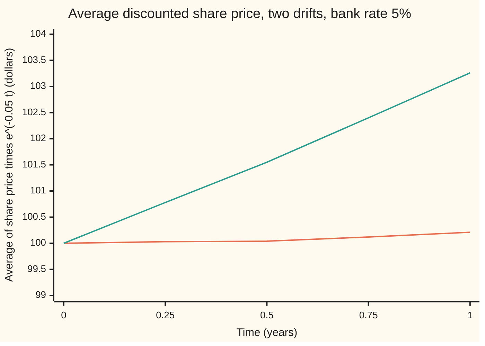
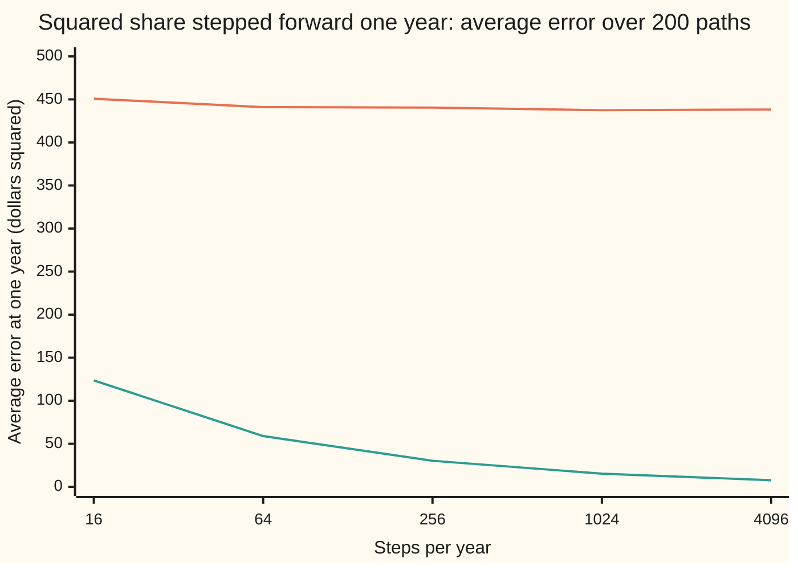

# Ito's product rule: integration by parts with a covariation term

[Syllabus](../../../SYLLABUS.md) → [Stochastic processes and calculus](../../../SYLLABUS.md#w11) → [Ito Calculus](../../../SYLLABUS.md#w11-s06) → Ito's product rule

---

## General Overview

A share trades at \$100 today. Its price wanders: on average it climbs 8% a year, and its yearly wobble, the volatility, is 20%. Cash in the bank grows at 5% a year, compounded continuously. Time is measured in years.

Is the share a good bet? A rise from \$100 to \$103 over a year says little on its own, because the bank would have turned \$100 into \$105 over the same year. The fair way to judge the share is in today's dollars: take its price at each date and divide by what \$1 in the bank has grown to by then. That ratio is the **discounted share**. It is a product of two moving things: the share's price, and the shrinking factor that converts future dollars into today's dollars.

The question is how a product of two moving quantities moves. School calculus answers it with the product rule: the change in a product is each factor times the other's change. That rule is incomplete when both factors carry the same kind of random wobble. The wobbles multiply into a third term, of the same size as the drift terms, that never vanishes. This card derives that third term, called the covariation, and uses the corrected rule to settle the share question. With the real 8% drift, the discounted share drifts up 3% a year. With a drift of exactly 5%, the bank's rate, the discounted share is a fair game: its best forecast of any later value, given everything known now, is its value now.

**The change in a product of two random quantities driven by the same noise is the first times the change in the second, plus the second times the change in the first, plus the covariation: the running total of their jointly squared wobbles.**

**What kind of fact this is:** a theorem, proved on this card in Why it works from Ito's lemma, with the complete argument in a folded Detailed proof; the share's price path is a model.

### The picture: the discounted share, averaged over 20,000 paths



Lower line: drift 5%, equal to the bank rate; the average stays within two standard errors of \$100 (the standard error is 0.14 at one year). Upper line: drift 8%; the average climbs to \$103.26, 1.4 standard errors from the formula's \$103.05. Both lines come from the same 20,000 simulated paths, read every quarter year, seed 20260930. Another seed draws slightly different lines.

---

## The formula

Notation first, in words. Brownian motion $W_t$ is the random walk seen from far away ([Brownian motion](../05-Brownian%20Motion/01-brownian-motion.md)). An Ito process moves by a drift part and a noise part, written $dX_t = a\,dt + b\,dW_t$. The symbol $dW_t$ is shorthand for an Ito integral, never a derivative, because a Brownian path has no slope ([The Ito integral](01-ito-integral.md)). The new notation on this card is the **covariation** $[X,Y]_t$, read "the covariation of X and Y up to time t": the limit of the sum of products of matching small steps of X and of Y, as the steps shrink. With X and Y the same process it is the quadratic variation $[X]_t$ ([Quadratic variation](../05-Brownian%20Motion/03-quadratic-variation.md)).

Take two Ito processes driven by the same Brownian motion:

$$dX_t = a\,dt + b\,dW_t, \qquad dY_t = g\,dt + h\,dW_t.$$

Then

$$d(X_t Y_t) = X_t\,dY_t + Y_t\,dX_t + d[X,Y]_t, \qquad d[X,Y]_t = b\,h\,dt.$$

**Read it aloud:** the product changes by the first factor times the second's change, plus the second factor times the first's change, plus the noise sizes multiplied together, per unit of time.

Written as integrals from time 0 to time T, the same statement is integration by parts with one extra term:

$$X_T Y_T - X_0 Y_0 = \int_0^T X_t\,dY_t + \int_0^T Y_t\,dX_t + [X,Y]_T.$$

| Symbol | Plain meaning | In our example | Push it up and the answer… |
| --- | --- | --- | --- |
| $X_t$, $Y_t$ | two quantities moving in time, both driven by the same $W_t$ | the share price and the discount factor $e^{-rt}$ | the product moves with them |
| $a$, $g$ | the drift parts: steady push per year | $\mu S_t$ for the share; $-r e^{-rt}$ for the discount factor | changes the product's drift, not the covariation |
| $b$, $h$ | the noise parts: how far each moves per unit of Brownian step | $\sigma S_t$ for the share; 0 for the discount factor | the covariation grows as $b\,h$ |
| $[X,Y]_t$ | covariation: running total of matched products of small steps | 0 for share times discount; $\sigma^2$ times the integral of the squared share for share times share | the gap between Ito's rule and the school rule grows |
| $W_t$, $dW_t$ | Brownian motion, and its step over a short time | 0 at the start; a step has mean 0 and variance $dt$ | |
| $t$, $T$, $dt$ | time in years; the horizon; a very short stretch of time | $T = 1$ year | more time for the covariation to build up |
| $S_t$ | the share price | \$100 today | |
| $\mu$ | the share's drift: average growth per year | 0.08 in the real world; 0.05 under the right drift | the discounted share drifts up at $\mu - r$ |
| $\sigma$ | the share's volatility: size of its yearly wobble | 0.20 | the covariation of share with share grows as $\sigma^2$ |
| $r$ | the bank rate, continuously compounded | 0.05 | lowers the discounted share's drift, $\mu - r$ |
| $D_t$ | the discounted share, $S_t e^{-rt}$: the price in today's dollars | \$100 today | |
| $n$, $k$, $\Delta t$, $X_k$, $Y_k$ | number of steps a year is cut into; which step; one step's length $T/n$; X and Y at the start of step k | $n$ from 16 to 4,096 | finer grid, closer to the limit |

For the share, the rule gives the equation the discounted share obeys:

$$dD_t = D_t\big((\mu - r)\,dt + \sigma\,dW_t\big).$$

In words: the discounted share grows at the share's drift minus the bank rate, and wobbles exactly as much as the share does in percentage terms.

### When it holds

- **Both factors are Ito processes on the same Brownian motion, with integrands known at the start of each step.** If the integrand peeks at the end of the step, the sums converge to a different integral and the rule changes; on [The Ito integral](01-ito-integral.md), that choice moves the average of the integral of W against W from 0 to T.
- **The integrals exist:** the drift parts are integrable in time and the noise parts square-integrable, so every term has a meaning. Without that, the right-hand side is undefined, not wrong.
- **Several Brownian motions:** if X and Y are driven by two Brownian motions with correlation, the covariation becomes the noise sizes times the correlation; [Several Brownian motions](06-multidimensional-ito-and-correlation.md) does it. With independent drivers the covariation is zero, and using $b\,h$ there invents a term.
- **No jumps.** A process that jumps adds the products of its jumps to the covariation; [Semimartingales](../09-Beyond%20Brownian/05-semimartingales-in-outline.md) states that version.
- **If one factor has no noise part, the covariation is zero** and the school product rule is exact. The discount factor is such a factor, which is why it is safe to discount a price the school way.

---

## Why it works

### Step 0: a rectangle grows by two strips and a corner

Picture a rectangle X wide and Y tall. Widen it by a small amount and heighten it by another. The new area is the old one plus a strip along the top, a strip down the side, and a small corner square whose sides are the two changes. In school calculus the corner is the product of two small things, far smaller than the strips, and it disappears in the limit. A Brownian step over a time $dt$ has size about the square root of $dt$, not $dt$. Two such steps multiplied give something of size $dt$: the same size as the drift terms that are kept. The corners do not disappear. Their running total is the covariation.

### Step 1: the identity on a grid is exact

Cut the time from 0 to T into $n$ steps of length $\Delta t$. Write $X_k$ for X at the start of step $k$ and $\Delta X_k = X_{k+1} - X_k$ for its change over the step; the same for Y. Multiplying out gives, with no approximation,

$$X_{k+1}Y_{k+1} - X_k Y_k = X_k\,\Delta Y_k + Y_k\,\Delta X_k + \Delta X_k\,\Delta Y_k.$$

Add over all steps. The left side telescopes: each intermediate product appears once with a plus and once with a minus, leaving the end value minus the start value.

$$X_T Y_T - X_0 Y_0 = \sum_k X_k\,\Delta Y_k + \sum_k Y_k\,\Delta X_k + \sum_k \Delta X_k\,\Delta Y_k.$$

This holds for every path and every grid. Road B in the code checks it on one simulated path at five grid sizes; the gap is below a billionth each time.

### Step 2: the first two sums become Ito integrals

In both sums the factor in front, $X_k$ or $Y_k$, is known at the start of the step, before the step's random change happens. Sums of exactly that shape converge to the Ito integrals of Y against X and of X against Y as the grid shrinks. That is the definition of the Ito integral on [The Ito integral](01-ito-integral.md).

### Step 3: the third sum becomes the covariation

Expand one corner:

$$\Delta X_k\,\Delta Y_k \approx (a\,\Delta t + b\,\Delta W_k)(g\,\Delta t + h\,\Delta W_k) = a g\,\Delta t^2 + (a h + b g)\,\Delta t\,\Delta W_k + b h\,(\Delta W_k)^2.$$

Sort the pieces by size. A $\Delta t$ squared summed over $n$ steps totals $n\,\Delta t^2 = T\,\Delta t$, which vanishes. A $\Delta t$ times a Brownian step has size $\Delta t$ to the power 1.5; the sum of $n$ of them has standard deviation of order $\Delta t$, which vanishes. The last piece survives. The squared Brownian steps add up to the elapsed time, with a spread that shrinks as the grid gets finer: that is quadratic variation, proved on [Quadratic variation](../05-Brownian%20Motion/03-quadratic-variation.md). So the corners add up to the integral of $b\,h$ over time, which is the covariation:

$$\sum_k \Delta X_k\,\Delta Y_k \;\to\; [X,Y]_T = \int_0^T b\,h\,dt.$$

Taking the limit of Step 1 term by term gives the product rule.

### Step 4: a short proof from Ito's lemma

Steps 1 to 3 show where the term comes from. A shorter, complete route uses Ito's lemma for the square, $f(x) = x^2$, from [Ito's lemma](02-itos-lemma.md). A product is a difference of two squares divided by four:

$$X Y = \tfrac14\big((X+Y)^2 - (X-Y)^2\big).$$

The sum and the difference are Ito processes too, with noise parts $b + h$ and $b - h$. Ito's lemma squares each one and adds half the second derivative, half of 2, times the noise part squared. Subtract, divide by four, and the extra terms leave exactly $\tfrac14\big((b+h)^2 - (b-h)^2\big) = b\,h$.

<details>
<summary>Detailed proof</summary>

Let $U = X + Y$ and $V = X - Y$. They satisfy $dU = (a+g)\,dt + (b+h)\,dW_t$ and $dV = (a-g)\,dt + (b-h)\,dW_t$.
Ito's lemma for $f(x) = x^2$, with first derivative $2x$ and second derivative 2, gives
$$d(U^2) = 2U\,dU + (b+h)^2\,dt, \qquad d(V^2) = 2V\,dV + (b-h)^2\,dt.$$
Subtract the second from the first:
$$d(U^2 - V^2) = 2U\,dU - 2V\,dV + \big((b+h)^2 - (b-h)^2\big)\,dt.$$
The last bracket is $4bh$. For the first two terms, write U and V and their changes back in terms of X and Y:
$$2U\,dU - 2V\,dV = 2(X+Y)(dX+dY) - 2(X-Y)(dX-dY) = 4X\,dY + 4Y\,dX.$$
So $d(U^2 - V^2) = 4X\,dY + 4Y\,dX + 4bh\,dt$. Since $U^2 - V^2 = 4XY$, dividing by 4 gives
$$d(XY) = X\,dY + Y\,dX + b\,h\,dt.$$
This is complete given Ito's lemma, which [Ito's lemma](02-itos-lemma.md) derives with its key steps and a named source. The argument used one Brownian motion; with several, the same subtraction leaves the noise parts multiplied and weighted by the correlations.

</details>

### Step 5: the discounted share, and why the right drift is the bank rate

Take X as the share, with $a = \mu S_t$ and $b = \sigma S_t$. Take Y as the discount factor $e^{-rt}$: an ordinary smooth function of time, so $g = -r e^{-rt}$ and $h = 0$. The covariation is $\sigma S_t \times 0 = 0$. The rule gives

$$dD_t = e^{-rt}\,dS_t - r\,S_t e^{-rt}\,dt = D_t\big((\mu - r)\,dt + \sigma\,dW_t\big).$$

With $\mu = r$ the drift part vanishes and $dD_t = \sigma D_t\,dW_t$: the discounted share is an Ito integral and nothing else. An Ito integral of a square-integrable integrand is a martingale, a fair game in which the best forecast of a later value, given everything known now, is the value now ([Martingales](../02-Martingales/01-martingales.md)).

The same fact can be checked without integrals. Solving the equation gives $D_t = 100\,e^{-\sigma^2 t/2 + \sigma W_t}$ when $\mu = r$ ([Geometric Brownian motion](../05-Brownian%20Motion/07-geometric-brownian-motion.md)). Compare the value at a time t with the value at an earlier time s. The ratio is $e^{-\sigma^2(t-s)/2 + \sigma(W_t - W_s)}$, which depends only on the Brownian step after s. That step is independent of everything known at s, and the average of $e^{\sigma(W_t - W_s)}$ is $e^{\sigma^2(t-s)/2}$, which cancels the first factor exactly. So the best forecast of the later value is the current one. This is the exponential martingale of [Brownian martingales](../05-Brownian%20Motion/06-brownian-martingales-and-exponential-martingale.md).

With $\mu = 0.08$ the drift $\mu - r = 0.03$ stays, and the discounted share is not a fair game: on average it gains 3% a year in today's dollars. The real share's drift is not the bank rate. A second probability measure, Q, reweights the paths so that the share's drift becomes 5%; under Q the discounted share is a martingale. Building Q is Girsanov's theorem, on [Girsanov](../07-Changing%20Measure/02-girsanov-theorem.md). This card supplies the other half: the product rule turns "drift equals the bank rate" into "discounted price is a martingale".

### The other route

Ito's lemma for a function of two variables, $f(x, y) = x y$, gives the rule in one line: the cross second derivative is 1 and multiplies the covariation. That route needs the several-variable lemma, set out on [Several Brownian motions](06-multidimensional-ito-and-correlation.md).

---

## Worked numbers, by hand

Share at \$100, real drift $\mu = 0.08$, volatility $\sigma = 0.20$, bank rate $r = 0.05$, one year.

| Step | Arithmetic | Value |
| --- | --- | --- |
| product rule on share times discount | $e^{-rt}\,dS_t + S_t\,d(e^{-rt}) + d[S, e^{-rt}]_t$ | three terms |
| change in the discount factor | no noise part: $-r e^{-rt}\,dt$ | ordinary calculus |
| covariation | $\sigma S_t \times 0$ | $0$ |
| equation for the discounted share | $D_t\big((\mu - r)\,dt + \sigma\,dW_t\big)$ | drift $\mu - r$ |
| drift at the real 8% | $0.08 - 0.05$ | $0.03$ |
| average discounted share after one year | $100 \times e^{0.03} = 100 \times 1.0305$ | $\$103.05$ |
| drift at the right 5% | $0.05 - 0.05$ | $0$ |
| **average discounted share after one year, right drift** | $100 \times e^{0}$ | **$\$100.00$** |

At the real drift, a dollar in the share beats a dollar in the bank by about 3 cents a year on average. At a drift equal to the bank rate the share is, in today's dollars, a fair game.

The covariation term matters as soon as both factors carry noise. Take the share times itself, at drift 0.05. The rule with $X = Y = S$ gives $d(S_t^2) = 2S_t\,dS_t + \sigma^2 S_t^2\,dt$, so the squared share grows on average at $2\mu + \sigma^2 = 0.10 + 0.04 = 0.14$ a year. Its average after one year is $10{,}000 \times e^{0.14} = 11{,}502.74$ dollars squared. The school product rule, without the term, gives $10{,}000 \times e^{0.10} = 11{,}051.71$. The 20,000 simulated paths give 11,553.25 with standard error 34.22: 1.5 standard errors from the product rule's value, and 15 from the school rule's.

### What breaks if you drop a piece

| Mistake | Comes out at | What went wrong |
| --- | --- | --- |
| School product rule for $W_t$ times $W_t$ | average of the square at one year 0; true 1, simulated 1.0041 (se 0.0101) | the corners: the squared Brownian steps add to the elapsed time |
| School product rule for the share times itself | 11,051.71 instead of 11,502.74 (simulated 11,553.25, se 34.22) | same missing term, now $\sigma^2 S_t^2\,dt$ |
| Stepping the squared share forward without the term, 4,096 steps a year | average error 438.26 at one year, and not shrinking; predicted 442.81 | the dropped term's yearly total, $\sigma^2$ times the integral of the squared share |
| Treating the discounted share as a fair game at the real 8% drift | average 103.05 after a year; the fair-game test reads 0.9693 (se 0.0839), not 0 | the hypothesis $\mu = r$ was dropped: the drift $\mu - r$ survives |

Every number in this table is printed by both checks below.

---

## Code, from first principles, and it actually runs

The code takes four independent roads. Road A evaluates the formulas. Road B simulates one path of the share on a grid of 4,096 steps a year and checks the exact grid identity of Step 1 at five step sizes: the corner sum for share times discount shrinks to zero, and the corner sum for share times share settles near $\sigma^2$ times the integral of the squared share. Road C simulates 20,000 paths, read every quarter year, and averages the discounted share at both drifts, with standard errors; it also runs a fair-game test, the average change of the discounted share from half a year to a year on paths where it stood above \$100 at half a year. Road D steps the product-rule equations forward, Euler style, at five step sizes on 200 paths, and compares with the exact values. Every random draw comes from a SplitMix64 generator with seed 20260930 and Box-Muller normals, both written out, so the two programs print the same digits.

### Python

```python
# Ito's product rule -- the check behind the card.  Only math is imported.
# A share starts at $100 with volatility 0.20 a year; the bank pays r = 0.05.
# D_t = S_t e^(-rt) is the discounted share.  The product rule gives
# dD = D((mu - r) dt + sigma dW): a fair game exactly when mu = r.
# Roads: (A) the formulas; (B) the exact step-by-step identity on one path;
# (C) 20000 simulated paths; (D) Euler steps of the product-rule equations.
# Floats are added in plain loops, never with sum(), which adds with extra
# precision in Python and would part company with the Rust twin.
import math

S0, SIG, R, MU, T, SEED = 100.0, 0.20, 0.05, 0.08, 1.0, 20260930
MASK = (1 << 64) - 1
state = SEED

def uniform():                               # SplitMix64, top 53 bits
    global state
    state = (state + 0x9E3779B97F4A7C15) & MASK
    z = state
    z = ((z ^ (z >> 30)) * 0xBF58476D1CE4E5B9) & MASK
    z = ((z ^ (z >> 27)) * 0x94D049BB133111EB) & MASK
    return ((z ^ (z >> 31)) >> 11) / 9007199254740992.0

def normal():                                # Box-Muller, cosine half only
    u1 = 1.0 - uniform()
    u2 = uniform()
    return math.sqrt(-2.0 * math.log(u1)) * math.cos(2.0 * math.pi * u2)

def share(mu, t, w):                         # S_t on a path whose W_t is w
    return S0 * math.exp((mu - 0.5 * SIG * SIG) * t + SIG * w)

def mean_se(xs):
    m = 0.0
    for x in xs: m += x
    m /= len(xs)
    v = 0.0
    for x in xs: v += (x - m) * (x - m)
    return m, math.sqrt(v / (len(xs) - 1) / len(xs))

def row(label, v): print(f"{label:<46}{v:>11.4f}")
def row_se(label, m, se): print(f"{label:<46}{m:>11.4f}  se {se:.4f}")

print("A  formulas")
fd8, fd5 = S0 * math.exp((MU - R) * T), S0 * math.exp((R - R) * T)
fs2, fs2_wrong = S0 * S0 * math.exp((2.0 * R + SIG * SIG) * T), S0 * S0 * math.exp(2.0 * R * T)
fgap = SIG * SIG * S0 * S0 * (math.exp((2.0 * MU + SIG * SIG) * T) - 1.0) / (2.0 * MU + SIG * SIG)
row("E[D_1], mu = 0.08", fd8)
row("E[D_1], mu = r = 0.05", fd5)
row("E[S_1^2], mu = 0.05, product rule", fs2)
row("E[S_1^2], mu = 0.05, covariation dropped", fs2_wrong)
row("E[W_1^2], product rule", T)
row("E[W_1^2], ordinary rule", 0.0)
row("mu = 0.08: sigma^2 E[integral of S^2 dt]", fgap)
row("try: E[S_1^2], sigma = 0.40, product rule", S0 * S0 * math.exp((2.0 * R + 0.16) * T))
print(f"hand: mu - r {MU - R:.4f}, 2r + sigma^2 {2.0 * R + SIG * SIG:.4f}, e^(mu - r) {math.exp(MU - R):.4f}")

NF = 4096
dtf = T / NF
w = [0.0]
for k in range(NF): w.append(w[k] + math.sqrt(dtf) * normal())
s = [share(R, k * dtf, w[k]) for k in range(NF + 1)]
target = 0.0                                 # sigma^2 times the integral of S^2 dt (trapezoids)
for k in range(NF): target += SIG * SIG * 0.5 * (s[k] * s[k] + s[k + 1] * s[k + 1]) * dtf
print("B  one path, mu = 0.05: steps, sum dS d(e^-rt), sum (dS)^2, identity gap")
cross_b, sq_b, gap_b = [], [], 0.0
for n in (16, 64, 256, 1024, 4096):
    p = s[::NF // n]
    b = [math.exp(-R * k * T / n) for k in range(n + 1)]
    xdy, ydx, cross, sq = 0.0, 0.0, 0.0, 0.0
    for k in range(n):
        ds, db = p[k + 1] - p[k], b[k + 1] - b[k]
        xdy += p[k] * db; ydx += b[k] * ds; cross += ds * db; sq += ds * ds
    gap = abs((p[n] * b[n] - p[0] * b[0]) - (xdy + ydx + cross))
    cross_b.append(cross); sq_b.append(sq); gap_b = max(gap_b, gap)
    print(f"   n {n:>5}   {cross:>10.6f}   {sq:>10.4f}   {gap:.9f}")
row("   sigma^2 * integral of S^2 dt, this path", target)
row("   share at t = 1, this path", s[NF])
row("   discounted share at t = 1, this path", s[NF] * math.exp(-R * T))

NP = 20000
dq = [[[] for _ in range(4)] for _ in range(2)]
fair, s2, w2 = [[], []], [], []
for i in range(NP):
    wq, ws = [], 0.0
    for j in range(4):
        ws += 0.5 * normal()                 # quarter-year steps: sd = sqrt(0.25)
        wq.append(ws)
    for a, mu in enumerate((R, MU)):
        d = [share(mu, 0.25 * (j + 1), wq[j]) * math.exp(-R * 0.25 * (j + 1)) for j in range(4)]
        for j in range(4): dq[a][j].append(d[j])
        fair[a].append(d[3] - d[1] if d[1] > 100.0 else 0.0)
    s1 = share(R, 1.0, wq[3])
    s2.append(s1 * s1); w2.append(wq[3] * wq[3])
print("C  20000 paths: mean discounted share each quarter")
ch5, ch8 = [100.0], [100.0]
for j in range(4):
    m5, e5 = mean_se(dq[0][j]); m8, e8 = mean_se(dq[1][j])
    ch5.append(m5); ch8.append(m8)
    print(f"   t {0.25 * (j + 1):.2f}   mu 0.05 {m5:9.4f} se {e5:.4f}   mu 0.08 {m8:9.4f} se {e8:.4f}")
fg5, fg8, ms2, mw2 = mean_se(fair[0]), mean_se(fair[1]), mean_se(s2), mean_se(w2)
row_se("fair game, mu 0.05: E[(D_1 - D_.5) if D_.5>100]", *fg5)
row_se("fair game, mu 0.08: E[(D_1 - D_.5) if D_.5>100]", *fg8)
row_se("E[S_1^2], mu = 0.05, simulated", *ms2)
row_se("E[W_1^2], simulated", *mw2)
print("chart, mean D, mu 0.05 " + " ".join(f"{v:.2f}" for v in ch5))
print("chart, mean D, mu 0.08 " + " ".join(f"{v:.2f}" for v in ch8))

ns = (16, 64, 256, 1024, 4096)
errd, erry, errn = [0.0] * 5, [0.0] * 5, [0.0] * 5
for i in range(200):
    wc = [0.0]
    for k in range(NF): wc.append(wc[k] + math.sqrt(dtf) * normal())
    sp = [share(MU, k * dtf, wc[k]) for k in range(NF + 1)]
    d_exact, y_exact = sp[NF] * math.exp(-R * T), sp[NF] * sp[NF]
    for a, n in enumerate(ns):
        h, st = T / n, NF // n
        d, y, yn = S0, S0 * S0, S0 * S0
        for k in range(n):
            x0, x1 = sp[k * st], sp[(k + 1) * st]
            d += d * ((MU - R) * h + SIG * (wc[(k + 1) * st] - wc[k * st]))
            y += 2.0 * x0 * (x1 - x0) + SIG * SIG * x0 * x0 * h
            yn += 2.0 * x0 * (x1 - x0)
        errd[a] += abs(d - d_exact) / 200.0
        erry[a] += abs(y - y_exact) / 200.0
        errn[a] += abs(yn - y_exact) / 200.0
print("D  200 paths, mu = 0.08: mean |error| at t = 1; steps, D, S^2 with term, S^2 without")
for a, n in enumerate(ns):
    print(f"   n {n:>5}   {errd[a]:8.4f}   {erry[a]:9.2f}   {errn[a]:9.2f}")

assert abs(ch5[4] - fd5) < 4 * mean_se(dq[0][3])[1], "mu = r: discounted share keeps its mean"
assert abs(ch8[4] - fd8) < 4 * mean_se(dq[1][3])[1], "mu = 0.08: mean grows at mu - r"
assert abs(fg5[0]) < 4 * fg5[1] and fg8[0] > 4 * fg8[1], "fair game only when mu = r"
assert abs(ms2[0] - fs2) < 4 * ms2[1], "E[S^2] needs the covariation term"
assert abs(mw2[0] - T) < 4 * mw2[1], "E[W^2] = T, not 0"
assert gap_b < 1e-9, "algebra check of Step 1: the grid identity is exact"
assert abs(sq_b[4] - target) < 0.05 * target, "(dS)^2 sums to the covariation term"
assert abs(cross_b[4]) < 0.01 * abs(cross_b[0]), "share times discount: no covariation"
assert erry[4] < erry[0] / 4 and errd[4] < errd[0] / 4, "Euler errors shrink with the term"
assert abs(errn[4] - fgap) < 0.1 * fgap, "without the term the error stays at the covariation"
print("ALL CHECKS PASS")
```

**Ran 2026-10-07 on macOS, Python 3.14.6, standard library only. All checks passed. Output, pasted from the run:**

```
A  formulas
E[D_1], mu = 0.08                                103.0455
E[D_1], mu = r = 0.05                            100.0000
E[S_1^2], mu = 0.05, product rule              11502.7380
E[S_1^2], mu = 0.05, covariation dropped       11051.7092
E[W_1^2], product rule                             1.0000
E[W_1^2], ordinary rule                            0.0000
mu = 0.08: sigma^2 E[integral of S^2 dt]         442.8055
try: E[S_1^2], sigma = 0.40, product rule      12969.3009
hand: mu - r 0.0300, 2r + sigma^2 0.1400, e^(mu - r) 1.0305
B  one path, mu = 0.05: steps, sum dS d(e^-rt), sum (dS)^2, identity gap
   n    16    -0.085177    1142.8494   0.000000000
   n    64    -0.021289     597.2684   0.000000000
   n   256    -0.005320     605.3034   0.000000000
   n  1024    -0.001330     636.6473   0.000000000
   n  4096    -0.000333     616.9098   0.000000000
   sigma^2 * integral of S^2 dt, this path       603.1121
   share at t = 1, this path                     127.5140
   discounted share at t = 1, this path          121.2950
C  20000 paths: mean discounted share each quarter
   t 0.25   mu 0.05  100.0301 se 0.0710   mu 0.08  100.7831 se 0.0715
   t 0.50   mu 0.05  100.0384 se 0.1011   mu 0.08  101.5503 se 0.1026
   t 0.75   mu 0.05  100.1199 se 0.1234   mu 0.08  102.3981 se 0.1262
   t 1.00   mu 0.05  100.2059 se 0.1436   mu 0.08  103.2577 se 0.1480
fair game, mu 0.05: E[(D_1 - D_.5) if D_.5>100]     0.0882  se 0.0784
fair game, mu 0.08: E[(D_1 - D_.5) if D_.5>100]     0.9693  se 0.0839
E[S_1^2], mu = 0.05, simulated                 11553.2460  se 34.2172
E[W_1^2], simulated                                1.0041  se 0.0101
chart, mean D, mu 0.05 100.00 100.03 100.04 100.12 100.21
chart, mean D, mu 0.08 100.00 100.78 101.55 102.40 103.26
D  200 paths, mu = 0.08: mean |error| at t = 1; steps, D, S^2 with term, S^2 without
   n    16     0.5799      123.62      450.79
   n    64     0.2796       58.97      441.01
   n   256     0.1395       30.27      440.51
   n  1024     0.0701       15.32      437.43
   n  4096     0.0351        7.73      438.26
ALL CHECKS PASS
```

Road B: the grid identity holds to the ninth decimal at every step size. The corner sum for share times discount falls by a factor of 4 each time the grid gets 4 times finer, heading to zero. The corner sum for share times share does not fall. At 16 steps it is far off, 1,142.85; from 64 steps on it stays within 6% of 603.11, the integral the covariation predicts, wandering as one sample on a finite grid should. Road C: at drift 0.05 every quarter's average stays within two standard errors of \$100, and the fair-game test is 0.0882 with standard error 0.0784, consistent with zero. At drift 0.08 the averages climb and the fair-game test sits far from zero. Road D: the Euler error for the discounted share halves each time the grid gets 4 times finer, from 0.5799 to 0.0351. The squared share stepped with the covariation term behaves the same way, 123.62 down to 7.73. Without the term the error stays near 440 at every step size.

### Rust

Same roads, same draws, same plain additions, std only.

```rust
// Ito's product rule -- the same check as ito_product_rule_check.py, in Rust.
// Standard library only, no crates.  Same generator, same seed, same order of
// draws, same plain left-to-right additions, so the output matches line for line.
// Compile: rustc --edition 2021 -O ito_product_rule_check.rs -o /tmp/ito_product_rule_check
use std::f64::consts::PI;

const S0: f64 = 100.0;
const SIG: f64 = 0.20;
const R: f64 = 0.05;
const MU: f64 = 0.08;
const T: f64 = 1.0;

struct Rng { s: u64 }
impl Rng {
    fn uniform(&mut self) -> f64 {                     // SplitMix64, top 53 bits
        self.s = self.s.wrapping_add(0x9E3779B97F4A7C15);
        let mut z = self.s;
        z = (z ^ (z >> 30)).wrapping_mul(0xBF58476D1CE4E5B9);
        z = (z ^ (z >> 27)).wrapping_mul(0x94D049BB133111EB);
        ((z ^ (z >> 31)) >> 11) as f64 / 9007199254740992.0
    }
    fn normal(&mut self) -> f64 {                      // Box-Muller, cosine half only
        let u1 = 1.0 - self.uniform();
        let u2 = self.uniform();
        (-2.0 * u1.ln()).sqrt() * (2.0 * PI * u2).cos()
    }
}

fn share(mu: f64, t: f64, w: f64) -> f64 { S0 * ((mu - 0.5 * SIG * SIG) * t + SIG * w).exp() }

fn mean_se(xs: &[f64]) -> (f64, f64) {
    let mut m = 0.0;
    for x in xs { m += x; }
    m /= xs.len() as f64;
    let mut v = 0.0;
    for x in xs { v += (x - m) * (x - m); }
    (m, (v / (xs.len() - 1) as f64 / xs.len() as f64).sqrt())
}

fn row(label: &str, v: f64) { println!("{:<46}{:>11.4}", label, v); }
fn row_se(label: &str, m: f64, se: f64) { println!("{:<46}{:>11.4}  se {:.4}", label, m, se); }

fn main() {
    let mut rng = Rng { s: 20260930 };
    println!("A  formulas");
    let (fd8, fd5) = (S0 * ((MU - R) * T).exp(), S0 * ((R - R) * T).exp());
    let (fs2, fs2_wrong) = (S0 * S0 * ((2.0 * R + SIG * SIG) * T).exp(), S0 * S0 * (2.0 * R * T).exp());
    let fgap = SIG * SIG * S0 * S0 * (((2.0 * MU + SIG * SIG) * T).exp() - 1.0) / (2.0 * MU + SIG * SIG);
    row("E[D_1], mu = 0.08", fd8);
    row("E[D_1], mu = r = 0.05", fd5);
    row("E[S_1^2], mu = 0.05, product rule", fs2);
    row("E[S_1^2], mu = 0.05, covariation dropped", fs2_wrong);
    row("E[W_1^2], product rule", T);
    row("E[W_1^2], ordinary rule", 0.0);
    row("mu = 0.08: sigma^2 E[integral of S^2 dt]", fgap);
    row("try: E[S_1^2], sigma = 0.40, product rule", S0 * S0 * ((2.0 * R + 0.16) * T).exp());
    println!("hand: mu - r {:.4}, 2r + sigma^2 {:.4}, e^(mu - r) {:.4}", MU - R, 2.0 * R + SIG * SIG, (MU - R).exp());

    const NF: usize = 4096;
    let dtf = T / NF as f64;
    let mut w = vec![0.0f64];
    for k in 0..NF { let next = w[k] + dtf.sqrt() * rng.normal(); w.push(next); }
    let s: Vec<f64> = (0..=NF).map(|k| share(R, k as f64 * dtf, w[k])).collect();
    let mut target = 0.0;                              // sigma^2 times the integral of S^2 dt (trapezoids)
    for k in 0..NF { target += SIG * SIG * 0.5 * (s[k] * s[k] + s[k + 1] * s[k + 1]) * dtf; }
    println!("B  one path, mu = 0.05: steps, sum dS d(e^-rt), sum (dS)^2, identity gap");
    let (mut cross_b, mut sq_b, mut gap_b) = (Vec::new(), Vec::new(), 0.0f64);
    for n in [16usize, 64, 256, 1024, 4096] {
        let p: Vec<f64> = s.iter().step_by(NF / n).cloned().collect();
        let b: Vec<f64> = (0..=n).map(|k| (-R * k as f64 * T / n as f64).exp()).collect();
        let (mut xdy, mut ydx, mut cross, mut sq) = (0.0f64, 0.0f64, 0.0f64, 0.0f64);
        for k in 0..n {
            let (ds, db) = (p[k + 1] - p[k], b[k + 1] - b[k]);
            xdy += p[k] * db; ydx += b[k] * ds; cross += ds * db; sq += ds * ds;
        }
        let gap = ((p[n] * b[n] - p[0] * b[0]) - (xdy + ydx + cross)).abs();
        cross_b.push(cross); sq_b.push(sq); gap_b = gap_b.max(gap);
        println!("   n {:>5}   {:>10.6}   {:>10.4}   {:.9}", n, cross, sq, gap);
    }
    row("   sigma^2 * integral of S^2 dt, this path", target);
    row("   share at t = 1, this path", s[NF]);
    row("   discounted share at t = 1, this path", s[NF] * (-R * T).exp());

    const NP: usize = 20000;
    let mut dq = vec![vec![Vec::with_capacity(NP); 4]; 2];
    let (mut fair, mut s2, mut w2) = (vec![Vec::new(), Vec::new()], Vec::new(), Vec::new());
    for _ in 0..NP {
        let (mut wq, mut ws) = ([0.0f64; 4], 0.0f64);
        for j in 0..4 { ws += 0.5 * rng.normal(); wq[j] = ws; }   // quarter-year steps: sd = sqrt(0.25)
        for (a, mu) in [R, MU].iter().enumerate() {
            let d: Vec<f64> = (0..4).map(|j| share(*mu, 0.25 * (j + 1) as f64, wq[j]) * (-R * 0.25 * (j + 1) as f64).exp()).collect();
            for j in 0..4 { dq[a][j].push(d[j]); }
            fair[a].push(if d[1] > 100.0 { d[3] - d[1] } else { 0.0 });
        }
        let s1 = share(R, 1.0, wq[3]);
        s2.push(s1 * s1); w2.push(wq[3] * wq[3]);
    }
    println!("C  20000 paths: mean discounted share each quarter");
    let (mut ch5, mut ch8) = (vec![100.0f64], vec![100.0f64]);
    for j in 0..4 {
        let ((m5, e5), (m8, e8)) = (mean_se(&dq[0][j]), mean_se(&dq[1][j]));
        ch5.push(m5); ch8.push(m8);
        println!("   t {:.2}   mu 0.05 {:9.4} se {:.4}   mu 0.08 {:9.4} se {:.4}", 0.25 * (j + 1) as f64, m5, e5, m8, e8);
    }
    let (fg5, fg8, ms2, mw2) = (mean_se(&fair[0]), mean_se(&fair[1]), mean_se(&s2), mean_se(&w2));
    row_se("fair game, mu 0.05: E[(D_1 - D_.5) if D_.5>100]", fg5.0, fg5.1);
    row_se("fair game, mu 0.08: E[(D_1 - D_.5) if D_.5>100]", fg8.0, fg8.1);
    row_se("E[S_1^2], mu = 0.05, simulated", ms2.0, ms2.1);
    row_se("E[W_1^2], simulated", mw2.0, mw2.1);
    let fmt = |v: &Vec<f64>| v.iter().map(|x| format!("{:.2}", x)).collect::<Vec<_>>().join(" ");
    println!("chart, mean D, mu 0.05 {}", fmt(&ch5));
    println!("chart, mean D, mu 0.08 {}", fmt(&ch8));

    let ns = [16usize, 64, 256, 1024, 4096];
    let (mut errd, mut erry, mut errn) = ([0.0f64; 5], [0.0f64; 5], [0.0f64; 5]);
    for _ in 0..200 {
        let mut wc = vec![0.0f64];
        for k in 0..NF { let next = wc[k] + dtf.sqrt() * rng.normal(); wc.push(next); }
        let sp: Vec<f64> = (0..=NF).map(|k| share(MU, k as f64 * dtf, wc[k])).collect();
        let (d_exact, y_exact) = (sp[NF] * (-R * T).exp(), sp[NF] * sp[NF]);
        for (a, &n) in ns.iter().enumerate() {
            let (h, st) = (T / n as f64, NF / n);
            let (mut d, mut y, mut yn) = (S0, S0 * S0, S0 * S0);
            for k in 0..n {
                let (x0, x1) = (sp[k * st], sp[(k + 1) * st]);
                d += d * ((MU - R) * h + SIG * (wc[(k + 1) * st] - wc[k * st]));
                y += 2.0 * x0 * (x1 - x0) + SIG * SIG * x0 * x0 * h;
                yn += 2.0 * x0 * (x1 - x0);
            }
            errd[a] += (d - d_exact).abs() / 200.0;
            erry[a] += (y - y_exact).abs() / 200.0;
            errn[a] += (yn - y_exact).abs() / 200.0;
        }
    }
    println!("D  200 paths, mu = 0.08: mean |error| at t = 1; steps, D, S^2 with term, S^2 without");
    for (a, n) in ns.iter().enumerate() {
        println!("   n {:>5}   {:8.4}   {:9.2}   {:9.2}", n, errd[a], erry[a], errn[a]);
    }

    assert!((ch5[4] - fd5).abs() < 4.0 * mean_se(&dq[0][3]).1, "mu = r: discounted share keeps its mean");
    assert!((ch8[4] - fd8).abs() < 4.0 * mean_se(&dq[1][3]).1, "mu = 0.08: mean grows at mu - r");
    assert!(fg5.0.abs() < 4.0 * fg5.1 && fg8.0 > 4.0 * fg8.1, "fair game only when mu = r");
    assert!((ms2.0 - fs2).abs() < 4.0 * ms2.1, "E[S^2] needs the covariation term");
    assert!((mw2.0 - T).abs() < 4.0 * mw2.1, "E[W^2] = T, not 0");
    assert!(gap_b < 1e-9, "algebra check of Step 1: the grid identity is exact");
    assert!((sq_b[4] - target).abs() < 0.05 * target, "(dS)^2 sums to the covariation term");
    assert!(cross_b[4].abs() < 0.01 * cross_b[0].abs(), "share times discount: no covariation");
    assert!(erry[4] < erry[0] / 4.0 && errd[4] < errd[0] / 4.0, "Euler errors shrink with the term");
    assert!((errn[4] - fgap).abs() < 0.1 * fgap, "without the term the error stays at the covariation");
    println!("ALL CHECKS PASS");
}
```

**Ran 2026-10-07 on macOS, rustc 1.98.1, no crates. All checks passed. Output, pasted from the run:**

```
A  formulas
E[D_1], mu = 0.08                                103.0455
E[D_1], mu = r = 0.05                            100.0000
E[S_1^2], mu = 0.05, product rule              11502.7380
E[S_1^2], mu = 0.05, covariation dropped       11051.7092
E[W_1^2], product rule                             1.0000
E[W_1^2], ordinary rule                            0.0000
mu = 0.08: sigma^2 E[integral of S^2 dt]         442.8055
try: E[S_1^2], sigma = 0.40, product rule      12969.3009
hand: mu - r 0.0300, 2r + sigma^2 0.1400, e^(mu - r) 1.0305
B  one path, mu = 0.05: steps, sum dS d(e^-rt), sum (dS)^2, identity gap
   n    16    -0.085177    1142.8494   0.000000000
   n    64    -0.021289     597.2684   0.000000000
   n   256    -0.005320     605.3034   0.000000000
   n  1024    -0.001330     636.6473   0.000000000
   n  4096    -0.000333     616.9098   0.000000000
   sigma^2 * integral of S^2 dt, this path       603.1121
   share at t = 1, this path                     127.5140
   discounted share at t = 1, this path          121.2950
C  20000 paths: mean discounted share each quarter
   t 0.25   mu 0.05  100.0301 se 0.0710   mu 0.08  100.7831 se 0.0715
   t 0.50   mu 0.05  100.0384 se 0.1011   mu 0.08  101.5503 se 0.1026
   t 0.75   mu 0.05  100.1199 se 0.1234   mu 0.08  102.3981 se 0.1262
   t 1.00   mu 0.05  100.2059 se 0.1436   mu 0.08  103.2577 se 0.1480
fair game, mu 0.05: E[(D_1 - D_.5) if D_.5>100]     0.0882  se 0.0784
fair game, mu 0.08: E[(D_1 - D_.5) if D_.5>100]     0.9693  se 0.0839
E[S_1^2], mu = 0.05, simulated                 11553.2460  se 34.2172
E[W_1^2], simulated                                1.0041  se 0.0101
chart, mean D, mu 0.05 100.00 100.03 100.04 100.12 100.21
chart, mean D, mu 0.08 100.00 100.78 101.55 102.40 103.26
D  200 paths, mu = 0.08: mean |error| at t = 1; steps, D, S^2 with term, S^2 without
   n    16     0.5799      123.62      450.79
   n    64     0.2796       58.97      441.01
   n   256     0.1395       30.27      440.51
   n  1024     0.0701       15.32      437.43
   n  4096     0.0351        7.73      438.26
ALL CHECKS PASS
```

The two outputs agree line for line.

### The picture: the error with and without the covariation term



Upper line: the school product rule, without the covariation term; the error stays near the predicted 442.81 however fine the grid. Lower line: Ito's product rule; the error halves each time the grid gets 4 times finer. Both lines use the same 200 simulated paths at drift 0.08.

> [!TIP]
> **Try changing**
> - **Guess first: what happens to the upper line of the first picture if the bank rate is raised to 0.08?** Set `R = 0.08`. The drift 0.08 is then the right drift: both lines of Road C stay at \$100 within their standard errors, and the assert that demands an unfair game at 0.08 fails, as it should. The drift of the discounted share is $\mu - r$, whatever the two numbers are.
> - **Guess first: does doubling the volatility double the covariation's share of the squared share?** No. Set `SIG = 0.40`: the average squared share at one year becomes 12,969.30 against the school rule's unchanged 11,051.71. The gap grows from 451.03 to 1,917.59, more than four times, because the term grows with $\sigma^2$. The school rule never sees the volatility at all.
> - **Guess first: what if the stepped discounted share forgets the bank rate?** In Road D, change `(MU - R) * h` to `MU * h`. That steps the share itself, not the discounted share, so the D column stops shrinking and sits near 5.2, about 5% of the share's price, at every step size; the assert "Euler errors shrink with the term" fails.
> - **Guess first: is the covariation zero only because the discount factor has no noise?** In Road B, change `b = [math.exp(-R * k * T / n) for k in range(n + 1)]` to `b = p`, so the second factor carries the share's noise. The corner sum for share times discount then equals the $(dS)^2$ column, 616.91 at 4,096 steps instead of shrinking to zero, and the assert "share times discount: no covariation" fails.

---

## The usual mistake

> [!warning]
> **Using the school product rule whenever both factors are random.** The corner term is not a correction of smaller order. For a share times itself it is $\sigma^2 S_t^2\,dt$, the same size as the drift. Dropping it makes the average squared share 11,051.71 instead of 11,502.74, and a stepped simulation built that way never converges.
>
> - **Adding the term when one factor has no noise.** The discount factor $e^{-rt}$ has no $dW_t$ part, so its covariation with anything is zero. Inventing a $\sigma\,r$ cross term for the discounted share gives a wrong drift.
> - **Reading $dW_t$ as a derivative.** It is shorthand for an Ito integral. The product rule is a statement about integrals, and the Step 1 identity on a grid is what it means.
> - **"Fair game" read as "cannot win".** At the right drift, the discounted share's best forecast is its current value. Single paths still end far above or below \$100: the one simulated in Road B ends with the discounted share at \$121.30 (the share at \$127.51).
> - **Taking the real-world drift as the right drift.** At 8% the discounted share drifts up 3% a year; the fair-game test reads 0.9693, not 0. The martingale holds only after the drift is moved to the bank rate.

---

## Where you meet it in real life

- **Option pricing.** A price is a martingale in today's dollars under the pricing measure, and the product rule is the step that converts "drift equals the bank rate" into that statement. The Black-Scholes call rests on it: [Black–Scholes call](../../12-Financial%20mathematics/08-The%20Black-Scholes%20call%20and%20put/01-black-scholes-call.md).
- **Changing the unit of account.** Measuring one asset in units of another, a share in units of a bond or of another share, is a product with a reciprocal. When both carry noise, the covariation term appears and shifts the drift; that is the change of numeraire on [Change of numeraire](../07-Changing%20Measure/05-change-of-numeraire.md).
- **Solving linear equations with noise.** Multiplying an equation by an integrating factor, as in ordinary differential equations, is a product-rule step. With noise in the factor, the covariation term must be carried. [Stochastic differential equations](04-stochastic-differential-equations.md) and [Mean reversion](05-ornstein-uhlenbeck-and-cir-processes.md) solve their equations this way.
- **Portfolio accounting.** The value of a holding is shares held times price. When the number held changes with the price, as in a hedge, the change in value splits by the product rule; the self-financing condition says the other two terms, the trades and their covariation with the price, are paid for out of cash.
- **Simulation code.** A program that steps a product of two noisy quantities forward must include the corner term, or its answers drift away however small the step, as the second picture shows.

> **Say it back**
> A product of two moving quantities changes by each factor times the other's change. When both factors wobble with the same Brownian noise, the wobbles multiply into a third term the size of the drift: the covariation, the noise sizes multiplied, per unit of time. If one factor is smooth, like a discount factor, that term is zero. For the discounted share, the rule gives a drift of the share's drift minus the bank rate. At a drift equal to the bank rate, the discounted share is a fair game.

---

## What this builds on

- [Ito's lemma](02-itos-lemma.md): the chain rule with its second-derivative term; applied to a square, it proves the product rule in four lines.
- [The Ito integral](01-ito-integral.md): what the two integral terms mean, and why an Ito integral is a fair game.
- [Quadratic variation](../05-Brownian%20Motion/03-quadratic-variation.md): why squared Brownian steps add up to the elapsed time, the fact behind the corner term.

## Where this goes next

- [Semimartingales](../09-Beyond%20Brownian/05-semimartingales-in-outline.md): the product rule for processes that can jump, where the covariation also collects the products of jumps.
- [Stochastic differential equations](04-stochastic-differential-equations.md): equations of the form $dX_t = \mu(X_t, t)\,dt + \sigma(X_t, t)\,dW_t$, several of them solved with this rule.
- [Girsanov](../07-Changing%20Measure/02-girsanov-theorem.md): how to build the measure under which the share's drift is the bank rate.

This card showed that the discounted share is a fair game exactly when the share's drift equals the bank rate; the open question is how to make that true for a real share whose drift is 8%, and Girsanov's theorem answers it by changing the measure.

---

## Sources

Verified 2026-10-06: every link below resolves, and the DOI registry (Crossref) names the work given for each DOI.

- Itô, Kiyosi. "Stochastic Integral." *Proceedings of the Imperial Academy* (Tokyo) 20, no. 8 (1944). [doi:10.3792/pia/1195572786](https://doi.org/10.3792/pia/1195572786). The integral against Brownian motion that both integral terms of the rule are made of.
- Kunita, Hiroshi, and Shinzo Watanabe. "On Square Integrable Martingales." *Nagoya Mathematical Journal* 30 (1967): 209–245. [doi:10.1017/S0027763000012484](https://doi.org/10.1017/S0027763000012484). The covariation of two martingales and the general change-of-variables formula that contains the product rule.
- Harrison, J. Michael, and Stanley R. Pliska. "Martingales and Stochastic Integrals in the Theory of Continuous Trading." *Stochastic Processes and their Applications* 11, no. 3 (1981): 215–260. [doi:10.1016/0304-4149(81)90026-0](https://doi.org/10.1016/0304-4149(81)90026-0). Discounted prices as martingales under a pricing measure: the finance use of Step 5.
- Øksendal, Bernt. *Stochastic Differential Equations: An Introduction with Applications*, 6th ed. Springer, 2003. [doi:10.1007/978-3-642-14394-6](https://doi.org/10.1007/978-3-642-14394-6). A textbook treatment of the Ito formula in several variables and integration by parts.
