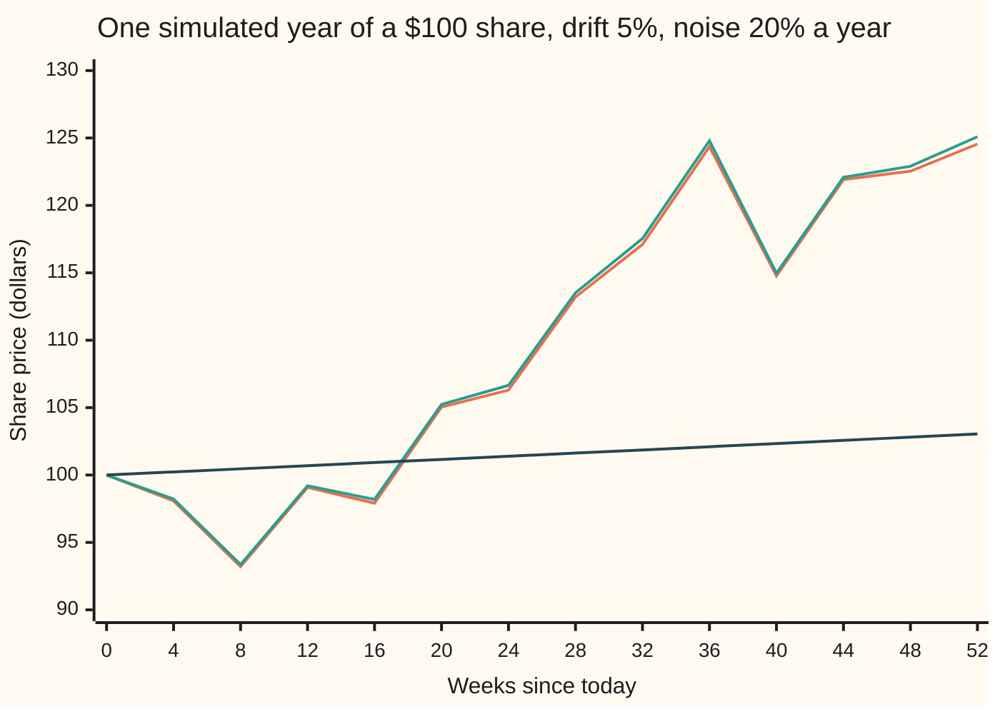
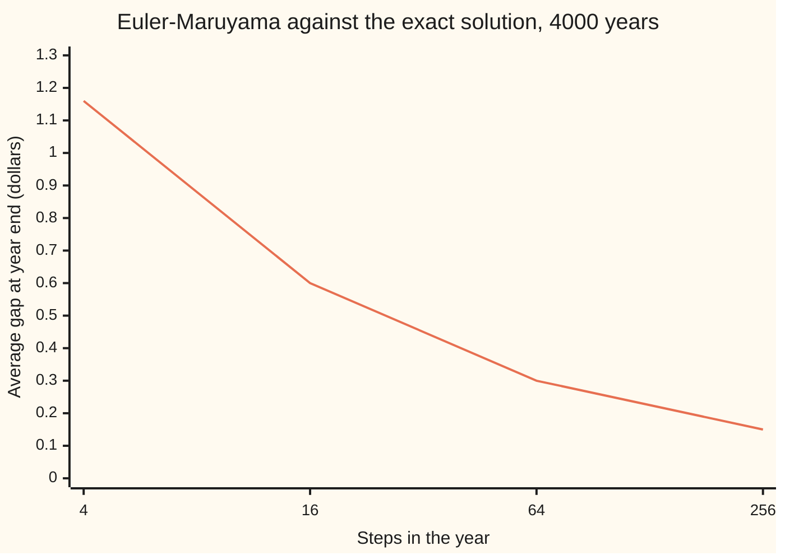

# Stochastic differential equations: a drift, a noise size, and a solution path

Stochastic processes and calculus → Ito Calculus → Equations driven by noise → Stochastic differential equations

---

## General Overview

A share trades at $100 today. Over a year it tends to rise about 5 percent. It is also jumpy: its yearly moves have a spread of about 20 percent. Both effects scale with the price. A $200 share gains twice the dollars and swings twice the dollars of a $100 one.

That description is a rule for the next small change, not a formula for the price. Over one trading day at $100, the rule says: add a push of $0.0198, about 2 cents, then add a random shove with a standard deviation of $1.2599. The shove is 63.5 times the push. Over 16 years the two finally match, because the push grows with time and the shove only with the square root of time.

A rule like this is a **stochastic differential equation**, an SDE for short: an equation for the small change of a random quantity, made of a predictable part and a random part. A **solution** is a formula, or a recipe, that turns one run of the noise into one run of the price. For this share the solution is a single line. This card reads the rule, checks the claimed solution with Ito's lemma, and simulates a path step by step.

**An SDE says how a quantity changes over each small step, as a drift times the time plus a noise size times a Brownian step; a solution is a process built only from the noise so far whose changes add up to exactly that.**

**What kind of fact this is:** a definition, of an SDE and of its solution; plus a theorem, that the formula below is the one solution of the share's SDE, proved on this card in Why it works with the complete argument in a folded Detailed proof.

### The picture: one year of the share, two ways



Orange: the exact solution, read every 4 weeks from one Brownian path drawn in weekly steps (the second of the scripts' seeds 20260930 to 20260933). Green: the step-by-step recipe called Euler's scheme, run on the same path with 13 steps of 4 weeks; it ends at $125.09 against the exact $124.55. Dark: the median price, $100 × e^(0.03 t), the price that half of all years beat. This is one sample. Another seed draws another year.

---

## The formula

Notation first, in words. Time $t$ is in years. $W_t$ is Brownian motion, the random walk seen from far away ([brownian-motion](../05-Brownian%20Motion/01-brownian-motion.md)): it starts at 0, and its change over any stretch of time is a normal draw with mean 0 and variance equal to the stretch's length in years. A general SDE for a quantity $X_t$ is written

$$dX_t = \mu(X_t, t)\,dt + \sigma(X_t, t)\,dW_t .$$

The $dW_t$ is shorthand for an Ito integral, never a derivative: a Brownian path has no slope at any point ([ito-integral](01-ito-integral.md)). The equation is a short way to write the integral equation

$$X_t = X_0 + \int_0^t \mu(X_s, s)\,ds + \int_0^t \sigma(X_s, s)\,dW_s .$$

The first integral is the ordinary kind, added up over time. The second adds up Brownian steps, each weighted by the noise size at the **start** of its step. That left-endpoint rule is what "Ito" means.

For the share, the drift function is $\mu(x, t) = 0.05x$ and the noise-size function is $\sigma(x, t) = 0.20x$. With the constants written $\mu$ = 0.05 and $\sigma$ = 0.20, the share's SDE and its solution are

$$dS_t = \mu S_t\,dt + \sigma S_t\,dW_t, \qquad S_t = S_0 \exp\!\Big(\big(\mu - \tfrac12\sigma^2\big)t + \sigma W_t\Big).$$

**Read it aloud:** the share's change over a moment is 5 percent a year of its price times the time, plus 20 percent of its price times a Brownian step; and the price that does this is $100 times e raised to "0.03 a year times the time, plus 0.2 times where the Brownian path has got to".

| Symbol | Plain meaning | In our example | Push it up and the answer… |
| --- | --- | --- | --- |
| $t$ | time from today, in years | 0 to 1 | the median rises at 3 percent a year; the spread widens like the square root of $t$ |
| $S_t$, $S_0$, $S$ | the share price at time $t$; the price today; the price process as a whole | $S_0$ = $100 | — |
| $X_t$, $X$ | the quantity a general SDE describes, or any solution of it | the share, $X_t = S_t$ | — |
| $\mu$ | the drift: average growth per year, as a fraction of the price | 0.05 | the mean price rises, $S_0 e^{\mu t}$ |
| $\sigma$ | the noise size, called volatility: the spread of yearly moves, per square root of a year | 0.20 | the mean stays put; the median falls, since the log grows at $\mu - \tfrac12\sigma^2$ |
| $\mu(x,t)$, $\sigma(x,t)$, $x$ | the drift function and the noise-size function of a general SDE; $x$ a plain number standing for the price, also the unknown of the ordinary equation $dx/dt = \mu x$ | 0.05x and 0.20x; $x$ = 100 today | — |
| $W_t$, $W$, $W_1$, $w$ | Brownian motion: where the noise path has got to by time $t$; the whole path; its value at one year; a plain number standing for it | a normal draw, mean 0, variance $t$ | the price rises, as e to $\sigma W_t$ |
| $dt$, $dW_t$ | a small time step, and the Brownian step over it; shorthand for the two integrals | a day is 1/252 year; its Brownian step has sd 0.0630 | — |
| $\Delta t$, $n$, $Z$, $Z_k$ | a finite step, the number of steps, a standard normal draw, the draw for step k | $\Delta t = 1/n$; $n$ = 4 to 65536 | the simulation error shrinks like the square root of $\Delta t$ |
| $f$, $f_t$, $f_w$, $f_{ww}$, $g$ | a function of time and Brownian position, its slopes in $t$ and in $w$, its curvature in $w$; $g$ a function of the price alone | $f(t, w) = S_0 e^{0.03t + 0.2w}$; $g = \ln$ | — |
| $Y_t$, $Y$, $a$ | the logarithm of the price, $\ln S_t$; its drift $\mu - \tfrac12\sigma^2$ | $\ln 100$ today; $a$ = 0.03 | — |
| $F_t$ | the filtration: what is known by time $t$, here the noise path up to $t$ | — | — |
| $R_t$, $R$, $R_0$, $[X, R]$, $c$ | in the uniqueness proof: the reciprocal $1/S_t$, the whole process, its value today; the cross variation of $X$ and $R$, what the products of their steps add up to; any fixed number in $E[e^{cW_s}]$ | $R_0$ = 0.01 | — |

### When it holds

- **The Ito reading of the noise.** The noise size is read at the start of each step. Read it at the midpoint instead, called the Stratonovich reading, and the same symbols describe a different share: its solution is $S_0 e^{\mu t + \sigma W_t}$, with a median of $105.13 instead of $103.05. The code shows each formula failing the other reading's integral equation.
- **Well-behaved coefficients.** A drift and noise size that grow at most in proportion to $x$, and change by at most a fixed multiple of any change in $x$ (the Lipschitz condition), guarantee exactly one solution. Drop that, and an SDE can explode in finite time or have two solutions from one start; [existence-and-uniqueness-for-sdes](07-existence-and-uniqueness-for-sdes.md) shows both. The share's coefficients pass.
- **Built from the past only.** A solution at time $t$ may use the noise path up to $t$ and nothing later; in the wing's terms it is adapted to the filtration $F_t$, what is known by time $t$. A formula that used $W_1$ to set the price at half a year would not be a solution, whatever its algebra.
- **Constant $\mu$ and $\sigma$.** The closed form is for this SDE. Most SDEs, including the share with a volatility that moves, have no closed form. They are solved by simulation, which this card also does.

---

## Why it works

### Step 0: a solution is judged by its increments

An ordinary differential equation $dx/dt = 0.05x$ is checked by differentiating a candidate and comparing slopes ([what-a-differential-equation-says](../../08-Differential%20equations%20and%20dynamics/01-Rate%20Equations/01-what-a-differential-equation-says.md)). A Brownian path has no slope, so that test is unavailable. What is left is the integral equation: a candidate solves the SDE if, with probability 1, its total change from 0 to $t$ equals the time integral of the drift plus the Ito integral of the noise size. Ito's lemma is the tool that computes a candidate's change in exactly that form.

### Step 1: read the rule before solving it

At $100, over one trading day of 1/252 year, the drift adds $\mu S\,\Delta t$ = $0.0198. The noise adds $\sigma S$ times a Brownian step of standard deviation $\sqrt{1/252}$, a shove with standard deviation $1.2599. The shove is 63.5 times the push. Day to day, the share is almost pure noise.

Over $t$ years the drift's total grows like $\mu t$ and the noise's spread like $\sigma\sqrt{t}$. They are equal when $t = \sigma^2/\mu^2$, at 16 years. That is the whole reading: the noise wins over a day, the drift over a decade.

### Step 2: find the candidate by taking logarithms

Prices multiply, so try the logarithm $Y_t = \ln S_t$. Ito's lemma for a function $g$ of $S_t$ says $dg = g'(S)\,dS + \tfrac12 g''(S)\,(dS)^2$, where $(dS)^2 = \sigma^2 S^2\,dt$ because $(dW_t)^2 = dt$ ([itos-lemma](02-itos-lemma.md)). With $g = \ln$, $g' = 1/S$ and $g'' = -1/S^2$:

$$dY_t = \frac{1}{S_t}\big(\mu S_t\,dt + \sigma S_t\,dW_t\big) - \frac{1}{2}\frac{1}{S_t^2}\,\sigma^2 S_t^2\,dt = \big(\mu - \tfrac12\sigma^2\big)dt + \sigma\,dW_t .$$

The coefficients are now constants. The integral equation for $Y$ integrates at once: $Y_t = Y_0 + (\mu - \tfrac12\sigma^2)t + \sigma W_t$. Exponentiate and the candidate appears. For the share, the log drifts at 0.05 − 0.02 = 0.03 a year.

This step assumed a positive solution exists, so it found a candidate, not a proof. The proof is the next step.

### Step 3: verify the candidate by Ito's lemma

Write the candidate as a function of time and Brownian position: $S_t = f(t, W_t)$ with $f(t, w) = S_0 e^{at + \sigma w}$ and $a = \mu - \tfrac12\sigma^2$. Its slopes are $f_t = a f$, $f_w = \sigma f$ and $f_{ww} = \sigma^2 f$. Ito's lemma in time and $W$ reads

$$df = \big(f_t + \tfrac12 f_{ww}\big)\,dt + f_w\,dW_t = \big(a + \tfrac12\sigma^2\big) f\,dt + \sigma f\,dW_t = \mu S_t\,dt + \sigma S_t\,dW_t .$$

That is the share's SDE, term for term. The candidate also starts at $f(0, 0) = S_0$, and it uses only $W_t$, so it is built from the past. All three conditions hold.

The code repeats this with no algebra: it measures $f_t$, $f_w$ and $f_{ww}$ by finite differences at $t$ = 0.5, $w$ = 0.3, and prints a drift per dollar of 0.050000 and a noise size per dollar of 0.200000. The ordinary-calculus guess $S_0 e^{\mu t + \sigma W_t}$ prints a drift of 0.070000: it solves an SDE with drift $\mu + \tfrac12\sigma^2$, not this one.

<details>
<summary>Detailed proof</summary>

**Claim.** On a probability space carrying a Brownian motion $W$ with its filtration, the process $S_t = S_0\exp(at + \sigma W_t)$, $a = \mu - \tfrac12\sigma^2$, solves $dS = \mu S\,dt + \sigma S\,dW$, and any continuous adapted solution $X$ with $X_0 = S_0$ equals $S$ for all $t$, almost surely.

**1. It is a solution.** $f(t,w) = S_0 e^{at+\sigma w}$ is twice continuously differentiable. Ito's formula in integral form gives, for every $t$, almost surely,
$S_t - S_0 = \int_0^t (f_t + \tfrac12 f_{ww})(s, W_s)\,ds + \int_0^t f_w(s, W_s)\,dW_s = \int_0^t \mu S_s\,ds + \int_0^t \sigma S_s\,dW_s.$
The Ito integral is defined because $\sigma S_s$ is adapted and $E\int_0^t S_s^2\,ds = \int_0^t S_0^2 e^{(2\mu + \sigma^2)s}\,ds < \infty$, using $E[e^{cW_s}] = e^{c^2 s/2}$.

**2. It is the only one.** $S$ is positive, so $R_t = 1/S_t = S_0^{-1}\exp(-at - \sigma W_t)$ is defined, and Ito's formula gives $dR = (-a + \tfrac12\sigma^2)R\,dt - \sigma R\,dW = (-\mu + \sigma^2)R\,dt - \sigma R\,dW$. Let $X$ be any solution. By the product rule ([ito-product-rule](03-ito-product-rule.md)), $d(XR) = X\,dR + R\,dX + d[X, R]$, where the cross term is $d[X,R] = (\sigma X)(-\sigma R)\,dt$. Collecting,
$d(XR) = XR\big[(-\mu + \sigma^2)\,dt - \sigma\,dW + \mu\,dt + \sigma\,dW - \sigma^2\,dt\big] = 0.$
So $X_t R_t = X_0 R_0 = 1$ for all $t$, almost surely, and $X_t = S_t$. The Lipschitz theorem of [existence-and-uniqueness-for-sdes](07-existence-and-uniqueness-for-sdes.md) gives the same conclusion for every SDE with well-behaved coefficients, by Picard iteration.

</details>

### Step 4: verify the candidate on a path, by adding up the integral equation

The integral equation can also be checked directly. Draw one Brownian path on a fine grid of $n$ steps. Compute the candidate at every grid point. Then form the residual: the candidate's total change, minus the sum of drift × step, minus the sum of noise size × Brownian step. For a true solution the residual shrinks to 0 as the grid refines.

On one path with $W_1$ = 1.3049, the claimed solution's residual is −0.7572 at $n$ = 16, −0.5412 at 256, +0.0152 at 4096 and −0.0063 at 65536. A single path wanders on the way down, but the residual goes to 0. The ordinary-calculus guess settles at +2.4919 instead. That leftover is the term its author forgot: $\tfrac12\sigma^2$ times the time integral of the price, which on this path is 2.4983.

Weighting each Brownian step by the average of the noise size at its two ends, the midpoint reading, flips the verdict. Now the ordinary-calculus guess reaches +0.0000 and the claimed solution sticks at −2.4724. Ordinary calculus is exact for the midpoint reading. That is why mixing the two silently produces a wrong answer that looks right.

### Step 5: simulate when no formula exists

Euler's scheme for SDEs, called Euler–Maruyama, turns the integral equation into a loop. Split the year into $n$ steps of $\Delta t = 1/n$ and repeat

$$S_{k+1} = S_k + \mu S_k\,\Delta t + \sigma S_k\,\sqrt{\Delta t}\,Z_k ,$$

with $Z_k$ a fresh standard normal draw. The noise size is taken at the start of the step, as the Ito reading requires. The share has an exact solution, so the scheme's error can be measured. Run both on the same Brownian steps, over 4000 simulated years, and average the gap at year end:



One line: the average of |Euler − exact| at year end, $1.1638, $0.5995, $0.3038 and $0.1486, each with a standard error below 2 cents. Each fourfold refinement halves the gap. From 4 to 256 steps, 64 times as many, the gap falls by a factor of 7.83, close to the square root of 64. An error that falls like the square root of the step is called strong order one half; [euler-maruyama-scheme](../08-Generators%2C%20Densities%20and%20Simulation/04-euler-maruyama-scheme.md) proves it.

The same 4000 years check the solution's law. The exact formula gives a mean of $105.1271 and a variance of 451.03. The simulation gives $105.6213 ± 0.3363 and 452.33 ± 12.52, both inside the 4 standard errors the asserts allow. The mean of $\ln(S_1/S_0)$ comes out at 0.0350 ± 0.0031, against 0.03. The share of years ending below $100 is 0.4308 ± 0.0078, against 0.4404 from the formula. That sample is too small to rule out 0.4013, the chance the ordinary-calculus guess gives, so the code also draws 20000 one-step years of the exact solution: 0.4394 ± 0.0035, 11 standard errors from 0.4013.

**Another road.** Steps 2 and 3 can be run in the opposite order for any SDE whose coefficients become constant after a change of variable. Taking logarithms turned the share into Brownian motion with drift; the mean-reverting equations of [ornstein-uhlenbeck-and-cir-processes](05-ornstein-uhlenbeck-and-cir-processes.md) are solved by multiplying by an exponential instead, the stochastic version of an integrating factor.

---

## Worked numbers, by hand

The share: $S_0$ = $100, $\mu$ = 0.05, $\sigma$ = 0.20 a year, one year ahead. The last four rows, and the first row of What breaks, are the numbers [geometric-brownian-motion](../05-Brownian%20Motion/07-geometric-brownian-motion.md) derives from this solution's law; they are repeated here to read the solution back.

| Step | Arithmetic | Value |
| --- | --- | --- |
| log drift $\mu - \tfrac12\sigma^2$ | 0.05 − 0.5 × 0.04 | 0.03 |
| one day's drift at $100 | 0.05 × 100 / 252 | $0.0198 |
| one day's noise sd at $100 | 0.20 × 100 × √(1/252) | $1.2599 |
| one Euler day, $Z$ = 1 | 100 + 0.0198 + 1.2599 | $101.2797 |
| exact, same day and Brownian step | 100 × e^(0.03/252 + 0.2 × 0.0630) | $101.2799 |
| solution at $W_1$ = 0.5 | 100 × e^(0.03 + 0.2 × 0.5) = 100 × e^0.13 | **$113.8828** |
| ordinary-calculus guess, same path | 100 × e^(0.05 + 0.1) | $116.1834 |
| mean after a year, $S_0 e^{\mu}$ | 100 × e^0.05 | $105.1271 |
| median after a year, $S_0 e^{0.03}$ | 100 × e^0.03 | $103.0455 |
| standard deviation | 100 × e^0.05 × √(e^0.04 − 1) | $21.2374 |
| chance of ending below $100 | normal chance below −0.03/0.2 = −0.15 | 0.4404 |

A path that has wandered half a unit up by year end puts the share at $113.88. Across all paths, the average year ends at $105.13, the typical year at $103.05, and 44 percent of years end below the starting $100, although the share drifts up 5 percent a year.

### What breaks if you drop a piece

| Mistake | Comes out at | What went wrong |
| --- | --- | --- |
| Solve by the ordinary chain rule, $S_0 e^{\mu t + \sigma W_t}$ | mean $107.2508, median $105.1271 (right: $105.1271 and $103.0455) | the $\tfrac12\sigma^2$ term from $(dW)^2 = dt$ was dropped; this is the midpoint reading's solution |
| Check the right solution with midpoint sums | residual −2.4724, not 0 | the Ito integral uses the start of each step |
| Daily noise as $\sigma$/252 | 0.0794 percent a day (right: 1.2599 percent) | Brownian variance grows with time, so the size grows with its square root |
| One Euler step of a year, $\sigma$ = 0.8 | price below 0 with chance 0.0939 ± 0.0021 (exact 0.0947) | a step too long for the noise; the true solution is never negative |

The code prints every row. The first is the common one: quoting a share's 5 percent drift as its typical growth mixes the two calculi.

---

## Code, from first principles, and it actually runs

Five roads: the formula, with the normal chance by Simpson's rule on the bell curve; Ito's lemma by finite differences; both candidates plugged into the integral equation on one path of 65536 Brownian steps, with left and midpoint sums; Euler–Maruyama against the exact solution on the same Brownian steps at four step sizes; and 4000 simulated years, each estimate with its standard error. Random draws come from SplitMix64 with seed 20260930 (plus 1, 2 and 3 for the pictured year, the 4000 years, and 20000 one-step years for the long Euler step and the chance of ending below $100), with normals by Box–Muller written out. The asserts compare the finite-difference drift with $\mu$, the residuals with zero and with the separately computed missing term, the error ratio with its expected range, and every simulated number with the formula within 4 standard errors; the 20000-year chance of ending below $100 must also sit more than 4 standard errors from the ordinary-calculus 0.4013.

### Python

```python
# Stochastic differential equations -- the check behind the card.  Only math is imported.
# The share: dS = mu S dt + sigma S dW, S0 = $100, mu = 0.05 and sigma = 0.20 a year, T = 1 year.
# Claimed solution: S_t = S0 exp((mu - sigma^2/2) t + sigma W_t).  Roads: the formula and its
# moments; Ito's lemma by finite differences; the claim plugged into the integral equation on
# one fine path; Euler-Maruyama on the same Brownian steps at shrinking step sizes; and 4000
# simulated years, each estimate with its standard error.
import math

S0, MU, SIG, T = 100.0, 0.05, 0.20, 1.0
SEED, PATHS, FINE = 20260930, 4000, 256
MASK = (1 << 64) - 1

class SplitMix64:                         # the wing's generator, with Box-Muller normals
    def __init__(self, seed):
        self.s, self.spare = seed & MASK, None
    def uniform(self):
        self.s = (self.s + 0x9E3779B97F4A7C15) & MASK
        z = self.s
        z = ((z ^ (z >> 30)) * 0xBF58476D1CE4E5B9) & MASK
        z = ((z ^ (z >> 27)) * 0x94D049BB133111EB) & MASK
        return ((z ^ (z >> 31)) >> 11) / 9007199254740992.0
    def normal(self):
        if self.spare is not None:
            z, self.spare = self.spare, None
            return z
        u1, u2 = self.uniform(), self.uniform()
        r = math.sqrt(-2.0 * math.log(1.0 - u1))
        self.spare = r * math.sin(2.0 * math.pi * u2)
        return r * math.cos(2.0 * math.pi * u2)

def Phi(x, n=4000):                       # normal CDF: Simpson's rule on the bell curve from -10 to x
    h, s = (x + 10.0) / n, math.exp(-50.0) + math.exp(-0.5 * x * x)
    for k in range(1, n):
        s += (4.0 if k % 2 == 1 else 2.0) * math.exp(-0.5 * (-10.0 + k * h) * (-10.0 + k * h))
    return s * h / 3.0 / math.sqrt(2.0 * math.pi)

def claim(t, w):                          # the claimed solution, as a function of time and W
    return S0 * math.exp((MU - 0.5 * SIG * SIG) * t + SIG * w)

def naive(t, w):                          # the ordinary-calculus guess
    return S0 * math.exp(MU * t + SIG * w)

def mean_se(xs):
    m = sum(xs) / len(xs)
    v = sum((x - m) * (x - m) for x in xs) / (len(xs) - 1)
    return m, math.sqrt(v / len(xs)), v

a = MU - 0.5 * SIG * SIG
mean_f = S0 * math.exp(MU * T)
var_f = S0 * S0 * math.exp(2.0 * MU * T) * (math.exp(SIG * SIG * T) - 1.0)
below_f = Phi(-a * math.sqrt(T) / SIG)
print(f"share: S0 {S0:.0f}, mu {MU}, sigma {SIG} a year; log drift mu - sigma^2/2 = {a:.4f}; seeds {SEED} to {SEED + 3}")
print(f"formula, one year: mean {mean_f:.4f}  sd {math.sqrt(var_f):.4f}  median {S0 * math.exp(a * T):.4f}"
      f"  P(S_1 < 100) {below_f:.4f}")
day = 1.0 / 252.0
print(f"one trading day at $100: Brownian step sd {math.sqrt(day):.4f}  drift {MU * S0 * day:.4f}  noise sd {SIG * S0 * math.sqrt(day):.4f}"
      f"  ratio {SIG * math.sqrt(day) / (MU * day):.1f}; drift equals noise sd after {SIG * SIG / (MU * MU):.0f} years")
print(f"by hand, one day, Z = 1: Euler {S0 + MU * S0 * day + SIG * S0 * math.sqrt(day):.4f}  exact"
      f" {claim(day, math.sqrt(day)):.4f};  W_1 = 0.5: claim {claim(1.0, 0.5):.4f}  naive guess {naive(1.0, 0.5):.4f}")
h = 1e-4                                  # Ito's lemma by finite differences at t = 0.5, w = 0.3
for name, f in (("claim", claim), ("naive", naive)):
    ft = (f(0.5 + h, 0.3) - f(0.5 - h, 0.3)) / (2 * h)
    fw = (f(0.5, 0.3 + h) - f(0.5, 0.3 - h)) / (2 * h)
    fww = (f(0.5, 0.3 + h) - 2 * f(0.5, 0.3) + f(0.5, 0.3 - h)) / (h * h)
    drift, noise = (ft + 0.5 * fww) / f(0.5, 0.3), fw / f(0.5, 0.3)
    print(f"Ito's lemma, {name}: drift per dollar {drift:.6f}  noise per dollar {noise:.6f}")
    assert abs(drift - (MU if name == "claim" else MU + 0.5 * SIG * SIG)) < 1e-5 and abs(noise - SIG) < 1e-5
g = SplitMix64(SEED)                      # one fine path: plug each guess into the integral equation
N = 65536
dw_fine = [math.sqrt(T / N) * g.normal() for _ in range(N)]
for n in (16, 256, 4096, 65536):
    b, dt = N // n, T / n
    w = [0.0]
    for k in range(n):
        w.append(w[-1] + sum(dw_fine[k * b:(k + 1) * b]))
    out = []
    for f in (claim, naive):
        x = [f(k * dt, w[k]) for k in range(n + 1)]
        drift = sum(MU * x[k] * dt for k in range(n))
        left = sum(SIG * x[k] * (w[k + 1] - w[k]) for k in range(n))
        mid = sum(SIG * 0.5 * (x[k] + x[k + 1]) * (w[k + 1] - w[k]) for k in range(n))
        out += [x[n] - x[0] - drift - left, x[n] - x[0] - drift - mid]
    print(f"residual n = {n:5d}: claim left {out[0]:+.4f} mid {out[1]:+.4f}   naive left {out[2]:+.4f} mid {out[3]:+.4f}")
gap = 0.5 * SIG * SIG * sum(naive(k * dt, w[k]) * dt for k in range(n))   # naive's missing dt term
print(f"naive guess, missing term sigma^2/2 * integral of S dt on this path: {gap:.4f}; W_1 {w[-1]:.4f}")
assert abs(out[0]) < 0.05 and abs(out[3]) < 0.05 and abs(out[2] - gap) < 0.05
assert abs(out[1] + 0.5 * SIG * SIG * sum(claim(k * dt, w[k]) * dt for k in range(n))) < 0.05
g = SplitMix64(SEED + 1)                  # the pictured year: weekly Brownian steps
wk = [math.sqrt(T / 52) * g.normal() for _ in range(52)]
W, eul = [0.0], [S0]
for d in wk:
    W.append(W[-1] + d)
for k in range(13):                       # Euler with 13 steps of 4 weeks, on the same path
    eul.append(eul[-1] * (1.0 + MU * 4 / 52 + SIG * (W[4 * k + 4] - W[4 * k])))
print("figure, week: " + ", ".join(str(4 * k) for k in range(14)))
print("figure, exact solution: " + ", ".join(f"{claim(4 * k / 52, W[4 * k]):.2f}" for k in range(14)))
print("figure, Euler, 4-week steps: " + ", ".join(f"{v:.2f}" for v in eul))
print("figure, median 100 e^(0.03 t): " + ", ".join(f"{S0 * math.exp(a * 4 * k / 52):.2f}" for k in range(14)))
g = SplitMix64(SEED + 2)                  # 4000 simulated years, Euler at 4 step sizes on each
NS = (4, 16, 64, 256)
err = {n: [] for n in NS}
ends, logs, below, eul256 = [], [], [], []
for _ in range(PATHS):
    dw = [math.sqrt(T / FINE) * g.normal() for _ in range(FINE)]
    exact = claim(T, sum(dw))
    for n in NS:
        b, x = FINE // n, S0
        for k in range(n):
            x += MU * x * (T / n) + SIG * x * sum(dw[k * b:(k + 1) * b])
        err[n].append(abs(x - exact))
    ends.append(exact); logs.append(math.log(exact / S0))
    below.append(1.0 if exact < S0 else 0.0); eul256.append(x)
for n in NS:
    m, se, _ = mean_se(err[n])
    print(f"strong error, Euler n = {n:3d} steps: mean |Euler - exact| {m:.4f} +- {se:.4f}")
print("figure, strong error at n = 4, 16, 64, 256: " + ", ".join(f"{mean_se(err[n])[0]:.2f}" for n in NS))
ratio = mean_se(err[4])[0] / mean_se(err[256])[0]
print(f"error ratio n = 4 to n = 256: {ratio:.2f}; square root of 64 = {math.sqrt(64):.0f}")
assert 5.0 < ratio < 12.0
m, se, v = mean_se(ends)
m4 = sum(((x - m) * (x - m)) * ((x - m) * (x - m)) for x in ends) / PATHS
print(f"simulated {PATHS} years: mean {m:.4f} +- {se:.4f}  var {v:.2f} +- {math.sqrt((m4 - v * v) / PATHS):.2f}"
      f" (formula {var_f:.2f})")
assert abs(m - mean_f) < 4 * se and abs(v - var_f) < 4 * math.sqrt((m4 - v * v) / PATHS)
(ml, sel, _), (mb, seb, _), (me, see, _) = mean_se(logs), mean_se(below), mean_se(eul256)
print(f"simulated: mean ln(S_1/S0) {ml:.4f} +- {sel:.4f}  P(S_1 < 100) {mb:.4f} +- {seb:.4f}"
      f"  Euler n = 256 mean {me:.4f} +- {see:.4f}")
assert abs(ml - a) < 4 * sel and abs(mb - below_f) < 4 * seb and abs(me - mean_f) < 4 * see
print(f"mistake, ordinary chain rule: mean {S0 * math.exp((MU + 0.5 * SIG * SIG) * T):.4f}"
      f"  median {S0 * math.exp(MU * T):.4f}  (right: {mean_f:.4f} and {S0 * math.exp(a * T):.4f})")
print(f"mistake, daily noise as sigma/252: {100 * SIG / 252:.4f} percent; right sigma/sqrt(252): {100 * SIG * math.sqrt(day):.4f} percent")
g = SplitMix64(SEED + 3)                  # 20000 one-step years: Euler at sigma 0.8, and the exact solution's P(S_1 < 100)
zs = [g.normal() for _ in range(20000)]
(mn, sen, _), (lo, slo, _) = mean_se([1.0 if 1.0 + MU + 0.8 * z < 0 else 0.0 for z in zs]), mean_se([1.0 if claim(T, math.sqrt(T) * z) < S0 else 0.0 for z in zs])
print(f"mistake, one Euler step of a year at sigma 0.8: P(price < 0) {mn:.4f} +- {sen:.4f},"
      f" exact Phi(-1.3125) {Phi(-(1.0 + MU) / 0.8):.4f}; the true solution is never negative")
assert abs(mn - Phi(-(1.0 + MU) / 0.8)) < 4 * sen
print(f"exact solution, 20000 one-step years: P(S_1 < 100) {lo:.4f} +- {slo:.4f}; ordinary-calculus guess gives {Phi(-MU * math.sqrt(T) / SIG):.4f}")
assert abs(lo - below_f) < 4 * slo and abs(lo - Phi(-MU * math.sqrt(T) / SIG)) > 4 * slo
print("ALL CHECKS PASS")
```

**Ran 2026-10-07 on macOS, Python 3.14.6, standard library only. All checks passed. Output, pasted from the run:**

```
share: S0 100, mu 0.05, sigma 0.2 a year; log drift mu - sigma^2/2 = 0.0300; seeds 20260930 to 20260933
formula, one year: mean 105.1271  sd 21.2374  median 103.0455  P(S_1 < 100) 0.4404
one trading day at $100: Brownian step sd 0.0630  drift 0.0198  noise sd 1.2599  ratio 63.5; drift equals noise sd after 16 years
by hand, one day, Z = 1: Euler 101.2797  exact 101.2799;  W_1 = 0.5: claim 113.8828  naive guess 116.1834
Ito's lemma, claim: drift per dollar 0.050000  noise per dollar 0.200000
Ito's lemma, naive: drift per dollar 0.070000  noise per dollar 0.200000
residual n =    16: claim left -0.7572 mid -2.4530   naive left +1.7674 mid +0.0411
residual n =   256: claim left -0.5412 mid -2.4704   naive left +1.9538 mid +0.0027
residual n =  4096: claim left +0.0152 mid -2.4724   naive left +2.5142 mid +0.0001
residual n = 65536: claim left -0.0063 mid -2.4724   naive left +2.4919 mid +0.0000
naive guess, missing term sigma^2/2 * integral of S dt on this path: 2.4983; W_1 1.3049
figure, week: 0, 4, 8, 12, 16, 20, 24, 28, 32, 36, 40, 44, 48, 52
figure, exact solution: 100.00, 98.08, 93.20, 99.08, 97.91, 105.04, 106.30, 113.20, 117.10, 124.36, 114.77, 121.91, 122.54, 124.55
figure, Euler, 4-week steps: 100.00, 98.22, 93.36, 99.20, 98.19, 105.24, 106.65, 113.52, 117.54, 124.80, 114.97, 122.08, 122.90, 125.09
figure, median 100 e^(0.03 t): 100.00, 100.23, 100.46, 100.69, 100.93, 101.16, 101.39, 101.63, 101.86, 102.10, 102.33, 102.57, 102.81, 103.05
strong error, Euler n =   4 steps: mean |Euler - exact| 1.1638 +- 0.0173
strong error, Euler n =  16 steps: mean |Euler - exact| 0.5995 +- 0.0082
strong error, Euler n =  64 steps: mean |Euler - exact| 0.3038 +- 0.0039
strong error, Euler n = 256 steps: mean |Euler - exact| 0.1486 +- 0.0019
figure, strong error at n = 4, 16, 64, 256: 1.16, 0.60, 0.30, 0.15
error ratio n = 4 to n = 256: 7.83; square root of 64 = 8
simulated 4000 years: mean 105.6213 +- 0.3363  var 452.33 +- 12.52 (formula 451.03)
simulated: mean ln(S_1/S0) 0.0350 +- 0.0031  P(S_1 < 100) 0.4308 +- 0.0078  Euler n = 256 mean 105.6154 +- 0.3361
mistake, ordinary chain rule: mean 107.2508  median 105.1271  (right: 105.1271 and 103.0455)
mistake, daily noise as sigma/252: 0.0794 percent; right sigma/sqrt(252): 1.2599 percent
mistake, one Euler step of a year at sigma 0.8: P(price < 0) 0.0939 +- 0.0021, exact Phi(-1.3125) 0.0947; the true solution is never negative
exact solution, 20000 one-step years: P(S_1 < 100) 0.4394 +- 0.0035; ordinary-calculus guess gives 0.4013
ALL CHECKS PASS
```

### Rust

Same numbers, same labels, built with `rustc --edition 2021 -O`.

```rust
// Stochastic differential equations -- the same check as the Python, in Rust.  No crates.
// The share: dS = mu S dt + sigma S dW, S0 = $100, mu = 0.05 and sigma = 0.20 a year, T = 1 year.
// Claimed solution: S_t = S0 exp((mu - sigma^2/2) t + sigma W_t).  Roads: the formula and its
// moments; Ito's lemma by finite differences; the claim plugged into the integral equation on
// one fine path; Euler-Maruyama on the same Brownian steps at shrinking step sizes; and 4000
// simulated years, each estimate with its standard error.
const S0: f64 = 100.0;
const MU: f64 = 0.05;
const SIG: f64 = 0.20;
const T: f64 = 1.0;
const SEED: u64 = 20260930;
const PATHS: usize = 4000;
const FINE: usize = 256;

struct SplitMix64 { s: u64, spare: Option<f64> }      // the wing's generator, with Box-Muller normals
impl SplitMix64 {
    fn new(seed: u64) -> Self { SplitMix64 { s: seed, spare: None } }
    fn uniform(&mut self) -> f64 {
        self.s = self.s.wrapping_add(0x9E3779B97F4A7C15);
        let mut z = self.s;
        z = (z ^ (z >> 30)).wrapping_mul(0xBF58476D1CE4E5B9);
        z = (z ^ (z >> 27)).wrapping_mul(0x94D049BB133111EB);
        ((z ^ (z >> 31)) >> 11) as f64 / 9007199254740992.0
    }
    fn normal(&mut self) -> f64 {
        if let Some(z) = self.spare.take() { return z }
        let (u1, u2) = (self.uniform(), self.uniform());
        let r = (-2.0 * (1.0 - u1).ln()).sqrt();
        self.spare = Some(r * (2.0 * std::f64::consts::PI * u2).sin());
        r * (2.0 * std::f64::consts::PI * u2).cos()
    }
}

fn phi(x: f64) -> f64 {                                 // normal CDF: Simpson's rule on the bell curve from -10 to x
    let n = 4000;
    let h = (x + 10.0) / n as f64;
    let mut s = (-50.0f64).exp() + (-0.5 * x * x).exp();
    for k in 1..n {
        let y = -10.0 + k as f64 * h;
        s += (if k % 2 == 1 { 4.0 } else { 2.0 }) * (-0.5 * y * y).exp();
    }
    s * h / 3.0 / (2.0 * std::f64::consts::PI).sqrt()
}

fn claim(t: f64, w: f64) -> f64 { S0 * ((MU - 0.5 * SIG * SIG) * t + SIG * w).exp() }   // the claimed solution
fn naive(t: f64, w: f64) -> f64 { S0 * (MU * t + SIG * w).exp() }                        // the ordinary-calculus guess

fn mean_se(xs: &[f64]) -> (f64, f64, f64) {
    let n = xs.len() as f64;
    let m = xs.iter().sum::<f64>() / n;
    let v = xs.iter().map(|x| (x - m) * (x - m)).sum::<f64>() / (n - 1.0);
    (m, (v / n).sqrt(), v)
}

fn join(v: &[f64]) -> String { v.iter().map(|x| format!("{:.2}", x)).collect::<Vec<_>>().join(", ") }

fn main() {
    let a = MU - 0.5 * SIG * SIG;
    let mean_f = S0 * (MU * T).exp();
    let var_f = S0 * S0 * (2.0 * MU * T).exp() * ((SIG * SIG * T).exp() - 1.0);
    let below_f = phi(-a * T.sqrt() / SIG);
    println!("share: S0 {:.0}, mu {}, sigma {} a year; log drift mu - sigma^2/2 = {:.4}; seeds {} to {}", S0, MU, SIG, a, SEED, SEED + 3);
    println!("formula, one year: mean {:.4}  sd {:.4}  median {:.4}  P(S_1 < 100) {:.4}", mean_f, var_f.sqrt(), S0 * (a * T).exp(), below_f);
    let day: f64 = 1.0 / 252.0;
    println!("one trading day at $100: Brownian step sd {:.4}  drift {:.4}  noise sd {:.4}  ratio {:.1}; drift equals noise sd after {:.0} years",
             day.sqrt(), MU * S0 * day, SIG * S0 * day.sqrt(), SIG * day.sqrt() / (MU * day), SIG * SIG / (MU * MU));
    println!("by hand, one day, Z = 1: Euler {:.4}  exact {:.4};  W_1 = 0.5: claim {:.4}  naive guess {:.4}",
             S0 + MU * S0 * day + SIG * S0 * day.sqrt(), claim(day, day.sqrt()), claim(1.0, 0.5), naive(1.0, 0.5));
    let h = 1e-4;                                        // Ito's lemma by finite differences at t = 0.5, w = 0.3
    for (name, f) in [("claim", claim as fn(f64, f64) -> f64), ("naive", naive)] {
        let ft = (f(0.5 + h, 0.3) - f(0.5 - h, 0.3)) / (2.0 * h);
        let fw = (f(0.5, 0.3 + h) - f(0.5, 0.3 - h)) / (2.0 * h);
        let fww = (f(0.5, 0.3 + h) - 2.0 * f(0.5, 0.3) + f(0.5, 0.3 - h)) / (h * h);
        let (drift, noise) = ((ft + 0.5 * fww) / f(0.5, 0.3), fw / f(0.5, 0.3));
        println!("Ito's lemma, {}: drift per dollar {:.6}  noise per dollar {:.6}", name, drift, noise);
        let want = if name == "claim" { MU } else { MU + 0.5 * SIG * SIG };
        assert!((drift - want).abs() < 1e-5 && (noise - SIG).abs() < 1e-5);
    }
    let mut g = SplitMix64::new(SEED);                   // one fine path: plug each guess into the integral equation
    let nf = 65536usize;
    let dw_fine: Vec<f64> = (0..nf).map(|_| (T / nf as f64).sqrt() * g.normal()).collect();
    let (mut out, mut w, mut dt, mut n) = (Vec::new(), Vec::new(), 0.0, 0usize);
    for nn in [16usize, 256, 4096, 65536] {
        n = nn;
        let b = nf / n;
        dt = T / n as f64;
        w = vec![0.0];
        for k in 0..n { let s: f64 = dw_fine[k * b..(k + 1) * b].iter().sum(); w.push(w[k] + s) }
        out = Vec::new();
        for f in [claim as fn(f64, f64) -> f64, naive] {
            let x: Vec<f64> = (0..=n).map(|k| f(k as f64 * dt, w[k])).collect();
            let drift: f64 = (0..n).map(|k| MU * x[k] * dt).sum();
            let left: f64 = (0..n).map(|k| SIG * x[k] * (w[k + 1] - w[k])).sum();
            let mid: f64 = (0..n).map(|k| SIG * 0.5 * (x[k] + x[k + 1]) * (w[k + 1] - w[k])).sum();
            out.push(x[n] - x[0] - drift - left);
            out.push(x[n] - x[0] - drift - mid);
        }
        println!("residual n = {:5}: claim left {:+.4} mid {:+.4}   naive left {:+.4} mid {:+.4}", n, out[0], out[1], out[2], out[3]);
    }
    let gap = 0.5 * SIG * SIG * (0..n).map(|k| naive(k as f64 * dt, w[k]) * dt).sum::<f64>();   // naive's missing dt term
    println!("naive guess, missing term sigma^2/2 * integral of S dt on this path: {:.4}; W_1 {:.4}", gap, w[n]);
    assert!(out[0].abs() < 0.05 && out[3].abs() < 0.05 && (out[2] - gap).abs() < 0.05);
    assert!((out[1] + 0.5 * SIG * SIG * (0..n).map(|k| claim(k as f64 * dt, w[k]) * dt).sum::<f64>()).abs() < 0.05);
    let mut g = SplitMix64::new(SEED + 1);               // the pictured year: weekly Brownian steps
    let wk: Vec<f64> = (0..52).map(|_| (T / 52.0).sqrt() * g.normal()).collect();
    let (mut ww, mut eul) = (vec![0.0], vec![S0]);
    for d in &wk { let last = *ww.last().unwrap(); ww.push(last + d) }
    for k in 0..13 {                                     // Euler with 13 steps of 4 weeks, on the same path
        let last = *eul.last().unwrap();
        eul.push(last * (1.0 + MU * 4.0 / 52.0 + SIG * (ww[4 * k + 4] - ww[4 * k])));
    }
    println!("figure, week: {}", (0..14).map(|k| (4 * k).to_string()).collect::<Vec<_>>().join(", "));
    let ex: Vec<f64> = (0..14).map(|k| claim((4 * k) as f64 / 52.0, ww[4 * k])).collect();
    println!("figure, exact solution: {}", join(&ex));
    println!("figure, Euler, 4-week steps: {}", join(&eul));
    let med: Vec<f64> = (0..14).map(|k| S0 * (a * (4 * k) as f64 / 52.0).exp()).collect();
    println!("figure, median 100 e^(0.03 t): {}", join(&med));
    let mut g = SplitMix64::new(SEED + 2);               // 4000 simulated years, Euler at 4 step sizes on each
    let ns = [4usize, 16, 64, 256];
    let mut err: Vec<Vec<f64>> = vec![Vec::new(); 4];
    let (mut ends, mut logs, mut below, mut eul256) = (Vec::new(), Vec::new(), Vec::new(), Vec::new());
    for _ in 0..PATHS {
        let dw: Vec<f64> = (0..FINE).map(|_| (T / FINE as f64).sqrt() * g.normal()).collect();
        let exact = claim(T, dw.iter().sum());
        let mut x = S0;
        for (i, &n) in ns.iter().enumerate() {
            let b = FINE / n;
            x = S0;
            for k in 0..n { x += MU * x * (T / n as f64) + SIG * x * dw[k * b..(k + 1) * b].iter().sum::<f64>() }
            err[i].push((x - exact).abs());
        }
        ends.push(exact); logs.push((exact / S0).ln());
        below.push(if exact < S0 { 1.0 } else { 0.0 }); eul256.push(x);
    }
    for (i, n) in ns.iter().enumerate() {
        let (m, se, _) = mean_se(&err[i]);
        println!("strong error, Euler n = {:3} steps: mean |Euler - exact| {:.4} +- {:.4}", n, m, se);
    }
    println!("figure, strong error at n = 4, 16, 64, 256: {}", join(&err.iter().map(|e| mean_se(e).0).collect::<Vec<_>>()));
    let ratio = mean_se(&err[0]).0 / mean_se(&err[3]).0;
    println!("error ratio n = 4 to n = 256: {:.2}; square root of 64 = {:.0}", ratio, 64f64.sqrt());
    assert!(5.0 < ratio && ratio < 12.0);
    let (m, se, v) = mean_se(&ends);
    let m4 = ends.iter().map(|x| ((x - m) * (x - m)) * ((x - m) * (x - m))).sum::<f64>() / PATHS as f64;
    let sev = ((m4 - v * v) / PATHS as f64).sqrt();
    println!("simulated {} years: mean {:.4} +- {:.4}  var {:.2} +- {:.2} (formula {:.2})", PATHS, m, se, v, sev, var_f);
    assert!((m - mean_f).abs() < 4.0 * se && (v - var_f).abs() < 4.0 * sev);
    let ((ml, sel, _), (mb, seb, _), (me, see, _)) = (mean_se(&logs), mean_se(&below), mean_se(&eul256));
    println!("simulated: mean ln(S_1/S0) {:.4} +- {:.4}  P(S_1 < 100) {:.4} +- {:.4}  Euler n = 256 mean {:.4} +- {:.4}", ml, sel, mb, seb, me, see);
    assert!((ml - a).abs() < 4.0 * sel && (mb - below_f).abs() < 4.0 * seb && (me - mean_f).abs() < 4.0 * see);
    println!("mistake, ordinary chain rule: mean {:.4}  median {:.4}  (right: {:.4} and {:.4})",
             S0 * ((MU + 0.5 * SIG * SIG) * T).exp(), S0 * (MU * T).exp(), mean_f, S0 * (a * T).exp());
    println!("mistake, daily noise as sigma/252: {:.4} percent; right sigma/sqrt(252): {:.4} percent", 100.0 * SIG / 252.0, 100.0 * SIG * day.sqrt());
    let mut g = SplitMix64::new(SEED + 3);               // 20000 one-step years: Euler at sigma 0.8, and the exact solution's P(S_1 < 100)
    let zs: Vec<f64> = (0..20000).map(|_| g.normal()).collect();
    let neg: Vec<f64> = zs.iter().map(|&z| if 1.0 + MU + 0.8 * z < 0.0 { 1.0 } else { 0.0 }).collect();
    let (mn, sen, _) = mean_se(&neg);
    println!("mistake, one Euler step of a year at sigma 0.8: P(price < 0) {:.4} +- {:.4}, exact Phi(-1.3125) {:.4}; the true solution is never negative",
             mn, sen, phi(-(1.0 + MU) / 0.8));
    assert!((mn - phi(-(1.0 + MU) / 0.8)).abs() < 4.0 * sen);
    let lows: Vec<f64> = zs.iter().map(|&z| if claim(T, T.sqrt() * z) < S0 { 1.0 } else { 0.0 }).collect();
    let ((lo, slo, _), naive_below) = (mean_se(&lows), phi(-MU * T.sqrt() / SIG));
    println!("exact solution, 20000 one-step years: P(S_1 < 100) {:.4} +- {:.4}; ordinary-calculus guess gives {:.4}", lo, slo, naive_below);
    assert!((lo - below_f).abs() < 4.0 * slo && (lo - naive_below).abs() > 4.0 * slo);
    println!("ALL CHECKS PASS");
}
```

**Ran 2026-10-07 on macOS, rustc 1.98.1, no crates. All checks passed. Output, pasted from the run:**

```
share: S0 100, mu 0.05, sigma 0.2 a year; log drift mu - sigma^2/2 = 0.0300; seeds 20260930 to 20260933
formula, one year: mean 105.1271  sd 21.2374  median 103.0455  P(S_1 < 100) 0.4404
one trading day at $100: Brownian step sd 0.0630  drift 0.0198  noise sd 1.2599  ratio 63.5; drift equals noise sd after 16 years
by hand, one day, Z = 1: Euler 101.2797  exact 101.2799;  W_1 = 0.5: claim 113.8828  naive guess 116.1834
Ito's lemma, claim: drift per dollar 0.050000  noise per dollar 0.200000
Ito's lemma, naive: drift per dollar 0.070000  noise per dollar 0.200000
residual n =    16: claim left -0.7572 mid -2.4530   naive left +1.7674 mid +0.0411
residual n =   256: claim left -0.5412 mid -2.4704   naive left +1.9538 mid +0.0027
residual n =  4096: claim left +0.0152 mid -2.4724   naive left +2.5142 mid +0.0001
residual n = 65536: claim left -0.0063 mid -2.4724   naive left +2.4919 mid +0.0000
naive guess, missing term sigma^2/2 * integral of S dt on this path: 2.4983; W_1 1.3049
figure, week: 0, 4, 8, 12, 16, 20, 24, 28, 32, 36, 40, 44, 48, 52
figure, exact solution: 100.00, 98.08, 93.20, 99.08, 97.91, 105.04, 106.30, 113.20, 117.10, 124.36, 114.77, 121.91, 122.54, 124.55
figure, Euler, 4-week steps: 100.00, 98.22, 93.36, 99.20, 98.19, 105.24, 106.65, 113.52, 117.54, 124.80, 114.97, 122.08, 122.90, 125.09
figure, median 100 e^(0.03 t): 100.00, 100.23, 100.46, 100.69, 100.93, 101.16, 101.39, 101.63, 101.86, 102.10, 102.33, 102.57, 102.81, 103.05
strong error, Euler n =   4 steps: mean |Euler - exact| 1.1638 +- 0.0173
strong error, Euler n =  16 steps: mean |Euler - exact| 0.5995 +- 0.0082
strong error, Euler n =  64 steps: mean |Euler - exact| 0.3038 +- 0.0039
strong error, Euler n = 256 steps: mean |Euler - exact| 0.1486 +- 0.0019
figure, strong error at n = 4, 16, 64, 256: 1.16, 0.60, 0.30, 0.15
error ratio n = 4 to n = 256: 7.83; square root of 64 = 8
simulated 4000 years: mean 105.6213 +- 0.3363  var 452.33 +- 12.52 (formula 451.03)
simulated: mean ln(S_1/S0) 0.0350 +- 0.0031  P(S_1 < 100) 0.4308 +- 0.0078  Euler n = 256 mean 105.6154 +- 0.3361
mistake, ordinary chain rule: mean 107.2508  median 105.1271  (right: 105.1271 and 103.0455)
mistake, daily noise as sigma/252: 0.0794 percent; right sigma/sqrt(252): 1.2599 percent
mistake, one Euler step of a year at sigma 0.8: P(price < 0) 0.0939 +- 0.0021, exact Phi(-1.3125) 0.0947; the true solution is never negative
exact solution, 20000 one-step years: P(S_1 < 100) 0.4394 +- 0.0035; ordinary-calculus guess gives 0.4013
ALL CHECKS PASS
```

The two outputs match line for line.

> [!TIP]
> **Try changing**
> Guess first, then run it.
> - **Double the noise.** Set `SIG` to 0.40. Guess the median first. The log drift becomes 0.05 − 0.08 = −0.03, so the median falls to $97.0446, below today's price, while the mean stays at $105.1271. More than half of all years, 0.5299, now end below $100. Every check still passes.
> - **Refine the simulation.** Set `FINE` to 1024 and add 1024 to `NS`. The gap at 1024 steps is $0.0743 ± 0.0010, half the gap at 256 again.
> - **Step exactly instead of by Euler.** Replace the Euler update with `x *= math.exp((MU - 0.5 * SIG * SIG) * (T / n) + SIG * sum(dw[k * b:(k + 1) * b]))`. The gap falls to rounding error at every step size, and the error-ratio assert stops the run, since there is no error left to shrink. Multiplying exact one-step solutions is how the share is simulated in practice.
> - **Forget the Ito term.** In `claim`, change `0.5 * SIG * SIG` to 0. The finite-difference check prints a drift of 0.07 and the first assert fails.

---

## The usual mistake

> [!warning]
> **Solving an Ito equation with ordinary calculus.** The rule $dS = \mu S\,dt + \sigma S\,dW$ looks like $dx/dt = \mu x$ with noise added, and ordinary calculus answers $S_0 e^{\mu t + \sigma W_t}$. That process satisfies a different SDE, with drift $\mu + \tfrac12\sigma^2$. Its mean after a year is $107.2508 instead of $105.1271, and its median $105.1271 instead of $103.0455. The Brownian step has size $\sqrt{dt}$, so its square is of size $dt$ and cannot be dropped; Ito's lemma keeps it.
>
> - **Reading $dW_t/dt$ as a rate.** It does not exist. The path has no slope, and $dW_t$ means only "inside an Ito integral".
> - **Reading $\mu$ as the typical growth.** The mean grows at $\mu$ = 5 percent a year; the median at $\mu - \tfrac12\sigma^2$ = 3 percent, and 44.04 percent of years end below the start.
> - **Treating one simulated path as the answer.** The pictured year ends at $124.55; another seed ends elsewhere. Claims about the law need many paths and a standard error, such as $105.6213 ± 0.3363 for the mean.
> - **Trusting a coarse Euler step.** With 4 steps a year the scheme is off by $1.1638 on average, and with one long step and large noise it can print a negative share price.

---

## Where you meet it in real life

- **Share prices.** The share's SDE is the model under Black–Scholes; [geometric-brownian-motion](../05-Brownian%20Motion/07-geometric-brownian-motion.md) studies its solution's mean and median in detail.
- **Interest rates.** A rate pulled toward a long-run level is an SDE with a drift toward that level ([ornstein-uhlenbeck-and-cir-processes](05-ornstein-uhlenbeck-and-cir-processes.md)).
- **Credit risk.** A company's chance of default per year can itself follow an SDE, and the default time is then driven by it ([stochastic-hazard-cox-process](../../12-Financial%20mathematics/44-Reduced-Form%20Models%20-%20Risky%20Bonds%2C%20Spreads%20and%20Random%20Hazards/03-stochastic-hazard-cox-process.md)).
- **Physics and biology.** A pollen grain in water and a population with random good and bad years are each modelled as a drift plus a noise times a Brownian step.

> **Say it back**
> A stochastic differential equation gives a quantity's small change as a drift times the time plus a noise size times a Brownian step. The $dW_t$ is shorthand for an Ito integral, which weights each Brownian step by the noise size at its start. A solution is a process built from the noise so far whose changes add up to the integral equation, and Ito's lemma checks a candidate. For the share, $dS = 0.05\,S\,dt + 0.20\,S\,dW$ is solved by $S_t = 100\,e^{0.03t + 0.2W_t}$, and the ordinary-calculus answer $100\,e^{0.05t + 0.2W_t}$ fails the check. Euler's scheme simulates any SDE step by step, with an error that halves each time the step is cut by four.

---

## What this builds on

- [itos-lemma](02-itos-lemma.md): the chain rule with the second-derivative term, used to find the candidate and to verify it.
- [what-a-differential-equation-says](../../08-Differential%20equations%20and%20dynamics/01-Rate%20Equations/01-what-a-differential-equation-says.md): an equation for a rate of change, and what it means to solve one; this card replaces the slope by an integral.
- [geometric-brownian-motion](../05-Brownian%20Motion/07-geometric-brownian-motion.md): the same share's solution and its mean, median, spread and chance of a loss, which the worked numbers repeat.

## Where this goes next

- [ornstein-uhlenbeck-and-cir-processes](05-ornstein-uhlenbeck-and-cir-processes.md): two SDEs with a pull toward a level, one solved exactly and one with a square-root noise size.
- [existence-and-uniqueness-for-sdes](07-existence-and-uniqueness-for-sdes.md): when an SDE has exactly one solution, by Picard iteration, and one that explodes.
- [euler-maruyama-scheme](../08-Generators%2C%20Densities%20and%20Simulation/04-euler-maruyama-scheme.md): the simulation loop of Step 5, with its order of convergence proved.
- [stochastic-hazard-cox-process](../../12-Financial%20mathematics/44-Reduced-Form%20Models%20-%20Risky%20Bonds%2C%20Spreads%20and%20Random%20Hazards/03-stochastic-hazard-cox-process.md): an SDE for a default rate, priced into a risky bond.

The share's SDE had one solution because its coefficients were tame; which SDEs have exactly one solution, and which explode or split, is the question [existence-and-uniqueness-for-sdes](07-existence-and-uniqueness-for-sdes.md) answers.

---

## Sources

Verified 6 Oct 2026: every DOI below matches its title and first author in Crossref.

- Itô, Kiyosi. "On Stochastic Differential Equations." *Memoirs of the American Mathematical Society*, no. 4 (1951). [DOI](https://doi.org/10.1090/memo/0004). The founding paper: SDEs as integral equations, solved by successive approximation.
- Øksendal, Bernt. *Stochastic Differential Equations: An Introduction with Applications*, 6th ed. Springer, 2003. [DOI](https://doi.org/10.1007/978-3-642-14394-6). What a solution is, the share's equation solved by Ito's formula, and uniqueness.
- Kloeden, Peter E., and Eckhard Platen. *Numerical Solution of Stochastic Differential Equations*. Springer, 1992. [DOI](https://doi.org/10.1007/978-3-662-12616-5). Euler–Maruyama and its strong order one half.
- Higham, Desmond J. "An Algorithmic Introduction to Numerical Simulation of Stochastic Differential Equations." *SIAM Review* 43, no. 3 (2001): 525–546. [DOI](https://doi.org/10.1137/S0036144500378302). The same-path comparison of Euler–Maruyama with the exact share solution, and the Ito and midpoint sums of Step 4.
