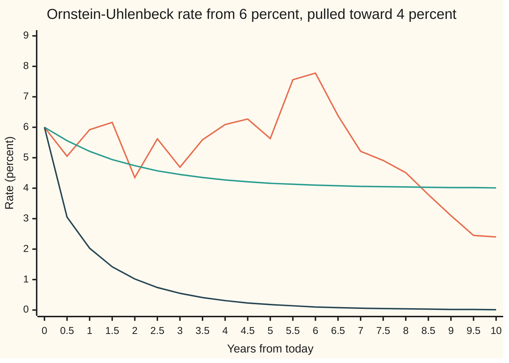
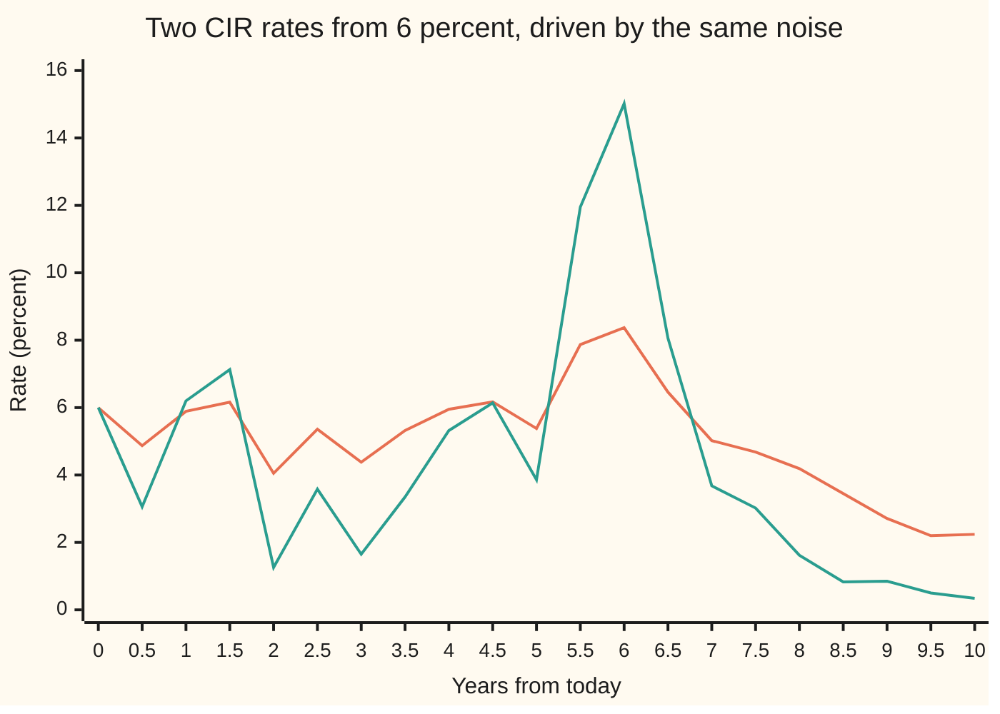

# Mean reversion: the Ornstein-Uhlenbeck and Cox-Ingersoll-Ross processes

[Syllabus](../../../SYLLABUS.md) → [Stochastic processes and calculus](../README.md) → [Ito Calculus](../README.md#s06) → Mean reversion

---

## General Overview

A short-term interest rate stands at 6 percent today. Over the long run it sits near 4 percent. When it is high, borrowing dries up and the rate drifts down; when it is low, the pressure runs the other way. On top of that pull come shocks: news, data, a surprise from the central bank. The rate never stops moving, yet never wanders off for good.

A share price has no such pull, and its spread of possible values grows without limit. A rate is more like a ball on a rubber band tied to the 4 percent mark: the further it strays, the harder the band pulls. The proper name is **mean reversion**: a pull toward a fixed level, in proportion to the distance from it.

This card writes that rule as a stochastic differential equation and solves it exactly. In a year the rate averages 5.21 percent, give or take 1.59 points. Half the expected gap to 4 percent closes every 1.39 years, whatever the noise. In the long run the rate settles into a bell-curve law centred on 4 percent with standard deviation 2 points, which puts it below zero about 1 time in 44. A second model, Cox-Ingersoll-Ross, shrinks the noise near zero, and under one inequality never reaches zero.

**Multiplying the gap by a growing exponential cancels the pull, so the Ornstein-Uhlenbeck rate is normal, its expected gap halves every ln 2 over the pull speed, and its variance settles at the noise squared over twice the pull speed; the Cox-Ingersoll-Ross rate has the same mean and never touches zero when twice the pull speed times the level is at least the noise squared.**

**What kind of fact this is:** a theorem: the solution, its law, the stationary law and the half-life are proved on this card in Why it works; for the Cox-Ingersoll-Ross positivity condition the key steps are here and the complete proof is in Feller (1951). Using either equation for a real rate is a model.

### The picture: one rate, ten years



Orange: one sample path, a single simulated run: seed 20260930, stepped every 0.02 years (about a week), read every half year. Another seed draws another path. Green: the mean rate, gliding from 6 toward 4 percent. Dark blue: the mean minus two standard deviations, which sinks to 0.01 percent, so the rate dips below zero now and then. The path climbs above 7 percent in year six and ends at 2.40 percent: the pull acts on the average, not on every path.

---

## The formula

Notation first, in words. Time $t$ is in years. The rate at time $t$ is $r_t$, a decimal, so 0.06 is 6 percent; $r_0$ is today's rate. $W_t$ is Brownian motion, the random walk seen from far away. As in [Stochastic differential equations](04-stochastic-differential-equations.md), $dW_t$ is shorthand for an Ito integral, never a derivative, because the path has none.

The Ornstein-Uhlenbeck equation, OU for short, is

$$dr_t = \kappa\,(\theta - r_t)\,dt + \sigma\,dW_t .$$

**Read it aloud:** over the next instant, the rate moves toward the level theta at a speed proportional to its distance from it, plus a random shove of fixed size.

Its exact solution, the point of this card:

$$r_t = \theta + (r_0 - \theta)\,e^{-\kappa t} + \sigma \int_0^t e^{-\kappa (t-u)}\,dW_u .$$

**Read it aloud:** today's gap fades exponentially, and every later shock fades the same way, by how long ago it arrived.

So $r_t$ is normal, with

$$E[r_t] = \theta + (r_0-\theta)e^{-\kappa t}, \qquad \operatorname{Var}(r_t) = \frac{\sigma^2}{2\kappa}\big(1 - e^{-2\kappa t}\big).$$

As $t$ grows, the start is forgotten and the law settles to the **stationary law**: normal, mean $\theta$, variance $v_\infty = \sigma^2/(2\kappa)$. The expected gap halves every

$$t_{1/2} = \frac{\ln 2}{\kappa}.$$

The Cox-Ingersoll-Ross equation, CIR, keeps the pull and scales the noise by the square root of the rate:

$$dr_t = \kappa\,(\theta - r_t)\,dt + \sigma\sqrt{r_t}\,dW_t .$$

Its mean is the OU mean. Started above zero, its rate never reaches zero exactly when **Feller's condition** holds:

$$2\kappa\theta \;\ge\; \sigma^2 .$$

| Symbol | Plain meaning | In our example | Push it up and the answer… |
| --- | --- | --- | --- |
| $t$ | time from today, in years | 1, 2, 5, 10 | mean nearer 4 percent |
| $r_t$, $r_0$, $r$ | the rate at time $t$; today's rate; the rate as a variable | 0.06 today | a higher start lifts the mean, not the spread |
| $\theta$ | the long-run level, "theta" | 0.04 | means and stationary centre rise |
| $\kappa$, $e^{-\kappa t}$ | pull speed per year, "kappa"; the share of today's gap still expected at $t$ | 0.5; 0.606531 at one year | shorter half-life, narrower stationary law |
| $\sigma$ | noise size, "sigma": rate per root-year for OU; for CIR, times the root of the rate | OU 0.02; CIR 0.10 and 0.30 | wider spread; past the Feller line, CIR reaches zero |
| $W_t$, $W$, $dW_t$ | Brownian motion; its increment, shorthand for an Ito integral | one draw per step | — |
| $v_\infty$ | stationary variance, $\sigma^2/(2\kappa)$ | 0.000400 | — |
| $t_{1/2}$ | half-life of the expected gap, $\ln 2/\kappa$ | 1.386294 years | — |
| $h$, $a$ | simulation step in years; Euler's factor $a = 1-\kappa h$ | 0.02; 0.99 | past $\kappa h = 2$ the scheme explodes |
| $\nu$, $S$ | Feller's ratio $2\kappa\theta/\sigma^2$, also the shape of CIR's stationary law; Step 7's scale function | 4, or 0.4444 at sigma 0.30 | at 1 or more, zero is never reached |
| $Y_t$, $J_t$, $I$, $f$, $f_k$, $D$ | proof names: the scaled gap $e^{\kappa t}(r_t-\theta)$; the integral of $e^{\kappa u}$ against $W$; the noise integral, its integrand, a step version; the gap between two solutions | starts at 0.02 | — |
| $b$, $c$, $B$, $\varepsilon$ | in Feller's test: drift and noise size of a general equation; a high and a low level | — | — |
| $m(t)$, $v(t)$, $q_k$, $q$, $s$ | Step 6's mean and variance as functions of time; in the normality proof, the variance of a step-version sum and of the integral, and the input of a characteristic function | $m(1)$ = 5.2131 percent; OU $v(1)$ = 0.0002528 | — |

### When it holds

- **A pull that is a straight line in the rate.** A pull such as $\kappa(\theta - r_t)^3$ has no exponential that cancels it, and the method below fails.
- **Noise of fixed size, for OU.** That is what makes the law normal, and a normal law gives negative rates a chance: 2.3 percent in the long run. Noise that depends on the rate, as in CIR, gives a law that is not normal.
- **A positive pull speed.** At $\kappa = 0$ the rate is Brownian motion and its variance $\sigma^2 t$ grows without limit; below zero the gap grows and no stationary law exists.
- **For CIR, Feller's condition.** Drop it and paths reach zero: with sigma 0.30, 94 percent of simulated paths touch zero within ten years.

---

## Why it works

### Step 0: cancel the pull with an exponential

Without noise, the gap shrinks like $e^{-\kappa t}$. So multiply the gap by $e^{\kappa t}$, the integrating factor of [The integrating factor](../../08-Differential%20equations%20and%20dynamics/01-Rate%20Equations/05-integrating-factor.md), which grows exactly as fast as the gap decays. What is left changes only through the noise, and noise alone integrates directly.

### Step 1: the product rule removes the drift

Set $Y_t = e^{\kappa t}(r_t - \theta)$. Ito's product rule ([Ito's product rule](03-ito-product-rule.md)) adds a cross term, the product of the two noise parts. The exponential has no noise part, so the cross term is zero:

$$dY_t = \kappa e^{\kappa t}(r_t-\theta)\,dt + e^{\kappa t}\,dr_t = \kappa e^{\kappa t}(r_t-\theta)\,dt + e^{\kappa t}\big[\kappa(\theta - r_t)\,dt + \sigma\,dW_t\big] = \sigma e^{\kappa t}\,dW_t .$$

The two drift terms cancel. This is Ito calculus; its extra term happens to be zero here, because $Y_t$ is a straight line in $r_t$.

### Step 2: integrate and undo the scaling

Integrate: $Y_t = Y_0 + \sigma\int_0^t e^{\kappa u}\,dW_u$. Multiply by $e^{-\kappa t}$ and add $\theta$ back: that is the solution in The formula.

### Step 3: mean and variance from two Ito facts

An Ito integral of a fixed function has mean zero ([The Ito integral](01-ito-integral.md)), so the mean is the fading gap alone: 0.04 + 0.02 × 0.606531 = 5.2131 percent after a year. The Ito isometry says the variance is the integral of the squared integrand. A shock at time u survives to time t as the fraction $e^{-\kappa(t-u)}$, and variance scales with the square of that fraction:

$$\operatorname{Var}(r_t) = \sigma^2\int_0^t e^{-2\kappa(t-u)}\,du = \frac{\sigma^2}{2\kappa}\big(1-e^{-2\kappa t}\big).$$

The 2 comes from squaring the survival fraction.

### Step 4: the law is normal

The integrand is a fixed function, not random. On a grid the integral is a weighted sum of independent normal increments, so it is normal; the Ito integral is the mean-square limit of such sums, and that limit is normal too.

### Step 5: the stationary law and the half-life

As $t$ grows the law tends to normal with mean 0.04 and standard deviation 0.02. That law is **stationary**: unchanged by time, though the rate never stands still. Start the rate from it, independent of the noise, and it keeps it: the start's variance shrinks by $e^{-2\kappa t}$ and fresh noise adds back exactly the shortfall.

The expected gap $(r_0-\theta)e^{-\kappa t}$ is half its start when $e^{-\kappa t} = 1/2$, at $t = \ln 2/\kappa$ = 1.386294 years. Neither the noise nor the start appears.

<details>
<summary>Detailed proof</summary>

**Setting.** $W$ is a Brownian motion; $\kappa > 0$; $r_0$ is fixed. The equation means $r_t = r_0 + \int_0^t \kappa(\theta - r_u)\,du + \sigma W_t$.

**1. The formula solves the equation.** Let $J_t = \int_0^t e^{\kappa u}\,dW_u$, a continuous martingale started at zero. Define $\tilde r_t = \theta + (r_0-\theta)e^{-\kappa t} + \sigma e^{-\kappa t}J_t$. By Ito's product rule for $e^{-\kappa t}$, which has no noise part, and $J_t$, whose differential is $e^{\kappa t}\,dW_t$: $d(e^{-\kappa t}J_t) = -\kappa e^{-\kappa t}J_t\,dt + dW_t$, with no cross term. So $d\tilde r_t = -\kappa(r_0-\theta)e^{-\kappa t}\,dt - \kappa\sigma e^{-\kappa t}J_t\,dt + \sigma\,dW_t = \kappa(\theta - \tilde r_t)\,dt + \sigma\,dW_t$, and $\tilde r_0 = r_0$.

**2. It is the only solution.** If $r$ and $\tilde r$ solve the equation with the same start and the same $W$, their difference $D$ satisfies $D_t = -\kappa\int_0^t D_u\,du$ path by path. So $D$ is differentiable with $D' = -\kappa D$ and $D_0 = 0$; then $(e^{\kappa t}D_t)' = 0$ and $D \equiv 0$. The general Lipschitz theorem gives the same result ([When an SDE has one solution](07-existence-and-uniqueness-for-sdes.md)).

**3. Normality.** Fix $t$, let $f(u) = e^{-\kappa(t-u)}$ and $I = \int_0^t f\,dW$. Its left-endpoint sums on finer grids are fixed combinations of independent normal increments, so each is normal with mean 0 and variance $q_k = \int_0^t f_k^2$, where $f_k$ is the step version of $f$. By the isometry the sums converge to $I$ in mean square, since $\int_0^t (f_k - f)^2 \to 0$ by uniform continuity. Mean-square convergence gives convergence in distribution, and the characteristic functions (the transform that pins down a law, [Characteristic functions](../../10-Measure%20and%20integration/10-The%20Limit%20Theorems%2C%20Proved/06-characteristic-functions.md)) $e^{-s^2 q_k/2}$ tend to $e^{-s^2 q/2}$ with $q = \int_0^t f^2 = (1 - e^{-2\kappa t})/(2\kappa)$. So $I$ is normal, and so is $r_t$.

**4. Invariance.** Let $r_0$ be normal with mean $\theta$ and variance $v_\infty$, independent of $W$. Then $r_t - \theta = e^{-\kappa t}(r_0 - \theta) + \sigma I$ is a sum of independent normals with variance $e^{-2\kappa t}v_\infty + v_\infty(1 - e^{-2\kappa t}) = v_\infty$: the law is unchanged. From a fixed start the two moments converge, so the characteristic functions do, and the law converges in distribution to the stationary one.

**5. Half-life.** $(r_0 - \theta)e^{-\kappa t} = (r_0 - \theta)/2$ exactly when $\kappa t = \ln 2$. $\blacksquare$

</details>

### Step 6: a second road, the moment equations

Ito's lemma ([Ito's lemma](02-itos-lemma.md)) gives $d(r_t^2) = 2r_t\,dr_t + (\text{noise size})^2\,dt$. Take expectations, where the Ito integral part has mean zero, and write $m(t)$ and $v(t)$ for the mean and variance:

$$m'(t) = \kappa(\theta - m), \qquad v'(t) = -2\kappa\,v + E[\text{noise size}^2].$$

A tap and a drain: noise pours variance in, and the pull drains it at twice its own speed, because variance is a square. For OU the tap is $\sigma^2$, which balances the drain at $\sigma^2/(2\kappa)$. For CIR the tap is $\sigma^2 m(t)$, and the integrating factor once more gives

$$\operatorname{Var}_{\text{CIR}}(r_t) = r_0\,\frac{\sigma^2}{\kappa}\big(e^{-\kappa t} - e^{-2\kappa t}\big) + \frac{\theta\sigma^2}{2\kappa}\big(1 - e^{-\kappa t}\big)^2 .$$

These equations use no solution formula; the code solves them numerically and lands on the closed forms to twelve decimals.

### Step 7: why CIR stays positive under Feller's condition

Near zero the CIR pull is about $\kappa\theta$ upward and the noise $\sigma\sqrt{r_t}$ fades. Feller's test settles the contest with a **scale function** $S$, chosen so that $S(r_t)$ has no drift and is a fair game. Its slope is

$$S'(x) = x^{-\nu}\,e^{2\kappa x/\sigma^2}, \qquad \nu = \frac{2\kappa\theta}{\sigma^2}.$$

<details>
<summary>Key steps of Feller's test, and what is left to the source</summary>

For $dr = b(r)\,dt + c(r)\,dW$, Ito's lemma gives $S(r_t)$ the drift $S'b + \tfrac12 S'' c^2$, which $S'(x) = \exp\!\big(-\int^x 2b/c^2\big)$ makes zero. For CIR, $2b/c^2 = \nu/x - 2\kappa/\sigma^2$, which integrates to the $S'$ above.

Start between a low level $\varepsilon$ and a high level $B$. Stopped on leaving $(\varepsilon, B)$, $S(r_t)$ is a bounded martingale, and optional stopping gives $P(\text{reach } \varepsilon \text{ before } B) = \dfrac{S(B) - S(r_0)}{S(B) - S(\varepsilon)}$.

Near zero, $S'(x)$ behaves like $x^{-\nu}$, and $\int_0 x^{-\nu}\,dx$ is infinite exactly when $\nu \ge 1$. Then $S(\varepsilon) \to -\infty$ as $\varepsilon \to 0$, so reaching zero before $B$ has chance 0 for every $B$. The coefficients grow at most linearly, so a path stays below some $B$ over any finite time, and zero is never reached.

Left to the sources: a unique solution exists although $\sqrt{r}$ is not Lipschitz at zero (Yamada and Watanabe; Karatzas and Shreve, Section 5.2); for $\nu < 1$ zero is reached (Feller 1951; Karatzas and Shreve, Section 5.5); the stationary law is gamma with shape $\nu$ and scale $\sigma^2/(2\kappa)$ (Cox, Ingersoll and Ross 1985).

</details>

So **if $2\kappa\theta \ge \sigma^2$, a CIR rate started above zero never reaches zero.** Here $2\kappa\theta$ is 0.04. Sigma 0.10 gives 0.01 and $\nu$ = 4: zero is out of reach. Sigma 0.30 gives 0.09 and $\nu$ = 0.4444: zero is reached, and the upward pull there pushes the rate off it.

---

## Worked numbers, by hand

The rate: $r_0$ = 0.06, $\theta$ = 0.04, $\kappa$ = 0.5 per year, OU $\sigma$ = 0.02, CIR $\sigma$ = 0.10.

| Step | Arithmetic | Value |
| --- | --- | --- |
| share of the gap left after one year | $e^{-0.5}$ | 0.606531 |
| **mean after one year** | 0.04 + 0.02 × 0.606531 | **5.2131 percent** |
| OU variance after one year | (0.0004 / 1) × (1 − $e^{-1}$) = 0.0004 × (1 − 0.367879) | 0.0002528 |
| OU standard deviation after one year | square root of 0.0002528 | 1.5901 points |
| **half-life** | 0.693147 / 0.5 | **1.386294 years** |
| stationary variance | 0.02 × 0.02 / (2 × 0.5) | 0.000400 |
| stationary standard deviation | square root of 0.0004 | 2.0000 points |
| chance a stationary rate is negative | normal area below (0 − 4) / 2 = −2 | 0.022750, 1 in 44.0 |
| CIR variance after one year | 0.06 × 0.02 × 0.238651 + 0.04 × 0.01 / (2 × 0.5) × 0.154818 = 0.0002864 + 0.0000619 | 0.0003483 |
| Feller check, sigma 0.10 | 2 × 0.5 × 0.04 = 0.04 against 0.01 | holds, ratio 4.0000 |

A year from now the rate averages about 5.2 percent, two years in about 4.7. Within ten years the start is forgotten. The two models share every mean; CIR's year-one variance is wider, 0.0003483 against 0.0002528, because its noise is larger while the rate is above 4 percent.

### What breaks if you drop a piece

| Mistake | Comes out at | What went wrong |
| --- | --- | --- |
| No pull, as Brownian motion: variance $\sigma^2 t$ | 0.004000 at ten years, a 6.3246 point spread | Without the drain the spread grows forever |
| Stationary variance $\sigma^2/\kappa$ | 0.000800, a 2.8284 point spread | The gap shrinks at kappa, its square at 2 kappa |
| $1/\kappa$ = 2 years as the half-life | mean 4.7358 percent at two years, not 5.0000 | $1/\kappa$ takes the gap to $e^{-1}$, 0.367879 of itself |
| Euler steps of 4.5 years | variance 0.274356 after 10 steps, 24.070924 after 20 | Factor −1.25: each step overshoots by more than the gap |
| CIR, Feller dropped, sigma 0.30 | 94 percent of paths touch zero in ten years | $\nu$ = 0.4444 is below 1 |

The code prints every row.

---

## Two models, one pull: how they move

Same pull, different noise. Drive both with the same random draws:



Orange: CIR with sigma 0.10, inside Feller's condition. It tracks the OU path of the first picture, because at 4 percent its noise, $0.10 \times \sqrt{0.04}$ = 0.02, equals the OU noise. Green: CIR with sigma 0.30, outside the condition, swinging from 15.02 down to 0.34 percent. One sample path each, same seed and grid as before.

With sigma 0.10, CIR's stationary law has mean 4 percent and variance $\theta\sigma^2/(2\kappa)$, the same 0.000400 as OU. Same centre, same spread; yet the OU law puts 2.3 percent of its weight below zero and the lopsided CIR law none. On the 0.02-year grid, 0.2822 of OU paths dip below zero within ten years, and no CIR path with sigma 0.10 ends below zero.

---

## Code, from first principles, and it actually runs

Four roads. One: the closed forms. Two: the moment equations of Step 6, solved by a fourth-order Runge-Kutta stepper written out, with no solution formula. Three: the Euler scheme, the simulation rule $r \to r + \kappa(\theta - r)h + \sigma\sqrt{h}\,Z$ for a standard normal draw $Z$, whose own mean and variance follow an exact recursion, so its error prints with no sampling noise. Four: 10000 simulated ten-year paths at step 0.02 years, from a SplitMix64 generator (seed 20260930) and Box-Muller normals, every number with its standard error. The asserts compare roads one and two to twelve decimals, check the half-life by bisection, the Euler error shrinking with the step, the simulations within 4 standard errors, and the Feller split by hit counts.

### Python

```python
# Mean reversion -- the check behind the card.  Only math is imported.
# A short rate r_t (a decimal, per year) is pulled toward THETA = 4 percent at speed
# KAPPA = 0.5 a year, starting at R0 = 6 percent.  OU: dr = KAPPA (THETA - r) dt + SIG dW.
# CIR: the noise is SIG_C sqrt(r) dW instead.  Roads: the closed forms; the moment
# equations from Ito's lemma, solved by RK4; the Euler recursion's own exact moments at
# shrinking steps; 10000 simulated paths from a SplitMix64 generator and Box-Muller.
import math

KAPPA, THETA, R0, SIG = 0.5, 0.04, 0.06, 0.02          # per year, rate, rate, per sqrt(year)
SIG_OK, SIG_BAD = 0.10, 0.30                           # CIR noise: Feller holds, Feller fails
PATHS, H, STEPS, SEED, MASK = 10000, 0.02, 500, 20260930, (1 << 64) - 1     # step 0.02 years, 10 years

def ou_mean(t): return THETA + (R0 - THETA) * math.exp(-KAPPA * t)
def ou_var(t): return SIG * SIG / (2 * KAPPA) * (1 - math.exp(-2 * KAPPA * t))
def cir_var(t, s):                                     # the CIR variance, from the moment equations
    a, b = math.exp(-KAPPA * t), s * s / KAPPA
    return R0 * b * (a - a * a) + THETA * b / 2 * (1 - a) * (1 - a)

def moments_rk4(t, s, cir, n=2000):     # dm/dt = K(TH - m);  dE[r^2]/dt = 2K TH m - 2K E[r^2] + E[noise^2]
    f = lambda m, m2: (KAPPA * (THETA - m), 2 * KAPPA * THETA * m - 2 * KAPPA * m2 + (s * s * m if cir else s * s))
    m, m2, h = R0, R0 * R0, t / n
    for _ in range(n):
        k1 = f(m, m2); k2 = f(m + h / 2 * k1[0], m2 + h / 2 * k1[1])
        k3 = f(m + h / 2 * k2[0], m2 + h / 2 * k2[1]); k4 = f(m + h * k3[0], m2 + h * k3[1])
        m += h / 6 * (k1[0] + 2 * k2[0] + 2 * k3[0] + k4[0])
        m2 += h / 6 * (k1[1] + 2 * k2[1] + 2 * k3[1] + k4[1])
    return m, m2 - m * m

def ncdf(x, n=2000):                    # bell-curve area left of x: one half plus Simpson from 0 to x
    h, s = x / n, 0.0
    for i in range(n + 1):
        z = i * h
        s += (1 if i in (0, n) else (4 if i % 2 else 2)) * math.exp(-0.5 * z * z)
    return 0.5 + s * h / 3 / math.sqrt(2 * math.pi)

def euler_moments(h, t):                # exact mean and variance of the Euler recursion itself
    m, v, a = R0, 0.0, 1 - KAPPA * h
    for _ in range(round(t / h)):
        m, v = THETA + a * (m - THETA), a * a * v + SIG * SIG * h
    return m, v

class SplitMix64:                       # the wing's generator, written out
    def __init__(self, seed): self.s = seed & MASK
    def uniform(self):
        self.s = (self.s + 0x9E3779B97F4A7C15) & MASK
        z = self.s
        z = ((z ^ (z >> 30)) * 0xBF58476D1CE4E5B9) & MASK
        z = ((z ^ (z >> 27)) * 0x94D049BB133111EB) & MASK
        return ((z ^ (z >> 31)) >> 11) / 9007199254740992.0
    def normal(self):                   # Box-Muller, cosine half only
        u1, u2 = 1.0 - self.uniform(), self.uniform()
        return math.sqrt(-2.0 * math.log(u1)) * math.cos(2.0 * math.pi * u2)

def stats(xs):                          # mean, its SE, variance, its SE
    n = len(xs); m = sum(xs) / n
    c2 = sum((x - m) * (x - m) for x in xs) / n
    c4 = sum(((x - m) * (x - m)) * ((x - m) * (x - m)) for x in xs) / n
    return m, math.sqrt(c2 / (n - 1)), c2 * n / (n - 1), math.sqrt((c4 - c2 * c2) / n)

half, v_inf = math.log(2) / KAPPA, SIG * SIG / (2 * KAPPA); p_neg = ncdf(-THETA / math.sqrt(v_inf))
print(f"OU: kappa {KAPPA}, theta {THETA}, r0 {R0}, sigma {SIG}; CIR sigma {SIG_OK} and {SIG_BAD}")
print(f"half-life ln2/kappa {half:.6f} years; time constant 1/kappa {1 / KAPPA:.6f} years")
print(f"stationary: var {v_inf:.6f}, sd {100 * math.sqrt(v_inf):.4f} percent, P(r < 0) {p_neg:.6f}, 1 in {1 / p_neg:.1f}")
a1, b1 = math.exp(-KAPPA), SIG_OK * SIG_OK / KAPPA
print(f"hand: ln 2 {math.log(2):.6f}, e^-0.5 {a1:.6f}, 1 - e^-0.5 {1 - a1:.6f}, e^-1 {a1 * a1:.6f}; CIR t = 1: a - a^2 {a1 - a1 * a1:.6f}, (1 - a)^2 {(1 - a1) * (1 - a1):.6f},"
      f" pieces {R0 * b1 * (a1 - a1 * a1):.7f} + {THETA * b1 / 2 * (1 - a1) * (1 - a1):.7f}")
for t in (1, 2, 5, 10):
    rm, rv = moments_rk4(t, SIG, False)
    print(f"OU t = {t:2d}: formula mean {100 * ou_mean(t):.4f} sd {100 * math.sqrt(ou_var(t)):.4f} percent;"
          f" RK4 mean {100 * rm:.4f} sd {100 * math.sqrt(rv):.4f}")
    assert abs(rm - ou_mean(t)) < 1e-12 and abs(rv - ou_var(t)) < 1e-12
lo, hi = 0.0, 5.0                       # half-life by bisection on the RK4 mean: when is the gap 1 point?
for _ in range(60):
    mid = (lo + hi) / 2
    lo, hi = (mid, hi) if moments_rk4(mid, SIG, False, 400)[0] > (R0 + THETA) / 2 else (lo, mid)
print(f"half-life by bisection on the RK4 mean: {lo:.6f} years; rate then {100 * ou_mean(lo):.4f} percent")
assert abs(lo - half) < 1e-9
errs = []
for h in (0.5, 0.1, 0.01, 0.001):
    em, ev = euler_moments(h, 1.0)
    errs.append(abs(ev - ou_var(1)))
    print(f"Euler recursion h = {h:5}: mean {100 * em:.4f} percent, var {ev:.8f}; var off by"
          f" {100 * abs(ev / ou_var(1) - 1):.4f} percent")
assert errs[3] < errs[2] / 5 < errs[1] / 25 and errs[3] < 1e-3 * ou_var(1)
for h in (0.02, 1.0, 2.5):
    a = 1 - KAPPA * h
    print(f"Euler step h = {h:.2f}: factor 1 - kappa h = {a:.2f}, long-run var {SIG * SIG * h / (1 - a * a):.6f}"
          f" against {v_inf:.6f}")
print(f"Euler step h = 4.50: factor {1 - KAPPA * 4.5:.2f}, var after 10 steps {euler_moments(4.5, 45)[1]:.6f},"
      f" after 20 steps {euler_moments(4.5, 90)[1]:.6f}")

g = SplitMix64(SEED)
ou1, ou10, ok1, ok10, ou_dip, ok_hit, bad_hit, fig = [], [], [], [], 0, 0, 0, []
for p in range(PATHS):
    x = y = w = R0
    dipped = hit_y = hit_w = False
    row = [(x, y, w)]
    for k in range(1, STEPS + 1):
        z = g.normal() * math.sqrt(H)
        x += KAPPA * (THETA - x) * H + SIG * z
        y += KAPPA * (THETA - max(y, 0.0)) * H + SIG_OK * math.sqrt(max(y, 0.0)) * z
        w += KAPPA * (THETA - max(w, 0.0)) * H + SIG_BAD * math.sqrt(max(w, 0.0)) * z
        dipped, hit_y, hit_w = dipped or x < 0, hit_y or y <= 0, hit_w or w <= 0
        if k == 50: ou1.append(x); ok1.append(y)
        if p == 0 and k % 25 == 0: row.append((x, y, w))
    ou10.append(x); ok10.append(y)
    ou_dip += dipped; ok_hit += hit_y; bad_hit += hit_w
    if p == 0: fig = row
for lab, xs, mt, vt in (("OU t = 1", ou1, ou_mean(1), ou_var(1)), ("OU t = 10", ou10, ou_mean(10), ou_var(10)),
                        ("CIR t = 1", ok1, ou_mean(1), cir_var(1, SIG_OK)), ("CIR t = 10", ok10, ou_mean(10), cir_var(10, SIG_OK))):
    m, sm, v, sv = stats(xs)
    print(f"simulated {lab:10s}: mean {100 * m:.4f} +- {100 * sm:.4f} percent (formula {100 * mt:.4f}),"
          f" var {v:.7f} +- {sv:.7f} (formula {vt:.7f})")
    assert abs(m - mt) < 4 * sm and abs(v - vt) < 4 * sv
neg = sum(1 for x in ou10 if x < 0) / PATHS
print(f"OU at t = 10: P(r < 0) simulated {neg:.4f} +- {math.sqrt(neg * (1 - neg) / PATHS):.4f},"
      f" formula {ncdf(-ou_mean(10) / math.sqrt(ou_var(10))):.4f}; CIR below 0: {sum(1 for y in ok10 if y < 0)}")
assert abs(neg - ncdf(-ou_mean(10) / math.sqrt(ou_var(10)))) < 4 * math.sqrt(neg * (1 - neg) / PATHS)
for t in (1, 10):
    rm, rv = moments_rk4(t, SIG_OK, True)
    print(f"CIR t = {t:2d}: formula var {cir_var(t, SIG_OK):.7f}, RK4 mean {100 * rm:.4f} percent, RK4 var {rv:.7f}")
    assert abs(rm - ou_mean(t)) < 1e-12 and abs(rv - cir_var(t, SIG_OK)) < 1e-12
for s, hits in ((SIG_OK, ok_hit), (SIG_BAD, bad_hit)):
    fr = hits / PATHS
    print(f"CIR sigma {s}: 2 kappa theta {2 * KAPPA * THETA:.2f} vs sigma^2 {s * s:.2f}, shape {2 * KAPPA * THETA / (s * s):.4f};"
          f" paths touching 0 in 10 years {fr:.4f} +- {math.sqrt(fr * (1 - fr) / PATHS):.4f}")
assert ok_hit <= PATHS // 1000 and bad_hit > PATHS // 2      # Feller holds: grid artefacts only
print(f"OU paths dipping below 0 within 10 years: {ou_dip / PATHS:.4f} +- {math.sqrt(ou_dip / PATHS * (1 - ou_dip / PATHS) / PATHS):.4f}")
print(f"mistake: Brownian variance sigma^2 t at t = 10: {SIG * SIG * 10:.6f}, sd {100 * SIG * math.sqrt(10):.4f} percent")
print(f"mistake: stationary var without the 2, sigma^2/kappa: {SIG * SIG / KAPPA:.6f}, sd {100 * SIG / math.sqrt(KAPPA):.4f} percent")
print(f"mistake: 1/kappa as the half-life: mean at t = 2 is {100 * ou_mean(2):.4f} percent, not 5.0000")
print(f"try: kappa 1.0: half-life {math.log(2) / 1.0:.6f}, stationary sd {100 * SIG / math.sqrt(2.0):.4f};"
      f" sigma 0.04: stationary sd {100 * 0.04 / math.sqrt(2 * KAPPA):.4f}, P(r < 0) {ncdf(-1.0):.6f}")
print("figure, years: " + ", ".join(f"{k / 2:.1f}" for k in range(21)))
print("figure, OU sample path, percent: " + ", ".join(f"{100 * r[0]:.2f}" for r in fig))
print("figure, OU mean, percent: " + ", ".join(f"{100 * ou_mean(k / 2):.2f}" for k in range(21)))
print("figure, OU mean - 2 sd, percent: " + ", ".join(f"{100 * (ou_mean(k / 2) - 2 * math.sqrt(ou_var(k / 2))):.2f}" for k in range(21)))
print(f"figure, CIR sigma {SIG_OK} path, percent: " + ", ".join(f"{100 * r[1]:.2f}" for r in fig))
print(f"figure, CIR sigma {SIG_BAD} path, percent: " + ", ".join(f"{100 * r[2]:.2f}" for r in fig))
print("ALL CHECKS PASS")
```

**Ran 2026-10-06 on macOS, Python 3.14.6, standard library only. All checks passed. Output, pasted from the run:**

```
OU: kappa 0.5, theta 0.04, r0 0.06, sigma 0.02; CIR sigma 0.1 and 0.3
half-life ln2/kappa 1.386294 years; time constant 1/kappa 2.000000 years
stationary: var 0.000400, sd 2.0000 percent, P(r < 0) 0.022750, 1 in 44.0
hand: ln 2 0.693147, e^-0.5 0.606531, 1 - e^-0.5 0.393469, e^-1 0.367879; CIR t = 1: a - a^2 0.238651, (1 - a)^2 0.154818, pieces 0.0002864 + 0.0000619
OU t =  1: formula mean 5.2131 sd 1.5901 percent; RK4 mean 5.2131 sd 1.5901
OU t =  2: formula mean 4.7358 sd 1.8597 percent; RK4 mean 4.7358 sd 1.8597
OU t =  5: formula mean 4.1642 sd 1.9933 percent; RK4 mean 4.1642 sd 1.9933
OU t = 10: formula mean 4.0135 sd 2.0000 percent; RK4 mean 4.0135 sd 2.0000
half-life by bisection on the RK4 mean: 1.386294 years; rate then 5.0000 percent
Euler recursion h =   0.5: mean 5.1250 percent, var 0.00031250; var off by 23.5919 percent
Euler recursion h =   0.1: mean 5.1975 percent, var 0.00026319; var off by 4.0882 percent
Euler recursion h =  0.01: mean 5.2115 percent, var 0.00025385; var off by 0.3968 percent
Euler recursion h = 0.001: mean 5.2129 percent, var 0.00025295; var off by 0.0396 percent
Euler step h = 0.02: factor 1 - kappa h = 0.99, long-run var 0.000402 against 0.000400
Euler step h = 1.00: factor 1 - kappa h = 0.50, long-run var 0.000533 against 0.000400
Euler step h = 2.50: factor 1 - kappa h = -0.25, long-run var 0.001067 against 0.000400
Euler step h = 4.50: factor -1.25, var after 10 steps 0.274356, after 20 steps 24.070924
simulated OU t = 1  : mean 5.2218 +- 0.0160 percent (formula 5.2131), var 0.0002551 +- 0.0000035 (formula 0.0002528)
simulated OU t = 10 : mean 4.0219 +- 0.0200 percent (formula 4.0135), var 0.0004013 +- 0.0000057 (formula 0.0004000)
simulated CIR t = 1 : mean 5.2239 +- 0.0188 percent (formula 5.2131), var 0.0003523 +- 0.0000053 (formula 0.0003483)
simulated CIR t = 10: mean 4.0174 +- 0.0201 percent (formula 4.0135), var 0.0004033 +- 0.0000073 (formula 0.0004027)
OU at t = 10: P(r < 0) simulated 0.0225 +- 0.0015, formula 0.0224; CIR below 0: 0
CIR t =  1: formula var 0.0003483, RK4 mean 5.2131 percent, RK4 var 0.0003483
CIR t = 10: formula var 0.0004027, RK4 mean 4.0135 percent, RK4 var 0.0004027
CIR sigma 0.1: 2 kappa theta 0.04 vs sigma^2 0.01, shape 4.0000; paths touching 0 in 10 years 0.0001 +- 0.0001
CIR sigma 0.3: 2 kappa theta 0.04 vs sigma^2 0.09, shape 0.4444; paths touching 0 in 10 years 0.9445 +- 0.0023
OU paths dipping below 0 within 10 years: 0.2822 +- 0.0045
mistake: Brownian variance sigma^2 t at t = 10: 0.004000, sd 6.3246 percent
mistake: stationary var without the 2, sigma^2/kappa: 0.000800, sd 2.8284 percent
mistake: 1/kappa as the half-life: mean at t = 2 is 4.7358 percent, not 5.0000
try: kappa 1.0: half-life 0.693147, stationary sd 1.4142; sigma 0.04: stationary sd 4.0000, P(r < 0) 0.158655
figure, years: 0.0, 0.5, 1.0, 1.5, 2.0, 2.5, 3.0, 3.5, 4.0, 4.5, 5.0, 5.5, 6.0, 6.5, 7.0, 7.5, 8.0, 8.5, 9.0, 9.5, 10.0
figure, OU sample path, percent: 6.00, 5.05, 5.92, 6.16, 4.35, 5.62, 4.69, 5.59, 6.09, 6.27, 5.63, 7.56, 7.78, 6.38, 5.21, 4.91, 4.51, 3.79, 3.10, 2.45, 2.40
figure, OU mean, percent: 6.00, 5.56, 5.21, 4.94, 4.74, 4.57, 4.45, 4.35, 4.27, 4.21, 4.16, 4.13, 4.10, 4.08, 4.06, 4.05, 4.04, 4.03, 4.02, 4.02, 4.01
figure, OU mean - 2 sd, percent: 6.00, 3.05, 2.03, 1.42, 1.02, 0.74, 0.55, 0.41, 0.31, 0.23, 0.18, 0.14, 0.10, 0.08, 0.06, 0.05, 0.04, 0.03, 0.02, 0.02, 0.01
figure, CIR sigma 0.1 path, percent: 6.00, 4.87, 5.89, 6.16, 4.05, 5.36, 4.38, 5.32, 5.95, 6.17, 5.38, 7.87, 8.37, 6.46, 5.02, 4.68, 4.19, 3.45, 2.71, 2.20, 2.24
figure, CIR sigma 0.3 path, percent: 6.00, 3.06, 6.20, 7.13, 1.26, 3.58, 1.65, 3.35, 5.32, 6.14, 3.86, 11.95, 15.02, 8.06, 3.68, 3.02, 1.62, 0.83, 0.85, 0.50, 0.34
ALL CHECKS PASS
```

The Euler lines are a convergence test: each tenfold cut in the step cuts the variance error about tenfold, 4.0882 to 0.3968 to 0.0396 percent. One CIR path with sigma 0.10 touched zero on the grid. That is a grid artefact: a weekly step can overshoot a rate already near zero, which the continuous process never does. With sigma 0.30, 0.9445 of paths touch zero.

### Rust

```rust
// Mean reversion -- the same check as ornstein_uhlenbeck_and_cir_processes_check.py, in Rust.
// Standard library only, no crates.  A short rate r_t is pulled toward THETA = 4 percent at
// speed KAPPA = 0.5 a year from R0 = 6 percent.  OU: dr = KAPPA (THETA - r) dt + SIG dW.
// CIR: the noise is SIG_C sqrt(r) dW.  Roads: closed forms; the Ito moment equations by RK4;
// the Euler recursion's exact moments at shrinking steps; 10000 simulated paths.
use std::f64::consts::PI;

const KAPPA: f64 = 0.5; const THETA: f64 = 0.04; const R0: f64 = 0.06; const SIG: f64 = 0.02;
const SIG_OK: f64 = 0.10; const SIG_BAD: f64 = 0.30; const PATHS: usize = 10000; const H: f64 = 0.02; const STEPS: usize = 500; const SEED: u64 = 20260930;

fn ou_mean(t: f64) -> f64 { THETA + (R0 - THETA) * (-KAPPA * t).exp() }
fn ou_var(t: f64) -> f64 { SIG * SIG / (2.0 * KAPPA) * (1.0 - (-2.0 * KAPPA * t).exp()) }
fn cir_var(t: f64, s: f64) -> f64 {
    let (a, b) = ((-KAPPA * t).exp(), s * s / KAPPA);
    R0 * b * (a - a * a) + THETA * b / 2.0 * (1.0 - a) * (1.0 - a)
}

fn moments_rk4(t: f64, s: f64, cir: bool, n: usize) -> (f64, f64) {
    let f = |m: f64, m2: f64| -> (f64, f64) {
        (KAPPA * (THETA - m), 2.0 * KAPPA * THETA * m - 2.0 * KAPPA * m2 + if cir { s * s * m } else { s * s })
    };
    let (mut m, mut m2, h) = (R0, R0 * R0, t / n as f64);
    for _ in 0..n {
        let k1 = f(m, m2); let k2 = f(m + h / 2.0 * k1.0, m2 + h / 2.0 * k1.1);
        let k3 = f(m + h / 2.0 * k2.0, m2 + h / 2.0 * k2.1); let k4 = f(m + h * k3.0, m2 + h * k3.1);
        m += h / 6.0 * (k1.0 + 2.0 * k2.0 + 2.0 * k3.0 + k4.0);
        m2 += h / 6.0 * (k1.1 + 2.0 * k2.1 + 2.0 * k3.1 + k4.1);
    }
    (m, m2 - m * m)
}

fn ncdf(x: f64) -> f64 {                     // one half plus Simpson's rule from 0 to x
    let n = 2000usize;
    let (h, mut s) = (x / n as f64, 0.0);
    for i in 0..=n {
        let z = i as f64 * h;
        let w = if i == 0 || i == n { 1.0 } else if i % 2 == 1 { 4.0 } else { 2.0 };
        s += w * (-0.5 * z * z).exp();
    }
    0.5 + s * h / 3.0 / (2.0 * PI).sqrt()
}

fn euler_moments(h: f64, t: f64) -> (f64, f64) {   // exact mean and variance of the Euler recursion
    let (mut m, mut v, a) = (R0, 0.0, 1.0 - KAPPA * h);
    for _ in 0..(t / h).round() as usize { m = THETA + a * (m - THETA); v = a * a * v + SIG * SIG * h; }
    (m, v)
}

struct SplitMix64 { s: u64 }                 // the wing's generator, written out
impl SplitMix64 {
    fn uniform(&mut self) -> f64 {
        self.s = self.s.wrapping_add(0x9E3779B97F4A7C15);
        let mut z = self.s;
        z = (z ^ (z >> 30)).wrapping_mul(0xBF58476D1CE4E5B9);
        z = (z ^ (z >> 27)).wrapping_mul(0x94D049BB133111EB);
        ((z ^ (z >> 31)) >> 11) as f64 / 9007199254740992.0
    }
    fn normal(&mut self) -> f64 {            // Box-Muller, cosine half only
        let u1 = 1.0 - self.uniform(); let u2 = self.uniform();
        (-2.0 * u1.ln()).sqrt() * (2.0 * PI * u2).cos()
    }
}

fn stats(xs: &[f64]) -> (f64, f64, f64, f64) {   // mean, its SE, variance, its SE
    let n = xs.len() as f64;
    let m = xs.iter().sum::<f64>() / n;
    let c2 = xs.iter().map(|x| (x - m) * (x - m)).sum::<f64>() / n;
    let c4 = xs.iter().map(|x| ((x - m) * (x - m)) * ((x - m) * (x - m))).sum::<f64>() / n;
    (m, (c2 / (n - 1.0)).sqrt(), c2 * n / (n - 1.0), ((c4 - c2 * c2) / n).sqrt())
}

fn main() {
    let (half, v_inf) = (2f64.ln() / KAPPA, SIG * SIG / (2.0 * KAPPA));
    let p_neg = ncdf(-THETA / v_inf.sqrt());
    println!("OU: kappa {}, theta {}, r0 {}, sigma {}; CIR sigma {} and {}", KAPPA, THETA, R0, SIG, SIG_OK, SIG_BAD);
    println!("half-life ln2/kappa {:.6} years; time constant 1/kappa {:.6} years", half, 1.0 / KAPPA);
    println!("stationary: var {:.6}, sd {:.4} percent, P(r < 0) {:.6}, 1 in {:.1}", v_inf, 100.0 * v_inf.sqrt(), p_neg, 1.0 / p_neg);
    let (a1, b1) = ((-KAPPA).exp(), SIG_OK * SIG_OK / KAPPA);
    println!("hand: ln 2 {:.6}, e^-0.5 {:.6}, 1 - e^-0.5 {:.6}, e^-1 {:.6}; CIR t = 1: a - a^2 {:.6}, (1 - a)^2 {:.6}, pieces {:.7} + {:.7}",
             2f64.ln(), a1, 1.0 - a1, a1 * a1, a1 - a1 * a1,
             (1.0 - a1) * (1.0 - a1), R0 * b1 * (a1 - a1 * a1), THETA * b1 / 2.0 * (1.0 - a1) * (1.0 - a1));
    for t in [1.0, 2.0, 5.0, 10.0] {
        let (rm, rv) = moments_rk4(t, SIG, false, 2000);
        println!("OU t = {:>2}: formula mean {:.4} sd {:.4} percent; RK4 mean {:.4} sd {:.4}",
                 t, 100.0 * ou_mean(t), 100.0 * ou_var(t).sqrt(), 100.0 * rm, 100.0 * rv.sqrt());
        assert!((rm - ou_mean(t)).abs() < 1e-12 && (rv - ou_var(t)).abs() < 1e-12);
    }
    let (mut lo, mut hi) = (0.0f64, 5.0f64);   // half-life by bisection on the RK4 mean
    for _ in 0..60 {
        let mid = (lo + hi) / 2.0;
        if moments_rk4(mid, SIG, false, 400).0 > (R0 + THETA) / 2.0 { lo = mid } else { hi = mid }
    }
    println!("half-life by bisection on the RK4 mean: {:.6} years; rate then {:.4} percent", lo, 100.0 * ou_mean(lo));
    assert!((lo - half).abs() < 1e-9);
    let mut errs = vec![];
    for h in [0.5, 0.1, 0.01, 0.001] {
        let (em, ev) = euler_moments(h, 1.0);
        errs.push((ev - ou_var(1.0)).abs());
        println!("Euler recursion h = {:5}: mean {:.4} percent, var {:.8}; var off by {:.4} percent",
                 h, 100.0 * em, ev, 100.0 * (ev / ou_var(1.0) - 1.0).abs());
    }
    assert!(errs[3] < errs[2] / 5.0 && errs[2] / 5.0 < errs[1] / 25.0 && errs[3] < 1e-3 * ou_var(1.0));
    for h in [0.02, 1.0, 2.5] {
        let a = 1.0 - KAPPA * h;
        println!("Euler step h = {:.2}: factor 1 - kappa h = {:.2}, long-run var {:.6} against {:.6}", h, a, SIG * SIG * h / (1.0 - a * a), v_inf);
    }
    println!("Euler step h = 4.50: factor {:.2}, var after 10 steps {:.6}, after 20 steps {:.6}",
             1.0 - KAPPA * 4.5, euler_moments(4.5, 45.0).1, euler_moments(4.5, 90.0).1);

    let mut g = SplitMix64 { s: SEED };
    let (mut ou1, mut ou10, mut ok1, mut ok10) = (vec![], vec![], vec![], vec![]);
    let (mut ou_dip, mut ok_hit, mut bad_hit, mut fig) = (0usize, 0usize, 0usize, vec![]);
    for p in 0..PATHS {
        let (mut x, mut y, mut w) = (R0, R0, R0);
        let (mut dipped, mut hit_y, mut hit_w) = (false, false, false);
        let mut row = vec![(x, y, w)];
        for k in 1..=STEPS {
            let z = g.normal() * H.sqrt();
            x += KAPPA * (THETA - x) * H + SIG * z;
            y += KAPPA * (THETA - y.max(0.0)) * H + SIG_OK * y.max(0.0).sqrt() * z;
            w += KAPPA * (THETA - w.max(0.0)) * H + SIG_BAD * w.max(0.0).sqrt() * z;
            dipped |= x < 0.0; hit_y |= y <= 0.0; hit_w |= w <= 0.0;
            if k == 50 { ou1.push(x); ok1.push(y); }
            if p == 0 && k % 25 == 0 { row.push((x, y, w)); }
        }
        ou10.push(x); ok10.push(y);
        ou_dip += dipped as usize; ok_hit += hit_y as usize; bad_hit += hit_w as usize;
        if p == 0 { fig = row; }
    }
    for (lab, xs, mt, vt) in [("OU t = 1", &ou1, ou_mean(1.0), ou_var(1.0)), ("OU t = 10", &ou10, ou_mean(10.0), ou_var(10.0)),
                              ("CIR t = 1", &ok1, ou_mean(1.0), cir_var(1.0, SIG_OK)), ("CIR t = 10", &ok10, ou_mean(10.0), cir_var(10.0, SIG_OK))] {
        let (m, sm, v, sv) = stats(xs);
        println!("simulated {:<10}: mean {:.4} +- {:.4} percent (formula {:.4}), var {:.7} +- {:.7} (formula {:.7})",
                 lab, 100.0 * m, 100.0 * sm, 100.0 * mt, v, sv, vt);
        assert!((m - mt).abs() < 4.0 * sm && (v - vt).abs() < 4.0 * sv);
    }
    let neg = ou10.iter().filter(|x| **x < 0.0).count() as f64 / PATHS as f64;
    let se_neg = (neg * (1.0 - neg) / PATHS as f64).sqrt();
    let p10 = ncdf(-ou_mean(10.0) / ou_var(10.0).sqrt());
    println!("OU at t = 10: P(r < 0) simulated {:.4} +- {:.4}, formula {:.4}; CIR below 0: {}",
             neg, se_neg, p10, ok10.iter().filter(|y| **y < 0.0).count());
    assert!((neg - p10).abs() < 4.0 * se_neg);
    for t in [1.0, 10.0] {
        let (rm, rv) = moments_rk4(t, SIG_OK, true, 2000);
        println!("CIR t = {:>2}: formula var {:.7}, RK4 mean {:.4} percent, RK4 var {:.7}", t, cir_var(t, SIG_OK), 100.0 * rm, rv);
        assert!((rm - ou_mean(t)).abs() < 1e-12 && (rv - cir_var(t, SIG_OK)).abs() < 1e-12);
    }
    for (s, hits) in [(SIG_OK, ok_hit), (SIG_BAD, bad_hit)] {
        let fr = hits as f64 / PATHS as f64;
        println!("CIR sigma {}: 2 kappa theta {:.2} vs sigma^2 {:.2}, shape {:.4}; paths touching 0 in 10 years {:.4} +- {:.4}",
                 s, 2.0 * KAPPA * THETA, s * s, 2.0 * KAPPA * THETA / (s * s), fr, (fr * (1.0 - fr) / PATHS as f64).sqrt());
    }
    assert!(ok_hit <= PATHS / 1000 && bad_hit > PATHS / 2);   // Feller holds: grid artefacts only
    let d = ou_dip as f64 / PATHS as f64;
    println!("OU paths dipping below 0 within 10 years: {:.4} +- {:.4}", d, (d * (1.0 - d) / PATHS as f64).sqrt());
    println!("mistake: Brownian variance sigma^2 t at t = 10: {:.6}, sd {:.4} percent", SIG * SIG * 10.0, 100.0 * SIG * 10f64.sqrt());
    println!("mistake: stationary var without the 2, sigma^2/kappa: {:.6}, sd {:.4} percent", SIG * SIG / KAPPA, 100.0 * SIG / KAPPA.sqrt());
    println!("mistake: 1/kappa as the half-life: mean at t = 2 is {:.4} percent, not 5.0000", 100.0 * ou_mean(2.0));
    println!("try: kappa 1.0: half-life {:.6}, stationary sd {:.4}; sigma 0.04: stationary sd {:.4}, P(r < 0) {:.6}",
             2f64.ln() / 1.0, 100.0 * SIG / 2f64.sqrt(), 100.0 * 0.04 / (2.0 * KAPPA).sqrt(), ncdf(-1.0));
    let join = |v: Vec<String>| v.join(", ");
    println!("figure, years: {}", join((0..21).map(|k| format!("{:.1}", k as f64 / 2.0)).collect()));
    println!("figure, OU sample path, percent: {}", join(fig.iter().map(|r| format!("{:.2}", 100.0 * r.0)).collect()));
    println!("figure, OU mean, percent: {}", join((0..21).map(|k| format!("{:.2}", 100.0 * ou_mean(k as f64 / 2.0))).collect()));
    println!("figure, OU mean - 2 sd, percent: {}", join((0..21).map(|k| {
        let t = k as f64 / 2.0; format!("{:.2}", 100.0 * (ou_mean(t) - 2.0 * ou_var(t).sqrt())) }).collect()));
    println!("figure, CIR sigma {} path, percent: {}", SIG_OK, join(fig.iter().map(|r| format!("{:.2}", 100.0 * r.1)).collect()));
    println!("figure, CIR sigma {} path, percent: {}", SIG_BAD, join(fig.iter().map(|r| format!("{:.2}", 100.0 * r.2)).collect()));
    println!("ALL CHECKS PASS");
}
```

**Ran 2026-10-06 on macOS, rustc 1.98.1, no crates. All checks passed. Output, pasted from the run:**

```
OU: kappa 0.5, theta 0.04, r0 0.06, sigma 0.02; CIR sigma 0.1 and 0.3
half-life ln2/kappa 1.386294 years; time constant 1/kappa 2.000000 years
stationary: var 0.000400, sd 2.0000 percent, P(r < 0) 0.022750, 1 in 44.0
hand: ln 2 0.693147, e^-0.5 0.606531, 1 - e^-0.5 0.393469, e^-1 0.367879; CIR t = 1: a - a^2 0.238651, (1 - a)^2 0.154818, pieces 0.0002864 + 0.0000619
OU t =  1: formula mean 5.2131 sd 1.5901 percent; RK4 mean 5.2131 sd 1.5901
OU t =  2: formula mean 4.7358 sd 1.8597 percent; RK4 mean 4.7358 sd 1.8597
OU t =  5: formula mean 4.1642 sd 1.9933 percent; RK4 mean 4.1642 sd 1.9933
OU t = 10: formula mean 4.0135 sd 2.0000 percent; RK4 mean 4.0135 sd 2.0000
half-life by bisection on the RK4 mean: 1.386294 years; rate then 5.0000 percent
Euler recursion h =   0.5: mean 5.1250 percent, var 0.00031250; var off by 23.5919 percent
Euler recursion h =   0.1: mean 5.1975 percent, var 0.00026319; var off by 4.0882 percent
Euler recursion h =  0.01: mean 5.2115 percent, var 0.00025385; var off by 0.3968 percent
Euler recursion h = 0.001: mean 5.2129 percent, var 0.00025295; var off by 0.0396 percent
Euler step h = 0.02: factor 1 - kappa h = 0.99, long-run var 0.000402 against 0.000400
Euler step h = 1.00: factor 1 - kappa h = 0.50, long-run var 0.000533 against 0.000400
Euler step h = 2.50: factor 1 - kappa h = -0.25, long-run var 0.001067 against 0.000400
Euler step h = 4.50: factor -1.25, var after 10 steps 0.274356, after 20 steps 24.070924
simulated OU t = 1  : mean 5.2218 +- 0.0160 percent (formula 5.2131), var 0.0002551 +- 0.0000035 (formula 0.0002528)
simulated OU t = 10 : mean 4.0219 +- 0.0200 percent (formula 4.0135), var 0.0004013 +- 0.0000057 (formula 0.0004000)
simulated CIR t = 1 : mean 5.2239 +- 0.0188 percent (formula 5.2131), var 0.0003523 +- 0.0000053 (formula 0.0003483)
simulated CIR t = 10: mean 4.0174 +- 0.0201 percent (formula 4.0135), var 0.0004033 +- 0.0000073 (formula 0.0004027)
OU at t = 10: P(r < 0) simulated 0.0225 +- 0.0015, formula 0.0224; CIR below 0: 0
CIR t =  1: formula var 0.0003483, RK4 mean 5.2131 percent, RK4 var 0.0003483
CIR t = 10: formula var 0.0004027, RK4 mean 4.0135 percent, RK4 var 0.0004027
CIR sigma 0.1: 2 kappa theta 0.04 vs sigma^2 0.01, shape 4.0000; paths touching 0 in 10 years 0.0001 +- 0.0001
CIR sigma 0.3: 2 kappa theta 0.04 vs sigma^2 0.09, shape 0.4444; paths touching 0 in 10 years 0.9445 +- 0.0023
OU paths dipping below 0 within 10 years: 0.2822 +- 0.0045
mistake: Brownian variance sigma^2 t at t = 10: 0.004000, sd 6.3246 percent
mistake: stationary var without the 2, sigma^2/kappa: 0.000800, sd 2.8284 percent
mistake: 1/kappa as the half-life: mean at t = 2 is 4.7358 percent, not 5.0000
try: kappa 1.0: half-life 0.693147, stationary sd 1.4142; sigma 0.04: stationary sd 4.0000, P(r < 0) 0.158655
figure, years: 0.0, 0.5, 1.0, 1.5, 2.0, 2.5, 3.0, 3.5, 4.0, 4.5, 5.0, 5.5, 6.0, 6.5, 7.0, 7.5, 8.0, 8.5, 9.0, 9.5, 10.0
figure, OU sample path, percent: 6.00, 5.05, 5.92, 6.16, 4.35, 5.62, 4.69, 5.59, 6.09, 6.27, 5.63, 7.56, 7.78, 6.38, 5.21, 4.91, 4.51, 3.79, 3.10, 2.45, 2.40
figure, OU mean, percent: 6.00, 5.56, 5.21, 4.94, 4.74, 4.57, 4.45, 4.35, 4.27, 4.21, 4.16, 4.13, 4.10, 4.08, 4.06, 4.05, 4.04, 4.03, 4.02, 4.02, 4.01
figure, OU mean - 2 sd, percent: 6.00, 3.05, 2.03, 1.42, 1.02, 0.74, 0.55, 0.41, 0.31, 0.23, 0.18, 0.14, 0.10, 0.08, 0.06, 0.05, 0.04, 0.03, 0.02, 0.02, 0.01
figure, CIR sigma 0.1 path, percent: 6.00, 4.87, 5.89, 6.16, 4.05, 5.36, 4.38, 5.32, 5.95, 6.17, 5.38, 7.87, 8.37, 6.46, 5.02, 4.68, 4.19, 3.45, 2.71, 2.20, 2.24
figure, CIR sigma 0.3 path, percent: 6.00, 3.06, 6.20, 7.13, 1.26, 3.58, 1.65, 3.35, 5.32, 6.14, 3.86, 11.95, 15.02, 8.06, 3.68, 3.02, 1.62, 0.83, 0.85, 0.50, 0.34
ALL CHECKS PASS
```

The two outputs agree line for line: both draw the same SplitMix64 stream and do the same arithmetic in the same order.

> [!TIP]
> **Try changing**
> - **Double the pull.** Guess first. Set `KAPPA = 1.0`: the half-life halves to 0.693147 years, but the stationary standard deviation falls only to 1.4142 points. Spread scales as one over the root of kappa.
> - **Double the OU noise.** Guess first: does the half-life move? Set `SIG = 0.04`: the stationary standard deviation doubles to 4.0000 points and the chance of a negative rate jumps to 0.158655. The half-life does not move.
> - **Take a longer Euler step.** Guess first: does a step of 3.5 years, factor −0.75, still settle? Add 3.5 to the list of Euler steps, `0.02, 1.0, 2.5`. It settles, but at a long-run variance of 0.003200, eight times the true 0.000400: the overshoots die out while the factor is smaller than 1 in size, and only a short step gets the level right.

---

## The usual mistake

> [!warning]
> **Reading "stationary" as "settled".** The stationary law describes the spread of possible rates, not any one path. Under it the rate moves forever, 2 points either side of 4 percent, and 28 percent of simulated OU paths from 6 percent dip below zero within ten years. The law stands still; the rate does not.
>
> Smaller traps:
> - **Dropping the 2.** $\sigma^2/\kappa$ gives a 2.8284 point spread instead of 2.0000.
> - **Calling $1/\kappa$ the half-life.** That is the time constant, 2 years; the half-life is 1.386294 years.
> - **Reading kappa as the fraction closed per year.** Kappa 0.5 does not close half the gap in a year: the fraction closed is $1 - e^{-\kappa t}$, 0.393469 after one year.
> - **Large Euler steps.** The factor $1 - \kappa h$ copies $e^{-\kappa h}$ only for small $\kappa h$. Between 1 and 2 the scheme oscillates around the level; at 2 its variance grows without limit; above 2 it explodes. For OU an exact step exists ([Exact simulation](../08-Generators%2C%20Densities%20and%20Simulation/06-exact-simulation-of-gbm-and-ou.md)).
> - **Assuming CIR is always positive.** Only with $2\kappa\theta \ge \sigma^2$; at sigma 0.30, 94 percent of paths reach zero.

---

## Where you meet it in real life

- **Interest-rate models.** OU for the short rate is the Vasicek model (1977); CIR (1985) changed the noise so rates stay positive. Both feed [A short-rate model](../../12-Financial%20mathematics/30-Short-Rate%20Models/01-the-term-structure-equation.md). Since 2014 some central banks have set negative rates, so OU's negative tail is sometimes a feature.
- **Volatility.** In the Heston model a stock's variance follows CIR, and Feller's condition decides whether it can hit zero: [The Heston model](../../12-Financial%20mathematics/14-Stochastic%20volatility%20-%20Heston%2C%20SABR%20and%20their%20mix/01-heston-model.md).
- **Pairs trading.** The spread between two related prices is modelled as OU; the half-life sets the holding period: [Mean reversion](../../12-Financial%20mathematics/50-Signals%2C%20Mean%20Reversion%20and%20Backtesting/01-ornstein-uhlenbeck-mean-reversion-trading.md).
- **Commodities.** A commodity's log spot price is often taken to be OU: [A spot price that reverts](../../12-Financial%20mathematics/25-Commodity%20forwards%20-%20carry%2C%20storage%2C%20convenience%20yield%20and%20the%20curve/06-mean-reverting-spot-and-the-futures-curve.md).
- **Physics, where it began.** Uhlenbeck and Ornstein (1930) modelled a particle's velocity in a fluid: friction pulls it to zero, molecular kicks keep it moving, and the stationary variance is proportional to temperature.
- **Tracking a hidden state.** A mean-reverting level seen only through noisy readings is the standard state of the Kalman-Bucy filter: [Filtering](../09-Beyond%20Brownian/04-filtering-and-the-kalman-bucy-filter.md).

> **Say it back**
> A mean-reverting rate is pulled toward a level in proportion to its distance, plus random shocks. Multiplying the gap by $e^{\kappa t}$ cancels the pull, so the Ornstein-Uhlenbeck rate solves exactly and is normal. Its expected gap halves every $\ln 2/\kappa$ years, and its variance fills to $\sigma^2/(2\kappa)$, where noise in balances pull out. Cox-Ingersoll-Ross shrinks the noise near zero and never reaches zero when $2\kappa\theta \ge \sigma^2$.

---

## What this builds on

- [Stochastic differential equations](04-stochastic-differential-equations.md): what an equation with $dW_t$ in it means, and what counts as a solution.
- [The integrating factor](../../08-Differential%20equations%20and%20dynamics/01-Rate%20Equations/05-integrating-factor.md): the exponential that turns a linear equation into one that integrates directly; Step 0 uses it unchanged.
- [Ito's product rule](03-ito-product-rule.md) and [The Ito integral](01-ito-integral.md): the product rule of Step 1, and the mean-zero and isometry facts of Step 3.

## Where this goes next

- [Exact simulation](../08-Generators%2C%20Densities%20and%20Simulation/06-exact-simulation-of-gbm-and-ou.md): steps OU exactly with this card's normal law.
- [Filtering](../09-Beyond%20Brownian/04-filtering-and-the-kalman-bucy-filter.md): estimates an OU state seen only through noise.
- [A short-rate model](../../12-Financial%20mathematics/30-Short-Rate%20Models/01-the-term-structure-equation.md): prices bonds when the short rate follows OU or CIR.
- [The Heston model](../../12-Financial%20mathematics/14-Stochastic%20volatility%20-%20Heston%2C%20SABR%20and%20their%20mix/01-heston-model.md): a CIR variance under a stock price.
- [A spot price that reverts](../../12-Financial%20mathematics/25-Commodity%20forwards%20-%20carry%2C%20storage%2C%20convenience%20yield%20and%20the%20curve/06-mean-reverting-spot-and-the-futures-curve.md): the futures curve of an OU log price.
- [Mean reversion](../../12-Financial%20mathematics/50-Signals%2C%20Mean%20Reversion%20and%20Backtesting/01-ornstein-uhlenbeck-mean-reversion-trading.md): fitting the three numbers to data.

This card fixes kappa, theta and sigma and solves for the rate; it leaves open how to step the rate exactly on a computer and how to read the three numbers off an observed rate, which the simulation and trading cards answer.

---

## Sources

Verified 2026-10-06: every link below resolves to the publisher's page, and each DOI's title and first author match at Crossref.

- Uhlenbeck, G. E., and L. S. Ornstein. "On the Theory of the Brownian Motion." *Physical Review* 36, no. 5 (1930): 823–841. [doi:10.1103/PhysRev.36.823](https://doi.org/10.1103/PhysRev.36.823). The original: a particle's velocity under friction and molecular kicks.
- Vasicek, Oldrich. "An Equilibrium Characterization of the Term Structure." *Journal of Financial Economics* 5, no. 2 (1977): 177–188. [doi:10.1016/0304-405X(77)90016-2](https://doi.org/10.1016/0304-405X(77)90016-2). OU as a model of the short rate.
- Feller, William. "Two Singular Diffusion Problems." *Annals of Mathematics* 54, no. 1 (1951): 173–182. [doi:10.2307/1969318](https://doi.org/10.2307/1969318). The square-root diffusion and when it reaches zero: the complete proof behind Step 7.
- Cox, John C., Jonathan E. Ingersoll, and Stephen A. Ross. "A Theory of the Term Structure of Interest Rates." *Econometrica* 53, no. 2 (1985): 385–407. [doi:10.2307/1911242](https://doi.org/10.2307/1911242). The CIR rate, its positivity condition and its gamma stationary law.
- Karatzas, Ioannis, and Steven E. Shreve. *Brownian Motion and Stochastic Calculus*. 2nd ed. Springer. [doi:10.1007/978-1-4612-0949-2](https://doi.org/10.1007/978-1-4612-0949-2). Linear equations solved by an integrating factor, existence for the square-root noise (Section 5.2), and Feller's test (Section 5.5).
