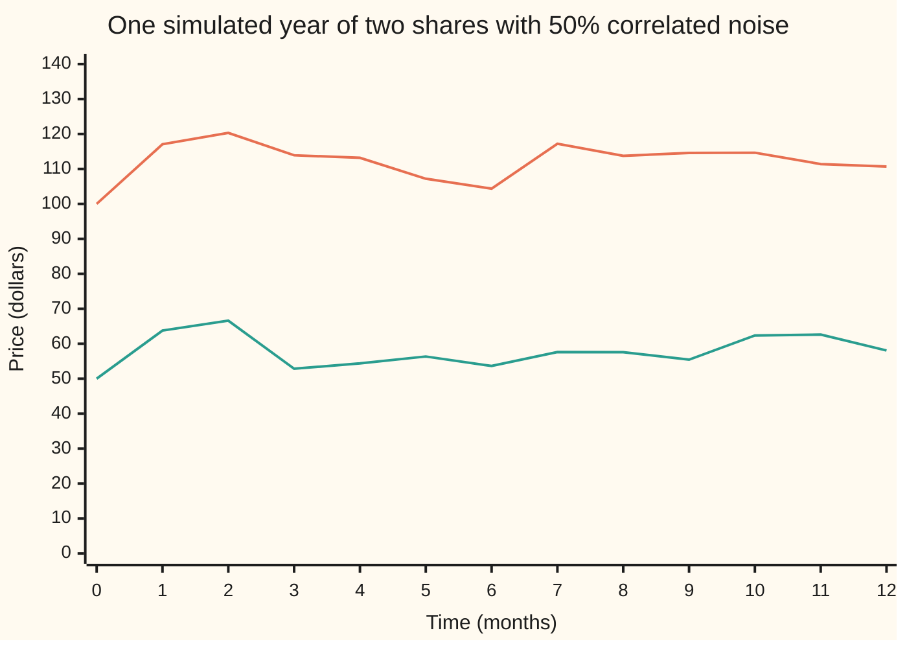
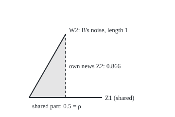
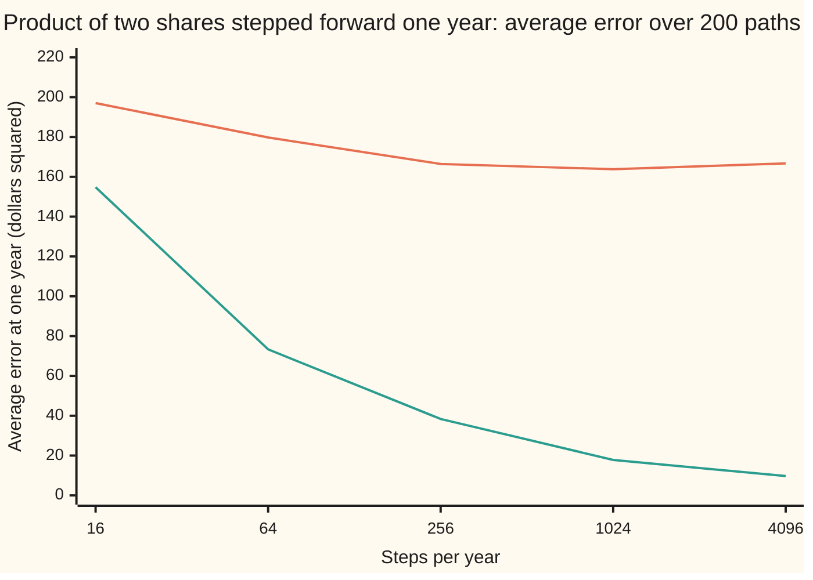

# Several Brownian motions: correlated noise and the multidimensional Ito formula

[Syllabus](../../../SYLLABUS.md) → [Stochastic processes and calculus](../../../SYLLABUS.md#w11) → [Ito Calculus](../../../SYLLABUS.md#w11-s06) → Several Brownian motions

---

## General Overview

Two shares trade on the same exchange. Share A costs \$100, grows on average 8% a year and has a volatility, the size of its yearly wobble, of 20%. Share B costs \$50, grows 5% a year and wobbles 30%. Time is in years. Some news that moves A also moves B: an interest-rate surprise, a bad day for the whole market. Over any short stretch of time, the random parts of their moves have a correlation of 0.5, or 50%.

Two questions follow. How is such a pair simulated, when a computer only makes independent draws? Share B's noise is built as half the shared news plus 0.866 of news of its own: the Cholesky recipe of [Multivariate normal](../../09-Probability%20and%20statistics/05-Transformations%20and%20Joint%20Laws/06-multivariate-normal.md), applied to whole paths. And how does a quantity built from both prices move? The example is their product, which is not a curiosity: a foreign share's dollar price is its euro price times the exchange rate.

Ito's lemma for one noise adds a term for the squared wobble. With two noises it also adds a cross term: the two wobbles multiplied, which add up to the correlation times the elapsed time. So the product of the two prices grows on average 16% a year, not the 13% the two growth rates add to. The extra 3 points are the correlation, 0.5, times the volatilities, 0.20 and 0.30.

**Correlated Brownian motions are independent ones mixed by a triangular table of weights, and a smooth function of several Ito processes changes by its ordinary first-order terms plus half of each second slope times the matching product of noises, where two different noises multiply to their correlation per unit of time.**

**What kind of fact this is:** two theorems. The Cholesky construction and the rule that two correlated noises multiply to their correlation per unit of time are proved in full on this card. The multidimensional Ito formula is given with its key steps, and its complete proof is cited. The two share prices are a model.

### The picture: one year of the two shares, read monthly



Upper line: share A. Lower line: share B. One sample path, read monthly from each price's exact solution, seed 20260930; another seed draws a different year. Both rise in the first two months and fall in the third: shared news. In month 10 A barely moves while B jumps from \$55.43 to \$62.36: B's own news.

---

## The formula

Notation first. Brownian motion $W_t$ is the random walk seen from far away, with time $t$ in years ([Brownian motion](../05-Brownian%20Motion/01-brownian-motion.md)). Its step $dW_t$ is shorthand for an Ito integral, never a derivative: the path has no slope ([The Ito integral](01-ito-integral.md)). The covariation $[X,Y]_t$ is the limit of the summed products of matching small steps of two processes ([Ito's product rule](03-ito-product-rule.md)). New here: several Brownian motions, labelled by a raised number, $W^1_t$ and $W^2_t$. The raised numbers are labels, not powers; a square is written with brackets, $(dW^1_t)^2$.

**Correlated Brownian motions, built by Cholesky.** Start from two independent Brownian motions $Z^1_t$ and $Z^2_t$. Set

$$W^1_t = Z^1_t, \qquad W^2_t = \rho\,Z^1_t + \sqrt{1-\rho^2}\;Z^2_t.$$

Both are Brownian motions, with covariation $[W^1, W^2]_t = \rho\,t$. The weights are the rows of the Cholesky factor $L$ of the covariance table $\Sigma$, which has 1 on its diagonal and $\rho$ off it. In the shorthand of [Ito's lemma](02-itos-lemma.md) the multiplication table gains one entry:

$$dW^1_t\,dW^2_t = \rho\,dt, \qquad (dW^i_t)^2 = dt, \qquad dt\,dW^i_t = 0, \qquad (dt)^2 = 0.$$

**The multidimensional Ito formula.** Let each of $d$ processes move by its own drift and its own noise, $dX^i_t = \mu_i\,dt + \sigma_i\,dW^i_t$, for $i$ from 1 to $d$. The drift $\mu_i$ and noise size $\sigma_i$ may be numbers or may depend on time and the path so far. The noises have correlations $\rho_{ij}$ (with $\rho_{ii} = 1$). Take a smooth function $f(t, x_1, \dots, x_d)$, with $f_t$ its slope in time, $f_i$ its slope in $x_i$, and $f_{ij}$ its second slope, in $x_i$ then $x_j$. Then

$$df = f_t\,dt + \sum_{i} f_i\,dX^i_t + \frac12 \sum_{i}\sum_{j} f_{ij}\,\sigma_i\sigma_j\rho_{ij}\,dt.$$

**Read it aloud:** the function changes by its time slope, plus each slope times that process's change, plus half of every second slope times the matching pair of noise sizes and their correlation.

**The product of the two shares.** With $P_t = A_t B_t$, the formula gives

$$\frac{dP_t}{P_t} = (\mu_1 + \mu_2 + \rho\,\sigma_1\sigma_2)\,dt + \sigma_1\,dW^1_t + \sigma_2\,dW^2_t, \qquad E[P_T] = A_0 B_0\,e^{(\mu_1+\mu_2+\rho\sigma_1\sigma_2)T}.$$

The product's own volatility is $v = \sqrt{\sigma_1^2 + \sigma_2^2 + 2\rho\,\sigma_1\sigma_2}$. Strictly, a price times a price is in dollars squared; the card writes it with a dollar sign for short.

| Symbol | Plain meaning | In our example | Push it up and the answer… |
| --- | --- | --- | --- |
| $A_t$, $B_t$, $A_0$, $B_0$ | the two share prices at time $t$; today | \$100 and \$50 today | the product scales with each |
| $\mu_1$, $\mu_2$, $\mu_i$ | drifts: average growth rate per year | 0.08 and 0.05 | the product's drift rises one for one |
| $\sigma_1$, $\sigma_2$, $\sigma_i$ | volatilities: size of each yearly wobble | 0.20 and 0.30 | the cross term grows as $\rho$ times their product |
| $\rho$, $\rho_{ij}$, $\Sigma$, $L$ | correlation of the noises; of noises i and j; covariance table per year; its lower-triangular Cholesky factor, $L L^{\top} = \Sigma$ | $\rho$ = 0.5; $L$ has rows `(1, 0)` and `(0.5, 0.866025)` | more shared news; the product drifts faster |
| $W_t$, $dW_t$, $W^1_t$, $W^2_t$, $dW^1_t$, $dW^2_t$, $W^i_t$ | Brownian motions driving A and B, and their small steps | each starts at 0 | — |
| $Z^1_t$, $Z^2_t$, $U$, $V$, $UV$, $c$ | independent Brownian motions: shared news, B's own news; in the proof, one slice's two independent bell-curve draws, their product, and the weight $\sqrt{1-\rho^2}$ | $c$ = 0.866025 | — |
| $[X,Y]_t$, $[W^1, W^2]_t$ | covariation: running total of products of matching small steps | $[W^1, W^2]_1$ = 0.5 | — |
| $P_t$, $R_t$, $v$, $A_1$, $B_1$ | the product $A_t B_t$; the ratio $A_t / B_t$; the product's volatility; prices at one year | \$5,000 and 2 today; $v$ = 0.435890 | — |
| $X^i_t$, $X_t$, $Y_t$, $d$, $i$, $j$ | general Ito processes; how many there are; labels running from 1 to $d$ | $X^1 = A$, $X^2 = B$, $d$ = 2 | — |
| $f$, $f_t$, $f_i$, $f_{ij}$, $f_{12}$, $f_{21}$, $x_i$, $x_j$, $e$ | a smooth function; its time slope; its slope in $x_i$; its second slope in $x_i$ then $x_j$; the base of natural logs | for $x_1 x_2$: $f_{12}$ = 1 | bigger second slopes, bigger correction |
| $t$, $s$, $T$, $dt$, $n$, $k$, $\Delta t$, $\Delta W^i_k$, $\Delta X^i$, $\Delta f$ | time; an earlier start time; the horizon; a short slice; grid steps; which step; one step's length; step k of noise i; one slice's change in process i and in $f$ | $T$ = 1 year | — |
| $N(x)$ | bell-curve area to the left of $x$ | $N(-0.149120)$ = 0.440729 | — |

### When it holds

- **The correlation lies between $-1$ and 1; in more dimensions $\Sigma$ is positive definite** (every mix of the noises has positive variance). At $\rho$ = 1.2 the Cholesky entry is the square root of a negative number, and the construction stops.
- **The coefficients use only the past and are integrable,** as on [Ito's lemma](02-itos-lemma.md). A coefficient that peeks ahead breaks the left-end sums.
- **$f$ has continuous second slopes, mixed ones included.** At a kink the formula needs an extra term, as in one dimension.
- **The paths are continuous.** Jumps add their products to every covariation: [Jump diffusions](../09-Beyond%20Brownian/02-jump-diffusions.md).
- **$\rho$ is the correlation of the noises over short steps, not of yearly prices.** Using a yearly price correlation in its place mixes up two numbers that differ: here the yearly prices $A_1$ and $B_1$ have correlation 0.491245 against $\rho$ = 0.5, and the gap grows with the volatilities and the horizon.

---

## Why it works

### Step 0: shared news plus own news

Split share B's noise into two independent parts: the news A hears, and news only B hears. Give the shared news one weight and the own news a weight $c$. B's covariance with A's noise is then the shared weight per year, since the own news is independent of A, and its variance is the shared weight squared plus $c^2$. Covariance 0.5 fixes the shared weight at $\rho$ = 0.5, and variance 1 fixes $c = \sqrt{1 - 0.25}$ = 0.866025.

### Step 1: the mix is a Brownian motion with the right correlation

Take $W^2_t = \rho Z^1_t + \sqrt{1-\rho^2}\,Z^2_t$. It starts at 0, and its paths are continuous because both parts are. Its step over any stretch is a fixed mix of two independent bell-curve steps, so it is bell-shaped and independent of earlier steps (mixing bell curves keeps them bell-shaped: [Multivariate normal](../../09-Probability%20and%20statistics/05-Transformations%20and%20Joint%20Laws/06-multivariate-normal.md)). Its variance over a time $t$ is $\rho^2 t + (1-\rho^2)t = t$. Those are the defining properties of Brownian motion. And

$$\operatorname{Cov}(W^1_t, W^2_t) = \operatorname{Cov}(Z^1_t,\;\rho Z^1_t + \sqrt{1-\rho^2}\,Z^2_t) = \rho\,t,$$

because $Z^2$ is independent of $Z^1$. Over a year both have variance 1, so the correlation is $\rho$.

In $d$ dimensions the recipe is the same. Row i of $L$ mixes the first i independent noises, so each new share brings one new source of news, and $L L^{\top} = \Sigma$ makes every pair's covariance right.

### The picture: the mix, drawn to scale

<p align="center"></p>

Scale: 150 drawing units per unit of noise. B's arrow ends at (135, 70.10): 0.5 along the shared news, 0.866025 across it. Independent sources sit at right angles, so the squares add, 0.25 + 0.75 = 1, and B's noise stays a standard Brownian motion. The correlation is the cosine of the angle between the arrows.

### Step 2: two correlated noises multiply to their correlation per unit of time

Cut a year into $n$ steps of length $\Delta t$, and write $\Delta W^1_k$ and $\Delta W^2_k$ for the two steps over slice k. Each product $\Delta W^1_k \Delta W^2_k$ has average $\rho\,\Delta t$ and variance $(1+\rho^2)\,\Delta t^2$, independently across slices. So the sum has average $\rho T$ and variance $(1+\rho^2)\,T\,\Delta t$, which shrinks to zero as the grid gets finer:

$$[W^1, W^2]_T = \lim \sum_k \Delta W^1_k\,\Delta W^2_k = \rho\,T.$$

That is the new table entry, $dW^1\,dW^2 = \rho\,dt$. At $\rho = 0$ independent noises do not interact at second order; at $\rho = 1$ they are one noise and the entry is $(dW)^2 = dt$. On one fine path (Road C) the sum is 0.682714 at 16 steps and 0.531024 at 4,096, each within two predicted spreads (0.279508 and 0.017469) of 0.5.

<details>
<summary>Detailed proof</summary>

Write a single slice's steps through the construction: $\Delta W^1 = \sqrt{\Delta t}\,U$ and $\Delta W^2 = \sqrt{\Delta t}\,(\rho U + c V)$, with $c = \sqrt{1-\rho^2}$ and $U$, $V$ independent standard bell-curve draws. Then
$$\Delta W^1 \Delta W^2 = \Delta t\,(\rho U^2 + c\,U V).$$
The average of $U^2$ is 1 and of $UV$ is 0, so the average of the product is $\rho\,\Delta t$.
For the variance, square: $(\rho U^2 + cUV)^2 = \rho^2 U^4 + 2\rho c\,U^3 V + c^2 U^2 V^2$. A standard bell curve has fourth moment 3, so the averages are $3\rho^2$, 0 and $c^2$. The average square is $\Delta t^2(3\rho^2 + 1 - \rho^2) = \Delta t^2(1 + 2\rho^2)$. Subtracting the squared average $\rho^2\Delta t^2$ leaves the variance $(1+\rho^2)\,\Delta t^2$.
Brownian steps over different slices are independent, so the variances add: the sum over $n$ slices has average $n\rho\Delta t = \rho T$ and variance $n(1+\rho^2)\Delta t^2 = (1+\rho^2)\,T\,\Delta t$. As $\Delta t \to 0$ the sum converges to $\rho T$ in mean square, and so in probability (Chebyshev's inequality). The same argument from any start time s gives $\rho\,(t - s)$ over a stretch from s to t, which is the statement $[W^1, W^2]_t = \rho t$. The proof is complete.

</details>

### Step 3: Taylor in several variables, and which terms survive

Over one slice, a smooth function of two processes changes, to second order, by

$$\Delta f \approx f_t\,\Delta t + f_1\,\Delta X^1 + f_2\,\Delta X^2 + \tfrac12 f_{11}(\Delta X^1)^2 + f_{12}\,\Delta X^1\Delta X^2 + \tfrac12 f_{22}(\Delta X^2)^2.$$

In school calculus the last three terms vanish in the limit. Here each step $\Delta X^i$ is about $\sigma_i \Delta W^i$, of size the square root of $\Delta t$, so a product of two steps has size $\Delta t$, like the drift, and survives. Summed over slices, $(\Delta X^i)^2$ adds up to $\sigma_i^2\,dt$ by quadratic variation ([Quadratic variation](../05-Brownian%20Motion/03-quadratic-variation.md)). The cross product $\Delta X^1 \Delta X^2$ adds up to $\sigma_1\sigma_2\rho\,dt$, by Step 2. In the formula's double sum the mixed slope appears twice, as $f_{12}$ and $f_{21}$, each with a half; together they make the single $f_{12}$ above. Smaller pieces add up to nothing, and the first-order sums, slopes taken at each slice's start, become Ito integrals.

<details>
<summary>Detailed proof: what is shown here, and what is cited</summary>

**Shown.** Take $f$ with bounded, continuous first and second slopes, and constant $\mu_i$, $\sigma_i$. On a grid, write the total change of $f$ as the sum of its changes over the slices, and expand each by Taylor's theorem with remainder. The first-order sums $\sum_k f_i(t_k, X_{t_k})\,\Delta X^i_k$ are left-end sums and converge to the Ito integrals $\int f_i\,dX^i$, by the construction on [The Ito integral](01-ito-integral.md). For each second-order sum, compare $\sum_k f_{ij}(t_k, X_{t_k})\,\Delta X^i_k\Delta X^j_k$ with $\sum_k f_{ij}(t_k, X_{t_k})\,\sigma_i\sigma_j\rho_{ij}\,\Delta t$. Slice by slice, their difference has an average given the past of order $\Delta t^2$ (from the drift) and a variance of order $\Delta t^2$ (the moment calculation of Step 2), and its centred parts are uncorrelated across slices. Summed over $n$ slices, bias and variance are both of order $\Delta t$ and vanish. The second sum is a Riemann sum and converges to $\int f_{ij}\sigma_i\sigma_j\rho_{ij}\,dt$. Each Taylor remainder is at most the squared step times the largest change of a second slope within the slice; the squared steps add to a finite total, and that largest change shrinks to zero because the second slopes are continuous on the bounded region the path visits. So the remainders sum to zero in probability.
**Cited.** The general case, with coefficients that depend on time and the path and with unbounded $f$, needs localisation: stopping the processes before they leave a bounded region. It is in Øksendal, Chapter 4, and Karatzas and Shreve, Section 3.3 (Sources); this card does not repeat it.

</details>

### Step 4: the product of the two prices

Take $f(x_1, x_2) = x_1 x_2$, with $X^1 = A$ and $X^2 = B$. Its slopes: $f_1 = x_2$, $f_2 = x_1$, $f_{11} = f_{22} = 0$, and $f_{12} = f_{21} = 1$. The noise sizes are $\sigma_1 A_t$ and $\sigma_2 B_t$. The formula gives

$$dP_t = B_t\,dA_t + A_t\,dB_t + \rho\,\sigma_1\sigma_2\,A_t B_t\,dt.$$

This is the product rule of [Ito's product rule](03-ito-product-rule.md), its covariation term now carrying the correlation. Divide by $P_t$ and substitute $dA_t/A_t = \mu_1 dt + \sigma_1 dW^1_t$, and the same for B: the drift is $\mu_1 + \mu_2 + \rho\sigma_1\sigma_2$. The noise $\sigma_1 dW^1_t + \sigma_2 dW^2_t$ has variance per unit of time $\sigma_1^2 + \sigma_2^2 + 2\rho\sigma_1\sigma_2$ by the table, which gives $v$. With a constant relative drift the average grows as e to the drift times the time, which gives $E[P_T]$.

### Step 5: the ratio, a second use

Take $f(x_1, x_2) = x_1 / x_2$, the price of A measured in shares of B. Its slopes: $f_1 = 1/x_2$, $f_2 = -x_1/x_2^2$, $f_{11} = 0$, $f_{12} = -1/x_2^2$, $f_{22} = 2x_1/x_2^3$. Putting them in and dividing by $R_t = A_t/B_t$:

$$\frac{dR_t}{R_t} = (\mu_1 - \mu_2 + \sigma_2^2 - \rho\,\sigma_1\sigma_2)\,dt + \sigma_1\,dW^1_t - \sigma_2\,dW^2_t.$$

Correlation now lowers the drift: 0.08 − 0.05 + 0.09 − 0.03 = 0.09, so $E[R_1] = 2e^{0.09}$ = 2.188349. The $\sigma_2^2$ term comes from dividing by a noisy price, and is why an asset measured in units of another changes drift: the step behind [Spread options](../../12-Financial%20mathematics/26-Options%20on%20commodity%20futures%20and%20spreads/04-margrabe-and-kirk-spread-options.md).

### The other route

Each price solves its own equation by one-dimensional Ito, $A_T = A_0 e^{(\mu_1 - \sigma_1^2/2)T + \sigma_1 W^1_T}$ and the same for B ([Geometric Brownian motion](../05-Brownian%20Motion/07-geometric-brownian-motion.md)). Their product's exponent is bell-shaped with variance $(\sigma_1^2 + \sigma_2^2 + 2\rho\sigma_1\sigma_2)T$. The average of $e$ to a bell-curve quantity is $e$ to its mean plus half its variance, which leaves exactly $\rho\sigma_1\sigma_2$ in the exponent. Road B of the code integrates $A_T B_T$ against the joint bell-curve density, with neither Cholesky nor Ito, and lands on the same 5,867.554355.

---

## Worked numbers, by hand

Share A at \$100, $\mu_1$ = 0.08, $\sigma_1$ = 0.20; share B at \$50, $\mu_2$ = 0.05, $\sigma_2$ = 0.30; $\rho$ = 0.5; one year.

| Step | Arithmetic | Value |
| --- | --- | --- |
| Cholesky entries | $\rho$; $\sqrt{1 - 0.25}$ | 0.5; 0.866025 |
| cross term | $\rho\sigma_1\sigma_2 = 0.5 \times 0.20 \times 0.30$ | 0.03 |
| drift of the product | $\mu_1 + \mu_2 + 0.03 = 0.13 + 0.03$ | 0.16 |
| average product after one year | $5{,}000 \times e^{0.16}$ | **\$5,867.55** |
| same, cross term dropped | $5{,}000 \times e^{0.13}$ | \$5,694.14 |
| the difference | covariance of $A_1$ and $B_1$ | \$173.41 |
| product's variance per year | $0.04 + 0.09 + 2 \times 0.03$ | 0.19 |
| product's volatility | $\sqrt{0.19}$ | 0.435890 |
| log drift | $0.16 - 0.19/2$ | 0.065 |
| middle outcome | $5{,}000 \times e^{0.065}$ | \$5,335.80 |
| chance the product ends below \$5,000 | $N(-0.065 / 0.435890) = N(-0.149120)$ | 0.440729 |

The average product grows to \$5,867.55, of which \$173.41 is the correlation's doing: the shares tend to be high together. Yet the product ends below where it started about 44% of the time; a few large outcomes pull the average up, and the middle outcome, \$5,335.80, sits well below it.

### What breaks if you drop a piece

| Mistake | Comes out at | What went wrong |
| --- | --- | --- |
| The ordinary product rule, no cross term | average product 5,694.14; true 5,867.55, simulated 5,892.36 (se 19.32) | treated the noises as independent: $E[AB] = E[A]E[B]$ only when $\rho = 0$ |
| The ordinary rule for $W^1_t W^2_t$ | average 0 at one year; true 0.5, simulated 0.510292 (se 0.008067) | the dropped entry $dW^1 dW^2 = \rho\,dt$ |
| Mixing with weights $\rho$ and $1 - \rho$ | B's noise has variance 0.5 (simulated 0.506811, se 0.005125) and correlation 0.707107 with A | the weights' squares must add to 1; $0.25 + 0.25$ does not |
| Euler steps of the product without the cross term | average error 166.72 at 4,096 steps a year, not shrinking; predicted 173.41 | the missing drift, 0.03 a year, compounds whatever the step size |

The third row fails quietly: its covariance with A is still right, 0.506063 simulated against 0.5, so a covariance check alone passes. Every number in this table is printed by both checks below.

---

## Code, from first principles, and it actually runs

Five roads. Road A evaluates the formulas. Road B integrates against the joint bell-curve density on 400 by 400 cells, with no Cholesky and no Ito. Road C sums products of matching steps on one path of 4,096 steps a year, at five grid sizes, beside the predicted spread. Road D simulates 20,000 Cholesky-built pairs of paths, monthly, every average with its standard error. Road E steps the product's equation forward, Euler style, on 200 paths at five step sizes, with and without the cross term. Draws come from SplitMix64, seed 20260930, with Box-Muller normals, both written out, so the two programs print the same digits.

### Python

```python
# Several Brownian motions -- the check behind the card.  Only math is imported.
# Share A: $100, drift 0.08, vol 0.20.  Share B: $50, drift 0.05, vol 0.30.
# Noise correlation RHO = 0.5; time in years.  Cholesky: W2 = RHO Z1 + sqrt(1 - RHO^2) Z2.
# Roads: (A) formulas; (B) an integral against the joint bell curve, no Ito;
# (C) one fine path; (D) 20000 simulated paths; (E) Euler steps of the product.
# Floats are added in plain loops, in the same order as the Rust twin.
import math

A0, MU1, S1, B0, MU2, S2, RHO, T, SEED = 100.0, 0.08, 0.20, 50.0, 0.05, 0.30, 0.5, 1.0, 20260930
MASK = (1 << 64) - 1
state = SEED
C22 = math.sqrt(1.0 - RHO * RHO)               # Cholesky factor: rows (1, 0), (RHO, C22)

def uniform():                                 # SplitMix64, top 53 bits
    global state
    state = (state + 0x9E3779B97F4A7C15) & MASK
    z = state
    z = ((z ^ (z >> 30)) * 0xBF58476D1CE4E5B9) & MASK
    z = ((z ^ (z >> 27)) * 0x94D049BB133111EB) & MASK
    return ((z ^ (z >> 31)) >> 11) / 9007199254740992.0

def normal():                                  # Box-Muller, cosine half only
    u1 = 1.0 - uniform()
    u2 = uniform()
    return math.sqrt(-2.0 * math.log(u1)) * math.cos(2.0 * math.pi * u2)

def prices(t, w1, w2):                         # each share's exact solution (one-dimensional Ito)
    return (A0 * math.exp((MU1 - 0.5 * S1 * S1) * t + S1 * w1),
            B0 * math.exp((MU2 - 0.5 * S2 * S2) * t + S2 * w2))

def mean_se(xs):
    m = 0.0
    for x in xs: m += x
    m /= len(xs)
    v = 0.0
    for x in xs: v += (x - m) * (x - m)
    return m, math.sqrt(v / (len(xs) - 1) / len(xs))

def ncdf(x):                                   # bell-curve area left of x: Simpson from 0 to x
    n, h, s = 2000, x / 2000, 0.0
    for k in range(n + 1):
        s += (1 if k in (0, n) else (4 if k % 2 else 2)) * math.exp(-0.5 * (k * h) * (k * h))
    return 0.5 + s * h / 3.0 / math.sqrt(2.0 * math.pi)

def row(label, v): print(f"{label:<44}{v:>12.6f}")
def row_se(label, m, se): print(f"{label:<44}{m:>12.6f}  se {se:.6f}")

print("A  formulas")
g = MU1 + MU2 + RHO * S1 * S2                  # drift of the product, cross term included
vp = math.sqrt(S1 * S1 + S2 * S2 + 2.0 * RHO * S1 * S2)
ep, ep_ind = A0 * B0 * math.exp(g * T), A0 * B0 * math.exp((MU1 + MU2) * T)
er = A0 / B0 * math.exp((MU1 - MU2 + S2 * S2 - RHO * S1 * S2) * T)   # the ratio A / B
pbelow = ncdf(-(g - 0.5 * vp * vp) * math.sqrt(T) / vp)
row("Cholesky entry under the diagonal", RHO); row("Cholesky diagonal entry sqrt(1 - rho^2)", C22)
row("drift of P = AB, with cross term", g); row("volatility of P", vp)
row("E[P_1], multidimensional Ito", ep); row("E[P_1], cross term dropped = E[A_1]E[B_1]", ep_ind)
row("Cov(A_1, B_1) = difference", ep - ep_ind); row("median P_1", A0 * B0 * math.exp((g - 0.5 * vp * vp) * T))
row("P(P_1 < 5000)", pbelow); row("E[A_1 / B_1], ratio drift 0.09", er)
row("E[W1_1 W2_1]: Ito rho T; ordinary rule 0", RHO * T); row("yearly price correlation Corr(A_1, B_1)", (math.exp(RHO * S1 * S2 * T) - 1) / math.sqrt((math.exp(S1 * S1 * T) - 1) * (math.exp(S2 * S2 * T) - 1)))
vw = RHO * RHO + (1 - RHO) * (1 - RHO)         # wrong mix: weights RHO and 1 - RHO
row("wrong mix rho, 1 - rho: variance of W2", vw); row("wrong mix: correlation it delivers", RHO / math.sqrt(vw))
print(f"hand: rho s1 s2 {RHO * S1 * S2:.4f}, mu1 + mu2 {MU1 + MU2:.4f}, var of P {vp * vp:.4f}, "
      f"log drift {g - 0.5 * vp * vp:.4f}, z {-(g - 0.5 * vp * vp) / vp:.6f}; try rho -0.5: {A0 * B0 * math.exp((MU1 + MU2 - 0.5 * S1 * S2) * T):.4f}")
print(f"figure, origin 60 200, Z1 tip 210 200, W2 tip {60 + 150 * RHO:.2f} {200 - 150 * C22:.2f}")

h, qp, qr, qxy, dn = 0.04, 0.0, 0.0, 0.0, 2.0 * math.pi * C22   # B: midpoint rule on [-8, 8]^2
for i in range(400):
    x = -8.0 + (i + 0.5) * h
    for j in range(400):
        y = -8.0 + (j + 0.5) * h
        wt = math.exp(-(x * x - 2.0 * RHO * x * y + y * y) / (2.0 * C22 * C22)) / dn * h * h
        a, b = prices(T, math.sqrt(T) * x, math.sqrt(T) * y)
        qp += a * b * wt; qr += a / b * wt; qxy += x * y * wt
print("B  integral against the joint bell curve, 400 x 400 cells")
row("E[P_1]", qp); row("E[A_1 / B_1]", qr); row("E[W1_1 W2_1]", qxy)

NF, dt, f1, f2, fw, cr = 4096, T / 4096, [], [], [], []   # fine steps of W1, W2, the wrong mix
for k in range(NF):
    z1, z2 = normal(), normal()
    f1.append(math.sqrt(dt) * z1); f2.append(math.sqrt(dt) * (RHO * z1 + C22 * z2))
    fw.append(math.sqrt(dt) * (RHO * z1 + (1 - RHO) * z2))
print("C  one path: steps, sum dW1 dW2, its predicted sd, sum (dW2 wrong mix)^2")
for n in (16, 64, 256, 1024, 4096):
    m, c, q = NF // n, 0.0, 0.0
    for k in range(n):
        d1, d2, dw = 0.0, 0.0, 0.0
        for j in range(k * m, (k + 1) * m): d1 += f1[j]; d2 += f2[j]; dw += fw[j]
        c += d1 * d2; q += dw * dw
    cr.append((c, q))
    print(f"   n {n:>5}   {c:>9.6f}   {math.sqrt((1 + RHO * RHO) * T / n):.6f}   {q:.6f}")

NP = 20000
pv, rv, xy, bl, w1s, wws, path = [], [], [], [], [], [], []
for i in range(NP):
    w1, w2, ww = 0.0, 0.0, 0.0
    for j in range(12):                        # monthly steps
        z1, z2 = normal(), normal()
        w1 += math.sqrt(T / 12) * z1; w2 += math.sqrt(T / 12) * (RHO * z1 + C22 * z2)
        ww += math.sqrt(T / 12) * (RHO * z1 + (1 - RHO) * z2)
        if i == 0: path.append(prices((j + 1) * T / 12, w1, w2))
    a, b = prices(T, w1, w2)
    pv.append(a * b); rv.append(a / b); xy.append(w1 * w2); bl.append(1.0 if a * b < A0 * B0 else 0.0)
    w1s.append(w1); wws.append(ww)
mp, mr, mxy, mbl = mean_se(pv), mean_se(rv), mean_se(xy), mean_se(bl)
mww = mean_se([x * x for x in wws]); mwx = mean_se([w1s[i] * wws[i] for i in range(NP)])
print("D  20000 paths, monthly steps")
row_se("E[P_1]", *mp); row_se("E[A_1 / B_1]", *mr); row_se("E[W1_1 W2_1]", *mxy)
row_se("P(P_1 < 5000)", *mbl)
row_se("wrong mix: E[W2_1^2]", *mww); row_se("wrong mix: E[W1_1 W2_1]", *mwx)
print("chart, path A " + " ".join(f"{v:.2f}" for v in [A0] + [p[0] for p in path]))
print("chart, path B " + " ".join(f"{v:.2f}" for v in [B0] + [p[1] for p in path]))

ns, ew, eo = (16, 64, 256, 1024, 4096), [0.0] * 5, [0.0] * 5
for i in range(200):
    g1, g2 = [0.0], [0.0]
    for k in range(NF):
        z1, z2 = normal(), normal()
        g1.append(g1[k] + math.sqrt(dt) * z1); g2.append(g2[k] + math.sqrt(dt) * (RHO * z1 + C22 * z2))
    a, b = prices(T, g1[NF], g2[NF])
    for s, n in enumerate(ns):
        m, pw, po = NF // n, A0 * B0, A0 * B0
        for k in range(n):
            d1, d2 = g1[(k + 1) * m] - g1[k * m], g2[(k + 1) * m] - g2[k * m]
            pw += pw * (g * T / n + S1 * d1 + S2 * d2)
            po += po * ((MU1 + MU2) * T / n + S1 * d1 + S2 * d2)
        ew[s] += abs(pw - a * b) / 200.0; eo[s] += abs(po - a * b) / 200.0
print("E  200 paths: mean |error| of Euler P_1; steps, with cross term, without")
for s, n in enumerate(ns): print(f"   n {n:>5}   {ew[s]:9.2f}   {eo[s]:9.2f}")

assert abs(qp - ep) < 1e-6 * ep and abs(qr - er) < 1e-6 * er, "integral agrees with Ito's drifts"
assert abs(qxy - RHO * T) < 1e-6, "joint bell curve has covariance rho T"
assert abs(mp[0] - ep) < 4 * mp[1], "simulated E[P_1] matches the cross-term formula"
assert abs(mp[0] - ep_ind) > 4 * mp[1], "and rules out the formula without it"
assert abs(mr[0] - er) < 4 * mr[1], "ratio drift includes s2^2 - rho s1 s2"
assert abs(mxy[0] - RHO * T) < 4 * mxy[1], "E[W1 W2] = rho T, not 0"
assert abs(mbl[0] - pbelow) < 4 * mbl[1], "chance of ending below 5000"
assert abs(cr[4][0] - RHO * T) < 4 * math.sqrt((1 + RHO * RHO) * T / NF), "cross sum tends to rho T"
assert abs(mww[0] - 0.5) < 4 * mww[1], "wrong mix: W2 has variance 0.5, not 1"
assert ew[4] < ew[0] / 4 and abs(eo[4] - (ep - ep_ind)) < 0.1 * (ep - ep_ind), "Euler needs the cross term"
print("ALL CHECKS PASS")
```

**Ran 2026-10-07 on macOS, Python 3.14.6, standard library only. All checks passed. Output, pasted from the run:**

```
A  formulas
Cholesky entry under the diagonal               0.500000
Cholesky diagonal entry sqrt(1 - rho^2)         0.866025
drift of P = AB, with cross term                0.160000
volatility of P                                 0.435890
E[P_1], multidimensional Ito                 5867.554355
E[P_1], cross term dropped = E[A_1]E[B_1]    5694.141917
Cov(A_1, B_1) = difference                    173.412438
median P_1                                   5335.795122
P(P_1 < 5000)                                   0.440729
E[A_1 / B_1], ratio drift 0.09                  2.188349
E[W1_1 W2_1]: Ito rho T; ordinary rule 0        0.500000
yearly price correlation Corr(A_1, B_1)         0.491245
wrong mix rho, 1 - rho: variance of W2          0.500000
wrong mix: correlation it delivers              0.707107
hand: rho s1 s2 0.0300, mu1 + mu2 0.1300, var of P 0.1900, log drift 0.0650, z -0.149120; try rho -0.5: 5525.8546
figure, origin 60 200, Z1 tip 210 200, W2 tip 135.00 70.10
B  integral against the joint bell curve, 400 x 400 cells
E[P_1]                                       5867.554355
E[A_1 / B_1]                                    2.188349
E[W1_1 W2_1]                                    0.500000
C  one path: steps, sum dW1 dW2, its predicted sd, sum (dW2 wrong mix)^2
   n    16    0.682714   0.279508   0.764973
   n    64    0.394019   0.139754   0.472354
   n   256    0.470381   0.069877   0.496196
   n  1024    0.473465   0.034939   0.489246
   n  4096    0.531024   0.017469   0.521854
D  20000 paths, monthly steps
E[P_1]                                       5892.363424  se 19.322495
E[A_1 / B_1]                                    2.185450  se 0.004155
E[W1_1 W2_1]                                    0.510292  se 0.008067
P(P_1 < 5000)                                   0.437050  se 0.003507
wrong mix: E[W2_1^2]                            0.506811  se 0.005125
wrong mix: E[W1_1 W2_1]                         0.506063  se 0.006245
chart, path A 100.00 117.06 120.30 113.91 113.18 107.20 104.37 117.20 113.74 114.58 114.65 111.39 110.70
chart, path B 50.00 63.76 66.60 52.85 54.38 56.35 53.63 57.62 57.57 55.43 62.36 62.61 58.05
E  200 paths: mean |error| of Euler P_1; steps, with cross term, without
   n    16      154.79      197.02
   n    64       73.36      179.77
   n   256       38.38      166.46
   n  1024       17.82      163.81
   n  4096        9.73      166.72
ALL CHECKS PASS
```

Road B matches Road A to every printed digit. Road C's cross sums close in on 0.5 as the predicted spread shrinks; the wrong mix's squared steps settle near 0.5, not 1. Road D agrees with the cross-term formula within two standard errors on every line, and sits ten standard errors above the formula without it. Road E: with the cross term the error halves each time the grid gets 4 times finer, from 154.79 to 9.73; without it the error stays between 163.81 and 197.02, near the 173.41 the missing drift should cost.

### Rust

Same roads, same draws, same plain additions, std only.

```rust
// Several Brownian motions -- the same check as multidimensional_ito_and_correlation_check.py.
// Standard library only, no crates.  Same generator, same seed, same order of draws,
// same plain left-to-right additions, so the output matches line for line.
// Compile: rustc --edition 2021 -O multidimensional_ito_and_correlation_check.rs -o /tmp/chk
use std::f64::consts::PI;

const A0: f64 = 100.0; const MU1: f64 = 0.08; const S1: f64 = 0.20;
const B0: f64 = 50.0; const MU2: f64 = 0.05; const S2: f64 = 0.30;
const RHO: f64 = 0.5; const T: f64 = 1.0;

struct Rng { s: u64 }
impl Rng {
    fn uniform(&mut self) -> f64 {                     // SplitMix64, top 53 bits
        self.s = self.s.wrapping_add(0x9E3779B97F4A7C15);
        let mut z = self.s;
        z = (z ^ (z >> 30)).wrapping_mul(0xBF58476D1CE4E5B9);
        z = (z ^ (z >> 27)).wrapping_mul(0x94D049BB133111EB);
        ((z ^ (z >> 31)) >> 11) as f64 / 9007199254740992.0
    }
    fn normal(&mut self) -> f64 {                      // Box-Muller, cosine half only
        let u1 = 1.0 - self.uniform();
        let u2 = self.uniform();
        (-2.0 * u1.ln()).sqrt() * (2.0 * PI * u2).cos()
    }
}

fn prices(t: f64, w1: f64, w2: f64) -> (f64, f64) {   // each share's exact solution
    (A0 * ((MU1 - 0.5 * S1 * S1) * t + S1 * w1).exp(), B0 * ((MU2 - 0.5 * S2 * S2) * t + S2 * w2).exp())
}

fn mean_se(xs: &[f64]) -> (f64, f64) {
    let mut m = 0.0;
    for x in xs { m += x; }
    m /= xs.len() as f64;
    let mut v = 0.0;
    for x in xs { v += (x - m) * (x - m); }
    (m, (v / (xs.len() - 1) as f64 / xs.len() as f64).sqrt())
}

fn ncdf(x: f64) -> f64 {                               // bell-curve area left of x: Simpson from 0 to x
    let (n, h) = (2000usize, x / 2000.0);
    let mut s = 0.0;
    for k in 0..=n {
        let wgt = if k == 0 || k == n { 1.0 } else if k % 2 == 1 { 4.0 } else { 2.0 };
        s += wgt * (-0.5 * (k as f64 * h) * (k as f64 * h)).exp();
    }
    0.5 + s * h / 3.0 / (2.0 * PI).sqrt()
}

fn row(label: &str, v: f64) { println!("{:<44}{:>12.6}", label, v); }
fn row_se(label: &str, m: (f64, f64)) { println!("{:<44}{:>12.6}  se {:.6}", label, m.0, m.1); }
fn join(v: &[f64]) -> String { v.iter().map(|x| format!("{:.2}", x)).collect::<Vec<_>>().join(" ") }

fn main() {
    let mut rng = Rng { s: 20260930 };
    let c22 = (1.0 - RHO * RHO).sqrt();                // Cholesky factor: rows (1, 0), (RHO, c22)
    println!("A  formulas");
    let g = MU1 + MU2 + RHO * S1 * S2;                 // drift of the product, cross term included
    let vp = (S1 * S1 + S2 * S2 + 2.0 * RHO * S1 * S2).sqrt();
    let (ep, ep_ind) = (A0 * B0 * (g * T).exp(), A0 * B0 * ((MU1 + MU2) * T).exp());
    let er = A0 / B0 * ((MU1 - MU2 + S2 * S2 - RHO * S1 * S2) * T).exp();
    let pbelow = ncdf(-(g - 0.5 * vp * vp) * T.sqrt() / vp);
    row("Cholesky entry under the diagonal", RHO); row("Cholesky diagonal entry sqrt(1 - rho^2)", c22);
    row("drift of P = AB, with cross term", g); row("volatility of P", vp);
    row("E[P_1], multidimensional Ito", ep); row("E[P_1], cross term dropped = E[A_1]E[B_1]", ep_ind);
    row("Cov(A_1, B_1) = difference", ep - ep_ind); row("median P_1", A0 * B0 * ((g - 0.5 * vp * vp) * T).exp());
    row("P(P_1 < 5000)", pbelow); row("E[A_1 / B_1], ratio drift 0.09", er);
    row("E[W1_1 W2_1]: Ito rho T; ordinary rule 0", RHO * T); row("yearly price correlation Corr(A_1, B_1)", ((RHO * S1 * S2 * T).exp() - 1.0) / (((S1 * S1 * T).exp() - 1.0) * ((S2 * S2 * T).exp() - 1.0)).sqrt());
    let vw = RHO * RHO + (1.0 - RHO) * (1.0 - RHO);    // wrong mix: weights RHO and 1 - RHO
    row("wrong mix rho, 1 - rho: variance of W2", vw); row("wrong mix: correlation it delivers", RHO / vw.sqrt());
    println!("hand: rho s1 s2 {:.4}, mu1 + mu2 {:.4}, var of P {:.4}, log drift {:.4}, z {:.6}; try rho -0.5: {:.4}", RHO * S1 * S2,
        MU1 + MU2, vp * vp, g - 0.5 * vp * vp, -(g - 0.5 * vp * vp) / vp, A0 * B0 * ((MU1 + MU2 - 0.5 * S1 * S2) * T).exp());
    println!("figure, origin 60 200, Z1 tip 210 200, W2 tip {:.2} {:.2}", 60.0 + 150.0 * RHO, 200.0 - 150.0 * c22);

    let (h, dn) = (0.04, 2.0 * PI * c22);              // B: midpoint rule on [-8, 8]^2
    let (mut qp, mut qr, mut qxy) = (0.0f64, 0.0f64, 0.0f64);
    for i in 0..400 {
        let x = -8.0 + (i as f64 + 0.5) * h;
        for j in 0..400 {
            let y = -8.0 + (j as f64 + 0.5) * h;
            let wt = (-(x * x - 2.0 * RHO * x * y + y * y) / (2.0 * c22 * c22)).exp() / dn * h * h;
            let (a, b) = prices(T, T.sqrt() * x, T.sqrt() * y);
            qp += a * b * wt; qr += a / b * wt; qxy += x * y * wt;
        }
    }
    println!("B  integral against the joint bell curve, 400 x 400 cells");
    row("E[P_1]", qp); row("E[A_1 / B_1]", qr); row("E[W1_1 W2_1]", qxy);

    const NF: usize = 4096;
    let dt = T / NF as f64;
    let (mut f1, mut f2, mut fw, mut cr) = (Vec::new(), Vec::new(), Vec::new(), Vec::new());
    for _ in 0..NF {
        let (z1, z2) = (rng.normal(), rng.normal());
        f1.push(dt.sqrt() * z1); f2.push(dt.sqrt() * (RHO * z1 + c22 * z2));
        fw.push(dt.sqrt() * (RHO * z1 + (1.0 - RHO) * z2));
    }
    println!("C  one path: steps, sum dW1 dW2, its predicted sd, sum (dW2 wrong mix)^2");
    for n in [16usize, 64, 256, 1024, 4096] {
        let (m, mut c, mut q) = (NF / n, 0.0f64, 0.0f64);
        for k in 0..n {
            let (mut d1, mut d2, mut dw) = (0.0f64, 0.0f64, 0.0f64);
            for j in k * m..(k + 1) * m { d1 += f1[j]; d2 += f2[j]; dw += fw[j]; }
            c += d1 * d2; q += dw * dw;
        }
        cr.push((c, q));
        println!("   n {:>5}   {:>9.6}   {:.6}   {:.6}", n, c, ((1.0 + RHO * RHO) * T / n as f64).sqrt(), q);
    }

    const NP: usize = 20000;
    let (mut pv, mut rv, mut xy, mut bl) = (Vec::new(), Vec::new(), Vec::new(), Vec::new());
    let (mut w1s, mut wws, mut path) = (Vec::new(), Vec::new(), Vec::new());
    for i in 0..NP {
        let (mut w1, mut w2, mut ww) = (0.0f64, 0.0f64, 0.0f64);
        for j in 0..12 {                               // monthly steps
            let (z1, z2) = (rng.normal(), rng.normal());
            w1 += (T / 12.0).sqrt() * z1; w2 += (T / 12.0).sqrt() * (RHO * z1 + c22 * z2);
            ww += (T / 12.0).sqrt() * (RHO * z1 + (1.0 - RHO) * z2);
            if i == 0 { path.push(prices((j + 1) as f64 * T / 12.0, w1, w2)); }
        }
        let (a, b) = prices(T, w1, w2);
        pv.push(a * b); rv.push(a / b); xy.push(w1 * w2); bl.push(if a * b < A0 * B0 { 1.0 } else { 0.0 });
        w1s.push(w1); wws.push(ww);
    }
    let (mp, mr, mxy, mbl) = (mean_se(&pv), mean_se(&rv), mean_se(&xy), mean_se(&bl));
    let mww = mean_se(&wws.iter().map(|x| x * x).collect::<Vec<f64>>());
    let mwx = mean_se(&(0..NP).map(|i| w1s[i] * wws[i]).collect::<Vec<f64>>());
    println!("D  20000 paths, monthly steps");
    row_se("E[P_1]", mp); row_se("E[A_1 / B_1]", mr); row_se("E[W1_1 W2_1]", mxy);
    row_se("P(P_1 < 5000)", mbl);
    row_se("wrong mix: E[W2_1^2]", mww); row_se("wrong mix: E[W1_1 W2_1]", mwx);
    let pa: Vec<f64> = std::iter::once(A0).chain(path.iter().map(|p| p.0)).collect();
    let pb: Vec<f64> = std::iter::once(B0).chain(path.iter().map(|p| p.1)).collect();
    println!("chart, path A {}", join(&pa));
    println!("chart, path B {}", join(&pb));

    let ns = [16usize, 64, 256, 1024, 4096];
    let (mut ew, mut eo) = ([0.0f64; 5], [0.0f64; 5]);
    for _ in 0..200 {
        let (mut g1, mut g2) = (vec![0.0f64], vec![0.0f64]);
        for k in 0..NF {
            let (z1, z2) = (rng.normal(), rng.normal());
            let (n1, n2) = (g1[k] + dt.sqrt() * z1, g2[k] + dt.sqrt() * (RHO * z1 + c22 * z2));
            g1.push(n1); g2.push(n2);
        }
        let (a, b) = prices(T, g1[NF], g2[NF]);
        for (s, &n) in ns.iter().enumerate() {
            let (m, mut pw, mut po) = (NF / n, A0 * B0, A0 * B0);
            for k in 0..n {
                let (d1, d2) = (g1[(k + 1) * m] - g1[k * m], g2[(k + 1) * m] - g2[k * m]);
                pw += pw * (g * T / n as f64 + S1 * d1 + S2 * d2);
                po += po * ((MU1 + MU2) * T / n as f64 + S1 * d1 + S2 * d2);
            }
            ew[s] += (pw - a * b).abs() / 200.0; eo[s] += (po - a * b).abs() / 200.0;
        }
    }
    println!("E  200 paths: mean |error| of Euler P_1; steps, with cross term, without");
    for (s, n) in ns.iter().enumerate() { println!("   n {:>5}   {:9.2}   {:9.2}", n, ew[s], eo[s]); }

    assert!((qp - ep).abs() < 1e-6 * ep && (qr - er).abs() < 1e-6 * er, "integral agrees with Ito's drifts");
    assert!((qxy - RHO * T).abs() < 1e-6, "joint bell curve has covariance rho T");
    assert!((mp.0 - ep).abs() < 4.0 * mp.1, "simulated E[P_1] matches the cross-term formula");
    assert!((mp.0 - ep_ind).abs() > 4.0 * mp.1, "and rules out the formula without it");
    assert!((mr.0 - er).abs() < 4.0 * mr.1, "ratio drift includes s2^2 - rho s1 s2");
    assert!((mxy.0 - RHO * T).abs() < 4.0 * mxy.1, "E[W1 W2] = rho T, not 0");
    assert!((mbl.0 - pbelow).abs() < 4.0 * mbl.1, "chance of ending below 5000");
    assert!((cr[4].0 - RHO * T).abs() < 4.0 * ((1.0 + RHO * RHO) * T / NF as f64).sqrt(), "cross sum tends to rho T");
    assert!((mww.0 - 0.5).abs() < 4.0 * mww.1, "wrong mix: W2 has variance 0.5, not 1");
    assert!(ew[4] < ew[0] / 4.0 && (eo[4] - (ep - ep_ind)).abs() < 0.1 * (ep - ep_ind), "Euler needs the cross term");
    println!("ALL CHECKS PASS");
}
```

**Ran 2026-10-07 on macOS, rustc 1.98.1, no crates. All checks passed. Output, pasted from the run:**

```
A  formulas
Cholesky entry under the diagonal               0.500000
Cholesky diagonal entry sqrt(1 - rho^2)         0.866025
drift of P = AB, with cross term                0.160000
volatility of P                                 0.435890
E[P_1], multidimensional Ito                 5867.554355
E[P_1], cross term dropped = E[A_1]E[B_1]    5694.141917
Cov(A_1, B_1) = difference                    173.412438
median P_1                                   5335.795122
P(P_1 < 5000)                                   0.440729
E[A_1 / B_1], ratio drift 0.09                  2.188349
E[W1_1 W2_1]: Ito rho T; ordinary rule 0        0.500000
yearly price correlation Corr(A_1, B_1)         0.491245
wrong mix rho, 1 - rho: variance of W2          0.500000
wrong mix: correlation it delivers              0.707107
hand: rho s1 s2 0.0300, mu1 + mu2 0.1300, var of P 0.1900, log drift 0.0650, z -0.149120; try rho -0.5: 5525.8546
figure, origin 60 200, Z1 tip 210 200, W2 tip 135.00 70.10
B  integral against the joint bell curve, 400 x 400 cells
E[P_1]                                       5867.554355
E[A_1 / B_1]                                    2.188349
E[W1_1 W2_1]                                    0.500000
C  one path: steps, sum dW1 dW2, its predicted sd, sum (dW2 wrong mix)^2
   n    16    0.682714   0.279508   0.764973
   n    64    0.394019   0.139754   0.472354
   n   256    0.470381   0.069877   0.496196
   n  1024    0.473465   0.034939   0.489246
   n  4096    0.531024   0.017469   0.521854
D  20000 paths, monthly steps
E[P_1]                                       5892.363424  se 19.322495
E[A_1 / B_1]                                    2.185450  se 0.004155
E[W1_1 W2_1]                                    0.510292  se 0.008067
P(P_1 < 5000)                                   0.437050  se 0.003507
wrong mix: E[W2_1^2]                            0.506811  se 0.005125
wrong mix: E[W1_1 W2_1]                         0.506063  se 0.006245
chart, path A 100.00 117.06 120.30 113.91 113.18 107.20 104.37 117.20 113.74 114.58 114.65 111.39 110.70
chart, path B 50.00 63.76 66.60 52.85 54.38 56.35 53.63 57.62 57.57 55.43 62.36 62.61 58.05
E  200 paths: mean |error| of Euler P_1; steps, with cross term, without
   n    16      154.79      197.02
   n    64       73.36      179.77
   n   256       38.38      166.46
   n  1024       17.82      163.81
   n  4096        9.73      166.72
ALL CHECKS PASS
```

The two outputs agree line for line.

### The picture: the Euler error with and without the cross term



Upper line: without the cross term; the error levels off near the predicted 173.41. Lower line: with the cross term $\rho\sigma_1\sigma_2$; the error halves each time the grid gets 4 times finer. Both lines use the same 200 simulated pairs of paths.

> [!TIP]
> **Try changing**
> - **Guess first: with no correlation, does the cross term matter?** Set `RHO = 0.0`. Both formulas give 5,694.14, and the assert demanding that the simulation rule out the formula without the cross term fails, as it should.
> - **Guess first: with noises correlated at −0.5, does the product grow faster or slower than 13% a year?** Slower: the 0.03 cross term is subtracted, and the check's `try` line prints an average product of 5,525.85 after a year. Shares that move against each other partly hedge the product.
> - **Guess first: what happens at a correlation of exactly 1?** Set `RHO = 1.0`. The Cholesky diagonal entry is 0 and B's noise is A's noise. Python stops with a division by zero in Road B: two identical noises have no joint density in the plane.
> - **Guess first: can a correlation be 1.2?** Set `RHO = 1.2`. Python stops at the Cholesky line, refusing the square root of −0.44. Rust carries a NaN (not-a-number) and its first assert fails.

---

## The usual mistake

> [!warning]
> **Treating two noisy prices as if their wobbles never meet.** The cross term $\rho\sigma_1\sigma_2\,dt$ is of the same size as the drifts. Dropping it puts the average product at \$5,694.14 instead of \$5,867.55, and an Euler simulation built that way is still off by 166.72 on average at 4,096 steps a year.
>
> - **Mixing with weights $\rho$ and $1-\rho$.** The own-news weight is $\sqrt{1-\rho^2}$ = 0.866025, not 0.5. With 0.5, B's noise has variance 0.5 per year, its correlation with A is 0.707107 instead of 0.5, and B wobbles less than its stated volatility.
> - **Adding volatilities.** The product's volatility is 0.435890, not 0.20 + 0.30 = 0.50. Variances add, with twice the covariance; volatilities do not, unless $\rho$ = 1.
> - **Reading $dW^1\,dW^2 = \rho\,dt$ as exact on a grid.** On one path at 16 steps a year the sum is 0.682714. It is $\rho$ only in the limit, with a spread of $\sqrt{(1+\rho^2)\,\Delta t}$ on any finite grid.

---

## Where you meet it in real life

- **Foreign shares in dollars.** A euro share's dollar price is the euro price times the exchange rate. Its drift picks up the correlation term of Step 4, and pricing it is [The quanto adjustment](../../12-Financial%20mathematics/24-Quantos%20and%20composites/01-quanto-forward-and-adjustment.md).
- **Spread and exchange options.** The right to swap one asset for another is priced in units of the second asset, the ratio of Step 5, whose volatility is $\sqrt{\sigma_1^2 + \sigma_2^2 - 2\rho\sigma_1\sigma_2}$: [Spread options](../../12-Financial%20mathematics/26-Options%20on%20commodity%20futures%20and%20spreads/04-margrabe-and-kirk-spread-options.md).
- **Simulating a portfolio.** Risk systems that simulate many prices build their noises from independent draws with a Cholesky factor, as in Road D; [Correlated paths](../../12-Financial%20mathematics/06-Numerical%20Methods%20for%20Pricing/04-correlated-paths-and-cholesky.md) does it for pricing.
- **Physics and engineering.** A particle in a plane, or a system with several noisy inputs, is driven by several Brownian motions at once; the formula gives how any smooth function of its state moves.

> **Say it back**
> Correlated Brownian motions are built from independent ones: the second is the correlation times the first plus the square root of one minus the correlation squared times a fresh one. Two correlated noises multiply to their correlation per unit of time, the one new entry in Ito's table. A function of several Ito processes changes by its first-order terms plus half of each second slope times the matching product of noises. For two shares with 50% correlated noise, the product of the prices drifts at 16% a year: the two drifts plus the correlation times the two volatilities. Leaving that 3% out puts the average product \$173.41 too low.

---

## What this builds on

- [Ito's lemma](02-itos-lemma.md): the second-order Taylor argument and the multiplication table, here extended by one entry.
- [Multivariate normal](../../09-Probability%20and%20statistics/05-Transformations%20and%20Joint%20Laws/06-multivariate-normal.md): the Cholesky factor and the fact that mixing bell curves keeps them bell-shaped.
- [Quadratic variation](../05-Brownian%20Motion/03-quadratic-variation.md): why squared Brownian steps add up to the time elapsed, the diagonal of the new table.
- [Ito's product rule](03-ito-product-rule.md): the covariation term for a product, here given its correlation.

## Where this goes next

- [The quanto adjustment](../../12-Financial%20mathematics/24-Quantos%20and%20composites/01-quanto-forward-and-adjustment.md): the product of a foreign price and an exchange rate, and the drift shift its correlation causes.
- [Spread options](../../12-Financial%20mathematics/26-Options%20on%20commodity%20futures%20and%20spreads/04-margrabe-and-kirk-spread-options.md): the ratio of two prices, priced as an option to exchange one for the other.
- [When an SDE has one solution](07-existence-and-uniqueness-for-sdes.md): when a system of equations like the two shares' has exactly one solution.

This card showed how a function of several correlated prices moves; the open question is what a contract on such a function is worth, and the quanto and exchange-option cards answer it for a product and for a ratio.

---

## Sources

Verified 2026-10-06: every link below resolves, and the DOI registry (Crossref) names the work given for each DOI.

- Itô, Kiyosi. "On a Formula Concerning Stochastic Differentials." *Nagoya Mathematical Journal* 3 (1951): 55–65. [doi:10.1017/S0027763000012216](https://doi.org/10.1017/S0027763000012216). The original statement of the formula, for several processes at once.
- Kunita, Hiroshi, and Shinzo Watanabe. "On Square Integrable Martingales." *Nagoya Mathematical Journal* 30 (1967): 209–245. [doi:10.1017/S0027763000012484](https://doi.org/10.1017/S0027763000012484). The covariation of two martingales, the bracket written $[X,Y]_t$ here.
- Øksendal, Bernt. *Stochastic Differential Equations: An Introduction with Applications*, 6th ed. Springer, 2003. [doi:10.1007/978-3-642-14394-6](https://doi.org/10.1007/978-3-642-14394-6). Chapter 4: the multidimensional Itô formula for processes driven by several independent Brownian motions.
- Karatzas, Ioannis, and Steven E. Shreve. *Brownian Motion and Stochastic Calculus*, 2nd ed. Springer, 1998, Graduate Texts in Mathematics 113. [doi:10.1007/978-1-4612-0949-2](https://doi.org/10.1007/978-1-4612-0949-2). Section 3.3, the change-of-variable formula for several continuous semimartingales, with localisation.
- Margrabe, William. "The Value of an Option to Exchange One Asset for Another." *The Journal of Finance* 33, no. 1 (1978): 177–186. [doi:10.1111/j.1540-6261.1978.tb03397.x](https://doi.org/10.1111/j.1540-6261.1978.tb03397.x). The ratio of two correlated prices, and its volatility, put to work.
