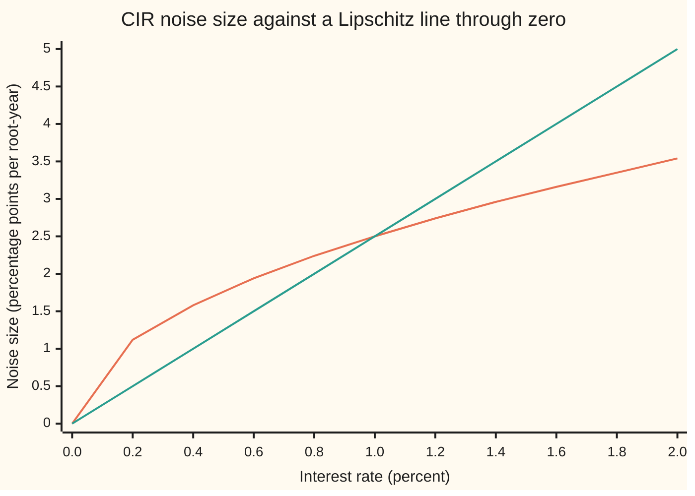
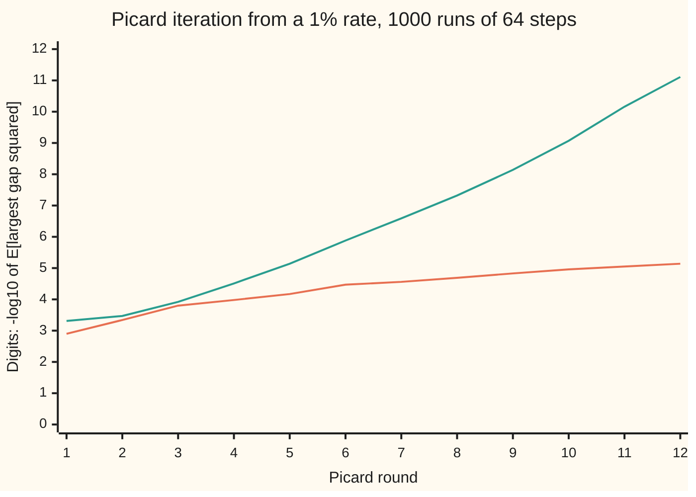
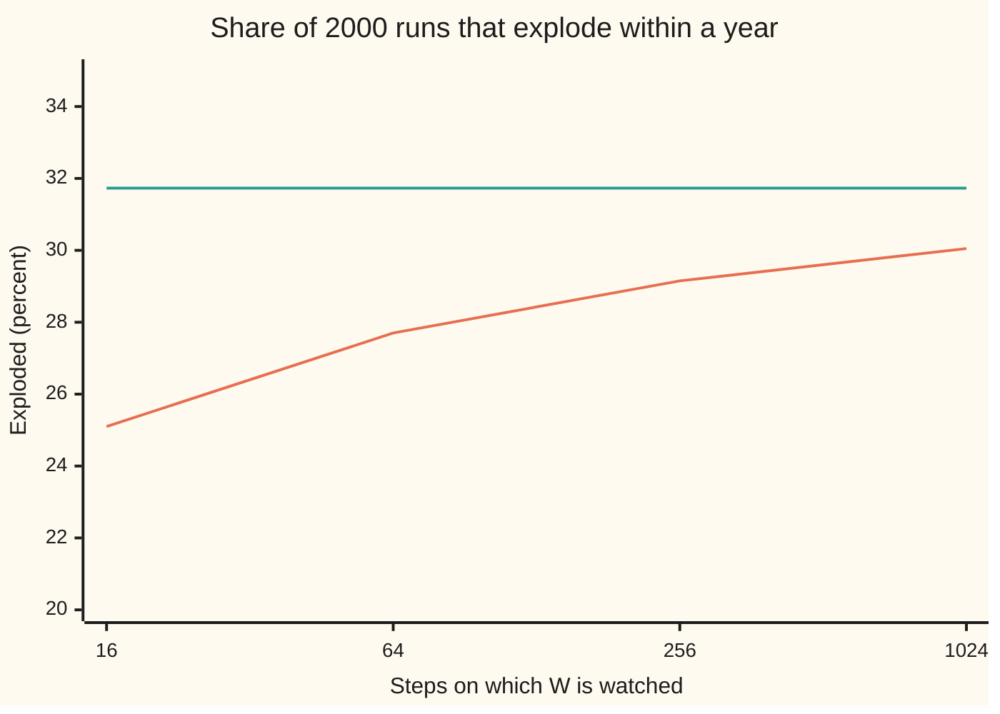

# When an SDE has one solution: Lipschitz and growth conditions

Stochastic processes and calculus → Ito Calculus → Which equations pin down one path → When an SDE has one solution

---

## General Overview

A short-term interest rate stands at 1 percent. A common model pulls it toward 4 percent at a speed of 0.5 a year and shakes it with a random shove whose size is proportional to the square root of the rate. Near zero the shoves shrink, which is meant to keep the rate at or above zero. This is the Cox–Ingersoll–Ross model, CIR for short.

The model is a rule for the next small change. Before trusting any number from it, one question comes first: given one run of the noise, does the rule fix exactly one path for the rate? With none, the model describes nothing; with two, its probabilities are not defined.

The standard answer is Ito's existence and uniqueness theorem. It asks that the rule's parts change no faster than a fixed multiple of the change in the rate, a **Lipschitz condition**, and grow no faster than a straight line, a **growth condition**. The square root fails the first exactly at zero, where this model lives: the noise size divided by the rate is 2.5 at a rate of 1 percent, 25 at 0.01 percent and 250 at 0.0001 percent. There the theorem is silent, and a sharper theorem has to finish the job.

**If an SDE's drift and noise size are Lipschitz in the state and grow at most linearly, then from any start with finite variance, independent of the noise, there is exactly one solution built from the noise so far, found as the limit of Picard iteration; drop the Lipschitz condition and uniqueness needs a separate argument, drop the growth condition and the solution can reach infinity in finite time.**

**What kind of fact this is:** a theorem, proved on this card in Why it works, with the full argument in a folded Detailed proof. The sharper Yamada–Watanabe theorem that covers the square root is stated with its source, not proved.

### The picture: the square root beats every straight line near zero



Orange: the CIR noise size $0.25\sqrt{r}$, in percentage points. Green: the line $2.5\,r$, the most a noise with Lipschitz constant 2.5 could be at a rate $r$ if it is 0 at zero. Below 1 percent the curve is above the line. No line, however steep, stays above the curve all the way down: the Lipschitz condition fails at zero.

---

## The formula

Time $t$ is in years. $W_t$ is Brownian motion, the random walk seen from far away. An SDE for a quantity $X_t$, its value at time $t$, is written $dX_t = \mu(X_t, t)\,dt + \sigma(X_t, t)\,dW_t$, where $\mu(x, t)$ is the drift function and $\sigma(x, t)$ the noise-size function ([stochastic-differential-equations](04-stochastic-differential-equations.md)). The $dW_t$ is shorthand for an Ito integral, never a derivative, because the path has no slope. So the equation means the integral equation

$$X_t = X_0 + \int_0^t \mu(X_s, s)\,ds + \int_0^t \sigma(X_s, s)\,dW_s .$$

A **solution** is a continuous process that satisfies this equation for every $t$, almost surely, and is *adapted*: at time $t$ it is built from the start and the noise path up to $t$, the information $F_t$, and nothing later.

**The theorem (Ito, 1951).** Fix a horizon $T$. Suppose one constant $K$ does both jobs below, for all states $x$ and $y$ and all times $t$ up to $T$:

$$\lvert\mu(x,t)-\mu(y,t)\rvert + \lvert\sigma(x,t)-\sigma(y,t)\rvert \le K\,\lvert x-y\rvert, \qquad \lvert\mu(x,t)\rvert + \lvert\sigma(x,t)\rvert \le K\,(1+\lvert x\rvert).$$

Let the start $X_0$ be independent of the noise, with $E[X_0^2]$ finite. Then the integral equation has a solution $X$ on $[0, T]$ with $E[\sup_{t \le T} X_t^2]$ finite, and any two solutions agree at every $t \le T$, almost surely.

**Read it aloud:** if the drift and noise size never react to the state more sharply than K times the change, and never grow faster than a straight line, then each start and each run of the noise fix one path.

The proof builds the solution by **Picard iteration**, the loop that proves the ODE theorem: start from a flat guess and feed each guess back into the right-hand side.

$$X^{(0)}_t = X_0, \qquad X^{(k+1)}_t = X_0 + \int_0^t \mu\big(X^{(k)}_s, s\big)\,ds + \int_0^t \sigma\big(X^{(k)}_s, s\big)\,dW_s .$$

**Read it aloud:** the next guess is the start plus the drift and the noise read along the previous guess.

The example is CIR. Its rate $r_t$ starts at $r_0$ and obeys

$$dr_t = \kappa\,(\theta - r_t)\,dt + \sigma\sqrt{r_t}\;dW_t .$$

**Read it aloud:** the rate moves toward the level theta at speed kappa, plus sigma times the square root of the rate times a Brownian step.

| Symbol | Plain meaning | In our example | Push it up and the answer… |
| --- | --- | --- | --- |
| $t$, $T$, $F_t$ | time in years; the horizon the theorem covers; the filtration, what is known by time $t$ | $T$ = 1 year | a longer horizon needs the same $K$ to hold longer; the bound $M$ grows |
| $X_t$, $X_0$, $X$, $Y$, $Z$, $PY$ | the quantity a general SDE describes, its start, the solution as a whole; two other processes, and the Picard map applied to $Y$ | the rate, $X_t = r_t$ | — |
| $W_t$, $W$, $W_1$, $dW_t$ | Brownian motion: where the noise path has got to by time $t$; the whole path; its value at one year; its step, shorthand inside an Ito integral | $W_t$ normal, mean 0, variance $t$ | — |
| $\mu(x,t)$, $\sigma(x,t)$, $\Delta\mu$, $\Delta\sigma$ | the drift function and the noise-size function; their changes between two guesses | $0.5(0.04 - x)$ and $0.25\sqrt{x}$ | — |
| $K$ | one constant bounding how sharply the coefficients react to the state, and how fast they grow | the drift needs 0.5; the noise has none at 0 | a larger $K$ admits more equations, and Picard converges more slowly |
| $r_t$, $r_0$, $r$ | the interest rate at time $t$, as a decimal; its value today; a rate in general | $r_0$ = 0.01 | — |
| $\kappa$, $\theta$ | the pull speed per year and the level the rate is pulled toward | 0.5 and 0.04 | the rate is held further from zero; past $2\kappa\theta = \sigma^2$ it never touches it |
| $\sigma$ | the CIR noise scale | 0.25 | the rate reaches zero more often |
| $X^{(k)}$, $k$, $D_k$, $e(t)$, $M$, $C$ | the Picard guess after $k$ rounds; the mean square of the largest gap between guesses $k$ and $k+1$, or between two solutions; the constant $2K^2(T+4)$; a bound on the first gap | 12 guesses on a 64-step grid | a larger $M$ makes the factorial win later |
| $n$, $\Delta t$ | grid steps in a year; the step length $1/n$ | 16 to 1024 | the simulation's errors shrink |
| $\tau$, $f$, $w$, $\Phi$, $\tau_N$, $N$ | the explosion time; the function $f(w) = 1/(1-w)$ that solves the exploding SDE; $w$, a number standing for $W_t$; the standard normal CDF; in the proof, the first time a solution reaches size $N$ | $\tau$ = the first time $W$ reaches 1; $\Phi(1)$ = 0.8413 | — |
| $\delta$, $h$, $y$, $a$, $b$ | a change in the rate; a second state beside $x$; a bound $h(\delta)$ on how far the noise size moves for that change; any two numbers, in Step 1's bound | $h(u) = 0.25\sqrt{u}$ for CIR | a larger $h$ near 0 can lose uniqueness |

### When it holds

- **Lipschitz in the state, for both coefficients.** Drop it for the noise and the iteration loses its contraction: on the CIR rate the Picard gaps are still 7.18e-06 after 12 rounds, where the Lipschitz cousin below reaches 7.83e-12. Uniqueness can still hold, by a different proof (Yamada–Watanabe, below); for a noise size $\lvert x\rvert^{0.4}$ from zero it fails, and two solutions leave the same start.
- **At most linear growth.** Drop it and a solution can run off to infinity. The SDE $dX = X^3\,dt + X^2\,dW$ from 1 does so before $t = 1$ on 31.73 percent of paths, about 1 in 3.
- **A start with finite variance, independent of the noise.** A start that peeks at future noise is not a start. With infinite variance the moment bound fails, though one solution per start survives.

---

## Why it works

### Step 0: a solution is a fixed point of the Picard map, measured in mean square

For an ODE, Picard's map takes a guessed curve to the start plus the integral of the rate along it ([lipschitz-and-the-picard-lindelof-theorem](../../08-Differential%20equations%20and%20dynamics/02-Existence%2C%20Uniqueness%20and%20Sensitivity/02-lipschitz-and-the-picard-lindelof-theorem.md)). A Lipschitz rate makes the map shrink distances, so the guesses converge to the one curve it leaves unchanged. The SDE proof runs the same loop with one change: the distance between two guesses is the average, over all runs of the noise, of the square of the largest gap along a path. A single Brownian path can make a stochastic integral large; only averages are under control.

### Step 1: one Picard round shrinks the mean-square gap

Write $\Delta\mu$ and $\Delta\sigma$ for the change in each coefficient between two guesses at the same moment; the Lipschitz condition bounds each by $K$ times their gap. The next guesses differ by a time integral of $\Delta\mu$ plus an Ito integral of $\Delta\sigma$. Square, using $(a + b)^2 \le 2a^2 + 2b^2$, and take the average of the largest value up to time $t$.

- **The drift part.** An ordinary integral over $[0, t]$, squared, is at most $t$ times the integral of the square: the Cauchy–Schwarz inequality, which says the square of an average is at most the average of the square. With $t \le T$ that gives at most $T K^2$ times the time integral of the squared gap.
- **The noise part.** The largest value of an Ito integral is controlled by Doob's maximal inequality, a martingale's largest square averages at most 4 times its final square ([doob-inequalities](../02-Martingales/05-doob-inequalities.md)). The final square averages exactly the time integral of $\Delta\sigma^2$, by the Ito isometry ([ito-integral](01-ito-integral.md)). That gives at most $4K^2$ times the same integral.

Together, with $D_k(t)$ the mean square of the largest gap between guesses $k$ and $k+1$ up to time $t$:

$$D_k(t) \le M \int_0^t D_{k-1}(s)\,ds, \qquad M = 2K^2(T + 4).$$

**Read it aloud:** each round's gap is at most M times the time integral of the previous round's gap.

### Step 2: the factorial wins

Apply Step 1 again and again. If $D_0(t) \le C$ for a constant $C$, then $D_1(t) \le CMt$, $D_2(t) \le C(Mt)^2/2$, and in general

$$D_k(t) \le C\,\frac{(Mt)^k}{k!} .$$

The $k!$ grows faster than any power, so however large $M$ and $T$ are, the gaps eventually fall faster than any fixed ratio. The ODE proof has the same factorial; the noise changes only the constant $M$: the Ito isometry stands in for the bound on an ordinary integral, and Doob's inequality adds the factor 4.

The code runs this loop on a grid of 64 steps in one year, for 1000 runs of the noise, twice: for CIR, and for a **Lipschitz cousin** with noise size $1.25\,r$, which matches CIR's at a rate of 4 percent.



Orange: CIR. Green: the Lipschitz cousin. Each point is minus the base-10 logarithm of the mean squared gap, so one more unit is a squared gap ten times smaller. The cousin's line bends upward, gaining digits faster and faster on the whole: the factorial at work. After 12 rounds its mean squared gap is 7.83e-12. The CIR line flattens, at 7.18e-06. Both are averages over 1000 simulated runs, printed with standard errors.

A second road reaches the cousin's limit: Euler's forward loop solves the same grid equation one step at a time. After 12 rounds, the largest gap between Picard's guess and Euler's path averages 3.90e-07 ± 2.1e-08.

### Step 3: why the square root stalls the iteration

Near zero, two guesses a gap $\delta$ apart get noise sizes up to $0.25\sqrt{\delta}$ apart, not $K\delta$. Squared, that is of order $\delta$, not $\delta^2$. So the next squared gap is of the order of the previous gap, not of its square, and once the gaps are small a round need not shrink them. This happens on paths that come close to zero, and from $r_0$ = 0.01 many do. On the 64-step grid both iterations still reach Euler's path by round 64, because each round fixes one more step; what the square root removes is the factorial speed, and in continuous time the proof.

### Step 4: uniqueness by Gronwall

For two solutions driven by the same noise, let $e(t)$ be the mean square of their largest gap up to time $t$. Step 1's estimate gives $e(t) \le M \int_0^t e(s)\,ds$, and Gronwall's lemma ([gronwall-and-continuous-dependence](../../08-Differential%20equations%20and%20dynamics/02-Existence%2C%20Uniqueness%20and%20Sensitivity/04-gronwall-and-continuous-dependence.md)) says such a nonnegative function is 0. The two solutions agree.

<details>
<summary>Detailed proof</summary>

**Claim.** Under the Lipschitz and growth conditions with constant $K$ on $[0, T]$, and $E[X_0^2] < \infty$ with $X_0$ independent of $W$, there is a continuous adapted $X$ with $E\sup_{t\le T}X_t^2 < \infty$ solving the integral equation, and any two continuous adapted solutions agree for all $t \le T$, almost surely.

**1. The key estimate.** For adapted continuous $Y, Z$ with finite mean square sup, let $PY$ denote the right-hand side of the integral equation with $Y$ inserted. Then $(PY - PZ)_t = \int_0^t \Delta\mu\,ds + \int_0^t \Delta\sigma\,dW$ with $\lvert\Delta\mu\rvert, \lvert\Delta\sigma\rvert \le K\lvert Y_s - Z_s\rvert$. By $(a+b)^2 \le 2a^2+2b^2$, Cauchy–Schwarz on the first term and Doob's $L^2$ maximal inequality with the Ito isometry on the second,
$E\sup_{s\le t}\lvert PY - PZ\rvert^2 \le 2TK^2\int_0^t E\lvert Y_s - Z_s\rvert^2 ds + 8K^2\int_0^t E\lvert Y_s - Z_s\rvert^2 ds \le M\int_0^t E\sup_{u\le s}\lvert Y_u - Z_u\rvert^2 ds.$

**2. The first gap is finite.** By the growth condition, $D_0(t) = E\sup_{s\le t}\lvert X^{(1)}_s - X_0\rvert^2 \le 2TK^2\int_0^t E(1+\lvert X_0\rvert)^2ds + 8K^2\int_0^t E(1+\lvert X_0\rvert)^2 ds \le C$ with $C = MT\,E(1+\lvert X_0\rvert)^2 < \infty$. Each Ito integral here is defined because its integrand is adapted with finite mean-square integral, by the same bound and induction.

**3. Convergence.** Step 1 and induction give $D_k(T) \le C(MT)^k/k!$. By Chebyshev's inequality (a chance of exceeding a level is at most the mean square over the level squared), $P\big(\sup_{t\le T}\lvert X^{(k+1)}_t - X^{(k)}_t\rvert > 2^{-k}\big) \le 4^k D_k(T)$, and $\sum_k 4^k C(MT)^k/k! = Ce^{4MT}$ is finite. By the Borel–Cantelli lemma (if the chances add to a finite total, only finitely many of the events happen), almost surely the gaps are eventually below $2^{-k}$, so $X^{(k)}$ converges uniformly on $[0,T]$ to a continuous adapted limit $X$. The same bound shows $X^{(k)} \to X$ in mean-square sup, so $E\sup X_t^2 < \infty$.

**4. The limit solves the equation.** By Step 1 with $Y = X^{(k)}$, $Z = X$, $E\sup\lvert PX^{(k)} - PX\rvert^2 \le MT\,E\sup\lvert X^{(k)} - X\rvert^2 \to 0$. Since $PX^{(k)} = X^{(k+1)} \to X$, also $PX = X$.

**5. Uniqueness.** For two solutions $X, Y$ with finite mean-square sup, $e(t) = E\sup_{s\le t}\lvert X_s - Y_s\rvert^2$ is finite and, by Step 1, $e(t) \le M\int_0^t e(s)\,ds$. Gronwall's lemma gives $e \equiv 0$. For solutions without that moment bound, stop both at $\tau_N$, the first time either reaches size $N$; the stopped processes satisfy the same estimate, agree up to $\tau_N$, and $\tau_N \to T$ by continuity as $N \to \infty$. This is Øksendal's Theorem 5.2.1, and Karatzas and Shreve, Section 5.2.

</details>

### Step 5: CIR still has one solution, by a sharper theorem

The CIR drift is Lipschitz with constant 0.5. Its noise grows at most linearly, since $\sqrt{x} \le (1 + x)/2$; the code finds the ratio of the two never above 1.0000 on rates from 0 to 1. Only the Lipschitz condition fails, and only at zero. In its place the square root has a weaker property, $\lvert\sqrt{x} - \sqrt{y}\rvert \le \sqrt{\lvert x - y\rvert}$, with a largest ratio of exactly 1.0000 on rates from 0 to 4 percent: a change $\delta$ moves the noise by at most a constant times $\sqrt{\delta}$.

The theorem of Toshio Yamada and Shinzo Watanabe (1971) uses exactly that. In one dimension, if the drift is Lipschitz and the noise size changes by at most $h(\delta)$ for a change $\delta$, where $h$ is so small near 0 that $\int_0 h(u)^{-2}\,du$ is infinite, then two solutions driven by the same noise agree. With $h(u) = 0.25\sqrt{u}$, the integral is $\int_0 du/(0.0625\,u)$, which is infinite: uniqueness holds. With $h(u) = u^{0.4}$ it is finite, and for $dX = \lvert X\rvert^{0.4}\,dW$ from zero, both $X \equiv 0$ and a process that leaves zero are solutions (Karatzas and Shreve, Chapter 5). The square root sits exactly on the boundary that still works. Existence follows: continuous coefficients with linear growth give a solution driven by some Brownian motion (Skorokhod's theorem), and the same paper shows that this plus uniqueness gives one built from the given noise. This card states the Yamada–Watanabe theorem; it does not prove it.

The code tests this with two repairs of Euler's scheme on the same Brownian steps: **full truncation**, which reads a negative value as 0 inside both coefficients, and **reflection**, which flips a negative value to positive after each step. With two solutions, the repairs could settle on different ones. Over 2000 simulated years their average gap at year end falls from 0.00210 at 16 steps to 0.00011 at 1024, a ratio of 19.1. That is consistent with one solution; Yamada–Watanabe proves it, and a simulation cannot.

The CIR mean is $\theta + (r_0 - \theta)e^{-\kappa t}$, 0.021804 at one year, and the simulation gives 0.021608 ± 0.000587. The variance formula gives 6.854e-04, the simulation 6.891e-04 ± 5.1e-05. A third road: Ito's lemma gives $\tfrac{d}{dt}E[r_t] = \kappa(\theta - E[r_t])$ and $\tfrac{d}{dt}E[r_t^2] = (2\kappa\theta + \sigma^2)E[r_t] - 2\kappa E[r_t^2]$, and solving these step by step returns 6.854e-04.

Whether the rate touches zero is the Feller test: zero is reached when $2\kappa\theta < \sigma^2$. Here 0.0400 against 0.0625, a ratio of 0.64, so the rate touches zero and the drift pushes it straight back up. Plain Euler, which takes the square root of whatever value it has, fails on about 2 paths in 5 at every step size: 0.4140 at 16 steps, 0.3755 at 1024.

### Step 6: an SDE that explodes

Drop the growth condition and existence can fail for all time. Take

$$dX_t = X_t^3\,dt + X_t^2\,dW_t, \qquad X_0 = 1 .$$

The coefficients are smooth, so Lipschitz on every bounded range of states, and the solution is unique while it stays finite. But $x^3$ is not below $K(1 + \lvert x\rvert)$ for any $K$. The candidate $X_t = f(W_t)$ with $f(w) = 1/(1-w)$ solves it: by Ito's lemma ([itos-lemma](02-itos-lemma.md)), $f'(w) = f^2$ gives the noise $X^2$, and $\tfrac12 f''(w) = f^3$ gives the drift $X^3$. By finite differences at $w$ = 0.3, where $X$ = 1.428571, the code finds a drift of 2.915452 and a noise of 2.040816, equal to $X^3$ and $X^2$.

The solution reaches infinity at $\tau$, the first time the Brownian path reaches 1. The chance that happens within a year is, by the reflection principle (the walk version is [reflection-principle-for-walks](../01-Random%20Walks%20and%20Filtrations/05-reflection-principle-for-walks.md)), twice the chance that $W_1$ ends above 1:

$$P(\tau \le 1) = 2\,\big(1 - \Phi(1)\big) = 0.3173 .$$



Orange: the share of 2000 simulated years in which the Brownian path, watched on 16 to 1024 grid steps, reached 1. Green: the exact 31.73 percent. A grid misses crossings between its points, so every count is low and finer grids miss less: 0.2510 ± 0.0097 at 16 steps, 0.3005 ± 0.0103 at 1024.

Without the noise, the ODE $x' = x^3$ from 1 explodes at $t$ = 0.5 on every path ([blow-up-and-the-life-span-of-a-solution](../../08-Differential%20equations%20and%20dynamics/02-Existence%2C%20Uniqueness%20and%20Sensitivity/03-blow-up-and-the-life-span-of-a-solution.md)). The SDE explodes within a year on about 1 path in 3, and, since a Brownian path reaches 1 eventually, every path explodes at some finite time.

**Another road.** In several dimensions the theorem and proof are unchanged, with absolute values read as lengths ([multidimensional-ito-and-correlation](06-multidimensional-ito-and-correlation.md)). The Yamada–Watanabe theorem is one-dimensional only.

---

## Worked numbers, by hand

The CIR rate: $r_0$ = 0.01, $\kappa$ = 0.5 a year, $\theta$ = 0.04, $\sigma$ = 0.25, one year ahead.

| Step | Arithmetic | Value |
| --- | --- | --- |
| noise per unit of rate at 1 percent | 0.25 × √0.01 / 0.01 | 2.5 |
| the same at 0.01 percent | 0.25 × √0.0001 / 0.0001 | 25.0 |
| Feller test | 2 × 0.5 × 0.04 against 0.25 × 0.25 | 0.0400 < 0.0625 |
| one monthly Euler step from 1 percent: mean | 0.01 + 0.5 × (0.04 − 0.01) / 12 | 0.01125 |
| the same step: standard deviation | 0.25 × √(0.01 / 12) | 0.00722 |
| chance the step lands below 0 | Φ(−0.01125 / 0.00722) = Φ(−1.5588) | 0.0595 |
| mean rate after a year | 0.04 + (0.01 − 0.04) × e^(−0.5) | 0.021804 |
| exploding SDE: chance of explosion within a year | 2 × (1 − Φ(1)), with Φ(1) = 0.8413 | **0.3173** |

The rate's noise has no Lipschitz constant at zero, and by Feller's test the rate reaches zero; separately, a monthly Euler step from 1 percent overshoots below zero about 1 time in 17. The exploding equation fails the growth condition instead, and passes every finite value within a year on about 1 path in 3.

### What breaks if you drop a piece

| Mistake | Comes out at | What went wrong |
| --- | --- | --- |
| Run Picard on CIR and expect the factorial | E[largest gap squared] 7.18e-06 after 12 rounds (cousin: 7.83e-12) | the square root has no Lipschitz constant at 0, so a round need not shrink the gap |
| Drop the growth condition, $dX = X^3\,dt + X^2\,dW$ | explodes within a year with chance 0.3173 | the drift outruns every straight line |
| Plain Euler on CIR, taking $\sqrt{r}$ of a negative | fails on 0.3755 ± 0.0108 of years at 1024 steps (0.4140 at 16) | the true rate touches zero, and a step near zero overshoots |
| Count explosions on a coarse grid | 0.2510 ± 0.0097 at 16 steps (exact 0.3173) | the path crosses 1 between grid points |

The code prints every row.

---

## Code, from first principles, and it actually runs

Four roads: the coefficients tested against the theorem's conditions; Picard iteration in mean square for CIR and its cousin, checked against Euler's forward loop; two repaired Euler schemes against each other, the exact mean and variance, and the moment equations; and the exploding SDE by Ito's lemma in finite differences, by the reflection principle, and by simulation. Draws come from SplitMix64, seeds 20260930 and 20260931, with Box–Muller normals. Asserts on simulated numbers allow 4 standard errors.

### Python

```python
# Existence and uniqueness for SDEs -- the check behind the card.  Only math is imported.
# CIR rate dr = kappa (theta - r) dt + sigma sqrt(r) dW, r0 = 0.01, kappa = 0.5 a year, theta = 0.04,
# sigma = 0.25, t in years.  Roads: the theorem's conditions; Picard in mean square for CIR and a
# Lipschitz cousin (noise 1.25 r), against Euler's loop; two repaired Euler schemes against each other,
# the exact mean and variance, and the moment equations; dX = X^3 dt + X^2 dW, solved exactly, its
# explosion chance by the reflection principle and by simulation.  Simulated numbers carry standard errors.
import math

R0, KAP, TH, SIG = 0.01, 0.5, 0.04, 0.25
SEED, PATHS, FINE = 20260930, 2000, 1024
MASK = (1 << 64) - 1

class SplitMix64:                         # the wing's generator, with Box-Muller normals
    def __init__(self, seed):
        self.s, self.spare = seed & MASK, None
    def uniform(self):
        self.s = (self.s + 0x9E3779B97F4A7C15) & MASK
        z = self.s
        z = ((z ^ (z >> 30)) * 0xBF58476D1CE4E5B9) & MASK
        z = ((z ^ (z >> 27)) * 0x94D049BB133111EB) & MASK
        return ((z ^ (z >> 31)) >> 11) / 9007199254740992.0
    def normal(self):
        if self.spare is not None:
            z, self.spare = self.spare, None
            return z
        u1, u2 = self.uniform(), self.uniform()
        r = math.sqrt(-2.0 * math.log(1.0 - u1))
        self.spare = r * math.sin(2.0 * math.pi * u2)
        return r * math.cos(2.0 * math.pi * u2)

def Phi(x, n=4000):                       # normal CDF: Simpson's rule on the bell curve from -10 to x
    h, s = (x + 10.0) / n, math.exp(-50.0) + math.exp(-0.5 * x * x)
    for k in range(1, n):
        s += (4.0 if k % 2 == 1 else 2.0) * math.exp(-0.5 * (-10.0 + k * h) * (-10.0 + k * h))
    return s * h / 3.0 / math.sqrt(2.0 * math.pi)

def mean_se(xs):
    m = sum(xs) / len(xs)
    v = sum((x - m) * (x - m) for x in xs) / (len(xs) - 1)
    return m, math.sqrt(v / len(xs)), v

def cir(x): return SIG * math.sqrt(max(x, 0.0))   # CIR noise size, read as 0 below zero
def cousin(x): return 1.25 * abs(x)              # Lipschitz cousin: the same size at 4 percent

print(f"rate: r0 {R0}, kappa {KAP}, theta {TH}, sigma {SIG}; seeds {SEED} and {SEED + 1}; t in years")
print(f"Feller test: 2 kappa theta {2 * KAP * TH:.4f} against sigma^2 {SIG * SIG:.4f}; ratio {2 * KAP * TH / SIG ** 2:.2f}")
print("Lipschitz ratio of the noise at 0, sigma sqrt(x)/x: " +
      ", ".join(f"x = {x}: {cir(float(x)) / float(x):.1f}" for x in ("0.01", "0.0001", "0.000001")))
hold = max(abs(math.sqrt(i / 1000) - math.sqrt(j / 1000)) / math.sqrt(abs(i - j) / 1000)
           for i in range(0, 41) for j in range(0, 41) if i != j)
grow = max(cir(i / 1000) / (SIG * (1 + i / 1000) / 2) for i in range(0, 1001))
print(f"Hoelder test, max |sqrt x - sqrt y| / sqrt|x - y| on 0 to 0.04: {hold:.4f};"
      f" growth test, max sigma sqrt x / (sigma (1 + x)/2) on 0 to 1: {grow:.4f}")
assert abs(hold - 1.0) < 1e-12 and grow <= 1.0 + 1e-12
xs = [0.002 * i for i in range(11)]
print("figure, rate (percent): " + ", ".join(f"{100 * x:.1f}" for x in xs))
print("figure, noise sigma sqrt(r) (pp): " + ", ".join(f"{100 * cir(x):.2f}" for x in xs))
print("figure, line 2.5 r (pp): " + ", ".join(f"{250 * x:.2f}" for x in xs))
g, N, IT = SplitMix64(SEED), 64, 12       # Picard iteration in mean square, 1000 paths of 64 steps
sq, to_euler = {f: [[] for _ in range(IT)] for f in (cir, cousin)}, []
for _ in range(1000):
    dw = [math.sqrt(1.0 / N) * g.normal() for _ in range(N)]
    for f in (cir, cousin):
        x = [R0] * (N + 1)
        for k in range(IT):
            y, s = [R0], R0
            for i in range(N):
                s += KAP * (TH - max(x[i], 0.0)) / N + f(x[i]) * dw[i]
                y.append(s)
            sq[f][k].append(max(abs(a - b) for a, b in zip(x, y)) ** 2)
            x = y
        if f is cousin:                   # Euler's forward loop: a different road to the fixed point
            e = [R0]
            for i in range(N):
                e.append(e[-1] + KAP * (TH - max(e[-1], 0.0)) / N + f(e[-1]) * dw[i])
            to_euler.append(max(abs(a - b) for a, b in zip(x, e)))
for k in range(IT):
    (mc, sc, _), (mp, sp, _) = mean_se(sq[cir][k]), mean_se(sq[cousin][k])
    print(f"Picard round {k + 1:2d}: E sup gap^2  CIR {mc:.2e} +- {sc:.1e}   cousin {mp:.2e} +- {sp:.1e}")
print("figure, round: " + ", ".join(str(k + 1) for k in range(IT)))
for name, f in (("CIR", cir), ("cousin", cousin)):
    print(f"figure, digits -log10 E sup gap^2, {name}: " + ", ".join(f"{-math.log10(mean_se(sq[f][k])[0]):.2f}" for k in range(IT)))
me, se_e, _ = mean_se(to_euler)
print(f"cousin after {IT} rounds: mean sup gap to Euler's loop {me:.2e} +- {se_e:.1e}")
assert mean_se(sq[cousin][IT - 1])[0] < 1e-8 and mean_se(sq[cir][IT - 1])[0] > 1e-6 and me < 1e-4
g = SplitMix64(SEED + 1)                  # 2000 years on 1024 steps: repaired Euler, plain Euler, explosion
NS, ends = (16, 64, 256, 1024), []
gap, neg, hit = ({n: [] for n in NS} for _ in range(3))
for _ in range(PATHS):
    dw = [math.sqrt(1.0 / FINE) * g.normal() for _ in range(FINE)]
    for n in NS:
        b, dt = FINE // n, 1.0 / n
        tr = rf = pl = R0
        w = wmax = went = 0.0
        for k in range(n):
            d = sum(dw[k * b:(k + 1) * b])
            tr = tr + KAP * (TH - max(tr, 0.0)) * dt + cir(tr) * d             # full truncation
            rf = abs(rf + KAP * (TH - rf) * dt + cir(rf) * d)                  # reflection
            pl = pl + KAP * (TH - pl) * dt + SIG * math.sqrt(pl) * d if pl >= 0 else pl   # plain: stuck below 0
            went = 1.0 if pl < 0 else went
            w += d
            wmax = max(wmax, w)
        gap[n].append(abs(max(tr, 0.0) - rf)); neg[n].append(went)
        hit[n].append(1.0 if wmax >= 1.0 else 0.0)
    ends.append(max(tr, 0.0))
for n in NS:
    (mg, sg, _), (a, sa, _) = mean_se(gap[n]), mean_se(neg[n])
    print(f"n = {n:4d} steps: |truncated - reflected| at 1 year {mg:.5f} +- {sg:.5f};"
          f" plain Euler needs sqrt of a negative: {a:.4f} +- {sa:.4f}")
ratio = mean_se(gap[16])[0] / mean_se(gap[1024])[0]
print(f"gap ratio n = 16 to n = 1024: {ratio:.1f}")
mean_f = TH + (R0 - TH) * math.exp(-KAP)
var_f = R0 * SIG ** 2 / KAP * (math.exp(-KAP) - math.exp(-2 * KAP)) + TH * SIG ** 2 / (2 * KAP) * (1 - math.exp(-KAP)) ** 2
mo, hs = [R0, R0 * R0], 1e-4                 # moment equations from Ito's lemma, Heun's method to t = 1
dm = lambda m: [KAP * (TH - m[0]), (2 * KAP * TH + SIG ** 2) * m[0] - 2 * KAP * m[1]]
for _ in range(10000):
    a = dm(mo); b = dm([mo[i] + hs * a[i] for i in range(2)]); mo = [mo[i] + hs * (a[i] + b[i]) / 2 for i in range(2)]
m, se, v = mean_se(ends)
m4 = sum((x - m) ** 4 for x in ends) / PATHS
sev = math.sqrt((m4 - v * v) / PATHS)
print(f"rate at 1 year: formula mean {mean_f:.6f} sd {math.sqrt(var_f):.6f};"
      f" simulated mean {m:.6f} +- {se:.6f}, variance {v:.3e} +- {sev:.1e} (formula {var_f:.3e})")
print(f"moment equations, step 1e-4: mean {mo[0]:.6f}, variance {mo[1] - mo[0] ** 2:.3e}")
assert abs(mo[0] - mean_f) < 1e-9 and abs(mo[1] - mo[0] ** 2 - var_f) < 1e-9 and ratio > 3.0 and mean_se(neg[1024])[0] > 0.2 and abs(m - mean_f) < 4 * se and abs(v - var_f) < 4 * sev
f, h = (lambda w: 1.0 / (1.0 - w)), 1e-4   # the exploding SDE: X = 1/(1 - W), X0 = 1
f1, f2 = (f(0.3 + h) - f(0.3 - h)) / (2 * h), (f(0.3 + h) - 2 * f(0.3) + f(0.3 - h)) / (h * h)
print(f"Ito's lemma at w = 0.3, X = {f(0.3):.6f}: drift f''/2 = {f2 / 2:.6f} (X^3 = {f(0.3) ** 3:.6f}),"
      f" noise f' = {f1:.6f} (X^2 = {f(0.3) ** 2:.6f})")
assert abs(f2 / 2 - f(0.3) ** 3) < 1e-3 and abs(f1 - f(0.3) ** 2) < 1e-6
p_ex = 2.0 * (1.0 - Phi(1.0))
print(f"explosion by t = 1: Phi(1) = {Phi(1.0):.4f}, reflection principle 2 (1 - Phi(1)) = {p_ex:.4f}; without the noise, x' = x^3 explodes at t = 0.5")
for n in NS:
    mh, sh, _ = mean_se(hit[n])
    print(f"explosion by t = 1, W watched on {n:4d} steps: {mh:.4f} +- {sh:.4f}")
print("figure, explosion percent at n = 16, 64, 256, 1024: " + ", ".join(f"{100 * mean_se(hit[n])[0]:.2f}" for n in NS) + f"; exact {100 * p_ex:.2f}")
assert abs(mean_se(hit[1024])[0] - p_ex) < 4 * mean_se(hit[1024])[1] and mean_se(hit[16])[0] < p_ex
z = (R0 + KAP * (TH - R0) / 12) / (SIG * math.sqrt(R0) * math.sqrt(1 / 12))
print(f"by hand: one monthly Euler step from 1 percent, mean {R0 + KAP * (TH - R0) / 12:.5f}, sd {SIG * math.sqrt(R0 / 12):.5f},"
      f" P(below 0) = Phi(-{z:.4f}) = {Phi(-z):.4f}")
print("ALL CHECKS PASS")
```

**Ran 2026-10-06 on macOS, Python 3.14.6, standard library only. All checks passed. Output, pasted from the run:**

```
rate: r0 0.01, kappa 0.5, theta 0.04, sigma 0.25; seeds 20260930 and 20260931; t in years
Feller test: 2 kappa theta 0.0400 against sigma^2 0.0625; ratio 0.64
Lipschitz ratio of the noise at 0, sigma sqrt(x)/x: x = 0.01: 2.5, x = 0.0001: 25.0, x = 0.000001: 250.0
Hoelder test, max |sqrt x - sqrt y| / sqrt|x - y| on 0 to 0.04: 1.0000; growth test, max sigma sqrt x / (sigma (1 + x)/2) on 0 to 1: 1.0000
figure, rate (percent): 0.0, 0.2, 0.4, 0.6, 0.8, 1.0, 1.2, 1.4, 1.6, 1.8, 2.0
figure, noise sigma sqrt(r) (pp): 0.00, 1.12, 1.58, 1.94, 2.24, 2.50, 2.74, 2.96, 3.16, 3.35, 3.54
figure, line 2.5 r (pp): 0.00, 0.50, 1.00, 1.50, 2.00, 2.50, 3.00, 3.50, 4.00, 4.50, 5.00
Picard round  1: E sup gap^2  CIR 1.27e-03 +- 3.8e-05   cousin 4.89e-04 +- 1.4e-05
Picard round  2: E sup gap^2  CIR 4.61e-04 +- 1.7e-05   cousin 3.43e-04 +- 1.8e-05
Picard round  3: E sup gap^2  CIR 1.60e-04 +- 8.0e-06   cousin 1.21e-04 +- 9.4e-06
Picard round  4: E sup gap^2  CIR 1.05e-04 +- 6.8e-06   cousin 3.06e-05 +- 2.8e-06
Picard round  5: E sup gap^2  CIR 6.73e-05 +- 4.7e-06   cousin 7.29e-06 +- 6.1e-07
Picard round  6: E sup gap^2  CIR 3.41e-05 +- 2.7e-06   cousin 1.32e-06 +- 8.7e-08
Picard round  7: E sup gap^2  CIR 2.74e-05 +- 2.2e-06   cousin 2.56e-07 +- 2.8e-08
Picard round  8: E sup gap^2  CIR 2.06e-05 +- 1.9e-06   cousin 4.78e-08 +- 1.2e-08
Picard round  9: E sup gap^2  CIR 1.49e-05 +- 1.4e-06   cousin 7.29e-09 +- 2.2e-09
Picard round 10: E sup gap^2  CIR 1.10e-05 +- 1.2e-06   cousin 8.55e-10 +- 2.0e-10
Picard round 11: E sup gap^2  CIR 8.92e-06 +- 1.1e-06   cousin 6.91e-11 +- 9.9e-12
Picard round 12: E sup gap^2  CIR 7.18e-06 +- 8.5e-07   cousin 7.83e-12 +- 1.6e-12
figure, round: 1, 2, 3, 4, 5, 6, 7, 8, 9, 10, 11, 12
figure, digits -log10 E sup gap^2, CIR: 2.90, 3.34, 3.80, 3.98, 4.17, 4.47, 4.56, 4.69, 4.83, 4.96, 5.05, 5.14
figure, digits -log10 E sup gap^2, cousin: 3.31, 3.47, 3.92, 4.51, 5.14, 5.88, 6.59, 7.32, 8.14, 9.07, 10.16, 11.11
cousin after 12 rounds: mean sup gap to Euler's loop 3.90e-07 +- 2.1e-08
n =   16 steps: |truncated - reflected| at 1 year 0.00210 +- 0.00013; plain Euler needs sqrt of a negative: 0.4140 +- 0.0110
n =   64 steps: |truncated - reflected| at 1 year 0.00071 +- 0.00005; plain Euler needs sqrt of a negative: 0.4095 +- 0.0110
n =  256 steps: |truncated - reflected| at 1 year 0.00031 +- 0.00002; plain Euler needs sqrt of a negative: 0.4010 +- 0.0110
n = 1024 steps: |truncated - reflected| at 1 year 0.00011 +- 0.00001; plain Euler needs sqrt of a negative: 0.3755 +- 0.0108
gap ratio n = 16 to n = 1024: 19.1
rate at 1 year: formula mean 0.021804 sd 0.026179; simulated mean 0.021608 +- 0.000587, variance 6.891e-04 +- 5.1e-05 (formula 6.854e-04)
moment equations, step 1e-4: mean 0.021804, variance 6.854e-04
Ito's lemma at w = 0.3, X = 1.428571: drift f''/2 = 2.915452 (X^3 = 2.915452), noise f' = 2.040816 (X^2 = 2.040816)
explosion by t = 1: Phi(1) = 0.8413, reflection principle 2 (1 - Phi(1)) = 0.3173; without the noise, x' = x^3 explodes at t = 0.5
explosion by t = 1, W watched on   16 steps: 0.2510 +- 0.0097
explosion by t = 1, W watched on   64 steps: 0.2770 +- 0.0100
explosion by t = 1, W watched on  256 steps: 0.2915 +- 0.0102
explosion by t = 1, W watched on 1024 steps: 0.3005 +- 0.0103
figure, explosion percent at n = 16, 64, 256, 1024: 25.10, 27.70, 29.15, 30.05; exact 31.73
by hand: one monthly Euler step from 1 percent, mean 0.01125, sd 0.00722, P(below 0) = Phi(-1.5588) = 0.0595
ALL CHECKS PASS
```

### Rust

Same numbers, same labels, built with `rustc --edition 2021 -O`.

```rust
// Existence and uniqueness for SDEs -- the same check as the Python, in Rust.  No crates.
// CIR rate dr = kappa (theta - r) dt + sigma sqrt(r) dW, r0 = 0.01, kappa = 0.5 a year, theta = 0.04,
// sigma = 0.25, t in years.  Roads: the theorem's conditions; Picard in mean square for CIR and a
// Lipschitz cousin (noise 1.25 r), against Euler's loop; two repaired Euler schemes against each other,
// the exact mean and variance, and the moment equations; dX = X^3 dt + X^2 dW, solved exactly, its
// explosion chance by the reflection principle and by simulation.  Simulated numbers carry standard errors.
const R0: f64 = 0.01; const KAP: f64 = 0.5; const TH: f64 = 0.04; const SIG: f64 = 0.25;
const SEED: u64 = 20260930; const PATHS: usize = 2000; const FINE: usize = 1024;

struct SplitMix64 { s: u64, spare: Option<f64> }      // the wing's generator, with Box-Muller normals
impl SplitMix64 {
    fn new(seed: u64) -> Self { SplitMix64 { s: seed, spare: None } }
    fn uniform(&mut self) -> f64 {
        self.s = self.s.wrapping_add(0x9E3779B97F4A7C15);
        let mut z = self.s;
        z = (z ^ (z >> 30)).wrapping_mul(0xBF58476D1CE4E5B9);
        z = (z ^ (z >> 27)).wrapping_mul(0x94D049BB133111EB);
        ((z ^ (z >> 31)) >> 11) as f64 / 9007199254740992.0
    }
    fn normal(&mut self) -> f64 {
        if let Some(z) = self.spare.take() { return z }
        let (u1, u2) = (self.uniform(), self.uniform());
        let r = (-2.0 * (1.0 - u1).ln()).sqrt();
        self.spare = Some(r * (2.0 * std::f64::consts::PI * u2).sin());
        r * (2.0 * std::f64::consts::PI * u2).cos()
    }
}

fn phi(x: f64) -> f64 {                                 // normal CDF: Simpson's rule on the bell curve from -10 to x
    let n = 4000;
    let h = (x + 10.0) / n as f64;
    let mut s = (-50.0f64).exp() + (-0.5 * x * x).exp();
    for k in 1..n {
        let y = -10.0 + k as f64 * h;
        s += (if k % 2 == 1 { 4.0 } else { 2.0 }) * (-0.5 * y * y).exp();
    }
    s * h / 3.0 / (2.0 * std::f64::consts::PI).sqrt()
}

fn mean_se(xs: &[f64]) -> (f64, f64, f64) {
    let n = xs.len() as f64;
    let m = xs.iter().sum::<f64>() / n;
    let v = xs.iter().map(|x| (x - m) * (x - m)).sum::<f64>() / (n - 1.0);
    (m, (v / n).sqrt(), v)
}

fn sci(x: f64, p: usize) -> String {                    // Python's e-format: two-digit exponent with a sign
    let s = format!("{:.*e}", p, x);
    let (m, e) = s.split_once('e').unwrap();
    let e: i32 = e.parse().unwrap();
    format!("{}e{}{:02}", m, if e < 0 { '-' } else { '+' }, e.abs())
}

fn cir(x: f64) -> f64 { SIG * x.max(0.0).sqrt() }       // CIR noise size, read as 0 below zero
fn cousin(x: f64) -> f64 { 1.25 * x.abs() }             // Lipschitz cousin: the same size at 4 percent
fn join(v: &[f64], p: usize) -> String { v.iter().map(|x| format!("{:.*}", p, x)).collect::<Vec<_>>().join(", ") }

fn main() {
    println!("rate: r0 {}, kappa {}, theta {}, sigma {}; seeds {} and {}; t in years", R0, KAP, TH, SIG, SEED, SEED + 1);
    println!("Feller test: 2 kappa theta {:.4} against sigma^2 {:.4}; ratio {:.2}", 2.0 * KAP * TH, SIG * SIG, 2.0 * KAP * TH / (SIG * SIG));
    let labs = ["0.01", "0.0001", "0.000001"];
    println!("Lipschitz ratio of the noise at 0, sigma sqrt(x)/x: {}", labs.iter()
        .map(|l| { let x: f64 = l.parse().unwrap(); format!("x = {}: {:.1}", l, cir(x) / x) }).collect::<Vec<_>>().join(", "));
    let mut hold: f64 = 0.0;
    for i in 0..41 { for j in 0..41 { if i != j {
        let (x, y) = (i as f64 / 1000.0, j as f64 / 1000.0);
        hold = hold.max((x.sqrt() - y.sqrt()).abs() / ((i as f64 - j as f64).abs() / 1000.0).sqrt());
    } } }
    let grow = (0..1001).map(|i| cir(i as f64 / 1000.0) / (SIG * (1.0 + i as f64 / 1000.0) / 2.0)).fold(f64::MIN, f64::max);
    println!("Hoelder test, max |sqrt x - sqrt y| / sqrt|x - y| on 0 to 0.04: {:.4}; growth test, max sigma sqrt x / (sigma (1 + x)/2) on 0 to 1: {:.4}", hold, grow);
    assert!((hold - 1.0).abs() < 1e-12 && grow <= 1.0 + 1e-12);
    let xs: Vec<f64> = (0..11).map(|i| 0.002 * i as f64).collect();
    println!("figure, rate (percent): {}", join(&xs.iter().map(|x| 100.0 * x).collect::<Vec<_>>(), 1));
    println!("figure, noise sigma sqrt(r) (pp): {}", join(&xs.iter().map(|&x| 100.0 * cir(x)).collect::<Vec<_>>(), 2));
    println!("figure, line 2.5 r (pp): {}", join(&xs.iter().map(|x| 250.0 * x).collect::<Vec<_>>(), 2));
    let (mut g, n, it) = (SplitMix64::new(SEED), 64usize, 12usize);   // Picard iteration in mean square, 1000 paths of 64 steps
    let fs: [fn(f64) -> f64; 2] = [cir, cousin];
    let mut sq = vec![vec![Vec::new(); it]; 2];
    let mut to_euler = Vec::new();
    for _ in 0..1000 {
        let dw: Vec<f64> = (0..n).map(|_| (1.0 / n as f64).sqrt() * g.normal()).collect();
        for (fi, f) in fs.iter().enumerate() {
            let mut x = vec![R0; n + 1];
            for k in 0..it {
                let (mut y, mut s) = (vec![R0], R0);
                for i in 0..n { s += KAP * (TH - x[i].max(0.0)) / n as f64 + f(x[i]) * dw[i]; y.push(s) }
                let d = x.iter().zip(&y).map(|(a, b)| (a - b).abs()).fold(f64::MIN, f64::max);
                sq[fi][k].push(d * d);
                x = y;
            }
            if fi == 1 {                                 // Euler's forward loop: a different road to the fixed point
                let mut e = vec![R0];
                for i in 0..n { let l = e[i]; e.push(l + KAP * (TH - l.max(0.0)) / n as f64 + f(l) * dw[i]) }
                to_euler.push(x.iter().zip(&e).map(|(a, b)| (a - b).abs()).fold(f64::MIN, f64::max));
            }
        }
    }
    for k in 0..it {
        let ((mc, sc, _), (mp, sp, _)) = (mean_se(&sq[0][k]), mean_se(&sq[1][k]));
        println!("Picard round {:2}: E sup gap^2  CIR {} +- {}   cousin {} +- {}", k + 1, sci(mc, 2), sci(sc, 1), sci(mp, 2), sci(sp, 1));
    }
    println!("figure, round: {}", (1..=it).map(|k| k.to_string()).collect::<Vec<_>>().join(", "));
    for (fi, name) in ["CIR", "cousin"].iter().enumerate() {
        println!("figure, digits -log10 E sup gap^2, {}: {}", name, join(&sq[fi].iter().map(|v| -mean_se(v).0.log10()).collect::<Vec<_>>(), 2));
    }
    let (me, se_e, _) = mean_se(&to_euler);
    println!("cousin after {} rounds: mean sup gap to Euler's loop {} +- {}", it, sci(me, 2), sci(se_e, 1));
    assert!(mean_se(&sq[1][it - 1]).0 < 1e-8 && mean_se(&sq[0][it - 1]).0 > 1e-6 && me < 1e-4);
    let mut g = SplitMix64::new(SEED + 1);               // 2000 years on 1024 steps: repaired Euler, plain Euler, explosion
    let ns = [16usize, 64, 256, 1024];
    let (mut gap, mut neg, mut hit) = (vec![Vec::new(); 4], vec![Vec::new(); 4], vec![Vec::new(); 4]);
    let mut ends = Vec::new();
    for _ in 0..PATHS {
        let dw: Vec<f64> = (0..FINE).map(|_| (1.0 / FINE as f64).sqrt() * g.normal()).collect();
        let mut tr = R0;
        for (ni, &n) in ns.iter().enumerate() {
            let (b, dt) = (FINE / n, 1.0 / n as f64);
            let (mut rf, mut pl) = (R0, R0);
            let (mut w, mut wmax, mut went) = (0.0f64, 0.0f64, 0.0);
            tr = R0;
            for k in 0..n {
                let d: f64 = dw[k * b..(k + 1) * b].iter().sum();
                tr = tr + KAP * (TH - tr.max(0.0)) * dt + cir(tr) * d;          // full truncation
                rf = (rf + KAP * (TH - rf) * dt + cir(rf) * d).abs();           // reflection
                pl = if pl >= 0.0 { pl + KAP * (TH - pl) * dt + SIG * pl.sqrt() * d } else { pl };   // plain: stuck below 0
                if pl < 0.0 { went = 1.0 }
                w += d;
                wmax = wmax.max(w);
            }
            gap[ni].push((tr.max(0.0) - rf).abs()); neg[ni].push(went);
            hit[ni].push(if wmax >= 1.0 { 1.0 } else { 0.0 });
        }
        ends.push(tr.max(0.0));
    }
    for (ni, n) in ns.iter().enumerate() {
        let ((mg, sg, _), (a, sa, _)) = (mean_se(&gap[ni]), mean_se(&neg[ni]));
        println!("n = {:4} steps: |truncated - reflected| at 1 year {:.5} +- {:.5}; plain Euler needs sqrt of a negative: {:.4} +- {:.4}", n, mg, sg, a, sa);
    }
    let ratio = mean_se(&gap[0]).0 / mean_se(&gap[3]).0;
    println!("gap ratio n = 16 to n = 1024: {:.1}", ratio);
    let mean_f = TH + (R0 - TH) * (-KAP).exp();
    let var_f = R0 * SIG * SIG / KAP * ((-KAP).exp() - (-2.0 * KAP).exp()) + TH * SIG * SIG / (2.0 * KAP) * (1.0 - (-KAP).exp()).powi(2);
    let (mut mo, hs) = ([R0, R0 * R0], 1e-4);          // moment equations from Ito's lemma, Heun's method to t = 1
    let dm = |m: [f64; 2]| [KAP * (TH - m[0]), (2.0 * KAP * TH + SIG * SIG) * m[0] - 2.0 * KAP * m[1]];
    for _ in 0..10000 { let a = dm(mo); let b = dm([mo[0] + hs * a[0], mo[1] + hs * a[1]]); mo = [mo[0] + hs * (a[0] + b[0]) / 2.0, mo[1] + hs * (a[1] + b[1]) / 2.0] }
    let (m, se, v) = mean_se(&ends);
    let m4 = ends.iter().map(|x| (x - m).powi(4)).sum::<f64>() / PATHS as f64;
    let sev = ((m4 - v * v) / PATHS as f64).sqrt();
    println!("rate at 1 year: formula mean {:.6} sd {:.6}; simulated mean {:.6} +- {:.6}, variance {} +- {} (formula {})",
             mean_f, var_f.sqrt(), m, se, sci(v, 3), sci(sev, 1), sci(var_f, 3));
    println!("moment equations, step 1e-4: mean {:.6}, variance {}", mo[0], sci(mo[1] - mo[0] * mo[0], 3));
    assert!((mo[0] - mean_f).abs() < 1e-9 && (mo[1] - mo[0] * mo[0] - var_f).abs() < 1e-9 && ratio > 3.0 && mean_se(&neg[3]).0 > 0.2 && (m - mean_f).abs() < 4.0 * se && (v - var_f).abs() < 4.0 * sev);
    let (f, h) = (|w: f64| 1.0 / (1.0 - w), 1e-4);       // the exploding SDE: X = 1/(1 - W), X0 = 1
    let (f1, f2) = ((f(0.3 + h) - f(0.3 - h)) / (2.0 * h), (f(0.3 + h) - 2.0 * f(0.3) + f(0.3 - h)) / (h * h));
    println!("Ito's lemma at w = 0.3, X = {:.6}: drift f''/2 = {:.6} (X^3 = {:.6}), noise f' = {:.6} (X^2 = {:.6})",
             f(0.3), f2 / 2.0, f(0.3).powi(3), f1, f(0.3).powi(2));
    assert!((f2 / 2.0 - f(0.3).powi(3)).abs() < 1e-3 && (f1 - f(0.3).powi(2)).abs() < 1e-6);
    let p_ex = 2.0 * (1.0 - phi(1.0));
    println!("explosion by t = 1: Phi(1) = {:.4}, reflection principle 2 (1 - Phi(1)) = {:.4}; without the noise, x' = x^3 explodes at t = 0.5", phi(1.0), p_ex);
    for (ni, n) in ns.iter().enumerate() {
        let (mh, sh, _) = mean_se(&hit[ni]);
        println!("explosion by t = 1, W watched on {:4} steps: {:.4} +- {:.4}", n, mh, sh);
    }
    println!("figure, explosion percent at n = 16, 64, 256, 1024: {}; exact {:.2}", join(&hit.iter().map(|v| 100.0 * mean_se(v).0).collect::<Vec<_>>(), 2), 100.0 * p_ex);
    assert!((mean_se(&hit[3]).0 - p_ex).abs() < 4.0 * mean_se(&hit[3]).1 && mean_se(&hit[0]).0 < p_ex);
    let z = (R0 + KAP * (TH - R0) / 12.0) / (SIG * R0.sqrt() * (1.0f64 / 12.0).sqrt());
    println!("by hand: one monthly Euler step from 1 percent, mean {:.5}, sd {:.5}, P(below 0) = Phi(-{:.4}) = {:.4}",
             R0 + KAP * (TH - R0) / 12.0, SIG * (R0 / 12.0).sqrt(), z, phi(-z));
    println!("ALL CHECKS PASS");
}
```

**Ran 2026-10-06 on macOS, rustc 1.98.1, no crates. All checks passed. Output, pasted from the run:**

```
rate: r0 0.01, kappa 0.5, theta 0.04, sigma 0.25; seeds 20260930 and 20260931; t in years
Feller test: 2 kappa theta 0.0400 against sigma^2 0.0625; ratio 0.64
Lipschitz ratio of the noise at 0, sigma sqrt(x)/x: x = 0.01: 2.5, x = 0.0001: 25.0, x = 0.000001: 250.0
Hoelder test, max |sqrt x - sqrt y| / sqrt|x - y| on 0 to 0.04: 1.0000; growth test, max sigma sqrt x / (sigma (1 + x)/2) on 0 to 1: 1.0000
figure, rate (percent): 0.0, 0.2, 0.4, 0.6, 0.8, 1.0, 1.2, 1.4, 1.6, 1.8, 2.0
figure, noise sigma sqrt(r) (pp): 0.00, 1.12, 1.58, 1.94, 2.24, 2.50, 2.74, 2.96, 3.16, 3.35, 3.54
figure, line 2.5 r (pp): 0.00, 0.50, 1.00, 1.50, 2.00, 2.50, 3.00, 3.50, 4.00, 4.50, 5.00
Picard round  1: E sup gap^2  CIR 1.27e-03 +- 3.8e-05   cousin 4.89e-04 +- 1.4e-05
Picard round  2: E sup gap^2  CIR 4.61e-04 +- 1.7e-05   cousin 3.43e-04 +- 1.8e-05
Picard round  3: E sup gap^2  CIR 1.60e-04 +- 8.0e-06   cousin 1.21e-04 +- 9.4e-06
Picard round  4: E sup gap^2  CIR 1.05e-04 +- 6.8e-06   cousin 3.06e-05 +- 2.8e-06
Picard round  5: E sup gap^2  CIR 6.73e-05 +- 4.7e-06   cousin 7.29e-06 +- 6.1e-07
Picard round  6: E sup gap^2  CIR 3.41e-05 +- 2.7e-06   cousin 1.32e-06 +- 8.7e-08
Picard round  7: E sup gap^2  CIR 2.74e-05 +- 2.2e-06   cousin 2.56e-07 +- 2.8e-08
Picard round  8: E sup gap^2  CIR 2.06e-05 +- 1.9e-06   cousin 4.78e-08 +- 1.2e-08
Picard round  9: E sup gap^2  CIR 1.49e-05 +- 1.4e-06   cousin 7.29e-09 +- 2.2e-09
Picard round 10: E sup gap^2  CIR 1.10e-05 +- 1.2e-06   cousin 8.55e-10 +- 2.0e-10
Picard round 11: E sup gap^2  CIR 8.92e-06 +- 1.1e-06   cousin 6.91e-11 +- 9.9e-12
Picard round 12: E sup gap^2  CIR 7.18e-06 +- 8.5e-07   cousin 7.83e-12 +- 1.6e-12
figure, round: 1, 2, 3, 4, 5, 6, 7, 8, 9, 10, 11, 12
figure, digits -log10 E sup gap^2, CIR: 2.90, 3.34, 3.80, 3.98, 4.17, 4.47, 4.56, 4.69, 4.83, 4.96, 5.05, 5.14
figure, digits -log10 E sup gap^2, cousin: 3.31, 3.47, 3.92, 4.51, 5.14, 5.88, 6.59, 7.32, 8.14, 9.07, 10.16, 11.11
cousin after 12 rounds: mean sup gap to Euler's loop 3.90e-07 +- 2.1e-08
n =   16 steps: |truncated - reflected| at 1 year 0.00210 +- 0.00013; plain Euler needs sqrt of a negative: 0.4140 +- 0.0110
n =   64 steps: |truncated - reflected| at 1 year 0.00071 +- 0.00005; plain Euler needs sqrt of a negative: 0.4095 +- 0.0110
n =  256 steps: |truncated - reflected| at 1 year 0.00031 +- 0.00002; plain Euler needs sqrt of a negative: 0.4010 +- 0.0110
n = 1024 steps: |truncated - reflected| at 1 year 0.00011 +- 0.00001; plain Euler needs sqrt of a negative: 0.3755 +- 0.0108
gap ratio n = 16 to n = 1024: 19.1
rate at 1 year: formula mean 0.021804 sd 0.026179; simulated mean 0.021608 +- 0.000587, variance 6.891e-04 +- 5.1e-05 (formula 6.854e-04)
moment equations, step 1e-4: mean 0.021804, variance 6.854e-04
Ito's lemma at w = 0.3, X = 1.428571: drift f''/2 = 2.915452 (X^3 = 2.915452), noise f' = 2.040816 (X^2 = 2.040816)
explosion by t = 1: Phi(1) = 0.8413, reflection principle 2 (1 - Phi(1)) = 0.3173; without the noise, x' = x^3 explodes at t = 0.5
explosion by t = 1, W watched on   16 steps: 0.2510 +- 0.0097
explosion by t = 1, W watched on   64 steps: 0.2770 +- 0.0100
explosion by t = 1, W watched on  256 steps: 0.2915 +- 0.0102
explosion by t = 1, W watched on 1024 steps: 0.3005 +- 0.0103
figure, explosion percent at n = 16, 64, 256, 1024: 25.10, 27.70, 29.15, 30.05; exact 31.73
by hand: one monthly Euler step from 1 percent, mean 0.01125, sd 0.00722, P(below 0) = Phi(-1.5588) = 0.0595
ALL CHECKS PASS
```

The two outputs match line for line.

> [!TIP]
> **Try changing**
> Guess first, then run it.
> - **Satisfy the Feller test.** Set `SIG` to 0.10, so $\sigma^2$ = 0.01 is below $2\kappa\theta$ = 0.04 and the rate stays away from zero. Guess whether CIR's Picard line still stalls. It does not: after 12 rounds its mean squared gap is 1.53e-16, below the cousin's, and the assert that CIR stays above 1e-6 stops the run. The noise also shrank 2.5 times, so the run does not isolate the boundary.
> - **Give the cousin a square root.** Change `cousin` to return `0.25 * math.sqrt(abs(x))`. Guess whether its Picard line still bends upward. It flattens like CIR's, and the assert that the gap falls below 1e-8 stops the run.
> - **Start the exploding SDE at 2.** Then $X = 1/(0.5 - W)$, and explosion comes when $W$ reaches 0.5. Change the barrier `wmax >= 1.0` to 0.5 and `Phi(1.0)` in the line for `p_ex` to `Phi(0.5)`. Guess the chance first. The exact value is 0.6171, and the 1024-step grid finds 0.6025 ± 0.0109; every check passes.

---

## The usual mistake

> [!warning]
> **Reading the theorem as "if and only if".** The Lipschitz and growth conditions are sufficient, not necessary. CIR fails the Lipschitz condition at zero and still has exactly one solution, by Yamada–Watanabe; an equation with $\lvert x\rvert^{0.4}$ noise fails it and has two. When a coefficient breaks a hypothesis, the next step is a sharper theorem or a counterexample.
>
> - **Checking Lipschitz on the drift only.** The CIR drift passes with constant 0.5; the trouble is all in $\sigma\sqrt{r}$, whose ratio to $r$ reaches 250 at 0.0001 percent.
> - **Calling a smooth coefficient safe.** $x^3$ and $x^2$ are smooth, so locally Lipschitz, and still the solution explodes within a year with chance 0.3173. Local Lipschitz gives uniqueness up to explosion; the growth condition suffices to rule explosion out.
> - **Running plain Euler on a square root.** About 2 paths in 5 need the square root of a negative number, at every step size tried. Truncation or reflection fixes it; the two agree to 0.00011 at 1024 steps.

---

## Where you meet it in real life

- **Interest-rate and volatility models.** CIR for short rates, and the same square-root noise for the variance in stochastic-volatility models, rely on Yamada–Watanabe for a unique solution and on the Feller test for how they behave at zero ([ornstein-uhlenbeck-and-cir-processes](05-ornstein-uhlenbeck-and-cir-processes.md)).
- **Simulation software.** A scheme that converges needs a unique solution to converge to, and the square root forces a repair such as full truncation ([euler-maruyama-scheme](../08-Generators%2C%20Densities%20and%20Simulation/04-euler-maruyama-scheme.md)).
- **Population models.** A branching population's noise grows like the square root of its size, with the same boundary at extinction.
- **Self-accelerating reactions.** A rate law that grows faster than a straight line is where explosion becomes possible; the growth condition is the first check.

> **Say it back**
> An SDE has exactly one solution when its drift and noise size are Lipschitz in the state and grow at most linearly. The proof is Picard iteration in mean square: Doob's inequality and the Ito isometry make the gaps fall like a factorial, and Gronwall's lemma gives uniqueness. CIR's square-root noise has no Lipschitz constant at zero and Picard stalls there, but Yamada–Watanabe still gives one solution. Dropping the growth condition can make a solution explode: $dX = X^3\,dt + X^2\,dW$ from 1 is $1/(1 - W_t)$, which reaches infinity within a year with chance 0.3173.

---

## What this builds on

- [stochastic-differential-equations](04-stochastic-differential-equations.md): what an SDE is and what a solution is, the integral equation this card solves.
- [lipschitz-and-the-picard-lindelof-theorem](../../08-Differential%20equations%20and%20dynamics/02-Existence%2C%20Uniqueness%20and%20Sensitivity/02-lipschitz-and-the-picard-lindelof-theorem.md): the same theorem for ODEs, proved by the same Picard iteration; this card changes the distance to a mean square and adds Doob's inequality and the Ito isometry.
- [ornstein-uhlenbeck-and-cir-processes](05-ornstein-uhlenbeck-and-cir-processes.md): the CIR rate, with the mean and variance Step 5 checks.

## Where this goes next

- [euler-maruyama-scheme](../08-Generators%2C%20Densities%20and%20Simulation/04-euler-maruyama-scheme.md): the step-by-step simulation used here, with its order of convergence proved under the same Lipschitz conditions.

This card shows one path exists; [euler-maruyama-scheme](../08-Generators%2C%20Densities%20and%20Simulation/04-euler-maruyama-scheme.md) answers how fast a scheme closes in on it.

---

## Sources

Verified 7 Oct 2026: every link below resolves to the publisher's page.

- Itô, Kiyosi. "On Stochastic Differential Equations." *Memoirs of the American Mathematical Society*, no. 4 (1951). [DOI](https://doi.org/10.1090/memo/0004). The theorem, proved by successive approximation.
- Øksendal, Bernt. *Stochastic Differential Equations: An Introduction with Applications*, 6th ed. Springer, 2003. [DOI](https://doi.org/10.1007/978-3-642-14394-6). Theorem 5.2.1, the theorem proved by Picard iteration in mean square.
- Karatzas, Ioannis, and Steven E. Shreve. *Brownian Motion and Stochastic Calculus*, 2nd ed. Springer, 1998. [DOI](https://doi.org/10.1007/978-1-4612-0949-2). Section 5.2 on strong solutions: the Lipschitz theorem and the Yamada–Watanabe condition; Chapter 5 also gives equations with more than one solution.
- Yamada, Toshio, and Shinzo Watanabe. "On the uniqueness of solutions of stochastic differential equations." *Journal of Mathematics of Kyoto University* 11, no. 1 (1971). [DOI](https://doi.org/10.1215/kjm/1250523691). Uniqueness for noise sizes as rough as the square root.
- Feller, William. "Two Singular Diffusion Problems." *Annals of Mathematics* 54, no. 1 (1951): 173–182. [DOI](https://doi.org/10.2307/1969318). The square-root diffusion and when it reaches zero.
- Cox, John C., Jonathan E. Ingersoll, and Stephen A. Ross. "A Theory of the Term Structure of Interest Rates." *Econometrica* 53, no. 2 (1985): 385–407. [DOI](https://doi.org/10.2307/1911242). The CIR model of the short rate.
