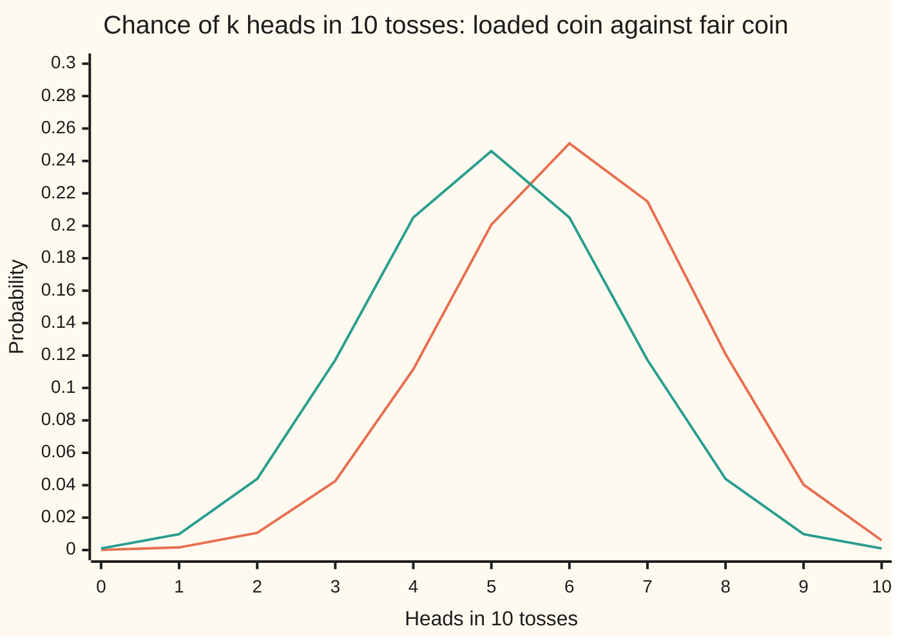
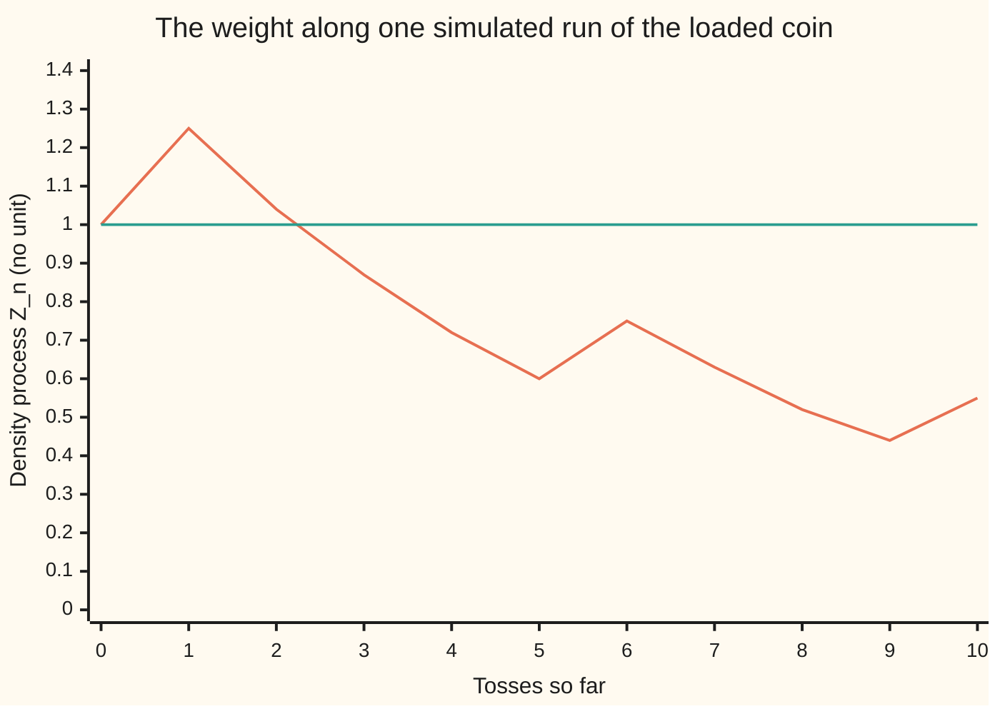
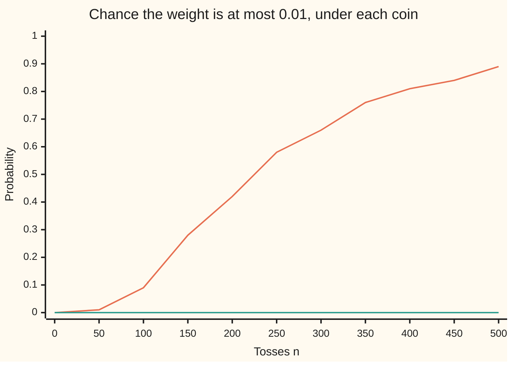

# Changing the measure: a density that reweights every path

[Syllabus](../../../SYLLABUS.md) → [Stochastic processes and calculus](../../../SYLLABUS.md#w11) → [Changing Measure](../../../SYLLABUS.md#w11-s07) → Changing the measure

---

## General Overview

A coin lands heads 6 times in 10. A game is played on it for ten tosses: each head wins $1, each tail loses $1. With this coin the game pays $2 on average. Someone wants to work out averages as if the coin were fair, without touching a single toss.

That can be done by reweighting. Take one run of ten tosses, say tail, four heads, tail, three heads, tail. The loaded coin gives that run a chance of 0.00179159. A fair coin gives every run the same chance, 1 in 1,024, which is 0.00097656. The fair chance over the loaded chance, 0.545081, is the run's **weight**. Average anything over loaded-coin runs, each counted with its own weight, and the answer is the fair-coin average. The game's weighted average is $0, not $2.

The weight is built one toss at a time. A head multiplies it by 5/6, the fair chance 0.5 over the loaded chance 0.6. A tail multiplies it by 5/4, which is 0.5 over 0.4. The running product after each toss is the **density process**, the subject of this card. On average each factor is exactly 1, so the running product is a fair game under the loaded coin: a martingale. Wing 10 changed measure with one density on one sigma-algebra ([The Radon-Nikodym derivative](../../10-Measure%20and%20integration/08-Densities%20and%20Changing%20Measure/04-radon-nikodym-derivative.md)). Here the density becomes a process in time, and that brings in conditional averages, Bayes' rule and a failure over an infinite horizon.

**A positive martingale with mean 1 reweights every path of a process into a second, equivalent probability, and every average under the new probability is the old average of the quantity times the density.**

**What kind of fact this is:** a definition (the reweighted measure and its density process) and a theorem about it, proved in full for discrete time on this card in Why it works; the continuous-time version is stated with its key steps and a named source.

### The picture: two coins, one set of runs



The line peaking at 6 heads is the loaded coin. The symmetric line peaking at 5 is the fair coin. Both are computed exactly by the code. The runs are the same 1,024 sequences in both; only the chance placed on each one differs. A run with k heads has weight (5/6)^k (5/4)^(10 − k): 9.3132 for no heads, 0.8176 for six, 0.1615 for ten. Weights above 1 lift the runs the loaded coin under-rates; weights below 1 shrink the ones it over-rates.

---

## The formula

Notation first. The loaded coin's probability, the chance it puts on every run, is $P$, as in wing 09. A second probability on the same runs is written $Q$, read "the measure Q"; here it is the fair coin. An average taken with $Q$'s chances is written $E^Q$, read "the average under Q"; $E^P$ is the average under the loaded coin. The filtration $\mathcal{F}_n$ is what is known after $n$ tosses: the first $n$ results ([Filtrations](../01-Random%20Walks%20and%20Filtrations/03-filtrations-and-information.md)). $H_n$ counts heads in the first $n$ tosses and $S_n = 2H_n - n$ is the money won so far.

The density process, after $n$ tosses:

$$Z_n = \Big(\frac{q}{p}\Big)^{H_n} \Big(\frac{1-q}{1-p}\Big)^{n - H_n}, \qquad Z_0 = 1.$$

**Read it aloud:** the weight after n tosses is the fair-to-loaded ratio of chances, multiplied once for every toss so far.

The new measure is defined from the weight at the horizon $N = 10$, and three facts follow:

$$Q(A) = E^P\big[Z_N \mathbf{1}_A\big], \qquad E^Q[X] = E^P[X Z_N], \qquad Z_n = E^P[Z_N \mid \mathcal{F}_n].$$

**Read it aloud:** the new chance of an event is the old average of the weight over the runs where it happens; any new average is the old average of the quantity times the weight; and the best forecast of the final weight, after n tosses, is the weight so far.

The fourth fact is Bayes' rule for a conditional average under the new measure:

$$E^Q[X \mid \mathcal{F}_n] = \frac{E^P[X Z_N \mid \mathcal{F}_n]}{Z_n}.$$

**Read it aloud:** to forecast under Q from partway through, forecast quantity-times-weight under P and divide by the weight already earned.

| Symbol | Plain meaning | In our example | Push it up and the answer… |
| --- | --- | --- | --- |
| $P$ | the original measure: the loaded coin's chance for every run | heads 0.6 per toss | — |
| $Q$, $Q_N$ | the second measure, built by reweighting; the one built from the weight at horizon $N$ | the fair coin | — |
| $E^P$, $E^Q$ | averages taken with each measure's chances | $E^P$ of winnings 2, $E^Q$ 0 | — |
| $p$, $q$ | chance of heads under $P$ and under $Q$ | 0.6 and 0.5 | raise $q$ towards $p$: the heads factor $q/p$ grows to 1 |
| $n$, $N$ | tosses so far; the horizon | $N$ = 10 | larger $N$: weights spread wider |
| $\mathcal{F}_n$ | what is known after $n$ tosses | the first $n$ results | — |
| $H_n$, $H$, $k$ | heads among the first $n$ tosses; heads in Step 6; a heads count | 7 of 10 on the traced run | each extra head multiplies $Z$ by 5/6 |
| $S_n$, $S_{10}$ | winnings in dollars after $n$ tosses, $2H_n - n$ | 4 after the traced run | — |
| $Z_n$, $Z_N$, $Z_4$ | the density process: the running weight; at the horizon; after four tosses | 0.545081 after the traced run | — |
| $X$, $Y_n$, $V$, $A$, $\mathbf{1}_A$ | a quantity fixed by the ten tosses; a process known at each toss; a forecast built in the proof; an event; its indicator, 1 when $A$ happens and 0 otherwise | winnings; 7 or more heads | — |
| $h$, $\mu$, $\theta$ | Step 6 only: rounds between tosses; the coin's lean per round; the fixed number in the exponential martingale $\exp(\theta W_t - \tfrac12\theta^2 t)$ | $h$ from 1 down to 1/1024; $\mu$ = 0.2; $\theta = -\mu$ = −0.2 | smaller $h$: closer to Brownian motion |
| $W_t$, $t$, $T$, $x$ | Step 6 only: Brownian motion; time in rounds; the horizon in rounds of the continuous-time statement; the winnings after time $t$ | $t$ = 10 rounds, $x$ = 2 | — |

The heads factor is $q/p = 5/6$ and the tails factor is $(1-q)/(1-p) = 5/4$. Under $P$ they average $0.6 \times 5/6 + 0.4 \times 5/4 = 0.5 + 0.5 = 1$, and that one line is why everything else works.

### When it holds

- **The weight is positive on every run.** Then $P$ and $Q$ are **equivalent**: they agree on which events are impossible. A weight of 0 on some runs still gives a measure, but $Q$ then rules out runs $P$ allows, and nothing can be reweighted back.
- **The weight averages 1.** Otherwise $Q$ is not a probability: the upside-down ratio, 6/5 on heads and 4/5 on tails, averages 1.480244 over ten tosses.
- **A finite horizon.** Over infinitely many tosses a density exists only if the weights settle to a limit that still averages 1. For these two coins the limit is 0, and no density exists; see What breaks.
- **Bayes' rule needs the division by $Z_n$.** Without it a conditional average under $Q$ comes out scaled by the weight already earned.

---

## Why it works

Every step below is a finite sum over 1,024 runs. The folded proof at the end does the same steps for any probability space, using wing 10's tools by name.

### Step 0: reweight the runs, do not edit them

A measure is a list of chances, one per run. Two coins on the same ten tosses are two lists over the same 1,024 runs. To turn the first list into the second, multiply each entry by the ratio of the two: $Q(\text{run}) = P(\text{run}) \times Z_N(\text{run})$. That is the whole idea. The runs, and every quantity computed from a run, stay exactly as they were. Only how much each run counts in an average changes. On one run this is the likelihood ratio of [Densities and likelihood ratios](../../10-Measure%20and%20integration/08-Densities%20and%20Changing%20Measure/06-densities-and-likelihood-ratios.md).

### Step 1: the weight averages 1, so Q is a probability

The weight is a product of ten factors, one per toss. Under $P$ the tosses are independent, so the average of a product of their factors is the product of their averages. Each factor averages 1. So $E^P[Z_N] = 1$ and $Q$ gives total chance 1 to all runs together. Each run's weight is positive, so $Q$ puts positive chance exactly where $P$ does: the two are equivalent.

### Step 2: every average transforms by the weight

For one run, $Q(\text{run}) = P(\text{run}) Z_N(\text{run})$. Multiply by any quantity $X$ evaluated on that run and add over all runs:

$$E^Q[X] = \sum_{\text{runs}} X \, Q(\text{run}) = \sum_{\text{runs}} X Z_N \, P(\text{run}) = E^P[X Z_N].$$

With $X = \mathbf{1}_A$ this is the definition of $Q(A)$. With $X$ the winnings it says the weighted loaded-coin average of $S_{10}$ is the fair-coin average, $10 \times (2 \times 0.5 - 1) = 0$.

### Step 3: the weight seen partway through is the density on the past

After four tosses the last six are still unknown. Average the final weight over them, under $P$, holding the first four fixed. The last six factors are independent of the first four, and each averages 1, so what is left is the product of the first four factors:

$$E^P[Z_N \mid \mathcal{F}_n] = Z_n.$$

The code checks this exactly, in fractions, after every one of the 2,047 possible beginnings of zero to ten tosses. Two consequences follow. First, $Z_n$ is a martingale under $P$ ([Martingales](../02-Martingales/01-martingales.md)), by the tower property: $E^P[Z_{n+1} \mid \mathcal{F}_n] = E^P[E^P[Z_N \mid \mathcal{F}_{n+1}] \mid \mathcal{F}_n] = Z_n$. Second, $Z_n$ is itself the Radon-Nikodym derivative of $Q$ against $P$ on events decided by the first $n$ tosses. For such an event $A$, $Q(A) = E^P[Z_N \mathbf{1}_A] = E^P[E^P[Z_N \mid \mathcal{F}_n] \mathbf{1}_A] = E^P[Z_n \mathbf{1}_A]$.

The converse is the definition this shelf runs on. Start from any positive $P$-martingale $Z_n$ with $Z_0 = 1$. Define $Q_N(A) = E^P[Z_N \mathbf{1}_A]$ for each horizon $N$. The martingale property makes these agree: an event decided by toss 4 gets the same chance whichever later horizon builds the measure. **A density process is a positive martingale with mean 1, and it defines one measure that is consistent across every finite horizon.**

### Step 4: Bayes' rule for forecasts under Q

Partway through, a forecast under $Q$ must use $Q$'s chances for the remaining tosses, given the ones already seen. Given the beginning, $Q$'s chance of a continuation is $Q(\text{whole run})$ divided by $Q(\text{beginning})$. Write both as $P$ times weight: $Q(\text{whole}) = P(\text{whole}) Z_N$ and $Q(\text{beginning}) = P(\text{beginning}) Z_n$. Dividing gives $P$'s chance of the continuation times $Z_N / Z_n$. Average $X$ against that:

$$E^Q[X \mid \mathcal{F}_n] = \frac{E^P[X Z_N \mid \mathcal{F}_n]}{Z_n}.$$

After four heads, $Z_4 = (5/6)^4 = 0.482253$. The code averages winnings times weight over the 64 possible endings and gets 1.929012. Dividing by $Z_4$ gives 4.000000. That is the fair-coin forecast: 4 dollars already won, and six fair tosses add nothing on average.

### Step 5: a fair game under Q is a P-martingale after multiplying by Z

Take any process $Y_n$ decided by the first $n$ tosses. By Step 4 with $X = Y_{n+1}$, and Step 3 to put $Z_{n+1}$ in place of $Z_N$, the forecast $E^Q[Y_{n+1} \mid \mathcal{F}_n]$ equals $E^P[Y_{n+1} Z_{n+1} \mid \mathcal{F}_n] / Z_n$. So $Y_n$ is a martingale under $Q$ exactly when $Y_n Z_n$ is a martingale under $P$. The winnings $S_n$ are fair under the fair coin, so $S_n Z_n$ must be a fair game under the loaded coin. The code confirms it exactly on all 2,047 beginnings. Meanwhile $S_n$ alone is not fair under $P$: after four heads its forecast for toss 10 exceeds today's 4 dollars by 1.200000, six tosses times the loaded coin's average win of $0.2 per toss.

<details>
<summary>Detailed proof: the five facts on any probability space</summary>

Let $(\Omega, \mathcal{F}, P)$ be a probability space with a filtration $\mathcal{F}_0 \subset \dots \subset \mathcal{F}_N \subset \mathcal{F}$, and let $Z_N$ be $\mathcal{F}_N$-measurable, positive almost surely, with $E^P[Z_N] = 1$. Define $Q(A) = E^P[Z_N \mathbf{1}_A]$ for $A$ in $\mathcal{F}$.

**Q is a probability equivalent to P.** $Q(\Omega) = E^P[Z_N] = 1$ and $Q(A) \ge 0$. For disjoint $A_1, A_2, \dots$ the indicator of their union is the increasing limit of the partial sums of their indicators, so monotone convergence gives countable additivity. If $P(A) = 0$ then $Z_N \mathbf{1}_A$ is 0 almost surely and $Q(A) = 0$. If $Q(A) = 0$ then $Z_N \mathbf{1}_A = 0$ almost surely; since $Z_N > 0$, $\mathbf{1}_A = 0$ almost surely and $P(A) = 0$.

**$E^Q[X] = E^P[X Z_N]$ for every $X \ge 0$, and for every $X$ with $E^Q|X|$ finite.** For an indicator this is the definition. Both sides are linear, so it holds for simple functions. A nonnegative $X$ is the increasing limit of simple functions; apply monotone convergence on both sides. A general $X$ is its positive part minus its negative part.

**$Z_n = E^P[Z_N \mid \mathcal{F}_n]$ is the density of $Q$ on $\mathcal{F}_n$, and a martingale.** For $A$ in $\mathcal{F}_n$, the defining property of conditional expectation gives $E^P[Z_n \mathbf{1}_A] = E^P[Z_N \mathbf{1}_A] = Q(A)$. By uniqueness of the Radon-Nikodym derivative, $Z_n$ is $dQ/dP$ on $\mathcal{F}_n$. The tower property gives $E^P[Z_{n+1} \mid \mathcal{F}_n] = Z_n$. Positivity of $Z_N$ makes $Z_n$ positive almost surely.

**Bayes' rule.** Let $X$ be integrable under $Q$, and let $A$ be in $\mathcal{F}_n$. Put $V = E^P[X Z_N \mid \mathcal{F}_n] / Z_n$, which is $\mathcal{F}_n$-measurable. Then $E^Q[V \mathbf{1}_A] = E^P[V Z_n \mathbf{1}_A]$, by the density on $\mathcal{F}_n$, which equals $E^P[E^P[X Z_N \mid \mathcal{F}_n] \mathbf{1}_A] = E^P[X Z_N \mathbf{1}_A] = E^Q[X \mathbf{1}_A]$. So $V$ has the defining property of $E^Q[X \mid \mathcal{F}_n]$, and by uniqueness they are equal almost surely.

**Martingales.** For an adapted $Y_n$ with $Y_{n+1}$ integrable under $Q$, Bayes' rule with the density $Z_{n+1}$ on $\mathcal{F}_{n+1}$ gives $E^Q[Y_{n+1} \mid \mathcal{F}_n] = E^P[Y_{n+1} Z_{n+1} \mid \mathcal{F}_n] / Z_n$. This equals $Y_n$ exactly when $E^P[Y_{n+1} Z_{n+1} \mid \mathcal{F}_n] = Y_n Z_n$.

**The converse.** If $Z$ is a positive $P$-martingale with $Z_0 = 1$, then $E^P[Z_N] = 1$ for each $N$ and the measures $Q_N$ agree on $\mathcal{F}_M$ for $M \le N$, since $E^P[Z_N \mathbf{1}_A] = E^P[Z_M \mathbf{1}_A]$ for $A$ in $\mathcal{F}_M$. Whether one measure exists on all of $\mathcal{F}_\infty$ with these restrictions and a density is a separate question, settled for this coin in What breaks.

</details>

### Step 6: speed the coin up and the density becomes the exponential martingale

Measure time in rounds, one round being the gap between tosses of the original coin. Now toss every $h$ rounds, move the winnings up or down by $\sqrt{h}$, and lean the coin so heads has chance $(1 + \mu\sqrt{h})/2$, with $\mu = 0.2$. With $h = 1$ this is the original coin: heads 0.6. As $h$ shrinks, the winnings path becomes Brownian motion with drift $\mu$ per round ([Brownian motion](../05-Brownian%20Motion/01-brownian-motion.md)). The fair coin becomes driftless Brownian motion.

The density for this coin, at winnings $x$ after time $t$, with $H$ heads in $n = t/h$ tosses, takes logarithms to a sum: $-H \ln(1 + \mu\sqrt{h}) - (n - H)\ln(1 - \mu\sqrt{h})$. Expand each logarithm. The first-order terms add to $-\mu x$. The second-order terms add to $+\tfrac12\mu^2 t$, because there are $t/h$ tosses and each contributes $\tfrac12\mu^2 h$. Everything after that shrinks in proportion to $h$. Writing the winnings as $x = W_t + \mu t$, with $W_t$ the driftless part under $P$:

$$Z_t = \exp\big(-\mu x + \tfrac12\mu^2 t\big) = \exp\big(-\mu W_t - \tfrac12\mu^2 t\big).$$

That is the exponential martingale of [Brownian martingales](../05-Brownian%20Motion/06-brownian-martingales-and-exponential-martingale.md), which writes it $\exp(\theta W_t - \tfrac12\theta^2 t)$ for a fixed number $\theta$; here $\theta = -\mu$. The code compares the coin's exact density with this limit at $x = 2$ and $t = 10$ rounds for six step sizes. The error falls from 0.0011087 at $h = 1$ to 0.0000011 at $h = 1/1024$, about four-fold each time $h$ is quartered.

This card proves the change of measure for the coins and shows the limit numerically. It does not prove the continuous-time statement. That statement, with $W_t$ a $P$-Brownian motion and $Z_T = \exp(-\mu W_T - \tfrac12\mu^2 T)$ defining $Q$ at a horizon of $T$ rounds, is that $W_t + \mu t$ is a $Q$-Brownian motion on $[0, T]$. It is Girsanov's theorem, proved in [Girsanov](02-girsanov-theorem.md) and in Karatzas and Shreve, section 3.5. No Ito calculus was used here: the step above is ordinary Taylor expansion of a logarithm, toss by toss.

---

## Worked numbers, by hand

The traced run from the overview: tail, four heads, tail, three heads, tail. Seven heads, three tails.

| Step | Arithmetic | Value |
| --- | --- | --- |
| loaded-coin chance of the run | 0.6^7 × 0.4^3 | 0.00179159 |
| fair-coin chance of the run | 0.5^10 = 1/1024 | 0.00097656 |
| weight, toss by toss | (5/6)^7 × (5/4)^3 | 0.545081 |
| check: chance times weight | 0.00179159 × 0.545081 | 0.00097656 |
| each factor's average under P | 0.6 × 5/6 + 0.4 × 5/4 | 1 |
| E^Q of winnings, from the fair coin | 10 × (2 × 0.5 − 1) | **0** |
| fair chance of 7 or more heads | 176 of the 1,024 runs, counted | **176/1024 = 0.171875** |
| loaded chance of the same event | sum of binomial terms | 0.382281 |
| weight after four heads | (5/6)^4 | 0.482253 |
| E^P of winnings × weight, given four heads | 64 endings, averaged | 1.929012 |
| Bayes: divide by the weight so far | 1.929012 / 0.482253 | **4.000000** |

Counted with its weights, the loaded coin gives the fair game's answers: the bet is worth nothing on average, seven or more heads is a 17% event rather than 38%, and after four straight heads the fair forecast is the $4 already in hand.

### What breaks if you drop a piece

| Mistake | Comes out at | What went wrong |
| --- | --- | --- |
| Average without the weights | winnings 2.000000, not 0 | That is the loaded coin's average, not the fair coin's |
| Ratio upside down, 6/5 on heads and 4/5 on tails | weights average 1.480244, not 1 | That ratio is $P$ over $Q$; with $P$'s chances it is no probability |
| Bayes' rule without dividing by $Z_4$ | 1.929012, not 4 | The weight already earned scales the answer |
| An infinite horizon | $P(Z_{500} \le 0.01) = 0.8908$ while $Q$ gives it 0.0005 | The weight sinks to 0 along almost every loaded run; no density exists in the limit |

The code prints all four. The last row is the subject of the next section.

---

## How the density moves

Every $Z_n$ averages exactly 1 under the loaded coin. Yet along a typical loaded run the weight falls. Both are true at once.

The traced run is the first one the code's simulation draws, with seed 20260930. Its weight, toss by toss:

| Toss | Result | Factor | $Z_n$ |
| --- | --- | --- | --- |
| 0 | — | — | 1.0000 |
| 1 | T | 1.2500 | 1.2500 |
| 2 | H | 0.8333 | 1.0417 |
| 3 | H | 0.8333 | 0.8681 |
| 4 | H | 0.8333 | 0.7234 |
| 5 | H | 0.8333 | 0.6028 |
| 6 | T | 1.2500 | 0.7535 |
| 7 | H | 0.8333 | 0.6279 |
| 8 | H | 0.8333 | 0.5233 |
| 9 | H | 0.8333 | 0.4361 |
| 10 | T | 1.2500 | 0.5451 |



The falling line is one sample run, a single draw, plotted to two decimals from the code's `figure,` line. The flat line at 1 is the average of $Z_n$ over all runs, exactly 1 at every toss, computed by enumeration on the code's `figure, E^P[Z_n]` line. Heads come more often than the fair coin expects, and each head shrinks the weight.

The mean stays at 1 because rare runs carry huge weights: a run of ten tails has weight 9.3132. Per toss, the logarithm of the weight changes by $\ln(5/6)$ or $\ln(5/4)$, and under $P$ that averages $0.6 \ln(5/6) + 0.4 \ln(5/4) = -0.020136$ per toss. By the law of large numbers the logarithm drifts down without limit, and the weight goes to 0 along almost every loaded run. The chart below shows the chance that the weight has fallen to 0.01 or less, computed exactly from the binomial law.



Both lines are plotted to two decimals from the code's `figure,` lines. The rising line is the loaded coin's chance; by 500 tosses it is 0.8908. The line along zero is the fair coin's chance of the same event, at most 0.0014 at any plotted point and never above 0.01 times the loaded chance, since $Q(A) = E^P[Z_n \mathbf{1}_A] \le 0.01\, P(A)$ when $Z_n \le 0.01$ on $A$. The weight is a martingale with mean 1 at every finite time, but its limit is 0. Over infinitely many tosses the loaded coin is sure the heads frequency tends to 0.6; the fair coin is sure it tends to 0.5. Each measure gives probability 1 to an event the other gives probability 0: they are **singular**, the opposite of equivalent. This is Kakutani's theorem for infinite products of coins. The density process exists on every finite horizon and fails only at the end of time.

---

## Code, from first principles, and it actually runs

The script takes three roads. The fair-coin formula and a binomial count give the answers directly under $Q$. Exact enumeration in fractions weights every one of the 1,024 loaded-coin runs and checks the martingale and Bayes facts on all 2,047 beginnings. A seeded simulation draws 200,000 runs of the loaded coin from a SplitMix64 generator written out in both languages, carries each run's weight in ordinary floating point, and prints every estimate with its standard error. The script also prints the Brownian limit at six step sizes and the infinite-horizon failure.

### Python

```python
# Changing the measure -- the check behind the card.  Imports: math and
# fractions, neither of which knows the answer.  Ten tosses of a coin that lands
# heads 0.6 of the time (P), reweighted path by path into a fair coin (Q).
# Roads: the fair-coin formula, exact enumeration of all 1,024 paths in
# fractions, and a seeded simulation of the loaded coin carrying its weights.
import math
from fractions import Fraction as F

N, P_H, Q_H = 10, F(3, 5), F(1, 2)
UP, DOWN = Q_H / P_H, (1 - Q_H) / (1 - P_H)             # 5/6 on heads, 5/4 on tails

def prob(path, h):                                      # chance of a 0/1 path, heads chance h
    out = F(1)
    for x in path:
        out *= h if x else 1 - h
    return out

def dens(path):                                         # the density process after len(path) tosses
    k = sum(path)
    return UP ** k * DOWN ** (len(path) - k)

def paths(n): return [[(i >> j) & 1 for j in range(n)] for i in range(2 ** n)]

def wins(path): return 2 * sum(path) - len(path)        # $1 on heads each toss: heads minus tails

def big(path): return 1 if sum(path) >= 7 else 0       # the event: at least 7 heads

def cond(prefix, f):                                    # E^P[f(whole path) | the first tosses]
    return sum(prob(s, P_H) * f(prefix + s) for s in paths(N - len(prefix)))

def sz(w): return wins(w) * dens(w)                     # winnings times weight

ALL = paths(N)
q_mean = N * (2 * Q_H - 1)                              # road 1: the fair coin, read directly
q_big = F(sum(math.comb(N, k) for k in range(7, N + 1)), 2 ** N)
e_z = sum(prob(w, P_H) * dens(w) for w in ALL)          # road 2: every path, weighted by Z
e_sz = sum(prob(w, P_H) * sz(w) for w in ALL)
e_bz = sum(prob(w, P_H) * dens(w) * big(w) for w in ALL)
p_mean = sum(prob(w, P_H) * wins(w) for w in ALL)
p_big = sum(prob(w, P_H) * big(w) for w in ALL)
flip = sum(prob(w, P_H) / dens(w) for w in ALL)         # mistake: the ratio upside down
pres = [pre for n in range(N + 1) for pre in paths(n)]
mart = all(cond(pre, dens) == dens(pre) for pre in pres)
smart = all(cond(pre, sz) == sz(pre) for pre in pres)
hhhh, path1 = [1, 1, 1, 1], [0, 1, 1, 1, 1, 0, 1, 1, 1, 0]
raw = cond(hhhh, sz)
bayes, drift = raw / dens(hhhh), cond(hhhh, wins) - wins(hhhh)

MASK, state = (1 << 64) - 1, 20260930                   # road 3: SplitMix64, seed 20260930
def unif():
    global state
    state = (state + 0x9E3779B97F4A7C15) & MASK
    z = state
    z = ((z ^ (z >> 30)) * 0xBF58476D1CE4E5B9) & MASK
    z = ((z ^ (z >> 27)) * 0x94D049BB133111EB) & MASK
    return ((z ^ (z >> 31)) >> 11) / 2.0 ** 53

M, sums, first = 200000, [0.0] * 8, []                  # sums: Z, Z^2, SZ, (SZ)^2, Z;7+, its square, S, S^2
for i in range(M):
    z, s, h, trace = 1.0, 0, 0, [(0, '-', 1.0, 1.0)]
    for n in range(1, N + 1):
        head = unif() < 0.6
        f = 5 / 6 if head else 5 / 4
        z, s, h = z * f, s + (1 if head else -1), h + head
        trace.append((n, 'H' if head else 'T', f, z))
    if i == 0:
        first = trace
    b = 1.0 if h >= 7 else 0.0
    for j, v in enumerate((z, z * z, s * z, (s * z) * (s * z), z * b, z * z * b, s, s * s)):
        sums[j] += v
def est(j):                                             # mean and standard error
    m = sums[j] / M
    return m, math.sqrt((sums[j + 1] / M - m * m) / (M - 1))
(sim_z, se_z), (sim_sz, se_sz), (sim_bz, se_bz), (sim_s, se_s) = est(0), est(2), est(4), est(6)

MU, T_END, X_END, bridge = 0.2, 10, 2, []               # toss every h, step sqrt(h), heads (1+MU sqrt h)/2
for k in range(6):
    h, n = 4.0 ** -k, 10 * 4 ** k
    heads, a = (n + X_END * 2 ** k) // 2, MU * math.sqrt(h)
    zd = math.exp(-heads * math.log(1 + a) - (n - heads) * math.log(1 - a))
    bridge.append((h, n, zd, math.exp(-MU * X_END + 0.5 * MU * MU * T_END)))

lf, far = [0.0], []                                     # log factorials; P and Q of {Z_n <= 0.01}
for j in range(1, 501):
    lf.append(lf[-1] + math.log(j))
for n in range(0, 501, 50):
    pz = qz = 0.0
    for k in range(n + 1):
        if k * math.log(5 / 6) + (n - k) * math.log(5 / 4) <= math.log(0.01):
            c = lf[n] - lf[k] - lf[n - k]
            pz += math.exp(c + k * math.log(0.6) + (n - k) * math.log(0.4))
            qz += math.exp(c + n * math.log(0.5))
    far.append((n, pz, qz))

def row(label, vals):
    print(f"{label:<17}" + " ".join(vals))
print(f"loaded coin P: heads 0.6; fair coin Q: heads 0.5; {N} tosses, {len(ALL)} paths")
print(f"weights per toss: heads {UP} = {float(UP):.6f}, tails {DOWN} = {float(DOWN):.6f}; "
      f"log-weight per toss averages {0.6 * math.log(5 / 6) + 0.4 * math.log(5 / 4):.6f} under P")
row("heads count k", [f"{k:6d}" for k in range(N + 1)])
row("P-law of k", [f"{float(math.comb(N, k) * P_H ** k * (1 - P_H) ** (N - k)):.4f}" for k in range(N + 1)])
row("Q-law of k", [f"{float(math.comb(N, k) * Q_H ** N):.4f}" for k in range(N + 1)])
row("Z_10 at k heads", [f"{float(UP ** k * DOWN ** (N - k)):.4f}" for k in range(N + 1)])
print(f"path 1, THHHHTHHHT: P {float(prob(path1, P_H)):.8f}, Q {float(prob(path1, Q_H)):.8f}, "
      f"Z {float(dens(path1)):.6f}, P x Z {float(prob(path1, P_H) * dens(path1)):.8f}")
print(f"E^P[Z_10] by enumeration: {e_z}")
print(f"E^Q[S_10]: fair formula {q_mean}; E^P[S_10 Z_10] enumerated {e_sz}; unweighted E^P[S_10] {float(p_mean):.6f}")
print(f"Q(7+ heads): counted {q_big * 2 ** N}/{2 ** N} = {float(q_big):.6f}; E^P[Z_10; 7+] enumerated {float(e_bz):.6f}; P(7+) {float(p_big):.6f}")
print(f"E^P[Z_10 | first n tosses] = Z_n for all {len(pres)} prefixes: {'yes' if mart else 'no'}")
print(f"S_n Z_n a P-martingale on all {len(pres)} prefixes: {'yes' if smart else 'no'}")
print(f"after HHHH: Z_4 = {float(dens(hhhh)):.6f}; E^P[S_10 Z_10 | HHHH] over {2 ** (N - 4)} endings = {float(raw):.6f}; "
      f"divided by Z_4 = {float(bayes):.6f}")
print(f"after HHHH: E^P[S_10 | HHHH] - S_4 = {float(drift):.6f} (S is not a P-martingale)")
print(f"mistake, ratio upside down: weights average {float(flip):.6f}, formula (26/25)^10 = {float(F(26, 25) ** 10):.6f}")
for n, c, f, z in first:
    print(f"path 1, toss {n:2d}: {c}  factor {f:.4f}  Z_n {z:.4f}")
print(f"simulated, M = {M}, seed 20260930:")
print(f"  E^P[Z_10]        {sim_z:.4f} +- {se_z:.4f}  (exact 1)")
print(f"  E^P[S_10 Z_10]   {sim_sz:.4f} +- {se_sz:.4f}  (exact 0)")
print(f"  E^P[Z_10; 7+]    {sim_bz:.4f} +- {se_bz:.4f}  (exact {float(q_big):.6f})")
print(f"  unweighted S_10  {sim_s:.4f} +- {se_s:.4f}  (exact 2)")
for h, n, zd, zc in bridge:
    print(f"bridge h = {h:.6f}, {n:5d} tosses: Z discrete {zd:.6f}, limit {zc:.6f}, error {abs(zd - zc):.7f}")
row("n", [f"{n:6d}" for n, _, _ in far])
row("P(Z_n <= 0.01)", [f"{p:.4f}" for _, p, _ in far])
row("Q(Z_n <= 0.01)", [f"{q:.4f}" for _, _, q in far])
row("figure, Z_n", [f"{z:.2f}" for *_, z in first])
row("figure, E^P[Z_n]", [str(sum(prob(w, P_H) * dens(w) for w in paths(n))) for n in range(N + 1)])
row("figure, P(<=.01)", [f"{p:.2f}" for _, p, _ in far])
row("figure, Q(<=.01)", [f"{q:.2f}" for _, _, q in far])
assert e_z == 1 and min(dens(w) for w in ALL) > 0                       # a probability, equivalent
assert e_sz == q_mean and p_mean == N * (2 * P_H - 1)                  # weighted P average = Q formula
assert e_bz == q_big                                                    # weighted P chance = Q count
assert mart and smart                                                   # every prefix, exactly
assert bayes == 4 + (N - 4) * (2 * Q_H - 1) and drift == (N - 4) * (2 * P_H - 1)  # Bayes = fair forecast
assert flip == F(26, 25) ** N                                           # upside-down weights do not average 1
assert all(abs(m - x) < 4 * e for m, e, x in ((sim_z, se_z, 1), (sim_sz, se_sz, q_mean), (sim_bz, se_bz, q_big), (sim_s, se_s, p_mean)))
assert all(abs(b[2] - b[3]) < abs(a[2] - a[3]) / 3 for a, b in zip(bridge, bridge[1:]))  # error falls about 4x per step
assert all(q <= 0.01 * p + 1e-15 for _, p, q in far) and far[-1][1] > 0.5
print("ALL CHECKS PASS")
```

**Ran 2026-10-07 on macOS, Python 3.14.6, standard library only. All checks passed. Output, pasted from the run:**

```
loaded coin P: heads 0.6; fair coin Q: heads 0.5; 10 tosses, 1024 paths
weights per toss: heads 5/6 = 0.833333, tails 5/4 = 1.250000; log-weight per toss averages -0.020136 under P
heads count k         0      1      2      3      4      5      6      7      8      9     10
P-law of k       0.0001 0.0016 0.0106 0.0425 0.1115 0.2007 0.2508 0.2150 0.1209 0.0403 0.0060
Q-law of k       0.0010 0.0098 0.0439 0.1172 0.2051 0.2461 0.2051 0.1172 0.0439 0.0098 0.0010
Z_10 at k heads  9.3132 6.2088 4.1392 2.7595 1.8396 1.2264 0.8176 0.5451 0.3634 0.2423 0.1615
path 1, THHHHTHHHT: P 0.00179159, Q 0.00097656, Z 0.545081, P x Z 0.00097656
E^P[Z_10] by enumeration: 1
E^Q[S_10]: fair formula 0; E^P[S_10 Z_10] enumerated 0; unweighted E^P[S_10] 2.000000
Q(7+ heads): counted 176/1024 = 0.171875; E^P[Z_10; 7+] enumerated 0.171875; P(7+) 0.382281
E^P[Z_10 | first n tosses] = Z_n for all 2047 prefixes: yes
S_n Z_n a P-martingale on all 2047 prefixes: yes
after HHHH: Z_4 = 0.482253; E^P[S_10 Z_10 | HHHH] over 64 endings = 1.929012; divided by Z_4 = 4.000000
after HHHH: E^P[S_10 | HHHH] - S_4 = 1.200000 (S is not a P-martingale)
mistake, ratio upside down: weights average 1.480244, formula (26/25)^10 = 1.480244
path 1, toss  0: -  factor 1.0000  Z_n 1.0000
path 1, toss  1: T  factor 1.2500  Z_n 1.2500
path 1, toss  2: H  factor 0.8333  Z_n 1.0417
path 1, toss  3: H  factor 0.8333  Z_n 0.8681
path 1, toss  4: H  factor 0.8333  Z_n 0.7234
path 1, toss  5: H  factor 0.8333  Z_n 0.6028
path 1, toss  6: T  factor 1.2500  Z_n 0.7535
path 1, toss  7: H  factor 0.8333  Z_n 0.6279
path 1, toss  8: H  factor 0.8333  Z_n 0.5233
path 1, toss  9: H  factor 0.8333  Z_n 0.4361
path 1, toss 10: T  factor 1.2500  Z_n 0.5451
simulated, M = 200000, seed 20260930:
  E^P[Z_10]        1.0011 +- 0.0016  (exact 1)
  E^P[S_10 Z_10]   -0.0059 +- 0.0102  (exact 0)
  E^P[Z_10; 7+]    0.1713 +- 0.0005  (exact 0.171875)
  unweighted S_10  1.9929 +- 0.0069  (exact 2)
bridge h = 1.000000,    10 tosses: Z discrete 0.817622, limit 0.818731, error 0.0011087
bridge h = 0.250000,    40 tosses: Z discrete 0.818457, limit 0.818731, error 0.0002740
bridge h = 0.062500,   160 tosses: Z discrete 0.818662, limit 0.818731, error 0.0000683
bridge h = 0.015625,   640 tosses: Z discrete 0.818714, limit 0.818731, error 0.0000171
bridge h = 0.003906,  2560 tosses: Z discrete 0.818726, limit 0.818731, error 0.0000043
bridge h = 0.000977, 10240 tosses: Z discrete 0.818730, limit 0.818731, error 0.0000011
n                     0     50    100    150    200    250    300    350    400    450    500
P(Z_n <= 0.01)   0.0000 0.0057 0.0913 0.2811 0.4161 0.5784 0.6612 0.7614 0.8074 0.8438 0.8908
Q(Z_n <= 0.01)   0.0000 0.0000 0.0004 0.0012 0.0011 0.0014 0.0011 0.0011 0.0008 0.0006 0.0005
figure, Z_n      1.00 1.25 1.04 0.87 0.72 0.60 0.75 0.63 0.52 0.44 0.55
figure, E^P[Z_n] 1 1 1 1 1 1 1 1 1 1 1
figure, P(<=.01) 0.00 0.01 0.09 0.28 0.42 0.58 0.66 0.76 0.81 0.84 0.89
figure, Q(<=.01) 0.00 0.00 0.00 0.00 0.00 0.00 0.00 0.00 0.00 0.00 0.00
ALL CHECKS PASS
```

### Rust

Same numbers, same labels, built with `rustc --edition 2021 -O`. The exact fractions are a small type written out at the top.

```rust
// Changing the measure -- the same check as the Python, in Rust.  No crates.
// Ten tosses of a coin that lands heads 0.6 of the time (P), reweighted path
// by path into a fair coin (Q).  Roads: the fair-coin formula, exact
// enumeration of all 1,024 paths in fractions (written out below), and a
// seeded simulation of the loaded coin carrying its weights.
use std::ops::{Add, Div, Mul, Sub};

#[derive(Clone, Copy, PartialEq)]
struct R { n: i128, d: i128 }                       // an exact fraction n/d, kept in lowest terms
fn gcd(a: i128, b: i128) -> i128 { if b == 0 { a.abs() } else { gcd(b, a % b) } }
fn r(n: i128, d: i128) -> R {
    let g = gcd(n, d).max(1);
    let s = if d < 0 { -1 } else { 1 };
    R { n: s * n / g, d: s * d / g }
}
impl Add for R { type Output = R; fn add(self, o: R) -> R { let g = gcd(self.d, o.d); r(self.n * (o.d / g) + o.n * (self.d / g), self.d / g * o.d) } }
impl Sub for R { type Output = R; fn sub(self, o: R) -> R { self + r(-o.n, o.d) } }
impl Mul for R { type Output = R; fn mul(self, o: R) -> R { let (a, b) = (r(self.n, o.d), r(o.n, self.d)); R { n: a.n * b.n, d: a.d * b.d } } }
impl Div for R { type Output = R; fn div(self, o: R) -> R { self * r(o.d, o.n) } }
impl R { fn f(self) -> f64 { self.n as f64 / self.d as f64 } }
impl std::fmt::Display for R {
    fn fmt(&self, w: &mut std::fmt::Formatter) -> std::fmt::Result {
        if self.d == 1 { write!(w, "{}", self.n) } else { write!(w, "{}/{}", self.n, self.d) }
    }
}
fn pw(x: R, k: usize) -> R { (0..k).fold(r(1, 1), |a, _| a * x) }
fn comb(n: usize, k: usize) -> i128 { (0..k).fold(1i128, |a, j| a * (n - j) as i128 / (j + 1) as i128) }

const N: usize = 10;
fn ph() -> R { r(3, 5) }
fn qh() -> R { r(1, 2) }
fn up() -> R { qh() / ph() }                        // 5/6 on heads
fn down() -> R { (r(1, 1) - qh()) / (r(1, 1) - ph()) } // 5/4 on tails
fn heads(p: &[u8]) -> usize { p.iter().filter(|&&x| x == 1).count() }
fn prob(p: &[u8], h: R) -> R { p.iter().fold(r(1, 1), |a, &x| a * if x == 1 { h } else { r(1, 1) - h }) }
fn dens(p: &[u8]) -> R { pw(up(), heads(p)) * pw(down(), p.len() - heads(p)) }
fn paths(n: usize) -> Vec<Vec<u8>> { (0..1usize << n).map(|i| (0..n).map(|j| ((i >> j) & 1) as u8).collect()).collect() }
fn wins(p: &[u8]) -> R { r(2 * heads(p) as i128 - p.len() as i128, 1) }
fn big(p: &[u8]) -> R { r(if heads(p) >= 7 { 1 } else { 0 }, 1) }
fn sz(p: &[u8]) -> R { wins(p) * dens(p) }
fn cond(pre: &[u8], f: &dyn Fn(&[u8]) -> R) -> R {  // E^P[f(whole path) | the first tosses]
    paths(N - pre.len()).iter().fold(r(0, 1), |a, s| {
        let w: Vec<u8> = pre.iter().chain(s.iter()).copied().collect();
        a + prob(s, ph()) * f(&w)
    })
}
fn total(f: &dyn Fn(&[u8]) -> R) -> R { paths(N).iter().fold(r(0, 1), |a, w| a + prob(w, ph()) * f(w)) }

struct Mix(u64);                                    // SplitMix64, seed 20260930
impl Mix {
    fn unif(&mut self) -> f64 {
        self.0 = self.0.wrapping_add(0x9E3779B97F4A7C15);
        let mut z = self.0;
        z = (z ^ (z >> 30)).wrapping_mul(0xBF58476D1CE4E5B9);
        z = (z ^ (z >> 27)).wrapping_mul(0x94D049BB133111EB);
        ((z ^ (z >> 31)) >> 11) as f64 / 2f64.powi(53)
    }
}
fn row(label: &str, vals: Vec<String>) { println!("{:<17}{}", label, vals.join(" ")) }

fn main() {
    let all = paths(N);
    let q_mean = r(N as i128, 1) * (r(2, 1) * qh() - r(1, 1));          // road 1: the fair coin
    let q_big = r((7..=N).map(|k| comb(N, k)).sum::<i128>(), 1 << N);
    let e_z = total(&dens);                                              // road 2: weighted by Z
    let e_sz = total(&sz);
    let e_bz = total(&|w| dens(w) * big(w));
    let p_mean = total(&wins);
    let p_big = total(&big);
    let flip = total(&|w| r(1, 1) / dens(w));                            // mistake: upside down
    let pres: Vec<Vec<u8>> = (0..=N).flat_map(|n| paths(n)).collect();
    let mart = pres.iter().all(|p| cond(p, &dens) == dens(p));
    let smart = pres.iter().all(|p| cond(p, &sz) == sz(p));
    let (hhhh, path1): (Vec<u8>, Vec<u8>) = (vec![1, 1, 1, 1], vec![0, 1, 1, 1, 1, 0, 1, 1, 1, 0]);
    let raw = cond(&hhhh, &sz);
    let (bayes, drift) = (raw / dens(&hhhh), cond(&hhhh, &wins) - wins(&hhhh));

    let (m, mut g) = (200000usize, Mix(20260930));                       // road 3: simulation
    let (mut sums, mut first) = ([0.0f64; 8], Vec::new());
    for i in 0..m {
        let (mut z, mut s, mut h) = (1.0f64, 0i64, 0usize);
        let mut trace = vec![(0usize, '-', 1.0f64, 1.0f64)];
        for n in 1..=N {
            let head = g.unif() < 0.6;
            let f = if head { 5.0 / 6.0 } else { 5.0 / 4.0 };
            z *= f;
            s += if head { 1 } else { -1 };
            h += head as usize;
            trace.push((n, if head { 'H' } else { 'T' }, f, z));
        }
        if i == 0 { first = trace }
        let b = if h >= 7 { 1.0 } else { 0.0 };
        let sf = s as f64;
        for (j, v) in [z, z * z, sf * z, (sf * z) * (sf * z), z * b, z * z * b, sf, sf * sf].iter().enumerate() { sums[j] += v }
    }
    let mf = m as f64;
    let est = |j: usize| { let mu = sums[j] / mf; (mu, ((sums[j + 1] / mf - mu * mu) / (mf - 1.0)).sqrt()) };
    let ((sim_z, se_z), (sim_sz, se_sz), (sim_bz, se_bz), (sim_s, se_s)) = (est(0), est(2), est(4), est(6));

    let (mu, t_end, x_end) = (0.2f64, 10.0f64, 2usize);                  // toss every h, step sqrt(h)
    let mut bridge = Vec::new();
    for k in 0..6i32 {
        let (h, n) = (4f64.powi(-k), 10 * 4usize.pow(k as u32));
        let (hd, a) = ((n + x_end * 2usize.pow(k as u32)) / 2, mu * h.sqrt());
        let zd = (-(hd as f64) * (1.0 + a).ln() - (n - hd) as f64 * (1.0 - a).ln()).exp();
        bridge.push((h, n, zd, (-mu * x_end as f64 + 0.5 * mu * mu * t_end).exp()));
    }
    let mut lf = vec![0.0f64];                                           // log factorials
    for j in 1..=500 { let last = lf[j - 1]; lf.push(last + (j as f64).ln()) }
    let mut far = Vec::new();                                            // P and Q of {Z_n <= 0.01}
    for n in (0..=500usize).step_by(50) {
        let (mut pz, mut qz) = (0.0f64, 0.0f64);
        for k in 0..=n {
            if k as f64 * (5.0f64 / 6.0).ln() + (n - k) as f64 * (5.0f64 / 4.0).ln() <= 0.01f64.ln() {
                let c = lf[n] - lf[k] - lf[n - k];
                pz += (c + k as f64 * 0.6f64.ln() + (n - k) as f64 * 0.4f64.ln()).exp();
                qz += (c + n as f64 * 0.5f64.ln()).exp();
            }
        }
        far.push((n, pz, qz));
    }

    let yn = |b: bool| if b { "yes" } else { "no" };
    println!("loaded coin P: heads 0.6; fair coin Q: heads 0.5; {} tosses, {} paths", N, all.len());
    println!("weights per toss: heads {} = {:.6}, tails {} = {:.6}; log-weight per toss averages {:.6} under P",
             up(), up().f(), down(), down().f(), 0.6 * (5.0f64 / 6.0).ln() + 0.4 * (5.0f64 / 4.0).ln());
    row("heads count k", (0..=N).map(|k| format!("{:6}", k)).collect());
    row("P-law of k", (0..=N).map(|k| format!("{:.4}", (r(comb(N, k), 1) * pw(ph(), k) * pw(r(1, 1) - ph(), N - k)).f())).collect());
    row("Q-law of k", (0..=N).map(|k| format!("{:.4}", (r(comb(N, k), 1) * pw(qh(), N)).f())).collect());
    row("Z_10 at k heads", (0..=N).map(|k| format!("{:.4}", (pw(up(), k) * pw(down(), N - k)).f())).collect());
    println!("path 1, THHHHTHHHT: P {:.8}, Q {:.8}, Z {:.6}, P x Z {:.8}",
             prob(&path1, ph()).f(), prob(&path1, qh()).f(), dens(&path1).f(), (prob(&path1, ph()) * dens(&path1)).f());
    println!("E^P[Z_10] by enumeration: {}", e_z);
    println!("E^Q[S_10]: fair formula {}; E^P[S_10 Z_10] enumerated {}; unweighted E^P[S_10] {:.6}", q_mean, e_sz, p_mean.f());
    println!("Q(7+ heads): counted {}/{} = {:.6}; E^P[Z_10; 7+] enumerated {:.6}; P(7+) {:.6}",
             q_big * r(1 << N, 1), 1 << N, q_big.f(), e_bz.f(), p_big.f());
    println!("E^P[Z_10 | first n tosses] = Z_n for all {} prefixes: {}", pres.len(), yn(mart));
    println!("S_n Z_n a P-martingale on all {} prefixes: {}", pres.len(), yn(smart));
    println!("after HHHH: Z_4 = {:.6}; E^P[S_10 Z_10 | HHHH] over {} endings = {:.6}; divided by Z_4 = {:.6}",
             dens(&hhhh).f(), 1 << (N - 4), raw.f(), bayes.f());
    println!("after HHHH: E^P[S_10 | HHHH] - S_4 = {:.6} (S is not a P-martingale)", drift.f());
    println!("mistake, ratio upside down: weights average {:.6}, formula (26/25)^10 = {:.6}", flip.f(), pw(r(26, 25), N).f());
    for (n, c, f, z) in &first { println!("path 1, toss {:2}: {}  factor {:.4}  Z_n {:.4}", n, c, f, z) }
    println!("simulated, M = {}, seed 20260930:", m);
    println!("  E^P[Z_10]        {:.4} +- {:.4}  (exact 1)", sim_z, se_z);
    println!("  E^P[S_10 Z_10]   {:.4} +- {:.4}  (exact 0)", sim_sz, se_sz);
    println!("  E^P[Z_10; 7+]    {:.4} +- {:.4}  (exact {:.6})", sim_bz, se_bz, q_big.f());
    println!("  unweighted S_10  {:.4} +- {:.4}  (exact 2)", sim_s, se_s);
    for (h, n, zd, zc) in &bridge {
        println!("bridge h = {:.6}, {:5} tosses: Z discrete {:.6}, limit {:.6}, error {:.7}", h, n, zd, zc, (zd - zc).abs());
    }
    row("n", far.iter().map(|x| format!("{:6}", x.0)).collect());
    row("P(Z_n <= 0.01)", far.iter().map(|x| format!("{:.4}", x.1)).collect());
    row("Q(Z_n <= 0.01)", far.iter().map(|x| format!("{:.4}", x.2)).collect());
    row("figure, Z_n", first.iter().map(|x| format!("{:.2}", x.3)).collect());
    row("figure, E^P[Z_n]", (0..=N).map(|n| paths(n).iter().fold(r(0, 1), |a, w| a + prob(w, ph()) * dens(w)).to_string()).collect());
    row("figure, P(<=.01)", far.iter().map(|x| format!("{:.2}", x.1)).collect());
    row("figure, Q(<=.01)", far.iter().map(|x| format!("{:.2}", x.2)).collect());
    assert!(e_z == r(1, 1) && all.iter().all(|w| dens(w).n > 0));       // a probability, equivalent
    assert!(e_sz == q_mean && p_mean == r(N as i128, 1) * (r(2, 1) * ph() - r(1, 1))); // weighted P average = Q formula
    assert!(e_bz == q_big);                                              // weighted P chance = Q count
    assert!(mart && smart);                                              // every prefix, exactly
    assert!(bayes == r(4, 1) + r((N - 4) as i128, 1) * (r(2, 1) * qh() - r(1, 1)) && drift == r((N - 4) as i128, 1) * (r(2, 1) * ph() - r(1, 1)));
    assert!(flip == pw(r(26, 25), N));                                   // upside-down weights do not average 1
    assert!([(sim_z, se_z, 1.0), (sim_sz, se_sz, q_mean.f()), (sim_bz, se_bz, q_big.f()), (sim_s, se_s, p_mean.f())].iter().all(|&(m, e, x)| (m - x).abs() < 4.0 * e));
    assert!(bridge.windows(2).all(|b| (b[1].2 - b[1].3).abs() < (b[0].2 - b[0].3).abs() / 3.0)); // error falls about 4x per step
    assert!(far.iter().all(|x| x.2 <= 0.01 * x.1 + 1e-15) && far[far.len() - 1].1 > 0.5);
    println!("ALL CHECKS PASS");
}
```

**Ran 2026-10-07 on macOS, rustc 1.98.1, no crates. All checks passed. Output, pasted from the run:**

```
loaded coin P: heads 0.6; fair coin Q: heads 0.5; 10 tosses, 1024 paths
weights per toss: heads 5/6 = 0.833333, tails 5/4 = 1.250000; log-weight per toss averages -0.020136 under P
heads count k         0      1      2      3      4      5      6      7      8      9     10
P-law of k       0.0001 0.0016 0.0106 0.0425 0.1115 0.2007 0.2508 0.2150 0.1209 0.0403 0.0060
Q-law of k       0.0010 0.0098 0.0439 0.1172 0.2051 0.2461 0.2051 0.1172 0.0439 0.0098 0.0010
Z_10 at k heads  9.3132 6.2088 4.1392 2.7595 1.8396 1.2264 0.8176 0.5451 0.3634 0.2423 0.1615
path 1, THHHHTHHHT: P 0.00179159, Q 0.00097656, Z 0.545081, P x Z 0.00097656
E^P[Z_10] by enumeration: 1
E^Q[S_10]: fair formula 0; E^P[S_10 Z_10] enumerated 0; unweighted E^P[S_10] 2.000000
Q(7+ heads): counted 176/1024 = 0.171875; E^P[Z_10; 7+] enumerated 0.171875; P(7+) 0.382281
E^P[Z_10 | first n tosses] = Z_n for all 2047 prefixes: yes
S_n Z_n a P-martingale on all 2047 prefixes: yes
after HHHH: Z_4 = 0.482253; E^P[S_10 Z_10 | HHHH] over 64 endings = 1.929012; divided by Z_4 = 4.000000
after HHHH: E^P[S_10 | HHHH] - S_4 = 1.200000 (S is not a P-martingale)
mistake, ratio upside down: weights average 1.480244, formula (26/25)^10 = 1.480244
path 1, toss  0: -  factor 1.0000  Z_n 1.0000
path 1, toss  1: T  factor 1.2500  Z_n 1.2500
path 1, toss  2: H  factor 0.8333  Z_n 1.0417
path 1, toss  3: H  factor 0.8333  Z_n 0.8681
path 1, toss  4: H  factor 0.8333  Z_n 0.7234
path 1, toss  5: H  factor 0.8333  Z_n 0.6028
path 1, toss  6: T  factor 1.2500  Z_n 0.7535
path 1, toss  7: H  factor 0.8333  Z_n 0.6279
path 1, toss  8: H  factor 0.8333  Z_n 0.5233
path 1, toss  9: H  factor 0.8333  Z_n 0.4361
path 1, toss 10: T  factor 1.2500  Z_n 0.5451
simulated, M = 200000, seed 20260930:
  E^P[Z_10]        1.0011 +- 0.0016  (exact 1)
  E^P[S_10 Z_10]   -0.0059 +- 0.0102  (exact 0)
  E^P[Z_10; 7+]    0.1713 +- 0.0005  (exact 0.171875)
  unweighted S_10  1.9929 +- 0.0069  (exact 2)
bridge h = 1.000000,    10 tosses: Z discrete 0.817622, limit 0.818731, error 0.0011087
bridge h = 0.250000,    40 tosses: Z discrete 0.818457, limit 0.818731, error 0.0002740
bridge h = 0.062500,   160 tosses: Z discrete 0.818662, limit 0.818731, error 0.0000683
bridge h = 0.015625,   640 tosses: Z discrete 0.818714, limit 0.818731, error 0.0000171
bridge h = 0.003906,  2560 tosses: Z discrete 0.818726, limit 0.818731, error 0.0000043
bridge h = 0.000977, 10240 tosses: Z discrete 0.818730, limit 0.818731, error 0.0000011
n                     0     50    100    150    200    250    300    350    400    450    500
P(Z_n <= 0.01)   0.0000 0.0057 0.0913 0.2811 0.4161 0.5784 0.6612 0.7614 0.8074 0.8438 0.8908
Q(Z_n <= 0.01)   0.0000 0.0000 0.0004 0.0012 0.0011 0.0014 0.0011 0.0011 0.0008 0.0006 0.0005
figure, Z_n      1.00 1.25 1.04 0.87 0.72 0.60 0.75 0.63 0.52 0.44 0.55
figure, E^P[Z_n] 1 1 1 1 1 1 1 1 1 1 1
figure, P(<=.01) 0.00 0.01 0.09 0.28 0.42 0.58 0.66 0.76 0.81 0.84 0.89
figure, Q(<=.01) 0.00 0.00 0.00 0.00 0.00 0.00 0.00 0.00 0.00 0.00 0.00
ALL CHECKS PASS
```

The two outputs match line for line. The simulated weighted winnings, −0.0059 with standard error 0.0102, sit within one standard error of the exact 0; the simulated fair chance of 7 or more heads, 0.1713 with standard error 0.0005, sits about one standard error from the exact 0.171875.

> [!TIP]
> **Try changing**
> Guess first, then run it. The asserts are pinned to the fair coin, so expect some changes to stop the program.
> - **Reweight to a coin leaning to tails.** Set `Q_H` to `F(2, 5)`. The enumerated winnings and the formula both move to −2 and still agree. The binomial count for 7 or more heads is written for a fair coin, so the third assert stops it.
> - **Fewer simulated runs.** Set `M` to `2000`. Every standard error grows about ten-fold, as one over the square root of the number of runs, and the estimates wander further from the exact values while the asserts still pass.
> - **Drop the one-half in the Brownian limit.** Delete `0.5 *` in the bridge's limit. The error stops shrinking, stuck near 0.18 at every step size, and the shrinking-error assert stops it.

---

## The usual mistake

> [!warning]
> **Thinking the change of measure changes the runs.** Nothing about any run moves: the same tosses, the same winnings on each. Only the chances attached to the runs change. That is why a quantity's value on each run, and which runs are possible, carry over untouched, while every average and every forecast changes. Under the fair coin the game is fair; the real coin still wins $2 on average, and "fair under Q" never meant it cannot win.
>
> - **Averaging without the weights.** Simulating the loaded coin and taking a plain average gives winnings of 2, not 0.
> - **The ratio upside down.** $P$ over $Q$ is the density of $P$ against $Q$; used with $P$'s chances its weights average 1.480244 and give no probability.
> - **Bayes' rule without the division.** After four heads the undivided weighted forecast is 1.929012; the fair forecast is 4.
> - **Trusting a density over an infinite horizon.** Mean 1 at every finite time does not survive the limit: by 500 tosses the weight is at most 0.01 on 89% of loaded runs, and the limit is 0.

---

## Where you meet it in real life

- **Pricing.** A risk-neutral price is an average under a reweighted measure in which every asset grows at the bank rate; the one-period version is [State prices](../../12-Financial%20mathematics/03-Contracts%20and%20No-Arbitrage/07-state-prices-and-risk-neutral-pricing-in-one-period.md), and its continuous-time density comes from [Girsanov](02-girsanov-theorem.md).
- **Rare-event simulation.** To estimate a small chance, simulate under a measure that makes the event common, then multiply each run by the density back to the real one. This is importance sampling; the weights here are its weights read the other way.
- **Sequential testing.** A quality inspector deciding between two defect rates multiplies a likelihood ratio toss by toss and stops when it crosses a line. That running ratio is a density process, a martingale under one hypothesis.
- **Choosing what to measure money in.** Swapping the unit of account from cash to a share changes the measure by a density built from the share's price: [Change of numeraire](05-change-of-numeraire.md).

> **Say it back**
> A second measure can be built on the same runs by multiplying each run's chance by a positive weight that averages 1. Every average under the new measure is the old average of the quantity times the weight. Seen partway through, the weight is the conditional average of the final weight, so it is a martingale under the old measure, and forecasts under the new one divide by it. For a loaded coin viewed as fair, the weight multiplies by 5/6 on a head and 5/4 on a tail, and the $2 game becomes worth $0. Over an infinite horizon the weight sinks to 0 and the two coins become singular.

---

## What this builds on

- [Brownian martingales](../05-Brownian%20Motion/06-brownian-martingales-and-exponential-martingale.md): the clock-corrected exponential of Brownian motion, which Step 6 reaches as the limit of the coin's density.
- [The Radon-Nikodym derivative](../../10-Measure%20and%20integration/08-Densities%20and%20Changing%20Measure/04-radon-nikodym-derivative.md): one measure against another on one sigma-algebra, and its uniqueness, used in Step 3 and the folded proof.
- [Densities and likelihood ratios](../../10-Measure%20and%20integration/08-Densities%20and%20Changing%20Measure/06-densities-and-likelihood-ratios.md): the ratio of two models' chances, here applied one toss at a time.

## Where this goes next

- [Girsanov](02-girsanov-theorem.md): the continuous-time density $\exp(-\mu W_t - \tfrac12\mu^2 t)$ turns Brownian motion with drift into Brownian motion without it, and leaves the wiggle untouched.
- [Novikov](03-novikov-condition.md): when an exponential density is a true martingale with mean 1, and not one that leaks mass.

This card shows that a positive mean-1 martingale reweights the coin into a fair one; what the reweighting does to a Brownian path's drift, and why its volatility cannot move, is what [Girsanov](02-girsanov-theorem.md) answers.

---

## Sources

Verified 6 Oct 2026: every link below resolves to the publisher's page.

- Shreve, Steven E. *Stochastic Calculus for Finance I: The Binomial Asset Pricing Model.* Springer, 2004. [doi:10.1007/978-0-387-22527-2](https://doi.org/10.1007/978-0-387-22527-2). The density process for coin tosses, and Bayes' rule under a changed measure, in the binomial setting this card uses.
- Williams, David. *Probability with Martingales.* Cambridge University Press, 1991. [doi:10.1017/CBO9780511813658](https://doi.org/10.1017/CBO9780511813658). Martingales built from likelihood ratios, and Kakutani's theorem on product martingales behind the infinite-horizon failure.
- Kakutani, Shizuo. "On Equivalence of Infinite Product Measures." *Annals of Mathematics* 49 (1948). [doi:10.2307/1969123](https://doi.org/10.2307/1969123). The original result: infinite products of coin measures are either equivalent or singular.
- Karatzas, Ioannis, and Steven E. Shreve. *Brownian Motion and Stochastic Calculus,* 2nd ed. Springer, 1998. [doi:10.1007/978-1-4612-0949-2](https://doi.org/10.1007/978-1-4612-0949-2). Section 3.5 states and proves the continuous-time change of measure that Step 6 points to.
