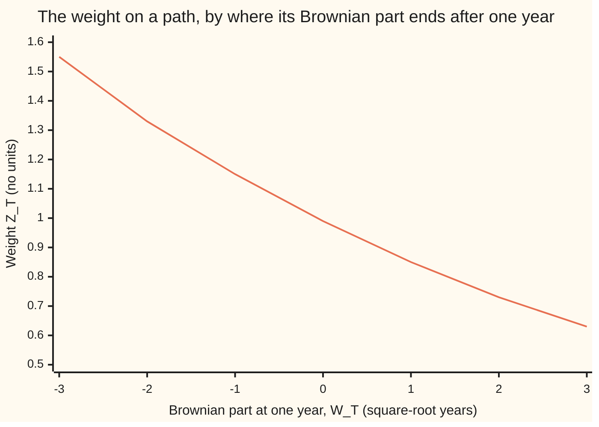
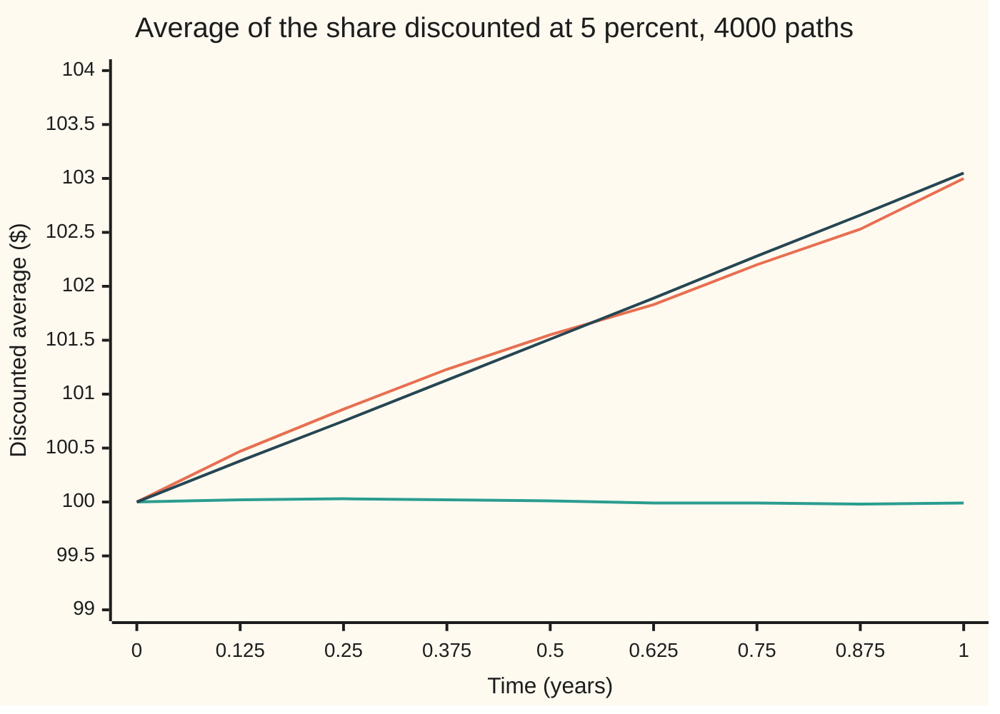

# Girsanov: removing a drift by changing the measure

[Syllabus](../../../SYLLABUS.md) → [Stochastic processes and calculus](../README.md) → [Changing Measure](../README.md#s07) → Girsanov

---

## General Overview

A share trades at $100. Over a year its price wanders: it drifts up at 8 percent a year on its current level and takes random kicks sized at 20 percent a year. Under these real-world odds the average price a year from now is $108.33. Cash in the bank earns 5 percent a year.

A pricing desk wants the same share to drift at 5 percent, the bank's rate, so that after discounting at the bank's rate it is a fair game: its average future value, pulled back to today, is today's $100. The desk is not allowed to invent new price paths. Every path the share can take stays exactly as it is. What the desk may change is how much each path counts when it averages.

Girsanov's theorem says how. Weight each path by a factor that depends on where its random part went: paths that ran high count a little less, paths that ran low a little more. With the right factor the share drifts at 5 percent under the new odds, its kicks are still 20 percent, and the leftover randomness is again a genuine Brownian motion. Igor Girsanov proved the general version in 1960; Robert Cameron and William Martin had the fixed-shift case in 1944.

**Reweighting the paths of a Brownian motion by one exponential factor removes a drift and leaves a Brownian motion: same paths, same kicks, new odds.**

**What kind of fact this is:** a theorem, proved on this card in Why it works, completely for a constant drift and, in a folded Detailed proof, for any bounded drift that uses only the past; drifts that are not bounded are left to the next card's test.

### The picture: how much each path counts



One line. $W_T$ is the random part of a path at the one-year horizon $T$; $Z_T$ is the factor that path's count is multiplied by. A path whose Brownian part ends one unit low counts 1.1488 times as much as before; one unit high, 0.8511 times. The weights average exactly 1, so the new odds still add up to one.

---

## The formula

Notation first, with one-line reminders. $W_t$ is Brownian motion, read "the random walk seen from far away", with time $t$ in years. $P$ is the real-world probability measure and $E$ its average. A second probability measure on the same paths is written $Q$, with $E^Q$ for averages under it ([Changing the measure](01-change-of-measure-and-density-processes.md)). The rule $dS_t = \mu S_t\,dt + \sigma S_t\,dW_t$ says the share drifts by $\mu S_t$ per unit time and is kicked by $\sigma S_t$ times the Brownian step; $dW_t$ is shorthand for an Ito integral, never a derivative, because the path has none. $\mathbf 1_A$ is 1 on the paths in the event $A$ and 0 elsewhere.

For a constant tilt $\theta$ and a horizon $T$:

$$Z_T = \exp\!\Big(-\theta\,W_T - \tfrac12\,\theta^2 T\Big), \qquad Q(A) = E\big[Z_T\,\mathbf 1_A\big],$$

$$\text{and under } Q, \quad \widetilde W_t = W_t + \theta\,t \quad \text{is a Brownian motion for } 0 \le t \le T.$$

**Read it aloud:** weight every path by the exponential of minus the tilt times where it ended, corrected by half the tilt squared times the time; under the weighted odds, the old Brownian motion plus the tilt times the clock is a Brownian motion.

The weight $Z_T$ is the density $dQ/dP$ of the new measure against the old, the Radon-Nikodym derivative of [The Radon-Nikodym derivative](../../10-Measure%20and%20integration/08-Densities%20and%20Changing%20Measure/04-radon-nikodym-derivative.md).

Read backwards, $W_t = \widetilde W_t - \theta t$: under $Q$ the old Brownian motion has acquired a drift of $-\theta$ a year. Put that into the share's rule:

$$dS_t = \mu S_t\,dt + \sigma S_t\,\big(d\widetilde W_t - \theta\,dt\big) = (\mu - \sigma\theta)\,S_t\,dt + \sigma S_t\,d\widetilde W_t .$$

Choose $\theta = (\mu - r)/\sigma$ and the drift becomes $r$. For the share, $\theta = (0.08 - 0.05)/0.20 = 0.15$. The kick size $\sigma$ does not move.

For a tilt that changes along the path, $\theta_t$, known at time $t$ and never larger than a bound $K$ in size:

$$Z_t = \exp\!\Big(-\int_0^t \theta_s\,dW_s - \tfrac12\int_0^t \theta_s^2\,ds\Big), \qquad \widetilde W_t = W_t + \int_0^t \theta_s\,ds .$$

**Read it aloud:** the same weight, built up step by step, each step tilted by the tilt in force at that moment; the old Brownian motion plus the accumulated tilt is a Brownian motion under the new odds.

| Symbol | Plain meaning | In our example | Push it up and the answer… |
| --- | --- | --- | --- |
| $S_t$, $S_0$ | the share price at time $t$; today | $S_0$ = $100 | — |
| $\mu$ | the real-world drift of the share, per year | 0.08 | bigger tilt needed |
| $r$ | the bank's rate, the drift the desk wants | 0.05 | smaller tilt needed |
| $\sigma$ | kick size of the share, per square-root year | 0.20 | smaller tilt for the same drift gap |
| $t$, $T$, $\Delta t$, $k$ | time in years; the horizon; one grid step; which step | $T$ = 1, $\Delta t$ = 1/1024 | longer horizon, more extreme weights |
| $W$, $W_t$, $W_T$, $dW_t$, $dt$ | Brownian motion under $P$; at time $t$; at the horizon; its step, shorthand inside an Ito integral; a short slice of time | — | — |
| $P$, $Q$, $E$, $A$ | real-world measure; reweighted measure; average under $P$; an event | — | — |
| $\theta$, $\theta_t$, $\theta_s$, $K$ | the tilt, $(\mu - r)/\sigma$; a tilt that varies; its bound | 0.15; 0.15 or 0.30; 0.30 | weights spread further from 1 |
| $Z_t$, $Z_T$ | the weight, $dQ/dP$ on what is known by time $t$; at the horizon | 0.8511 for a path with $W_T$ = 1 | — |
| $\widetilde W_t$ | $W_t + \theta t$, the Brownian motion under $Q$ | — | — |
| $\mathcal F_t$ | what is known by time $t$ (the filtration) | the path up to $t$ | — |
| $\lambda$, $u_s$, $\mathcal E(u)$, $X$, $Y_t$, $D$, $\tau_m$, $m$, $N(x)$, $\varphi_t$, $a$, $x$, $s$, $n$, $t_k$, $\Delta W_k$ | proof bookkeeping: a test number; a bounded tilt; the weight built from the tilt $u$; an outcome known at time $t$; the exponent of $Z_t$; one step of $\widetilde W$; a stopping time and its level; the bell-curve area left of $x$; the bell-curve density with variance $t$; the number in a moment generating function; a point on the line; an earlier time; how many cuts of $[0, T]$; the $k$-th cut time; the step of $W$ between cuts | $N(1)$ = 0.841345 | — |

### When it holds

- **A finite horizon.** Over 10,000 years the real-world odds put almost all (1.0000 to four places) of their mass on paths with weight below 0.01, and the new odds 0.0000. In the limit the two measures live on different paths (singular, in [Absolutely continuous and singular measures](../../10-Measure%20and%20integration/08-Densities%20and%20Changing%20Measure/01-absolutely-continuous-and-singular-measures.md)), and no density connects them.
- **The weights average exactly 1.** The weight process must be a true martingale, not only a local one (fair only when stopped before it grows too large); a bounded $\theta_t$ guarantees it (proved below). Without the $-\tfrac12\theta^2 T$ the weights average 1.011314. For unbounded tilts the test is [Novikov](03-novikov-condition.md).
- **The tilt uses only the past.** The proof conditions on $\mathcal F_s$ and needs $\theta_s$ fixed before the step it multiplies, as the Ito integral does.
- **It moves the drift, never the kick size.** A path's squared log-price steps add up to $\sigma^2 T$ on almost every path ([Quadratic variation](../05-Brownian%20Motion/03-quadratic-variation.md)), and no reweighting changes a fact true of every path.
- **Continuous Brownian noise.** With jumps, the weight may also change how often jumps arrive and how big they are: [Jump diffusions](../09-Beyond%20Brownian/02-jump-diffusions.md).

---

## Why it works

### Step 0: reweighting moves averages, not paths

Take 4000 simulated one-year paths of the share. Their plain average, discounted at 5 percent, sits near $103.00 (exact $103.05). Count the paths whose random part ran high a little less, and the weighted average falls; with the right tilt it lands on $100. No path was edited, so every fact about a single path (it is continuous, its squared steps add up to the clock) holds under both counts. Only averages and probabilities change. The proof shows the right tilt does more than fix one average: it makes the leftover randomness a Brownian motion in every respect.

### Step 1: the weights average 1

$Z_T$ is positive, so $Q$ gives no event a negative probability. Under $P$, $W_T$ is bell-shaped with mean 0 and variance $T$. Its moment generating function is $E[e^{aW_T}] = e^{a^2 T/2}$ (wing 09), so with $a = -\theta$,

$$E[Z_T] = e^{-\theta^2 T/2}\,E\big[e^{-\theta W_T}\big] = e^{-\theta^2 T/2}\,e^{\theta^2 T/2} = 1 .$$

So $Q$ of the whole space is 1: a probability measure. The correction $-\tfrac12\theta^2 T$ exists for this line and no other reason. No path has weight zero, so the two measures agree on which events are impossible: they are equivalent.

### Step 2: the weight slides the bell curve

Let $\varphi_t(x) = e^{-x^2/(2t)}/\sqrt{2\pi t}$ be the bell-curve density with mean 0 and variance $t$. Multiply it by the weight and complete the square in the exponent:

$$e^{-\theta x - \frac12\theta^2 t}\,\varphi_t(x) = \frac{1}{\sqrt{2\pi t}}\exp\!\Big(-\frac{x^2 + 2\theta t x + \theta^2 t^2}{2t}\Big) = \varphi_t(x + \theta t).$$

The weighted density of $W_t$ is the same bell curve slid left by $\theta t$. Under $Q$, $W_T$ has mean $-\theta T = -0.15$ and variance still $T$. So $\widetilde W_T = W_T + \theta T$ has mean 0 and variance $T$ under $Q$. The code integrates this by Simpson's rule: $Q(\widetilde W_T \le 1)$ = 0.841345 = $N(1)$, the bell-curve area left of 1.

### Step 3: the slide happens step by step and independently

One time is not enough; a Brownian motion is a whole path. Cut $[0, T]$ at times $0 = t_0 < t_1 < \dots < t_n = T$. Under $P$ the steps $\Delta W_k = W_{t_k} - W_{t_{k-1}}$ are independent, each bell-shaped with variance $\Delta t_k$. The exponent of $Z_T$ splits over the steps, because $W_T$ is the sum of the steps and $T$ the sum of the step lengths:

$$Z_T = \prod_{k=1}^{n} \exp\!\Big(-\theta\,\Delta W_k - \tfrac12\,\theta^2\,\Delta t_k\Big).$$

So the joint density of the steps under $Q$ is the product of the $P$-densities times these factors. By Step 2 each factor slides its own step's bell curve by $\theta\,\Delta t_k$, and the product stays a product. Under $Q$ the steps are independent, the $k$-th bell-shaped with mean $-\theta\,\Delta t_k$ and variance $\Delta t_k$. Adding back $\theta\,\Delta t_k$, the steps of $\widetilde W$ are independent with mean 0 and variance $\Delta t_k$.

### Step 4: the paths are still continuous, so it is a Brownian motion

$\widetilde W$ starts at 0. Its paths are continuous under $P$, and an event of $P$-probability 1 has $Q$-probability 1 because the two measures are equivalent. Steps independent and bell-shaped with variance equal to elapsed time, continuous paths, starting at 0: that is the definition of Brownian motion on [Brownian motion](../05-Brownian%20Motion/01-brownian-motion.md). The constant-drift theorem is proved.

For the share: $\log S_T = \log S_0 + (\mu - \tfrac12\sigma^2)T + \sigma W_T$ ([Ito's lemma](../06-Ito%20Calculus/02-itos-lemma.md)). Under $Q$ substitute $W_T = \widetilde W_T - \theta T$: the log drift 0.06 becomes 0.06 − 0.20 × 0.15 = 0.03, which is $r - \tfrac12\sigma^2$. So $E^Q[S_T] = 100\,e^{0.05}$ = $105.13 and the discounted average is $100.00.

### Step 5: a tilt that moves needs Ito, and the half-square is Ito's term

Now let the tilt change: say the share's real drift is 8 percent below $110 and 11 percent above, so $\theta_t$ is 0.15 or 0.30, read off the price at time $t$. The weight is no longer a function of $W_T$ alone. Build it step by step instead. Apply Ito's lemma to $Z_t = e^{Y_t}$ with $dY_t = -\theta_t\,dW_t - \tfrac12\theta_t^2\,dt$: the second-derivative term $\tfrac12 e^{Y_t}(dY_t)^2 = \tfrac12\theta_t^2 Z_t\,dt$ cancels the $-\tfrac12\theta_t^2$ exactly, leaving

$$dZ_t = -\theta_t\,Z_t\,dW_t, \qquad Z_0 = 1 .$$

No $dt$ term: $Z$ is a fair game in the making, a local martingale. The half-square in the formula is the Ito correction, the same one that lowers a share's log drift on the itos-lemma card. The code builds $Z$ from this rule on grids of 16 to 1024 steps a year and watches it close on the closed form, mean gap 0.003126 falling to 0.000388.

### Step 6: test with exponentials, and let Bayes' rule do the rest

Two facts remain: a bounded tilt makes $Z$ a true martingale, so $E[Z_T] = 1$; and $\widetilde W$ is Brownian under $Q$. The second rests on an identity, for any real number $\lambda$:

$$e^{\lambda \widetilde W_t - \frac12 \lambda^2 t}\, Z_t = \exp\!\Big(\int_0^t (\lambda - \theta_s)\,dW_s - \tfrac12\int_0^t (\lambda - \theta_s)^2\,ds\Big),$$

the same kind of weight with the bounded tilt $\theta_s - \lambda$, so a $P$-martingale. Bayes' rule, $E^Q[X \mid \mathcal F_s] = E[Z_t X \mid \mathcal F_s]/Z_s$ for $X$ known at time $t$ (from the density-process card), makes $e^{\lambda \widetilde W_t - \lambda^2 t/2}$ a $Q$-martingale. That holds for every $\lambda$ only if each step of $\widetilde W$ is bell-shaped, with variance its length, and independent of the past.

<details>
<summary>Detailed proof, for a bounded tilt that uses only the past</summary>

**Setting.** $W$ is a Brownian motion under $P$ with its filtration $\mathcal F_t$. The tilt $\theta_t$ is known at time $t$ and satisfies $\lvert\theta_t\rvert \le K$. For any such bounded tilt $u_s$ write $\mathcal E(u)_t = \exp\big(\int_0^t u_s\,dW_s - \tfrac12\int_0^t u_s^2\,ds\big)$, so $Z = \mathcal E(-\theta)$.

**(a) $\mathcal E(u)$ is a true martingale with mean 1.** By Ito's lemma, $d\mathcal E(u)_t = u_t\,\mathcal E(u)_t\,dW_t$. Stop it at $\tau_m$, the first time it reaches $m$; the stopped process is a bounded Ito integral, hence a martingale. It is positive, so conditional Fatou as $m \to \infty$ gives $E[\mathcal E(u)_t \mid \mathcal F_s] \le \mathcal E(u)_s$: a supermartingale, with $E[\mathcal E(u)_t] \le 1$. Squaring, $\mathcal E(u)_t^2 = \mathcal E(2u)_t \exp\big(\int_0^t u_s^2\,ds\big) \le \mathcal E(2u)_t\,e^{K^2 t}$, and $2u$ is bounded too, so $E[\mathcal E(u)_t^2] \le e^{K^2 t}$. Then $E\int_0^T u_t^2\,\mathcal E(u)_t^2\,dt \le K^2 T e^{K^2 T} < \infty$, so $\int_0^t u_s\,\mathcal E(u)_s\,dW_s$ is a square-integrable martingale ([The Ito integral](../06-Ito%20Calculus/01-ito-integral.md)), and $\mathcal E(u)_t = 1 + \int_0^t u_s\,\mathcal E(u)_s\,dW_s$ is a martingale with mean 1.

**(b) $Q$ is a probability equivalent to $P$.** Define $Q(A) = E[Z_T \mathbf 1_A]$ for $A$ in $\mathcal F_T$. By (a), $Q$ of everything is 1. $Z_T > 0$, so $Q(A) = 0$ exactly when $P(A) = 0$. For $A$ in $\mathcal F_t$, the martingale property gives $Q(A) = E[Z_t \mathbf 1_A]$: $Z_t$ is the density on what is known by time $t$.

**(c) The exponential identity.** Since $\widetilde W_t = W_t + \int_0^t \theta_s\,ds$, the exponent of $e^{\lambda\widetilde W_t - \lambda^2 t/2} Z_t$ is $\lambda W_t + \lambda\int\theta_s\,ds - \tfrac12\lambda^2 t - \int\theta_s\,dW_s - \tfrac12\int\theta_s^2\,ds = \int(\lambda - \theta_s)\,dW_s - \tfrac12\int(\lambda^2 - 2\lambda\theta_s + \theta_s^2)\,ds$, which is the exponent of $\mathcal E(\lambda - \theta)_t$. The tilt $\lambda - \theta_s$ is bounded by $\lvert\lambda\rvert + K$, so by (a) this is a $P$-martingale.

**(d) Conditional law of a step.** Fix $s < t \le T$, $A$ in $\mathcal F_s$ and real $\lambda$. Write $D = \widetilde W_t - \widetilde W_s$. Using (b), then conditioning on $\mathcal F_s$ and (c):
$E^Q[\mathbf 1_A e^{\lambda D}] = E[\mathbf 1_A Z_t e^{\lambda D}] = E\big[\mathbf 1_A e^{-\lambda \widetilde W_s + \lambda^2 t/2}\,\mathcal E(\lambda - \theta)_t\big] = E\big[\mathbf 1_A e^{-\lambda \widetilde W_s + \lambda^2 t/2}\,\mathcal E(\lambda - \theta)_s\big] = E[\mathbf 1_A Z_s]\,e^{\lambda^2 (t - s)/2} = Q(A)\,e^{\lambda^2 (t-s)/2}$.
For $Q(A) > 0$, divide by $Q(A)$: under $Q$ given $A$, $D$ has the moment generating function of a bell curve with mean 0 and variance $t - s$, for every real $\lambda$. A moment generating function finite near 0 fixes the law (wing 09), so $Q(A \cap \{D \le x\}) = Q(A)\,N(x/\sqrt{t-s})$ for every $x$. That says $D$ is independent of $\mathcal F_s$ under $Q$ and bell-shaped with variance $t - s$.

**(e) Conclusion.** Applying (d) at successive times shows the steps of $\widetilde W$ over any partition are independent under $Q$, each bell-shaped with variance equal to its length. $\widetilde W_0 = 0$, and its paths are continuous $P$-almost surely, hence $Q$-almost surely by (b). So $\widetilde W$ is a Brownian motion under $Q$ on $[0, T]$. For a constant tilt this repeats Steps 1 to 4.

**What this card does not prove.** Tilts that are not bounded: $Z$ can then be a local martingale with $E[Z_T] < 1$, and the conclusion fails. Novikov's condition, $E\big[\exp(\tfrac12\int_0^T\theta_s^2\,ds)\big] < \infty$, is a sufficient test, proved on [Novikov](03-novikov-condition.md). The several-dimensional version, with one tilt per Brownian motion, has the same proof with vectors; it is in Karatzas and Shreve, Section 3.5, and Øksendal, Section 8.6.

</details>

### Another route

Lévy's characterization says a continuous martingale whose squared steps add up to the clock is a Brownian motion. With it, Girsanov takes two lines: $\widetilde W Z$ is a $P$-local martingale by the Ito product rule, and a drift does not change squared steps. Karatzas and Shreve take that route.

---

## Worked numbers, by hand

The share: $S_0$ = $100, $\mu$ = 0.08, $r$ = 0.05, $\sigma$ = 0.20 a year, $T$ = 1 year.

| Step | Arithmetic | Value |
| --- | --- | --- |
| tilt $\theta$ | (0.08 − 0.05) ÷ 0.20 | 0.15 |
| correction | half of 0.15 × 0.15 × 1 | 0.01125 |
| weight on a path with $W_T$ = 1 | e^(−0.15 − 0.01125) | 0.8511 |
| weight on a path with $W_T$ = −1 | e^(0.15 − 0.01125) | 1.1488 |
| centre of $W_T$ under $Q$ | −0.15 × 1 | −0.15 |
| log drift under $P$ | 0.08 − half of 0.04 | 0.06 |
| log drift under $Q$ | 0.06 − 0.20 × 0.15 | 0.03 |
| average price under $P$ | 100 × e^0.08 | $108.33 |
| average price under $Q$ | 100 × e^0.05 | $105.13 |
| discounted average under $Q$ | 105.13 × e^(−0.05) | **$100.00** |

Under the reweighted odds the share's discounted value is a fair game: its average future value, pulled back at the bank's rate, is today's $100. That is what the desk means by "pricing as if it drifted at 5 percent".

### What breaks if you drop a piece

| Mistake | Comes out at | What went wrong |
| --- | --- | --- |
| Drop the $-\tfrac12\theta^2 T$ | weights total 1.011314; share priced $101.1314 | $Q$ is not a probability: its total is 1.0113, not 1 |
| Wrong sign on the tilt | share priced $106.1837, drift 0.11 | the weight favoured high paths: drift pushed up by 0.03, not down |
| Tilt chosen to change the kick size | no such weight; realised variance 0.040048 and 0.040050 | squared steps are a fact of every path, so no density changes them |
| Let the horizon run to infinity | already nearly singular at 10,000 years: $P$ puts 1.0000 on weights below 0.01, $Q$ puts 0.0000 | $Z_T \to 0$ as $T \to \infty$ while $E[Z_T] = 1$, so no density exists in the limit |

The last row is a density process that is a martingale for every finite time but whose limit is 0 while its average stays 1 ([Stopping without a bound](../02-Martingales/06-uniform-integrability-and-unbounded-stopping.md)). At 100 years $P$ puts 0.0102 on such paths, at 1000 years 0.9194.

---

## Code, from first principles, and it actually runs

The code takes three roads. Road 1 is the closed forms. Road 2 averages over the bell curve exactly by Simpson's rule: the mean weight, the slid centre, the variance, and the law of $\widetilde W_T$ under $Q$ against the bell-curve area $N(x)$, itself computed by integrating the bell curve's height. Road 3 runs 4000 seeded one-year paths (SplitMix64, normals by Box-Muller) on a grid of 1024 steps a year, weights each path, and prints every mean with its standard error. It also builds the weight from $dZ = -\theta Z\,dW$ on grids of 16 to 1024 steps, and repeats the test with the bounded tilt of 0.15 below $110 and 0.30 above. The paths are samples on a grid; with the tilt held fixed over each step the grid version of the theorem is exact, so only sampling error remains.

### Python

```python
# Girsanov's theorem -- the check behind the card.  Only math is imported.
# A $100 share drifts at mu = 0.08 a year with sigma = 0.20; the pricing desk wants
# drift r = 0.05.  Weight each path by Z_T = exp(-theta W_T - theta^2 T / 2) with
# theta = (mu - r) / sigma, and Wt = W + theta t should be a Brownian motion.
# Roads: closed forms; exact integrals over the bell curve (Simpson's rule);
# 4000 seeded paths (SplitMix64, Box-Muller) with a constant and a bounded drift.
import math

S0, MU, R, SIG, T = 100.0, 0.08, 0.05, 0.20, 1.0
TH = (MU - R) / SIG
SEED, PATHS, FINE, GRIDS = 20260930, 4000, 1024, (16, 64, 256, 1024)
MASK = (1 << 64) - 1

class SplitMix64:                                  # the wing's generator, written out
    def __init__(self, seed): self.s = seed
    def uniform(self):
        self.s = (self.s + 0x9E3779B97F4A7C15) & MASK
        z = self.s
        z = ((z ^ (z >> 30)) * 0xBF58476D1CE4E5B9) & MASK
        z = ((z ^ (z >> 27)) * 0x94D049BB133111EB) & MASK
        return ((z ^ (z >> 31)) >> 11) / 9007199254740992.0
    def normal(self):                              # Box-Muller, cosine half
        u1, u2 = self.uniform(), self.uniform()
        return math.sqrt(-2.0 * math.log(1.0 - u1)) * math.cos(2.0 * math.pi * u2)

def phi(x): return math.exp(-0.5 * x * x) / math.sqrt(2.0 * math.pi)

def simpson(f, a, b, n):
    h = (b - a) / n
    s = f(a) + f(b)
    for i in range(1, n): s += (4.0 if i % 2 == 1 else 2.0) * f(a + i * h)
    return s * h / 3.0

def ncdf(x): return min(1.0, max(0.0, 0.5 + simpson(phi, 0.0, max(-9.0, min(9.0, x)), 2000)))
def ep(g, hi=12.0): return simpson(lambda w: g(w) * phi(w), -12.0, hi, 4000)   # E^P over W_T, T = 1
def z(w, th=TH): return math.exp(-th * w - 0.5 * th * th * T)
def st(w): return S0 * math.exp((MU - 0.5 * SIG * SIG) * T + SIG * w)
def ms(a): m = a[0] / PATHS; return m, math.sqrt(max(a[1] / PATHS - m * m, 0.0) / PATHS)

print(f"share: S0 {S0:.0f} dollars, mu {MU:.2f}, r {R:.2f}, sigma {SIG:.2f} a year, T {T:.0f} year")
print(f"theta = (mu - r) / sigma {TH:.6f}   correction theta^2 T / 2 {0.5 * TH * TH * T:.6f}")
print("chart, W_T      " + " ".join(f"{w:7.0f}" for w in range(-3, 4)))
print("weight, 4 places " + " ".join(f"{z(w):7.4f}" for w in range(-3, 4)))
print("chart, weight   " + " ".join(f"{z(w):7.2f}" for w in range(-3, 4)))
print(f"road 1, E^P[S_T] = S0 e^(mu T) {S0 * math.exp(MU * T):.4f}   E^Q[S_T] = S0 e^(r T) {S0 * math.exp(R * T):.4f}")
print(f"log drift under P, mu - sigma^2/2 {MU - 0.5 * SIG * SIG:.6f}   under Q, mu - sigma^2/2 - sigma theta {MU - 0.5 * SIG * SIG - SIG * TH:.6f}")
ez, eqw = ep(z), ep(lambda w: z(w) * w)
eqwt, eqwt2 = ep(lambda w: z(w) * (w + TH * T)), ep(lambda w: z(w) * (w + TH * T) * (w + TH * T))
eqs, eps = ep(lambda w: z(w) * st(w)), ep(st)
print(f"road 2, E^P[Z_T] {ez:.6f}   E^Q[W_T] {eqw:+.6f}   E^Q[Wt_T] {eqwt:+.6f}   E^Q[Wt_T^2] {eqwt2:.6f}")
print(f"road 2, E^P[S_T] {eps:.4f}   E^Q[S_T] {eqs:.4f}   E^Q[e^(-rT) S_T] {math.exp(-R * T) * eqs:.4f}")
cdf = [(x, ep(z, x - TH * T), ncdf(x)) for x in (-1.0, 0.0, 1.0)]
print("road 2, Q(Wt_T <= x) against N(x): " + "   ".join(f"x {x:+.0f}: {q:.6f} {n:.6f}" for x, q, n in cdf))

g, dt, CH = SplitMix64(SEED), T / FINE, FINE // 8
acc = {k: [0.0, 0.0] for k in ("z", "plain", "wtd", "wt", "wt2", "cov", "rv", "rvw", "z2", "plain2", "wtd2", "wt_2", "wt2_2", "ex_2")}
gap = {n: 0.0 for n in GRIDS}
chart = [[0.0, 0.0] for _ in range(9)]
for p in range(PATHS):
    w, ls, ls2, lz2, sh2, rv, wmid = 0.0, math.log(S0), math.log(S0), 0.0, 0.0, 0.0, 0.0
    ze, part = {n: 1.0 for n in GRIDS}, {n: 0.0 for n in GRIDS}
    for k in range(FINE + 1):
        if k % CH == 0:
            disc = math.exp(ls - R * k * dt)
            chart[k // CH][0] += disc; chart[k // CH][1] += disc * math.exp(-TH * w - 0.5 * TH * TH * k * dt)
        if k == FINE: break
        dw = math.sqrt(dt) * g.normal()
        step = (MU - 0.5 * SIG * SIG) * dt + SIG * dw
        ls += step; rv += step * step; w += dw
        th2 = 0.30 if ls2 >= math.log(110.0) else 0.15     # bounded drift: 11% above $110
        ls2 += (R + SIG * th2 - 0.5 * SIG * SIG) * dt + SIG * dw
        lz2 += -th2 * dw - 0.5 * th2 * th2 * dt; sh2 += th2 * dt
        for n in GRIDS:
            part[n] += dw
            if (k + 1) % (FINE // n) == 0: ze[n] *= 1.0 - TH * part[n]; part[n] = 0.0
        if k + 1 == FINE // 2: wmid = w + TH * 0.5 * T
    zt, wt = z(w), w + TH * T
    z2, wt2 = math.exp(lz2), w + sh2
    for key, v in (("z", zt), ("plain", math.exp(ls - R * T)), ("wtd", zt * math.exp(ls - R * T)),
                   ("wt", zt * wt), ("wt2", zt * wt * wt), ("cov", zt * wmid * (wt - wmid)),
                   ("rv", rv), ("rvw", zt * rv), ("z2", z2), ("plain2", math.exp(ls2 - R * T)),
                   ("wtd2", z2 * math.exp(ls2 - R * T)), ("wt_2", z2 * wt2), ("wt2_2", z2 * wt2 * wt2),
                   ("ex_2", z2 * math.exp(wt2 - 0.5 * T))):
        acc[key][0] += v; acc[key][1] += v * v
    for n in GRIDS: gap[n] += abs(ze[n] - zt)

names = (("mean weight Z_T", "z", "1"), ("plain mean of e^(-rT) S_T", "plain", f"{S0 * math.exp((MU - R) * T):.4f}"),
         ("weighted mean of e^(-rT) S_T", "wtd", "100"), ("weighted mean of Wt_T", "wt", "0"),
         ("weighted mean of Wt_T^2", "wt2", "1"), ("weighted mean of half-year steps product", "cov", "0"))
print(f"road 3, {PATHS} seeded paths (seed {SEED}), {FINE} steps a year, constant theta:")
for lab, key, tgt in names: print(f"  {lab:<42} {ms(acc[key])[0]:+.4f} (se {ms(acc[key])[1]:.4f})   target {tgt}")
print("density built step by step, Z <- Z (1 - theta dW), mean |gap| to the closed form:")
for n in GRIDS: print(f"  steps {n:5d}   mean gap {gap[n] / PATHS:.6f}")
print("bounded drift, 0.08 below $110 and 0.11 above, theta_t = 0.15 or 0.30:")
for lab, key, tgt in (("mean weight Z_T", "z2", "1"), ("plain mean of e^(-rT) S_T", "plain2", "none known"),
                      ("weighted mean of e^(-rT) S_T", "wtd2", "100"), ("weighted mean of Wt_T", "wt_2", "0"),
                      ("weighted mean of Wt_T^2", "wt2_2", "1"), ("weighted mean of e^(Wt_T - T/2)", "ex_2", "1")):
    print(f"  {lab:<42} {ms(acc[key])[0]:+.4f} (se {ms(acc[key])[1]:.4f})   target {tgt}")
print("what breaks:")
nocorr = ep(lambda w: math.exp(-TH * w))
print(f"  no -theta^2 T/2: total weight {nocorr:.6f} (e^(theta^2/2) {math.exp(0.5 * TH * TH):.6f}), share priced {nocorr * 100.0:.4f}")
flip = math.exp(-R * T) * ep(lambda w: z(w, -TH) * st(w))
print(f"  theta with the wrong sign: share priced {flip:.4f} (drift mu + sigma theta = {MU + SIG * TH:.2f})")
print(f"  realised variance of log S, plain {ms(acc['rv'])[0]:.6f}, weighted {ms(acc['rvw'])[0]:.6f}, sigma^2 T {SIG * SIG * T:.6f}")
horizon = []
for yrs in (1.0, 100.0, 1000.0, 10000.0):
    cut = (-math.log(0.01) - 0.5 * TH * TH * yrs) / (TH * math.sqrt(yrs))
    horizon.append((1.0 - ncdf(cut), 1.0 - ncdf(cut + TH * math.sqrt(yrs))))
    print(f"  horizon {yrs:7.0f} years: P(Z_T < 0.01) {horizon[-1][0]:.4f}   Q(Z_T < 0.01) {horizon[-1][1]:.4f}")
print("chart, years    " + " ".join(f"{k / 8:7.3f}" for k in range(9)))
print("chart, plain    " + " ".join(f"{c[0] / PATHS:7.2f}" for c in chart))
print("chart, weighted " + " ".join(f"{c[1] / PATHS:7.2f}" for c in chart))
print("chart, P exact  " + " ".join(f"{S0 * math.exp((MU - R) * k / 8):7.2f}" for k in range(9)))

m = {k: ms(v) for k, v in acc.items()}
assert abs(ez - 1.0) < 1e-9, "Simpson: the weights average 1"
assert abs(eqw + TH * T) < 1e-9, "Simpson: under Q, W_T is centred at -theta T"
assert abs(eqs - S0 * math.exp(R * T)) < 1e-6, "Simpson: under Q the share grows at r"
assert all(abs(q - n) < 1e-6 for _, q, n in cdf), "Simpson: Wt_T has the bell-curve law under Q"
assert abs(m["wtd"][0] - 100.0) < 4 * m["wtd"][1], "simulation: discounted share fair under Q"
assert m["plain"][0] - 100.0 > 6 * m["plain"][1], "simulation: and not fair under P"
assert abs(m["wt"][0]) < 4 * m["wt"][1], "simulation: Wt_T centred under Q"
assert abs(m["wt2"][0] - 1.0) < 4 * m["wt2"][1], "simulation: Wt_T has variance T under Q"
assert abs(m["cov"][0]) < 4 * m["cov"][1], "simulation: the two half-year Q-steps are uncorrelated"
assert abs(m["wtd2"][0] - 100.0) < 4 * m["wtd2"][1], "bounded drift: discounted share still fair under Q"
assert abs(m["wt_2"][0]) < 4 * m["wt_2"][1], "bounded drift: Wt_T centred under Q"
assert abs(m["wt2_2"][0] - 1.0) < 4 * m["wt2_2"][1], "bounded drift: Wt_T has variance T under Q"
assert abs(m["ex_2"][0] - 1.0) < 4 * m["ex_2"][1], "bounded drift: e^(Wt_T - T/2) averages 1 under Q"
assert gap[1024] < gap[16] / 4, "the step-by-step density closes on the closed form"
assert abs(nocorr - math.exp(0.5 * TH * TH)) < 1e-9, "without the correction the weights overshoot"
assert horizon[3][0] > 0.99, "over 10000 years P puts nearly all its mass where Z_T < 0.01"
assert horizon[3][1] < 0.01, "while Q puts almost none there"
print("ALL CHECKS PASS")
```

**Ran 2026-10-07 on macOS, Python 3.14.6, standard library only. All checks passed. Output, pasted from the run:**

```
share: S0 100 dollars, mu 0.08, r 0.05, sigma 0.20 a year, T 1 year
theta = (mu - r) / sigma 0.150000   correction theta^2 T / 2 0.011250
chart, W_T           -3      -2      -1       0       1       2       3
weight, 4 places  1.5508  1.3348  1.1488  0.9888  0.8511  0.7325  0.6305
chart, weight      1.55    1.33    1.15    0.99    0.85    0.73    0.63
road 1, E^P[S_T] = S0 e^(mu T) 108.3287   E^Q[S_T] = S0 e^(r T) 105.1271
log drift under P, mu - sigma^2/2 0.060000   under Q, mu - sigma^2/2 - sigma theta 0.030000
road 2, E^P[Z_T] 1.000000   E^Q[W_T] -0.150000   E^Q[Wt_T] -0.000000   E^Q[Wt_T^2] 1.000000
road 2, E^P[S_T] 108.3287   E^Q[S_T] 105.1271   E^Q[e^(-rT) S_T] 100.0000
road 2, Q(Wt_T <= x) against N(x): x -1: 0.158655 0.158655   x +0: 0.500000 0.500000   x +1: 0.841345 0.841345
road 3, 4000 seeded paths (seed 20260930), 1024 steps a year, constant theta:
  mean weight Z_T                            +1.0002 (se 0.0024)   target 1
  plain mean of e^(-rT) S_T                  +103.0032 (se 0.3280)   target 103.0455
  weighted mean of e^(-rT) S_T               +99.9912 (se 0.0790)   target 100
  weighted mean of Wt_T                      -0.0015 (se 0.0162)   target 0
  weighted mean of Wt_T^2                    +1.0000 (se 0.0233)   target 1
  weighted mean of half-year steps product   -0.0024 (se 0.0081)   target 0
density built step by step, Z <- Z (1 - theta dW), mean |gap| to the closed form:
  steps    16   mean gap 0.003126
  steps    64   mean gap 0.001585
  steps   256   mean gap 0.000790
  steps  1024   mean gap 0.000388
bounded drift, 0.08 below $110 and 0.11 above, theta_t = 0.15 or 0.30:
  mean weight Z_T                            +1.0014 (se 0.0031)   target 1
  plain mean of e^(-rT) S_T                  +104.0596 (se 0.3439)   target none known
  weighted mean of e^(-rT) S_T               +100.1172 (se 0.1103)   target 100
  weighted mean of Wt_T                      -0.0010 (se 0.0160)   target 0
  weighted mean of Wt_T^2                    +1.0017 (se 0.0224)   target 1
  weighted mean of e^(Wt_T - T/2)            +0.9979 (se 0.0138)   target 1
what breaks:
  no -theta^2 T/2: total weight 1.011314 (e^(theta^2/2) 1.011314), share priced 101.1314
  theta with the wrong sign: share priced 106.1837 (drift mu + sigma theta = 0.11)
  realised variance of log S, plain 0.040048, weighted 0.040050, sigma^2 T 0.040000
  horizon       1 years: P(Z_T < 0.01) 0.0000   Q(Z_T < 0.01) 0.0000
  horizon     100 years: P(Z_T < 0.01) 0.0102   Q(Z_T < 0.01) 0.0001
  horizon    1000 years: P(Z_T < 0.01) 0.9194   Q(Z_T < 0.01) 0.0004
  horizon   10000 years: P(Z_T < 0.01) 1.0000   Q(Z_T < 0.01) 0.0000
chart, years      0.000   0.125   0.250   0.375   0.500   0.625   0.750   0.875   1.000
chart, plain     100.00  100.47  100.86  101.23  101.55  101.83  102.20  102.53  103.00
chart, weighted  100.00  100.02  100.03  100.02  100.01   99.99   99.99   99.98   99.99
chart, P exact   100.00  100.38  100.75  101.13  101.51  101.89  102.28  102.66  103.05
ALL CHECKS PASS
```

The plain discounted average, 103.0032 (standard error 0.3280), sits about nine standard errors above $100; weighted, it is 99.9912 (0.0790). The weighted $\widetilde W_T$ has mean −0.0015 and second moment 1.0000, as a Brownian motion's should be. With the bounded tilt the plain average rises to 104.0596 and the weighted one is 100.1172 (0.1103). The weighted mean of $e^{\widetilde W_T - T/2}$, Step 6's test with $\lambda = 1$, is 0.9979 (0.0138) against 1; it is the row that fails if a fixed 0.15 a year is added to $W$ in place of the accumulated tilt.

### Rust

```rust
// Girsanov's theorem -- the same check as girsanov_theorem_check.py, in Rust.  Std only.
// A $100 share drifts at mu = 0.08 a year with sigma = 0.20; the pricing desk wants
// drift r = 0.05.  Weight each path by Z_T = exp(-theta W_T - theta^2 T / 2) with
// theta = (mu - r) / sigma, and Wt = W + theta t should be a Brownian motion.
// Roads: closed forms; exact integrals over the bell curve (Simpson's rule);
// 4000 seeded paths (SplitMix64, Box-Muller) with a constant and a bounded drift.
use std::f64::consts::PI;

const S0: f64 = 100.0;
const MU: f64 = 0.08;
const R: f64 = 0.05;
const SIG: f64 = 0.20;
const T: f64 = 1.0;
const TH: f64 = (MU - R) / SIG;
const SEED: u64 = 20260930;
const PATHS: usize = 4000;
const FINE: usize = 1024;
const GRIDS: [usize; 4] = [16, 64, 256, 1024];

struct SplitMix64 { s: u64 }                       // the wing's generator, written out
impl SplitMix64 {
    fn uniform(&mut self) -> f64 {
        self.s = self.s.wrapping_add(0x9E3779B97F4A7C15);
        let mut z = self.s;
        z = (z ^ (z >> 30)).wrapping_mul(0xBF58476D1CE4E5B9);
        z = (z ^ (z >> 27)).wrapping_mul(0x94D049BB133111EB);
        ((z ^ (z >> 31)) >> 11) as f64 / 9007199254740992.0
    }
    fn normal(&mut self) -> f64 {                  // Box-Muller, cosine half
        let (u1, u2) = (self.uniform(), self.uniform());
        (-2.0 * (1.0 - u1).ln()).sqrt() * (2.0 * PI * u2).cos()
    }
}

fn phi(x: f64) -> f64 { (-0.5 * x * x).exp() / (2.0 * PI).sqrt() }

fn simpson<F: Fn(f64) -> f64>(f: F, a: f64, b: f64, n: usize) -> f64 {
    let h = (b - a) / n as f64;
    let mut s = f(a) + f(b);
    for i in 1..n { s += if i % 2 == 1 { 4.0 } else { 2.0 } * f(a + i as f64 * h); }
    s * h / 3.0
}

fn ncdf(x: f64) -> f64 { (0.5 + simpson(phi, 0.0, x.min(9.0).max(-9.0), 2000)).max(0.0).min(1.0) }
fn ep<F: Fn(f64) -> f64>(g: F, hi: f64) -> f64 { simpson(|w| g(w) * phi(w), -12.0, hi, 4000) }
fn z(w: f64, th: f64) -> f64 { (-th * w - 0.5 * th * th * T).exp() }
fn st(w: f64) -> f64 { S0 * ((MU - 0.5 * SIG * SIG) * T + SIG * w).exp() }
fn ms(a: [f64; 2]) -> (f64, f64) {
    let m = a[0] / PATHS as f64;
    (m, ((a[1] / PATHS as f64 - m * m).max(0.0) / PATHS as f64).sqrt())
}
fn row(lab: &str, a: [f64; 2], tgt: &str) {
    println!("  {:<42} {:+.4} (se {:.4})   target {}", lab, ms(a).0, ms(a).1, tgt);
}

fn main() {
    println!("share: S0 {:.0} dollars, mu {:.2}, r {:.2}, sigma {:.2} a year, T {:.0} year", S0, MU, R, SIG, T);
    println!("theta = (mu - r) / sigma {:.6}   correction theta^2 T / 2 {:.6}", TH, 0.5 * TH * TH * T);
    let ws: Vec<f64> = (-3..4).map(|w| w as f64).collect();
    println!("chart, W_T      {}", ws.iter().map(|w| format!("{:7.0}", w)).collect::<Vec<_>>().join(" "));
    println!("weight, 4 places {}", ws.iter().map(|&w| format!("{:7.4}", z(w, TH))).collect::<Vec<_>>().join(" "));
    println!("chart, weight   {}", ws.iter().map(|&w| format!("{:7.2}", z(w, TH))).collect::<Vec<_>>().join(" "));
    println!("road 1, E^P[S_T] = S0 e^(mu T) {:.4}   E^Q[S_T] = S0 e^(r T) {:.4}", S0 * (MU * T).exp(), S0 * (R * T).exp());
    println!("log drift under P, mu - sigma^2/2 {:.6}   under Q, mu - sigma^2/2 - sigma theta {:.6}", MU - 0.5 * SIG * SIG, MU - 0.5 * SIG * SIG - SIG * TH);
    let (ez, eqw) = (ep(|w| z(w, TH), 12.0), ep(|w| z(w, TH) * w, 12.0));
    let eqwt = ep(|w| z(w, TH) * (w + TH * T), 12.0);
    let eqwt2 = ep(|w| z(w, TH) * (w + TH * T) * (w + TH * T), 12.0);
    let (eqs, eps) = (ep(|w| z(w, TH) * st(w), 12.0), ep(st, 12.0));
    println!("road 2, E^P[Z_T] {:.6}   E^Q[W_T] {:+.6}   E^Q[Wt_T] {:+.6}   E^Q[Wt_T^2] {:.6}", ez, eqw, eqwt, eqwt2);
    println!("road 2, E^P[S_T] {:.4}   E^Q[S_T] {:.4}   E^Q[e^(-rT) S_T] {:.4}", eps, eqs, (-R * T).exp() * eqs);
    let cdf: Vec<(f64, f64, f64)> = [-1.0, 0.0, 1.0].iter().map(|&x| (x, ep(|w| z(w, TH), x - TH * T), ncdf(x))).collect();
    let cs: Vec<String> = cdf.iter().map(|(x, q, n)| format!("x {:+.0}: {:.6} {:.6}", x, q, n)).collect();
    println!("road 2, Q(Wt_T <= x) against N(x): {}", cs.join("   "));

    let mut g = SplitMix64 { s: SEED };
    let (dt, ch) = (T / FINE as f64, FINE / 8);
    // z, plain, wtd, wt, wt2, cov, rv, rvw, z2, plain2, wtd2, wt_2, wt2_2, ex_2
    let mut acc = [[0.0f64; 2]; 14];
    let mut gap = [0.0f64; 4];
    let mut chart = [[0.0f64; 2]; 9];
    for _ in 0..PATHS {
        let (mut w, mut ls, mut ls2, mut lz2, mut sh2, mut rv, mut wmid) = (0.0, S0.ln(), S0.ln(), 0.0, 0.0, 0.0, 0.0);
        let (mut ze, mut part) = ([1.0f64; 4], [0.0f64; 4]);
        for k in 0..=FINE {
            if k % ch == 0 {
                let disc = (ls - R * k as f64 * dt).exp();
                chart[k / ch][0] += disc;
                chart[k / ch][1] += disc * (-TH * w - 0.5 * TH * TH * k as f64 * dt).exp();
            }
            if k == FINE { break; }
            let dw = dt.sqrt() * g.normal();
            let step = (MU - 0.5 * SIG * SIG) * dt + SIG * dw;
            ls += step; rv += step * step; w += dw;
            let th2 = if ls2 >= 110.0f64.ln() { 0.30 } else { 0.15 };   // bounded drift: 11% above $110
            ls2 += (R + SIG * th2 - 0.5 * SIG * SIG) * dt + SIG * dw;
            lz2 += -th2 * dw - 0.5 * th2 * th2 * dt; sh2 += th2 * dt;
            for (i, &n) in GRIDS.iter().enumerate() {
                part[i] += dw;
                if (k + 1) % (FINE / n) == 0 { ze[i] *= 1.0 - TH * part[i]; part[i] = 0.0; }
            }
            if k + 1 == FINE / 2 { wmid = w + TH * 0.5 * T; }
        }
        let (zt, wt) = (z(w, TH), w + TH * T);
        let (z2, wt2) = (lz2.exp(), w + sh2);
        let vals = [zt, (ls - R * T).exp(), zt * (ls - R * T).exp(), zt * wt, zt * wt * wt, zt * wmid * (wt - wmid),
                    rv, zt * rv, z2, (ls2 - R * T).exp(), z2 * (ls2 - R * T).exp(), z2 * wt2, z2 * wt2 * wt2,
                    z2 * (wt2 - 0.5 * T).exp()];
        for (a, v) in acc.iter_mut().zip(vals.iter()) { a[0] += v; a[1] += v * v; }
        for i in 0..4 { gap[i] += (ze[i] - zt).abs(); }
    }

    println!("road 3, {} seeded paths (seed {}), {} steps a year, constant theta:", PATHS, SEED, FINE);
    row("mean weight Z_T", acc[0], "1");
    row("plain mean of e^(-rT) S_T", acc[1], &format!("{:.4}", S0 * ((MU - R) * T).exp()));
    row("weighted mean of e^(-rT) S_T", acc[2], "100");
    row("weighted mean of Wt_T", acc[3], "0");
    row("weighted mean of Wt_T^2", acc[4], "1");
    row("weighted mean of half-year steps product", acc[5], "0");
    println!("density built step by step, Z <- Z (1 - theta dW), mean |gap| to the closed form:");
    for (i, n) in GRIDS.iter().enumerate() { println!("  steps {:5}   mean gap {:.6}", n, gap[i] / PATHS as f64); }
    println!("bounded drift, 0.08 below $110 and 0.11 above, theta_t = 0.15 or 0.30:");
    row("mean weight Z_T", acc[8], "1");
    row("plain mean of e^(-rT) S_T", acc[9], "none known");
    row("weighted mean of e^(-rT) S_T", acc[10], "100");
    row("weighted mean of Wt_T", acc[11], "0");
    row("weighted mean of Wt_T^2", acc[12], "1");
    row("weighted mean of e^(Wt_T - T/2)", acc[13], "1");
    println!("what breaks:");
    let nocorr = ep(|w| (-TH * w).exp(), 12.0);
    println!("  no -theta^2 T/2: total weight {:.6} (e^(theta^2/2) {:.6}), share priced {:.4}", nocorr, (0.5 * TH * TH).exp(), nocorr * 100.0);
    let flip = (-R * T).exp() * ep(|w| z(w, -TH) * st(w), 12.0);
    println!("  theta with the wrong sign: share priced {:.4} (drift mu + sigma theta = {:.2})", flip, MU + SIG * TH);
    println!("  realised variance of log S, plain {:.6}, weighted {:.6}, sigma^2 T {:.6}", ms(acc[6]).0, ms(acc[7]).0, SIG * SIG * T);
    let mut horizon = Vec::new();
    for yrs in [1.0f64, 100.0, 1000.0, 10000.0] {
        let cut = (-(0.01f64).ln() - 0.5 * TH * TH * yrs) / (TH * yrs.sqrt());
        horizon.push((1.0 - ncdf(cut), 1.0 - ncdf(cut + TH * yrs.sqrt())));
        let h = horizon[horizon.len() - 1];
        println!("  horizon {:7.0} years: P(Z_T < 0.01) {:.4}   Q(Z_T < 0.01) {:.4}", yrs, h.0, h.1);
    }
    let line = |f: &dyn Fn(usize) -> f64, p: usize| (0..9).map(|k| format!("{:7.*}", p, f(k))).collect::<Vec<_>>().join(" ");
    println!("chart, years    {}", line(&|k| k as f64 / 8.0, 3));
    println!("chart, plain    {}", line(&|k| chart[k][0] / PATHS as f64, 2));
    println!("chart, weighted {}", line(&|k| chart[k][1] / PATHS as f64, 2));
    println!("chart, P exact  {}", line(&|k| S0 * ((MU - R) * k as f64 / 8.0).exp(), 2));

    let m: Vec<(f64, f64)> = acc.iter().map(|a| ms(*a)).collect();
    assert!((ez - 1.0).abs() < 1e-9, "Simpson: the weights average 1");
    assert!((eqw + TH * T).abs() < 1e-9, "Simpson: under Q, W_T is centred at -theta T");
    assert!((eqs - S0 * (R * T).exp()).abs() < 1e-6, "Simpson: under Q the share grows at r");
    assert!(cdf.iter().all(|(_, q, n)| (q - n).abs() < 1e-6), "Simpson: Wt_T has the bell-curve law under Q");
    assert!((m[2].0 - 100.0).abs() < 4.0 * m[2].1, "simulation: discounted share fair under Q");
    assert!(m[1].0 - 100.0 > 6.0 * m[1].1, "simulation: and not fair under P");
    assert!(m[3].0.abs() < 4.0 * m[3].1, "simulation: Wt_T centred under Q");
    assert!((m[4].0 - 1.0).abs() < 4.0 * m[4].1, "simulation: Wt_T has variance T under Q");
    assert!(m[5].0.abs() < 4.0 * m[5].1, "simulation: the two half-year Q-steps are uncorrelated");
    assert!((m[10].0 - 100.0).abs() < 4.0 * m[10].1, "bounded drift: discounted share still fair under Q");
    assert!(m[11].0.abs() < 4.0 * m[11].1, "bounded drift: Wt_T centred under Q");
    assert!((m[12].0 - 1.0).abs() < 4.0 * m[12].1, "bounded drift: Wt_T has variance T under Q");
    assert!((m[13].0 - 1.0).abs() < 4.0 * m[13].1, "bounded drift: e^(Wt_T - T/2) averages 1 under Q");
    assert!(gap[3] < gap[0] / 4.0, "the step-by-step density closes on the closed form");
    assert!((nocorr - (0.5 * TH * TH).exp()).abs() < 1e-9, "without the correction the weights overshoot");
    assert!(horizon[3].0 > 0.99, "over 10000 years P puts nearly all its mass where Z_T < 0.01");
    assert!(horizon[3].1 < 0.01, "while Q puts almost none there");
    println!("ALL CHECKS PASS");
}
```

**Ran 2026-10-07 on macOS, rustc 1.98.1, no crates. All checks passed. Output, pasted from the run:**

```
share: S0 100 dollars, mu 0.08, r 0.05, sigma 0.20 a year, T 1 year
theta = (mu - r) / sigma 0.150000   correction theta^2 T / 2 0.011250
chart, W_T           -3      -2      -1       0       1       2       3
weight, 4 places  1.5508  1.3348  1.1488  0.9888  0.8511  0.7325  0.6305
chart, weight      1.55    1.33    1.15    0.99    0.85    0.73    0.63
road 1, E^P[S_T] = S0 e^(mu T) 108.3287   E^Q[S_T] = S0 e^(r T) 105.1271
log drift under P, mu - sigma^2/2 0.060000   under Q, mu - sigma^2/2 - sigma theta 0.030000
road 2, E^P[Z_T] 1.000000   E^Q[W_T] -0.150000   E^Q[Wt_T] -0.000000   E^Q[Wt_T^2] 1.000000
road 2, E^P[S_T] 108.3287   E^Q[S_T] 105.1271   E^Q[e^(-rT) S_T] 100.0000
road 2, Q(Wt_T <= x) against N(x): x -1: 0.158655 0.158655   x +0: 0.500000 0.500000   x +1: 0.841345 0.841345
road 3, 4000 seeded paths (seed 20260930), 1024 steps a year, constant theta:
  mean weight Z_T                            +1.0002 (se 0.0024)   target 1
  plain mean of e^(-rT) S_T                  +103.0032 (se 0.3280)   target 103.0455
  weighted mean of e^(-rT) S_T               +99.9912 (se 0.0790)   target 100
  weighted mean of Wt_T                      -0.0015 (se 0.0162)   target 0
  weighted mean of Wt_T^2                    +1.0000 (se 0.0233)   target 1
  weighted mean of half-year steps product   -0.0024 (se 0.0081)   target 0
density built step by step, Z <- Z (1 - theta dW), mean |gap| to the closed form:
  steps    16   mean gap 0.003126
  steps    64   mean gap 0.001585
  steps   256   mean gap 0.000790
  steps  1024   mean gap 0.000388
bounded drift, 0.08 below $110 and 0.11 above, theta_t = 0.15 or 0.30:
  mean weight Z_T                            +1.0014 (se 0.0031)   target 1
  plain mean of e^(-rT) S_T                  +104.0596 (se 0.3439)   target none known
  weighted mean of e^(-rT) S_T               +100.1172 (se 0.1103)   target 100
  weighted mean of Wt_T                      -0.0010 (se 0.0160)   target 0
  weighted mean of Wt_T^2                    +1.0017 (se 0.0224)   target 1
  weighted mean of e^(Wt_T - T/2)            +0.9979 (se 0.0138)   target 1
what breaks:
  no -theta^2 T/2: total weight 1.011314 (e^(theta^2/2) 1.011314), share priced 101.1314
  theta with the wrong sign: share priced 106.1837 (drift mu + sigma theta = 0.11)
  realised variance of log S, plain 0.040048, weighted 0.040050, sigma^2 T 0.040000
  horizon       1 years: P(Z_T < 0.01) 0.0000   Q(Z_T < 0.01) 0.0000
  horizon     100 years: P(Z_T < 0.01) 0.0102   Q(Z_T < 0.01) 0.0001
  horizon    1000 years: P(Z_T < 0.01) 0.9194   Q(Z_T < 0.01) 0.0004
  horizon   10000 years: P(Z_T < 0.01) 1.0000   Q(Z_T < 0.01) 0.0000
chart, years      0.000   0.125   0.250   0.375   0.500   0.625   0.750   0.875   1.000
chart, plain     100.00  100.47  100.86  101.23  101.55  101.83  102.20  102.53  103.00
chart, weighted  100.00  100.02  100.03  100.02  100.01   99.99   99.99   99.98   99.99
chart, P exact   100.00  100.38  100.75  101.13  101.51  101.89  102.28  102.66  103.05
ALL CHECKS PASS
```

The two outputs agree line for line: the same generator, the same seed and the same order of additions.

### The picture: the discounted share over one year, counted two ways



First line (orange): the plain average of the simulated paths, rising at about 3 percent a year. Second line (green): the same paths, each counted with its weight $Z_t$ at that time, flat at $100. Third line (dark): the exact real-world average, $100\,e^{0.03t}$. The plain line is one sample of 4000 paths; its standard error at one year is 0.33.

> [!TIP]
> **Try changing**
> Guess first, then run.
> - **Set `MU = 0.20`.** The tilt grows and the weights spread far from 1: a path ending three units low now counts several times over. Guess: the weighted average stays near $100 but grows noisier. It lands within one standard error of $100, and that standard error is an order of magnitude larger. Strong tilts cost samples.
> - **Set `SIG = 0.40`.** The same drift gap now needs half the tilt, so the weights sit closer to 1. Guess: the theorem still holds, but the real-world drift becomes harder to see. The weighted average stays near $100, while the plain average is no longer six standard errors above it, and that assert fails: doubling the kicks doubles the noise that hides the drift.
> - **Raise `0.30` to `1.50` in the bounded tilt.** The share then drifts much faster above $110. Guess: Girsanov still holds, since the tilt is still bounded. The weighted average stays within one standard error of $100, with a standard error many times wider than before.

---

## The usual mistake

> [!warning]
> **Thinking the change of measure changes the share.** It changes no path and no price. The share is at $100 today under both measures and follows the same paths; only the odds on them change. "The share drifts at 5 percent under $Q$" means "with the weighted odds, the average growth is 5 percent", and nothing more.
>
> - **Trying to change the volatility too.** No weight can: the realised variance is 0.040048 unweighted and 0.040050 weighted. Two measures that disagree on $\sigma$ are singular.
> - **Getting the sign backwards.** With $Z_T = e^{-\theta W_T - \theta^2 T/2}$ the drift falls by $\sigma\theta$; with $+\theta W_T$ it rises, and the share prices at $106.1837 instead of $100. Karatzas and Shreve write the tilt with the opposite sign; check which way the weight leans.
> - **Stretching to forever.** Girsanov is a statement on $[0, T]$ for a finite $T$. Over unbounded time the two measures disagree about what is almost sure: under $P$ the share's long-run log growth is 0.06 a year, under $Q$ it is 0.03.

---

## Where you meet it in real life

- **Option pricing.** Every risk-neutral price is an average under this card's $Q$: [The fundamental theorems](../../12-Financial%20mathematics/05-Black-Scholes%20from%20the%20Ground%20Up/02-risk-neutral-measure-and-the-fundamental-theorems.md).
- **Pricing in another unit.** Counting value in shares instead of dollars is a second Girsanov tilt, $\theta = -\sigma$ in this card's sign convention: [Change of numeraire](05-change-of-numeraire.md).
- **Rare-event simulation.** Simulate under a tilted measure where the rare event is common, then multiply each result by the weight back to the original odds.
- **Estimating a drift.** $Z_T$ is the likelihood ratio between two drifts for an observed path, and it depends on the path only through $W_T$: for a constant drift the end point is all the data says.
- **The other cards on this shelf.** The density process behind $Z$: [Changing the measure](01-change-of-measure-and-density-processes.md). Writing a fair game as a hedge: [Martingale representation](04-martingale-representation-theorem.md). Turning a $Q$-average into an equation for the price: [Feynman-Kac](06-feynman-kac-formula.md).

> **Say it back**
> The share's paths stay the same; only the odds on them change. Weight each path by $e^{-\theta W_T - \theta^2 T/2}$, with $\theta = (\mu - r)/\sigma$ = 0.15, and the weights average 1. Under the new odds the bell curve of every step slides by $\theta$ times its length, so $W_t + \theta t$ is again a Brownian motion. The share then drifts at 5 percent and its discounted value is a fair game at $100, while its kick size of 20 percent is untouched. For a bounded tilt that uses only the past the same holds, with the weight built step by step from Ito's lemma.

---

## What this builds on

- [Changing the measure](01-change-of-measure-and-density-processes.md): the measure $Q$, the density process $Z_t$, and Bayes' rule for averages under $Q$ given the past.
- [Ito's lemma](../06-Ito%20Calculus/02-itos-lemma.md): the rule $dZ = -\theta Z\,dW$, the origin of the $-\tfrac12\theta^2$, and the share's closed form.
- [The Radon-Nikodym derivative](../../10-Measure%20and%20integration/08-Densities%20and%20Changing%20Measure/04-radon-nikodym-derivative.md): what it means for $Z_T$ to be $dQ/dP$.

## Where this goes next

- [Novikov](03-novikov-condition.md): the test that lets the tilt be unbounded, and an example where the weight fails to average 1.
- [Change of numeraire](05-change-of-numeraire.md): choosing the tilt so that a different asset becomes the unit of account.
- [The fundamental theorems](../../12-Financial%20mathematics/05-Black-Scholes%20from%20the%20Ground%20Up/02-risk-neutral-measure-and-the-fundamental-theorems.md): why pricing under $Q$ is forced by the absence of free money.
- [Knock-out and knock-in](../../12-Financial%20mathematics/23-FX%20exotics%20as%20desks%20use%20them%20-%20digitals%2C%20touches%20and%20barriers/02-barrier-options-by-reflection.md): Girsanov removes the drift, reflection handles the barrier.
- [The quanto adjustment](../../12-Financial%20mathematics/24-Quantos%20and%20composites/01-quanto-forward-and-adjustment.md): a tilt in one currency moves the drift of a correlated price in another.

Bounded tilts are certified here; the question this card leaves open is which unbounded tilts still give weights that average 1, and [Novikov](03-novikov-condition.md) answers it.

---

## Sources

Verified 2026-10-06: every link below resolves to the publisher's page or to the work's registered DOI record.

- Girsanov, I. V. "On Transforming a Certain Class of Stochastic Processes by Absolutely Continuous Substitution of Measures." *Theory of Probability and Its Applications* 5, no. 3 (1960): 285–301. [doi:10.1137/1105027](https://doi.org/10.1137/1105027). The theorem for drifts that depend on the path.
- Cameron, R. H., and W. T. Martin. "Transformations of Wiener Integrals Under Translations." *Annals of Mathematics* 45, no. 2 (1944): 386–396. [doi:10.2307/1969276](https://doi.org/10.2307/1969276). The fixed-shift case, Steps 1 to 4 of this card.
- Karatzas, Ioannis, and Steven E. Shreve. *Brownian Motion and Stochastic Calculus*, 2nd ed. Springer, 1998. [doi:10.1007/978-1-4612-0949-2](https://doi.org/10.1007/978-1-4612-0949-2). Section 3.5: Girsanov by Lévy's characterization, with the tilt's sign opposite to this card's; several dimensions; Novikov's condition.
- Øksendal, Bernt. *Stochastic Differential Equations*, 6th ed. Springer, 2003. [doi:10.1007/978-3-642-14394-6](https://doi.org/10.1007/978-3-642-14394-6). Section 8.6: the theorem with this card's sign convention, and its use for changing the drift of a stochastic differential equation.
