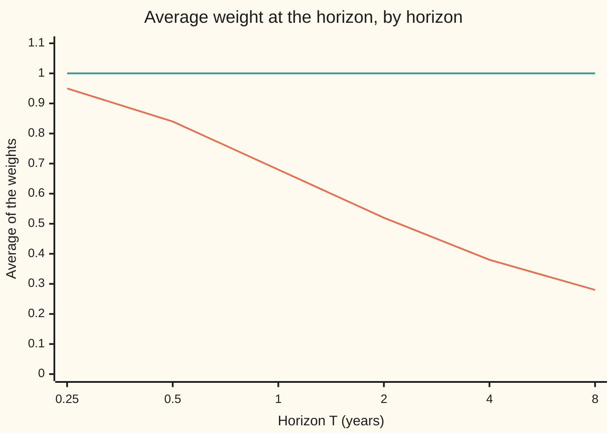
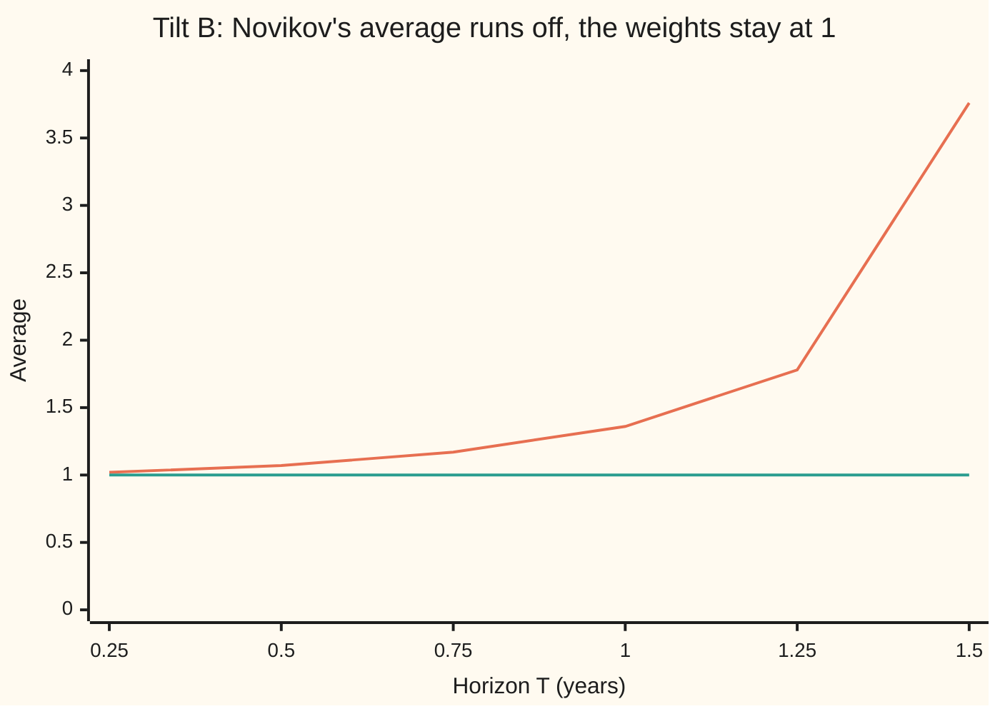

# Novikov: when the exponential martingale is a true martingale

[Syllabus](../../../SYLLABUS.md) → [Stochastic processes and calculus](../../../SYLLABUS.md#w11) → [Changing Measure](../../../SYLLABUS.md#w11-s07) → Novikov

---

## General Overview

A share drifts up 8 percent a year with volatility 20 percent. A trader prices it as if it drifted 5 percent. Girsanov's theorem ([Girsanov](02-girsanov-theorem.md)) builds the trader's world by giving every possible path of the share a weight, a positive number, and averaging with the weights. Paths that rose a lot get light weights; paths that fell get heavy ones. The real-world drift of 8 percent becomes 5 percent under the weighted average, and the volatility stays 20 percent.

That only works if the weights average exactly 1. Weights are chances in disguise: a weighted world whose chances add up to 0.68 is not a world. For the share, the weights do average 1, and the check is one line. Now let the tilt that sets the weights grow as the path goes. Grow it slowly and nothing goes wrong. Grow it fast enough, so that the extra drift it adds feeds on itself, and the weights average 0.682689 after one year. About 32 percent of the probability has leaked away. The leak rides on ever rarer paths whose weights climb ever higher, and vanishes with them.

Novikov's condition is the standard test that rules the leak out. Take half the accumulated squared tilt, raise e to that power, and average over all paths. If that average is finite, the weights average 1 and Girsanov applies. It is a sufficient test, not a necessary one: a tilt can fail it and still be safe.

**The candidate weights of Girsanov always average at most 1, and they average exactly 1 whenever the average of e to the half the accumulated squared tilt is finite; a tilt that feeds on the weight itself breaks this, and the missing mass is the chance that the weighted world blows up.**

**What kind of fact this is:** a theorem, proved on this card in Why it works (the full proof is in a folded callout), together with an exact counterexample proved on the card.

### The picture: how much weight survives



The falling line is tilt C below, the tilt that feeds on the weight: its weights average $2\Phi(1/\sqrt{T}) - 1$, which is 0.68 at one year and keeps falling. The flat line at 1 is the share's constant tilt, and also tilt B, which grows with the path and still loses nothing. Both lines come from the closed forms printed by the code; the falling one is confirmed at one year by an exact lattice walk and by a simulation.

---

## The formula

Notation first, with one-line reminders. Time $t$ is in years and runs to a horizon $T$. $W_t$ is Brownian motion under the real-world measure $P$, and $E$ averages under $P$. A second measure $Q$, with averages $E^Q$, is the reweighted world of [Changing the measure](01-change-of-measure-and-density-processes.md). The filtration $\mathcal{F}_t$ is what is known by time t. The tilt $\theta_t$ is any amount chosen using only what is known by time t. Its weight process is

$$Z_t = \exp\!\Big(-\int_0^t \theta_s\,dW_s - \tfrac12\int_0^t \theta_s^2\,ds\Big), \qquad dZ_t = -\theta_t Z_t\,dW_t, \qquad Z_0 = 1.$$

Here $dW_t$ is shorthand for an Ito integral, never a derivative, because the path has none. Girsanov sets $Q(A) = E[Z_T\,1_A]$ for each event A, where $1_A$ is 1 on the paths in A and 0 elsewhere. Under Q, $\widetilde W_t = W_t + \int_0^t \theta_s\,ds$ is a Brownian motion. **Novikov's condition:**

$$E\Big[\exp\!\Big(\tfrac12\int_0^T \theta_t^2\,dt\Big)\Big] < \infty \quad\Longrightarrow\quad E[Z_T] = 1, \text{ and } (Z_t) \text{ is a martingale on } [0, T].$$

**Read it aloud:** if e to the half the total squared tilt has a finite average, then the weights average exactly one, so Q is a genuine probability and Girsanov's theorem holds.

Without the condition only the inequality survives: $E[Z_T] \le 1$ always. The three tilts on this card:

| Tilt | $\theta_t$ | Novikov average, $T = 1$ | $E[Z_T]$ |
| --- | --- | --- | --- |
| A, the share | $(\mu - r)/\sigma = 0.15$ | 1.011314 | 1 |
| B, grows with the wander | $c\,W_t$, with $c = 1$ per year | 1.360447 (infinite from $T = \pi/2$) | 1 for every T |
| C, feeds on the weight | $-Z_t$, so $dZ_t = Z_t^2\,dW_t$ | infinite | $2\Phi(1/\sqrt{T}) - 1 = 0.682689$ |

| Symbol | Plain meaning | In our example | Push it up and the answer… |
| --- | --- | --- | --- |
| $W_t$, $\widetilde W_t$, $dW_t$ | Brownian motion under P; the shifted process that is Brownian under Q; shorthand inside an Ito integral | — | — |
| $t$, $s$, $T$ | times in years, s the earlier; T the horizon | T = 1 year, and 2 years for tilt B | C: the weights average less |
| $P$, $Q$, $Q_n$, $E$, $E^Q$, $1_A$ | the real-world measure, the reweighted one, and the reweighted one with the weight capped at n; averages; 1 on event A, else 0 | — | — |
| $\theta_t$ | the tilt, in units per square-root year: how hard the weights lean | 0.15; $W_t$; $-Z_t$ | the Novikov average rises |
| $Z_t$, $Z_T$, $Z_0$ | the weight process, the candidate density $dQ/dP$ seen at time t; its start | starts at 1 | — |
| $\mu$, $r$, $\sigma$ | the share's drift, the pricing drift, its volatility | 0.08, 0.05, 0.20 | $\mu$ up: tilt A up |
| $c$ | how fast tilt B grows with the path, per year | 1 | the Novikov horizon $\pi/(2c)$ shrinks |
| $\Phi$ | the standard normal cumulative distribution function | $\Phi(1) = 0.841345$ | — |
| $R_t$, $R_0$ | the reciprocal $1/Z_t$ under tilt C, and its start | starts at 1 | $R_0$ up: less leaks |
| $\tau_n$, $n$ | a cap time: in Step 1 when the running total of $\theta^2Z^2$ reaches n; under tilt C when the weight reaches the cap n | caps 10, 100, 1000 | fewer paths reach the cap |
| $M_t$, $\lambda$ | in the proof: $M_t = -\int_0^t\theta_s\,dW_s$, and a number between 0 and 1 | — | — |
| $h$ | the step of the lattice walk in the code | 0.1 down to 0.025 | the lattice error grows |

### When it holds

- **The tilt is chosen from the past.** $\theta_t$ may use the path up to t and nothing later. A tilt that peeks ahead makes the Ito integral meaningless and the theorem says nothing.
- **The tilt's total square is finite on every path.** Novikov's average needs $\int_0^T \theta_t^2\,dt$ to be finite; tilt A gives 0.0225 per year of horizon, tilt B gives $\int_0^T W_t^2\,dt$, finite on every path.
- **The average is finite, not merely each value.** Tilt B's total square is finite on every path, yet past $T = \pi/2 = 1.570796$ years its exponential has an infinite average. The test fails there while the weights still average 1: Novikov is sufficient, not necessary.
- **One fixed horizon.** The condition is checked on $[0, T]$ and certifies only that interval. On an infinite horizon a constant tilt passes every finite-T test, yet the weights tend to 0 along almost every path, and Q and P disagree completely about the far future.

---

## Why it works

### Step 0: fair over each instant is not fair over the year

The weight has no dt term: over each short step its average change is zero. A fair game in small steps adds up to a fair game over the year only if no average escapes along the way. Average can escape into rare paths whose weights run off to infinity, the way a lottery's tiny chance of a huge prize carries real value. Every step below is about whether that escape route is open.

### Step 1: the weight is fair up to any cap

For each n let $\tau_n$ be the first time the running total $\int_0^t \theta_s^2 Z_s^2\,ds$ reaches n (or T if it never does). Stopped there, the Ito integral $Z_{t \wedge \tau_n} - 1 = -\int_0^{t\wedge\tau_n}\theta_s Z_s\,dW_s$ has a finite second moment, so it is a true martingale ([The Ito integral](../06-Ito%20Calculus/01-ito-integral.md)). Here $t \wedge \tau_n$ means whichever comes first. So $E[Z_{t\wedge\tau_n}] = 1$ for every n. A process that is a martingale once stopped at such a sequence of times, rising to the end, is called a **local martingale**.

### Step 2: the weights average at most 1

$Z$ is positive. As n grows, $Z_{t\wedge\tau_n}$ tends to $Z_t$ on every path. Fatou's lemma (wing 10: the average of a limit of positive variables is at most the limit of the averages) gives, for s before t,

$$E[Z_t \mid \mathcal{F}_s] \le \liminf_{n} E[Z_{t\wedge\tau_n} \mid \mathcal{F}_s] = Z_s.$$

So Z is a **supermartingale**: its forecast never exceeds its present value. In particular $E[Z_T] \le 1$. Equality forces the full martingale property: $Z_s - E[Z_T \mid \mathcal{F}_s]$ is never negative and averages $E[Z_s] - 1 \le 0$, so it is zero. The whole question is whether Fatou's inequality is strict.

### Step 3: Girsanov needs the equality

$Q(\text{all paths}) = E[Z_T]$. If that is 0.68, Q is not a probability. Rescaling by 1/0.68 restores a total of 1, but Girsanov's proof uses $E[Z_t \mid \mathcal{F}_s] = Z_s$ to compute every conditional Q-average, and that identity is now false; under the rescaled measure $\widetilde W$ is not a Brownian motion. A price computed under such a Q is not a price.

### Step 4: Novikov's test closes the escape route

Write $M_t = -\int_0^t \theta_s\,dW_s$, so $Z_t = e^{M_t - \frac12\int_0^t\theta_s^2 ds}$. The proof splits $e^{M/2}$ into the square root of the weight times $e^{\frac14\int\theta^2}$. Cauchy-Schwarz then bounds the average of $e^{M/2}$ at every stopping time by the square root of Novikov's average. That bound makes slightly smaller exponential martingales, with the tilt scaled by a number $\lambda$ below 1, uniformly integrable (wing 10: no average can escape to large values), hence true martingales. Hölder's inequality transfers their average of 1 back to $Z$ as $\lambda$ rises to 1.

<details>
<summary>Detailed proof</summary>

Let $K = E[\exp(\tfrac12\int_0^T\theta_t^2dt)] < \infty$ and write $A_t = \int_0^t\theta_s^2ds$, so $Z = e^{M - A/2}$.

1. **A bound at every stopping time.** For a stopping time $\rho \le T$, $e^{M_\rho/2} = Z_\rho^{1/2}\,e^{A_\rho/4}$. By Cauchy-Schwarz, $E[e^{M_\rho/2}] \le E[Z_\rho]^{1/2}E[e^{A_\rho/2}]^{1/2} \le \sqrt{K}$, using $E[Z_\rho] \le 1$ (optional stopping for the positive supermartingale Z at a bounded time).
2. **A smaller tilt.** Fix $0 < \lambda < 1$ and let $Z^{(\lambda)} = e^{\lambda M - \lambda^2 A/2}$, the weight for the tilt $\lambda\theta$; it is a positive local martingale by Step 1. Check the algebra: $Z^{(\lambda)} = Z^{\lambda^2}\,e^{\lambda(1-\lambda)M}$.
3. **Hölder with exponents $1/\lambda^2$ and $1/(1-\lambda^2)$.** For any event B, $E[Z^{(\lambda)}_\rho 1_B] \le E[Z_\rho]^{\lambda^2}\,E[1_B e^{\gamma M_\rho}]^{1-\lambda^2}$ with $\gamma = \lambda(1-\lambda)/(1-\lambda^2) = \lambda/(1+\lambda) < \tfrac12$.
4. **Uniform integrability.** By Hölder again, $E[1_B e^{\gamma M_\rho}] \le P(B)^{1-2\gamma}\,E[e^{M_\rho/2}]^{2\gamma} \le P(B)^{1-2\gamma}K^{\gamma}$. This is small whenever $P(B)$ is small, uniformly over $\rho \le T$. So the stopped values $Z^{(\lambda)}_\rho$ are uniformly integrable, and the limit $n \to \infty$ in $E[Z^{(\lambda)}_{t\wedge\tau_n}\mid\mathcal{F}_s] = Z^{(\lambda)}_{s\wedge\tau_n}$ passes through the average (wing 10, Vitali). $Z^{(\lambda)}$ is a true martingale and $E[Z^{(\lambda)}_T] = 1$.
5. **Let $\lambda$ rise to 1.** Point 3 with B = all paths and $\rho = T$, then point 4's bound with $P(B) = 1$: $1 \le E[Z_T]^{\lambda^2}K^{\gamma(1-\lambda^2)} = E[Z_T]^{\lambda^2}K^{\lambda(1-\lambda)}$. As $\lambda \to 1$ the second factor tends to 1, so $E[Z_T] \ge 1$. Step 2 gave $\le 1$. Hence $E[Z_T] = 1$.

The proof used only the bound in step 1, on $\sup_\rho E[e^{M_\rho/2}]$. That weaker hypothesis is Kazamaki's condition. Revuz and Yor, chapter VIII, give this argument; Karatzas and Shreve, section 3.5, give another.

</details>

Tilt A passes at once. A constant tilt gives $\int_0^T\theta^2dt = \theta^2T$, a plain number, and Novikov's average is $e^{\theta^2T/2} = e^{0.01125} = 1.011314$. The share's weighted world exists, and under it the drift is $\mu - \sigma\theta = 0.05$.

### Step 5: a tilt that feeds on the weight leaks exactly $2 - 2\Phi(1/\sqrt{T})$

Take $\theta_t = -Z_t$, so $dZ_t = Z_t^2\,dW_t$. Under the would-be Q, W gains the drift $+Z_t$, and the weight's own equation becomes $dZ_t = Z_t^3\,dt + Z_t^2\,d\widetilde W_t$. Drop the noise and $dy = y^3dt$ from 1 gives $y = 1/\sqrt{1 - 2t}$, which blows up at 0.50 years. The drift grows too fast. The noise does not save it.

The reciprocal makes it exact. Ito's lemma ([Ito's lemma](../06-Ito%20Calculus/02-itos-lemma.md)) with $f(z) = 1/z$, $f'(z) = -1/z^2$, $f''(z) = 2/z^3$:

$$dR_t = -\frac{dZ_t}{Z_t^2} + \frac{(dZ_t)^2}{Z_t^3} = -dW_t + Z_t\,dt = -\big(dW_t - Z_t\,dt\big) = -d\widetilde W_t.$$

Under Q, $R_t = 1/Z_t$ is a Brownian motion started at 1. Brownian motion from 1 reaches 0 at some finite time, and at that moment Z is infinite. The leak is the Q-chance of reaching 0 by T. Made rigorous with caps:

1. **Cap the weight.** Let $\tau_n$ be the first time $Z_t = n$. The stopped weight lies between 0 and n, so its tilt is bounded and Novikov holds: $Q_n(A) = E[Z_{T\wedge\tau_n}1_A]$ is a probability.
2. **Under the capped measure, R is Brownian.** By Girsanov under $Q_n$, $\widetilde W$ is Brownian until $\tau_n$, so R is a Brownian motion from 1 until it reaches $1/n$.
3. **Reflection.** By [Reflection principle](../05-Brownian%20Motion/04-reflection-principle-and-running-maximum.md), a Brownian motion from 1 stays above $1/n$ through T with chance $2\Phi((1 - 1/n)/\sqrt{T}) - 1$.
4. **Split the average of 1.** $1 = E[Z_{T\wedge\tau_n}] = E[Z_T\,1_{\{\tau_n > T\}}] + n\,P(\tau_n \le T)$. The first term is $Q_n(\tau_n > T)$, the chance in point 3.
5. **Let the cap rise.** The second term tends to $2 - 2\Phi(1/\sqrt{T})$, which stays positive, so $P(\tau_n \le T)$ falls like $1/n$: under P the weight never blows up. Monotone convergence (wing 10) gives $E[Z_T] = 2\Phi(1/\sqrt{T}) - 1$.

At one year: $2\Phi(1) - 1 = 0.682689$, and 0.317311 has leaked. Point 4 shows where it went. With a cap of 100, mass 0.322174 rides on paths that hit the cap, and those paths have chance only 0.003222. With a cap of 1000 the mass is 0.317795 on a chance of 0.000318. The mass stays near 0.32 while the paths carrying it thin out to nothing. In the limit the paths are gone and the mass with them. By Novikov's own theorem, read backwards, $E[\exp(\tfrac12\int_0^1 Z_t^2\,dt)]$ must be infinite.

<details>
<summary>Another way to see the same weight</summary>

Under P, R has $dR_t = -dW_t + dt/R_t$: a Brownian motion pushed away from 0 by a force of size 1/R. That is the law of the distance from the origin of a three-dimensional Brownian motion started at distance 1, a Bessel process (Revuz and Yor, chapter XI). A three-dimensional Brownian motion started away from the origin never hits it, so R stays positive and Z stays finite. The code uses this fact as its second road: $Z_1 = 1/|(1,0,0) + G|$, with G three independent standard normals.

</details>

### Step 6: a tilt that grows with the wander fails the test and stays safe

Take $\theta_t = c\,W_t$ with $c = 1$ per year. Under Q, $dW_t = -cW_t\,dt + d\widetilde W_t$: W is pulled back toward 0, an Ornstein-Uhlenbeck process, which never blows up. Ito's lemma gives $\int_0^T W_t\,dW_t = \tfrac12(W_T^2 - T)$, so

$$Z_T = \exp\!\Big(\tfrac{c}{2}T - \tfrac{c}{2}W_T^2 - \tfrac{c^2}{2}\int_0^T W_t^2\,dt\Big).$$

A classical formula of Cameron and Martin gives $E[e^{-aW_T^2 - b\int_0^T W_t^2dt}] = (\cosh\kappa T + \tfrac{2a}{\kappa}\sinh\kappa T)^{-1/2}$ with $\kappa = \sqrt{2b}$. With $a = c/2$, $b = c^2/2$, the bracket is $e^{cT}$, and $E[Z_T] = e^{cT/2}e^{-cT/2} = 1$ for every T. With $a = 0$ and $b = -c^2/2$ the same formula, with cosh turned into cos, gives Novikov's average $1/\sqrt{\cos cT}$, finite only while $cT < \pi/2$. This card states the formula with its source and checks it by an exact Gaussian computation on a grid, which the code prints converging.



The rising line is Novikov's average $1/\sqrt{\cos T}$, which is infinite from $T = \pi/2 = 1.570796$ years. The flat line is $E[Z_T] = 1$, from the Cameron-Martin formula on the code's `chart, B E[Z_T]` row. The test is a sufficient condition with room to spare. A different sufficient test, Beneš's condition (Karatzas and Shreve, section 3.5), accepts any tilt read off the path of W itself that grows at most in proportion to the path's size; tilt B passes it at every horizon. Neither test implies the other.

### The other door

A direct route skips the general theorem: find the Q-dynamics, check they do not blow up, and conclude that Z is a martingale. That is what Steps 5 and 6 did. It is the test practitioners run on stochastic volatility models, where the tilt depends on the state and Novikov's average is often infinite.

---

## Worked numbers, by hand

The share and the leaking tilt, over T = 1 year.

| Step | Arithmetic | Value |
| --- | --- | --- |
| tilt A, the share | (0.08 − 0.05) / 0.20 | 0.15 |
| its square | 0.15 × 0.15 | 0.0225 |
| half the total squared tilt | 0.0225 × 1 / 2 | 0.01125 |
| Novikov's average | $e^{0.01125}$ | 1.011314, finite: Girsanov applies |
| drift under Q | 0.08 − 0.20 × 0.15 | 0.05 |
| tilt B's horizon | $\pi/2$ with c = 1 | 1.570796 years |
| tilt B's Novikov average at 1 year | $1/\sqrt{\cos 1} = 1/\sqrt{0.540302}$ | 1.360447 |
| tilt C: $\Phi(1/\sqrt{1})$ | table or series | 0.841345 |
| **tilt C: average weight** | 2 × 0.841345 − 1 | **0.682689** |
| leaked mass | 1 − 0.682689 | 0.317311 |

Under tilt C, a market built on these weights would price a sure dollar at one year at about 68 cents before discounting. The other 32 cents ride on ever rarer paths as the cap rises, and vanish with them.

### What breaks if you drop a piece

| Mistake | Comes out at | What went wrong |
| --- | --- | --- |
| Treat a positive local martingale as a martingale (tilt C) | $E[Z_1] = 1$ claimed; it is 0.682689 | no dt term means fair over each instant, not over the year |
| Read Novikov as necessary (tilt B at T = 2) | "no change of measure" claimed; the grid gives $E[Z_2]$ = 0.999847 at n = 1600, and 1 in the limit | the test is sufficient only |
| Check the condition on a shorter horizon | tilt B passes at T = 1.5 (3.759898), fails at T = 1.6 | the certificate covers $[0, T]$ only |
| Cap the weight and declare victory (tilt C, cap 100) | the capped weight averages 1, but 0.322174 of it sits on paths of chance 0.003222 | the cap hides the leak; lifting it loses the mass |

---

## Code, from first principles, and it actually runs

The code takes three roads for tilts B and C, and two for the share. Road 1 is the closed forms, with the normal distribution built from its Taylor series. Road 2 is exact arithmetic on a grid: for tilt B, the averages of Gaussian exponentials as determinants of a tridiagonal matrix (the grid path's inverse covariance) at four step counts, and a scan of T in steps of 0.01 for where Novikov's average first turns infinite; for tilt C, a lattice walk of steps h every $h^2$ years from 1, absorbed at 0, solved exactly by stepping its probabilities forward at three step sizes. Road 3 is a seeded simulation with SplitMix64 and Box-Muller written out, seed 20260930, each average printed with its standard error. Tilt B's simulation runs on a grid of 200 steps over 2 years and is compared with the exact mean on that same grid. Tilt C's simulation needs no grid: it uses the three-dimensional fact in the tip above, which is independent of the reflection argument it checks.

### Python

```python
# Novikov's condition -- the check behind the card.  Standard library only.
# Three tilts theta_t for Girsanov, time in years, W_t a Brownian motion under P:
#   A  constant 0.15: the share drifting 8% a year, priced at 5%, volatility 20%
#   B  theta_t = c W_t, c = 1 per year: the tilt grows with the wander
#   C  theta_t = -Z_t: the tilt grows with the weight itself, so dZ = Z^2 dW
# Roads: closed forms; exact Gaussian determinants and an exact lattice walk on
# shrinking grids; seeded simulation (SplitMix64 + Box-Muller) with standard errors.
from math import sqrt, exp, log, cos, sin, cosh, sinh, pi

def erf(x):                                   # Taylor series, accurate for |x| <= 3
    term, total, n = x, x, 0
    while abs(term) > 1e-17:
        n += 1
        term *= -x * x / n
        total += term / (2 * n + 1)
    return 2.0 / sqrt(pi) * total

class Rng:                                    # SplitMix64 uniforms, Box-Muller normals
    def __init__(self, seed): self.s, self.spare = seed, None
    def u(self):
        M = (1 << 64) - 1
        self.s = (self.s + 0x9E3779B97F4A7C15) & M
        z = ((self.s ^ (self.s >> 30)) * 0xBF58476D1CE4E5B9) & M
        z = ((z ^ (z >> 27)) * 0x94D049BB133111EB) & M
        return ((z ^ (z >> 31)) >> 11) * 2.0 ** -53
    def normal(self):
        if self.spare is not None:
            g, self.spare = self.spare, None
            return g
        r, a = sqrt(-2.0 * log(1.0 - self.u())), 2.0 * pi * self.u()
        self.spare = r * sin(a)
        return r * cos(a)

def mean_se(xs):                              # plain running sums (sum() compensates, Rust does not)
    s1 = s2 = 0.0
    for x in xs: s1, s2 = s1 + x, s2 + x * x
    m = s1 / len(xs)
    return m, sqrt((s2 / len(xs) - m * m) / len(xs))

def gauss(n, T, a, b):
    # E[exp(-a W_T^2 - b dt sum_{k=1..n} W_{k dt}^2)], dt = T/n, exactly: det(Tn + 2b dt^2 I + 2a dt e_n e_n)^(-1/2),
    # Tn = inverse covariance of the grid path times dt (diagonal 2,..,2,1, off-diagonal -1).  None = infinite.
    dt, d0, d1 = T / n, 1.0, 1.0
    for k in range(1, n + 1):
        dk = (2.0 if k < n else 1.0 + 2.0 * a * dt) + 2.0 * b * dt * dt
        d0, d1 = d1, dk * d1 - (d0 if k > 1 else 0.0)
        if d1 <= 0.0: return None
    return 1.0 / sqrt(d1)

def fmt(v): return "infinite" if v is None else f"{v:.6f}"

# ---- A: constant tilt, the shelf's share ----
mu, r, sig, T = 0.08, 0.05, 0.20, 1.0
th = (mu - r) / sig
rng = Rng(20260930)
zs = [exp(-th * sqrt(T) * g - 0.5 * th * th * T) for g in (rng.normal() for _ in range(100000))]
mA, sA = mean_se(zs)
print(f"A theta {th:.2f}   theta^2 {th * th:.4f}   half theta^2 T {0.5 * th * th * T:.5f}")
print(f"A Novikov E[exp(half int theta^2)] {exp(0.5 * th * th * T):.6f}   Q drift {mu - sig * th:.2f}")
print(f"A simulated E[Z_1], 100000 draws  {mA:.4f}  se {sA:.4f}")

# ---- B: theta_t = c W_t ----
c = 1.0
def novB(T): return 1.0 / sqrt(cos(c * T)) if c * T < pi / 2 else None
def ezB(T): return exp(0.5 * c * T) / sqrt(cosh(c * T) + sinh(c * T))   # Cameron-Martin, a = c/2, b = c^2/2
print(f"B Novikov horizon pi/(2c) {pi / (2 * c):.6f} years   cos(1) {cos(1.0):.6f}")
print("B grid n    Novikov T=1    error       E[Z_2] grid   error      Novikov T=2")
for n in (25, 100, 400, 1600):
    nv, ez = gauss(n, 1.0, 0.0, -0.5 * c * c), exp(c) * gauss(n, 2.0, 0.5 * c, 0.5 * c * c)
    print(f"B {n:6d} {nv:12.6f} {nv - novB(1.0):+11.7f} {ez:12.6f} {ez - 1.0:+11.7f}   {fmt(gauss(n, 2.0, 0.0, -0.5 * c * c))}")
print(f"B formula Novikov T=1 {novB(1.0):.6f}   T=1.5 {fmt(novB(1.5))}   T=1.6 {fmt(novB(1.6))}   T=2 {fmt(novB(2.0))}")
tstar = next(k / 100 for k in range(1, 401) if gauss(1600, k / 100, 0.0, -0.5 * c * c) is None)
print(f"B grid n 1600, T in steps of 0.01: Novikov first infinite at T = {tstar:.2f}   formula pi/(2c) {pi / (2 * c):.6f}")
steps, T2 = 200, 2.0
dt, zs = T2 / steps, []
for _ in range(20000):
    w, s = 0.0, 0.0
    for _ in range(steps):
        w += sqrt(dt) * rng.normal()
        s += dt * w * w
    zs.append(exp(0.5 * c * T2 - 0.5 * c * w * w - 0.5 * c * c * s))
mB, sB = mean_se(zs)
print(f"B simulated E[Z_2], 200 steps, 20000 paths {mB:.4f}  se {sB:.4f}   same grid exact {exp(c) * gauss(steps, T2, 0.5 * c, 0.5 * c * c):.6f}")
print("chart, B T          " + " ".join(f"{t:6.2f}" for t in (0.25, 0.5, 0.75, 1.0, 1.25, 1.5)))
print("chart, B Novikov    " + " ".join(f"{novB(t):6.2f}" for t in (0.25, 0.5, 0.75, 1.0, 1.25, 1.5)))
print("chart, B E[Z_T]     " + " ".join(f"{ezB(t):6.2f}" for t in (0.25, 0.5, 0.75, 1.0, 1.25, 1.5)))

# ---- C: dZ = Z^2 dW, the weight that feeds its own tilt ----
R0 = 1.0                                       # start of R = 1/Z, so Z_0 = 1/R0; weights are Z/Z_0
def survC(T): return erf(R0 / sqrt(2.0 * T))    # chance a Brownian motion from R0 stays above 0 to T
def lattice(h, T):                             # walk of +-h every h^2 years from R0, absorbed at 0
    k0, n = round(R0 / h), round(T / (h * h))
    p = [0.0] * (k0 + n + 2)
    p[k0] = 1.0
    for _ in range(n):
        p = [0.0] + [0.5 * (p[j - 1] + p[j + 1]) for j in range(1, len(p) - 1)] + [0.0]
        p[0] = 0.0
    tot = 0.0
    for v in p[1:]: tot += v
    return tot
print(f"C deterministic part dy = y^3 dt from 1 blows up at t = {0.5:.2f} years")
print(f"C formula E[Z_1] = 2 Phi(R0) - 1 = {survC(1.0):.6f}   Phi(1) {0.5 * (1 + erf(1 / sqrt(2))):.6f}   leak {1 - survC(1.0):.6f}")
lat = []
for h in (0.1, 0.05, 0.025):
    lat.append(lattice(h, 1.0))
    print(f"C lattice h {h:5.3f}  survival {lat[-1]:.6f}  error {lat[-1] - survC(1.0):+.6f}")
zs = []
for _ in range(200000):                        # Z_1/Z_0 = R0/|(R0,0,0) + 3-d Brownian motion at time 1|
    g1, g2, g3 = rng.normal(), rng.normal(), rng.normal()
    zs.append(R0 / sqrt((R0 + g1) * (R0 + g1) + g2 * g2 + g3 * g3))
mC, sC = mean_se(zs)
print(f"C simulated E[Z_1] under P, 200000 paths {mC:.4f}  se {sC:.4f}")
for cap in (10, 100, 1000):
    lost = 1.0 - erf((R0 - 1.0 / cap) / sqrt(2.0))
    print(f"C cap {cap:5d}: mass on capped paths {lost:.6f}, their chance {lost / (cap * R0):.6f}")
tc = (0.25, 0.5, 1.0, 2.0, 4.0, 8.0)
print("chart, C T          " + " ".join(f"{t:6.2f}" for t in tc))
print("chart, C E[Z_T]     " + " ".join(f"{survC(t):6.2f}" for t in tc))
print("chart, A E[Z_T]     " + " ".join(f"{exp(-0.5 * th * th * t) * exp(0.5 * th * th * t):6.2f}" for t in tc))

assert abs(mA - 1.0) < 4 * sA, "A: constant tilt, weights average 1"
assert abs(gauss(1600, 1.0, 0.0, -0.5 * c * c) - novB(1.0)) < 1e-3, "B: grid determinant vs 1/sqrt(cos cT)"
assert (gauss(1600, 2.0, 0.0, -0.5 * c * c) is None) == (novB(2.0) is None), "B: both roads agree on Novikov at T = 2"
assert abs(tstar - pi / (2 * c)) < 0.01, "B: the grid road blows up within a step of pi/(2c)"
assert abs(exp(c) * gauss(1600, 2.0, 0.5 * c, 0.5 * c * c) - 1.0) < 1e-3, "B: E[Z_2] = 1 though Novikov fails"
assert abs(mB - exp(c) * gauss(steps, T2, 0.5 * c, 0.5 * c * c)) < 4 * sB, "B: simulation vs same-grid exact"
assert abs(lat[-1] - survC(1.0)) < 0.01 and abs(lat[-1] - survC(1.0)) < abs(lat[0] - survC(1.0)), "C: lattice -> formula"
assert abs(mC - survC(1.0)) < 4 * sC, "C: P-side simulation vs Q-side reflection formula"
assert 1.0 - mC > 20 * sC, "C: the leak is real"
print("ALL CHECKS PASS")
```

**Ran 2026-10-07 on macOS, Python 3.14.6, standard library only. All checks passed. Output, pasted from the run:**

```
A theta 0.15   theta^2 0.0225   half theta^2 T 0.01125
A Novikov E[exp(half int theta^2)] 1.011314   Q drift 0.05
A simulated E[Z_1], 100000 draws  0.9997  se 0.0005
B Novikov horizon pi/(2c) 1.570796 years   cos(1) 0.540302
B grid n    Novikov T=1    error       E[Z_2] grid   error      Novikov T=2
B     25     1.382222  +0.0217754     0.990788  -0.0092123   infinite
B    100     1.365779  +0.0053326     0.997584  -0.0024163   infinite
B    400     1.361773  +0.0013264     0.999389  -0.0006112   infinite
B   1600     1.360778  +0.0003312     0.999847  -0.0001532   infinite
B formula Novikov T=1 1.360447   T=1.5 3.759898   T=1.6 infinite   T=2 infinite
B grid n 1600, T in steps of 0.01: Novikov first infinite at T = 1.58   formula pi/(2c) 1.570796
B simulated E[Z_2], 200 steps, 20000 paths 0.9970  se 0.0056   same grid exact 0.998782
chart, B T            0.25   0.50   0.75   1.00   1.25   1.50
chart, B Novikov      1.02   1.07   1.17   1.36   1.78   3.76
chart, B E[Z_T]       1.00   1.00   1.00   1.00   1.00   1.00
C deterministic part dy = y^3 dt from 1 blows up at t = 0.50 years
C formula E[Z_1] = 2 Phi(R0) - 1 = 0.682689   Phi(1) 0.841345   leak 0.317311
C lattice h 0.100  survival 0.680273  error -0.002417
C lattice h 0.050  survival 0.682085  error -0.000605
C lattice h 0.025  survival 0.682538  error -0.000151
C simulated E[Z_1] under P, 200000 paths 0.6814  se 0.0011
C cap    10: mass on capped paths 0.368120, their chance 0.036812
C cap   100: mass on capped paths 0.322174, their chance 0.003222
C cap  1000: mass on capped paths 0.317795, their chance 0.000318
chart, C T            0.25   0.50   1.00   2.00   4.00   8.00
chart, C E[Z_T]       0.95   0.84   0.68   0.52   0.38   0.28
chart, A E[Z_T]       1.00   1.00   1.00   1.00   1.00   1.00
ALL CHECKS PASS
```

### Rust

```rust
// Novikov's condition -- the check behind the card.  Rust std only.
// Three tilts theta_t for Girsanov, time in years, W_t a Brownian motion under P:
//   A  constant 0.15: the share drifting 8% a year, priced at 5%, volatility 20%
//   B  theta_t = c W_t, c = 1 per year: the tilt grows with the wander
//   C  theta_t = -Z_t: the tilt grows with the weight itself, so dZ = Z^2 dW
// Roads: closed forms; exact Gaussian determinants and an exact lattice walk on
// shrinking grids; seeded simulation (SplitMix64 + Box-Muller) with standard errors.
use std::f64::consts::PI;

fn erf(x: f64) -> f64 { // Taylor series, accurate for |x| <= 3
    let (mut term, mut total, mut n) = (x, x, 0.0);
    while term.abs() > 1e-17 {
        n += 1.0;
        term *= -x * x / n;
        total += term / (2.0 * n + 1.0);
    }
    2.0 / PI.sqrt() * total
}

struct Rng { s: u64, spare: Option<f64> } // SplitMix64 uniforms, Box-Muller normals
impl Rng {
    fn u(&mut self) -> f64 {
        self.s = self.s.wrapping_add(0x9E3779B97F4A7C15);
        let mut z = (self.s ^ (self.s >> 30)).wrapping_mul(0xBF58476D1CE4E5B9);
        z = (z ^ (z >> 27)).wrapping_mul(0x94D049BB133111EB);
        ((z ^ (z >> 31)) >> 11) as f64 * 2f64.powi(-53)
    }
    fn normal(&mut self) -> f64 {
        if let Some(g) = self.spare.take() { return g; }
        let r = (-2.0 * (1.0 - self.u()).ln()).sqrt();
        let a = 2.0 * PI * self.u();
        self.spare = Some(r * a.sin());
        r * a.cos()
    }
}

fn mean_se(xs: &[f64]) -> (f64, f64) {
    let (mut s1, mut s2) = (0.0, 0.0);
    for &x in xs { s1 += x; s2 += x * x; }
    let n = xs.len() as f64;
    let m = s1 / n;
    (m, ((s2 / n - m * m) / n).sqrt())
}

// E[exp(-a W_T^2 - b dt sum_{k=1..n} W_{k dt}^2)], dt = T/n, exactly: det(Tn + 2b dt^2 I + 2a dt e_n e_n)^(-1/2).
fn gauss(n: usize, t: f64, a: f64, b: f64) -> Option<f64> {
    let (dt, mut d0, mut d1) = (t / n as f64, 1.0, 1.0);
    for k in 1..=n {
        let dk = (if k < n { 2.0 } else { 1.0 + 2.0 * a * dt }) + 2.0 * b * dt * dt;
        let next = dk * d1 - if k > 1 { d0 } else { 0.0 };
        d0 = d1;
        d1 = next;
        if d1 <= 0.0 { return None; }
    }
    Some(1.0 / d1.sqrt())
}

fn fmt(v: Option<f64>) -> String { match v { None => "infinite".to_string(), Some(x) => format!("{:.6}", x) } }
fn row(xs: &[f64]) -> String { xs.iter().map(|v| format!("{:6.2}", v)).collect::<Vec<_>>().join(" ") }

fn main() {
    // ---- A: constant tilt, the shelf's share ----
    let (mu, r, sig, t) = (0.08, 0.05, 0.20, 1.0);
    let th: f64 = (mu - r) / sig;
    let mut rng = Rng { s: 20260930, spare: None };
    let zs: Vec<f64> = (0..100000).map(|_| { let g = rng.normal(); (-th * f64::sqrt(t) * g - 0.5 * th * th * t).exp() }).collect();
    let (ma, sa) = mean_se(&zs);
    println!("A theta {:.2}   theta^2 {:.4}   half theta^2 T {:.5}", th, th * th, 0.5 * th * th * t);
    println!("A Novikov E[exp(half int theta^2)] {:.6}   Q drift {:.2}", (0.5 * th * th * t).exp(), mu - sig * th);
    println!("A simulated E[Z_1], 100000 draws  {:.4}  se {:.4}", ma, sa);

    // ---- B: theta_t = c W_t ----
    let c: f64 = 1.0;
    let nov_b = |t: f64| -> Option<f64> { if c * t < PI / 2.0 { Some(1.0 / (c * t).cos().sqrt()) } else { None } };
    let ez_b = |t: f64| (0.5 * c * t).exp() / ((c * t).cosh() + (c * t).sinh()).sqrt(); // Cameron-Martin, a = c/2, b = c^2/2
    println!("B Novikov horizon pi/(2c) {:.6} years   cos(1) {:.6}", PI / (2.0 * c), 1f64.cos());
    println!("B grid n    Novikov T=1    error       E[Z_2] grid   error      Novikov T=2");
    for n in [25usize, 100, 400, 1600] {
        let nv = gauss(n, 1.0, 0.0, -0.5 * c * c).unwrap();
        let ez = c.exp() * gauss(n, 2.0, 0.5 * c, 0.5 * c * c).unwrap();
        println!("B {:6} {:12.6} {:+11.7} {:12.6} {:+11.7}   {}", n, nv, nv - nov_b(1.0).unwrap(), ez, ez - 1.0, fmt(gauss(n, 2.0, 0.0, -0.5 * c * c)));
    }
    println!("B formula Novikov T=1 {:.6}   T=1.5 {}   T=1.6 {}   T=2 {}", nov_b(1.0).unwrap(), fmt(nov_b(1.5)), fmt(nov_b(1.6)), fmt(nov_b(2.0)));
    let tstar = (1..=400).map(|k| k as f64 / 100.0).find(|&x| gauss(1600, x, 0.0, -0.5 * c * c).is_none()).unwrap();
    println!("B grid n 1600, T in steps of 0.01: Novikov first infinite at T = {:.2}   formula pi/(2c) {:.6}", tstar, PI / (2.0 * c));
    let (steps, t2) = (200usize, 2.0);
    let dt = t2 / steps as f64;
    let mut zs = Vec::new();
    for _ in 0..20000 {
        let (mut w, mut s) = (0.0, 0.0);
        for _ in 0..steps {
            w += dt.sqrt() * rng.normal();
            s += dt * w * w;
        }
        zs.push((0.5 * c * t2 - 0.5 * c * w * w - 0.5 * c * c * s).exp());
    }
    let (mb, sb) = mean_se(&zs);
    let grid_b = c.exp() * gauss(steps, t2, 0.5 * c, 0.5 * c * c).unwrap();
    println!("B simulated E[Z_2], 200 steps, 20000 paths {:.4}  se {:.4}   same grid exact {:.6}", mb, sb, grid_b);
    let tb = [0.25, 0.5, 0.75, 1.0, 1.25, 1.5];
    println!("chart, B T          {}", row(&tb));
    println!("chart, B Novikov    {}", row(&tb.iter().map(|&x| nov_b(x).unwrap()).collect::<Vec<_>>()));
    println!("chart, B E[Z_T]     {}", row(&tb.iter().map(|&x| ez_b(x)).collect::<Vec<_>>()));

    // ---- C: dZ = Z^2 dW, the weight that feeds its own tilt ----
    let r0: f64 = 1.0; // start of R = 1/Z, so Z_0 = 1/R0; weights are Z/Z_0
    let surv_c = |t: f64| erf(r0 / (2.0 * t).sqrt()); // chance a Brownian motion from R0 stays above 0 to T
    let lattice = |h: f64, t: f64| -> f64 { // walk of +-h every h^2 years from R0, absorbed at 0
        let (k0, n) = ((r0 / h).round() as usize, (t / (h * h)).round() as usize);
        let mut p = vec![0.0; k0 + n + 2];
        p[k0] = 1.0;
        for _ in 0..n {
            let mut q = vec![0.0; p.len()];
            for j in 1..p.len() - 1 { q[j] = 0.5 * (p[j - 1] + p[j + 1]); }
            q[0] = 0.0;
            p = q;
        }
        let mut tot = 0.0;
        for v in &p[1..] { tot += v; }
        tot
    };
    println!("C deterministic part dy = y^3 dt from 1 blows up at t = {:.2} years", 0.5);
    let s1 = surv_c(1.0);
    println!("C formula E[Z_1] = 2 Phi(R0) - 1 = {:.6}   Phi(1) {:.6}   leak {:.6}", s1, 0.5 * (1.0 + erf(1.0 / 2f64.sqrt())), 1.0 - s1);
    let mut lat = Vec::new();
    for h in [0.1, 0.05, 0.025] {
        lat.push(lattice(h, 1.0));
        let l = *lat.last().unwrap();
        println!("C lattice h {:5.3}  survival {:.6}  error {:+.6}", h, l, l - s1);
    }
    let mut zs = Vec::new();
    for _ in 0..200000 { // Z_1/Z_0 = R0/|(R0,0,0) + 3-d Brownian motion at time 1|
        let (g1, g2, g3) = (rng.normal(), rng.normal(), rng.normal());
        zs.push(r0 / ((r0 + g1) * (r0 + g1) + g2 * g2 + g3 * g3).sqrt());
    }
    let (mc, sc) = mean_se(&zs);
    println!("C simulated E[Z_1] under P, 200000 paths {:.4}  se {:.4}", mc, sc);
    for cap in [10usize, 100, 1000] {
        let lost = 1.0 - erf((r0 - 1.0 / cap as f64) / 2f64.sqrt());
        println!("C cap {:5}: mass on capped paths {:.6}, their chance {:.6}", cap, lost, lost / (cap as f64 * r0));
    }
    let tc = [0.25, 0.5, 1.0, 2.0, 4.0, 8.0];
    println!("chart, C T          {}", row(&tc));
    println!("chart, C E[Z_T]     {}", row(&tc.iter().map(|&x| surv_c(x)).collect::<Vec<_>>()));
    println!("chart, A E[Z_T]     {}", row(&tc.iter().map(|&x| (-0.5 * th * th * x).exp() * (0.5 * th * th * x).exp()).collect::<Vec<_>>()));

    assert!((ma - 1.0).abs() < 4.0 * sa, "A: constant tilt, weights average 1");
    assert!((gauss(1600, 1.0, 0.0, -0.5 * c * c).unwrap() - nov_b(1.0).unwrap()).abs() < 1e-3, "B: grid determinant vs 1/sqrt(cos cT)");
    assert!(gauss(1600, 2.0, 0.0, -0.5 * c * c).is_none() == nov_b(2.0).is_none(), "B: both roads agree on Novikov at T = 2");
    assert!((tstar - PI / (2.0 * c)).abs() < 0.01, "B: the grid road blows up within a step of pi/(2c)");
    assert!((c.exp() * gauss(1600, 2.0, 0.5 * c, 0.5 * c * c).unwrap() - 1.0).abs() < 1e-3, "B: E[Z_2] = 1 though Novikov fails");
    assert!((mb - grid_b).abs() < 4.0 * sb, "B: simulation vs same-grid exact");
    assert!((lat[2] - s1).abs() < 0.01 && (lat[2] - s1).abs() < (lat[0] - s1).abs(), "C: lattice -> formula");
    assert!((mc - s1).abs() < 4.0 * sc, "C: P-side simulation vs Q-side reflection formula");
    assert!(1.0 - mc > 20.0 * sc, "C: the leak is real");
    println!("ALL CHECKS PASS");
}
```

**Ran 2026-10-07 on macOS, rustc 1.98.1, no crates. All checks passed. Output, pasted from the run:**

```
A theta 0.15   theta^2 0.0225   half theta^2 T 0.01125
A Novikov E[exp(half int theta^2)] 1.011314   Q drift 0.05
A simulated E[Z_1], 100000 draws  0.9997  se 0.0005
B Novikov horizon pi/(2c) 1.570796 years   cos(1) 0.540302
B grid n    Novikov T=1    error       E[Z_2] grid   error      Novikov T=2
B     25     1.382222  +0.0217754     0.990788  -0.0092123   infinite
B    100     1.365779  +0.0053326     0.997584  -0.0024163   infinite
B    400     1.361773  +0.0013264     0.999389  -0.0006112   infinite
B   1600     1.360778  +0.0003312     0.999847  -0.0001532   infinite
B formula Novikov T=1 1.360447   T=1.5 3.759898   T=1.6 infinite   T=2 infinite
B grid n 1600, T in steps of 0.01: Novikov first infinite at T = 1.58   formula pi/(2c) 1.570796
B simulated E[Z_2], 200 steps, 20000 paths 0.9970  se 0.0056   same grid exact 0.998782
chart, B T            0.25   0.50   0.75   1.00   1.25   1.50
chart, B Novikov      1.02   1.07   1.17   1.36   1.78   3.76
chart, B E[Z_T]       1.00   1.00   1.00   1.00   1.00   1.00
C deterministic part dy = y^3 dt from 1 blows up at t = 0.50 years
C formula E[Z_1] = 2 Phi(R0) - 1 = 0.682689   Phi(1) 0.841345   leak 0.317311
C lattice h 0.100  survival 0.680273  error -0.002417
C lattice h 0.050  survival 0.682085  error -0.000605
C lattice h 0.025  survival 0.682538  error -0.000151
C simulated E[Z_1] under P, 200000 paths 0.6814  se 0.0011
C cap    10: mass on capped paths 0.368120, their chance 0.036812
C cap   100: mass on capped paths 0.322174, their chance 0.003222
C cap  1000: mass on capped paths 0.317795, their chance 0.000318
chart, C T            0.25   0.50   1.00   2.00   4.00   8.00
chart, C E[Z_T]       0.95   0.84   0.68   0.52   0.38   0.28
chart, A E[Z_T]       1.00   1.00   1.00   1.00   1.00   1.00
ALL CHECKS PASS
```

The two outputs agree line for line.

> [!TIP]
> **Try changing**
> - **Guess first: add `16.0` to tilt C's horizons `tc`.** Does the leak ever stop? The new point on the `chart, C E[Z_T]` row is 0.20, after 0.52 at 2 years and 0.28 at 8. The leak never stops, because a Brownian motion from 1 reaches 0 eventually with certainty.
> - **Guess first: set `c = 0.5` in the B block.** The Novikov horizon $\pi/(2c)$ doubles to 3.141593 years and the grid first fails at T = 3.15. Both roads now give a finite Novikov average at T = 2, 1.360447 by the formula and 1.360778 on the grid of 1600 steps, and every assert still passes: the test now certifies 2 years.
> - **Guess first: drop the 1/2 from tilt A's weight**, using `exp(-th * sqrt(T) * g)`. The simulated mean becomes $e^{0.01125}$ instead of 1 and the first assert fails.
> - **Guess first: set `R0 = 0.5` in the C block** (`r0` in Rust). That starts tilt C's weight at $Z_0 = 1/R_0 = 2$ and divides the weight by it. The reciprocal starts nearer 0, the Brownian motion reaches it sooner, and more mass leaks: the formula becomes $2\Phi(R_0/\sqrt{T}) - 1$ = 0.382925 at one year, the lattice and the simulation (0.3825, standard error 0.0006) follow it, and every assert still passes.

---

## The usual mistake

> [!warning]
> **"The weight has no dt term, so it is a martingale."** No dt term makes the weight a local martingale: fair up to every cap. A true martingale needs the caps to be removable without losing average, and a tilt that feeds on the weight removes 0.317311 of it in one year. Check Novikov, or find the Q-dynamics and check they do not blow up.
>
> - **Reading Novikov as an "if and only if".** Tilt B fails it from 1.570796 years on and its weights average 1 at every horizon.
> - **Trusting a grid.** The grid version of tilt C's weight, multiplied step by step by $e^{Z\Delta W - Z^2\Delta t/2}$, where $\Delta W$ is the path's move over a grid step of length $\Delta t$, is an exact martingale on the grid, with average 1 at every step size. The leak appears only in the limit. Tilt C's simulation samples the exact weight, which is why it can find 0.6814.
> - **Rescaling a leaky Q to total 1.** The total is fixed; the Brownian property of $\widetilde W$ is not, and every price computed under it is off.
> - **Weakening the 1/2 inside Novikov's exponential.** The 1/2 is sharp: for any smaller constant in front there are tilts that pass the weakened test and whose weights still leak.

---

## Where you meet it in real life

- **Black-Scholes pricing.** The share's constant tilt passes in one line, which is why [Black–Scholes call](../../12-Financial%20mathematics/08-The%20Black-Scholes%20call%20and%20put/01-black-scholes-call.md) can switch from 8 percent to 5 percent without a second thought.
- **Stochastic volatility and short-rate models.** The market price of risk depends on the state, Novikov's average is often infinite, and modellers prove the weights are a martingale by the direct route of Step 6 instead.
- **Price bubbles.** The process $dZ_t = Z_t^2\,dW_t$ is the standard example of a strict local martingale. Used as a price under a risk-neutral measure, it is a price that is fair over each instant yet expected to fall: the textbook model of a bubble.
- **Importance sampling.** Simulating under a tilted measure and multiplying by the weight is unbiased only if the weights average 1; a leaking tilt biases every estimate low.

> **Say it back**
> Girsanov's weights are always fair over each instant and always average at most one. They average exactly one when e to the half the total squared tilt has a finite average: that is Novikov's condition. A tilt that feeds on the weight breaks it, and the weights average $2\Phi(1/\sqrt{T}) - 1$, which is 0.68 after one year. The missing mass rides on ever rarer, ever heavier paths and vanishes with them. The test is sufficient, not necessary: a tilt that grows only with the path's size fails it and is still safe.

---

## What this builds on

- [Girsanov](02-girsanov-theorem.md): the weight process and the shifted Brownian motion this card certifies.
- [Brownian martingales](../05-Brownian%20Motion/06-brownian-martingales-and-exponential-martingale.md): the constant-tilt case, a true martingale by a direct Gaussian average.
- [Stopping without a bound](../02-Martingales/06-uniform-integrability-and-unbounded-stopping.md): why a fair game can lose its average at the limit.
- [Ito's lemma](../06-Ito%20Calculus/02-itos-lemma.md): the reciprocal $1/Z$ and the integral of W against itself.

---

## Where this goes next

- [Martingale representation](04-martingale-representation-theorem.md): every Q-martingale is an Ito integral, which turns a certified change of measure into a hedge.
- [Change of numeraire](05-change-of-numeraire.md): weights built from a traded asset's price, where the martingale property is the asset's own fairness.

With the weights certified, the open question is what the reweighted world buys: which payoffs can be built from the share and cash, and at what cost.

---

## Sources

Verified 2026-10-06: every link below resolves to the publisher's page naming the cited work; both DOIs checked against Crossref.

- Novikov, A. A. "On an Identity for Stochastic Integrals." *Theory of Probability and Its Applications* 17, no. 4 (1972; English edition issued 1973): 717–720. [doi:10.1137/1117088](https://doi.org/10.1137/1117088). The condition, in the original.
- Karatzas, I., and S. E. Shreve. *Brownian Motion and Stochastic Calculus*, 2nd ed. Springer, Graduate Texts in Mathematics 113. [Springer](https://link.springer.com/book/10.1007/978-1-4612-0949-2). Section 3.5: Girsanov, Novikov's condition and Beneš's linear-growth condition.
- Revuz, D., and M. Yor. *Continuous Martingales and Brownian Motion*, 3rd ed. Springer, Grundlehren 293. [Springer](https://link.springer.com/book/10.1007/978-3-662-06400-9). Chapter VIII: the Hölder proof of Novikov's criterion via Kazamaki's; chapter XI: Bessel processes.
- Cameron, R. H., and W. T. Martin. "Transformations of Wiener Integrals under a General Class of Linear Transformations." *Transactions of the American Mathematical Society* 58 (1945): 184–219. [doi:10.1090/S0002-9947-1945-0013240-1](https://doi.org/10.1090/S0002-9947-1945-0013240-1). The Gaussian average of $\exp(\lambda\int W^2)$ used for tilt B.
