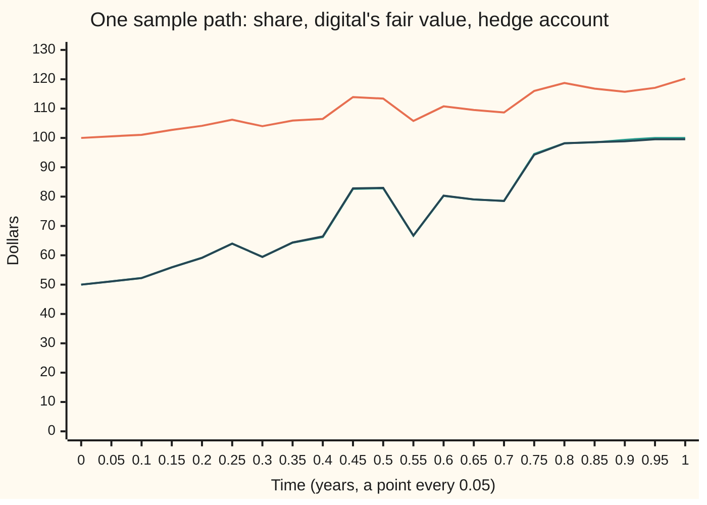
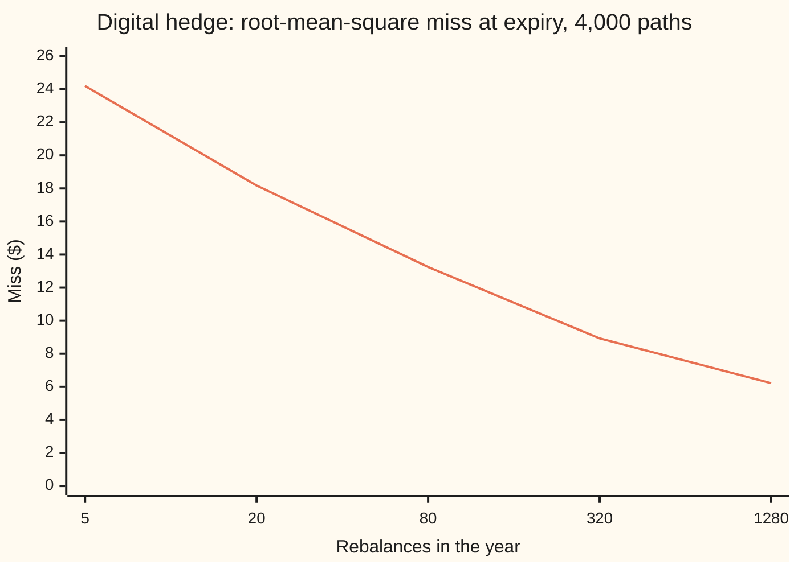

# Martingale representation: every Brownian martingale is an Ito integral

Stochastic processes and calculus → Changing Measure → Hedging every claim → Martingale representation

---

## General Overview

A share trades at $100. Over the next year it wanders with no drift: a year from now its price is spread around $100 with a standard deviation of $20. The bank pays no interest, so a borrowed dollar is still one dollar at the end of the year.

A dealer sells a ticket that pays $100 if the share ends the year above $100, and nothing otherwise. A one-off, all-or-nothing payment like this is called a **digital**. Today the share is as likely to finish above $100 as below, so the ticket's fair value is $50. The dealer takes $50 and now owes either $100 or nothing. Can the dealer trade the share, through the year, so that the trading account ends at exactly what the ticket pays, whatever path the share takes?

On a coin-toss tree the answer is yes: [martingale-representation-in-discrete-time](../02-Martingales/07-martingale-representation-in-discrete-time.md) proved that on each day's fork every fair move is a multiple of the share's move. This card proves it for a share driven by Brownian motion, which moves at every instant. For the digital: start with $50, hold about 2 shares, borrow the rest, and keep resetting the holding to the slope of the ticket's fair value. The account tracks that value along every path and lands on the payment.

Every payment fixed by the share's path, with a finite average square, has such a strategy, and only one. The theorem is called **martingale representation**; in a market it says **every claim can be hedged**.

**When Brownian motion is the only source of news, every fair game with a finite average square is its starting value plus the gain of one trading strategy in the Brownian motion; so every payoff equals its average plus an Ito integral, and the average is what the hedge costs.**

**What kind of fact this is:** a theorem. The digital case is proved on this card in Why it works, by Ito's lemma; the general case is proved in a folded Detailed proof, which quotes the uniqueness of Fourier transforms and the completeness of square-integrable variables from wing 10.

### The picture: one year, the ticket's value and the hedge account



One sample path on a grid of 1,280 steps (path 7 of the seeded run). Orange: the share, ending at $120.24. Green: the ticket's fair value, ending at the $100 payment. Dark blue, almost on the green: the account, started at $50 and rebalanced 1,280 times, ending at $99.56. The shortfall comes from trading at 1,280 moments instead of continuously.

---

## The formula

Notation first, in words. Brownian motion $W_t$, read "the random walk seen from far away", is the share's wandering part, with $t$ in years. What is known by time $t$, the path of $W$ up to then and nothing else, is written $\mathcal F_t$. The Ito integral $\int_0^T \varphi_t \, dW_t$ is the gain from holding $\varphi_t$ units of $W$ at each moment, with each holding fixed before the move it bets on ([ito-integral](../06-Ito%20Calculus/01-ito-integral.md)); $dW_t$ is shorthand for that sum and its limit, never a derivative, because the path has no slope.

The theorem. Let $V$ be any payoff fixed by $\mathcal F_T$, with $E[V^2]$ finite. Then there is exactly one strategy $\varphi_t$, fixed by $\mathcal F_t$ at each $t$, with $E\left[\int_0^T \varphi_t^2\,dt\right]$ finite, such that

$$V = E[V] + \int_0^T \varphi_t \, dW_t .$$

**Read it aloud:** the payoff is its average plus the gain of one strategy in the Brownian motion, and nothing else is left over.

The same fact, said for fair games. Every martingale $M_t$ with $E[M_T^2]$ finite is

$$M_t = M_0 + \int_0^t \varphi_s \, dW_s ,$$

where $M_t = E[V \mid \mathcal F_t]$ is the payoff's fair value once the path up to $t$ is known.

For the digital, with share price $S_t = 100 + \sigma W_t$, $\sigma = 20$ and strike $K = 100$, both pieces have closed forms (in this arithmetic model the price could in principle go negative, but $0 is five standard deviations away):

$$M_t = 100\,N\!\left(\frac{S_t - K}{\sigma\sqrt{T-t}}\right), \qquad H_t = \frac{\varphi_t}{\sigma} = \frac{100\,N'\!\left(\frac{S_t - K}{\sigma\sqrt{T-t}}\right)}{\sigma\sqrt{T-t}} .$$

**Read it aloud:** the ticket is worth $100 times the chance of finishing above $100 from here; the shares to hold are the slope of that value.

Since the share moves $\sigma$ dollars for every unit of $W$, $\int \varphi_t \, dW_t = \int H_t \, dS_t$: the integral in $W$ is a trading gain in shares.

| Symbol | Plain meaning | In our example | Push it up and the answer… |
| --- | --- | --- | --- |
| $W_t$, $W_s$, $W$, $dW_t$, $B_t$ | Brownian motion, the share's source of news; $B_t$ is a second, independent one (What breaks only) | starts at 0 | — |
| $t$, $T$, $n$, $\Delta t$, $dt$ | time in years; the expiry; the number of trades or tree steps; the gap between them, $T/n$ | $T = 1$; $n$ from 5 to 1,280 in the code | more trades, smaller hedge error |
| $\mathcal F_t$ | what is known by time $t$: the path of $W$ so far | the share's path up to $t$ | — |
| $S_t$, $S_0$, $K$, $dS$ | share price at $t$; today's price; the strike, the line the digital pays above | $S_0 = K = 100$ dollars | higher $S_t$, higher ticket value |
| $\sigma$ | dollars the share moves per unit of $W$; its standard deviation over one year | 20 | lower stakes, value nearer $50 for longer |
| $V$ | the payoff, fixed at $T$ | $100 if $S_T > 100$, else $0 | — |
| $E$, $\mathrm{Var}$, $Q$, $E^Q$ | average and variance over the paths; $Q$ a second measure, with $E^Q$ its average | $E[V] = 50$, $\mathrm{Var}(V) = 2500$ | — |
| $M_t$, $M_0$, $M$ | fair value of the payoff at $t$, $E[V \mid \mathcal F_t]$ | $M_0 = 50$ dollars | — |
| $\varphi_t$, $\varphi'_t$ | the strategy in units of $W$; a rival one (uniqueness only) | $\varphi_0 = 39.89$ | — |
| $H_t$ | shares held, $\varphi_t / \sigma$ | 1.9947 at the start | — |
| $N$, $N'$ | bell-curve area to the left of a point; the bell curve's height there | $N(0) = 0.5$, $N'(0) = 0.3989$ | — |
| $h$, $\mathcal E^h_t$, $G$, $R$, $\lambda_i$, $\Delta_i$, $\varphi_k$ | Detailed proof only: a step-shaped rate, its exponential martingale, a payoff to be ruled out, the representable payoffs, rates, increments, a sequence of strategies | — | — |

### When it holds

- **Brownian motion is the only news.** $\mathcal F_t$ must be the information the path of $W_t$ generates. If the payoff also depends on an independent noise $B_t$, the best hedge in the share, even one that watches $B_t$, misses by $35.82 root-mean-square (the square root of the average squared miss) at 1,280 trades, against a floor of $35.36 no trading removes.
- **The payoff is fixed by time $T$ and has a finite average square,** $E[V^2] < \infty$. The digital, bounded by $100, qualifies.
- **The strategy has a finite average square,** $E\left[\int_0^T \varphi_t^2\,dt\right] < \infty$. Without it a doubling-style strategy turns $0 into at least $50 on 96% of paths at 1,280 trades, and into exactly $50 on all of them in the limit: the constant $50 gets two representations.
- **The share moves,** $\sigma \ne 0$; otherwise $H_t = \varphi_t / \sigma$ divides by zero.
- **Trading is continuous.** The theorem is about the limit: 5 trades a year miss by $24.20 root-mean-square, 1,280 trades by $6.22.

---

## Why it works

### Step 0: one fork per instant

On the coin-toss tree, a day has two outcomes. Anything that averages to zero over a two-way fork is fixed by its value on heads, so every fair move is a multiple of the share's move. That multiple is the stake.

Brownian motion is the coin-toss walk seen from far away ([brownian-motion](../05-Brownian%20Motion/01-brownian-motion.md)). In each short stretch the only news is the next increment of $W_t$, so a fair game's move can only be a multiple of it. Adding the stretches gives an Ito integral. A second noise would break exactly this step.

### Step 1: the digital's fair value

Given the path up to $t$, the share's final price is $S_t$ plus $\sigma$ times an independent bell-curve move with standard deviation $\sqrt{T - t}$. It finishes above $K$ with chance $N\big((S_t - K)/(\sigma\sqrt{T-t})\big)$. So $M_t = 100\,N(\cdot)$, as in the formula. By the tower rule, averaging in stages, $M_t$ is a martingale ([martingales](../02-Martingales/01-martingales.md)). It starts at $50 and ends at the payment.

### Step 2: Ito's lemma hands over the strategy

Write $M_t = u(t, S_t)$, with $u(t, s) = 100\,N\big((s - K)/(\sigma\sqrt{T-t})\big)$. Ito's lemma ([itos-lemma](../06-Ito%20Calculus/02-itos-lemma.md)) splits the change of $M$ into a part that bets on the share and a part that grows with time:

$$dM_t = \frac{\partial u}{\partial s}\,dS_t + \left(\frac{\partial u}{\partial t} + \tfrac12\sigma^2 \frac{\partial^2 u}{\partial s^2}\right) dt .$$

The $\tfrac12\sigma^2$ term is the share's quadratic variation, $\sigma^2$ per year ([quadratic-variation](../05-Brownian%20Motion/03-quadratic-variation.md)); ordinary calculus would drop it.

$M$ is a martingale, so the $dt$ part, a drift, must be zero. It is: this $u$ solves the backward heat equation, $\partial u/\partial t + \tfrac12\sigma^2\,\partial^2 u/\partial s^2 = 0$. At $t = 0.5$ and $S = 110$ the code measures $\partial u/\partial t = 21.9696$ and $\tfrac12\sigma^2\,\partial^2 u/\partial s^2 = -21.9696$ by finite differences. What is left is

$$dM_t = \frac{\partial u}{\partial s}\,dS_t = \sigma\,\frac{\partial u}{\partial s}\,dW_t .$$

So $H_t = \partial u / \partial s$, the slope of the ticket's value in the share's price, and $\varphi_t = \sigma H_t$. Differentiating $u$ gives the closed form in The formula; the bumped slope at $t = 0.5$, $S = 110$ is 2.196956 shares, matching it to six decimals. Ito's lemma needs $u$ smooth, and at the strike on the expiry date it is not (the stake grows without bound there), so it is applied only up to times $t < T$, giving $M_t = 50 + \int_0^t \varphi_s\,dW_s$. As $t$ rises to $T$, $M_t$ tends to $V$ in mean square (it is bounded by $100), and by the isometry the integrals tend to $\int_0^T \varphi_s\,dW_s$. This proves the theorem for the digital and for any payoff of the final price alone, with $u(t, s)$ the payoff's average given $S_t = s$: the link between averages and equations is [feynman-kac-formula](06-feynman-kac-formula.md) (Feynman-Kac).

### Step 3: the tree's stake becomes the slope

The discrete theorem's stake is $(M^{+} - M^{-}) / (S^{+} - S^{-})$: the spread of the next two values over the spread of the next two prices. On a tree of $n$ steps, each moving the share up or down $\sigma\sqrt{\Delta t}$ with even chances, that ratio is a difference quotient, closing in on the slope $\partial u/\partial s$. The code sums over every path of the tree:

| Tree steps $n$ | Stake at the start | Error against 1.994711 | Error times $n$ |
| --- | --- | --- | --- |
| 9 | 2.050781 | 0.056070 | 0.5046 |
| 99 | 1.999755 | 0.005043 | 0.4993 |
| 999 | 1.995211 | 0.000499 | 0.4987 |
| 99999 | 1.994716 | 0.000005 | 0.4987 |

The error times $n$ settles at 0.4987: the miss is about half a share divided by the number of steps.

### Step 4: beyond the final price

A payoff can depend on the whole path: the year's average price, or its maximum. Then $M_t$ is not a function of $(t, S_t)$, and Step 2 has nothing to differentiate. The general proof has three moves:

1. **Exponentials are representable.** For a step-shaped rate $h$, the exponential martingale $\mathcal E^h_t$ satisfies $d\mathcal E^h_t = h_t\,\mathcal E^h_t\,dW_t$ by Ito's lemma ([brownian-martingales-and-exponential-martingale](../05-Brownian%20Motion/06-brownian-martingales-and-exponential-martingale.md)).
2. **Limits of representable payoffs are representable,** because the isometry turns payoffs that are close into strategies that are close.
3. **Exponentials leave nothing out.** A payoff that averages to zero against every exponential is zero. Here "Brownian motion is the only news" is used: the exponentials are built from $W_t$ alone.

<details>
<summary>Detailed proof</summary>

**Setting.** $\mathcal F_t$ is the information generated by $W_s$ for $s \le t$, completed by the events of probability zero. $L^2$ is the space of payoffs fixed by $\mathcal F_T$ with finite average square; wing 10 proved it complete. A strategy is admissible when it is predictable and $E\int_0^T \varphi_t^2\,dt < \infty$. The payoffs $V = E[V] + \int_0^T \varphi_t\,dW_t$ with admissible $\varphi$ form a linear space $R$.

**1. Exponentials.** Let $h$ be a non-random step function and $\mathcal E^h_t = \exp\!\left(\int_0^t h\,dW - \tfrac12\int_0^t h^2\,ds\right)$. Ito's lemma gives $d\mathcal E^h_t = h_t\,\mathcal E^h_t\,dW_t$, so $\mathcal E^h_T = 1 + \int_0^T h_t\,\mathcal E^h_t\,dW_t$. As the exponential of a bell-curve variable, $\mathcal E^h_t$ has all moments finite, so the integrand is admissible and $\mathcal E^h_T \in R$.

**2. $R$ is closed.** Let $V_k \in R$ with integrands $\varphi_k$ and $V_k \to V$ in $L^2$. By the isometry $E\int_0^T (\varphi_k - \varphi_j)^2\,dt = \mathrm{Var}(V_k - V_j) \to 0$. Square-integrable predictable processes are complete too, so $\varphi_k \to \varphi$, admissible, and by the isometry again $V = E[V] + \int_0^T \varphi\,dW$.

**3. Nothing is orthogonal to the exponentials.** Suppose $G \in L^2$ has $E[G\,\mathcal E^h_T] = 0$ for every $h$. Fix times $0 = t_0 < \dots < t_m = T$, let $h = \lambda_i$ on $(t_{i-1}, t_i]$, and write $\Delta_i = W_{t_i} - W_{t_{i-1}}$. Then $\mathcal E^h_T$ is a positive constant times $\exp(\sum_i \lambda_i \Delta_i)$, so $E[G \exp(\sum_i \lambda_i \Delta_i)] = 0$ for all real $\lambda_i$. That function of the $\lambda_i$ extends to complex values and is analytic, so it vanishes at imaginary values too: the Fourier transform of the signed measure $E[G\,\mathbf 1_A]$ on events of the $\Delta_i$ is zero, so the measure is zero, and $E[G \mid W_{t_1}, \dots, W_{t_m}] = 0$. Refining the times by halving, the information grows to $\mathcal F_T$, and martingale convergence ([martingale-convergence](../02-Martingales/04-martingale-convergence.md)) gives $G = 0$.

**4. Every payoff is representable.** $R$ is a closed subspace of $L^2$ holding every $\mathcal E^h_T$. If it missed some $V$, the part of $V$ orthogonal to $R$ would be a nonzero $G$ orthogonal to every $\mathcal E^h_T$, contradicting part 3.

**5. Uniqueness and martingales.** Two representations differ by $\int_0^T (\varphi_t - \varphi'_t)\,dW_t = 0$, so by the isometry $E\int_0^T (\varphi_t - \varphi'_t)^2\,dt = 0$. For a martingale, represent $V = M_T$ and condition on $\mathcal F_t$.

Quoted, not proved here: completeness of $L^2$, uniqueness of Fourier transforms, and the identity principle for analytic functions. Karatzas and Shreve, Section 3.4, and Øksendal, Section 4.3, give the same proof in full.

</details>

### Step 5: uniqueness, and the size of the bet

Two strategies giving $V$ differ by one whose gain is zero, so by the isometry its average squared holding is zero. The isometry also checks the digital's strategy: the variance of its gain, $\mathrm{Var}(V) = 100^2 \times 0.25 = 2500$, must equal $E\int_0^T \varphi_t^2\,dt$. Here $\varphi_t^2 = 100^2 \exp\!\big(-W_t^2/(T-t)\big)/\big(2\pi(T-t)\big)$, and since $W_t$ has variance $t$, $E\big[\exp\!\big(-W_t^2/(T-t)\big)\big] = \sqrt{(T-t)/(T+t)}$, so $E[\varphi_t^2] = 100^2/(2\pi\sqrt{T^2 - t^2})$. Adding it up over the year gives $100^2/(2\pi) \times \pi/2 = 2500$. On the code's 1,280-step grid the same sum is 2454.6839, short of 2500 because the integrand rises without bound at expiry and the grid sum, which takes each step's left end, undercounts that spike; the simulated paths give 2452.2850, plus or minus 29.2122.

### Step 6: read it as a hedge

The dealer starts with $M_0 = 50$ dollars, buys $H_0 = 1.9947$ shares, and borrows the difference: $149.47. From then on, at each moment, the holding is reset to $H_t$, the purchases paid from the cash, the sales paid into it. No money enters or leaves; such a strategy is called **self-financing**. The account's value is $50 + \int_0^t H_s\,dS_s = M_t$ at every time, so at $T$ it is the payment. A market in which every payoff can be built this way is called **complete**; martingale representation is what makes this one complete.

Real shares drift. A share with drift 8 percent is not a fair game, but [girsanov-theorem](02-girsanov-theorem.md) (Girsanov) builds a measure $Q$ under which it is, changing the odds on paths but not the information. The theorem applies under $Q$, and the hedge costs $E^Q[V]$.

An alternative route, the Clark-Ocone formula, gives the integrand for path-dependent payoffs directly: the average, given $\mathcal F_t$, of how much the payoff changes when the path is nudged at $t$. Clark's 1970 paper in Sources is its first form.

---

## Worked numbers, by hand

The digital at the start, $S_0 = 100$, $t = 0$, $T = 1$, $\sigma = 20$, and again half way through the year with the share at $110.

| Step | Arithmetic | Value |
| --- | --- | --- |
| distance from the strike, in standard deviations | $(100 - 100) / (20 \times \sqrt{1})$ | 0 |
| chance of finishing above $100 | $N(0)$ | 0.5 |
| fair value | $100 \times 0.5$ | **$50.00** |
| bell-curve height at 0 | $N'(0) = 1/\sqrt{2\pi}$ | 0.398942 |
| strategy in units of $W$ | $100 \times 0.398942 / \sqrt{1}$ | 39.894228 |
| shares to hold | $39.894228 / 20$ | **1.994711** |
| cash at the start | $50 - 1.994711 \times 100$ | −$149.47, borrowed |
| at $t = 0.5$, $S = 110$: distance | $10 / (20 \times \sqrt{0.5})$ | 0.707107 |
| bell-curve height there | $N'(0.707107)$ | 0.310697 |
| shares to hold | $100 \times 0.310697 / (20 \times \sqrt{0.5})$ | **2.196956** |
| one trading day before expiry, $S = 100$ | $100 \times 0.398942 / (20 \times \sqrt{1/252})$ | 31.665062 |

The dealer charges $50, borrows $149.47 and buys just under 2 shares. Half way through, with the share at $110, the holding is about 2.2 shares. With one trading day left and the share sitting on $100, the same rule asks for almost 32 shares: the ticket's value jumps from $0 to $100 across a tiny price range, and the hedge must follow it.

### What breaks if you drop a piece

Every number below is printed by the code from 4,000 simulated paths; the asserts check the hit rates, that the two-noise miss matches the $35.36 floor, and the $n^{-1/4}$ fall of the miss.

| Mistake | Comes out at | What went wrong |
| --- | --- | --- |
| The payoff also depends on an independent noise $B_t$: it pays $100 if $W_T + B_T > 0$ | the best share hedge, even watching $B_t$, misses by $35.82 root-mean-square at 1,280 trades; the floor is $35.36 | the information is bigger than the share's path; half the payoff's variance is out of reach |
| Integrability dropped: start at $0, hold $2.5/(T - t)$ shares until the account reaches $50 | reaches $50 or more on 85.85% of paths at 80 trades, 96.47% at 1,280; the misses average −$505.27 and −$2,144.38 | in the limit every path reaches $50 from $0, so $50 has two representations; the strategy's average square is infinite |
| Trade 5 times a year instead of continuously | misses by $24.20 root-mean-square; $6.22 at 1,280 trades | the theorem's strategy is continuous; a discrete copy only approximates it |

The doubling strategy is the continuous cousin of doubling at roulette: its holding grows without bound near expiry, so the gain is a Brownian motion on a clock that reaches infinity before $T$, and it hits $50 almost surely. On a finite grid it stays fair, so the rare misses are huge.

### The picture: hedge error against trading frequency



The root-mean-square gap between account and payment, same 4,000 paths at five frequencies. Each fourfold increase in trading multiplies the miss by about 0.7, close to $4^{-1/4} = 0.707$, so halving it takes sixteen times as many trades. The mean miss stays within two standard errors of zero: a coarse hedge is still fair. The error comes from paths ending near $100, where the stake is largest.

---

## Code, from first principles, and it actually runs

Three independent roads to the digital's value and strategy. Road 1: the closed form, with Ito's lemma checked by finite differences. Road 2: the discrete theorem on a fair tree, summed exactly over every path, at five step counts. Road 3: a seeded simulation (SplitMix64, seed 20260930, Box-Muller normals) of 4,000 paths on a 1,280-step grid, running the strategy at five frequencies, checking the isometry, and printing the three failures above, each simulated number with its standard error.

### Python

```python
# Martingale representation -- the check behind the card.  Standard library only.
# A $100 digital on a share S_t = 100 + 20 W_t (t in years, no interest) is written as
# $50 plus a continuous trading strategy.  Roads: the closed form from Ito's lemma, the
# coin-toss tree of the discrete theorem, and a seeded simulation of the hedge itself.
from math import sqrt, exp, erf, pi, log, cos, sin

S0, K, SIG, T, PAY = 100.0, 100.0, 20.0, 1.0, 100.0
def N(x): return 0.5 * (1.0 + erf(x / sqrt(2.0)))          # bell-curve area left of x
def Np(x): return exp(-0.5 * x * x) / sqrt(2.0 * pi)        # bell-curve height at x
def value(t, s, k=K):                                       # fair value M_t of the digital
    return PAY * N((s - k) / (SIG * sqrt(T - t)))
def stake(t, s, k=K):                                       # shares to hold, H_t = phi_t / SIG
    sd = SIG * sqrt(T - t)
    return PAY * Np((s - k) / sd) / sd

# ---- road 1: the closed form, and Ito's lemma checked by finite differences ----
print(f"{'M_0, fair value at the start':<36}{value(0.0, S0):>12.6f}")
print(f"{'H_0, shares at the start':<36}{stake(0.0, S0):>12.6f}")
print(f"{'phi_0 = SIG * H_0, per unit of W':<36}{SIG * stake(0.0, S0):>12.6f}")
print(f"{'N\'(0), bell height at the centre':<36}{Np(0.0):>12.6f}")
print(f"{'cash at the start, M_0 - H_0 S_0':<36}{value(0.0, S0) - stake(0.0, S0) * S0:>12.6f}")
print(f"{'stake one trading day out, S = 100':<36}{stake(T - 1.0 / 252.0, S0):>12.6f}")
t1, s1, h, e = 0.5, 110.0, 1e-4, 0.01
print(f"{'t=0.5, S=110: x, distance in s.d.':<36}{(s1 - K) / (SIG * sqrt(T - t1)):>12.6f}")
print(f"{'t=0.5, S=110: N\'(x)':<36}{Np((s1 - K) / (SIG * sqrt(T - t1))):>12.6f}")
fd = (value(t1, s1 + e) - value(t1, s1 - e)) / (2 * e)
ut = (value(t1 + h, s1) - value(t1 - h, s1)) / (2 * h)
uss = (value(t1, s1 + e) - 2 * value(t1, s1) + value(t1, s1 - e)) / (e * e)
print(f"{'t=0.5, S=110: stake by formula':<36}{stake(t1, s1):>12.6f}")
print(f"{'t=0.5, S=110: slope of M by bumping':<36}{fd:>12.6f}")
print(f"{'t=0.5, S=110: dM/dt':<36}{ut:>12.4f}")
print(f"{'t=0.5, S=110: (1/2) SIG^2 d2M/dS2':<36}{0.5 * SIG * SIG * uss:>12.4f}")

# ---- road 2: the discrete theorem on a fair +-step tree, exact over every path ----
def above(n, start, k, dlt):          # chance an n-step fair walk of +-dlt from start ends above k
    lp, tot = -n * log(2.0), 0.0
    for j in range(n + 1):
        if start + dlt * (2 * j - n) > k: tot += exp(lp)
        if j < n: lp += log((n - j) / (j + 1))
    return tot
def tree(n, k):                       # value and stake (M+ - M-) / (S+ - S-) at the root
    dlt = SIG * sqrt(T / n)
    up, dn = PAY * above(n - 1, S0 + dlt, k, dlt), PAY * above(n - 1, S0 - dlt, k, dlt)
    return (up + dn) / 2.0, (up - dn) / (2.0 * dlt)
print("tree steps         M_0         H_0   H_0 error  error * n")
for n in (9, 99, 999, 9999, 99999):
    m0, h0 = tree(n, K)
    print(f"{n:>10}{m0:>12.6f}{h0:>12.6f}{h0 - stake(0.0, S0):>12.6f}{(h0 - stake(0.0, S0)) * n:>11.4f}")

# ---- road 3: simulate the share, run the strategy, compare with the payoff ----
MASK, state = (1 << 64) - 1, [20260930]
def u01():                                                  # SplitMix64, top 53 bits
    state[0] = (state[0] + 0x9E3779B97F4A7C15) & MASK
    z = state[0]
    z = ((z ^ (z >> 30)) * 0xBF58476D1CE4E5B9) & MASK
    z = ((z ^ (z >> 27)) * 0x94D049BB133111EB) & MASK
    return ((z ^ (z >> 31)) >> 11) / 9007199254740992.0
def normals(count):                                         # Box-Muller, two at a time
    out = []
    while len(out) < count:
        r, a = sqrt(-2.0 * log(1.0 - u01())), 2.0 * pi * u01()
        out += [r * cos(a), r * sin(a)]
    return out
FINE, PATHS, MS, CHART = 1280, 4000, (5, 20, 80, 320, 1280), 7
dt = T / FINE
pay, iso, err, un = [0.0, 0.0], [0.0, 0.0], {m: [0.0, 0.0] for m in MS}, [0.0, 0.0]
dbl, chart = {80: [0, 0.0], 1280: [0, 0.0]}, [[], [], []]
for p in range(PATHS):
    zw, zb = normals(FINE), normals(FINE)
    S, B = [S0], [0.0]
    for i in range(FINE):
        S.append(S[-1] + SIG * sqrt(dt) * zw[i]); B.append(B[-1] + sqrt(dt) * zb[i])
    V = PAY if S[-1] > K else 0.0
    pay[0] += V; pay[1] += V * V
    for m in MS:
        st, acc, q = FINE // m, PAY / 2.0, 0.0
        for k in range(m):
            if p == CHART and m == FINE and k % 64 == 0:
                chart[0].append(S[k]); chart[1].append(value(k * dt, S[k])); chart[2].append(acc)
            hk = stake(k * T / m, S[k * st])
            acc += hk * (S[(k + 1) * st] - S[k * st]); q += (SIG * hk) ** 2 * (T / m)
        err[m][0] += acc - V; err[m][1] += (acc - V) ** 2
    iso[0] += q; iso[1] += q * q
    if p == CHART:
        chart[0].append(S[-1]); chart[1].append(V); chart[2].append(acc)
    V2, acc2 = (PAY if (S[-1] - S0) / SIG + B[-1] > 0 else 0.0), PAY / 2.0
    for k in range(FINE):                 # a second, unseen noise B moves the payoff
        sd2 = sqrt(2.0 * (T - k * dt))
        acc2 += PAY * Np(((S[k] - S0) / SIG + B[k]) / sd2) / (sd2 * SIG) * (S[k + 1] - S[k])
    un[0] += (acc2 - V2) ** 2; un[1] += (acc2 - V2) ** 4
    for m in dbl:                         # doubling: start at $0, hold 2.5/(T-t) shares until $50
        st, g = FINE // m, 0.0
        for k in range(m):
            if g < PAY / 2.0: g += 2.5 / (T - k * T / m) * (S[(k + 1) * st] - S[k * st])
        if g >= PAY / 2.0: dbl[m][0] += 1
        else: dbl[m][1] += g
def mse(s, n): return s[0] / n, sqrt(max(s[1] / n - (s[0] / n) ** 2, 0.0) / n)
pm, pse = mse(pay, PATHS)
print(f"{'simulated mean payoff, 4000 paths':<36}{pm:>12.4f} +- {pse:.4f}")
print("rebalances   mean error  +- s.e.    RMS error")
rms = {}
for m in MS:
    em, ese = mse(err[m], PATHS); rms[m] = sqrt(err[m][1] / PATHS)
    print(f"{m:>10}{em:>13.4f}{ese:>9.4f}{rms[m]:>12.2f}")
print(f"{'RMS ratio per 4x rebalances':<36}" + " ".join(f"{rms[MS[i + 1]] / rms[MS[i]]:.3f}" for i in range(4)))
grid = sum(PAY * PAY / (2 * pi * sqrt(T * T - (k * dt) ** 2)) * dt for k in range(FINE))
im, ise = mse(iso, PATHS)
print(f"{'sum of phi^2 dt, simulated':<36}{im:>12.4f} +- {ise:.4f}")
print(f"{'sum of phi^2 dt, exact on the grid':<36}{grid:>12.4f}")
print(f"{'limit 100^2/(2 pi) * pi/2 = Var(V)':<36}{PAY * PAY / 4:>12.4f}")
print(f"{'simulated Var(V)':<36}{pay[1] / PATHS - pm * pm:>12.4f}")
print(f"{'unseen noise: RMS error, 1280 trades':<36}{sqrt(un[0] / PATHS):>12.4f}")
print(f"{'unseen noise: sqrt(2500 / 2)':<36}{sqrt(PAY * PAY / 8):>12.4f}")
for m, (hit, miss) in dbl.items():
    print(f"{'doubling, ' + str(m) + ' trades: share at $50':<36}{hit / PATHS:>12.4f}")
    print(f"{'doubling, ' + str(m) + ' trades: mean of misses':<36}{miss / (PATHS - hit):>12.2f}")
print("chart, t        " + " ".join(f"{k * 0.05:.2f}" for k in range(21)))
for lab, row in zip(("chart, share", "chart, M_t", "chart, account"), chart):
    print(f"{lab:<16}" + " ".join(f"{v:.2f}" for v in row))

assert abs(tree(99999, K)[1] - stake(0.0, S0)) < 1e-3, "tree stake vs Ito formula"
assert abs(fd - stake(t1, s1)) < 1e-5, "stake = slope of the fair value"
assert abs(ut + 0.5 * SIG * SIG * uss) < 1e-3, "drift term of Ito's lemma cancels"
assert abs(pm - 50.0) < 4 * pse, "simulated payoff mean vs $50"
assert abs(mse(err[1280], PATHS)[0]) < 4 * mse(err[1280], PATHS)[1], "hedge is fair"
assert max(rms[m] * m ** 0.25 for m in MS) < 1.2 * min(rms[m] * m ** 0.25 for m in MS), "miss falls like n^(-1/4)"
assert abs(im - grid) < 4 * ise, "isometry on the grid"
assert abs(mse(un, PATHS)[0] - PAY * PAY / 8) < 4 * mse(un, PATHS)[1], "unseen noise leaves half the variance"
assert dbl[1280][0] > dbl[80][0] > 0.8 * PATHS, "doubling reaches $50 on more paths as trading refines"
print("ALL CHECKS PASS")
```

**Ran 2026-10-06 on macOS, Python 3.14.6, standard library only. All checks passed. Output, pasted from the run:**

```
M_0, fair value at the start           50.000000
H_0, shares at the start                1.994711
phi_0 = SIG * H_0, per unit of W       39.894228
N'(0), bell height at the centre        0.398942
cash at the start, M_0 - H_0 S_0     -149.471140
stake one trading day out, S = 100     31.665062
t=0.5, S=110: x, distance in s.d.       0.707107
t=0.5, S=110: N'(x)                     0.310697
t=0.5, S=110: stake by formula          2.196956
t=0.5, S=110: slope of M by bumping     2.196956
t=0.5, S=110: dM/dt                      21.9696
t=0.5, S=110: (1/2) SIG^2 d2M/dS2       -21.9696
tree steps         M_0         H_0   H_0 error  error * n
         9   50.000000    2.050781    0.056070     0.5046
        99   50.000000    1.999755    0.005043     0.4993
       999   50.000000    1.995211    0.000499     0.4987
      9999   50.000000    1.994761    0.000050     0.4987
     99999   50.000000    1.994716    0.000005     0.4987
simulated mean payoff, 4000 paths        49.0000 +- 0.7904
rebalances   mean error  +- s.e.    RMS error
         5      -0.2500   0.3826       24.20
        20      -0.0421   0.2874       18.18
        80      -0.1850   0.2095       13.25
       320      -0.0721   0.1412        8.93
      1280      -0.0525   0.0983        6.22
RMS ratio per 4x rebalances         0.751 0.729 0.674 0.696
sum of phi^2 dt, simulated             2452.2850 +- 29.2122
sum of phi^2 dt, exact on the grid     2454.6839
limit 100^2/(2 pi) * pi/2 = Var(V)     2500.0000
simulated Var(V)                       2499.0000
unseen noise: RMS error, 1280 trades     35.8216
unseen noise: sqrt(2500 / 2)             35.3553
doubling, 80 trades: share at $50         0.8585
doubling, 80 trades: mean of misses      -505.27
doubling, 1280 trades: share at $50       0.9647
doubling, 1280 trades: mean of misses    -2144.38
chart, t        0.00 0.05 0.10 0.15 0.20 0.25 0.30 0.35 0.40 0.45 0.50 0.55 0.60 0.65 0.70 0.75 0.80 0.85 0.90 0.95 1.00
chart, share    100.00 100.55 101.07 102.73 104.14 106.20 104.01 105.91 106.49 113.93 113.42 105.78 110.76 109.55 108.66 116.02 118.75 116.80 115.75 117.08 120.24
chart, M_t      50.00 51.12 52.25 55.89 59.15 63.97 59.47 64.31 66.23 82.63 82.86 66.67 80.25 79.01 78.54 94.54 98.20 98.50 99.36 99.99 100.00
chart, account  50.00 51.11 52.24 55.88 59.13 63.99 59.45 64.35 66.41 82.80 83.00 66.74 80.33 79.05 78.53 94.26 98.17 98.55 98.85 99.55 99.56
ALL CHECKS PASS
```

### Rust

The same roads. Rust has no `erf`, so the bell-curve area is added up in thin slices (Simpson's rule); the stake needs only the bell curve's height, so the hedge itself uses no area at all.

```rust
// Martingale representation -- the same check as martingale_representation_theorem_check.py.
// Std only, no crates.  Rust has no erf, so the bell-curve area N(x) is added up in thin
// slices (Simpson).  The digital pays $100 if S_T > 100, with S_t = 100 + 20 W_t, T = 1 year.
use std::collections::BTreeMap;
use std::f64::consts::PI;

const S0: f64 = 100.0; const K: f64 = 100.0; const SIG: f64 = 20.0; const T: f64 = 1.0; const PAY: f64 = 100.0;

fn np(x: f64) -> f64 { (-0.5 * x * x).exp() / (2.0 * PI).sqrt() } // bell-curve height at x
fn n_cdf(x: f64) -> f64 {                                           // area left of x, Simpson
    if x.abs() > 12.0 { return if x > 0.0 { 1.0 } else { 0.0 }; }
    let (n, h) = (4000, x / 4000.0);
    let mut s = np(0.0) + np(x);
    for i in 1..n { s += if i % 2 == 1 { 4.0 } else { 2.0 } * np(i as f64 * h); }
    0.5 + s * h / 3.0
}
fn value(t: f64, s: f64) -> f64 { PAY * n_cdf((s - K) / (SIG * (T - t).sqrt())) }
fn stake(t: f64, s: f64) -> f64 { let sd = SIG * (T - t).sqrt(); PAY * np((s - K) / sd) / sd }

fn above(n: usize, start: f64, k: f64, dlt: f64) -> f64 { // n-step fair walk ends above k
    let (mut lp, mut tot) = (-(n as f64) * 2.0_f64.ln(), 0.0);
    for j in 0..=n {
        if start + dlt * (2.0 * j as f64 - n as f64) > k { tot += lp.exp(); }
        if j < n { lp += ((n - j) as f64 / (j + 1) as f64).ln(); }
    }
    tot
}
fn tree(n: usize, k: f64) -> (f64, f64) {                 // root value and stake
    let dlt = SIG * (T / n as f64).sqrt();
    let (up, dn) = (PAY * above(n - 1, S0 + dlt, k, dlt), PAY * above(n - 1, S0 - dlt, k, dlt));
    ((up + dn) / 2.0, (up - dn) / (2.0 * dlt))
}

struct Rng(u64);
impl Rng {
    fn u01(&mut self) -> f64 {                             // SplitMix64, top 53 bits
        self.0 = self.0.wrapping_add(0x9E3779B97F4A7C15);
        let mut z = self.0;
        z = (z ^ (z >> 30)).wrapping_mul(0xBF58476D1CE4E5B9);
        z = (z ^ (z >> 27)).wrapping_mul(0x94D049BB133111EB);
        ((z ^ (z >> 31)) >> 11) as f64 / 9007199254740992.0
    }
    fn normals(&mut self, count: usize) -> Vec<f64> {      // Box-Muller, two at a time
        let mut out = Vec::with_capacity(count + 1);
        while out.len() < count {
            let r = (-2.0 * (1.0 - self.u01()).ln()).sqrt();
            let a = 2.0 * PI * self.u01();
            out.push(r * a.cos()); out.push(r * a.sin());
        }
        out
    }
}
fn mse(s: [f64; 2], n: f64) -> (f64, f64) { (s[0] / n, ((s[1] / n - (s[0] / n).powi(2)).max(0.0) / n).sqrt()) }

fn main() {
    println!("{:<36}{:>12.6}", "M_0, fair value at the start", value(0.0, S0));
    println!("{:<36}{:>12.6}", "H_0, shares at the start", stake(0.0, S0));
    println!("{:<36}{:>12.6}", "phi_0 = SIG * H_0, per unit of W", SIG * stake(0.0, S0));
    println!("{:<36}{:>12.6}", "N'(0), bell height at the centre", np(0.0));
    println!("{:<36}{:>12.6}", "cash at the start, M_0 - H_0 S_0", value(0.0, S0) - stake(0.0, S0) * S0);
    println!("{:<36}{:>12.6}", "stake one trading day out, S = 100", stake(T - 1.0 / 252.0, S0));
    let (t1, s1, h, e) = (0.5, 110.0, 1e-4, 0.01);
    let x1 = (s1 - K) / (SIG * (T - t1).sqrt());
    println!("{:<36}{:>12.6}", "t=0.5, S=110: x, distance in s.d.", x1);
    println!("{:<36}{:>12.6}", "t=0.5, S=110: N'(x)", np(x1));
    let fd = (value(t1, s1 + e) - value(t1, s1 - e)) / (2.0 * e);
    let ut = (value(t1 + h, s1) - value(t1 - h, s1)) / (2.0 * h);
    let uss = (value(t1, s1 + e) - 2.0 * value(t1, s1) + value(t1, s1 - e)) / (e * e);
    println!("{:<36}{:>12.6}", "t=0.5, S=110: stake by formula", stake(t1, s1));
    println!("{:<36}{:>12.6}", "t=0.5, S=110: slope of M by bumping", fd);
    println!("{:<36}{:>12.4}", "t=0.5, S=110: dM/dt", ut);
    println!("{:<36}{:>12.4}", "t=0.5, S=110: (1/2) SIG^2 d2M/dS2", 0.5 * SIG * SIG * uss);

    println!("tree steps         M_0         H_0   H_0 error  error * n");
    for n in [9usize, 99, 999, 9999, 99999] {
        let (m0, h0) = tree(n, K);
        let er = h0 - stake(0.0, S0);
        println!("{:>10}{:>12.6}{:>12.6}{:>12.6}{:>11.4}", n, m0, h0, er, er * n as f64);
    }

    const FINE: usize = 1280; const PATHS: usize = 4000; const CHART: usize = 7;
    let ms = [5usize, 20, 80, 320, 1280];
    let dt = T / FINE as f64;
    let mut rng = Rng(20260930);
    let (mut pay, mut iso, mut un) = ([0.0f64; 2], [0.0f64; 2], [0.0f64; 2]);
    let mut err: BTreeMap<usize, [f64; 2]> = ms.iter().map(|&m| (m, [0.0, 0.0])).collect();
    let mut dbl: BTreeMap<usize, (usize, f64)> = BTreeMap::from([(80, (0, 0.0)), (1280, (0, 0.0))]);
    let mut chart: [Vec<f64>; 3] = [vec![], vec![], vec![]];
    for p in 0..PATHS {
        let (zw, zb) = (rng.normals(FINE), rng.normals(FINE));
        let (mut s, mut b) = (vec![S0], vec![0.0]);
        for i in 0..FINE {
            s.push(s[i] + SIG * dt.sqrt() * zw[i]); b.push(b[i] + dt.sqrt() * zb[i]);
        }
        let v = if s[FINE] > K { PAY } else { 0.0 };
        pay[0] += v; pay[1] += v * v;
        let (mut acc, mut q) = (0.0, 0.0);
        for &m in &ms {
            let st = FINE / m;
            acc = PAY / 2.0; q = 0.0;
            for k in 0..m {
                if p == CHART && m == FINE && k % 64 == 0 {
                    chart[0].push(s[k]); chart[1].push(value(k as f64 * dt, s[k])); chart[2].push(acc);
                }
                let hk = stake(k as f64 * T / m as f64, s[k * st]);
                acc += hk * (s[(k + 1) * st] - s[k * st]); q += (SIG * hk).powi(2) * (T / m as f64);
            }
            let ee = err.get_mut(&m).unwrap(); ee[0] += acc - v; ee[1] += (acc - v).powi(2);
        }
        iso[0] += q; iso[1] += q * q;
        if p == CHART { chart[0].push(s[FINE]); chart[1].push(v); chart[2].push(acc); }
        let v2 = if (s[FINE] - S0) / SIG + b[FINE] > 0.0 { PAY } else { 0.0 };
        let mut acc2 = PAY / 2.0;
        for k in 0..FINE {
            let sd2 = (2.0 * (T - k as f64 * dt)).sqrt();
            acc2 += PAY * np(((s[k] - S0) / SIG + b[k]) / sd2) / (sd2 * SIG) * (s[k + 1] - s[k]);
        }
        un[0] += (acc2 - v2).powi(2); un[1] += (acc2 - v2).powi(4);
        for (&m, d) in dbl.iter_mut() {
            let (st, mut g) = (FINE / m, 0.0);
            for k in 0..m {
                if g < PAY / 2.0 { g += 2.5 / (T - k as f64 * T / m as f64) * (s[(k + 1) * st] - s[k * st]); }
            }
            if g >= PAY / 2.0 { d.0 += 1; } else { d.1 += g; }
        }
    }
    let np_ = PATHS as f64;
    let (pm, pse) = mse(pay, np_);
    println!("{:<36}{:>12.4} +- {:.4}", "simulated mean payoff, 4000 paths", pm, pse);
    println!("rebalances   mean error  +- s.e.    RMS error");
    let mut rms = BTreeMap::new();
    for &m in &ms {
        let (em, ese) = mse(err[&m], np_);
        rms.insert(m, (err[&m][1] / np_).sqrt());
        println!("{:>10}{:>13.4}{:>9.4}{:>12.2}", m, em, ese, rms[&m]);
    }
    let ratios: Vec<String> = (0..4).map(|i| format!("{:.3}", rms[&ms[i + 1]] / rms[&ms[i]])).collect();
    println!("{:<36}{}", "RMS ratio per 4x rebalances", ratios.join(" "));
    let grid: f64 = (0..FINE).map(|k| PAY * PAY / (2.0 * PI * (T * T - (k as f64 * dt).powi(2)).sqrt()) * dt).sum();
    let (im, ise) = mse(iso, np_);
    println!("{:<36}{:>12.4} +- {:.4}", "sum of phi^2 dt, simulated", im, ise);
    println!("{:<36}{:>12.4}", "sum of phi^2 dt, exact on the grid", grid);
    println!("{:<36}{:>12.4}", "limit 100^2/(2 pi) * pi/2 = Var(V)", PAY * PAY / 4.0);
    println!("{:<36}{:>12.4}", "simulated Var(V)", pay[1] / np_ - pm * pm);
    println!("{:<36}{:>12.4}", "unseen noise: RMS error, 1280 trades", (un[0] / np_).sqrt());
    println!("{:<36}{:>12.4}", "unseen noise: sqrt(2500 / 2)", (PAY * PAY / 8.0).sqrt());
    for (m, (hit, miss)) in &dbl {
        println!("{:<36}{:>12.4}", format!("doubling, {} trades: share at $50", m), *hit as f64 / np_);
        println!("{:<36}{:>12.2}", format!("doubling, {} trades: mean of misses", m), miss / (PATHS - hit) as f64);
    }
    let ts: Vec<String> = (0..21).map(|k| format!("{:.2}", k as f64 * 0.05)).collect();
    println!("chart, t        {}", ts.join(" "));
    for (lab, row) in ["chart, share", "chart, M_t", "chart, account"].iter().zip(chart.iter()) {
        let r: Vec<String> = row.iter().map(|v| format!("{:.2}", v)).collect();
        println!("{:<16}{}", lab, r.join(" "));
    }

    assert!((tree(99999, K).1 - stake(0.0, S0)).abs() < 1e-3, "tree stake vs Ito formula");
    assert!((fd - stake(t1, s1)).abs() < 1e-5, "stake = slope of the fair value");
    assert!((ut + 0.5 * SIG * SIG * uss).abs() < 1e-3, "drift term of Ito's lemma cancels");
    assert!((pm - 50.0).abs() < 4.0 * pse, "simulated payoff mean vs $50");
    let (em, ese) = mse(err[&1280], np_);
    assert!(em.abs() < 4.0 * ese, "hedge is fair");
    let nr: Vec<f64> = ms.iter().map(|&m| rms[&m] * (m as f64).powf(0.25)).collect();
    assert!(nr.iter().cloned().fold(0.0, f64::max) < 1.2 * nr.iter().cloned().fold(f64::MAX, f64::min), "miss falls like n^(-1/4)");
    assert!((im - grid).abs() < 4.0 * ise, "isometry on the grid");
    let (um, ue) = mse(un, np_); assert!((um - PAY * PAY / 8.0).abs() < 4.0 * ue, "unseen noise leaves half the variance");
    assert!(dbl[&1280].0 > dbl[&80].0 && dbl[&80].0 as f64 > 0.8 * np_, "doubling reaches $50 on more paths as trading refines");
    println!("ALL CHECKS PASS");
}
```

**Ran 2026-10-07 on macOS, rustc 1.98.1, no crates. All checks passed. Output, pasted from the run:**

```
M_0, fair value at the start           50.000000
H_0, shares at the start                1.994711
phi_0 = SIG * H_0, per unit of W       39.894228
N'(0), bell height at the centre        0.398942
cash at the start, M_0 - H_0 S_0     -149.471140
stake one trading day out, S = 100     31.665062
t=0.5, S=110: x, distance in s.d.       0.707107
t=0.5, S=110: N'(x)                     0.310697
t=0.5, S=110: stake by formula          2.196956
t=0.5, S=110: slope of M by bumping     2.196956
t=0.5, S=110: dM/dt                      21.9696
t=0.5, S=110: (1/2) SIG^2 d2M/dS2       -21.9696
tree steps         M_0         H_0   H_0 error  error * n
         9   50.000000    2.050781    0.056070     0.5046
        99   50.000000    1.999755    0.005043     0.4993
       999   50.000000    1.995211    0.000499     0.4987
      9999   50.000000    1.994761    0.000050     0.4987
     99999   50.000000    1.994716    0.000005     0.4987
simulated mean payoff, 4000 paths        49.0000 +- 0.7904
rebalances   mean error  +- s.e.    RMS error
         5      -0.2500   0.3826       24.20
        20      -0.0421   0.2874       18.18
        80      -0.1850   0.2095       13.25
       320      -0.0721   0.1412        8.93
      1280      -0.0525   0.0983        6.22
RMS ratio per 4x rebalances         0.751 0.729 0.674 0.696
sum of phi^2 dt, simulated             2452.2850 +- 29.2122
sum of phi^2 dt, exact on the grid     2454.6839
limit 100^2/(2 pi) * pi/2 = Var(V)     2500.0000
simulated Var(V)                       2499.0000
unseen noise: RMS error, 1280 trades     35.8216
unseen noise: sqrt(2500 / 2)             35.3553
doubling, 80 trades: share at $50         0.8585
doubling, 80 trades: mean of misses      -505.27
doubling, 1280 trades: share at $50       0.9647
doubling, 1280 trades: mean of misses    -2144.38
chart, t        0.00 0.05 0.10 0.15 0.20 0.25 0.30 0.35 0.40 0.45 0.50 0.55 0.60 0.65 0.70 0.75 0.80 0.85 0.90 0.95 1.00
chart, share    100.00 100.55 101.07 102.73 104.14 106.20 104.01 105.91 106.49 113.93 113.42 105.78 110.76 109.55 108.66 116.02 118.75 116.80 115.75 117.08 120.24
chart, M_t      50.00 51.12 52.25 55.89 59.15 63.97 59.47 64.31 66.23 82.63 82.86 66.67 80.25 79.01 78.54 94.54 98.20 98.50 99.36 99.99 100.00
chart, account  50.00 51.11 52.24 55.88 59.13 63.99 59.45 64.35 66.41 82.80 83.00 66.74 80.33 79.05 78.53 94.26 98.17 98.55 98.85 99.55 99.56
ALL CHECKS PASS
```

The two outputs agree line for line, though the bell-curve area comes from `erf` in Python and from Simpson's rule in Rust.

> [!TIP]
> **Try changing**
> Guess first, then run it.
> - **An even number of tree steps.** Call `tree(10, K)`. Guess: the share can now finish exactly on $100, where this digital pays nothing, so the root value drops well below $50. It does. Odd step counts avoid the tie, which is why the code uses them.
> - **A path that ends on the strike.** Set `CHART` to 3. That path finishes just above $100, and in the last weeks the stake swings between tiny and huge. Guess whether 1,280 trades are enough: they are not, and the account ends far short of the $100 owed.
> - **A bolder doubling stake.** Change 2.5 to 5.0 in the doubling loop. Guess: the account reaches $50 on more paths, and the rare misses get larger. Both happen, at each grid.

---

## The usual mistake

> [!warning]
> **Reading "every claim can be hedged" as true of any market with a Brownian share.** The theorem covers only the information the Brownian motion generates. If anything else moves the payoff (a second asset, a volatility with a life of its own, a sudden default), trading the share leaves a gap that does not shrink: $35.36 root-mean-square in the two-noise example, however often the dealer trades.
>
> Three smaller traps:
> - **Confusing units of $W_t$ with shares.** The integrand in $W_t$ is $\varphi_0 = 39.89$; the shares to hold are $H_0 = \varphi_0/\sigma = 1.9947$. Hold 39.89 shares and the hedge is twenty times too large.
> - **Expecting a gentle strategy.** Existence says nothing about size. The digital's stake reaches 31.67 shares a day before expiry with the share on $100, and grows without bound closer in; real desks blur the digital into a narrow call spread to cap it.
> - **Using the real-world average as the cost.** The representation exists under the real-world measure too, in terms of that measure's Brownian motion, but then $dS$ carries a drift and $\int H\,dS$ is not a fair game. The cost of the hedge is the average under $Q$, where the share is fair.

---

## Where you meet it in real life

- **The Black-Scholes market is complete.** Every European payoff on one share following geometric Brownian motion can be replicated, so it has one arbitrage-free price. That statement is martingale representation under the risk-neutral measure: [risk-neutral-measure-and-the-fundamental-theorems](../../12-Financial%20mathematics/05-Black-Scholes%20from%20the%20Ground%20Up/02-risk-neutral-measure-and-the-fundamental-theorems.md).
- **Delta hedging.** The integrand $H_t$ is the delta that option desks rebalance to, and the hedge error shrinking with trading frequency is a daily concern: [black-scholes-by-delta-hedging](../../12-Financial%20mathematics/05-Black-Scholes%20from%20the%20Ground%20Up/03-black-scholes-by-delta-hedging.md).
- **Digitals and pin risk.** The stake blowing up near the strike at expiry is what traders call pin risk: [cash-or-nothing-digital](../../12-Financial%20mathematics/10-Digitals%20and%20the%20implied%20density/01-cash-or-nothing-digital.md) and [digital-greeks-and-pin-risk](../../12-Financial%20mathematics/10-Digitals%20and%20the%20implied%20density/03-digital-greeks-and-pin-risk.md).
- **Incomplete markets.** Stochastic volatility models add a second Brownian motion, exactly the unseen noise above. Hedging there needs a second traded instrument, often another option.
- **Measuring with a different unit.** Pricing in units of the share instead of dollars changes the measure again: [change-of-numeraire](05-change-of-numeraire.md) (Change of numeraire). The representation carries over, in the new measure's Brownian motion.

> **Say it back**
> When Brownian motion is the only news, every fair game is its start plus an Ito integral in that Brownian motion, and the integral is unique. For a payoff, the start is its average and the integrand is the hedge. The $100 digital costs $50 and is hedged by holding the slope of its fair value, about 2 shares at the start. A second noise leaves a gap no trading closes, and dropping the integrability condition lets a doubling stake make money from nothing. On the coin-toss tree the stake is a ratio of spreads; on Brownian motion it is a slope.

---

## What this builds on

- [ito-integral](../06-Ito%20Calculus/01-ito-integral.md): the integral against $dW_t$, its martingale property and the isometry, which carry Steps 2 and 5 and parts 2 and 5 of the proof.
- [martingale-representation-in-discrete-time](../02-Martingales/07-martingale-representation-in-discrete-time.md): the same theorem on a coin-toss tree, whose stake becomes the slope in Step 3.

## Where this goes next

- [risk-neutral-measure-and-the-fundamental-theorems](../../12-Financial%20mathematics/05-Black-Scholes%20from%20the%20Ground%20Up/02-risk-neutral-measure-and-the-fundamental-theorems.md): the two fundamental theorems of asset pricing. A risk-neutral measure exists exactly when there is no free money, and it is unique exactly when the market is complete, which this card supplies.

This card shows that every payoff can be hedged once a measure makes the share fair; the open question is why pricing by that measure's average is forced, and what changes when it is not unique.

---

## Sources

Verified 2026-10-06: every link below resolves to the publisher's page.

- Itô, Kiyosi. "Multiple Wiener Integral." *Journal of the Mathematical Society of Japan* 3, no. 1 (1951). [doi:10.2969/jmsj/00310157](https://doi.org/10.2969/jmsj/00310157). The origin: every square-integrable functional of Brownian motion is a sum of repeated Ito integrals, from which the representation follows.
- Clark, J. M. C. "The Representation of Functionals of Brownian Motion by Stochastic Integrals." *The Annals of Mathematical Statistics* 41, no. 4 (1970): 1282–1295. [doi:10.1214/aoms/1177696903](https://doi.org/10.1214/aoms/1177696903). An explicit integrand for smooth path functionals: the first form of the Clark-Ocone formula.
- Harrison, J. Michael, and Stanley R. Pliska. "Martingales and Stochastic Integrals in the Theory of Continuous Trading." *Stochastic Processes and their Applications* 11, no. 3 (1981): 215–260. [doi:10.1016/0304-4149(81)90026-0](https://doi.org/10.1016/0304-4149(81)90026-0). Reads the theorem as market completeness: every claim is a self-financing strategy.
- Karatzas, Ioannis, and Steven E. Shreve. *Brownian Motion and Stochastic Calculus*, 2nd ed. Graduate Texts in Mathematics 113. Springer. [doi:10.1007/978-1-4612-0949-2](https://doi.org/10.1007/978-1-4612-0949-2). Section 3.4: the representation of Brownian martingales with the full proof.
- Øksendal, Bernt. *Stochastic Differential Equations*, 6th ed. Springer, 2003. [doi:10.1007/978-3-642-14394-6](https://doi.org/10.1007/978-3-642-14394-6). Section 4.3: the Ito representation theorem proved through exponentials, the route of the Detailed proof.
