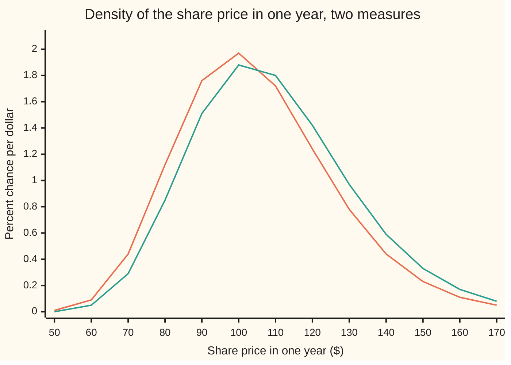

# Change of numeraire: measuring value in shares, bonds or annuities

[Syllabus](../../../SYLLABUS.md) → [Stochastic processes and calculus](../README.md) → [Changing Measure](../README.md#s07) → Change of numeraire

---

## General Overview

A share trades at $100 today. Over the coming year it is expected to grow 8 percent, but it is priced as if it grew 5 percent, the bank rate: that is this shelf's house example. Its volatility, the yearly spread of its log price, is 20 percent. A contract pays one share in a year's time if the share then stands above $100, and nothing otherwise.

What is that contract worth today? The dollar answer is $63.68. The same answer, counted in shares, is 0.636831 of a share. That second number is also a probability: the chance that the share finishes above $100, computed with a particular set of odds. Black-Scholes users know it as N(d1). This card says which odds, where they come from, and why they deliver a price.

The idea is a change of unit. Prices are usually counted in dollars held in the bank. Nothing forces that choice. Value can be counted in shares, in bonds that pay a dollar on a fixed date, or in a stream of payments called an annuity. The unit chosen is called the **numeraire**, French for "unit of account", and that is the word used from here on. Each numeraire comes with its own set of odds, its own probability measure. Switching numeraire switches the measure, and the rule for switching is one density, written down exactly.

**To count value in a new numeraire, reweight each possible future by how much that numeraire outgrew the old one there; under the reweighted odds, every price divided by the new numeraire is a fair game, so a price is the new numeraire today times an average.**

**What kind of fact this is:** a theorem, proved in full on this card in Why it works; the shift of drift it produces under the share measure uses Girsanov's theorem, stated and linked, not re-proved.

### The picture: one future, two sets of odds

The share's price in a year, $S_T$, has a spread of possible values. The orange curve is that spread under the bank-account odds Q. The green curve is the spread under the share odds, written Q^S. Both are probability densities, scaled up by 100 so that the height reads as percent chance per dollar.



Orange: the bank-account measure Q. Green: the share measure Q^S. The green curve is the orange one multiplied, point by point, by the straight line $S_T/105.13$: futures above the forward price of $105.13 gain weight, futures below lose it, and the curves cross exactly there. The area to the right of $100 is 0.559618 under orange and 0.636831 under green.

---

## The formula

Three sets of odds act on the same futures. **P** is the real-world measure: the share drifts at 8 percent. **Q** is the bank-account measure, the second measure of [Changing the measure](01-change-of-measure-and-density-processes.md), built for this share on [Girsanov](02-girsanov-theorem.md): the share drifts at the bank rate, and every price divided by the bank account is a martingale (a fair game: the best forecast of its future value is its value now). **Q^S** is the share measure, built on this card. $E^Q$ and $E^S$ are averages under Q and Q^S.

Write $B_t = e^{rt}$ for the bank account and $U_t$ for the price of the new numeraire. The density that turns Q into the new measure, written Q^U, is

$$Z_T = \frac{dQ^U}{dQ} = \frac{U_T / U_0}{B_T / B_0}.$$

**Read it aloud:** the weight a future gets under the new odds is its old weight times the factor by which the new unit outgrew the bank in that future.

With that measure, the pricing rule is

$$\frac{V_t}{U_t} = E^U\!\left[\frac{V_T}{U_T} \,\middle|\, F_t\right].$$

**Read it aloud:** a price counted in the new unit is a fair game under the new odds.

For the share, $U_t = S_t$, and the density is $Z_T = S_T e^{-rT}/S_0$. Applied to the contract that pays one share if $S_T > K$, with $\mathbf{1}\{S_T > K\}$ the indicator, 1 if the share ends above $K$ and 0 if not:

$$S_0\, E^S\!\left[\mathbf{1}\{S_T > K\}\right] = S_0\, Q^S(S_T > K) = S_0\, N(d_1).$$

**Read it aloud:** the share-or-nothing contract is worth one share today times the share measure's chance that it pays.

| Symbol | Plain meaning | In our example | Push it up and the answer… |
| --- | --- | --- | --- |
| $S_0$, $S_t$, $S_T$, $S$ | the share's price today, at time t, at the end; the share as a unit | $100 today | $S_0$ up: N(d1) rises |
| $K$ | the strike: the level the share must beat | $100 | N(d1) falls |
| $r$, $q$, $\mu$ | the bank rate; a dividend yield, used only in the dividend examples; the real-world drift, under P only | 0.05; 0.02; 0.08 | r up: N(d1) rises; $\mu$ moves no price |
| $\sigma$ | volatility: the yearly spread of the log price | 0.20 | Q and Q^S pull further apart |
| $T$, $t$, $F_t$ | the end date and a time in between, in years; what is known by time t | 1 year | — |
| $B_t$, $U_t$, $A_t$, $V_t$ (and $B$, $U$, $A$, $V$) | the bank account; a new numeraire; an old numeraire in the proof; any traded price | $B_1 = e^{0.05}$ | — |
| $P$, $Q$, $Q^S$ | real-world, bank-account and share measures | three chances of $S_T > K$: 0.617911, 0.559618, 0.636831 | — |
| $Q^U$, $Q^A$, $Q'$ | the measure of a new numeraire $U$; of an old one $A$; the reweighted measure in Bayes' rule | — | — |
| $E^Q$, $E^S$, $E^U$, $E^A$, $E^{Q'}$ | averages under Q, Q^S, Q^U, Q^A and Q' | $E^Q[Z_T] = 1$ | — |
| $\mathbf{1}\{S_T > K\}$, $\mathbf{1}_H$ | the indicator: 1 if the event happens, 0 if not | 1 if the share ends above the strike | — |
| $Z_t$, $Z_T$, $L_T$ | densities: Q to Q^S at time t and at T; P to Q | $Z_T = S_T/105.13$ | — |
| $W_t$, $W^S_t$, $dW_t$ | Brownian motion under Q; the shifted one under Q^S; shorthand inside an Ito integral | $W^S_t = W_t - 0.2t$ | — |
| $\lambda$, $\theta$ | the market price of risk, $(\mu - r)/\sigma$; the tilt in Girsanov's density $\exp(-\theta W_T - \tfrac12\theta^2 T)$, here $-\sigma$ | 0.15; −0.2 | — |
| $N(x)$, $\varphi$, $d_1$, $d_2$, $d_P$ | bell-curve area left of x; bell-curve height; the share's and the bank's distance to the strike; the same distance under P | N(0.35) = 0.636831; $d_P$ = 0.30 | — |
| $X$, $Y$, $H$ | in the proof: a payoff, its conditional average, an event known by time t | $X = V_T/S_T$ | — |

The two distances:

$$d_1 = \frac{\ln(S_0/K) + (r + \tfrac12\sigma^2)T}{\sigma\sqrt{T}}, \qquad d_2 = d_1 - \sigma\sqrt{T}.$$

In words: $d_2$ is how many spreads the share's expected log price under Q sits above the log of the strike; $d_1$ is the same count under Q^S, one spread $\sigma\sqrt{T}$ further, because Q^S lifts the log price's centre by $\sigma^2 T$.

### When it holds

- **The numeraire is a traded asset with a strictly positive price.** A zero price makes the density divide by zero; a non-traded index (a temperature, an inflation print that nobody can hold) gives a density with no reason to average to one.
- **It pays nothing out, or its payouts are reinvested.** A share paying a 2 percent dividend, used as the unit without reinvesting, gives a density averaging 0.980199, not 1: about 2 percent of the probability goes missing. Reinvest the dividends ($U_t = S_t e^{qt}$) and the density is a true one again.
- **There is a measure Q under which prices over the bank account are martingales.** That is the no-arbitrage assumption; without it there is no starting point to reweight.
- **The density is a true martingale, not a local one.** For the share in this model it is; in general the check is [Novikov](03-novikov-condition.md). A density that leaks mass has weights adding to less than one: the pricing rule then fails for the numeraire itself, and renormalising the weights makes every price too high.
- **The payoff over the numeraire has a finite average.** $E^U[|V_T|/U_T]$ must exist; for bounded payoffs over a positive unit it always does.

---

## Why it works

### Step 0: a price ratio does not care which unit it is counted in

A contract worth $63.68 when the share is worth $100 is worth 0.636831 shares. Divide two prices and the unit cancels. So if pricing is consistent in dollars, it must be consistent in shares too; the only question is which odds make "price in shares" a fair game. The answer is forced: the old odds, reweighted by how the share did against the bank.

### Step 1: the reweighting is a genuine density

Under Q, the share over the bank account, $S_t/B_t$, is a martingale. So the ratio

$$Z_t = \frac{S_t / S_0}{B_t / B_0} = \frac{S_t e^{-rt}}{S_0}$$

is a martingale with $Z_0 = 1$, and it is positive. Its average is therefore 1 at every date. A positive variable with average 1 is exactly what is needed to define a new measure: $Q^S(H) = E^Q[Z_T \mathbf{1}_H]$ for every event $H$ ([Changing the measure](01-change-of-measure-and-density-processes.md)). The code integrates $Z_T$ against Q's bell curve and gets 1.000000.

In the model, $S_t = S_0 \exp((r - \tfrac12\sigma^2)t + \sigma W_t)$ under Q, so

$$Z_t = \exp\!\left(\sigma W_t - \tfrac12\sigma^2 t\right).$$

That is the exponential martingale of [Girsanov](02-girsanov-theorem.md), written there as $\exp(-\theta W_t - \tfrac12\theta^2 t)$, with constant tilt $\theta = -\sigma = -0.2$.

### Step 2: under the new odds, prices in the new unit are fair games

Take any traded price $V_t$. Under Q, $V_t/B_t$ is a martingale. The aim is to show $V_t/S_t$ is a martingale under Q^S. The tool is Bayes' rule for conditional expectation under a change of measure:

$$E^S[X \mid F_t] = \frac{E^Q[Z_T X \mid F_t]}{Z_t}.$$

Put $X = V_T/S_T$. Then $Z_T X = (V_T/B_T)(B_0/S_0)$: the share cancels. The Q-average of that, given what is known at t, is $(V_t/B_t)(B_0/S_0)$, because $V/B$ is a Q-martingale. Divide by $Z_t = (S_t/S_0)/(B_t/B_0)$ and what remains is $V_t/S_t$. Nothing in the argument used the share's dynamics: it works for any positive traded numeraire $U$ in place of $S$, and from any starting numeraire in place of $B$.

<details>
<summary>Detailed proof: Bayes' rule and the numeraire theorem</summary>

**Bayes' rule.** Let $Z_T > 0$ with $E^Q[Z_T] = 1$, define $Q'$ by $Q'(H) = E^Q[Z_T \mathbf{1}_H]$, and let $Z_t = E^Q[Z_T \mid F_t]$. For $X$ with $E^{Q'}|X| = E^Q[Z_T |X|]$ finite, put $Y = E^Q[Z_T X \mid F_t] / Z_t$. $Y$ is known at time t. For any event $H$ known at time t, using the tower property twice:

$E^{Q'}[Y \mathbf{1}_H] = E^Q[Z_T Y \mathbf{1}_H] = E^Q[E^Q[Z_T \mid F_t]\, Y \mathbf{1}_H] = E^Q[Z_t Y \mathbf{1}_H] = E^Q[E^Q[Z_T X \mid F_t]\, \mathbf{1}_H] = E^Q[Z_T X \mathbf{1}_H] = E^{Q'}[X \mathbf{1}_H].$

So $Y$ has the defining property of $E^{Q'}[X \mid F_t]$, and conditional expectations are unique up to events of probability zero.

**The numeraire theorem.** Let $A_t$ and $U_t$ be two positive traded prices, and let $Q^A$ be a measure under which every traded price over $A$ is a martingale. Define $Z_T = (U_T/U_0)/(A_T/A_0)$. Because $U$ is traded, $U/A$ is a $Q^A$-martingale, so $Z_t = E^A[Z_T \mid F_t] = (U_t/U_0)/(A_t/A_0)$, which is positive with $Z_0 = 1$. Define $Q^U$ by the density $Z_T$. For a traded $V$ with $E^U[|V_T|/U_T]$ finite, Bayes' rule gives

$E^U[V_T/U_T \mid F_t] = E^A[Z_T V_T/U_T \mid F_t] / Z_t = (A_0/U_0)\, E^A[V_T/A_T \mid F_t] / Z_t = (A_0/U_0)(V_t/A_t) \cdot (U_0/U_t)(A_t/A_0) = V_t/U_t.$

Every price over $U$ is a $Q^U$-martingale. The proof is complete and holds in discrete or continuous time; it used only the tower property, positivity and the martingale property under the old measure.

</details>

### Step 3: the drift moves by sigma squared

Girsanov's theorem, in the notation of its card, says: if a measure is defined by the density $\exp(-\theta W_T - \tfrac12\theta^2 T)$ with $\theta$ constant, then $W_t + \theta t$ is a Brownian motion under the new measure. Here $\theta = -\sigma$, so

$$W^S_t = W_t - \sigma t$$

is a Brownian motion under Q^S. Substitute $W_t = W^S_t + \sigma t$ into the share's equation:

$$dS_t = r S_t\,dt + \sigma S_t\,dW_t = (r + \sigma^2) S_t\,dt + \sigma S_t\,dW^S_t.$$

As always in this wing, $dW_t$ is shorthand for an Ito integral, not a derivative. Under the share measure the share drifts at $0.05 + 0.2^2 = 0.09$ a year, volatility unchanged. Its log, by [Ito's lemma](../06-Ito%20Calculus/02-itos-lemma.md), drifts at $r + \tfrac12\sigma^2 = 0.07$. Under Q the log drifts at 0.03, under P at 0.06.

### Step 4: read off N(d1)

Under Q^S, $\ln S_T$ is normal with centre $\ln S_0 + 0.07$ and spread $0.2$. The share beats the strike when a standard normal draw beats $-(\ln(S_0/K) + 0.07)/0.2 = -d_1$. That chance is $N(d_1) = N(0.35) = 0.636831$. Put this into the pricing rule with $V_T = S_T \mathbf{1}\{S_T > K\}$:

$$\frac{V_0}{S_0} = E^S\!\left[\frac{S_T \mathbf{1}\{S_T > K\}}{S_T}\right] = Q^S(S_T > K) = N(d_1).$$

The share in the payoff cancels the share in the unit. A hard average, a share price weighted by an indicator, became a plain probability.

<details>
<summary>The same answer without Girsanov: completing the square</summary>

Under Q, write $S_T = S_0 \exp(0.03 + 0.2 z)$ with $z$ a standard normal draw. Then $E^Q[Z_T \mathbf{1}\{S_T > K\}]$ is the integral over $z > -d_2$ of $e^{0.2 z - 0.02} \varphi(z)$, where $\varphi$ is the bell-curve height. Completing the square, $e^{0.2z - 0.02}\varphi(z) = \varphi(z - 0.2)$: the bell curve slid right by one spread. The integral is $N(d_2 + 0.2) = N(d_1)$. The code's Simpson road does this integral numerically, with the boundary found by bisection rather than by the formula.

</details>

### Step 5: bonds and annuities

The proof in Step 2 never used the share. Other numeraires give other measures.

- **A zero-coupon bond** paying $1 at date T. Its measure is the T-forward measure. With a constant bank rate, as here, the bond grows exactly like the bank and the density is 1: the forward measure equals Q. It differs only when rates are random, where it turns $E^Q[e^{-\int r}\,\text{payoff}]$ into bond price times a plain average ([Forward measures](../../12-Financial%20mathematics/31-Forward-Rate%20Models/02-forward-measures-for-rates.md)).
- **An annuity**, a strip of bonds paying on each date of a swap. Its measure makes the swap rate a martingale, which is what prices a swaption ([The annuity measure](../../12-Financial%20mathematics/29-Caps%2C%20Floors%20and%20Swaptions/05-the-annuity-measure.md)).
- **A second share.** Counting one share in units of another removes one source of randomness, which is how the exchange option is priced ([The exchange option](../../12-Financial%20mathematics/18-Many%20underlyings%20-%20exchange%2C%20spread%2C%20basket%20and%20rainbow/01-exchange-option-margrabe.md)).

A second road to the same structure is the binomial tree. One step of a year: the share goes up by $u = 1.221403$ or down by $d = 0.818731$. The bank-account chance of up is $p = 0.577493$. The share-measure chance multiplies it by the step's density, $u/e^{r}$, giving $0.670951$. Over many steps the share-measure chance of finishing above $100 converges to $N(d_1)$, and at every step count it equals the dollar price of the share leg divided by $S_0$ exactly. That is the theorem in discrete time, with nothing continuous assumed.

---

## Worked numbers, by hand

The house example: $S_0 = 100$, $K = 100$, $r = 0.05$, $\sigma = 0.20$, $T = 1$, real-world drift $\mu = 0.08$.

| Step | Arithmetic | Value |
| --- | --- | --- |
| forward price, $S_0 e^{rT}$ | $100 \times e^{0.05}$ | $105.127110 |
| density, $Z_T$ | $S_T / 105.13$ | equal to 1 at the forward |
| log drift under Q^S | $0.05 + \tfrac12 \times 0.2^2 = 0.05 + 0.02$ | 0.07 |
| $d_1$ | $(0 + 0.07)/0.2$ | 0.35 |
| $d_2$ | $0.35 - 0.2$ | 0.15 |
| $N(d_1)$, chance under Q^S | bell-curve area | 0.636831 |
| $N(d_2)$, chance under Q | bell-curve area | 0.559618 |
| share leg, $S_0 N(d_1)$ | $100 \times 0.636831$ | **$63.683065** |
| cash leg, $K e^{-rT} N(d_2)$ | $100 \times e^{-0.05} \times 0.559618$ | $53.232482 |
| call, share leg minus cash leg | $63.683065 - 53.232482$ | $10.450584 |

The contract that pays one share above $100 is worth $63.68 today: 0.636831 of a share, which is the share measure's chance that the share ends above $100. The real-world chance is different again, $N(0.30) = 0.617911$, and appears in no price.

### What breaks if you drop a piece

| Mistake | Comes out at | What went wrong |
| --- | --- | --- |
| Share leg priced with Q's chance, $S_0 N(d_2)$ | $55.96 (right: $63.68) | the density was dropped: futures where the share is worth more were not counted more |
| Share leg priced with the real-world chance, $S_0 N(d_P)$ | $61.79 | an 8 percent forecast entered a price; only the bank rate may |
| Real-world odds tilted by $S_T/(S_0 e^{\mu T})$ | $69.15 | the tilt must start from Q, the measure that already makes prices fair games, and use the bank, not the forecast, as the old unit |
| Dividend-paying share ($q = 0.02$) used as the unit without reinvesting | density averages 0.980199 | the numeraire was not a self-financing traded asset, so the "density" is not one: about 2 percent of the probability is missing |

The last row is the dropped hypothesis. The cure is to count in the reinvested share, $S_t e^{qt}$, whose growth over the bank averages 1 again.

---

## Code, from first principles, and it actually runs

The code reaches $N(d_1)$ four ways. The formula, with a normal CDF written as a power series. A Simpson's-rule integral of the density $Z_T$ against Q's bell curve, with the exercise boundary found by bisection, so no $d_1$ enters. A binomial tree summed over every node at four step counts, where the dollar price of the share leg over $S_0$ and the share-measure chance agree exactly at each count and the error against $N(d_1)$ shrinks about fourfold each time the steps quadruple. And a seeded simulation of 200,000 draws (SplitMix64 generator, seed 20260930, Box-Muller normals), estimated three ways: under Q weighted by $Z_T$; under Q^S as a plain count; under P weighted by both densities, $L_T Z_T$, where $L_T = \exp(-\lambda W^P_T - \tfrac12\lambda^2 T)$ takes P to Q and $W^P_t$ is the Brownian motion under P. Each simulated number is printed with its standard error. The simulation is one sample of draws; the share price is drawn at the end date only, which is exact for this model.

### Python

```python
# Change of numeraire -- the check behind the card.  Standard library only.
# A share with no dividend: S0 = 100, strike K = 100, bank rate r = 0.05,
# volatility sig = 0.20, real-world drift mu = 0.08, T = 1 year.
# Claim: N(d1) is the chance that S_T > K under the share measure Q^S.
# Roads: the formula; Simpson's rule on the reweighted Q-density; a binomial
# tree summed over every node; a seeded simulation under P, Q and Q^S.
from math import exp, log, sqrt, pi, cos

S0, K, r, sig, mu, T, q = 100.0, 100.0, 0.05, 0.20, 0.08, 1.0, 0.02
vt, grow = sig * sqrt(T), exp(r * T)

def phi(x): return exp(-0.5 * x * x) / sqrt(2.0 * pi)
def Ncdf(x):  # series: 1/2 + phi(x) * (x + x^3/3 + x^5/(3*5) + ...)
    term, total, n = x, x, 0
    while abs(term) > 1e-17:
        n += 1
        term *= x * x / (2 * n + 1)
        total += term
    return 0.5 + phi(x) * total
def simpson(f, a, b, n=4000):
    h = (b - a) / n
    s = f(a) + f(b)
    for i in range(1, n):
        s += (4 if i % 2 else 2) * f(a + i * h)
    return s * h / 3.0
def ST(z, drift): return S0 * exp((drift - 0.5 * sig * sig) * T + vt * z)
def bisect(f, lo, hi):
    for _ in range(200):
        mid = 0.5 * (lo + hi)
        if (f(lo) < 0) == (f(mid) < 0): lo = mid
        else: hi = mid
    return 0.5 * (lo + hi)

# Road 1: the formula
d1 = (log(S0 / K) + (r + 0.5 * sig * sig) * T) / vt
d2, dP = d1 - vt, (log(S0 / K) + (mu - 0.5 * sig * sig) * T) / vt
N1, N2, NP = Ncdf(d1), Ncdf(d2), Ncdf(dP)
call = S0 * N1 - K * exp(-r * T) * N2
# Road 2: integrate the density Z = S_T/(S0 e^rT) against Q's bell curve, no d1 used
zs = bisect(lambda z: ST(z, r) - K, -10.0, 10.0)        # exercise boundary in Q's z
Z = lambda z: ST(z, r) / (S0 * grow)
pS_int = simpson(lambda z: Z(z) * phi(z), zs, 10.0)
mass = simpson(lambda z: Z(z) * phi(z), -10.0, 10.0)
call_int = exp(-r * T) * simpson(lambda z: (ST(z, r) - K) * phi(z), zs, 10.0)
mass_q = simpson(lambda z: ST(z, r - q) / (S0 * grow) * phi(z), -10.0, 10.0)
assert abs(pS_int - N1) < 1e-9
assert abs(mass - 1.0) < 1e-9                            # Z is a true density
assert abs(call_int - call) < 1e-8
assert abs(mass_q - exp(-q * T)) < 1e-9
assert abs(mass_q - 1.0) > 0.01                          # not a probability measure
rows = [("d1", d1), ("d2", d2), ("dP (real-world drift)", dP),
        ("N(d1)  formula", N1), ("N(d2)  Q chance S_T > K", N2), ("N(dP)  P chance S_T > K", NP),
        ("boundary z* by bisection", zs), ("  -d2", -d2),
        ("Q^S chance by Simpson", pS_int), ("E^Q[Z] by Simpson", mass),
        ("call by Simpson", call_int), ("call  S0 N(d1) - K e^-rT N(d2)", call),
        ("share leg  S0 N(d1)", S0 * N1), ("cash leg  K e^-rT N(d2)", K * exp(-r * T) * N2),
        ("lambda  (mu - r)/sig", (mu - r) / sig), ("Q^S drift  r + sig^2", r + sig * sig),
        ("log drift P    mu - sig^2/2", mu - 0.5 * sig * sig), ("log drift Q    r - sig^2/2", r - 0.5 * sig * sig),
        ("log drift Q^S  r + sig^2/2", r + 0.5 * sig * sig), ("sig^2", sig * sig), ("sig^2/2", 0.5 * sig * sig)]
for name, v in rows: print(f"{name:<34} {v:>12.6f}")
# Road 3: binomial tree, every node.  Dollar price of the share leg vs share-measure chance.
u1s = exp(vt); p1 = (grow - 1.0 / u1s) / (u1s - 1.0 / u1s)
for name, v in (("one step: up factor u", u1s), ("one step: down factor d", 1.0 / u1s),
                ("one step: Q up chance p", p1), ("one step: Q^S up chance p u e^-rT", p1 * u1s / grow)):
    print(f"{name:<34} {v:>12.6f}")
print("tree   n   dollars/S0   Q^S chance   error vs N(d1)")
errs = []
for n in (25, 101, 401, 1601):
    dt = T / n
    u = exp(sig * sqrt(dt))
    p = (exp(r * dt) - 1.0 / u) / (u - 1.0 / u)
    pS = p * u / exp(r * dt)                            # the share-measure up chance
    lc, dollars, chanceS = 0.0, 0.0, 0.0
    for j in range(n + 1):
        if j > 0: lc += log(n - j + 1) - log(j)
        if (2 * j - n) * sig * sqrt(dt) > log(K / S0):
            Sj = S0 * u ** (2 * j - n)
            dollars += exp(-r * T) * Sj * exp(lc + j * log(p) + (n - j) * log(1 - p))
            chanceS += exp(lc + j * log(pS) + (n - j) * log(1 - pS))
    assert abs(dollars / S0 - chanceS) < 1e-12
    errs.append(chanceS - N1)
    print(f"tree {n:>5} {dollars / S0:>11.6f} {chanceS:>12.6f} {chanceS - N1:>14.6f}")
assert abs(errs[-1]) < 2e-3
assert abs(errs[-1]) < abs(errs[0])
# Road 4: seeded simulation.  SplitMix64, Box-Muller (cosine half), seed 20260930.
state = 20260930
def rnd():
    global state
    state = (state + 0x9E3779B97F4A7C15) & 0xFFFFFFFFFFFFFFFF
    x = state
    x = ((x ^ (x >> 30)) * 0xBF58476D1CE4E5B9) & 0xFFFFFFFFFFFFFFFF
    x = ((x ^ (x >> 27)) * 0x94D049BB133111EB) & 0xFFFFFFFFFFFFFFFF
    return ((x ^ (x >> 31)) >> 11) * 2.0 ** -53
M, lam = 200000, (mu - r) / sig
acc = [[0.0, 0.0] for _ in range(4)]
for _ in range(M):
    u1, u2 = 1.0 - rnd(), rnd()
    z = sqrt(-2.0 * log(u1)) * cos(2.0 * pi * u2)
    sq, ss, sp = ST(z, r), ST(z, r + sig * sig), ST(z, mu)
    L = exp(-lam * sqrt(T) * z - 0.5 * lam * lam * T)     # dQ/dP on this path
    xs = (sq / (S0 * grow) * (sq > K), 1.0 * (ss > K), L * sp / (S0 * grow) * (sp > K), 1.0 * (sp > K))
    for k in range(4):
        acc[k][0] += xs[k]; acc[k][1] += xs[k] * xs[k]
labels = ("sim Q, weighted by Z", "sim Q^S, plain count", "sim P, weighted by L Z", "sim P, plain count")
targets = (N1, N1, N1, NP)
print("simulation, 200000 draws          estimate     std error")
for k in range(4):
    m = acc[k][0] / M
    se = sqrt((acc[k][1] / M - m * m) / M)
    assert abs(m - targets[k]) < 4 * se
    print(f"{labels[k]:<30} {m:>12.6f} {se:>12.6f}")
print(f"{'dividend share, E^Q[Z] q=0.02':<34} {mass_q:>12.6f}")
print(f"{'wrong: share leg with N(d2)':<34} {S0 * N2:>12.6f}")
print(f"{'wrong: share leg with N(dP)':<34} {S0 * NP:>12.6f}")
print(f"{'wrong: P tilted by S_T/(S0 e^muT)':<34} {S0 * Ncdf(dP + vt):>12.6f}")
xs = list(range(50, 171, 10))
fQ = [phi((log(s / S0) - (r - 0.5 * sig * sig) * T) / vt) / (s * vt) for s in xs]
print("chart S_T  " + " ".join(f"{s}" for s in xs))
print("chart Q    " + " ".join(f"{100 * f:.2f}" for f in fQ))
print("chart Q^S  " + " ".join(f"{100 * f * s / (S0 * grow):.2f}" for f, s in zip(fQ, xs)))
def dd(S, K, sg): return (log(S / K) + (r + 0.5 * sg * sg) * T) / (sg * sqrt(T))
for name, v in (("try: sig = 0.40, d1", dd(S0, K, 0.4)), ("try: sig = 0.40, d2", dd(S0, K, 0.4) - 0.4 * sqrt(T)),
                ("try: sig = 0.40, N(d1)", Ncdf(dd(S0, K, 0.4))), ("try: sig = 0.40, N(d2)", Ncdf(dd(S0, K, 0.4) - 0.4 * sqrt(T))),
                ("try: K = 120, N(d1)", Ncdf(dd(S0, 120.0, sig))), ("try: K = 120, N(d2)", Ncdf(dd(S0, 120.0, sig) - vt))):
    print(f"{name:<34} {v:>12.6f}")
print(f"{'curves cross at forward S0 e^rT':<34} {S0 * grow:>12.6f}")
```

**Ran 2026-09-30 on macOS, Python 3.14.6, standard library only. All checks passed. Output, pasted from the run:**

```
d1                                     0.350000
d2                                     0.150000
dP (real-world drift)                  0.300000
N(d1)  formula                         0.636831
N(d2)  Q chance S_T > K                0.559618
N(dP)  P chance S_T > K                0.617911
boundary z* by bisection              -0.150000
  -d2                                 -0.150000
Q^S chance by Simpson                  0.636831
E^Q[Z] by Simpson                      1.000000
call by Simpson                       10.450584
call  S0 N(d1) - K e^-rT N(d2)        10.450584
share leg  S0 N(d1)                   63.683065
cash leg  K e^-rT N(d2)               53.232482
lambda  (mu - r)/sig                   0.150000
Q^S drift  r + sig^2                   0.090000
log drift P    mu - sig^2/2            0.060000
log drift Q    r - sig^2/2             0.030000
log drift Q^S  r + sig^2/2             0.070000
sig^2                                  0.040000
sig^2/2                                0.020000
one step: up factor u                  1.221403
one step: down factor d                0.818731
one step: Q up chance p                0.577493
one step: Q^S up chance p u e^-rT      0.670951
tree   n   dollars/S0   Q^S chance   error vs N(d1)
tree    25    0.638187     0.638187       0.001357
tree   101    0.637165     0.637165       0.000335
tree   401    0.636915     0.636915       0.000084
tree  1601    0.636852     0.636852       0.000021
simulation, 200000 draws          estimate     std error
sim Q, weighted by Z               0.637974     0.001289
sim Q^S, plain count               0.637200     0.001075
sim P, weighted by L Z             0.637546     0.001121
sim P, plain count                 0.618575     0.001086
dividend share, E^Q[Z] q=0.02          0.980199
wrong: share leg with N(d2)           55.961769
wrong: share leg with N(dP)           61.791142
wrong: P tilted by S_T/(S0 e^muT)     69.146246
chart S_T  50 60 70 80 90 100 110 120 130 140 150 160 170
chart Q    0.01 0.09 0.44 1.12 1.76 1.97 1.72 1.24 0.78 0.44 0.23 0.11 0.05
chart Q^S  0.00 0.05 0.29 0.85 1.51 1.88 1.80 1.42 0.97 0.59 0.33 0.17 0.08
try: sig = 0.40, d1                    0.325000
try: sig = 0.40, d2                   -0.075000
try: sig = 0.40, N(d1)                 0.627409
try: sig = 0.40, N(d2)                 0.470107
try: K = 120, N(d1)                    0.287192
try: K = 120, N(d2)                    0.223147
curves cross at forward S0 e^rT      105.127110
```

### Rust

```rust
// Change of numeraire -- the check behind the card.  Rust std only.
// A share with no dividend: S0 = 100, strike K = 100, bank rate r = 0.05,
// volatility sig = 0.20, real-world drift mu = 0.08, T = 1 year.
// Claim: N(d1) is the chance that S_T > K under the share measure Q^S.
// Roads: the formula; Simpson's rule on the reweighted Q-density; a binomial
// tree summed over every node; a seeded simulation under P, Q and Q^S.
use std::f64::consts::PI;

const S0: f64 = 100.0;
const K: f64 = 100.0;
const R: f64 = 0.05;
const SIG: f64 = 0.20;
const MU: f64 = 0.08;
const T: f64 = 1.0;
const Q: f64 = 0.02;

fn phi(x: f64) -> f64 { (-0.5 * x * x).exp() / (2.0 * PI).sqrt() }
fn ncdf(x: f64) -> f64 {
    // series: 1/2 + phi(x) * (x + x^3/3 + x^5/(3*5) + ...)
    let (mut term, mut total, mut n) = (x, x, 0.0);
    while term.abs() > 1e-17 {
        n += 1.0;
        term *= x * x / (2.0 * n + 1.0);
        total += term;
    }
    0.5 + phi(x) * total
}
fn simpson<F: Fn(f64) -> f64>(f: F, a: f64, b: f64) -> f64 {
    let n = 4000;
    let h = (b - a) / n as f64;
    let mut s = f(a) + f(b);
    for i in 1..n {
        s += if i % 2 == 1 { 4.0 } else { 2.0 } * f(a + i as f64 * h);
    }
    s * h / 3.0
}
fn st(z: f64, drift: f64) -> f64 { S0 * ((drift - 0.5 * SIG * SIG) * T + SIG * T.sqrt() * z).exp() }
fn bisect<F: Fn(f64) -> f64>(f: F, mut lo: f64, mut hi: f64) -> f64 {
    for _ in 0..200 {
        let mid = 0.5 * (lo + hi);
        if (f(lo) < 0.0) == (f(mid) < 0.0) { lo = mid } else { hi = mid }
    }
    0.5 * (lo + hi)
}
fn row(name: &str, v: f64) { println!("{:<34} {:>12.6}", name, v); }

fn main() {
    let vt = SIG * T.sqrt();
    let grow = (R * T).exp();
    // Road 1: the formula
    let d1 = ((S0 / K).ln() + (R + 0.5 * SIG * SIG) * T) / vt;
    let d2 = d1 - vt;
    let dp = ((S0 / K).ln() + (MU - 0.5 * SIG * SIG) * T) / vt;
    let (n1, n2, np) = (ncdf(d1), ncdf(d2), ncdf(dp));
    let call = S0 * n1 - K * (-R * T).exp() * n2;
    // Road 2: integrate the density Z = S_T/(S0 e^rT) against Q's bell curve, no d1 used
    let zs = bisect(|z| st(z, R) - K, -10.0, 10.0); // exercise boundary in Q's z
    let zf = |z: f64| st(z, R) / (S0 * grow);
    let ps_int = simpson(|z| zf(z) * phi(z), zs, 10.0);
    let mass = simpson(|z| zf(z) * phi(z), -10.0, 10.0);
    let call_int = (-R * T).exp() * simpson(|z| (st(z, R) - K) * phi(z), zs, 10.0);
    let mass_q = simpson(|z| st(z, R - Q) / (S0 * grow) * phi(z), -10.0, 10.0);
    assert!((ps_int - n1).abs() < 1e-9);
    assert!((mass - 1.0).abs() < 1e-9); // Z is a true density
    assert!((call_int - call).abs() < 1e-8);
    assert!((mass_q - (-Q * T).exp()).abs() < 1e-9);
    assert!((mass_q - 1.0).abs() > 0.01); // not a probability measure
    row("d1", d1); row("d2", d2); row("dP (real-world drift)", dp);
    row("N(d1)  formula", n1); row("N(d2)  Q chance S_T > K", n2); row("N(dP)  P chance S_T > K", np);
    row("boundary z* by bisection", zs); row("  -d2", -d2);
    row("Q^S chance by Simpson", ps_int); row("E^Q[Z] by Simpson", mass);
    row("call by Simpson", call_int); row("call  S0 N(d1) - K e^-rT N(d2)", call);
    row("share leg  S0 N(d1)", S0 * n1); row("cash leg  K e^-rT N(d2)", K * (-R * T).exp() * n2);
    row("lambda  (mu - r)/sig", (MU - R) / SIG); row("Q^S drift  r + sig^2", R + SIG * SIG);
    row("log drift P    mu - sig^2/2", MU - 0.5 * SIG * SIG); row("log drift Q    r - sig^2/2", R - 0.5 * SIG * SIG);
    row("log drift Q^S  r + sig^2/2", R + 0.5 * SIG * SIG); row("sig^2", SIG * SIG); row("sig^2/2", 0.5 * SIG * SIG);
    // Road 3: binomial tree, every node.  Dollar price of the share leg vs share-measure chance.
    let u1s = vt.exp();
    let p1 = (grow - 1.0 / u1s) / (u1s - 1.0 / u1s);
    row("one step: up factor u", u1s); row("one step: down factor d", 1.0 / u1s);
    row("one step: Q up chance p", p1); row("one step: Q^S up chance p u e^-rT", p1 * u1s / grow);
    println!("tree   n   dollars/S0   Q^S chance   error vs N(d1)");
    let mut errs = Vec::new();
    for &n in &[25i64, 101, 401, 1601] {
        let dt = T / n as f64;
        let u = (SIG * dt.sqrt()).exp();
        let p = ((R * dt).exp() - 1.0 / u) / (u - 1.0 / u);
        let ps = p * u / (R * dt).exp(); // the share-measure up chance
        let (mut lc, mut dollars, mut chance_s) = (0.0f64, 0.0f64, 0.0f64);
        for j in 0..=n {
            if j > 0 { lc += ((n - j + 1) as f64).ln() - (j as f64).ln(); }
            if (2 * j - n) as f64 * SIG * dt.sqrt() > (K / S0).ln() {
                let sj = S0 * u.powf((2 * j - n) as f64);
                dollars += (-R * T).exp() * sj * (lc + j as f64 * p.ln() + (n - j) as f64 * (1.0 - p).ln()).exp();
                chance_s += (lc + j as f64 * ps.ln() + (n - j) as f64 * (1.0 - ps).ln()).exp();
            }
        }
        assert!((dollars / S0 - chance_s).abs() < 1e-12);
        errs.push(chance_s - n1);
        println!("tree {:>5} {:>11.6} {:>12.6} {:>14.6}", n, dollars / S0, chance_s, chance_s - n1);
    }
    assert!(errs[3].abs() < 2e-3);
    assert!(errs[3].abs() < errs[0].abs());
    // Road 4: seeded simulation.  SplitMix64, Box-Muller (cosine half), seed 20260930.
    let mut state: u64 = 20260930;
    let mut rnd = || {
        state = state.wrapping_add(0x9E3779B97F4A7C15);
        let mut x = state;
        x = (x ^ (x >> 30)).wrapping_mul(0xBF58476D1CE4E5B9);
        x = (x ^ (x >> 27)).wrapping_mul(0x94D049BB133111EB);
        ((x ^ (x >> 31)) >> 11) as f64 * 2f64.powi(-53)
    };
    let m = 200000usize;
    let lam = (MU - R) / SIG;
    let mut acc = [[0.0f64; 2]; 4];
    for _ in 0..m {
        let u1 = 1.0 - rnd();
        let u2 = rnd();
        let z = (-2.0 * u1.ln()).sqrt() * (2.0 * PI * u2).cos();
        let (sq, ss, sp) = (st(z, R), st(z, R + SIG * SIG), st(z, MU));
        let l = (-lam * T.sqrt() * z - 0.5 * lam * lam * T).exp(); // dQ/dP on this path
        let xs = [
            if sq > K { sq / (S0 * grow) } else { 0.0 },
            if ss > K { 1.0 } else { 0.0 },
            if sp > K { l * sp / (S0 * grow) } else { 0.0 },
            if sp > K { 1.0 } else { 0.0 },
        ];
        for k in 0..4 {
            acc[k][0] += xs[k];
            acc[k][1] += xs[k] * xs[k];
        }
    }
    let labels = ["sim Q, weighted by Z", "sim Q^S, plain count", "sim P, weighted by L Z", "sim P, plain count"];
    let targets = [n1, n1, n1, np];
    println!("simulation, 200000 draws          estimate     std error");
    for k in 0..4 {
        let mean = acc[k][0] / m as f64;
        let se = ((acc[k][1] / m as f64 - mean * mean) / m as f64).sqrt();
        assert!((mean - targets[k]).abs() < 4.0 * se);
        println!("{:<30} {:>12.6} {:>12.6}", labels[k], mean, se);
    }
    row("dividend share, E^Q[Z] q=0.02", mass_q);
    row("wrong: share leg with N(d2)", S0 * n2);
    row("wrong: share leg with N(dP)", S0 * np);
    row("wrong: P tilted by S_T/(S0 e^muT)", S0 * ncdf(dp + vt));
    let xs: Vec<i64> = (50..=170).step_by(10).collect();
    let fq: Vec<f64> = xs.iter().map(|&s| {
        let s = s as f64;
        phi(((s / S0).ln() - (R - 0.5 * SIG * SIG) * T) / vt) / (s * vt)
    }).collect();
    let line_s: Vec<String> = xs.iter().map(|s| format!("{}", s)).collect();
    let line_q: Vec<String> = fq.iter().map(|f| format!("{:.2}", 100.0 * f)).collect();
    let line_qs: Vec<String> = fq.iter().zip(&xs).map(|(f, &s)| format!("{:.2}", 100.0 * f * s as f64 / (S0 * grow))).collect();
    println!("chart S_T  {}", line_s.join(" "));
    println!("chart Q    {}", line_q.join(" "));
    println!("chart Q^S  {}", line_qs.join(" "));
    let dd = |s: f64, k: f64, sg: f64| ((s / k).ln() + (R + 0.5 * sg * sg) * T) / (sg * T.sqrt());
    row("try: sig = 0.40, d1", dd(S0, K, 0.4)); row("try: sig = 0.40, d2", dd(S0, K, 0.4) - 0.4 * T.sqrt());
    row("try: sig = 0.40, N(d1)", ncdf(dd(S0, K, 0.4))); row("try: sig = 0.40, N(d2)", ncdf(dd(S0, K, 0.4) - 0.4 * T.sqrt()));
    row("try: K = 120, N(d1)", ncdf(dd(S0, 120.0, SIG))); row("try: K = 120, N(d2)", ncdf(dd(S0, 120.0, SIG) - vt));
    row("curves cross at forward S0 e^rT", S0 * grow);
}
```

**Ran 2026-09-30 on macOS, rustc 1.98.1, no crates. All checks passed. Output, pasted from the run:**

```
d1                                     0.350000
d2                                     0.150000
dP (real-world drift)                  0.300000
N(d1)  formula                         0.636831
N(d2)  Q chance S_T > K                0.559618
N(dP)  P chance S_T > K                0.617911
boundary z* by bisection              -0.150000
  -d2                                 -0.150000
Q^S chance by Simpson                  0.636831
E^Q[Z] by Simpson                      1.000000
call by Simpson                       10.450584
call  S0 N(d1) - K e^-rT N(d2)        10.450584
share leg  S0 N(d1)                   63.683065
cash leg  K e^-rT N(d2)               53.232482
lambda  (mu - r)/sig                   0.150000
Q^S drift  r + sig^2                   0.090000
log drift P    mu - sig^2/2            0.060000
log drift Q    r - sig^2/2             0.030000
log drift Q^S  r + sig^2/2             0.070000
sig^2                                  0.040000
sig^2/2                                0.020000
one step: up factor u                  1.221403
one step: down factor d                0.818731
one step: Q up chance p                0.577493
one step: Q^S up chance p u e^-rT      0.670951
tree   n   dollars/S0   Q^S chance   error vs N(d1)
tree    25    0.638187     0.638187       0.001357
tree   101    0.637165     0.637165       0.000335
tree   401    0.636915     0.636915       0.000084
tree  1601    0.636852     0.636852       0.000021
simulation, 200000 draws          estimate     std error
sim Q, weighted by Z               0.637974     0.001289
sim Q^S, plain count               0.637200     0.001075
sim P, weighted by L Z             0.637546     0.001121
sim P, plain count                 0.618575     0.001086
dividend share, E^Q[Z] q=0.02          0.980199
wrong: share leg with N(d2)           55.961769
wrong: share leg with N(dP)           61.791142
wrong: P tilted by S_T/(S0 e^muT)     69.146246
chart S_T  50 60 70 80 90 100 110 120 130 140 150 160 170
chart Q    0.01 0.09 0.44 1.12 1.76 1.97 1.72 1.24 0.78 0.44 0.23 0.11 0.05
chart Q^S  0.00 0.05 0.29 0.85 1.51 1.88 1.80 1.42 0.97 0.59 0.33 0.17 0.08
try: sig = 0.40, d1                    0.325000
try: sig = 0.40, d2                   -0.075000
try: sig = 0.40, N(d1)                 0.627409
try: sig = 0.40, N(d2)                 0.470107
try: K = 120, N(d1)                    0.287192
try: K = 120, N(d2)                    0.223147
curves cross at forward S0 e^rT      105.127110
```

The two outputs agree line for line.

> [!TIP]
> **Try changing**
> - **Set the real-world drift `mu` to 0.20.** Guess first: does N(d1) move? It does not: 0.636831 again. Only the P rows change, because the P-to-Q density $L_T$ absorbs the drift.
> - **Set `sig` to 0.40.** Guess first: do Q and Q^S agree more or less? Less: $d_1 = 0.325$ and $d_2 = -0.075$, so the share-measure chance is 0.627409 against Q's 0.470107. The gap $d_1 - d_2$ is one spread, $\sigma\sqrt{T}$.
> - **Set `q` to 0.** Guess first: what is the dividend share's density average? Exactly 1.000000, and the assert that it is not a probability measure fails, as it should.
> - **Raise the strike `K` to 120.** Guess first: which chance falls further, in proportion? The bank's: $N(d_2)$ drops to 0.223147 and $N(d_1)$ to 0.287192: the gap between the two chances is larger in proportion than at the money, because the density $S_T/105.13$ is largest in the far tail.

---

## The usual mistake

> [!warning]
> **Reading N(d1) as the chance the option is exercised.** It is a chance, but under the share measure, an artificial set of odds that overweights futures where the share did well. Under Q the chance of exercise is $N(d_2) = 0.559618$; in the real world it is 0.617911. Neither is 0.636831. N(d1) earns its place in the formula because it is the share leg's price in shares, not because anyone forecasts it.
>
> - **Dropping the density.** Pricing the share leg with Q's chance gives $55.96 instead of $63.68. The share is worth more exactly when it is received; the density counts that.
> - **Tilting from the wrong starting point.** The density $U_T/U_0$ over $B_T/B_0$ starts from Q. Applying the share's growth as a tilt to the real-world odds gives $69.15.
> - **A numeraire that leaks.** A share that pays dividends, used as the unit unreinvested, gives a density averaging 0.980199. The weights no longer add to one: the pricing rule prices the share itself at 0.980199 of a share, and renormalising the weights makes every price too high by the factor 1/0.980199.
> - **Changing volatility along with the measure.** Girsanov shifts the drift by $\sigma^2$ and leaves $\sigma$ alone. A share measure with a different volatility has no density relating it to Q.

---

## Where you meet it in real life

- **Every Black-Scholes call.** Its first term, $S_0 N(d_1)$, is the share leg priced under the share measure; its second, $K e^{-rT} N(d_2)$, is the cash leg under Q ([Black–Scholes call](../../12-Financial%20mathematics/08-The%20Black-Scholes%20call%20and%20put/01-black-scholes-call.md), which uses a 2 percent dividend and so the reinvested share as its unit).
- **Asset-or-nothing digitals.** The contract on this card, sold on its own ([Asset-or-nothing digital](../../12-Financial%20mathematics/10-Digitals%20and%20the%20implied%20density/02-asset-or-nothing-digital.md)).
- **Exchange and spread options.** The right to swap one share for another is priced by counting in the second share ([Spread options](../../12-Financial%20mathematics/26-Options%20on%20commodity%20futures%20and%20spreads/04-margrabe-and-kirk-spread-options.md)).
- **Interest-rate desks.** Caplets are priced under bond measures and swaptions under the annuity measure, because each makes its own rate a martingale.
- **Currency options.** Counting in the foreign bank account instead of the domestic one switches between the two countries' pricing measures.

> **Say it back**
> A numeraire is the unit value is counted in. Each numeraire has its own odds, and moving from the bank's odds to a new unit's odds means reweighting every future by how much the new unit outgrew the bank. Under the new odds, prices counted in the new unit are fair games. Counting in shares shifts the share's drift by sigma squared, so the chance of finishing above the strike becomes N(d1). That is why a share-or-nothing contract costs one share times N(d1), and why N(d1) is a price, not a forecast.

---

## What this builds on

- [Girsanov](02-girsanov-theorem.md): the exponential density $\exp(\sigma W_T - \tfrac12\sigma^2 T)$ shifts Brownian motion by $\sigma t$; this card supplies the density and Girsanov moves the drift.

## Where this goes next

- [Changing the unit of account](../../12-Financial%20mathematics/05-Black-Scholes%20from%20the%20Ground%20Up/05-change-of-numeraire-in-pricing.md): the theorem put to work on the finance shelf's market, with dividends and three units side by side.
- [Asset-or-nothing digital](../../12-Financial%20mathematics/10-Digitals%20and%20the%20implied%20density/02-asset-or-nothing-digital.md): this card's contract as a traded product, with its hedge.
- [The exchange option](../../12-Financial%20mathematics/18-Many%20underlyings%20-%20exchange%2C%20spread%2C%20basket%20and%20rainbow/01-exchange-option-margrabe.md): one share as the numeraire for another, turning a two-share problem into a one-share one.
- [Spread options](../../12-Financial%20mathematics/26-Options%20on%20commodity%20futures%20and%20spreads/04-margrabe-and-kirk-spread-options.md): the same trick for spreads, and the approximation needed when the strike is not zero.
- [The annuity measure](../../12-Financial%20mathematics/29-Caps%2C%20Floors%20and%20Swaptions/05-the-annuity-measure.md): the annuity as numeraire, under which a swap rate is a martingale.
- [Forward measures](../../12-Financial%20mathematics/31-Forward-Rate%20Models/02-forward-measures-for-rates.md): bond numeraires when rates are random, where the forward measure finally differs from Q.

This card shows that any positive traded asset can be the unit; the question it leaves is which unit makes a given contract easy, and the finance cards above answer it one product at a time.

---

## Sources

Verified 2026-09-30: every link below resolves to the publisher's page.

- Geman, Hélyette, Nicole El Karoui and Jean-Charles Rochet. "Changes of Numéraire, Changes of Probability Measure and Option Pricing." *Journal of Applied Probability* 32, no. 2 (1995): 443–458. [doi:10.2307/3215299](https://doi.org/10.2307/3215299). The theorem in its general form, with the density $U_T/U_0$ over $B_T/B_0$.
- Harrison, J. Michael, and Stanley R. Pliska. "Martingales and Stochastic Integrals in the Theory of Continuous Trading." *Stochastic Processes and their Applications* 11, no. 3 (1981): 215–260. [doi:10.1016/0304-4149(81)90026-0](https://doi.org/10.1016/0304-4149(81)90026-0). Prices over the bank account as martingales under Q: the starting point that gets reweighted.
- Margrabe, William. "The Value of an Option to Exchange One Asset for Another." *Journal of Finance* 33, no. 1 (1978): 177–186. [doi:10.1111/j.1540-6261.1978.tb03397.x](https://doi.org/10.1111/j.1540-6261.1978.tb03397.x). The first price obtained by counting one asset in units of another.
- Jamshidian, Farshid. "An Exact Bond Option Formula." *Journal of Finance* 44, no. 1 (1989): 205–209. [doi:10.1111/j.1540-6261.1989.tb02413.x](https://doi.org/10.1111/j.1540-6261.1989.tb02413.x). The bond numeraire and the forward measure for random rates.
- Shreve, Steven E. *Stochastic Calculus for Finance II: Continuous-Time Models*. Springer, 2004. [Publisher page](https://link.springer.com/book/9780387401010). Change of numeraire in continuous time, with Bayes' rule for conditional expectation and the share and forward measures.
