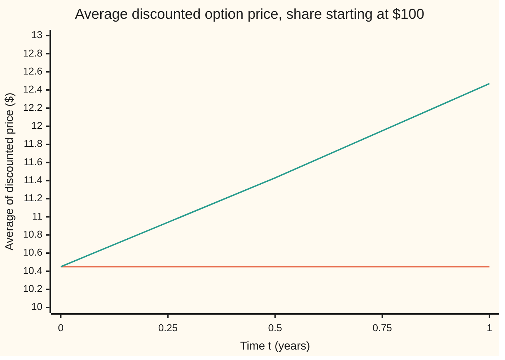
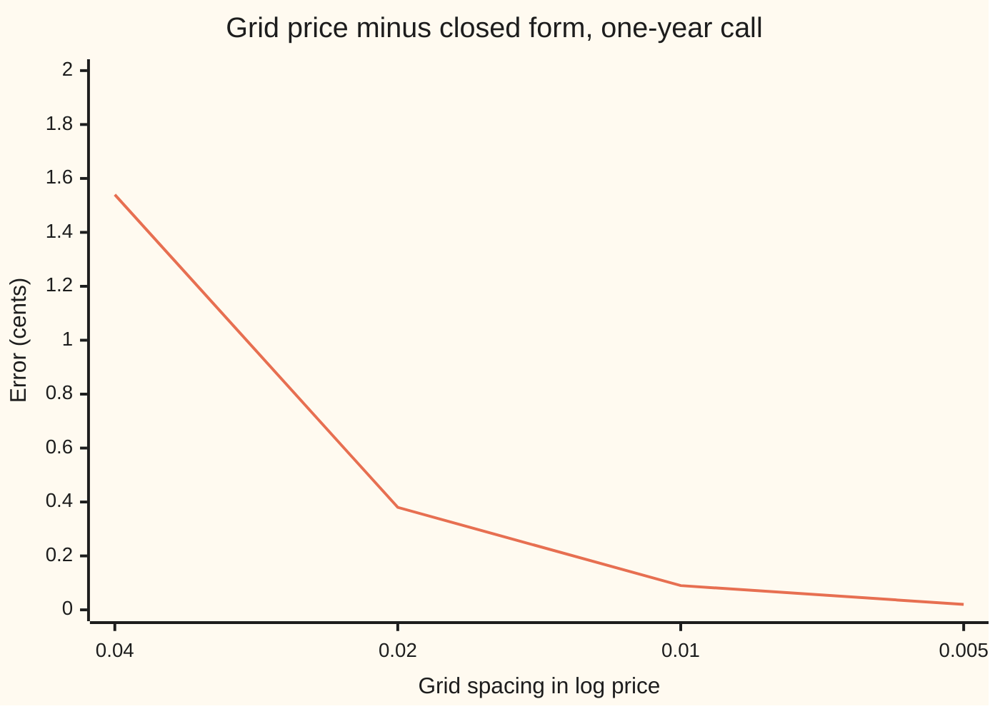

# Feynman-Kac: an expectation of a diffusion solves a PDE

[Syllabus](../../../SYLLABUS.md) → [Stochastic processes and calculus](../../../SYLLABUS.md#w11) → [Changing Measure](../../../SYLLABUS.md#w11-s07) → Feynman-Kac

---

## General Overview

A share trades at $100. Its price wanders with a volatility of 20 percent a year, and on average it grows at 8 percent a year. The bank pays 5 percent. A contract pays, one year from now, whatever the share is above $100, or nothing: a call option with strike $100.

Two ways to price it look nothing alike. One is an average: pretend the share grows at the bank's 5 percent, average the payoff over every place the share could end up, and discount back to today. The other is an equation: Black and Scholes showed in 1973 that the price, as a function of the share price and the time left, satisfies a partial differential equation (one linking rates of change in several directions at once). Solve it backwards from the payoff and today's price drops out.

Both give $10.450584. The Feynman-Kac formula says why: for a process driven by Brownian motion, an expected discounted payoff, read as a function of the start and the time left, solves a matching equation, and a well-behaved solution of the equation is that expectation. Richard Feynman found the idea in quantum mechanics in 1948; Mark Kac proved it for Brownian motion in 1949.

The equation says it for one small step: the price now is the discounted average of the price an instant later. The average says it once for the whole year. Ito's lemma and the martingale property convert one into the other.

**An average of a discounted payoff over the paths of a diffusion, read as a function of where and when the paths start, solves a backward equation built from the diffusion's drift and kick size; and a smooth solution whose random part is a fair game equals that average.**

**What kind of fact this is:** a theorem, proved on this card in Why it works in both directions (the full argument, with its integrability condition, in a folded Detailed proof); the heat equation and the Black-Scholes equation are two of its cases.

### The picture: the discounted price is a fair game only under the pricing measure

Follow the option's price through the year, discount it to today at 5 percent, and average it over the share's paths: once with the share growing at 5 percent, once at its real 8 percent.



The flat line is the 5 percent world: the discounted price neither rises nor falls on average, so it is a martingale, a fair game whose best forecast of any later value is today's. The rising line is the real 8 percent world: the same discounted price drifts up, from 10.45 to 12.47 dollars. Feynman-Kac runs on the flat line. Each point is an exact average, by numerical integration and by a separate closed form, printed by both checks.

---

## The formula

Reminders first. $W_t$ is Brownian motion, "the random walk seen from far away". A process $X_t$ follows the rule $dX_t = \mu(X_t, t)\,dt + \sigma(X_t, t)\,dW_t$: in each short slice of time it drifts by $\mu$ times the slice and takes a kick of $\sigma$ times the Brownian step; $dW_t$ is shorthand for an Ito integral, never a derivative, since the path has no slope. A subscript on a function means a slope: $u_t$ in time, $u_x$ in space, $u_{xx}$ the curvature, the slope of the slope ([Ito's lemma](../06-Ito%20Calculus/02-itos-lemma.md)). On a process the subscript is a time instead: $S_t$, $W_t$, $X_t$ and $M_t$ are values at time t, while $u_t$ and $V_t$ are slopes.

The equation, for a function $u$ of time and place, with a payoff at the end:

$$u_t + \mu(x,t)\,u_x + \tfrac12\,\sigma(x,t)^2\,u_{xx} - r\,u = 0 \quad (t < T), \qquad u(T, x) = g(x)$$

The Feynman-Kac formula:

$$u(t, x) = E\Big[\,e^{-r(T-t)}\, g(X_T) \;\Big|\; X_t = x\,\Big]$$

**Read it aloud:** the value now, at place x, is the average over all paths from x of the payoff where the path ends, discounted by the rate r over the time left.

For the share, $X_t$ is the price $S_t$, and the average is taken under the pricing measure $Q$, the reweighting of paths under which the share drifts at the bank rate ($Q$ and its averages $E^Q$ are taught on [Changing the measure](01-change-of-measure-and-density-processes.md); the switch of drift is [Girsanov](02-girsanov-theorem.md)). Under $Q$ the share's rule is $dS_t = r S_t\,dt + \sigma S_t\,dW_t$, with $W_t$ now a Brownian motion under $Q$. So the drift function is $r\,s$, the kick function is $\sigma\,s$ with $\sigma$ now the constant volatility 0.20, and the equation becomes the Black-Scholes equation:

$$V_t + r\,s\,V_s + \tfrac12\,\sigma^2 s^2\, V_{ss} - r\,V = 0, \qquad V(T, s) = (s - K)^+$$

$$V(t, s) = e^{-r(T-t)}\, E^Q\big[(S_T - K)^+ \,\big|\, S_t = s\big]$$

Here $(s - K)^+$ means s − K when that is positive and 0 otherwise. Done as an integral over the bell curve, the average is the closed form $V = s\,N(d_1) - K e^{-r\tau} N(d_2)$, where $\tau = T - t$ is the time left, $N$ is the bell-curve area to the left of a point and $d_2 = (\ln(s/K) + (r - \tfrac12\sigma^2)\tau)/(\sigma\sqrt{\tau})$, $d_1 = d_2 + \sigma\sqrt{\tau}$.

| Symbol | Plain meaning | In our example | Push it up and the answer… |
| --- | --- | --- | --- |
| $t$, $T$, $\tau$ | time now, the payoff date, and the time left $\tau = T - t$, in years | t = 0, T = 1, so $\tau$ = 1 | more time left: more room to finish above the strike, price rises |
| $S_t$, $s$ | the share price at time t, and a value it might take | 100 dollars today | price rises, by less than a dollar per dollar |
| $X_t$, $x$ | a general diffusion and a starting place for it | the share price | — |
| $W_t$, $dW_t$ | Brownian motion, the source of every kick; its step, shorthand inside an Ito integral | one sample per path | — |
| $\mu$ | drift: the average push per unit time | rs under Q; the real drift is 0.08 a year | under Q it is fixed by r, so the price does not move with the real drift |
| $\sigma$ | volatility, the kick size per unit of square-root time | 0.20 a year | price rises: more chance of a large payoff, losses still capped |
| $r$ | the bank rate, also the discount rate | 0.05 a year | call price rises: the strike paid later costs less today |
| $K$, $g$ | the strike, and the payoff function at the end | K = 100, g(s) = $(s - K)^+$ | higher strike, lower price |
| $N$, $d_1$, $d_2$ | bell-curve area to the left; two standardised distances | $N(d_2)$ = 0.559618, $N(d_1)$ = 0.636831 | — |
| $V$, $u$, $M_t$ | the price as a function of (t, s); a general solution; the discounted price $M_t = e^{-rt}V(t, S_t)$ | V(0, 100) = 10.450584 | — |
| $V_t$, $V_s$, $V_{ss}$, $u_t$, $u_x$, $u_{xx}$ | slopes of the price in time and in the share price, and its curvature | the curvature term carries the whole option value above the zero-volatility price | — |
| $P$, $Q$, $E^Q$ | the real-world measure (drift 0.08); the pricing measure (drift 0.05); averages under Q | the two lines of the picture | — |

With a rate that changes with place or time, the discount becomes $\exp(-\int_t^T r(X_v, v)\,dv)$ inside the average; the proof is the same, and [A short-rate model](../../12-Financial%20mathematics/30-Short-Rate%20Models/01-the-term-structure-equation.md) uses that form.

### When it holds

- **The process has the Markov property: its future depends on the past only through where it is now.** Solutions of a stochastic differential equation whose coefficients change at most in proportion to a change in x (Lipschitz) and grow at most linearly have it ([Stochastic differential equations](../06-Ito%20Calculus/04-stochastic-differential-equations.md)). Without it, an average from x is not a function of x and t alone, and there is no equation to solve.
- **The solution is smooth enough for Ito's lemma: one slope in time, two in space, all continuous before T.** The payoff may have a kink, as $(s - K)^+$ does at 100; the price is smooth for any time before T. If the average itself is not smooth, it still exists but solves the equation only in a weaker sense.
- **The random part of the discounted price is a true martingale, not merely a local one.** This is the condition usually left unstated. A finite $E\int_t^T (\sigma u_x)^2\,dv$ is enough. Drop it and the equation can have two solutions with the same payoff: for the rule $dX_t = X_t^2\,dW_t$, whose kick grows faster than linearly, started at 1, both u = x and the expectation, 0.682689, solve the same equation. The check prints both.
- **No walls, or paths stopped at them.** On a rod with fixed end temperatures, the average runs over paths stopped at the first hit of an end.

---

## Why it works

### Step 0: a fair game cannot drift, and Ito's lemma says what its drift is

Take the discounted price $M_t = e^{-rt}V(t, S_t)$. Ito's lemma writes its change over a short slice as a drift times dt plus a kick times $dW_t$. A fair game has zero drift wherever the share can go: that is the equation. With zero drift and a kick part that is a true martingale, today's value is the forecast of the final discounted payoff: that is the average. The theorem is this, run in each direction.

### Step 1: compute the drift of the discounted price

Ito's product rule ([Ito's product rule](../06-Ito%20Calculus/03-ito-product-rule.md)) with the ordinary factor $e^{-rt}$, and Ito's lemma for $u(t, X_t)$, give

$$d\big(e^{-rt}u(t, X_t)\big) = e^{-rt}\Big(u_t + \mu u_x + \tfrac12\sigma^2 u_{xx} - r u\Big)dt \;+\; e^{-rt}\,\sigma\,u_x\,dW_t$$

The bracket is the left side of the equation. The term $\tfrac12\sigma^2 u_{xx}$ is Ito's extra term; ordinary calculus would drop it. The $-ru$ comes from differentiating the discount factor.

### Step 2: from the equation to the average

Suppose $u$ solves the equation. Then the bracket is zero at every (t, x), so along any path the dt part vanishes. Integrate from t to T:

$$e^{-rT}u(T, X_T) - e^{-rt}u(t, X_t) = \int_t^T e^{-rv}\,\sigma\,u_x\,dW_v$$

The right side is an Ito integral. When it is a true martingale its average is zero ([Martingales](../02-Martingales/01-martingales.md)). Average both sides given $X_t = x$, use $u(T, \cdot) = g$, and multiply by $e^{rt}$:

$$u(t, x) = E\big[e^{-r(T-t)}g(X_T) \,\big|\, X_t = x\big]$$

This direction also proves uniqueness: any two solutions in the class equal the same average, so they are equal.

### Step 3: from the average to the equation

Now define $u(t, x)$ as the average. By the Markov property, the forecast at time v of the discounted payoff is $e^{-rv}u(v, X_v)$, the same average restarted from where the path is. Forecasts of one fixed quantity form a martingale, by the tower property (the forecast of a later forecast is today's forecast).

If $u$ is smooth, Step 1 applies. Subtract the Ito integral from this martingale and what remains is the dt part: still a (local) martingale, but an ordinary integral, with no roughness. A continuous martingale with zero quadratic variation (the sum of squared small steps, [Quadratic variation](../05-Brownian%20Motion/03-quadratic-variation.md)) is constant. So the dt part is zero. Shrink the time window to the start and the bracket is zero at (t, x). The start was arbitrary: the average solves the equation.

<details>
<summary>Detailed proof</summary>

**Setting.** The diffusion solves $dX_v = \mu(X_v, v)\,dv + \sigma(X_v, v)\,dW_v$ on $[t, T]$ from $X_t = x$, with coefficients continuous, Lipschitz in space and of linear growth, so the solution is unique and Markov. The rate r is constant; g is continuous with polynomial growth.

**Equation to average.** Let $u$ be continuous on $[0, T] \times \mathbb{R}$, with $u_t$, $u_x$, $u_{xx}$ continuous on $[0, T) \times \mathbb{R}$, solving the equation with $u(T, \cdot) = g$, and suppose $E\int_t^{T} e^{-2rv}\sigma(X_v, v)^2 u_x(v, X_v)^2\,dv < \infty$. Fix $\varepsilon > 0$. On $[t, T - \varepsilon]$ every derivative is continuous, so Step 1 holds as an integral identity, and the equation makes its dv integral zero. The finite-energy condition makes the stochastic integral a square-integrable martingale (Ito isometry), with expectation zero: $u(t, x) = E[e^{-r(T - \varepsilon - t)}u(T - \varepsilon, X_{T-\varepsilon})]$. Let $\varepsilon \to 0$: paths are continuous and u is continuous up to T, so the integrand converges to $e^{-r(T-t)}g(X_T)$; if u also grows at most polynomially, that bound and finite moments of $\sup_v \lvert X_v\rvert$ (which linear growth gives) supply a dominating function, and dominated convergence finishes the proof.

**Average to equation.** Let $u(t, x) = E[e^{-r(T-t)}g(X_T) \mid X_t = x]$ and suppose $u$ has the smoothness above. Write $Y = e^{-rT}g(X_T)$, integrable by the growth bounds. The Markov property gives $E[Y \mid \mathcal{F}_v] = e^{-rv}u(v, X_v)$ for each v, so this process is a martingale. Put $h = u_t + \mu u_x + \tfrac12\sigma^2u_{xx} - ru$, continuous. Ito gives $e^{-rv}u(v, X_v) - e^{-rt}u(t, x) = A_v + I_v$ with $A_v = \int_t^v e^{-rw}h(w, X_w)\,dw$ and $I_v = \int_t^v e^{-rw}\sigma u_x\,dW_w$, a continuous local martingale. Then A, a martingale minus I, is a continuous local martingale with paths of finite variation, so its quadratic variation is zero and A is identically zero almost surely. Hence $\int_t^{t+\delta} e^{-rw}h(w, X_w)\,dw = 0$ for every small $\delta > 0$. Divide by that length and let it shrink to zero: continuity of h and of the path give $h(t, x) = 0$. The start (t, x) was arbitrary, so u solves the equation.

**Where the proof needs its hypothesis.** Only the step "the stochastic integral has expectation zero" used the finite-energy condition. Without it, the stochastic integral is only a local martingale and its expectation can be negative, which is exactly the $dX_t = X_t^2\,dW_t$ example in What breaks. That example also leaves the Setting: its kick $x^2$ grows faster than linearly, and under linear growth a solution whose $u_x$ grows at most polynomially always has finite energy. The faster growth is what lets the condition fail even though u = x is as tame as a function can be.

</details>

### Step 4: the heat equation is the simplest case

Take no drift, kick size 1 and no discount: $\mu = 0$, $\sigma = 1$, $r = 0$, so $X_T = x + (W_T - W_t)$. The equation is $u_t + \tfrac12 u_{xx} = 0$. In the time left, $\tau = T - t$, it reads $u_\tau = \tfrac12 u_{xx}$: the heat equation of [The heat equation](../../08-Differential%20equations%20and%20dynamics/10-The%20Classical%20PDEs/03-the-heat-equation.md), with diffusivity one half, run forward in the time left. Feynman-Kac solves it in one line:

$$u(\tau, x) = E\big[g(x + W_\tau)\big] = \int g(y)\,\frac{1}{\sqrt{2\pi\tau}}\,e^{-(y - x)^2/(2\tau)}\,dy$$

The heat kernel, the spreading bell curve that solves the heat equation on an infinite rod, is the law of where a Brownian path from x has reached after time $\tau$: heat spreads as a crowd of random walkers does. A payoff of $x^2$ checks it by hand: $E[(x + W_\tau)^2] = x^2 + \tau$, and $u = x^2 + \tau$ has $u_\tau = 1$ and $\tfrac12 u_{xx} = 1$. A diffusivity κ instead of one half uses kicks of size $\sqrt{2\kappa}$.

### Step 5: the Black-Scholes equation is the heat equation in disguise

Write the share price through its logarithm, $x = \ln s$. Under $Q$, Ito's lemma gives the log price a constant drift $r - \tfrac12\sigma^2$ and constant kick $\sigma$, so

$$V(t, s) = e^{-r\tau}\int \Big(e^{\,\ln s + (r - \frac12\sigma^2)\tau + \sigma\sqrt{\tau}\,z} - K\Big)^+ \frac{e^{-z^2/2}}{\sqrt{2\pi}}\,dz$$

That is the heat kernel with diffusivity $\tfrac12\sigma^2$, a centre that moves at $r - \tfrac12\sigma^2$, and a discount in front. Black and Scholes made the same change of variables and solved the heat equation; Feynman-Kac reads their answer as an average. Splitting the payoff where the share passes the strike gives the two terms of the closed form, as [Black–Scholes call](../../12-Financial%20mathematics/08-The%20Black-Scholes%20call%20and%20put/01-black-scholes-call.md) does in full.

### Step 6: and back, one small step at a time

Solve the Black-Scholes equation on a grid in $x = \ln s$, stepping backwards from the payoff. The explicit step replaces each value by a weighted sum of its three neighbours one step later, minus interest. At spacing 0.02 the weights are 0.2525, 0.5025 and 0.2450: positive, adding to one. Each grid step is a discounted average over a three-way random step of the log price, so the grid solution is Feynman-Kac on a lattice. When the time step is too long the middle weight turns negative, the step stops being an average, and the grid blows up.

Another route goes through the generator, the diffusion's average rate of change $\mu u_x + \tfrac12\sigma^2 u_{xx}$: [Kolmogorov backward equation](../08-Generators%2C%20Densities%20and%20Simulation/02-kolmogorov-backward-equation.md) derives the equation from it.

---

## Worked numbers, by hand

The share at 100 dollars, strike 100, r = 0.05, $\sigma$ = 0.20, one year.

| Step | Arithmetic | Value |
| --- | --- | --- |
| log distance to the strike | ln(100/100) | 0 |
| drift of the log price under Q | 0.05 − ½ × 0.20 × 0.20 | 0.030000 a year |
| one standard deviation of the log price | 0.20 × √1 | 0.20 |
| $d_2$, then $d_1$ | (0 + 0.030000) / 0.20, then add 0.20 | 0.150000 and 0.350000 |
| $N(d_2)$, $N(d_1)$ | bell-curve areas | 0.559618 and 0.636831 |
| share half | 100 × 0.636831 | 63.683065 |
| cash half | 100 × e^−0.05 × 0.559618 | 53.232482 |
| **price** | 63.683065 − 53.232482 | **10.450584** |
| grid weights at spacing 0.02 | 201 time steps; up, stay, down | 0.2525, 0.5025, 0.2450 |

The call costs $10.45, whatever the share's real 8 percent growth: the price the finance wing's call card prints for its share with the dividend removed.

### What breaks if you drop a piece

| Mistake | Comes out at | What went wrong |
| --- | --- | --- |
| Average with the real drift 0.08, discount at 0.05 | 12.474510 | The discounted price is not a martingale under P; the rising line of the picture |
| Real drift, discounted at 0.08 too | 12.105833 | Still the wrong measure; discounting at the share's own drift does not repair it |
| Drop the curvature term $\tfrac12\sigma^2 s^2 V_{ss}$ | 4.877058 | The ordinary chain rule: the equation of a share that never wiggles, $(S - Ke^{-rT})^+$ |
| Grid time step too long, 84 steps at spacing 0.02 | largest value about 10^10.2 | Middle weight −0.1905: the step is no longer an average |
| Solution u = x for $dX_t = X_t^2\,dW_t$, payoff x | 1.000000, expectation 0.682689 | The kick integral is a local martingale, not a true one |

The last row is the hypothesis at work. The rule $dX_t = X_t^2\,dW_t$ has no drift, so u = x satisfies $u_t + \tfrac12 x^4 u_{xx} = 0$ with payoff x. Yet the average of X at time 1, from 1, is 0.682689: high paths are kicked so hard that the average leaks away. That average, $x(2N(1/(x\sqrt{\tau})) - 1)$, is a second solution of the same equation; the check measures its residual at x = 1 and at two places with $x \ne 1$, where the factor $x^4$ counts, and the largest is 0.000001, the error of the finite differences. In finance the gap is a price bubble.

---

## Code, from first principles, and it actually runs

The code reaches 10.450584 by four independent roads: the closed form, with the bell-curve area built by Simpson's rule; the Feynman-Kac average as a heat-kernel integral, with no closed form in it; the Black-Scholes equation solved backwards on four grids, each half the spacing of the last; and 200000 seeded draws under Q (SplitMix64, normals by Box-Muller), with the standard error. It then averages the discounted price at five dates under Q and under the real drift, two ways each, and prints every row of What breaks. The rule $dX_t = X_t^2\,dW_t$ is sampled exactly: started at 1, it is one over the distance from the origin of a three-dimensional Brownian path started at distance 1.

### Python

```python
# Feynman-Kac -- the check behind the card.  Only math is imported.
# A $100 share, sigma 0.20, real drift 0.08, bank rate 0.05; a one-year call at $100.
# Roads to its price: closed form; heat-kernel average (Simpson); the Black-Scholes
# equation solved backwards on four grids; 200000 seeded draws under Q.  Then the
# martingale inside the proof, and an equation's solution that is not the expectation.
import math

S0, K, R, MU, SIG, T = 100.0, 100.0, 0.05, 0.08, 0.20, 1.0
SEED, DRAWS = 20260930, 200000
MASK = (1 << 64) - 1

class SplitMix64:                         # the wing's generator, written out
    def __init__(self, seed):
        self.s = seed & MASK
    def uniform(self):
        self.s = (self.s + 0x9E3779B97F4A7C15) & MASK
        z = self.s
        z = ((z ^ (z >> 30)) * 0xBF58476D1CE4E5B9) & MASK
        z = ((z ^ (z >> 27)) * 0x94D049BB133111EB) & MASK
        return ((z ^ (z >> 31)) >> 11) / 9007199254740992.0
    def normal(self):                     # Box-Muller, cosine half
        u1, u2 = self.uniform(), self.uniform()
        return math.sqrt(-2.0 * math.log(1.0 - u1)) * math.cos(2.0 * math.pi * u2)

def phi(z):                               # bell-curve height
    return math.exp(-0.5 * z * z) / math.sqrt(2.0 * math.pi)

def simpson(f, a, b, n):
    h = (b - a) / n
    s = f(a) + f(b)
    for i in range(1, n):
        s += (4 if i % 2 else 2) * f(a + i * h)
    return s * h / 3.0

def ncdf(x):                              # bell-curve area left of x
    return 0.5 + simpson(phi, 0.0, x, 2000)

def closed_form(s, tau, drift=R):         # e^(-R tau) E[(S_T - K)+], S growing at `drift`
    if tau <= 0.0:
        return max(s - K, 0.0)
    v = SIG * math.sqrt(tau)
    d2 = (math.log(s / K) + (drift - 0.5 * SIG * SIG) * tau) / v
    return math.exp(-R * tau) * (s * math.exp(drift * tau) * ncdf(d2 + v) - K * ncdf(d2))

def heat_kernel(s, tau):                  # the heat equation's bell-curve average, discounted
    y = math.log(s) + (R - 0.5 * SIG * SIG) * tau
    f = lambda z: max(math.exp(y + SIG * math.sqrt(tau) * z) - K, 0.0) * phi(z)
    return math.exp(-R * tau) * simpson(f, -10.0, 10.0, 40000)

def grid(n, lam):                         # explicit scheme in x = log s; returns (V at S0, max |V|, steps, weights)
    dx = 2.4 / n
    m = math.ceil(SIG * SIG * T / (lam * dx * dx))
    dt = T / m
    a = 0.5 * SIG * SIG * dt / (dx * dx)
    b = (R - 0.5 * SIG * SIG) * dt / (2.0 * dx)
    pu, pm, pd = a + b, 1.0 - 2.0 * a, a - b
    xs = [math.log(S0) + (i - n // 2) * dx for i in range(n + 1)]
    v = [max(math.exp(x) - K, 0.0) for x in xs]
    for j in range(1, m + 1):             # each value: a weighted average of three, minus interest
        v = [0.0] + [pu * v[i + 1] + pm * v[i] + pd * v[i - 1] - R * dt * v[i] for i in range(1, n)] \
            + [math.exp(xs[n]) - K * math.exp(-R * j * dt)]
    return v[n // 2], max(abs(x) for x in v), m, (pu, pm, pd)

c = closed_form(S0, T)
v = SIG * math.sqrt(T); d2 = (math.log(S0 / K) + (R - 0.5 * SIG * SIG) * T) / v
print(f"share {S0:.0f}, strike {K:.0f}, r {R:.2f}, real drift {MU:.2f}, sigma {SIG:.2f}, T {T:.0f} year")
print(f"log drift {R - 0.5 * SIG * SIG:.6f}   d2 {d2:.6f}   d1 {d2 + v:.6f}   N(d2) {ncdf(d2):.6f}   N(d1) {ncdf(d2 + v):.6f}")
print(f"share half {S0 * ncdf(d2 + v):.6f}   cash half {K * math.exp(-R * T) * ncdf(d2):.6f}")
print(f"road 1, closed form                       {c:.6f}")
print(f"road 2, heat-kernel average (Simpson)     {(hk := heat_kernel(S0, T)):.6f}")
print("road 3, the equation solved backwards on a grid:")
errs = []
for n in (60, 120, 240, 480):
    val, _, m, (pu, pm, pd) = grid(n, 0.5)
    errs.append(val - c)
    print(f"  dx {2.4 / n:.4f}  steps {m:5d}  price {val:.6f}  error {val - c:+.6f}"
          f"  weights {pu:.4f} {pm:.4f} {pd:.4f}")
print("chart, grid error in cents " + " ".join(f"{-100.0 * e:.2f}" for e in errs))
print("  error ratio at each halving of dx " + " ".join(f"{errs[i] / errs[i + 1]:.2f}" for i in range(3)))
g = SplitMix64(SEED)
q_sum = q_sq = p_sum = p_sq = 0.0
for _ in range(DRAWS):                    # one normal, the payoff under Q and under the real drift
    z = g.normal()
    pq, pp = (max(S0 * math.exp((d - 0.5 * SIG * SIG) * T + v * z) - K, 0.0) * math.exp(-R * T) for d in (R, MU))
    q_sum += pq; q_sq += pq * pq; p_sum += pp; p_sq += pp * pp
mean_se = lambda s1, s2: (s1 / DRAWS, math.sqrt((s2 / DRAWS - (s1 / DRAWS) * (s1 / DRAWS)) / DRAWS))
(mq, se_q), (mp, se_p) = mean_se(q_sum, q_sq), mean_se(p_sum, p_sq)
print(f"road 4, {DRAWS} draws under Q (seed {SEED})  {mq:.4f} (se {se_q:.4f})")

print("the martingale e^(-rt) V(t, S_t), averaged over S_t (Simpson) and by closed form:")
times = (0.0, 0.25, 0.5, 0.75, 1.0)
lines = {}
for name, drift in (("Q", R), ("P", MU)):
    row = []
    for t in times:
        sd = SIG * math.sqrt(t)
        f = lambda z: closed_form(S0 * math.exp((drift - 0.5 * SIG * SIG) * t + sd * z), T - t) * phi(z)
        quad = c if t == 0.0 else math.exp(-R * t) * simpson(f, -10.0, 10.0, 400 if t < T else 40000)
        blend = closed_form(S0, T, (drift * t + R * (T - t)) / T)
        row.append((quad, blend))
        print(f"  {name}  t {t:.2f}   quadrature {quad:.6f}   closed form {blend:.6f}")
    lines[name] = row
print("chart, t " + " ".join(f"{t:6.2f}" for t in times))
for name in ("Q", "P"):
    print(f"chart, {name} " + " ".join(f"{q:6.2f}" for q, _ in lines[name]))

print("what breaks:")
print(f"  average under the real drift 0.08     {closed_form(S0, T, MU):.6f}"
      f"  draws {mp:.4f} (se {se_p:.4f})")
print(f"  real drift, discounted at 0.08 too    {closed_form(S0, T, MU) * math.exp((R - MU) * T):.6f}")
print(f"  curvature term dropped: (S - Ke^-rT)+ {max(S0 - K * math.exp(-R * T), 0.0):.6f}")
_, big, m_bad, (pu, pm, pd) = grid(120, 1.2)
print(f"  grid step too long: dx 0.0200, steps {m_bad}, middle weight {pm:.4f},"
      f" largest |V| 10^{math.log10(big):.1f}")
# dX = X^2 dW from X = 1: X_t = 1/|a + B_t|, B a 3-d Brownian motion, |a| = 1.
u_star = 2.0 * ncdf(1.0) - 1.0
s_sum = s_sq = 0.0
for _ in range(DRAWS):
    b1, b2, b3 = 1.0 + g.normal(), g.normal(), g.normal()
    x = 1.0 / math.sqrt(b1 * b1 + b2 * b2 + b3 * b3)
    s_sum += x; s_sq += x * x
ms, se_s = mean_se(s_sum, s_sq)
us = lambda tau, x: x * (2.0 * ncdf(1.0 / (x * math.sqrt(tau))) - 1.0)
h = 1e-3                                  # residual of u_tau = (1/2) x^4 u_xx at x = 1 and at two x != 1
res = [abs((us(t + h, x) - us(t - h, x)) / (2 * h) - 0.5 * x ** 4 * (us(t, x + h) - 2 * us(t, x) + us(t, x - h)) / (h * h))
       for t, x in ((1.0, 1.0), (0.5, 2.0), (2.0, 0.7))]
print(f"  dX = X^2 dW, payoff x, T 1: the solution u = x gives 1.000000")
print(f"    expectation 2N(1) - 1 {u_star:.6f}   draws {ms:.4f} (se {se_s:.4f})   its equation residual {max(res):.6f}")

assert abs(hk - c) < 1e-6, "heat-kernel road lands on the closed form"
assert abs(errs[-1]) < 2e-3 and abs(errs[0]) > abs(errs[1]) > abs(errs[2]) > abs(errs[3]), "grid closes in"
assert abs(mq - c) < 4 * se_q, "draws under Q within 4 se"
assert all(abs(q - c) < 1e-5 for q, _ in lines["Q"][1:]), "under Q the discounted price is a martingale"
assert all(abs(q - b) < 1e-5 for q, b in lines["P"][1:]), "under P the tower property gives the blend"
assert lines["P"][-1][0] > c + 2.0, "under P the discounted price drifts up"
assert abs(mp - closed_form(S0, T, MU)) < 4 * se_p, "real-drift draws match their own formula"
assert math.log10(big) > 3.0, "too long a step blows up"
assert abs(ms - u_star) < 4 * se_s, "draws land on the expectation 2N(1) - 1"
assert all(r < 1e-5 for r in res), "the expectation also solves dX = X^2 dW's equation, at x != 1 too"
print("ALL CHECKS PASS")
```

**Ran 2026-10-07 on macOS, Python 3.14.6, standard library only. All checks passed. Output, pasted from the run:**

```
share 100, strike 100, r 0.05, real drift 0.08, sigma 0.20, T 1 year
log drift 0.030000   d2 0.150000   d1 0.350000   N(d2) 0.559618   N(d1) 0.636831
share half 63.683065   cash half 53.232482
road 1, closed form                       10.450584
road 2, heat-kernel average (Simpson)     10.450584
road 3, the equation solved backwards on a grid:
  dx 0.0400  steps    51  price 10.435135  error -0.015449  weights 0.2525 0.5098 0.2377
  dx 0.0200  steps   201  price 10.446791  error -0.003793  weights 0.2525 0.5025 0.2450
  dx 0.0100  steps   801  price 10.449640  error -0.000944  weights 0.2516 0.5006 0.2478
  dx 0.0050  steps  3201  price 10.450348  error -0.000236  weights 0.2509 0.5002 0.2490
chart, grid error in cents 1.54 0.38 0.09 0.02
  error ratio at each halving of dx 4.07 4.02 4.00
road 4, 200000 draws under Q (seed 20260930)  10.4791 (se 0.0331)
the martingale e^(-rt) V(t, S_t), averaged over S_t (Simpson) and by closed form:
  Q  t 0.00   quadrature 10.450584   closed form 10.450584
  Q  t 0.25   quadrature 10.450584   closed form 10.450584
  Q  t 0.50   quadrature 10.450584   closed form 10.450584
  Q  t 0.75   quadrature 10.450584   closed form 10.450584
  Q  t 1.00   quadrature 10.450584   closed form 10.450584
  P  t 0.00   quadrature 10.450584   closed form 10.450584
  P  t 0.25   quadrature 10.935282   closed form 10.935282
  P  t 0.50   quadrature 11.434154   closed form 11.434154
  P  t 0.75   quadrature 11.947226   closed form 11.947226
  P  t 1.00   quadrature 12.474510   closed form 12.474510
chart, t   0.00   0.25   0.50   0.75   1.00
chart, Q  10.45  10.45  10.45  10.45  10.45
chart, P  10.45  10.94  11.43  11.95  12.47
what breaks:
  average under the real drift 0.08     12.474510  draws 12.5063 (se 0.0360)
  real drift, discounted at 0.08 too    12.105833
  curvature term dropped: (S - Ke^-rT)+ 4.877058
  grid step too long: dx 0.0200, steps 84, middle weight -0.1905, largest |V| 10^10.2
  dX = X^2 dW, payoff x, T 1: the solution u = x gives 1.000000
    expectation 2N(1) - 1 0.682689   draws 0.6823 (se 0.0011)   its equation residual 0.000001
ALL CHECKS PASS
```

The heat-kernel integral matches the closed form to six decimals. The grid error falls by 4.07, 4.02 and 4.00 times at each halving of the spacing, the mark of a second-order scheme. The draws land at 10.4791, standard error 0.0331, within one standard error. Under Q the averaged discounted price stays at 10.450584 on every date; under P it climbs to 12.474510.

The grid errors in cents, against the grid spacing:



The single line is the grid's shortfall below 10.450584. Each halving of the spacing divides it by about four.

### Rust

Same roads, same seed, same order of operations. No crates.

```rust
// Feynman-Kac -- the same check as feynman_kac_formula_check.py, in Rust.  Std only, no crates.
// A $100 share, sigma 0.20, real drift 0.08, bank rate 0.05; a one-year call at $100.
// Roads to its price: closed form; heat-kernel average (Simpson); the Black-Scholes
// equation solved backwards on four grids; 200000 seeded draws under Q.  Then the
// martingale inside the proof, and an equation's solution that is not the expectation.
use std::f64::consts::PI;

const S0: f64 = 100.0;
const K: f64 = 100.0;
const R: f64 = 0.05;
const MU: f64 = 0.08;
const SIG: f64 = 0.20;
const T: f64 = 1.0;
const SEED: u64 = 20260930;
const DRAWS: usize = 200000;

struct SplitMix64 { s: u64 }                      // the wing's generator, written out
impl SplitMix64 {
    fn uniform(&mut self) -> f64 {
        self.s = self.s.wrapping_add(0x9E3779B97F4A7C15);
        let mut z = self.s;
        z = (z ^ (z >> 30)).wrapping_mul(0xBF58476D1CE4E5B9);
        z = (z ^ (z >> 27)).wrapping_mul(0x94D049BB133111EB);
        ((z ^ (z >> 31)) >> 11) as f64 / 9007199254740992.0
    }
    fn normal(&mut self) -> f64 {                 // Box-Muller, cosine half
        let (u1, u2) = (self.uniform(), self.uniform());
        (-2.0 * (1.0 - u1).ln()).sqrt() * (2.0 * PI * u2).cos()
    }
}

fn phi(z: f64) -> f64 { (-0.5 * z * z).exp() / (2.0 * PI).sqrt() }   // bell-curve height

fn simpson<F: Fn(f64) -> f64>(f: F, a: f64, b: f64, n: usize) -> f64 {
    let h = (b - a) / n as f64;
    let mut s = f(a) + f(b);
    for i in 1..n { s += if i % 2 == 1 { 4.0 } else { 2.0 } * f(a + i as f64 * h); }
    s * h / 3.0
}

fn ncdf(x: f64) -> f64 { 0.5 + simpson(phi, 0.0, x, 2000) }         // area left of x

fn closed_form(s: f64, tau: f64, drift: f64) -> f64 {   // e^(-R tau) E[(S_T - K)+], S growing at drift
    if tau <= 0.0 { return (s - K).max(0.0); }
    let v = SIG * tau.sqrt();
    let d2 = ((s / K).ln() + (drift - 0.5 * SIG * SIG) * tau) / v;
    (-R * tau).exp() * (s * (drift * tau).exp() * ncdf(d2 + v) - K * ncdf(d2))
}

fn heat_kernel(s: f64, tau: f64) -> f64 {         // the heat equation's bell-curve average, discounted
    let y = s.ln() + (R - 0.5 * SIG * SIG) * tau;
    let f = |z: f64| ((y + SIG * tau.sqrt() * z).exp() - K).max(0.0) * phi(z);
    (-R * tau).exp() * simpson(f, -10.0, 10.0, 40000)
}

fn grid(n: usize, lam: f64) -> (f64, f64, usize, (f64, f64, f64)) {   // explicit scheme in x = log s
    let dx = 2.4 / n as f64;
    let m = (SIG * SIG * T / (lam * dx * dx)).ceil() as usize;
    let dt = T / m as f64;
    let a = 0.5 * SIG * SIG * dt / (dx * dx);
    let b = (R - 0.5 * SIG * SIG) * dt / (2.0 * dx);
    let (pu, pm, pd) = (a + b, 1.0 - 2.0 * a, a - b);
    let xs: Vec<f64> = (0..=n).map(|i| S0.ln() + (i as f64 - (n / 2) as f64) * dx).collect();
    let mut v: Vec<f64> = xs.iter().map(|x| (x.exp() - K).max(0.0)).collect();
    for j in 1..=m {                              // each value: a weighted average of three, minus interest
        let mut new = vec![0.0; n + 1];
        for i in 1..n { new[i] = pu * v[i + 1] + pm * v[i] + pd * v[i - 1] - R * dt * v[i]; }
        new[n] = xs[n].exp() - K * (-R * j as f64 * dt).exp();
        v = new;
    }
    let big = v.iter().fold(0.0_f64, |acc, x| acc.max(x.abs()));
    (v[n / 2], big, m, (pu, pm, pd))
}

fn mean_se(s1: f64, s2: f64) -> (f64, f64) {
    let d = DRAWS as f64;
    (s1 / d, ((s2 / d - (s1 / d) * (s1 / d)) / d).sqrt())
}

fn main() {
    let c = closed_form(S0, T, R);
    let v = SIG * T.sqrt();
    let d2 = ((S0 / K).ln() + (R - 0.5 * SIG * SIG) * T) / v;
    println!("share {:.0}, strike {:.0}, r {:.2}, real drift {:.2}, sigma {:.2}, T {:.0} year", S0, K, R, MU, SIG, T);
    println!("log drift {:.6}   d2 {:.6}   d1 {:.6}   N(d2) {:.6}   N(d1) {:.6}", R - 0.5 * SIG * SIG, d2, d2 + v, ncdf(d2), ncdf(d2 + v));
    println!("share half {:.6}   cash half {:.6}", S0 * ncdf(d2 + v), K * (-R * T).exp() * ncdf(d2));
    println!("road 1, closed form                       {:.6}", c);
    let hk = heat_kernel(S0, T);
    println!("road 2, heat-kernel average (Simpson)     {:.6}", hk);
    println!("road 3, the equation solved backwards on a grid:");
    let mut errs = Vec::new();
    for n in [60usize, 120, 240, 480] {
        let (val, _, m, (pu, pm, pd)) = grid(n, 0.5);
        errs.push(val - c);
        println!("  dx {:.4}  steps {:5}  price {:.6}  error {:+.6}  weights {:.4} {:.4} {:.4}",
                 2.4 / n as f64, m, val, val - c, pu, pm, pd);
    }
    println!("chart, grid error in cents {}", errs.iter().map(|e| format!("{:.2}", -100.0 * e)).collect::<Vec<_>>().join(" "));
    println!("  error ratio at each halving of dx {}", (0..3).map(|i| format!("{:.2}", errs[i] / errs[i + 1])).collect::<Vec<_>>().join(" "));
    let mut g = SplitMix64 { s: SEED };
    let (mut q_sum, mut q_sq, mut p_sum, mut p_sq) = (0.0, 0.0, 0.0, 0.0);
    for _ in 0..DRAWS {                           // one normal, the payoff under Q and under the real drift
        let z = g.normal();
        let pay = |d: f64| (S0 * ((d - 0.5 * SIG * SIG) * T + v * z).exp() - K).max(0.0) * (-R * T).exp();
        let (pq, pp) = (pay(R), pay(MU));
        q_sum += pq; q_sq += pq * pq; p_sum += pp; p_sq += pp * pp;
    }
    let ((mq, se_q), (mp, se_p)) = (mean_se(q_sum, q_sq), mean_se(p_sum, p_sq));
    println!("road 4, {} draws under Q (seed {})  {:.4} (se {:.4})", DRAWS, SEED, mq, se_q);

    println!("the martingale e^(-rt) V(t, S_t), averaged over S_t (Simpson) and by closed form:");
    let times = [0.0_f64, 0.25, 0.5, 0.75, 1.0];
    let mut lines: Vec<Vec<(f64, f64)>> = Vec::new();
    for (name, drift) in [("Q", R), ("P", MU)] {
        let mut row = Vec::new();
        for &t in &times {
            let sd = SIG * t.sqrt();
            let f = |z: f64| closed_form(S0 * ((drift - 0.5 * SIG * SIG) * t + sd * z).exp(), T - t, R) * phi(z);
            let quad = if t == 0.0 { c } else { (-R * t).exp() * simpson(f, -10.0, 10.0, if t < T { 400 } else { 40000 }) };
            let blend = closed_form(S0, T, (drift * t + R * (T - t)) / T);
            row.push((quad, blend));
            println!("  {}  t {:.2}   quadrature {:.6}   closed form {:.6}", name, t, quad, blend);
        }
        lines.push(row);
    }
    println!("chart, t {}", times.iter().map(|t| format!("{:6.2}", t)).collect::<Vec<_>>().join(" "));
    for (k, name) in ["Q", "P"].iter().enumerate() {
        println!("chart, {} {}", name, lines[k].iter().map(|(q, _)| format!("{:6.2}", q)).collect::<Vec<_>>().join(" "));
    }

    println!("what breaks:");
    println!("  average under the real drift 0.08     {:.6}  draws {:.4} (se {:.4})", closed_form(S0, T, MU), mp, se_p);
    println!("  real drift, discounted at 0.08 too    {:.6}", closed_form(S0, T, MU) * ((R - MU) * T).exp());
    println!("  curvature term dropped: (S - Ke^-rT)+ {:.6}", (S0 - K * (-R * T).exp()).max(0.0));
    let (_, big, m_bad, (_, pm, _)) = grid(120, 1.2);
    println!("  grid step too long: dx 0.0200, steps {}, middle weight {:.4}, largest |V| 10^{:.1}", m_bad, pm, big.log10());
    // dX = X^2 dW from X = 1: X_t = 1/|a + B_t|, B a 3-d Brownian motion, |a| = 1.
    let u_star = 2.0 * ncdf(1.0) - 1.0;
    let (mut s_sum, mut s_sq) = (0.0, 0.0);
    for _ in 0..DRAWS {
        let b1 = 1.0 + g.normal();
        let b2 = g.normal();
        let b3 = g.normal();
        let x = 1.0 / (b1 * b1 + b2 * b2 + b3 * b3).sqrt();
        s_sum += x; s_sq += x * x;
    }
    let (ms, se_s) = mean_se(s_sum, s_sq);
    let us = |tau: f64, x: f64| x * (2.0 * ncdf(1.0 / (x * tau.sqrt())) - 1.0);
    let h = 1e-3;                                 // residual of u_tau = (1/2) x^4 u_xx at x = 1 and at two x != 1
    let res: Vec<f64> = [(1.0_f64, 1.0_f64), (0.5, 2.0), (2.0, 0.7)].iter().map(|&(t, x)| ((us(t + h, x) - us(t - h, x)) / (2.0 * h)
        - 0.5 * x.powi(4) * (us(t, x + h) - 2.0 * us(t, x) + us(t, x - h)) / (h * h)).abs()).collect();
    println!("  dX = X^2 dW, payoff x, T 1: the solution u = x gives 1.000000");
    println!("    expectation 2N(1) - 1 {:.6}   draws {:.4} (se {:.4})   its equation residual {:.6}", u_star, ms, se_s,
             res.iter().cloned().fold(0.0_f64, f64::max));

    assert!((hk - c).abs() < 1e-6, "heat-kernel road lands on the closed form");
    assert!(errs[3].abs() < 2e-3 && errs[0].abs() > errs[1].abs() && errs[1].abs() > errs[2].abs()
            && errs[2].abs() > errs[3].abs(), "grid closes in");
    assert!((mq - c).abs() < 4.0 * se_q, "draws under Q within 4 se");
    assert!(lines[0][1..].iter().all(|(q, _)| (q - c).abs() < 1e-5), "under Q the discounted price is a martingale");
    assert!(lines[1][1..].iter().all(|(q, b)| (q - b).abs() < 1e-5), "under P the tower property gives the blend");
    assert!(lines[1][4].0 > c + 2.0, "under P the discounted price drifts up");
    assert!((mp - closed_form(S0, T, MU)).abs() < 4.0 * se_p, "real-drift draws match their own formula");
    assert!(big.log10() > 3.0, "too long a step blows up");
    assert!((ms - u_star).abs() < 4.0 * se_s, "draws land on the expectation 2N(1) - 1");
    assert!(res.iter().all(|&r| r < 1e-5), "the expectation also solves dX = X^2 dW's equation, at x != 1 too");
    println!("ALL CHECKS PASS");
}
```

**Ran 2026-10-07 on macOS, rustc 1.98.1, no crates. All checks passed. Output, pasted from the run:**

```
share 100, strike 100, r 0.05, real drift 0.08, sigma 0.20, T 1 year
log drift 0.030000   d2 0.150000   d1 0.350000   N(d2) 0.559618   N(d1) 0.636831
share half 63.683065   cash half 53.232482
road 1, closed form                       10.450584
road 2, heat-kernel average (Simpson)     10.450584
road 3, the equation solved backwards on a grid:
  dx 0.0400  steps    51  price 10.435135  error -0.015449  weights 0.2525 0.5098 0.2377
  dx 0.0200  steps   201  price 10.446791  error -0.003793  weights 0.2525 0.5025 0.2450
  dx 0.0100  steps   801  price 10.449640  error -0.000944  weights 0.2516 0.5006 0.2478
  dx 0.0050  steps  3201  price 10.450348  error -0.000236  weights 0.2509 0.5002 0.2490
chart, grid error in cents 1.54 0.38 0.09 0.02
  error ratio at each halving of dx 4.07 4.02 4.00
road 4, 200000 draws under Q (seed 20260930)  10.4791 (se 0.0331)
the martingale e^(-rt) V(t, S_t), averaged over S_t (Simpson) and by closed form:
  Q  t 0.00   quadrature 10.450584   closed form 10.450584
  Q  t 0.25   quadrature 10.450584   closed form 10.450584
  Q  t 0.50   quadrature 10.450584   closed form 10.450584
  Q  t 0.75   quadrature 10.450584   closed form 10.450584
  Q  t 1.00   quadrature 10.450584   closed form 10.450584
  P  t 0.00   quadrature 10.450584   closed form 10.450584
  P  t 0.25   quadrature 10.935282   closed form 10.935282
  P  t 0.50   quadrature 11.434154   closed form 11.434154
  P  t 0.75   quadrature 11.947226   closed form 11.947226
  P  t 1.00   quadrature 12.474510   closed form 12.474510
chart, t   0.00   0.25   0.50   0.75   1.00
chart, Q  10.45  10.45  10.45  10.45  10.45
chart, P  10.45  10.94  11.43  11.95  12.47
what breaks:
  average under the real drift 0.08     12.474510  draws 12.5063 (se 0.0360)
  real drift, discounted at 0.08 too    12.105833
  curvature term dropped: (S - Ke^-rT)+ 4.877058
  grid step too long: dx 0.0200, steps 84, middle weight -0.1905, largest |V| 10^10.2
  dX = X^2 dW, payoff x, T 1: the solution u = x gives 1.000000
    expectation 2N(1) - 1 0.682689   draws 0.6823 (se 0.0011)   its equation residual 0.000001
ALL CHECKS PASS
```

The two outputs agree line for line.

> [!TIP]
> **Try changing**
> Guess first, then run it.
> - **Average under the real drift.** In `heat_kernel`, replace `R - 0.5 * SIG * SIG` with `MU - 0.5 * SIG * SIG`. The price becomes 12.474510, the What-breaks number, and the first assert fails: the right average needs the right measure.
> - **Lengthen the grid's time step.** The check already runs `grid(120, 1.2)`. Its middle weight is −0.1905 and the largest value on the grid reaches about 10^10.2 dollars. Raise the second argument of `grid` until the middle weight printed beside each grid turns negative, and the same blow-up follows.
> - **Forget the interest.** Delete `- R * dt * v[i]` in `grid`. The grid lands near the undiscounted average, about $e^{rT}$ times the price, and the grid assert fails.
> - **Cut the draws.** Set `DRAWS = 50000`. The standard error grows as one over the square root of the number of draws, and the draws still land within a few standard errors.

---

## The usual mistake

> [!warning]
> **Averaging under the real-world drift.** Feynman-Kac turns an equation into an average under the drift that appears in the equation, and in the Black-Scholes equation that drift is r, not the share's real 8 percent. The real drift gives 12.474510, which is no price: it is the option's average payoff discounted at the bank rate. The equation came from a hedge that removed the real drift, so the average must be taken where it is gone.
>
> - **Dropping the curvature term.** Without $\tfrac12\sigma^2 s^2 V_{ss}$ the equation is the one for a share that never wiggles, and the call comes out at 4.877058. That term carries everything the option is worth beyond the zero-volatility price.
> - **Reading u(T, x) as the start.** The payoff is given at the end and the equation runs backwards in time. Run it forwards from the payoff and the curvature term amplifies wiggles instead of smoothing them: the backward heat equation, which blows up.
> - **Taking every solution as the price.** Without the true-martingale condition a solution need not be the average: u = x gives 1.000000 where the average is 0.682689.
> - **Treating dW as a derivative.** The step from the equation to the average is an integral identity, $\int e^{-rv}\sigma u_x\,dW_v$, not a division by dt.

---

## Where you meet it in real life

- **Option desks.** Prices come either from simulated paths or from the equation on a grid; Feynman-Kac is why the two agree. The finance card [The Black-Scholes equation](../../12-Financial%20mathematics/08-The%20Black-Scholes%20call%20and%20put/07-black-scholes-equation.md) uses it.
- **Bond prices.** With a wandering interest rate the discount is the rate integrated along the path, and a bond's price solves the term-structure equation.
- **Heat in many dimensions.** A temperature is the average starting temperature where random walkers from that point arrive. Simulation solvers use this where grids grow too large.
- **Quantum mechanics.** Kac's version, with a potential energy as the discount rate, finds ground-state energies by averaging over Brownian paths.
- **Changing numeraire.** Pricing in units of another asset changes the drift in the equation and the measure in the average together: [Change of numeraire](05-change-of-numeraire.md).

> **Say it back**
> An expected discounted payoff, read as a function of where and when a diffusion starts, solves a backward equation: time slope, plus drift times slope, plus half the squared kick times curvature, minus rate times value, equals zero. Ito's lemma on the discounted value proves it: the equation says its drift is zero, the average says it is a fair game. With no drift and no discount the equation is the heat equation and the average is the heat kernel. The share's call is 10.450584 dollars under the pricing measure, not under the real drift. A solution whose random part is only a local martingale can differ from the average.

---

## What this builds on

- [Ito's lemma](../06-Ito%20Calculus/02-itos-lemma.md): the chain rule with the curvature term, which turns the discounted price's change into a drift plus a kick.
- [Martingales](../02-Martingales/01-martingales.md): the fair game whose forecast is today's value, and the tower property that makes forecasts of one quantity a martingale.
- [The heat equation](../../08-Differential%20equations%20and%20dynamics/10-The%20Classical%20PDEs/03-the-heat-equation.md): the equation Feynman-Kac solves by averaging Brownian paths, and the grid step that becomes an average.

## Where this goes next

- [Kolmogorov backward equation](../08-Generators%2C%20Densities%20and%20Simulation/02-kolmogorov-backward-equation.md): the same backward equation without discount or payoff, written with the generator, for the transition probabilities themselves.
- [A short-rate model](../../12-Financial%20mathematics/30-Short-Rate%20Models/01-the-term-structure-equation.md): Feynman-Kac with a rate that wanders, pricing bonds.
- Feller semigroups: the averages as a family of operators, one for each length of time, and the equation as their rate of change.
- Feynman-Kac: the theorem from the equation's side, with boundaries, potentials and the weaker solutions that hold when the average is not smooth.

This card assumed the average was smooth or the solution was given; when an average fails to be smooth, which equation does it still solve, and in what sense?

---

## Sources

Verified 6 Oct 2026: every link below resolves to the publisher's page; for those that refuse automated requests, the DOI's registered title, authors and pages were confirmed through Crossref.

- Feynman, Richard P. "Space-Time Approach to Non-Relativistic Quantum Mechanics." *Reviews of Modern Physics* 20, no. 2 (1948): 367–387. [doi:10.1103/RevModPhys.20.367](https://doi.org/10.1103/RevModPhys.20.367). The path integral, where the idea began.
- Kac, Mark. "On Distributions of Certain Wiener Functionals." *Transactions of the American Mathematical Society* 65, no. 1 (1949): 1–13. [doi:10.1090/S0002-9947-1949-0027960-X](https://doi.org/10.1090/S0002-9947-1949-0027960-X). The theorem for Brownian motion with a potential as the discount.
- Karatzas, Ioannis, and Steven E. Shreve. *Brownian Motion and Stochastic Calculus*, 2nd ed. Springer, 1998. [doi:10.1007/978-1-4612-0949-2](https://doi.org/10.1007/978-1-4612-0949-2). Sections 4.4 and 5.7: the precise statements, growth conditions and both directions proved in full.
- Black, Fischer, and Myron Scholes. "The Pricing of Options and Corporate Liabilities." *Journal of Political Economy* 81, no. 3 (1973): 637–654. [doi:10.1086/260062](https://doi.org/10.1086/260062). The equation, solved by changing it into the heat equation.
- Heston, Steven L., Mark Loewenstein, and Gregory A. Willard. "Options and Bubbles." *Review of Financial Studies* 20, no. 2 (2007): 359–390. [doi:10.1093/rfs/hhl005](https://doi.org/10.1093/rfs/hhl005). When the pricing equation has more than one solution: strict local martingales and bubbles.
