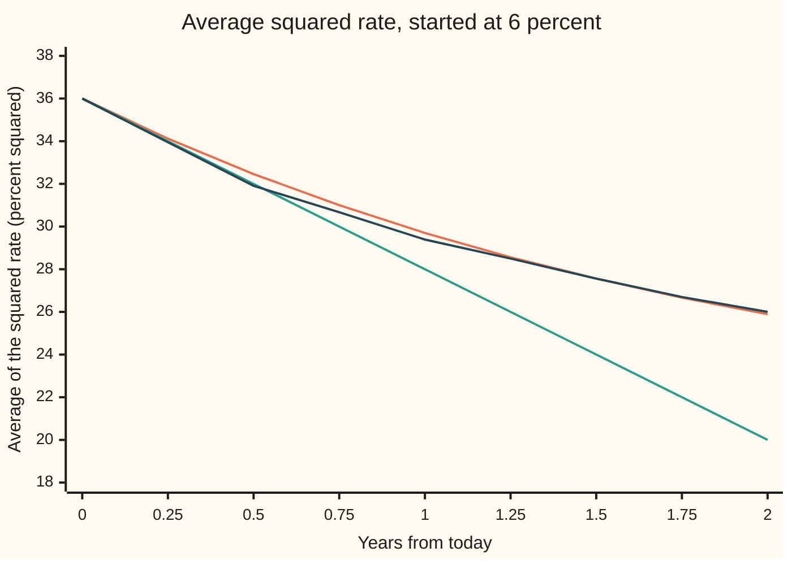

# The generator: the drift-and-diffusion operator that summarises an SDE

[Syllabus](../../../SYLLABUS.md) → [Stochastic processes and calculus](../README.md) → [Generators, Densities and Simulation](../README.md#s08) → The generator

---

## General Overview

A short-term interest rate stands at 6 percent. Over the long run it settles near 4 percent. The further it strays, the harder it is pulled back, and on top of the pull come random shocks. This is the Ornstein-Uhlenbeck rate of [Mean reversion](../06-Ito%20Calculus/05-ornstein-uhlenbeck-and-cir-processes.md), with the same numbers: pull speed 0.5 a year, noise 0.02 per square-root year, time in years.

Three questions about the next instant. How fast is the average rate changing, right now? It falls by 1 percentage point a year. How fast is the average of the squared rate changing? It falls by 8 "percent squared" a year, from 36. How fast is the average squared gap to 4 percent changing? Not at all: the pull shrinks the gap exactly as fast as the shocks widen it.

All three answers come from one machine. Feed it any smooth measurement of the state, a rule that turns the rate into a number. It returns the expected rate of change of that measurement, from every starting state at once. The machine is built from two dials of the equation: the drift, which tilts the measurement along its slope, and the noise, which bends it along its curvature. From here on the machine has its proper name, the **generator**. A rule that turns one function into another is called an **operator**, and the generator is the operator that summarises a stochastic differential equation (SDE).

Adding up those instantaneous rates along a path gives **Dynkin's formula**: the expected value of a measurement at a stopping time, a random time recognised when it arrives. With it, two questions about the rate come down to solving one equation each. Started at 6 percent, the rate reaches 8 percent before 4 percent about 1 time in 4. On average one of the two edges is hit after 1.08 years.

**The generator L turns a smooth measurement f of a diffusion into its expected rate of change from each state, drift times slope plus half the squared noise times curvature; Dynkin's formula adds those rates up to a stopping time to give the expected value of f where the path stops.**

**What kind of fact this is:** a definition (the generator, as a limit); the drift-and-curvature formula for it and Dynkin's formula are theorems, both proved on this card in Why it works from Ito's lemma.

### The picture: the generator is the starting slope of an average



Orange: the exact average of the squared rate, from the rate's known bell-curve law. Green: the straight line that leaves 36 with slope −8 per year, the generator's answer. Dark blue: the average over 4,000 simulated paths, each of 1,000 steps of 0.002 years, seed 20260930; its standard error is about 0.3 at two years, so it agrees with orange to within its noise. The green line touches the orange curve at the start and then leaves it. The generator gives the slope now, not the whole curve: the curve bends because the state moves.

---

## The formula

Reminders first. $X_t$ is the value at time $t$ of a process, here the rate $r_t$. $W_t$ is Brownian motion, the random walk seen from far away. The process obeys a stochastic differential equation, $dX_t = \mu(X_t)\,dt + \sigma(X_t)\,dW_t$: in each short slice of time, drift by $\mu$ times the slice and take a shove of $\sigma$ times the Brownian step. The symbol $dW_t$ is shorthand for an Ito integral, never a derivative, because the path has none ([Stochastic differential equations](../06-Ito%20Calculus/04-stochastic-differential-equations.md)).

New notation. $E_x$ means an average over all paths that start at $x$. $f'$ and $f''$ are the slope and the curvature of a function $f$, as on [Ito's lemma](../06-Ito%20Calculus/02-itos-lemma.md). The generator is written $L$; $Lf$ is the new function it makes from $f$, read "L applied to f".

The definition: start at $x$, wait a short time $h$, and measure how much the average of $f$ has moved, per unit time.

$$Lf(x) = \lim_{h \to 0} \frac{E_x\big[f(X_h)\big] - f(x)}{h}$$

**Read it aloud:** the generator of f at x is the expected rate of change of f, at the instant the process leaves x.

The theorem that makes it usable: for the equation above and any $f$ with two continuous slopes,

$$Lf(x) = \mu(x)\,f'(x) + \tfrac12\,\sigma(x)^2\,f''(x).$$

**Read it aloud:** drift times slope, plus half the squared noise times curvature.

For the two processes of this wing: the Ornstein-Uhlenbeck rate $r$, pulled toward the level $\theta$ = 0.04 at pull speed $\kappa$ = 0.5 a year, with constant noise; and a share price $S$ in geometric Brownian motion, whose drift $\mu S$ and noise $\sigma S$ grow with the price, the constants being $\mu$ = 0.05 a year and $\sigma$ = 0.20 per square-root year.

$$\text{Ornstein-Uhlenbeck:}\quad Lf(r) = \kappa(\theta - r)\,f'(r) + \tfrac12\sigma^2 f''(r)$$

$$\text{geometric Brownian motion:}\quad Lf(S) = \mu S\,f'(S) + \tfrac12\sigma^2 S^2 f''(S)$$

**Dynkin's formula.** For a stopping time $\tau$, a time recognised when it arrives without seeing the future, with finite average,

$$E_x\big[f(X_\tau)\big] = f(x) + E_x\Big[\int_0^\tau Lf(X_u)\,du\Big].$$

**Read it aloud:** the average of f where the path stops is where it started, plus the average of the generator's rates added up along the way.

Two choices of $f$ turn Dynkin's formula into answers about the band from $a$ = 4 percent to $b$ = 8 percent. A function with $Lp = 0$, $p(a) = 0$, $p(b) = 1$ is the chance $p(x)$ of reaching $b$ first. A function with $Lg = -1$, $g(a) = g(b) = 0$ is the mean exit time $g(x)$. For the Ornstein-Uhlenbeck rate the first one integrates in closed form, with $c = \kappa/\sigma^2$:

$$p(x) = \frac{\int_a^x e^{\,c(y-\theta)^2}\,dy}{\int_a^b e^{\,c(y-\theta)^2}\,dy}.$$

| Symbol | Plain meaning | In our example | Push it up and the answer… |
| --- | --- | --- | --- |
| $t$, $h$, $dt$ | time in years; one short step of time; a slice of time inside an equation | $h$ = 0.1 down to 0.0001 | a smaller $h$ brings the ratio closer to $Lf$ |
| $X_t$, $X$, $r_t$, $r$, $x$, $S$ | the process at time $t$, or as a whole; the OU rate, at time $t$ and as a variable; the starting state; the GBM share price | the rate from $x$ = 0.06; the share from $100 | — |
| $W_t$, $dW_t$ | Brownian motion; its step, shorthand for an Ito integral | one fresh normal draw per step | — |
| $\mu$ | drift: the steady part of each step, per year | OU: $\kappa(\theta - r)$ = −0.01 at 6 percent; GBM: $\mu S$, with the constant $\mu$ = 0.05, so 5 at $100 | $Lf$ moves by $f'$ per unit of drift |
| $\sigma$ | noise size, per square-root year | OU 0.02; GBM: $\sigma S$, with the constant $\sigma$ = 0.20 | $Lf$ rises where $f$ curves upward |
| $f$, $f'$, $f''$ | a measurement of the state; its slope; its curvature | $r^2$: slope 0.12, curvature 2 at 6 percent | — |
| $L$, $Lf$ | the generator; the expected rate of change it returns | $L[r^2]$ = −0.0008 per year at 6 percent | — |
| $E_x$ | average over all paths started at $x$ | 4,000 simulated paths stand in for it | — |
| $\tau$ | a stopping time: the first exit from the band | mean 1.083540 years | — |
| $\kappa$, $\theta$, $c$ | OU pull speed per year; long-run level; $\kappa/\sigma^2$ | 0.5; 0.04; 1250 | faster pull, faster fall of the average |
| $m$, $n$, $\lambda$, $C$, $M$, $K$, $q$, $\tau_n$, $G$ | inside Why it works and its folded proofs: the average squared gap; a power, or a counter; an eigenvalue; a constant of integration; bounds; a test function; the stop capped at time $n$; and, under real life, a chain's rate matrix | $m$ stays at 0.0004; $\lambda$ = 0.14 for $n$ = 2 | — |
| $k$, $s$, $I$ | in the folded callouts: the drift piece as one function; the factor $e^{c(y-\theta)^2}$; a running integral | $k$ = −0.0008 at 6 percent for $f = r^2$ | — |
| $a$, $b$, $p$, $g$ | band edges; chance of reaching $b$ first; mean exit time | 0.04, 0.08; 0.252692; 1.083540 years | a wider band, a longer wait |

### When it holds

- **Two continuous slopes in f.** The formula needs a curvature. A kink breaks it: the measurement $|r - \theta|$ has no curvature at 4 percent, and its expected change there grows like the square root of $h$, so the ratio in the definition has no limit.
- **An equation with one solution.** Drift and noise whose change between two states is at most a fixed multiple of the distance between them (the Lipschitz condition of [Stochastic differential equations](../06-Ito%20Calculus/04-stochastic-differential-equations.md)) give each start one law of paths, so $E_x$ means one thing.
- **Drift and noise that do not depend on the clock.** If they do, the generator carries the time as well; for a measurement that depends on time too, $\partial f/\partial t$, its slope in time, is added to $Lf$.
- **For Dynkin, a stopping time with finite average, and f and Lf bounded where the path lives before it.** In the band both hold. Drop them and the formula fails outright: Brownian motion stopped at its first visit to 1, measured by $f(x) = x$, ends at 1, while Dynkin would predict 0.
- **Averages that exist.** On the whole line, $f$ must not grow so fast that $E_x f(X_h)$ is infinite; for GBM, powers $S^n$ are fine, while $e^{S}$ is not, since the lognormal law's right tail is too heavy.

---

## Why it works

### Step 0: averaging removes the fair-game part

Ito's lemma splits every small change of $f(X_t)$ into two pieces: a drift piece of size $dt$, and a shove of size $dW_t$. The shove is a fair game: its average is zero. Averaging over paths deletes it and leaves the drift piece. That drift piece is the generator.

### Step 1: the formula, from Ito's lemma

By [Ito's lemma](../06-Ito%20Calculus/02-itos-lemma.md), in integral form,

$$f(X_h) = f(x) + \int_0^h \Big(\mu f' + \tfrac12\sigma^2 f''\Big)(X_u)\,du + \int_0^h \sigma f'(X_u)\,dW_u.$$

The last integral has mean zero: it is an Ito integral, and Ito integrals of a bounded integrand are martingales started at zero. Take $E_x$ of both sides and divide by $h$:

$$\frac{E_x[f(X_h)] - f(x)}{h} = \frac1h\int_0^h E_x\Big[\big(\mu f' + \tfrac12\sigma^2 f''\big)(X_u)\Big]\,du.$$

The right side is the average over the first $h$ years of the drift piece. As $h$ shrinks, the path has had no time to move, so that average tends to its value at the start, $\mu(x) f'(x) + \tfrac12\sigma(x)^2 f''(x)$.

<details>
<summary>Detailed proof: the limit, with its hypotheses</summary>

Take $f$ with two continuous slopes, and suppose $f$, $f'$ and $f''$ are bounded and vanish outside a bounded interval, and that $\mu$ and $\sigma$ are continuous. Then the integrand $\sigma f'$ is bounded, so $\int_0^t \sigma f'(X_u)\,dW_u$ is a martingale with mean zero ([The Ito integral](../06-Ito%20Calculus/01-ito-integral.md)). Write $k(y) = \mu(y)f'(y) + \tfrac12\sigma(y)^2f''(y)$; it is continuous and bounded, by a number $M$ say. Paths of $X$ are continuous, so $k(X_u) \to k(x)$ as $u \to 0$, path by path. The average $\frac1h\int_0^h k(X_u)\,du$ therefore tends to $k(x)$ on every path, and it is bounded by $M$. Dominated convergence (wing 10) moves the limit through $E_x$: the ratio tends to $k(x)$. A function that does not vanish outside an interval, such as $r^2$, is handled by stopping the process when it first leaves a large interval and letting the interval grow; for the OU rate the code checks the answer directly against the exact law.

</details>

### Step 2: the Ornstein-Uhlenbeck rate, three measurements

The drift at 6 percent is $\kappa(\theta - r) = 0.5 \times (0.04 - 0.06) = -0.01$. The squared noise is $0.02^2 = 0.0004$.

- **The rate itself, $f(r) = r$.** Slope 1, curvature 0. $L[r] = -0.01$: the average rate falls one percentage point a year, right now. Noise does nothing to a straight line.
- **The squared rate, $f(r) = r^2$.** Slope 0.12, curvature 2. $L[r^2] = -0.01 \times 0.12 + \tfrac12 \times 0.0004 \times 2 = -0.0012 + 0.0004 = -0.0008$. The pull lowers $r^2$; the noise raises it, because a bowl-shaped measurement gains on average from any wobble.
- **The squared gap, $f(r) = (r - \theta)^2$.** Slope $2 \times 0.02 = 0.04$, curvature 2. $L f = -0.01 \times 0.04 + 0.0004 = 0$. The squared gap is $0.0004$, which is exactly the long-run variance $\sigma^2/(2\kappa)$; a start one long-run standard deviation from the level sits where pull and noise balance in the average.

The third line has a consequence. In general $L[(r-\theta)^2] = -2\kappa(r-\theta)^2 + \sigma^2$, and averaging that along the path gives an ordinary equation for $m(t) = E[(r_t - \theta)^2]$: $m' = -2\kappa m + \sigma^2$. Started at $m = \sigma^2/(2\kappa)$, it never moves. The simulation finds $0.00041658 \pm 0.00000949$ at two years.

### Step 3: geometric Brownian motion, and its natural measurements

A share at $100 with drift 0.05 and noise 0.20 a year:

- $L[S] = \mu S = 5$: the average price climbs $5 a year, now.
- $L[\log S] = \mu S \cdot \tfrac1S + \tfrac12\sigma^2 S^2 \cdot (-\tfrac1{S^2}) = \mu - \tfrac12\sigma^2 = 0.03$: the log price drifts 3 percent a year, the Ito correction of [Ito's lemma](../06-Ito%20Calculus/02-itos-lemma.md) seen as one evaluation of $L$.
- $L[S^2] = 2\mu S^2 + \sigma^2 S^2 = 0.14 \times 10000 = 1400$.

Powers are special for GBM. $L[S^n] = \big(n\mu + \tfrac12 n(n-1)\sigma^2\big) S^n$: the generator returns the same function times a number. A function with that property is an **eigenfunction** of $L$, and its number the eigenvalue. Averaging gives $\frac{d}{dt}E[S_t^n] = \lambda E[S_t^n]$ with that number $\lambda$, so $E[S_t^n] = S_0^n e^{\lambda t}$: the moments of the lognormal law, read off the generator without its density.

### Step 4: Dynkin's formula, from the same split at a stopping time

Run Step 1's identity up to a stopping time $\tau$ instead of a fixed $h$:

$$f(X_\tau) = f(x) + \int_0^\tau Lf(X_u)\,du + \int_0^\tau \sigma f'(X_u)\,dW_u.$$

The last term is a martingale stopped at $\tau$. When $\tau$ is bounded, optional stopping ([Stopping times](../02-Martingales/03-stopping-times-and-optional-stopping.md)) keeps its mean at zero, and averaging gives Dynkin's formula. For an unbounded $\tau$ with finite average, apply it to the bounded time $\min(\tau, n)$ and let $n$ grow.

<details>
<summary>Detailed proof: from bounded times to a finite average</summary>

Fix the band $[a, b]$ and let $\tau$ be the first exit. Change $f$ outside a slightly wider band so that it vanishes far away, keeping it the same on $[a, b]$; nothing before $\tau$ notices. Now $f$, $f'$, $f''$ and $Lf$ are bounded, by $M$ say. For each whole number $n$, $\tau_n = \min(\tau, n)$ is a bounded stopping time. The stochastic integral $\int_0^{t} \sigma f'(X_u)\,dW_u$ is a martingale with bounded integrand, so optional stopping at the bounded time $\tau_n$ gives it mean zero, and
$$E_x[f(X_{\tau_n})] = f(x) + E_x\Big[\int_0^{\tau_n} Lf(X_u)\,du\Big].$$
Let $n \to \infty$. Since $E_x\tau$ is finite, $\tau$ is finite almost surely and $\tau_n = \tau$ for all large $n$, so $f(X_{\tau_n}) \to f(X_\tau)$; these values are bounded by $M$. The integrals tend to $\int_0^\tau Lf\,du$ and are bounded by $M\tau$, whose average is finite. Dominated convergence (wing 10) passes both limits through $E_x$. That $E_x\tau$ is finite for the band follows from the same identity. Take $q(y) = -K e^{\lambda y}$, with $\lambda$ so large that $\tfrac12\sigma^2\lambda^2 > \lvert\mu\rvert\lambda + 1$ everywhere on the band and then $K$ large: $Lq \le -1$ there. Dynkin at $\tau_n$ gives $E_x\tau_n \le q(x) - E_x q(X_{\tau_n})$, which is at most twice the largest size of $q$ on the band, for every $n$. Monotone convergence (wing 10) makes $E_x\tau$ finite.

</details>

### Step 5: two questions, two equations

Take $f = p$ with $Lp = 0$. Dynkin says $E_x[p(X_\tau)] = p(x)$. At the exit, $p$ is 1 at $b$ and 0 at $a$, so the left side is the chance of leaving at $b$. That chance is $p(x)$.

Take $f = g$ with $Lg = -1$ and $g = 0$ at both edges. Dynkin says $0 = g(x) - E_x\tau$. So $g(x)$ is the mean exit time.

Each is an ordinary second-order equation, solved by two integrations (the callout below). For the band from 4 to 8 percent, from 6 percent: $p$ = 0.252692 and $g$ = 1.083540 years.

<details>
<summary>The two integrations</summary>

$Lp = 0$ reads $\tfrac12\sigma^2 p'' + \kappa(\theta - x)p' = 0$, a first-order equation for $p'$: $p''/p' = 2\kappa(x - \theta)/\sigma^2$, so $p'(x) = C e^{c(x-\theta)^2}$ with $c = \kappa/\sigma^2$. Integrate from $a$ and fix $C$ by $p(b) = 1$: that is the formula for $p$ in The formula. Write $s(y) = e^{c(y-\theta)^2}$. For $Lg = -1$ the same factor gives $(g'/s)' = -2/(\sigma^2 s)$, so $g'(y) = s(y)\big[C - I(y)\big]$ with $I(y) = \int_a^y 2/(\sigma^2 s(z))\,dz$. Then $g(x) = C\int_a^x s - \int_a^x s\,I$, and $g(b) = 0$ fixes $C$. The code evaluates these with trapezoids on 20,000 slices, and separately solves both equations by finite differences on 2,000 slices.

</details>

A second road to the generator runs through time instead of space: $u(t, x) = E_x[f(X_t)]$ changes in time exactly as $L$ says it changes in space, $\partial u/\partial t = Lu$. That is the backward equation, derived on [Kolmogorov backward equation](02-kolmogorov-backward-equation.md).

---

## Worked numbers, by hand

The rate at 6 percent, pull speed 0.5 a year toward 4 percent, noise 0.02. The measurement is the squared rate.

| Step | Arithmetic | Value |
| --- | --- | --- |
| drift at 6 percent | $0.5 \times (0.04 - 0.06)$ | −0.01 |
| slope of $r^2$ | $2 \times 0.06$ | 0.12 |
| drift times slope | $-0.01 \times 0.12$ | −0.0012 |
| squared noise | $0.02 \times 0.02$ | 0.0004 |
| half squared noise times curvature | $\tfrac12 \times 0.0004 \times 2$ | 0.0004 |
| **the generator, $L[r^2]$ at 6 percent** | $-0.0012 + 0.0004$ | **−0.0008 per year** |
| the definition at $h$ = 0.1, 0.01, 0.001, 0.0001 | exact law, from the code | −0.00078033, −0.00079800, −0.00079980, −0.00079998 |

In the world: the average squared rate, 36 in percent squared today, is falling at 8 a year. The tangent line in the picture reaches 28.00 after one year, while the true average is 29.70: the slope eases as the rate nears 4 percent. The definition's ratio closes on −0.0008, and its gap shrinks about tenfold each time $h$ does.

Dynkin's formula on the band, from the code: the chance of reaching 8 percent before 4 percent is 0.252692, about 1 in 4, and the mean wait for either edge is 1.083540 years. Most paths exit at the bottom, because the pull points there; the wait is over a year because the 2-point distance to either edge is one full year's worth of noise.

### What breaks if you drop a piece

| Mistake | Comes out at | What went wrong |
| --- | --- | --- |
| Drop the curvature term: ordinary calculus | $L[r^2]$ = −0.0012; $L[(r-\theta)^2]$ = −0.0004 | Predicts the squared gap shrinking. The simulation finds it still at 0.00041658 ± 0.00000949 after two years. |
| Keep the curvature, forget the half | $L[r^2]$ = −0.0004 | Counts the noise twice; the average squared rate would fall at half the true speed |
| Apply Dynkin to a stopping time with infinite average | Brownian motion from 0, stopped at 1: Dynkin predicts 0, the truth is 1 | The time to reach 1 is finite on almost every path but infinite on average: P(stopped by 1 year) = 0.3173, by 100 years 0.9203, by 10,000 years 0.9920 |
| Check the exit on a coarse time grid | mean exit 1.173154 ± 0.015217 years at step 0.004 | Paths that cross an edge between grid points are missed, so exits look late; the error falls to +0.042 at step 0.001, and at 0.00025 to +0.004, inside its noise of 0.014 |

---

## Code, from first principles, and it actually runs

Both programs take four roads to the same generator. First, the formula, drift times slope plus half squared noise times curvature. Second, the definition itself: the ratio $(E_x f(X_h) - f(x))/h$ with the average taken under the exact law (normal for the OU rate, lognormal for the share), by Simpson's rule against the bell curve, at four shrinking steps. Third, Dynkin's formula on the house example, 4,000 rate paths of 1,000 Euler steps of 0.002 years from a SplitMix64 generator with Box-Muller normals ([Euler-Maruyama](04-euler-maruyama-scheme.md) studies that scheme's own error). Fourth, for the band, the exit chance and mean exit time by the two integrations, by finite differences with a tridiagonal solve, and by simulation at three step sizes. Every simulated number carries its standard error.

### Python

```python
# The generator -- the check behind the card.  Only math is imported.
# OU short rate: dr = KAPPA (THETA - r) dt + SIG dW, from R0 = 6 percent, time in years.
# GBM share: dS = MU S dt + VOL S dW from $100.  The generator is L f = drift f' + 1/2 noise^2 f''.
# Roads: the formula; the definition (E f(X_h) - f(x)) / h with E taken under the exact law
# (Simpson against the bell curve) at shrinking h; Dynkin's formula on 4000 simulated paths
# of 1000 Euler steps (SplitMix64, Box-Muller); and, for the band 4 to 8 percent, the exit
# chance and mean exit time by integrals, by finite differences, and by simulation.
import math

KAPPA, THETA, R0, SIG = 0.5, 0.04, 0.06, 0.02          # per year, rate, rate, per sqrt(year)
S0, MU, VOL = 100.0, 0.05, 0.20                        # dollars, per year, per sqrt(year)
LO, HI, SEED, MASK = 0.04, 0.08, 20260930, (1 << 64) - 1

def L_ou(f1, f2, r): return KAPPA * (THETA - r) * f1(r) + 0.5 * SIG * SIG * f2(r)
def L_gbm(f1, f2, s): return MU * s * f1(s) + 0.5 * VOL * VOL * s * s * f2(s)
def ou_law(r, t): return THETA + (r - THETA) * math.exp(-KAPPA * t), math.sqrt(SIG * SIG / (2 * KAPPA) * (1 - math.exp(-2 * KAPPA * t)))
def expect_normal(g, m, sd, n=4000):                   # E g(m + sd Z) by Simpson on [-10, 10]
    h, tot = 20.0 / n, 0.0
    for i in range(n + 1):
        z = -10.0 + i * h
        tot += (1 if i in (0, n) else (4 if i % 2 else 2)) * g(m + sd * z) * math.exp(-0.5 * z * z)
    return tot * h / 3 / math.sqrt(2 * math.pi)
def quotient_ou(f, h):                                 # the definition, at step h
    m, sd = ou_law(R0, h); return (expect_normal(f, m, sd) - f(R0)) / h
def quotient_gbm(f, h):                                # log S_h is normal: exact GBM law
    m, sd = math.log(S0) + (MU - 0.5 * VOL * VOL) * h, VOL * math.sqrt(h)
    return (expect_normal(lambda y: f(math.exp(y)), m, sd) - f(S0)) / h

class SplitMix64:
    def __init__(self, seed): self.s, self.spare = seed & MASK, None
    def uniform(self):
        self.s = (self.s + 0x9E3779B97F4A7C15) & MASK
        z = self.s
        z = ((z ^ (z >> 30)) * 0xBF58476D1CE4E5B9) & MASK
        z = ((z ^ (z >> 27)) * 0x94D049BB133111EB) & MASK
        return (((z ^ (z >> 31)) >> 11) + 0.5) / 9007199254740992.0
    def normal(self):                                  # Box-Muller, both halves used
        if self.spare is not None:
            z, self.spare = self.spare, None; return z
        rad, ang = math.sqrt(-2.0 * math.log(self.uniform())), 2.0 * math.pi * self.uniform()
        self.spare = rad * math.sin(ang); return rad * math.cos(ang)
def mean_se(xs):
    n = len(xs); m = sum(xs) / n
    return m, math.sqrt(sum((x - m) * (x - m) for x in xs) / (n - 1) / n)

def band_integrals(x, n=20000):                        # scale function and L g = -1, by trapezoids
    c, d = KAPPA / (SIG * SIG), (HI - LO) / n
    sp = [math.exp(c * (LO + i * d - THETA) ** 2) for i in range(n + 1)]
    S, I, J = [0.0], [0.0], [0.0]
    for i in range(n):
        S.append(S[-1] + d * (sp[i] + sp[i + 1]) / 2)
        I.append(I[-1] + d * (2 / (SIG * SIG)) * (1 / sp[i] + 1 / sp[i + 1]) / 2)
        J.append(J[-1] + d * (sp[i] * I[i] + sp[i + 1] * I[i + 1]) / 2)
    k = round((x - LO) / d)
    return S[k] / S[n], J[n] * S[k] / S[n] - J[k]
def band_fd(x, rhs, top, n=2000):                      # 1/2 SIG^2 u'' + drift u' = rhs, Thomas algorithm
    d = (HI - LO) / n; a = 0.5 * SIG * SIG / (d * d)
    cp, dp = [0.0] * n, [0.0] * n
    for i in range(1, n):
        b = KAPPA * (THETA - (LO + i * d)) / (2 * d)
        lo, di, up, r = a - b, -2 * a, (a + b if i < n - 1 else 0.0), rhs - ((a + b) * top if i == n - 1 else 0.0)
        den = di - lo * cp[i - 1]; cp[i], dp[i] = up / den, (r - lo * dp[i - 1]) / den
    u = [0.0] * (n + 1); u[n] = top
    for i in range(n - 1, 0, -1): u[i] = dp[i] - cp[i] * u[i + 1]
    return u[round((x - LO) / d)]
def band_sim(h, paths, rng):
    ups, times = [], []
    for _ in range(paths):
        r, k = R0, 0
        while LO < r < HI:
            r += KAPPA * (THETA - r) * h + SIG * math.sqrt(h) * rng.normal(); k += 1
        ups.append(1.0 if r >= HI else 0.0); times.append(k * h)
    return mean_se(ups), mean_se(times)
sq, one, zero = (lambda r: 2 * r), (lambda r: 1.0), (lambda r: 0.0)
gap2 = lambda r: (r - THETA) ** 2
rows = [("OU  L[r] at 6%", L_ou(one, zero, R0)), ("OU  L[r^2] at 6%", L_ou(sq, lambda r: 2.0, R0)),
        ("OU  L[(r-theta)^2] at 6%", L_ou(lambda r: 2 * (r - THETA), lambda r: 2.0, R0)),
        ("wrong: no 1/2 sigma^2 f'', L[r^2]", L_ou(sq, zero, R0)),
        ("wrong: no 1/2 sigma^2 f'', L[gap^2]", L_ou(lambda r: 2 * (r - THETA), zero, R0)),
        ("wrong: sigma^2 f'' without the 1/2", L_ou(sq, lambda r: 4.0, R0))]
for name, v in rows: print(f"{name:<40}{v:>14.8f}")
quo = {}; print("definition (E f(r_h) - f(0.06)) / h, exact OU law:")
for h in (0.1, 0.01, 0.001, 0.0001):
    quo[h] = (quotient_ou(lambda r: r, h), quotient_ou(lambda r: r * r, h), quotient_ou(gap2, h))
    print(f"  h = {h:<8} r {quo[h][0]:>12.8f}  r^2 {quo[h][1]:>12.8f}  gap^2 {round(quo[h][2], 8) + 0.0:>12.8f}")
g_rows = [("GBM L[s] at $100", L_gbm(one, zero, S0), quotient_gbm(lambda s: s, 1e-4)),
          ("GBM L[log s] at $100", L_gbm(lambda s: 1 / s, lambda s: -1 / (s * s), S0), quotient_gbm(math.log, 1e-4)),
          ("GBM L[s^2] at $100", L_gbm(sq, lambda s: 2.0, S0), quotient_gbm(lambda s: s * s, 1e-4))]
print("GBM: formula, then definition at h = 0.0001:")
for name, a, b in g_rows: print(f"  {name:<22}{a:>14.6f}{b:>14.6f}")
# ---- the house example: 4000 paths, 1000 Euler steps over 2 years; f = r^2 ----
rng, PATHS, STEPS, T = SplitMix64(SEED), 4000, 1000, 2.0; h = T / STEPS
marks = list(range(0, STEPS + 1, 125))
sums = {k: [] for k in marks}; mart, g2 = [], []
for _ in range(PATHS):
    r, comp = R0, 0.0
    sums[0].append(r * r)
    for k in range(1, STEPS + 1):
        comp += L_ou(sq, lambda x: 2.0, r) * h
        r += KAPPA * (THETA - r) * h + SIG * math.sqrt(h) * rng.normal()
        if k in sums: sums[k].append(r * r)
    mart.append(r * r - R0 * R0 - comp); g2.append(gap2(r))
print("house example, 4000 paths x 1000 steps of 0.002 years, E[r_t^2] in percent^2:")
chart = []
for k in marks:
    t = k * h; m, sd = ou_law(R0, t)
    sim, se = mean_se(sums[k]); chart.append((t, (m * m + sd * sd) * 1e4, (R0 * R0 + rows[1][1] * t) * 1e4, sim * 1e4, se * 1e4))
    print(f"  t = {t:4.2f}  exact {chart[-1][1]:7.4f}  tangent {chart[-1][2]:7.4f}  sim {chart[-1][3]:7.4f} +- {chart[-1][4]:.4f}")
print("figure, exact  " + ", ".join(f"{c[1]:.2f}" for c in chart))
print("figure, tangent " + ", ".join(f"{c[2]:.2f}" for c in chart))
print("figure, sim    " + ", ".join(f"{c[3]:.2f}" for c in chart))
mm, mse = mean_se(mart); gm, gse = mean_se(g2)
print(f"{'Dynkin: mean of r_T^2 - r_0^2 - sum L f h':<40}{mm:>14.8f} +- {mse:.8f}")
print(f"{'E[(r_2 - theta)^2], simulated':<40}{gm:>14.8f} +- {gse:.8f}")
p_int, t_int = band_integrals(R0)
p_fd, t_fd = band_fd(R0, 0.0, 1.0), band_fd(R0, -1.0, 0.0)
print("band 4% to 8% from 6%: chance 8% first, mean exit time (years)")
print(f"  integrals          {p_int:.6f}   {t_int:.6f}")
sims = {}; print(f"  finite differences {p_fd:.6f}   {t_fd:.6f}")
for hh in (0.004, 0.001, 0.00025):
    sims[hh] = band_sim(hh, 4000, rng); (p, pse), (tm, tse) = sims[hh]
    print(f"  sim h = {hh:<7}    {p:.6f} +- {pse:.6f}   {tm:.6f} +- {tse:.6f}   off by {tm - t_int:+.4f}")
def ncdf(x, n=2000):                                   # bell-curve area left of x, by Simpson
    hx = x / n
    return 0.5 + sum((1 if i in (0, n) else (4 if i % 2 else 2)) * math.exp(-0.5 * (i * hx) ** 2) for i in range(n + 1)) * hx / 3 / math.sqrt(2 * math.pi)
print("unbounded stopping: W from 0, tau = first hit of 1; E[W_tau] = 1, not 0")
for TT in (1, 100, 10000): print(f"  P(tau <= {TT:>5}) = {2 * (1 - ncdf(1 / math.sqrt(TT))):.4f}")
e = [abs(quo[hh][1] - rows[1][1]) for hh in (0.1, 0.01, 0.001)]
assert abs(quo[0.0001][1] - rows[1][1]) < 1e-7, "definition limit must reach the formula"
assert e[1] < e[0] / 5 and e[2] < e[1] / 5, "quotient error must shrink with h"
assert abs(g_rows[2][2] - g_rows[2][1]) < 0.05, "GBM: definition vs formula for s^2"
assert abs(mm) < 4 * mse, "Dynkin: the compensated r^2 has mean zero"
assert abs(chart[-1][3] - chart[-1][1]) < 4 * chart[-1][4], "simulated E[r_2^2] vs exact OU law"
assert abs(p_int - p_fd) < 1e-5, "exit chance: integrals vs finite differences"
assert abs(t_int - t_fd) < 1e-5, "exit time: integrals vs finite differences"
assert abs(sims[0.00025][0][0] - p_int) < 4 * sims[0.00025][0][1], "simulated exit chance"
assert abs(sims[0.00025][1][0] - t_int) < 4 * sims[0.00025][1][1], "simulated exit time, finest step"
print("ALL CHECKS PASS")
```

**Ran 2026-10-06 on macOS, Python 3.14.6, standard library only. All checks passed. Output, pasted from the run:**

```
OU  L[r] at 6%                             -0.01000000
OU  L[r^2] at 6%                           -0.00080000
OU  L[(r-theta)^2] at 6%                    0.00000000
wrong: no 1/2 sigma^2 f'', L[r^2]          -0.00120000
wrong: no 1/2 sigma^2 f'', L[gap^2]        -0.00040000
wrong: sigma^2 f'' without the 1/2         -0.00040000
definition (E f(r_h) - f(0.06)) / h, exact OU law:
  h = 0.1      r  -0.00975412  r^2  -0.00078033  gap^2   0.00000000
  h = 0.01     r  -0.00997504  r^2  -0.00079800  gap^2   0.00000000
  h = 0.001    r  -0.00999750  r^2  -0.00079980  gap^2   0.00000000
  h = 0.0001   r  -0.00999975  r^2  -0.00079998  gap^2   0.00000000
GBM: formula, then definition at h = 0.0001:
  GBM L[s] at $100            5.000000      5.000012
  GBM L[log s] at $100        0.030000      0.030000
  GBM L[s^2] at $100       1400.000000   1400.009800
house example, 4000 paths x 1000 steps of 0.002 years, E[r_t^2] in percent^2:
  t = 0.00  exact 36.0000  tangent 36.0000  sim 36.0000 +- 0.0000
  t = 0.25  exact 34.1200  tangent 34.0000  sim 33.9467 +- 0.1712
  t = 0.50  exact 32.4608  tangent 32.0000  sim 31.9116 +- 0.2218
  t = 0.75  exact 30.9966  tangent 30.0000  sim 30.6686 +- 0.2525
  t = 1.00  exact 29.7045  tangent 28.0000  sim 29.3864 +- 0.2720
  t = 1.25  exact 28.5642  tangent 26.0000  sim 28.4987 +- 0.2789
  t = 1.50  exact 27.5579  tangent 24.0000  sim 27.5619 +- 0.2863
  t = 1.75  exact 26.6698  tangent 22.0000  sim 26.7038 +- 0.2914
  t = 2.00  exact 25.8861  tangent 20.0000  sim 25.9989 +- 0.2970
figure, exact  36.00, 34.12, 32.46, 31.00, 29.70, 28.56, 27.56, 26.67, 25.89
figure, tangent 36.00, 34.00, 32.00, 30.00, 28.00, 26.00, 24.00, 22.00, 20.00
figure, sim    36.00, 33.95, 31.91, 30.67, 29.39, 28.50, 27.56, 26.70, 26.00
Dynkin: mean of r_T^2 - r_0^2 - sum L f h   -0.00000444 +- 0.00005028
E[(r_2 - theta)^2], simulated               0.00041658 +- 0.00000949
band 4% to 8% from 6%: chance 8% first, mean exit time (years)
  integrals          0.252692   1.083540
  finite differences 0.252692   1.083540
  sim h = 0.004      0.232750 +- 0.006682   1.173154 +- 0.015217   off by +0.0896
  sim h = 0.001      0.250750 +- 0.006854   1.125583 +- 0.014403   off by +0.0420
  sim h = 0.00025    0.249750 +- 0.006845   1.087775 +- 0.014341   off by +0.0042
unbounded stopping: W from 0, tau = first hit of 1; E[W_tau] = 1, not 0
  P(tau <=     1) = 0.3173
  P(tau <=   100) = 0.9203
  P(tau <= 10000) = 0.9920
ALL CHECKS PASS
```

At the smallest step the definition and the formula agree to four significant figures on every row, and on the OU rows the gap shrinks tenfold each time $h$ does. The compensated squared rate, $r_T^2 - r_0^2$ minus the added-up generator, averages $-0.00000444 \pm 0.00005028$: zero to well within its noise, which is Dynkin's formula at the fixed time of two years. The integrals and the finite differences agree to six decimals; the simulation at the finest step lands within its standard error of both.

### Rust

Same roads, same seed, same order of draws. No crates.

```rust
// The generator -- the same check as infinitesimal_generator_check.py, in Rust.  Std only.
// OU short rate: dr = KAPPA (THETA - r) dt + SIG dW, from R0 = 6 percent, time in years.
// GBM share: dS = MU S dt + VOL S dW from $100.  The generator is L f = drift f' + 1/2 noise^2 f''.
// Roads: the formula; the definition (E f(X_h) - f(x)) / h under the exact law (Simpson);
// Dynkin's formula on 4000 simulated paths of 1000 Euler steps (SplitMix64, Box-Muller);
// the band 4 to 8 percent by integrals, by finite differences, and by simulation.
use std::f64::consts::PI;

const KAPPA: f64 = 0.5; const THETA: f64 = 0.04; const R0: f64 = 0.06; const SIG: f64 = 0.02;
const S0: f64 = 100.0; const MU: f64 = 0.05; const VOL: f64 = 0.20;
const LO: f64 = 0.04; const HI: f64 = 0.08; const SEED: u64 = 20260930;

fn l_ou(f1: &dyn Fn(f64) -> f64, f2: &dyn Fn(f64) -> f64, r: f64) -> f64 { KAPPA * (THETA - r) * f1(r) + 0.5 * SIG * SIG * f2(r) }
fn l_gbm(f1: &dyn Fn(f64) -> f64, f2: &dyn Fn(f64) -> f64, s: f64) -> f64 { MU * s * f1(s) + 0.5 * VOL * VOL * s * s * f2(s) }
fn ou_law(r: f64, t: f64) -> (f64, f64) {
    (THETA + (r - THETA) * (-KAPPA * t).exp(), (SIG * SIG / (2.0 * KAPPA) * (1.0 - (-2.0 * KAPPA * t).exp())).sqrt())
}
fn w(i: usize, n: usize) -> f64 { if i == 0 || i == n { 1.0 } else if i % 2 == 1 { 4.0 } else { 2.0 } }
fn expect_normal(g: &dyn Fn(f64) -> f64, m: f64, sd: f64) -> f64 {            // E g(m + sd Z) by Simpson on [-10, 10]
    let n = 4000; let h = 20.0 / n as f64; let mut tot = 0.0;
    for i in 0..=n { let z = -10.0 + i as f64 * h; tot += w(i, n) * g(m + sd * z) * (-0.5 * z * z).exp(); }
    tot * h / 3.0 / (2.0 * PI).sqrt()
}
fn quotient_ou(f: &dyn Fn(f64) -> f64, h: f64) -> f64 { let (m, sd) = ou_law(R0, h); (expect_normal(f, m, sd) - f(R0)) / h }
fn quotient_gbm(f: &dyn Fn(f64) -> f64, h: f64) -> f64 {
    let (m, sd) = (S0.ln() + (MU - 0.5 * VOL * VOL) * h, VOL * h.sqrt());
    (expect_normal(&|y: f64| f(y.exp()), m, sd) - f(S0)) / h
}
struct SplitMix64 { s: u64, spare: Option<f64> }
impl SplitMix64 {
    fn uniform(&mut self) -> f64 {
        self.s = self.s.wrapping_add(0x9E3779B97F4A7C15);
        let mut z = self.s;
        z = (z ^ (z >> 30)).wrapping_mul(0xBF58476D1CE4E5B9);
        z = (z ^ (z >> 27)).wrapping_mul(0x94D049BB133111EB);
        (((z ^ (z >> 31)) >> 11) as f64 + 0.5) / 9007199254740992.0
    }
    fn normal(&mut self) -> f64 {                            // Box-Muller, both halves used
        if let Some(z) = self.spare.take() { return z; }
        let rad = (-2.0 * self.uniform().ln()).sqrt(); let ang = 2.0 * PI * self.uniform();
        self.spare = Some(rad * ang.sin()); rad * ang.cos()
    }
}
fn mean_se(xs: &[f64]) -> (f64, f64) {
    let n = xs.len() as f64; let m = xs.iter().fold(0.0, |a, x| a + x) / n;
    (m, (xs.iter().fold(0.0, |a, x| a + (x - m) * (x - m)) / (n - 1.0) / n).sqrt())
}
fn band_integrals(x: f64) -> (f64, f64) {                    // scale function and L g = -1, by trapezoids
    let n = 20000; let c = KAPPA / (SIG * SIG); let d = (HI - LO) / n as f64;
    let sp: Vec<f64> = (0..=n).map(|i| (c * (LO + i as f64 * d - THETA).powi(2)).exp()).collect();
    let (mut s, mut ii, mut j) = (vec![0.0], vec![0.0], vec![0.0]);
    for i in 0..n {
        s.push(s[i] + d * (sp[i] + sp[i + 1]) / 2.0);
        ii.push(ii[i] + d * (2.0 / (SIG * SIG)) * (1.0 / sp[i] + 1.0 / sp[i + 1]) / 2.0);
        j.push(j[i] + d * (sp[i] * ii[i] + sp[i + 1] * ii[i + 1]) / 2.0);
    }
    let k = ((x - LO) / d).round() as usize;
    (s[k] / s[n], j[n] * s[k] / s[n] - j[k])
}
fn band_fd(x: f64, rhs: f64, top: f64) -> f64 {              // 1/2 SIG^2 u'' + drift u' = rhs, Thomas algorithm
    let n = 2000; let d = (HI - LO) / n as f64; let a = 0.5 * SIG * SIG / (d * d);
    let (mut cp, mut dp) = (vec![0.0; n], vec![0.0; n]);
    for i in 1..n {
        let b = KAPPA * (THETA - (LO + i as f64 * d)) / (2.0 * d);
        let (lo, di) = (a - b, -2.0 * a);
        let up = if i < n - 1 { a + b } else { 0.0 };
        let r = rhs - if i == n - 1 { (a + b) * top } else { 0.0 };
        let den = di - lo * cp[i - 1]; cp[i] = up / den; dp[i] = (r - lo * dp[i - 1]) / den;
    }
    let mut u = vec![0.0; n + 1]; u[n] = top;
    for i in (1..n).rev() { u[i] = dp[i] - cp[i] * u[i + 1]; }
    u[((x - LO) / d).round() as usize]
}
fn band_sim(h: f64, paths: usize, rng: &mut SplitMix64) -> ((f64, f64), (f64, f64)) {
    let (mut ups, mut times) = (Vec::new(), Vec::new());
    for _ in 0..paths {
        let (mut r, mut k) = (R0, 0u64);
        while LO < r && r < HI { r += KAPPA * (THETA - r) * h + SIG * h.sqrt() * rng.normal(); k += 1; }
        ups.push(if r >= HI { 1.0 } else { 0.0 }); times.push(k as f64 * h);
    }
    (mean_se(&ups), mean_se(&times))
}
fn ncdf(x: f64) -> f64 {                                     // bell-curve area left of x, by Simpson
    let n = 2000; let hx = x / n as f64;
    let s = (0..=n).fold(0.0, |a, i| a + w(i, n) * (-0.5 * (i as f64 * hx).powi(2)).exp());
    0.5 + s * hx / 3.0 / (2.0 * PI).sqrt()
}

fn main() {
    let sq = |r: f64| 2.0 * r; let one = |_: f64| 1.0; let zero = |_: f64| 0.0; let two = |_: f64| 2.0;
    let gap2 = |r: f64| (r - THETA).powi(2); let dgap = |r: f64| 2.0 * (r - THETA);
    let rows = [("OU  L[r] at 6%", l_ou(&one, &zero, R0)), ("OU  L[r^2] at 6%", l_ou(&sq, &two, R0)),
        ("OU  L[(r-theta)^2] at 6%", l_ou(&dgap, &two, R0)),
        ("wrong: no 1/2 sigma^2 f'', L[r^2]", l_ou(&sq, &zero, R0)),
        ("wrong: no 1/2 sigma^2 f'', L[gap^2]", l_ou(&dgap, &zero, R0)),
        ("wrong: sigma^2 f'' without the 1/2", l_ou(&sq, &|_: f64| 4.0, R0))];
    for (name, v) in &rows { println!("{:<40}{:>14.8}", name, v); }
    println!("definition (E f(r_h) - f(0.06)) / h, exact OU law:");
    let mut quo = Vec::new();
    for h in [0.1, 0.01, 0.001, 0.0001] {
        let q = (quotient_ou(&|r| r, h), quotient_ou(&|r| r * r, h), quotient_ou(&gap2, h));
        println!("  h = {:<8} r {:>12.8}  r^2 {:>12.8}  gap^2 {:>12.8}", h, q.0, q.1, (q.2 * 1e8).round() / 1e8 + 0.0);
        quo.push(q);
    }
    let g_rows = [("GBM L[s] at $100", l_gbm(&one, &zero, S0), quotient_gbm(&|s| s, 1e-4)),
        ("GBM L[log s] at $100", l_gbm(&|s| 1.0 / s, &|s| -1.0 / (s * s), S0), quotient_gbm(&|s: f64| s.ln(), 1e-4)),
        ("GBM L[s^2] at $100", l_gbm(&sq, &two, S0), quotient_gbm(&|s| s * s, 1e-4))];
    println!("GBM: formula, then definition at h = 0.0001:");
    for (name, a, b) in &g_rows { println!("  {:<22}{:>14.6}{:>14.6}", name, a, b); }
    // ---- the house example: 4000 paths, 1000 Euler steps over 2 years; f = r^2 ----
    let mut rng = SplitMix64 { s: SEED, spare: None };
    let (paths, steps, t_end) = (4000usize, 1000usize, 2.0_f64); let h = t_end / steps as f64;
    let marks: Vec<usize> = (0..=steps).step_by(125).collect();
    let mut sums: Vec<Vec<f64>> = vec![Vec::new(); marks.len()]; let (mut mart, mut g2) = (Vec::new(), Vec::new());
    for _ in 0..paths {
        let (mut r, mut comp) = (R0, 0.0);
        sums[0].push(r * r);
        for k in 1..=steps {
            comp += l_ou(&sq, &two, r) * h;
            r += KAPPA * (THETA - r) * h + SIG * h.sqrt() * rng.normal();
            if k % 125 == 0 { sums[k / 125].push(r * r); }
        }
        mart.push(r * r - R0 * R0 - comp); g2.push(gap2(r));
    }
    println!("house example, 4000 paths x 1000 steps of 0.002 years, E[r_t^2] in percent^2:");
    let mut chart = Vec::new();
    for (idx, k) in marks.iter().enumerate() {
        let t = *k as f64 * h; let (m, sd) = ou_law(R0, t); let (sim, se) = mean_se(&sums[idx]);
        let c = (t, (m * m + sd * sd) * 1e4, (R0 * R0 + rows[1].1 * t) * 1e4, sim * 1e4, se * 1e4);
        println!("  t = {:4.2}  exact {:7.4}  tangent {:7.4}  sim {:7.4} +- {:.4}", c.0, c.1, c.2, c.3, c.4);
        chart.push(c);
    }
    let join = |f: &dyn Fn(&(f64, f64, f64, f64, f64)) -> f64| chart.iter().map(|c| format!("{:.2}", f(c))).collect::<Vec<_>>().join(", ");
    println!("figure, exact  {}", join(&|c| c.1));
    println!("figure, tangent {}", join(&|c| c.2));
    println!("figure, sim    {}", join(&|c| c.3));
    let (mm, mse) = mean_se(&mart); let (gm, gse) = mean_se(&g2);
    println!("{:<40}{:>14.8} +- {:.8}", "Dynkin: mean of r_T^2 - r_0^2 - sum L f h", mm, mse);
    println!("{:<40}{:>14.8} +- {:.8}", "E[(r_2 - theta)^2], simulated", gm, gse);
    let (p_int, t_int) = band_integrals(R0);
    let (p_fd, t_fd) = (band_fd(R0, 0.0, 1.0), band_fd(R0, -1.0, 0.0));
    println!("band 4% to 8% from 6%: chance 8% first, mean exit time (years)");
    println!("  integrals          {:.6}   {:.6}", p_int, t_int);
    println!("  finite differences {:.6}   {:.6}", p_fd, t_fd);
    let mut sims = Vec::new();
    for hh in [0.004, 0.001, 0.00025] {
        let ((p, pse), (tm, tse)) = band_sim(hh, 4000, &mut rng);
        println!("  sim h = {:<7}    {:.6} +- {:.6}   {:.6} +- {:.6}   off by {:+.4}", hh, p, pse, tm, tse, tm - t_int);
        sims.push(((p, pse), (tm, tse)));
    }
    println!("unbounded stopping: W from 0, tau = first hit of 1; E[W_tau] = 1, not 0");
    for tt in [1u32, 100, 10000] { println!("  P(tau <= {:>5}) = {:.4}", tt, 2.0 * (1.0 - ncdf(1.0 / (tt as f64).sqrt()))); }
    let e: Vec<f64> = quo[..3].iter().map(|q| (q.1 - rows[1].1).abs()).collect();
    assert!((quo[3].1 - rows[1].1).abs() < 1e-7, "definition limit must reach the formula");
    assert!(e[1] < e[0] / 5.0 && e[2] < e[1] / 5.0, "quotient error must shrink with h");
    assert!((g_rows[2].2 - g_rows[2].1).abs() < 0.05, "GBM: definition vs formula for s^2");
    assert!(mm.abs() < 4.0 * mse, "Dynkin: the compensated r^2 has mean zero");
    assert!((chart[8].3 - chart[8].1).abs() < 4.0 * chart[8].4, "simulated E[r_2^2] vs exact OU law");
    assert!((p_int - p_fd).abs() < 1e-5, "exit chance: integrals vs finite differences");
    assert!((t_int - t_fd).abs() < 1e-5, "exit time: integrals vs finite differences");
    assert!((sims[2].0 .0 - p_int).abs() < 4.0 * sims[2].0 .1, "simulated exit chance");
    assert!((sims[2].1 .0 - t_int).abs() < 4.0 * sims[2].1 .1, "simulated exit time, finest step");
    println!("ALL CHECKS PASS");
}
```

**Ran 2026-10-06 on macOS, rustc 1.98.1, no crates. All checks passed. Output, pasted from the run:**

```
OU  L[r] at 6%                             -0.01000000
OU  L[r^2] at 6%                           -0.00080000
OU  L[(r-theta)^2] at 6%                    0.00000000
wrong: no 1/2 sigma^2 f'', L[r^2]          -0.00120000
wrong: no 1/2 sigma^2 f'', L[gap^2]        -0.00040000
wrong: sigma^2 f'' without the 1/2         -0.00040000
definition (E f(r_h) - f(0.06)) / h, exact OU law:
  h = 0.1      r  -0.00975412  r^2  -0.00078033  gap^2   0.00000000
  h = 0.01     r  -0.00997504  r^2  -0.00079800  gap^2   0.00000000
  h = 0.001    r  -0.00999750  r^2  -0.00079980  gap^2   0.00000000
  h = 0.0001   r  -0.00999975  r^2  -0.00079998  gap^2   0.00000000
GBM: formula, then definition at h = 0.0001:
  GBM L[s] at $100            5.000000      5.000012
  GBM L[log s] at $100        0.030000      0.030000
  GBM L[s^2] at $100       1400.000000   1400.009800
house example, 4000 paths x 1000 steps of 0.002 years, E[r_t^2] in percent^2:
  t = 0.00  exact 36.0000  tangent 36.0000  sim 36.0000 +- 0.0000
  t = 0.25  exact 34.1200  tangent 34.0000  sim 33.9467 +- 0.1712
  t = 0.50  exact 32.4608  tangent 32.0000  sim 31.9116 +- 0.2218
  t = 0.75  exact 30.9966  tangent 30.0000  sim 30.6686 +- 0.2525
  t = 1.00  exact 29.7045  tangent 28.0000  sim 29.3864 +- 0.2720
  t = 1.25  exact 28.5642  tangent 26.0000  sim 28.4987 +- 0.2789
  t = 1.50  exact 27.5579  tangent 24.0000  sim 27.5619 +- 0.2863
  t = 1.75  exact 26.6698  tangent 22.0000  sim 26.7038 +- 0.2914
  t = 2.00  exact 25.8861  tangent 20.0000  sim 25.9989 +- 0.2970
figure, exact  36.00, 34.12, 32.46, 31.00, 29.70, 28.56, 27.56, 26.67, 25.89
figure, tangent 36.00, 34.00, 32.00, 30.00, 28.00, 26.00, 24.00, 22.00, 20.00
figure, sim    36.00, 33.95, 31.91, 30.67, 29.39, 28.50, 27.56, 26.70, 26.00
Dynkin: mean of r_T^2 - r_0^2 - sum L f h   -0.00000444 +- 0.00005028
E[(r_2 - theta)^2], simulated               0.00041658 +- 0.00000949
band 4% to 8% from 6%: chance 8% first, mean exit time (years)
  integrals          0.252692   1.083540
  finite differences 0.252692   1.083540
  sim h = 0.004      0.232750 +- 0.006682   1.173154 +- 0.015217   off by +0.0896
  sim h = 0.001      0.250750 +- 0.006854   1.125583 +- 0.014403   off by +0.0420
  sim h = 0.00025    0.249750 +- 0.006845   1.087775 +- 0.014341   off by +0.0042
unbounded stopping: W from 0, tau = first hit of 1; E[W_tau] = 1, not 0
  P(tau <=     1) = 0.3173
  P(tau <=   100) = 0.9203
  P(tau <= 10000) = 0.9920
ALL CHECKS PASS
```

The two outputs agree line for line, including every simulated digit: both programs draw the same SplitMix64 numbers in the same order and do the same arithmetic in the same order.

> [!TIP]
> **Try changing**
> Guess the direction first. Then run it.
> - **Start at the long-run level.** Set `R0 = 0.04`. The rate row becomes zero, since there is no gap to pull on; the squared-gap row becomes positive, because only the noise is left. The band rows collapse to zero: 4 percent is already an edge, so the exit is immediate. Every simulated exit is then exactly zero with zero error, and the strict simulated-exit asserts stop the run.
> - **Double the noise.** Set `SIG = 0.04`. The squared-rate row turns positive: the curvature term grows with the square of the noise and now outweighs the pull. The band is left far sooner, and 8 percent comes first far more often.
> - **Widen the band.** Set `LO, HI` to `0.02, 0.10`. Reaching the top edge becomes rare, since the pull works against it the whole way, and the mean wait runs to years.
> - **Starve the exit grid.** Put a step of 0.016 at the front of the loop over `hh`. Its mean exit time lands further above the integral than any finer step does: a coarse grid misses more crossings between its points.

---

## The usual mistake

> [!warning]
> **Reading $Lf$ as what f does along a path.** It is the rate of change of the *average*. One path's squared rate moves each instant by a shove of size $\sigma f'$ times the Brownian step, which over a short time $h$ is of order the square root of $h$ and dwarfs the drift piece of order $h$.
>
> Smaller traps:
> - **Ordinary calculus.** Dropping $\tfrac12\sigma^2 f''$ gives $L[r^2]$ = −0.0012 instead of −0.0008, and predicts a squared gap that shrinks when it stands still.
> - **Losing the half.** It gives −0.0004, and the average squared rate falls at half its true speed.
> - **Dynkin with an infinite average wait.** It needs a finite average wait and bounded measurements up to the stop. Brownian motion stopped at 1 breaks it: 1 against a predicted 0.
> - **Confusing L with its mirror image.** The generator acts on measurements, functions of the state. The operator that moves the density of the state forward in time is its adjoint, a different formula with the drift and noise inside the derivatives: [Fokker-Planck](03-fokker-planck-forward-equation.md).

---

## Where you meet it in real life

- **Pricing a bond on a mean-reverting rate.** A bond's price as a function of today's rate solves "its slope in time, plus the generator of the rate applied to it, minus the rate times the price, equals zero", the term-structure equation of [A short-rate model](../../12-Financial%20mathematics/30-Short-Rate%20Models/01-the-term-structure-equation.md); Vasicek's model is this card's OU rate.
- **Continuous-time chains.** For a chain on finitely many states, the generator is a matrix: the rate matrix $G$ of [Continuous-time chains](../04-Poisson%20and%20Jump%20Processes/05-continuous-time-markov-chains-and-queues.md), and $Lf$ is $G$ times the column of values of $f$. Same definition, same Dynkin formula.
- **Exit problems.** How long until a reservoir level, an inventory or a price leaves a band, and through which side: Step 5's two equations.
- **Stopping problems.** The value, the best expected payoff over all stopping rules, lies on or above the payoff everywhere. Where waiting is right, $L$ applied to the value is zero; where stopping is right, the value equals the payoff and $L$ applied to the payoff is zero or negative. So, with no discounting, waiting is right wherever $L$ applied to the payoff is positive. Discrete time: [Optimal stopping](07-optimal-stopping-and-snell-envelope.md); the continuous problem in full: An American option.
- **Simulation error.** The weak error of a time-stepping scheme, how far its averages sit from the true ones, is computed by expanding in powers of $L$: [Milstein and the two kinds of error](05-milstein-and-strong-weak-convergence.md).

> **Say it back**
> The generator takes a smooth measurement of a diffusion and returns its expected rate of change from each state. It is defined as a limit and computed as drift times slope plus half the squared noise times curvature, because averaging deletes the fair-game shove in Ito's lemma. For the OU rate at 6 percent it gives −0.01 for the rate, −0.0008 for the squared rate and zero for the squared gap. Dynkin's formula adds those rates up to a stopping time with finite average wait. Solving Lp = 0 and Lg = −1 then gives the chance of each exit and the mean time to it.

---

## What this builds on

- [Ito's lemma](../06-Ito%20Calculus/02-itos-lemma.md): the split of $df(X_t)$ into a drift piece and a shove. The generator is the drift piece.
- [Mean reversion](../06-Ito%20Calculus/05-ornstein-uhlenbeck-and-cir-processes.md): the rate, its exact normal law, and the long-run variance that makes the squared gap stand still.
- [Stopping times](../02-Martingales/03-stopping-times-and-optional-stopping.md): why a stopped martingale keeps its mean at a bounded stopping time, the step that turns Ito's lemma into Dynkin's formula.

## Where this goes next

- [Kolmogorov backward equation](02-kolmogorov-backward-equation.md): the generator's slope at the start, extended to every time: $E_x f(X_t)$ solves $\partial u/\partial t = Lu$.
- [Stochastic control](../09-Beyond%20Brownian/03-stochastic-control-and-the-hjb-equation.md): a controller who can turn the drift and noise dials picks the generator that does best; the HJB equation is a maximum over generators.
- Hille-Yosida: the generator as the derivative at zero of the family of averaging operators, and which operators arise this way.
- Feller semigroups: the general theory, where a Markov process is built from its generator rather than from an SDE.

The generator gives the slope of every average at the start; the backward equation answers what those averages are at every later time.

---

## Sources

Verified 2026-10-06: each DOI checked against Crossref for title and first author.

- Øksendal, Bernt. *Stochastic Differential Equations: An Introduction with Applications*, 6th ed. Springer, 2003. [doi:10.1007/978-3-642-14394-6](https://doi.org/10.1007/978-3-642-14394-6). Chapter 7 defines the generator of an Ito diffusion, computes it from the drift and noise, and proves Dynkin's formula with exit-time examples.
- Karatzas, Ioannis, and Steven E. Shreve. *Brownian Motion and Stochastic Calculus*, 2nd ed. Springer, 1998. [doi:10.1007/978-1-4612-0949-2](https://doi.org/10.1007/978-1-4612-0949-2). Chapter 5, on one-dimensional diffusions: the scale function and speed measure, the tools behind the two integrations of Step 5.
- Dynkin, E. B. *Markov Processes*. Springer, 1965. [doi:10.1007/978-3-662-00031-1](https://doi.org/10.1007/978-3-662-00031-1). The generator of a Markov process as a limit, and the formula that carries Dynkin's name.
- Vasicek, Oldrich. "An Equilibrium Characterization of the Term Structure." *Journal of Financial Economics* 5, no. 2 (1977): 177–188. [doi:10.1016/0304-405X(77)90016-2](https://doi.org/10.1016/0304-405X(77)90016-2). The OU short rate as a model for interest rates, priced through its generator.
