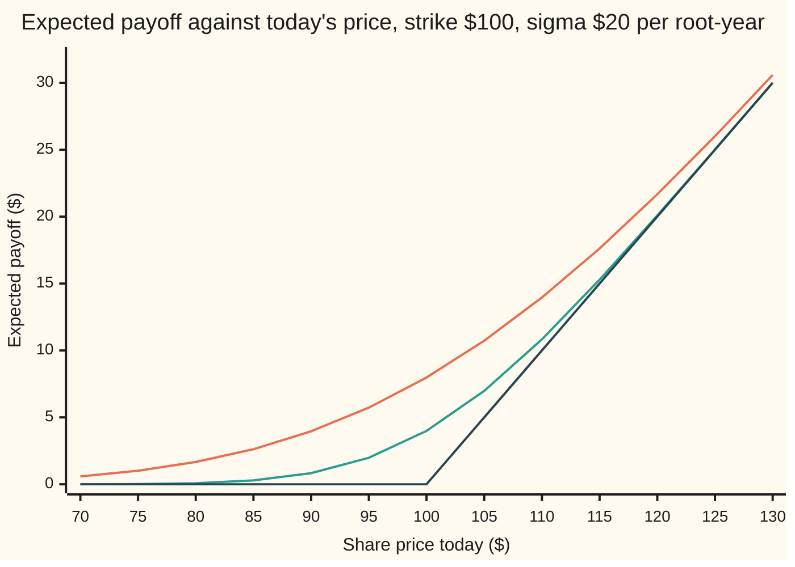

# Kolmogorov backward equation: how an expectation depends on the starting point

[Syllabus](../../../SYLLABUS.md) → [Stochastic processes and calculus](../README.md) → [Generators, Densities and Simulation](../README.md#s08) → Kolmogorov backward equation

---

## General Overview

A share trades at $100 today. In one year a contract pays whatever the share then trades above $100, and nothing if it ends below. The share moves as Brownian motion: no drift, and a spread (standard deviation) of $20 after one year, growing with the square root of the time. The expected payoff comes out at $7.98.

That single number hides a function. Start the share at $110 instead and the expected payoff is $13.96. Start it at $80 and it is $1.67. Leave a quarter of a year to run instead of a whole one and the expected payoff from $100 is $3.99. Expected payoff, as a function of today's price and the time left, is a surface. This card finds the rule the surface obeys.

The rule is local. Over the next instant the share moves a tiny random amount, and the expected payoff now must equal the average of the expected payoffs where it could land. Averaging over a small symmetric wobble measures the bend of the surface. So the clock rate of the expected payoff is fixed by its bend in the price: a differential equation, solved backward from the payoff date. For Brownian motion it is the heat equation in reverse time.

**The expected payoff at a later date, viewed as a function of today's price and today's date, changes with the clock exactly as fast as the generator, the process's rule for the instantaneous average change, says it must: time rate plus generator equals zero, with the payoff itself as the condition at the end.**

**What kind of fact this is:** a theorem. The derivation and the Brownian solution are proved on this card in Why it works; for a general diffusion the card gives the key steps and the complete statement is Øksendal's Theorem 8.1.1.

### The picture: the surface at three moments



Orange: one year to go. Green: a quarter of a year to go. Dark blue: the payoff itself, on the payment date. Each curve is the closed-form solution, printed by both checks; none is a simulation. Read right to left in time, the hockey stick at the payment date is smoothed more and more as the time to go grows. That smoothing is what the backward equation describes.

---

## The formula

Notation first, in words. Time is in years. The share price at time $t$ is $X_t$, a stochastic process (the value at time t, one run of it a sample path). $W_t$ is Brownian motion, the random walk seen from far away. In $dX_t = \mu\,dt + \sigma\,dW_t$ the last piece is shorthand for an Ito integral, never a derivative, because the path has none. The generator $L$ is the process's instantaneous average rate of change ([The generator](01-infinitesimal-generator.md)): for this process it sends a smooth function $g$ to $\mu\, g' + \tfrac12 \sigma^2 g''$. A partial derivative such as $\partial_t u$ is the rate of change of $u$ as $t$ moves with the price held still; $\partial_{xx} u$ is the bend of $u$ in the price.

The payoff rule is $f$, paid on the payment date $T$; here $f(y) = \max(y - K, 0)$ with strike $K$ = $100. The quantity on this card is the expected payoff seen from price $x$ at time $t$:

$$u(t, x) = E\big[\, f(X_T) \mid X_t = x \,\big].$$

The Kolmogorov backward equation says it solves

$$\partial_t u + L u = 0 \quad (t < T), \qquad u(T, x) = f(x), \qquad L u = \mu\, \partial_x u + \tfrac12 \sigma^2\, \partial_{xx} u .$$

**Read it aloud:** the clock rate of the expected payoff plus the generator applied to it is zero, and on the payment date the expected payoff is the payoff.

Measured in time to go, $\tau = T - t$, the sign flips and Brownian motion gives the heat equation:

$$\partial_\tau u = \mu\, \partial_x u + \tfrac12 \sigma^2\, \partial_{xx} u, \qquad u(0, x) = f(x).$$

**Read it aloud:** as the time to go grows, the expected payoff spreads like heat, at diffusivity one half sigma squared, carried along by the drift.

For constant $\mu$ and $\sigma$ the solution is an average over the bell curve, and for the call payoff it has a closed form:

$$u(\tau, x) = \int f\big(x + \mu\tau + \sigma\sqrt{\tau}\, z\big)\,\varphi(z)\,dz = (x + \mu\tau - K)\,N(d) + \sigma\sqrt{\tau}\;\varphi(d), \qquad d = \frac{x + \mu\tau - K}{\sigma\sqrt{\tau}} .$$

**Read it aloud:** the expected payoff is the amount the share is expected to finish above the strike, weighted by the chance it finishes there, plus a premium for the spread. Here $\varphi$ is the bell-curve height and $N(d)$ the bell-curve area to the left of $d$.

| Symbol | Plain meaning | In our example | Push it up and the answer… |
| --- | --- | --- | --- |
| $u$; $\partial_\tau u$, $\partial_x u$, $\partial_{xx} u$ | expected payoff from a given start; its rate in time to go, its slope and its bend in the price | 7.978846 at $100 with a year to go | — |
| $f$, $g$ | the payoff rule on the payment date; $g$ is any smooth function the generator acts on | `max(y - 100, 0)` dollars | — |
| $x$ | today's price, the starting point | $100 | rises, never faster than the price itself |
| $t$, $T$, $\tau$ | today's date, the payment date, the time to go $\tau = T - t$, in years | $\tau$ = 1 | rises: more spread, more chance of finishing high |
| $X_t$, $W_t$, $r_t$ | the share price at time $t$; Brownian motion; the house interest rate | $X_t = 100 + 20 W_t$ | — |
| $\sigma$ | the noise size: dollars of spread per root-year (0.02 for the rate) | $20 | rises in proportion at the strike |
| $\mu$ | the drift, dollars per year | 0, then $5 | rises: the start is effectively $5 a year higher |
| $K$ | the strike, the level the payoff is counted from | $100 | falls |
| $L$ | the generator: the instantaneous average rate of change | $\tfrac12 \sigma^2$ times the bend, 200 times it here | — |
| $N$, $\varphi$, $d$ | bell-curve area to the left, bell-curve height, distance to the strike in spread units | $d$ = 0, $\varphi(0)$ = 0.398942 | — |
| $h$, $\delta$ | the tree's time step and its move size $\delta = \sigma\sqrt{h}$ | 0.0025 years, $1 | coarser: error grows in proportion to $h$ |
| $\kappa$, $\theta$ | the rate's pull speed and its long-run level | 0.5 per year, 0.04 | — |

### When it holds

- **The payoff depends only on the final price, and the process is Markov: today's price carries everything.** Then the expected payoff is a function of $t$ and $x$ alone. If the payoff depends on the path, such as whether the share touched $80, the equation needs a boundary condition, here $u = 0$ at $80, or extra state; without one the answer is $7.98 where the right one is $7.81.
- **The coefficients are known functions of the state and time.** Drift and noise must be $\mu(x, t)$ and $\sigma(x, t)$, smooth and not growing faster than the price. Otherwise the solution can fail to exist or explode.
- **The payoff does not grow too fast.** A payoff growing like a power of the price is fine. Without such a bound the expectation can be infinite. And among fast-growing functions the equation has more than one solution with the same end condition (Tychonoff's example), so only the growth bound picks out the expectation.
- **Ito calculus, not ordinary calculus.** The second-derivative term comes from Ito's lemma. Dropping it gives $0 for the at-the-money contract.

---

## Why it works

### Step 0: today's expectation is the average of the next instant's expectations

Stand at time $t$ with the share at $x$. Wait a short time $h$. The share is now somewhere near $x$, and from wherever it is, the expected payoff is $u(t + h, \cdot)$ evaluated there. The tower rule for conditional expectation (averaging in two stages gives the same as averaging once) and the Markov property (the future depends on the past only through the present price) give

$$u(t, x) = E\big[\, u(t + h, X_{t+h}) \mid X_t = x \,\big].$$

Everything below expands the right side for small $h$.

### Step 1: the coin-flip version is exact, and is a finite-difference scheme

Replace Brownian motion by a walk that moves $\delta$ up or $\delta$ down each step $h$, with equal chances and $\delta = \sigma\sqrt{h}$. With $h$ = 0.0025 years the move is $1. Step 0 becomes an exact recursion:

$$u(t, x) = \tfrac12\, u(t + h, x + \delta) + \tfrac12\, u(t + h, x - \delta).$$

Subtract $u(t + h, x)$ from both sides and divide by $h$. The left side becomes minus the clock rate. The right side becomes $\delta^2 / (2h)$ times the second difference divided by $\delta^2$:

$$\frac{u(t + h, x) - u(t, x)}{h} + \frac{\delta^2}{2h}\cdot\frac{u(t + h, x + \delta) - 2u(t + h, x) + u(t + h, x - \delta)}{\delta^2} = 0 .$$

Since $\delta^2 = \sigma^2 h$, the factor $\delta^2 / (2h)$ is $\tfrac12 \sigma^2$, whatever the step. The second fraction tends to the bend $\partial_{xx} u$, the first to $\partial_t u$. In the limit, $\partial_t u + \tfrac12\sigma^2\,\partial_{xx} u = 0$.

This is the whole equation in miniature. Rolling the recursion back from the payoff date is the coin-flip tree, and the code does exactly that. At steps of 0.01, 0.0025, 0.000625 and 0.000156 years the tree's error at $100 is −0.019922, −0.004985, −0.001247 and −0.000312: each quartering of the step quarters the error.

### Step 2: any diffusion, through the generator

For a general diffusion $dX_t = \mu(X_t)\,dt + \sigma(X_t)\,dW_t$ the generator is defined by the small-time average:

$$E\big[\, g(X_{t+h}) \mid X_t = x \,\big] = g(x) + h\, L g(x) + o(h), \qquad L g = \mu\, g' + \tfrac12 \sigma^2 g'' .$$

Here $o(h)$ means a remainder that shrinks faster than $h$. Apply it in Step 0 with $g = u(t + h, \cdot)$:

$$u(t, x) = u(t + h, x) + h\, L u(t + h, \cdot)(x) + o(h).$$

Move $u(t + h, x)$ across and divide by $h$: minus the clock rate equals $L u$. That is $\partial_t u + L u = 0$. The drift enters through $\mu\,\partial_x u$: the average move pushes the start along the slope.

### Step 3: the same fact, read as a martingale

The process $M_t = u(t, X_t)$ is the best forecast of the payoff given what is known at time $t$: $M_t = E[f(X_T) \mid F_t]$, conditioning on everything known by time $t$. By the tower rule it is a martingale, a fair game whose best forecast of tomorrow is today. Ito's lemma ([Ito's lemma](../06-Ito%20Calculus/02-itos-lemma.md)) writes its change as

$$dM_t = \big(\partial_t u + L u\big)(t, X_t)\,dt + \sigma\,\partial_x u(t, X_t)\,dW_t .$$

A martingale cannot carry a steady drift in time, so the bracket must vanish wherever the process can go. The equation is the condition for the forecast to be fair.

### Step 4: solve it for Brownian motion

In time to go, with $\mu = 0$, the equation reads $\partial_\tau u = \tfrac12\sigma^2\,\partial_{xx} u$. That is the heat equation ([The heat equation](../../08-Differential%20equations%20and%20dynamics/10-The%20Classical%20PDEs/03-the-heat-equation.md)) with diffusivity $\tfrac12\sigma^2$, 200 square dollars per year here. Its solution from an initial profile $f$ is the average of $f$ over a bell curve of spread $\sigma\sqrt{\tau}$ centred on $x$. That is exactly $E[f(x + \sigma W_\tau)]$, since $W_\tau$ is normal with variance $\tau$. The heat equation and Brownian expectation are one object written two ways.

For the call, split the payoff into the part above the strike and evaluate the two halves.

<details>
<summary>The algebra behind the call formula</summary>

Write $s = \sigma\sqrt{\tau}$ and $m = x + \mu\tau$. The payoff is positive when $m + s z > K$, that is when $z > -d$ with $d = (m - K)/s$. So
$$u = \int_{-d}^{\infty} (m - K + s z)\,\varphi(z)\,dz = (m - K)\,N(d) + s\int_{-d}^{\infty} z\,\varphi(z)\,dz .$$
The first piece uses the bell curve's symmetry: the area to the right of $-d$ is $N(d)$. For the second, $z\,\varphi(z)$ is minus the derivative of $\varphi(z)$, so its integral from $-d$ to infinity is $\varphi(-d) = \varphi(d)$. Hence $u = (m - K)N(d) + s\,\varphi(d)$.

</details>

### Step 5: any diffusion, the house rate

The shelf's house example is the interest rate $r_t$ of [Mean reversion](../06-Ito%20Calculus/05-ornstein-uhlenbeck-and-cir-processes.md), pulled toward 0.04 at speed 0.5 per year with noise 0.02. Its generator is $L g = \kappa(\theta - x)\, g' + \tfrac12\sigma^2 g''$. The backward equation in time to go is $\partial_\tau u = \kappa(\theta - x)\,\partial_x u + \tfrac12\sigma^2\,\partial_{xx} u$.

Try $u(\tau, x) = \theta + (x - \theta)e^{-\kappa\tau}$, the expected rate. Its $\tau$-rate is $-\kappa(x - \theta)e^{-\kappa\tau}$. Its slope in $x$ is $e^{-\kappa\tau}$, so the drift term gives $\kappa(\theta - x)e^{-\kappa\tau}$: the same. Its bend is zero. It solves the equation, and from 0.06 with a year to go it gives 0.052131, about 5.21 percent.

The expected square of the rate brings the noise term in. It is the expected rate squared plus $\sigma^2(1 - e^{-2\kappa\tau})/(2\kappa)$, the variance. At a year to go and a rate of 0.06 both sides of the equation, by central differences, are −0.000485225. Simulating 4000 rate paths on 1,000 Euler steps over the year gives 0.052190 and 0.0029827 against 0.052131 and 0.0029704, each within one printed standard error.

<details>
<summary>Detailed proof</summary>

**What is proved here.** (a) For Brownian motion with constant drift the bell-curve average solves the equation. (b) Any smooth solution with polynomial growth is the expectation, so the solution is unique in that class. (c) For a general diffusion, the existence of a smooth solution is stated with its source.

**(a) The Brownian solution solves the equation.** Write the average as $u(\tau, x) = \int f(y)\, p(\tau, y - x - \mu\tau)\,dy$ with the kernel $p(\tau, w) = (2\pi\sigma^2\tau)^{-1/2} e^{-w^2/(2\sigma^2\tau)}$. Direct differentiation gives $\partial_\tau p = \big(w^2/(2\sigma^2\tau^2) - 1/(2\tau)\big)\,p$ and $\partial_{ww} p = \big(w^2/(\sigma^4\tau^2) - 1/(\sigma^2\tau)\big)\,p$, so $\partial_\tau p = \tfrac12\sigma^2\,\partial_{ww} p$. Differentiating under the integral is allowed for $\tau > 0$ because the kernel and its derivatives decay faster than any power, and $f$ grows at most like a power (wing 10's dominated convergence). The $\mu\tau$ shift adds $\mu\,\partial_x u$ by the chain rule. As $\tau \to 0$ the kernel concentrates at $x$ and $u \to f(x)$ at every point where $f$ is continuous.

**(b) Verification.** Let $v(t, x)$ be smooth for $t < T$, solve $\partial_t v + L v = 0$, equal $f$ at $T$, and grow at most like a power of $x$. Apply Ito's lemma to $v(s, X_s)$ from $s = t$ to $s = T - \varepsilon$: the time term vanishes by the equation, leaving an Ito integral of $\sigma\,\partial_x v$. Polynomial growth of $\partial_x v$ and of $\sigma$, with the finite moments of the process under the Lipschitz bound, make that integral a true martingale with mean zero. So $v(t, x) = E[v(T - \varepsilon, X_{T - \varepsilon}) \mid X_t = x]$. Let $\varepsilon \to 0$: continuity at $T$ and dominated convergence give $v(t, x) = E[f(X_T) \mid X_t = x] = u(t, x)$. Any two such solutions are therefore equal. Without the growth bound uniqueness fails: Tychonoff built a nonzero solution of the heat equation that starts at zero.

**(c) General diffusions.** For an Ito diffusion whose drift and noise satisfy a Lipschitz bound, and a twice-differentiable payoff that vanishes outside a bounded interval, $u$ is differentiable enough and solves the equation: Øksendal, Theorem 8.1.1. Extensions to growing coefficients and kinked payoffs are in Karatzas and Shreve, Section 5.7. This card proves the Brownian case completely and gives the general case's key steps (Steps 0 to 3), not its full proof.

</details>

The equation has a forward twin. The backward one fixes the payoff and lets the start vary. The forward one fixes the start and asks how the density of the price spreads: [Fokker-Planck](03-fokker-planck-forward-equation.md). Adding discounting or a running reward to the backward equation gives [Feynman-Kac](../07-Changing%20Measure/06-feynman-kac-formula.md); this card is the case with no discounting.

---

## Worked numbers, by hand

The share at $100, strike $100, a year to go, $\sigma$ = $20 per root-year, no drift.

| Step | Arithmetic | Value |
| --- | --- | --- |
| spread over the year, $\sigma\sqrt{\tau}$ | 20 × 1 | $20 |
| distance in spread units, $d$ | (100 − 100) / 20 | 0 |
| bell-curve height, $\varphi(0)$ | 1 / root(2 pi) | 0.398942 |
| first term, $(x - K)\,N(d)$ | 0 × anything | 0 |
| **expected payoff** | 20 × 0.398942 | **$7.978846** |
| start at $110: $d$ | 10 / 20 | 0.5 |
| first term | 10 × N(0.5) = 10 × 0.691462 | 6.914625 |
| second term | 20 × φ(0.5) = 20 × 0.352065 | 7.041307 |
| **expected payoff from $110** | 6.914625 + 7.041307 | **$13.955931** |

From $100 the contract is expected to pay about $7.98; from $110, about $13.96. The extra ten dollars today adds less than ten to the expected payoff, because a high start still finishes below the strike some of the time.

Does the formula solve the equation? Both checks measure the two sides at $100 with a year to go by central differences. The $\tau$-rate is 3.989423 dollars per year. The bend times one half sigma squared, 200, is 3.989423. A second payoff makes the check by hand. For $f(y) = (y - 100)^2$ the solution is $u = (x - 100)^2 + \sigma^2\tau$. Its $\tau$-rate is $\sigma^2$, 400; its bend is 2, and 200 × 2 is 400. The equation holds, and at $100 a year out the expected square is 400; Simpson's rule gives 400.000000 and the simulation 401.459689 with standard error 1.273080.

### What breaks if you drop a piece

| Mistake | Comes out at | What went wrong |
| --- | --- | --- |
| Ordinary chain rule: no second-derivative term | $0.000000 (right: $7.978846) | Without Ito's term the expected payoff is the payoff at today's price. The spread is the whole value at the strike. With $5 drift it gives $5.000000 against $10.726894. |
| Generator without the one half | $11.283792 | Uses $\sigma^2$ where $\tfrac12\sigma^2$ belongs: the same as a share with root 2 times the noise. |
| Drift sign flipped | $5.726894 (right: $10.726894) | The backward equation carries $+\mu\,\partial_x u$. Its forward twin has the sign the other way, and borrowing it runs the drift backward. |
| A knock-out at $80 ignored | $7.978846 (right: $7.809032) | A contract cancelled if the share touches $80 has a payoff that depends on the path, not only on the final price; the share itself is still Markov. It needs the boundary condition $u = 0$ at $80; by the reflection principle the right value is $7.978846 minus the value from $60. |

The last row is the dropped-hypothesis case. Both checks reach $7.809032 by the reflection formula ([Reflection principle](../05-Brownian%20Motion/04-reflection-principle-and-running-maximum.md)), and the tree with the $80 level made absorbing gives 7.808179 at 1600 steps and 7.808818 at 6400.

---

## Code, from first principles, and it actually runs

The scripts reach $7.978846 by four independent roads: the closed form, with a bell-curve area built from its Taylor series; Simpson's rule averaging the payoff over the bell curve; the coin-flip tree, Step 1's recursion rolled back at four step sizes; and 200000 simulated final prices from a SplitMix64 generator, seed 20260930, with Box-Muller normals and a printed standard error. They check by central differences that the formulas solve the equations, rerun the drift, barrier and house-rate cases, and print every number in the tables and the chart. The asserts compare formula with Simpson to nine decimals, the tree within 0.002 with its error falling at least threefold per quartering of the step, and each simulation within 4 standard errors.

### Python

```python
# Kolmogorov backward equation -- the check behind the card.  Standard library only.
# u(tau, x) = expected payoff of a $100-strike call, tau years before it pays, share at $x today,
# share moving as Brownian motion with sigma = $20 per root-year.  Roads: the closed-form solution,
# a Simpson average over the bell curve, the coin-flip tree (the backward equation stepped exactly),
# and seeded Monte Carlo (SplitMix64 + Box-Muller, written out).  Then the generalisation (drift,
# a barrier, the house OU rate on 1,000 steps) and the what-breaks numbers.
import math

MASK = (1 << 64) - 1
X0, K, SIG, T, MU, BAR, SEED = 100.0, 100.0, 20.0, 1.0, 5.0, 80.0, 20260930
KAP, THE, R0, SOU = 0.5, 0.04, 0.06, 0.02        # house OU rate: pull, level, start, noise

def ncdf(x):                                    # bell-curve area left of x, by its Taylor series
    term, tot, n = x, x, 0
    while abs(term) > 1e-18:
        n += 1
        term *= -x * x / (2 * n)
        tot += term / (2 * n + 1)
    return 0.5 + tot / math.sqrt(2 * math.pi)

def pdf(x): return math.exp(-0.5 * x * x) / math.sqrt(2 * math.pi)
def call(y): return max(y - K, 0.0)
def square(y): return (y - K) * (y - K)

def bach(x, tau, mu=0.0, sig=SIG):              # road 1: the solution of the backward equation
    if tau == 0: return call(x)
    s = sig * math.sqrt(tau); m = x + mu * tau; d = (m - K) / s
    return (m - K) * ncdf(d) + s * pdf(d)

def simpson(pay, x, tau, mu=0.0, n=20000):      # road 2: average pay(x + mu tau + sig root(tau) z)
    a, b = -10.0, 10.0; h = (b - a) / n; s = SIG * math.sqrt(tau)
    g = lambda z: pay(x + mu * tau + s * z) * pdf(z)
    tot = g(a) + g(b)
    for i in range(1, n):
        tot += (4 if i % 2 else 2) * g(a + i * h)
    return tot * h / 3

def tree(x, tau, n, mu=0.0, bar=None):          # road 3: u(t,x) = p u(t+h,x+dl) + (1-p) u(t+h,x-dl)
    h = tau / n; dl = SIG * math.sqrt(h); p = 0.5 + 0.5 * mu * math.sqrt(h) / SIG
    v = [call(x + (2 * j - n) * dl) for j in range(n + 1)]
    for k in range(n, 0, -1):
        v = [p * v[j + 1] + (1 - p) * v[j] for j in range(k)]
        if bar is not None:
            v = [0.0 if x + (2 * j - k + 1) * dl <= bar + 1e-9 else v[j] for j in range(k)]
    return v[0]

class SplitMix64:                               # the wing's generator, written out
    def __init__(self, seed): self.s = seed & MASK
    def uniform(self):
        self.s = (self.s + 0x9E3779B97F4A7C15) & MASK
        z = self.s
        z = ((z ^ (z >> 30)) * 0xBF58476D1CE4E5B9) & MASK
        z = ((z ^ (z >> 27)) * 0x94D049BB133111EB) & MASK
        return ((z ^ (z >> 31)) >> 11) / 9007199254740992.0
    def normal(self):                           # Box-Muller, cosine half only
        u1, u2 = 1.0 - self.uniform(), self.uniform()
        return math.sqrt(-2.0 * math.log(u1)) * math.cos(2.0 * math.pi * u2)

def mean_se(xs):
    n = len(xs); m = sum(xs) / n
    return m, math.sqrt(sum((x - m) * (x - m) for x in xs) / (n - 1) / n)

print(f"setup: x {X0:.0f}, K {K:.0f}, sigma {SIG:.0f} dollars per root-year, T {T:.0f} year, seed {SEED}")
u, u_s = bach(X0, T), simpson(call, X0, T)
print(f"1 closed form u(1, 100)       {u:.6f}")
print(f"2 Simpson average             {u_s:.6f}")
errs = []
for n in (100, 400, 1600, 6400):
    t = tree(X0, T, n); errs.append(abs(t - u))
    print(f"3 tree n {n:<5} step {T / n:.6f} y, move {SIG * math.sqrt(T / n):.2f}  {t:.6f}  error {t - u:+.6f}")
g = SplitMix64(SEED); M = 200000
zs = [g.normal() for _ in range(M)]
mc, se = mean_se([call(X0 + SIG * math.sqrt(T) * z) for z in zs])
print(f"4 Monte Carlo {M} paths   {mc:.6f}  SE {se:.6f}  gap {(mc - u) / se:+.2f} SE")
print(f"hand: phi(0) {pdf(0):.6f}, N(0.5) {ncdf(0.5):.6f}, phi(0.5) {pdf(0.5):.6f}, half sigma^2 {0.5 * SIG * SIG:.0f}")
print(f"hand x 110: 10 N(0.5) {10 * ncdf(0.5):.6f} + 20 phi(0.5) {20 * pdf(0.5):.6f} = {bach(110.0, T):.6f}")
e1, e2 = 1e-4, 1e-2
u_tau = (bach(X0, T + e1) - bach(X0, T - e1)) / (2 * e1)
u_xx = (bach(X0 + e2, T) - 2 * u + bach(X0 - e2, T)) / (e2 * e2)
print(f"equation at (1, 100): u_tau {u_tau:.6f}, half sigma^2 u_xx {0.5 * SIG * SIG * u_xx:.6f}")
sq, sq_mc = simpson(square, X0, T), mean_se([square(X0 + SIG * math.sqrt(T) * z) for z in zs])
print(f"squared payoff: hand sigma^2 tau {SIG * SIG * T:.6f}, Simpson {sq:.6f}, MC {sq_mc[0]:.6f} SE {sq_mc[1]:.6f}")
ud, ud_s, ud_t = bach(X0, T, MU), simpson(call, X0, T, MU), tree(X0, T, 6400, MU)
print(f"drift 5: formula {ud:.6f}, Simpson {ud_s:.6f}, tree n 6400 {ud_t:.6f}")
ub = u - bach(2 * BAR - X0, T)
ub1, ub2 = tree(X0, T, 1600, bar=BAR), tree(X0, T, 6400, bar=BAR)
print(f"barrier 80: value from 60 {bach(2 * BAR - X0, T):.6f}, reflection {ub:.6f}, tree n 1600 {ub1:.6f}, tree n 6400 {ub2:.6f}")
print(f"breaks: ordinary chain rule {call(X0):.6f} (drift 5: {call(X0 + MU * T):.6f})")
print(f"breaks: generator without the half {bach(X0, T, sig=SIG * math.sqrt(2)):.6f}")
print(f"breaks: drift sign flipped {bach(X0, T, -MU):.6f} (right {ud:.6f})")
print(f"breaks: barrier ignored {u:.6f} (right {ub:.6f})")

def ou2(tau, x):                                # OU: u = E[r_T^2] solves the general backward equation
    m = THE + (x - THE) * math.exp(-KAP * tau)
    return m * m + SOU * SOU * (1 - math.exp(-2 * KAP * tau)) / (2 * KAP)
a, b = 1e-4, 1e-3
lhs = (ou2(T + a, R0) - ou2(T - a, R0)) / (2 * a)
rhs = (KAP * (THE - R0) * (ou2(T, R0 + b) - ou2(T, R0 - b)) / (2 * b)
       + 0.5 * SOU * SOU * (ou2(T, R0 + b) - 2 * ou2(T, R0) + ou2(T, R0 - b)) / (b * b))
print(f"OU: kappa {KAP}, theta {THE}, r0 {R0}, sigma {SOU}; equation at (1, 0.06): u_tau {lhs:.9f}, L u {rhs:.9f}")
g = SplitMix64(SEED + 1); P, NS = 4000, 1000; hh = T / NS; fin = []
for _ in range(P):
    r = R0
    for _ in range(NS): r += KAP * (THE - r) * hh + SOU * math.sqrt(hh) * g.normal()
    fin.append(r)
m1, m2 = mean_se(fin), mean_se([r * r for r in fin])
e_r = THE + (R0 - THE) * math.exp(-KAP * T)
print(f"OU 1,000 steps, {P} paths: E[r_1] formula {e_r:.6f}, MC {m1[0]:.6f} SE {m1[1]:.6f}")
print(f"OU E[r_1^2] formula {ou2(T, R0):.7f}, MC {m2[0]:.7f} SE {m2[1]:.7f}")
for x in range(70, 131, 5):
    print(f"chart, x {x}: tau 1 {bach(float(x), 1.0):.2f}, tau 0.25 {bach(float(x), 0.25):.2f}, payoff {call(float(x)):.2f}")

assert abs(u - u_s) < 1e-9 and abs(sq - SIG * SIG * T) < 1e-6        # formula and square vs Simpson
assert errs[3] < 0.002 and errs[1] < errs[0] / 3 and errs[3] < errs[2] / 3  # tree converges, error ~ step
assert abs(mc - u) < 4 * se and abs(sq_mc[0] - SIG * SIG * T) < 4 * sq_mc[1]
assert abs(u_tau - 0.5 * SIG * SIG * u_xx) < 1e-5 and abs(lhs - rhs) < 1e-9  # the formulas solve the PDEs
assert abs(ud - ud_s) < 1e-9 and abs(ud_t - ud) < 0.005 and abs(ub2 - ub) < 0.005
assert abs(m1[0] - e_r) < 4 * m1[1] and abs(m2[0] - ou2(T, R0)) < 4 * m2[1]
print("all checks passed")
```

**Ran 2026-09-30 on macOS, Python 3.14.6, standard library only. All checks passed. Output, pasted from the run:**

```
setup: x 100, K 100, sigma 20 dollars per root-year, T 1 year, seed 20260930
1 closed form u(1, 100)       7.978846
2 Simpson average             7.978846
3 tree n 100   step 0.010000 y, move 2.00  7.958924  error -0.019922
3 tree n 400   step 0.002500 y, move 1.00  7.973860  error -0.004985
3 tree n 1600  step 0.000625 y, move 0.50  7.977599  error -0.001247
3 tree n 6400  step 0.000156 y, move 0.25  7.978534  error -0.000312
4 Monte Carlo 200000 paths   7.997479  SE 0.026212  gap +0.71 SE
hand: phi(0) 0.398942, N(0.5) 0.691462, phi(0.5) 0.352065, half sigma^2 200
hand x 110: 10 N(0.5) 6.914625 + 20 phi(0.5) 7.041307 = 13.955931
equation at (1, 100): u_tau 3.989423, half sigma^2 u_xx 3.989423
squared payoff: hand sigma^2 tau 400.000000, Simpson 400.000000, MC 401.459689 SE 1.273080
drift 5: formula 10.726894, Simpson 10.726894, tree n 6400 10.726573
barrier 80: value from 60 0.169814, reflection 7.809032, tree n 1600 7.808179, tree n 6400 7.808818
breaks: ordinary chain rule 0.000000 (drift 5: 5.000000)
breaks: generator without the half 11.283792
breaks: drift sign flipped 5.726894 (right 10.726894)
breaks: barrier ignored 7.978846 (right 7.809032)
OU: kappa 0.5, theta 0.04, r0 0.06, sigma 0.02; equation at (1, 0.06): u_tau -0.000485225, L u -0.000485225
OU 1,000 steps, 4000 paths: E[r_1] formula 0.052131, MC 0.052190 SE 0.000254
OU E[r_1^2] formula 0.0029704, MC 0.0029827 SE 0.0000271
chart, x 70: tau 1 0.59, tau 0.25 0.00, payoff 0.00
chart, x 75: tau 1 1.01, tau 0.25 0.02, payoff 0.00
chart, x 80: tau 1 1.67, tau 0.25 0.08, payoff 0.00
chart, x 85: tau 1 2.62, tau 0.25 0.29, payoff 0.00
chart, x 90: tau 1 3.96, tau 0.25 0.83, payoff 0.00
chart, x 95: tau 1 5.73, tau 0.25 1.98, payoff 0.00
chart, x 100: tau 1 7.98, tau 0.25 3.99, payoff 0.00
chart, x 105: tau 1 10.73, tau 0.25 6.98, payoff 5.00
chart, x 110: tau 1 13.96, tau 0.25 10.83, payoff 10.00
chart, x 115: tau 1 17.62, tau 0.25 15.29, payoff 15.00
chart, x 120: tau 1 21.67, tau 0.25 20.08, payoff 20.00
chart, x 125: tau 1 26.01, tau 0.25 25.02, payoff 25.00
chart, x 130: tau 1 30.59, tau 0.25 30.00, payoff 30.00
all checks passed
```

### Rust

```rust
// Kolmogorov backward equation -- the check behind the card.  Rust std only, no crates.
// u(tau, x) = expected payoff of a $100-strike call, tau years before it pays, share at $x today,
// share moving as Brownian motion with sigma = $20 per root-year.  Roads: the closed-form solution,
// a Simpson average over the bell curve, the coin-flip tree (the backward equation stepped exactly),
// and seeded Monte Carlo (SplitMix64 + Box-Muller, written out).  Then the generalisation (drift,
// a barrier, the house OU rate on 1,000 steps) and the what-breaks numbers.
use std::f64::consts::PI;

const X0: f64 = 100.0; const K: f64 = 100.0; const SIG: f64 = 20.0; const T: f64 = 1.0;
const MU: f64 = 5.0; const BAR: f64 = 80.0; const SEED: u64 = 20260930;
const KAP: f64 = 0.5; const THE: f64 = 0.04; const R0: f64 = 0.06; const SOU: f64 = 0.02;

fn ncdf(x: f64) -> f64 {                        // bell-curve area left of x, by its Taylor series
    let (mut term, mut tot, mut n) = (x, x, 0.0);
    while term.abs() > 1e-18 {
        n += 1.0;
        term *= -x * x / (2.0 * n);
        tot += term / (2.0 * n + 1.0);
    }
    0.5 + tot / (2.0 * PI).sqrt()
}
fn pdf(x: f64) -> f64 { (-0.5 * x * x).exp() / (2.0 * PI).sqrt() }
fn call(y: f64) -> f64 { (y - K).max(0.0) }
fn square(y: f64) -> f64 { (y - K) * (y - K) }

fn bach(x: f64, tau: f64, mu: f64, sig: f64) -> f64 {   // road 1: the solution of the backward equation
    if tau == 0.0 { return call(x); }
    let s = sig * tau.sqrt(); let m = x + mu * tau; let d = (m - K) / s;
    (m - K) * ncdf(d) + s * pdf(d)
}
fn simpson(pay: fn(f64) -> f64, x: f64, tau: f64, mu: f64) -> f64 {   // road 2: Simpson's rule
    let (a, b, n) = (-10.0, 10.0, 20000usize); let h = (b - a) / n as f64; let s = SIG * tau.sqrt();
    let g = |z: f64| pay(x + mu * tau + s * z) * pdf(z);
    let mut tot = g(a) + g(b);
    for i in 1..n { tot += (if i % 2 == 1 { 4.0 } else { 2.0 }) * g(a + i as f64 * h); }
    tot * h / 3.0
}
fn tree(x: f64, tau: f64, n: usize, mu: f64, bar: Option<f64>) -> f64 {   // road 3: the coin-flip tree
    let h = tau / n as f64; let dl = SIG * h.sqrt(); let p = 0.5 + 0.5 * mu * h.sqrt() / SIG;
    let mut v: Vec<f64> = (0..=n).map(|j| call(x + (2.0 * j as f64 - n as f64) * dl)).collect();
    for k in (1..=n).rev() {
        v = (0..k).map(|j| p * v[j + 1] + (1.0 - p) * v[j]).collect();
        if let Some(bb) = bar {
            for j in 0..k { if x + (2.0 * j as f64 - k as f64 + 1.0) * dl <= bb + 1e-9 { v[j] = 0.0; } }
        }
    }
    v[0]
}

struct SplitMix64 { s: u64 }                    // the wing's generator, written out
impl SplitMix64 {
    fn uniform(&mut self) -> f64 {
        self.s = self.s.wrapping_add(0x9E3779B97F4A7C15);
        let mut z = self.s;
        z = (z ^ (z >> 30)).wrapping_mul(0xBF58476D1CE4E5B9);
        z = (z ^ (z >> 27)).wrapping_mul(0x94D049BB133111EB);
        ((z ^ (z >> 31)) >> 11) as f64 / 9007199254740992.0
    }
    fn normal(&mut self) -> f64 {               // Box-Muller, cosine half only
        let u1 = 1.0 - self.uniform(); let u2 = self.uniform();
        (-2.0 * u1.ln()).sqrt() * (2.0 * PI * u2).cos()
    }
}
fn mean_se(xs: &[f64]) -> (f64, f64) {
    let n = xs.len() as f64; let m = xs.iter().sum::<f64>() / n;
    (m, (xs.iter().map(|x| (x - m) * (x - m)).sum::<f64>() / (n - 1.0) / n).sqrt())
}
fn ou2(tau: f64, x: f64) -> f64 {               // OU: u = E[r_T^2] solves the general backward equation
    let m = THE + (x - THE) * (-KAP * tau).exp();
    m * m + SOU * SOU * (1.0 - (-2.0 * KAP * tau).exp()) / (2.0 * KAP)
}

fn main() {
    println!("setup: x {:.0}, K {:.0}, sigma {:.0} dollars per root-year, T {:.0} year, seed {}", X0, K, SIG, T, SEED);
    let u = bach(X0, T, 0.0, SIG); let u_s = simpson(call, X0, T, 0.0);
    println!("1 closed form u(1, 100)       {:.6}", u);
    println!("2 Simpson average             {:.6}", u_s);
    let mut errs = vec![];
    for n in [100usize, 400, 1600, 6400] {
        let t = tree(X0, T, n, 0.0, None); errs.push((t - u).abs());
        println!("3 tree n {:<5} step {:.6} y, move {:.2}  {:.6}  error {:+.6}", n, T / n as f64, SIG * (T / n as f64).sqrt(), t, t - u);
    }
    let mut g = SplitMix64 { s: SEED }; let m = 200000usize;
    let zs: Vec<f64> = (0..m).map(|_| g.normal()).collect();
    let (mc, se) = mean_se(&zs.iter().map(|z| call(X0 + SIG * T.sqrt() * z)).collect::<Vec<f64>>());
    println!("4 Monte Carlo {} paths   {:.6}  SE {:.6}  gap {:+.2} SE", m, mc, se, (mc - u) / se);
    println!("hand: phi(0) {:.6}, N(0.5) {:.6}, phi(0.5) {:.6}, half sigma^2 {:.0}", pdf(0.0), ncdf(0.5), pdf(0.5), 0.5 * SIG * SIG);
    println!("hand x 110: 10 N(0.5) {:.6} + 20 phi(0.5) {:.6} = {:.6}", 10.0 * ncdf(0.5), 20.0 * pdf(0.5), bach(110.0, T, 0.0, SIG));
    let (e1, e2) = (1e-4, 1e-2);
    let u_tau = (bach(X0, T + e1, 0.0, SIG) - bach(X0, T - e1, 0.0, SIG)) / (2.0 * e1);
    let u_xx = (bach(X0 + e2, T, 0.0, SIG) - 2.0 * u + bach(X0 - e2, T, 0.0, SIG)) / (e2 * e2);
    println!("equation at (1, 100): u_tau {:.6}, half sigma^2 u_xx {:.6}", u_tau, 0.5 * SIG * SIG * u_xx);
    let sq = simpson(square, X0, T, 0.0);
    let sq_mc = mean_se(&zs.iter().map(|z| square(X0 + SIG * T.sqrt() * z)).collect::<Vec<f64>>());
    println!("squared payoff: hand sigma^2 tau {:.6}, Simpson {:.6}, MC {:.6} SE {:.6}", SIG * SIG * T, sq, sq_mc.0, sq_mc.1);
    let (ud, ud_s, ud_t) = (bach(X0, T, MU, SIG), simpson(call, X0, T, MU), tree(X0, T, 6400, MU, None));
    println!("drift 5: formula {:.6}, Simpson {:.6}, tree n 6400 {:.6}", ud, ud_s, ud_t);
    let ub = u - bach(2.0 * BAR - X0, T, 0.0, SIG);
    let (ub1, ub2) = (tree(X0, T, 1600, 0.0, Some(BAR)), tree(X0, T, 6400, 0.0, Some(BAR)));
    println!("barrier 80: value from 60 {:.6}, reflection {:.6}, tree n 1600 {:.6}, tree n 6400 {:.6}", bach(2.0 * BAR - X0, T, 0.0, SIG), ub, ub1, ub2);
    println!("breaks: ordinary chain rule {:.6} (drift 5: {:.6})", call(X0), call(X0 + MU * T));
    println!("breaks: generator without the half {:.6}", bach(X0, T, 0.0, SIG * 2f64.sqrt()));
    println!("breaks: drift sign flipped {:.6} (right {:.6})", bach(X0, T, -MU, SIG), ud);
    println!("breaks: barrier ignored {:.6} (right {:.6})", u, ub);
    let (a, b) = (1e-4, 1e-3);
    let lhs = (ou2(T + a, R0) - ou2(T - a, R0)) / (2.0 * a);
    let rhs = KAP * (THE - R0) * (ou2(T, R0 + b) - ou2(T, R0 - b)) / (2.0 * b)
        + 0.5 * SOU * SOU * (ou2(T, R0 + b) - 2.0 * ou2(T, R0) + ou2(T, R0 - b)) / (b * b);
    println!("OU: kappa {}, theta {}, r0 {}, sigma {}; equation at (1, 0.06): u_tau {:.9}, L u {:.9}", KAP, THE, R0, SOU, lhs, rhs);
    let mut g = SplitMix64 { s: SEED + 1 }; let (pp, ns) = (4000usize, 1000usize); let hh = T / ns as f64;
    let mut fin = vec![];
    for _ in 0..pp {
        let mut r = R0;
        for _ in 0..ns { r += KAP * (THE - r) * hh + SOU * hh.sqrt() * g.normal(); }
        fin.push(r);
    }
    let m1 = mean_se(&fin); let m2 = mean_se(&fin.iter().map(|r| r * r).collect::<Vec<f64>>());
    let e_r = THE + (R0 - THE) * (-KAP * T).exp();
    println!("OU 1,000 steps, {} paths: E[r_1] formula {:.6}, MC {:.6} SE {:.6}", pp, e_r, m1.0, m1.1);
    println!("OU E[r_1^2] formula {:.7}, MC {:.7} SE {:.7}", ou2(T, R0), m2.0, m2.1);
    for x in (70..=130).step_by(5) {
        let xf = x as f64;
        println!("chart, x {}: tau 1 {:.2}, tau 0.25 {:.2}, payoff {:.2}", x, bach(xf, 1.0, 0.0, SIG), bach(xf, 0.25, 0.0, SIG), call(xf));
    }

    assert!((u - u_s).abs() < 1e-9 && (sq - SIG * SIG * T).abs() < 1e-6);   // formula and square vs Simpson
    assert!(errs[3] < 0.002 && errs[1] < errs[0] / 3.0 && errs[3] < errs[2] / 3.0);   // error ~ step
    assert!((mc - u).abs() < 4.0 * se && (sq_mc.0 - SIG * SIG * T).abs() < 4.0 * sq_mc.1);
    assert!((u_tau - 0.5 * SIG * SIG * u_xx).abs() < 1e-5 && (lhs - rhs).abs() < 1e-9);   // formulas solve the PDEs
    assert!((ud - ud_s).abs() < 1e-9 && (ud_t - ud).abs() < 0.005 && (ub2 - ub).abs() < 0.005);
    assert!((m1.0 - e_r).abs() < 4.0 * m1.1 && (m2.0 - ou2(T, R0)).abs() < 4.0 * m2.1);
    println!("all checks passed");
}
```

**Ran 2026-09-30 on macOS, rustc 1.98.1, no crates. All checks passed. Output, pasted from the run:**

```
setup: x 100, K 100, sigma 20 dollars per root-year, T 1 year, seed 20260930
1 closed form u(1, 100)       7.978846
2 Simpson average             7.978846
3 tree n 100   step 0.010000 y, move 2.00  7.958924  error -0.019922
3 tree n 400   step 0.002500 y, move 1.00  7.973860  error -0.004985
3 tree n 1600  step 0.000625 y, move 0.50  7.977599  error -0.001247
3 tree n 6400  step 0.000156 y, move 0.25  7.978534  error -0.000312
4 Monte Carlo 200000 paths   7.997479  SE 0.026212  gap +0.71 SE
hand: phi(0) 0.398942, N(0.5) 0.691462, phi(0.5) 0.352065, half sigma^2 200
hand x 110: 10 N(0.5) 6.914625 + 20 phi(0.5) 7.041307 = 13.955931
equation at (1, 100): u_tau 3.989423, half sigma^2 u_xx 3.989423
squared payoff: hand sigma^2 tau 400.000000, Simpson 400.000000, MC 401.459689 SE 1.273080
drift 5: formula 10.726894, Simpson 10.726894, tree n 6400 10.726573
barrier 80: value from 60 0.169814, reflection 7.809032, tree n 1600 7.808179, tree n 6400 7.808818
breaks: ordinary chain rule 0.000000 (drift 5: 5.000000)
breaks: generator without the half 11.283792
breaks: drift sign flipped 5.726894 (right 10.726894)
breaks: barrier ignored 7.978846 (right 7.809032)
OU: kappa 0.5, theta 0.04, r0 0.06, sigma 0.02; equation at (1, 0.06): u_tau -0.000485225, L u -0.000485225
OU 1,000 steps, 4000 paths: E[r_1] formula 0.052131, MC 0.052190 SE 0.000254
OU E[r_1^2] formula 0.0029704, MC 0.0029827 SE 0.0000271
chart, x 70: tau 1 0.59, tau 0.25 0.00, payoff 0.00
chart, x 75: tau 1 1.01, tau 0.25 0.02, payoff 0.00
chart, x 80: tau 1 1.67, tau 0.25 0.08, payoff 0.00
chart, x 85: tau 1 2.62, tau 0.25 0.29, payoff 0.00
chart, x 90: tau 1 3.96, tau 0.25 0.83, payoff 0.00
chart, x 95: tau 1 5.73, tau 0.25 1.98, payoff 0.00
chart, x 100: tau 1 7.98, tau 0.25 3.99, payoff 0.00
chart, x 105: tau 1 10.73, tau 0.25 6.98, payoff 5.00
chart, x 110: tau 1 13.96, tau 0.25 10.83, payoff 10.00
chart, x 115: tau 1 17.62, tau 0.25 15.29, payoff 15.00
chart, x 120: tau 1 21.67, tau 0.25 20.08, payoff 20.00
chart, x 125: tau 1 26.01, tau 0.25 25.02, payoff 25.00
chart, x 130: tau 1 30.59, tau 0.25 30.00, payoff 30.00
all checks passed
```

The two outputs are identical line for line.

> [!TIP]
> **Try changing**
> - **Half the noise** (`SIG` from 20.0 to 10.0). Guess first: does the expected payoff at $100 halve, or fall to a quarter? The closed-form line prints 3.989423, half of 7.978846, the same $3.99 the chart shows at $100 with a quarter of a year to go. At the strike the expected payoff is $\sigma\sqrt{\tau}\,\varphi(0)$, so halving the noise does what quartering the time does.
> - **Drift of $5 a year** (`MU`). Guess first: how does drift compare with a higher start? The drift case gives $10.726894; the chart's driftless value from $105 is $10.73. Constant drift only moves the start.
> - **A coarser tree.** Put 16 at the front of the tree's step counts (`n` = 16, move $5). Guess first: the move is 2.5 times the $2 move at `n` = 100; what happens to the error? It is −0.123621, about 6.2 times −0.019922: the error follows the time step, which is the move squared over sigma squared, and 2.5 squared is 6.25.
> - **The knock-out level** (`BAR`). Guess first: does the barrier at $80 cost much? Only $0.169814, the value from $60 printed on the barrier line, because a share starting at $100 seldom both falls to $80 and comes back above $100.

---

## The usual mistake

> [!warning]
> **Solving forward from today instead of backward from the payoff.** The backward equation's known data sit at the payment date, $u(T, x) = f(x)$, and the solution runs toward today. Marching it forward in clock time with the sign as written is the heat equation run backward, which amplifies every wiggle. In time to go $\tau$ it runs forward safely. The variable is the starting point $x$, not the final price.
>
> Smaller traps:
> - **Confusing it with the forward equation.** The backward equation is about a payoff as a function of the start; the forward one is about a density as a function of the end. With drift their first-order terms carry opposite signs, and swapping them gives $5.726894 for an expected payoff of $10.726894.
> - **Ordinary calculus.** Writing $du = \partial_t u\,dt + \partial_x u\,dX_t$ drops the second-derivative term, and the at-the-money expected payoff comes out at $0.000000.
> - **Losing the one half.** The generator carries $\tfrac12\sigma^2$, not $\sigma^2$; the error puts the expected payoff at $11.283792.
> - **Reading $u$ as a price.** It is an expected payoff, with no discounting and no change of measure. Pricing needs the Feynman-Kac form and a pricing measure Q.

---

## Where you meet it in real life

- **Bachelier's option price.** Louis Bachelier priced options in 1900 with exactly this solution: a price moving as Brownian motion in dollars, not in percent. Desks use the same formula when prices can go negative, as oil futures did in April 2020, and for interest-rate options quoted in "normal" volatility.
- **Pricing equations in finance.** The Black-Scholes equation is a backward equation with discounting, for a share whose noise is proportional to its price: [The Black-Scholes equation](../../12-Financial%20mathematics/08-The%20Black-Scholes%20call%20and%20put/07-black-scholes-equation.md).
- **Hitting probabilities.** The chance that a process reaches one level before another solves the backward equation with no clock term, $L u = 0$, with $u$ = 1 at one boundary and 0 at the other: the continuous gambler's ruin, worked for the house rate on [The generator](01-infinitesimal-generator.md).
- **Value functions.** With a decision added at each instant, the backward equation becomes the dynamic-programming equation of control and reinforcement learning. Stopping at the best moment is the version on [Optimal stopping](07-optimal-stopping-and-snell-envelope.md).

> **Say it back**
> The expected payoff of a contract depends on where the process starts and how long is left. Today's expectation is the average of the next instant's, and expanding that average with the generator gives a differential equation: clock rate plus generator is zero, with the payoff as the end condition. For Brownian motion it is the heat equation in time to go, solved by averaging the payoff over a bell curve. A share at $100 with $20 of spread a year and a $100 strike is expected to pay $7.98. Drop the Ito term, the one half, or the boundary a barrier needs, and the number is wrong.

---

## What this builds on

- [The generator](01-infinitesimal-generator.md): the generator $L$, the small-time average rate of change, that Step 2 expands.
- [Feynman-Kac](../07-Changing%20Measure/06-feynman-kac-formula.md): the expectation-equals-PDE link with discounting; this card is its undiscounted core, derived from the generator.
- [The heat equation](../../08-Differential%20equations%20and%20dynamics/10-The%20Classical%20PDEs/03-the-heat-equation.md): the equation and its smoothing; Step 4 shows it is the backward equation of Brownian motion.

## Where this goes next

- [Fokker-Planck](03-fokker-planck-forward-equation.md): the forward twin, for the density of the price instead of the expected payoff, with the generator replaced by its adjoint.
- Feller semigroups: the map from payoff to expected payoff as an operator semigroup, with the generator as its derivative.
- Feynman-Kac: existence, regularity and uniqueness for both Kolmogorov equations, proved with PDE tools.

The backward equation fixes the payoff and lets the start vary; the question left open is how the law of the price itself spreads from a fixed start, which the forward equation answers.

---

## Sources

Verified 2026-10-06: every link below resolves to the publisher's page.

- Kolmogoroff, A. "Über die analytischen Methoden in der Wahrscheinlichkeitsrechnung." *Mathematische Annalen* 104 (1931): 415–458. [doi:10.1007/BF01457949](https://doi.org/10.1007/BF01457949). The original: the backward and forward equations for Markov processes.
- Bachelier, Louis. "Théorie de la spéculation." *Annales scientifiques de l'École normale supérieure* 17 (1900): 21–86. [doi:10.24033/asens.476](https://doi.org/10.24033/asens.476). Brownian motion for prices, and the option value used as this card's example.
- Øksendal, Bernt. *Stochastic Differential Equations: An Introduction with Applications*. 6th ed. Springer, 2003. [doi:10.1007/978-3-642-14394-6](https://doi.org/10.1007/978-3-642-14394-6). Theorem 8.1.1: the backward equation for an Ito diffusion, the general statement behind Step 2.
- Karatzas, Ioannis, and Steven E. Shreve. *Brownian Motion and Stochastic Calculus*. 2nd ed. Springer, 1998. [doi:10.1007/978-1-4612-0949-2](https://doi.org/10.1007/978-1-4612-0949-2). The heat equation and Brownian motion (Section 4.3) and the Cauchy problem with uniqueness under growth bounds (Section 5.7).
