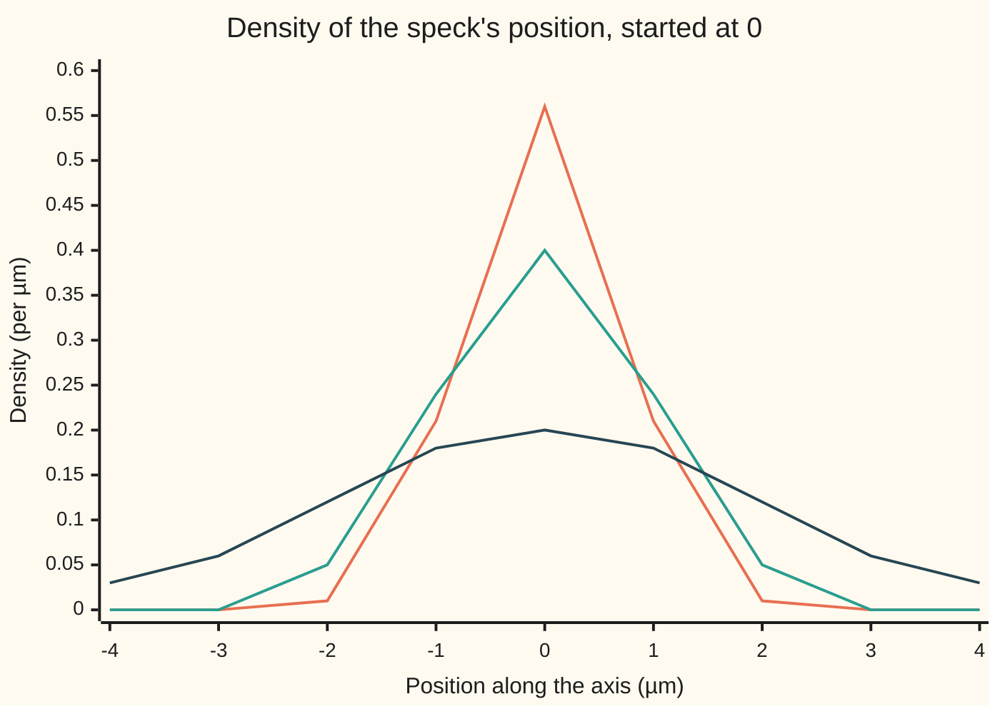
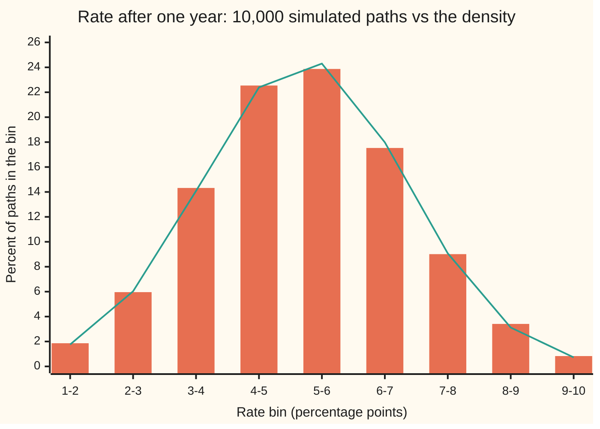

# Fokker-Planck: how the density of a diffusion evolves

Stochastic processes and calculus → Generators, Densities and Simulation → Following the cloud of positions → Fokker-Planck

---

## General Overview

A drop of water on a microscope slide holds a speck about a micrometre across, the kind Robert Brown watched jiggling in 1827. It starts at the crosshair. Its position along one axis, in micrometres (µm), wanders as Brownian motion: after t seconds its displacement is bell-shaped with variance t square micrometres. Release ten thousand such specks from the same crosshair and photograph them. After 1 second the cloud is a bell curve 0.3989 per µm tall at the centre. After 4 seconds it is half as tall, 0.1995 per µm, and twice as wide.

That is exactly how a pinch of heat spreads along a long cold bar ([the-heat-kernel](../../08-Differential%20equations%20and%20dynamics/10-The%20Classical%20PDEs/10-the-heat-kernel.md)). Einstein explained why in 1905: the probability of finding the speck near a point obeys the heat equation. The cloud of probability is the thing that moves predictably, even though each speck does not.

The shelf's house example behaves differently. A short-term interest rate starts at 6 percentage points and is pulled toward 4 ([ornstein-uhlenbeck-and-cir-processes](../06-Ito%20Calculus/05-ornstein-uhlenbeck-and-cir-processes.md)). Its cloud of possible values is also a bell, but the bell slides toward 4 while it widens, and it stops widening at a standard deviation of 2 points.

This card finds the equation that moves the cloud for any diffusion. The backward equation ([kolmogorov-backward-equation](02-kolmogorov-backward-equation.md)) fixes a payoff and varies the start. The forward equation fixes the start and follows the cloud. They are one operator seen from the two sides of an integral.

**The density of a diffusion obeys the generator turned inside out: the drift carries the density, the noise spreads it, and both act on the coefficient times the density, which is what integrating the backward equation by parts leaves behind.**

**What kind of fact this is:** a theorem, derived on this card in Why it works, for a diffusion with a smooth density that dies away at large distances; that such a density exists when the noise never vanishes is a theorem about parabolic equations, stated here with its source (Friedman) and not proved.

### The picture: the speck's cloud at three times



Orange: after 0.5 seconds, peak 0.5642 per µm. Teal: after 1 second, peak 0.3989. Dark blue: after 4 seconds, peak 0.1995. Points are read every micrometre and rounded to two places. Each curve encloses the same total probability, 1; the area under a stretch of curve is the chance of finding the speck there. These are formula values, not a simulation.

---

## The formula

Notation first, in words. As on [stochastic-differential-equations](../06-Ito%20Calculus/04-stochastic-differential-equations.md), the process solves $dX_t = \mu(X_t)\,dt + \sigma(X_t)\,dW_t$, with drift $\mu$, the average velocity at a point, and noise size $\sigma$; $dW_t$ is shorthand for an Ito integral against Brownian motion, never a derivative, because the path has none. The **transition density** $p(t, y)$ is the probability per unit length of finding $X_t$ near the point $y$, given that it started at $x$; the start is held fixed and left out of the notation. The curly symbol in $\partial/\partial y$ means a rate of change along $y$ with $t$ held still; the wing-08 cards write it as a subscript, so $p_t$ is the rate of change of the density in time and $p_{yy}$ its bend along $y$, the rate of change of the slope.

$$\frac{\partial p}{\partial t}(t, y) \;=\; -\frac{\partial}{\partial y}\Big[\mu(y)\,p(t, y)\Big] \;+\; \frac12\,\frac{\partial^2}{\partial y^2}\Big[\sigma(y)^2\,p(t, y)\Big]$$

**Read it aloud:** the density at a point loses whatever the drift carries away from it, and gains half the bend of the noise-weighted density there.

The right side has a name. The generator ([infinitesimal-generator](01-infinitesimal-generator.md)) acts on a payoff $f$:

$$L f(y) = \mu(y)\, f'(y) + \tfrac12\,\sigma(y)^2 f''(y).$$

The forward operator, written $L^*$ and read "L-star", is its **adjoint**: the operator that gives the same integral when the derivatives are moved from the payoff onto the density,

$$\int (Lf)(y)\,p(y)\,dy \;=\; \int f(y)\,(L^* p)(y)\,dy, \qquad L^* p = -(\mu p)' + \tfrac12(\sigma^2 p)''.$$

So the forward equation is $\partial p / \partial t = L^* p$, and the backward equation, written in the time left $\tau$, is $\partial u / \partial \tau = L u$ for the expected payoff $u$. Same pieces; the derivatives sit on opposite sides.

| Symbol | Plain meaning | In our example | Push it up and the answer… |
| --- | --- | --- | --- |
| $X_t$, $X_0$ | the process at time $t$, and at the start | the speck's position; the rate | — |
| $t$, $\tau$ | time, in the stated unit; time left until a payoff | seconds for the speck, years for the rate | the cloud spreads further |
| $x$, $y$ | the start point, and a point where the density is read | speck: 0 µm; rate: 6 points | — |
| $p(t, y)$, $p_t$, $p_{yy}$ | the density of $X_t$ at $y$, per unit length; its rate of change in time; its bend along $y$ | 0.3989 per µm at the centre after 1 s | — |
| $\mu$ | the drift: average velocity at a point | speck: 0; rate: 0.5 × (4 − y) points per year | the cloud slides faster |
| $\sigma$ | the noise size at a point | speck: 1 µm per root second; rate: 2 points per root year | the cloud widens faster |
| $L$, $L^*$ | the generator, acting on payoffs; its adjoint, acting on densities | equal for the speck, different for the rate | — |
| $f$ | a payoff or test function of the position | the square of the rate | — |
| $J$ | the probability current: net probability flowing rightward past a point per unit time | zero everywhere once the rate's cloud settles | — |
| $W_t$, $dW_t$ | Brownian motion; its shorthand increment inside an Ito integral | drives both examples | — |
| $\kappa$, $\theta$ | the rate's pull speed and its long-run level | 0.5 per year, 4 points | faster settling; the cloud's centre moves |
| $m$, $v$ | mean and variance of the rate's bell at time $t$ | 5.21306 and 2.52848 at one year | — |
| $h$, $z$ | a short step: of time in the Chapman-Kolmogorov route, of the finite differences in the code; the distance $y - m$ from the bell's mean, in the algebra callout | $h$ = 0.1, 0.05, 0.025 in the residual check | a smaller difference step, a smaller leftover |

Two cases to keep in view:

- **The speck.** $\mu = 0$ and $\sigma = 1$ give $p_t = \tfrac12 p_{yy}$: the heat equation ([the-heat-equation](../../08-Differential%20equations%20and%20dynamics/10-The%20Classical%20PDEs/03-the-heat-equation.md)) with diffusivity one half.
- **The rate.** $\mu(y) = \kappa(\theta - y)$, with pull speed $\kappa$ = 0.5 a year and long-run level $\theta$ = 4 points, and constant $\sigma$, so $p_t = \partial[\kappa(y - \theta)p]/\partial y + \tfrac12\sigma^2 p_{yy}$. The first term is new: it moves the bell toward $\theta$.

The **probability current** turns the equation into bookkeeping. Write $J = \mu p - \tfrac12(\sigma^2 p)'$. Then the forward equation reads $p_t = -J'$: the density at a point rises exactly when more probability flows in from the left than leaves to the right. Nothing is created or lost.

### When it holds

- **An Ito equation with smooth coefficients.** The drift and noise must be smooth functions of position (time-dependent ones work the same way). If $\sigma$ is meant in the other, Stratonovich, convention, the drift changes by half of $\sigma$ times its slope; using one convention's equation with the other's coefficients moves the cloud to the wrong place.
- **A smooth density exists.** When the noise is never zero and the coefficients are smooth and bounded, it does (Friedman, in Sources). With no noise at all the "cloud" is a single point carried along an ordinary differential equation, and the equation holds only after integrating against payoffs.
- **Probability stays on the line.** The derivation drops boundary terms because the density and its slope die away far out. A wall that swallows the speck keeps them: the free bell then claims all of the probability is still in the water, when after 1 second only 0.6827 of it is (What breaks).
- **One dimension.** In several dimensions the same holds with a sum over directions and the noise square replaced by a matrix of covariances; this card stays on the line.

---

## Why it works

### Step 0: one average, two ways of writing it

Take any payoff $f$ of the position, such as the square of the rate. Its expected value at time $t$ can be written two ways: average $f$ over the paths, or integrate $f$ against the density:

$$E[f(X_t)] = \int f(y)\,p(t, y)\,dy.$$

The backward equation already knows how the left side changes in time. The forward equation is that same change, read off on the right side. Everything below is moving one derivative across an integral sign.

### Step 1: how an average changes

By Ito's lemma ([itos-lemma](../06-Ito%20Calculus/02-itos-lemma.md)), $df(X_t) = (Lf)(X_t)\,dt + f'(X_t)\,\sigma(X_t)\,dW_t$. The last piece is an Ito integral, a fair game with average zero. Averaging and differentiating in time,

$$\frac{d}{dt}E[f(X_t)] = E[(Lf)(X_t)] = \int (Lf)(y)\,p(t, y)\,dy.$$

This is the generator card's statement: the generator is the rate at which averages change.

### Step 2: move the derivatives onto the density

Integrate by parts once in the drift term and twice in the noise term:

$$\int \mu f'\,p\,dy = -\int f\,(\mu p)'\,dy, \qquad \int \tfrac12\sigma^2 f''\,p\,dy = \int f\,\tfrac12(\sigma^2 p)''\,dy.$$

Each move leaves a boundary term, a product evaluated at the two far ends. Far out the density and its slope are zero, so the boundary terms vanish. What remains is $\int f\,(L^* p)\,dy$. The minus sign in front of the drift term comes from moving one derivative; the noise term keeps its sign because two moves cancel.

### Step 3: read off the equation

The left side of Step 1 is also $\int f\,p_t\,dy$, by differentiating Step 0 under the integral. So

$$\int f(y)\,\big[\,p_t - L^* p\,\big](t, y)\,dy = 0$$

for every smooth payoff $f$. Choose $f$ as a narrow bump at any point: the bracket must be zero there. That is the forward equation, $p_t = L^* p$.

<details>
<summary>Detailed proof</summary>

Assume $\mu$ and $\sigma$ are smooth, and $p(t, y)$ is smooth in both variables, with $p$, its first two derivatives in $y$, and $p_t$ tending to zero faster than any power of the distance as the distance from the start grows. Take $f$ smooth and zero outside a bounded interval, so that $f$ and its slope are zero at both ends of the interval.

*Averages.* Ito's lemma gives $f(X_t) = f(X_0) + \int_0^t (Lf)(X_s)\,ds + \int_0^t f'(X_s)\sigma(X_s)\,dW_s$. The integrand of the Ito integral is bounded, because $f'$ is zero outside the interval and $\sigma$ is continuous on it; so the Ito integral has mean zero. Taking expectations, $E f(X_t) = f(x) + \int_0^t E[(Lf)(X_s)]\,ds$, and the integrand is continuous in time, so $\tfrac{d}{dt} E f(X_t) = E[(Lf)(X_t)]$.

*Parts.* Over the interval, $\int \mu f' p = [\mu f p] - \int f(\mu p)'$, and the bracket is zero because $f$ is zero at both ends. Twice for the second term: $\int \sigma^2 f'' p = [\sigma^2 f' p] - \int f'(\sigma^2 p)' = [\sigma^2 f' p] - [f(\sigma^2 p)'] + \int f (\sigma^2 p)''$, and both brackets are zero. So $E[(Lf)(X_t)] = \int f\,L^*p\,dy$.

*Time.* The decay of $p_t$ lets the time derivative pass inside the integral (dominated convergence, from wing 10), so $\tfrac{d}{dt}\int f p\,dy = \int f\,p_t\,dy$.

*Conclusion.* The continuous function $p_t - L^*p$ integrates to zero against every such $f$. If it were positive at some point, it would be positive on a small interval around it, and a bump $f$ supported there would give a positive integral. So it is zero everywhere. Only the existence and smoothness of $p$ were assumed; for smooth bounded coefficients with $\sigma$ bounded away from zero, Friedman (chapter 1) proves both by constructing the fundamental solution of the parabolic equation.

</details>

### Step 4: the speck obeys the heat equation

For the speck, $\mu = 0$ and $\sigma = 1$, so $L^* p = \tfrac12 p_{yy}$: the forward and backward operators coincide. The bell $p = e^{-y^2/(2t)}/\sqrt{2\pi t}$ satisfies it. Differentiating, $p_t = p\,\big(y^2/(2t^2) - 1/(2t)\big)$ and $p_{yy} = p\,\big(y^2/t^2 - 1/t\big)$, so $p_t = \tfrac12 p_{yy}$ exactly. The heat kernel's width $\sqrt{2 \times \text{diffusivity} \times t}$ is $\sqrt{t}$ here, matching variance $t$. The code checks this by putting the formula into the equation with finite differences: the leftover at 1 µm after 1 second shrinks from 0.0010154 to 0.0000630 as the difference step falls from 0.1 to 0.025, a factor of 16 for a step four times smaller.

### Step 5: the rate's bell slides and stops widening

For the rate, try a bell with moving mean $m(t)$ and variance $v(t)$. Put it into the forward equation and collect the terms with the square of the distance from the mean, the distance itself, and neither. Each must balance separately, and they force two ordinary differential equations:

$$m' = \kappa(\theta - m), \qquad v' = \sigma^2 - 2\kappa v.$$

The first is the pull, acting on the centre. The second says noise pumps variance in at rate $\sigma^2$ while the pull drains it at rate $2\kappa v$. Started from a point, $v(0) = 0$, they give the Ornstein-Uhlenbeck card's mean and variance: at one year, mean 5.21306 points and variance 2.52848, standard deviation 1.5901.

<details>
<summary>The algebra behind this, if you want it</summary>

Write $z = y - m$ for the distance from the mean. For the bell, $p_t / p = z m'/v + z^2 v'/(2v^2) - v'/(2v)$, $p_y/p = -z/v$, and $p_{yy}/p = z^2/v^2 - 1/v$. The right side of the forward equation, divided by $p$, is $\kappa + \kappa(y - \theta)(p_y/p) + \tfrac12\sigma^2(p_{yy}/p)$. Put $y - \theta = z + (m - \theta)$: it becomes $\kappa - \kappa z^2/v - \kappa(m - \theta) z/v + \sigma^2 z^2/(2v^2) - \sigma^2/(2v)$. Matching the $z^2$ terms gives $v' = \sigma^2 - 2\kappa v$; matching the $z$ terms gives $m' = \kappa(\theta - m)$; the constant terms give $v' = \sigma^2 - 2\kappa v$ again, a consistency check that passes.

</details>

Here the generator alone fails. Put the same bell into $p_t = Lp$ and the leftover at rate 5 after one year is 0.14525, and it does not shrink as the step falls: no finite-difference error, a wrong equation.

### Step 6: where the cloud settles

A **stationary density** ([stationary-distributions](../03-Markov%20Chains/04-stationary-distributions.md) for chains) is one with $p_t = 0$. Then $J' = 0$, so the current is the same everywhere; it is zero far out, so it is zero everywhere: $\mu p = \tfrac12(\sigma^2 p)'$. With constant noise, $(\ln p)' = 2\mu/\sigma^2 = -2\kappa(y - \theta)/\sigma^2$, so $\ln p$ is a downward parabola centred at $\theta$. That is a bell with variance $\sigma^2/(2\kappa) = 4$, standard deviation 2 points. The code integrates the zero-current equation numerically, without assuming a bell, and finds standard deviation 2.0000 and a 0.0228 chance, 2.28 percent, of a negative rate in the long run.

Stationary does not mean standing still. Each path keeps moving forever; only the cloud stops changing, because as much probability crosses each point leftward as rightward.

A second road to the same equation starts from the Chapman-Kolmogorov rule, that the law at time $t + h$ is the law at $t$ moved by one more short step, and expands the short step in its moments: the mean of a step gives the drift term, its variance the noise term, and higher moments vanish for a diffusion. That route, and the boundary conditions it needs, are on fokker-planck-and-densities.

---

## Worked numbers, by hand

The adjoint identity at one year, on the house example: $\kappa = 0.5$ per year, $\theta = 4$, $\sigma = 2$ points per root year, start 6 points, payoff $f(y) = y^2$. The forward side differentiates the bell's moments. The backward side averages $Lf(y) = 2\kappa(\theta - y)y + \sigma^2$.

| Step | Arithmetic | Value |
| --- | --- | --- |
| decay of the gap, $e^{-\kappa t}$ | $e^{-0.5}$ | 0.60653 |
| mean $m$ | 4 + 2 × 0.60653 | 5.21306 |
| slope of the mean, $m'$ | 0.5 × (4 − 5.21306) | −0.60653 |
| variance $v$ | 4 × (1 − 0.60653 × 0.60653) | 2.52848 |
| slope of the variance, $v'$ | 4 − 2 × 0.5 × 2.52848 | +1.47152 |
| forward: twice mean times its slope | 2 × 5.21306 × (−0.60653) | −6.32376 |
| forward: rate of change of $E[X_t^2]$ | 1.47152 − 6.32376 | **−4.85225** |
| backward: $E[X_t^2] = v + m^2$ | 2.52848 + 5.21306 × 5.21306 | 29.70449 |
| backward: $2\kappa\theta m$ | 2 × 0.5 × 4 × 5.21306 | 20.85225 |
| backward: $E[Lf] = 2\kappa\theta m - 2\kappa E[X_t^2] + \sigma^2$ | 20.85225 − 1 × 29.70449 + 4 (here 2κ = 1) | **−4.85225** |

Entries are rounded to five places, so sums of them can miss the last digit by one; the code, at full precision, gets −4.85225 four ways. In the world: one year out, the expected square of the rate is falling at 4.85 square points per year, because the pull is dragging the centre down faster than the noise is widening the bell.

### What breaks if you drop a piece

| Mistake | Comes out at | What went wrong |
| --- | --- | --- |
| Generator $L$ on the density, rate started from its bell at 0.1 years | total probability 1.5677 at one year (theory e to the 0.9κ, 1.5683) | probability is created from nothing: $L$ is not the adjoint |
| Drift term with the wrong sign | mean 6.9835 at one year, not 5.2131 | the cloud is pushed away from 4: the drift was undone instead of carried |
| Drop the one half on the speck | peak 0.2821 per µm after 1 s, not 0.3989 | the cloud spreads at twice the rate: variance 2t, not t |
| Ignore an absorbing wall 1 µm left of the start, one that holds any speck touching it (a hypothesis dropped) | free bell keeps 1.0000 of the probability; truth 0.6827 by images, 0.6826 on a grid | boundary terms in Step 2 no longer vanish: probability leaves through the wall |

The wall row reads back in the slide: one speck in three sticks to the glass within a second, and the free heat-kernel answer does not see it. The exact value comes from the reflection principle ([reflection-principle-and-running-maximum](../05-Brownian%20Motion/04-reflection-principle-and-running-maximum.md)): survival is 1 minus twice the chance the free speck is beyond the wall.

---

## Code, from first principles, and it actually runs

The scripts take four independent roads. First, the known densities are put into the forward equation by finite differences, with the leftover printed at three step sizes. Second, the adjoint identity of Steps 1 to 3 is checked by numerical integration. Third, the equation is solved on a grid with explicit time steps, from the rate's bell at 0.1 years to one year, at three spacings; the same solver produces every "what breaks" row. Fourth, the house example is simulated: 10,000 rate paths over one year with 1,000 steps each, drawn from a SplitMix64 generator with seed 20260930 and Box-Muller normals, both written out, and stepped by the plain drift-plus-noise rule ([euler-maruyama-scheme](04-euler-maruyama-scheme.md)). Every simulated number carries its standard error.

### Python

```python
# Fokker-Planck forward equation -- the check behind the card.  Standard library only.
# Roads: (1) the known densities put into the equation by finite differences; (2) the
# adjoint identity integrated numerically; (3) the equation solved on a grid; (4) a seeded
# simulation.  Units: speck in micrometres and seconds; OU rate in percentage points
# and years.  Every number quoted on the card is printed here.
from math import exp, sqrt, log, cos, sin, pi

K, TH, S, R0 = 0.5, 4.0, 2.0, 6.0          # OU pull speed /yr, level, noise, start (points)
def gauss(y, m, v): return exp(-(y - m) ** 2 / (2 * v)) / sqrt(2 * pi * v)
def bm(t, y): return gauss(y, 0.0, t)                                   # speck, sigma = 1
def ou_mv(t): return TH + (R0 - TH) * exp(-K * t), S * S / (2 * K) * (1 - exp(-2 * K * t))
def ou(t, y): m, v = ou_mv(t); return gauss(y, m, v)
def simpson(f, a, b, n=2000):
    h = (b - a) / n
    return h / 3 * (f(a) + f(b) + sum((4 if i % 2 else 2) * f(a + i * h) for i in range(1, n)))

def residual(p, mu, s2, t, y, h, op="adj"):                 # p_t minus the right-hand side
    pt = (p(t + h, y) - p(t - h, y)) / (2 * h)
    dif = s2 / 2 * (p(t, y + h) - 2 * p(t, y) + p(t, y - h)) / (h * h)
    if op == "adj": adv = -(mu(y + h) * p(t, y + h) - mu(y - h) * p(t, y - h)) / (2 * h)
    else: adv = mu(y) * (p(t, y + h) - p(t, y - h)) / (2 * h)              # generator L used by mistake
    return pt - (adv + dif)

mu_ou = lambda y: K * (TH - y)
mu_0 = lambda y: 0.0
print("figure 1, speck density per um at y = -4..4:")
for t in (0.5, 1.0, 4.0):
    print(f"  t={t:.1f} s: " + " ".join(f"{bm(t, y):.2f}" for y in range(-4, 5)) + f"  peak {bm(t, 0):.4f}")
print("residual of the forward equation, formula put in, step h:")
res = []
for h in (0.1, 0.05, 0.025):
    a, b = residual(bm, mu_0, 1.0, 1.0, 1.0, h), residual(ou, mu_ou, S * S, 1.0, 5.0, h)
    c = residual(ou, mu_ou, S * S, 1.0, 5.0, h, "gen")
    res.append((a, b, c))
    print(f"  h={h:.3f}  BM(1,1) {a:+.7f}  OU(1,5) {b:+.7f}  OU with L instead {c:+.5f}")
assert abs(res[2][0]) < 1e-4, "BM density fails the heat equation"
assert abs(res[2][1]) < 1e-4, "OU density fails the forward equation"
assert 3.5 < res[1][1] / res[2][1] < 4.5, "residual not shrinking like h^2"
assert abs(res[2][2]) > 0.05, "generator should not fit the density"

m1, v1 = ou_mv(1.0); sd1 = sqrt(v1); lo, hi = m1 - 12 * sd1, m1 + 12 * sd1; e = 1e-3
f = lambda y: y * y
Lf = lambda y: mu_ou(y) * 2 * y + S * S / 2 * 2
Lstar_p = lambda y: (-(mu_ou(y + e) * ou(1, y + e) - mu_ou(y - e) * ou(1, y - e)) / (2 * e)
                     + S * S / 2 * (ou(1, y + e) - 2 * ou(1, y) + ou(1, y - e)) / (e * e))
dEdt = (simpson(lambda y: f(y) * ou(1 + e, y), lo, hi) - simpson(lambda y: f(y) * ou(1 - e, y), lo, hi)) / (2 * e)
I_back, I_fwd = simpson(lambda y: Lf(y) * ou(1, y), lo, hi), simpson(lambda y: f(y) * Lstar_p(y), lo, hi)
exact = (S * S - 2 * K * v1) + 2 * m1 * K * (TH - m1)
print("adjoint identity, OU at t=1 yr, f(y)=y^2:")
print(f"  d/dt E[f] by differencing {dEdt:.5f}\n  integral of (Lf) p        {I_back:.5f}")
print(f"  integral of f (L* p)      {I_fwd:.5f}\n  from mean and variance    {exact:.5f}")
print(f"  by hand: e^-0.5 {exp(-0.5):.5f} mean {m1:.5f} slope {K * (TH - m1):+.5f} variance {v1:.5f} slope {S * S - 2 * K * v1:+.5f}")
print(f"  E[X^2] {v1 + m1 * m1:.5f}  2 kappa theta mean {2 * K * TH * m1:.5f}  2 mean slope {2 * m1 * K * (TH - m1):+.5f}")
assert abs(I_back - I_fwd) < 1e-4, "adjoint"
assert abs(dEdt - exact) < 1e-4, "rate of E[f]"

def solve(mu, ylo, yhi, dy, t0, t1, p0, sgn=-1, gen=False, s2=S * S):  # explicit grid, zero at both ends
    n = round((yhi - ylo) / dy); ys = [ylo + i * dy for i in range(n + 1)]
    steps = round((t1 - t0) / (0.2 * dy * dy / s2)); dt = (t1 - t0) / steps
    p = [p0(y) for y in ys]; p[0] = p[-1] = 0.0; m = [mu(y) for y in ys]; d2 = s2 / 2 / (dy * dy)
    for _ in range(steps):
        q = p[:]
        for i in range(1, n):
            adv = (m[i] * (p[i + 1] - p[i - 1]) if gen else sgn * (m[i + 1] * p[i + 1] - m[i - 1] * p[i - 1])) / (2 * dy)
            q[i] = p[i] + dt * (adv + d2 * (p[i + 1] - 2 * p[i] + p[i - 1]))
        p = q
    return ys, p, steps
def moments(ys, p, dy):
    m0 = sum(p) * dy; m = sum(y * q for y, q in zip(ys, p)) * dy / m0
    return m0, m, sqrt(sum((y - m) ** 2 * q for y, q in zip(ys, p)) * dy / m0)

print("grid solve, OU from the formula at t=0.1 yr to t=1 yr, y in [-6,16]:")
errs = []
for dy in (0.2, 0.1, 0.05):
    ys, p, n = solve(mu_ou, -6.0, 16.0, dy, 0.1, 1.0, lambda y: ou(0.1, y))
    errs.append(max(abs(q - ou(1.0, y)) for y, q in zip(ys, p))); mass, mg, sg = moments(ys, p, dy)
    print(f"  dy={dy:.2f} steps={n} max error {errs[-1]:.6f} mass {mass:.6f} mean {mg:.4f} sd {sg:.4f}")
assert errs[2] < errs[1] < errs[0] and 3.0 < errs[1] / errs[2] < 5.0, "grid not converging"
ys, p, n = solve(mu_ou, -6.0, 16.0, 0.1, 0.1, 1.0, lambda y: ou(0.1, y), gen=True)
mg_gen = moments(ys, p, 0.1)[0]
ys, p, n = solve(mu_ou, -6.0, 26.0, 0.1, 0.1, 1.0, lambda y: ou(0.1, y), sgn=1)
mean_flip = moments(ys, p, 0.1)[1]
ys, p, n = solve(mu_0, -1.0, 9.0, 0.05, 0.05, 1.0, lambda y: bm(0.05, y) - bm(0.05, y + 2), s2=1.0)
surv = moments(ys, p, 0.05)[0]; surv_img = 1 - 2 * (0.5 - simpson(lambda y: bm(1, y), -1, 0))
print(f"what breaks:\n  generator L on the density: mass at 1 yr {mg_gen:.4f}  (e^(0.9 kappa) = {exp(0.9 * K):.4f})")
print(f"  drift term with the wrong sign: mean at 1 yr {mean_flip:.4f}  (theta + 2 e^(0.8 kappa) = {TH + (R0 - TH) * exp(0.8 * K):.4f})")
print(f"  drop the 1/2: BM peak at 1 s {gauss(0, 0, 2):.4f}  (right: {bm(1, 0):.4f})")
print(f"  wall at -1 um: grid survival {surv:.4f}  images {surv_img:.4f}  free bell 1.0000")
assert abs(mg_gen - exp(0.9 * K)) < 0.01, "generator mass"
assert abs(mean_flip - (TH + (R0 - TH) * exp(0.8 * K))) < 0.01, "flipped drift"
assert abs(surv - surv_img) < 2e-3, "wall"

g = lambda y: simpson(lambda u: 2 * mu_ou(u) / (S * S), TH, y, 40)   # zero flux: (ln p)' = 2 mu / s^2
Z = simpson(lambda y: exp(g(y)), -16, 24, 400)
sd_inf = sqrt(simpson(lambda y: (y - TH) ** 2 * exp(g(y)), -16, 24, 400) / Z)
below = simpson(lambda y: exp(g(y)), -16, 0, 400) / Z
print(f"stationary, zero flux: sd {sd_inf:.4f} (formula {sqrt(S * S / (2 * K)):.4f})  P(rate<0) {below:.4f}")
assert abs(sd_inf - sqrt(S * S / (2 * K))) < 1e-4, "stationary spread"

state = 20260930
def rnd():
    global state
    state = (state + 0x9E3779B97F4A7C15) & 0xFFFFFFFFFFFFFFFF; z = state
    z = ((z ^ (z >> 30)) * 0xBF58476D1CE4E5B9) & 0xFFFFFFFFFFFFFFFF
    z = ((z ^ (z >> 27)) * 0x94D049BB133111EB) & 0xFFFFFFFFFFFFFFFF
    return ((z ^ (z >> 31)) >> 11) * 2.0 ** -53 + 2.0 ** -54
N, M = 10000, 1000; dt = 1.0 / M; ends = []
for _ in range(N):
    r = R0
    for _ in range(M // 2):
        a = sqrt(-2 * log(rnd())); b = 2 * pi * rnd()
        r += K * (TH - r) * dt + S * sqrt(dt) * a * cos(b)
        r += K * (TH - r) * dt + S * sqrt(dt) * a * sin(b)
    ends.append(r)
mean = sum(ends) / N; sd = sqrt(sum((x - mean) ** 2 for x in ends) / N)
print(f"OU at 1 yr: formula mean {m1:.4f} sd {sd1:.4f} peak {ou(1, m1):.4f} per point")
print(f"simulated {N} paths x {M} steps, seed 20260930: mean {mean:.4f} (se {sd / sqrt(N):.4f}) sd {sd:.4f} (se {sd / sqrt(2 * N):.4f})")
assert abs(mean - m1) < 4 * sd / sqrt(N) and abs(sd - sd1) < 4 * sd / sqrt(2 * N)
print("figure 2, percent of paths per 1-point bin [a, a+1):")
for a in range(1, 10):
    fr = sum(1 for x in ends if a <= x < a + 1) / N; se = sqrt(fr * (1 - fr) / N)
    ex = simpson(lambda y: ou(1, y), a, a + 1, 200)
    print(f"  [{a},{a + 1}) simulated {100 * fr:.2f} (se {100 * se:.2f}) formula {100 * ex:.2f}")
    assert abs(fr - ex) < 4 * se + 1e-9, "histogram off the forward-equation density"
print("all checks passed")
```

**Ran 2026-09-30 on macOS, Python 3.14.6, standard library only. All checks passed. Output, pasted from the run:**

```
figure 1, speck density per um at y = -4..4:
  t=0.5 s: 0.00 0.00 0.01 0.21 0.56 0.21 0.01 0.00 0.00  peak 0.5642
  t=1.0 s: 0.00 0.00 0.05 0.24 0.40 0.24 0.05 0.00 0.00  peak 0.3989
  t=4.0 s: 0.03 0.06 0.12 0.18 0.20 0.18 0.12 0.06 0.03  peak 0.1995
residual of the forward equation, formula put in, step h:
  h=0.100  BM(1,1) +0.0010154  OU(1,5) -0.0000934  OU with L instead +0.14490
  h=0.050  BM(1,1) +0.0002525  OU(1,5) -0.0000234  OU with L instead +0.14518
  h=0.025  BM(1,1) +0.0000630  OU(1,5) -0.0000059  OU with L instead +0.14525
adjoint identity, OU at t=1 yr, f(y)=y^2:
  d/dt E[f] by differencing -4.85225
  integral of (Lf) p        -4.85225
  integral of f (L* p)      -4.85225
  from mean and variance    -4.85225
  by hand: e^-0.5 0.60653 mean 5.21306 slope -0.60653 variance 2.52848 slope +1.47152
  E[X^2] 29.70449  2 kappa theta mean 20.85225  2 mean slope -6.32376
grid solve, OU from the formula at t=0.1 yr to t=1 yr, y in [-6,16]:
  dy=0.20 steps=450 max error 0.000143 mass 1.000000 mean 5.2128 sd 1.5903
  dy=0.10 steps=1800 max error 0.000036 mass 1.000000 mean 5.2130 sd 1.5902
  dy=0.05 steps=7200 max error 0.000009 mass 1.000000 mean 5.2130 sd 1.5901
what breaks:
  generator L on the density: mass at 1 yr 1.5677  (e^(0.9 kappa) = 1.5683)
  drift term with the wrong sign: mean at 1 yr 6.9835  (theta + 2 e^(0.8 kappa) = 6.9836)
  drop the 1/2: BM peak at 1 s 0.2821  (right: 0.3989)
  wall at -1 um: grid survival 0.6826  images 0.6827  free bell 1.0000
stationary, zero flux: sd 2.0000 (formula 2.0000)  P(rate<0) 0.0228
OU at 1 yr: formula mean 5.2131 sd 1.5901 peak 0.2509 per point
simulated 10000 paths x 1000 steps, seed 20260930: mean 5.2041 (se 0.0162) sd 1.6183 (se 0.0114)
figure 2, percent of paths per 1-point bin [a, a+1):
  [1,2) simulated 1.86 (se 0.14) formula 1.76
  [2,3) simulated 5.96 (se 0.24) formula 6.03
  [3,4) simulated 14.32 (se 0.35) formula 14.08
  [4,5) simulated 22.54 (se 0.42) formula 22.39
  [5,6) simulated 23.87 (se 0.43) formula 24.30
  [6,7) simulated 17.53 (se 0.38) formula 17.98
  [7,8) simulated 9.01 (se 0.29) formula 9.07
  [8,9) simulated 3.41 (se 0.18) formula 3.12
  [9,10) simulated 0.83 (se 0.09) formula 0.73
all checks passed
```

### Rust

```rust
// Fokker-Planck forward equation -- the check behind the card.  Rust std only.
// Roads: (1) the known densities put into the equation by finite differences; (2) the
// adjoint identity integrated numerically; (3) the equation solved on a grid; (4) a seeded
// simulation.  Units: speck in micrometres and seconds; OU rate in percentage points
// and years.  Every number quoted on the card is printed here.
use std::f64::consts::PI;

const K: f64 = 0.5; const TH: f64 = 4.0; const S: f64 = 2.0; const R0: f64 = 6.0; // pull /yr, level, noise, start (points)

fn gauss(y: f64, m: f64, v: f64) -> f64 { (-(y - m) * (y - m) / (2.0 * v)).exp() / (2.0 * PI * v).sqrt() }
fn bm(t: f64, y: f64) -> f64 { gauss(y, 0.0, t) }
fn ou_mv(t: f64) -> (f64, f64) { (TH + (R0 - TH) * (-K * t).exp(), S * S / (2.0 * K) * (1.0 - (-2.0 * K * t).exp())) }
fn ou(t: f64, y: f64) -> f64 { let (m, v) = ou_mv(t); gauss(y, m, v) }
fn mu_ou(y: f64) -> f64 { K * (TH - y) }
fn mu_0(_y: f64) -> f64 { 0.0 }
fn simpson(f: &dyn Fn(f64) -> f64, a: f64, b: f64, n: usize) -> f64 {
    let h = (b - a) / n as f64;
    let mut s = 0.0;
    for i in 1..n { s += (if i % 2 == 1 { 4.0 } else { 2.0 }) * f(a + i as f64 * h); }
    h / 3.0 * (f(a) + f(b) + s)
}
fn residual(p: fn(f64, f64) -> f64, mu: fn(f64) -> f64, s2: f64, t: f64, y: f64, h: f64, adj: bool) -> f64 {
    let pt = (p(t + h, y) - p(t - h, y)) / (2.0 * h);
    let dif = s2 / 2.0 * (p(t, y + h) - 2.0 * p(t, y) + p(t, y - h)) / (h * h);
    let adv = if adj { -(mu(y + h) * p(t, y + h) - mu(y - h) * p(t, y - h)) / (2.0 * h) }
              else { mu(y) * (p(t, y + h) - p(t, y - h)) / (2.0 * h) };
    pt - (adv + dif)
}
// explicit grid, zero at both ends; sgn -1 is the forward equation, gen uses the generator L
fn solve(mu: fn(f64) -> f64, ylo: f64, yhi: f64, dy: f64, t0: f64, t1: f64, p0: &dyn Fn(f64) -> f64,
         sgn: f64, gen: bool, s2: f64) -> (Vec<f64>, Vec<f64>, usize) {
    let n = ((yhi - ylo) / dy).round() as usize;
    let ys: Vec<f64> = (0..=n).map(|i| ylo + i as f64 * dy).collect();
    let steps = ((t1 - t0) / (0.2 * dy * dy / s2)).round() as usize;
    let dt = (t1 - t0) / steps as f64;
    let mut p: Vec<f64> = ys.iter().map(|&y| p0(y)).collect();
    p[0] = 0.0; p[n] = 0.0;
    let m: Vec<f64> = ys.iter().map(|&y| mu(y)).collect();
    let d2 = s2 / 2.0 / (dy * dy);
    for _ in 0..steps {
        let mut q = p.clone();
        for i in 1..n {
            let adv = (if gen { m[i] * (p[i + 1] - p[i - 1]) } else { sgn * (m[i + 1] * p[i + 1] - m[i - 1] * p[i - 1]) }) / (2.0 * dy);
            q[i] = p[i] + dt * (adv + d2 * (p[i + 1] - 2.0 * p[i] + p[i - 1]));
        }
        p = q;
    }
    (ys, p, steps)
}
fn moments(ys: &[f64], p: &[f64], dy: f64) -> (f64, f64, f64) {
    let mut s0 = 0.0; for q in p { s0 += q; } let m0 = s0 * dy;
    let mut s1 = 0.0; for (y, q) in ys.iter().zip(p) { s1 += y * q; } let m = s1 * dy / m0;
    let mut s2 = 0.0; for (y, q) in ys.iter().zip(p) { s2 += (y - m) * (y - m) * q; }
    (m0, m, (s2 * dy / m0).sqrt())
}
struct SplitMix(u64);
impl SplitMix {
    fn next(&mut self) -> f64 {
        self.0 = self.0.wrapping_add(0x9E3779B97F4A7C15);
        let mut z = self.0;
        z = (z ^ (z >> 30)).wrapping_mul(0xBF58476D1CE4E5B9);
        z = (z ^ (z >> 27)).wrapping_mul(0x94D049BB133111EB);
        ((z ^ (z >> 31)) >> 11) as f64 * 2f64.powi(-53) + 2f64.powi(-54)
    }
}

fn main() {
    println!("figure 1, speck density per um at y = -4..4:");
    for t in [0.5, 1.0, 4.0] {
        let v: Vec<String> = (-4..5).map(|y| format!("{:.2}", bm(t, y as f64))).collect();
        println!("  t={:.1} s: {}  peak {:.4}", t, v.join(" "), bm(t, 0.0));
    }
    println!("residual of the forward equation, formula put in, step h:");
    let mut res = Vec::new();
    for h in [0.1, 0.05, 0.025] {
        let a = residual(bm, mu_0, 1.0, 1.0, 1.0, h, true);
        let b = residual(ou, mu_ou, S * S, 1.0, 5.0, h, true);
        let c = residual(ou, mu_ou, S * S, 1.0, 5.0, h, false);
        res.push((a, b, c));
        println!("  h={:.3}  BM(1,1) {:+.7}  OU(1,5) {:+.7}  OU with L instead {:+.5}", h, a, b, c);
    }
    assert!(res[2].0.abs() < 1e-4, "BM density fails the heat equation");
    assert!(res[2].1.abs() < 1e-4, "OU density fails the forward equation");
    assert!(res[1].1 / res[2].1 > 3.5 && res[1].1 / res[2].1 < 4.5, "residual not shrinking like h^2");
    assert!(res[2].2.abs() > 0.05, "generator should not fit the density");

    let (m1, v1) = ou_mv(1.0); let sd1 = v1.sqrt();
    let (lo, hi, e) = (m1 - 12.0 * sd1, m1 + 12.0 * sd1, 1e-3);
    let f = |y: f64| y * y;
    let lf = |y: f64| mu_ou(y) * 2.0 * y + S * S / 2.0 * 2.0;
    let lstar_p = |y: f64| -(mu_ou(y + e) * ou(1.0, y + e) - mu_ou(y - e) * ou(1.0, y - e)) / (2.0 * e)
        + S * S / 2.0 * (ou(1.0, y + e) - 2.0 * ou(1.0, y) + ou(1.0, y - e)) / (e * e);
    let de_dt = (simpson(&|y| f(y) * ou(1.0 + e, y), lo, hi, 2000) - simpson(&|y| f(y) * ou(1.0 - e, y), lo, hi, 2000)) / (2.0 * e);
    let i_back = simpson(&|y| lf(y) * ou(1.0, y), lo, hi, 2000);
    let i_fwd = simpson(&|y| f(y) * lstar_p(y), lo, hi, 2000);
    let exact = (S * S - 2.0 * K * v1) + 2.0 * m1 * K * (TH - m1);
    println!("adjoint identity, OU at t=1 yr, f(y)=y^2:");
    println!("  d/dt E[f] by differencing {:.5}\n  integral of (Lf) p        {:.5}", de_dt, i_back);
    println!("  integral of f (L* p)      {:.5}\n  from mean and variance    {:.5}", i_fwd, exact);
    println!("  by hand: e^-0.5 {:.5} mean {:.5} slope {:+.5} variance {:.5} slope {:+.5}", (-0.5f64).exp(), m1, K * (TH - m1), v1, S * S - 2.0 * K * v1);
    println!("  E[X^2] {:.5}  2 kappa theta mean {:.5}  2 mean slope {:+.5}", v1 + m1 * m1, 2.0 * K * TH * m1, 2.0 * m1 * K * (TH - m1));
    assert!((i_back - i_fwd).abs() < 1e-4, "adjoint");
    assert!((de_dt - exact).abs() < 1e-4, "rate of E[f]");

    println!("grid solve, OU from the formula at t=0.1 yr to t=1 yr, y in [-6,16]:");
    let mut errs = Vec::new();
    for dy in [0.2, 0.1, 0.05] {
        let (ys, p, n) = solve(mu_ou, -6.0, 16.0, dy, 0.1, 1.0, &|y| ou(0.1, y), -1.0, false, S * S);
        let mut mx: f64 = 0.0;
        for (y, q) in ys.iter().zip(&p) { mx = mx.max((q - ou(1.0, *y)).abs()); }
        errs.push(mx);
        let (mass, mg, sg) = moments(&ys, &p, dy);
        println!("  dy={:.2} steps={} max error {:.6} mass {:.6} mean {:.4} sd {:.4}", dy, n, mx, mass, mg, sg);
    }
    assert!(errs[2] < errs[1] && errs[1] < errs[0] && errs[1] / errs[2] > 3.0 && errs[1] / errs[2] < 5.0, "grid not converging");
    let (ys, p, _) = solve(mu_ou, -6.0, 16.0, 0.1, 0.1, 1.0, &|y| ou(0.1, y), -1.0, true, S * S);
    let mg_gen = moments(&ys, &p, 0.1).0;
    let (ys, p, _) = solve(mu_ou, -6.0, 26.0, 0.1, 0.1, 1.0, &|y| ou(0.1, y), 1.0, false, S * S);
    let mean_flip = moments(&ys, &p, 0.1).1;
    let (ys, p, _) = solve(mu_0, -1.0, 9.0, 0.05, 0.05, 1.0, &|y| bm(0.05, y) - bm(0.05, y + 2.0), -1.0, false, 1.0);
    let surv = moments(&ys, &p, 0.05).0;
    let surv_img = 1.0 - 2.0 * (0.5 - simpson(&|y| bm(1.0, y), -1.0, 0.0, 2000));
    println!("what breaks:\n  generator L on the density: mass at 1 yr {:.4}  (e^(0.9 kappa) = {:.4})", mg_gen, (0.9 * K).exp());
    println!("  drift term with the wrong sign: mean at 1 yr {:.4}  (theta + 2 e^(0.8 kappa) = {:.4})", mean_flip, TH + (R0 - TH) * (0.8 * K).exp());
    println!("  drop the 1/2: BM peak at 1 s {:.4}  (right: {:.4})", gauss(0.0, 0.0, 2.0), bm(1.0, 0.0));
    println!("  wall at -1 um: grid survival {:.4}  images {:.4}  free bell 1.0000", surv, surv_img);
    assert!((mg_gen - (0.9 * K).exp()).abs() < 0.01, "generator mass");
    assert!((mean_flip - (TH + (R0 - TH) * (0.8 * K).exp())).abs() < 0.01, "flipped drift");
    assert!((surv - surv_img).abs() < 2e-3, "wall");

    let g = |y: f64| simpson(&|u| 2.0 * mu_ou(u) / (S * S), TH, y, 40); // zero flux: (ln p)' = 2 mu / s^2
    let z = simpson(&|y| g(y).exp(), -16.0, 24.0, 400);
    let sd_inf = (simpson(&|y| (y - TH) * (y - TH) * g(y).exp(), -16.0, 24.0, 400) / z).sqrt();
    let below = simpson(&|y| g(y).exp(), -16.0, 0.0, 400) / z;
    println!("stationary, zero flux: sd {:.4} (formula {:.4})  P(rate<0) {:.4}", sd_inf, (S * S / (2.0 * K)).sqrt(), below);
    assert!((sd_inf - (S * S / (2.0 * K)).sqrt()).abs() < 1e-4, "stationary spread");

    let mut rng = SplitMix(20260930);
    let (n_paths, m_steps) = (10000usize, 1000usize);
    let dt = 1.0 / m_steps as f64;
    let mut ends = Vec::with_capacity(n_paths);
    for _ in 0..n_paths {
        let mut r = R0;
        for _ in 0..m_steps / 2 {
            let a = (-2.0 * rng.next().ln()).sqrt();
            let b = 2.0 * PI * rng.next();
            r += K * (TH - r) * dt + S * dt.sqrt() * a * b.cos();
            r += K * (TH - r) * dt + S * dt.sqrt() * a * b.sin();
        }
        ends.push(r);
    }
    let nf = n_paths as f64;
    let mut s = 0.0; for x in &ends { s += x; } let mean = s / nf;
    let mut s2 = 0.0; for x in &ends { s2 += (x - mean) * (x - mean); } let sd = (s2 / nf).sqrt();
    println!("OU at 1 yr: formula mean {:.4} sd {:.4} peak {:.4} per point", m1, sd1, ou(1.0, m1));
    println!("simulated {} paths x {} steps, seed 20260930: mean {:.4} (se {:.4}) sd {:.4} (se {:.4})",
             n_paths, m_steps, mean, sd / nf.sqrt(), sd, sd / (2.0 * nf).sqrt());
    assert!((mean - m1).abs() < 4.0 * sd / nf.sqrt() && (sd - sd1).abs() < 4.0 * sd / (2.0 * nf).sqrt());
    println!("figure 2, percent of paths per 1-point bin [a, a+1):");
    for a in 1..10 {
        let af = a as f64;
        let fr = ends.iter().filter(|&&x| af <= x && x < af + 1.0).count() as f64 / nf;
        let se = (fr * (1.0 - fr) / nf).sqrt();
        let ex = simpson(&|y| ou(1.0, y), af, af + 1.0, 200);
        println!("  [{},{}) simulated {:.2} (se {:.2}) formula {:.2}", a, a + 1, 100.0 * fr, 100.0 * se, 100.0 * ex);
        assert!((fr - ex).abs() < 4.0 * se + 1e-9, "histogram off the forward-equation density");
    }
    println!("all checks passed");
}
```

**Ran 2026-09-30 on macOS, rustc 1.98.1, no crates. All checks passed. Output, pasted from the run:**

```
figure 1, speck density per um at y = -4..4:
  t=0.5 s: 0.00 0.00 0.01 0.21 0.56 0.21 0.01 0.00 0.00  peak 0.5642
  t=1.0 s: 0.00 0.00 0.05 0.24 0.40 0.24 0.05 0.00 0.00  peak 0.3989
  t=4.0 s: 0.03 0.06 0.12 0.18 0.20 0.18 0.12 0.06 0.03  peak 0.1995
residual of the forward equation, formula put in, step h:
  h=0.100  BM(1,1) +0.0010154  OU(1,5) -0.0000934  OU with L instead +0.14490
  h=0.050  BM(1,1) +0.0002525  OU(1,5) -0.0000234  OU with L instead +0.14518
  h=0.025  BM(1,1) +0.0000630  OU(1,5) -0.0000059  OU with L instead +0.14525
adjoint identity, OU at t=1 yr, f(y)=y^2:
  d/dt E[f] by differencing -4.85225
  integral of (Lf) p        -4.85225
  integral of f (L* p)      -4.85225
  from mean and variance    -4.85225
  by hand: e^-0.5 0.60653 mean 5.21306 slope -0.60653 variance 2.52848 slope +1.47152
  E[X^2] 29.70449  2 kappa theta mean 20.85225  2 mean slope -6.32376
grid solve, OU from the formula at t=0.1 yr to t=1 yr, y in [-6,16]:
  dy=0.20 steps=450 max error 0.000143 mass 1.000000 mean 5.2128 sd 1.5903
  dy=0.10 steps=1800 max error 0.000036 mass 1.000000 mean 5.2130 sd 1.5902
  dy=0.05 steps=7200 max error 0.000009 mass 1.000000 mean 5.2130 sd 1.5901
what breaks:
  generator L on the density: mass at 1 yr 1.5677  (e^(0.9 kappa) = 1.5683)
  drift term with the wrong sign: mean at 1 yr 6.9835  (theta + 2 e^(0.8 kappa) = 6.9836)
  drop the 1/2: BM peak at 1 s 0.2821  (right: 0.3989)
  wall at -1 um: grid survival 0.6826  images 0.6827  free bell 1.0000
stationary, zero flux: sd 2.0000 (formula 2.0000)  P(rate<0) 0.0228
OU at 1 yr: formula mean 5.2131 sd 1.5901 peak 0.2509 per point
simulated 10000 paths x 1000 steps, seed 20260930: mean 5.2041 (se 0.0162) sd 1.6183 (se 0.0114)
figure 2, percent of paths per 1-point bin [a, a+1):
  [1,2) simulated 1.86 (se 0.14) formula 1.76
  [2,3) simulated 5.96 (se 0.24) formula 6.03
  [3,4) simulated 14.32 (se 0.35) formula 14.08
  [4,5) simulated 22.54 (se 0.42) formula 22.39
  [5,6) simulated 23.87 (se 0.43) formula 24.30
  [6,7) simulated 17.53 (se 0.38) formula 17.98
  [7,8) simulated 9.01 (se 0.29) formula 9.07
  [8,9) simulated 3.41 (se 0.18) formula 3.12
  [9,10) simulated 0.83 (se 0.09) formula 0.73
all checks passed
```

The two outputs agree line for line.

### The picture: the simulated rate against the forward equation



Bars: the percent of the 10,000 simulated paths ending in each 1-point bin, one sample with seed 20260930, standard errors 0.09 to 0.43 percent. Line: the probability of each bin from the forward equation's solution. Every bar lies within four standard errors of the line. The simulated mean, 5.2041 with standard error 0.0162, is within one standard error of 5.2131; the simulated standard deviation, 1.6183 with standard error 0.0114, sits about two and a half standard errors above 1.5901. Other seeds land on either side.

> [!TIP]
> **Try changing**
> - **Halve the pull.** Guess first: does the long-run spread double? Change `K` from 0.5 to 0.25 in both scripts. The stationary standard deviation rises only to 2.8284 points, 2 times the root of 2, because spread scales as one over the root of the pull; the chance of a negative rate in the long run climbs to 0.0786, and the generator's wrongly created probability falls to 1.2523.
> - **Refine the grid once more.** Guess first: how much smaller is the error? Add `0.025` to the tuple of spacings. The new line (its label rounds to dy=0.03) shows a maximum error of 0.000002, about a quarter of 0.000009, after four times as many steps on twice as many points.
> - **Move the wall.** Guess first: how much of the loss remains? Put the wall at −2 µm: grid from `-2.0`, image term `bm(0.05, y + 4)`, and the free-tail integral from −2, and change the `wall at -1 um` label to match. Survival rises to 0.9545 by images and 0.9544 on the grid: one more standard deviation of clearance cuts the loss from about a third to 4.55 percent.

---

## The usual mistake

> [!warning]
> **Running the density with the generator.** The backward and forward equations use the same three ingredients, so it is tempting to write $p_t = Lp$. For the speck that happens to be right, because with no drift and constant noise the generator equals its adjoint. The mistake hides only when there is no drift. With a constant drift the cloud runs the wrong way, and once the drift depends on position probability is also created from nothing: for the rate, starting from the true bell at 0.1 years, total probability reaches 1.5677 at one year. The generator moves payoffs, indexed by the start. Its adjoint moves densities, indexed by the end.
>
> Four smaller traps:
> - **Noise outside the derivative.** When $\sigma$ varies with position, the noise term is half the second derivative of $\sigma^2 p$, not $\sigma^2$ times half the second derivative of $p$. The wrong version does not conserve probability.
> - **Reading the density as a probability.** The rate's density peaks at 0.2509 per point after one year and the speck's at 0.5642 per µm after half a second; early enough, either peak passes 1, the speck's at any time under $1/(2\pi)$ seconds. Probability is area under the curve, never its height.
> - **"Stationary" as "standing still".** The rate's long-run bell, standard deviation 2.0000 points, is a cloud that has stopped changing, with zero net current. Every path inside it keeps moving.
> - **Trusting one histogram.** A simulation is one sample on a grid with a stated step. The simulated spread here is 1.6183, about two and a half standard errors from 1.5901: a sample, not a disagreement.

---

## Where you meet it in real life

- **Counting molecules.** Einstein's 1905 paper tied the rate at which a suspended particle's cloud widens to Avogadro's number, so watching specks spread became a way to count atoms.
- **The velocity of a particle.** Ornstein and Uhlenbeck's 1930 model is this card's rate equation with velocity in place of rate: friction is the pull, molecular kicks are the noise, and the stationary bell is the temperature's velocity law.
- **Local volatility.** Option prices quote the market's density for a share at each future date. Dupire ran the forward equation backwards, from the density's evolution to the noise size that produces it: [dupire-local-volatility](../../12-Financial%20mathematics/13-Local%20volatility%20and%20jumps/01-dupire-local-volatility.md).
- **Sampling by diffusion.** Choose a drift so that the zero-current density of Step 6 is a target law, and running the diffusion samples from it: the continuous cousin of [markov-chain-monte-carlo](../03-Markov%20Chains/07-markov-chain-monte-carlo.md).
- **Checking a simulator.** A scheme's histogram must match the forward equation's density, as in the bar chart above; [milstein-and-strong-weak-convergence](05-milstein-and-strong-weak-convergence.md) calls this weak error and [exact-simulation-of-gbm-and-ou](06-exact-simulation-of-gbm-and-ou.md) removes the grid altogether.

> **Say it back**
> A diffusion's paths are random, but the cloud of probability they make moves by a fixed equation. The average of any payoff changes at the rate of the generator; moving the generator's derivatives off the payoff and onto the density, by integrating by parts, gives the forward operator. With no drift and constant noise it is the heat equation, which is why the speck's cloud spreads like heat. With a pull toward a level it also slides the bell and caps its width, and where the current is zero the cloud stops changing while every path keeps moving.

---

## What this builds on

- [kolmogorov-backward-equation](02-kolmogorov-backward-equation.md): the generator moving expected payoffs in the start variable; this card is its adjoint.
- [the-heat-kernel](../../08-Differential%20equations%20and%20dynamics/10-The%20Classical%20PDEs/10-the-heat-kernel.md): the bell grown from a point, which is the speck's density.
- [the-heat-equation](../../08-Differential%20equations%20and%20dynamics/10-The%20Classical%20PDEs/03-the-heat-equation.md): the equation the speck's density obeys, and the explicit grid used in the code.
- [itos-lemma](../06-Ito%20Calculus/02-itos-lemma.md): why averages change at the rate of the generator.
- [ornstein-uhlenbeck-and-cir-processes](../06-Ito%20Calculus/05-ornstein-uhlenbeck-and-cir-processes.md): the house example's mean, variance and stationary law, recovered here from the density's equation.

## Where this goes next

- [dupire-local-volatility](../../12-Financial%20mathematics/13-Local%20volatility%20and%20jumps/01-dupire-local-volatility.md): the forward equation for a share price, solved backwards to read the noise size out of option prices.
- fokker-planck-and-densities: the equation as a parabolic PDE in its own right, with boundary conditions, several dimensions and the existence of the density.
- [euler-maruyama-scheme](04-euler-maruyama-scheme.md): the stepping rule the simulation used, and how far its histogram can drift from the density.

The forward equation says where the cloud goes when the equation is known; the open question is the reverse, how to recover the equation's noise from a cloud that is observed, and that is what Dupire's construction answers.

---

## Sources

Verified 2026-09-30: every link below resolves to the publisher's page.

- Kolmogoroff, A. "Über die analytischen Methoden in der Wahrscheinlichkeitsrechnung." *Mathematische Annalen* 104 (1931): 415–458. [doi:10.1007/BF01457949](https://doi.org/10.1007/BF01457949). The forward and backward equations for diffusions, side by side.
- Einstein, A. "Über die von der molekularkinetischen Theorie der Wärme geforderte Bewegung von in ruhenden Flüssigkeiten suspendierten Teilchen." *Annalen der Physik* 322, no. 8 (1905): 549–560. [doi:10.1002/andp.19053220806](https://doi.org/10.1002/andp.19053220806). The suspended particle's density obeys the heat equation; the speck on this card.
- Uhlenbeck, G. E., and L. S. Ornstein. "On the Theory of the Brownian Motion." *Physical Review* 36, no. 5 (1930): 823–841. [doi:10.1103/PhysRev.36.823](https://doi.org/10.1103/PhysRev.36.823). The pulled process and its moving, settling bell.
- Risken, Hannes. *The Fokker-Planck Equation: Methods of Solution and Applications*, 2nd ed. Springer. [Publisher page](https://link.springer.com/book/10.1007/978-3-642-61544-3). The standard monograph: probability current, stationary solutions, boundary conditions.
- Friedman, Avner. *Partial Differential Equations of Parabolic Type*. Dover. [Publisher page](https://store.doverpublications.com/products/9780486466255). Chapter 1 constructs the fundamental solution, which is the existence and smoothness of the density this card assumes.
