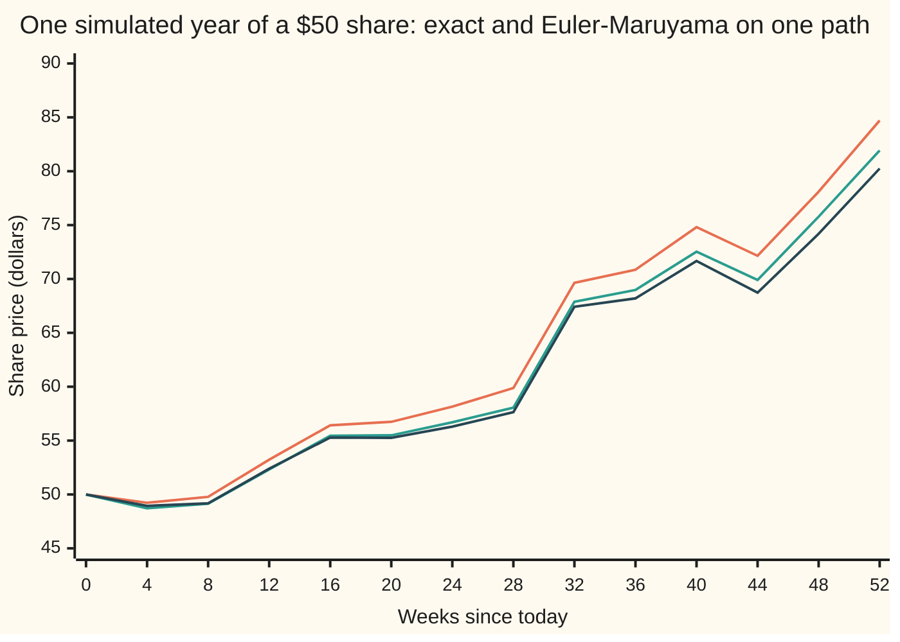
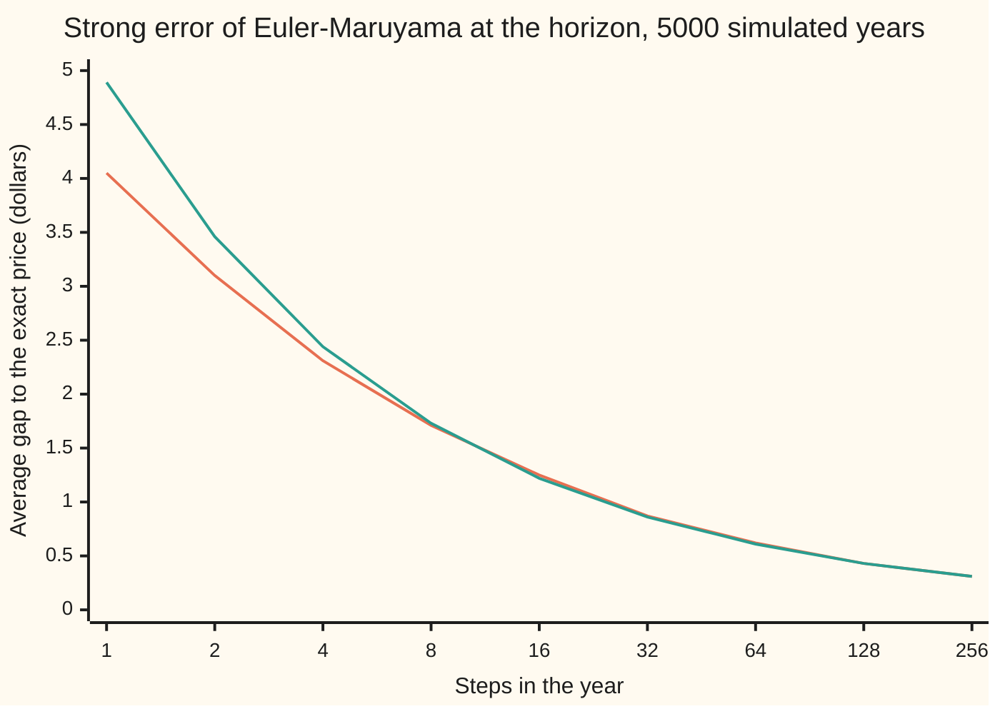

# Euler-Maruyama: stepping an SDE with Gaussian increments

[Syllabus](../../../SYLLABUS.md) → [Stochastic processes and calculus](../../../SYLLABUS.md#w11) → [Generators, Densities and Simulation](../../../SYLLABUS.md#w11-s08) → Euler-Maruyama

---

## General Overview

A share trades at $50 today. It drifts up 8 percent a year on average. It is jumpy: its yearly moves have a spread of 40 percent. Both effects scale with the price. A computer is to draw one possible year of it.

The rule for the share says only what happens over the next moment. So the computer does what Euler did for an ordinary rate equation. It reads the drift now, assumes it holds for one step, and moves the price that far. Then it adds one thing Euler never needed: a random shove, drawn from a bell curve whose spread is the noise size times the square root of the step. Over a quarter year at $50, the drift adds $1 and a shove of one standard deviation adds $10.

That loop is the **Euler-Maruyama scheme**, published by Gisiro Maruyama in 1955. This share also has an exact formula, so the loop's error can be measured on the very same random path. Halving the step does not halve the error, as it does for Euler's method on a rate equation. At fine steps it divides the error by 1.415: four times the work buys half the error. The reason is one term the loop leaves out, as large as the step, that averages to zero and so adds up like a random walk.

**Euler-Maruyama steps an SDE by freezing its drift and noise size at the start of each step and adding a Gaussian increment of variance equal to the step; its error on a given path shrinks like the square root of the step, half the rate of Euler's method for ordinary equations.**

**What kind of fact this is:** a method. That its path-by-path error shrinks like the square root of the step is a theorem, proved for Lipschitz coefficients in the Detailed proof under Why it works; for the share the leading constant is derived, to leading order, in Step 4.

### The picture: one year, the exact price against two step sizes



Orange: Euler-Maruyama with 13 steps of 4 weeks. Green: Euler-Maruyama with 52 weekly steps. Dark blue: the exact solution. All three are read every 4 weeks from one Brownian path, drawn on a grid of 208 steps (4 a week) from seed 80430. The year ends at $84.71, $81.93 and $80.25. This is one sample; another seed draws another year.

---

## The formula

Reminder from [Stochastic differential equations](../06-Ito%20Calculus/04-stochastic-differential-equations.md): time $t$ is in years, $W_t$ is Brownian motion, and an SDE $dX_t = \mu(X_t, t)\,dt + \sigma(X_t, t)\,dW_t$ is shorthand for an integral equation, never a derivative, since a Brownian path has no slope. Split the horizon $T$ into $n$ steps of length $\Delta t = T/n$, at grid times $t_k = k\,\Delta t$. The scheme builds numbers $Y_0, Y_1, \dots, Y_n$, one per grid time:

$$Y_{k+1} = Y_k + \mu(Y_k, t_k)\,\Delta t + \sigma(Y_k, t_k)\,\Delta W_k, \qquad \Delta W_k = W_{t_{k+1}} - W_{t_k} = \sqrt{\Delta t}\,Z_k .$$

Each $Z_k$ is a fresh standard normal draw, so $\Delta W_k$ has mean 0 and variance $\Delta t$.

**Read it aloud:** the next value is the current value, plus the drift read now times the step, plus the noise size read now times a fresh Brownian step.

For the share, $\mu(x, t) = 0.08x$ and $\sigma(x, t) = 0.40x$, written with the constants $\mu$ = 0.08 and $\sigma$ = 0.40. The scheme multiplies the price each step:

$$Y_{k+1} = Y_k\,\big(1 + \mu\,\Delta t + \sigma\,\Delta W_k\big), \qquad S_T = S_0 \exp\!\big((\mu - \tfrac12\sigma^2)T + \sigma W_T\big).$$

The right-hand formula is the exact price on the same Brownian path. This card measures the **strong error**, the average size of the gap on a shared path:

$$\varepsilon(\Delta t) = E\,\big|Y_n - S_T\big| \;\le\; C\sqrt{\Delta t}, \qquad \varepsilon(\Delta t) \approx \sigma^2 \sqrt{T\Delta t/\pi}\;S_0 e^{\mu T} \text{ for the share.}$$

| Symbol | Plain meaning | In our example | Push it up and the answer… |
| --- | --- | --- | --- |
| $t$, $T$ | time from today, in years; the horizon | $T$ = 1 year | the error grows |
| $S_t$, $S_0$, $S_T$ | the exact share price at time $t$, today, at the horizon | $S_0$ = $50; mean of $S_T$ $54.1644 | the error grows in proportion |
| $X_t$, $X$ | the quantity a general SDE describes; its whole path | the share | — |
| $\mu$ | the drift: average growth per year, as a fraction of the price | 0.08 | the error grows a little, through the mean price |
| $\sigma$ | the noise size, called volatility: the spread of yearly moves | 0.40 | the error grows like $\sigma^2$ |
| $\mu(x,t)$, $\sigma(x,t)$ | the drift function and noise-size function of a general SDE | 0.08x and 0.40x | — |
| $W_t$, $W_T$, $W$, $\Delta W_k$, $Z_k$ | Brownian motion at time t, at the horizon, as a path; its change over step k; the normal draw behind it | $\Delta W_k$ is normal with variance $\Delta t$ | — |
| $n$, $\Delta t$, $t_k$, $k$ | number of steps; step length; the k-th grid time; the step counter | $n$ = 1 to 256, $\Delta t$ = 1 to 1/256 year | more steps, smaller error, more work |
| $Y_k$, $Y_n$ | the scheme's price after k steps; its answer at the horizon | $Y_n$ = $84.71 on the pictured path, 13 steps | — |
| $\varepsilon$ | the strong error: average size of $Y_n - S_T$ on a shared path | 0.3059 at 256 steps | — |
| $R$ | the sum over all steps of $\Delta W_k^2 - \Delta t$ | mean 0, variance $2T\Delta t$ | the error grows with it |
| $u$ | in Step 2, the exact one-step change in the log price, $(\mu - \tfrac12\sigma^2)\Delta t + \sigma\Delta W$; in the proof, a time | 0.4 for the quarter-year step with $Z$ = 2 | the exact factor $e^u$ grows |
| $\Phi(x)$ | the chance a standard normal draw falls below x | $\Phi(-2.70)$ = 0.0035, the formula's chance that one step for the year goes below 0 | the chance grows |
| $C$, $L$, $K$, $m$, $s$ | the error bound's constant; the Lipschitz constant, a cap on how fast the coefficients change with x; in the proof, a growth constant, the worst mean-square gap so far, and a time | $L$ = μ + σ for the share | a larger $L$ gives a larger $C$ |
| $M$, $c_1$, $e(t)$, $A$, $B$, $r$, $x_0$, $\bar Y_s$, $\tilde Y_t$ | in the proof: a cap on the solution's mean square; the constant in the within-step movement; the mean-square gap at time t; the two Gronwall constants; a time inside an integral; the start; the scheme held flat over each step; the scheme joined up between grid times by integrals | — | a larger $A$ or $B$ gives a larger $C$ |

### When it holds

- **The same Brownian path for both.** Against an exact price from another path the gap stays at $24.28 however small the step: it measures the share's spread, not the error.
- **Lipschitz coefficients with linear growth.** Drift and noise size change at most in proportion to the change in x, and grow at most in proportion to x. Drop this and the scheme can fail outright: for a drift that grows like a cube, its moments explode while the true solution's stay finite (Hutzenthaler, Jentzen and Kloeden, under Sources; named here, not proved).
- **A step small against the noise.** With one step for the whole year, the share's price goes below zero about 1 time in 300 (0.32 percent ± 0.02), while the exact price is never negative.
- **The Ito reading.** The noise size is read at the start of each step; reading it at the midpoint simulates a different SDE.
- **Path-by-path error.** The error in averages is a different, smaller quantity; [Milstein and the two kinds of error](05-milstein-and-strong-weak-convergence.md) treats the two kinds of error side by side.

---

## Why it works

### Step 0: a zero-average error per step adds up like a random walk

Euler's method for a rate equation makes an error of order $\Delta t^2$ in each step, all pushing the same way ([Euler's method](../../08-Differential%20equations%20and%20dynamics/05-Numerical%20Evolution/01-eulers-method.md)). There are $T/\Delta t$ steps, so the errors add to order $\Delta t$. Euler-Maruyama makes an error of order $\Delta t$ in each step, one power of $\Delta t$ larger, but each averages to zero and they are independent. Independent zero-average errors add like a random walk: $n$ of them, each of size $\Delta t$, total about $\sqrt{n}\,\Delta t = \sqrt{T\Delta t}$. That square root is the whole story. The steps below find the dropped term, measure it, and add it up.

### Step 1: where the scheme comes from

Over one step, the SDE's integral equation reads

$$X_{t_{k+1}} = X_{t_k} + \int_{t_k}^{t_{k+1}} \mu(X_s, s)\,ds + \int_{t_k}^{t_{k+1}} \sigma(X_s, s)\,dW_s .$$

Freeze both integrands at the left end of the step. The first integral becomes $\mu(X_{t_k}, t_k)\,\Delta t$. The second becomes $\sigma(X_{t_k}, t_k)$ times the Brownian change over the step. That is the scheme. Freezing at the left end is not a choice of convenience: the Ito integral itself is the limit of left-end sums ([The Ito integral](../06-Ito%20Calculus/01-ito-integral.md)). With $\sigma = 0$ the scheme is Euler's method, term for term.

The code draws $Z_k$ and multiplies by $\sqrt{\Delta t}$, not by $\Delta t$: Brownian variance grows with time, so its size grows with the square root.

### Step 2: one step by hand, and what the scheme leaves out

Take one step of a quarter year from $50, with $Z$ = 2, so $\Delta W$ = 1.0. The drift adds 0.08 × 50 × 0.25 = $1. The noise adds 0.40 × 50 × 1.0 = $20. The scheme lands at $71. The exact solution on the same Brownian step is 50 × e^(0 × 0.25 + 0.4 × 1.0) = $74.5912, since $\mu - \tfrac12\sigma^2$ = 0.08 − 0.08 = 0 for this share. The scheme is $3.5912 short.

To see which term is missing, expand the exact one-step factor. Write $u = (\mu - \tfrac12\sigma^2)\Delta t + \sigma\Delta W$, so the exact factor is $e^u = 1 + u + \tfrac12 u^2 + \dots$. The square $u^2$ is $\sigma^2\Delta W^2$ plus pieces of order $\Delta t^{3/2}$, because $\Delta W$ is of size $\sqrt{\Delta t}$. Keeping everything down to order $\Delta t$:

$$e^u = 1 + \mu\,\Delta t + \sigma\,\Delta W + \tfrac12\sigma^2\big(\Delta W^2 - \Delta t\big) + \text{(order } \Delta t^{3/2}).$$

The first three terms are the scheme. The fourth is what it drops: $\tfrac12\sigma^2 S\,(\Delta W^2 - \Delta t)$ dollars. In the quarter-year step it is 0.08 × 50 × (1 − 0.25) = $3.0000 of the $3.5912 gap; the rest is the higher-order pieces, large here because a quarter year is a long step.

The same step with $Z$ = 1 has $\Delta W^2 = \Delta t$ exactly. The dropped term is $0.0000 and the gap shrinks to $0.0701, the higher-order pieces alone.

### Step 3: the dropped term is the size of the step, and zero on average

The Brownian step squared has average $E[\Delta W^2] = \Delta t$. So the dropped term has average zero. Its spread is not zero: $\Delta W^2 = \Delta t\,Z^2$, and $Z^2$ has variance 2, so $\Delta W^2 - \Delta t$ has standard deviation $\sqrt2\,\Delta t$. One step's error is of order $\Delta t$, with random sign.

Compare Euler's method on the noise-free share, $dx/dt = 0.08x$. Its dropped term is $\tfrac12\mu^2 x\,\Delta t^2$, always positive. The code prints its error at the horizon for 1 to 256 steps: 0.1644, 0.0844, 0.0427, …, 0.0007. Halving the step divides the error by 1.9996, and 256 times the error at 256 steps is 0.1733, the predicted $S_0 e^{\mu T}\mu^2T^2/2$ = 0.1733. That is order one: error proportional to the step.

### Step 4: adding up the dropped terms

The scheme multiplies the price by one factor per step. Each factor is short by its dropped term, relative to the exact factor: by $\tfrac12\sigma^2(\Delta W_k^2 - \Delta t)$, to leading order. Multiplying many factors that are each short by a small fraction leaves a product short by the sum of the fractions. So, at the horizon,

$$Y_n - S_T \approx -\tfrac12\sigma^2\,S_T\,R, \qquad R = \sum_{k=0}^{n-1}\big(\Delta W_k^2 - \Delta t\big).$$

$R$ is a sum of $n$ independent terms, each of mean 0 and variance $2\Delta t^2$. Its variance is $2n\Delta t^2 = 2T\Delta t$. Its size is $\sqrt{2T\Delta t}$, the square root of the step. This is the random-walk addition of Step 0, now with the constant.

To turn this into the average gap: $R$ is nearly independent of $W_T$, because each $\Delta W_k$ and $\Delta W_k^2 - \Delta t$ are uncorrelated (an odd power of a symmetric draw averages to zero). For many steps $R$ is close to normal, and the average size of a normal draw is $\sqrt{2/\pi}$ times its standard deviation. Then

$$E\,|Y_n - S_T| \approx \tfrac12\sigma^2\,E[S_T]\,\sqrt{2T\Delta t}\,\sqrt{2/\pi} = \sigma^2\sqrt{T\Delta t/\pi}\;S_0 e^{\mu T}.$$

At 256 steps this predicts $0.3056. Over 5000 simulated years, every step size running on the same Brownian path, the measured strong error is $0.3059 ± 0.0039.



Orange: measured, the average of |scheme − exact| at year end, each with a standard error under 2 percent of its value. Green: the prediction. From 8 steps on they agree within a few cents; at 1 and 2 steps the leading term alone is not enough.

Each doubling of the steps divides the measured error by 1.304, 1.346, 1.350, 1.365, 1.437, 1.404, 1.433 and 1.415: settling near the square root of 2, against the 1.9996 of Euler's method. A straight-line fit of log error against log step, from 16 to 256 steps, has slope 0.5072. The rate at which error falls with the step is called the **order**; for the strong error of Euler-Maruyama it is one half.

Put the dropped term back: add $\tfrac12\sigma^2 S_T R$ to each path's gap at 256 steps. The average leftover is $0.0105 ± 0.0002, against $0.3059 before. Almost all of the error is the term that Step 2 found by hand.

### Step 5: the general theorem

The bound holds for every SDE whose drift and noise size are Lipschitz (they change at most $L$ times as fast as x): $E|Y_n - X_T| \le C\sqrt{\Delta t}$, with $C$ set by $L$, $T$ and the start. In words: the solution moves only about $\sqrt{\Delta t}$ within a step, so freezing the coefficients costs about $\Delta t$ in mean square; Ito's isometry and Gronwall's lemma carry that to the horizon. The complete argument is in the callout.

<details>
<summary>Detailed proof</summary>

**Claim.** Let $\mu(x)$, $\sigma(x)$ satisfy $|\mu(x) - \mu(y)| + |\sigma(x) - \sigma(y)| \le L|x - y|$ (time-independent, for brevity). Let $X$ solve $dX = \mu(X)\,dt + \sigma(X)\,dW$ with $X_0 = x_0$, and let $Y_k$ be the Euler-Maruyama values with $Y_0 = x_0$. Then $E|Y_n - X_T| \le C\sqrt{\Delta t}$ with $C$ independent of $n$.

**0. The interpolated scheme.** For $s$ in $[t_k, t_{k+1})$ write $\bar Y_s = Y_k$. Define $\tilde Y_t = x_0 + \int_0^t \mu(\bar Y_s)\,ds + \int_0^t \sigma(\bar Y_s)\,dW_s$. On each step the integrands are constant, so $\tilde Y_{t_k} = Y_k$ at every grid time. Each $Y_k$ has a finite second moment, by induction on k under linear growth.

**1. The solution barely moves within a step.** Lipschitz implies linear growth, $|\mu(x)|^2 + |\sigma(x)|^2 \le K(1 + x^2)$ for some $K$, and the existence theorem gives $\sup_{t \le T} E X_t^2 \le M$ ([When an SDE has one solution](../06-Ito%20Calculus/07-existence-and-uniqueness-for-sdes.md)). For $s$ in $[t_k, t_{k+1})$, using $(a+b)^2 \le 2a^2 + 2b^2$, Cauchy-Schwarz on the time integral and Ito's isometry on the Brownian integral,
$E|X_s - X_{t_k}|^2 \le 2\Delta t\int_{t_k}^{s} E\mu(X_r)^2\,dr + 2\int_{t_k}^{s} E\sigma(X_r)^2\,dr \le 2K(1+M)(\Delta t^2 + \Delta t) \le c_1\Delta t$, with $c_1 = 2K(1+M)(T+1)$.

**2. The gap as two integrals.** $X_t - \tilde Y_t = \int_0^t (\mu(X_s) - \mu(\bar Y_s))\,ds + \int_0^t (\sigma(X_s) - \sigma(\bar Y_s))\,dW_s$. The same three tools and the Lipschitz bound give, with $e(t) = E|X_t - \tilde Y_t|^2$,
$e(t) \le 2tL^2\int_0^t E|X_s - \bar Y_s|^2\,ds + 2L^2\int_0^t E|X_s - \bar Y_s|^2\,ds \le 2(T+1)L^2\int_0^t E|X_s - \bar Y_s|^2\,ds.$

**3. Split the integrand at the grid.** For $s$ in $[t_k, t_{k+1})$, $X_s - \bar Y_s = (X_s - X_{t_k}) + (X_{t_k} - \tilde Y_{t_k})$, so $E|X_s - \bar Y_s|^2 \le 2c_1\Delta t + 2e(t_k)$.

**4. Gronwall.** Let $m(t) = \sup_{u \le t} e(u)$, finite by step 0. Steps 2 and 3 give $m(t) \le A\,\Delta t + B\int_0^t m(s)\,ds$ with $A = 4(T+1)L^2 c_1 T$ and $B = 4(T+1)L^2$. Gronwall's lemma: a bounded function with $m(t) \le A\Delta t + B\int_0^t m$ satisfies $m(t) \le A\Delta t\,e^{Bt}$ (substitute the inequality into itself repeatedly; the k-th term is $A\Delta t\,(Bt)^k/k!$, and the remainder tends to 0 because $m$ is bounded).

**5. Conclude.** $E|Y_n - X_T| \le \sqrt{E|Y_n - X_T|^2} = \sqrt{e(T)} \le \sqrt{A e^{BT}}\,\sqrt{\Delta t}$, by Cauchy-Schwarz. Take $C = \sqrt{A e^{BT}}$. The share has $\mu(x) = 0.08x$, $\sigma(x) = 0.40x$, Lipschitz with $L = \mu + \sigma$, so the theorem covers it.

**Why the rate is not better.** For the share the error is $\tfrac12\sigma^2 S_T R$ to leading order (Step 4), and $R$ has standard deviation exactly $\sqrt{2T\Delta t}$, so the square root is the true rate. Kloeden and Platen (1992, chapter 10) give the general statement.

</details>

**Another road.** Put the dropped term into the scheme, with $\Delta W^2 - \Delta t$ multiplied by $\tfrac12\sigma\,\partial\sigma/\partial x$ in general. The result is the Milstein scheme, whose strong error falls like the step itself: [Milstein and the two kinds of error](05-milstein-and-strong-weak-convergence.md). For the share, the dropped term can be avoided entirely by stepping the logarithm, which has constant coefficients: [Exact simulation](06-exact-simulation-of-gbm-and-ou.md).

---

## Worked numbers, by hand

The share: $S_0$ = $50, $\mu$ = 0.08, $\sigma$ = 0.40 a year, one quarter-year step, then the year.

| Step | Arithmetic | Value |
| --- | --- | --- |
| log drift $\mu - \tfrac12\sigma^2$ | 0.08 − 0.5 × 0.16 | 0 |
| Brownian step, $Z$ = 2 | 2 × √0.25 | 1.0 |
| drift over the step | 0.08 × 50 × 0.25 | $1.0000 |
| noise over the step | 0.40 × 50 × 1.0 | $20.0000 |
| Euler-Maruyama | 50 + 1 + 20 | $71.0000 |
| exact, same Brownian step | 50 × e^(0.4 × 1.0) | $74.5912 |
| gap | 74.5912 − 71.0000 | $3.5912 |
| dropped term $\tfrac12\sigma^2 S(\Delta W^2 - \Delta t)$ | 0.08 × 50 × (1.0 − 0.25) | $3.0000 |
| mean price at the year end | 50 × e^0.08 | $54.1644 |
| predicted strong error, 256 steps | 0.16 × √(1/(256π)) × 54.1644 | **$0.3056** |

A grid of 256 steps, about one a trading day, puts the simulated year-end price about 31 cents from the exact one on a typical path. Halving that gap takes 1024 steps, not 512.

### What breaks if you drop a piece

| Mistake | Comes out at | What went wrong |
| --- | --- | --- |
| Noise scaled by $\Delta t$ instead of its square root, 256 steps | sd of ln(price ratio) 0.0251 ± 0.0003 (right: 0.4018 ± 0.0040 simulated, 0.4000 exact) | the noise all but vanishes as the grid refines; Brownian size grows like the square root of time |
| Scheme and exact price on different paths, 256 steps | average gap $24.2785 ± 0.2940, not $0.3059 | that gap is the spread between two independent years; strong error needs a shared path |
| One step for the whole year | price below 0 with chance 0.0032 ± 0.0002 (formula Φ(−2.70) = 0.0035) | the step is long against the noise; the exact price is never negative |

---

## Code, from first principles, and it actually runs

Five roads: the quarter-year step by hand against the exact step; Euler's method on the noise-free share; Euler-Maruyama against the exact solution at 9 step sizes over 5000 simulated years on shared Brownian paths, each average with its standard error; the leading-term prediction beside each measurement, with a fitted slope; and the dropped term put back path by path. Draws come from SplitMix64, seeds 80430 (pictured year), 80431 (5000 years) and 80432 (single long step), normals by Box-Muller; the normal chance is Simpson's rule on the bell curve. Each assert sets a computed number against one found another way: a leading term, the theory's one half, or a formula within 4 standard errors.

### Python

```python
# Euler-Maruyama scheme -- the check behind the card.  Only math is imported.
# The share: dS = mu S dt + sigma S dW, S0 = $50, mu = 0.08 and sigma = 0.40 a year, T = 1 year.
# Exact solution on the same Brownian path: S_T = S0 exp((mu - sigma^2/2) T + sigma W_T).
# Roads: one step by hand against the exact step; Euler's method on the noise-free share;
# Euler-Maruyama against the exact solution on 5000 shared paths at 9 step sizes, measured,
# predicted from the term the scheme drops, and fitted for its slope; then the mistakes.
import math

S0, MU, SIG, T = 50.0, 0.08, 0.40, 1.0
SEED, PATHS, FINE = 80430, 5000, 256
LEVELS = [2 ** j for j in range(9)]       # 1, 2, 4, ..., 256 steps in the year
MASK = (1 << 64) - 1

class SplitMix64:                         # the wing's generator, with Box-Muller normals
    def __init__(self, seed):
        self.s, self.spare = seed & MASK, None
    def uniform(self):
        self.s = (self.s + 0x9E3779B97F4A7C15) & MASK
        z = self.s
        z = ((z ^ (z >> 30)) * 0xBF58476D1CE4E5B9) & MASK
        z = ((z ^ (z >> 27)) * 0x94D049BB133111EB) & MASK
        return ((z ^ (z >> 31)) >> 11) / 9007199254740992.0
    def normal(self):
        if self.spare is not None:
            z, self.spare = self.spare, None
            return z
        u1, u2 = self.uniform(), self.uniform()
        r = math.sqrt(-2.0 * math.log(1.0 - u1))
        self.spare = r * math.sin(2.0 * math.pi * u2)
        return r * math.cos(2.0 * math.pi * u2)

def Phi(x, n=4000):                       # normal CDF: Simpson's rule on the bell curve from -10 to x
    h, s = (x + 10.0) / n, math.exp(-50.0) + math.exp(-0.5 * x * x)
    for k in range(1, n):
        s += (4.0 if k % 2 == 1 else 2.0) * math.exp(-0.5 * (-10.0 + k * h) * (-10.0 + k * h))
    return s * h / 3.0 / math.sqrt(2.0 * math.pi)

def mean_se(xs):
    m = sum(xs) / len(xs)
    v = sum((x - m) * (x - m) for x in xs) / (len(xs) - 1)
    return m, math.sqrt(v / len(xs)), v

def pred(n):                              # predicted mean |EM - exact|: sigma^2 sqrt(T dt / pi) S0 e^(mu T)
    return SIG * SIG * math.sqrt(T * (T / n) / math.pi) * S0 * math.exp(MU * T)

a = MU - 0.5 * SIG * SIG
mean_f = S0 * math.exp(MU * T)
print(f"share: S0 {S0:.0f}, mu {MU}, sigma {SIG} a year, T {T:.0f} year; log drift mu - sigma^2/2 = {MU:.2f} - {0.5 * SIG * SIG:.2f}; seeds {SEED} to {SEED + 2}")
print(f"exact law at T: mean {mean_f:.4f}  median {S0 * math.exp(a * T):.4f}  sd of ln(S_T/S0) {SIG * math.sqrt(T):.4f}")
for z in (1.0, 2.0):                      # one step of a quarter year, by hand
    dt = 0.25
    dw = z * math.sqrt(dt)
    em1, ex1 = S0 + MU * S0 * dt + SIG * S0 * dw, S0 * math.exp(a * dt + SIG * dw)
    print(f"by hand, dt 0.25, Z = {z:.0f}, dW = {dw:.1f}: drift {MU * S0 * dt:.4f}  noise {SIG * S0 * dw:.4f}  EM {em1:.4f}"
          f"  exact {ex1:.4f}  gap {ex1 - em1:.4f}  dropped term {0.5 * SIG * SIG * S0 * (dw * dw - dt):.4f}")
ode = [S0 * math.exp(MU * T) - S0 * (1.0 + MU * T / n) ** n for n in LEVELS]   # Euler's method, sigma = 0
print("ODE Euler, sigma = 0, error at T, n = 1 to 256: " + ", ".join(f"{e:.4f}" for e in ode))
lead = mean_f * MU * MU * T * T / 2.0
print(f"ODE Euler: n x error at n = 256 {256 * ode[-1]:.4f}; leading term S0 e^(mu T) mu^2 T^2 / 2 = {lead:.4f};"
      f" halving the step divides the error by {ode[-2] / ode[-1]:.4f}")
assert abs(256 * ode[-1] - lead) < 0.01 * lead
assert abs(ode[-2] / ode[-1] - 2.0) < 0.01
g = SplitMix64(SEED)                      # the pictured year: 208 fine Brownian steps, 4 a week
fw = [0.0]
for _ in range(208):
    fw.append(fw[-1] + math.sqrt(T / 208) * g.normal())
def em_path(n):                           # Euler-Maruyama on the pictured path with n steps
    b, x, xs = 208 // n, S0, [S0]
    for k in range(n):
        x += MU * x * (T / n) + SIG * x * (fw[(k + 1) * b] - fw[k * b])
        xs.append(x)
    return xs
e13, e52 = em_path(13), em_path(52)
print("figure, week: " + ", ".join(str(4 * k) for k in range(14)))
print("figure, exact: " + ", ".join(f"{S0 * math.exp(a * 4 * k / 52 + SIG * fw[16 * k]):.2f}" for k in range(14)))
print("figure, EM 4-week steps: " + ", ".join(f"{v:.2f}" for v in e13))
print("figure, EM weekly steps: " + ", ".join(f"{e52[4 * k]:.2f}" for k in range(14)))
g = SplitMix64(SEED + 1)                  # 5000 years; every step size runs on the same Brownian path
err = {n: [] for n in LEVELS}
rest, logs, ems, wrong, cross, prev = [], [], [], [], [], None
for _ in range(PATHS):
    W = [0.0]
    for _ in range(FINE):
        W.append(W[-1] + math.sqrt(T / FINE) * g.normal())
    exact = S0 * math.exp(a * T + SIG * W[-1])
    for n in LEVELS:
        b, dt, x = FINE // n, T / n, S0
        for k in range(n):
            x += MU * x * dt + SIG * x * (W[(k + 1) * b] - W[k * b])
        err[n].append(abs(x - exact))
    dt, y, q = T / FINE, S0, 0.0          # x is now the n = 256 run
    for k in range(FINE):
        d = W[k + 1] - W[k]
        q += d * d - dt
        y += MU * y * dt + SIG * y * d * math.sqrt(dt)          # mistake: noise scaled by dt
    rest.append(abs(x - exact + 0.5 * SIG * SIG * exact * q))   # the dropped term put back
    logs.append(math.log(exact / S0)); ems.append(x); wrong.append(math.log(y / S0))
    if prev is not None:
        cross.append(abs(x - prev))       # mistake: Euler on one path, exact on another
    prev = exact
ms = [mean_se(err[n]) for n in LEVELS]
for i, n in enumerate(LEVELS):
    r = "" if i == 0 else f"  ratio to previous {ms[i - 1][0] / ms[i][0]:.3f}"
    print(f"strong error n = {n:3d}: mean |EM - exact| {ms[i][0]:.4f} +- {ms[i][1]:.4f}  predicted {pred(n):.4f}{r}")
print("figure, measured: " + ", ".join(f"{m:.2f}" for m, _, _ in ms))
print("figure, predicted: " + ", ".join(f"{pred(n):.2f}" for n in LEVELS))
xs, ys = [math.log(T / n) for n in LEVELS[4:]], [math.log(m) for m, _, _ in ms[4:]]
xb, yb = sum(xs) / len(xs), sum(ys) / len(ys)
slope = sum((u - xb) * (v - yb) for u, v in zip(xs, ys)) / sum((u - xb) * (u - xb) for u in xs)
print(f"fitted order, n = 16 to 256: log error against log dt has slope {slope:.4f}; theory 0.5")
assert abs(slope - 0.5) < 0.08
assert abs(ms[-1][0] - pred(256)) < 4 * ms[-1][1]
r_m, r_se, _ = mean_se(rest)
print(f"n = 256, dropped term put back: mean |EM - exact + sigma^2 S_T R / 2| {r_m:.4f} +- {r_se:.4f}, R = sum of (dW^2 - dt)")
assert r_m < 0.15 * ms[-1][0]
m_m, m_se, _ = mean_se(ems)
print(f"weak: mean of EM at n = 256 {m_m:.4f} +- {m_se:.4f}; its exact mean S0 (1 + mu dt)^n {S0 * (1 + MU * T / 256) ** 256:.4f};"
      f" true mean {mean_f:.4f}")
assert abs(m_m - S0 * (1 + MU * T / 256) ** 256) < 4 * m_se
_, _, l_v = mean_se(logs)
_, _, w_v = mean_se(wrong)
l_se, w_se = math.sqrt(l_v / (2 * (PATHS - 1))), math.sqrt(w_v / (2 * (PATHS - 1)))   # se of a sample sd
print(f"sd of ln(S_T/S0): exact solution {math.sqrt(l_v):.4f} +- {l_se:.4f} (formula {SIG * math.sqrt(T):.4f});"
      f" mistake, noise scaled by dt: {math.sqrt(w_v):.4f} +- {w_se:.4f} (formula sigma sqrt(T dt) {SIG * math.sqrt(T * T / FINE):.4f})")
assert abs(math.sqrt(l_v) - SIG * math.sqrt(T)) < 4 * l_se
assert abs(math.sqrt(w_v) - SIG * math.sqrt(T * T / FINE)) < 4 * w_se
c_m, c_se, _ = mean_se(cross)
print(f"mistake, EM and exact on different paths, n = 256: mean gap {c_m:.4f} +- {c_se:.4f}")
g = SplitMix64(SEED + 2)                  # Euler-Maruyama with one step for the whole year
neg = [1.0 if 1.0 + MU * T + SIG * math.sqrt(T) * g.normal() < 0 else 0.0 for _ in range(100000)]
p, p_se, _ = mean_se(neg)
print(f"mistake, one step for the year: P(price < 0) {p:.4f} +- {p_se:.4f}; Phi({-(1 + MU * T) / SIG:.2f}) = {Phi(-(1 + MU * T) / SIG):.4f}")
assert abs(p - Phi(-(1 + MU * T) / SIG)) < 4 * p_se
print("ALL CHECKS PASS")
```

**Ran 2026-09-30 on macOS, Python 3.14.6, standard library only. All checks passed. Output, pasted from the run:**

```
share: S0 50, mu 0.08, sigma 0.4 a year, T 1 year; log drift mu - sigma^2/2 = 0.08 - 0.08; seeds 80430 to 80432
exact law at T: mean 54.1644  median 50.0000  sd of ln(S_T/S0) 0.4000
by hand, dt 0.25, Z = 1, dW = 0.5: drift 1.0000  noise 10.0000  EM 61.0000  exact 61.0701  gap 0.0701  dropped term 0.0000
by hand, dt 0.25, Z = 2, dW = 1.0: drift 1.0000  noise 20.0000  EM 71.0000  exact 74.5912  gap 3.5912  dropped term 3.0000
ODE Euler, sigma = 0, error at T, n = 1 to 256: 0.1644, 0.0844, 0.0427, 0.0215, 0.0108, 0.0054, 0.0027, 0.0014, 0.0007
ODE Euler: n x error at n = 256 0.1733; leading term S0 e^(mu T) mu^2 T^2 / 2 = 0.1733; halving the step divides the error by 1.9996
figure, week: 0, 4, 8, 12, 16, 20, 24, 28, 32, 36, 40, 44, 48, 52
figure, exact: 50.00, 48.94, 49.18, 52.39, 55.28, 55.26, 56.30, 57.64, 67.42, 68.20, 71.67, 68.73, 74.19, 80.25
figure, EM 4-week steps: 50.00, 49.23, 49.78, 53.23, 56.42, 56.74, 58.15, 59.88, 69.64, 70.86, 74.81, 72.15, 78.10, 84.71
figure, EM weekly steps: 50.00, 48.72, 49.15, 52.32, 55.45, 55.49, 56.70, 58.06, 67.89, 68.98, 72.53, 69.91, 75.78, 81.93
strong error n =   1: mean |EM - exact| 4.0499 +- 0.0722  predicted 4.8894
strong error n =   2: mean |EM - exact| 3.1050 +- 0.0486  predicted 3.4574  ratio to previous 1.304
strong error n =   4: mean |EM - exact| 2.3061 +- 0.0321  predicted 2.4447  ratio to previous 1.346
strong error n =   8: mean |EM - exact| 1.7078 +- 0.0231  predicted 1.7287  ratio to previous 1.350
strong error n =  16: mean |EM - exact| 1.2507 +- 0.0167  predicted 1.2224  ratio to previous 1.365
strong error n =  32: mean |EM - exact| 0.8707 +- 0.0111  predicted 0.8643  ratio to previous 1.437
strong error n =  64: mean |EM - exact| 0.6200 +- 0.0079  predicted 0.6112  ratio to previous 1.404
strong error n = 128: mean |EM - exact| 0.4328 +- 0.0055  predicted 0.4322  ratio to previous 1.433
strong error n = 256: mean |EM - exact| 0.3059 +- 0.0039  predicted 0.3056  ratio to previous 1.415
figure, measured: 4.05, 3.10, 2.31, 1.71, 1.25, 0.87, 0.62, 0.43, 0.31
figure, predicted: 4.89, 3.46, 2.44, 1.73, 1.22, 0.86, 0.61, 0.43, 0.31
fitted order, n = 16 to 256: log error against log dt has slope 0.5072; theory 0.5
n = 256, dropped term put back: mean |EM - exact + sigma^2 S_T R / 2| 0.0105 +- 0.0002, R = sum of (dW^2 - dt)
weak: mean of EM at n = 256 54.5351 +- 0.3183; its exact mean S0 (1 + mu dt)^n 54.1637; true mean 54.1644
sd of ln(S_T/S0): exact solution 0.4018 +- 0.0040 (formula 0.4000); mistake, noise scaled by dt: 0.0251 +- 0.0003 (formula sigma sqrt(T dt) 0.0250)
mistake, EM and exact on different paths, n = 256: mean gap 24.2785 +- 0.2940
mistake, one step for the year: P(price < 0) 0.0032 +- 0.0002; Phi(-2.70) = 0.0035
ALL CHECKS PASS
```

### Rust

Same numbers, same labels, built with `rustc --edition 2021 -O`.

```rust
// Euler-Maruyama scheme -- the same check as the Python, in Rust.  No crates.
// The share: dS = mu S dt + sigma S dW, S0 = $50, mu = 0.08 and sigma = 0.40 a year, T = 1 year.
// Exact solution on the same Brownian path: S_T = S0 exp((mu - sigma^2/2) T + sigma W_T).
// Roads: one step by hand against the exact step; Euler's method on the noise-free share;
// Euler-Maruyama against the exact solution on 5000 shared paths at 9 step sizes, measured,
// predicted from the term the scheme drops, and fitted for its slope; then the mistakes.
use std::f64::consts::PI;
const S0: f64 = 50.0;
const MU: f64 = 0.08;
const SIG: f64 = 0.40;
const T: f64 = 1.0;
const SEED: u64 = 80430;
const PATHS: usize = 5000;
const FINE: usize = 256;

struct SplitMix64 { s: u64, spare: Option<f64> }      // the wing's generator, with Box-Muller normals
impl SplitMix64 {
    fn new(seed: u64) -> Self { SplitMix64 { s: seed, spare: None } }
    fn uniform(&mut self) -> f64 {
        self.s = self.s.wrapping_add(0x9E3779B97F4A7C15);
        let mut z = self.s;
        z = (z ^ (z >> 30)).wrapping_mul(0xBF58476D1CE4E5B9);
        z = (z ^ (z >> 27)).wrapping_mul(0x94D049BB133111EB);
        ((z ^ (z >> 31)) >> 11) as f64 / 9007199254740992.0
    }
    fn normal(&mut self) -> f64 {
        if let Some(z) = self.spare.take() { return z }
        let (u1, u2) = (self.uniform(), self.uniform());
        let r = (-2.0 * (1.0 - u1).ln()).sqrt();
        self.spare = Some(r * (2.0 * PI * u2).sin());
        r * (2.0 * PI * u2).cos()
    }
}

fn phi(x: f64) -> f64 {                                 // normal CDF: Simpson's rule on the bell curve from -10 to x
    let n = 4000;
    let h = (x + 10.0) / n as f64;
    let mut s = (-50.0f64).exp() + (-0.5 * x * x).exp();
    for k in 1..n {
        let y = -10.0 + k as f64 * h;
        s += (if k % 2 == 1 { 4.0 } else { 2.0 }) * (-0.5 * y * y).exp();
    }
    s * h / 3.0 / (2.0 * PI).sqrt()
}

fn mean_se(xs: &[f64]) -> (f64, f64, f64) {
    let n = xs.len() as f64;
    let m = xs.iter().sum::<f64>() / n;
    let v = xs.iter().map(|x| (x - m) * (x - m)).sum::<f64>() / (n - 1.0);
    (m, (v / n).sqrt(), v)
}

fn pred(n: usize) -> f64 {                              // predicted mean |EM - exact|: sigma^2 sqrt(T dt / pi) S0 e^(mu T)
    SIG * SIG * (T * (T / n as f64) / PI).sqrt() * S0 * (MU * T).exp()
}

fn join(v: &[f64], p: usize) -> String { v.iter().map(|x| format!("{:.*}", p, x)).collect::<Vec<_>>().join(", ") }

fn main() {
    let levels: Vec<usize> = (0..9).map(|j| 1usize << j).collect();   // 1, 2, 4, ..., 256 steps in the year
    let a = MU - 0.5 * SIG * SIG;
    let mean_f = S0 * (MU * T).exp();
    println!("share: S0 {:.0}, mu {}, sigma {} a year, T {:.0} year; log drift mu - sigma^2/2 = {:.2} - {:.2}; seeds {} to {}",
             S0, MU, SIG, T, MU, 0.5 * SIG * SIG, SEED, SEED + 2);
    println!("exact law at T: mean {:.4}  median {:.4}  sd of ln(S_T/S0) {:.4}", mean_f, S0 * (a * T).exp(), SIG * T.sqrt());
    for z in [1.0f64, 2.0] {                            // one step of a quarter year, by hand
        let dt = 0.25f64;
        let dw = z * dt.sqrt();
        let (em1, ex1) = (S0 + MU * S0 * dt + SIG * S0 * dw, S0 * (a * dt + SIG * dw).exp());
        println!("by hand, dt 0.25, Z = {:.0}, dW = {:.1}: drift {:.4}  noise {:.4}  EM {:.4}  exact {:.4}  gap {:.4}  dropped term {:.4}",
                 z, dw, MU * S0 * dt, SIG * S0 * dw, em1, ex1, ex1 - em1, 0.5 * SIG * SIG * S0 * (dw * dw - dt));
    }
    let ode: Vec<f64> = levels.iter().map(|&n| S0 * (MU * T).exp() - S0 * (1.0 + MU * T / n as f64).powf(n as f64)).collect();
    println!("ODE Euler, sigma = 0, error at T, n = 1 to 256: {}", join(&ode, 4));
    let lead = mean_f * MU * MU * T * T / 2.0;
    println!("ODE Euler: n x error at n = 256 {:.4}; leading term S0 e^(mu T) mu^2 T^2 / 2 = {:.4}; halving the step divides the error by {:.4}",
             256.0 * ode[8], lead, ode[7] / ode[8]);
    assert!((256.0 * ode[8] - lead).abs() < 0.01 * lead);
    assert!((ode[7] / ode[8] - 2.0).abs() < 0.01);
    let mut g = SplitMix64::new(SEED);                  // the pictured year: 208 fine Brownian steps, 4 a week
    let mut fw = vec![0.0f64];
    for _ in 0..208 { let last = fw[fw.len() - 1]; fw.push(last + (T / 208.0).sqrt() * g.normal()) }
    let em_path = |n: usize| -> Vec<f64> {              // Euler-Maruyama on the pictured path with n steps
        let (b, mut x, mut xs) = (208 / n, S0, vec![S0]);
        for k in 0..n {
            x += MU * x * (T / n as f64) + SIG * x * (fw[(k + 1) * b] - fw[k * b]);
            xs.push(x);
        }
        xs
    };
    let (e13, e52) = (em_path(13), em_path(52));
    println!("figure, week: {}", (0..14).map(|k| (4 * k).to_string()).collect::<Vec<_>>().join(", "));
    let ex: Vec<f64> = (0..14).map(|k| S0 * (a * (4 * k) as f64 / 52.0 + SIG * fw[16 * k]).exp()).collect();
    println!("figure, exact: {}", join(&ex, 2));
    println!("figure, EM 4-week steps: {}", join(&e13, 2));
    let w4: Vec<f64> = (0..14).map(|k| e52[4 * k]).collect();
    println!("figure, EM weekly steps: {}", join(&w4, 2));
    let mut g = SplitMix64::new(SEED + 1);              // 5000 years; every step size runs on the same Brownian path
    let mut err: Vec<Vec<f64>> = vec![Vec::new(); 9];
    let (mut rest, mut logs, mut ems, mut wrong, mut cross) = (Vec::new(), Vec::new(), Vec::new(), Vec::new(), Vec::new());
    let mut prev: Option<f64> = None;
    for _ in 0..PATHS {
        let mut w = vec![0.0f64];
        for _ in 0..FINE { let last = w[w.len() - 1]; w.push(last + (T / FINE as f64).sqrt() * g.normal()) }
        let exact = S0 * (a * T + SIG * w[FINE]).exp();
        let mut x = S0;
        for (i, &n) in levels.iter().enumerate() {
            let (b, dt) = (FINE / n, T / n as f64);
            x = S0;
            for k in 0..n { x += MU * x * dt + SIG * x * (w[(k + 1) * b] - w[k * b]) }
            err[i].push((x - exact).abs());
        }
        let (dt, mut y, mut q) = (T / FINE as f64, S0, 0.0f64);   // x is now the n = 256 run
        for k in 0..FINE {
            let d = w[k + 1] - w[k];
            q += d * d - dt;
            y += MU * y * dt + SIG * y * d * dt.sqrt();            // mistake: noise scaled by dt
        }
        rest.push((x - exact + 0.5 * SIG * SIG * exact * q).abs()); // the dropped term put back
        logs.push((exact / S0).ln()); ems.push(x); wrong.push((y / S0).ln());
        if let Some(p) = prev { cross.push((x - p).abs()) }        // mistake: Euler on one path, exact on another
        prev = Some(exact);
    }
    let ms: Vec<(f64, f64, f64)> = err.iter().map(|e| mean_se(e)).collect();
    for (i, &n) in levels.iter().enumerate() {
        let r = if i == 0 { String::new() } else { format!("  ratio to previous {:.3}", ms[i - 1].0 / ms[i].0) };
        println!("strong error n = {:3}: mean |EM - exact| {:.4} +- {:.4}  predicted {:.4}{}", n, ms[i].0, ms[i].1, pred(n), r);
    }
    println!("figure, measured: {}", join(&ms.iter().map(|m| m.0).collect::<Vec<_>>(), 2));
    println!("figure, predicted: {}", join(&levels.iter().map(|&n| pred(n)).collect::<Vec<_>>(), 2));
    let xs: Vec<f64> = levels[4..].iter().map(|&n| (T / n as f64).ln()).collect();
    let ys: Vec<f64> = ms[4..].iter().map(|m| m.0.ln()).collect();
    let (xb, yb) = (xs.iter().sum::<f64>() / xs.len() as f64, ys.iter().sum::<f64>() / ys.len() as f64);
    let slope = xs.iter().zip(&ys).map(|(u, v)| (u - xb) * (v - yb)).sum::<f64>() / xs.iter().map(|u| (u - xb) * (u - xb)).sum::<f64>();
    println!("fitted order, n = 16 to 256: log error against log dt has slope {:.4}; theory 0.5", slope);
    assert!((slope - 0.5).abs() < 0.08);
    assert!((ms[8].0 - pred(256)).abs() < 4.0 * ms[8].1);
    let (r_m, r_se, _) = mean_se(&rest);
    println!("n = 256, dropped term put back: mean |EM - exact + sigma^2 S_T R / 2| {:.4} +- {:.4}, R = sum of (dW^2 - dt)", r_m, r_se);
    assert!(r_m < 0.15 * ms[8].0);
    let (m_m, m_se, _) = mean_se(&ems);
    let em_mean = S0 * (1.0 + MU * T / 256.0).powf(256.0);
    println!("weak: mean of EM at n = 256 {:.4} +- {:.4}; its exact mean S0 (1 + mu dt)^n {:.4}; true mean {:.4}", m_m, m_se, em_mean, mean_f);
    assert!((m_m - em_mean).abs() < 4.0 * m_se);
    let (_, _, l_v) = mean_se(&logs);
    let (_, _, w_v) = mean_se(&wrong);
    let (l_se, w_se) = ((l_v / (2.0 * (PATHS as f64 - 1.0))).sqrt(), (w_v / (2.0 * (PATHS as f64 - 1.0))).sqrt());   // se of a sample sd
    let w_f = SIG * (T * T / FINE as f64).sqrt();
    println!("sd of ln(S_T/S0): exact solution {:.4} +- {:.4} (formula {:.4}); mistake, noise scaled by dt: {:.4} +- {:.4} (formula sigma sqrt(T dt) {:.4})",
             l_v.sqrt(), l_se, SIG * T.sqrt(), w_v.sqrt(), w_se, w_f);
    assert!((l_v.sqrt() - SIG * T.sqrt()).abs() < 4.0 * l_se);
    assert!((w_v.sqrt() - w_f).abs() < 4.0 * w_se);
    let (c_m, c_se, _) = mean_se(&cross);
    println!("mistake, EM and exact on different paths, n = 256: mean gap {:.4} +- {:.4}", c_m, c_se);
    let mut g = SplitMix64::new(SEED + 2);              // Euler-Maruyama with one step for the whole year
    let neg: Vec<f64> = (0..100000).map(|_| if 1.0 + MU * T + SIG * T.sqrt() * g.normal() < 0.0 { 1.0 } else { 0.0 }).collect();
    let (p, p_se, _) = mean_se(&neg);
    let edge = -(1.0 + MU * T) / SIG;
    println!("mistake, one step for the year: P(price < 0) {:.4} +- {:.4}; Phi({:.2}) = {:.4}", p, p_se, edge, phi(edge));
    assert!((p - phi(edge)).abs() < 4.0 * p_se);
    println!("ALL CHECKS PASS");
}
```

**Ran 2026-09-30 on macOS, rustc 1.98.1, no crates. All checks passed. Output, pasted from the run:**

```
share: S0 50, mu 0.08, sigma 0.4 a year, T 1 year; log drift mu - sigma^2/2 = 0.08 - 0.08; seeds 80430 to 80432
exact law at T: mean 54.1644  median 50.0000  sd of ln(S_T/S0) 0.4000
by hand, dt 0.25, Z = 1, dW = 0.5: drift 1.0000  noise 10.0000  EM 61.0000  exact 61.0701  gap 0.0701  dropped term 0.0000
by hand, dt 0.25, Z = 2, dW = 1.0: drift 1.0000  noise 20.0000  EM 71.0000  exact 74.5912  gap 3.5912  dropped term 3.0000
ODE Euler, sigma = 0, error at T, n = 1 to 256: 0.1644, 0.0844, 0.0427, 0.0215, 0.0108, 0.0054, 0.0027, 0.0014, 0.0007
ODE Euler: n x error at n = 256 0.1733; leading term S0 e^(mu T) mu^2 T^2 / 2 = 0.1733; halving the step divides the error by 1.9996
figure, week: 0, 4, 8, 12, 16, 20, 24, 28, 32, 36, 40, 44, 48, 52
figure, exact: 50.00, 48.94, 49.18, 52.39, 55.28, 55.26, 56.30, 57.64, 67.42, 68.20, 71.67, 68.73, 74.19, 80.25
figure, EM 4-week steps: 50.00, 49.23, 49.78, 53.23, 56.42, 56.74, 58.15, 59.88, 69.64, 70.86, 74.81, 72.15, 78.10, 84.71
figure, EM weekly steps: 50.00, 48.72, 49.15, 52.32, 55.45, 55.49, 56.70, 58.06, 67.89, 68.98, 72.53, 69.91, 75.78, 81.93
strong error n =   1: mean |EM - exact| 4.0499 +- 0.0722  predicted 4.8894
strong error n =   2: mean |EM - exact| 3.1050 +- 0.0486  predicted 3.4574  ratio to previous 1.304
strong error n =   4: mean |EM - exact| 2.3061 +- 0.0321  predicted 2.4447  ratio to previous 1.346
strong error n =   8: mean |EM - exact| 1.7078 +- 0.0231  predicted 1.7287  ratio to previous 1.350
strong error n =  16: mean |EM - exact| 1.2507 +- 0.0167  predicted 1.2224  ratio to previous 1.365
strong error n =  32: mean |EM - exact| 0.8707 +- 0.0111  predicted 0.8643  ratio to previous 1.437
strong error n =  64: mean |EM - exact| 0.6200 +- 0.0079  predicted 0.6112  ratio to previous 1.404
strong error n = 128: mean |EM - exact| 0.4328 +- 0.0055  predicted 0.4322  ratio to previous 1.433
strong error n = 256: mean |EM - exact| 0.3059 +- 0.0039  predicted 0.3056  ratio to previous 1.415
figure, measured: 4.05, 3.10, 2.31, 1.71, 1.25, 0.87, 0.62, 0.43, 0.31
figure, predicted: 4.89, 3.46, 2.44, 1.73, 1.22, 0.86, 0.61, 0.43, 0.31
fitted order, n = 16 to 256: log error against log dt has slope 0.5072; theory 0.5
n = 256, dropped term put back: mean |EM - exact + sigma^2 S_T R / 2| 0.0105 +- 0.0002, R = sum of (dW^2 - dt)
weak: mean of EM at n = 256 54.5351 +- 0.3183; its exact mean S0 (1 + mu dt)^n 54.1637; true mean 54.1644
sd of ln(S_T/S0): exact solution 0.4018 +- 0.0040 (formula 0.4000); mistake, noise scaled by dt: 0.0251 +- 0.0003 (formula sigma sqrt(T dt) 0.0250)
mistake, EM and exact on different paths, n = 256: mean gap 24.2785 +- 0.2940
mistake, one step for the year: P(price < 0) 0.0032 +- 0.0002; Phi(-2.70) = 0.0035
ALL CHECKS PASS
```

The two outputs agree line for line. The weak line shows the other kind of error in passing: the scheme's own mean, $S_0(1 + \mu\Delta t)^n$ = $54.1637, against the true $54.1644, is off by an amount proportional to the step; the simulated $54.5351 ± 0.3183 is too noisy to see it.

> [!TIP]
> **Try changing**
> Guess first, then run.
> - **Switch the noise off.** Set `SIG = 0.0`. Guess: the strong-error rows become the ODE Euler row. They do, and the ratio to previous climbs to 2: order one returns once nothing random is dropped. The prediction column reads zero, and the asserts on noise fail, as they should.
> - **Give the scheme its own noise.** In the 5000-year loop, replace `W[(k + 1) * b] - W[k * b]` with a fresh draw scaled by `math.sqrt(dt)`. Guess: the error stops shrinking with the step. It stalls near the different-paths gap in the table above, and the slope assert fails.
> - **Halve the volatility.** Set `SIG = 0.20`. Guess: every strong error shrinks with the square of the volatility, 0.3059 to about 0.0765 at 256 steps, while the ODE row is unchanged. The one-step negativity assert then fails: a chance of Φ(−5.40) is too small for 100,000 draws to see.

---

## The usual mistake

> [!warning]
> **Expecting the step to buy accuracy at Euler's rate.** On a rate equation, halving the step halves the error. With noise it divides the error by 1.415 at 256 steps, because the dropped term is as large as the step and only its average cancels. A simulation that is "good to 30 cents at 256 steps" needs 1024 steps to be good to 15 cents.
>
> Smaller traps:
> - **Scaling the Brownian step by $\Delta t$.** The spread of the log price comes out at 0.0251 instead of 0.40.
> - **Measuring strong error on two different paths.** The gap is then the share's own spread, $24.28, and never shrinks.
> - **Trusting long steps on a positive quantity.** With one step for the year the share goes negative about 1 time in 300 (0.32 percent). Prices, interest rates under some models and variances need short steps or a scheme that respects the sign.
> - **Confusing the two errors.** The error in averages, such as an option's price, falls like the step; quoting the strong order for a pricing run overstates the steps needed; [Milstein and the two kinds of error](05-milstein-and-strong-weak-convergence.md) separates them.

---

## Where you meet it in real life

- **Pricing under models with no formula.** Volatility that moves has no closed form; banks simulate it by this scheme or a refinement: [Pricing with local volatility](../../12-Financial%20mathematics/13-Local%20volatility%20and%20jumps/03-pricing-under-local-volatility-and-the-forward-smile.md), [The Heston model](../../12-Financial%20mathematics/14-Stochastic%20volatility%20-%20Heston%2C%20SABR%20and%20their%20mix/01-heston-model.md), [SABR and Hagan's formula](../../12-Financial%20mathematics/14-Stochastic%20volatility%20-%20Heston%2C%20SABR%20and%20their%20mix/04-sabr-model-and-hagan-formula.md).
- **Interest-rate paths.** The shelf's house example, a short rate pulled back to its long-run level and simulated with 1,000 steps, is run by exactly this loop; for that model an exact step also exists ([Exact simulation](06-exact-simulation-of-gbm-and-ou.md)).
- **Image-generating models.** Diffusion models generate an image by running a reverse-time SDE from noise; the simplest sampler is an Euler-Maruyama loop.
- **Checking densities.** A histogram of simulated endpoints roughly pictures the density that [Fokker-Planck](03-fokker-planck-forward-equation.md) computes exactly.

> **Say it back**
> Euler-Maruyama steps an SDE like Euler's method steps a rate equation, plus a Brownian step with variance equal to the time step. Each step drops a term of the size of the step, $\tfrac12\sigma^2 S(\Delta W^2 - \Delta t)$, which averages to zero. Zero-average errors add like a random walk, so the path-by-path error at the horizon shrinks like the square root of the step. For the share it is $\sigma^2\sqrt{T\Delta t/\pi}$ times the mean price: 31 cents at 256 steps, and halving it takes four times the work. The error must be measured against the exact solution on the same Brownian path.

---

## What this builds on

- [The Ito integral](../06-Ito%20Calculus/01-ito-integral.md): the Ito integral as a limit of left-end sums, which is why the scheme freezes its coefficients at the start of each step, and Ito's isometry, used in the Detailed proof.
- [Stochastic differential equations](../06-Ito%20Calculus/04-stochastic-differential-equations.md): what an SDE says, its integral form with left-end Ito integrals, and the share's exact solution used here as the yardstick.
- [When an SDE has one solution](../06-Ito%20Calculus/07-existence-and-uniqueness-for-sdes.md): the solution exists and its mean square stays bounded, the bound $M$ that step 1 of the Detailed proof starts from.
- [Euler's method](../../08-Differential%20equations%20and%20dynamics/05-Numerical%20Evolution/01-eulers-method.md): stepping along the slope, with error proportional to the step; this card adds the random increment and shows why the rate halves.

## Where this goes next

- [Milstein and the two kinds of error](05-milstein-and-strong-weak-convergence.md): the dropped term put back, strong order one, and the error in averages.
- [Exact simulation](06-exact-simulation-of-gbm-and-ou.md): steps with no error at all, for the share and the mean-reverting rate.
- [Stepping an SDE](../../12-Financial%20mathematics/06-Numerical%20Methods%20for%20Pricing/05-discretisation-schemes-for-sdes.md): the schemes a pricing desk chooses between.
- [Theta pays for gamma](../../12-Financial%20mathematics/09-The%20Greeks%2C%20one%20each/10-theta-pays-for-gamma-hedged-pnl.md): a hedged option stepped through time, where squared moves scatter around their average.
- [Pricing with local volatility](../../12-Financial%20mathematics/13-Local%20volatility%20and%20jumps/03-pricing-under-local-volatility-and-the-forward-smile.md): a model priced by simulation because no formula exists.
- [The Heston model](../../12-Financial%20mathematics/14-Stochastic%20volatility%20-%20Heston%2C%20SABR%20and%20their%20mix/01-heston-model.md): a variance that must stay positive, where the long-step trap bites.
- [SABR and Hagan's formula](../../12-Financial%20mathematics/14-Stochastic%20volatility%20-%20Heston%2C%20SABR%20and%20their%20mix/04-sabr-model-and-hagan-formula.md): an approximate formula checked against simulated paths.

This card found the dropped term $\tfrac12\sigma^2 S(\Delta W^2 - \Delta t)$ and put it back only after the run; [Milstein and the two kinds of error](05-milstein-and-strong-weak-convergence.md) builds it into every step, and asks whether a price, which is an average, needs the path error small at all.

---

## Sources

Verified 2026-10-06: every link below resolves to the publisher's page, and its record names the work.

- Maruyama, Gisiro. "Continuous Markov processes and stochastic equations." *Rendiconti del Circolo Matematico di Palermo* 4 (1955): 48–90. [doi:10.1007/BF02846028](https://doi.org/10.1007/BF02846028). The scheme, used to construct solutions as a limit.
- Kloeden, Peter E., and Eckhard Platen. *Numerical Solution of Stochastic Differential Equations*. Springer, 1992. [doi:10.1007/978-3-662-12616-5](https://doi.org/10.1007/978-3-662-12616-5). Strong and weak order, the general proof of order one half, Milstein and beyond.
- Higham, Desmond J. "An Algorithmic Introduction to Numerical Simulation of Stochastic Differential Equations." *SIAM Review* 43, no. 3 (2001): 525–546. [doi:10.1137/S0036144500378302](https://doi.org/10.1137/S0036144500378302). The share-against-exact experiment on shared paths, error against step.
- Hutzenthaler, Martin, Arnulf Jentzen, and Peter E. Kloeden. "Strong and weak divergence in finite time of Euler's method for stochastic differential equations with non-globally Lipschitz continuous coefficients." *Proceedings of the Royal Society A* 467, no. 2130 (2011): 1563–1576. [doi:10.1098/rspa.2010.0348](https://doi.org/10.1098/rspa.2010.0348). With a cubic drift the scheme's moments explode: why the Lipschitz hypothesis matters.
- Glasserman, Paul. *Monte Carlo Methods in Financial Engineering*. Springer, 2003. [doi:10.1007/978-0-387-21617-1](https://doi.org/10.1007/978-0-387-21617-1). Chapter 6: discretisation error in pricing, and when the weak order is the one that matters.
