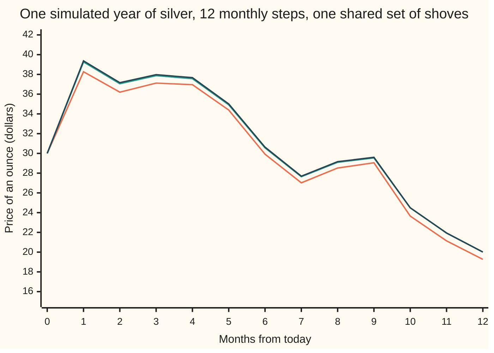
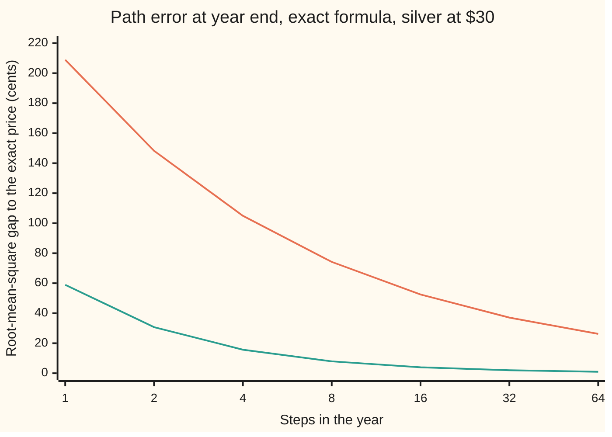
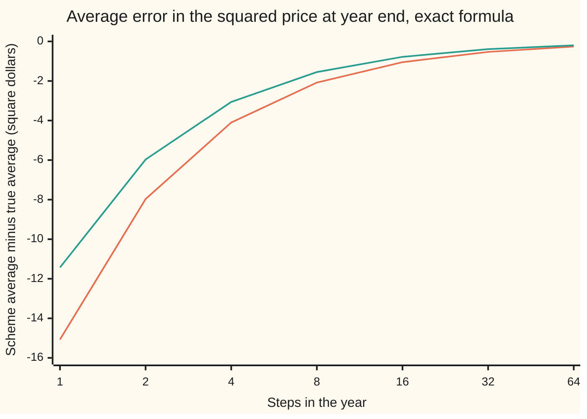

# Milstein and the two kinds of error: path error and average error

[Syllabus](../../../SYLLABUS.md) → [Stochastic processes and calculus](../README.md) → [Generators, Densities and Simulation](../README.md#s08) → Milstein and the two kinds of error

---

## General Overview

An ounce of silver costs $30 today. Its price drifts up 5 percent a year on average and is jumpy: its yearly moves have a spread of 30 percent. Both effects scale with the price, so the model is geometric Brownian motion. A computer is to draw one possible year of it, one month at a time.

The plain way is the Euler-Maruyama loop: read the drift and the jumpiness at the start of the month, hold them fixed, add a random shove. That loop drops one term, and the term is large exactly when the month's shove was large. Put it back and the loop becomes the **Milstein scheme**, published by Grigori Milstein in 1974. On a month in which silver falls hard, Euler lands 34 cents below the exact price; Milstein lands 3 cents above it.

How good is a loop? There are two honest questions, and they have different answers. Does the simulated year follow the true year, path by path? That is the **path error**, called the strong error. Or do averages over many simulated years come out right? That is the **average error**, called the weak error. A risk manager tracing one path needs the first. A price, which is an average, needs only the second.

On this ounce, each halving of the step halves Milstein's path error: 15.71 cents, 7.94, 3.99, 2.00, 1.00. Euler's falls only by a factor of about 1.41 each time. On averages, both loops improve at the same rate, and Milstein buys nothing in kind.

**Milstein adds the term $\tfrac12\sigma\sigma'(\Delta W^2 - \Delta t)$ to each Euler step, which raises the path error's rate from the square root of the step to the step itself; the average error shrinks in proportion to the step for both schemes.**

**What kind of fact this is:** a method. Its convergence orders are theorems: for silver they are proved on this card from an exact error formula (Detailed proof, under Why it works); for general equations the key steps are given and the complete proofs are cited to Kloeden and Platen.

### The picture: one simulated year, three ways



Orange: Euler-Maruyama. Green: Milstein. Dark blue: the exact price on the same Brownian path. All three use the same 12 monthly shoves, drawn from seed 20260930. This is one sample year on a grid of one month; another seed draws another year. Month one had a big upward shove: after it Euler reads $38.27 against the exact $39.37, and it never catches up, ending at $19.27 against $20.01. Milstein stays close all year and ends on $20.01.

---

## The formula

Reminder from [Euler-Maruyama](04-euler-maruyama-scheme.md): time $t$ is in years; $W_t$ is Brownian motion; an SDE $dX_t = \mu(X_t)\,dt + \sigma(X_t)\,dW_t$ is shorthand for an integral equation, never a derivative, because a Brownian path has no slope. The year is cut into $n$ steps of length $\Delta t$, and $\Delta W_k$ is the Brownian change over step $k$, a normal draw with mean 0 and variance $\Delta t$. Below, $\sigma'(x)$ is the slope of the noise-size function: how fast the jumpiness changes as the price moves.

$$Y_{k+1} \;=\; Y_k + \mu(Y_k)\,\Delta t + \sigma(Y_k)\,\Delta W_k \;+\; \tfrac12\,\sigma(Y_k)\,\sigma'(Y_k)\,\big(\Delta W_k^2 - \Delta t\big)$$

**Read it aloud:** take the Euler step, then add half the noise size times its slope times the amount by which this step's squared shove beat its average.

For silver, $\mu(x) = 0.05x$ and $\sigma(x) = 0.30x$, so $\sigma'(x) = 0.30$ and the product $\sigma\sigma'$ is $0.09x$. Each step multiplies the price:

$$Y_{k+1} = Y_k\Big(1 + \mu\,\Delta t + \sigma\,\Delta W_k + \tfrac12\sigma^2\big(\Delta W_k^2 - \Delta t\big)\Big), \qquad S_T = S_0\, e^{(\mu - \frac12\sigma^2)T + \sigma W_T}.$$

The right-hand formula is the exact price on the same Brownian path ([Geometric Brownian motion](../05-Brownian%20Motion/07-geometric-brownian-motion.md)). The two kinds of error, at the horizon $T$:

$$\varepsilon_{\mathrm{s}}(\Delta t) = \sqrt{E\big[(Y_n - S_T)^2\big]} \;\le\; C\,\Delta t^{\gamma}, \qquad \varepsilon_{\mathrm{w}}(\Delta t) = E\big[f(Y_n)\big] - E\big[f(S_T)\big], \quad |\varepsilon_{\mathrm{w}}| \le C\,\Delta t^{\beta}.$$

**Read it aloud:** the path error is the typical size of the gap between scheme and truth on a shared path; the average error is how far the scheme's average of some quantity lands from the true average. The powers $\gamma$ and $\beta$ are the **strong order** and the **weak order**: how fast each error falls with the step.

| Symbol | Plain meaning | In our example | Push it up and the error… |
| --- | --- | --- | --- |
| $t$, $T$ | time from today, in years; the horizon | $T$ = 1 year | grows |
| $S_t$, $S_0$, $S_T$ | the exact silver price at time t, today, at the horizon | $S_0$ = $30; average of $S_T$ $31.5381 | grows in proportion |
| $\mu$, $\sigma$ | drift per year, and volatility (the spread of yearly moves) | 0.05 and 0.30 | grows like $\sigma^2$ |
| $X$, $\mu(x)$, $\sigma(x)$, $\sigma'(x)$ | a general SDE's solution, drift function, noise-size function, and that function's slope | 0.05x, 0.30x, 0.30 | a steeper slope means a bigger correction |
| $W_t$, $\Delta W_k$ | Brownian motion; its change over step k | variance $\Delta t$, spread 0.2887 for a month | — |
| $n$, $\Delta t$, $k$, $t_k$ | number of steps; step length in years; the step counter; the time step k starts | n = 1 to 64; a month is 0.083333 | more steps, less error, more work |
| $Y_k$, $Y_n$ | the scheme's price after k steps; at the horizon | Euler $19.27, Milstein $20.01 on the pictured year | — |
| $\varepsilon_{\mathrm{s}}$, $\varepsilon_{\mathrm{w}}$ | path error (root-mean-square gap on a shared path); average error | at 4 steps, Euler 1.0495 dollars and −4.104 square dollars | — |
| $f$ | the quantity whose average is compared, called the test function | $f(x) = x^2$, the average squared price | — |
| $\gamma$, $\beta$, $C$ | strong order; weak order; the constant in front | Euler ½ and 1; Milstein 1 and 1 | a larger order means faster improvement |
| $A_k$, $G_k$ | the scheme's one-step factor and the exact one-step factor | 0.836617 and 0.835618 on the worked month | — |
| $M$, $K$, $\kappa$ | in the proof: the averages of $A_k^2$ and of $A_k G_k$, and a constant built from μ and σ | — | — |
| $h$, $\eta$, $a$, $c$ | in the proof: the step $\Delta t$; the extra $\sigma^4h^2/2$ that Milstein adds to M and K (0 for Euler); $2\mu + \sigma^2$, the growth rate of the exact average squared price; $\mu + \sigma^2$ | $a$ = 0.19, $c$ = 0.14 | a larger $\eta$ is a bigger correction |
| $u$, $v(x, t)$ | in Step 1, the exact one-step change in the log price; in Step 4, the true average of f at the horizon from price x at time t | — | — |

The average error here is in square dollars, because the test function squares the price.

### When it holds

- **One source of noise.** With two Brownian motions, the correction needs the double integral of one against the other (the Lévy area), which the step's two increments do not determine. Unless the noise coefficients commute, dropping it puts Milstein back at strong order ½ (Kloeden and Platen, section 10.3, under Sources; stated here, not proved). Two Brownian motions at once are the subject of [Several Brownian motions](../06-Ito%20Calculus/06-multidimensional-ito-and-correlation.md).
- **Smooth, tame coefficients.** The general orders need drift, noise size and the product σσ′ to change by at most a fixed multiple of any change in x (Lipschitz) and to grow at most like x. The square-root noise of the CIR rate, σ(x) = c√x, has a slope that blows up at zero, and the theorem does not apply there ([Mean reversion](../06-Ito%20Calculus/05-ornstein-uhlenbeck-and-cir-processes.md)).
- **A shared path for the path error.** Strong error compares scheme and truth on the same Brownian path. Against an exact price driven by other noise, Milstein's "error" stays at $13.68 at 64 steps: that is the typical gap between two independent silver prices.
- **A smooth test function for the average error.** Weak order 1 is proved for f with derivatives that grow at most like a power of x. A payoff with a jump, such as a digital, falls outside the theorem as stated here.
- **Noise that depends on the state, or the correction is zero.** For the shelf's house example, the OU rate, the noise size is a constant, σ′ = 0, and the correction vanishes. Euler there already is Milstein, with strong order 1.

---

## Why it works

### Step 0: the Euler step froze the noise size, and the noise size moves

Euler freezes the noise size at the start of each step. Within the step the price moves, and the noise size moves with it, by about $\sigma'\,\sigma\,(W_s - W_{t_k})$ at time s. Integrating that move against the path gives the missing term. It is as large as the step itself: the path moves about $\sqrt{\Delta t}$, and integrating against it contributes another $\sqrt{\Delta t}$.

### Step 1: the missing integral, computed

Write $X$ for the true solution. On step $k$,

$$\int_{t_k}^{t_{k+1}} \sigma(X_s)\,dW_s \;\approx\; \sigma(X_{t_k})\,\Delta W_k \;+\; \sigma(X_{t_k})\,\sigma'(X_{t_k}) \int_{t_k}^{t_{k+1}} \big(W_s - W_{t_k}\big)\,dW_s .$$

The last integral is Brownian motion integrated against itself, started afresh at $t_k$. The Ito integral gives $\int_0^{\tau} W\,dW = \tfrac12 W_{\tau}^2 - \tfrac12 \tau$, proved by left-end sums in [The Ito integral](../06-Ito%20Calculus/01-ito-integral.md). Over one step, that is $\tfrac12(\Delta W_k^2 - \Delta t)$. Multiply in and the Milstein correction appears.

The code checks this over one month cut into 100,000 pieces. The left-end sum is −0.041889. The Ito value $\tfrac12(\Delta W^2 - \Delta t)$ is −0.041666. Ordinary calculus would say $\tfrac12\Delta W^2$, here 0.000001, and miss by about Δt/2. The −Δt comes from the squared pieces, which add up to 0.083780 against Δt = 0.083333: the path's quadratic variation ([Quadratic variation](../05-Brownian%20Motion/03-quadratic-variation.md)).

For silver the same term falls out of the exact factor. Expand $e^u$ with $u = (\mu - \tfrac12\sigma^2)\Delta t + \sigma\Delta W$: the square $u^2$ is $\sigma^2\Delta W^2$ plus pieces of order $\Delta t^{3/2}$, so $e^u = 1 + \mu\Delta t + \sigma\Delta W + \tfrac12\sigma^2(\Delta W^2 - \Delta t)$ plus order $\Delta t^{3/2}$. The Euler card found the first three terms and named the fourth as the one dropped. Milstein keeps it.

### Step 2: one step's own error, before and after

The local error is the gap after one step from the same start, $A_k - G_k$, where $A_k$ is the scheme's factor and $G_k$ the exact one. Its root-mean-square size can be computed exactly (Step 5). For a dollar of silver:

- Step of 1/16 year: Euler 0.004001, Milstein 0.000292.
- Step of 1/64 year: Euler 0.000996, Milstein 0.000036.

Quartering the step divides Euler's local error by about 4: it is of order $\Delta t$. It divides Milstein's by about 8: order $\Delta t^{3/2}$.

### Step 3: from local error to path error

The [Euler-Maruyama](04-euler-maruyama-scheme.md) card showed how local errors with zero average add up: like a random walk, as the square root of their number. There are $n = T/\Delta t$ steps.

- Euler's local error has near-zero average (of order $\Delta t^2$) and size $\Delta t$. Summed, $\sqrt{n}\,\Delta t = \sqrt{T\,\Delta t}$. Strong order ½.
- Milstein's leftover has a zero-average part of size $\Delta t^{3/2}$, which sums to $\sqrt{n}\,\Delta t^{3/2} = \sqrt{T}\,\Delta t$, and a part with nonzero average of size $\Delta t^2$, which sums to $n\,\Delta t^2 = T\,\Delta t$. Strong order 1.

For Euler the constant follows too. The dropped term $\tfrac12\sigma^2 S(\Delta W^2 - \Delta t)$ has spread $\sigma^2 S\,\Delta t/\sqrt2$, since $\Delta W^2 - \Delta t$ has spread $\sqrt2\,\Delta t$. Add n of them in quadrature and use silver's root-mean-square size at the horizon, $S_0 e^{(2\mu + \sigma^2)T/2}$:

$$\varepsilon_{\mathrm{s}} \approx S_0\, e^{(2\mu+\sigma^2)T/2}\,\sigma^2\sqrt{T\Delta t/2}.$$

That predicts 2.0995 times $\sqrt{\Delta t}$. The exact formula at 1,024 steps gives 2.0995 too. The Euler card measured the average absolute gap rather than the root-mean-square one, so its constant differs; the order is the same.

### Step 4: why averages are kinder

An average forgives errors that average to zero. Milstein's correction has average zero, because $E[\Delta W^2] = \Delta t$. So it cannot change the average price at all: both schemes give $S_0(1 + \mu\Delta t)^n$, which is $31.5284 at 4 steps against the exact $31.5381.

For a general test function the argument runs through the backward equation ([Kolmogorov backward equation](02-kolmogorov-backward-equation.md)). Let v(x, t) be the true average of f at the horizon, started from x at time t. The weak error is a sum over steps of the average change in v along one scheme step. For both schemes that change is of order $\Delta t^2$, because the step's low moments match the generator's prediction to that order ([The generator](01-infinitesimal-generator.md)). Summed over n steps, the average error is $n\,\Delta t^2 = T\,\Delta t$. Weak order 1, for both. The complete argument, for smooth coefficients and smooth f, is in Kloeden and Platen, chapter 14; this card states it and checks it numerically.

A loop can converge weakly and not strongly. Replace each Gaussian shove by a coin flip of ±√Δt. The coin matches the shove's average and variance, so on silver its average error equals Euler's exactly: −4.104 at 4 steps and −1.050 at 16, by enumerating every path. Its path error does not shrink at all: 6.2282 ± 0.0402 dollars at 4 steps, 6.2467 ± 0.0385 at 64.

### Step 5: for silver, the path error has an exact formula

Silver needs no simulation to measure its path error. The scheme's horizon value is $S_0$ times a product of independent factors $A_k$, and so is the exact value, with factors $G_k$ built from the same shoves. Expand the square of the gap and average:

$$\varepsilon_{\mathrm{s}}^2 = S_0^2\big(M^n - 2K^n + e^{(2\mu+\sigma^2)T}\big), \qquad M = E[A_k^2],\quad K = E[A_k G_k].$$

The averages M and K come from the normal moments of one shove. The formula holds for every n. From it, Euler's path error falls like $\sqrt{\Delta t}$ and Milstein's like $\Delta t$; the callout gives the algebra.

<details>
<summary>Detailed proof</summary>

**Setting.** Steps of length $h = \Delta t = T/n$. Each $\Delta W_k$ is normal with mean 0 and variance h, independent of the others. Euler's factor is $A_k = 1 + \mu h + \sigma\Delta W_k$; Milstein's adds $\tfrac12\sigma^2(\Delta W_k^2 - h)$. The exact factor is $G_k = e^{(\mu - \sigma^2/2)h + \sigma\Delta W_k}$. Then $Y_n = S_0\prod A_k$ and $S_T = S_0 \prod G_k$.

**Moments of one shove.** $E\Delta W = E\Delta W^3 = 0$, $E\Delta W^2 = h$, $E\Delta W^4 = 3h^2$. Completing the square in the normal density gives $E e^{\sigma\Delta W} = e^{\sigma^2 h/2}$, $E[\Delta W e^{\sigma\Delta W}] = \sigma h\,e^{\sigma^2 h/2}$ and $E[\Delta W^2 e^{\sigma \Delta W}] = (h + \sigma^2h^2)\,e^{\sigma^2h/2}$.

**The two averages.** Write $\eta = 0$ for Euler and $\eta = \sigma^4h^2/2$ for Milstein. Expanding and using the moments:
$$M = (1 + \mu h)^2 + \sigma^2 h + \eta, \qquad K = e^{\mu h}\big(1 + (\mu + \sigma^2)h + \eta\big).$$
For Milstein, the correction's square averages to $\tfrac14\sigma^4 \cdot 2h^2$, and its cross term with $\sigma \Delta W$ averages to zero because $E\Delta W^3 = 0$. With $G_k$, the correction contributes $\tfrac12\sigma^2(h + \sigma^2 h^2 - h)\,e^{\sigma^2h/2}$ times $e^{(\mu - \sigma^2/2)h}$, which is $e^{\mu h}\sigma^4h^2/2$.

**The formula.** Factors at different steps are independent, so averages of products are products of averages: $E[Y_n^2] = S_0^2M^n$, $E[Y_nS_T] = S_0^2K^n$, $E[S_T^2] = S_0^2e^{(2\mu+\sigma^2)T}$. Expanding $(Y_n - S_T)^2$ gives the formula in Step 5, for every n. The average error with $f(x) = x^2$ is $S_0^2(M^n - e^{(2\mu+\sigma^2)T})$.

**The rates.** Write $a = 2\mu + \sigma^2$ and $c = \mu + \sigma^2$. Divide the bracket by $e^{aT}$. It becomes $e^{n\log M - aT} - 2e^{n \log K - aT} + 1$. Expand the logarithms to order $h^2$ per step, then multiply by $n = T/h$.

*Euler.* $n\log M - aT = Th(\mu^2 - a^2/2) + O(h^2)$ and $n\log K - aT = -Thc^2/2 + O(h^2)$. To first order the bracket is $Th(\mu^2 - a^2/2 + c^2) = Th\,\sigma^4/2$. So $\varepsilon_{\mathrm{s}}^2 \approx S_0^2e^{aT}\sigma^4Th/2$, the constant of Step 3, and the order is ½.

*Milstein.* The extra $\sigma^4h^2/2$ in both M and K changes the first-order terms to $n \log M - aT = 2\kappa Th$ and $n \log K - aT = \kappa Th$, with $\kappa = -\mu^2/2 - \mu\sigma^2$. The bracket's first-order part is $2\kappa Th - 2\kappa Th = 0$. What survives is of order $h^2$, so $\varepsilon_{\mathrm{s}}$ is of order h: strong order 1. The constant needs the second-order terms; the code prints $\varepsilon_{\mathrm{s}}/\Delta t$ settling at 0.6391, 0.6418, 0.6427 for 16, 64 and 1,024 steps; at 1,024 steps the bracket is a tiny difference of large terms, so the code computes it with log1p and expm1, which keep the digits that a plain subtraction loses.

*Average error.* It is $S_0^2e^{aT}(e^{n\log M - aT} - 1)$, whose first-order part is $S_0^2e^{aT}\,Th(\mu^2 - a^2/2)$ for Euler and $S_0^2e^{aT}\,2\kappa Th$ for Milstein. Both are proportional to h: weak order 1, with Milstein's constant equal to Euler's times the ratio of $2\kappa$ to $\mu^2 - a^2/2$: about three quarters of Euler's here.

**General equations.** For Lipschitz coefficients with linear growth, and σσ′ Lipschitz as well, Kloeden and Platen prove strong order 1 for Milstein (chapter 10) by the route of the Euler card's proof: write the scheme as a continuous process, bound the per-step leftover in mean square by $Ch^3$, and carry it to the horizon with Ito's isometry and Gronwall's lemma. That complete argument is not reproduced here.

</details>

### Another road

The Milstein term is the first rung of the Ito-Taylor expansion; higher rungs need double and triple Brownian integrals. Weak schemes, like the coin flips of Step 4, match moments only and reach weak order 2 with extra terms. Kloeden and Platen build both ladders.

---

## Worked numbers, by hand

One month, $\Delta t = 1/12$ = 0.083333 year, from $30. The shove is $\Delta W$ = −0.60, about two spreads down.

| Step | Arithmetic | Value |
| --- | --- | --- |
| drift part, $\mu\Delta t$ | 0.05 × 0.083333 | 0.004167 |
| noise part, $\sigma\Delta W$ | 0.30 × (−0.60) | −0.18 |
| Euler factor | 1 + 0.004167 − 0.18 | 0.824167 |
| correction, $\tfrac12\sigma^2(\Delta W^2 - \Delta t)$ | 0.045 × (0.36 − 0.083333) | 0.012450 |
| Milstein factor | 0.824167 + 0.012450 | 0.836617 |
| exact factor, $e^{(\mu - \frac12\sigma^2)\Delta t + \sigma\Delta W}$ | e^(0.000417 − 0.18) | 0.835618 |
| Euler price | 30 × 0.824167 | $24.7250 |
| Milstein price | 30 × 0.836617 | $25.0985 |
| exact price | 30 × 0.835618 | $25.0685 |
| **errors** | scheme − exact | **Euler −$0.3435, Milstein +$0.0300** |

A month that drops silver from $30 to about $25 costs Euler 34 cents of accuracy and Milstein 3. With the shove +0.60 instead, the same correction 0.012450 is added, since the square does not see the sign: Euler is $35.5250, Milstein $35.8985, exact $35.9315, errors −$0.4065 and −$0.0330. Euler falls short in both directions. The exact factor curves upward in the shove, and for a shove this big Euler's straight line sits under the curve; the correction adds the curvature back.

### The picture: path error against the number of steps



Orange: Euler. Green: Milstein. Each doubling of the steps divides Milstein's error by 2 and Euler's by about 1.41. Between 32 and 64 steps the measured orders are 0.500 and 0.998. The seeded simulation agrees within its standard errors: at 16 steps, 0.5175 ± 0.0039 dollars for Euler against the exact 0.5249, and 0.0393 ± 0.0005 for Milstein against 0.0399.

### The picture: average error against the number of steps



Orange: Euler. Green: Milstein. Both halve with each doubling: orders 0.997 and 0.998. Milstein's constant is about a quarter smaller; its rate is the same.

### What breaks if you drop a piece

| Mistake | Comes out at | What went wrong |
| --- | --- | --- |
| Correction written as $\tfrac12\sigma^2\Delta W^2$, no −Δt (ordinary calculus) | average price $32.9874 at 64 steps, heading to $32.9898, not $31.5381 | each step gains $\tfrac12\sigma^2\Delta t$ on average: a new drift, so the loop converges to a different equation |
| Scheme and truth driven by different noise | path "error" $13.5979 at 4 steps, $13.6816 at 64 | it measures two independent silver prices, not a scheme's error |
| Coin-flip shoves, judged by path error | $6.2282 ± 0.0402 at 4 steps, $6.2467 ± 0.0385 at 64 | right averages (−4.104 at 4 steps, Euler's exactly), no path tracked |
| Euler's average error measured on 20,000 paths at 64 steps | −0.062 ± 0.145, against the exact −0.264 | the bias is under two standard errors, so the run cannot resolve it |

---

## Code, from first principles, and it actually runs

Road 1 is the exact error formula of Step 5, with no paths. Road 2 is a seeded simulation of 20,000 years, each built from 64 fine Brownian shoves; coarser grids add the fine shoves together, so every step size runs on the same path, and every simulated number carries its standard error. Road 3 is one step alone: the local errors, and the Ito integral as a left-end sum of 100,000 pieces. The coin-flip average error is enumerated over every coin path. In the code, `h` is the step Δt and `N` the number of steps n; random numbers come from SplitMix64, with normals by Box-Muller, written out in both languages.

### Python

```python
# Milstein and the two kinds of error -- the check behind the card.  Standard library only.
# An ounce of silver at $30, drift 5% a year, volatility 30% a year, one year, on geometric Brownian motion.
# Road 1: exact error formulas from moments (no paths).  Road 2: seeded coupled simulation with
# standard errors.  Road 3: one step, and the stochastic integral behind the correction, by fine sums.
from math import exp, sqrt, log, log1p, expm1, cos, sin, pi

X0, MU, SIG, T = 30.0, 0.05, 0.30, 1.0
RATE2 = 2 * MU + SIG * SIG                       # exponent of the exact second moment

class SplitMix64:                            # the wing's generator, seed stated, normals by Box-Muller
    def __init__(self, seed): self.s = seed
    def u(self):
        self.s = (self.s + 0x9E3779B97F4A7C15) & 0xFFFFFFFFFFFFFFFF
        z = self.s
        z = ((z ^ (z >> 30)) * 0xBF58476D1CE4E5B9) & 0xFFFFFFFFFFFFFFFF
        z = ((z ^ (z >> 27)) * 0x94D049BB133111EB) & 0xFFFFFFFFFFFFFFFF
        return (((z ^ (z >> 31)) >> 11) + 0.5) / 9007199254740992.0
    def normals(self, n):
        out = []
        while len(out) < n:
            r, th = sqrt(-2.0 * log(self.u())), 2.0 * pi * self.u()
            out += [r * cos(th), r * sin(th)]
        return out[:n]

def factor(dw, h, scheme):                   # one step's multiplier: 'E' Euler, 'M' Milstein, 'X' exact
    if scheme == "X": return exp((MU - 0.5 * SIG * SIG) * h + SIG * dw)
    f = 1.0 + MU * h + SIG * dw
    return f + 0.5 * SIG * SIG * (dw * dw - h) if scheme == "M" else f

def exact_errors(n, milstein, x0=X0, t=T):   # Road 1: E(Y-X)^2 = x0^2 (M^n - 2 K^n + e^{RATE2 t})
    h = t / n                                # bracket over e^{RATE2 t} by log1p and expm1: no cancellation
    extra = SIG ** 4 * h * h / 2 if milstein else 0.0
    lm = n * log1p(2 * MU * h + MU * MU * h * h + SIG * SIG * h + extra) - RATE2 * t   # log M^n - RATE2 t, M = E[A^2]
    lk = n * MU * h + n * log1p((MU + SIG * SIG) * h + extra) - RATE2 * t   # log K^n - RATE2 t, K = E[A G], G exact
    strong = x0 * sqrt(exp(RATE2 * t) * (expm1(lm) - 2 * expm1(lk)))
    weak = x0 * x0 * exp(RATE2 * t) * expm1(lm)                    # E f(Y_N) - E f(X_T), f(x) = x^2
    return strong, weak

LEVELS = [1, 2, 4, 8, 16, 32, 64]
ex = {n: (exact_errors(n, False), exact_errors(n, True)) for n in LEVELS + [1024]}
print("road 1, exact: steps, Euler path RMS, Milstein path RMS, Euler avg error, Milstein avg error")
for n in LEVELS:
    (se, we), (sm, wm) = ex[n]
    print(f"exact N={n:<3} {se:9.4f} {sm:9.4f} {we:10.3f} {wm:10.3f}")
slope = lambda a, b: log(a / b) / log(2.0)
print(f"order, N=32 to 64: Euler path {slope(ex[32][0][0], ex[64][0][0]):.3f}, Milstein path "
      f"{slope(ex[32][1][0], ex[64][1][0]):.3f}, Euler avg {slope(ex[32][0][1], ex[64][0][1]):.3f}, "
      f"Milstein avg {slope(ex[32][1][1], ex[64][1][1]):.3f}")
c_euler = X0 * exp(RATE2 * T / 2) * SIG * SIG * sqrt(T / 2)     # leading constant from Why it works
print(f"Euler RMS/sqrt(h) at N=1024 {ex[1024][0][0] * sqrt(1024):.4f}; predicted constant {c_euler:.4f}")
print(f"Milstein RMS/h: N=16 {ex[16][1][0] * 16:.4f}, N=64 {ex[64][1][0] * 64:.4f}, N=1024 {ex[1024][1][0] * 1024:.4f}")
print(f"shared average, N=4: Euler and Milstein {X0 * (1 + MU / 4) ** 4:.4f}; exact {X0 * exp(MU * T):.4f}")

# ---- worked numbers: one month, two big kicks ----
for dw in (-0.60, 0.60):
    e, m, x = (X0 * factor(dw, 1 / 12, s) for s in "EMX")
    print(f"one month, kick {dw:+.2f}: mu dt {MU / 12:.6f}, log drift {(MU - SIG * SIG / 2) / 12:.6f}; factors {e / X0:.6f} + {(m - e) / X0:.6f} = {m / X0:.6f}, exact {x / X0:.6f}; "
          f"Euler {e:.4f}  Milstein {m:.4f}  exact {x:.4f}  errors {e - x:+.4f} {m - x:+.4f}")
# ---- road 3: one step's own error, exact, from the same formula with n = 1 ----
for n in (16, 64):
    print(f"one step h=1/{n}: Euler local RMS {exact_errors(1, False, 1.0, 1 / n)[0]:.6f}  "
          f"Milstein local RMS {exact_errors(1, True, 1.0, 1 / n)[0]:.6f}")
gen = SplitMix64(20260930)
m_sub, h1 = 100000, 1 / 12                   # one month cut into 100,000 pieces
w = left = qv = 0.0
for di in (sqrt(h1 / m_sub) * z for z in gen.normals(m_sub)): left += w * di; w += di; qv += di * di
ito, ordinary = (w * w - h1) / 2, w * w / 2
print(f"integral of (W-W_0) dW over a month: left sum {left:.6f}; Ito (dW^2 - h)/2 {ito:.6f}; "
      f"ordinary dW^2/2 {ordinary:.6f}; sum of squared pieces {qv:.6f} vs h {h1:.6f}")

# ---- the picture: one sample path, 12 monthly steps, one shared set of kicks ----
kicks = [sqrt(1 / 12) * z for z in gen.normals(12)]
paths = {s: [X0] for s in "XEM"}
for dw in kicks:
    for s in "XEM": paths[s].append(paths[s][-1] * factor(dw, 1 / 12, s))
for s, name in (("X", "exact"), ("E", "Euler"), ("M", "Milstein")):
    print(f"figure, {name:<9}" + " ".join(f"{v:.2f}" for v in paths[s]))

# ---- road 2: coupled simulation.  64 fine kicks per path; coarser grids add them up ----
PATHS, NF = 20000, 64
acc = {(n, s): [0.0, 0.0, 0.0, 0.0] for n in LEVELS for s in "EMC"}   # C: coin-flip kicks
for _ in range(PATHS):
    cum = [0.0]                              # the Brownian path on the fine grid
    for z in gen.normals(NF): cum.append(cum[-1] + sqrt(T / NF) * z)
    xt = X0 * exp((MU - 0.5 * SIG * SIG) * T + SIG * cum[NF])
    for n in LEVELS:
        h, k, y = T / n, NF // n, {"E": X0, "M": X0, "C": X0}
        for j in range(n):
            dw = cum[(j + 1) * k] - cum[j * k]
            y["E"] *= factor(dw, h, "E"); y["M"] *= factor(dw, h, "M")
            y["C"] *= 1.0 + MU * h + SIG * (sqrt(h) if dw >= 0 else -sqrt(h))
        for s in "EMC":
            e2, dv = (y[s] - xt) ** 2, y[s] ** 2 - xt ** 2
            a = acc[(n, s)]; a[0] += e2; a[1] += e2 * e2; a[2] += dv; a[3] += dv * dv
def summary(n, s):
    a = acc[(n, s)]
    mse, wk = a[0] / PATHS, a[2] / PATHS
    se_mse, se_wk = sqrt((a[1] / PATHS - mse * mse) / (PATHS - 1)), sqrt((a[3] / PATHS - wk * wk) / (PATHS - 1))
    return sqrt(mse), se_mse / (2 * sqrt(mse)), wk, se_wk
print(f"road 2, simulated, {PATHS} coupled paths, seed 20260930: steps, path RMS +- se, avg error +- se")
for n in LEVELS:
    (re_, sre, we_, swe), (rm, srm, wm, swm) = summary(n, "E"), summary(n, "M")
    print(f"sim N={n:<3} Euler {re_:7.4f} +- {sre:.4f} {we_:9.3f} +- {swe:.3f} | "
          f"Milstein {rm:7.4f} +- {srm:.4f} {wm:9.3f} +- {swm:.3f}")
for n in (4, 64):
    rc, src = summary(n, "C")[:2]
    print(f"coin-flip kicks N={n}: path RMS {rc:.4f} +- {src:.4f}")
def coin_avg_error(n):                       # all 2^n coin paths, grouped by the number of up kicks
    h, tot, c = T / n, 0.0, 1.0
    for j in range(n + 1):
        y = X0 * (1 + MU * h + SIG * sqrt(h)) ** j * (1 + MU * h - SIG * sqrt(h)) ** (n - j)
        tot += c / 2 ** n * y * y; c = c * (n - j) / (j + 1)
    return tot - X0 * X0 * exp(RATE2 * T)
print(f"coin-flip kicks, every path enumerated: avg error N=4 {coin_avg_error(4):.3f}, N=16 {coin_avg_error(16):.3f}")
for label, i, j, c in (("Euler path RMS, cents", 0, 0, 100), ("Milstein path RMS, cents", 1, 0, 100),
                       ("Euler avg error", 0, 1, 1), ("Milstein avg error", 1, 1, 1)):
    print(f"chart, {label:<25}" + " ".join(f"{c * ex[n][i][j]:.2f}" for n in LEVELS))

# ---- what breaks ----
print(f"wrong: correction without -h, average at N=64 {X0 * (1 + (MU + SIG * SIG / 2) / 64) ** 64:.4f}; "
      f"limit {X0 * exp((MU + SIG * SIG / 2) * T):.4f}; right {X0 * exp(MU * T):.4f}")
for n in (4, 64):                            # scheme against an exact path driven by other noise
    h = T / n
    ey2 = X0 * X0 * ((1 + MU * h) ** 2 + SIG * SIG * h + SIG ** 4 * h * h / 2) ** n
    uncoupled = sqrt(ey2 + X0 * X0 * exp(RATE2 * T) - 2 * X0 * (1 + MU * h) ** n * X0 * exp(MU * T))
    print(f"wrong: uncoupled noise, Milstein N={n}: path RMS {uncoupled:.4f}")

for s, n in (("E", 16), ("M", 16), ("E", 4)):
    r, sr, wv, sw = summary(n, s)
    exact_s, exact_w = ex[n][0 if s == "E" else 1]
    assert abs(r - exact_s) < 4 * sr, "simulated path error must sit within 4 se of the exact formula"
    assert abs(wv - exact_w) < 4 * sw, "simulated average error must sit within 4 se of the exact formula"
assert abs(ex[1024][0][0] * sqrt(1024) / c_euler - 1) < 0.005, "Euler constant vs the piling-up argument"
assert 0.45 < slope(ex[32][0][0], ex[64][0][0]) < 0.55, "Euler path order one half"
assert 0.95 < slope(ex[32][1][0], ex[64][1][0]) < 1.05, "Milstein path order one"
assert abs(left - ito) < 5 * h1 / sqrt(2 * m_sub), "left sums land on the Ito value (dW^2 - h)/2"
assert abs(left - ordinary) > 0.4 * h1, "ordinary calculus misses by about h/2"
assert summary(64, "C")[0] > 0.8 * summary(4, "C")[0], "coin-flip kicks must not converge in the path sense"
assert abs(coin_avg_error(16) - ex[16][0][1]) < 1e-6, "enumerated coin flips keep Euler's average error"
print("ALL CHECKS PASS")
```

**Ran 2026-10-07 on macOS, Python 3.14.6, standard library only. All checks passed. Output, pasted from the run:**

```
road 1, exact: steps, Euler path RMS, Milstein path RMS, Euler avg error, Milstein avg error
exact N=1      2.0896    0.5896    -15.075    -11.430
exact N=2      1.4829    0.3074     -7.970     -5.972
exact N=4      1.0495    0.1571     -4.104     -3.056
exact N=8      0.7423    0.0794     -2.083     -1.546
exact N=16     0.5249    0.0399     -1.050     -0.778
exact N=32     0.3711    0.0200     -0.527     -0.390
exact N=64     0.2624    0.0100     -0.264     -0.195
order, N=32 to 64: Euler path 0.500, Milstein path 0.998, Euler avg 0.997, Milstein avg 0.998
Euler RMS/sqrt(h) at N=1024 2.0995; predicted constant 2.0995
Milstein RMS/h: N=16 0.6391, N=64 0.6418, N=1024 0.6427
shared average, N=4: Euler and Milstein 31.5284; exact 31.5381
one month, kick -0.60: mu dt 0.004167, log drift 0.000417; factors 0.824167 + 0.012450 = 0.836617, exact 0.835618; Euler 24.7250  Milstein 25.0985  exact 25.0685  errors -0.3435 +0.0300
one month, kick +0.60: mu dt 0.004167, log drift 0.000417; factors 1.184167 + 0.012450 = 1.196617, exact 1.197716; Euler 35.5250  Milstein 35.8985  exact 35.9315  errors -0.4065 -0.0330
one step h=1/16: Euler local RMS 0.004001  Milstein local RMS 0.000292
one step h=1/64: Euler local RMS 0.000996  Milstein local RMS 0.000036
integral of (W-W_0) dW over a month: left sum -0.041889; Ito (dW^2 - h)/2 -0.041666; ordinary dW^2/2 0.000001; sum of squared pieces 0.083780 vs h 0.083333
figure, exact    30.00 39.37 37.16 37.97 37.67 35.01 30.63 27.69 29.16 29.60 24.49 21.94 20.01
figure, Euler    30.00 38.27 36.20 37.12 36.96 34.39 29.92 27.02 28.52 29.05 23.65 21.14 19.27
figure, Milstein 30.00 39.26 37.06 37.87 37.57 34.92 30.56 27.64 29.10 29.54 24.48 21.93 20.01
road 2, simulated, 20000 coupled paths, seed 20260930: steps, path RMS +- se, avg error +- se
sim N=1   Euler  2.0631 +- 0.0376   -12.635 +- 1.443 | Milstein  0.5856 +- 0.0163   -10.716 +- 0.448
sim N=2   Euler  1.4517 +- 0.0226    -6.139 +- 0.963 | Milstein  0.3005 +- 0.0069    -5.667 +- 0.220
sim N=4   Euler  1.0427 +- 0.0124    -3.843 +- 0.643 | Milstein  0.1542 +- 0.0025    -2.877 +- 0.107
sim N=8   Euler  0.7343 +- 0.0066    -1.952 +- 0.426 | Milstein  0.0776 +- 0.0010    -1.415 +- 0.052
sim N=16  Euler  0.5175 +- 0.0039    -0.671 +- 0.291 | Milstein  0.0393 +- 0.0005    -0.740 +- 0.026
sim N=32  Euler  0.3698 +- 0.0026    -0.290 +- 0.207 | Milstein  0.0200 +- 0.0002    -0.376 +- 0.013
sim N=64  Euler  0.2601 +- 0.0017    -0.062 +- 0.145 | Milstein  0.0099 +- 0.0001    -0.184 +- 0.007
coin-flip kicks N=4: path RMS 6.2282 +- 0.0402
coin-flip kicks N=64: path RMS 6.2467 +- 0.0385
coin-flip kicks, every path enumerated: avg error N=4 -4.104, N=16 -1.050
chart, Euler path RMS, cents    208.96 148.29 104.95 74.23 52.49 37.11 26.24
chart, Milstein path RMS, cents 58.96 30.74 15.71 7.94 3.99 2.00 1.00
chart, Euler avg error          -15.07 -7.97 -4.10 -2.08 -1.05 -0.53 -0.26
chart, Milstein avg error       -11.43 -5.97 -3.06 -1.55 -0.78 -0.39 -0.20
wrong: correction without -h, average at N=64 32.9874; limit 32.9898; right 31.5381
wrong: uncoupled noise, Milstein N=4: path RMS 13.5979
wrong: uncoupled noise, Milstein N=64: path RMS 13.6816
ALL CHECKS PASS
```

### Rust

```rust
// Milstein and the two kinds of error -- the same check as the Python, in Rust.  Std only, no crates.
// An ounce of silver at $30, drift 5% a year, volatility 30% a year, one year, on geometric Brownian motion.
// Road 1: exact error formulas from moments (no paths).  Road 2: seeded coupled simulation with
// standard errors.  Road 3: one step, and the stochastic integral behind the correction, by fine sums.
use std::f64::consts::PI;

const X0: f64 = 30.0; const MU: f64 = 0.05; const SIG: f64 = 0.30; const T: f64 = 1.0;
const RATE2: f64 = 2.0 * MU + SIG * SIG; // exponent of the exact second moment

struct SplitMix64 { s: u64 } // the wing's generator, seed stated, normals by Box-Muller
impl SplitMix64 {
    fn u(&mut self) -> f64 {
        self.s = self.s.wrapping_add(0x9E3779B97F4A7C15);
        let mut z = self.s;
        z = (z ^ (z >> 30)).wrapping_mul(0xBF58476D1CE4E5B9);
        z = (z ^ (z >> 27)).wrapping_mul(0x94D049BB133111EB);
        (((z ^ (z >> 31)) >> 11) as f64 + 0.5) / 9007199254740992.0
    }
    fn normals(&mut self, n: usize) -> Vec<f64> {
        let mut out = Vec::with_capacity(n + 1);
        while out.len() < n {
            let (r, th) = ((-2.0 * self.u().ln()).sqrt(), 2.0 * PI * self.u());
            out.push(r * th.cos()); out.push(r * th.sin());
        }
        out.truncate(n); out
    }
}

fn factor(dw: f64, h: f64, scheme: char) -> f64 { // 'E' Euler, 'M' Milstein, 'X' exact
    if scheme == 'X' { return ((MU - 0.5 * SIG * SIG) * h + SIG * dw).exp(); }
    let f = 1.0 + MU * h + SIG * dw;
    if scheme == 'M' { f + 0.5 * SIG * SIG * (dw * dw - h) } else { f }
}

fn exact_errors(n: usize, milstein: bool, x0: f64, t: f64) -> (f64, f64) { // E(Y-X)^2 = x0^2 (M^n - 2K^n + e^{RATE2 t})
    let (h, nf) = (t / n as f64, n as f64); // bracket over e^{RATE2 t} by ln_1p and exp_m1: no cancellation
    let extra = if milstein { SIG.powf(4.0) * h * h / 2.0 } else { 0.0 };
    let lm = nf * (2.0 * MU * h + MU * MU * h * h + SIG * SIG * h + extra).ln_1p() - RATE2 * t; // log M^n - RATE2 t, M = E[A^2]
    let lk = nf * MU * h + nf * ((MU + SIG * SIG) * h + extra).ln_1p() - RATE2 * t; // log K^n - RATE2 t, K = E[A G]
    let strong = x0 * ((RATE2 * t).exp() * (lm.exp_m1() - 2.0 * lk.exp_m1())).sqrt();
    let weak = x0 * x0 * (RATE2 * t).exp() * lm.exp_m1(); // E f(Y_N) - E f(X_T), f(x) = x^2
    (strong, weak)
}

fn slope(a: f64, b: f64) -> f64 { (a / b).ln() / 2.0_f64.ln() }

fn coin_avg_error(n: usize) -> f64 { // all 2^n coin paths, grouped by the number of up kicks
    let (h, mut tot, mut c) = (T / n as f64, 0.0, 1.0);
    for j in 0..=n {
        let y = X0 * (1.0 + MU * h + SIG * h.sqrt()).powf(j as f64) * (1.0 + MU * h - SIG * h.sqrt()).powf((n - j) as f64);
        tot += c / 2.0_f64.powf(n as f64) * y * y; c = c * (n - j) as f64 / (j + 1) as f64;
    }
    tot - X0 * X0 * (RATE2 * T).exp()
}

fn main() {
    let levels = [1usize, 2, 4, 8, 16, 32, 64];
    let ex = |n: usize| (exact_errors(n, false, X0, T), exact_errors(n, true, X0, T));
    println!("road 1, exact: steps, Euler path RMS, Milstein path RMS, Euler avg error, Milstein avg error");
    for &n in &levels {
        let ((se, we), (sm, wm)) = ex(n); println!("exact N={:<3} {:9.4} {:9.4} {:10.3} {:10.3}", n, se, sm, we, wm);
    }
    let (e32, e64, e1024, e16) = (ex(32), ex(64), ex(1024), ex(16));
    println!("order, N=32 to 64: Euler path {:.3}, Milstein path {:.3}, Euler avg {:.3}, Milstein avg {:.3}",
        slope(e32.0 .0, e64.0 .0), slope(e32.1 .0, e64.1 .0), slope(e32.0 .1, e64.0 .1), slope(e32.1 .1, e64.1 .1));
    let c_euler = X0 * (RATE2 * T / 2.0).exp() * SIG * SIG * (T / 2.0).sqrt(); // leading constant from Why it works
    println!("Euler RMS/sqrt(h) at N=1024 {:.4}; predicted constant {:.4}", e1024.0 .0 * 1024f64.sqrt(), c_euler);
    println!("Milstein RMS/h: N=16 {:.4}, N=64 {:.4}, N=1024 {:.4}", e16.1 .0 * 16.0, e64.1 .0 * 64.0, e1024.1 .0 * 1024.0);
    println!("shared average, N=4: Euler and Milstein {:.4}; exact {:.4}", X0 * (1.0 + MU / 4.0).powf(4.0), X0 * (MU * T).exp());

    // ---- worked numbers: one month, two big kicks ----
    for dw in [-0.60_f64, 0.60] {
        let (e, m, x) = (X0 * factor(dw, 1.0 / 12.0, 'E'), X0 * factor(dw, 1.0 / 12.0, 'M'), X0 * factor(dw, 1.0 / 12.0, 'X'));
        println!("one month, kick {:+.2}: mu dt {:.6}, log drift {:.6}; factors {:.6} + {:.6} = {:.6}, exact {:.6}; Euler {:.4}  Milstein {:.4}  exact {:.4}  errors {:+.4} {:+.4}",
            dw, MU / 12.0, (MU - SIG * SIG / 2.0) / 12.0, e / X0, (m - e) / X0, m / X0, x / X0, e, m, x, e - x, m - x);
    }
    // ---- road 3: one step's own error, exact, from the same formula with n = 1 ----
    for n in [16usize, 64] {
        println!("one step h=1/{}: Euler local RMS {:.6}  Milstein local RMS {:.6}", n,
            exact_errors(1, false, 1.0, 1.0 / n as f64).0, exact_errors(1, true, 1.0, 1.0 / n as f64).0);
    }
    let mut gen = SplitMix64 { s: 20260930 };
    let (m_sub, h1) = (100000usize, 1.0 / 12.0); // one month cut into 100,000 pieces
    let (mut w, mut left, mut qv) = (0.0_f64, 0.0_f64, 0.0_f64);
    for z in gen.normals(m_sub) {
        let di = (h1 / m_sub as f64).sqrt() * z; left += w * di; w += di; qv += di * di;
    }
    let (ito, ordinary) = ((w * w - h1) / 2.0, w * w / 2.0);
    println!("integral of (W-W_0) dW over a month: left sum {:.6}; Ito (dW^2 - h)/2 {:.6}; ordinary dW^2/2 {:.6}; sum of squared pieces {:.6} vs h {:.6}",
        left, ito, ordinary, qv, h1);

    // ---- the picture: one sample path, 12 monthly steps, one shared set of kicks ----
    let kicks: Vec<f64> = gen.normals(12).iter().map(|z| (1.0_f64 / 12.0).sqrt() * z).collect();
    for (s, name) in [('X', "exact"), ('E', "Euler"), ('M', "Milstein")] {
        let mut path = vec![X0];
        for &dw in &kicks { let last = *path.last().unwrap(); path.push(last * factor(dw, 1.0 / 12.0, s)); }
        let vals: Vec<String> = path.iter().map(|v| format!("{:.2}", v)).collect();
        println!("figure, {:<9}{}", name, vals.join(" "));
    }

    // ---- road 2: coupled simulation.  64 fine kicks per path; coarser grids add them up ----
    let (paths, nf) = (20000usize, 64usize); let mf = paths as f64;
    let mut acc: Vec<[f64; 4]> = (0..levels.len() * 3).map(|_| [0.0; 4]).collect(); // index level*3 + scheme; schemes E, M, C (coin-flip kicks)
    for _ in 0..paths {
        let mut cum = vec![0.0_f64]; // the Brownian path on the fine grid
        for z in gen.normals(nf) { let last = *cum.last().unwrap(); cum.push(last + (T / nf as f64).sqrt() * z); }
        let xt = X0 * ((MU - 0.5 * SIG * SIG) * T + SIG * cum[nf]).exp();
        for (li, &n) in levels.iter().enumerate() {
            let (h, k, mut y) = (T / n as f64, nf / n, [X0, X0, X0]);
            for j in 0..n {
                let dw = cum[(j + 1) * k] - cum[j * k];
                y[0] *= factor(dw, h, 'E'); y[1] *= factor(dw, h, 'M');
                y[2] *= 1.0 + MU * h + SIG * (if dw >= 0.0 { h.sqrt() } else { -h.sqrt() });
            }
            for si in 0..3 {
                let (e2, dv) = ((y[si] - xt).powf(2.0), y[si].powf(2.0) - xt.powf(2.0));
                let a = &mut acc[li * 3 + si]; a[0] += e2; a[1] += e2 * e2; a[2] += dv; a[3] += dv * dv;
            }
        }
    }
    let summary = |li: usize, si: usize| -> (f64, f64, f64, f64) {
        let a = acc[li * 3 + si];
        let (mse, wk) = (a[0] / mf, a[2] / mf);
        let (se_mse, se_wk) = (((a[1] / mf - mse * mse) / (mf - 1.0)).sqrt(), ((a[3] / mf - wk * wk) / (mf - 1.0)).sqrt());
        (mse.sqrt(), se_mse / (2.0 * mse.sqrt()), wk, se_wk)
    };
    println!("road 2, simulated, {} coupled paths, seed 20260930: steps, path RMS +- se, avg error +- se", paths);
    for (li, &n) in levels.iter().enumerate() {
        let ((re, sre, we, swe), (rm, srm, wm, swm)) = (summary(li, 0), summary(li, 1));
        println!("sim N={:<3} Euler {:7.4} +- {:.4} {:9.3} +- {:.3} | Milstein {:7.4} +- {:.4} {:9.3} +- {:.3}",
            n, re, sre, we, swe, rm, srm, wm, swm);
    }
    for (li, n) in [(2usize, 4usize), (6, 64)] {
        let (rc, src, _, _) = summary(li, 2); println!("coin-flip kicks N={}: path RMS {:.4} +- {:.4}", n, rc, src);
    }
    println!("coin-flip kicks, every path enumerated: avg error N=4 {:.3}, N=16 {:.3}", coin_avg_error(4), coin_avg_error(16));
    for (label, i, j, c) in [("Euler path RMS, cents", 0, 0, 100.0), ("Milstein path RMS, cents", 1, 0, 100.0),
                             ("Euler avg error", 0, 1, 1.0), ("Milstein avg error", 1, 1, 1.0)] {
        let vals: Vec<String> = levels.iter().map(|&n| {
            let pair = if i == 0 { ex(n).0 } else { ex(n).1 };
            format!("{:.2}", c * if j == 0 { pair.0 } else { pair.1 }) }).collect();
        println!("chart, {:<25}{}", label, vals.join(" "));
    }

    // ---- what breaks ----
    println!("wrong: correction without -h, average at N=64 {:.4}; limit {:.4}; right {:.4}",
        X0 * (1.0 + (MU + SIG * SIG / 2.0) / 64.0).powf(64.0), X0 * ((MU + SIG * SIG / 2.0) * T).exp(), X0 * (MU * T).exp());
    for n in [4usize, 64] { // scheme against an exact path driven by other noise
        let (h, nf) = (T / n as f64, n as f64);
        let ey2 = X0 * X0 * ((1.0 + MU * h).powf(2.0) + SIG * SIG * h + SIG.powf(4.0) * h * h / 2.0).powf(nf);
        let uncoupled = (ey2 + X0 * X0 * (RATE2 * T).exp() - 2.0 * X0 * (1.0 + MU * h).powf(nf) * X0 * (MU * T).exp()).sqrt();
        println!("wrong: uncoupled noise, Milstein N={}: path RMS {:.4}", n, uncoupled);
    }

    for (si, li, n) in [(0usize, 4usize, 16usize), (1, 4, 16), (0, 2, 4)] {
        let (r, sr, wv, sw) = summary(li, si);
        let (exact_s, exact_w) = if si == 0 { ex(n).0 } else { ex(n).1 };
        assert!((r - exact_s).abs() < 4.0 * sr, "simulated path error must sit within 4 se of the exact formula");
        assert!((wv - exact_w).abs() < 4.0 * sw, "simulated average error must sit within 4 se of the exact formula");
    }
    assert!((e1024.0 .0 * 1024f64.sqrt() / c_euler - 1.0).abs() < 0.005, "Euler constant vs the piling-up argument");
    let (se_slope, sm_slope) = (slope(e32.0 .0, e64.0 .0), slope(e32.1 .0, e64.1 .0));
    assert!(se_slope > 0.45 && se_slope < 0.55, "Euler path order one half");
    assert!(sm_slope > 0.95 && sm_slope < 1.05, "Milstein path order one");
    assert!((left - ito).abs() < 5.0 * h1 / (2.0 * m_sub as f64).sqrt(), "left sums land on the Ito value (dW^2 - h)/2");
    assert!((left - ordinary).abs() > 0.4 * h1, "ordinary calculus misses by about h/2");
    assert!(summary(6, 2).0 > 0.8 * summary(2, 2).0, "coin-flip kicks must not converge in the path sense");
    assert!((coin_avg_error(16) - e16.0 .1).abs() < 1e-6, "enumerated coin flips keep Euler's average error");
    println!("ALL CHECKS PASS");
}
```

**Ran 2026-10-07 on macOS, rustc 1.98.1, no crates. All checks passed. Output, pasted from the run:**

```
road 1, exact: steps, Euler path RMS, Milstein path RMS, Euler avg error, Milstein avg error
exact N=1      2.0896    0.5896    -15.075    -11.430
exact N=2      1.4829    0.3074     -7.970     -5.972
exact N=4      1.0495    0.1571     -4.104     -3.056
exact N=8      0.7423    0.0794     -2.083     -1.546
exact N=16     0.5249    0.0399     -1.050     -0.778
exact N=32     0.3711    0.0200     -0.527     -0.390
exact N=64     0.2624    0.0100     -0.264     -0.195
order, N=32 to 64: Euler path 0.500, Milstein path 0.998, Euler avg 0.997, Milstein avg 0.998
Euler RMS/sqrt(h) at N=1024 2.0995; predicted constant 2.0995
Milstein RMS/h: N=16 0.6391, N=64 0.6418, N=1024 0.6427
shared average, N=4: Euler and Milstein 31.5284; exact 31.5381
one month, kick -0.60: mu dt 0.004167, log drift 0.000417; factors 0.824167 + 0.012450 = 0.836617, exact 0.835618; Euler 24.7250  Milstein 25.0985  exact 25.0685  errors -0.3435 +0.0300
one month, kick +0.60: mu dt 0.004167, log drift 0.000417; factors 1.184167 + 0.012450 = 1.196617, exact 1.197716; Euler 35.5250  Milstein 35.8985  exact 35.9315  errors -0.4065 -0.0330
one step h=1/16: Euler local RMS 0.004001  Milstein local RMS 0.000292
one step h=1/64: Euler local RMS 0.000996  Milstein local RMS 0.000036
integral of (W-W_0) dW over a month: left sum -0.041889; Ito (dW^2 - h)/2 -0.041666; ordinary dW^2/2 0.000001; sum of squared pieces 0.083780 vs h 0.083333
figure, exact    30.00 39.37 37.16 37.97 37.67 35.01 30.63 27.69 29.16 29.60 24.49 21.94 20.01
figure, Euler    30.00 38.27 36.20 37.12 36.96 34.39 29.92 27.02 28.52 29.05 23.65 21.14 19.27
figure, Milstein 30.00 39.26 37.06 37.87 37.57 34.92 30.56 27.64 29.10 29.54 24.48 21.93 20.01
road 2, simulated, 20000 coupled paths, seed 20260930: steps, path RMS +- se, avg error +- se
sim N=1   Euler  2.0631 +- 0.0376   -12.635 +- 1.443 | Milstein  0.5856 +- 0.0163   -10.716 +- 0.448
sim N=2   Euler  1.4517 +- 0.0226    -6.139 +- 0.963 | Milstein  0.3005 +- 0.0069    -5.667 +- 0.220
sim N=4   Euler  1.0427 +- 0.0124    -3.843 +- 0.643 | Milstein  0.1542 +- 0.0025    -2.877 +- 0.107
sim N=8   Euler  0.7343 +- 0.0066    -1.952 +- 0.426 | Milstein  0.0776 +- 0.0010    -1.415 +- 0.052
sim N=16  Euler  0.5175 +- 0.0039    -0.671 +- 0.291 | Milstein  0.0393 +- 0.0005    -0.740 +- 0.026
sim N=32  Euler  0.3698 +- 0.0026    -0.290 +- 0.207 | Milstein  0.0200 +- 0.0002    -0.376 +- 0.013
sim N=64  Euler  0.2601 +- 0.0017    -0.062 +- 0.145 | Milstein  0.0099 +- 0.0001    -0.184 +- 0.007
coin-flip kicks N=4: path RMS 6.2282 +- 0.0402
coin-flip kicks N=64: path RMS 6.2467 +- 0.0385
coin-flip kicks, every path enumerated: avg error N=4 -4.104, N=16 -1.050
chart, Euler path RMS, cents    208.96 148.29 104.95 74.23 52.49 37.11 26.24
chart, Milstein path RMS, cents 58.96 30.74 15.71 7.94 3.99 2.00 1.00
chart, Euler avg error          -15.07 -7.97 -4.10 -2.08 -1.05 -0.53 -0.26
chart, Milstein avg error       -11.43 -5.97 -3.06 -1.55 -0.78 -0.39 -0.20
wrong: correction without -h, average at N=64 32.9874; limit 32.9898; right 31.5381
wrong: uncoupled noise, Milstein N=4: path RMS 13.5979
wrong: uncoupled noise, Milstein N=64: path RMS 13.6816
ALL CHECKS PASS
```

The two outputs agree line for line, including every simulated digit: both languages run the same generator on the same seed.

> [!TIP]
> **Try changing**
> Guess first, then run.
> - **Drop the −h in the Milstein factor.** In `factor`, change `(dw * dw - h)` to `(dw * dw)`. Guess whether the path error still shrinks. It stops shrinking: the loop now tracks a different equation, and the path-error assert fails.
> - **Calmer silver.** Set `SIG = 0.15`. Guess how much Euler's path constant falls. It scales with σ squared, so by about four: the printed constant drops from 2.0995 to roughly a quarter of that.
> - **Halve the paths.** Set `PATHS = 10000`. Guess the standard errors. They grow by about √2, and the 64-step Euler average error stays unresolved.
> - **Fewer pieces in the integral.** Set `m_sub = 100`. Guess whether the left sum still lands on the Ito value. Its typical gap grows about thirtyfold, the square root of 1,000, and the assert's tolerance grows with it; the gap to ordinary calculus stays near Δt/2.

---

## The usual mistake

> [!warning]
> **Expecting Milstein to make prices more accurate.** A price is an average, and the average error is weak error. Milstein's correction has average zero, so it leaves the average price untouched: $31.5284 for both schemes at 4 steps. On the squared price it shrinks the constant by about a quarter and keeps the rate. Path accuracy and price accuracy are different targets.
>
> Smaller traps:
> - **Writing the correction with ordinary calculus.** $\tfrac12\sigma^2\Delta W^2$ without −Δt adds a drift. The average price heads to $32.9898 instead of $31.5381.
> - **Reading an order off simulated errors without standard errors.** At 64 steps Euler's simulated average error, −0.062 ± 0.145, is noise; a slope fitted through it means nothing.
> - **Carrying the correction to two noises unchanged.** With two Brownian motions and noise coefficients that do not commute, the missing Lévy area puts the strong order back at ½.

---

## Where you meet it in real life

- **Multilevel Monte Carlo.** Giles's method prices with a ladder of step sizes and corrects coarse runs with fine ones on shared paths. How many paths each level needs is set by the path error, so Milstein's order 1 makes the fine levels cheap.
- **Option pricing by simulation.** A price only needs the average error, and Euler is usually enough; the step size is chosen to make the bias small against the sampling noise ([Stepping an SDE](../../12-Financial%20mathematics/06-Numerical%20Methods%20for%20Pricing/05-discretisation-schemes-for-sdes.md)).
- **Path-dependent questions.** Whether a price touched a barrier, or how a hedge fared along one path, depends on the path itself. There path error matters.
- **Exact simulation instead.** For silver and the OU rate there is an exact one-step rule, and neither scheme is needed ([Exact simulation](06-exact-simulation-of-gbm-and-ou.md)).

> **Say it back**
> Euler freezes the noise size over a step, and the noise size moves. Integrating its move against the path gives the Milstein term, $\tfrac12\sigma\sigma'(\Delta W^2 - \Delta t)$. Path error asks whether the scheme follows the true path; average error asks whether averages come out right. Milstein raises the path order from ½ to 1, so each halving of the step halves the path error. For averages both schemes have order 1, and on the average price the correction changes nothing.

---

## What this builds on

- [Euler-Maruyama](04-euler-maruyama-scheme.md): the loop this card corrects, the term it drops, and the random-walk argument that gives its path order ½.

## Where this goes next

- [Stepping an SDE](../../12-Financial%20mathematics/06-Numerical%20Methods%20for%20Pricing/05-discretisation-schemes-for-sdes.md): Euler and Milstein inside a pricing engine, where only the average error counts, and Andersen's scheme for a variance that must stay positive.

A better path does not buy a better price; how a pricing engine should then spend its steps and paths is the question the finance card answers.

---

## Sources

Verified 2026-10-06: every link below resolves to the publisher's page.

- Mil'shtein, G. N. "Approximate Integration of Stochastic Differential Equations." *Theory of Probability and Its Applications* 19, no. 3 (1975): 557–562. [doi:10.1137/1119062](https://doi.org/10.1137/1119062). The correction term and its order, in the English translation of the 1974 Russian paper.
- Kloeden, Peter E., and Eckhard Platen. *Numerical Solution of Stochastic Differential Equations*. Springer, 1992. [doi:10.1007/978-3-662-12616-5](https://doi.org/10.1007/978-3-662-12616-5). Strong orders (chapter 10) and weak orders (chapter 14) with complete proofs; the Ito-Taylor ladder.
- Higham, Desmond J. "An Algorithmic Introduction to Numerical Simulation of Stochastic Differential Equations." *SIAM Review* 43, no. 3 (2001): 525–546. [doi:10.1137/S0036144500378302](https://doi.org/10.1137/S0036144500378302). Strong and weak error measured on geometric Brownian motion, the experiment this card repeats with an exact formula.
- Glasserman, Paul. *Monte Carlo Methods in Financial Engineering*. Springer, 2003. [doi:10.1007/978-0-387-21617-1](https://doi.org/10.1007/978-0-387-21617-1). Chapter 6: discretisation schemes, strong against weak error, and why pricing mostly needs the weak kind.
