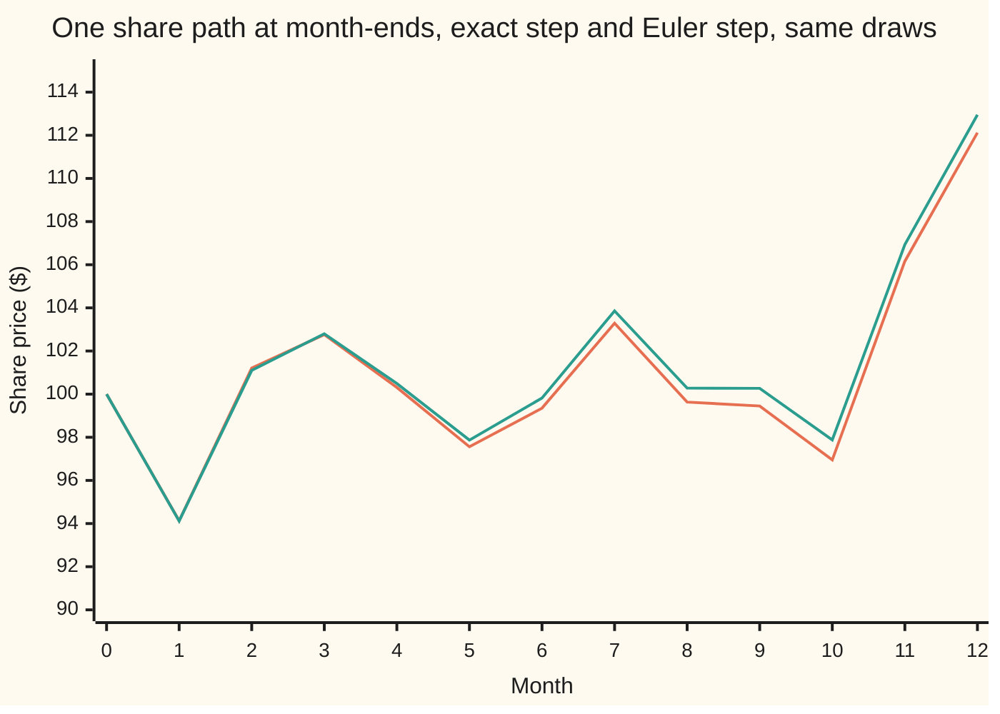
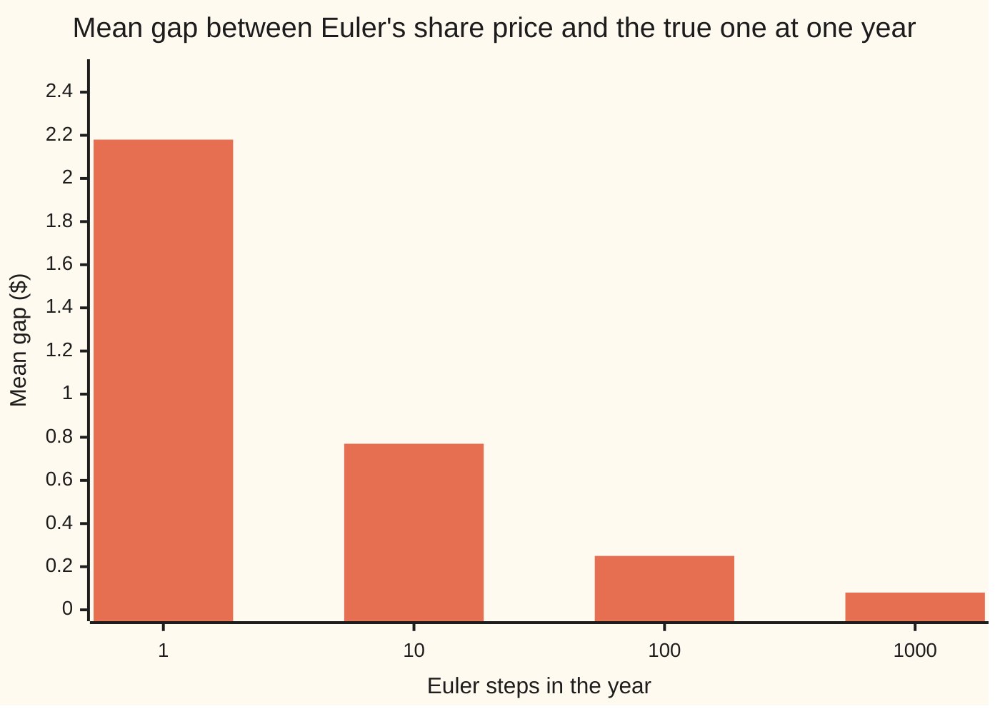

# Exact simulation: when you can skip the time steps

Stochastic processes and calculus → Generators, Densities and Simulation → Sampling the transition law → Exact simulation

---

## General Overview

A share trades at $100. A risk desk wants its price at each of the next twelve month-ends: twelve numbers per scenario, tens of thousands of scenarios. Beside it sits a short-term interest rate at 6 percent, pulled toward 4 percent. The desk wants the rate on the same twelve dates.

The general tool is the Euler-Maruyama scheme of [euler-maruyama-scheme](04-euler-maruyama-scheme.md): cut time into small steps and push the price forward by its drift and one random shove per step. Each step adds a small error, so a sound answer needs many steps: a thousand a year is common, though the desk wants only twelve dates. And even then a small error remains.

For two models no steps are needed. Geometric Brownian motion (the share model, called GBM) and the Ornstein-Uhlenbeck process (the mean-reverting rate, called OU) have a known **transition law**: the exact probability law of the value on the next date, given the value today. Draw from that law once per date and the simulated prices have exactly the model's law at those dates. Twelve draws per path, not a thousand, and no discretisation error (the error from replacing continuous time by a grid). In the code below a monthly Euler path ends 70 cents away from the true path on average; a 1,000-step Euler path is still 8 cents away. The exact path is exactly right at every date.

**When the model's law from one date to the next is known in closed form, draw from that law directly: the simulated values then have the process's own joint law at every chosen date, whatever the spacing, and Euler's step error disappears.**

**What kind of fact this is:** a method. It rests on a theorem, proved on this card in Why it works: the chain of exact steps has the same law at the chosen dates as the continuous process.

### The picture: one year, monthly, two ways



Orange: the exact monthly path, one sample drawn with seed 20260930. Green: Euler with a one-month step, fed the very same twelve normal draws. The two start together and drift apart: by month 12 Euler reads $112.95 against the true $112.12. Each month Euler makes a small error and keeps it. Another seed draws another pair of paths; the gap averages 70 cents at month 12.

---

## The formula

Notation first, in words. Time $t$ is in years. The chosen dates are $t_0 = 0 < t_1 < \dots < t_{12} = 1$, here the month-ends, and $h_k = t_{k+1} - t_k$ is the gap between two dates. $W_t$ is Brownian motion, the random walk seen from far away; $dW_t$ is shorthand for an Ito integral, never a derivative, because the path has none. $Z_k$ is a standard normal draw (mean 0, variance 1), one per date, independent of all the others.

The share follows GBM, $dS_t = \mu S_t\,dt + \sigma S_t\,dW_t$. Its exact step is

$$S_{t_{k+1}} = S_{t_k}\,\exp\!\Big(\big(\mu - \tfrac12\sigma^2\big)h_k + \sigma\sqrt{h_k}\,Z_k\Big).$$

**Read it aloud:** next month's price is this month's price times a lognormal factor (a number whose log is normal): a fixed drift in the log, minus half the variance, plus one normal shock scaled by the root of the gap.

The rate follows OU, $dr_t = \kappa(\theta - r_t)\,dt + \sigma_r\,dW_t$. Its exact step is

$$r_{t_{k+1}} = \theta + (r_{t_k} - \theta)\,e^{-\kappa h_k} + \sigma_r\sqrt{\frac{1 - e^{-2\kappa h_k}}{2\kappa}}\;Z_k .$$

**Read it aloud:** next month's rate is the level plus today's gap shrunk by the exponential, plus one normal shock whose size is what the noise builds up over the month after the pull has drained part of it.

For contrast, the Euler step over a gap $h$ replaces each exact factor by its first-order version:

$$S \to S\,(1 + \mu h + \sigma\sqrt{h}\,Z), \qquad r \to r + \kappa(\theta - r)h + \sigma_r\sqrt{h}\,Z .$$

| Symbol | Plain meaning | In our example | Push it up and the answer… |
| --- | --- | --- | --- |
| $t$, $t_k$, $h_k$, $T$ | time in years; the k-th chosen date; the gap to the next date; the horizon | month-ends; $h_k$ = 1/12, or days/365 on the calendar; 1 year | longer gaps cost the exact step nothing |
| $S_t$, $S_0$ | the share price at time $t$; today's price | 100 dollars | — |
| $\mu$ | the share's drift, "mu": its mean growth rate per year | 0.08 | mean $S_0 e^{\mu T}$ rises |
| $\sigma$ | the share's volatility, "sigma", per root-year | 0.20 | wider log spread; Euler's error grows |
| $W_t$, $dW_t$ | Brownian motion; its increment, shorthand for an Ito integral | — | — |
| $Z$, $Z_k$ | standard normal draws, one per date | from SplitMix64, seed 20260930 | — |
| $r_t$, $r_0$, $r_{t_k}$ | the rate at time $t$, a decimal; today's rate; the rate on date k | 0.06 | — |
| $\theta$ | the rate's long-run level, "theta" | 0.04 | the mean moves toward it |
| $\kappa$, $a$ | the pull speed per year, "kappa"; the share of the gap kept over one gap, $a = e^{-\kappa h}$ | 0.5; 0.959189 per month | a faster pull, a smaller $a$ |
| $\sigma_r$, $s_h$ | the rate's noise size per root-year; the exact step's shock size $\sigma_r\sqrt{(1-a^2)/(2\kappa)}$ | 0.02; 0.565528 points per month | larger shocks |
| $n$, $h$ | the number of Euler steps in the year; Euler's step $T/n$ | 1, 10, 12, 100, 1000 | more steps, smaller error |
| $X$, $X_{t_k}$, $Y_k$, $F_k$, $\xi_k$, $m$ | proof names: GBM or OU, and its value on date k; the simulated chain; the exact step as a map; the normal built from Brownian increments; the number of dates | — | — |

### When it holds

- **A transition law known in closed form.** GBM and OU are linear equations, so Ito calculus solves them and the law from one date to the next is lognormal or normal. Give the rate a pull such as $\kappa(\theta - r_t)^3$ and no closed-form law exists; this card's method then does not apply, and a scheme such as Euler takes over.
- **Coefficients fixed over each gap.** If the volatility changes inside a month on a known schedule, the step needs the month's total variance, the integral of $\sigma^2$ over the month, in place of $\sigma^2 h_k$. A step that uses the volatility at the start of the month is an Euler step again.
- **Exact at the dates, and only there.** The chain says nothing about the path between month-ends. A question about the path in between, such as whether the share touched $90 mid-month, needs a bridge between the dates, as in [brownian-bridge](../05-Brownian%20Motion/05-brownian-bridge.md).
- **Independent standard normal draws.** The method is exact up to the random number generator and floating-point rounding. A generator with correlated outputs breaks it.

---

## Why it works

### Step 0: a Markov process is a chain of transition laws

GBM and OU are Markov processes: given today's value, the future does not depend on the past. So the whole joint law at the dates is built from one piece: the law of the next value given the current one. If that piece is known, sample it date after date. No time grid enters, so no grid error can enter.

### Step 1: the share's log is Brownian motion with drift

Ito's lemma ([itos-lemma](../06-Ito%20Calculus/02-itos-lemma.md)) applied to $\ln S_t$ gives

$$d\ln S_t = \big(\mu - \tfrac12\sigma^2\big)\,dt + \sigma\,dW_t .$$

The $-\tfrac12\sigma^2$ is Ito's extra term: the second derivative of the log, $-1/S^2$, times half the squared noise, $\sigma^2 S^2$. Ordinary calculus would miss it. The right side has constant coefficients, so integrating over one gap is exact:

$$\ln S_{t_{k+1}} - \ln S_{t_k} = \big(\mu - \tfrac12\sigma^2\big)h_k + \sigma\,(W_{t_{k+1}} - W_{t_k}).$$

The Brownian increment is normal with mean 0 and variance $h_k$, and independent of everything up to $t_k$. Write it as $\sqrt{h_k}\,Z_k$ and exponentiate: that is the GBM step. This is the same solution as [geometric-brownian-motion](../05-Brownian%20Motion/07-geometric-brownian-motion.md), restarted at each date.

### Step 2: the rate is today's gap, faded, plus faded shocks

The OU solution from [ornstein-uhlenbeck-and-cir-processes](../06-Ito%20Calculus/05-ornstein-uhlenbeck-and-cir-processes.md), restarted at time $t_k$, reads

$$r_{t_{k+1}} = \theta + (r_{t_k} - \theta)\,e^{-\kappa h_k} + \sigma_r\int_{t_k}^{t_{k+1}} e^{-\kappa(t_{k+1} - u)}\,dW_u .$$

The integrand is a fixed function, not random, so the integral is normal with mean 0. The Ito isometry gives its variance: the integral of the squared integrand,

$$\sigma_r^2\int_{t_k}^{t_{k+1}} e^{-2\kappa(t_{k+1}-u)}\,du = \sigma_r^2\,\frac{1 - e^{-2\kappa h_k}}{2\kappa}.$$

It uses only Brownian increments after $t_k$, so it is independent of $r_{t_k}$. That is the OU step, with $Z_k$ standing for the integral divided by its standard deviation.

### Step 3: chaining the steps gives the right joint law

Each step is exact given the previous value, and each draw is fresh. So the simulated values at all twelve dates have the same joint law as the process at those dates, not just the right law at each date taken alone. The folded proof does the induction.

<details>
<summary>Detailed proof</summary>

**Claim.** Let $X$ be GBM or OU, and let $Y_0 = X_0$ and $Y_{k+1} = F_k(Y_k, Z_k)$, where $F_k$ is the exact step over $[t_k, t_{k+1}]$ and $Z_0, Z_1, \dots$ are independent standard normals. Then $(Y_0, \dots, Y_m)$ and $(X_{t_0}, \dots, X_{t_m})$ have the same joint law for every $m$.

**Base.** $Y_0 = X_0$, a fixed number.

**The process side.** Steps 1 and 2 show $X_{t_{k+1}} = F_k(X_{t_k}, \xi_k)$, where $\xi_k$ is a standard normal built from Brownian increments on $(t_k, t_{k+1}]$: for GBM the scaled increment, for OU the scaled integral. Brownian increments on disjoint intervals are independent, and $X_{t_k}$ is built from increments up to $t_k$. So $\xi_k$ is independent of $(X_{t_0}, \dots, X_{t_k})$.

**Induction.** Suppose $(Y_0, \dots, Y_k)$ and $(X_{t_0}, \dots, X_{t_k})$ have the same law. Each extended vector is the image of (the first $k + 1$ values, an independent standard normal) under the same map $(v, z) \mapsto (v, F_k(v_k, z))$. Equal laws of the pieces, independence and the same measurable map give equal laws of the images. So the vectors up to $k + 1$ agree in law.

**Conclusion.** By induction, every finite set of chosen dates gets the exact joint law, with no condition on the gaps. For GBM the result is stronger: with $Z_k = (W_{t_{k+1}} - W_{t_k})/\sqrt{h_k}$ the chain equals the true path at the dates, path by path. For OU with an independent $Z_k$ the law is exact, but the path is not tied to a given Brownian path; tying it needs $\xi_k$ drawn jointly with the increment, a pair of correlated normals (Gillespie 1996). $\blacksquare$

</details>

### Step 4: the steps compose, so the grid does not matter

Two exact months in a row must give one exact two-month step, or the method would depend on the grid. They do. For GBM the log drifts add and the log variances $\sigma^2 h$ add. For OU the shrink factors multiply, $a \cdot a = e^{-2\kappa h}$, and the variances combine as $a^2 s_h^2 + s_h^2 = \sigma_r^2(1 - a^4)/(2\kappa)$: the two-month formula. This is the Chapman-Kolmogorov property: the law over two gaps is the law over the first gap followed by the law over the second. The code chains twelve even months and twelve calendar months (31, 28, 31 … days over 365) and lands on the one-year closed form to ten decimals both times.

### Step 5: what Euler does instead

Euler keeps only the first-order terms of each exact factor. Over a month, $e^{-\kappa h} = 0.959189$ becomes $1 - \kappa h = 0.958333$, and the share's lognormal factor becomes $1 + \mu h + \sigma\sqrt{h}\,Z$. Each step misses by a term of order $h^2$ in the mean, so over a year of $n$ steps the law is off by order $1/n$; along a single path the error is larger, of order $1/\sqrt{n}$ for GBM. Those two error rates are the subject of [milstein-and-strong-weak-convergence](05-milstein-and-strong-weak-convergence.md); this card only shows both errors shrink with the step and never reach zero.

The other road to the same law at a date is the density itself: the lognormal or normal density solves the forward equation of [fokker-planck-forward-equation](03-fokker-planck-forward-equation.md). Exact simulation is sampling from that solution.

---

## Worked numbers, by hand

The share: 100 dollars today, drift 0.08, volatility 0.20. The rate: 6 percent today, level 4 percent, pull speed 0.5, noise 0.02. Monthly gaps of 1/12 year.

| Step | Arithmetic | Value |
| --- | --- | --- |
| share's log drift per month | (0.08 − 0.02) / 12 | 0.005000 |
| share's log shock size per month | 0.20 × √(1/12) | 0.057735 |
| a month with a one-sd up shock, exact | 100 × exp(0.005 + 0.057735) | $106.4745 |
| the same month, Euler | 100 × (1 + 0.006667 + 0.057735) | $106.4402 |
| rate's kept share of the gap per month, $a$ | $e^{-0.5/12}$ | 0.959189 |
| rate's exact shock size per month | 2 points × √((1 − 0.959189^2) / (2 × 0.5)) | 0.565528 points |
| Euler's shock size per month | 2 points × √(1/12) | 0.577350 points |
| a month with a one-sd up shock, exact | 4 + 2 × 0.959189 + 0.565528 | 6.4839 percent |
| the same month, Euler | 6 − 0.5 × 2 / 12 + 0.577350 | 6.4940 percent |
| **share at one year: mean, sd** | 100 × $e^{0.08}$; √(100^2 × $e^{0.16}$ × ($e^{0.04}$ − 1)) | **108.3287 dollars, 21.8842 dollars** |
| **rate at one year: mean, sd** | 4 + 2 × $e^{-0.5}$; 2 points × √((1 − $e^{-1}$) / (2 × 0.5)) | **5.2131 percent, 1.5901 points** |
| chance the share ends above $120 | normal area below (0.06 − ln 1.2) / 0.20 | 0.2704 |

Euler's kept share is too small and its shocks too large: its pull is too strong, its noise too loud. The mean feels only the pull, so twelve monthly Euler steps end at 5.2001 percent, not 5.2131. In the variance the two errors partly cancel, leaving it 3.39 percent too high. The share's Euler variance is 1.56 percent too low.

So the share ends the year at $108.33 on average, give or take $21.88, and above $120 about 27 times in 100. The rate ends near 5.21 percent, give or take 1.59 points. Exact simulation reproduces all of this with twelve draws per path.

### What breaks if you drop a piece

| Mistake | Comes out at | What went wrong |
| --- | --- | --- |
| Exact GBM step without the $-\tfrac12\sigma^2$ | mean 110.5171 dollars (simulated 110.6973 ± 0.1584), not 108.3287 | Ordinary calculus on the log: Ito's extra term dropped, so the mean grows at $\mu + \tfrac12\sigma^2$ |
| OU step with $e^{-\kappa h}$ but Euler's shock size $\sigma_r\sqrt{h}$ | variance 0.00026353, not 0.00025285, 4.2 percent high | The shock built up over a month is drained by the pull as it builds; $\sigma_r\sqrt{h}$ ignores the drain |
| One Euler step for the whole year | share variance 400.0000, not 478.9189; rate mean 5.0000, not 5.2131 percent | Euler follows the tangent line; over a whole year the true curve bends away from it |
| Twelve Euler steps, "monthly is fine" | share variance −1.56 percent, rate variance +3.39 percent; path gap 70 cents | Euler's error shrinks with the step but never vanishes; the exact step has none |

The code prints every row.

---

## Code, from first principles, and it actually runs

Five roads. One: the closed-form laws at one year. Two: the exact step's own mean and variance chained date by date, on even months and on calendar months, with no closed form used. Three: Euler's mean and variance chained the same way at 1, 12, 100 and 1000 steps, so its error prints with no sampling noise. Four: 20000 exact monthly paths from a SplitMix64 generator (seed 20260930) and Box-Muller normals, with an Euler path driven by the same draws beside each; every simulated number carries its standard error. Five: 2000 Brownian paths of 1000 steps each (seed 20260931), which give the true share price from the endpoint and Euler's price on coarser grids of the same path, and an Euler rate at 1000 steps: the house example. The asserts compare the chains with the closed forms, the simulations with the laws within 4 standard errors, and check that Euler's errors shrink with the step.

### Python

```python
# Exact simulation of GBM and OU -- the check behind the card.  Only math is imported.
# A share starts at S0 = $100 with drift MU = 8 percent and volatility SIG = 20 percent a year:
# dS = MU S dt + SIG S dW.  A short rate starts at R0 = 6 percent, pulled to THETA = 4 percent at
# KAPPA = 0.5 a year: dr = KAPPA (THETA - r) dt + SIG_R dW.  Dates: 12 month-ends, time in years.
# Roads: the closed-form law at one year; the exact step's own moment recursion on even and
# calendar months; Euler's moment recursion at 1, 12, 100, 1000 steps; 20000 exact monthly paths
# (SplitMix64, seed 20260930, Box-Muller); 2000 Brownian paths of 1000 steps for Euler's path error.
import math

S0, MU, SIG, R0, THETA, KAPPA, SIG_R, T = 100.0, 0.08, 0.20, 0.06, 0.04, 0.5, 0.02, 1.0
PATHS, FINE_PATHS, FINE, SEED, MASK = 20000, 2000, 1000, 20260930, (1 << 64) - 1
EVEN = [1 / 12] * 12
CAL = [d / 365 for d in (31, 28, 31, 30, 31, 30, 31, 31, 30, 31, 30, 31)]

def ncdf(x, n=2000):                     # bell-curve area left of x: one half plus Simpson from 0 to x
    h, s = x / n, 0.0
    for i in range(n + 1):
        s += (1 if i in (0, n) else (4 if i % 2 else 2)) * math.exp(-0.5 * (i * h) * (i * h))
    return 0.5 + s * h / 3 / math.sqrt(2 * math.pi)

class SplitMix64:                        # the wing's generator, written out
    def __init__(self, seed): self.s = seed & MASK
    def uniform(self):
        self.s = (self.s + 0x9E3779B97F4A7C15) & MASK
        z = self.s
        z = ((z ^ (z >> 30)) * 0xBF58476D1CE4E5B9) & MASK
        z = ((z ^ (z >> 27)) * 0x94D049BB133111EB) & MASK
        return ((z ^ (z >> 31)) >> 11) / 9007199254740992.0
    def normal(self):                    # Box-Muller, cosine half only
        u1, u2 = 1.0 - self.uniform(), self.uniform()
        return math.sqrt(-2.0 * math.log(u1)) * math.cos(2.0 * math.pi * u2)

def stats(xs):                           # mean, its SE, variance, its SE
    n = len(xs); m = sum(xs) / n
    c2 = sum((x - m) * (x - m) for x in xs) / n
    c4 = sum(((x - m) * (x - m)) * ((x - m) * (x - m)) for x in xs) / n
    return m, math.sqrt(c2 / (n - 1)), c2 * n / (n - 1), math.sqrt((c4 - c2 * c2) / n)

# road 1: the closed-form law at one year
g_mean = S0 * math.exp(MU * T)
g_var = S0 * S0 * math.exp(2 * MU * T) * (math.exp(SIG * SIG * T) - 1)
p120 = ncdf((math.log(S0 / 120) + (MU - SIG * SIG / 2) * T) / (SIG * math.sqrt(T)))
o_mean = THETA + (R0 - THETA) * math.exp(-KAPPA * T)
o_var = SIG_R * SIG_R / (2 * KAPPA) * (1 - math.exp(-2 * KAPPA * T))
print(f"GBM: S0 {S0:.0f}, mu {MU}, sigma {SIG}; OU: r0 {R0}, theta {THETA}, kappa {KAPPA}, sigma {SIG_R}")
print(f"law at 1 year: GBM mean {g_mean:.4f} var {g_var:.4f} sd {math.sqrt(g_var):.4f} median {S0 * math.exp((MU - SIG * SIG / 2) * T):.4f} P(S > 120) {p120:.4f}")
print(f"law at 1 year: OU mean {100 * o_mean:.4f} percent, var {o_var:.8f}, sd {100 * math.sqrt(o_var):.4f} points")
a, d = math.exp(-KAPPA / 12), 1 / 12
print(f"monthly step: GBM log drift {(MU - SIG * SIG / 2) * d:.6f}, log sd {SIG * math.sqrt(d):.6f}; OU a {a:.6f},"
      f" exact sd {100 * SIG_R * math.sqrt((1 - a * a) / (2 * KAPPA)):.6f} points, Euler factor {1 - KAPPA * d:.6f}, Euler sd {100 * SIG_R * math.sqrt(d):.6f}")
print(f"hand, one month with Z = 1: GBM exact {S0 * math.exp((MU - SIG * SIG / 2) * d + SIG * math.sqrt(d)):.4f}, Euler {S0 * (1 + MU * d + SIG * math.sqrt(d)):.4f};"
      f" OU exact {100 * (THETA + a * (R0 - THETA) + SIG_R * math.sqrt((1 - a * a) / (2 * KAPPA))):.4f}, Euler {100 * (R0 + KAPPA * (THETA - R0) * d + SIG_R * math.sqrt(d)):.4f} percent")

# road 2: chain the exact step's moments date by date; no closed form is used
def exact_chain(steps):
    m1, m2, om, ov = S0, S0 * S0, R0, 0.0
    for h in steps:
        m1, m2 = m1 * math.exp(MU * h), m2 * math.exp((2 * MU + SIG * SIG) * h)
        e = math.exp(-KAPPA * h)
        om, ov = THETA + e * (om - THETA), e * e * ov + SIG_R * SIG_R * (1 - e * e) / (2 * KAPPA)
    return m1, m2 - m1 * m1, om, ov
for lab, grid in (("even months", EVEN), ("calendar months", CAL)):
    m1, v1, om, ov = exact_chain(grid)
    print(f"exact chain, {lab:15s}: GBM mean {m1:.10f} var {v1:.10f}; OU mean {100 * om:.10f} var {ov:.12f}")
    assert abs(m1 - g_mean) < 1e-9 and abs(v1 - g_var) < 1e-8 and abs(om - o_mean) < 1e-14 and abs(ov - o_var) < 1e-16

# road 3: Euler's own moments, exact, at shrinking steps
def euler_chain(n):
    h, m1, m2, om, ov = T / n, S0, S0 * S0, R0, 0.0
    for _ in range(n):
        m1, m2 = m1 * (1 + MU * h), m2 * ((1 + MU * h) * (1 + MU * h) + SIG * SIG * h)
        om, ov = THETA + (1 - KAPPA * h) * (om - THETA), (1 - KAPPA * h) * (1 - KAPPA * h) * ov + SIG_R * SIG_R * h
    return m1, m2 - m1 * m1, om, ov
errs = []
for n in (1, 12, 100, 1000):
    m1, v1, om, ov = euler_chain(n)
    errs.append((abs(v1 - g_var), abs(ov - o_var)))
    print(f"Euler {n:4d} steps: GBM mean {m1:.4f} var {v1:.4f} (off {100 * (v1 / g_var - 1):+.4f} percent);"
          f" OU mean {100 * om:.4f} var {ov:.8f} (off {100 * (ov / o_var - 1):+.4f} percent)")
for k in (0, 1):
    assert errs[0][k] > errs[1][k] > errs[2][k] > errs[3][k] > 1e-7 * errs[0][k]

# road 4: 20000 exact monthly paths; Euler driven by the very same draws
g = SplitMix64(SEED)
gS, oR, eS, gap, wrong, fig = [], [], [], [], [], None
for p in range(PATHS):
    s, r, e, w, row = S0, R0, S0, S0, [(S0, S0)]
    for k in range(12):
        z = g.normal()
        s *= math.exp((MU - SIG * SIG / 2) * d + SIG * math.sqrt(d) * z)
        r = THETA + a * (r - THETA) + SIG_R * math.sqrt((1 - a * a) / (2 * KAPPA)) * z
        e *= 1 + MU * d + SIG * math.sqrt(d) * z
        w *= math.exp(MU * d + SIG * math.sqrt(d) * z)          # the mistake: no -sigma^2/2
        row.append((s, e))
    gS.append(s); oR.append(r); eS.append(e); gap.append(abs(e - s)); wrong.append(w)
    if p == 0: fig = row
m, sm, v, sv = stats(gS)
ph = sum(1 for x in gS if x > 120) / PATHS; sph = math.sqrt(ph * (1 - ph) / PATHS)
print(f"exact GBM, 12 steps: mean {m:.4f} +- {sm:.4f} (law {g_mean:.4f}), var {v:.2f} +- {sv:.2f} (law {g_var:.2f}), P(S > 120) {ph:.4f} +- {sph:.4f} (law {p120:.4f})")
assert abs(m - g_mean) < 4 * sm and abs(v - g_var) < 4 * sv and abs(ph - p120) < 4 * sph
m, sm, v, sv = stats(oR)
print(f"exact OU, 12 steps: mean {100 * m:.4f} +- {100 * sm:.4f} percent (law {100 * o_mean:.4f}), var {v:.8f} +- {sv:.8f} (law {o_var:.8f})")
assert abs(m - o_mean) < 4 * sm and abs(v - o_var) < 4 * sv
m, sm, v, sv = stats(eS); em = euler_chain(12)[0]
mg, smg, _, _ = stats(gap)
print(f"Euler GBM, same 12 draws: mean {m:.4f} +- {sm:.4f} (its own theory {em:.4f}); path gap |Euler - exact| {mg:.4f} +- {smg:.4f} dollars")
assert abs(m - em) < 4 * sm
mw, smw, _, _ = stats(wrong)
print(f"mistake, no -sigma^2/2: mean {mw:.4f} +- {smw:.4f}, theory {S0 * math.exp((MU + SIG * SIG / 2) * T):.4f}")
assert abs(mw - S0 * math.exp((MU + SIG * SIG / 2) * T)) < 4 * smw and mw - g_mean > 8 * smw

# road 5: one fine Brownian path per sample, 1000 steps; exact GBM from W_T, Euler on coarser grids
g = SplitMix64(SEED + 1)
gaps, oE = {n: [] for n in (1, 10, 100, 1000)}, []
hf = T / FINE
for p in range(FINE_PATHS):
    dw = [g.normal() * math.sqrt(hf) for _ in range(FINE)]
    exact = S0 * math.exp((MU - SIG * SIG / 2) * T + SIG * sum(dw))
    for n in gaps:
        e, b, h = S0, FINE // n, T / n
        for j in range(n): e *= 1 + MU * h + SIG * sum(dw[j * b:(j + 1) * b])
        gaps[n].append(abs(e - exact))
    r = R0
    for x in dw: r += KAPPA * (THETA - r) * hf + SIG_R * x
    oE.append(r)
gm = [stats(gaps[n])[:2] for n in (1, 10, 100, 1000)]
for n, (mg, smg) in zip((1, 10, 100, 1000), gm):
    print(f"Euler GBM path error, {n:4d} steps: {mg:.4f} +- {smg:.4f} dollars")
assert gm[0][0] > gm[1][0] > gm[2][0] > gm[3][0] and 5 < gm[1][0] / gm[3][0] < 20
m, sm, v, sv = stats(oE)
print(f"Euler OU, 1000 steps, {FINE_PATHS} paths: mean {100 * m:.4f} +- {100 * sm:.4f} percent, var {v:.8f} +- {sv:.8f} (law {o_var:.8f})")
assert abs(m - o_mean) < 4 * sm and abs(v - o_var) < 4 * sv
wv = 0.0
for _ in range(12): wv = a * a * wv + SIG_R * SIG_R * d             # the mistake: Euler's noise in the exact step
print(f"mistake, OU exact step with Euler's noise sd: var {wv:.8f} (law {o_var:.8f})"); assert 1.03 < wv / o_var < 1.05
print("figure, Euler path error at 1, 10, 100, 1000 steps, dollars: " + ", ".join(f"{x[0]:.2f}" for x in gm))
print("figure, month: " + ", ".join(str(k) for k in range(13)))
print("figure, exact path, dollars: " + ", ".join(f"{x[0]:.2f}" for x in fig))
print("figure, Euler path, same draws: " + ", ".join(f"{x[1]:.2f}" for x in fig))
print("ALL CHECKS PASS")
```

**Ran 2026-10-06 on macOS, Python 3.14.6, standard library only. All checks passed. Output, pasted from the run:**

```
GBM: S0 100, mu 0.08, sigma 0.2; OU: r0 0.06, theta 0.04, kappa 0.5, sigma 0.02
law at 1 year: GBM mean 108.3287 var 478.9189 sd 21.8842 median 106.1837 P(S > 120) 0.2704
law at 1 year: OU mean 5.2131 percent, var 0.00025285, sd 1.5901 points
monthly step: GBM log drift 0.005000, log sd 0.057735; OU a 0.959189, exact sd 0.565528 points, Euler factor 0.958333, Euler sd 0.577350
hand, one month with Z = 1: GBM exact 106.4745, Euler 106.4402; OU exact 6.4839, Euler 6.4940 percent
exact chain, even months    : GBM mean 108.3287067675 var 478.9188716836; OU mean 5.2130613194 var 0.000252848224
exact chain, calendar months: GBM mean 108.3287067675 var 478.9188716836; OU mean 5.2130613194 var 0.000252848224
Euler    1 steps: GBM mean 108.0000 var 400.0000 (off -16.4785 percent); OU mean 5.0000 var 0.00040000 (off +58.1977 percent)
Euler   12 steps: GBM mean 108.3000 var 471.4299 (off -1.5637 percent); OU mean 5.2001 var 0.00026141 (off +3.3879 percent)
Euler  100 steps: GBM mean 108.3252 var 478.0102 (off -0.1897 percent); OU mean 5.2115 var 0.00025385 (off +0.3968 percent)
Euler 1000 steps: GBM mean 108.3284 var 478.8279 (off -0.0190 percent); OU mean 5.2129 var 0.00025295 (off +0.0396 percent)
exact GBM, 12 steps: mean 108.5054 +- 0.1553 (law 108.3287), var 482.40 +- 5.56 (law 478.92), P(S > 120) 0.2721 +- 0.0031 (law 0.2704)
exact OU, 12 steps: mean 5.2259 +- 0.0113 percent (law 5.2131), var 0.00025364 +- 0.00000253 (law 0.00025285)
Euler GBM, same 12 draws: mean 108.4679 +- 0.1540 (its own theory 108.3000); path gap |Euler - exact| 0.7014 +- 0.0042 dollars
mistake, no -sigma^2/2: mean 110.6973 +- 0.1584, theory 110.5171
Euler GBM path error,    1 steps: 2.1839 +- 0.0606 dollars
Euler GBM path error,   10 steps: 0.7711 +- 0.0151 dollars
Euler GBM path error,  100 steps: 0.2462 +- 0.0045 dollars
Euler GBM path error, 1000 steps: 0.0771 +- 0.0014 dollars
Euler OU, 1000 steps, 2000 paths: mean 5.2025 +- 0.0355 percent, var 0.00025237 +- 0.00000802 (law 0.00025285)
mistake, OU exact step with Euler's noise sd: var 0.00026353 (law 0.00025285)
figure, Euler path error at 1, 10, 100, 1000 steps, dollars: 2.18, 0.77, 0.25, 0.08
figure, month: 0, 1, 2, 3, 4, 5, 6, 7, 8, 9, 10, 11, 12
figure, exact path, dollars: 100.00, 94.13, 101.21, 102.76, 100.31, 97.56, 99.35, 103.29, 99.63, 99.45, 96.95, 106.16, 112.12
figure, Euler path, same draws: 100.00, 94.12, 101.10, 102.80, 100.49, 97.87, 99.82, 103.86, 100.28, 100.27, 97.88, 106.93, 112.95
ALL CHECKS PASS
```

The two chain lines agree with the closed form to every printed digit, on even and calendar months alike: the gaps do not matter. The exact simulations sit within 1.2 standard errors of the laws. The Euler chains show the error falling about tenfold per tenfold cut in the step. The 1000-step rate line, mean 5.2129 percent and variance 0.00025295, matches the h = 0.001 line on the Ornstein-Uhlenbeck card.

### Rust

```rust
// Exact simulation of GBM and OU -- the same check as exact_simulation_of_gbm_and_ou_check.py, in Rust.
// Standard library only, no crates.  Share: dS = MU S dt + SIG S dW from $100.  Rate:
// dr = KAPPA (THETA - r) dt + SIG_R dW from 6 percent.  Dates: 12 month-ends, time in years.
// Roads: the closed-form law; the exact step's moment recursion on even and calendar months;
// Euler's moment recursion; 20000 exact monthly paths; 2000 Brownian paths of 1000 steps.
use std::f64::consts::PI;

const S0: f64 = 100.0; const MU: f64 = 0.08; const SIG: f64 = 0.20; const R0: f64 = 0.06;
const THETA: f64 = 0.04; const KAPPA: f64 = 0.5; const SIG_R: f64 = 0.02; const T: f64 = 1.0;
const PATHS: usize = 20000; const FINE_PATHS: usize = 2000; const FINE: usize = 1000; const SEED: u64 = 20260930;

fn ncdf(x: f64) -> f64 {                         // one half plus Simpson's rule from 0 to x
    let n = 2000usize;
    let (h, mut s) = (x / n as f64, 0.0);
    for i in 0..=n {
        let w = if i == 0 || i == n { 1.0 } else if i % 2 == 1 { 4.0 } else { 2.0 };
        s += w * (-0.5 * (i as f64 * h) * (i as f64 * h)).exp();
    }
    0.5 + s * h / 3.0 / (2.0 * PI).sqrt()
}

struct SplitMix64 { s: u64 }                     // the wing's generator, written out
impl SplitMix64 {
    fn uniform(&mut self) -> f64 {
        self.s = self.s.wrapping_add(0x9E3779B97F4A7C15);
        let mut z = self.s;
        z = (z ^ (z >> 30)).wrapping_mul(0xBF58476D1CE4E5B9);
        z = (z ^ (z >> 27)).wrapping_mul(0x94D049BB133111EB);
        ((z ^ (z >> 31)) >> 11) as f64 / 9007199254740992.0
    }
    fn normal(&mut self) -> f64 {                // Box-Muller, cosine half only
        let u1 = 1.0 - self.uniform(); let u2 = self.uniform();
        (-2.0 * u1.ln()).sqrt() * (2.0 * PI * u2).cos()
    }
}

fn fsum(xs: &[f64]) -> f64 {                     // compensated sum, as Python's sum() does
    let (mut s, mut c) = (0.0f64, 0.0f64);
    for &x in xs {
        let t = s + x;
        if s.abs() >= x.abs() { c += (s - t) + x; } else { c += (x - t) + s; }
        s = t;
    }
    s + c
}

fn stats(xs: &[f64]) -> (f64, f64, f64, f64) {   // mean, its SE, variance, its SE
    let n = xs.len() as f64; let m = fsum(xs) / n;
    let c2 = fsum(&xs.iter().map(|x| (x - m) * (x - m)).collect::<Vec<_>>()) / n;
    let c4 = fsum(&xs.iter().map(|x| ((x - m) * (x - m)) * ((x - m) * (x - m))).collect::<Vec<_>>()) / n;
    (m, (c2 / (n - 1.0)).sqrt(), c2 * n / (n - 1.0), ((c4 - c2 * c2) / n).sqrt())
}

fn exact_chain(steps: &[f64]) -> (f64, f64, f64, f64) {   // the exact step's moments, date by date
    let (mut m1, mut m2, mut om, mut ov) = (S0, S0 * S0, R0, 0.0);
    for &h in steps {
        m1 *= (MU * h).exp(); m2 *= ((2.0 * MU + SIG * SIG) * h).exp();
        let e = (-KAPPA * h).exp();
        om = THETA + e * (om - THETA); ov = e * e * ov + SIG_R * SIG_R * (1.0 - e * e) / (2.0 * KAPPA);
    }
    (m1, m2 - m1 * m1, om, ov)
}

fn euler_chain(n: usize) -> (f64, f64, f64, f64) {        // Euler's own moments, exact
    let h = T / n as f64;
    let (mut m1, mut m2, mut om, mut ov) = (S0, S0 * S0, R0, 0.0);
    for _ in 0..n {
        m1 *= 1.0 + MU * h; m2 *= (1.0 + MU * h) * (1.0 + MU * h) + SIG * SIG * h;
        om = THETA + (1.0 - KAPPA * h) * (om - THETA);
        ov = (1.0 - KAPPA * h) * (1.0 - KAPPA * h) * ov + SIG_R * SIG_R * h;
    }
    (m1, m2 - m1 * m1, om, ov)
}

fn main() {
    let g_mean = S0 * (MU * T).exp();
    let g_var = S0 * S0 * (2.0 * MU * T).exp() * ((SIG * SIG * T).exp() - 1.0);
    let p120 = ncdf(((S0 / 120.0).ln() + (MU - SIG * SIG / 2.0) * T) / (SIG * T.sqrt()));
    let o_mean = THETA + (R0 - THETA) * (-KAPPA * T).exp();
    let o_var = SIG_R * SIG_R / (2.0 * KAPPA) * (1.0 - (-2.0 * KAPPA * T).exp());
    println!("GBM: S0 {:.0}, mu {}, sigma {}; OU: r0 {}, theta {}, kappa {}, sigma {}", S0, MU, SIG, R0, THETA, KAPPA, SIG_R);
    println!("law at 1 year: GBM mean {:.4} var {:.4} sd {:.4} median {:.4} P(S > 120) {:.4}", g_mean, g_var, g_var.sqrt(), S0 * ((MU - SIG * SIG / 2.0) * T).exp(), p120);
    println!("law at 1 year: OU mean {:.4} percent, var {:.8}, sd {:.4} points", 100.0 * o_mean, o_var, 100.0 * o_var.sqrt());
    let (a, d) = ((-KAPPA / 12.0).exp(), 1.0 / 12.0);
    println!("monthly step: GBM log drift {:.6}, log sd {:.6}; OU a {:.6}, exact sd {:.6} points, Euler factor {:.6}, Euler sd {:.6}",
        (MU - SIG * SIG / 2.0) * d, SIG * d.sqrt(), a, 100.0 * SIG_R * ((1.0 - a * a) / (2.0 * KAPPA)).sqrt(), 1.0 - KAPPA * d, 100.0 * SIG_R * d.sqrt());
    println!("hand, one month with Z = 1: GBM exact {:.4}, Euler {:.4}; OU exact {:.4}, Euler {:.4} percent", S0 * ((MU - SIG * SIG / 2.0) * d + SIG * d.sqrt()).exp(), S0 * (1.0 + MU * d + SIG * d.sqrt()), 100.0 * (THETA + a * (R0 - THETA) + SIG_R * ((1.0 - a * a) / (2.0 * KAPPA)).sqrt()), 100.0 * (R0 + KAPPA * (THETA - R0) * d + SIG_R * d.sqrt()));

    let even = vec![1.0 / 12.0; 12];
    let cal: Vec<f64> = [31.0, 28.0, 31.0, 30.0, 31.0, 30.0, 31.0, 31.0, 30.0, 31.0, 30.0, 31.0].iter().map(|x| x / 365.0).collect();
    for (lab, grid) in [("even months", &even), ("calendar months", &cal)] {
        let (m1, v1, om, ov) = exact_chain(grid);
        println!("exact chain, {:15}: GBM mean {:.10} var {:.10}; OU mean {:.10} var {:.12}", lab, m1, v1, 100.0 * om, ov);
        assert!((m1 - g_mean).abs() < 1e-9 && (v1 - g_var).abs() < 1e-8 && (om - o_mean).abs() < 1e-14 && (ov - o_var).abs() < 1e-16);
    }

    let mut errs = vec![];
    for n in [1usize, 12, 100, 1000] {
        let (m1, v1, om, ov) = euler_chain(n);
        errs.push(((v1 - g_var).abs(), (ov - o_var).abs()));
        println!("Euler {:4} steps: GBM mean {:.4} var {:.4} (off {:+.4} percent); OU mean {:.4} var {:.8} (off {:+.4} percent)",
            n, m1, v1, 100.0 * (v1 / g_var - 1.0), 100.0 * om, ov, 100.0 * (ov / o_var - 1.0));
    }
    assert!(errs[0].0 > errs[1].0 && errs[1].0 > errs[2].0 && errs[2].0 > errs[3].0 && errs[3].0 > 1e-7 * errs[0].0);
    assert!(errs[0].1 > errs[1].1 && errs[1].1 > errs[2].1 && errs[2].1 > errs[3].1 && errs[3].1 > 1e-7 * errs[0].1);

    let mut g = SplitMix64 { s: SEED };
    let (mut gs, mut or, mut es, mut gap, mut wrong, mut fig) = (vec![], vec![], vec![], vec![], vec![], vec![]);
    for p in 0..PATHS {
        let (mut s, mut r, mut e, mut w) = (S0, R0, S0, S0);
        let mut row = vec![(S0, S0)];
        for _ in 0..12 {
            let z = g.normal();
            s *= ((MU - SIG * SIG / 2.0) * d + SIG * d.sqrt() * z).exp();
            r = THETA + a * (r - THETA) + SIG_R * ((1.0 - a * a) / (2.0 * KAPPA)).sqrt() * z;
            e *= 1.0 + MU * d + SIG * d.sqrt() * z;
            w *= (MU * d + SIG * d.sqrt() * z).exp();             // the mistake: no -sigma^2/2
            row.push((s, e));
        }
        gs.push(s); or.push(r); es.push(e); gap.push((e - s).abs()); wrong.push(w);
        if p == 0 { fig = row; }
    }
    let (m, sm, v, sv) = stats(&gs);
    let ph = gs.iter().filter(|&&x| x > 120.0).count() as f64 / PATHS as f64; let sph = (ph * (1.0 - ph) / PATHS as f64).sqrt();
    println!("exact GBM, 12 steps: mean {:.4} +- {:.4} (law {:.4}), var {:.2} +- {:.2} (law {:.2}), P(S > 120) {:.4} +- {:.4} (law {:.4})", m, sm, g_mean, v, sv, g_var, ph, sph, p120);
    assert!((m - g_mean).abs() < 4.0 * sm && (v - g_var).abs() < 4.0 * sv && (ph - p120).abs() < 4.0 * sph);
    let (m, sm, v, sv) = stats(&or);
    println!("exact OU, 12 steps: mean {:.4} +- {:.4} percent (law {:.4}), var {:.8} +- {:.8} (law {:.8})", 100.0 * m, 100.0 * sm, 100.0 * o_mean, v, sv, o_var);
    assert!((m - o_mean).abs() < 4.0 * sm && (v - o_var).abs() < 4.0 * sv);
    let (m, sm, _, _) = stats(&es); let em = euler_chain(12).0;
    let (mg, smg, _, _) = stats(&gap);
    println!("Euler GBM, same 12 draws: mean {:.4} +- {:.4} (its own theory {:.4}); path gap |Euler - exact| {:.4} +- {:.4} dollars", m, sm, em, mg, smg);
    assert!((m - em).abs() < 4.0 * sm);
    let (mw, smw, _, _) = stats(&wrong);
    let wth = S0 * ((MU + SIG * SIG / 2.0) * T).exp();
    println!("mistake, no -sigma^2/2: mean {:.4} +- {:.4}, theory {:.4}", mw, smw, wth);
    assert!((mw - wth).abs() < 4.0 * smw && mw - g_mean > 8.0 * smw);

    let mut g = SplitMix64 { s: SEED + 1 };
    let ns = [1usize, 10, 100, 1000];
    let mut gaps: Vec<Vec<f64>> = vec![vec![]; 4];
    let mut oe = vec![];
    let hf = T / FINE as f64;
    for _ in 0..FINE_PATHS {
        let dw: Vec<f64> = (0..FINE).map(|_| g.normal() * hf.sqrt()).collect();
        let exact = S0 * ((MU - SIG * SIG / 2.0) * T + SIG * fsum(&dw)).exp();
        for (i, &n) in ns.iter().enumerate() {
            let (mut e, b, h) = (S0, FINE / n, T / n as f64);
            for j in 0..n { e *= 1.0 + MU * h + SIG * fsum(&dw[j * b..(j + 1) * b]); }
            gaps[i].push((e - exact).abs());
        }
        let mut r = R0;
        for x in &dw { r += KAPPA * (THETA - r) * hf + SIG_R * x; }
        oe.push(r);
    }
    let gm: Vec<(f64, f64)> = gaps.iter().map(|v| { let s = stats(v); (s.0, s.1) }).collect();
    for (n, (mg, smg)) in ns.iter().zip(gm.iter()) { println!("Euler GBM path error, {:4} steps: {:.4} +- {:.4} dollars", n, mg, smg); }
    assert!(gm[0].0 > gm[1].0 && gm[1].0 > gm[2].0 && gm[2].0 > gm[3].0 && gm[1].0 / gm[3].0 > 5.0 && gm[1].0 / gm[3].0 < 20.0);
    let (m, sm, v, sv) = stats(&oe);
    println!("Euler OU, 1000 steps, {} paths: mean {:.4} +- {:.4} percent, var {:.8} +- {:.8} (law {:.8})", FINE_PATHS, 100.0 * m, 100.0 * sm, v, sv, o_var);
    assert!((m - o_mean).abs() < 4.0 * sm && (v - o_var).abs() < 4.0 * sv);
    let mut wv = 0.0;
    for _ in 0..12 { wv = a * a * wv + SIG_R * SIG_R * d; }      // the mistake: Euler's noise in the exact step
    println!("mistake, OU exact step with Euler's noise sd: var {:.8} (law {:.8})", wv, o_var); assert!(wv / o_var > 1.03 && wv / o_var < 1.05);
    println!("figure, Euler path error at 1, 10, 100, 1000 steps, dollars: {}", gm.iter().map(|x| format!("{:.2}", x.0)).collect::<Vec<_>>().join(", "));
    println!("figure, month: {}", (0..13).map(|k| k.to_string()).collect::<Vec<_>>().join(", "));
    println!("figure, exact path, dollars: {}", fig.iter().map(|x| format!("{:.2}", x.0)).collect::<Vec<_>>().join(", "));
    println!("figure, Euler path, same draws: {}", fig.iter().map(|x| format!("{:.2}", x.1)).collect::<Vec<_>>().join(", "));
    println!("ALL CHECKS PASS");
}
```

**Ran 2026-10-06 on macOS, rustc 1.98.1, no crates. All checks passed. Output, pasted from the run:**

```
GBM: S0 100, mu 0.08, sigma 0.2; OU: r0 0.06, theta 0.04, kappa 0.5, sigma 0.02
law at 1 year: GBM mean 108.3287 var 478.9189 sd 21.8842 median 106.1837 P(S > 120) 0.2704
law at 1 year: OU mean 5.2131 percent, var 0.00025285, sd 1.5901 points
monthly step: GBM log drift 0.005000, log sd 0.057735; OU a 0.959189, exact sd 0.565528 points, Euler factor 0.958333, Euler sd 0.577350
hand, one month with Z = 1: GBM exact 106.4745, Euler 106.4402; OU exact 6.4839, Euler 6.4940 percent
exact chain, even months    : GBM mean 108.3287067675 var 478.9188716836; OU mean 5.2130613194 var 0.000252848224
exact chain, calendar months: GBM mean 108.3287067675 var 478.9188716836; OU mean 5.2130613194 var 0.000252848224
Euler    1 steps: GBM mean 108.0000 var 400.0000 (off -16.4785 percent); OU mean 5.0000 var 0.00040000 (off +58.1977 percent)
Euler   12 steps: GBM mean 108.3000 var 471.4299 (off -1.5637 percent); OU mean 5.2001 var 0.00026141 (off +3.3879 percent)
Euler  100 steps: GBM mean 108.3252 var 478.0102 (off -0.1897 percent); OU mean 5.2115 var 0.00025385 (off +0.3968 percent)
Euler 1000 steps: GBM mean 108.3284 var 478.8279 (off -0.0190 percent); OU mean 5.2129 var 0.00025295 (off +0.0396 percent)
exact GBM, 12 steps: mean 108.5054 +- 0.1553 (law 108.3287), var 482.40 +- 5.56 (law 478.92), P(S > 120) 0.2721 +- 0.0031 (law 0.2704)
exact OU, 12 steps: mean 5.2259 +- 0.0113 percent (law 5.2131), var 0.00025364 +- 0.00000253 (law 0.00025285)
Euler GBM, same 12 draws: mean 108.4679 +- 0.1540 (its own theory 108.3000); path gap |Euler - exact| 0.7014 +- 0.0042 dollars
mistake, no -sigma^2/2: mean 110.6973 +- 0.1584, theory 110.5171
Euler GBM path error,    1 steps: 2.1839 +- 0.0606 dollars
Euler GBM path error,   10 steps: 0.7711 +- 0.0151 dollars
Euler GBM path error,  100 steps: 0.2462 +- 0.0045 dollars
Euler GBM path error, 1000 steps: 0.0771 +- 0.0014 dollars
Euler OU, 1000 steps, 2000 paths: mean 5.2025 +- 0.0355 percent, var 0.00025237 +- 0.00000802 (law 0.00025285)
mistake, OU exact step with Euler's noise sd: var 0.00026353 (law 0.00025285)
figure, Euler path error at 1, 10, 100, 1000 steps, dollars: 2.18, 0.77, 0.25, 0.08
figure, month: 0, 1, 2, 3, 4, 5, 6, 7, 8, 9, 10, 11, 12
figure, exact path, dollars: 100.00, 94.13, 101.21, 102.76, 100.31, 97.56, 99.35, 103.29, 99.63, 99.45, 96.95, 106.16, 112.12
figure, Euler path, same draws: 100.00, 94.12, 101.10, 102.80, 100.49, 97.87, 99.82, 103.86, 100.28, 100.27, 97.88, 106.93, 112.95
ALL CHECKS PASS
```

The two outputs agree line for line: both draw the same SplitMix64 stream, do the same arithmetic in the same order, and sum with the same compensated rule.

### The picture: how far Euler's path lands from the true one



Each bar is the average over 2000 sample paths of the gap at one year, with standard errors from 6 cents down to 0.14 cents. A hundredfold cut in the step, from 10 to 1000 steps, cuts the gap tenfold, from $0.7711 to $0.0771: the gap shrinks like the root of the step. The exact step's gap is zero at any spacing.

> [!TIP]
> **Try changing**
> - **Guess first: does the calendar change the year-end law?** Compare the two `exact chain` lines, one on `EVEN`, one on `CAL`: identical to ten decimals, mean 108.3287067675. Only the total time matters for the law at the year-end.
> - **Drop the Ito term.** Remove `- SIG * SIG / 2` from the exact share step: the simulated mean jumps to 110.6973 dollars, near the 110.5171 of growth at $\mu + \tfrac12\sigma^2$, and the assert fails.
> - **Use Euler's noise in the exact rate step.** In road 4, replace the OU shock size by `SIG_R * math.sqrt(d)`: the simulated variance rises to about 0.000264, 4.2 percent high as the mistake line predicts, and the OU assert fails.
> - **Take one Euler step.** The `Euler    1 steps` line: share variance 400.0000 against 478.9189, rate variance 58 percent too high. The exact step at the same spacing is still exact.

---

## The usual mistake

> [!warning]
> **Believing a fine enough Euler grid is "exact enough" for every purpose.** For the law at the year-end it nearly is: 1000 Euler steps get the share's variance within 0.02 percent. Along each path it is not: the same 1000-step path ends 8 cents from the true one on average, against 0 for twelve exact steps. Exact simulation is cheaper, 12 normal draws against 1000, and has no error to trade off.
>
> Smaller traps:
> - **Trusting Euler on the log in general.** The exact GBM step is Euler applied to $\ln S_t$, exact only because the log's coefficients are constant. When they depend on the state, the same move is an approximation.
> - **Dropping the $-\tfrac12\sigma^2$.** The mean grows to 110.52 dollars (simulated 110.70 ± 0.16) instead of 108.33.
> - **Using $\sigma_r\sqrt{h}$ as the OU shock.** Exact shrink, wrong shock: variance 4.2 percent high on monthly dates, and much worse on long gaps.
> - **Reading exact at the dates as exact between them.** Twelve exact values say nothing about the lowest price inside a month; a bridge is needed for that.
> - **Reusing one stream of draws across scenarios.** Exactness assumes independent normals. Restarting the generator at the same seed for each scenario gives identical paths, not independent ones.

---

## Where you meet it in real life

- **Pricing by simulation.** Monte Carlo pricing of options whose payoff depends on monthly closes, such as an average-price option, uses exact GBM steps at the fixing dates: [monte-carlo-pricing](../../12-Financial%20mathematics/06-Numerical%20Methods%20for%20Pricing/01-monte-carlo-pricing.md).
- **Risk scenarios.** Value-at-risk engines step market factors to a horizon in one exact move when the model allows: [historical-and-monte-carlo-var](../../12-Financial%20mathematics/39-Value%20at%20Risk%20and%20Expected%20Shortfall/03-historical-and-monte-carlo-var.md).
- **Rates and spreads.** An OU rate observed monthly is exactly an autoregression with coefficient $a$ = 0.959189, which is why fitting OU to data is a linear regression: [ar-models](../../09-Probability%20and%20statistics/12-Time%20Series/02-ar-models.md).
- **Physics.** A particle's velocity under friction and molecular kicks is OU; Gillespie's exact update simulates it with any time step.
- **Paths between the dates.** When a payoff watches the path between fixings, the exact endpoints are filled in with a Brownian bridge: [quasi-monte-carlo-and-brownian-bridge](../../12-Financial%20mathematics/06-Numerical%20Methods%20for%20Pricing/03-quasi-monte-carlo-and-brownian-bridge.md).

> **Say it back**
> GBM and OU are Markov processes with a known law from one date to the next: lognormal for the share, normal for the rate. Drawing from that law once per date gives values with the process's exact joint law at those dates, whatever their spacing. The share's step comes from Ito's lemma on the log, which brings the $-\tfrac12\sigma^2$; the rate's step comes from the OU solution, whose shock is drained by the pull as it builds. Euler replaces each exact factor by its first-order version and leaves an error that shrinks with the step but never vanishes.

---

## What this builds on

- [ornstein-uhlenbeck-and-cir-processes](../06-Ito%20Calculus/05-ornstein-uhlenbeck-and-cir-processes.md): the OU solution and its normal law; Step 2 restarts it at each date.
- [euler-maruyama-scheme](04-euler-maruyama-scheme.md): the general scheme this card compares against, with its step and its error.
- [geometric-brownian-motion](../05-Brownian%20Motion/07-geometric-brownian-motion.md) and [itos-lemma](../06-Ito%20Calculus/02-itos-lemma.md): the share model and the lemma that turns its log into Brownian motion with drift.
- [rejection-sampling-and-box-muller](../../09-Probability%20and%20statistics/11-Simulation/03-rejection-sampling-and-box-muller.md) and [monte-carlo-estimates-and-error](../../09-Probability%20and%20statistics/11-Simulation/04-monte-carlo-estimates-and-error.md): the normal draws and the standard errors in the code.

## Where this goes next

- [optimal-stopping-and-snell-envelope](07-optimal-stopping-and-snell-envelope.md): a process watched only on chosen dates, there three monthly house offers, and the rule for which date to stop on.
- [monte-carlo-pricing](../../12-Financial%20mathematics/06-Numerical%20Methods%20for%20Pricing/01-monte-carlo-pricing.md): exact GBM paths turned into option prices.

Exact steps hand over a value on each chosen date and leave open what to do with it: on which date to act, which the optimal-stopping card answers, and what a whole path is worth, which the pricing card answers.

---

## Sources

Verified 2026-10-07: every link below resolves to the publisher's page.

- Glasserman, Paul. *Monte Carlo Methods in Financial Engineering*. Springer, 2003. [doi:10.1007/978-0-387-21617-1](https://doi.org/10.1007/978-0-387-21617-1). Chapter 3 simulates GBM and OU exactly from their transition laws; chapter 6 treats the Euler bias.
- Gillespie, Daniel T. "Exact Numerical Simulation of the Ornstein-Uhlenbeck Process and Its Integral." *Physical Review E* 54, no. 2 (1996): 2084–2091. [doi:10.1103/PhysRevE.54.2084](https://doi.org/10.1103/PhysRevE.54.2084). The exact OU update for any time step, and the joint draw that ties it to a Brownian path.
- Kloeden, Peter E., and Eckhard Platen. *Numerical Solution of Stochastic Differential Equations*. Springer, 1992. [doi:10.1007/978-3-662-12616-5](https://doi.org/10.1007/978-3-662-12616-5). Linear equations with explicit solutions, and the Euler scheme's two error rates.
- Higham, Desmond J. "An Algorithmic Introduction to Numerical Simulation of Stochastic Differential Equations." *SIAM Review* 43, no. 3 (2001): 525–546. [doi:10.1137/S0036144500378302](https://doi.org/10.1137/S0036144500378302). Euler-Maruyama on GBM measured against the exact solution on the same Brownian path, the experiment of road five.
