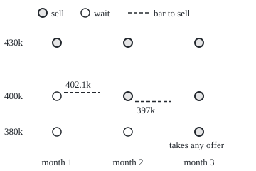
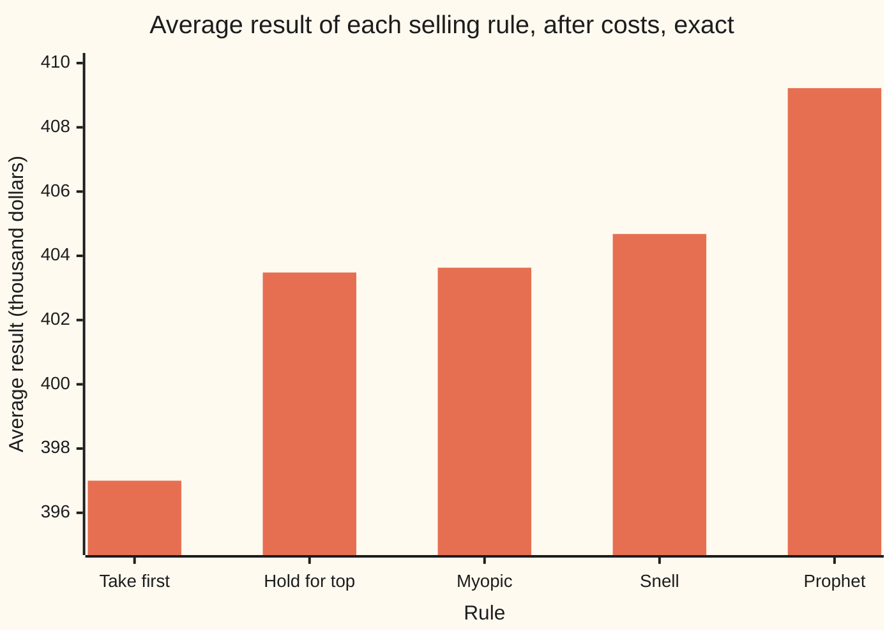
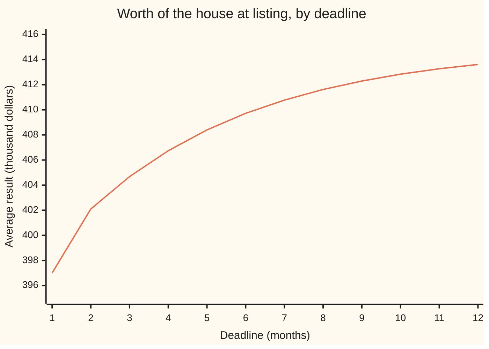

# Optimal stopping: when to stop a process to maximise an expected reward

[Syllabus](../../../SYLLABUS.md) → [Stochastic processes and calculus](../README.md) → [Generators, Densities and Simulation](../README.md#s08) → Optimal stopping

---

## General Overview

A house goes on the market. One serious offer arrives each month, for three months. Each offer is $380,000, $400,000 or $430,000, with chances 30%, 50% and 20%, and this month's offer says nothing about next month's. An offer must be taken or turned down on the spot; a refused buyer does not come back. Every month unsold costs $3,000 in mortgage, tax and upkeep. If the house is still unsold in month 3, the seller takes whatever comes.

Each month the seller faces one question: sell now, or wait? Waiting is a gamble with a cost. A $400,000 offer in month 1 is good, but a $430,000 offer may follow. The question has an exact answer. Work backwards from month 3, and at each month compare the offer in hand with the value of waiting. The best rule turns out to be: in month 1, sell only at $430,000; in month 2, sell at $400,000 or more; in month 3, sell. That rule is worth $404,680 on average, after costs. No other rule that decides from the offers seen so far does as well.

The table of "what the house is worth to the seller, given what has been seen" is the **Snell envelope**, named after J. Laurie Snell, who set out its theory in 1952. This card defines it, proves it is the smallest **supermartingale** (a game that is fair or falling on average) that always sits at or above the reward on offer, and shows that stopping the first time the reward reaches it is the best rule there is.

**Work backwards from the deadline, valuing each state as the better of stopping now and the average value of carrying on; the result is the smallest supermartingale above the reward, and stopping when the two meet is optimal.**

**What kind of fact this is:** a definition (the Snell envelope) and a theorem about it, proved on this card in Why it works.

### The picture: the decision at every month and offer

<p align="center"></p>

Drawn to scale: months across, offers up, heights in proportion to the dollar amounts. A shaded circle means sell, an open circle means wait. The dashed bar is the offer needed to sell: $402,100 in month 1, $397,000 in month 2, and nothing at all in month 3, when any offer is taken. The bar falls because fewer chances remain to beat the offer in hand.

---

## The formula

Notation first, in words. Months are numbered n = 1, 2, 3, and the deadline is N = 3. The offer in month n is $X_n$. The **reward** $Z_n$ is what selling in month n leaves the seller: the offer minus the costs paid so far, $Z_n = X_n - c\,n$ with $c$ = $3,000. What is known in month n is $\mathcal{F}_n$, the filtration from the first shelf of this wing: here, the offers of months 1 to n. A **stopping rule** is a stopping time $\tau$ ([Stopping times](../02-Martingales/03-stopping-times-and-optional-stopping.md)): a month to sell that can be recognised when it arrives, from the offers seen so far.

The **Snell envelope** $U_n$ is defined backwards from the deadline:

$$U_N = Z_N, \qquad U_n = \max\big(Z_n,\; E[U_{n+1} \mid \mathcal{F}_n]\big) \quad \text{for } n = N-1, \dots, 1.$$

**Read it aloud:** on the last month the house is worth its reward; on any earlier month it is worth the better of selling now and the average worth of waiting one more month, given what is known.

The second term has its own name. The **wait value** is $C_n = E[U_{n+1} \mid \mathcal{F}_n]$. Month 0 has no offer, so the house at listing is worth the wait value alone: $U_0 = C_0 = E[U_1]$.

The theorem has three parts.

$$U_0 = \max_{\tau} E[Z_\tau], \qquad \tau^* = \min\{\, n \ge 1 : U_n = Z_n \,\} \text{ attains it},$$

and $U_n$ is the smallest **supermartingale** above the reward: any process $Y_n$ with $Y_n \ge Z_n$ and $E[Y_{n+1} \mid \mathcal{F}_n] \le Y_n$ at every month has $Y_n \ge U_n$ at every month. A supermartingale is a game whose best forecast of tomorrow is today or lower ([Martingales](../02-Martingales/01-martingales.md)).

**Read it aloud:** the envelope at listing is the best average reward any honest rule (one that decides from the past only) can earn, the rule "sell the first time the reward equals the envelope" earns it, and nothing smaller than the envelope can be fair-or-falling while covering the reward.

In the example, $U_0$ = $404,680.

| Symbol | Plain meaning | In our example | Push it up and the answer… |
| --- | --- | --- | --- |
| $n$, $N$ | the month; the deadline month | n = 1, 2, 3; N = 3 | a later deadline raises $U_0$ |
| $X_n$ | the offer in month n | $380,000, $400,000 or $430,000 | raising every offer by $1 raises $U_0$ by $1 |
| $c$ | holding cost per month | $3,000 | the bar to sell falls; $U_0$ falls |
| $Z_n$ | reward for selling in month n: offer minus costs so far | $427,000 for $430,000 in month 1 | — |
| $\mathcal{F}_n$ | what is known in month n | the offers of months 1 to n | — |
| $\tau$, $\tau^*$ | a stopping rule; the best one | $\tau^*$ sells in month 2 on a $400,000 offer | — |
| $U_n$, $U_0$, $U_1$ | the Snell envelope: worth of the unsold house to the seller | $U_1$ = $399,100 after a $380,000 offer | — |
| $C_n$, $C_1$, $C_2$ | wait value: average of next month's envelope | $C_1$ = $399,100, $C_2$ = $391,000 | a higher wait value means more waiting |
| $Y_n$, $Y$ | any supermartingale at or above the reward | the prophet's process, $409,222 at listing | — |
| $E[\,\cdot \mid \mathcal{F}_n]$ | the average given what is known in month n | weights 0.3, 0.5, 0.2 on next month's offer | — |
| $V_k$, $k$, $V$, $V_1$, $V_2$, $V_3$ | best average result with k offers still to come | $V_1$ = $397,000, $V_2$ = $402,100 | grows with k toward $415,000 |

### When it holds

- **A fixed deadline.** The recursion starts at month N. With no deadline it has nowhere to start, and a best rule may not exist: a buyer who raises the bid each month toward $430,000, with no holding cost, is always worth waiting for, and waiting forever sells nothing.
- **Rules that use only the past.** The maximum is over stopping times. A prophet who sees all three offers in advance averages $409,222, more than any honest rule.
- **Rewards with finite averages.** Each $Z_n$ needs a finite average, so the conditional averages exist. Here the rewards are bounded.
- **The chances are right.** The wait values are averages under the stated chances. With wrong chances the arithmetic is still exact, but the rule is wrong for the real market.
- **Independence is not needed.** The recursion works on any tree of outcomes. Independent offers only make the wait value depend on the month alone, so each month has one bar.

---

## Why it works

### Step 0: on the last month there is nothing to decide

In month 3 the seller must sell, so the house is worth its reward. In month 2 the seller knows the month-3 worth on every branch, so the worth of waiting is an average of known numbers. Compare it with the offer in hand, keep the larger, and month 2 is solved. Repeat for month 1. Each step uses only a number already computed, so the whole tree is solved from the end.

### Step 1: the recursion, run on the house

Month 3: the rewards are $371,000, $391,000 and $421,000. Their average is the month-2 wait value, $391,000. Month 2: a $380,000 offer leaves $374,000, less than $391,000, so wait; $400,000 leaves $394,000, so sell. Month 1: the wait value is $399,100, so only the $430,000 offer, leaving $427,000, is taken. The full arithmetic is in Worked numbers.

### Step 2: the envelope is a supermartingale at or above the reward

By definition, $U_n$ is the larger of $Z_n$ and $C_n$. So $U_n \ge Z_n$: the envelope always covers selling now. And $U_n \ge C_n = E[U_{n+1} \mid \mathcal{F}_n]$: the forecast of next month's envelope is never above this month's. That is the supermartingale condition. Read in the world: the worth of the house to the seller drifts down on average, because each month costs $3,000 and uses up one chance.

### Step 3: it is the smallest such process

Take any process $Y_n$ that covers the reward and is a supermartingale. At the deadline, $Y_N \ge Z_N = U_N$. Suppose $Y_{n+1} \ge U_{n+1}$ on every branch. Averages keep order, so $E[Y_{n+1} \mid \mathcal{F}_n] \ge C_n$, and $Y_n$ is at least that forecast. $Y_n$ also covers $Z_n$. So $Y_n$ is at least the larger of the two, which is $U_n$. Backward induction carries this to month 0.

The code checks this from the other side. Lower the envelope by $1 at any one of the 40 points of the tree (listing, then 3, 9 and 27 offer histories), and it either drops below the reward there or breaks the supermartingale condition. It fails at all 40.

### Step 4: no stopping rule beats the envelope

Take any stopping rule $\tau$. Selling at $\tau$ earns $Z_\tau$, which is at most $U_\tau$. The envelope is a supermartingale, and $\tau$ comes by month 3. Optional stopping, in its supermartingale form, says the average of a fair-or-falling game at a bounded stopping time is at most its starting value. So the average reward is at most $U_0$ = $404,680.

### Step 5: the rule "sell when the reward meets the envelope" attains it

Let $\tau^*$ be the first month with $U_n = Z_n$. Before $\tau^*$, the envelope equals the wait value: it is exactly the average of next month's envelope. So up to $\tau^*$ the envelope is a fair game, a martingale, and optional stopping now gives equality: the average of $U_{\tau^*}$ is $U_0$. At $\tau^*$, the envelope equals the reward. So the average reward of $\tau^*$ is $U_0$ = $404,680.

<details>
<summary>Detailed proof</summary>

**Setting.** A filtration $\mathcal{F}_0 \subseteq \dots \subseteq \mathcal{F}_N$. Rewards $Z_1, \dots, Z_N$, each determined by $\mathcal{F}_n$ with $E|Z_n| < \infty$. Define $U_N = Z_N$, $U_n = \max(Z_n, E[U_{n+1} \mid \mathcal{F}_n])$ for $1 \le n < N$, and $U_0 = E[U_1 \mid \mathcal{F}_0]$. Each $U_n$ is integrable, since $|U_n| \le |Z_n| + E[|U_{n+1}| \mid \mathcal{F}_n]$, and determined by $\mathcal{F}_n$.

**(a) Supermartingale above Z.** $U_n \ge Z_n$ and $U_n \ge E[U_{n+1} \mid \mathcal{F}_n]$ almost surely, from the definition.

**(b) Smallest.** Let $Y$ be adapted, integrable, $Y_n \ge Z_n$ and $Y_n \ge E[Y_{n+1} \mid \mathcal{F}_n]$. Then $Y_N \ge U_N$. If $Y_{n+1} \ge U_{n+1}$ almost surely, monotonicity of conditional expectation (wing 10) gives $Y_n \ge E[Y_{n+1} \mid \mathcal{F}_n] \ge E[U_{n+1} \mid \mathcal{F}_n]$, and with $Y_n \ge Z_n$, $Y_n \ge U_n$. Induct down to n = 1; at n = 0 the same monotonicity gives $Y_0 \ge U_0$.

**(c) Optional stopping for a supermartingale.** For a stopping time $1 \le \tau \le N$, write $U_\tau = U_1 + \sum_{k=2}^{N} \mathbf{1}_{\{\tau \ge k\}}(U_k - U_{k-1})$. The event $\{\tau \ge k\}$ is the complement of $\{\tau \le k-1\}$, so it lies in $\mathcal{F}_{k-1}$. Taking out what is known, $E[\mathbf{1}_{\{\tau \ge k\}}(U_k - U_{k-1}) \mid \mathcal{F}_{k-1}] = \mathbf{1}_{\{\tau \ge k\}}(E[U_k \mid \mathcal{F}_{k-1}] - U_{k-1}) \le 0$, because the indicator is 0 or 1. By the tower property each term has mean at most 0, so $E[U_\tau] \le E[U_1] = U_0$. With $Z_\tau \le U_\tau$, $E[Z_\tau] \le U_0$.

**(d) Attained.** Let $\tau^* = \min\{n \ge 1 : U_n = Z_n\}$; it is at most N because $U_N = Z_N$, and $\{\tau^* \le n\}$ is decided by $U_1, Z_1, \dots, U_n, Z_n$, all known at n, so it is a stopping time. On $\{\tau^* \ge k\}$, the month $k-1$ is before the stop, so $U_{k-1} > Z_{k-1}$ and hence $U_{k-1} = E[U_k \mid \mathcal{F}_{k-1}]$. Each term in (c) then has conditional mean exactly 0, so $E[U_{\tau^*}] = U_0$, and $U_{\tau^*} = Z_{\tau^*}$ gives $E[Z_{\tau^*}] = U_0$.

**(e) Conclusion.** (c) and (d) give $U_0 = \max_\tau E[Z_\tau]$, with the maximum attained at $\tau^*$. The same argument started at month n gives $U_n = \max E[Z_\tau \mid \mathcal{F}_n]$ over stopping times $\tau$ with $n \le \tau \le N$: the envelope is the best the seller can still do from where things stand.

</details>

### Another road: try every rule

The tree is small enough to search outright. A rule says, for each month-1 offer, either sell or wait; if wait, it says for each month-2 offer sell or wait; month 3 always sells. That gives 9 choices for each of 3 month-1 offers: 729 stopping rules in all. The code scores every one over all 27 offer paths. The best scores exactly $404,680, and exactly one rule attains it, the envelope's. Each extra month cubes the number of rules (one more than the previous count, cubed), while backward induction grows only linearly in the number of points of the tree; that is why the recursion matters. The same backward step in continuous time becomes a condition on the generator, [The generator](01-infinitesimal-generator.md), inside the region where waiting is right.

---

## Worked numbers, by hand

| Step | Arithmetic | Value |
| --- | --- | --- |
| month-3 rewards | 380,000 − 9,000; 400,000 − 9,000; 430,000 − 9,000 | $371,000, $391,000, $421,000 |
| month-2 wait value $C_2$ | 0.3 × 371,000 + 0.5 × 391,000 + 0.2 × 421,000 | $391,000 |
| month-2 rewards | 374,000; 394,000; 424,000 | — |
| month-2 envelope | max(374,000, 391,000); max(394,000, 391,000); max(424,000, 391,000) | $391,000, $394,000, $424,000 |
| month-1 wait value $C_1$ | 0.3 × 391,000 + 0.5 × 394,000 + 0.2 × 424,000 | $399,100 |
| month-1 rewards | 377,000; 397,000; 427,000 | — |
| month-1 envelope | max(377,000, 399,100); max(397,000, 399,100); max(427,000, 399,100) | $399,100, $399,100, $427,000 |
| **worth at listing $U_0$** | 0.3 × 399,100 + 0.5 × 399,100 + 0.2 × 427,000 | **$404,680** |

The seller who follows the rule sells in month 1 with chance 20%, month 2 with chance 56% and month 3 with chance 24%. That is 2.04 months on the market on average, paying 2.04 × 3,000 = $6,120 in costs. The average sale price is $410,800, and 410,800 − 6,120 = $404,680.

The $400,000 offer in month 1 is turned down, though it equals the average offer. Turning it down costs a month's $3,000, but the right to see one more offer, and then decide again, is worth $2,100 more than selling.

### What breaks if you drop a piece

| Mistake | Comes out at | What went wrong |
| --- | --- | --- |
| Myopic: sell when the reward beats next month's average reward | $403,630 | compares with $394,000 in month 1, forgetting the chance to wait again; sells $400,000 too early |
| Hold out for $430,000 until month 3 | $403,480 | turns down $400,000 in month 2, paying $3,000 for a 20% chance |
| Take the first offer | $397,000 | ignores the value of waiting entirely |
| Prophet: pick the best of the three offers after seeing all | $409,222 | not a stopping time: decides in month 1 using months 2 and 3 |
| No deadline, no cost, bids rising $400,000, $415,000, $420,000, $422,500, … | best $430,000, never reached | no last month to start from; every month waiting beats selling, so no best rule exists |

The rising bids follow 430,000 − 30,000/n: $427,500 by month 12 and $429,700 by month 100, never $430,000.



Bars from left: take the first offer, hold out for $430,000, the myopic rule, the envelope's rule, and the prophet, who is not playing by the rules. The envelope's rule is the tallest bar among honest rules; the prophet's bar is the price of not seeing the future, $4,542.

---

## How the bar moves with the deadline

A seller with more months has more chances, so each month's bar is higher. With independent offers there is a shortcut: the best average result with k offers still to come, $V_k$, measured from the month before the first of them. One offer to come: its average minus a month's cost, $V_1$ = 400,000 − 3,000 = $397,000. With k offers to come, take the next offer if it beats $V_{k-1}$, else wait: $V_k = E[\max(X, V_{k-1})] - c$. Three offers give $V_3$ = $404,680, the envelope's answer by a second route. The bar in month n is $V$ for the months left after it: $V_2$ = $402,100 in month 1, $V_1$ = $397,000 in month 2.



The line is $V_k$ for deadlines of 1 to 12 months. It rises and flattens: $414,904.81 at 24 months, $414,999.97 at 60. The limit solves $V = E[\max(X, V)] - c$. For V between $400,000 and $430,000 that reads V = 0.8 V + 0.2 × 430,000 − 3,000, so V = $415,000. With no deadline at all, the seller turns down everything but $430,000, every month. Here a best rule exists, because the cost makes endless waiting expensive; the rising-bid case above shows it need not.

---

## Code, from first principles, and it actually runs

Three independent roads reach $404,680. Road 1 runs the backward recursion on the full tree of 40 points in exact whole dollars. Road 2 scores all 729 stopping rules over all 27 paths and takes the best. Road 3 simulates 100,000 sellers following the envelope's rule, with a SplitMix64 generator written out and seed 20260930, and prints the mean with its standard error. The code also checks the supermartingale and minimality claims, scores the other rules, computes the prophet's process as a second supermartingale above the reward, and runs the deadline shortcut and its limit.

### Python

```python
# Optimal stopping and the Snell envelope -- the check behind the card.  Standard library only.
# Selling a house: one offer a month for 3 months, 380,000, 400,000 or 430,000 dollars with
# chances 0.3, 0.5, 0.2, independent month to month.  Holding the house costs 3,000 dollars a
# month; the month-3 offer must be taken.  Three roads to the best average result: backward
# induction on the tree (the Snell envelope), brute force over every stopping rule, simulation.
from math import sqrt

X, WT, COST, N = [380000, 400000, 430000], [3, 5, 2], 3000, 3   # offers, chances in tenths
MASK = (1 << 64) - 1

def splitmix(s):                                  # SplitMix64: new state and 64 random bits
    s = (s + 0x9E3779B97F4A7C15) & MASK
    z = ((s ^ (s >> 30)) * 0xBF58476D1CE4E5B9) & MASK
    z = ((z ^ (z >> 27)) * 0x94D049BB133111EB) & MASK
    return s, z ^ (z >> 31)

def nodes(n):                                     # every history of n offers, as index tuples
    out = [()]
    for _ in range(n): out = [h + (i,) for h in out for i in range(3)]
    return out

def Z(h): return X[h[-1]] - COST * len(h)        # reward for selling now: offer minus costs
def avg(vals):                                    # E[ . | F_n] over the three next offers
    t = sum(w * v for w, v in zip(WT, vals)); assert t % 10 == 0; return t // 10

# Road 1: the Snell envelope, backward from month 3.  C = value of waiting one more month.
U, C = {}, {}
for n in range(N, -1, -1):
    for h in nodes(n):
        if n < N: C[h] = avg([U[h + (i,)] for i in range(3)])
        U[h] = Z(h) if n == N else (C[h] if n == 0 else max(Z(h), C[h]))

def is_envelope_above(V):                         # V >= Z everywhere, and V >= E[next V]
    dom = all(V[h] >= Z(h) for n in range(1, N + 1) for h in nodes(n))
    sup = all(10 * V[h] >= sum(w * V[h + (i,)] for i, w in enumerate(WT)) for n in range(N) for h in nodes(n))
    return dom and sup

paths = nodes(N)
def weight(p):
    r = 1
    for i in p: r *= WT[i]
    return r
def value(stop):                                  # 1000 x expected reward of a rule, all 27 paths
    tot = 0
    for p in paths:
        n = next(k for k in range(1, N + 1) if k == N or stop(p[:k]))
        tot += weight(p) * Z(p[:n])
    return tot

snell_rule = lambda h: U[h] == Z(h)
# Road 2: every stopping rule.  For each month-1 offer: sell (0), or wait and choose, for each
# month-2 offer, sell or wait (1 + 3-bit mask).  9 choices for each of 3 offers: 729 rules.
best, nbest, count, snell_seen = None, 0, 0, False
for code in range(9 ** 3):
    ch = [(code // 9 ** i) % 9 for i in range(3)]
    stop = lambda h, ch=ch: ch[h[0]] == 0 if len(h) == 1 else (((ch[h[0]] - 1) >> h[1]) & 1) == 1
    v = value(stop); count += 1
    if best is None or v > best: best, nbest = v, 0
    if v == best: nbest += 1
    if all(stop(h) == snell_rule(h) for n in (1, 2) for h in nodes(n) if n == 1 or not snell_rule(h[:1])): snell_seen = v
assert best == 1000 * U[()]                       # road 1 = road 2, exact dollars
assert nbest == 1                                 # exactly one rule attains the best value ...
assert snell_seen == best                         # ... and it is the envelope's rule
assert is_envelope_above(U)
lowered = 0
for n in range(N + 1):
    for h in nodes(n):
        V = dict(U); V[h] -= 1; lowered += not is_envelope_above(V)
assert lowered == 40                              # lower U by 1 dollar anywhere and it fails
prophet = {h: sum(weight(p[len(h):]) * max(Z(p[:k]) for k in range(max(1, len(h)), N + 1))
                  for p in paths if p[:len(h)] == h) // 10 ** (N - len(h)) for n in range(N + 1) for h in nodes(n)}
assert is_envelope_above(prophet)                 # another supermartingale above Z ...
assert all(prophet[h] >= U[h] for h in prophet)   # ... sits above U at every node
print(f"house: offers {X[0]} / {X[1]} / {X[2]} dollars, chances {WT[0] / 10} / {WT[1] / 10} / {WT[2] / 10}, cost {COST} a month")
print(f"Snell value U_0, backward induction    {U[()]}")
print(f"best of {count} stopping rules, brute force {best // 1000}  (rules attaining it: {nbest})")
for n in (1, 2, 3):
    h = (0,) * (n - 1)
    row = "  ".join(f"{X[i]}->{'sell' if snell_rule(h + (i,)) else 'wait'} U={U[h + (i,)]}" for i in range(3))
    print(f"month {n}: wait value {C[h + (0,)] if n < N else '-'}  {row}")
print(f"supermartingale and above Z at all nodes: {is_envelope_above(U)}; lowered by 1 dollar and broken at {lowered} of 40 nodes")
print(f"prophet's process (sees all offers) at month 0: {prophet[()]}, at least U at all 40 nodes")

rules = [("Snell rule", snell_rule), ("myopic: sell if Z_n >= E[Z_n+1]", lambda h: Z(h) >= avg(X) - COST * (len(h) + 1)),
         ("hold out for 430000", lambda h: h[-1] == 2), ("take the first offer", lambda h: True)]
for name, r in rules: print(f"rule value  {name:34s} {value(r) // 1000}  chart {value(r) / 1e6:.2f}")
print(f"rule value  {'prophet (not a stopping time)':34s} {prophet[()]}  chart {prophet[()] / 1000:.2f}")
when = [sum(weight(p) for p in paths if next(k for k in range(1, 4) if k == 3 or snell_rule(p[:k])) == m) for m in (1, 2, 3)]
etau = sum(m * w for m, w in zip((1, 2, 3), when))       # 1000 x E[tau]
price = sum(weight(p) * X[p[next(k for k in range(1, 4) if k == 3 or snell_rule(p[:k])) - 1]] for p in paths)
assert price == 1000 * U[()] + COST * etau               # price = net value + costs paid
print(f"Snell rule sells in month 1/2/3 with chance {when[0] / 1000:.2f} / {when[1] / 1000:.2f} / {when[2] / 1000:.2f}; E[tau] {etau / 1000:.2f} months; E[price] {price // 1000}")
print(f"rewards Z_n = offer - {COST} n, months 1/2/3: " + "; ".join(" ".join(str(X[i] - COST * n) for i in range(3)) for n in (1, 2, 3)))
print(f"gaps: waiting on 400000 in month 1 beats selling by {U[(1,)] - Z((1,))}; prophet minus Snell {prophet[()] - U[()]}; average costs paid {COST * etau // 1000}")

# Road 3: simulation of sellers using the envelope's rule.
P, seed, s = 100000, 20260930, 20260930
tot, tot2, ntau, ntau2, nprice, nprice2 = 0, 0, 0, 0, 0, 0
for j in range(P):
    h = ()
    while True:
        s, z = splitmix(s); u = (z >> 11) / 9007199254740992.0
        h += (0 if u < WT[0] / 10 else (1 if u < (WT[0] + WT[1]) / 10 else 2),)
        if len(h) == N or snell_rule(h): break
    r = Z(h); tot += r; tot2 += r * r; ntau += len(h); nprice += X[h[-1]]
    ntau2 += len(h) * len(h); nprice2 += X[h[-1]] * X[h[-1]]
m = tot / P; se = sqrt((tot2 / P - m * m) / P)
mt, mp = ntau / P, nprice / P; se_t, se_p = sqrt((ntau2 / P - mt * mt) / P), sqrt((nprice2 / P - mp * mp) / P)
assert abs(m - U[()]) < 4 * se
print(f"simulation, {P} sellers, seed {seed}: mean {m:.2f}  se {se:.2f}  mean month {mt:.4f}  se {se_t:.4f}  mean price {mp:.2f}  se {se_p:.2f}")

# The deadline: V_k = best value with k offers to come (iid shortcut), then the limit with none.
vk, VK = 0.0, []
for k in range(1, 61):
    vk = sum(c / 10 * x for c, x in zip(WT, X)) - COST if k == 1 else sum(c / 10 * max(x, vk) for c, x in zip(WT, X)) - COST
    VK.append(vk)
assert abs(VK[2] - U[()]) < 1e-6                   # iid shortcut = full tree
lim = (WT[2] / 10 * X[2] - COST) / (1 - (WT[0] + WT[1]) / 10)   # fixed point between 400000 and 430000
assert X[1] <= lim <= X[2] and abs(VK[59] - lim) < 1.0
print("chart, deadline months  " + " ".join(f"{k:7d}" for k in range(1, 13)))
print("chart, value (thousand) " + " ".join(f"{VK[k - 1] / 1000:7.2f}" for k in range(1, 13)))
print(f"deadline 24: {VK[23]:.2f}  deadline 60: {VK[59]:.2f}  no deadline (fixed point): {lim:.2f}")
print("no deadline, no cost, bids 430000 - 30000/n: " + " ".join(f"n={n}:{430000 - 30000 // n}" for n in (1, 2, 3, 4, 12, 100)) + "; sup 430000, never reached")
fy = lambda x: 210 - (x - 370000) / 400
print("figure, node x " + " ".join(str(80 + 100 * (n - 1)) for n in (1, 2, 3)) + "; node y " + " ".join(f"{fy(x):.1f}" for x in X)
      + f"; bar y {fy(VK[1]):.2f} {fy(VK[0]):.2f}")
```

**Ran 2026-10-07 on macOS, Python 3.14.6, standard library only. All checks passed. Output, pasted from the run:**

```
house: offers 380000 / 400000 / 430000 dollars, chances 0.3 / 0.5 / 0.2, cost 3000 a month
Snell value U_0, backward induction    404680
best of 729 stopping rules, brute force 404680  (rules attaining it: 1)
month 1: wait value 399100  380000->wait U=399100  400000->wait U=399100  430000->sell U=427000
month 2: wait value 391000  380000->wait U=391000  400000->sell U=394000  430000->sell U=424000
month 3: wait value -  380000->sell U=371000  400000->sell U=391000  430000->sell U=421000
supermartingale and above Z at all nodes: True; lowered by 1 dollar and broken at 40 of 40 nodes
prophet's process (sees all offers) at month 0: 409222, at least U at all 40 nodes
rule value  Snell rule                         404680  chart 404.68
rule value  myopic: sell if Z_n >= E[Z_n+1]    403630  chart 403.63
rule value  hold out for 430000                403480  chart 403.48
rule value  take the first offer               397000  chart 397.00
rule value  prophet (not a stopping time)      409222  chart 409.22
Snell rule sells in month 1/2/3 with chance 0.20 / 0.56 / 0.24; E[tau] 2.04 months; E[price] 410800
rewards Z_n = offer - 3000 n, months 1/2/3: 377000 397000 427000; 374000 394000 424000; 371000 391000 421000
gaps: waiting on 400000 in month 1 beats selling by 2100; prophet minus Snell 4542; average costs paid 6120
simulation, 100000 sellers, seed 20260930: mean 404737.58  se 56.71  mean month 2.0421  se 0.0021  mean price 410864.00  se 52.85
chart, deadline months        1       2       3       4       5       6       7       8       9      10      11      12
chart, value (thousand)  397.00  402.10  404.68  406.74  408.40  409.72  410.77  411.62  412.29  412.84  413.27  413.61
deadline 24: 414904.81  deadline 60: 414999.97  no deadline (fixed point): 415000.00
no deadline, no cost, bids 430000 - 30000/n: n=1:400000 n=2:415000 n=3:420000 n=4:422500 n=12:427500 n=100:429700; sup 430000, never reached
figure, node x 80 180 280; node y 185.0 135.0 60.0; bar y 129.75 142.50
```

### Rust

```rust
// Optimal stopping and the Snell envelope -- the check behind the card.  Rust std only.
// Selling a house: one offer a month for 3 months, 380,000, 400,000 or 430,000 dollars with
// chances 0.3, 0.5, 0.2, independent month to month.  Holding the house costs 3,000 dollars a
// month; the month-3 offer must be taken.  Three roads to the best average result: backward
// induction on the tree (the Snell envelope), brute force over every stopping rule, simulation.
use std::collections::HashMap;

const X: [i64; 3] = [380000, 400000, 430000];
const WT: [i64; 3] = [3, 5, 2]; // chances in tenths
const COST: i64 = 3000;
const N: usize = 3;
type H = Vec<usize>;

fn splitmix(s: &mut u64) -> u64 {
    *s = s.wrapping_add(0x9E3779B97F4A7C15);
    let mut z = (*s ^ (*s >> 30)).wrapping_mul(0xBF58476D1CE4E5B9);
    z = (z ^ (z >> 27)).wrapping_mul(0x94D049BB133111EB);
    z ^ (z >> 31)
}
fn nodes(n: usize) -> Vec<H> {
    let mut out: Vec<H> = vec![vec![]];
    for _ in 0..n {
        out = out.iter().flat_map(|h| (0..3).map(move |i| { let mut g = h.clone(); g.push(i); g })).collect();
    }
    out
}
fn z(h: &[usize]) -> i64 { X[h[h.len() - 1]] - COST * h.len() as i64 } // offer minus costs
fn ext(h: &[usize], i: usize) -> H { let mut g = h.to_vec(); g.push(i); g }
fn wsum(v: &HashMap<H, i64>, h: &[usize]) -> i64 { (0..3).map(|i| WT[i] * v[&ext(h, i)]).sum() }
fn is_envelope_above(v: &HashMap<H, i64>) -> bool {
    let dom = (1..=N).all(|n| nodes(n).iter().all(|h| v[h] >= z(h)));
    let sup = (0..N).all(|n| nodes(n).iter().all(|h| 10 * v[h] >= wsum(v, h)));
    dom && sup
}
fn weight(p: &[usize]) -> i64 { p.iter().map(|&i| WT[i]).product() }
fn stop_month(p: &[usize], stop: &dyn Fn(&[usize]) -> bool) -> usize {
    (1..=N).find(|&k| k == N || stop(&p[..k])).unwrap()
}
fn value(paths: &[H], stop: &dyn Fn(&[usize]) -> bool) -> i64 { // 1000 x expected reward
    paths.iter().map(|p| weight(p) * z(&p[..stop_month(p, stop)])).sum()
}

fn main() {
    // Road 1: the Snell envelope, backward from month 3.  C = value of waiting one more month.
    let (mut u, mut c): (HashMap<H, i64>, HashMap<H, i64>) = (HashMap::new(), HashMap::new());
    for n in (0..=N).rev() {
        for h in nodes(n) {
            if n < N { let t = wsum(&u, &h); assert!(t % 10 == 0); c.insert(h.clone(), t / 10); }
            let val = if n == N { z(&h) } else if n == 0 { c[&h] } else { z(&h).max(c[&h]) };
            u.insert(h, val);
        }
    }
    let paths = nodes(N);
    let snell_rule = |h: &[usize]| u[h] == z(h);
    // Road 2: every stopping rule.  For each month-1 offer: sell (0), or wait and choose, for each
    // month-2 offer, sell or wait (1 + 3-bit mask).  9 choices for each of 3 offers: 729 rules.
    let (mut best, mut nbest, mut count, mut snell_seen) = (i64::MIN, 0, 0, 0);
    for code in 0..729usize {
        let ch: Vec<usize> = (0..3).map(|i| (code / 9usize.pow(i)) % 9).collect();
        let stop = |h: &[usize]| if h.len() == 1 { ch[h[0]] == 0 } else { ch[h[0]] > 0 && ((ch[h[0]] - 1) >> h[1]) & 1 == 1 || ch[h[0]] == 0 };
        let v = value(&paths, &stop);
        count += 1;
        if v > best { best = v; nbest = 0; }
        if v == best { nbest += 1; }
        let same = (1..=2).all(|n| nodes(n).iter().filter(|h| n == 1 || !snell_rule(&h[..1])).all(|h| stop(h) == snell_rule(h)));
        if same { snell_seen = v; }
    }
    assert!(best == 1000 * u[&vec![]]); // road 1 = road 2, exact dollars
    assert!(nbest == 1); // exactly one rule attains the best value ...
    assert!(snell_seen == best); // ... and it is the envelope's rule
    assert!(is_envelope_above(&u));
    let mut lowered = 0;
    for n in 0..=N {
        for h in nodes(n) { let mut v = u.clone(); *v.get_mut(&h).unwrap() -= 1; if !is_envelope_above(&v) { lowered += 1; } }
    }
    assert!(lowered == 40); // lower U by 1 dollar anywhere and it fails
    let mut prophet: HashMap<H, i64> = HashMap::new();
    for n in 0..=N {
        for h in nodes(n) {
            let t: i64 = paths.iter().filter(|p| p[..n] == h[..])
                .map(|p| weight(&p[n..]) * (n.max(1)..=N).map(|k| z(&p[..k])).max().unwrap()).sum();
            prophet.insert(h, t / 10i64.pow((N - n) as u32));
        }
    }
    assert!(is_envelope_above(&prophet)); // another supermartingale above Z ...
    assert!(prophet.iter().all(|(h, v)| *v >= u[h])); // ... sits above U at every node
    let root: H = vec![];
    println!("house: offers {} / {} / {} dollars, chances {} / {} / {}, cost {} a month", X[0], X[1], X[2],
        WT[0] as f64 / 10.0, WT[1] as f64 / 10.0, WT[2] as f64 / 10.0, COST);
    println!("Snell value U_0, backward induction    {}", u[&root]);
    println!("best of {} stopping rules, brute force {}  (rules attaining it: {})", count, best / 1000, nbest);
    for n in 1..=3usize {
        let h: H = vec![0; n - 1];
        let row: Vec<String> = (0..3).map(|i| format!("{}->{} U={}", X[i], if snell_rule(&ext(&h, i)) { "sell" } else { "wait" }, u[&ext(&h, i)])).collect();
        let wait = if n < N { c[&ext(&h, 0)].to_string() } else { "-".to_string() };
        println!("month {}: wait value {}  {}", n, wait, row.join("  "));
    }
    println!("supermartingale and above Z at all nodes: {}; lowered by 1 dollar and broken at {} of 40 nodes",
        if is_envelope_above(&u) { "True" } else { "False" }, lowered);
    println!("prophet's process (sees all offers) at month 0: {}, at least U at all 40 nodes", prophet[&root]);
    let rules: Vec<(&str, Box<dyn Fn(&[usize]) -> bool>)> = vec![
        ("Snell rule", Box::new(|h: &[usize]| snell_rule(h))),
        ("myopic: sell if Z_n >= E[Z_n+1]", Box::new(|h: &[usize]| z(h) >= (0..3).map(|i| WT[i] * X[i]).sum::<i64>() / 10 - COST * (h.len() as i64 + 1))),
        ("hold out for 430000", Box::new(|h: &[usize]| h[h.len() - 1] == 2)),
        ("take the first offer", Box::new(|_h: &[usize]| true)),
    ];
    for (name, r) in &rules {
        let v = value(&paths, r.as_ref());
        println!("rule value  {:<34} {}  chart {:.2}", name, v / 1000, v as f64 / 1e6);
    }
    println!("rule value  {:<34} {}  chart {:.2}", "prophet (not a stopping time)", prophet[&root], prophet[&root] as f64 / 1000.0);
    let when: Vec<i64> = (1..=3).map(|m| paths.iter().filter(|p| stop_month(p, &snell_rule) == m).map(|p| weight(p)).sum()).collect();
    let etau: i64 = (0..3).map(|m| (m as i64 + 1) * when[m]).sum(); // 1000 x E[tau]
    let price: i64 = paths.iter().map(|p| weight(p) * X[p[stop_month(p, &snell_rule) - 1]]).sum();
    assert!(price == 1000 * u[&root] + COST * etau); // price = net value + costs paid
    println!("Snell rule sells in month 1/2/3 with chance {:.2} / {:.2} / {:.2}; E[tau] {:.2} months; E[price] {}",
        when[0] as f64 / 1000.0, when[1] as f64 / 1000.0, when[2] as f64 / 1000.0, etau as f64 / 1000.0, price / 1000);

    let zs: Vec<String> = (1..=3i64).map(|n| (0..3).map(|i| (X[i] - COST * n).to_string()).collect::<Vec<_>>().join(" ")).collect();
    println!("rewards Z_n = offer - {} n, months 1/2/3: {}", COST, zs.join("; "));
    println!("gaps: waiting on 400000 in month 1 beats selling by {}; prophet minus Snell {}; average costs paid {}",
        u[&vec![1]] - z(&[1]), prophet[&root] - u[&root], COST * etau / 1000);

    // Road 3: simulation of sellers using the envelope's rule.
    let (p_n, seed) = (100000i64, 20260930u64);
    let mut s = seed;
    let (mut tot, mut tot2, mut ntau, mut ntau2, mut nprice, mut nprice2) = (0i64, 0i128, 0i64, 0i64, 0i64, 0i128);
    for _ in 0..p_n {
        let mut h: H = vec![];
        loop {
            let u01 = (splitmix(&mut s) >> 11) as f64 / 9007199254740992.0;
            h.push(if u01 < WT[0] as f64 / 10.0 { 0 } else if u01 < (WT[0] + WT[1]) as f64 / 10.0 { 1 } else { 2 });
            if h.len() == N || snell_rule(&h) { break; }
        }
        let r = z(&h);
        tot += r; tot2 += (r as i128) * (r as i128); ntau += h.len() as i64; nprice += X[h[h.len() - 1]];
        ntau2 += (h.len() * h.len()) as i64; nprice2 += (X[h[h.len() - 1]] as i128) * (X[h[h.len() - 1]] as i128);
    }
    let pf = p_n as f64;
    let m = tot as f64 / pf;
    let se = ((tot2 as f64 / pf - m * m) / pf).sqrt();
    let (mt, mp) = (ntau as f64 / pf, nprice as f64 / pf);
    let (se_t, se_p) = (((ntau2 as f64 / pf - mt * mt) / pf).sqrt(), ((nprice2 as f64 / pf - mp * mp) / pf).sqrt());
    assert!((m - u[&root] as f64).abs() < 4.0 * se);
    println!("simulation, {} sellers, seed {}: mean {:.2}  se {:.2}  mean month {:.4}  se {:.4}  mean price {:.2}  se {:.2}",
        p_n, seed, m, se, mt, se_t, mp, se_p);

    // The deadline: V_k = best value with k offers to come (iid shortcut), then the limit with none.
    let mut vk = 0.0f64;
    let mut vks: Vec<f64> = vec![];
    for k in 1..=60 {
        vk = if k == 1 { (0..3).map(|i| WT[i] as f64 / 10.0 * X[i] as f64).sum::<f64>() - COST as f64 }
            else { (0..3).map(|i| WT[i] as f64 / 10.0 * (X[i] as f64).max(vk)).sum::<f64>() - COST as f64 };
        vks.push(vk);
    }
    assert!((vks[2] - u[&root] as f64).abs() < 1e-6); // iid shortcut = full tree
    let lim = (WT[2] as f64 / 10.0 * X[2] as f64 - COST as f64) / (1.0 - (WT[0] + WT[1]) as f64 / 10.0);
    assert!(X[1] as f64 <= lim && lim <= X[2] as f64);
    assert!((vks[59] - lim).abs() < 1.0);
    let ks: Vec<String> = (1..=12).map(|k| format!("{:7}", k)).collect();
    let vs: Vec<String> = (1..=12).map(|k| format!("{:7.2}", vks[k - 1] / 1000.0)).collect();
    println!("chart, deadline months  {}", ks.join(" "));
    println!("chart, value (thousand) {}", vs.join(" "));
    println!("deadline 24: {:.2}  deadline 60: {:.2}  no deadline (fixed point): {:.2}", vks[23], vks[59], lim);
    let bids: Vec<String> = [1i64, 2, 3, 4, 12, 100].iter().map(|n| format!("n={}:{}", n, 430000 - 30000 / n)).collect();
    println!("no deadline, no cost, bids 430000 - 30000/n: {}; sup 430000, never reached", bids.join(" "));
    let fy = |x: f64| 210.0 - (x - 370000.0) / 400.0;
    let ny: Vec<String> = X.iter().map(|&x| format!("{:.1}", fy(x as f64))).collect();
    println!("figure, node x 80 180 280; node y {}; bar y {:.2} {:.2}", ny.join(" "), fy(vks[1]), fy(vks[0]));
}
```

**Ran 2026-10-07 on macOS, rustc 1.98.1, no crates. All checks passed. Output, pasted from the run:**

```
house: offers 380000 / 400000 / 430000 dollars, chances 0.3 / 0.5 / 0.2, cost 3000 a month
Snell value U_0, backward induction    404680
best of 729 stopping rules, brute force 404680  (rules attaining it: 1)
month 1: wait value 399100  380000->wait U=399100  400000->wait U=399100  430000->sell U=427000
month 2: wait value 391000  380000->wait U=391000  400000->sell U=394000  430000->sell U=424000
month 3: wait value -  380000->sell U=371000  400000->sell U=391000  430000->sell U=421000
supermartingale and above Z at all nodes: True; lowered by 1 dollar and broken at 40 of 40 nodes
prophet's process (sees all offers) at month 0: 409222, at least U at all 40 nodes
rule value  Snell rule                         404680  chart 404.68
rule value  myopic: sell if Z_n >= E[Z_n+1]    403630  chart 403.63
rule value  hold out for 430000                403480  chart 403.48
rule value  take the first offer               397000  chart 397.00
rule value  prophet (not a stopping time)      409222  chart 409.22
Snell rule sells in month 1/2/3 with chance 0.20 / 0.56 / 0.24; E[tau] 2.04 months; E[price] 410800
rewards Z_n = offer - 3000 n, months 1/2/3: 377000 397000 427000; 374000 394000 424000; 371000 391000 421000
gaps: waiting on 400000 in month 1 beats selling by 2100; prophet minus Snell 4542; average costs paid 6120
simulation, 100000 sellers, seed 20260930: mean 404737.58  se 56.71  mean month 2.0421  se 0.0021  mean price 410864.00  se 52.85
chart, deadline months        1       2       3       4       5       6       7       8       9      10      11      12
chart, value (thousand)  397.00  402.10  404.68  406.74  408.40  409.72  410.77  411.62  412.29  412.84  413.27  413.61
deadline 24: 414904.81  deadline 60: 414999.97  no deadline (fixed point): 415000.00
no deadline, no cost, bids 430000 - 30000/n: n=1:400000 n=2:415000 n=3:420000 n=4:422500 n=12:427500 n=100:429700; sup 430000, never reached
figure, node x 80 180 280; node y 185.0 135.0 60.0; bar y 129.75 142.50
```

The two outputs are identical. The simulated mean, $404,737.58 with standard error $56.71, is about one standard error from the exact $404,680; the simulated mean month, 2.0421 ± 0.0021, and mean price, $410,864.00 ± $52.85, sit within two standard errors of the exact 2.04 and $410,800.

> [!TIP]
> **Try changing**
> - **Set the cost `COST` to 0.** Guess first: does the rule still have one best version? No. In month 2 a $400,000 offer and waiting are worth the same, so several rules tie, and the assert that a single rule is best, `nbest == 1`, stops the run before anything prints. The envelope itself does not depend on how the tie is broken; only the choice of rule does.
> - **Raise `COST` to 10000.** Guess first: does the month-1 bar move up or down? Down. Waiting is dearer, so a $400,000 offer is taken in month 1, and the envelope at listing drops to $393,900. The run then stops at the assert on the no-deadline limit, as it should: with that cost the limit lies below $400,000, outside the range its one-line formula assumes.
> - **Change the chances `WT` to `[3, 6, 1]`.** Guess first: does the seller wait more or less? Less. The top offer is rarer, so the month-1 bar falls below $400,000 and the envelope at listing falls, to $399,460. Every assert still passes; the simulation draws its offers from `WT` too.
> - **Change the seed.** Guess first: does the simulated mean move? Yes, by about one standard error either way; the exact roads do not move at all.

---

## The usual mistake

> [!warning]
> **Comparing the offer with next month's average offer, instead of with the value of waiting.** Waiting buys more than next month's offer: it buys the right to decide again. The myopic rule takes $400,000 in month 1 because it beats next month's average reward, $394,000. The true comparison is with $399,100, which counts the chance of waiting once more. The myopic rule averages $403,630, short of $404,680.
>
> - **Treating the envelope as the sale price.** The envelope is net of costs. The average price is $410,800; the average result is $404,680.
> - **A fixed bar.** The bar falls from $402,100 to $397,000 to nothing, because fewer chances remain.
> - **Using the prophet as a target.** $409,222 needs the future. It is an upper bound, not a plan.
> - **Reading "supermartingale" as "always falls".** The envelope falls on average. After a $430,000 offer in month 1 it jumps from $404,680 to $427,000.

---

## Where you meet it in real life

- **American options.** The holder may exercise any day before expiry; the discounted price is the Snell envelope of the discounted payoff under the pricing measure, computed backwards on a tree in [Early exercise](../../12-Financial%20mathematics/04-Binomial%20Trees/05-american-exercise-on-a-tree.md). Being the smallest supermartingale above the discounted payoff is what makes it the cheapest price a seller can hedge.
- **Selling and searching.** House sales, job offers and asset sales without recall are the textbook case, where the bar is called the reservation price.
- **Hiring.** The secretary problem, interviewing candidates one at a time and choosing on the spot, is a stopping problem with the same backward solution.
- **Clinical trials and quality control.** A trial stops early for clear benefit or harm; a sequential test stops sampling once the evidence is enough. Both are rules decided from data seen so far.

> **Say it back**
> A stopping problem asks when to take a reward that arrives over time, using only what has been seen. Work backwards from the deadline: the worth at each point is the better of stopping now and the average worth of going on. That table is the Snell envelope, the smallest supermartingale at or above the reward. No honest rule averages more than its starting value, and stopping the first time the reward meets it averages exactly that. For the house, the rule sells only at $430,000 in month 1, at $400,000 or more in month 2, and is worth $404,680.

---

## What this builds on

- [Stopping times](../02-Martingales/03-stopping-times-and-optional-stopping.md): what an honest rule is, and the optional stopping argument used in Steps 4 and 5.
- [Martingale convergence](../02-Martingales/04-martingale-convergence.md): a supermartingale bounded below settles to a limit along each path; the general theory of stopping with no deadline rests on this, while this card meets that case only through the fixed point $V = E[\max(X, V)] - c$.

## Where this goes next

- [Early exercise](../../12-Financial%20mathematics/04-Binomial%20Trees/05-american-exercise-on-a-tree.md): the same recursion on a share-price tree, priced under the risk-neutral measure.
- [American options](../../12-Financial%20mathematics/15-American%20and%20Bermudan%20exercise/01-american-options-and-early-exercise.md): when early exercise pays, and the exercise boundary.
- Optimal stopping: the recursion as a Bellman equation, with states in place of paths.
- An American option: in continuous time the bar becomes a curve found with the solution.

The house has one bar per month because it has three dates and fixed chances; when the reward is a share price that moves at every instant and can be hedged, the bar becomes a boundary in price and time, and the American-option cards find it.

---

## Sources

Verified 2026-10-06: every link below resolves to the publisher's page.

- Snell, J. Laurie. "Applications of martingale system theorems." *Transactions of the American Mathematical Society* 73 (1952): 293–312. [doi:10.1090/S0002-9947-1952-0050209-9](https://doi.org/10.1090/S0002-9947-1952-0050209-9). The original envelope and its minimality.
- Ferguson, Thomas S. *Optimal Stopping and Applications*. UCLA. [Online text](https://www.math.ucla.edu/~tom/Stopping/Contents.html). Finite-horizon backward induction, selling an asset with and without recall (Section 4.1), prophet inequalities (Section 3.4).
- Williams, David. *Probability with Martingales*. Cambridge University Press, 1991. [Publisher page](https://www.cambridge.org/core/books/probability-with-martingales/B4CFCE0D08930FB46C6E93E775503926). Supermartingales and optional stopping in discrete time.
- Peskir, Goran, and Albert Shiryaev. *Optimal Stopping and Free-Boundary Problems*. Birkhäuser, 2006. [doi:10.1007/978-3-7643-7390-0](https://doi.org/10.1007/978-3-7643-7390-0). The discrete-time theory in full, and the passage to free boundaries.
